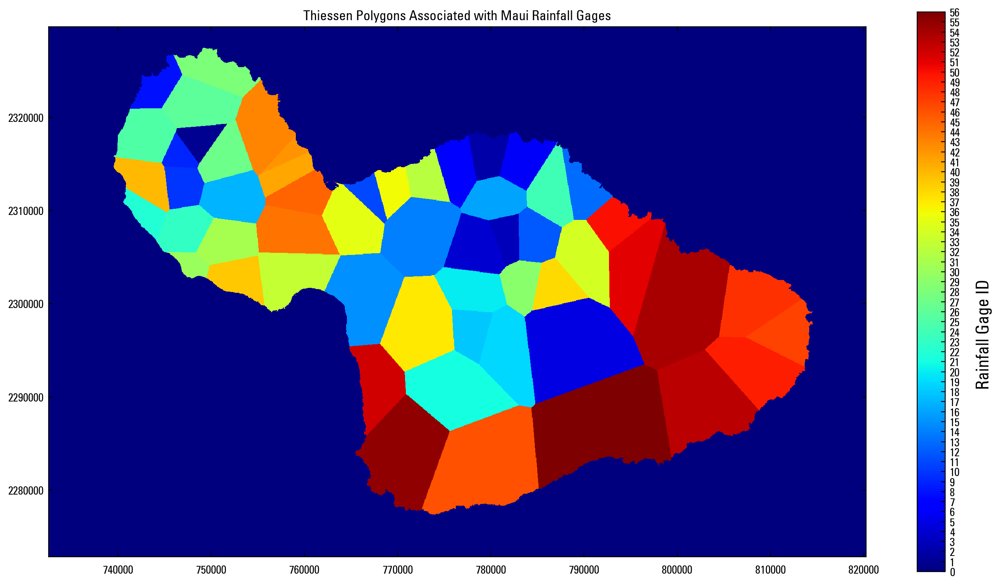
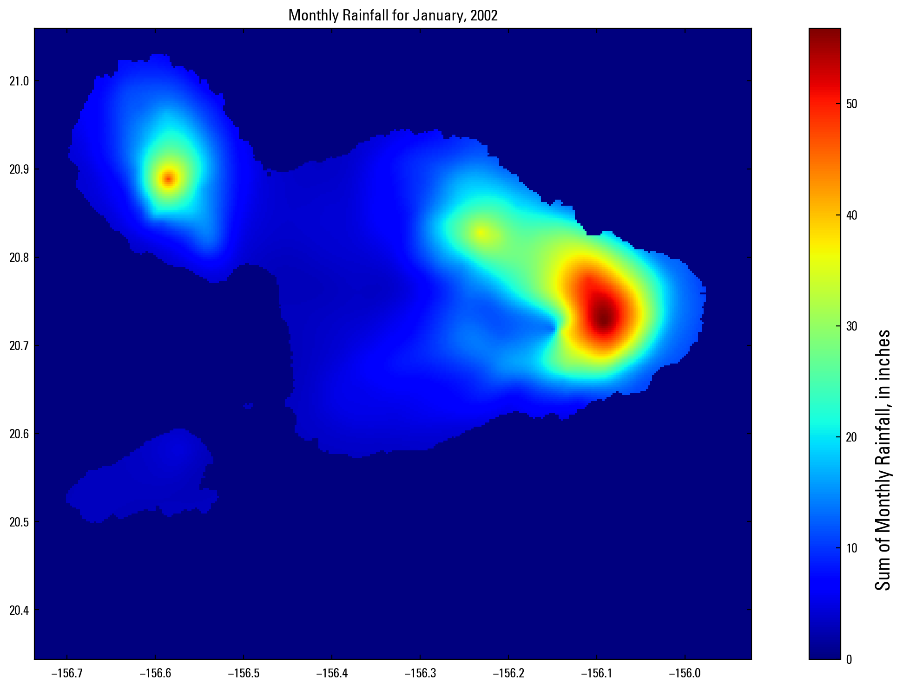
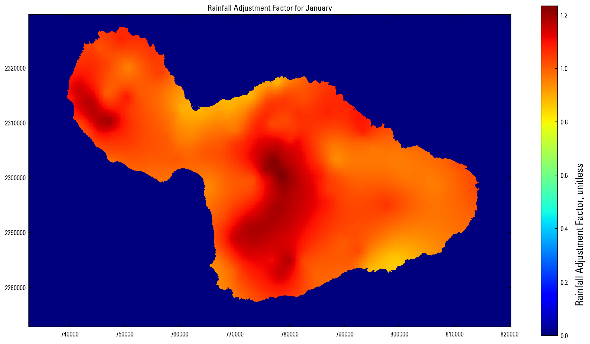
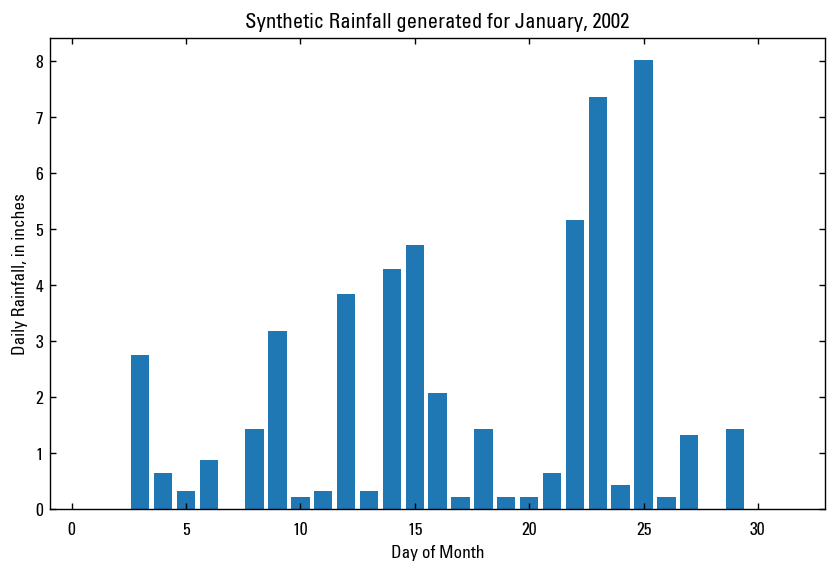

# Grids Specific to Maui Example: Method of Fragments

This notebook presents an example application of SWB in a location for which convenient gridded weather data do not exist. A complete, working example involving application of the method of fragments is presented.

## Preliminaries


```python
import os
import numpy as np
import pandas as pd
import gdal

%run plot_and_table_functions.py

rainfall_fragments_file        = '../input/rain_fragments_maui_reduced_case.prn'
rainfall_sequence_file         = '../input/frag_sequence_2yrs_5sims.out'
sample_monthly_rainfall_file   = '../input/month_year_rainfall/maui_prcp_01_2002.asc'
monthly_rainfall_adj_file      = '../input/Maui_RF_adj_factors/maui_RF_adj_jan__50m.asc'
soil_storage_gridfile_fname    = '../input/maui_SOIL_MOISTURE_STORAGE__50m.asc'
rain_zone_id_file              = '../input/maui_RAIN_ZONE__50m.asc'
```

## Introduction

The Method of Fragments approach highlighted here is used because there is no reliable source for daily gridded rainfall and air temperature data for Maui. A good overview of the method is given by Engott (2011):
> Daily rainfall was synthesized by disaggregating the 
> monthly rainfall values using the method of fragments (see, 
> for example, Oki, 2002). The method creates a synthetic 
> sequence of daily rainfall from monthly data by imposing the 
> rainfall pattern from a rain gage with daily data. Fragments 
> were created by dividing each daily rainfall measurement for 
> a particular month by the total rainfall for that month. This 
> created a set of fragments for that particular month in which 
> the total number of fragments was equal to the number of days 
> in the month. Fragment sets were created for every gage for 
> every month in which complete daily rainfall measurements 
> were available. Fragment sets were grouped by month of the 
> year and by rain gage. The fragment set to be used for a given 
> gage for a given month was selected randomly from among all 
> available sets for that gage for that month of the year. Synthesized 
> daily rainfall for a given month was created by multiplying 
> total rainfall for that month by each fragment in the set, 
> thereby providing daily rainfall.

The approach incorporated into SWB was developed and improved in the course of development of the Hawaii Water Budget (HWB) code (Oki, 2002, Izuka and others, 2010, Engott, 2011). Typically, HWB would be run 20 to 30 times, allowing the code to select from the available rainfall fragments at random from the __fragments file__ during each run. In the end, the results of all model runs would be averaged together in order to produce the final net infiltration (recharge) map. The idea here was to average away the variability introduced by use of a differing sequence of rainfall fragments.

Letting the code choose rainfall fragments at random, however, makes it very difficult to compare a single run to another. Therefore, another option that may be used is to supply SWB with a __sequence file__, which simply specifies in advance the sequence of rainfall fragments that will be used. When used this way, the same sequence of rainfall fragments will be used from one run to the next, which makes comparison of results much easier.

## Fragments file

The fragments file is a plaintext, headerless ASCII table that contains the actual monthly fragment series used to disaggregate the monthly data. Header labels have been added to the example below to assist in interpreting the columns properly. The first three columns of the fragments file hold the numerical month value (1-12), the gage ID corresponding to the climate station used to generate the fragments, and the fragment set number. For a rainfall gage with a 5-year period of record, the fragment set values would be in the range of 1 to 5; for a gage with 30 years of record, the fragment set values would range from 1 to 30.


```python
# open fragment file
collabels1 = ['Month','Gage ID','Fragment Set']
collabels2 = ['day ' + str(d) for d in range(1,32,1) ]
fragments     = pd.read_table( rainfall_fragments_file, delim_whitespace=True, 
                               names=collabels1 + list(collabels2) )
```


```python
print_df_no_index( fragments )
```


<table border="1" class="dataframe">
  <thead>
    <tr style="text-align: right;">
      <th>Month</th>
      <th>Gage ID</th>
      <th>Fragment Set</th>
      <th>day 1</th>
      <th>day 2</th>
      <th>day 3</th>
      <th>day 4</th>
      <th>day 5</th>
      <th>day 6</th>
      <th>day 7</th>
      <th>day 8</th>
      <th>day 9</th>
      <th>day 10</th>
      <th>day 11</th>
      <th>day 12</th>
      <th>day 13</th>
      <th>day 14</th>
      <th>day 15</th>
      <th>day 16</th>
      <th>day 17</th>
      <th>day 18</th>
      <th>day 19</th>
      <th>day 20</th>
      <th>day 21</th>
      <th>day 22</th>
      <th>day 23</th>
      <th>day 24</th>
      <th>day 25</th>
      <th>day 26</th>
      <th>day 27</th>
      <th>day 28</th>
      <th>day 29</th>
      <th>day 30</th>
      <th>day 31</th>
    </tr>
  </thead>
  <tbody>
    <tr>
      <td>1</td>
      <td>1</td>
      <td>1</td>
      <td>0.1895</td>
      <td>0.0000</td>
      <td>0.0000</td>
      <td>0.0000</td>
      <td>0.1684</td>
      <td>0.0000</td>
      <td>0.0000</td>
      <td>0.0000</td>
      <td>0.0000</td>
      <td>0.0000</td>
      <td>0.0000</td>
      <td>0.0000</td>
      <td>0.1053</td>
      <td>0.1263</td>
      <td>0.0000</td>
      <td>0.0000</td>
      <td>0.0000</td>
      <td>0.0000</td>
      <td>0.0316</td>
      <td>0.0000</td>
      <td>0.0000</td>
      <td>0.0000</td>
      <td>0.0000</td>
      <td>0.1053</td>
      <td>0.0000</td>
      <td>0.0000</td>
      <td>0.2737</td>
      <td>0.0000</td>
      <td>0.0000</td>
      <td>0.0000</td>
      <td>0.0000</td>
    </tr>
    <tr>
      <td>1</td>
      <td>2</td>
      <td>1</td>
      <td>0.0463</td>
      <td>0.0000</td>
      <td>0.0366</td>
      <td>0.0171</td>
      <td>0.0341</td>
      <td>0.0000</td>
      <td>0.0000</td>
      <td>0.3244</td>
      <td>0.0146</td>
      <td>0.0024</td>
      <td>0.0146</td>
      <td>0.0098</td>
      <td>0.0000</td>
      <td>0.0000</td>
      <td>0.0000</td>
      <td>0.1756</td>
      <td>0.0000</td>
      <td>0.0000</td>
      <td>0.0000</td>
      <td>0.0000</td>
      <td>0.0024</td>
      <td>0.0024</td>
      <td>0.0878</td>
      <td>0.0390</td>
      <td>0.0000</td>
      <td>0.1098</td>
      <td>0.0000</td>
      <td>0.0024</td>
      <td>0.0146</td>
      <td>0.0317</td>
      <td>0.0341</td>
    </tr>
    <tr>
      <td>1</td>
      <td>3</td>
      <td>1</td>
      <td>0.0000</td>
      <td>0.0000</td>
      <td>0.0000</td>
      <td>0.0000</td>
      <td>0.0000</td>
      <td>0.0000</td>
      <td>0.1938</td>
      <td>0.0089</td>
      <td>0.0287</td>
      <td>0.0682</td>
      <td>0.0172</td>
      <td>0.0127</td>
      <td>0.0605</td>
      <td>0.0319</td>
      <td>0.1039</td>
      <td>0.1836</td>
      <td>0.0019</td>
      <td>0.0191</td>
      <td>0.0000</td>
      <td>0.0268</td>
      <td>0.0000</td>
      <td>0.0172</td>
      <td>0.0064</td>
      <td>0.0236</td>
      <td>0.0000</td>
      <td>0.1160</td>
      <td>0.0797</td>
      <td>0.0000</td>
      <td>0.0000</td>
      <td>0.0000</td>
      <td>0.0000</td>
    </tr>
    <tr>
      <td>1</td>
      <td>4</td>
      <td>1</td>
      <td>0.1571</td>
      <td>0.0000</td>
      <td>0.0000</td>
      <td>0.0000</td>
      <td>0.0239</td>
      <td>0.0000</td>
      <td>0.0000</td>
      <td>0.2425</td>
      <td>0.0000</td>
      <td>0.0437</td>
      <td>0.0000</td>
      <td>0.0934</td>
      <td>0.0000</td>
      <td>0.0000</td>
      <td>0.2207</td>
      <td>0.0000</td>
      <td>0.0000</td>
      <td>0.0000</td>
      <td>0.0000</td>
      <td>0.0000</td>
      <td>0.0000</td>
      <td>0.0000</td>
      <td>0.0000</td>
      <td>0.0000</td>
      <td>0.0000</td>
      <td>0.0716</td>
      <td>0.0000</td>
      <td>0.0000</td>
      <td>0.0000</td>
      <td>0.0855</td>
      <td>0.0616</td>
    </tr>
    <tr>
      <td>1</td>
      <td>5</td>
      <td>1</td>
      <td>0.0000</td>
      <td>0.0000</td>
      <td>0.0105</td>
      <td>0.0000</td>
      <td>0.0326</td>
      <td>0.0035</td>
      <td>0.0000</td>
      <td>0.3488</td>
      <td>0.3372</td>
      <td>0.0000</td>
      <td>0.0000</td>
      <td>0.0000</td>
      <td>0.0000</td>
      <td>0.0000</td>
      <td>0.0256</td>
      <td>0.0000</td>
      <td>0.0000</td>
      <td>0.0000</td>
      <td>0.0000</td>
      <td>0.1023</td>
      <td>0.0000</td>
      <td>0.0000</td>
      <td>0.0942</td>
      <td>0.0000</td>
      <td>0.0000</td>
      <td>0.0000</td>
      <td>0.0453</td>
      <td>0.0000</td>
      <td>0.0000</td>
      <td>0.0000</td>
      <td>0.0000</td>
    </tr>
    <tr>
      <td>1</td>
      <td>6</td>
      <td>1</td>
      <td>0.0883</td>
      <td>0.1262</td>
      <td>0.0016</td>
      <td>0.0000</td>
      <td>0.0000</td>
      <td>0.0000</td>
      <td>0.0000</td>
      <td>0.0000</td>
      <td>0.0000</td>
      <td>0.0000</td>
      <td>0.0000</td>
      <td>0.0394</td>
      <td>0.0000</td>
      <td>0.0000</td>
      <td>0.7224</td>
      <td>0.0142</td>
      <td>0.0000</td>
      <td>0.0000</td>
      <td>0.0063</td>
      <td>0.0000</td>
      <td>0.0000</td>
      <td>0.0000</td>
      <td>0.0000</td>
      <td>0.0000</td>
      <td>0.0000</td>
      <td>0.0000</td>
      <td>0.0000</td>
      <td>0.0000</td>
      <td>0.0000</td>
      <td>0.0000</td>
      <td>0.0016</td>
    </tr>
    <tr>
      <td>1</td>
      <td>7</td>
      <td>1</td>
      <td>0.0000</td>
      <td>0.0992</td>
      <td>0.0000</td>
      <td>0.0000</td>
      <td>0.2290</td>
      <td>0.0382</td>
      <td>0.0000</td>
      <td>0.0000</td>
      <td>0.0000</td>
      <td>0.0000</td>
      <td>0.0000</td>
      <td>0.0000</td>
      <td>0.0000</td>
      <td>0.5573</td>
      <td>0.0000</td>
      <td>0.0000</td>
      <td>0.0000</td>
      <td>0.0000</td>
      <td>0.0000</td>
      <td>0.0000</td>
      <td>0.0000</td>
      <td>0.0000</td>
      <td>0.0000</td>
      <td>0.0000</td>
      <td>0.0000</td>
      <td>0.0000</td>
      <td>0.0763</td>
      <td>0.0000</td>
      <td>0.0000</td>
      <td>0.0000</td>
      <td>0.0000</td>
    </tr>
    <tr>
      <td>1</td>
      <td>8</td>
      <td>1</td>
      <td>0.0171</td>
      <td>0.0553</td>
      <td>0.0066</td>
      <td>0.1566</td>
      <td>0.0092</td>
      <td>0.0368</td>
      <td>0.0184</td>
      <td>0.0079</td>
      <td>0.0132</td>
      <td>0.0382</td>
      <td>0.0000</td>
      <td>0.0053</td>
      <td>0.0000</td>
      <td>0.0000</td>
      <td>0.0092</td>
      <td>0.0053</td>
      <td>0.2842</td>
      <td>0.0263</td>
      <td>0.0000</td>
      <td>0.0000</td>
      <td>0.2592</td>
      <td>0.0461</td>
      <td>0.0000</td>
      <td>0.0000</td>
      <td>0.0000</td>
      <td>0.0000</td>
      <td>0.0053</td>
      <td>0.0000</td>
      <td>0.0000</td>
      <td>0.0000</td>
      <td>0.0000</td>
    </tr>
    <tr>
      <td>1</td>
      <td>9</td>
      <td>1</td>
      <td>0.1895</td>
      <td>0.0000</td>
      <td>0.0000</td>
      <td>0.0000</td>
      <td>0.1684</td>
      <td>0.0000</td>
      <td>0.0000</td>
      <td>0.0000</td>
      <td>0.0000</td>
      <td>0.0000</td>
      <td>0.0000</td>
      <td>0.0000</td>
      <td>0.1053</td>
      <td>0.1263</td>
      <td>0.0000</td>
      <td>0.0000</td>
      <td>0.0000</td>
      <td>0.0000</td>
      <td>0.0316</td>
      <td>0.0000</td>
      <td>0.0000</td>
      <td>0.0000</td>
      <td>0.0000</td>
      <td>0.1053</td>
      <td>0.0000</td>
      <td>0.0000</td>
      <td>0.2737</td>
      <td>0.0000</td>
      <td>0.0000</td>
      <td>0.0000</td>
      <td>0.0000</td>
    </tr>
    <tr>
      <td>1</td>
      <td>10</td>
      <td>1</td>
      <td>0.0202</td>
      <td>0.0250</td>
      <td>0.0123</td>
      <td>0.0515</td>
      <td>0.1312</td>
      <td>0.1056</td>
      <td>0.1287</td>
      <td>0.0149</td>
      <td>0.0171</td>
      <td>0.0155</td>
      <td>0.0136</td>
      <td>0.0111</td>
      <td>0.0266</td>
      <td>0.0901</td>
      <td>0.0145</td>
      <td>0.1622</td>
      <td>0.0553</td>
      <td>0.0022</td>
      <td>0.0076</td>
      <td>0.0000</td>
      <td>0.0016</td>
      <td>0.0009</td>
      <td>0.0092</td>
      <td>0.0022</td>
      <td>0.0452</td>
      <td>0.0006</td>
      <td>0.0009</td>
      <td>0.0003</td>
      <td>0.0003</td>
      <td>0.0329</td>
      <td>0.0003</td>
    </tr>
    <tr>
      <td>1</td>
      <td>11</td>
      <td>1</td>
      <td>0.0000</td>
      <td>0.0000</td>
      <td>0.0000</td>
      <td>0.0000</td>
      <td>0.0000</td>
      <td>0.0000</td>
      <td>0.2421</td>
      <td>0.0000</td>
      <td>0.0000</td>
      <td>0.0000</td>
      <td>0.0000</td>
      <td>0.0000</td>
      <td>0.0000</td>
      <td>0.0000</td>
      <td>0.0842</td>
      <td>0.0000</td>
      <td>0.0000</td>
      <td>0.0000</td>
      <td>0.0000</td>
      <td>0.0000</td>
      <td>0.0000</td>
      <td>0.0000</td>
      <td>0.0000</td>
      <td>0.0000</td>
      <td>0.2842</td>
      <td>0.3895</td>
      <td>0.0000</td>
      <td>0.0000</td>
      <td>0.0000</td>
      <td>0.0000</td>
      <td>0.0000</td>
    </tr>
    <tr>
      <td>1</td>
      <td>12</td>
      <td>1</td>
      <td>0.1839</td>
      <td>0.0000</td>
      <td>0.0000</td>
      <td>0.0784</td>
      <td>0.0000</td>
      <td>0.0000</td>
      <td>0.0000</td>
      <td>0.0040</td>
      <td>0.0000</td>
      <td>0.0080</td>
      <td>0.0241</td>
      <td>0.0000</td>
      <td>0.0000</td>
      <td>0.0000</td>
      <td>0.0080</td>
      <td>0.0121</td>
      <td>0.0000</td>
      <td>0.0000</td>
      <td>0.0060</td>
      <td>0.0000</td>
      <td>0.5588</td>
      <td>0.0111</td>
      <td>0.0000</td>
      <td>0.0000</td>
      <td>0.0000</td>
      <td>0.0000</td>
      <td>0.0000</td>
      <td>0.0090</td>
      <td>0.0523</td>
      <td>0.0161</td>
      <td>0.0281</td>
    </tr>
    <tr>
      <td>1</td>
      <td>13</td>
      <td>1</td>
      <td>0.0425</td>
      <td>0.0068</td>
      <td>0.0255</td>
      <td>0.0204</td>
      <td>0.0187</td>
      <td>0.0000</td>
      <td>0.0000</td>
      <td>0.2160</td>
      <td>0.0051</td>
      <td>0.0000</td>
      <td>0.0000</td>
      <td>0.0595</td>
      <td>0.0000</td>
      <td>0.0000</td>
      <td>0.0000</td>
      <td>0.0000</td>
      <td>0.1871</td>
      <td>0.0000</td>
      <td>0.0034</td>
      <td>0.0000</td>
      <td>0.0000</td>
      <td>0.0000</td>
      <td>0.1429</td>
      <td>0.0255</td>
      <td>0.0000</td>
      <td>0.0986</td>
      <td>0.0119</td>
      <td>0.0000</td>
      <td>0.0068</td>
      <td>0.0816</td>
      <td>0.0476</td>
    </tr>
    <tr>
      <td>1</td>
      <td>14</td>
      <td>1</td>
      <td>0.0000</td>
      <td>0.1951</td>
      <td>0.0000</td>
      <td>0.0000</td>
      <td>0.3659</td>
      <td>0.0000</td>
      <td>0.0000</td>
      <td>0.0000</td>
      <td>0.0000</td>
      <td>0.0000</td>
      <td>0.0000</td>
      <td>0.0000</td>
      <td>0.0000</td>
      <td>0.1463</td>
      <td>0.0000</td>
      <td>0.0000</td>
      <td>0.0000</td>
      <td>0.0000</td>
      <td>0.0000</td>
      <td>0.0000</td>
      <td>0.0000</td>
      <td>0.0000</td>
      <td>0.0000</td>
      <td>0.0000</td>
      <td>0.0000</td>
      <td>0.0000</td>
      <td>0.0000</td>
      <td>0.2927</td>
      <td>0.0000</td>
      <td>0.0000</td>
      <td>0.0000</td>
    </tr>
    <tr>
      <td>1</td>
      <td>15</td>
      <td>1</td>
      <td>0.0000</td>
      <td>0.0000</td>
      <td>0.0000</td>
      <td>0.0000</td>
      <td>0.0000</td>
      <td>0.0000</td>
      <td>0.0000</td>
      <td>0.3115</td>
      <td>0.0984</td>
      <td>0.0328</td>
      <td>0.0000</td>
      <td>0.0000</td>
      <td>0.0000</td>
      <td>0.0000</td>
      <td>0.0820</td>
      <td>0.4262</td>
      <td>0.0000</td>
      <td>0.0000</td>
      <td>0.0000</td>
      <td>0.0000</td>
      <td>0.0000</td>
      <td>0.0000</td>
      <td>0.0000</td>
      <td>0.0000</td>
      <td>0.0000</td>
      <td>0.0492</td>
      <td>0.0000</td>
      <td>0.0000</td>
      <td>0.0000</td>
      <td>0.0000</td>
      <td>0.0000</td>
    </tr>
    <tr>
      <td>1</td>
      <td>16</td>
      <td>1</td>
      <td>0.2153</td>
      <td>0.0324</td>
      <td>0.0000</td>
      <td>0.0000</td>
      <td>0.0509</td>
      <td>0.0046</td>
      <td>0.1852</td>
      <td>0.0000</td>
      <td>0.0000</td>
      <td>0.0046</td>
      <td>0.0000</td>
      <td>0.0000</td>
      <td>0.0324</td>
      <td>0.0856</td>
      <td>0.0579</td>
      <td>0.0509</td>
      <td>0.0417</td>
      <td>0.0046</td>
      <td>0.0093</td>
      <td>0.0116</td>
      <td>0.0139</td>
      <td>0.0185</td>
      <td>0.0000</td>
      <td>0.0000</td>
      <td>0.0000</td>
      <td>0.0000</td>
      <td>0.0000</td>
      <td>0.0000</td>
      <td>0.0440</td>
      <td>0.1366</td>
      <td>0.0000</td>
    </tr>
    <tr>
      <td>1</td>
      <td>17</td>
      <td>1</td>
      <td>0.1039</td>
      <td>0.1566</td>
      <td>0.0169</td>
      <td>0.0005</td>
      <td>0.0000</td>
      <td>0.0000</td>
      <td>0.0000</td>
      <td>0.0000</td>
      <td>0.1498</td>
      <td>0.0280</td>
      <td>0.0000</td>
      <td>0.0000</td>
      <td>0.0332</td>
      <td>0.0438</td>
      <td>0.0000</td>
      <td>0.0000</td>
      <td>0.0000</td>
      <td>0.1218</td>
      <td>0.0069</td>
      <td>0.0448</td>
      <td>0.0744</td>
      <td>0.0000</td>
      <td>0.0000</td>
      <td>0.0005</td>
      <td>0.0000</td>
      <td>0.0000</td>
      <td>0.2184</td>
      <td>0.0000</td>
      <td>0.0005</td>
      <td>0.0000</td>
      <td>0.0000</td>
    </tr>
    <tr>
      <td>1</td>
      <td>18</td>
      <td>1</td>
      <td>0.0143</td>
      <td>0.0017</td>
      <td>0.0000</td>
      <td>0.0000</td>
      <td>0.0000</td>
      <td>0.0000</td>
      <td>0.0185</td>
      <td>0.0135</td>
      <td>0.4251</td>
      <td>0.2542</td>
      <td>0.1515</td>
      <td>0.0084</td>
      <td>0.0000</td>
      <td>0.0000</td>
      <td>0.0000</td>
      <td>0.0000</td>
      <td>0.0000</td>
      <td>0.0126</td>
      <td>0.0076</td>
      <td>0.0000</td>
      <td>0.0000</td>
      <td>0.0463</td>
      <td>0.0025</td>
      <td>0.0000</td>
      <td>0.0000</td>
      <td>0.0000</td>
      <td>0.0000</td>
      <td>0.0000</td>
      <td>0.0000</td>
      <td>0.0059</td>
      <td>0.0379</td>
    </tr>
    <tr>
      <td>1</td>
      <td>19</td>
      <td>1</td>
      <td>0.0000</td>
      <td>0.0000</td>
      <td>0.0000</td>
      <td>0.0000</td>
      <td>0.0000</td>
      <td>0.0000</td>
      <td>0.0000</td>
      <td>0.4595</td>
      <td>0.1351</td>
      <td>0.1784</td>
      <td>0.0000</td>
      <td>0.0703</td>
      <td>0.0000</td>
      <td>0.0000</td>
      <td>0.0973</td>
      <td>0.0000</td>
      <td>0.0000</td>
      <td>0.0405</td>
      <td>0.0000</td>
      <td>0.0000</td>
      <td>0.0000</td>
      <td>0.0000</td>
      <td>0.0000</td>
      <td>0.0000</td>
      <td>0.0000</td>
      <td>0.0189</td>
      <td>0.0000</td>
      <td>0.0000</td>
      <td>0.0000</td>
      <td>0.0000</td>
      <td>0.0000</td>
    </tr>
    <tr>
      <td>1</td>
      <td>20</td>
      <td>1</td>
      <td>0.0000</td>
      <td>0.0000</td>
      <td>0.0435</td>
      <td>0.0248</td>
      <td>0.1180</td>
      <td>0.0000</td>
      <td>0.1925</td>
      <td>0.5963</td>
      <td>0.0000</td>
      <td>0.0000</td>
      <td>0.0124</td>
      <td>0.0124</td>
      <td>0.0000</td>
      <td>0.0000</td>
      <td>0.0000</td>
      <td>0.0000</td>
      <td>0.0000</td>
      <td>0.0000</td>
      <td>0.0000</td>
      <td>0.0000</td>
      <td>0.0000</td>
      <td>0.0000</td>
      <td>0.0000</td>
      <td>0.0000</td>
      <td>0.0000</td>
      <td>0.0000</td>
      <td>0.0000</td>
      <td>0.0000</td>
      <td>0.0000</td>
      <td>0.0000</td>
      <td>0.0000</td>
    </tr>
    <tr>
      <td>1</td>
      <td>21</td>
      <td>1</td>
      <td>0.0000</td>
      <td>0.0000</td>
      <td>0.0000</td>
      <td>0.0000</td>
      <td>0.0000</td>
      <td>0.0000</td>
      <td>0.0000</td>
      <td>0.0000</td>
      <td>0.0000</td>
      <td>0.0376</td>
      <td>0.5914</td>
      <td>0.0242</td>
      <td>0.0054</td>
      <td>0.0000</td>
      <td>0.0000</td>
      <td>0.0000</td>
      <td>0.0000</td>
      <td>0.0000</td>
      <td>0.0000</td>
      <td>0.0000</td>
      <td>0.0027</td>
      <td>0.0457</td>
      <td>0.0054</td>
      <td>0.0000</td>
      <td>0.0323</td>
      <td>0.0672</td>
      <td>0.0027</td>
      <td>0.0806</td>
      <td>0.0833</td>
      <td>0.0215</td>
      <td>0.0000</td>
    </tr>
    <tr>
      <td>1</td>
      <td>22</td>
      <td>1</td>
      <td>0.0000</td>
      <td>0.0000</td>
      <td>0.0000</td>
      <td>0.0000</td>
      <td>0.0000</td>
      <td>0.0000</td>
      <td>0.0000</td>
      <td>0.0000</td>
      <td>0.0000</td>
      <td>0.1296</td>
      <td>0.2481</td>
      <td>0.0000</td>
      <td>0.0000</td>
      <td>0.0000</td>
      <td>0.0000</td>
      <td>0.0000</td>
      <td>0.0000</td>
      <td>0.0000</td>
      <td>0.0000</td>
      <td>0.1037</td>
      <td>0.0000</td>
      <td>0.0000</td>
      <td>0.0000</td>
      <td>0.0000</td>
      <td>0.0296</td>
      <td>0.0741</td>
      <td>0.1111</td>
      <td>0.0000</td>
      <td>0.1481</td>
      <td>0.1556</td>
      <td>0.0000</td>
    </tr>
    <tr>
      <td>1</td>
      <td>23</td>
      <td>1</td>
      <td>0.0000</td>
      <td>0.0000</td>
      <td>0.0000</td>
      <td>0.0000</td>
      <td>0.0000</td>
      <td>0.0000</td>
      <td>0.0000</td>
      <td>0.0000</td>
      <td>0.0000</td>
      <td>0.0870</td>
      <td>0.2087</td>
      <td>0.0000</td>
      <td>0.0000</td>
      <td>0.0000</td>
      <td>0.0000</td>
      <td>0.0000</td>
      <td>0.0000</td>
      <td>0.0000</td>
      <td>0.0000</td>
      <td>0.0609</td>
      <td>0.0000</td>
      <td>0.0000</td>
      <td>0.0000</td>
      <td>0.0000</td>
      <td>0.1043</td>
      <td>0.0957</td>
      <td>0.2000</td>
      <td>0.1391</td>
      <td>0.0870</td>
      <td>0.0174</td>
      <td>0.0000</td>
    </tr>
    <tr>
      <td>1</td>
      <td>24</td>
      <td>1</td>
      <td>0.0000</td>
      <td>0.0027</td>
      <td>0.1008</td>
      <td>0.0345</td>
      <td>0.0119</td>
      <td>0.0239</td>
      <td>0.0000</td>
      <td>0.0000</td>
      <td>0.0053</td>
      <td>0.0080</td>
      <td>0.0159</td>
      <td>0.0093</td>
      <td>0.0225</td>
      <td>0.0000</td>
      <td>0.0186</td>
      <td>0.0000</td>
      <td>0.0000</td>
      <td>0.0000</td>
      <td>0.0000</td>
      <td>0.0000</td>
      <td>0.0066</td>
      <td>0.1008</td>
      <td>0.0584</td>
      <td>0.0517</td>
      <td>0.1008</td>
      <td>0.0159</td>
      <td>0.1127</td>
      <td>0.1008</td>
      <td>0.0531</td>
      <td>0.0027</td>
      <td>0.1432</td>
    </tr>
    <tr>
      <td>1</td>
      <td>25</td>
      <td>1</td>
      <td>0.0123</td>
      <td>0.0000</td>
      <td>0.0000</td>
      <td>0.0451</td>
      <td>0.0000</td>
      <td>0.0102</td>
      <td>0.0000</td>
      <td>0.0000</td>
      <td>0.0164</td>
      <td>0.0451</td>
      <td>0.0000</td>
      <td>0.0184</td>
      <td>0.0143</td>
      <td>0.0000</td>
      <td>0.0000</td>
      <td>0.0000</td>
      <td>0.5000</td>
      <td>0.0574</td>
      <td>0.0000</td>
      <td>0.0000</td>
      <td>0.2111</td>
      <td>0.0615</td>
      <td>0.0082</td>
      <td>0.0000</td>
      <td>0.0000</td>
      <td>0.0000</td>
      <td>0.0000</td>
      <td>0.0000</td>
      <td>0.0000</td>
      <td>0.0000</td>
      <td>0.0000</td>
    </tr>
    <tr>
      <td>1</td>
      <td>26</td>
      <td>1</td>
      <td>0.0018</td>
      <td>0.0625</td>
      <td>0.0036</td>
      <td>0.1071</td>
      <td>0.0054</td>
      <td>0.0304</td>
      <td>0.0000</td>
      <td>0.0018</td>
      <td>0.0268</td>
      <td>0.0357</td>
      <td>0.0000</td>
      <td>0.0286</td>
      <td>0.0000</td>
      <td>0.0000</td>
      <td>0.0036</td>
      <td>0.0036</td>
      <td>0.4464</td>
      <td>0.0536</td>
      <td>0.0000</td>
      <td>0.0000</td>
      <td>0.1625</td>
      <td>0.0268</td>
      <td>0.0000</td>
      <td>0.0000</td>
      <td>0.0000</td>
      <td>0.0000</td>
      <td>0.0000</td>
      <td>0.0000</td>
      <td>0.0000</td>
      <td>0.0000</td>
      <td>0.0000</td>
    </tr>
    <tr>
      <td>1</td>
      <td>27</td>
      <td>1</td>
      <td>0.1039</td>
      <td>0.1566</td>
      <td>0.0169</td>
      <td>0.0005</td>
      <td>0.0000</td>
      <td>0.0000</td>
      <td>0.0000</td>
      <td>0.0000</td>
      <td>0.1498</td>
      <td>0.0280</td>
      <td>0.0000</td>
      <td>0.0000</td>
      <td>0.0332</td>
      <td>0.0438</td>
      <td>0.0000</td>
      <td>0.0000</td>
      <td>0.0000</td>
      <td>0.1218</td>
      <td>0.0069</td>
      <td>0.0448</td>
      <td>0.0744</td>
      <td>0.0000</td>
      <td>0.0000</td>
      <td>0.0005</td>
      <td>0.0000</td>
      <td>0.0000</td>
      <td>0.2184</td>
      <td>0.0000</td>
      <td>0.0005</td>
      <td>0.0000</td>
      <td>0.0000</td>
    </tr>
    <tr>
      <td>1</td>
      <td>28</td>
      <td>1</td>
      <td>0.0000</td>
      <td>0.0078</td>
      <td>0.0000</td>
      <td>0.0000</td>
      <td>0.0000</td>
      <td>0.0000</td>
      <td>0.0000</td>
      <td>0.0261</td>
      <td>0.0078</td>
      <td>0.0295</td>
      <td>0.1546</td>
      <td>0.2997</td>
      <td>0.0113</td>
      <td>0.0000</td>
      <td>0.0009</td>
      <td>0.0000</td>
      <td>0.0009</td>
      <td>0.0000</td>
      <td>0.0000</td>
      <td>0.0000</td>
      <td>0.0009</td>
      <td>0.0000</td>
      <td>0.0626</td>
      <td>0.2120</td>
      <td>0.0017</td>
      <td>0.0000</td>
      <td>0.0000</td>
      <td>0.0000</td>
      <td>0.0321</td>
      <td>0.1477</td>
      <td>0.0043</td>
    </tr>
    <tr>
      <td>1</td>
      <td>29</td>
      <td>1</td>
      <td>0.0307</td>
      <td>0.0000</td>
      <td>0.0000</td>
      <td>0.3350</td>
      <td>0.0793</td>
      <td>0.0026</td>
      <td>0.0026</td>
      <td>0.0000</td>
      <td>0.0000</td>
      <td>0.0000</td>
      <td>0.0000</td>
      <td>0.0000</td>
      <td>0.0000</td>
      <td>0.0000</td>
      <td>0.0000</td>
      <td>0.0000</td>
      <td>0.0000</td>
      <td>0.0000</td>
      <td>0.0000</td>
      <td>0.0000</td>
      <td>0.0000</td>
      <td>0.0128</td>
      <td>0.1662</td>
      <td>0.0639</td>
      <td>0.1407</td>
      <td>0.0077</td>
      <td>0.0332</td>
      <td>0.0691</td>
      <td>0.0486</td>
      <td>0.0000</td>
      <td>0.0077</td>
    </tr>
    <tr>
      <td>1</td>
      <td>30</td>
      <td>1</td>
      <td>0.0000</td>
      <td>0.0000</td>
      <td>0.0000</td>
      <td>0.0000</td>
      <td>0.0000</td>
      <td>0.0000</td>
      <td>0.0000</td>
      <td>0.0000</td>
      <td>0.0000</td>
      <td>0.0784</td>
      <td>0.2705</td>
      <td>0.0000</td>
      <td>0.0000</td>
      <td>0.0000</td>
      <td>0.0000</td>
      <td>0.0000</td>
      <td>0.0000</td>
      <td>0.0000</td>
      <td>0.0000</td>
      <td>0.0560</td>
      <td>0.0000</td>
      <td>0.0000</td>
      <td>0.0000</td>
      <td>0.0000</td>
      <td>0.0000</td>
      <td>0.0653</td>
      <td>0.1521</td>
      <td>0.2379</td>
      <td>0.1399</td>
      <td>0.0000</td>
      <td>0.0000</td>
    </tr>
    <tr>
      <td>1</td>
      <td>31</td>
      <td>1</td>
      <td>0.0000</td>
      <td>0.0000</td>
      <td>0.0000</td>
      <td>0.0000</td>
      <td>0.0000</td>
      <td>0.0000</td>
      <td>0.0000</td>
      <td>0.0000</td>
      <td>0.0000</td>
      <td>0.0870</td>
      <td>0.2087</td>
      <td>0.0000</td>
      <td>0.0000</td>
      <td>0.0000</td>
      <td>0.0000</td>
      <td>0.0000</td>
      <td>0.0000</td>
      <td>0.0000</td>
      <td>0.0000</td>
      <td>0.0609</td>
      <td>0.0000</td>
      <td>0.0000</td>
      <td>0.0000</td>
      <td>0.0000</td>
      <td>0.1043</td>
      <td>0.0957</td>
      <td>0.2000</td>
      <td>0.1391</td>
      <td>0.0870</td>
      <td>0.0174</td>
      <td>0.0000</td>
    </tr>
    <tr>
      <td>1</td>
      <td>32</td>
      <td>1</td>
      <td>0.0199</td>
      <td>0.0249</td>
      <td>0.0149</td>
      <td>0.0498</td>
      <td>0.0000</td>
      <td>0.0000</td>
      <td>0.3731</td>
      <td>0.0000</td>
      <td>0.0995</td>
      <td>0.0050</td>
      <td>0.0000</td>
      <td>0.0000</td>
      <td>0.0000</td>
      <td>0.0000</td>
      <td>0.1642</td>
      <td>0.0000</td>
      <td>0.0000</td>
      <td>0.0000</td>
      <td>0.0000</td>
      <td>0.0000</td>
      <td>0.0000</td>
      <td>0.0149</td>
      <td>0.0846</td>
      <td>0.0000</td>
      <td>0.0746</td>
      <td>0.0299</td>
      <td>0.0000</td>
      <td>0.0000</td>
      <td>0.0149</td>
      <td>0.0299</td>
      <td>0.0000</td>
    </tr>
    <tr>
      <td>1</td>
      <td>33</td>
      <td>1</td>
      <td>0.0000</td>
      <td>0.0000</td>
      <td>0.0000</td>
      <td>0.0000</td>
      <td>0.1333</td>
      <td>0.0000</td>
      <td>0.0000</td>
      <td>0.0000</td>
      <td>0.1833</td>
      <td>0.0000</td>
      <td>0.0000</td>
      <td>0.0000</td>
      <td>0.0000</td>
      <td>0.0000</td>
      <td>0.0000</td>
      <td>0.0000</td>
      <td>0.0000</td>
      <td>0.0000</td>
      <td>0.2500</td>
      <td>0.1500</td>
      <td>0.0000</td>
      <td>0.2000</td>
      <td>0.0000</td>
      <td>0.0000</td>
      <td>0.0000</td>
      <td>0.0000</td>
      <td>0.0000</td>
      <td>0.0000</td>
      <td>0.0000</td>
      <td>0.0833</td>
      <td>0.0000</td>
    </tr>
    <tr>
      <td>1</td>
      <td>34</td>
      <td>1</td>
      <td>0.0220</td>
      <td>0.0018</td>
      <td>0.0000</td>
      <td>0.0977</td>
      <td>0.0513</td>
      <td>0.0342</td>
      <td>0.0031</td>
      <td>0.0037</td>
      <td>0.0043</td>
      <td>0.0024</td>
      <td>0.0037</td>
      <td>0.0031</td>
      <td>0.0018</td>
      <td>0.0012</td>
      <td>0.0012</td>
      <td>0.0031</td>
      <td>0.0024</td>
      <td>0.0018</td>
      <td>0.0012</td>
      <td>0.0000</td>
      <td>0.0000</td>
      <td>0.0208</td>
      <td>0.1442</td>
      <td>0.1136</td>
      <td>0.0739</td>
      <td>0.0684</td>
      <td>0.0788</td>
      <td>0.1228</td>
      <td>0.0586</td>
      <td>0.0354</td>
      <td>0.0434</td>
    </tr>
    <tr>
      <td>1</td>
      <td>35</td>
      <td>1</td>
      <td>0.0000</td>
      <td>0.0000</td>
      <td>0.0000</td>
      <td>0.0000</td>
      <td>0.0000</td>
      <td>0.0000</td>
      <td>0.0000</td>
      <td>0.0353</td>
      <td>0.0092</td>
      <td>0.0497</td>
      <td>0.4058</td>
      <td>0.1479</td>
      <td>0.0026</td>
      <td>0.0000</td>
      <td>0.0000</td>
      <td>0.0000</td>
      <td>0.0000</td>
      <td>0.0000</td>
      <td>0.0000</td>
      <td>0.0000</td>
      <td>0.0026</td>
      <td>0.0000</td>
      <td>0.1283</td>
      <td>0.1401</td>
      <td>0.0013</td>
      <td>0.0000</td>
      <td>0.0000</td>
      <td>0.0000</td>
      <td>0.0668</td>
      <td>0.0105</td>
      <td>0.0000</td>
    </tr>
    <tr>
      <td>1</td>
      <td>36</td>
      <td>1</td>
      <td>0.0000</td>
      <td>0.0044</td>
      <td>0.0000</td>
      <td>0.0000</td>
      <td>0.0000</td>
      <td>0.0000</td>
      <td>0.0000</td>
      <td>0.0394</td>
      <td>0.0087</td>
      <td>0.0204</td>
      <td>0.2974</td>
      <td>0.2843</td>
      <td>0.0219</td>
      <td>0.0000</td>
      <td>0.0000</td>
      <td>0.0000</td>
      <td>0.0000</td>
      <td>0.0000</td>
      <td>0.0000</td>
      <td>0.0000</td>
      <td>0.0000</td>
      <td>0.0000</td>
      <td>0.1035</td>
      <td>0.1924</td>
      <td>0.0000</td>
      <td>0.0000</td>
      <td>0.0000</td>
      <td>0.0000</td>
      <td>0.0044</td>
      <td>0.0233</td>
      <td>0.0000</td>
    </tr>
    <tr>
      <td>1</td>
      <td>37</td>
      <td>1</td>
      <td>0.0000</td>
      <td>0.0000</td>
      <td>0.0000</td>
      <td>0.0000</td>
      <td>0.0000</td>
      <td>0.0000</td>
      <td>0.0000</td>
      <td>0.0000</td>
      <td>0.0000</td>
      <td>0.0000</td>
      <td>0.0000</td>
      <td>0.0000</td>
      <td>0.0000</td>
      <td>0.0000</td>
      <td>0.9594</td>
      <td>0.0000</td>
      <td>0.0406</td>
      <td>0.0000</td>
      <td>0.0000</td>
      <td>0.0000</td>
      <td>0.0000</td>
      <td>0.0000</td>
      <td>0.0000</td>
      <td>0.0000</td>
      <td>0.0000</td>
      <td>0.0000</td>
      <td>0.0000</td>
      <td>0.0000</td>
      <td>0.0000</td>
      <td>0.0000</td>
      <td>0.0000</td>
    </tr>
    <tr>
      <td>1</td>
      <td>38</td>
      <td>1</td>
      <td>0.0000</td>
      <td>0.0000</td>
      <td>0.0000</td>
      <td>0.0828</td>
      <td>0.0000</td>
      <td>0.0000</td>
      <td>0.3067</td>
      <td>0.0000</td>
      <td>0.1043</td>
      <td>0.0000</td>
      <td>0.0000</td>
      <td>0.0000</td>
      <td>0.0613</td>
      <td>0.0000</td>
      <td>0.1534</td>
      <td>0.0000</td>
      <td>0.0000</td>
      <td>0.0000</td>
      <td>0.0000</td>
      <td>0.0000</td>
      <td>0.0000</td>
      <td>0.0000</td>
      <td>0.0890</td>
      <td>0.0000</td>
      <td>0.0000</td>
      <td>0.1258</td>
      <td>0.0000</td>
      <td>0.0000</td>
      <td>0.0000</td>
      <td>0.0000</td>
      <td>0.0767</td>
    </tr>
    <tr>
      <td>1</td>
      <td>39</td>
      <td>1</td>
      <td>0.0000</td>
      <td>0.0000</td>
      <td>0.0000</td>
      <td>0.0000</td>
      <td>0.0000</td>
      <td>0.0000</td>
      <td>0.0000</td>
      <td>0.0000</td>
      <td>0.0000</td>
      <td>0.0000</td>
      <td>0.0000</td>
      <td>0.0000</td>
      <td>0.0000</td>
      <td>0.0000</td>
      <td>0.0000</td>
      <td>0.0000</td>
      <td>0.0000</td>
      <td>0.0000</td>
      <td>0.0000</td>
      <td>0.0000</td>
      <td>0.0000</td>
      <td>0.0000</td>
      <td>0.0000</td>
      <td>0.0000</td>
      <td>0.0000</td>
      <td>0.0000</td>
      <td>1.0000</td>
      <td>0.0000</td>
      <td>0.0000</td>
      <td>0.0000</td>
      <td>0.0000</td>
    </tr>
    <tr>
      <td>1</td>
      <td>40</td>
      <td>1</td>
      <td>0.0000</td>
      <td>0.0000</td>
      <td>0.0000</td>
      <td>0.0000</td>
      <td>0.0000</td>
      <td>0.0000</td>
      <td>0.0000</td>
      <td>0.0452</td>
      <td>0.0201</td>
      <td>0.0569</td>
      <td>0.3294</td>
      <td>0.1589</td>
      <td>0.0234</td>
      <td>0.0000</td>
      <td>0.0000</td>
      <td>0.0000</td>
      <td>0.0000</td>
      <td>0.0000</td>
      <td>0.0000</td>
      <td>0.0000</td>
      <td>0.0000</td>
      <td>0.0000</td>
      <td>0.2274</td>
      <td>0.0535</td>
      <td>0.0552</td>
      <td>0.0000</td>
      <td>0.0000</td>
      <td>0.0000</td>
      <td>0.0301</td>
      <td>0.0000</td>
      <td>0.0000</td>
    </tr>
    <tr>
      <td>1</td>
      <td>41</td>
      <td>1</td>
      <td>0.0000</td>
      <td>0.0000</td>
      <td>0.0000</td>
      <td>0.0000</td>
      <td>0.0000</td>
      <td>0.0000</td>
      <td>0.0000</td>
      <td>0.0230</td>
      <td>0.0064</td>
      <td>0.0599</td>
      <td>0.2993</td>
      <td>0.2238</td>
      <td>0.0046</td>
      <td>0.0000</td>
      <td>0.0000</td>
      <td>0.0000</td>
      <td>0.0000</td>
      <td>0.0000</td>
      <td>0.0000</td>
      <td>0.0000</td>
      <td>0.0018</td>
      <td>0.0000</td>
      <td>0.1206</td>
      <td>0.1519</td>
      <td>0.0000</td>
      <td>0.0000</td>
      <td>0.0000</td>
      <td>0.0000</td>
      <td>0.0129</td>
      <td>0.0921</td>
      <td>0.0037</td>
    </tr>
    <tr>
      <td>1</td>
      <td>42</td>
      <td>1</td>
      <td>0.0000</td>
      <td>0.0000</td>
      <td>0.0000</td>
      <td>0.0390</td>
      <td>0.0000</td>
      <td>0.0000</td>
      <td>0.0000</td>
      <td>0.0000</td>
      <td>0.0000</td>
      <td>0.0461</td>
      <td>0.3369</td>
      <td>0.0390</td>
      <td>0.0000</td>
      <td>0.0000</td>
      <td>0.0000</td>
      <td>0.0000</td>
      <td>0.0000</td>
      <td>0.0000</td>
      <td>0.0000</td>
      <td>0.0177</td>
      <td>0.1489</td>
      <td>0.0000</td>
      <td>0.0000</td>
      <td>0.0000</td>
      <td>0.0000</td>
      <td>0.0319</td>
      <td>0.0000</td>
      <td>0.0709</td>
      <td>0.2695</td>
      <td>0.0000</td>
      <td>0.0000</td>
    </tr>
    <tr>
      <td>1</td>
      <td>43</td>
      <td>1</td>
      <td>0.0000</td>
      <td>0.0078</td>
      <td>0.0000</td>
      <td>0.0000</td>
      <td>0.0000</td>
      <td>0.0000</td>
      <td>0.0000</td>
      <td>0.0261</td>
      <td>0.0078</td>
      <td>0.0295</td>
      <td>0.1546</td>
      <td>0.2997</td>
      <td>0.0113</td>
      <td>0.0000</td>
      <td>0.0009</td>
      <td>0.0000</td>
      <td>0.0009</td>
      <td>0.0000</td>
      <td>0.0000</td>
      <td>0.0000</td>
      <td>0.0009</td>
      <td>0.0000</td>
      <td>0.0626</td>
      <td>0.2120</td>
      <td>0.0017</td>
      <td>0.0000</td>
      <td>0.0000</td>
      <td>0.0000</td>
      <td>0.0321</td>
      <td>0.1477</td>
      <td>0.0043</td>
    </tr>
    <tr>
      <td>1</td>
      <td>44</td>
      <td>1</td>
      <td>0.0000</td>
      <td>0.0000</td>
      <td>0.0000</td>
      <td>0.0000</td>
      <td>0.0000</td>
      <td>0.0000</td>
      <td>0.0000</td>
      <td>0.0000</td>
      <td>0.0000</td>
      <td>0.0428</td>
      <td>0.4433</td>
      <td>0.0000</td>
      <td>0.0000</td>
      <td>0.0000</td>
      <td>0.0000</td>
      <td>0.0000</td>
      <td>0.0000</td>
      <td>0.0000</td>
      <td>0.0000</td>
      <td>0.0151</td>
      <td>0.0000</td>
      <td>0.0000</td>
      <td>0.0000</td>
      <td>0.0000</td>
      <td>0.0000</td>
      <td>0.0353</td>
      <td>0.0705</td>
      <td>0.0529</td>
      <td>0.2469</td>
      <td>0.0932</td>
      <td>0.0000</td>
    </tr>
    <tr>
      <td>1</td>
      <td>45</td>
      <td>1</td>
      <td>0.0000</td>
      <td>0.0000</td>
      <td>0.0000</td>
      <td>0.0000</td>
      <td>0.0000</td>
      <td>0.0000</td>
      <td>0.0144</td>
      <td>0.0216</td>
      <td>0.0115</td>
      <td>0.0719</td>
      <td>0.4374</td>
      <td>0.0245</td>
      <td>0.0000</td>
      <td>0.0000</td>
      <td>0.0000</td>
      <td>0.0058</td>
      <td>0.0000</td>
      <td>0.0000</td>
      <td>0.0000</td>
      <td>0.0000</td>
      <td>0.0144</td>
      <td>0.0000</td>
      <td>0.2604</td>
      <td>0.0029</td>
      <td>0.0000</td>
      <td>0.0000</td>
      <td>0.0000</td>
      <td>0.0000</td>
      <td>0.1007</td>
      <td>0.0345</td>
      <td>0.0000</td>
    </tr>
    <tr>
      <td>1</td>
      <td>46</td>
      <td>1</td>
      <td>0.0000</td>
      <td>0.0000</td>
      <td>0.0000</td>
      <td>0.0000</td>
      <td>0.0000</td>
      <td>0.0909</td>
      <td>0.0000</td>
      <td>0.0000</td>
      <td>0.9091</td>
      <td>0.0000</td>
      <td>0.0000</td>
      <td>0.0000</td>
      <td>0.0000</td>
      <td>0.0000</td>
      <td>0.0000</td>
      <td>0.0000</td>
      <td>0.0000</td>
      <td>0.0000</td>
      <td>0.0000</td>
      <td>0.0000</td>
      <td>0.0000</td>
      <td>0.0000</td>
      <td>0.0000</td>
      <td>0.0000</td>
      <td>0.0000</td>
      <td>0.0000</td>
      <td>0.0000</td>
      <td>0.0000</td>
      <td>0.0000</td>
      <td>0.0000</td>
      <td>0.0000</td>
    </tr>
    <tr>
      <td>1</td>
      <td>47</td>
      <td>1</td>
      <td>0.0259</td>
      <td>0.0431</td>
      <td>0.0603</td>
      <td>0.0000</td>
      <td>0.0086</td>
      <td>0.0000</td>
      <td>0.0000</td>
      <td>0.0603</td>
      <td>0.0000</td>
      <td>0.0000</td>
      <td>0.0000</td>
      <td>0.0000</td>
      <td>0.0000</td>
      <td>0.0000</td>
      <td>0.0000</td>
      <td>0.0000</td>
      <td>0.1552</td>
      <td>0.0517</td>
      <td>0.0862</td>
      <td>0.0431</td>
      <td>0.0000</td>
      <td>0.0517</td>
      <td>0.0560</td>
      <td>0.0302</td>
      <td>0.0129</td>
      <td>0.0431</td>
      <td>0.0000</td>
      <td>0.0603</td>
      <td>0.1121</td>
      <td>0.0474</td>
      <td>0.0517</td>
    </tr>
    <tr>
      <td>1</td>
      <td>48</td>
      <td>1</td>
      <td>0.0000</td>
      <td>0.0000</td>
      <td>0.0531</td>
      <td>0.0127</td>
      <td>0.0064</td>
      <td>0.0170</td>
      <td>0.0000</td>
      <td>0.0276</td>
      <td>0.0616</td>
      <td>0.0042</td>
      <td>0.0064</td>
      <td>0.0743</td>
      <td>0.0064</td>
      <td>0.0828</td>
      <td>0.0913</td>
      <td>0.0403</td>
      <td>0.0042</td>
      <td>0.0276</td>
      <td>0.0042</td>
      <td>0.0042</td>
      <td>0.0127</td>
      <td>0.0998</td>
      <td>0.1423</td>
      <td>0.0085</td>
      <td>0.1550</td>
      <td>0.0042</td>
      <td>0.0255</td>
      <td>0.0000</td>
      <td>0.0276</td>
      <td>0.0000</td>
      <td>0.0000</td>
    </tr>
    <tr>
      <td>1</td>
      <td>49</td>
      <td>1</td>
      <td>0.0060</td>
      <td>0.0828</td>
      <td>0.0000</td>
      <td>0.0015</td>
      <td>0.0060</td>
      <td>0.0000</td>
      <td>0.0000</td>
      <td>0.1355</td>
      <td>0.4383</td>
      <td>0.0120</td>
      <td>0.0075</td>
      <td>0.0166</td>
      <td>0.0000</td>
      <td>0.0000</td>
      <td>0.0361</td>
      <td>0.0256</td>
      <td>0.0768</td>
      <td>0.0226</td>
      <td>0.0136</td>
      <td>0.0015</td>
      <td>0.0000</td>
      <td>0.0000</td>
      <td>0.0151</td>
      <td>0.0030</td>
      <td>0.0271</td>
      <td>0.0151</td>
      <td>0.0467</td>
      <td>0.0075</td>
      <td>0.0000</td>
      <td>0.0030</td>
      <td>0.0000</td>
    </tr>
    <tr>
      <td>1</td>
      <td>50</td>
      <td>1</td>
      <td>0.0453</td>
      <td>0.0116</td>
      <td>0.0274</td>
      <td>0.0179</td>
      <td>0.0274</td>
      <td>0.0000</td>
      <td>0.0000</td>
      <td>0.0526</td>
      <td>0.0011</td>
      <td>0.0000</td>
      <td>0.0000</td>
      <td>0.1137</td>
      <td>0.0000</td>
      <td>0.0000</td>
      <td>0.0000</td>
      <td>0.0611</td>
      <td>0.0000</td>
      <td>0.0000</td>
      <td>0.0000</td>
      <td>0.0000</td>
      <td>0.0000</td>
      <td>0.0021</td>
      <td>0.1358</td>
      <td>0.0221</td>
      <td>0.0000</td>
      <td>0.2684</td>
      <td>0.0084</td>
      <td>0.0042</td>
      <td>0.0263</td>
      <td>0.1253</td>
      <td>0.0495</td>
    </tr>
    <tr>
      <td>1</td>
      <td>51</td>
      <td>1</td>
      <td>0.1395</td>
      <td>0.0117</td>
      <td>0.0261</td>
      <td>0.0143</td>
      <td>0.0365</td>
      <td>0.0000</td>
      <td>0.0000</td>
      <td>0.0156</td>
      <td>0.0000</td>
      <td>0.0000</td>
      <td>0.0000</td>
      <td>0.0065</td>
      <td>0.0000</td>
      <td>0.0000</td>
      <td>0.0000</td>
      <td>0.0522</td>
      <td>0.0000</td>
      <td>0.0000</td>
      <td>0.0000</td>
      <td>0.0000</td>
      <td>0.0000</td>
      <td>0.0117</td>
      <td>0.0952</td>
      <td>0.0326</td>
      <td>0.0000</td>
      <td>0.3155</td>
      <td>0.0000</td>
      <td>0.0000</td>
      <td>0.0156</td>
      <td>0.1382</td>
      <td>0.0887</td>
    </tr>
    <tr>
      <td>1</td>
      <td>52</td>
      <td>1</td>
      <td>0.0000</td>
      <td>0.0000</td>
      <td>0.0000</td>
      <td>0.0000</td>
      <td>0.0000</td>
      <td>0.0504</td>
      <td>0.0233</td>
      <td>0.1434</td>
      <td>0.0000</td>
      <td>0.0388</td>
      <td>0.0194</td>
      <td>0.0000</td>
      <td>0.0814</td>
      <td>0.2093</td>
      <td>0.0969</td>
      <td>0.1279</td>
      <td>0.0078</td>
      <td>0.0000</td>
      <td>0.0000</td>
      <td>0.0000</td>
      <td>0.0078</td>
      <td>0.0039</td>
      <td>0.0000</td>
      <td>0.0000</td>
      <td>0.0000</td>
      <td>0.0000</td>
      <td>0.0775</td>
      <td>0.0000</td>
      <td>0.0698</td>
      <td>0.0271</td>
      <td>0.0155</td>
    </tr>
    <tr>
      <td>1</td>
      <td>53</td>
      <td>1</td>
      <td>0.0325</td>
      <td>0.0000</td>
      <td>0.0371</td>
      <td>0.0464</td>
      <td>0.0487</td>
      <td>0.0000</td>
      <td>0.0035</td>
      <td>0.0000</td>
      <td>0.0000</td>
      <td>0.0000</td>
      <td>0.0000</td>
      <td>0.0000</td>
      <td>0.0070</td>
      <td>0.1450</td>
      <td>0.1276</td>
      <td>0.0870</td>
      <td>0.0116</td>
      <td>0.0139</td>
      <td>0.0104</td>
      <td>0.0000</td>
      <td>0.0139</td>
      <td>0.0174</td>
      <td>0.0197</td>
      <td>0.0441</td>
      <td>0.0487</td>
      <td>0.1856</td>
      <td>0.0070</td>
      <td>0.0000</td>
      <td>0.0000</td>
      <td>0.0928</td>
      <td>0.0000</td>
    </tr>
    <tr>
      <td>1</td>
      <td>54</td>
      <td>1</td>
      <td>0.0048</td>
      <td>0.0019</td>
      <td>0.0231</td>
      <td>0.0000</td>
      <td>0.0045</td>
      <td>0.0000</td>
      <td>0.0074</td>
      <td>0.0205</td>
      <td>0.0432</td>
      <td>0.0000</td>
      <td>0.0000</td>
      <td>0.0000</td>
      <td>0.0000</td>
      <td>0.0000</td>
      <td>0.0000</td>
      <td>0.0000</td>
      <td>0.0130</td>
      <td>0.0432</td>
      <td>0.0019</td>
      <td>0.0275</td>
      <td>0.0737</td>
      <td>0.0000</td>
      <td>0.0000</td>
      <td>0.0283</td>
      <td>0.0279</td>
      <td>0.0212</td>
      <td>0.1436</td>
      <td>0.1198</td>
      <td>0.1548</td>
      <td>0.0112</td>
      <td>0.2288</td>
    </tr>
    <tr>
      <td>1</td>
      <td>55</td>
      <td>1</td>
      <td>0.0000</td>
      <td>0.0000</td>
      <td>0.0000</td>
      <td>0.0000</td>
      <td>0.0000</td>
      <td>0.0000</td>
      <td>0.0000</td>
      <td>0.0000</td>
      <td>0.0000</td>
      <td>0.0000</td>
      <td>0.0000</td>
      <td>0.0000</td>
      <td>0.0000</td>
      <td>0.0000</td>
      <td>0.0000</td>
      <td>0.0000</td>
      <td>0.0000</td>
      <td>0.0000</td>
      <td>0.0000</td>
      <td>0.0000</td>
      <td>0.0000</td>
      <td>0.6548</td>
      <td>0.0000</td>
      <td>0.0000</td>
      <td>0.0000</td>
      <td>0.1419</td>
      <td>0.2032</td>
      <td>0.0000</td>
      <td>0.0000</td>
      <td>0.0000</td>
      <td>0.0000</td>
    </tr>
    <tr>
      <td>1</td>
      <td>56</td>
      <td>1</td>
      <td>0.0000</td>
      <td>0.0000</td>
      <td>0.0000</td>
      <td>0.0000</td>
      <td>0.0000</td>
      <td>0.0000</td>
      <td>0.3418</td>
      <td>0.0000</td>
      <td>0.4051</td>
      <td>0.0000</td>
      <td>0.0000</td>
      <td>0.0000</td>
      <td>0.0000</td>
      <td>0.0000</td>
      <td>0.0000</td>
      <td>0.1392</td>
      <td>0.0000</td>
      <td>0.0000</td>
      <td>0.0000</td>
      <td>0.0000</td>
      <td>0.0000</td>
      <td>0.0000</td>
      <td>0.0000</td>
      <td>0.0000</td>
      <td>0.0000</td>
      <td>0.0000</td>
      <td>0.0000</td>
      <td>0.1139</td>
      <td>0.0000</td>
      <td>0.0000</td>
      <td>0.0000</td>
    </tr>
    <tr>
      <td>2</td>
      <td>1</td>
      <td>1</td>
      <td>0.0000</td>
      <td>0.0033</td>
      <td>0.0000</td>
      <td>0.0000</td>
      <td>0.0050</td>
      <td>0.0000</td>
      <td>0.0356</td>
      <td>0.0025</td>
      <td>0.0000</td>
      <td>0.0000</td>
      <td>0.0000</td>
      <td>0.0000</td>
      <td>0.0000</td>
      <td>0.0174</td>
      <td>0.0000</td>
      <td>0.0572</td>
      <td>0.0099</td>
      <td>0.1375</td>
      <td>0.1632</td>
      <td>0.1069</td>
      <td>0.0000</td>
      <td>0.0000</td>
      <td>0.0050</td>
      <td>0.0025</td>
      <td>0.0273</td>
      <td>0.0903</td>
      <td>0.3364</td>
      <td>0.0000</td>
      <td>0.0000</td>
      <td>9999.0000</td>
      <td>9999.0000</td>
    </tr>
    <tr>
      <td>2</td>
      <td>2</td>
      <td>1</td>
      <td>0.0114</td>
      <td>0.0227</td>
      <td>0.5000</td>
      <td>0.3920</td>
      <td>0.0057</td>
      <td>0.0057</td>
      <td>0.0000</td>
      <td>0.0398</td>
      <td>0.0000</td>
      <td>0.0114</td>
      <td>0.0000</td>
      <td>0.0000</td>
      <td>0.0057</td>
      <td>0.0000</td>
      <td>0.0057</td>
      <td>0.0000</td>
      <td>0.0000</td>
      <td>0.0000</td>
      <td>0.0000</td>
      <td>0.0000</td>
      <td>0.0000</td>
      <td>0.0000</td>
      <td>0.0000</td>
      <td>0.0000</td>
      <td>0.0000</td>
      <td>0.0000</td>
      <td>0.0000</td>
      <td>0.0000</td>
      <td>0.0000</td>
      <td>9999.0000</td>
      <td>9999.0000</td>
    </tr>
    <tr>
      <td>2</td>
      <td>3</td>
      <td>1</td>
      <td>0.0000</td>
      <td>0.0000</td>
      <td>0.0000</td>
      <td>0.1447</td>
      <td>0.0965</td>
      <td>0.0000</td>
      <td>0.2315</td>
      <td>0.0965</td>
      <td>0.0000</td>
      <td>0.0000</td>
      <td>0.0000</td>
      <td>0.0000</td>
      <td>0.0000</td>
      <td>0.0450</td>
      <td>0.0000</td>
      <td>0.0000</td>
      <td>0.0000</td>
      <td>0.0000</td>
      <td>0.0000</td>
      <td>0.0000</td>
      <td>0.0000</td>
      <td>0.0000</td>
      <td>0.1061</td>
      <td>0.0418</td>
      <td>0.2315</td>
      <td>0.0064</td>
      <td>0.0000</td>
      <td>0.0000</td>
      <td>0.0000</td>
      <td>9999.0000</td>
      <td>9999.0000</td>
    </tr>
    <tr>
      <td>2</td>
      <td>4</td>
      <td>1</td>
      <td>0.0408</td>
      <td>0.0367</td>
      <td>0.0571</td>
      <td>0.7592</td>
      <td>0.0000</td>
      <td>0.0612</td>
      <td>0.0000</td>
      <td>0.0000</td>
      <td>0.0000</td>
      <td>0.0000</td>
      <td>0.0000</td>
      <td>0.0000</td>
      <td>0.0000</td>
      <td>0.0000</td>
      <td>0.0000</td>
      <td>0.0000</td>
      <td>0.0000</td>
      <td>0.0449</td>
      <td>0.0000</td>
      <td>0.0000</td>
      <td>0.0000</td>
      <td>0.0000</td>
      <td>0.0000</td>
      <td>0.0000</td>
      <td>0.0000</td>
      <td>0.0000</td>
      <td>0.0000</td>
      <td>0.0000</td>
      <td>0.0000</td>
      <td>9999.0000</td>
      <td>9999.0000</td>
    </tr>
    <tr>
      <td>2</td>
      <td>5</td>
      <td>1</td>
      <td>0.0000</td>
      <td>0.0000</td>
      <td>0.0000</td>
      <td>0.0000</td>
      <td>0.0000</td>
      <td>0.0714</td>
      <td>0.0000</td>
      <td>0.0000</td>
      <td>0.0000</td>
      <td>0.1071</td>
      <td>0.0000</td>
      <td>0.0536</td>
      <td>0.0000</td>
      <td>0.0000</td>
      <td>0.0000</td>
      <td>0.0000</td>
      <td>0.0000</td>
      <td>0.0000</td>
      <td>0.0000</td>
      <td>0.0000</td>
      <td>0.0536</td>
      <td>0.7143</td>
      <td>0.0000</td>
      <td>0.0000</td>
      <td>0.0000</td>
      <td>0.0000</td>
      <td>0.0000</td>
      <td>0.0000</td>
      <td>0.0000</td>
      <td>9999.0000</td>
      <td>9999.0000</td>
    </tr>
    <tr>
      <td>2</td>
      <td>6</td>
      <td>1</td>
      <td>0.0000</td>
      <td>0.0000</td>
      <td>0.1582</td>
      <td>0.0339</td>
      <td>0.1864</td>
      <td>0.2768</td>
      <td>0.1525</td>
      <td>0.0000</td>
      <td>0.0000</td>
      <td>0.0000</td>
      <td>0.0339</td>
      <td>0.0282</td>
      <td>0.0395</td>
      <td>0.0000</td>
      <td>0.0791</td>
      <td>0.0000</td>
      <td>0.0000</td>
      <td>0.0000</td>
      <td>0.0000</td>
      <td>0.0000</td>
      <td>0.0000</td>
      <td>0.0000</td>
      <td>0.0000</td>
      <td>0.0000</td>
      <td>0.0056</td>
      <td>0.0000</td>
      <td>0.0000</td>
      <td>0.0000</td>
      <td>0.0056</td>
      <td>9999.0000</td>
      <td>9999.0000</td>
    </tr>
    <tr>
      <td>2</td>
      <td>7</td>
      <td>1</td>
      <td>0.0000</td>
      <td>0.0000</td>
      <td>0.0000</td>
      <td>0.0000</td>
      <td>0.2159</td>
      <td>0.0000</td>
      <td>0.0000</td>
      <td>0.0000</td>
      <td>0.0000</td>
      <td>0.0000</td>
      <td>0.0376</td>
      <td>0.0000</td>
      <td>0.0000</td>
      <td>0.0000</td>
      <td>0.0292</td>
      <td>0.0000</td>
      <td>0.1100</td>
      <td>0.1114</td>
      <td>0.0905</td>
      <td>0.0000</td>
      <td>0.0000</td>
      <td>0.0000</td>
      <td>0.0000</td>
      <td>0.0265</td>
      <td>0.0376</td>
      <td>0.2799</td>
      <td>0.0306</td>
      <td>0.0306</td>
      <td>0.0000</td>
      <td>9999.0000</td>
      <td>9999.0000</td>
    </tr>
    <tr>
      <td>2</td>
      <td>8</td>
      <td>1</td>
      <td>0.0000</td>
      <td>0.0000</td>
      <td>0.0138</td>
      <td>0.0000</td>
      <td>0.0000</td>
      <td>0.0241</td>
      <td>0.0517</td>
      <td>0.0241</td>
      <td>0.0276</td>
      <td>0.1793</td>
      <td>0.0172</td>
      <td>0.0897</td>
      <td>0.0655</td>
      <td>0.0207</td>
      <td>0.0000</td>
      <td>0.0483</td>
      <td>0.0966</td>
      <td>0.0138</td>
      <td>0.0000</td>
      <td>0.0345</td>
      <td>0.0103</td>
      <td>0.1793</td>
      <td>0.0000</td>
      <td>0.0000</td>
      <td>0.0000</td>
      <td>0.0172</td>
      <td>0.0103</td>
      <td>0.0414</td>
      <td>0.0345</td>
      <td>9999.0000</td>
      <td>9999.0000</td>
    </tr>
    <tr>
      <td>2</td>
      <td>9</td>
      <td>1</td>
      <td>0.0000</td>
      <td>0.0033</td>
      <td>0.0000</td>
      <td>0.0000</td>
      <td>0.0050</td>
      <td>0.0000</td>
      <td>0.0356</td>
      <td>0.0025</td>
      <td>0.0000</td>
      <td>0.0000</td>
      <td>0.0000</td>
      <td>0.0000</td>
      <td>0.0000</td>
      <td>0.0174</td>
      <td>0.0000</td>
      <td>0.0572</td>
      <td>0.0099</td>
      <td>0.1375</td>
      <td>0.1632</td>
      <td>0.1069</td>
      <td>0.0000</td>
      <td>0.0000</td>
      <td>0.0050</td>
      <td>0.0025</td>
      <td>0.0273</td>
      <td>0.0903</td>
      <td>0.3364</td>
      <td>0.0000</td>
      <td>0.0000</td>
      <td>9999.0000</td>
      <td>9999.0000</td>
    </tr>
    <tr>
      <td>2</td>
      <td>10</td>
      <td>1</td>
      <td>0.0000</td>
      <td>0.0000</td>
      <td>0.0000</td>
      <td>0.0000</td>
      <td>0.0000</td>
      <td>0.0000</td>
      <td>0.0000</td>
      <td>0.0098</td>
      <td>0.0000</td>
      <td>0.1275</td>
      <td>0.1732</td>
      <td>0.1601</td>
      <td>0.0490</td>
      <td>0.0229</td>
      <td>0.0098</td>
      <td>0.0131</td>
      <td>0.0980</td>
      <td>0.0000</td>
      <td>0.0033</td>
      <td>0.0294</td>
      <td>0.0098</td>
      <td>0.1601</td>
      <td>0.0033</td>
      <td>0.0000</td>
      <td>0.0000</td>
      <td>0.0817</td>
      <td>0.0065</td>
      <td>0.0261</td>
      <td>0.0163</td>
      <td>9999.0000</td>
      <td>9999.0000</td>
    </tr>
    <tr>
      <td>2</td>
      <td>11</td>
      <td>1</td>
      <td>0.0000</td>
      <td>0.4186</td>
      <td>0.0000</td>
      <td>0.5814</td>
      <td>0.0000</td>
      <td>0.0000</td>
      <td>0.0000</td>
      <td>0.0000</td>
      <td>0.0000</td>
      <td>0.0000</td>
      <td>0.0000</td>
      <td>0.0000</td>
      <td>0.0000</td>
      <td>0.0000</td>
      <td>0.0000</td>
      <td>0.0000</td>
      <td>0.0000</td>
      <td>0.0000</td>
      <td>0.0000</td>
      <td>0.0000</td>
      <td>0.0000</td>
      <td>0.0000</td>
      <td>0.0000</td>
      <td>0.0000</td>
      <td>0.0000</td>
      <td>0.0000</td>
      <td>0.0000</td>
      <td>0.0000</td>
      <td>0.0000</td>
      <td>9999.0000</td>
      <td>9999.0000</td>
    </tr>
    <tr>
      <td>2</td>
      <td>12</td>
      <td>1</td>
      <td>0.0972</td>
      <td>0.0000</td>
      <td>0.0000</td>
      <td>0.0000</td>
      <td>0.0000</td>
      <td>0.0000</td>
      <td>0.0000</td>
      <td>0.0037</td>
      <td>0.0514</td>
      <td>0.0771</td>
      <td>0.0440</td>
      <td>0.0000</td>
      <td>0.0000</td>
      <td>0.0000</td>
      <td>0.0000</td>
      <td>0.0000</td>
      <td>0.4514</td>
      <td>0.2165</td>
      <td>0.0055</td>
      <td>0.0092</td>
      <td>0.0055</td>
      <td>0.0000</td>
      <td>0.0000</td>
      <td>0.0330</td>
      <td>0.0055</td>
      <td>0.0000</td>
      <td>0.0000</td>
      <td>0.0000</td>
      <td>0.0000</td>
      <td>9999.0000</td>
      <td>9999.0000</td>
    </tr>
    <tr>
      <td>2</td>
      <td>13</td>
      <td>1</td>
      <td>0.0092</td>
      <td>0.0046</td>
      <td>0.3112</td>
      <td>0.5400</td>
      <td>0.0915</td>
      <td>0.0000</td>
      <td>0.0000</td>
      <td>0.0000</td>
      <td>0.0297</td>
      <td>0.0137</td>
      <td>0.0000</td>
      <td>0.0000</td>
      <td>0.0000</td>
      <td>0.0000</td>
      <td>0.0000</td>
      <td>0.0000</td>
      <td>0.0000</td>
      <td>0.0000</td>
      <td>0.0000</td>
      <td>0.0000</td>
      <td>0.0000</td>
      <td>0.0000</td>
      <td>0.0000</td>
      <td>0.0000</td>
      <td>0.0000</td>
      <td>0.0000</td>
      <td>0.0000</td>
      <td>0.0000</td>
      <td>0.0000</td>
      <td>9999.0000</td>
      <td>9999.0000</td>
    </tr>
    <tr>
      <td>2</td>
      <td>14</td>
      <td>1</td>
      <td>0.0000</td>
      <td>0.0000</td>
      <td>0.0000</td>
      <td>0.0000</td>
      <td>0.0000</td>
      <td>0.0000</td>
      <td>0.0000</td>
      <td>0.0000</td>
      <td>0.0000</td>
      <td>0.0000</td>
      <td>0.0000</td>
      <td>0.0106</td>
      <td>0.0000</td>
      <td>0.0213</td>
      <td>0.0000</td>
      <td>0.0106</td>
      <td>0.0213</td>
      <td>0.2376</td>
      <td>0.0957</td>
      <td>0.1028</td>
      <td>0.0000</td>
      <td>0.0000</td>
      <td>0.0000</td>
      <td>0.0000</td>
      <td>0.0000</td>
      <td>0.1631</td>
      <td>0.2305</td>
      <td>0.1064</td>
      <td>0.0000</td>
      <td>9999.0000</td>
      <td>9999.0000</td>
    </tr>
    <tr>
      <td>2</td>
      <td>15</td>
      <td>1</td>
      <td>0.0000</td>
      <td>0.0000</td>
      <td>0.0000</td>
      <td>0.0351</td>
      <td>0.0000</td>
      <td>0.0000</td>
      <td>0.0000</td>
      <td>0.0000</td>
      <td>0.0000</td>
      <td>0.9649</td>
      <td>0.0000</td>
      <td>0.0000</td>
      <td>0.0000</td>
      <td>0.0000</td>
      <td>0.0000</td>
      <td>0.0000</td>
      <td>0.0000</td>
      <td>0.0000</td>
      <td>0.0000</td>
      <td>0.0000</td>
      <td>0.0000</td>
      <td>0.0000</td>
      <td>0.0000</td>
      <td>0.0000</td>
      <td>0.0000</td>
      <td>0.0000</td>
      <td>0.0000</td>
      <td>0.0000</td>
      <td>0.0000</td>
      <td>9999.0000</td>
      <td>9999.0000</td>
    </tr>
    <tr>
      <td>2</td>
      <td>16</td>
      <td>1</td>
      <td>0.0358</td>
      <td>0.0000</td>
      <td>0.0000</td>
      <td>0.0000</td>
      <td>0.0000</td>
      <td>0.0307</td>
      <td>0.0000</td>
      <td>0.1918</td>
      <td>0.1867</td>
      <td>0.1816</td>
      <td>0.0000</td>
      <td>0.0000</td>
      <td>0.0000</td>
      <td>0.1586</td>
      <td>0.0000</td>
      <td>0.0000</td>
      <td>0.0000</td>
      <td>0.0000</td>
      <td>0.0000</td>
      <td>0.0000</td>
      <td>0.0000</td>
      <td>0.0230</td>
      <td>0.0358</td>
      <td>0.0716</td>
      <td>0.0460</td>
      <td>0.0384</td>
      <td>0.0000</td>
      <td>0.0000</td>
      <td>0.0000</td>
      <td>9999.0000</td>
      <td>9999.0000</td>
    </tr>
    <tr>
      <td>2</td>
      <td>17</td>
      <td>1</td>
      <td>0.0423</td>
      <td>0.0648</td>
      <td>0.0013</td>
      <td>0.0160</td>
      <td>0.0000</td>
      <td>0.0000</td>
      <td>0.0000</td>
      <td>0.0000</td>
      <td>0.0000</td>
      <td>0.0000</td>
      <td>0.2027</td>
      <td>0.2566</td>
      <td>0.0430</td>
      <td>0.0013</td>
      <td>0.0013</td>
      <td>0.0000</td>
      <td>0.0109</td>
      <td>0.0006</td>
      <td>0.0000</td>
      <td>0.0000</td>
      <td>0.0000</td>
      <td>0.0173</td>
      <td>0.0006</td>
      <td>0.0180</td>
      <td>0.0949</td>
      <td>0.1122</td>
      <td>0.1148</td>
      <td>0.0013</td>
      <td>0.0000</td>
      <td>9999.0000</td>
      <td>9999.0000</td>
    </tr>
    <tr>
      <td>2</td>
      <td>18</td>
      <td>1</td>
      <td>0.0491</td>
      <td>0.0000</td>
      <td>0.0000</td>
      <td>0.0000</td>
      <td>0.0000</td>
      <td>0.0000</td>
      <td>0.0088</td>
      <td>0.0000</td>
      <td>0.0000</td>
      <td>0.0000</td>
      <td>0.0000</td>
      <td>0.0000</td>
      <td>0.0228</td>
      <td>0.0982</td>
      <td>0.0842</td>
      <td>0.1368</td>
      <td>0.0000</td>
      <td>0.0000</td>
      <td>0.0000</td>
      <td>0.0000</td>
      <td>0.0000</td>
      <td>0.0123</td>
      <td>0.0702</td>
      <td>0.1789</td>
      <td>0.0842</td>
      <td>0.0053</td>
      <td>0.0000</td>
      <td>0.2421</td>
      <td>0.0070</td>
      <td>9999.0000</td>
      <td>9999.0000</td>
    </tr>
    <tr>
      <td>2</td>
      <td>19</td>
      <td>1</td>
      <td>0.0000</td>
      <td>0.0000</td>
      <td>0.0000</td>
      <td>0.1095</td>
      <td>0.2555</td>
      <td>0.5912</td>
      <td>0.0000</td>
      <td>0.0438</td>
      <td>0.0000</td>
      <td>0.0000</td>
      <td>0.0000</td>
      <td>0.0000</td>
      <td>0.0000</td>
      <td>0.0000</td>
      <td>0.0000</td>
      <td>0.0000</td>
      <td>0.0000</td>
      <td>0.0000</td>
      <td>0.0000</td>
      <td>0.0000</td>
      <td>0.0000</td>
      <td>0.0000</td>
      <td>0.0000</td>
      <td>0.0000</td>
      <td>0.0000</td>
      <td>0.0000</td>
      <td>0.0000</td>
      <td>0.0000</td>
      <td>0.0000</td>
      <td>9999.0000</td>
      <td>9999.0000</td>
    </tr>
    <tr>
      <td>2</td>
      <td>20</td>
      <td>1</td>
      <td>0.0000</td>
      <td>0.0000</td>
      <td>0.0000</td>
      <td>0.0000</td>
      <td>0.0000</td>
      <td>0.0000</td>
      <td>0.0000</td>
      <td>0.0000</td>
      <td>0.0000</td>
      <td>0.0000</td>
      <td>0.0000</td>
      <td>0.0000</td>
      <td>0.0000</td>
      <td>0.0000</td>
      <td>0.0000</td>
      <td>0.0000</td>
      <td>0.0000</td>
      <td>0.0000</td>
      <td>0.0000</td>
      <td>0.0000</td>
      <td>0.0000</td>
      <td>0.0000</td>
      <td>0.6154</td>
      <td>0.2462</td>
      <td>0.0000</td>
      <td>0.0000</td>
      <td>0.1385</td>
      <td>0.0000</td>
      <td>0.0000</td>
      <td>9999.0000</td>
      <td>9999.0000</td>
    </tr>
    <tr>
      <td>2</td>
      <td>21</td>
      <td>1</td>
      <td>0.0000</td>
      <td>0.0000</td>
      <td>0.0000</td>
      <td>0.0000</td>
      <td>0.0000</td>
      <td>0.0000</td>
      <td>0.0000</td>
      <td>0.0000</td>
      <td>0.0000</td>
      <td>0.0000</td>
      <td>0.0000</td>
      <td>0.0000</td>
      <td>0.0648</td>
      <td>0.6309</td>
      <td>0.0000</td>
      <td>0.0000</td>
      <td>0.0773</td>
      <td>0.0000</td>
      <td>0.0000</td>
      <td>0.1621</td>
      <td>0.0648</td>
      <td>0.0000</td>
      <td>0.0000</td>
      <td>0.0000</td>
      <td>0.0000</td>
      <td>0.0000</td>
      <td>0.0000</td>
      <td>0.0000</td>
      <td>0.0000</td>
      <td>9999.0000</td>
      <td>9999.0000</td>
    </tr>
    <tr>
      <td>2</td>
      <td>22</td>
      <td>1</td>
      <td>0.0000</td>
      <td>0.0000</td>
      <td>0.0000</td>
      <td>0.0000</td>
      <td>0.0000</td>
      <td>0.0000</td>
      <td>0.0000</td>
      <td>0.0000</td>
      <td>0.0000</td>
      <td>0.0000</td>
      <td>0.0000</td>
      <td>0.0000</td>
      <td>0.0000</td>
      <td>0.2788</td>
      <td>0.0000</td>
      <td>0.0000</td>
      <td>0.0000</td>
      <td>0.0481</td>
      <td>0.6731</td>
      <td>0.0000</td>
      <td>0.0000</td>
      <td>0.0000</td>
      <td>0.0000</td>
      <td>0.0000</td>
      <td>0.0000</td>
      <td>0.0000</td>
      <td>0.0000</td>
      <td>0.0000</td>
      <td>0.0000</td>
      <td>9999.0000</td>
      <td>9999.0000</td>
    </tr>
    <tr>
      <td>2</td>
      <td>23</td>
      <td>1</td>
      <td>0.0000</td>
      <td>0.0000</td>
      <td>0.0000</td>
      <td>0.0000</td>
      <td>0.0000</td>
      <td>0.0000</td>
      <td>0.0000</td>
      <td>0.0000</td>
      <td>0.0000</td>
      <td>0.0000</td>
      <td>0.0000</td>
      <td>0.0000</td>
      <td>0.0000</td>
      <td>0.0000</td>
      <td>0.0000</td>
      <td>0.1389</td>
      <td>0.3611</td>
      <td>0.0694</td>
      <td>0.2292</td>
      <td>0.1903</td>
      <td>0.0111</td>
      <td>0.0000</td>
      <td>0.0000</td>
      <td>0.0000</td>
      <td>0.0000</td>
      <td>0.0000</td>
      <td>0.0000</td>
      <td>0.0000</td>
      <td>0.0000</td>
      <td>9999.0000</td>
      <td>9999.0000</td>
    </tr>
    <tr>
      <td>2</td>
      <td>24</td>
      <td>1</td>
      <td>0.0143</td>
      <td>0.0310</td>
      <td>0.0750</td>
      <td>0.0167</td>
      <td>0.0000</td>
      <td>0.0000</td>
      <td>0.0000</td>
      <td>0.0000</td>
      <td>0.1048</td>
      <td>0.0048</td>
      <td>0.0310</td>
      <td>0.1321</td>
      <td>0.0167</td>
      <td>0.0524</td>
      <td>0.0226</td>
      <td>0.0167</td>
      <td>0.0083</td>
      <td>0.0060</td>
      <td>0.0071</td>
      <td>0.2429</td>
      <td>0.0107</td>
      <td>0.0048</td>
      <td>0.0548</td>
      <td>0.0452</td>
      <td>0.0310</td>
      <td>0.0190</td>
      <td>0.0250</td>
      <td>0.0274</td>
      <td>0.0000</td>
      <td>9999.0000</td>
      <td>9999.0000</td>
    </tr>
    <tr>
      <td>2</td>
      <td>25</td>
      <td>1</td>
      <td>0.1243</td>
      <td>0.0000</td>
      <td>0.0000</td>
      <td>0.0000</td>
      <td>0.0000</td>
      <td>0.0000</td>
      <td>0.0000</td>
      <td>0.0000</td>
      <td>0.0000</td>
      <td>0.0216</td>
      <td>0.0324</td>
      <td>0.0000</td>
      <td>0.0000</td>
      <td>0.0162</td>
      <td>0.0486</td>
      <td>0.0000</td>
      <td>0.2270</td>
      <td>0.3784</td>
      <td>0.0000</td>
      <td>0.0000</td>
      <td>0.1405</td>
      <td>0.0000</td>
      <td>0.0000</td>
      <td>0.0000</td>
      <td>0.0000</td>
      <td>0.0000</td>
      <td>0.0000</td>
      <td>0.0108</td>
      <td>0.0000</td>
      <td>9999.0000</td>
      <td>9999.0000</td>
    </tr>
    <tr>
      <td>2</td>
      <td>26</td>
      <td>1</td>
      <td>0.0000</td>
      <td>0.0000</td>
      <td>0.0000</td>
      <td>0.0000</td>
      <td>0.0000</td>
      <td>0.0000</td>
      <td>0.0000</td>
      <td>0.0484</td>
      <td>0.0806</td>
      <td>0.0376</td>
      <td>0.1344</td>
      <td>0.0000</td>
      <td>0.0161</td>
      <td>0.1129</td>
      <td>0.0269</td>
      <td>0.0538</td>
      <td>0.0484</td>
      <td>0.0753</td>
      <td>0.0000</td>
      <td>0.0591</td>
      <td>0.0000</td>
      <td>0.1290</td>
      <td>0.0000</td>
      <td>0.0000</td>
      <td>0.0000</td>
      <td>0.0000</td>
      <td>0.0914</td>
      <td>0.0000</td>
      <td>0.0860</td>
      <td>9999.0000</td>
      <td>9999.0000</td>
    </tr>
    <tr>
      <td>2</td>
      <td>27</td>
      <td>1</td>
      <td>0.0423</td>
      <td>0.0648</td>
      <td>0.0013</td>
      <td>0.0160</td>
      <td>0.0000</td>
      <td>0.0000</td>
      <td>0.0000</td>
      <td>0.0000</td>
      <td>0.0000</td>
      <td>0.0000</td>
      <td>0.2027</td>
      <td>0.2566</td>
      <td>0.0430</td>
      <td>0.0013</td>
      <td>0.0013</td>
      <td>0.0000</td>
      <td>0.0109</td>
      <td>0.0006</td>
      <td>0.0000</td>
      <td>0.0000</td>
      <td>0.0000</td>
      <td>0.0173</td>
      <td>0.0006</td>
      <td>0.0180</td>
      <td>0.0949</td>
      <td>0.1122</td>
      <td>0.1148</td>
      <td>0.0013</td>
      <td>0.0000</td>
      <td>9999.0000</td>
      <td>9999.0000</td>
    </tr>
    <tr>
      <td>2</td>
      <td>28</td>
      <td>1</td>
      <td>0.0000</td>
      <td>0.0101</td>
      <td>0.0000</td>
      <td>0.0034</td>
      <td>0.0000</td>
      <td>0.0000</td>
      <td>0.0404</td>
      <td>0.0236</td>
      <td>0.0000</td>
      <td>0.0000</td>
      <td>0.0337</td>
      <td>0.0707</td>
      <td>0.0640</td>
      <td>0.0000</td>
      <td>0.0135</td>
      <td>0.0034</td>
      <td>0.0202</td>
      <td>0.3165</td>
      <td>0.0539</td>
      <td>0.0101</td>
      <td>0.0135</td>
      <td>0.1279</td>
      <td>0.0303</td>
      <td>0.0168</td>
      <td>0.0000</td>
      <td>0.0000</td>
      <td>0.0000</td>
      <td>0.1481</td>
      <td>0.0000</td>
      <td>9999.0000</td>
      <td>9999.0000</td>
    </tr>
    <tr>
      <td>2</td>
      <td>29</td>
      <td>1</td>
      <td>0.2267</td>
      <td>0.0089</td>
      <td>0.0000</td>
      <td>0.0089</td>
      <td>0.0000</td>
      <td>0.0000</td>
      <td>0.0000</td>
      <td>0.0000</td>
      <td>0.1111</td>
      <td>0.5822</td>
      <td>0.0000</td>
      <td>0.0000</td>
      <td>0.0000</td>
      <td>0.0000</td>
      <td>0.0000</td>
      <td>0.0000</td>
      <td>0.0000</td>
      <td>0.0000</td>
      <td>0.0000</td>
      <td>0.0000</td>
      <td>0.0578</td>
      <td>0.0044</td>
      <td>0.0000</td>
      <td>0.0000</td>
      <td>0.0000</td>
      <td>0.0000</td>
      <td>0.0000</td>
      <td>0.0000</td>
      <td>0.0000</td>
      <td>9999.0000</td>
      <td>9999.0000</td>
    </tr>
    <tr>
      <td>2</td>
      <td>30</td>
      <td>1</td>
      <td>0.0000</td>
      <td>0.0000</td>
      <td>0.0000</td>
      <td>0.0000</td>
      <td>0.0000</td>
      <td>0.0000</td>
      <td>0.0189</td>
      <td>0.0000</td>
      <td>0.0000</td>
      <td>0.0000</td>
      <td>0.0000</td>
      <td>0.0000</td>
      <td>0.0000</td>
      <td>0.4374</td>
      <td>0.0000</td>
      <td>0.0000</td>
      <td>0.0000</td>
      <td>0.0757</td>
      <td>0.4374</td>
      <td>0.0307</td>
      <td>0.0000</td>
      <td>0.0000</td>
      <td>0.0000</td>
      <td>0.0000</td>
      <td>0.0000</td>
      <td>0.0000</td>
      <td>0.0000</td>
      <td>0.0000</td>
      <td>0.0000</td>
      <td>9999.0000</td>
      <td>9999.0000</td>
    </tr>
    <tr>
      <td>2</td>
      <td>31</td>
      <td>1</td>
      <td>0.0000</td>
      <td>0.0000</td>
      <td>0.0000</td>
      <td>0.0000</td>
      <td>0.0000</td>
      <td>0.0000</td>
      <td>0.0000</td>
      <td>0.0000</td>
      <td>0.0000</td>
      <td>0.0000</td>
      <td>0.0000</td>
      <td>0.0000</td>
      <td>0.0000</td>
      <td>0.0000</td>
      <td>0.0000</td>
      <td>0.1389</td>
      <td>0.3611</td>
      <td>0.0694</td>
      <td>0.2292</td>
      <td>0.1903</td>
      <td>0.0111</td>
      <td>0.0000</td>
      <td>0.0000</td>
      <td>0.0000</td>
      <td>0.0000</td>
      <td>0.0000</td>
      <td>0.0000</td>
      <td>0.0000</td>
      <td>0.0000</td>
      <td>9999.0000</td>
      <td>9999.0000</td>
    </tr>
    <tr>
      <td>2</td>
      <td>32</td>
      <td>1</td>
      <td>0.0000</td>
      <td>0.1039</td>
      <td>0.8961</td>
      <td>0.0000</td>
      <td>0.0000</td>
      <td>0.0000</td>
      <td>0.0000</td>
      <td>0.0000</td>
      <td>0.0000</td>
      <td>0.0000</td>
      <td>0.0000</td>
      <td>0.0000</td>
      <td>0.0000</td>
      <td>0.0000</td>
      <td>0.0000</td>
      <td>0.0000</td>
      <td>0.0000</td>
      <td>0.0000</td>
      <td>0.0000</td>
      <td>0.0000</td>
      <td>0.0000</td>
      <td>0.0000</td>
      <td>0.0000</td>
      <td>0.0000</td>
      <td>0.0000</td>
      <td>0.0000</td>
      <td>0.0000</td>
      <td>0.0000</td>
      <td>0.0000</td>
      <td>9999.0000</td>
      <td>9999.0000</td>
    </tr>
    <tr>
      <td>2</td>
      <td>33</td>
      <td>1</td>
      <td>0.0000</td>
      <td>0.0000</td>
      <td>0.0000</td>
      <td>0.0000</td>
      <td>0.0000</td>
      <td>0.1782</td>
      <td>0.0000</td>
      <td>0.0000</td>
      <td>0.0000</td>
      <td>0.0000</td>
      <td>0.0000</td>
      <td>0.1485</td>
      <td>0.0000</td>
      <td>0.0000</td>
      <td>0.0000</td>
      <td>0.0000</td>
      <td>0.0000</td>
      <td>0.0000</td>
      <td>0.0000</td>
      <td>0.0000</td>
      <td>0.0000</td>
      <td>0.0000</td>
      <td>0.0000</td>
      <td>0.0990</td>
      <td>0.0000</td>
      <td>0.4950</td>
      <td>0.0792</td>
      <td>0.0000</td>
      <td>0.0000</td>
      <td>9999.0000</td>
      <td>9999.0000</td>
    </tr>
    <tr>
      <td>2</td>
      <td>34</td>
      <td>1</td>
      <td>0.1648</td>
      <td>0.0000</td>
      <td>0.0280</td>
      <td>0.0104</td>
      <td>0.0000</td>
      <td>0.0000</td>
      <td>0.0000</td>
      <td>0.0000</td>
      <td>0.2320</td>
      <td>0.3168</td>
      <td>0.0160</td>
      <td>0.0216</td>
      <td>0.0104</td>
      <td>0.0224</td>
      <td>0.0080</td>
      <td>0.0024</td>
      <td>0.0024</td>
      <td>0.0000</td>
      <td>0.0000</td>
      <td>0.0888</td>
      <td>0.0176</td>
      <td>0.0096</td>
      <td>0.0000</td>
      <td>0.0112</td>
      <td>0.0288</td>
      <td>0.0088</td>
      <td>0.0000</td>
      <td>0.0000</td>
      <td>0.0000</td>
      <td>9999.0000</td>
      <td>9999.0000</td>
    </tr>
    <tr>
      <td>2</td>
      <td>35</td>
      <td>1</td>
      <td>0.0000</td>
      <td>0.0000</td>
      <td>0.0000</td>
      <td>0.0000</td>
      <td>0.0000</td>
      <td>0.0000</td>
      <td>0.0492</td>
      <td>0.1475</td>
      <td>0.0000</td>
      <td>0.0000</td>
      <td>0.0000</td>
      <td>0.0000</td>
      <td>0.0328</td>
      <td>0.0000</td>
      <td>0.0000</td>
      <td>0.0000</td>
      <td>0.0000</td>
      <td>0.1967</td>
      <td>0.0000</td>
      <td>0.0000</td>
      <td>0.0164</td>
      <td>0.4426</td>
      <td>0.0000</td>
      <td>0.0000</td>
      <td>0.0000</td>
      <td>0.0000</td>
      <td>0.0000</td>
      <td>0.1148</td>
      <td>0.0000</td>
      <td>9999.0000</td>
      <td>9999.0000</td>
    </tr>
    <tr>
      <td>2</td>
      <td>36</td>
      <td>1</td>
      <td>0.0000</td>
      <td>0.0000</td>
      <td>0.0000</td>
      <td>0.0000</td>
      <td>0.0000</td>
      <td>0.0000</td>
      <td>0.0238</td>
      <td>0.0556</td>
      <td>0.0000</td>
      <td>0.0000</td>
      <td>0.0000</td>
      <td>0.0397</td>
      <td>0.0794</td>
      <td>0.0000</td>
      <td>0.0079</td>
      <td>0.0000</td>
      <td>0.0238</td>
      <td>0.3175</td>
      <td>0.0000</td>
      <td>0.0000</td>
      <td>0.0397</td>
      <td>0.2063</td>
      <td>0.0079</td>
      <td>0.0000</td>
      <td>0.0000</td>
      <td>0.0000</td>
      <td>0.0000</td>
      <td>0.1984</td>
      <td>0.0000</td>
      <td>9999.0000</td>
      <td>9999.0000</td>
    </tr>
    <tr>
      <td>2</td>
      <td>37</td>
      <td>1</td>
      <td>0.0000</td>
      <td>0.0000</td>
      <td>0.0000</td>
      <td>0.0000</td>
      <td>0.0000</td>
      <td>0.0000</td>
      <td>0.3993</td>
      <td>0.0000</td>
      <td>0.0000</td>
      <td>0.0000</td>
      <td>0.3176</td>
      <td>0.0000</td>
      <td>0.0000</td>
      <td>0.0000</td>
      <td>0.0000</td>
      <td>0.0000</td>
      <td>0.0000</td>
      <td>0.0000</td>
      <td>0.0000</td>
      <td>0.0000</td>
      <td>0.2269</td>
      <td>0.0000</td>
      <td>0.0000</td>
      <td>0.0000</td>
      <td>0.0563</td>
      <td>0.0000</td>
      <td>0.0000</td>
      <td>0.0000</td>
      <td>0.0000</td>
      <td>9999.0000</td>
      <td>9999.0000</td>
    </tr>
    <tr>
      <td>2</td>
      <td>38</td>
      <td>1</td>
      <td>0.0000</td>
      <td>0.1202</td>
      <td>0.7752</td>
      <td>0.0000</td>
      <td>0.0814</td>
      <td>0.0000</td>
      <td>0.0000</td>
      <td>0.0000</td>
      <td>0.0000</td>
      <td>0.0000</td>
      <td>0.0000</td>
      <td>0.0000</td>
      <td>0.0000</td>
      <td>0.0000</td>
      <td>0.0000</td>
      <td>0.0000</td>
      <td>0.0233</td>
      <td>0.0000</td>
      <td>0.0000</td>
      <td>0.0000</td>
      <td>0.0000</td>
      <td>0.0000</td>
      <td>0.0000</td>
      <td>0.0000</td>
      <td>0.0000</td>
      <td>0.0000</td>
      <td>0.0000</td>
      <td>0.0000</td>
      <td>0.0000</td>
      <td>9999.0000</td>
      <td>9999.0000</td>
    </tr>
    <tr>
      <td>2</td>
      <td>39</td>
      <td>1</td>
      <td>0.0000</td>
      <td>0.0000</td>
      <td>0.0000</td>
      <td>0.0000</td>
      <td>0.0000</td>
      <td>0.0476</td>
      <td>0.0000</td>
      <td>0.0000</td>
      <td>0.0000</td>
      <td>0.0000</td>
      <td>0.0000</td>
      <td>0.0000</td>
      <td>0.0000</td>
      <td>0.0000</td>
      <td>0.0000</td>
      <td>0.0000</td>
      <td>0.0000</td>
      <td>0.0000</td>
      <td>0.0000</td>
      <td>0.0000</td>
      <td>0.0000</td>
      <td>0.0000</td>
      <td>0.0000</td>
      <td>0.0000</td>
      <td>0.0408</td>
      <td>0.0000</td>
      <td>0.4422</td>
      <td>0.4694</td>
      <td>0.0000</td>
      <td>9999.0000</td>
      <td>9999.0000</td>
    </tr>
    <tr>
      <td>2</td>
      <td>40</td>
      <td>1</td>
      <td>0.0000</td>
      <td>0.0000</td>
      <td>0.0000</td>
      <td>0.0000</td>
      <td>0.0000</td>
      <td>0.0000</td>
      <td>0.0690</td>
      <td>0.0517</td>
      <td>0.0000</td>
      <td>0.0000</td>
      <td>0.0000</td>
      <td>0.0000</td>
      <td>0.0000</td>
      <td>0.0000</td>
      <td>0.0000</td>
      <td>0.0000</td>
      <td>0.0000</td>
      <td>0.0690</td>
      <td>0.0000</td>
      <td>0.0000</td>
      <td>0.0345</td>
      <td>0.4828</td>
      <td>0.0000</td>
      <td>0.0000</td>
      <td>0.0000</td>
      <td>0.0000</td>
      <td>0.0000</td>
      <td>0.2931</td>
      <td>0.0000</td>
      <td>9999.0000</td>
      <td>9999.0000</td>
    </tr>
    <tr>
      <td>2</td>
      <td>41</td>
      <td>1</td>
      <td>0.0000</td>
      <td>0.0000</td>
      <td>0.0000</td>
      <td>0.0000</td>
      <td>0.0000</td>
      <td>0.0000</td>
      <td>0.0563</td>
      <td>0.0649</td>
      <td>0.0000</td>
      <td>0.0000</td>
      <td>0.0390</td>
      <td>0.0866</td>
      <td>0.0216</td>
      <td>0.0000</td>
      <td>0.0000</td>
      <td>0.0000</td>
      <td>0.0260</td>
      <td>0.2511</td>
      <td>0.0260</td>
      <td>0.0087</td>
      <td>0.0390</td>
      <td>0.0823</td>
      <td>0.0303</td>
      <td>0.0000</td>
      <td>0.0000</td>
      <td>0.0000</td>
      <td>0.0000</td>
      <td>0.2684</td>
      <td>0.0000</td>
      <td>9999.0000</td>
      <td>9999.0000</td>
    </tr>
    <tr>
      <td>2</td>
      <td>42</td>
      <td>1</td>
      <td>0.0000</td>
      <td>0.0000</td>
      <td>0.0000</td>
      <td>0.0000</td>
      <td>0.0000</td>
      <td>0.0000</td>
      <td>0.0000</td>
      <td>0.0000</td>
      <td>0.0000</td>
      <td>0.0000</td>
      <td>0.0000</td>
      <td>0.0000</td>
      <td>0.0000</td>
      <td>0.3244</td>
      <td>0.0000</td>
      <td>0.0000</td>
      <td>0.0000</td>
      <td>0.0000</td>
      <td>0.2886</td>
      <td>0.1812</td>
      <td>0.0000</td>
      <td>0.0000</td>
      <td>0.0000</td>
      <td>0.0157</td>
      <td>0.0000</td>
      <td>0.0000</td>
      <td>0.0000</td>
      <td>0.1902</td>
      <td>0.0000</td>
      <td>9999.0000</td>
      <td>9999.0000</td>
    </tr>
    <tr>
      <td>2</td>
      <td>43</td>
      <td>1</td>
      <td>0.0000</td>
      <td>0.0101</td>
      <td>0.0000</td>
      <td>0.0034</td>
      <td>0.0000</td>
      <td>0.0000</td>
      <td>0.0404</td>
      <td>0.0236</td>
      <td>0.0000</td>
      <td>0.0000</td>
      <td>0.0337</td>
      <td>0.0707</td>
      <td>0.0640</td>
      <td>0.0000</td>
      <td>0.0135</td>
      <td>0.0034</td>
      <td>0.0202</td>
      <td>0.3165</td>
      <td>0.0539</td>
      <td>0.0101</td>
      <td>0.0135</td>
      <td>0.1279</td>
      <td>0.0303</td>
      <td>0.0168</td>
      <td>0.0000</td>
      <td>0.0000</td>
      <td>0.0000</td>
      <td>0.1481</td>
      <td>0.0000</td>
      <td>9999.0000</td>
      <td>9999.0000</td>
    </tr>
    <tr>
      <td>2</td>
      <td>44</td>
      <td>1</td>
      <td>0.0000</td>
      <td>0.0000</td>
      <td>0.0000</td>
      <td>0.0000</td>
      <td>0.0000</td>
      <td>0.0000</td>
      <td>0.0000</td>
      <td>0.0000</td>
      <td>0.0000</td>
      <td>0.0000</td>
      <td>0.0000</td>
      <td>0.0000</td>
      <td>0.0000</td>
      <td>0.0000</td>
      <td>0.4570</td>
      <td>0.0000</td>
      <td>0.0000</td>
      <td>0.0728</td>
      <td>0.2517</td>
      <td>0.0662</td>
      <td>0.0000</td>
      <td>0.0000</td>
      <td>0.0000</td>
      <td>0.0000</td>
      <td>0.0000</td>
      <td>0.0000</td>
      <td>0.0000</td>
      <td>0.1523</td>
      <td>0.0000</td>
      <td>9999.0000</td>
      <td>9999.0000</td>
    </tr>
    <tr>
      <td>2</td>
      <td>45</td>
      <td>1</td>
      <td>0.0000</td>
      <td>0.0000</td>
      <td>0.0000</td>
      <td>0.0000</td>
      <td>0.0000</td>
      <td>0.0000</td>
      <td>0.1074</td>
      <td>0.0413</td>
      <td>0.0000</td>
      <td>0.0000</td>
      <td>0.0248</td>
      <td>0.0083</td>
      <td>0.0248</td>
      <td>0.0000</td>
      <td>0.0000</td>
      <td>0.0000</td>
      <td>0.0826</td>
      <td>0.2149</td>
      <td>0.0000</td>
      <td>0.0000</td>
      <td>0.1901</td>
      <td>0.0248</td>
      <td>0.0000</td>
      <td>0.0000</td>
      <td>0.0000</td>
      <td>0.0000</td>
      <td>0.0000</td>
      <td>0.2810</td>
      <td>0.0000</td>
      <td>9999.0000</td>
      <td>9999.0000</td>
    </tr>
    <tr>
      <td>2</td>
      <td>46</td>
      <td>1</td>
      <td>0.0000</td>
      <td>0.0000</td>
      <td>0.0000</td>
      <td>0.0000</td>
      <td>0.0000</td>
      <td>0.0000</td>
      <td>0.0000</td>
      <td>0.0000</td>
      <td>0.0000</td>
      <td>0.0000</td>
      <td>0.0000</td>
      <td>0.0000</td>
      <td>0.0000</td>
      <td>0.0000</td>
      <td>0.0000</td>
      <td>0.0000</td>
      <td>0.0000</td>
      <td>0.0000</td>
      <td>0.0000</td>
      <td>0.0000</td>
      <td>0.0000</td>
      <td>0.0000</td>
      <td>0.0000</td>
      <td>1.0000</td>
      <td>0.0000</td>
      <td>0.0000</td>
      <td>0.0000</td>
      <td>0.0000</td>
      <td>0.0000</td>
      <td>9999.0000</td>
      <td>9999.0000</td>
    </tr>
    <tr>
      <td>2</td>
      <td>47</td>
      <td>1</td>
      <td>0.0433</td>
      <td>0.0228</td>
      <td>0.0068</td>
      <td>0.1777</td>
      <td>0.0068</td>
      <td>0.0000</td>
      <td>0.0000</td>
      <td>0.0000</td>
      <td>0.0000</td>
      <td>0.0273</td>
      <td>0.1253</td>
      <td>0.4442</td>
      <td>0.0000</td>
      <td>0.0000</td>
      <td>0.0774</td>
      <td>0.0000</td>
      <td>0.0068</td>
      <td>0.0000</td>
      <td>0.0000</td>
      <td>0.0000</td>
      <td>0.0000</td>
      <td>0.0000</td>
      <td>0.0137</td>
      <td>0.0319</td>
      <td>0.0000</td>
      <td>0.0000</td>
      <td>0.0159</td>
      <td>0.0000</td>
      <td>0.0000</td>
      <td>9999.0000</td>
      <td>9999.0000</td>
    </tr>
    <tr>
      <td>2</td>
      <td>48</td>
      <td>1</td>
      <td>0.0000</td>
      <td>0.0067</td>
      <td>0.0000</td>
      <td>0.0156</td>
      <td>0.0045</td>
      <td>0.0313</td>
      <td>0.0000</td>
      <td>0.0000</td>
      <td>0.0000</td>
      <td>0.0000</td>
      <td>0.0000</td>
      <td>0.0045</td>
      <td>0.0067</td>
      <td>0.0000</td>
      <td>0.0067</td>
      <td>0.0156</td>
      <td>0.0268</td>
      <td>0.0804</td>
      <td>0.4665</td>
      <td>0.0179</td>
      <td>0.0402</td>
      <td>0.1719</td>
      <td>0.0022</td>
      <td>0.0022</td>
      <td>0.0268</td>
      <td>0.0089</td>
      <td>0.0603</td>
      <td>0.0045</td>
      <td>0.0000</td>
      <td>9999.0000</td>
      <td>9999.0000</td>
    </tr>
    <tr>
      <td>2</td>
      <td>49</td>
      <td>1</td>
      <td>0.0039</td>
      <td>0.0174</td>
      <td>0.0000</td>
      <td>0.0039</td>
      <td>0.0000</td>
      <td>0.0000</td>
      <td>0.0000</td>
      <td>0.6486</td>
      <td>0.1023</td>
      <td>0.0077</td>
      <td>0.0019</td>
      <td>0.0154</td>
      <td>0.0232</td>
      <td>0.0367</td>
      <td>0.0097</td>
      <td>0.0193</td>
      <td>0.0039</td>
      <td>0.0000</td>
      <td>0.0039</td>
      <td>0.0058</td>
      <td>0.0000</td>
      <td>0.0463</td>
      <td>0.0116</td>
      <td>0.0000</td>
      <td>0.0097</td>
      <td>0.0290</td>
      <td>0.0000</td>
      <td>0.0000</td>
      <td>0.0000</td>
      <td>9999.0000</td>
      <td>9999.0000</td>
    </tr>
    <tr>
      <td>2</td>
      <td>50</td>
      <td>1</td>
      <td>0.0302</td>
      <td>0.0458</td>
      <td>0.4031</td>
      <td>0.3563</td>
      <td>0.0656</td>
      <td>0.0031</td>
      <td>0.0000</td>
      <td>0.0740</td>
      <td>0.0083</td>
      <td>0.0000</td>
      <td>0.0000</td>
      <td>0.0000</td>
      <td>0.0000</td>
      <td>0.0000</td>
      <td>0.0000</td>
      <td>0.0000</td>
      <td>0.0000</td>
      <td>0.0115</td>
      <td>0.0000</td>
      <td>0.0000</td>
      <td>0.0000</td>
      <td>0.0021</td>
      <td>0.0000</td>
      <td>0.0000</td>
      <td>0.0000</td>
      <td>0.0000</td>
      <td>0.0000</td>
      <td>0.0000</td>
      <td>0.0000</td>
      <td>9999.0000</td>
      <td>9999.0000</td>
    </tr>
    <tr>
      <td>2</td>
      <td>51</td>
      <td>1</td>
      <td>0.0228</td>
      <td>0.0215</td>
      <td>0.3911</td>
      <td>0.4418</td>
      <td>0.0203</td>
      <td>0.0152</td>
      <td>0.0000</td>
      <td>0.0506</td>
      <td>0.0278</td>
      <td>0.0000</td>
      <td>0.0000</td>
      <td>0.0000</td>
      <td>0.0000</td>
      <td>0.0000</td>
      <td>0.0000</td>
      <td>0.0000</td>
      <td>0.0000</td>
      <td>0.0089</td>
      <td>0.0000</td>
      <td>0.0000</td>
      <td>0.0000</td>
      <td>0.0000</td>
      <td>0.0000</td>
      <td>0.0000</td>
      <td>0.0000</td>
      <td>0.0000</td>
      <td>0.0000</td>
      <td>0.0000</td>
      <td>0.0000</td>
      <td>9999.0000</td>
      <td>9999.0000</td>
    </tr>
    <tr>
      <td>2</td>
      <td>52</td>
      <td>1</td>
      <td>0.0000</td>
      <td>0.0078</td>
      <td>0.0855</td>
      <td>0.0570</td>
      <td>0.2979</td>
      <td>0.0233</td>
      <td>0.0078</td>
      <td>0.0000</td>
      <td>0.0000</td>
      <td>0.0000</td>
      <td>0.0078</td>
      <td>0.0000</td>
      <td>0.0000</td>
      <td>0.0000</td>
      <td>0.4896</td>
      <td>0.0233</td>
      <td>0.0000</td>
      <td>0.0000</td>
      <td>0.0000</td>
      <td>0.0000</td>
      <td>0.0000</td>
      <td>0.0000</td>
      <td>0.0000</td>
      <td>0.0000</td>
      <td>0.0000</td>
      <td>0.0000</td>
      <td>0.0000</td>
      <td>0.0000</td>
      <td>0.0000</td>
      <td>9999.0000</td>
      <td>9999.0000</td>
    </tr>
    <tr>
      <td>2</td>
      <td>53</td>
      <td>1</td>
      <td>0.0000</td>
      <td>0.0000</td>
      <td>0.0000</td>
      <td>0.0000</td>
      <td>0.0000</td>
      <td>0.0000</td>
      <td>0.0000</td>
      <td>0.0000</td>
      <td>0.0000</td>
      <td>0.0000</td>
      <td>0.0000</td>
      <td>0.0000</td>
      <td>0.0000</td>
      <td>0.4555</td>
      <td>0.0000</td>
      <td>0.0000</td>
      <td>0.0000</td>
      <td>0.0000</td>
      <td>0.2984</td>
      <td>0.0995</td>
      <td>0.1466</td>
      <td>0.0000</td>
      <td>0.0000</td>
      <td>0.0000</td>
      <td>0.0000</td>
      <td>0.0000</td>
      <td>0.0000</td>
      <td>0.0000</td>
      <td>0.0000</td>
      <td>9999.0000</td>
      <td>9999.0000</td>
    </tr>
    <tr>
      <td>2</td>
      <td>54</td>
      <td>1</td>
      <td>0.0000</td>
      <td>0.0116</td>
      <td>0.0000</td>
      <td>0.0425</td>
      <td>0.0417</td>
      <td>0.0834</td>
      <td>0.0000</td>
      <td>0.0062</td>
      <td>0.0432</td>
      <td>0.0162</td>
      <td>0.1390</td>
      <td>0.1089</td>
      <td>0.3784</td>
      <td>0.0201</td>
      <td>0.0039</td>
      <td>0.0000</td>
      <td>0.0170</td>
      <td>0.0819</td>
      <td>0.0062</td>
      <td>0.0000</td>
      <td>0.0000</td>
      <td>0.0000</td>
      <td>0.0000</td>
      <td>0.0000</td>
      <td>0.0000</td>
      <td>0.0000</td>
      <td>0.0000</td>
      <td>0.0000</td>
      <td>0.0000</td>
      <td>9999.0000</td>
      <td>9999.0000</td>
    </tr>
    <tr>
      <td>2</td>
      <td>55</td>
      <td>1</td>
      <td>0.0000</td>
      <td>0.0000</td>
      <td>0.0000</td>
      <td>0.0000</td>
      <td>0.0000</td>
      <td>0.0335</td>
      <td>0.0000</td>
      <td>0.0000</td>
      <td>0.0000</td>
      <td>0.0000</td>
      <td>0.0957</td>
      <td>0.0000</td>
      <td>0.0000</td>
      <td>0.0000</td>
      <td>0.0000</td>
      <td>0.0000</td>
      <td>0.0000</td>
      <td>0.0000</td>
      <td>0.0000</td>
      <td>0.0000</td>
      <td>0.1914</td>
      <td>0.1100</td>
      <td>0.0000</td>
      <td>0.3732</td>
      <td>0.0000</td>
      <td>0.1962</td>
      <td>0.0000</td>
      <td>0.0000</td>
      <td>0.0000</td>
      <td>9999.0000</td>
      <td>9999.0000</td>
    </tr>
    <tr>
      <td>2</td>
      <td>56</td>
      <td>1</td>
      <td>0.0000</td>
      <td>0.0000</td>
      <td>0.0000</td>
      <td>0.0000</td>
      <td>0.0000</td>
      <td>0.0000</td>
      <td>0.0000</td>
      <td>0.0000</td>
      <td>1.0000</td>
      <td>0.0000</td>
      <td>0.0000</td>
      <td>0.0000</td>
      <td>0.0000</td>
      <td>0.0000</td>
      <td>0.0000</td>
      <td>0.0000</td>
      <td>0.0000</td>
      <td>0.0000</td>
      <td>0.0000</td>
      <td>0.0000</td>
      <td>0.0000</td>
      <td>0.0000</td>
      <td>0.0000</td>
      <td>0.0000</td>
      <td>0.0000</td>
      <td>0.0000</td>
      <td>0.0000</td>
      <td>0.0000</td>
      <td>0.0000</td>
      <td>9999.0000</td>
      <td>9999.0000</td>
    </tr>
    <tr>
      <td>3</td>
      <td>1</td>
      <td>1</td>
      <td>0.0000</td>
      <td>0.0000</td>
      <td>0.0060</td>
      <td>0.0400</td>
      <td>0.0000</td>
      <td>0.0043</td>
      <td>0.0000</td>
      <td>0.0000</td>
      <td>0.1660</td>
      <td>0.1421</td>
      <td>0.0766</td>
      <td>0.0000</td>
      <td>0.0060</td>
      <td>0.0000</td>
      <td>0.0000</td>
      <td>0.0000</td>
      <td>0.0000</td>
      <td>0.0017</td>
      <td>0.0000</td>
      <td>0.1719</td>
      <td>0.0000</td>
      <td>0.1243</td>
      <td>0.0051</td>
      <td>0.0000</td>
      <td>0.0553</td>
      <td>0.1379</td>
      <td>0.0000</td>
      <td>0.0000</td>
      <td>0.0136</td>
      <td>0.0477</td>
      <td>0.0017</td>
    </tr>
    <tr>
      <td>3</td>
      <td>2</td>
      <td>1</td>
      <td>0.2091</td>
      <td>0.2436</td>
      <td>0.0156</td>
      <td>0.0222</td>
      <td>0.0478</td>
      <td>0.0044</td>
      <td>0.0044</td>
      <td>0.0000</td>
      <td>0.0011</td>
      <td>0.0167</td>
      <td>0.0000</td>
      <td>0.0000</td>
      <td>0.0445</td>
      <td>0.0000</td>
      <td>0.0000</td>
      <td>0.0000</td>
      <td>0.0000</td>
      <td>0.0000</td>
      <td>0.0011</td>
      <td>0.0156</td>
      <td>0.0122</td>
      <td>0.0145</td>
      <td>0.0489</td>
      <td>0.0056</td>
      <td>0.0467</td>
      <td>0.0211</td>
      <td>0.0100</td>
      <td>0.0222</td>
      <td>0.0423</td>
      <td>0.1090</td>
      <td>0.0412</td>
    </tr>
    <tr>
      <td>3</td>
      <td>3</td>
      <td>1</td>
      <td>0.0052</td>
      <td>0.1632</td>
      <td>0.0570</td>
      <td>0.1036</td>
      <td>0.0259</td>
      <td>0.0570</td>
      <td>0.0000</td>
      <td>0.0622</td>
      <td>0.0699</td>
      <td>0.0000</td>
      <td>0.0052</td>
      <td>0.0181</td>
      <td>0.0000</td>
      <td>0.0000</td>
      <td>0.0000</td>
      <td>0.0000</td>
      <td>0.0466</td>
      <td>0.0000</td>
      <td>0.0078</td>
      <td>0.1399</td>
      <td>0.1451</td>
      <td>0.0104</td>
      <td>0.0000</td>
      <td>0.0000</td>
      <td>0.0000</td>
      <td>0.0000</td>
      <td>0.0207</td>
      <td>0.0104</td>
      <td>0.0492</td>
      <td>0.0026</td>
      <td>0.0000</td>
    </tr>
    <tr>
      <td>3</td>
      <td>4</td>
      <td>1</td>
      <td>0.0000</td>
      <td>0.6540</td>
      <td>0.0427</td>
      <td>0.0237</td>
      <td>0.0000</td>
      <td>0.2607</td>
      <td>0.0000</td>
      <td>0.0000</td>
      <td>0.0000</td>
      <td>0.0000</td>
      <td>0.0000</td>
      <td>0.0000</td>
      <td>0.0000</td>
      <td>0.0000</td>
      <td>0.0000</td>
      <td>0.0000</td>
      <td>0.0000</td>
      <td>0.0000</td>
      <td>0.0000</td>
      <td>0.0000</td>
      <td>0.0000</td>
      <td>0.0000</td>
      <td>0.0095</td>
      <td>0.0000</td>
      <td>0.0000</td>
      <td>0.0000</td>
      <td>0.0000</td>
      <td>0.0000</td>
      <td>0.0095</td>
      <td>0.0000</td>
      <td>0.0000</td>
    </tr>
    <tr>
      <td>3</td>
      <td>5</td>
      <td>1</td>
      <td>0.0389</td>
      <td>0.0045</td>
      <td>0.2246</td>
      <td>0.0000</td>
      <td>0.1961</td>
      <td>0.1692</td>
      <td>0.0000</td>
      <td>0.0045</td>
      <td>0.0060</td>
      <td>0.0030</td>
      <td>0.0060</td>
      <td>0.0000</td>
      <td>0.0000</td>
      <td>0.0000</td>
      <td>0.0090</td>
      <td>0.0225</td>
      <td>0.0823</td>
      <td>0.0808</td>
      <td>0.0000</td>
      <td>0.0225</td>
      <td>0.1302</td>
      <td>0.0000</td>
      <td>0.0000</td>
      <td>0.0000</td>
      <td>0.0000</td>
      <td>0.0000</td>
      <td>0.0000</td>
      <td>0.0000</td>
      <td>0.0000</td>
      <td>0.0000</td>
      <td>0.0000</td>
    </tr>
    <tr>
      <td>3</td>
      <td>6</td>
      <td>1</td>
      <td>0.0092</td>
      <td>0.0000</td>
      <td>0.0000</td>
      <td>0.0246</td>
      <td>0.0000</td>
      <td>0.0000</td>
      <td>0.0000</td>
      <td>0.0000</td>
      <td>0.0000</td>
      <td>0.0000</td>
      <td>0.0308</td>
      <td>0.0308</td>
      <td>0.0800</td>
      <td>0.1292</td>
      <td>0.0400</td>
      <td>0.0277</td>
      <td>0.0185</td>
      <td>0.0985</td>
      <td>0.0062</td>
      <td>0.0400</td>
      <td>0.2400</td>
      <td>0.0000</td>
      <td>0.0000</td>
      <td>0.0092</td>
      <td>0.1138</td>
      <td>0.1015</td>
      <td>0.0000</td>
      <td>0.0000</td>
      <td>0.0000</td>
      <td>0.0000</td>
      <td>0.0000</td>
    </tr>
    <tr>
      <td>3</td>
      <td>7</td>
      <td>1</td>
      <td>0.0000</td>
      <td>0.0092</td>
      <td>0.0397</td>
      <td>0.0098</td>
      <td>0.0000</td>
      <td>0.0006</td>
      <td>0.0098</td>
      <td>0.1526</td>
      <td>0.0989</td>
      <td>0.1923</td>
      <td>0.0153</td>
      <td>0.0720</td>
      <td>0.0153</td>
      <td>0.0043</td>
      <td>0.0256</td>
      <td>0.0208</td>
      <td>0.0214</td>
      <td>0.0189</td>
      <td>0.0153</td>
      <td>0.1435</td>
      <td>0.0421</td>
      <td>0.0000</td>
      <td>0.0140</td>
      <td>0.0104</td>
      <td>0.0201</td>
      <td>0.0012</td>
      <td>0.0147</td>
      <td>0.0000</td>
      <td>0.0183</td>
      <td>0.0128</td>
      <td>0.0012</td>
    </tr>
    <tr>
      <td>3</td>
      <td>8</td>
      <td>1</td>
      <td>0.0035</td>
      <td>0.0000</td>
      <td>0.0000</td>
      <td>0.0032</td>
      <td>0.0099</td>
      <td>0.0025</td>
      <td>0.0000</td>
      <td>0.0060</td>
      <td>0.0021</td>
      <td>0.0025</td>
      <td>0.0113</td>
      <td>0.1346</td>
      <td>0.0543</td>
      <td>0.0000</td>
      <td>0.0000</td>
      <td>0.0000</td>
      <td>0.0211</td>
      <td>0.0521</td>
      <td>0.0856</td>
      <td>0.1251</td>
      <td>0.0550</td>
      <td>0.0874</td>
      <td>0.0934</td>
      <td>0.0973</td>
      <td>0.0751</td>
      <td>0.0148</td>
      <td>0.0000</td>
      <td>0.0018</td>
      <td>0.0437</td>
      <td>0.0162</td>
      <td>0.0018</td>
    </tr>
    <tr>
      <td>3</td>
      <td>9</td>
      <td>1</td>
      <td>0.0000</td>
      <td>0.0000</td>
      <td>0.0060</td>
      <td>0.0400</td>
      <td>0.0000</td>
      <td>0.0043</td>
      <td>0.0000</td>
      <td>0.0000</td>
      <td>0.1660</td>
      <td>0.1421</td>
      <td>0.0766</td>
      <td>0.0000</td>
      <td>0.0060</td>
      <td>0.0000</td>
      <td>0.0000</td>
      <td>0.0000</td>
      <td>0.0000</td>
      <td>0.0017</td>
      <td>0.0000</td>
      <td>0.1719</td>
      <td>0.0000</td>
      <td>0.1243</td>
      <td>0.0051</td>
      <td>0.0000</td>
      <td>0.0553</td>
      <td>0.1379</td>
      <td>0.0000</td>
      <td>0.0000</td>
      <td>0.0136</td>
      <td>0.0477</td>
      <td>0.0017</td>
    </tr>
    <tr>
      <td>3</td>
      <td>10</td>
      <td>1</td>
      <td>0.0179</td>
      <td>0.0342</td>
      <td>0.0077</td>
      <td>0.0384</td>
      <td>0.0675</td>
      <td>0.2767</td>
      <td>0.0384</td>
      <td>0.0154</td>
      <td>0.2869</td>
      <td>0.0521</td>
      <td>0.0427</td>
      <td>0.0213</td>
      <td>0.0094</td>
      <td>0.0171</td>
      <td>0.0000</td>
      <td>0.0051</td>
      <td>0.0034</td>
      <td>0.0026</td>
      <td>0.0043</td>
      <td>0.0009</td>
      <td>0.0051</td>
      <td>0.0213</td>
      <td>0.0017</td>
      <td>0.0000</td>
      <td>0.0000</td>
      <td>0.0017</td>
      <td>0.0179</td>
      <td>0.0009</td>
      <td>0.0000</td>
      <td>0.0000</td>
      <td>0.0094</td>
    </tr>
    <tr>
      <td>3</td>
      <td>11</td>
      <td>1</td>
      <td>0.1618</td>
      <td>0.4118</td>
      <td>0.2353</td>
      <td>0.0000</td>
      <td>0.0588</td>
      <td>0.0882</td>
      <td>0.0000</td>
      <td>0.0000</td>
      <td>0.0000</td>
      <td>0.0000</td>
      <td>0.0000</td>
      <td>0.0000</td>
      <td>0.0441</td>
      <td>0.0000</td>
      <td>0.0000</td>
      <td>0.0000</td>
      <td>0.0000</td>
      <td>0.0000</td>
      <td>0.0000</td>
      <td>0.0000</td>
      <td>0.0000</td>
      <td>0.0000</td>
      <td>0.0000</td>
      <td>0.0000</td>
      <td>0.0000</td>
      <td>0.0000</td>
      <td>0.0000</td>
      <td>0.0000</td>
      <td>0.0000</td>
      <td>0.0000</td>
      <td>0.0000</td>
    </tr>
    <tr>
      <td>3</td>
      <td>12</td>
      <td>1</td>
      <td>0.0000</td>
      <td>0.0000</td>
      <td>0.0000</td>
      <td>0.0000</td>
      <td>0.0000</td>
      <td>0.0000</td>
      <td>0.0000</td>
      <td>0.0000</td>
      <td>0.0000</td>
      <td>0.0000</td>
      <td>0.0000</td>
      <td>0.0000</td>
      <td>0.0000</td>
      <td>0.0569</td>
      <td>0.0000</td>
      <td>0.0301</td>
      <td>0.0000</td>
      <td>0.0167</td>
      <td>0.0334</td>
      <td>0.0000</td>
      <td>0.0000</td>
      <td>0.2174</td>
      <td>0.0602</td>
      <td>0.0301</td>
      <td>0.0000</td>
      <td>0.0000</td>
      <td>0.2910</td>
      <td>0.0268</td>
      <td>0.0602</td>
      <td>0.0234</td>
      <td>0.1538</td>
    </tr>
    <tr>
      <td>3</td>
      <td>13</td>
      <td>1</td>
      <td>0.1194</td>
      <td>0.3748</td>
      <td>0.0799</td>
      <td>0.0577</td>
      <td>0.0000</td>
      <td>0.0527</td>
      <td>0.0264</td>
      <td>0.0000</td>
      <td>0.0000</td>
      <td>0.0041</td>
      <td>0.0189</td>
      <td>0.0000</td>
      <td>0.0198</td>
      <td>0.0000</td>
      <td>0.0000</td>
      <td>0.0000</td>
      <td>0.0000</td>
      <td>0.0000</td>
      <td>0.0033</td>
      <td>0.0066</td>
      <td>0.0165</td>
      <td>0.0025</td>
      <td>0.0206</td>
      <td>0.0049</td>
      <td>0.0058</td>
      <td>0.0354</td>
      <td>0.0264</td>
      <td>0.0099</td>
      <td>0.0255</td>
      <td>0.0717</td>
      <td>0.0173</td>
    </tr>
    <tr>
      <td>3</td>
      <td>14</td>
      <td>1</td>
      <td>0.0000</td>
      <td>0.0000</td>
      <td>0.0000</td>
      <td>0.1582</td>
      <td>0.0181</td>
      <td>0.0000</td>
      <td>0.0000</td>
      <td>0.1492</td>
      <td>0.1842</td>
      <td>0.1729</td>
      <td>0.1582</td>
      <td>0.0565</td>
      <td>0.0249</td>
      <td>0.0034</td>
      <td>0.0000</td>
      <td>0.0000</td>
      <td>0.0045</td>
      <td>0.0045</td>
      <td>0.0000</td>
      <td>0.0000</td>
      <td>0.0000</td>
      <td>0.0226</td>
      <td>0.0000</td>
      <td>0.0226</td>
      <td>0.0000</td>
      <td>0.0000</td>
      <td>0.0068</td>
      <td>0.0068</td>
      <td>0.0000</td>
      <td>0.0068</td>
      <td>0.0000</td>
    </tr>
    <tr>
      <td>3</td>
      <td>15</td>
      <td>1</td>
      <td>0.0000</td>
      <td>0.7143</td>
      <td>0.0000</td>
      <td>0.0000</td>
      <td>0.1143</td>
      <td>0.1714</td>
      <td>0.0000</td>
      <td>0.0000</td>
      <td>0.0000</td>
      <td>0.0000</td>
      <td>0.0000</td>
      <td>0.0000</td>
      <td>0.0000</td>
      <td>0.0000</td>
      <td>0.0000</td>
      <td>0.0000</td>
      <td>0.0000</td>
      <td>0.0000</td>
      <td>0.0000</td>
      <td>0.0000</td>
      <td>0.0000</td>
      <td>0.0000</td>
      <td>0.0000</td>
      <td>0.0000</td>
      <td>0.0000</td>
      <td>0.0000</td>
      <td>0.0000</td>
      <td>0.0000</td>
      <td>0.0000</td>
      <td>0.0000</td>
      <td>0.0000</td>
    </tr>
    <tr>
      <td>3</td>
      <td>16</td>
      <td>1</td>
      <td>0.0029</td>
      <td>0.0078</td>
      <td>0.0225</td>
      <td>0.0303</td>
      <td>0.0127</td>
      <td>0.0352</td>
      <td>0.0938</td>
      <td>0.1065</td>
      <td>0.3412</td>
      <td>0.1007</td>
      <td>0.0626</td>
      <td>0.0000</td>
      <td>0.0078</td>
      <td>0.0000</td>
      <td>0.0362</td>
      <td>0.0264</td>
      <td>0.0000</td>
      <td>0.0000</td>
      <td>0.0000</td>
      <td>0.0303</td>
      <td>0.0020</td>
      <td>0.0029</td>
      <td>0.0205</td>
      <td>0.0020</td>
      <td>0.0000</td>
      <td>0.0098</td>
      <td>0.0000</td>
      <td>0.0000</td>
      <td>0.0000</td>
      <td>0.0127</td>
      <td>0.0332</td>
    </tr>
    <tr>
      <td>3</td>
      <td>17</td>
      <td>1</td>
      <td>0.0000</td>
      <td>0.0000</td>
      <td>0.0000</td>
      <td>0.0000</td>
      <td>0.0000</td>
      <td>0.0000</td>
      <td>0.0000</td>
      <td>0.0024</td>
      <td>0.0806</td>
      <td>0.0389</td>
      <td>0.0096</td>
      <td>0.0371</td>
      <td>0.0000</td>
      <td>0.0093</td>
      <td>0.0384</td>
      <td>0.0000</td>
      <td>0.0000</td>
      <td>0.0000</td>
      <td>0.0000</td>
      <td>0.0000</td>
      <td>0.0003</td>
      <td>0.0000</td>
      <td>0.0003</td>
      <td>0.0000</td>
      <td>0.0077</td>
      <td>0.0296</td>
      <td>0.0597</td>
      <td>0.1078</td>
      <td>0.3964</td>
      <td>0.0878</td>
      <td>0.0942</td>
    </tr>
    <tr>
      <td>3</td>
      <td>18</td>
      <td>1</td>
      <td>0.0000</td>
      <td>0.0000</td>
      <td>0.0000</td>
      <td>0.0000</td>
      <td>0.0000</td>
      <td>0.0000</td>
      <td>0.0000</td>
      <td>0.0000</td>
      <td>0.0000</td>
      <td>0.0000</td>
      <td>0.0000</td>
      <td>0.0000</td>
      <td>0.0000</td>
      <td>0.0000</td>
      <td>0.0000</td>
      <td>0.0154</td>
      <td>0.1010</td>
      <td>0.2969</td>
      <td>0.2993</td>
      <td>0.0036</td>
      <td>0.0000</td>
      <td>0.0000</td>
      <td>0.0143</td>
      <td>0.2245</td>
      <td>0.0214</td>
      <td>0.0000</td>
      <td>0.0000</td>
      <td>0.0238</td>
      <td>0.0000</td>
      <td>0.0000</td>
      <td>0.0000</td>
    </tr>
    <tr>
      <td>3</td>
      <td>19</td>
      <td>1</td>
      <td>0.0000</td>
      <td>0.0000</td>
      <td>0.0000</td>
      <td>0.0000</td>
      <td>0.0000</td>
      <td>0.0000</td>
      <td>0.0000</td>
      <td>0.0000</td>
      <td>0.0000</td>
      <td>0.0000</td>
      <td>0.6667</td>
      <td>0.0000</td>
      <td>0.0000</td>
      <td>0.0000</td>
      <td>0.3125</td>
      <td>0.0000</td>
      <td>0.0000</td>
      <td>0.0000</td>
      <td>0.0000</td>
      <td>0.0000</td>
      <td>0.0000</td>
      <td>0.0000</td>
      <td>0.0000</td>
      <td>0.0208</td>
      <td>0.0000</td>
      <td>0.0000</td>
      <td>0.0000</td>
      <td>0.0000</td>
      <td>0.0000</td>
      <td>0.0000</td>
      <td>0.0000</td>
    </tr>
    <tr>
      <td>3</td>
      <td>20</td>
      <td>1</td>
      <td>0.0000</td>
      <td>0.0000</td>
      <td>0.0000</td>
      <td>0.0000</td>
      <td>0.2240</td>
      <td>0.0000</td>
      <td>0.0000</td>
      <td>0.2960</td>
      <td>0.0000</td>
      <td>0.0000</td>
      <td>0.0000</td>
      <td>0.0000</td>
      <td>0.0000</td>
      <td>0.0000</td>
      <td>0.0000</td>
      <td>0.0000</td>
      <td>0.0000</td>
      <td>0.0000</td>
      <td>0.0000</td>
      <td>0.0000</td>
      <td>0.0000</td>
      <td>0.0320</td>
      <td>0.2240</td>
      <td>0.0400</td>
      <td>0.1520</td>
      <td>0.0000</td>
      <td>0.0320</td>
      <td>0.0000</td>
      <td>0.0000</td>
      <td>0.0000</td>
      <td>0.0000</td>
    </tr>
    <tr>
      <td>3</td>
      <td>21</td>
      <td>1</td>
      <td>0.0000</td>
      <td>0.0000</td>
      <td>0.0000</td>
      <td>0.0000</td>
      <td>0.0000</td>
      <td>0.0000</td>
      <td>0.0000</td>
      <td>0.1587</td>
      <td>0.0000</td>
      <td>0.3095</td>
      <td>0.0000</td>
      <td>0.0198</td>
      <td>0.0913</td>
      <td>0.0635</td>
      <td>0.0000</td>
      <td>0.0000</td>
      <td>0.0238</td>
      <td>0.2976</td>
      <td>0.0159</td>
      <td>0.0000</td>
      <td>0.0000</td>
      <td>0.0000</td>
      <td>0.0000</td>
      <td>0.0000</td>
      <td>0.0000</td>
      <td>0.0198</td>
      <td>0.0000</td>
      <td>0.0000</td>
      <td>0.0000</td>
      <td>0.0000</td>
      <td>0.0000</td>
    </tr>
    <tr>
      <td>3</td>
      <td>22</td>
      <td>1</td>
      <td>0.0000</td>
      <td>0.0000</td>
      <td>0.0000</td>
      <td>0.0000</td>
      <td>0.0000</td>
      <td>0.0000</td>
      <td>0.0000</td>
      <td>0.0000</td>
      <td>0.0000</td>
      <td>0.0000</td>
      <td>0.0000</td>
      <td>0.0000</td>
      <td>0.0000</td>
      <td>0.0000</td>
      <td>0.0000</td>
      <td>0.0000</td>
      <td>0.0000</td>
      <td>0.0246</td>
      <td>0.9754</td>
      <td>0.0000</td>
      <td>0.0000</td>
      <td>0.0000</td>
      <td>0.0000</td>
      <td>0.0000</td>
      <td>0.0000</td>
      <td>0.0000</td>
      <td>0.0000</td>
      <td>0.0000</td>
      <td>0.0000</td>
      <td>0.0000</td>
      <td>0.0000</td>
    </tr>
    <tr>
      <td>3</td>
      <td>23</td>
      <td>1</td>
      <td>0.0000</td>
      <td>0.0000</td>
      <td>0.0000</td>
      <td>0.0000</td>
      <td>0.0000</td>
      <td>0.0000</td>
      <td>0.0000</td>
      <td>0.0000</td>
      <td>0.0000</td>
      <td>0.0000</td>
      <td>0.0000</td>
      <td>0.0000</td>
      <td>0.0000</td>
      <td>0.0000</td>
      <td>0.0000</td>
      <td>0.0000</td>
      <td>0.0833</td>
      <td>0.7143</td>
      <td>0.2024</td>
      <td>0.0000</td>
      <td>0.0000</td>
      <td>0.0000</td>
      <td>0.0000</td>
      <td>0.0000</td>
      <td>0.0000</td>
      <td>0.0000</td>
      <td>0.0000</td>
      <td>0.0000</td>
      <td>0.0000</td>
      <td>0.0000</td>
      <td>0.0000</td>
    </tr>
    <tr>
      <td>3</td>
      <td>24</td>
      <td>1</td>
      <td>0.0146</td>
      <td>0.0192</td>
      <td>0.0271</td>
      <td>0.0013</td>
      <td>0.0119</td>
      <td>0.1012</td>
      <td>0.1243</td>
      <td>0.0489</td>
      <td>0.0430</td>
      <td>0.0780</td>
      <td>0.0317</td>
      <td>0.0430</td>
      <td>0.0311</td>
      <td>0.0000</td>
      <td>0.0099</td>
      <td>0.0509</td>
      <td>0.0370</td>
      <td>0.0000</td>
      <td>0.0165</td>
      <td>0.0112</td>
      <td>0.0000</td>
      <td>0.1786</td>
      <td>0.1111</td>
      <td>0.0000</td>
      <td>0.0000</td>
      <td>0.0000</td>
      <td>0.0013</td>
      <td>0.0000</td>
      <td>0.0000</td>
      <td>0.0000</td>
      <td>0.0079</td>
    </tr>
    <tr>
      <td>3</td>
      <td>25</td>
      <td>1</td>
      <td>0.0000</td>
      <td>0.0000</td>
      <td>0.0000</td>
      <td>0.0000</td>
      <td>0.0183</td>
      <td>0.0000</td>
      <td>0.0000</td>
      <td>0.0127</td>
      <td>0.0000</td>
      <td>0.0000</td>
      <td>0.0000</td>
      <td>0.0804</td>
      <td>0.1636</td>
      <td>0.0000</td>
      <td>0.0000</td>
      <td>0.0000</td>
      <td>0.0042</td>
      <td>0.0465</td>
      <td>0.1805</td>
      <td>0.1298</td>
      <td>0.0282</td>
      <td>0.0874</td>
      <td>0.0649</td>
      <td>0.0705</td>
      <td>0.0621</td>
      <td>0.0042</td>
      <td>0.0000</td>
      <td>0.0000</td>
      <td>0.0423</td>
      <td>0.0042</td>
      <td>0.0000</td>
    </tr>
    <tr>
      <td>3</td>
      <td>26</td>
      <td>1</td>
      <td>0.0064</td>
      <td>0.0000</td>
      <td>0.0000</td>
      <td>0.0000</td>
      <td>0.0000</td>
      <td>0.0036</td>
      <td>0.0000</td>
      <td>0.0014</td>
      <td>0.0064</td>
      <td>0.0043</td>
      <td>0.0000</td>
      <td>0.0294</td>
      <td>0.1913</td>
      <td>0.0000</td>
      <td>0.0000</td>
      <td>0.0000</td>
      <td>0.0236</td>
      <td>0.0802</td>
      <td>0.1583</td>
      <td>0.0408</td>
      <td>0.0752</td>
      <td>0.1755</td>
      <td>0.0365</td>
      <td>0.0910</td>
      <td>0.0337</td>
      <td>0.0029</td>
      <td>0.0000</td>
      <td>0.0000</td>
      <td>0.0315</td>
      <td>0.0050</td>
      <td>0.0029</td>
    </tr>
    <tr>
      <td>3</td>
      <td>27</td>
      <td>1</td>
      <td>0.0000</td>
      <td>0.0000</td>
      <td>0.0000</td>
      <td>0.0000</td>
      <td>0.0000</td>
      <td>0.0000</td>
      <td>0.0000</td>
      <td>0.0024</td>
      <td>0.0806</td>
      <td>0.0389</td>
      <td>0.0096</td>
      <td>0.0371</td>
      <td>0.0000</td>
      <td>0.0093</td>
      <td>0.0384</td>
      <td>0.0000</td>
      <td>0.0000</td>
      <td>0.0000</td>
      <td>0.0000</td>
      <td>0.0000</td>
      <td>0.0003</td>
      <td>0.0000</td>
      <td>0.0003</td>
      <td>0.0000</td>
      <td>0.0077</td>
      <td>0.0296</td>
      <td>0.0597</td>
      <td>0.1078</td>
      <td>0.3964</td>
      <td>0.0878</td>
      <td>0.0942</td>
    </tr>
    <tr>
      <td>3</td>
      <td>28</td>
      <td>1</td>
      <td>0.0038</td>
      <td>0.0000</td>
      <td>0.0000</td>
      <td>0.0000</td>
      <td>0.0000</td>
      <td>0.0000</td>
      <td>0.0000</td>
      <td>0.0000</td>
      <td>0.0000</td>
      <td>0.0150</td>
      <td>0.3340</td>
      <td>0.0000</td>
      <td>0.0657</td>
      <td>0.0038</td>
      <td>0.0000</td>
      <td>0.0000</td>
      <td>0.0056</td>
      <td>0.0000</td>
      <td>0.0000</td>
      <td>0.0038</td>
      <td>0.0807</td>
      <td>0.0525</td>
      <td>0.0300</td>
      <td>0.0657</td>
      <td>0.0150</td>
      <td>0.0000</td>
      <td>0.0038</td>
      <td>0.0694</td>
      <td>0.0769</td>
      <td>0.1520</td>
      <td>0.0225</td>
    </tr>
    <tr>
      <td>3</td>
      <td>29</td>
      <td>1</td>
      <td>0.0000</td>
      <td>0.0017</td>
      <td>0.0223</td>
      <td>0.0051</td>
      <td>0.0599</td>
      <td>0.1284</td>
      <td>0.0428</td>
      <td>0.0017</td>
      <td>0.0137</td>
      <td>0.2140</td>
      <td>0.0462</td>
      <td>0.0051</td>
      <td>0.0565</td>
      <td>0.0788</td>
      <td>0.0051</td>
      <td>0.0034</td>
      <td>0.0017</td>
      <td>0.0000</td>
      <td>0.0000</td>
      <td>0.0000</td>
      <td>0.0034</td>
      <td>0.0051</td>
      <td>0.2072</td>
      <td>0.0599</td>
      <td>0.0017</td>
      <td>0.0051</td>
      <td>0.0051</td>
      <td>0.0257</td>
      <td>0.0000</td>
      <td>0.0000</td>
      <td>0.0000</td>
    </tr>
    <tr>
      <td>3</td>
      <td>30</td>
      <td>1</td>
      <td>0.0000</td>
      <td>0.0000</td>
      <td>0.0000</td>
      <td>0.0000</td>
      <td>0.0000</td>
      <td>0.0000</td>
      <td>0.0000</td>
      <td>0.0000</td>
      <td>0.0000</td>
      <td>0.0000</td>
      <td>0.0000</td>
      <td>0.0000</td>
      <td>0.0000</td>
      <td>0.0000</td>
      <td>0.0000</td>
      <td>0.0000</td>
      <td>0.0241</td>
      <td>0.8083</td>
      <td>0.1677</td>
      <td>0.0000</td>
      <td>0.0000</td>
      <td>0.0000</td>
      <td>0.0000</td>
      <td>0.0000</td>
      <td>0.0000</td>
      <td>0.0000</td>
      <td>0.0000</td>
      <td>0.0000</td>
      <td>0.0000</td>
      <td>0.0000</td>
      <td>0.0000</td>
    </tr>
    <tr>
      <td>3</td>
      <td>31</td>
      <td>1</td>
      <td>0.0000</td>
      <td>0.0000</td>
      <td>0.0000</td>
      <td>0.0000</td>
      <td>0.0000</td>
      <td>0.0000</td>
      <td>0.0000</td>
      <td>0.0000</td>
      <td>0.0000</td>
      <td>0.0000</td>
      <td>0.0000</td>
      <td>0.0000</td>
      <td>0.0000</td>
      <td>0.0000</td>
      <td>0.0000</td>
      <td>0.0000</td>
      <td>0.0833</td>
      <td>0.7143</td>
      <td>0.2024</td>
      <td>0.0000</td>
      <td>0.0000</td>
      <td>0.0000</td>
      <td>0.0000</td>
      <td>0.0000</td>
      <td>0.0000</td>
      <td>0.0000</td>
      <td>0.0000</td>
      <td>0.0000</td>
      <td>0.0000</td>
      <td>0.0000</td>
      <td>0.0000</td>
    </tr>
    <tr>
      <td>3</td>
      <td>32</td>
      <td>1</td>
      <td>0.4732</td>
      <td>0.0268</td>
      <td>0.0067</td>
      <td>0.0000</td>
      <td>0.0848</td>
      <td>0.0000</td>
      <td>0.0000</td>
      <td>0.0000</td>
      <td>0.0000</td>
      <td>0.0201</td>
      <td>0.0000</td>
      <td>0.0603</td>
      <td>0.0000</td>
      <td>0.0000</td>
      <td>0.0000</td>
      <td>0.0000</td>
      <td>0.0000</td>
      <td>0.0000</td>
      <td>0.0223</td>
      <td>0.0045</td>
      <td>0.0000</td>
      <td>0.0625</td>
      <td>0.0000</td>
      <td>0.0089</td>
      <td>0.0179</td>
      <td>0.0045</td>
      <td>0.0335</td>
      <td>0.0625</td>
      <td>0.0268</td>
      <td>0.0603</td>
      <td>0.0246</td>
    </tr>
    <tr>
      <td>3</td>
      <td>33</td>
      <td>1</td>
      <td>0.0347</td>
      <td>0.0000</td>
      <td>0.0000</td>
      <td>0.0000</td>
      <td>0.0868</td>
      <td>0.0313</td>
      <td>0.0000</td>
      <td>0.0521</td>
      <td>0.0000</td>
      <td>0.0000</td>
      <td>0.0000</td>
      <td>0.0000</td>
      <td>0.0000</td>
      <td>0.0000</td>
      <td>0.0174</td>
      <td>0.0104</td>
      <td>0.0000</td>
      <td>0.5903</td>
      <td>0.0000</td>
      <td>0.0451</td>
      <td>0.0000</td>
      <td>0.0694</td>
      <td>0.0104</td>
      <td>0.0000</td>
      <td>0.0000</td>
      <td>0.0000</td>
      <td>0.0521</td>
      <td>0.0000</td>
      <td>0.0000</td>
      <td>0.0000</td>
      <td>0.0000</td>
    </tr>
    <tr>
      <td>3</td>
      <td>34</td>
      <td>1</td>
      <td>0.0024</td>
      <td>0.0082</td>
      <td>0.0119</td>
      <td>0.0024</td>
      <td>0.0463</td>
      <td>0.1143</td>
      <td>0.0395</td>
      <td>0.0327</td>
      <td>0.1105</td>
      <td>0.1544</td>
      <td>0.0986</td>
      <td>0.0449</td>
      <td>0.0514</td>
      <td>0.0259</td>
      <td>0.0048</td>
      <td>0.0000</td>
      <td>0.0092</td>
      <td>0.0014</td>
      <td>0.0061</td>
      <td>0.0037</td>
      <td>0.0044</td>
      <td>0.0313</td>
      <td>0.1190</td>
      <td>0.0442</td>
      <td>0.0190</td>
      <td>0.0044</td>
      <td>0.0034</td>
      <td>0.0017</td>
      <td>0.0014</td>
      <td>0.0027</td>
      <td>0.0000</td>
    </tr>
    <tr>
      <td>3</td>
      <td>35</td>
      <td>1</td>
      <td>0.0000</td>
      <td>0.0000</td>
      <td>0.0000</td>
      <td>0.0000</td>
      <td>0.0000</td>
      <td>0.0164</td>
      <td>0.0000</td>
      <td>0.0000</td>
      <td>0.0000</td>
      <td>0.0410</td>
      <td>0.0656</td>
      <td>0.0000</td>
      <td>0.0082</td>
      <td>0.0000</td>
      <td>0.0000</td>
      <td>0.0000</td>
      <td>0.0000</td>
      <td>0.0000</td>
      <td>0.0000</td>
      <td>0.0000</td>
      <td>0.0902</td>
      <td>0.0000</td>
      <td>0.0328</td>
      <td>0.0246</td>
      <td>0.0000</td>
      <td>0.0000</td>
      <td>0.0000</td>
      <td>0.0738</td>
      <td>0.3033</td>
      <td>0.3443</td>
      <td>0.0000</td>
    </tr>
    <tr>
      <td>3</td>
      <td>36</td>
      <td>1</td>
      <td>0.0000</td>
      <td>0.0000</td>
      <td>0.0000</td>
      <td>0.0000</td>
      <td>0.0000</td>
      <td>0.0139</td>
      <td>0.0000</td>
      <td>0.0000</td>
      <td>0.0000</td>
      <td>0.0347</td>
      <td>0.0347</td>
      <td>0.0000</td>
      <td>0.0000</td>
      <td>0.0000</td>
      <td>0.0000</td>
      <td>0.0000</td>
      <td>0.0000</td>
      <td>0.0000</td>
      <td>0.0000</td>
      <td>0.0139</td>
      <td>0.2222</td>
      <td>0.0764</td>
      <td>0.0486</td>
      <td>0.0625</td>
      <td>0.0208</td>
      <td>0.0000</td>
      <td>0.0000</td>
      <td>0.0069</td>
      <td>0.1736</td>
      <td>0.2847</td>
      <td>0.0069</td>
    </tr>
    <tr>
      <td>3</td>
      <td>37</td>
      <td>1</td>
      <td>0.0000</td>
      <td>0.0000</td>
      <td>0.0000</td>
      <td>0.0000</td>
      <td>0.0000</td>
      <td>0.0000</td>
      <td>0.0000</td>
      <td>0.0000</td>
      <td>0.0000</td>
      <td>0.0000</td>
      <td>0.0000</td>
      <td>0.0000</td>
      <td>0.0000</td>
      <td>0.0000</td>
      <td>0.0000</td>
      <td>0.0000</td>
      <td>0.0000</td>
      <td>0.0000</td>
      <td>0.0000</td>
      <td>0.0000</td>
      <td>0.0000</td>
      <td>0.0000</td>
      <td>0.0000</td>
      <td>0.0000</td>
      <td>0.0000</td>
      <td>0.0000</td>
      <td>0.0000</td>
      <td>1.0000</td>
      <td>0.0000</td>
      <td>0.0000</td>
      <td>0.0000</td>
    </tr>
    <tr>
      <td>3</td>
      <td>38</td>
      <td>1</td>
      <td>0.4016</td>
      <td>0.0161</td>
      <td>0.0000</td>
      <td>0.0000</td>
      <td>0.1205</td>
      <td>0.0000</td>
      <td>0.0000</td>
      <td>0.0000</td>
      <td>0.0000</td>
      <td>0.1687</td>
      <td>0.0000</td>
      <td>0.0000</td>
      <td>0.1566</td>
      <td>0.0000</td>
      <td>0.0000</td>
      <td>0.0000</td>
      <td>0.0000</td>
      <td>0.0000</td>
      <td>0.0000</td>
      <td>0.0000</td>
      <td>0.0000</td>
      <td>0.0000</td>
      <td>0.0000</td>
      <td>0.0000</td>
      <td>0.0000</td>
      <td>0.0000</td>
      <td>0.0120</td>
      <td>0.0803</td>
      <td>0.0442</td>
      <td>0.0000</td>
      <td>0.0000</td>
    </tr>
    <tr>
      <td>3</td>
      <td>39</td>
      <td>1</td>
      <td>0.0543</td>
      <td>0.0000</td>
      <td>0.0000</td>
      <td>0.0543</td>
      <td>0.0000</td>
      <td>0.0000</td>
      <td>0.0000</td>
      <td>0.6512</td>
      <td>0.0000</td>
      <td>0.1318</td>
      <td>0.0465</td>
      <td>0.0000</td>
      <td>0.0310</td>
      <td>0.0000</td>
      <td>0.0000</td>
      <td>0.0000</td>
      <td>0.0000</td>
      <td>0.0000</td>
      <td>0.0000</td>
      <td>0.0000</td>
      <td>0.0000</td>
      <td>0.0000</td>
      <td>0.0310</td>
      <td>0.0000</td>
      <td>0.0000</td>
      <td>0.0000</td>
      <td>0.0000</td>
      <td>0.0000</td>
      <td>0.0000</td>
      <td>0.0000</td>
      <td>0.0000</td>
    </tr>
    <tr>
      <td>3</td>
      <td>40</td>
      <td>1</td>
      <td>0.0000</td>
      <td>0.0000</td>
      <td>0.0000</td>
      <td>0.0000</td>
      <td>0.0000</td>
      <td>0.0000</td>
      <td>0.0000</td>
      <td>0.0000</td>
      <td>0.0000</td>
      <td>0.0000</td>
      <td>0.1111</td>
      <td>0.0000</td>
      <td>0.0000</td>
      <td>0.0000</td>
      <td>0.0000</td>
      <td>0.0000</td>
      <td>0.0000</td>
      <td>0.0000</td>
      <td>0.0000</td>
      <td>0.0000</td>
      <td>0.7778</td>
      <td>0.0000</td>
      <td>0.0000</td>
      <td>0.0000</td>
      <td>0.0000</td>
      <td>0.0000</td>
      <td>0.0000</td>
      <td>0.0000</td>
      <td>0.1111</td>
      <td>0.0000</td>
      <td>0.0000</td>
    </tr>
    <tr>
      <td>3</td>
      <td>41</td>
      <td>1</td>
      <td>0.0000</td>
      <td>0.0000</td>
      <td>0.0000</td>
      <td>0.0000</td>
      <td>0.0000</td>
      <td>0.0231</td>
      <td>0.0000</td>
      <td>0.0000</td>
      <td>0.0000</td>
      <td>0.0154</td>
      <td>0.2423</td>
      <td>0.0000</td>
      <td>0.0769</td>
      <td>0.0000</td>
      <td>0.0000</td>
      <td>0.0000</td>
      <td>0.0000</td>
      <td>0.0000</td>
      <td>0.0000</td>
      <td>0.0308</td>
      <td>0.1500</td>
      <td>0.0692</td>
      <td>0.0000</td>
      <td>0.0654</td>
      <td>0.0077</td>
      <td>0.0000</td>
      <td>0.0000</td>
      <td>0.0154</td>
      <td>0.2154</td>
      <td>0.0808</td>
      <td>0.0077</td>
    </tr>
    <tr>
      <td>3</td>
      <td>42</td>
      <td>1</td>
      <td>0.0000</td>
      <td>0.0000</td>
      <td>0.0228</td>
      <td>0.0391</td>
      <td>0.0261</td>
      <td>0.0000</td>
      <td>0.0000</td>
      <td>0.0000</td>
      <td>0.0000</td>
      <td>0.0000</td>
      <td>0.0000</td>
      <td>0.0000</td>
      <td>0.0000</td>
      <td>0.0000</td>
      <td>0.0000</td>
      <td>0.0000</td>
      <td>0.0228</td>
      <td>0.7410</td>
      <td>0.0782</td>
      <td>0.0000</td>
      <td>0.0000</td>
      <td>0.0000</td>
      <td>0.0000</td>
      <td>0.0000</td>
      <td>0.0000</td>
      <td>0.0000</td>
      <td>0.0000</td>
      <td>0.0000</td>
      <td>0.0000</td>
      <td>0.0000</td>
      <td>0.0700</td>
    </tr>
    <tr>
      <td>3</td>
      <td>43</td>
      <td>1</td>
      <td>0.0038</td>
      <td>0.0000</td>
      <td>0.0000</td>
      <td>0.0000</td>
      <td>0.0000</td>
      <td>0.0000</td>
      <td>0.0000</td>
      <td>0.0000</td>
      <td>0.0000</td>
      <td>0.0150</td>
      <td>0.3340</td>
      <td>0.0000</td>
      <td>0.0657</td>
      <td>0.0038</td>
      <td>0.0000</td>
      <td>0.0000</td>
      <td>0.0056</td>
      <td>0.0000</td>
      <td>0.0000</td>
      <td>0.0038</td>
      <td>0.0807</td>
      <td>0.0525</td>
      <td>0.0300</td>
      <td>0.0657</td>
      <td>0.0150</td>
      <td>0.0000</td>
      <td>0.0038</td>
      <td>0.0694</td>
      <td>0.0769</td>
      <td>0.1520</td>
      <td>0.0225</td>
    </tr>
    <tr>
      <td>3</td>
      <td>44</td>
      <td>1</td>
      <td>0.0000</td>
      <td>0.0000</td>
      <td>0.0000</td>
      <td>0.0000</td>
      <td>0.0660</td>
      <td>0.0625</td>
      <td>0.0000</td>
      <td>0.0000</td>
      <td>0.0000</td>
      <td>0.0000</td>
      <td>0.0000</td>
      <td>0.0000</td>
      <td>0.0000</td>
      <td>0.0000</td>
      <td>0.0000</td>
      <td>0.0000</td>
      <td>0.0000</td>
      <td>0.7361</td>
      <td>0.1354</td>
      <td>0.0000</td>
      <td>0.0000</td>
      <td>0.0000</td>
      <td>0.0000</td>
      <td>0.0000</td>
      <td>0.0000</td>
      <td>0.0000</td>
      <td>0.0000</td>
      <td>0.0000</td>
      <td>0.0000</td>
      <td>0.0000</td>
      <td>0.0000</td>
    </tr>
    <tr>
      <td>3</td>
      <td>45</td>
      <td>1</td>
      <td>0.0000</td>
      <td>0.0000</td>
      <td>0.0000</td>
      <td>0.0000</td>
      <td>0.0000</td>
      <td>0.1118</td>
      <td>0.0000</td>
      <td>0.0000</td>
      <td>0.0000</td>
      <td>0.2697</td>
      <td>0.0000</td>
      <td>0.0000</td>
      <td>0.0526</td>
      <td>0.0000</td>
      <td>0.0000</td>
      <td>0.0000</td>
      <td>0.0000</td>
      <td>0.0000</td>
      <td>0.0000</td>
      <td>0.0724</td>
      <td>0.1184</td>
      <td>0.0197</td>
      <td>0.0000</td>
      <td>0.0461</td>
      <td>0.0132</td>
      <td>0.0000</td>
      <td>0.0000</td>
      <td>0.0526</td>
      <td>0.1842</td>
      <td>0.0066</td>
      <td>0.0526</td>
    </tr>
    <tr>
      <td>3</td>
      <td>46</td>
      <td>1</td>
      <td>0.0000</td>
      <td>0.0000</td>
      <td>0.0000</td>
      <td>0.0000</td>
      <td>0.0000</td>
      <td>0.0000</td>
      <td>0.0000</td>
      <td>0.0000</td>
      <td>0.0000</td>
      <td>0.0000</td>
      <td>0.1299</td>
      <td>0.0000</td>
      <td>0.0000</td>
      <td>0.0000</td>
      <td>0.0000</td>
      <td>0.0000</td>
      <td>0.0000</td>
      <td>0.0000</td>
      <td>0.0000</td>
      <td>0.0000</td>
      <td>0.0000</td>
      <td>0.0000</td>
      <td>0.8701</td>
      <td>0.0000</td>
      <td>0.0000</td>
      <td>0.0000</td>
      <td>0.0000</td>
      <td>0.0000</td>
      <td>0.0000</td>
      <td>0.0000</td>
      <td>0.0000</td>
    </tr>
    <tr>
      <td>3</td>
      <td>47</td>
      <td>1</td>
      <td>0.0200</td>
      <td>0.0220</td>
      <td>0.0000</td>
      <td>0.0000</td>
      <td>0.0000</td>
      <td>0.0220</td>
      <td>0.0000</td>
      <td>0.0440</td>
      <td>0.0000</td>
      <td>0.0000</td>
      <td>0.0000</td>
      <td>0.0700</td>
      <td>0.0800</td>
      <td>0.2700</td>
      <td>0.0500</td>
      <td>0.0300</td>
      <td>0.0280</td>
      <td>0.0120</td>
      <td>0.0000</td>
      <td>0.0840</td>
      <td>0.0220</td>
      <td>0.0180</td>
      <td>0.0000</td>
      <td>0.0000</td>
      <td>0.0280</td>
      <td>0.0480</td>
      <td>0.0720</td>
      <td>0.0280</td>
      <td>0.0160</td>
      <td>0.0240</td>
      <td>0.0120</td>
    </tr>
    <tr>
      <td>3</td>
      <td>48</td>
      <td>1</td>
      <td>0.0349</td>
      <td>0.0048</td>
      <td>0.0010</td>
      <td>0.0010</td>
      <td>0.0242</td>
      <td>0.0427</td>
      <td>0.0369</td>
      <td>0.0000</td>
      <td>0.0000</td>
      <td>0.0000</td>
      <td>0.0000</td>
      <td>0.0000</td>
      <td>0.0010</td>
      <td>0.3734</td>
      <td>0.0010</td>
      <td>0.0010</td>
      <td>0.2153</td>
      <td>0.0048</td>
      <td>0.0417</td>
      <td>0.0252</td>
      <td>0.0000</td>
      <td>0.1028</td>
      <td>0.0000</td>
      <td>0.0010</td>
      <td>0.0291</td>
      <td>0.0165</td>
      <td>0.0000</td>
      <td>0.0010</td>
      <td>0.0388</td>
      <td>0.0000</td>
      <td>0.0019</td>
    </tr>
    <tr>
      <td>3</td>
      <td>49</td>
      <td>1</td>
      <td>0.0114</td>
      <td>0.0000</td>
      <td>0.0458</td>
      <td>0.0435</td>
      <td>0.0435</td>
      <td>0.0526</td>
      <td>0.0069</td>
      <td>0.0320</td>
      <td>0.0069</td>
      <td>0.0000</td>
      <td>0.0297</td>
      <td>0.0114</td>
      <td>0.0778</td>
      <td>0.0092</td>
      <td>0.0000</td>
      <td>0.0000</td>
      <td>0.0000</td>
      <td>0.0000</td>
      <td>0.0000</td>
      <td>0.0000</td>
      <td>0.0000</td>
      <td>0.0870</td>
      <td>0.0984</td>
      <td>0.0343</td>
      <td>0.0114</td>
      <td>0.0366</td>
      <td>0.0023</td>
      <td>0.1579</td>
      <td>0.0664</td>
      <td>0.1144</td>
      <td>0.0206</td>
    </tr>
    <tr>
      <td>3</td>
      <td>50</td>
      <td>1</td>
      <td>0.0404</td>
      <td>0.2830</td>
      <td>0.0770</td>
      <td>0.0734</td>
      <td>0.0037</td>
      <td>0.0356</td>
      <td>0.0016</td>
      <td>0.0000</td>
      <td>0.0005</td>
      <td>0.0063</td>
      <td>0.0100</td>
      <td>0.0000</td>
      <td>0.0157</td>
      <td>0.0000</td>
      <td>0.0000</td>
      <td>0.0000</td>
      <td>0.0000</td>
      <td>0.0000</td>
      <td>0.0068</td>
      <td>0.0288</td>
      <td>0.0115</td>
      <td>0.0126</td>
      <td>0.0608</td>
      <td>0.0121</td>
      <td>0.0388</td>
      <td>0.0362</td>
      <td>0.0162</td>
      <td>0.0603</td>
      <td>0.0372</td>
      <td>0.0676</td>
      <td>0.0639</td>
    </tr>
    <tr>
      <td>3</td>
      <td>51</td>
      <td>1</td>
      <td>0.0357</td>
      <td>0.0000</td>
      <td>0.0000</td>
      <td>0.0000</td>
      <td>0.0000</td>
      <td>0.0000</td>
      <td>0.0485</td>
      <td>0.0079</td>
      <td>0.0000</td>
      <td>0.0000</td>
      <td>0.0000</td>
      <td>0.0000</td>
      <td>0.1071</td>
      <td>0.0742</td>
      <td>0.0079</td>
      <td>0.0214</td>
      <td>0.0057</td>
      <td>0.0021</td>
      <td>0.0000</td>
      <td>0.0000</td>
      <td>0.0000</td>
      <td>0.0121</td>
      <td>0.0064</td>
      <td>0.0000</td>
      <td>0.3198</td>
      <td>0.3119</td>
      <td>0.0171</td>
      <td>0.0043</td>
      <td>0.0050</td>
      <td>0.0043</td>
      <td>0.0086</td>
    </tr>
    <tr>
      <td>3</td>
      <td>52</td>
      <td>1</td>
      <td>0.0000</td>
      <td>0.0000</td>
      <td>0.0000</td>
      <td>0.0000</td>
      <td>0.0000</td>
      <td>0.0000</td>
      <td>0.0000</td>
      <td>0.0000</td>
      <td>0.0000</td>
      <td>0.0000</td>
      <td>0.0000</td>
      <td>0.0000</td>
      <td>0.0000</td>
      <td>0.6552</td>
      <td>0.0000</td>
      <td>0.0000</td>
      <td>0.0000</td>
      <td>0.0000</td>
      <td>0.0000</td>
      <td>0.0000</td>
      <td>0.2414</td>
      <td>0.0862</td>
      <td>0.0172</td>
      <td>0.0000</td>
      <td>0.0000</td>
      <td>0.0000</td>
      <td>0.0000</td>
      <td>0.0000</td>
      <td>0.0000</td>
      <td>0.0000</td>
      <td>0.0000</td>
    </tr>
    <tr>
      <td>3</td>
      <td>53</td>
      <td>1</td>
      <td>0.0000</td>
      <td>0.0000</td>
      <td>0.0503</td>
      <td>0.0761</td>
      <td>0.0054</td>
      <td>0.0000</td>
      <td>0.0000</td>
      <td>0.0082</td>
      <td>0.0054</td>
      <td>0.0489</td>
      <td>0.0204</td>
      <td>0.0435</td>
      <td>0.0068</td>
      <td>0.0054</td>
      <td>0.0611</td>
      <td>0.0190</td>
      <td>0.0109</td>
      <td>0.2717</td>
      <td>0.0095</td>
      <td>0.0082</td>
      <td>0.0027</td>
      <td>0.0000</td>
      <td>0.0136</td>
      <td>0.0245</td>
      <td>0.0299</td>
      <td>0.0815</td>
      <td>0.0272</td>
      <td>0.0679</td>
      <td>0.0136</td>
      <td>0.0272</td>
      <td>0.0611</td>
    </tr>
    <tr>
      <td>3</td>
      <td>54</td>
      <td>1</td>
      <td>0.0000</td>
      <td>0.0075</td>
      <td>0.0033</td>
      <td>0.1344</td>
      <td>0.0856</td>
      <td>0.0271</td>
      <td>0.0000</td>
      <td>0.0033</td>
      <td>0.1619</td>
      <td>0.0205</td>
      <td>0.0238</td>
      <td>0.0071</td>
      <td>0.0609</td>
      <td>0.0405</td>
      <td>0.0163</td>
      <td>0.0209</td>
      <td>0.0455</td>
      <td>0.1231</td>
      <td>0.0810</td>
      <td>0.0396</td>
      <td>0.0075</td>
      <td>0.0221</td>
      <td>0.0392</td>
      <td>0.0142</td>
      <td>0.0146</td>
      <td>0.0000</td>
      <td>0.0000</td>
      <td>0.0000</td>
      <td>0.0000</td>
      <td>0.0000</td>
      <td>0.0000</td>
    </tr>
    <tr>
      <td>3</td>
      <td>55</td>
      <td>1</td>
      <td>0.0000</td>
      <td>0.0000</td>
      <td>0.0000</td>
      <td>0.0000</td>
      <td>0.0000</td>
      <td>0.0000</td>
      <td>0.0000</td>
      <td>0.0000</td>
      <td>0.0000</td>
      <td>0.0722</td>
      <td>0.0000</td>
      <td>0.0000</td>
      <td>0.0000</td>
      <td>0.0000</td>
      <td>0.0000</td>
      <td>0.0608</td>
      <td>0.0000</td>
      <td>0.0000</td>
      <td>0.0837</td>
      <td>0.0000</td>
      <td>0.0000</td>
      <td>0.0000</td>
      <td>0.7452</td>
      <td>0.0380</td>
      <td>0.0000</td>
      <td>0.0000</td>
      <td>0.0000</td>
      <td>0.0000</td>
      <td>0.0000</td>
      <td>0.0000</td>
      <td>0.0000</td>
    </tr>
    <tr>
      <td>3</td>
      <td>56</td>
      <td>1</td>
      <td>0.0000</td>
      <td>0.0000</td>
      <td>0.0000</td>
      <td>0.0000</td>
      <td>0.0000</td>
      <td>1.0000</td>
      <td>0.0000</td>
      <td>0.0000</td>
      <td>0.0000</td>
      <td>0.0000</td>
      <td>0.0000</td>
      <td>0.0000</td>
      <td>0.0000</td>
      <td>0.0000</td>
      <td>0.0000</td>
      <td>0.0000</td>
      <td>0.0000</td>
      <td>0.0000</td>
      <td>0.0000</td>
      <td>0.0000</td>
      <td>0.0000</td>
      <td>0.0000</td>
      <td>0.0000</td>
      <td>0.0000</td>
      <td>0.0000</td>
      <td>0.0000</td>
      <td>0.0000</td>
      <td>0.0000</td>
      <td>0.0000</td>
      <td>0.0000</td>
      <td>0.0000</td>
    </tr>
    <tr>
      <td>4</td>
      <td>1</td>
      <td>1</td>
      <td>0.0000</td>
      <td>0.0000</td>
      <td>0.0000</td>
      <td>0.0029</td>
      <td>0.0000</td>
      <td>0.2084</td>
      <td>0.0000</td>
      <td>0.0130</td>
      <td>0.0000</td>
      <td>0.0000</td>
      <td>0.1027</td>
      <td>0.1230</td>
      <td>0.0384</td>
      <td>0.0391</td>
      <td>0.0109</td>
      <td>0.0029</td>
      <td>0.0000</td>
      <td>0.0441</td>
      <td>0.0000</td>
      <td>0.0130</td>
      <td>0.0420</td>
      <td>0.0347</td>
      <td>0.0000</td>
      <td>0.0000</td>
      <td>0.0000</td>
      <td>0.0000</td>
      <td>0.0441</td>
      <td>0.1324</td>
      <td>0.0709</td>
      <td>0.0774</td>
      <td>9999.0000</td>
    </tr>
    <tr>
      <td>4</td>
      <td>2</td>
      <td>1</td>
      <td>0.0416</td>
      <td>0.0021</td>
      <td>0.1665</td>
      <td>0.0427</td>
      <td>0.0146</td>
      <td>0.0385</td>
      <td>0.0208</td>
      <td>0.0000</td>
      <td>0.0198</td>
      <td>0.0052</td>
      <td>0.0000</td>
      <td>0.0000</td>
      <td>0.0312</td>
      <td>0.1571</td>
      <td>0.0042</td>
      <td>0.0343</td>
      <td>0.0187</td>
      <td>0.0000</td>
      <td>0.0000</td>
      <td>0.0000</td>
      <td>0.0354</td>
      <td>0.0021</td>
      <td>0.0000</td>
      <td>0.1217</td>
      <td>0.0021</td>
      <td>0.0042</td>
      <td>0.0479</td>
      <td>0.0395</td>
      <td>0.0562</td>
      <td>0.0937</td>
      <td>9999.0000</td>
    </tr>
    <tr>
      <td>4</td>
      <td>3</td>
      <td>1</td>
      <td>0.0000</td>
      <td>0.0000</td>
      <td>0.0000</td>
      <td>0.0000</td>
      <td>0.0000</td>
      <td>0.0000</td>
      <td>0.0000</td>
      <td>0.0000</td>
      <td>0.0000</td>
      <td>0.0245</td>
      <td>0.5510</td>
      <td>0.0082</td>
      <td>0.0000</td>
      <td>0.0000</td>
      <td>0.0000</td>
      <td>0.0000</td>
      <td>0.0000</td>
      <td>0.0000</td>
      <td>0.0000</td>
      <td>0.1714</td>
      <td>0.1061</td>
      <td>0.0000</td>
      <td>0.0122</td>
      <td>0.0327</td>
      <td>0.0776</td>
      <td>0.0000</td>
      <td>0.0000</td>
      <td>0.0000</td>
      <td>0.0000</td>
      <td>0.0163</td>
      <td>9999.0000</td>
    </tr>
    <tr>
      <td>4</td>
      <td>4</td>
      <td>1</td>
      <td>0.0000</td>
      <td>0.0000</td>
      <td>0.2160</td>
      <td>0.2940</td>
      <td>0.0580</td>
      <td>0.0000</td>
      <td>0.0000</td>
      <td>0.0000</td>
      <td>0.0000</td>
      <td>0.0620</td>
      <td>0.0000</td>
      <td>0.0000</td>
      <td>0.0000</td>
      <td>0.0000</td>
      <td>0.0000</td>
      <td>0.0000</td>
      <td>0.0300</td>
      <td>0.0820</td>
      <td>0.0000</td>
      <td>0.0000</td>
      <td>0.0000</td>
      <td>0.0000</td>
      <td>0.0000</td>
      <td>0.0180</td>
      <td>0.0840</td>
      <td>0.0000</td>
      <td>0.0000</td>
      <td>0.0000</td>
      <td>0.1060</td>
      <td>0.0500</td>
      <td>9999.0000</td>
    </tr>
    <tr>
      <td>4</td>
      <td>5</td>
      <td>1</td>
      <td>0.0000</td>
      <td>0.0000</td>
      <td>0.0000</td>
      <td>0.0213</td>
      <td>0.1723</td>
      <td>0.2919</td>
      <td>0.1376</td>
      <td>0.0179</td>
      <td>0.0045</td>
      <td>0.0492</td>
      <td>0.0101</td>
      <td>0.0034</td>
      <td>0.0011</td>
      <td>0.0011</td>
      <td>0.0089</td>
      <td>0.0246</td>
      <td>0.0022</td>
      <td>0.1555</td>
      <td>0.0067</td>
      <td>0.0000</td>
      <td>0.0022</td>
      <td>0.0403</td>
      <td>0.0045</td>
      <td>0.0101</td>
      <td>0.0145</td>
      <td>0.0000</td>
      <td>0.0201</td>
      <td>0.0000</td>
      <td>0.0000</td>
      <td>0.0000</td>
      <td>9999.0000</td>
    </tr>
    <tr>
      <td>4</td>
      <td>6</td>
      <td>1</td>
      <td>0.0208</td>
      <td>0.0347</td>
      <td>0.1007</td>
      <td>0.0000</td>
      <td>0.0000</td>
      <td>0.0000</td>
      <td>0.0000</td>
      <td>0.0000</td>
      <td>0.0000</td>
      <td>0.3750</td>
      <td>0.0000</td>
      <td>0.0000</td>
      <td>0.0000</td>
      <td>0.0000</td>
      <td>0.0000</td>
      <td>0.0000</td>
      <td>0.0000</td>
      <td>0.0486</td>
      <td>0.0000</td>
      <td>0.0729</td>
      <td>0.1042</td>
      <td>0.0000</td>
      <td>0.2257</td>
      <td>0.0000</td>
      <td>0.0000</td>
      <td>0.0000</td>
      <td>0.0000</td>
      <td>0.0000</td>
      <td>0.0174</td>
      <td>0.0000</td>
      <td>9999.0000</td>
    </tr>
    <tr>
      <td>4</td>
      <td>7</td>
      <td>1</td>
      <td>0.0000</td>
      <td>0.0000</td>
      <td>0.0000</td>
      <td>0.0000</td>
      <td>0.3428</td>
      <td>0.0031</td>
      <td>0.0000</td>
      <td>0.0000</td>
      <td>0.0330</td>
      <td>0.0267</td>
      <td>0.0723</td>
      <td>0.0409</td>
      <td>0.0582</td>
      <td>0.0425</td>
      <td>0.0000</td>
      <td>0.0000</td>
      <td>0.0236</td>
      <td>0.0000</td>
      <td>0.0000</td>
      <td>0.0676</td>
      <td>0.0362</td>
      <td>0.0000</td>
      <td>0.0000</td>
      <td>0.0047</td>
      <td>0.0000</td>
      <td>0.0000</td>
      <td>0.0708</td>
      <td>0.0519</td>
      <td>0.0708</td>
      <td>0.0550</td>
      <td>9999.0000</td>
    </tr>
    <tr>
      <td>4</td>
      <td>8</td>
      <td>1</td>
      <td>0.0514</td>
      <td>0.0164</td>
      <td>0.0000</td>
      <td>0.0117</td>
      <td>0.2687</td>
      <td>0.0701</td>
      <td>0.0421</td>
      <td>0.0000</td>
      <td>0.0000</td>
      <td>0.0000</td>
      <td>0.0117</td>
      <td>0.0000</td>
      <td>0.0000</td>
      <td>0.0000</td>
      <td>0.0000</td>
      <td>0.0000</td>
      <td>0.0000</td>
      <td>0.0117</td>
      <td>0.1636</td>
      <td>0.0000</td>
      <td>0.0000</td>
      <td>0.1215</td>
      <td>0.1939</td>
      <td>0.0164</td>
      <td>0.0117</td>
      <td>0.0000</td>
      <td>0.0000</td>
      <td>0.0093</td>
      <td>0.0000</td>
      <td>0.0000</td>
      <td>9999.0000</td>
    </tr>
    <tr>
      <td>4</td>
      <td>9</td>
      <td>1</td>
      <td>0.0000</td>
      <td>0.0000</td>
      <td>0.0000</td>
      <td>0.0029</td>
      <td>0.0000</td>
      <td>0.2084</td>
      <td>0.0000</td>
      <td>0.0130</td>
      <td>0.0000</td>
      <td>0.0000</td>
      <td>0.1027</td>
      <td>0.1230</td>
      <td>0.0384</td>
      <td>0.0391</td>
      <td>0.0109</td>
      <td>0.0029</td>
      <td>0.0000</td>
      <td>0.0441</td>
      <td>0.0000</td>
      <td>0.0130</td>
      <td>0.0420</td>
      <td>0.0347</td>
      <td>0.0000</td>
      <td>0.0000</td>
      <td>0.0000</td>
      <td>0.0000</td>
      <td>0.0441</td>
      <td>0.1324</td>
      <td>0.0709</td>
      <td>0.0774</td>
      <td>9999.0000</td>
    </tr>
    <tr>
      <td>4</td>
      <td>10</td>
      <td>1</td>
      <td>0.0000</td>
      <td>0.0000</td>
      <td>0.0000</td>
      <td>0.0000</td>
      <td>0.0000</td>
      <td>0.0000</td>
      <td>0.0000</td>
      <td>0.0000</td>
      <td>0.0015</td>
      <td>0.0044</td>
      <td>0.0087</td>
      <td>0.0015</td>
      <td>0.0000</td>
      <td>0.0000</td>
      <td>0.0218</td>
      <td>0.0363</td>
      <td>0.0334</td>
      <td>0.0029</td>
      <td>0.0450</td>
      <td>0.0232</td>
      <td>0.0261</td>
      <td>0.0537</td>
      <td>0.3237</td>
      <td>0.1669</td>
      <td>0.0334</td>
      <td>0.1408</td>
      <td>0.0044</td>
      <td>0.0000</td>
      <td>0.0000</td>
      <td>0.0726</td>
      <td>9999.0000</td>
    </tr>
    <tr>
      <td>4</td>
      <td>11</td>
      <td>1</td>
      <td>0.0000</td>
      <td>0.1010</td>
      <td>0.0769</td>
      <td>0.0000</td>
      <td>0.0000</td>
      <td>0.0000</td>
      <td>0.0000</td>
      <td>0.0000</td>
      <td>0.0000</td>
      <td>0.0337</td>
      <td>0.0000</td>
      <td>0.0000</td>
      <td>0.2260</td>
      <td>0.3846</td>
      <td>0.0000</td>
      <td>0.0000</td>
      <td>0.0000</td>
      <td>0.0000</td>
      <td>0.0000</td>
      <td>0.0000</td>
      <td>0.0000</td>
      <td>0.0000</td>
      <td>0.0385</td>
      <td>0.0000</td>
      <td>0.0000</td>
      <td>0.0000</td>
      <td>0.0000</td>
      <td>0.0000</td>
      <td>0.0769</td>
      <td>0.0625</td>
      <td>9999.0000</td>
    </tr>
    <tr>
      <td>4</td>
      <td>12</td>
      <td>1</td>
      <td>0.0680</td>
      <td>0.0745</td>
      <td>0.0092</td>
      <td>0.0196</td>
      <td>0.0614</td>
      <td>0.0227</td>
      <td>0.1303</td>
      <td>0.0131</td>
      <td>0.0218</td>
      <td>0.0458</td>
      <td>0.0562</td>
      <td>0.0214</td>
      <td>0.0205</td>
      <td>0.0078</td>
      <td>0.0449</td>
      <td>0.0558</td>
      <td>0.1551</td>
      <td>0.0545</td>
      <td>0.0218</td>
      <td>0.0022</td>
      <td>0.0009</td>
      <td>0.0179</td>
      <td>0.0000</td>
      <td>0.0000</td>
      <td>0.0000</td>
      <td>0.0118</td>
      <td>0.0153</td>
      <td>0.0017</td>
      <td>0.0401</td>
      <td>0.0061</td>
      <td>9999.0000</td>
    </tr>
    <tr>
      <td>4</td>
      <td>13</td>
      <td>1</td>
      <td>0.0135</td>
      <td>0.0000</td>
      <td>0.1098</td>
      <td>0.0953</td>
      <td>0.0176</td>
      <td>0.0477</td>
      <td>0.0166</td>
      <td>0.0000</td>
      <td>0.0062</td>
      <td>0.0041</td>
      <td>0.0000</td>
      <td>0.0000</td>
      <td>0.0425</td>
      <td>0.1088</td>
      <td>0.0187</td>
      <td>0.0591</td>
      <td>0.0363</td>
      <td>0.0104</td>
      <td>0.0000</td>
      <td>0.0000</td>
      <td>0.0321</td>
      <td>0.0073</td>
      <td>0.0000</td>
      <td>0.0860</td>
      <td>0.0000</td>
      <td>0.0000</td>
      <td>0.0694</td>
      <td>0.0528</td>
      <td>0.0902</td>
      <td>0.0756</td>
      <td>9999.0000</td>
    </tr>
    <tr>
      <td>4</td>
      <td>14</td>
      <td>1</td>
      <td>0.0000</td>
      <td>0.0000</td>
      <td>0.0000</td>
      <td>0.0000</td>
      <td>0.0632</td>
      <td>0.1684</td>
      <td>0.0000</td>
      <td>0.0000</td>
      <td>0.0000</td>
      <td>0.0000</td>
      <td>0.4000</td>
      <td>0.0000</td>
      <td>0.0947</td>
      <td>0.0421</td>
      <td>0.0000</td>
      <td>0.0000</td>
      <td>0.0000</td>
      <td>0.0000</td>
      <td>0.0000</td>
      <td>0.0000</td>
      <td>0.0000</td>
      <td>0.2316</td>
      <td>0.0000</td>
      <td>0.0000</td>
      <td>0.0000</td>
      <td>0.0000</td>
      <td>0.0000</td>
      <td>0.0000</td>
      <td>0.0000</td>
      <td>0.0000</td>
      <td>9999.0000</td>
    </tr>
    <tr>
      <td>4</td>
      <td>15</td>
      <td>1</td>
      <td>0.0000</td>
      <td>0.0000</td>
      <td>0.6176</td>
      <td>0.0000</td>
      <td>0.0000</td>
      <td>0.0000</td>
      <td>0.0000</td>
      <td>0.0000</td>
      <td>0.0000</td>
      <td>0.0000</td>
      <td>0.0000</td>
      <td>0.0000</td>
      <td>0.0000</td>
      <td>0.3824</td>
      <td>0.0000</td>
      <td>0.0000</td>
      <td>0.0000</td>
      <td>0.0000</td>
      <td>0.0000</td>
      <td>0.0000</td>
      <td>0.0000</td>
      <td>0.0000</td>
      <td>0.0000</td>
      <td>0.0000</td>
      <td>0.0000</td>
      <td>0.0000</td>
      <td>0.0000</td>
      <td>0.0000</td>
      <td>0.0000</td>
      <td>0.0000</td>
      <td>9999.0000</td>
    </tr>
    <tr>
      <td>4</td>
      <td>16</td>
      <td>1</td>
      <td>0.0000</td>
      <td>0.0019</td>
      <td>0.0056</td>
      <td>0.0000</td>
      <td>0.0345</td>
      <td>0.0084</td>
      <td>0.1363</td>
      <td>0.0317</td>
      <td>0.0000</td>
      <td>0.0224</td>
      <td>0.0159</td>
      <td>0.0093</td>
      <td>0.0271</td>
      <td>0.0056</td>
      <td>0.0028</td>
      <td>0.0000</td>
      <td>0.0000</td>
      <td>0.0000</td>
      <td>0.0149</td>
      <td>0.2848</td>
      <td>0.0486</td>
      <td>0.0962</td>
      <td>0.0271</td>
      <td>0.0103</td>
      <td>0.0215</td>
      <td>0.0047</td>
      <td>0.0747</td>
      <td>0.0065</td>
      <td>0.0280</td>
      <td>0.0812</td>
      <td>9999.0000</td>
    </tr>
    <tr>
      <td>4</td>
      <td>17</td>
      <td>1</td>
      <td>0.1036</td>
      <td>0.1024</td>
      <td>0.0607</td>
      <td>0.0028</td>
      <td>0.0127</td>
      <td>0.0231</td>
      <td>0.0565</td>
      <td>0.0264</td>
      <td>0.0894</td>
      <td>0.0720</td>
      <td>0.1210</td>
      <td>0.0419</td>
      <td>0.0803</td>
      <td>0.1118</td>
      <td>0.0402</td>
      <td>0.0172</td>
      <td>0.0014</td>
      <td>0.0085</td>
      <td>0.0024</td>
      <td>0.0012</td>
      <td>0.0000</td>
      <td>0.0047</td>
      <td>0.0000</td>
      <td>0.0108</td>
      <td>0.0002</td>
      <td>0.0002</td>
      <td>0.0000</td>
      <td>0.0085</td>
      <td>0.0000</td>
      <td>0.0002</td>
      <td>9999.0000</td>
    </tr>
    <tr>
      <td>4</td>
      <td>18</td>
      <td>1</td>
      <td>0.0000</td>
      <td>0.0264</td>
      <td>0.0075</td>
      <td>0.0038</td>
      <td>0.0000</td>
      <td>0.0000</td>
      <td>0.0000</td>
      <td>0.0000</td>
      <td>0.0000</td>
      <td>0.0038</td>
      <td>0.0000</td>
      <td>0.0000</td>
      <td>0.0000</td>
      <td>0.1057</td>
      <td>0.1887</td>
      <td>0.0528</td>
      <td>0.2377</td>
      <td>0.0604</td>
      <td>0.0868</td>
      <td>0.0226</td>
      <td>0.0000</td>
      <td>0.0000</td>
      <td>0.1774</td>
      <td>0.0151</td>
      <td>0.0113</td>
      <td>0.0000</td>
      <td>0.0000</td>
      <td>0.0000</td>
      <td>0.0000</td>
      <td>0.0000</td>
      <td>9999.0000</td>
    </tr>
    <tr>
      <td>4</td>
      <td>19</td>
      <td>1</td>
      <td>0.0000</td>
      <td>0.0000</td>
      <td>0.0000</td>
      <td>0.0000</td>
      <td>0.0000</td>
      <td>0.0000</td>
      <td>0.0000</td>
      <td>0.0000</td>
      <td>0.3750</td>
      <td>0.0000</td>
      <td>0.0000</td>
      <td>0.3438</td>
      <td>0.0000</td>
      <td>0.0000</td>
      <td>0.0000</td>
      <td>0.0000</td>
      <td>0.0000</td>
      <td>0.0000</td>
      <td>0.0000</td>
      <td>0.0000</td>
      <td>0.0000</td>
      <td>0.0000</td>
      <td>0.0000</td>
      <td>0.0000</td>
      <td>0.0000</td>
      <td>0.0000</td>
      <td>0.0000</td>
      <td>0.2188</td>
      <td>0.0625</td>
      <td>0.0000</td>
      <td>9999.0000</td>
    </tr>
    <tr>
      <td>4</td>
      <td>20</td>
      <td>1</td>
      <td>0.0000</td>
      <td>0.0000</td>
      <td>0.1154</td>
      <td>0.0385</td>
      <td>0.0513</td>
      <td>0.0128</td>
      <td>0.0000</td>
      <td>0.0000</td>
      <td>0.0000</td>
      <td>0.0000</td>
      <td>0.0000</td>
      <td>0.0000</td>
      <td>0.0000</td>
      <td>0.0000</td>
      <td>0.0000</td>
      <td>0.0000</td>
      <td>0.0000</td>
      <td>0.0000</td>
      <td>0.0000</td>
      <td>0.1282</td>
      <td>0.0000</td>
      <td>0.0000</td>
      <td>0.0000</td>
      <td>0.0769</td>
      <td>0.0000</td>
      <td>0.0000</td>
      <td>0.0000</td>
      <td>0.0000</td>
      <td>0.3590</td>
      <td>0.2179</td>
      <td>9999.0000</td>
    </tr>
    <tr>
      <td>4</td>
      <td>21</td>
      <td>1</td>
      <td>0.0087</td>
      <td>0.0017</td>
      <td>0.0087</td>
      <td>0.0104</td>
      <td>0.0000</td>
      <td>0.0000</td>
      <td>0.0000</td>
      <td>0.0000</td>
      <td>0.0000</td>
      <td>0.0000</td>
      <td>0.0000</td>
      <td>0.0000</td>
      <td>0.0000</td>
      <td>0.0173</td>
      <td>0.0000</td>
      <td>0.0000</td>
      <td>0.0000</td>
      <td>0.0000</td>
      <td>0.0069</td>
      <td>0.0000</td>
      <td>0.0000</td>
      <td>0.0000</td>
      <td>0.0000</td>
      <td>0.0000</td>
      <td>0.0882</td>
      <td>0.1211</td>
      <td>0.1747</td>
      <td>0.2405</td>
      <td>0.1955</td>
      <td>0.1263</td>
      <td>9999.0000</td>
    </tr>
    <tr>
      <td>4</td>
      <td>22</td>
      <td>1</td>
      <td>0.0000</td>
      <td>0.0000</td>
      <td>0.0000</td>
      <td>0.0000</td>
      <td>0.0000</td>
      <td>0.0000</td>
      <td>0.0000</td>
      <td>0.0000</td>
      <td>0.0000</td>
      <td>0.0000</td>
      <td>0.0000</td>
      <td>0.0000</td>
      <td>0.0000</td>
      <td>0.0000</td>
      <td>0.0000</td>
      <td>0.0000</td>
      <td>0.0000</td>
      <td>0.0000</td>
      <td>0.0000</td>
      <td>0.0000</td>
      <td>0.0000</td>
      <td>0.0000</td>
      <td>0.0000</td>
      <td>0.0000</td>
      <td>0.0000</td>
      <td>0.0000</td>
      <td>0.0000</td>
      <td>0.5263</td>
      <td>0.3860</td>
      <td>0.0877</td>
      <td>9999.0000</td>
    </tr>
    <tr>
      <td>4</td>
      <td>23</td>
      <td>1</td>
      <td>0.0000</td>
      <td>0.0000</td>
      <td>0.0000</td>
      <td>0.0000</td>
      <td>0.0000</td>
      <td>0.0000</td>
      <td>0.0000</td>
      <td>0.0000</td>
      <td>0.0000</td>
      <td>0.0000</td>
      <td>0.0000</td>
      <td>0.0000</td>
      <td>0.0000</td>
      <td>0.0000</td>
      <td>0.0000</td>
      <td>0.0000</td>
      <td>0.0000</td>
      <td>0.0000</td>
      <td>0.0000</td>
      <td>0.0000</td>
      <td>0.0000</td>
      <td>0.0000</td>
      <td>0.0000</td>
      <td>0.0000</td>
      <td>0.0000</td>
      <td>0.0000</td>
      <td>0.0000</td>
      <td>0.0000</td>
      <td>1.0000</td>
      <td>0.0000</td>
      <td>9999.0000</td>
    </tr>
    <tr>
      <td>4</td>
      <td>24</td>
      <td>1</td>
      <td>0.0079</td>
      <td>0.0000</td>
      <td>0.0034</td>
      <td>0.0000</td>
      <td>0.0000</td>
      <td>0.0000</td>
      <td>0.0000</td>
      <td>0.0000</td>
      <td>0.0483</td>
      <td>0.0112</td>
      <td>0.0337</td>
      <td>0.0314</td>
      <td>0.0000</td>
      <td>0.0000</td>
      <td>0.0584</td>
      <td>0.1358</td>
      <td>0.0831</td>
      <td>0.0056</td>
      <td>0.0348</td>
      <td>0.0348</td>
      <td>0.0191</td>
      <td>0.1313</td>
      <td>0.1167</td>
      <td>0.0920</td>
      <td>0.0730</td>
      <td>0.0438</td>
      <td>0.0236</td>
      <td>0.0123</td>
      <td>0.0000</td>
      <td>0.0000</td>
      <td>9999.0000</td>
    </tr>
    <tr>
      <td>4</td>
      <td>25</td>
      <td>1</td>
      <td>0.0620</td>
      <td>0.0000</td>
      <td>0.1085</td>
      <td>0.0000</td>
      <td>0.1938</td>
      <td>0.1318</td>
      <td>0.0000</td>
      <td>0.0000</td>
      <td>0.0000</td>
      <td>0.0000</td>
      <td>0.0543</td>
      <td>0.0000</td>
      <td>0.0000</td>
      <td>0.0233</td>
      <td>0.0000</td>
      <td>0.0000</td>
      <td>0.0000</td>
      <td>0.1550</td>
      <td>0.0310</td>
      <td>0.0000</td>
      <td>0.0000</td>
      <td>0.1240</td>
      <td>0.0233</td>
      <td>0.0000</td>
      <td>0.0000</td>
      <td>0.0000</td>
      <td>0.0000</td>
      <td>0.0930</td>
      <td>0.0000</td>
      <td>0.0000</td>
      <td>9999.0000</td>
    </tr>
    <tr>
      <td>4</td>
      <td>26</td>
      <td>1</td>
      <td>0.0489</td>
      <td>0.0598</td>
      <td>0.0217</td>
      <td>0.0380</td>
      <td>0.2717</td>
      <td>0.1087</td>
      <td>0.0000</td>
      <td>0.0000</td>
      <td>0.0000</td>
      <td>0.0000</td>
      <td>0.0489</td>
      <td>0.0272</td>
      <td>0.0000</td>
      <td>0.0000</td>
      <td>0.0000</td>
      <td>0.0000</td>
      <td>0.0000</td>
      <td>0.1087</td>
      <td>0.0543</td>
      <td>0.0000</td>
      <td>0.0000</td>
      <td>0.1087</td>
      <td>0.0000</td>
      <td>0.0000</td>
      <td>0.0217</td>
      <td>0.0000</td>
      <td>0.0000</td>
      <td>0.0815</td>
      <td>0.0000</td>
      <td>0.0000</td>
      <td>9999.0000</td>
    </tr>
    <tr>
      <td>4</td>
      <td>27</td>
      <td>1</td>
      <td>0.1036</td>
      <td>0.1024</td>
      <td>0.0607</td>
      <td>0.0028</td>
      <td>0.0127</td>
      <td>0.0231</td>
      <td>0.0565</td>
      <td>0.0264</td>
      <td>0.0894</td>
      <td>0.0720</td>
      <td>0.1210</td>
      <td>0.0419</td>
      <td>0.0803</td>
      <td>0.1118</td>
      <td>0.0402</td>
      <td>0.0172</td>
      <td>0.0014</td>
      <td>0.0085</td>
      <td>0.0024</td>
      <td>0.0012</td>
      <td>0.0000</td>
      <td>0.0047</td>
      <td>0.0000</td>
      <td>0.0108</td>
      <td>0.0002</td>
      <td>0.0002</td>
      <td>0.0000</td>
      <td>0.0085</td>
      <td>0.0000</td>
      <td>0.0002</td>
      <td>9999.0000</td>
    </tr>
    <tr>
      <td>4</td>
      <td>28</td>
      <td>1</td>
      <td>0.0081</td>
      <td>0.0081</td>
      <td>0.0000</td>
      <td>0.0000</td>
      <td>0.0000</td>
      <td>0.0000</td>
      <td>0.0000</td>
      <td>0.0000</td>
      <td>0.0349</td>
      <td>0.0000</td>
      <td>0.0447</td>
      <td>0.0081</td>
      <td>0.0081</td>
      <td>0.0000</td>
      <td>0.0000</td>
      <td>0.0224</td>
      <td>0.2791</td>
      <td>0.1038</td>
      <td>0.3900</td>
      <td>0.0188</td>
      <td>0.0036</td>
      <td>0.0000</td>
      <td>0.0134</td>
      <td>0.0000</td>
      <td>0.0000</td>
      <td>0.0063</td>
      <td>0.0125</td>
      <td>0.0152</td>
      <td>0.0188</td>
      <td>0.0045</td>
      <td>9999.0000</td>
    </tr>
    <tr>
      <td>4</td>
      <td>29</td>
      <td>1</td>
      <td>0.0865</td>
      <td>0.0000</td>
      <td>0.0192</td>
      <td>0.0673</td>
      <td>0.0192</td>
      <td>0.2019</td>
      <td>0.0000</td>
      <td>0.0000</td>
      <td>0.0000</td>
      <td>0.0000</td>
      <td>0.0000</td>
      <td>0.0000</td>
      <td>0.0000</td>
      <td>0.0000</td>
      <td>0.0000</td>
      <td>0.0000</td>
      <td>0.0000</td>
      <td>0.0000</td>
      <td>0.1058</td>
      <td>0.0000</td>
      <td>0.0000</td>
      <td>0.0000</td>
      <td>0.3365</td>
      <td>0.0000</td>
      <td>0.1154</td>
      <td>0.0192</td>
      <td>0.0000</td>
      <td>0.0000</td>
      <td>0.0288</td>
      <td>0.0000</td>
      <td>9999.0000</td>
    </tr>
    <tr>
      <td>4</td>
      <td>30</td>
      <td>1</td>
      <td>0.0000</td>
      <td>0.0000</td>
      <td>0.0000</td>
      <td>0.0000</td>
      <td>0.0000</td>
      <td>0.0000</td>
      <td>0.0000</td>
      <td>0.0000</td>
      <td>0.0000</td>
      <td>0.0000</td>
      <td>0.0000</td>
      <td>0.0000</td>
      <td>0.0000</td>
      <td>0.0000</td>
      <td>0.0000</td>
      <td>0.0000</td>
      <td>0.0000</td>
      <td>0.0000</td>
      <td>0.0000</td>
      <td>0.0000</td>
      <td>0.0000</td>
      <td>0.0000</td>
      <td>0.0000</td>
      <td>0.0000</td>
      <td>0.0000</td>
      <td>0.0000</td>
      <td>0.0000</td>
      <td>0.7143</td>
      <td>0.0952</td>
      <td>0.1905</td>
      <td>9999.0000</td>
    </tr>
    <tr>
      <td>4</td>
      <td>31</td>
      <td>1</td>
      <td>0.0000</td>
      <td>0.0000</td>
      <td>0.0000</td>
      <td>0.0000</td>
      <td>0.0000</td>
      <td>0.0000</td>
      <td>0.0000</td>
      <td>0.0000</td>
      <td>0.0000</td>
      <td>0.0000</td>
      <td>0.0000</td>
      <td>0.0000</td>
      <td>0.0000</td>
      <td>0.0000</td>
      <td>0.0000</td>
      <td>0.0000</td>
      <td>0.0000</td>
      <td>0.0000</td>
      <td>0.0000</td>
      <td>0.0000</td>
      <td>0.0000</td>
      <td>0.0000</td>
      <td>0.0000</td>
      <td>0.0000</td>
      <td>0.0000</td>
      <td>0.0000</td>
      <td>0.0000</td>
      <td>0.0000</td>
      <td>1.0000</td>
      <td>0.0000</td>
      <td>9999.0000</td>
    </tr>
    <tr>
      <td>4</td>
      <td>32</td>
      <td>1</td>
      <td>0.0136</td>
      <td>0.0843</td>
      <td>0.1370</td>
      <td>0.0361</td>
      <td>0.0000</td>
      <td>0.0060</td>
      <td>0.0075</td>
      <td>0.0181</td>
      <td>0.0136</td>
      <td>0.0045</td>
      <td>0.0000</td>
      <td>0.0633</td>
      <td>0.1506</td>
      <td>0.0979</td>
      <td>0.0151</td>
      <td>0.0226</td>
      <td>0.0181</td>
      <td>0.0000</td>
      <td>0.0000</td>
      <td>0.0000</td>
      <td>0.0316</td>
      <td>0.0000</td>
      <td>0.0151</td>
      <td>0.0572</td>
      <td>0.0060</td>
      <td>0.0256</td>
      <td>0.0422</td>
      <td>0.0331</td>
      <td>0.0301</td>
      <td>0.0708</td>
      <td>9999.0000</td>
    </tr>
    <tr>
      <td>4</td>
      <td>33</td>
      <td>1</td>
      <td>0.0000</td>
      <td>0.0000</td>
      <td>0.0000</td>
      <td>0.0000</td>
      <td>0.0000</td>
      <td>0.0000</td>
      <td>0.0000</td>
      <td>0.0000</td>
      <td>0.0000</td>
      <td>0.0000</td>
      <td>0.0000</td>
      <td>0.0000</td>
      <td>0.0000</td>
      <td>0.0000</td>
      <td>0.0000</td>
      <td>0.0000</td>
      <td>0.0000</td>
      <td>0.2500</td>
      <td>0.0000</td>
      <td>0.0000</td>
      <td>0.0000</td>
      <td>0.0000</td>
      <td>0.0000</td>
      <td>0.0000</td>
      <td>0.0000</td>
      <td>0.0000</td>
      <td>0.7500</td>
      <td>0.0000</td>
      <td>0.0000</td>
      <td>0.0000</td>
      <td>9999.0000</td>
    </tr>
    <tr>
      <td>4</td>
      <td>34</td>
      <td>1</td>
      <td>0.0061</td>
      <td>0.0000</td>
      <td>0.0015</td>
      <td>0.0000</td>
      <td>0.0000</td>
      <td>0.0000</td>
      <td>0.0000</td>
      <td>0.0000</td>
      <td>0.0000</td>
      <td>0.0000</td>
      <td>0.0000</td>
      <td>0.0000</td>
      <td>0.0000</td>
      <td>0.0000</td>
      <td>0.0000</td>
      <td>0.0458</td>
      <td>0.2304</td>
      <td>0.0252</td>
      <td>0.0374</td>
      <td>0.0000</td>
      <td>0.0992</td>
      <td>0.2670</td>
      <td>0.1198</td>
      <td>0.0427</td>
      <td>0.0244</td>
      <td>0.0595</td>
      <td>0.0000</td>
      <td>0.0359</td>
      <td>0.0053</td>
      <td>0.0000</td>
      <td>9999.0000</td>
    </tr>
    <tr>
      <td>4</td>
      <td>35</td>
      <td>1</td>
      <td>0.0035</td>
      <td>0.0000</td>
      <td>0.0000</td>
      <td>0.0000</td>
      <td>0.0000</td>
      <td>0.0000</td>
      <td>0.0000</td>
      <td>0.0000</td>
      <td>0.0000</td>
      <td>0.0000</td>
      <td>0.0018</td>
      <td>0.0000</td>
      <td>0.0018</td>
      <td>0.0000</td>
      <td>0.0000</td>
      <td>0.0563</td>
      <td>0.5757</td>
      <td>0.0035</td>
      <td>0.1919</td>
      <td>0.0018</td>
      <td>0.0053</td>
      <td>0.0018</td>
      <td>0.0599</td>
      <td>0.0053</td>
      <td>0.0000</td>
      <td>0.0000</td>
      <td>0.0070</td>
      <td>0.0722</td>
      <td>0.0123</td>
      <td>0.0000</td>
      <td>9999.0000</td>
    </tr>
    <tr>
      <td>4</td>
      <td>36</td>
      <td>1</td>
      <td>0.0121</td>
      <td>0.0000</td>
      <td>0.0000</td>
      <td>0.0000</td>
      <td>0.0000</td>
      <td>0.0000</td>
      <td>0.0000</td>
      <td>0.0000</td>
      <td>0.0148</td>
      <td>0.0000</td>
      <td>0.0040</td>
      <td>0.0054</td>
      <td>0.0094</td>
      <td>0.0000</td>
      <td>0.0000</td>
      <td>0.0362</td>
      <td>0.4228</td>
      <td>0.0054</td>
      <td>0.2349</td>
      <td>0.0054</td>
      <td>0.0000</td>
      <td>0.0000</td>
      <td>0.0765</td>
      <td>0.0134</td>
      <td>0.0067</td>
      <td>0.0000</td>
      <td>0.0148</td>
      <td>0.1020</td>
      <td>0.0295</td>
      <td>0.0067</td>
      <td>9999.0000</td>
    </tr>
    <tr>
      <td>4</td>
      <td>37</td>
      <td>1</td>
      <td>0.0000</td>
      <td>0.0000</td>
      <td>0.0000</td>
      <td>0.0000</td>
      <td>0.0000</td>
      <td>0.0000</td>
      <td>0.0000</td>
      <td>0.0000</td>
      <td>0.0000</td>
      <td>0.0000</td>
      <td>0.0000</td>
      <td>0.0000</td>
      <td>0.0000</td>
      <td>0.0000</td>
      <td>0.0000</td>
      <td>0.0000</td>
      <td>0.0000</td>
      <td>0.0000</td>
      <td>0.0000</td>
      <td>0.0000</td>
      <td>0.0000</td>
      <td>0.0000</td>
      <td>0.0000</td>
      <td>0.0000</td>
      <td>0.0000</td>
      <td>0.0000</td>
      <td>0.0000</td>
      <td>0.0000</td>
      <td>1.0000</td>
      <td>0.0000</td>
      <td>9999.0000</td>
    </tr>
    <tr>
      <td>4</td>
      <td>38</td>
      <td>1</td>
      <td>0.0000</td>
      <td>0.2045</td>
      <td>0.1922</td>
      <td>0.0419</td>
      <td>0.0123</td>
      <td>0.0041</td>
      <td>0.0000</td>
      <td>0.0000</td>
      <td>0.0358</td>
      <td>0.0348</td>
      <td>0.0000</td>
      <td>0.0000</td>
      <td>0.0930</td>
      <td>0.0511</td>
      <td>0.0521</td>
      <td>0.0143</td>
      <td>0.0000</td>
      <td>0.0000</td>
      <td>0.0000</td>
      <td>0.0000</td>
      <td>0.0000</td>
      <td>0.0000</td>
      <td>0.0000</td>
      <td>0.0593</td>
      <td>0.0000</td>
      <td>0.0000</td>
      <td>0.0000</td>
      <td>0.1022</td>
      <td>0.0358</td>
      <td>0.0665</td>
      <td>9999.0000</td>
    </tr>
    <tr>
      <td>4</td>
      <td>39</td>
      <td>1</td>
      <td>0.0000</td>
      <td>0.0000</td>
      <td>0.0000</td>
      <td>0.0000</td>
      <td>0.0000</td>
      <td>1.0000</td>
      <td>0.0000</td>
      <td>0.0000</td>
      <td>0.0000</td>
      <td>0.0000</td>
      <td>0.0000</td>
      <td>0.0000</td>
      <td>0.0000</td>
      <td>0.0000</td>
      <td>0.0000</td>
      <td>0.0000</td>
      <td>0.0000</td>
      <td>0.0000</td>
      <td>0.0000</td>
      <td>0.0000</td>
      <td>0.0000</td>
      <td>0.0000</td>
      <td>0.0000</td>
      <td>0.0000</td>
      <td>0.0000</td>
      <td>0.0000</td>
      <td>0.0000</td>
      <td>0.0000</td>
      <td>0.0000</td>
      <td>0.0000</td>
      <td>9999.0000</td>
    </tr>
    <tr>
      <td>4</td>
      <td>40</td>
      <td>1</td>
      <td>0.0000</td>
      <td>0.0000</td>
      <td>0.0000</td>
      <td>0.0000</td>
      <td>0.0000</td>
      <td>0.0000</td>
      <td>0.0000</td>
      <td>0.0000</td>
      <td>0.0000</td>
      <td>0.0000</td>
      <td>0.0000</td>
      <td>0.0000</td>
      <td>0.0000</td>
      <td>0.0000</td>
      <td>0.0000</td>
      <td>0.0277</td>
      <td>0.3614</td>
      <td>0.0000</td>
      <td>0.0663</td>
      <td>0.0000</td>
      <td>0.0000</td>
      <td>0.0578</td>
      <td>0.3554</td>
      <td>0.0253</td>
      <td>0.0072</td>
      <td>0.0000</td>
      <td>0.0181</td>
      <td>0.0422</td>
      <td>0.0386</td>
      <td>0.0000</td>
      <td>9999.0000</td>
    </tr>
    <tr>
      <td>4</td>
      <td>41</td>
      <td>1</td>
      <td>0.0081</td>
      <td>0.0116</td>
      <td>0.0000</td>
      <td>0.0000</td>
      <td>0.0000</td>
      <td>0.0000</td>
      <td>0.0000</td>
      <td>0.0000</td>
      <td>0.0105</td>
      <td>0.0000</td>
      <td>0.0441</td>
      <td>0.0035</td>
      <td>0.0070</td>
      <td>0.0000</td>
      <td>0.0000</td>
      <td>0.0650</td>
      <td>0.3066</td>
      <td>0.0732</td>
      <td>0.3229</td>
      <td>0.0058</td>
      <td>0.0058</td>
      <td>0.0000</td>
      <td>0.0105</td>
      <td>0.0151</td>
      <td>0.0000</td>
      <td>0.0000</td>
      <td>0.0093</td>
      <td>0.0186</td>
      <td>0.0720</td>
      <td>0.0105</td>
      <td>9999.0000</td>
    </tr>
    <tr>
      <td>4</td>
      <td>42</td>
      <td>1</td>
      <td>0.0000</td>
      <td>0.0000</td>
      <td>0.0000</td>
      <td>0.0000</td>
      <td>0.0000</td>
      <td>0.0000</td>
      <td>0.0000</td>
      <td>0.0000</td>
      <td>0.0000</td>
      <td>0.0000</td>
      <td>0.0000</td>
      <td>0.0000</td>
      <td>0.0000</td>
      <td>0.0000</td>
      <td>0.0000</td>
      <td>0.0000</td>
      <td>0.0000</td>
      <td>0.0000</td>
      <td>0.0000</td>
      <td>0.0000</td>
      <td>0.0000</td>
      <td>0.0000</td>
      <td>0.0278</td>
      <td>0.0000</td>
      <td>0.0000</td>
      <td>0.0000</td>
      <td>0.0451</td>
      <td>0.0590</td>
      <td>0.3889</td>
      <td>0.4792</td>
      <td>9999.0000</td>
    </tr>
    <tr>
      <td>4</td>
      <td>43</td>
      <td>1</td>
      <td>0.0081</td>
      <td>0.0081</td>
      <td>0.0000</td>
      <td>0.0000</td>
      <td>0.0000</td>
      <td>0.0000</td>
      <td>0.0000</td>
      <td>0.0000</td>
      <td>0.0349</td>
      <td>0.0000</td>
      <td>0.0447</td>
      <td>0.0081</td>
      <td>0.0081</td>
      <td>0.0000</td>
      <td>0.0000</td>
      <td>0.0224</td>
      <td>0.2791</td>
      <td>0.1038</td>
      <td>0.3900</td>
      <td>0.0188</td>
      <td>0.0036</td>
      <td>0.0000</td>
      <td>0.0134</td>
      <td>0.0000</td>
      <td>0.0000</td>
      <td>0.0063</td>
      <td>0.0125</td>
      <td>0.0152</td>
      <td>0.0188</td>
      <td>0.0045</td>
      <td>9999.0000</td>
    </tr>
    <tr>
      <td>4</td>
      <td>44</td>
      <td>1</td>
      <td>0.0000</td>
      <td>0.0000</td>
      <td>0.0000</td>
      <td>0.0000</td>
      <td>0.0000</td>
      <td>0.0000</td>
      <td>0.0000</td>
      <td>0.0000</td>
      <td>0.0000</td>
      <td>0.0000</td>
      <td>0.0000</td>
      <td>0.0000</td>
      <td>0.0000</td>
      <td>0.0000</td>
      <td>0.0000</td>
      <td>0.0000</td>
      <td>0.0000</td>
      <td>0.0000</td>
      <td>0.0000</td>
      <td>0.0000</td>
      <td>0.0000</td>
      <td>0.0000</td>
      <td>0.0000</td>
      <td>0.0000</td>
      <td>0.0000</td>
      <td>0.0000</td>
      <td>0.0000</td>
      <td>0.2007</td>
      <td>0.5223</td>
      <td>0.2770</td>
      <td>9999.0000</td>
    </tr>
    <tr>
      <td>4</td>
      <td>45</td>
      <td>1</td>
      <td>0.0097</td>
      <td>0.0000</td>
      <td>0.0000</td>
      <td>0.0000</td>
      <td>0.0000</td>
      <td>0.0000</td>
      <td>0.0000</td>
      <td>0.0000</td>
      <td>0.0083</td>
      <td>0.0055</td>
      <td>0.0194</td>
      <td>0.0000</td>
      <td>0.0041</td>
      <td>0.0000</td>
      <td>0.0387</td>
      <td>0.0816</td>
      <td>0.3638</td>
      <td>0.1936</td>
      <td>0.1355</td>
      <td>0.0028</td>
      <td>0.0014</td>
      <td>0.0263</td>
      <td>0.0221</td>
      <td>0.0014</td>
      <td>0.0000</td>
      <td>0.0000</td>
      <td>0.0180</td>
      <td>0.0622</td>
      <td>0.0014</td>
      <td>0.0041</td>
      <td>9999.0000</td>
    </tr>
    <tr>
      <td>4</td>
      <td>46</td>
      <td>1</td>
      <td>0.0000</td>
      <td>0.0000</td>
      <td>0.0000</td>
      <td>0.0000</td>
      <td>0.0000</td>
      <td>0.3248</td>
      <td>0.0000</td>
      <td>0.0000</td>
      <td>0.0000</td>
      <td>0.0000</td>
      <td>0.0000</td>
      <td>0.0000</td>
      <td>0.0000</td>
      <td>0.0000</td>
      <td>0.0000</td>
      <td>0.0000</td>
      <td>0.2735</td>
      <td>0.0000</td>
      <td>0.0000</td>
      <td>0.0855</td>
      <td>0.0000</td>
      <td>0.0000</td>
      <td>0.0000</td>
      <td>0.0000</td>
      <td>0.0000</td>
      <td>0.0000</td>
      <td>0.2222</td>
      <td>0.0000</td>
      <td>0.0000</td>
      <td>0.0940</td>
      <td>9999.0000</td>
    </tr>
    <tr>
      <td>4</td>
      <td>47</td>
      <td>1</td>
      <td>0.0515</td>
      <td>0.4567</td>
      <td>0.1639</td>
      <td>0.0398</td>
      <td>0.0234</td>
      <td>0.0281</td>
      <td>0.0468</td>
      <td>0.0000</td>
      <td>0.0000</td>
      <td>0.0351</td>
      <td>0.0070</td>
      <td>0.0187</td>
      <td>0.0000</td>
      <td>0.0000</td>
      <td>0.0000</td>
      <td>0.0094</td>
      <td>0.0000</td>
      <td>0.0000</td>
      <td>0.0000</td>
      <td>0.0000</td>
      <td>0.0000</td>
      <td>0.0445</td>
      <td>0.0000</td>
      <td>0.0000</td>
      <td>0.0000</td>
      <td>0.0117</td>
      <td>0.0000</td>
      <td>0.0070</td>
      <td>0.0094</td>
      <td>0.0468</td>
      <td>9999.0000</td>
    </tr>
    <tr>
      <td>4</td>
      <td>48</td>
      <td>1</td>
      <td>0.0755</td>
      <td>0.0906</td>
      <td>0.0906</td>
      <td>0.0868</td>
      <td>0.0453</td>
      <td>0.0528</td>
      <td>0.1208</td>
      <td>0.0038</td>
      <td>0.0415</td>
      <td>0.0000</td>
      <td>0.0415</td>
      <td>0.0000</td>
      <td>0.1283</td>
      <td>0.0000</td>
      <td>0.0000</td>
      <td>0.0302</td>
      <td>0.0038</td>
      <td>0.0000</td>
      <td>0.0000</td>
      <td>0.0038</td>
      <td>0.0415</td>
      <td>0.0113</td>
      <td>0.0340</td>
      <td>0.0038</td>
      <td>0.0038</td>
      <td>0.0038</td>
      <td>0.0000</td>
      <td>0.0075</td>
      <td>0.0415</td>
      <td>0.0377</td>
      <td>9999.0000</td>
    </tr>
    <tr>
      <td>4</td>
      <td>49</td>
      <td>1</td>
      <td>0.0000</td>
      <td>0.0000</td>
      <td>0.0000</td>
      <td>0.0000</td>
      <td>0.0000</td>
      <td>0.0000</td>
      <td>0.0000</td>
      <td>0.0508</td>
      <td>0.0734</td>
      <td>0.1356</td>
      <td>0.1864</td>
      <td>0.0452</td>
      <td>0.0000</td>
      <td>0.0000</td>
      <td>0.0000</td>
      <td>0.0000</td>
      <td>0.0000</td>
      <td>0.0000</td>
      <td>0.0000</td>
      <td>0.0000</td>
      <td>0.0000</td>
      <td>0.0169</td>
      <td>0.0000</td>
      <td>0.1921</td>
      <td>0.1243</td>
      <td>0.0000</td>
      <td>0.0000</td>
      <td>0.0000</td>
      <td>0.0169</td>
      <td>0.1582</td>
      <td>9999.0000</td>
    </tr>
    <tr>
      <td>4</td>
      <td>50</td>
      <td>1</td>
      <td>0.0124</td>
      <td>0.0024</td>
      <td>0.0848</td>
      <td>0.0751</td>
      <td>0.0369</td>
      <td>0.0565</td>
      <td>0.0231</td>
      <td>0.0034</td>
      <td>0.0245</td>
      <td>0.0124</td>
      <td>0.0000</td>
      <td>0.0003</td>
      <td>0.0341</td>
      <td>0.1427</td>
      <td>0.0141</td>
      <td>0.0358</td>
      <td>0.0183</td>
      <td>0.0021</td>
      <td>0.0010</td>
      <td>0.0041</td>
      <td>0.0272</td>
      <td>0.0065</td>
      <td>0.0083</td>
      <td>0.1147</td>
      <td>0.0238</td>
      <td>0.0100</td>
      <td>0.0441</td>
      <td>0.0669</td>
      <td>0.0562</td>
      <td>0.0582</td>
      <td>9999.0000</td>
    </tr>
    <tr>
      <td>4</td>
      <td>51</td>
      <td>1</td>
      <td>0.0111</td>
      <td>0.0015</td>
      <td>0.0668</td>
      <td>0.1016</td>
      <td>0.0304</td>
      <td>0.0367</td>
      <td>0.0237</td>
      <td>0.0011</td>
      <td>0.0178</td>
      <td>0.0193</td>
      <td>0.0000</td>
      <td>0.0000</td>
      <td>0.0152</td>
      <td>0.1884</td>
      <td>0.0178</td>
      <td>0.0274</td>
      <td>0.0159</td>
      <td>0.0019</td>
      <td>0.0000</td>
      <td>0.0033</td>
      <td>0.0241</td>
      <td>0.0045</td>
      <td>0.0104</td>
      <td>0.1154</td>
      <td>0.0467</td>
      <td>0.0082</td>
      <td>0.0323</td>
      <td>0.0564</td>
      <td>0.0582</td>
      <td>0.0638</td>
      <td>9999.0000</td>
    </tr>
    <tr>
      <td>4</td>
      <td>52</td>
      <td>1</td>
      <td>0.0000</td>
      <td>0.0000</td>
      <td>0.0000</td>
      <td>0.0000</td>
      <td>0.0000</td>
      <td>0.0000</td>
      <td>0.0000</td>
      <td>0.0000</td>
      <td>0.0000</td>
      <td>0.0000</td>
      <td>0.0000</td>
      <td>0.0000</td>
      <td>0.0000</td>
      <td>0.0000</td>
      <td>0.0000</td>
      <td>0.0000</td>
      <td>0.0000</td>
      <td>0.0000</td>
      <td>0.0000</td>
      <td>0.0000</td>
      <td>0.0000</td>
      <td>0.0000</td>
      <td>0.0000</td>
      <td>0.0000</td>
      <td>0.0000</td>
      <td>0.0000</td>
      <td>0.0000</td>
      <td>0.0645</td>
      <td>0.9355</td>
      <td>0.0000</td>
      <td>9999.0000</td>
    </tr>
    <tr>
      <td>4</td>
      <td>53</td>
      <td>1</td>
      <td>0.0779</td>
      <td>0.0550</td>
      <td>0.0550</td>
      <td>0.0825</td>
      <td>0.0110</td>
      <td>0.0055</td>
      <td>0.0092</td>
      <td>0.0183</td>
      <td>0.0192</td>
      <td>0.0165</td>
      <td>0.0211</td>
      <td>0.0183</td>
      <td>0.0367</td>
      <td>0.0137</td>
      <td>0.0110</td>
      <td>0.0055</td>
      <td>0.0312</td>
      <td>0.0183</td>
      <td>0.0156</td>
      <td>0.0183</td>
      <td>0.0128</td>
      <td>0.0156</td>
      <td>0.1613</td>
      <td>0.0669</td>
      <td>0.0018</td>
      <td>0.0000</td>
      <td>0.0843</td>
      <td>0.0935</td>
      <td>0.0110</td>
      <td>0.0128</td>
      <td>9999.0000</td>
    </tr>
    <tr>
      <td>4</td>
      <td>54</td>
      <td>1</td>
      <td>0.0070</td>
      <td>0.0023</td>
      <td>0.0000</td>
      <td>0.0000</td>
      <td>0.0596</td>
      <td>0.0723</td>
      <td>0.0103</td>
      <td>0.0028</td>
      <td>0.0122</td>
      <td>0.0319</td>
      <td>0.0634</td>
      <td>0.0174</td>
      <td>0.0014</td>
      <td>0.0239</td>
      <td>0.0141</td>
      <td>0.0328</td>
      <td>0.0239</td>
      <td>0.0887</td>
      <td>0.1244</td>
      <td>0.0854</td>
      <td>0.0812</td>
      <td>0.1093</td>
      <td>0.0174</td>
      <td>0.0436</td>
      <td>0.0155</td>
      <td>0.0000</td>
      <td>0.0000</td>
      <td>0.0070</td>
      <td>0.0023</td>
      <td>0.0497</td>
      <td>9999.0000</td>
    </tr>
    <tr>
      <td>4</td>
      <td>55</td>
      <td>1</td>
      <td>0.0000</td>
      <td>0.0000</td>
      <td>0.0000</td>
      <td>0.0000</td>
      <td>0.0000</td>
      <td>0.0000</td>
      <td>0.1579</td>
      <td>0.0000</td>
      <td>0.0000</td>
      <td>0.0000</td>
      <td>0.0000</td>
      <td>0.0000</td>
      <td>0.0000</td>
      <td>0.0000</td>
      <td>0.0000</td>
      <td>0.0000</td>
      <td>0.0000</td>
      <td>0.0000</td>
      <td>0.0000</td>
      <td>0.0000</td>
      <td>0.0000</td>
      <td>0.0000</td>
      <td>0.0000</td>
      <td>0.0000</td>
      <td>0.0000</td>
      <td>0.2491</td>
      <td>0.5123</td>
      <td>0.0000</td>
      <td>0.0807</td>
      <td>0.0000</td>
      <td>9999.0000</td>
    </tr>
    <tr>
      <td>4</td>
      <td>56</td>
      <td>1</td>
      <td>0.0000</td>
      <td>0.0000</td>
      <td>0.0000</td>
      <td>0.0000</td>
      <td>0.0000</td>
      <td>0.0000</td>
      <td>0.0000</td>
      <td>0.0000</td>
      <td>0.0000</td>
      <td>0.0000</td>
      <td>0.0000</td>
      <td>1.0000</td>
      <td>0.0000</td>
      <td>0.0000</td>
      <td>0.0000</td>
      <td>0.0000</td>
      <td>0.0000</td>
      <td>0.0000</td>
      <td>0.0000</td>
      <td>0.0000</td>
      <td>0.0000</td>
      <td>0.0000</td>
      <td>0.0000</td>
      <td>0.0000</td>
      <td>0.0000</td>
      <td>0.0000</td>
      <td>0.0000</td>
      <td>0.0000</td>
      <td>0.0000</td>
      <td>0.0000</td>
      <td>9999.0000</td>
    </tr>
    <tr>
      <td>5</td>
      <td>1</td>
      <td>1</td>
      <td>0.0000</td>
      <td>0.0543</td>
      <td>0.0000</td>
      <td>0.0129</td>
      <td>0.0000</td>
      <td>0.1527</td>
      <td>0.2626</td>
      <td>0.0000</td>
      <td>0.0634</td>
      <td>0.0000</td>
      <td>0.0116</td>
      <td>0.0000</td>
      <td>0.0000</td>
      <td>0.0000</td>
      <td>0.0000</td>
      <td>0.0737</td>
      <td>0.0000</td>
      <td>0.0000</td>
      <td>0.0000</td>
      <td>0.0000</td>
      <td>0.0000</td>
      <td>0.0000</td>
      <td>0.0000</td>
      <td>0.0000</td>
      <td>0.0000</td>
      <td>0.0802</td>
      <td>0.2549</td>
      <td>0.0000</td>
      <td>0.0000</td>
      <td>0.0336</td>
      <td>0.0000</td>
    </tr>
    <tr>
      <td>5</td>
      <td>2</td>
      <td>1</td>
      <td>0.1085</td>
      <td>0.0405</td>
      <td>0.0288</td>
      <td>0.0327</td>
      <td>0.0444</td>
      <td>0.0261</td>
      <td>0.0170</td>
      <td>0.0327</td>
      <td>0.0039</td>
      <td>0.0405</td>
      <td>0.0745</td>
      <td>0.0144</td>
      <td>0.0667</td>
      <td>0.0732</td>
      <td>0.0052</td>
      <td>0.0353</td>
      <td>0.0327</td>
      <td>0.0471</td>
      <td>0.0118</td>
      <td>0.0471</td>
      <td>0.0039</td>
      <td>0.0131</td>
      <td>0.0144</td>
      <td>0.0039</td>
      <td>0.0026</td>
      <td>0.0013</td>
      <td>0.0013</td>
      <td>0.1451</td>
      <td>0.0314</td>
      <td>0.0000</td>
      <td>0.0000</td>
    </tr>
    <tr>
      <td>5</td>
      <td>3</td>
      <td>1</td>
      <td>0.0800</td>
      <td>0.0273</td>
      <td>0.0800</td>
      <td>0.0455</td>
      <td>0.0200</td>
      <td>0.0000</td>
      <td>0.0000</td>
      <td>0.0000</td>
      <td>0.0036</td>
      <td>0.0000</td>
      <td>0.0000</td>
      <td>0.0000</td>
      <td>0.0000</td>
      <td>0.0000</td>
      <td>0.0182</td>
      <td>0.1818</td>
      <td>0.0927</td>
      <td>0.0655</td>
      <td>0.1418</td>
      <td>0.0364</td>
      <td>0.0000</td>
      <td>0.0000</td>
      <td>0.0000</td>
      <td>0.0000</td>
      <td>0.0182</td>
      <td>0.0000</td>
      <td>0.0000</td>
      <td>0.0000</td>
      <td>0.0618</td>
      <td>0.0836</td>
      <td>0.0436</td>
    </tr>
    <tr>
      <td>5</td>
      <td>4</td>
      <td>1</td>
      <td>0.0000</td>
      <td>0.3248</td>
      <td>0.0000</td>
      <td>0.0000</td>
      <td>0.0000</td>
      <td>0.0000</td>
      <td>0.0000</td>
      <td>0.0000</td>
      <td>0.0000</td>
      <td>0.0000</td>
      <td>0.0000</td>
      <td>0.0000</td>
      <td>0.0000</td>
      <td>0.0000</td>
      <td>0.0000</td>
      <td>0.0000</td>
      <td>0.0000</td>
      <td>0.0000</td>
      <td>0.0000</td>
      <td>0.3185</td>
      <td>0.0000</td>
      <td>0.0000</td>
      <td>0.0191</td>
      <td>0.0191</td>
      <td>0.0000</td>
      <td>0.0000</td>
      <td>0.0000</td>
      <td>0.0000</td>
      <td>0.3185</td>
      <td>0.0000</td>
      <td>0.0000</td>
    </tr>
    <tr>
      <td>5</td>
      <td>5</td>
      <td>1</td>
      <td>0.1134</td>
      <td>0.0000</td>
      <td>0.0206</td>
      <td>0.0206</td>
      <td>0.0000</td>
      <td>0.0000</td>
      <td>0.0000</td>
      <td>0.0206</td>
      <td>0.0000</td>
      <td>0.0515</td>
      <td>0.0000</td>
      <td>0.0000</td>
      <td>0.0000</td>
      <td>0.0000</td>
      <td>0.0000</td>
      <td>0.2165</td>
      <td>0.0103</td>
      <td>0.0515</td>
      <td>0.2474</td>
      <td>0.0206</td>
      <td>0.0412</td>
      <td>0.0206</td>
      <td>0.0000</td>
      <td>0.0000</td>
      <td>0.0000</td>
      <td>0.1443</td>
      <td>0.0000</td>
      <td>0.0000</td>
      <td>0.0000</td>
      <td>0.0206</td>
      <td>0.0000</td>
    </tr>
    <tr>
      <td>5</td>
      <td>6</td>
      <td>1</td>
      <td>0.0036</td>
      <td>0.0000</td>
      <td>0.0000</td>
      <td>0.0000</td>
      <td>0.2245</td>
      <td>0.0529</td>
      <td>0.0091</td>
      <td>0.0109</td>
      <td>0.0000</td>
      <td>0.0000</td>
      <td>0.0000</td>
      <td>0.0000</td>
      <td>0.0000</td>
      <td>0.0182</td>
      <td>0.0000</td>
      <td>0.0000</td>
      <td>0.0073</td>
      <td>0.0383</td>
      <td>0.0474</td>
      <td>0.1186</td>
      <td>0.0000</td>
      <td>0.0000</td>
      <td>0.0000</td>
      <td>0.1533</td>
      <td>0.2555</td>
      <td>0.0602</td>
      <td>0.0000</td>
      <td>0.0000</td>
      <td>0.0000</td>
      <td>0.0000</td>
      <td>0.0000</td>
    </tr>
    <tr>
      <td>5</td>
      <td>7</td>
      <td>1</td>
      <td>0.0606</td>
      <td>0.0265</td>
      <td>0.0000</td>
      <td>0.0000</td>
      <td>0.1515</td>
      <td>0.4470</td>
      <td>0.0000</td>
      <td>0.0530</td>
      <td>0.0000</td>
      <td>0.0000</td>
      <td>0.0000</td>
      <td>0.0000</td>
      <td>0.0000</td>
      <td>0.1364</td>
      <td>0.0000</td>
      <td>0.0000</td>
      <td>0.0000</td>
      <td>0.0000</td>
      <td>0.0000</td>
      <td>0.0000</td>
      <td>0.0000</td>
      <td>0.0000</td>
      <td>0.0000</td>
      <td>0.0000</td>
      <td>0.0909</td>
      <td>0.0000</td>
      <td>0.0000</td>
      <td>0.0000</td>
      <td>0.0341</td>
      <td>0.0000</td>
      <td>0.0000</td>
    </tr>
    <tr>
      <td>5</td>
      <td>8</td>
      <td>1</td>
      <td>0.0000</td>
      <td>0.0000</td>
      <td>0.0000</td>
      <td>0.0439</td>
      <td>0.0132</td>
      <td>0.0000</td>
      <td>0.0000</td>
      <td>0.0395</td>
      <td>0.0000</td>
      <td>0.0702</td>
      <td>0.0000</td>
      <td>0.0000</td>
      <td>0.0000</td>
      <td>0.0746</td>
      <td>0.0439</td>
      <td>0.0219</td>
      <td>0.0789</td>
      <td>0.0000</td>
      <td>0.0439</td>
      <td>0.0000</td>
      <td>0.0000</td>
      <td>0.0000</td>
      <td>0.0000</td>
      <td>0.0000</td>
      <td>0.0000</td>
      <td>0.0000</td>
      <td>0.0000</td>
      <td>0.0000</td>
      <td>0.0000</td>
      <td>0.0000</td>
      <td>0.5702</td>
    </tr>
    <tr>
      <td>5</td>
      <td>9</td>
      <td>1</td>
      <td>0.0000</td>
      <td>0.0543</td>
      <td>0.0000</td>
      <td>0.0129</td>
      <td>0.0000</td>
      <td>0.1527</td>
      <td>0.2626</td>
      <td>0.0000</td>
      <td>0.0634</td>
      <td>0.0000</td>
      <td>0.0116</td>
      <td>0.0000</td>
      <td>0.0000</td>
      <td>0.0000</td>
      <td>0.0000</td>
      <td>0.0737</td>
      <td>0.0000</td>
      <td>0.0000</td>
      <td>0.0000</td>
      <td>0.0000</td>
      <td>0.0000</td>
      <td>0.0000</td>
      <td>0.0000</td>
      <td>0.0000</td>
      <td>0.0000</td>
      <td>0.0802</td>
      <td>0.2549</td>
      <td>0.0000</td>
      <td>0.0000</td>
      <td>0.0336</td>
      <td>0.0000</td>
    </tr>
    <tr>
      <td>5</td>
      <td>10</td>
      <td>1</td>
      <td>0.0062</td>
      <td>0.0000</td>
      <td>0.0000</td>
      <td>0.0231</td>
      <td>0.0416</td>
      <td>0.0077</td>
      <td>0.1988</td>
      <td>0.2419</td>
      <td>0.0570</td>
      <td>0.0724</td>
      <td>0.0000</td>
      <td>0.0108</td>
      <td>0.0031</td>
      <td>0.0000</td>
      <td>0.0000</td>
      <td>0.0077</td>
      <td>0.1125</td>
      <td>0.0493</td>
      <td>0.0000</td>
      <td>0.0277</td>
      <td>0.0000</td>
      <td>0.0847</td>
      <td>0.0108</td>
      <td>0.0046</td>
      <td>0.0015</td>
      <td>0.0046</td>
      <td>0.0231</td>
      <td>0.0000</td>
      <td>0.0062</td>
      <td>0.0000</td>
      <td>0.0046</td>
    </tr>
    <tr>
      <td>5</td>
      <td>11</td>
      <td>1</td>
      <td>0.0000</td>
      <td>0.0000</td>
      <td>0.0000</td>
      <td>0.0000</td>
      <td>0.0000</td>
      <td>0.0000</td>
      <td>0.0000</td>
      <td>0.0000</td>
      <td>0.0000</td>
      <td>0.0000</td>
      <td>0.0000</td>
      <td>0.0000</td>
      <td>0.0000</td>
      <td>0.2703</td>
      <td>0.0000</td>
      <td>0.0000</td>
      <td>0.0000</td>
      <td>0.0000</td>
      <td>0.0000</td>
      <td>0.0000</td>
      <td>0.0000</td>
      <td>0.0000</td>
      <td>0.0000</td>
      <td>0.0000</td>
      <td>0.0000</td>
      <td>0.0000</td>
      <td>0.0000</td>
      <td>0.6757</td>
      <td>0.0541</td>
      <td>0.0000</td>
      <td>0.0000</td>
    </tr>
    <tr>
      <td>5</td>
      <td>12</td>
      <td>1</td>
      <td>0.0570</td>
      <td>0.0174</td>
      <td>0.0000</td>
      <td>0.0000</td>
      <td>0.0000</td>
      <td>0.0570</td>
      <td>0.0063</td>
      <td>0.0316</td>
      <td>0.0538</td>
      <td>0.1155</td>
      <td>0.0000</td>
      <td>0.0206</td>
      <td>0.0142</td>
      <td>0.0269</td>
      <td>0.0411</td>
      <td>0.0000</td>
      <td>0.0000</td>
      <td>0.1804</td>
      <td>0.0206</td>
      <td>0.0000</td>
      <td>0.0174</td>
      <td>0.1187</td>
      <td>0.0142</td>
      <td>0.0000</td>
      <td>0.0206</td>
      <td>0.0111</td>
      <td>0.0475</td>
      <td>0.0807</td>
      <td>0.0142</td>
      <td>0.0190</td>
      <td>0.0142</td>
    </tr>
    <tr>
      <td>5</td>
      <td>13</td>
      <td>1</td>
      <td>0.0793</td>
      <td>0.0457</td>
      <td>0.0075</td>
      <td>0.0284</td>
      <td>0.0367</td>
      <td>0.0060</td>
      <td>0.0150</td>
      <td>0.0464</td>
      <td>0.0000</td>
      <td>0.0262</td>
      <td>0.0988</td>
      <td>0.0180</td>
      <td>0.0157</td>
      <td>0.0449</td>
      <td>0.0015</td>
      <td>0.0225</td>
      <td>0.0105</td>
      <td>0.0120</td>
      <td>0.0172</td>
      <td>0.0382</td>
      <td>0.0120</td>
      <td>0.0284</td>
      <td>0.0337</td>
      <td>0.0000</td>
      <td>0.0202</td>
      <td>0.0883</td>
      <td>0.0210</td>
      <td>0.1527</td>
      <td>0.0734</td>
      <td>0.0000</td>
      <td>0.0000</td>
    </tr>
    <tr>
      <td>5</td>
      <td>14</td>
      <td>1</td>
      <td>0.0000</td>
      <td>0.0000</td>
      <td>0.0000</td>
      <td>0.0000</td>
      <td>0.0000</td>
      <td>0.0000</td>
      <td>1.0000</td>
      <td>0.0000</td>
      <td>0.0000</td>
      <td>0.0000</td>
      <td>0.0000</td>
      <td>0.0000</td>
      <td>0.0000</td>
      <td>0.0000</td>
      <td>0.0000</td>
      <td>0.0000</td>
      <td>0.0000</td>
      <td>0.0000</td>
      <td>0.0000</td>
      <td>0.0000</td>
      <td>0.0000</td>
      <td>0.0000</td>
      <td>0.0000</td>
      <td>0.0000</td>
      <td>0.0000</td>
      <td>0.0000</td>
      <td>0.0000</td>
      <td>0.0000</td>
      <td>0.0000</td>
      <td>0.0000</td>
      <td>0.0000</td>
    </tr>
    <tr>
      <td>5</td>
      <td>15</td>
      <td>1</td>
      <td>0.0323</td>
      <td>0.9677</td>
      <td>0.0000</td>
      <td>0.0000</td>
      <td>0.0000</td>
      <td>0.0000</td>
      <td>0.0000</td>
      <td>0.0000</td>
      <td>0.0000</td>
      <td>0.0000</td>
      <td>0.0000</td>
      <td>0.0000</td>
      <td>0.0000</td>
      <td>0.0000</td>
      <td>0.0000</td>
      <td>0.0000</td>
      <td>0.0000</td>
      <td>0.0000</td>
      <td>0.0000</td>
      <td>0.0000</td>
      <td>0.0000</td>
      <td>0.0000</td>
      <td>0.0000</td>
      <td>0.0000</td>
      <td>0.0000</td>
      <td>0.0000</td>
      <td>0.0000</td>
      <td>0.0000</td>
      <td>0.0000</td>
      <td>0.0000</td>
      <td>0.0000</td>
    </tr>
    <tr>
      <td>5</td>
      <td>16</td>
      <td>1</td>
      <td>0.0986</td>
      <td>0.0086</td>
      <td>0.0614</td>
      <td>0.0114</td>
      <td>0.0129</td>
      <td>0.0143</td>
      <td>0.0357</td>
      <td>0.1629</td>
      <td>0.0929</td>
      <td>0.0914</td>
      <td>0.0000</td>
      <td>0.0000</td>
      <td>0.0371</td>
      <td>0.0000</td>
      <td>0.0143</td>
      <td>0.0429</td>
      <td>0.0157</td>
      <td>0.0143</td>
      <td>0.0357</td>
      <td>0.0171</td>
      <td>0.2157</td>
      <td>0.0114</td>
      <td>0.0000</td>
      <td>0.0000</td>
      <td>0.0057</td>
      <td>0.0000</td>
      <td>0.0000</td>
      <td>0.0000</td>
      <td>0.0000</td>
      <td>0.0000</td>
      <td>0.0000</td>
    </tr>
    <tr>
      <td>5</td>
      <td>17</td>
      <td>1</td>
      <td>0.0000</td>
      <td>0.0000</td>
      <td>0.0000</td>
      <td>0.0000</td>
      <td>0.0000</td>
      <td>0.0053</td>
      <td>0.0347</td>
      <td>0.1365</td>
      <td>0.1252</td>
      <td>0.0000</td>
      <td>0.0000</td>
      <td>0.0000</td>
      <td>0.1109</td>
      <td>0.0128</td>
      <td>0.0075</td>
      <td>0.0000</td>
      <td>0.0000</td>
      <td>0.0234</td>
      <td>0.1327</td>
      <td>0.0792</td>
      <td>0.1131</td>
      <td>0.0128</td>
      <td>0.0023</td>
      <td>0.0204</td>
      <td>0.0136</td>
      <td>0.0015</td>
      <td>0.0422</td>
      <td>0.0528</td>
      <td>0.0452</td>
      <td>0.0136</td>
      <td>0.0143</td>
    </tr>
    <tr>
      <td>5</td>
      <td>18</td>
      <td>1</td>
      <td>0.0000</td>
      <td>0.0000</td>
      <td>0.0000</td>
      <td>0.0000</td>
      <td>0.0000</td>
      <td>0.0000</td>
      <td>0.0000</td>
      <td>0.0000</td>
      <td>0.0000</td>
      <td>0.0000</td>
      <td>0.0000</td>
      <td>0.0000</td>
      <td>0.0000</td>
      <td>0.0909</td>
      <td>0.0000</td>
      <td>0.0000</td>
      <td>0.0909</td>
      <td>0.0455</td>
      <td>0.0000</td>
      <td>0.0000</td>
      <td>0.1818</td>
      <td>0.0000</td>
      <td>0.0000</td>
      <td>0.0000</td>
      <td>0.0000</td>
      <td>0.0000</td>
      <td>0.0000</td>
      <td>0.0000</td>
      <td>0.0455</td>
      <td>0.0000</td>
      <td>0.5455</td>
    </tr>
    <tr>
      <td>5</td>
      <td>19</td>
      <td>1</td>
      <td>0.0268</td>
      <td>0.2575</td>
      <td>0.4047</td>
      <td>0.1070</td>
      <td>0.0836</td>
      <td>0.0000</td>
      <td>0.0000</td>
      <td>0.0000</td>
      <td>0.0000</td>
      <td>0.0000</td>
      <td>0.0000</td>
      <td>0.0000</td>
      <td>0.0000</td>
      <td>0.0000</td>
      <td>0.0000</td>
      <td>0.0134</td>
      <td>0.0000</td>
      <td>0.0000</td>
      <td>0.0000</td>
      <td>0.0000</td>
      <td>0.0000</td>
      <td>0.0000</td>
      <td>0.0000</td>
      <td>0.0000</td>
      <td>0.0000</td>
      <td>0.0000</td>
      <td>0.0000</td>
      <td>0.0000</td>
      <td>0.0000</td>
      <td>0.0334</td>
      <td>0.0736</td>
    </tr>
    <tr>
      <td>5</td>
      <td>20</td>
      <td>1</td>
      <td>0.1531</td>
      <td>0.0239</td>
      <td>0.0463</td>
      <td>0.0670</td>
      <td>0.0351</td>
      <td>0.0558</td>
      <td>0.0096</td>
      <td>0.0670</td>
      <td>0.2935</td>
      <td>0.0734</td>
      <td>0.1388</td>
      <td>0.0000</td>
      <td>0.0112</td>
      <td>0.0000</td>
      <td>0.0032</td>
      <td>0.0175</td>
      <td>0.0000</td>
      <td>0.0000</td>
      <td>0.0000</td>
      <td>0.0000</td>
      <td>0.0000</td>
      <td>0.0000</td>
      <td>0.0000</td>
      <td>0.0000</td>
      <td>0.0000</td>
      <td>0.0048</td>
      <td>0.0000</td>
      <td>0.0000</td>
      <td>0.0000</td>
      <td>0.0000</td>
      <td>0.0000</td>
    </tr>
    <tr>
      <td>5</td>
      <td>21</td>
      <td>1</td>
      <td>0.0627</td>
      <td>0.0000</td>
      <td>0.0050</td>
      <td>0.0451</td>
      <td>0.0226</td>
      <td>0.0000</td>
      <td>0.0000</td>
      <td>0.0000</td>
      <td>0.0000</td>
      <td>0.0000</td>
      <td>0.0000</td>
      <td>0.0000</td>
      <td>0.0000</td>
      <td>0.0000</td>
      <td>0.0251</td>
      <td>0.0000</td>
      <td>0.1679</td>
      <td>0.0777</td>
      <td>0.0050</td>
      <td>0.0000</td>
      <td>0.0000</td>
      <td>0.0000</td>
      <td>0.0000</td>
      <td>0.0301</td>
      <td>0.0351</td>
      <td>0.0602</td>
      <td>0.0827</td>
      <td>0.1855</td>
      <td>0.0000</td>
      <td>0.1930</td>
      <td>0.0025</td>
    </tr>
    <tr>
      <td>5</td>
      <td>22</td>
      <td>1</td>
      <td>0.0813</td>
      <td>0.0000</td>
      <td>0.0000</td>
      <td>0.0000</td>
      <td>0.0000</td>
      <td>0.0000</td>
      <td>0.0000</td>
      <td>0.0000</td>
      <td>0.0000</td>
      <td>0.0000</td>
      <td>0.0000</td>
      <td>0.0000</td>
      <td>0.0000</td>
      <td>0.0000</td>
      <td>0.0000</td>
      <td>0.0000</td>
      <td>0.5285</td>
      <td>0.0000</td>
      <td>0.0000</td>
      <td>0.0000</td>
      <td>0.0000</td>
      <td>0.0000</td>
      <td>0.0000</td>
      <td>0.1463</td>
      <td>0.0000</td>
      <td>0.0000</td>
      <td>0.0000</td>
      <td>0.0000</td>
      <td>0.2439</td>
      <td>0.0000</td>
      <td>0.0000</td>
    </tr>
    <tr>
      <td>5</td>
      <td>23</td>
      <td>1</td>
      <td>0.8571</td>
      <td>0.0000</td>
      <td>0.0000</td>
      <td>0.0000</td>
      <td>0.0000</td>
      <td>0.0000</td>
      <td>0.0000</td>
      <td>0.0000</td>
      <td>0.0000</td>
      <td>0.0000</td>
      <td>0.0000</td>
      <td>0.0000</td>
      <td>0.0000</td>
      <td>0.0000</td>
      <td>0.0000</td>
      <td>0.0000</td>
      <td>0.1429</td>
      <td>0.0000</td>
      <td>0.0000</td>
      <td>0.0000</td>
      <td>0.0000</td>
      <td>0.0000</td>
      <td>0.0000</td>
      <td>0.0000</td>
      <td>0.0000</td>
      <td>0.0000</td>
      <td>0.0000</td>
      <td>0.0000</td>
      <td>0.0000</td>
      <td>0.0000</td>
      <td>0.0000</td>
    </tr>
    <tr>
      <td>5</td>
      <td>24</td>
      <td>1</td>
      <td>0.0285</td>
      <td>0.0000</td>
      <td>0.0000</td>
      <td>0.0125</td>
      <td>0.2707</td>
      <td>0.0107</td>
      <td>0.0223</td>
      <td>0.0543</td>
      <td>0.1754</td>
      <td>0.0107</td>
      <td>0.0000</td>
      <td>0.0080</td>
      <td>0.0009</td>
      <td>0.0053</td>
      <td>0.0018</td>
      <td>0.0000</td>
      <td>0.0463</td>
      <td>0.1140</td>
      <td>0.0018</td>
      <td>0.0000</td>
      <td>0.0677</td>
      <td>0.0187</td>
      <td>0.0214</td>
      <td>0.0151</td>
      <td>0.0098</td>
      <td>0.0000</td>
      <td>0.0267</td>
      <td>0.0045</td>
      <td>0.0009</td>
      <td>0.0018</td>
      <td>0.0703</td>
    </tr>
    <tr>
      <td>5</td>
      <td>25</td>
      <td>1</td>
      <td>0.0000</td>
      <td>0.0000</td>
      <td>0.0000</td>
      <td>0.0000</td>
      <td>0.0000</td>
      <td>0.0000</td>
      <td>0.0000</td>
      <td>0.1765</td>
      <td>0.0000</td>
      <td>0.0000</td>
      <td>0.0000</td>
      <td>0.0000</td>
      <td>0.0000</td>
      <td>0.0000</td>
      <td>0.0000</td>
      <td>0.0000</td>
      <td>0.2941</td>
      <td>0.0000</td>
      <td>0.0000</td>
      <td>0.0000</td>
      <td>0.0000</td>
      <td>0.0000</td>
      <td>0.0000</td>
      <td>0.0000</td>
      <td>0.0000</td>
      <td>0.0000</td>
      <td>0.0000</td>
      <td>0.1176</td>
      <td>0.0000</td>
      <td>0.0000</td>
      <td>0.4118</td>
    </tr>
    <tr>
      <td>5</td>
      <td>26</td>
      <td>1</td>
      <td>0.0000</td>
      <td>0.0819</td>
      <td>0.0205</td>
      <td>0.0000</td>
      <td>0.0000</td>
      <td>0.0000</td>
      <td>0.0034</td>
      <td>0.0000</td>
      <td>0.0000</td>
      <td>0.0000</td>
      <td>0.0137</td>
      <td>0.0000</td>
      <td>0.0000</td>
      <td>0.0410</td>
      <td>0.0068</td>
      <td>0.0341</td>
      <td>0.0853</td>
      <td>0.0512</td>
      <td>0.0819</td>
      <td>0.1297</td>
      <td>0.0410</td>
      <td>0.1297</td>
      <td>0.2594</td>
      <td>0.0068</td>
      <td>0.0034</td>
      <td>0.0102</td>
      <td>0.0000</td>
      <td>0.0000</td>
      <td>0.0000</td>
      <td>0.0000</td>
      <td>0.0000</td>
    </tr>
    <tr>
      <td>5</td>
      <td>27</td>
      <td>1</td>
      <td>0.0000</td>
      <td>0.0000</td>
      <td>0.0000</td>
      <td>0.0000</td>
      <td>0.0000</td>
      <td>0.0053</td>
      <td>0.0347</td>
      <td>0.1365</td>
      <td>0.1252</td>
      <td>0.0000</td>
      <td>0.0000</td>
      <td>0.0000</td>
      <td>0.1109</td>
      <td>0.0128</td>
      <td>0.0075</td>
      <td>0.0000</td>
      <td>0.0000</td>
      <td>0.0234</td>
      <td>0.1327</td>
      <td>0.0792</td>
      <td>0.1131</td>
      <td>0.0128</td>
      <td>0.0023</td>
      <td>0.0204</td>
      <td>0.0136</td>
      <td>0.0015</td>
      <td>0.0422</td>
      <td>0.0528</td>
      <td>0.0452</td>
      <td>0.0136</td>
      <td>0.0143</td>
    </tr>
    <tr>
      <td>5</td>
      <td>28</td>
      <td>1</td>
      <td>0.0159</td>
      <td>0.0000</td>
      <td>0.0000</td>
      <td>0.0238</td>
      <td>0.0873</td>
      <td>0.1032</td>
      <td>0.0238</td>
      <td>0.0476</td>
      <td>0.0476</td>
      <td>0.0000</td>
      <td>0.1667</td>
      <td>0.0000</td>
      <td>0.0000</td>
      <td>0.0000</td>
      <td>0.0000</td>
      <td>0.0000</td>
      <td>0.0000</td>
      <td>0.1270</td>
      <td>0.0000</td>
      <td>0.0238</td>
      <td>0.0000</td>
      <td>0.0159</td>
      <td>0.0000</td>
      <td>0.0000</td>
      <td>0.0000</td>
      <td>0.0000</td>
      <td>0.1270</td>
      <td>0.1905</td>
      <td>0.0000</td>
      <td>0.0000</td>
      <td>0.0000</td>
    </tr>
    <tr>
      <td>5</td>
      <td>29</td>
      <td>1</td>
      <td>0.1520</td>
      <td>0.0000</td>
      <td>0.0000</td>
      <td>0.0000</td>
      <td>0.0760</td>
      <td>0.0662</td>
      <td>0.0000</td>
      <td>0.0000</td>
      <td>0.0294</td>
      <td>0.0123</td>
      <td>0.2843</td>
      <td>0.0000</td>
      <td>0.0000</td>
      <td>0.0000</td>
      <td>0.0000</td>
      <td>0.0000</td>
      <td>0.0000</td>
      <td>0.3652</td>
      <td>0.0025</td>
      <td>0.0049</td>
      <td>0.0025</td>
      <td>0.0000</td>
      <td>0.0049</td>
      <td>0.0000</td>
      <td>0.0000</td>
      <td>0.0000</td>
      <td>0.0000</td>
      <td>0.0000</td>
      <td>0.0000</td>
      <td>0.0000</td>
      <td>0.0000</td>
    </tr>
    <tr>
      <td>5</td>
      <td>30</td>
      <td>1</td>
      <td>0.5402</td>
      <td>0.0000</td>
      <td>0.0000</td>
      <td>0.0000</td>
      <td>0.0000</td>
      <td>0.0000</td>
      <td>0.0000</td>
      <td>0.0000</td>
      <td>0.0000</td>
      <td>0.0000</td>
      <td>0.0000</td>
      <td>0.0000</td>
      <td>0.0000</td>
      <td>0.0000</td>
      <td>0.0000</td>
      <td>0.0000</td>
      <td>0.2299</td>
      <td>0.0000</td>
      <td>0.0000</td>
      <td>0.0000</td>
      <td>0.0000</td>
      <td>0.0000</td>
      <td>0.0000</td>
      <td>0.0000</td>
      <td>0.0000</td>
      <td>0.0000</td>
      <td>0.0000</td>
      <td>0.2299</td>
      <td>0.0000</td>
      <td>0.0000</td>
      <td>0.0000</td>
    </tr>
    <tr>
      <td>5</td>
      <td>31</td>
      <td>1</td>
      <td>0.8571</td>
      <td>0.0000</td>
      <td>0.0000</td>
      <td>0.0000</td>
      <td>0.0000</td>
      <td>0.0000</td>
      <td>0.0000</td>
      <td>0.0000</td>
      <td>0.0000</td>
      <td>0.0000</td>
      <td>0.0000</td>
      <td>0.0000</td>
      <td>0.0000</td>
      <td>0.0000</td>
      <td>0.0000</td>
      <td>0.0000</td>
      <td>0.1429</td>
      <td>0.0000</td>
      <td>0.0000</td>
      <td>0.0000</td>
      <td>0.0000</td>
      <td>0.0000</td>
      <td>0.0000</td>
      <td>0.0000</td>
      <td>0.0000</td>
      <td>0.0000</td>
      <td>0.0000</td>
      <td>0.0000</td>
      <td>0.0000</td>
      <td>0.0000</td>
      <td>0.0000</td>
    </tr>
    <tr>
      <td>5</td>
      <td>32</td>
      <td>1</td>
      <td>0.0435</td>
      <td>0.0000</td>
      <td>0.0000</td>
      <td>0.0580</td>
      <td>0.0181</td>
      <td>0.0000</td>
      <td>0.0362</td>
      <td>0.0000</td>
      <td>0.0109</td>
      <td>0.1341</td>
      <td>0.0254</td>
      <td>0.1304</td>
      <td>0.0290</td>
      <td>0.0507</td>
      <td>0.0761</td>
      <td>0.0616</td>
      <td>0.0543</td>
      <td>0.0109</td>
      <td>0.0217</td>
      <td>0.0000</td>
      <td>0.0000</td>
      <td>0.0072</td>
      <td>0.0000</td>
      <td>0.0000</td>
      <td>0.0362</td>
      <td>0.0000</td>
      <td>0.0507</td>
      <td>0.1377</td>
      <td>0.0072</td>
      <td>0.0000</td>
      <td>0.0000</td>
    </tr>
    <tr>
      <td>5</td>
      <td>33</td>
      <td>1</td>
      <td>0.0000</td>
      <td>0.0000</td>
      <td>0.0000</td>
      <td>0.9697</td>
      <td>0.0303</td>
      <td>0.0000</td>
      <td>0.0000</td>
      <td>0.0000</td>
      <td>0.0000</td>
      <td>0.0000</td>
      <td>0.0000</td>
      <td>0.0000</td>
      <td>0.0000</td>
      <td>0.0000</td>
      <td>0.0000</td>
      <td>0.0000</td>
      <td>0.0000</td>
      <td>0.0000</td>
      <td>0.0000</td>
      <td>0.0000</td>
      <td>0.0000</td>
      <td>0.0000</td>
      <td>0.0000</td>
      <td>0.0000</td>
      <td>0.0000</td>
      <td>0.0000</td>
      <td>0.0000</td>
      <td>0.0000</td>
      <td>0.0000</td>
      <td>0.0000</td>
      <td>0.0000</td>
    </tr>
    <tr>
      <td>5</td>
      <td>34</td>
      <td>1</td>
      <td>0.1473</td>
      <td>0.0008</td>
      <td>0.0045</td>
      <td>0.0000</td>
      <td>0.0612</td>
      <td>0.1511</td>
      <td>0.0159</td>
      <td>0.0121</td>
      <td>0.0604</td>
      <td>0.0076</td>
      <td>0.0000</td>
      <td>0.0174</td>
      <td>0.0151</td>
      <td>0.0060</td>
      <td>0.0008</td>
      <td>0.0000</td>
      <td>0.0015</td>
      <td>0.3255</td>
      <td>0.0038</td>
      <td>0.0030</td>
      <td>0.0461</td>
      <td>0.0030</td>
      <td>0.0317</td>
      <td>0.0159</td>
      <td>0.0234</td>
      <td>0.0068</td>
      <td>0.0196</td>
      <td>0.0136</td>
      <td>0.0045</td>
      <td>0.0015</td>
      <td>0.0000</td>
    </tr>
    <tr>
      <td>5</td>
      <td>35</td>
      <td>1</td>
      <td>0.0000</td>
      <td>0.0000</td>
      <td>0.0000</td>
      <td>0.0000</td>
      <td>0.0000</td>
      <td>0.0000</td>
      <td>0.0000</td>
      <td>0.9200</td>
      <td>0.0000</td>
      <td>0.0000</td>
      <td>0.0000</td>
      <td>0.0000</td>
      <td>0.0000</td>
      <td>0.0000</td>
      <td>0.0000</td>
      <td>0.0000</td>
      <td>0.0400</td>
      <td>0.0000</td>
      <td>0.0000</td>
      <td>0.0000</td>
      <td>0.0000</td>
      <td>0.0000</td>
      <td>0.0000</td>
      <td>0.0400</td>
      <td>0.0000</td>
      <td>0.0000</td>
      <td>0.0000</td>
      <td>0.0000</td>
      <td>0.0000</td>
      <td>0.0000</td>
      <td>0.0000</td>
    </tr>
    <tr>
      <td>5</td>
      <td>36</td>
      <td>1</td>
      <td>0.0938</td>
      <td>0.0156</td>
      <td>0.0938</td>
      <td>0.0313</td>
      <td>0.0000</td>
      <td>0.0313</td>
      <td>0.0000</td>
      <td>0.2031</td>
      <td>0.0156</td>
      <td>0.0156</td>
      <td>0.0625</td>
      <td>0.0000</td>
      <td>0.0156</td>
      <td>0.0156</td>
      <td>0.0000</td>
      <td>0.0156</td>
      <td>0.1875</td>
      <td>0.0313</td>
      <td>0.0000</td>
      <td>0.0000</td>
      <td>0.0000</td>
      <td>0.0000</td>
      <td>0.0000</td>
      <td>0.0000</td>
      <td>0.0156</td>
      <td>0.0469</td>
      <td>0.0469</td>
      <td>0.0625</td>
      <td>0.0000</td>
      <td>0.0000</td>
      <td>0.0000</td>
    </tr>
    <tr>
      <td>5</td>
      <td>37</td>
      <td>1</td>
      <td>0.0000</td>
      <td>0.0000</td>
      <td>0.0000</td>
      <td>0.0000</td>
      <td>0.0000</td>
      <td>0.0000</td>
      <td>0.0000</td>
      <td>0.0000</td>
      <td>0.5849</td>
      <td>0.0000</td>
      <td>0.0000</td>
      <td>0.0000</td>
      <td>0.0000</td>
      <td>0.0000</td>
      <td>0.0000</td>
      <td>0.4151</td>
      <td>0.0000</td>
      <td>0.0000</td>
      <td>0.0000</td>
      <td>0.0000</td>
      <td>0.0000</td>
      <td>0.0000</td>
      <td>0.0000</td>
      <td>0.0000</td>
      <td>0.0000</td>
      <td>0.0000</td>
      <td>0.0000</td>
      <td>0.0000</td>
      <td>0.0000</td>
      <td>0.0000</td>
      <td>0.0000</td>
    </tr>
    <tr>
      <td>5</td>
      <td>38</td>
      <td>1</td>
      <td>0.0114</td>
      <td>0.0436</td>
      <td>0.0000</td>
      <td>0.0000</td>
      <td>0.0000</td>
      <td>0.0000</td>
      <td>0.0322</td>
      <td>0.0000</td>
      <td>0.0000</td>
      <td>0.0000</td>
      <td>0.0000</td>
      <td>0.1780</td>
      <td>0.0000</td>
      <td>0.1136</td>
      <td>0.0000</td>
      <td>0.0606</td>
      <td>0.0436</td>
      <td>0.0000</td>
      <td>0.0000</td>
      <td>0.0000</td>
      <td>0.0436</td>
      <td>0.0189</td>
      <td>0.0379</td>
      <td>0.1250</td>
      <td>0.0379</td>
      <td>0.0303</td>
      <td>0.0587</td>
      <td>0.0966</td>
      <td>0.0682</td>
      <td>0.0000</td>
      <td>0.0000</td>
    </tr>
    <tr>
      <td>5</td>
      <td>39</td>
      <td>1</td>
      <td>0.0000</td>
      <td>0.0000</td>
      <td>0.0000</td>
      <td>0.0000</td>
      <td>0.0000</td>
      <td>0.0000</td>
      <td>0.0000</td>
      <td>0.0000</td>
      <td>0.0000</td>
      <td>0.0000</td>
      <td>0.0000</td>
      <td>0.0000</td>
      <td>0.0000</td>
      <td>0.0000</td>
      <td>0.6154</td>
      <td>0.3846</td>
      <td>0.0000</td>
      <td>0.0000</td>
      <td>0.0000</td>
      <td>0.0000</td>
      <td>0.0000</td>
      <td>0.0000</td>
      <td>0.0000</td>
      <td>0.0000</td>
      <td>0.0000</td>
      <td>0.0000</td>
      <td>0.0000</td>
      <td>0.0000</td>
      <td>0.0000</td>
      <td>0.0000</td>
      <td>0.0000</td>
    </tr>
    <tr>
      <td>5</td>
      <td>40</td>
      <td>1</td>
      <td>0.0000</td>
      <td>0.0000</td>
      <td>0.0536</td>
      <td>0.0000</td>
      <td>0.0000</td>
      <td>0.0000</td>
      <td>0.0000</td>
      <td>0.8036</td>
      <td>0.0536</td>
      <td>0.0000</td>
      <td>0.0000</td>
      <td>0.0000</td>
      <td>0.0000</td>
      <td>0.0000</td>
      <td>0.0000</td>
      <td>0.0000</td>
      <td>0.0893</td>
      <td>0.0000</td>
      <td>0.0000</td>
      <td>0.0000</td>
      <td>0.0000</td>
      <td>0.0000</td>
      <td>0.0000</td>
      <td>0.0000</td>
      <td>0.0000</td>
      <td>0.0000</td>
      <td>0.0000</td>
      <td>0.0000</td>
      <td>0.0000</td>
      <td>0.0000</td>
      <td>0.0000</td>
    </tr>
    <tr>
      <td>5</td>
      <td>41</td>
      <td>1</td>
      <td>0.0270</td>
      <td>0.0000</td>
      <td>0.0000</td>
      <td>0.0000</td>
      <td>0.1351</td>
      <td>0.0000</td>
      <td>0.0270</td>
      <td>0.2703</td>
      <td>0.0000</td>
      <td>0.0000</td>
      <td>0.1351</td>
      <td>0.0000</td>
      <td>0.0000</td>
      <td>0.0000</td>
      <td>0.0000</td>
      <td>0.0000</td>
      <td>0.0000</td>
      <td>0.0811</td>
      <td>0.1622</td>
      <td>0.0000</td>
      <td>0.0000</td>
      <td>0.0000</td>
      <td>0.0000</td>
      <td>0.0811</td>
      <td>0.0000</td>
      <td>0.0811</td>
      <td>0.0000</td>
      <td>0.0000</td>
      <td>0.0000</td>
      <td>0.0000</td>
      <td>0.0000</td>
    </tr>
    <tr>
      <td>5</td>
      <td>42</td>
      <td>1</td>
      <td>0.0000</td>
      <td>0.0000</td>
      <td>0.0000</td>
      <td>0.0000</td>
      <td>0.0000</td>
      <td>0.0000</td>
      <td>0.0000</td>
      <td>0.0000</td>
      <td>0.0000</td>
      <td>0.0000</td>
      <td>0.0000</td>
      <td>0.0000</td>
      <td>0.0000</td>
      <td>0.2000</td>
      <td>0.0000</td>
      <td>0.0000</td>
      <td>0.3556</td>
      <td>0.2889</td>
      <td>0.0000</td>
      <td>0.0000</td>
      <td>0.0000</td>
      <td>0.0000</td>
      <td>0.0000</td>
      <td>0.0000</td>
      <td>0.0000</td>
      <td>0.0000</td>
      <td>0.0000</td>
      <td>0.1556</td>
      <td>0.0000</td>
      <td>0.0000</td>
      <td>0.0000</td>
    </tr>
    <tr>
      <td>5</td>
      <td>43</td>
      <td>1</td>
      <td>0.0159</td>
      <td>0.0000</td>
      <td>0.0000</td>
      <td>0.0238</td>
      <td>0.0873</td>
      <td>0.1032</td>
      <td>0.0238</td>
      <td>0.0476</td>
      <td>0.0476</td>
      <td>0.0000</td>
      <td>0.1667</td>
      <td>0.0000</td>
      <td>0.0000</td>
      <td>0.0000</td>
      <td>0.0000</td>
      <td>0.0000</td>
      <td>0.0000</td>
      <td>0.1270</td>
      <td>0.0000</td>
      <td>0.0238</td>
      <td>0.0000</td>
      <td>0.0159</td>
      <td>0.0000</td>
      <td>0.0000</td>
      <td>0.0000</td>
      <td>0.0000</td>
      <td>0.1270</td>
      <td>0.1905</td>
      <td>0.0000</td>
      <td>0.0000</td>
      <td>0.0000</td>
    </tr>
    <tr>
      <td>5</td>
      <td>44</td>
      <td>1</td>
      <td>0.0000</td>
      <td>0.0000</td>
      <td>0.0000</td>
      <td>0.0000</td>
      <td>0.0000</td>
      <td>0.0000</td>
      <td>0.0000</td>
      <td>0.0000</td>
      <td>0.0000</td>
      <td>0.0000</td>
      <td>0.0000</td>
      <td>0.0000</td>
      <td>0.0000</td>
      <td>0.0000</td>
      <td>0.0000</td>
      <td>0.0000</td>
      <td>0.0000</td>
      <td>0.0000</td>
      <td>0.0000</td>
      <td>0.0000</td>
      <td>0.0000</td>
      <td>0.0000</td>
      <td>0.0000</td>
      <td>0.0000</td>
      <td>0.0000</td>
      <td>0.0000</td>
      <td>0.8537</td>
      <td>0.1463</td>
      <td>0.0000</td>
      <td>0.0000</td>
      <td>0.0000</td>
    </tr>
    <tr>
      <td>5</td>
      <td>45</td>
      <td>1</td>
      <td>0.0435</td>
      <td>0.0000</td>
      <td>0.0000</td>
      <td>0.0000</td>
      <td>0.0000</td>
      <td>0.0000</td>
      <td>0.0000</td>
      <td>0.6087</td>
      <td>0.0870</td>
      <td>0.0435</td>
      <td>0.0435</td>
      <td>0.0000</td>
      <td>0.0000</td>
      <td>0.0000</td>
      <td>0.0000</td>
      <td>0.0000</td>
      <td>0.0435</td>
      <td>0.0000</td>
      <td>0.0000</td>
      <td>0.0000</td>
      <td>0.0000</td>
      <td>0.0000</td>
      <td>0.0000</td>
      <td>0.0000</td>
      <td>0.0870</td>
      <td>0.0435</td>
      <td>0.0000</td>
      <td>0.0000</td>
      <td>0.0000</td>
      <td>0.0000</td>
      <td>0.0000</td>
    </tr>
    <tr>
      <td>5</td>
      <td>46</td>
      <td>1</td>
      <td>0.0000</td>
      <td>0.0000</td>
      <td>0.1657</td>
      <td>0.4711</td>
      <td>0.0000</td>
      <td>0.1201</td>
      <td>0.0000</td>
      <td>0.0000</td>
      <td>0.0000</td>
      <td>0.0380</td>
      <td>0.0000</td>
      <td>0.0000</td>
      <td>0.0000</td>
      <td>0.0000</td>
      <td>0.0000</td>
      <td>0.0000</td>
      <td>0.1930</td>
      <td>0.0000</td>
      <td>0.0000</td>
      <td>0.0000</td>
      <td>0.0122</td>
      <td>0.0000</td>
      <td>0.0000</td>
      <td>0.0000</td>
      <td>0.0000</td>
      <td>0.0000</td>
      <td>0.0000</td>
      <td>0.0000</td>
      <td>0.0000</td>
      <td>0.0000</td>
      <td>0.0000</td>
    </tr>
    <tr>
      <td>5</td>
      <td>47</td>
      <td>1</td>
      <td>0.1092</td>
      <td>0.0971</td>
      <td>0.0947</td>
      <td>0.0243</td>
      <td>0.0485</td>
      <td>0.0364</td>
      <td>0.0413</td>
      <td>0.0364</td>
      <td>0.0291</td>
      <td>0.0073</td>
      <td>0.0000</td>
      <td>0.0874</td>
      <td>0.0146</td>
      <td>0.0073</td>
      <td>0.0000</td>
      <td>0.1044</td>
      <td>0.0000</td>
      <td>0.0000</td>
      <td>0.0461</td>
      <td>0.0073</td>
      <td>0.0000</td>
      <td>0.0000</td>
      <td>0.0000</td>
      <td>0.0000</td>
      <td>0.0874</td>
      <td>0.0291</td>
      <td>0.0170</td>
      <td>0.0437</td>
      <td>0.0073</td>
      <td>0.0000</td>
      <td>0.0243</td>
    </tr>
    <tr>
      <td>5</td>
      <td>48</td>
      <td>1</td>
      <td>0.0000</td>
      <td>0.0000</td>
      <td>0.0363</td>
      <td>0.0000</td>
      <td>0.0040</td>
      <td>0.0282</td>
      <td>0.0806</td>
      <td>0.0847</td>
      <td>0.0000</td>
      <td>0.0242</td>
      <td>0.0000</td>
      <td>0.0403</td>
      <td>0.0000</td>
      <td>0.0040</td>
      <td>0.0766</td>
      <td>0.0484</td>
      <td>0.0444</td>
      <td>0.1210</td>
      <td>0.0202</td>
      <td>0.0202</td>
      <td>0.0403</td>
      <td>0.0605</td>
      <td>0.0040</td>
      <td>0.0081</td>
      <td>0.0161</td>
      <td>0.1169</td>
      <td>0.0605</td>
      <td>0.0081</td>
      <td>0.0242</td>
      <td>0.0040</td>
      <td>0.0242</td>
    </tr>
    <tr>
      <td>5</td>
      <td>49</td>
      <td>1</td>
      <td>0.0955</td>
      <td>0.0637</td>
      <td>0.0594</td>
      <td>0.1699</td>
      <td>0.0064</td>
      <td>0.0170</td>
      <td>0.0000</td>
      <td>0.0297</td>
      <td>0.0042</td>
      <td>0.0127</td>
      <td>0.0382</td>
      <td>0.0191</td>
      <td>0.0297</td>
      <td>0.0000</td>
      <td>0.0127</td>
      <td>0.0191</td>
      <td>0.0149</td>
      <td>0.0021</td>
      <td>0.0531</td>
      <td>0.1359</td>
      <td>0.0425</td>
      <td>0.0743</td>
      <td>0.0212</td>
      <td>0.0000</td>
      <td>0.0212</td>
      <td>0.0318</td>
      <td>0.0106</td>
      <td>0.0149</td>
      <td>0.0000</td>
      <td>0.0000</td>
      <td>0.0000</td>
    </tr>
    <tr>
      <td>5</td>
      <td>50</td>
      <td>1</td>
      <td>0.0460</td>
      <td>0.0330</td>
      <td>0.0297</td>
      <td>0.0207</td>
      <td>0.0283</td>
      <td>0.0109</td>
      <td>0.0101</td>
      <td>0.0297</td>
      <td>0.0051</td>
      <td>0.0185</td>
      <td>0.0511</td>
      <td>0.0178</td>
      <td>0.0257</td>
      <td>0.0674</td>
      <td>0.0058</td>
      <td>0.0264</td>
      <td>0.0210</td>
      <td>0.0272</td>
      <td>0.0293</td>
      <td>0.0366</td>
      <td>0.0181</td>
      <td>0.0065</td>
      <td>0.0431</td>
      <td>0.0036</td>
      <td>0.0250</td>
      <td>0.0054</td>
      <td>0.0402</td>
      <td>0.1395</td>
      <td>0.1768</td>
      <td>0.0014</td>
      <td>0.0000</td>
    </tr>
    <tr>
      <td>5</td>
      <td>51</td>
      <td>1</td>
      <td>0.0404</td>
      <td>0.0286</td>
      <td>0.0263</td>
      <td>0.0212</td>
      <td>0.0286</td>
      <td>0.0090</td>
      <td>0.0094</td>
      <td>0.0243</td>
      <td>0.0067</td>
      <td>0.0094</td>
      <td>0.0768</td>
      <td>0.0200</td>
      <td>0.0263</td>
      <td>0.0643</td>
      <td>0.0051</td>
      <td>0.0266</td>
      <td>0.0129</td>
      <td>0.0270</td>
      <td>0.0216</td>
      <td>0.0361</td>
      <td>0.0290</td>
      <td>0.0078</td>
      <td>0.0451</td>
      <td>0.0016</td>
      <td>0.0035</td>
      <td>0.0039</td>
      <td>0.0180</td>
      <td>0.1708</td>
      <td>0.1983</td>
      <td>0.0000</td>
      <td>0.0016</td>
    </tr>
    <tr>
      <td>5</td>
      <td>52</td>
      <td>1</td>
      <td>0.0698</td>
      <td>0.0000</td>
      <td>0.0930</td>
      <td>0.1221</td>
      <td>0.0291</td>
      <td>0.0000</td>
      <td>0.1512</td>
      <td>0.0058</td>
      <td>0.0000</td>
      <td>0.0000</td>
      <td>0.0000</td>
      <td>0.0000</td>
      <td>0.0000</td>
      <td>0.0000</td>
      <td>0.5233</td>
      <td>0.0000</td>
      <td>0.0058</td>
      <td>0.0000</td>
      <td>0.0000</td>
      <td>0.0000</td>
      <td>0.0000</td>
      <td>0.0000</td>
      <td>0.0000</td>
      <td>0.0000</td>
      <td>0.0000</td>
      <td>0.0000</td>
      <td>0.0000</td>
      <td>0.0000</td>
      <td>0.0000</td>
      <td>0.0000</td>
      <td>0.0000</td>
    </tr>
    <tr>
      <td>5</td>
      <td>53</td>
      <td>1</td>
      <td>0.0000</td>
      <td>0.0000</td>
      <td>0.0000</td>
      <td>0.0000</td>
      <td>0.0000</td>
      <td>0.0000</td>
      <td>0.0038</td>
      <td>0.0000</td>
      <td>0.0113</td>
      <td>0.0150</td>
      <td>0.0475</td>
      <td>0.0525</td>
      <td>0.0475</td>
      <td>0.0513</td>
      <td>0.0425</td>
      <td>0.0475</td>
      <td>0.1400</td>
      <td>0.0950</td>
      <td>0.0413</td>
      <td>0.0200</td>
      <td>0.0188</td>
      <td>0.0313</td>
      <td>0.0375</td>
      <td>0.0500</td>
      <td>0.0025</td>
      <td>0.0750</td>
      <td>0.0438</td>
      <td>0.0500</td>
      <td>0.0188</td>
      <td>0.0050</td>
      <td>0.0525</td>
    </tr>
    <tr>
      <td>5</td>
      <td>54</td>
      <td>1</td>
      <td>0.1182</td>
      <td>0.0265</td>
      <td>0.0519</td>
      <td>0.0790</td>
      <td>0.0035</td>
      <td>0.0196</td>
      <td>0.0196</td>
      <td>0.0000</td>
      <td>0.0000</td>
      <td>0.0092</td>
      <td>0.0000</td>
      <td>0.0000</td>
      <td>0.0000</td>
      <td>0.0000</td>
      <td>0.0260</td>
      <td>0.1286</td>
      <td>0.0802</td>
      <td>0.0681</td>
      <td>0.0611</td>
      <td>0.0260</td>
      <td>0.0588</td>
      <td>0.0283</td>
      <td>0.0092</td>
      <td>0.0017</td>
      <td>0.0260</td>
      <td>0.0427</td>
      <td>0.0127</td>
      <td>0.0000</td>
      <td>0.0087</td>
      <td>0.0392</td>
      <td>0.0554</td>
    </tr>
    <tr>
      <td>5</td>
      <td>55</td>
      <td>1</td>
      <td>0.0000</td>
      <td>0.0000</td>
      <td>0.0000</td>
      <td>0.0000</td>
      <td>0.0000</td>
      <td>0.0000</td>
      <td>0.0000</td>
      <td>0.0000</td>
      <td>0.0737</td>
      <td>0.0000</td>
      <td>0.0000</td>
      <td>0.0000</td>
      <td>0.0000</td>
      <td>0.0000</td>
      <td>0.0000</td>
      <td>0.0000</td>
      <td>0.1474</td>
      <td>0.0000</td>
      <td>0.3684</td>
      <td>0.0316</td>
      <td>0.0000</td>
      <td>0.2421</td>
      <td>0.0000</td>
      <td>0.1368</td>
      <td>0.0000</td>
      <td>0.0000</td>
      <td>0.0000</td>
      <td>0.0000</td>
      <td>0.0000</td>
      <td>0.0000</td>
      <td>0.0000</td>
    </tr>
    <tr>
      <td>5</td>
      <td>56</td>
      <td>1</td>
      <td>0.0000</td>
      <td>0.0000</td>
      <td>0.0000</td>
      <td>0.0000</td>
      <td>0.0000</td>
      <td>0.0000</td>
      <td>0.0000</td>
      <td>0.0000</td>
      <td>0.0000</td>
      <td>0.0000</td>
      <td>0.0000</td>
      <td>0.0000</td>
      <td>0.0000</td>
      <td>0.0000</td>
      <td>0.0000</td>
      <td>0.0000</td>
      <td>0.0000</td>
      <td>0.0000</td>
      <td>0.0000</td>
      <td>0.0000</td>
      <td>0.0000</td>
      <td>0.0000</td>
      <td>0.0000</td>
      <td>0.0000</td>
      <td>0.0000</td>
      <td>0.0000</td>
      <td>0.0000</td>
      <td>0.0000</td>
      <td>1.0000</td>
      <td>0.0000</td>
      <td>0.0000</td>
    </tr>
    <tr>
      <td>6</td>
      <td>1</td>
      <td>1</td>
      <td>0.0000</td>
      <td>0.0000</td>
      <td>0.0000</td>
      <td>0.0000</td>
      <td>0.0000</td>
      <td>0.0280</td>
      <td>0.0000</td>
      <td>0.0914</td>
      <td>0.0056</td>
      <td>0.2034</td>
      <td>0.0000</td>
      <td>0.0000</td>
      <td>0.0578</td>
      <td>0.0000</td>
      <td>0.2220</td>
      <td>0.2034</td>
      <td>0.0299</td>
      <td>0.0000</td>
      <td>0.0000</td>
      <td>0.0000</td>
      <td>0.0000</td>
      <td>0.0205</td>
      <td>0.0000</td>
      <td>0.0056</td>
      <td>0.0000</td>
      <td>0.0000</td>
      <td>0.0578</td>
      <td>0.0000</td>
      <td>0.0597</td>
      <td>0.0149</td>
      <td>9999.0000</td>
    </tr>
    <tr>
      <td>6</td>
      <td>2</td>
      <td>1</td>
      <td>0.0403</td>
      <td>0.1401</td>
      <td>0.0595</td>
      <td>0.0508</td>
      <td>0.0420</td>
      <td>0.0000</td>
      <td>0.0018</td>
      <td>0.0455</td>
      <td>0.0123</td>
      <td>0.0385</td>
      <td>0.0333</td>
      <td>0.0105</td>
      <td>0.1839</td>
      <td>0.0228</td>
      <td>0.0158</td>
      <td>0.0018</td>
      <td>0.0228</td>
      <td>0.0385</td>
      <td>0.0753</td>
      <td>0.0333</td>
      <td>0.0053</td>
      <td>0.0771</td>
      <td>0.0035</td>
      <td>0.0123</td>
      <td>0.0018</td>
      <td>0.0315</td>
      <td>0.0000</td>
      <td>0.0000</td>
      <td>0.0000</td>
      <td>0.0000</td>
      <td>9999.0000</td>
    </tr>
    <tr>
      <td>6</td>
      <td>3</td>
      <td>1</td>
      <td>0.0000</td>
      <td>0.0000</td>
      <td>0.0000</td>
      <td>0.0000</td>
      <td>0.0000</td>
      <td>0.0000</td>
      <td>0.0000</td>
      <td>0.0000</td>
      <td>0.0000</td>
      <td>0.0000</td>
      <td>0.0000</td>
      <td>0.0057</td>
      <td>0.0000</td>
      <td>0.0000</td>
      <td>0.0000</td>
      <td>0.0000</td>
      <td>0.0000</td>
      <td>0.0000</td>
      <td>0.0557</td>
      <td>0.0214</td>
      <td>0.0271</td>
      <td>0.0171</td>
      <td>0.0000</td>
      <td>0.0000</td>
      <td>0.1714</td>
      <td>0.0086</td>
      <td>0.0000</td>
      <td>0.0000</td>
      <td>0.0157</td>
      <td>0.6771</td>
      <td>9999.0000</td>
    </tr>
    <tr>
      <td>6</td>
      <td>4</td>
      <td>1</td>
      <td>0.0000</td>
      <td>0.0000</td>
      <td>0.0000</td>
      <td>0.0000</td>
      <td>0.0000</td>
      <td>0.0000</td>
      <td>0.0000</td>
      <td>0.0000</td>
      <td>0.0000</td>
      <td>0.0000</td>
      <td>0.0556</td>
      <td>0.0000</td>
      <td>0.2431</td>
      <td>0.0347</td>
      <td>0.0000</td>
      <td>0.0000</td>
      <td>0.0000</td>
      <td>0.0000</td>
      <td>0.3611</td>
      <td>0.0000</td>
      <td>0.0000</td>
      <td>0.0000</td>
      <td>0.3056</td>
      <td>0.0000</td>
      <td>0.0000</td>
      <td>0.0000</td>
      <td>0.0000</td>
      <td>0.0000</td>
      <td>0.0000</td>
      <td>0.0000</td>
      <td>9999.0000</td>
    </tr>
    <tr>
      <td>6</td>
      <td>5</td>
      <td>1</td>
      <td>0.0000</td>
      <td>0.0000</td>
      <td>0.0219</td>
      <td>0.0584</td>
      <td>0.0000</td>
      <td>0.0000</td>
      <td>0.1241</td>
      <td>0.0000</td>
      <td>0.0000</td>
      <td>0.0000</td>
      <td>0.0000</td>
      <td>0.0803</td>
      <td>0.0803</td>
      <td>0.0000</td>
      <td>0.1022</td>
      <td>0.0000</td>
      <td>0.0657</td>
      <td>0.0000</td>
      <td>0.0000</td>
      <td>0.0000</td>
      <td>0.0000</td>
      <td>0.0000</td>
      <td>0.0657</td>
      <td>0.1752</td>
      <td>0.0000</td>
      <td>0.0803</td>
      <td>0.1460</td>
      <td>0.0000</td>
      <td>0.0000</td>
      <td>0.0000</td>
      <td>9999.0000</td>
    </tr>
    <tr>
      <td>6</td>
      <td>6</td>
      <td>1</td>
      <td>0.0000</td>
      <td>0.0000</td>
      <td>0.0000</td>
      <td>0.0000</td>
      <td>0.0068</td>
      <td>0.1004</td>
      <td>0.0326</td>
      <td>0.0353</td>
      <td>0.0027</td>
      <td>0.0746</td>
      <td>0.0475</td>
      <td>0.0760</td>
      <td>0.0461</td>
      <td>0.0271</td>
      <td>0.0204</td>
      <td>0.0163</td>
      <td>0.0814</td>
      <td>0.0407</td>
      <td>0.0597</td>
      <td>0.0244</td>
      <td>0.0000</td>
      <td>0.0000</td>
      <td>0.0109</td>
      <td>0.1194</td>
      <td>0.0380</td>
      <td>0.0027</td>
      <td>0.0746</td>
      <td>0.0488</td>
      <td>0.0054</td>
      <td>0.0081</td>
      <td>9999.0000</td>
    </tr>
    <tr>
      <td>6</td>
      <td>7</td>
      <td>1</td>
      <td>0.0000</td>
      <td>0.0000</td>
      <td>0.0585</td>
      <td>0.0000</td>
      <td>0.0000</td>
      <td>0.0000</td>
      <td>0.0000</td>
      <td>0.1277</td>
      <td>0.0000</td>
      <td>0.0000</td>
      <td>0.0000</td>
      <td>0.0000</td>
      <td>0.2447</td>
      <td>0.0319</td>
      <td>0.1117</td>
      <td>0.0000</td>
      <td>0.0000</td>
      <td>0.0000</td>
      <td>0.0000</td>
      <td>0.0000</td>
      <td>0.0000</td>
      <td>0.0000</td>
      <td>0.0000</td>
      <td>0.0000</td>
      <td>0.0957</td>
      <td>0.0000</td>
      <td>0.1330</td>
      <td>0.0000</td>
      <td>0.0000</td>
      <td>0.1968</td>
      <td>9999.0000</td>
    </tr>
    <tr>
      <td>6</td>
      <td>8</td>
      <td>1</td>
      <td>0.3417</td>
      <td>0.0694</td>
      <td>0.0750</td>
      <td>0.0000</td>
      <td>0.0000</td>
      <td>0.0000</td>
      <td>0.0000</td>
      <td>0.0111</td>
      <td>0.0222</td>
      <td>0.0528</td>
      <td>0.0333</td>
      <td>0.0500</td>
      <td>0.0167</td>
      <td>0.0278</td>
      <td>0.0000</td>
      <td>0.0250</td>
      <td>0.0361</td>
      <td>0.0500</td>
      <td>0.0000</td>
      <td>0.0000</td>
      <td>0.0000</td>
      <td>0.0000</td>
      <td>0.0000</td>
      <td>0.0000</td>
      <td>0.0222</td>
      <td>0.0000</td>
      <td>0.0000</td>
      <td>0.0000</td>
      <td>0.0778</td>
      <td>0.0889</td>
      <td>9999.0000</td>
    </tr>
    <tr>
      <td>6</td>
      <td>9</td>
      <td>1</td>
      <td>0.0000</td>
      <td>0.0000</td>
      <td>0.0000</td>
      <td>0.0000</td>
      <td>0.0000</td>
      <td>0.0280</td>
      <td>0.0000</td>
      <td>0.0914</td>
      <td>0.0056</td>
      <td>0.2034</td>
      <td>0.0000</td>
      <td>0.0000</td>
      <td>0.0578</td>
      <td>0.0000</td>
      <td>0.2220</td>
      <td>0.2034</td>
      <td>0.0299</td>
      <td>0.0000</td>
      <td>0.0000</td>
      <td>0.0000</td>
      <td>0.0000</td>
      <td>0.0205</td>
      <td>0.0000</td>
      <td>0.0056</td>
      <td>0.0000</td>
      <td>0.0000</td>
      <td>0.0578</td>
      <td>0.0000</td>
      <td>0.0597</td>
      <td>0.0149</td>
      <td>9999.0000</td>
    </tr>
    <tr>
      <td>6</td>
      <td>10</td>
      <td>1</td>
      <td>0.0330</td>
      <td>0.0033</td>
      <td>0.0000</td>
      <td>0.0000</td>
      <td>0.0000</td>
      <td>0.0000</td>
      <td>0.0264</td>
      <td>0.1485</td>
      <td>0.0594</td>
      <td>0.0495</td>
      <td>0.0000</td>
      <td>0.0000</td>
      <td>0.0000</td>
      <td>0.0066</td>
      <td>0.0198</td>
      <td>0.0033</td>
      <td>0.0363</td>
      <td>0.0033</td>
      <td>0.0000</td>
      <td>0.0000</td>
      <td>0.0000</td>
      <td>0.0000</td>
      <td>0.0231</td>
      <td>0.0066</td>
      <td>0.0429</td>
      <td>0.1188</td>
      <td>0.1782</td>
      <td>0.1452</td>
      <td>0.0660</td>
      <td>0.0297</td>
      <td>9999.0000</td>
    </tr>
    <tr>
      <td>6</td>
      <td>11</td>
      <td>1</td>
      <td>0.0000</td>
      <td>0.0000</td>
      <td>0.0000</td>
      <td>0.0000</td>
      <td>0.0000</td>
      <td>0.0000</td>
      <td>0.0000</td>
      <td>0.0000</td>
      <td>0.0000</td>
      <td>0.0000</td>
      <td>0.0000</td>
      <td>0.0000</td>
      <td>0.0000</td>
      <td>0.0000</td>
      <td>0.0000</td>
      <td>0.0000</td>
      <td>0.0000</td>
      <td>0.0000</td>
      <td>0.0811</td>
      <td>0.0000</td>
      <td>0.0000</td>
      <td>0.9189</td>
      <td>0.0000</td>
      <td>0.0000</td>
      <td>0.0000</td>
      <td>0.0000</td>
      <td>0.0000</td>
      <td>0.0000</td>
      <td>0.0000</td>
      <td>0.0000</td>
      <td>9999.0000</td>
    </tr>
    <tr>
      <td>6</td>
      <td>12</td>
      <td>1</td>
      <td>0.0000</td>
      <td>0.0056</td>
      <td>0.0717</td>
      <td>0.1160</td>
      <td>0.0211</td>
      <td>0.0155</td>
      <td>0.0049</td>
      <td>0.0000</td>
      <td>0.0056</td>
      <td>0.0063</td>
      <td>0.0000</td>
      <td>0.0344</td>
      <td>0.0183</td>
      <td>0.0429</td>
      <td>0.1525</td>
      <td>0.0049</td>
      <td>0.0148</td>
      <td>0.0232</td>
      <td>0.0485</td>
      <td>0.0070</td>
      <td>0.0000</td>
      <td>0.0000</td>
      <td>0.0000</td>
      <td>0.0000</td>
      <td>0.0000</td>
      <td>0.0534</td>
      <td>0.0513</td>
      <td>0.1581</td>
      <td>0.0042</td>
      <td>0.1398</td>
      <td>9999.0000</td>
    </tr>
    <tr>
      <td>6</td>
      <td>13</td>
      <td>1</td>
      <td>0.0318</td>
      <td>0.0053</td>
      <td>0.0752</td>
      <td>0.0805</td>
      <td>0.0127</td>
      <td>0.0127</td>
      <td>0.0244</td>
      <td>0.0328</td>
      <td>0.0159</td>
      <td>0.0159</td>
      <td>0.0000</td>
      <td>0.0074</td>
      <td>0.1515</td>
      <td>0.0180</td>
      <td>0.0403</td>
      <td>0.0042</td>
      <td>0.0466</td>
      <td>0.0328</td>
      <td>0.0434</td>
      <td>0.0233</td>
      <td>0.0159</td>
      <td>0.0604</td>
      <td>0.0720</td>
      <td>0.0699</td>
      <td>0.0943</td>
      <td>0.0127</td>
      <td>0.0000</td>
      <td>0.0000</td>
      <td>0.0000</td>
      <td>0.0000</td>
      <td>9999.0000</td>
    </tr>
    <tr>
      <td>6</td>
      <td>14</td>
      <td>1</td>
      <td>0.0000</td>
      <td>0.0000</td>
      <td>0.0000</td>
      <td>0.0000</td>
      <td>0.0000</td>
      <td>0.0000</td>
      <td>0.0000</td>
      <td>0.0000</td>
      <td>0.0000</td>
      <td>0.0000</td>
      <td>0.0000</td>
      <td>0.0000</td>
      <td>0.0000</td>
      <td>1.0000</td>
      <td>0.0000</td>
      <td>0.0000</td>
      <td>0.0000</td>
      <td>0.0000</td>
      <td>0.0000</td>
      <td>0.0000</td>
      <td>0.0000</td>
      <td>0.0000</td>
      <td>0.0000</td>
      <td>0.0000</td>
      <td>0.0000</td>
      <td>0.0000</td>
      <td>0.0000</td>
      <td>0.0000</td>
      <td>0.0000</td>
      <td>0.0000</td>
      <td>9999.0000</td>
    </tr>
    <tr>
      <td>6</td>
      <td>15</td>
      <td>1</td>
      <td>0.0000</td>
      <td>0.0000</td>
      <td>0.0000</td>
      <td>0.0000</td>
      <td>0.0000</td>
      <td>0.0000</td>
      <td>0.0000</td>
      <td>0.0000</td>
      <td>0.0000</td>
      <td>0.0000</td>
      <td>0.0000</td>
      <td>0.0000</td>
      <td>0.0000</td>
      <td>0.0000</td>
      <td>0.0000</td>
      <td>0.0000</td>
      <td>0.0000</td>
      <td>1.0000</td>
      <td>0.0000</td>
      <td>0.0000</td>
      <td>0.0000</td>
      <td>0.0000</td>
      <td>0.0000</td>
      <td>0.0000</td>
      <td>0.0000</td>
      <td>0.0000</td>
      <td>0.0000</td>
      <td>0.0000</td>
      <td>0.0000</td>
      <td>0.0000</td>
      <td>9999.0000</td>
    </tr>
    <tr>
      <td>6</td>
      <td>16</td>
      <td>1</td>
      <td>0.0674</td>
      <td>0.0090</td>
      <td>0.0225</td>
      <td>0.0112</td>
      <td>0.1056</td>
      <td>0.0292</td>
      <td>0.0270</td>
      <td>0.0067</td>
      <td>0.0539</td>
      <td>0.0517</td>
      <td>0.0607</td>
      <td>0.0292</td>
      <td>0.0045</td>
      <td>0.0000</td>
      <td>0.0000</td>
      <td>0.0000</td>
      <td>0.0337</td>
      <td>0.1191</td>
      <td>0.0427</td>
      <td>0.0067</td>
      <td>0.0112</td>
      <td>0.0225</td>
      <td>0.0090</td>
      <td>0.0292</td>
      <td>0.1303</td>
      <td>0.0449</td>
      <td>0.0584</td>
      <td>0.0135</td>
      <td>0.0000</td>
      <td>0.0000</td>
      <td>9999.0000</td>
    </tr>
    <tr>
      <td>6</td>
      <td>17</td>
      <td>1</td>
      <td>0.0054</td>
      <td>0.0178</td>
      <td>0.0078</td>
      <td>0.0111</td>
      <td>0.0428</td>
      <td>0.0125</td>
      <td>0.0981</td>
      <td>0.0132</td>
      <td>0.0054</td>
      <td>0.0428</td>
      <td>0.0328</td>
      <td>0.1195</td>
      <td>0.0004</td>
      <td>0.0007</td>
      <td>0.0000</td>
      <td>0.0000</td>
      <td>0.0118</td>
      <td>0.0029</td>
      <td>0.0546</td>
      <td>0.1234</td>
      <td>0.0817</td>
      <td>0.0253</td>
      <td>0.0128</td>
      <td>0.0653</td>
      <td>0.0032</td>
      <td>0.0838</td>
      <td>0.0532</td>
      <td>0.0111</td>
      <td>0.0357</td>
      <td>0.0250</td>
      <td>9999.0000</td>
    </tr>
    <tr>
      <td>6</td>
      <td>18</td>
      <td>1</td>
      <td>0.7833</td>
      <td>0.0000</td>
      <td>0.0000</td>
      <td>0.1500</td>
      <td>0.0000</td>
      <td>0.0000</td>
      <td>0.0000</td>
      <td>0.0000</td>
      <td>0.0000</td>
      <td>0.0000</td>
      <td>0.0000</td>
      <td>0.0000</td>
      <td>0.0000</td>
      <td>0.0000</td>
      <td>0.0000</td>
      <td>0.0000</td>
      <td>0.0000</td>
      <td>0.0000</td>
      <td>0.0000</td>
      <td>0.0000</td>
      <td>0.0000</td>
      <td>0.0667</td>
      <td>0.0000</td>
      <td>0.0000</td>
      <td>0.0000</td>
      <td>0.0000</td>
      <td>0.0000</td>
      <td>0.0000</td>
      <td>0.0000</td>
      <td>0.0000</td>
      <td>9999.0000</td>
    </tr>
    <tr>
      <td>6</td>
      <td>19</td>
      <td>1</td>
      <td>0.0000</td>
      <td>0.0000</td>
      <td>0.0000</td>
      <td>0.3826</td>
      <td>0.0000</td>
      <td>0.0000</td>
      <td>0.0000</td>
      <td>0.0000</td>
      <td>0.0000</td>
      <td>0.0000</td>
      <td>0.0000</td>
      <td>0.0000</td>
      <td>0.0000</td>
      <td>0.0000</td>
      <td>0.0000</td>
      <td>0.0000</td>
      <td>0.0000</td>
      <td>0.0000</td>
      <td>0.0000</td>
      <td>0.0000</td>
      <td>0.0000</td>
      <td>0.0000</td>
      <td>0.3826</td>
      <td>0.0174</td>
      <td>0.2174</td>
      <td>0.0000</td>
      <td>0.0000</td>
      <td>0.0000</td>
      <td>0.0000</td>
      <td>0.0000</td>
      <td>9999.0000</td>
    </tr>
    <tr>
      <td>6</td>
      <td>20</td>
      <td>1</td>
      <td>0.0000</td>
      <td>0.0000</td>
      <td>0.0000</td>
      <td>0.0000</td>
      <td>0.0000</td>
      <td>0.0000</td>
      <td>0.0000</td>
      <td>1.0000</td>
      <td>0.0000</td>
      <td>0.0000</td>
      <td>0.0000</td>
      <td>0.0000</td>
      <td>0.0000</td>
      <td>0.0000</td>
      <td>0.0000</td>
      <td>0.0000</td>
      <td>0.0000</td>
      <td>0.0000</td>
      <td>0.0000</td>
      <td>0.0000</td>
      <td>0.0000</td>
      <td>0.0000</td>
      <td>0.0000</td>
      <td>0.0000</td>
      <td>0.0000</td>
      <td>0.0000</td>
      <td>0.0000</td>
      <td>0.0000</td>
      <td>0.0000</td>
      <td>0.0000</td>
      <td>9999.0000</td>
    </tr>
    <tr>
      <td>6</td>
      <td>21</td>
      <td>1</td>
      <td>0.0000</td>
      <td>0.0000</td>
      <td>0.0000</td>
      <td>0.0000</td>
      <td>0.0000</td>
      <td>0.3103</td>
      <td>0.0000</td>
      <td>0.0000</td>
      <td>0.0000</td>
      <td>0.0079</td>
      <td>0.0000</td>
      <td>0.0000</td>
      <td>0.0040</td>
      <td>0.5909</td>
      <td>0.0870</td>
      <td>0.0000</td>
      <td>0.0000</td>
      <td>0.0000</td>
      <td>0.0000</td>
      <td>0.0000</td>
      <td>0.0000</td>
      <td>0.0000</td>
      <td>0.0000</td>
      <td>0.0000</td>
      <td>0.0000</td>
      <td>0.0000</td>
      <td>0.0000</td>
      <td>0.0000</td>
      <td>0.0000</td>
      <td>0.0000</td>
      <td>9999.0000</td>
    </tr>
    <tr>
      <td>6</td>
      <td>22</td>
      <td>1</td>
      <td>0.0000</td>
      <td>0.0000</td>
      <td>0.0000</td>
      <td>0.0000</td>
      <td>0.0000</td>
      <td>0.0000</td>
      <td>0.0000</td>
      <td>0.0000</td>
      <td>0.0000</td>
      <td>0.0000</td>
      <td>0.0000</td>
      <td>0.0000</td>
      <td>0.0000</td>
      <td>0.0000</td>
      <td>0.0000</td>
      <td>0.0000</td>
      <td>0.0000</td>
      <td>1.0000</td>
      <td>0.0000</td>
      <td>0.0000</td>
      <td>0.0000</td>
      <td>0.0000</td>
      <td>0.0000</td>
      <td>0.0000</td>
      <td>0.0000</td>
      <td>0.0000</td>
      <td>0.0000</td>
      <td>0.0000</td>
      <td>0.0000</td>
      <td>0.0000</td>
      <td>9999.0000</td>
    </tr>
    <tr>
      <td>6</td>
      <td>23</td>
      <td>1</td>
      <td>0.0000</td>
      <td>0.0000</td>
      <td>0.0000</td>
      <td>0.0000</td>
      <td>0.0000</td>
      <td>0.0000</td>
      <td>0.0000</td>
      <td>0.5333</td>
      <td>0.0000</td>
      <td>0.0000</td>
      <td>0.0000</td>
      <td>0.0000</td>
      <td>0.0000</td>
      <td>0.0000</td>
      <td>0.0000</td>
      <td>0.0000</td>
      <td>0.0000</td>
      <td>0.0000</td>
      <td>0.0000</td>
      <td>0.0000</td>
      <td>0.0000</td>
      <td>0.0000</td>
      <td>0.0000</td>
      <td>0.0000</td>
      <td>0.2667</td>
      <td>0.2000</td>
      <td>0.0000</td>
      <td>0.0000</td>
      <td>0.0000</td>
      <td>0.0000</td>
      <td>9999.0000</td>
    </tr>
    <tr>
      <td>6</td>
      <td>24</td>
      <td>1</td>
      <td>0.0111</td>
      <td>0.0000</td>
      <td>0.0000</td>
      <td>0.0067</td>
      <td>0.0022</td>
      <td>0.0089</td>
      <td>0.0000</td>
      <td>0.0000</td>
      <td>0.0067</td>
      <td>0.0844</td>
      <td>0.0489</td>
      <td>0.0067</td>
      <td>0.0022</td>
      <td>0.0022</td>
      <td>0.1333</td>
      <td>0.0022</td>
      <td>0.0778</td>
      <td>0.0622</td>
      <td>0.0067</td>
      <td>0.0467</td>
      <td>0.0000</td>
      <td>0.0000</td>
      <td>0.0044</td>
      <td>0.0444</td>
      <td>0.0089</td>
      <td>0.0378</td>
      <td>0.0844</td>
      <td>0.1711</td>
      <td>0.1267</td>
      <td>0.0133</td>
      <td>9999.0000</td>
    </tr>
    <tr>
      <td>6</td>
      <td>25</td>
      <td>1</td>
      <td>0.0935</td>
      <td>0.0000</td>
      <td>0.0000</td>
      <td>0.0000</td>
      <td>0.0000</td>
      <td>0.0000</td>
      <td>0.0000</td>
      <td>0.0000</td>
      <td>0.0187</td>
      <td>0.0280</td>
      <td>0.0000</td>
      <td>0.1402</td>
      <td>0.0000</td>
      <td>0.0000</td>
      <td>0.0654</td>
      <td>0.0000</td>
      <td>0.1682</td>
      <td>0.0000</td>
      <td>0.0000</td>
      <td>0.0000</td>
      <td>0.0000</td>
      <td>0.2617</td>
      <td>0.0000</td>
      <td>0.0000</td>
      <td>0.0000</td>
      <td>0.0000</td>
      <td>0.0000</td>
      <td>0.0000</td>
      <td>0.0000</td>
      <td>0.2243</td>
      <td>9999.0000</td>
    </tr>
    <tr>
      <td>6</td>
      <td>26</td>
      <td>1</td>
      <td>0.0000</td>
      <td>0.0140</td>
      <td>0.0000</td>
      <td>0.0000</td>
      <td>0.0000</td>
      <td>0.0350</td>
      <td>0.0350</td>
      <td>0.0280</td>
      <td>0.0210</td>
      <td>0.0070</td>
      <td>0.0000</td>
      <td>0.0210</td>
      <td>0.0210</td>
      <td>0.0070</td>
      <td>0.0280</td>
      <td>0.0000</td>
      <td>0.0140</td>
      <td>0.0350</td>
      <td>0.0000</td>
      <td>0.0000</td>
      <td>0.0000</td>
      <td>0.0000</td>
      <td>0.0280</td>
      <td>0.0000</td>
      <td>0.0000</td>
      <td>0.0210</td>
      <td>0.3776</td>
      <td>0.3077</td>
      <td>0.0000</td>
      <td>0.0000</td>
      <td>9999.0000</td>
    </tr>
    <tr>
      <td>6</td>
      <td>27</td>
      <td>1</td>
      <td>0.0054</td>
      <td>0.0178</td>
      <td>0.0078</td>
      <td>0.0111</td>
      <td>0.0428</td>
      <td>0.0125</td>
      <td>0.0981</td>
      <td>0.0132</td>
      <td>0.0054</td>
      <td>0.0428</td>
      <td>0.0328</td>
      <td>0.1195</td>
      <td>0.0004</td>
      <td>0.0007</td>
      <td>0.0000</td>
      <td>0.0000</td>
      <td>0.0118</td>
      <td>0.0029</td>
      <td>0.0546</td>
      <td>0.1234</td>
      <td>0.0817</td>
      <td>0.0253</td>
      <td>0.0128</td>
      <td>0.0653</td>
      <td>0.0032</td>
      <td>0.0838</td>
      <td>0.0532</td>
      <td>0.0111</td>
      <td>0.0357</td>
      <td>0.0250</td>
      <td>9999.0000</td>
    </tr>
    <tr>
      <td>6</td>
      <td>28</td>
      <td>1</td>
      <td>0.0000</td>
      <td>0.0352</td>
      <td>0.0000</td>
      <td>0.0000</td>
      <td>0.0000</td>
      <td>0.0282</td>
      <td>0.0282</td>
      <td>0.0915</td>
      <td>0.0352</td>
      <td>0.0000</td>
      <td>0.0423</td>
      <td>0.1972</td>
      <td>0.0000</td>
      <td>0.0000</td>
      <td>0.0000</td>
      <td>0.1197</td>
      <td>0.1338</td>
      <td>0.0000</td>
      <td>0.0000</td>
      <td>0.0211</td>
      <td>0.0000</td>
      <td>0.0282</td>
      <td>0.0211</td>
      <td>0.0493</td>
      <td>0.0141</td>
      <td>0.0000</td>
      <td>0.0211</td>
      <td>0.1056</td>
      <td>0.0282</td>
      <td>0.0000</td>
      <td>9999.0000</td>
    </tr>
    <tr>
      <td>6</td>
      <td>29</td>
      <td>1</td>
      <td>0.3805</td>
      <td>0.0000</td>
      <td>0.0354</td>
      <td>0.0265</td>
      <td>0.0000</td>
      <td>0.0000</td>
      <td>0.0265</td>
      <td>0.1416</td>
      <td>0.1858</td>
      <td>0.0088</td>
      <td>0.0000</td>
      <td>0.0000</td>
      <td>0.0000</td>
      <td>0.0000</td>
      <td>0.0088</td>
      <td>0.0088</td>
      <td>0.0265</td>
      <td>0.0088</td>
      <td>0.0000</td>
      <td>0.0000</td>
      <td>0.0000</td>
      <td>0.0000</td>
      <td>0.0000</td>
      <td>0.0000</td>
      <td>0.0973</td>
      <td>0.0442</td>
      <td>0.0000</td>
      <td>0.0000</td>
      <td>0.0000</td>
      <td>0.0000</td>
      <td>9999.0000</td>
    </tr>
    <tr>
      <td>6</td>
      <td>30</td>
      <td>1</td>
      <td>0.0000</td>
      <td>0.0000</td>
      <td>0.0000</td>
      <td>0.0000</td>
      <td>0.0000</td>
      <td>0.0000</td>
      <td>0.0000</td>
      <td>0.0000</td>
      <td>0.0000</td>
      <td>0.0000</td>
      <td>0.0000</td>
      <td>0.0000</td>
      <td>0.0000</td>
      <td>0.0000</td>
      <td>0.0000</td>
      <td>1.0000</td>
      <td>0.0000</td>
      <td>0.0000</td>
      <td>0.0000</td>
      <td>0.0000</td>
      <td>0.0000</td>
      <td>0.0000</td>
      <td>0.0000</td>
      <td>0.0000</td>
      <td>0.0000</td>
      <td>0.0000</td>
      <td>0.0000</td>
      <td>0.0000</td>
      <td>0.0000</td>
      <td>0.0000</td>
      <td>9999.0000</td>
    </tr>
    <tr>
      <td>6</td>
      <td>31</td>
      <td>1</td>
      <td>0.0000</td>
      <td>0.0000</td>
      <td>0.0000</td>
      <td>0.0000</td>
      <td>0.0000</td>
      <td>0.0000</td>
      <td>0.0000</td>
      <td>0.5333</td>
      <td>0.0000</td>
      <td>0.0000</td>
      <td>0.0000</td>
      <td>0.0000</td>
      <td>0.0000</td>
      <td>0.0000</td>
      <td>0.0000</td>
      <td>0.0000</td>
      <td>0.0000</td>
      <td>0.0000</td>
      <td>0.0000</td>
      <td>0.0000</td>
      <td>0.0000</td>
      <td>0.0000</td>
      <td>0.0000</td>
      <td>0.0000</td>
      <td>0.2667</td>
      <td>0.2000</td>
      <td>0.0000</td>
      <td>0.0000</td>
      <td>0.0000</td>
      <td>0.0000</td>
      <td>9999.0000</td>
    </tr>
    <tr>
      <td>6</td>
      <td>32</td>
      <td>1</td>
      <td>0.0443</td>
      <td>0.2251</td>
      <td>0.0000</td>
      <td>0.0443</td>
      <td>0.0148</td>
      <td>0.0000</td>
      <td>0.0369</td>
      <td>0.0074</td>
      <td>0.0590</td>
      <td>0.0443</td>
      <td>0.0517</td>
      <td>0.1255</td>
      <td>0.0701</td>
      <td>0.0074</td>
      <td>0.0000</td>
      <td>0.0111</td>
      <td>0.0221</td>
      <td>0.0443</td>
      <td>0.0111</td>
      <td>0.0000</td>
      <td>0.1513</td>
      <td>0.0000</td>
      <td>0.0111</td>
      <td>0.0074</td>
      <td>0.0111</td>
      <td>0.0000</td>
      <td>0.0000</td>
      <td>0.0000</td>
      <td>0.0000</td>
      <td>0.0000</td>
      <td>9999.0000</td>
    </tr>
    <tr>
      <td>6</td>
      <td>33</td>
      <td>1</td>
      <td>1.0000</td>
      <td>0.0000</td>
      <td>0.0000</td>
      <td>0.0000</td>
      <td>0.0000</td>
      <td>0.0000</td>
      <td>0.0000</td>
      <td>0.0000</td>
      <td>0.0000</td>
      <td>0.0000</td>
      <td>0.0000</td>
      <td>0.0000</td>
      <td>0.0000</td>
      <td>0.0000</td>
      <td>0.0000</td>
      <td>0.0000</td>
      <td>0.0000</td>
      <td>0.0000</td>
      <td>0.0000</td>
      <td>0.0000</td>
      <td>0.0000</td>
      <td>0.0000</td>
      <td>0.0000</td>
      <td>0.0000</td>
      <td>0.0000</td>
      <td>0.0000</td>
      <td>0.0000</td>
      <td>0.0000</td>
      <td>0.0000</td>
      <td>0.0000</td>
      <td>9999.0000</td>
    </tr>
    <tr>
      <td>6</td>
      <td>34</td>
      <td>1</td>
      <td>0.1579</td>
      <td>0.0000</td>
      <td>0.0039</td>
      <td>0.0064</td>
      <td>0.0321</td>
      <td>0.0090</td>
      <td>0.0039</td>
      <td>0.0000</td>
      <td>0.0000</td>
      <td>0.0796</td>
      <td>0.0180</td>
      <td>0.0000</td>
      <td>0.0039</td>
      <td>0.0398</td>
      <td>0.0501</td>
      <td>0.0526</td>
      <td>0.1232</td>
      <td>0.0565</td>
      <td>0.0668</td>
      <td>0.0051</td>
      <td>0.0077</td>
      <td>0.0000</td>
      <td>0.0000</td>
      <td>0.0000</td>
      <td>0.0051</td>
      <td>0.0757</td>
      <td>0.0616</td>
      <td>0.0783</td>
      <td>0.0501</td>
      <td>0.0128</td>
      <td>9999.0000</td>
    </tr>
    <tr>
      <td>6</td>
      <td>35</td>
      <td>1</td>
      <td>0.0000</td>
      <td>0.0000</td>
      <td>0.0000</td>
      <td>0.0000</td>
      <td>0.0000</td>
      <td>0.0000</td>
      <td>0.0000</td>
      <td>0.0000</td>
      <td>0.0000</td>
      <td>1.0000</td>
      <td>0.0000</td>
      <td>0.0000</td>
      <td>0.0000</td>
      <td>0.0000</td>
      <td>0.0000</td>
      <td>0.0000</td>
      <td>0.0000</td>
      <td>0.0000</td>
      <td>0.0000</td>
      <td>0.0000</td>
      <td>0.0000</td>
      <td>0.0000</td>
      <td>0.0000</td>
      <td>0.0000</td>
      <td>0.0000</td>
      <td>0.0000</td>
      <td>0.0000</td>
      <td>0.0000</td>
      <td>0.0000</td>
      <td>0.0000</td>
      <td>9999.0000</td>
    </tr>
    <tr>
      <td>6</td>
      <td>36</td>
      <td>1</td>
      <td>0.0000</td>
      <td>0.0000</td>
      <td>0.0000</td>
      <td>0.0000</td>
      <td>0.0000</td>
      <td>0.0000</td>
      <td>0.0000</td>
      <td>0.1053</td>
      <td>0.0526</td>
      <td>0.0000</td>
      <td>0.1053</td>
      <td>0.0000</td>
      <td>0.0000</td>
      <td>0.0000</td>
      <td>0.0000</td>
      <td>0.0000</td>
      <td>0.1579</td>
      <td>0.0000</td>
      <td>0.0000</td>
      <td>0.0000</td>
      <td>0.0526</td>
      <td>0.1579</td>
      <td>0.1579</td>
      <td>0.0526</td>
      <td>0.0526</td>
      <td>0.1053</td>
      <td>0.0000</td>
      <td>0.0000</td>
      <td>0.0000</td>
      <td>0.0000</td>
      <td>9999.0000</td>
    </tr>
    <tr>
      <td>6</td>
      <td>37</td>
      <td>1</td>
      <td>0.0000</td>
      <td>0.0000</td>
      <td>0.0000</td>
      <td>0.0000</td>
      <td>0.0000</td>
      <td>0.0000</td>
      <td>0.0000</td>
      <td>0.0000</td>
      <td>0.0000</td>
      <td>0.0000</td>
      <td>0.0000</td>
      <td>0.0000</td>
      <td>0.0000</td>
      <td>0.0000</td>
      <td>0.0000</td>
      <td>0.0000</td>
      <td>0.0000</td>
      <td>0.0000</td>
      <td>0.0000</td>
      <td>0.0000</td>
      <td>0.0000</td>
      <td>0.0000</td>
      <td>0.0000</td>
      <td>0.0000</td>
      <td>0.0000</td>
      <td>1.0000</td>
      <td>0.0000</td>
      <td>0.0000</td>
      <td>0.0000</td>
      <td>0.0000</td>
      <td>9999.0000</td>
    </tr>
    <tr>
      <td>6</td>
      <td>38</td>
      <td>1</td>
      <td>0.0234</td>
      <td>0.0000</td>
      <td>0.0701</td>
      <td>0.0935</td>
      <td>0.0000</td>
      <td>0.0000</td>
      <td>0.0000</td>
      <td>0.0000</td>
      <td>0.0000</td>
      <td>0.0841</td>
      <td>0.0000</td>
      <td>0.1028</td>
      <td>0.0561</td>
      <td>0.0000</td>
      <td>0.0000</td>
      <td>0.0000</td>
      <td>0.0701</td>
      <td>0.3411</td>
      <td>0.0000</td>
      <td>0.0374</td>
      <td>0.0000</td>
      <td>0.0000</td>
      <td>0.0000</td>
      <td>0.0000</td>
      <td>0.1215</td>
      <td>0.0000</td>
      <td>0.0000</td>
      <td>0.0000</td>
      <td>0.0000</td>
      <td>0.0000</td>
      <td>9999.0000</td>
    </tr>
    <tr>
      <td>6</td>
      <td>39</td>
      <td>1</td>
      <td>0.0000</td>
      <td>0.0000</td>
      <td>0.0000</td>
      <td>0.0000</td>
      <td>0.0000</td>
      <td>0.6154</td>
      <td>0.0000</td>
      <td>0.0000</td>
      <td>0.0000</td>
      <td>0.0000</td>
      <td>0.0000</td>
      <td>0.0000</td>
      <td>0.0000</td>
      <td>0.0000</td>
      <td>0.0000</td>
      <td>0.0000</td>
      <td>0.3846</td>
      <td>0.0000</td>
      <td>0.0000</td>
      <td>0.0000</td>
      <td>0.0000</td>
      <td>0.0000</td>
      <td>0.0000</td>
      <td>0.0000</td>
      <td>0.0000</td>
      <td>0.0000</td>
      <td>0.0000</td>
      <td>0.0000</td>
      <td>0.0000</td>
      <td>0.0000</td>
      <td>9999.0000</td>
    </tr>
    <tr>
      <td>6</td>
      <td>40</td>
      <td>1</td>
      <td>0.0000</td>
      <td>0.0000</td>
      <td>0.0000</td>
      <td>0.0000</td>
      <td>0.0000</td>
      <td>0.0000</td>
      <td>0.0000</td>
      <td>0.0000</td>
      <td>0.0000</td>
      <td>0.0000</td>
      <td>0.0000</td>
      <td>0.0000</td>
      <td>0.0000</td>
      <td>0.0000</td>
      <td>0.0000</td>
      <td>0.0000</td>
      <td>0.0000</td>
      <td>0.0000</td>
      <td>0.0000</td>
      <td>0.0000</td>
      <td>0.0000</td>
      <td>0.0000</td>
      <td>1.0000</td>
      <td>0.0000</td>
      <td>0.0000</td>
      <td>0.0000</td>
      <td>0.0000</td>
      <td>0.0000</td>
      <td>0.0000</td>
      <td>0.0000</td>
      <td>9999.0000</td>
    </tr>
    <tr>
      <td>6</td>
      <td>41</td>
      <td>1</td>
      <td>0.0000</td>
      <td>0.1224</td>
      <td>0.0000</td>
      <td>0.0000</td>
      <td>0.0000</td>
      <td>0.0000</td>
      <td>0.0000</td>
      <td>0.0000</td>
      <td>0.0000</td>
      <td>0.0000</td>
      <td>0.0000</td>
      <td>0.4898</td>
      <td>0.0000</td>
      <td>0.0000</td>
      <td>0.0000</td>
      <td>0.0204</td>
      <td>0.1224</td>
      <td>0.0000</td>
      <td>0.0000</td>
      <td>0.0000</td>
      <td>0.0000</td>
      <td>0.0000</td>
      <td>0.0000</td>
      <td>0.0000</td>
      <td>0.0000</td>
      <td>0.0000</td>
      <td>0.0000</td>
      <td>0.2449</td>
      <td>0.0000</td>
      <td>0.0000</td>
      <td>9999.0000</td>
    </tr>
    <tr>
      <td>6</td>
      <td>42</td>
      <td>1</td>
      <td>0.0000</td>
      <td>0.0000</td>
      <td>0.0000</td>
      <td>0.0000</td>
      <td>0.8571</td>
      <td>0.0000</td>
      <td>0.0000</td>
      <td>0.0000</td>
      <td>0.0000</td>
      <td>0.0000</td>
      <td>0.0000</td>
      <td>0.0000</td>
      <td>0.0000</td>
      <td>0.0000</td>
      <td>0.0000</td>
      <td>0.0000</td>
      <td>0.0000</td>
      <td>0.0000</td>
      <td>0.1429</td>
      <td>0.0000</td>
      <td>0.0000</td>
      <td>0.0000</td>
      <td>0.0000</td>
      <td>0.0000</td>
      <td>0.0000</td>
      <td>0.0000</td>
      <td>0.0000</td>
      <td>0.0000</td>
      <td>0.0000</td>
      <td>0.0000</td>
      <td>9999.0000</td>
    </tr>
    <tr>
      <td>6</td>
      <td>43</td>
      <td>1</td>
      <td>0.0000</td>
      <td>0.0352</td>
      <td>0.0000</td>
      <td>0.0000</td>
      <td>0.0000</td>
      <td>0.0282</td>
      <td>0.0282</td>
      <td>0.0915</td>
      <td>0.0352</td>
      <td>0.0000</td>
      <td>0.0423</td>
      <td>0.1972</td>
      <td>0.0000</td>
      <td>0.0000</td>
      <td>0.0000</td>
      <td>0.1197</td>
      <td>0.1338</td>
      <td>0.0000</td>
      <td>0.0000</td>
      <td>0.0211</td>
      <td>0.0000</td>
      <td>0.0282</td>
      <td>0.0211</td>
      <td>0.0493</td>
      <td>0.0141</td>
      <td>0.0000</td>
      <td>0.0211</td>
      <td>0.1056</td>
      <td>0.0282</td>
      <td>0.0000</td>
      <td>9999.0000</td>
    </tr>
    <tr>
      <td>6</td>
      <td>44</td>
      <td>1</td>
      <td>0.0000</td>
      <td>0.0000</td>
      <td>0.0000</td>
      <td>0.0000</td>
      <td>1.0000</td>
      <td>0.0000</td>
      <td>0.0000</td>
      <td>0.0000</td>
      <td>0.0000</td>
      <td>0.0000</td>
      <td>0.0000</td>
      <td>0.0000</td>
      <td>0.0000</td>
      <td>0.0000</td>
      <td>0.0000</td>
      <td>0.0000</td>
      <td>0.0000</td>
      <td>0.0000</td>
      <td>0.0000</td>
      <td>0.0000</td>
      <td>0.0000</td>
      <td>0.0000</td>
      <td>0.0000</td>
      <td>0.0000</td>
      <td>0.0000</td>
      <td>0.0000</td>
      <td>0.0000</td>
      <td>0.0000</td>
      <td>0.0000</td>
      <td>0.0000</td>
      <td>9999.0000</td>
    </tr>
    <tr>
      <td>6</td>
      <td>45</td>
      <td>1</td>
      <td>0.0000</td>
      <td>0.0000</td>
      <td>0.0000</td>
      <td>0.0000</td>
      <td>0.0000</td>
      <td>0.0000</td>
      <td>0.0000</td>
      <td>0.0000</td>
      <td>0.0000</td>
      <td>0.0000</td>
      <td>0.1333</td>
      <td>0.0000</td>
      <td>0.0000</td>
      <td>0.0000</td>
      <td>0.0000</td>
      <td>0.0000</td>
      <td>0.2667</td>
      <td>0.0000</td>
      <td>0.1333</td>
      <td>0.0000</td>
      <td>0.0000</td>
      <td>0.0000</td>
      <td>0.0667</td>
      <td>0.0000</td>
      <td>0.0000</td>
      <td>0.0000</td>
      <td>0.0000</td>
      <td>0.4000</td>
      <td>0.0000</td>
      <td>0.0000</td>
      <td>9999.0000</td>
    </tr>
    <tr>
      <td>6</td>
      <td>46</td>
      <td>1</td>
      <td>0.0000</td>
      <td>0.0000</td>
      <td>0.0000</td>
      <td>0.0000</td>
      <td>0.0000</td>
      <td>0.0000</td>
      <td>0.0000</td>
      <td>0.0000</td>
      <td>0.0000</td>
      <td>0.0000</td>
      <td>0.0000</td>
      <td>0.0000</td>
      <td>0.0000</td>
      <td>0.0000</td>
      <td>0.0000</td>
      <td>0.0000</td>
      <td>0.0000</td>
      <td>0.0000</td>
      <td>0.0000</td>
      <td>0.0000</td>
      <td>0.0000</td>
      <td>0.0000</td>
      <td>0.0000</td>
      <td>0.0000</td>
      <td>1.0000</td>
      <td>0.0000</td>
      <td>0.0000</td>
      <td>0.0000</td>
      <td>0.0000</td>
      <td>0.0000</td>
      <td>9999.0000</td>
    </tr>
    <tr>
      <td>6</td>
      <td>47</td>
      <td>1</td>
      <td>0.0498</td>
      <td>0.0100</td>
      <td>0.0000</td>
      <td>0.0166</td>
      <td>0.0066</td>
      <td>0.0050</td>
      <td>0.0050</td>
      <td>0.0000</td>
      <td>0.0083</td>
      <td>0.0100</td>
      <td>0.0449</td>
      <td>0.0166</td>
      <td>0.0050</td>
      <td>0.0000</td>
      <td>0.0581</td>
      <td>0.0648</td>
      <td>0.0083</td>
      <td>0.0631</td>
      <td>0.0631</td>
      <td>0.0581</td>
      <td>0.0831</td>
      <td>0.0000</td>
      <td>0.0382</td>
      <td>0.0382</td>
      <td>0.0299</td>
      <td>0.0000</td>
      <td>0.0664</td>
      <td>0.0133</td>
      <td>0.0631</td>
      <td>0.1744</td>
      <td>9999.0000</td>
    </tr>
    <tr>
      <td>6</td>
      <td>48</td>
      <td>1</td>
      <td>0.0982</td>
      <td>0.0000</td>
      <td>0.0030</td>
      <td>0.0000</td>
      <td>0.1190</td>
      <td>0.0149</td>
      <td>0.0060</td>
      <td>0.0000</td>
      <td>0.0089</td>
      <td>0.0506</td>
      <td>0.0119</td>
      <td>0.0506</td>
      <td>0.1280</td>
      <td>0.0536</td>
      <td>0.0000</td>
      <td>0.0238</td>
      <td>0.0149</td>
      <td>0.0030</td>
      <td>0.0030</td>
      <td>0.0030</td>
      <td>0.0000</td>
      <td>0.0089</td>
      <td>0.0268</td>
      <td>0.2292</td>
      <td>0.1429</td>
      <td>0.0000</td>
      <td>0.0000</td>
      <td>0.0000</td>
      <td>0.0000</td>
      <td>0.0000</td>
      <td>9999.0000</td>
    </tr>
    <tr>
      <td>6</td>
      <td>49</td>
      <td>1</td>
      <td>0.0258</td>
      <td>0.0554</td>
      <td>0.0185</td>
      <td>0.0221</td>
      <td>0.0369</td>
      <td>0.0480</td>
      <td>0.0074</td>
      <td>0.0074</td>
      <td>0.0406</td>
      <td>0.0000</td>
      <td>0.0000</td>
      <td>0.2399</td>
      <td>0.0037</td>
      <td>0.0074</td>
      <td>0.0000</td>
      <td>0.0000</td>
      <td>0.0000</td>
      <td>0.0369</td>
      <td>0.0627</td>
      <td>0.0517</td>
      <td>0.0406</td>
      <td>0.0074</td>
      <td>0.1255</td>
      <td>0.0295</td>
      <td>0.0037</td>
      <td>0.0000</td>
      <td>0.0258</td>
      <td>0.0406</td>
      <td>0.0369</td>
      <td>0.0258</td>
      <td>9999.0000</td>
    </tr>
    <tr>
      <td>6</td>
      <td>50</td>
      <td>1</td>
      <td>0.0209</td>
      <td>0.0279</td>
      <td>0.1012</td>
      <td>0.0541</td>
      <td>0.0220</td>
      <td>0.0059</td>
      <td>0.0075</td>
      <td>0.0482</td>
      <td>0.0289</td>
      <td>0.0434</td>
      <td>0.0300</td>
      <td>0.0257</td>
      <td>0.0884</td>
      <td>0.0370</td>
      <td>0.0370</td>
      <td>0.0000</td>
      <td>0.0321</td>
      <td>0.0252</td>
      <td>0.0750</td>
      <td>0.0161</td>
      <td>0.0161</td>
      <td>0.0305</td>
      <td>0.1162</td>
      <td>0.0466</td>
      <td>0.0252</td>
      <td>0.0391</td>
      <td>0.0000</td>
      <td>0.0000</td>
      <td>0.0000</td>
      <td>0.0000</td>
      <td>9999.0000</td>
    </tr>
    <tr>
      <td>6</td>
      <td>51</td>
      <td>1</td>
      <td>0.0000</td>
      <td>0.0000</td>
      <td>0.0000</td>
      <td>0.0000</td>
      <td>0.0030</td>
      <td>0.0000</td>
      <td>0.0140</td>
      <td>0.0401</td>
      <td>0.0090</td>
      <td>0.0200</td>
      <td>0.0000</td>
      <td>0.0000</td>
      <td>0.0080</td>
      <td>0.0200</td>
      <td>0.0050</td>
      <td>0.0411</td>
      <td>0.1483</td>
      <td>0.0301</td>
      <td>0.0030</td>
      <td>0.0020</td>
      <td>0.0411</td>
      <td>0.0190</td>
      <td>0.0752</td>
      <td>0.0341</td>
      <td>0.2856</td>
      <td>0.0240</td>
      <td>0.0160</td>
      <td>0.0000</td>
      <td>0.0220</td>
      <td>0.1393</td>
      <td>9999.0000</td>
    </tr>
    <tr>
      <td>6</td>
      <td>52</td>
      <td>1</td>
      <td>0.0000</td>
      <td>0.0000</td>
      <td>0.0000</td>
      <td>0.0000</td>
      <td>0.0000</td>
      <td>0.0000</td>
      <td>0.0000</td>
      <td>0.0000</td>
      <td>0.0000</td>
      <td>0.0000</td>
      <td>0.0000</td>
      <td>0.0000</td>
      <td>0.0000</td>
      <td>0.0000</td>
      <td>0.0000</td>
      <td>0.0000</td>
      <td>0.0000</td>
      <td>0.0000</td>
      <td>0.0000</td>
      <td>0.0000</td>
      <td>0.0000</td>
      <td>0.0000</td>
      <td>0.0000</td>
      <td>0.0000</td>
      <td>0.5000</td>
      <td>0.5000</td>
      <td>0.0000</td>
      <td>0.0000</td>
      <td>0.0000</td>
      <td>0.0000</td>
      <td>9999.0000</td>
    </tr>
    <tr>
      <td>6</td>
      <td>53</td>
      <td>1</td>
      <td>0.1268</td>
      <td>0.0803</td>
      <td>0.0677</td>
      <td>0.1480</td>
      <td>0.0085</td>
      <td>0.0909</td>
      <td>0.0190</td>
      <td>0.0761</td>
      <td>0.0211</td>
      <td>0.0550</td>
      <td>0.0550</td>
      <td>0.0000</td>
      <td>0.0000</td>
      <td>0.0000</td>
      <td>0.0000</td>
      <td>0.0550</td>
      <td>0.0000</td>
      <td>0.0000</td>
      <td>0.0000</td>
      <td>0.0000</td>
      <td>0.0000</td>
      <td>0.1205</td>
      <td>0.0761</td>
      <td>0.0000</td>
      <td>0.0000</td>
      <td>0.0000</td>
      <td>0.0000</td>
      <td>0.0000</td>
      <td>0.0000</td>
      <td>0.0000</td>
      <td>9999.0000</td>
    </tr>
    <tr>
      <td>6</td>
      <td>54</td>
      <td>1</td>
      <td>0.0414</td>
      <td>0.0910</td>
      <td>0.0794</td>
      <td>0.0000</td>
      <td>0.0000</td>
      <td>0.0000</td>
      <td>0.0050</td>
      <td>0.0276</td>
      <td>0.1765</td>
      <td>0.1258</td>
      <td>0.0563</td>
      <td>0.0165</td>
      <td>0.0072</td>
      <td>0.0414</td>
      <td>0.0585</td>
      <td>0.0518</td>
      <td>0.0408</td>
      <td>0.0226</td>
      <td>0.0436</td>
      <td>0.0254</td>
      <td>0.0116</td>
      <td>0.0028</td>
      <td>0.0000</td>
      <td>0.0028</td>
      <td>0.0000</td>
      <td>0.0022</td>
      <td>0.0127</td>
      <td>0.0408</td>
      <td>0.0033</td>
      <td>0.0132</td>
      <td>9999.0000</td>
    </tr>
    <tr>
      <td>6</td>
      <td>55</td>
      <td>1</td>
      <td>0.1038</td>
      <td>0.0000</td>
      <td>0.0000</td>
      <td>0.0000</td>
      <td>0.0000</td>
      <td>0.0765</td>
      <td>0.0000</td>
      <td>0.2295</td>
      <td>0.0000</td>
      <td>0.0000</td>
      <td>0.0710</td>
      <td>0.0000</td>
      <td>0.0000</td>
      <td>0.0000</td>
      <td>0.0000</td>
      <td>0.0000</td>
      <td>0.0000</td>
      <td>0.0000</td>
      <td>0.0000</td>
      <td>0.0000</td>
      <td>0.4208</td>
      <td>0.0000</td>
      <td>0.0000</td>
      <td>0.0000</td>
      <td>0.0000</td>
      <td>0.0437</td>
      <td>0.0000</td>
      <td>0.0000</td>
      <td>0.0000</td>
      <td>0.0546</td>
      <td>9999.0000</td>
    </tr>
    <tr>
      <td>6</td>
      <td>56</td>
      <td>1</td>
      <td>0.2759</td>
      <td>0.0000</td>
      <td>0.0000</td>
      <td>0.0000</td>
      <td>0.0000</td>
      <td>0.0000</td>
      <td>0.0000</td>
      <td>0.0000</td>
      <td>0.0000</td>
      <td>0.0000</td>
      <td>0.0000</td>
      <td>0.0000</td>
      <td>0.0000</td>
      <td>0.0000</td>
      <td>0.0000</td>
      <td>0.0000</td>
      <td>0.0000</td>
      <td>0.7241</td>
      <td>0.0000</td>
      <td>0.0000</td>
      <td>0.0000</td>
      <td>0.0000</td>
      <td>0.0000</td>
      <td>0.0000</td>
      <td>0.0000</td>
      <td>0.0000</td>
      <td>0.0000</td>
      <td>0.0000</td>
      <td>0.0000</td>
      <td>0.0000</td>
      <td>9999.0000</td>
    </tr>
    <tr>
      <td>7</td>
      <td>1</td>
      <td>1</td>
      <td>0.0094</td>
      <td>0.0023</td>
      <td>0.0992</td>
      <td>0.0000</td>
      <td>0.0000</td>
      <td>0.0398</td>
      <td>0.0531</td>
      <td>0.0195</td>
      <td>0.0297</td>
      <td>0.0000</td>
      <td>0.1742</td>
      <td>0.3648</td>
      <td>0.0469</td>
      <td>0.0000</td>
      <td>0.0023</td>
      <td>0.0000</td>
      <td>0.0000</td>
      <td>0.0000</td>
      <td>0.0000</td>
      <td>0.0055</td>
      <td>0.0109</td>
      <td>0.0242</td>
      <td>0.0102</td>
      <td>0.0438</td>
      <td>0.0000</td>
      <td>0.0000</td>
      <td>0.0281</td>
      <td>0.0000</td>
      <td>0.0133</td>
      <td>0.0227</td>
      <td>0.0000</td>
    </tr>
    <tr>
      <td>7</td>
      <td>2</td>
      <td>1</td>
      <td>0.0000</td>
      <td>0.0073</td>
      <td>0.0987</td>
      <td>0.1060</td>
      <td>0.0000</td>
      <td>0.1079</td>
      <td>0.0018</td>
      <td>0.0000</td>
      <td>0.0000</td>
      <td>0.0000</td>
      <td>0.0073</td>
      <td>0.0073</td>
      <td>0.0731</td>
      <td>0.0329</td>
      <td>0.0000</td>
      <td>0.0110</td>
      <td>0.0256</td>
      <td>0.0000</td>
      <td>0.0037</td>
      <td>0.0603</td>
      <td>0.0073</td>
      <td>0.3016</td>
      <td>0.0018</td>
      <td>0.0000</td>
      <td>0.0128</td>
      <td>0.0311</td>
      <td>0.0055</td>
      <td>0.0018</td>
      <td>0.0073</td>
      <td>0.0384</td>
      <td>0.0494</td>
    </tr>
    <tr>
      <td>7</td>
      <td>3</td>
      <td>1</td>
      <td>0.0000</td>
      <td>0.4088</td>
      <td>0.0684</td>
      <td>0.0015</td>
      <td>0.2006</td>
      <td>0.0000</td>
      <td>0.0000</td>
      <td>0.0000</td>
      <td>0.1018</td>
      <td>0.0015</td>
      <td>0.0000</td>
      <td>0.0122</td>
      <td>0.0000</td>
      <td>0.0289</td>
      <td>0.0000</td>
      <td>0.0000</td>
      <td>0.0000</td>
      <td>0.0000</td>
      <td>0.0805</td>
      <td>0.0167</td>
      <td>0.0228</td>
      <td>0.0000</td>
      <td>0.0000</td>
      <td>0.0000</td>
      <td>0.0000</td>
      <td>0.0000</td>
      <td>0.0456</td>
      <td>0.0000</td>
      <td>0.0000</td>
      <td>0.0000</td>
      <td>0.0106</td>
    </tr>
    <tr>
      <td>7</td>
      <td>4</td>
      <td>1</td>
      <td>0.0000</td>
      <td>0.0000</td>
      <td>0.2111</td>
      <td>0.0000</td>
      <td>0.0000</td>
      <td>0.0352</td>
      <td>0.0503</td>
      <td>0.0000</td>
      <td>0.0000</td>
      <td>0.0000</td>
      <td>0.0000</td>
      <td>0.0000</td>
      <td>0.0000</td>
      <td>0.2111</td>
      <td>0.1206</td>
      <td>0.0000</td>
      <td>0.0000</td>
      <td>0.0000</td>
      <td>0.0000</td>
      <td>0.0000</td>
      <td>0.0000</td>
      <td>0.1558</td>
      <td>0.1055</td>
      <td>0.0553</td>
      <td>0.0000</td>
      <td>0.0503</td>
      <td>0.0050</td>
      <td>0.0000</td>
      <td>0.0000</td>
      <td>0.0000</td>
      <td>0.0000</td>
    </tr>
    <tr>
      <td>7</td>
      <td>5</td>
      <td>1</td>
      <td>0.0000</td>
      <td>0.3256</td>
      <td>0.0372</td>
      <td>0.0279</td>
      <td>0.1302</td>
      <td>0.0000</td>
      <td>0.0000</td>
      <td>0.0000</td>
      <td>0.1209</td>
      <td>0.0000</td>
      <td>0.0093</td>
      <td>0.0233</td>
      <td>0.0000</td>
      <td>0.0047</td>
      <td>0.0000</td>
      <td>0.0744</td>
      <td>0.0000</td>
      <td>0.0000</td>
      <td>0.0233</td>
      <td>0.0326</td>
      <td>0.0326</td>
      <td>0.0605</td>
      <td>0.0977</td>
      <td>0.0000</td>
      <td>0.0000</td>
      <td>0.0000</td>
      <td>0.0000</td>
      <td>0.0000</td>
      <td>0.0000</td>
      <td>0.0000</td>
      <td>0.0000</td>
    </tr>
    <tr>
      <td>7</td>
      <td>6</td>
      <td>1</td>
      <td>0.0400</td>
      <td>0.0022</td>
      <td>0.0108</td>
      <td>0.0162</td>
      <td>0.0141</td>
      <td>0.0022</td>
      <td>0.0162</td>
      <td>0.0032</td>
      <td>0.0292</td>
      <td>0.0249</td>
      <td>0.0195</td>
      <td>0.0032</td>
      <td>0.0000</td>
      <td>0.0000</td>
      <td>0.0184</td>
      <td>0.0292</td>
      <td>0.0519</td>
      <td>0.0368</td>
      <td>0.0043</td>
      <td>0.0152</td>
      <td>0.0942</td>
      <td>0.0335</td>
      <td>0.0996</td>
      <td>0.0000</td>
      <td>0.0509</td>
      <td>0.0584</td>
      <td>0.0606</td>
      <td>0.0758</td>
      <td>0.0455</td>
      <td>0.1006</td>
      <td>0.0433</td>
    </tr>
    <tr>
      <td>7</td>
      <td>7</td>
      <td>1</td>
      <td>0.0000</td>
      <td>0.0000</td>
      <td>0.0000</td>
      <td>0.0000</td>
      <td>0.0576</td>
      <td>0.0000</td>
      <td>0.0548</td>
      <td>0.0115</td>
      <td>0.1441</td>
      <td>0.1787</td>
      <td>0.2161</td>
      <td>0.0000</td>
      <td>0.0058</td>
      <td>0.0000</td>
      <td>0.0000</td>
      <td>0.0000</td>
      <td>0.0000</td>
      <td>0.0000</td>
      <td>0.0000</td>
      <td>0.0288</td>
      <td>0.0605</td>
      <td>0.0000</td>
      <td>0.0000</td>
      <td>0.0000</td>
      <td>0.0000</td>
      <td>0.0000</td>
      <td>0.0000</td>
      <td>0.0000</td>
      <td>0.0778</td>
      <td>0.0375</td>
      <td>0.1268</td>
    </tr>
    <tr>
      <td>7</td>
      <td>8</td>
      <td>1</td>
      <td>0.0447</td>
      <td>0.0000</td>
      <td>0.0067</td>
      <td>0.0000</td>
      <td>0.0000</td>
      <td>0.0000</td>
      <td>0.0850</td>
      <td>0.0112</td>
      <td>0.0313</td>
      <td>0.0895</td>
      <td>0.0089</td>
      <td>0.0000</td>
      <td>0.0000</td>
      <td>0.0224</td>
      <td>0.0380</td>
      <td>0.0336</td>
      <td>0.0850</td>
      <td>0.0134</td>
      <td>0.0380</td>
      <td>0.0425</td>
      <td>0.0515</td>
      <td>0.1029</td>
      <td>0.0224</td>
      <td>0.0895</td>
      <td>0.0291</td>
      <td>0.0000</td>
      <td>0.1275</td>
      <td>0.0000</td>
      <td>0.0268</td>
      <td>0.0000</td>
      <td>0.0000</td>
    </tr>
    <tr>
      <td>7</td>
      <td>9</td>
      <td>1</td>
      <td>0.0094</td>
      <td>0.0023</td>
      <td>0.0992</td>
      <td>0.0000</td>
      <td>0.0000</td>
      <td>0.0398</td>
      <td>0.0531</td>
      <td>0.0195</td>
      <td>0.0297</td>
      <td>0.0000</td>
      <td>0.1742</td>
      <td>0.3648</td>
      <td>0.0469</td>
      <td>0.0000</td>
      <td>0.0023</td>
      <td>0.0000</td>
      <td>0.0000</td>
      <td>0.0000</td>
      <td>0.0000</td>
      <td>0.0055</td>
      <td>0.0109</td>
      <td>0.0242</td>
      <td>0.0102</td>
      <td>0.0438</td>
      <td>0.0000</td>
      <td>0.0000</td>
      <td>0.0281</td>
      <td>0.0000</td>
      <td>0.0133</td>
      <td>0.0227</td>
      <td>0.0000</td>
    </tr>
    <tr>
      <td>7</td>
      <td>10</td>
      <td>1</td>
      <td>0.0278</td>
      <td>0.0000</td>
      <td>0.0021</td>
      <td>0.0000</td>
      <td>0.0021</td>
      <td>0.0021</td>
      <td>0.0000</td>
      <td>0.0000</td>
      <td>0.0107</td>
      <td>0.0855</td>
      <td>0.3056</td>
      <td>0.0064</td>
      <td>0.0620</td>
      <td>0.0577</td>
      <td>0.0043</td>
      <td>0.0021</td>
      <td>0.0150</td>
      <td>0.0000</td>
      <td>0.0321</td>
      <td>0.0043</td>
      <td>0.1175</td>
      <td>0.0064</td>
      <td>0.0000</td>
      <td>0.0000</td>
      <td>0.0940</td>
      <td>0.0321</td>
      <td>0.0748</td>
      <td>0.0150</td>
      <td>0.0000</td>
      <td>0.0150</td>
      <td>0.0256</td>
    </tr>
    <tr>
      <td>7</td>
      <td>11</td>
      <td>1</td>
      <td>0.0000</td>
      <td>0.0000</td>
      <td>0.0400</td>
      <td>0.0000</td>
      <td>0.0000</td>
      <td>0.1600</td>
      <td>0.0000</td>
      <td>0.0000</td>
      <td>0.0000</td>
      <td>0.0000</td>
      <td>0.0000</td>
      <td>0.0000</td>
      <td>0.0300</td>
      <td>0.0000</td>
      <td>0.0000</td>
      <td>0.0000</td>
      <td>0.0000</td>
      <td>0.0000</td>
      <td>0.0000</td>
      <td>0.0000</td>
      <td>0.0000</td>
      <td>0.7700</td>
      <td>0.0000</td>
      <td>0.0000</td>
      <td>0.0000</td>
      <td>0.0000</td>
      <td>0.0000</td>
      <td>0.0000</td>
      <td>0.0000</td>
      <td>0.0000</td>
      <td>0.0000</td>
    </tr>
    <tr>
      <td>7</td>
      <td>12</td>
      <td>1</td>
      <td>0.0000</td>
      <td>0.0000</td>
      <td>0.0000</td>
      <td>0.0000</td>
      <td>0.0000</td>
      <td>0.0492</td>
      <td>0.0716</td>
      <td>0.0000</td>
      <td>0.0000</td>
      <td>0.0000</td>
      <td>0.1342</td>
      <td>0.0380</td>
      <td>0.0000</td>
      <td>0.0000</td>
      <td>0.0000</td>
      <td>0.0000</td>
      <td>0.0649</td>
      <td>0.0112</td>
      <td>0.0000</td>
      <td>0.0000</td>
      <td>0.1096</td>
      <td>0.0380</td>
      <td>0.0000</td>
      <td>0.0291</td>
      <td>0.0559</td>
      <td>0.0067</td>
      <td>0.1879</td>
      <td>0.0157</td>
      <td>0.0716</td>
      <td>0.0000</td>
      <td>0.1163</td>
    </tr>
    <tr>
      <td>7</td>
      <td>13</td>
      <td>1</td>
      <td>0.0000</td>
      <td>0.0290</td>
      <td>0.0731</td>
      <td>0.0615</td>
      <td>0.0000</td>
      <td>0.1276</td>
      <td>0.0244</td>
      <td>0.0058</td>
      <td>0.0000</td>
      <td>0.0383</td>
      <td>0.0023</td>
      <td>0.0000</td>
      <td>0.0870</td>
      <td>0.0162</td>
      <td>0.0116</td>
      <td>0.0464</td>
      <td>0.0313</td>
      <td>0.0000</td>
      <td>0.0302</td>
      <td>0.1682</td>
      <td>0.0487</td>
      <td>0.0278</td>
      <td>0.0000</td>
      <td>0.0000</td>
      <td>0.0128</td>
      <td>0.0209</td>
      <td>0.0174</td>
      <td>0.0162</td>
      <td>0.0336</td>
      <td>0.0406</td>
      <td>0.0290</td>
    </tr>
    <tr>
      <td>7</td>
      <td>14</td>
      <td>1</td>
      <td>0.0000</td>
      <td>0.0000</td>
      <td>0.0000</td>
      <td>0.0000</td>
      <td>0.0000</td>
      <td>0.0000</td>
      <td>0.0000</td>
      <td>0.0000</td>
      <td>0.0000</td>
      <td>0.0000</td>
      <td>0.5000</td>
      <td>0.2368</td>
      <td>0.0000</td>
      <td>0.0000</td>
      <td>0.0000</td>
      <td>0.0000</td>
      <td>0.0000</td>
      <td>0.0000</td>
      <td>0.0000</td>
      <td>0.0000</td>
      <td>0.0000</td>
      <td>0.0000</td>
      <td>0.0000</td>
      <td>0.0000</td>
      <td>0.0000</td>
      <td>0.1053</td>
      <td>0.0000</td>
      <td>0.0000</td>
      <td>0.0000</td>
      <td>0.0000</td>
      <td>0.1579</td>
    </tr>
    <tr>
      <td>7</td>
      <td>15</td>
      <td>1</td>
      <td>0.0000</td>
      <td>0.0000</td>
      <td>0.0000</td>
      <td>0.0000</td>
      <td>0.0000</td>
      <td>0.0000</td>
      <td>0.0000</td>
      <td>0.0000</td>
      <td>0.0000</td>
      <td>0.0000</td>
      <td>0.0000</td>
      <td>0.0000</td>
      <td>0.1220</td>
      <td>0.3780</td>
      <td>0.0000</td>
      <td>0.0000</td>
      <td>0.0000</td>
      <td>0.0000</td>
      <td>0.0000</td>
      <td>0.0000</td>
      <td>0.0000</td>
      <td>0.5000</td>
      <td>0.0000</td>
      <td>0.0000</td>
      <td>0.0000</td>
      <td>0.0000</td>
      <td>0.0000</td>
      <td>0.0000</td>
      <td>0.0000</td>
      <td>0.0000</td>
      <td>0.0000</td>
    </tr>
    <tr>
      <td>7</td>
      <td>16</td>
      <td>1</td>
      <td>0.0000</td>
      <td>0.0402</td>
      <td>0.0253</td>
      <td>0.1029</td>
      <td>0.0047</td>
      <td>0.0028</td>
      <td>0.0084</td>
      <td>0.0000</td>
      <td>0.0000</td>
      <td>0.0000</td>
      <td>0.0000</td>
      <td>0.0075</td>
      <td>0.0019</td>
      <td>0.0000</td>
      <td>0.0000</td>
      <td>0.0599</td>
      <td>0.0028</td>
      <td>0.0140</td>
      <td>0.0402</td>
      <td>0.0720</td>
      <td>0.0150</td>
      <td>0.0337</td>
      <td>0.0159</td>
      <td>0.1600</td>
      <td>0.0580</td>
      <td>0.0458</td>
      <td>0.1581</td>
      <td>0.1076</td>
      <td>0.0122</td>
      <td>0.0112</td>
      <td>0.0000</td>
    </tr>
    <tr>
      <td>7</td>
      <td>17</td>
      <td>1</td>
      <td>0.0083</td>
      <td>0.0227</td>
      <td>0.0098</td>
      <td>0.0136</td>
      <td>0.0026</td>
      <td>0.0002</td>
      <td>0.0064</td>
      <td>0.1579</td>
      <td>0.1183</td>
      <td>0.0498</td>
      <td>0.0334</td>
      <td>0.1278</td>
      <td>0.0124</td>
      <td>0.0498</td>
      <td>0.1097</td>
      <td>0.0370</td>
      <td>0.0279</td>
      <td>0.0229</td>
      <td>0.0014</td>
      <td>0.0076</td>
      <td>0.0401</td>
      <td>0.0119</td>
      <td>0.0017</td>
      <td>0.0019</td>
      <td>0.0005</td>
      <td>0.0005</td>
      <td>0.0136</td>
      <td>0.0611</td>
      <td>0.0174</td>
      <td>0.0205</td>
      <td>0.0112</td>
    </tr>
    <tr>
      <td>7</td>
      <td>18</td>
      <td>1</td>
      <td>0.0000</td>
      <td>0.0000</td>
      <td>0.0000</td>
      <td>0.0000</td>
      <td>0.0000</td>
      <td>0.0000</td>
      <td>0.0000</td>
      <td>0.0000</td>
      <td>0.5882</td>
      <td>0.0000</td>
      <td>0.0000</td>
      <td>0.0000</td>
      <td>0.0000</td>
      <td>0.0000</td>
      <td>0.0000</td>
      <td>0.1176</td>
      <td>0.0000</td>
      <td>0.0000</td>
      <td>0.0000</td>
      <td>0.0000</td>
      <td>0.0000</td>
      <td>0.0000</td>
      <td>0.0000</td>
      <td>0.0000</td>
      <td>0.0000</td>
      <td>0.0000</td>
      <td>0.0000</td>
      <td>0.0000</td>
      <td>0.0000</td>
      <td>0.2941</td>
      <td>0.0000</td>
    </tr>
    <tr>
      <td>7</td>
      <td>19</td>
      <td>1</td>
      <td>0.0000</td>
      <td>0.0000</td>
      <td>0.0000</td>
      <td>0.0000</td>
      <td>0.0962</td>
      <td>0.0000</td>
      <td>0.0721</td>
      <td>0.0000</td>
      <td>0.0000</td>
      <td>0.0000</td>
      <td>0.0000</td>
      <td>0.0000</td>
      <td>0.1827</td>
      <td>0.2067</td>
      <td>0.0000</td>
      <td>0.0000</td>
      <td>0.0000</td>
      <td>0.0000</td>
      <td>0.0000</td>
      <td>0.0000</td>
      <td>0.1442</td>
      <td>0.2981</td>
      <td>0.0000</td>
      <td>0.0000</td>
      <td>0.0000</td>
      <td>0.0000</td>
      <td>0.0000</td>
      <td>0.0000</td>
      <td>0.0000</td>
      <td>0.0000</td>
      <td>0.0000</td>
    </tr>
    <tr>
      <td>7</td>
      <td>20</td>
      <td>1</td>
      <td>0.0000</td>
      <td>0.0000</td>
      <td>0.0000</td>
      <td>0.0000</td>
      <td>0.0000</td>
      <td>0.0000</td>
      <td>0.0000</td>
      <td>0.0000</td>
      <td>0.0000</td>
      <td>0.0000</td>
      <td>0.0000</td>
      <td>0.0388</td>
      <td>0.0000</td>
      <td>0.0000</td>
      <td>0.0000</td>
      <td>0.0000</td>
      <td>0.0000</td>
      <td>0.0000</td>
      <td>0.1111</td>
      <td>0.0000</td>
      <td>0.0000</td>
      <td>0.0000</td>
      <td>0.0207</td>
      <td>0.4651</td>
      <td>0.3643</td>
      <td>0.0000</td>
      <td>0.0000</td>
      <td>0.0000</td>
      <td>0.0000</td>
      <td>0.0000</td>
      <td>0.0000</td>
    </tr>
    <tr>
      <td>7</td>
      <td>21</td>
      <td>1</td>
      <td>0.0000</td>
      <td>0.0000</td>
      <td>0.4082</td>
      <td>0.1429</td>
      <td>0.0000</td>
      <td>0.0000</td>
      <td>0.0000</td>
      <td>0.0000</td>
      <td>0.0000</td>
      <td>0.0000</td>
      <td>0.3367</td>
      <td>0.0816</td>
      <td>0.0000</td>
      <td>0.0000</td>
      <td>0.0000</td>
      <td>0.0000</td>
      <td>0.0000</td>
      <td>0.0000</td>
      <td>0.0306</td>
      <td>0.0000</td>
      <td>0.0000</td>
      <td>0.0000</td>
      <td>0.0000</td>
      <td>0.0000</td>
      <td>0.0000</td>
      <td>0.0000</td>
      <td>0.0000</td>
      <td>0.0000</td>
      <td>0.0000</td>
      <td>0.0000</td>
      <td>0.0000</td>
    </tr>
    <tr>
      <td>7</td>
      <td>22</td>
      <td>1</td>
      <td>0.0000</td>
      <td>0.0000</td>
      <td>0.0000</td>
      <td>0.0000</td>
      <td>0.0000</td>
      <td>0.0000</td>
      <td>0.0000</td>
      <td>0.0000</td>
      <td>0.0000</td>
      <td>0.0000</td>
      <td>0.0000</td>
      <td>0.0000</td>
      <td>1.0000</td>
      <td>0.0000</td>
      <td>0.0000</td>
      <td>0.0000</td>
      <td>0.0000</td>
      <td>0.0000</td>
      <td>0.0000</td>
      <td>0.0000</td>
      <td>0.0000</td>
      <td>0.0000</td>
      <td>0.0000</td>
      <td>0.0000</td>
      <td>0.0000</td>
      <td>0.0000</td>
      <td>0.0000</td>
      <td>0.0000</td>
      <td>0.0000</td>
      <td>0.0000</td>
      <td>0.0000</td>
    </tr>
    <tr>
      <td>7</td>
      <td>23</td>
      <td>1</td>
      <td>0.0000</td>
      <td>0.0000</td>
      <td>0.0000</td>
      <td>0.0000</td>
      <td>0.0000</td>
      <td>0.0000</td>
      <td>0.0000</td>
      <td>0.0000</td>
      <td>0.0000</td>
      <td>0.0645</td>
      <td>0.5806</td>
      <td>0.0000</td>
      <td>0.0000</td>
      <td>0.0000</td>
      <td>0.0000</td>
      <td>0.0000</td>
      <td>0.0000</td>
      <td>0.0000</td>
      <td>0.0000</td>
      <td>0.0968</td>
      <td>0.0645</td>
      <td>0.0000</td>
      <td>0.0000</td>
      <td>0.0645</td>
      <td>0.0000</td>
      <td>0.0000</td>
      <td>0.1290</td>
      <td>0.0000</td>
      <td>0.0000</td>
      <td>0.0000</td>
      <td>0.0000</td>
    </tr>
    <tr>
      <td>7</td>
      <td>24</td>
      <td>1</td>
      <td>0.0563</td>
      <td>0.0369</td>
      <td>0.0044</td>
      <td>0.0026</td>
      <td>0.0106</td>
      <td>0.0009</td>
      <td>0.0009</td>
      <td>0.0000</td>
      <td>0.0009</td>
      <td>0.0519</td>
      <td>0.0106</td>
      <td>0.1047</td>
      <td>0.0554</td>
      <td>0.0493</td>
      <td>0.0906</td>
      <td>0.0079</td>
      <td>0.0053</td>
      <td>0.0035</td>
      <td>0.0035</td>
      <td>0.0264</td>
      <td>0.0704</td>
      <td>0.0264</td>
      <td>0.0018</td>
      <td>0.0035</td>
      <td>0.1258</td>
      <td>0.0220</td>
      <td>0.1187</td>
      <td>0.0721</td>
      <td>0.0044</td>
      <td>0.0185</td>
      <td>0.0141</td>
    </tr>
    <tr>
      <td>7</td>
      <td>25</td>
      <td>1</td>
      <td>0.0726</td>
      <td>0.0000</td>
      <td>0.0000</td>
      <td>0.0000</td>
      <td>0.0000</td>
      <td>0.0000</td>
      <td>0.0000</td>
      <td>0.0000</td>
      <td>0.0000</td>
      <td>0.0000</td>
      <td>0.0000</td>
      <td>0.0000</td>
      <td>0.0000</td>
      <td>0.0000</td>
      <td>0.1210</td>
      <td>0.1290</td>
      <td>0.1371</td>
      <td>0.0403</td>
      <td>0.0000</td>
      <td>0.1532</td>
      <td>0.0565</td>
      <td>0.0403</td>
      <td>0.0000</td>
      <td>0.0000</td>
      <td>0.0000</td>
      <td>0.0000</td>
      <td>0.0000</td>
      <td>0.0242</td>
      <td>0.2258</td>
      <td>0.0000</td>
      <td>0.0000</td>
    </tr>
    <tr>
      <td>7</td>
      <td>26</td>
      <td>1</td>
      <td>0.0148</td>
      <td>0.0000</td>
      <td>0.0000</td>
      <td>0.0000</td>
      <td>0.0000</td>
      <td>0.0000</td>
      <td>0.1556</td>
      <td>0.0111</td>
      <td>0.0889</td>
      <td>0.0000</td>
      <td>0.0704</td>
      <td>0.0000</td>
      <td>0.0000</td>
      <td>0.0185</td>
      <td>0.0037</td>
      <td>0.0407</td>
      <td>0.0185</td>
      <td>0.0296</td>
      <td>0.0296</td>
      <td>0.1111</td>
      <td>0.0111</td>
      <td>0.1000</td>
      <td>0.0074</td>
      <td>0.0630</td>
      <td>0.0185</td>
      <td>0.0000</td>
      <td>0.0704</td>
      <td>0.0000</td>
      <td>0.0444</td>
      <td>0.0222</td>
      <td>0.0704</td>
    </tr>
    <tr>
      <td>7</td>
      <td>27</td>
      <td>1</td>
      <td>0.0083</td>
      <td>0.0227</td>
      <td>0.0098</td>
      <td>0.0136</td>
      <td>0.0026</td>
      <td>0.0002</td>
      <td>0.0064</td>
      <td>0.1579</td>
      <td>0.1183</td>
      <td>0.0498</td>
      <td>0.0334</td>
      <td>0.1278</td>
      <td>0.0124</td>
      <td>0.0498</td>
      <td>0.1097</td>
      <td>0.0370</td>
      <td>0.0279</td>
      <td>0.0229</td>
      <td>0.0014</td>
      <td>0.0076</td>
      <td>0.0401</td>
      <td>0.0119</td>
      <td>0.0017</td>
      <td>0.0019</td>
      <td>0.0005</td>
      <td>0.0005</td>
      <td>0.0136</td>
      <td>0.0611</td>
      <td>0.0174</td>
      <td>0.0205</td>
      <td>0.0112</td>
    </tr>
    <tr>
      <td>7</td>
      <td>28</td>
      <td>1</td>
      <td>0.0000</td>
      <td>0.0354</td>
      <td>0.0000</td>
      <td>0.0101</td>
      <td>0.0354</td>
      <td>0.0000</td>
      <td>0.0000</td>
      <td>0.0000</td>
      <td>0.0000</td>
      <td>0.0859</td>
      <td>0.0707</td>
      <td>0.0000</td>
      <td>0.0253</td>
      <td>0.0000</td>
      <td>0.0000</td>
      <td>0.0000</td>
      <td>0.0202</td>
      <td>0.0000</td>
      <td>0.0101</td>
      <td>0.1364</td>
      <td>0.3333</td>
      <td>0.0303</td>
      <td>0.0758</td>
      <td>0.0606</td>
      <td>0.0152</td>
      <td>0.0404</td>
      <td>0.0152</td>
      <td>0.0000</td>
      <td>0.0000</td>
      <td>0.0000</td>
      <td>0.0000</td>
    </tr>
    <tr>
      <td>7</td>
      <td>29</td>
      <td>1</td>
      <td>0.0000</td>
      <td>0.5000</td>
      <td>0.0000</td>
      <td>0.0000</td>
      <td>0.0000</td>
      <td>0.0000</td>
      <td>0.0000</td>
      <td>0.0000</td>
      <td>0.0000</td>
      <td>0.0455</td>
      <td>0.0455</td>
      <td>0.0909</td>
      <td>0.1364</td>
      <td>0.0455</td>
      <td>0.0000</td>
      <td>0.0000</td>
      <td>0.0000</td>
      <td>0.0000</td>
      <td>0.0000</td>
      <td>0.0000</td>
      <td>0.0000</td>
      <td>0.0000</td>
      <td>0.0000</td>
      <td>0.0000</td>
      <td>0.0000</td>
      <td>0.0000</td>
      <td>0.1364</td>
      <td>0.0000</td>
      <td>0.0000</td>
      <td>0.0000</td>
      <td>0.0000</td>
    </tr>
    <tr>
      <td>7</td>
      <td>30</td>
      <td>1</td>
      <td>0.0000</td>
      <td>0.0000</td>
      <td>0.0000</td>
      <td>0.0000</td>
      <td>0.0000</td>
      <td>0.0000</td>
      <td>0.0000</td>
      <td>0.0000</td>
      <td>0.0000</td>
      <td>1.0000</td>
      <td>0.0000</td>
      <td>0.0000</td>
      <td>0.0000</td>
      <td>0.0000</td>
      <td>0.0000</td>
      <td>0.0000</td>
      <td>0.0000</td>
      <td>0.0000</td>
      <td>0.0000</td>
      <td>0.0000</td>
      <td>0.0000</td>
      <td>0.0000</td>
      <td>0.0000</td>
      <td>0.0000</td>
      <td>0.0000</td>
      <td>0.0000</td>
      <td>0.0000</td>
      <td>0.0000</td>
      <td>0.0000</td>
      <td>0.0000</td>
      <td>0.0000</td>
    </tr>
    <tr>
      <td>7</td>
      <td>31</td>
      <td>1</td>
      <td>0.0000</td>
      <td>0.0000</td>
      <td>0.0000</td>
      <td>0.0000</td>
      <td>0.0000</td>
      <td>0.0000</td>
      <td>0.0000</td>
      <td>0.0000</td>
      <td>0.0000</td>
      <td>0.0645</td>
      <td>0.5806</td>
      <td>0.0000</td>
      <td>0.0000</td>
      <td>0.0000</td>
      <td>0.0000</td>
      <td>0.0000</td>
      <td>0.0000</td>
      <td>0.0000</td>
      <td>0.0000</td>
      <td>0.0968</td>
      <td>0.0645</td>
      <td>0.0000</td>
      <td>0.0000</td>
      <td>0.0645</td>
      <td>0.0000</td>
      <td>0.0000</td>
      <td>0.1290</td>
      <td>0.0000</td>
      <td>0.0000</td>
      <td>0.0000</td>
      <td>0.0000</td>
    </tr>
    <tr>
      <td>7</td>
      <td>32</td>
      <td>1</td>
      <td>0.0000</td>
      <td>0.0106</td>
      <td>0.2926</td>
      <td>0.0000</td>
      <td>0.0745</td>
      <td>0.0798</td>
      <td>0.0106</td>
      <td>0.0000</td>
      <td>0.0000</td>
      <td>0.0000</td>
      <td>0.0106</td>
      <td>0.0000</td>
      <td>0.1809</td>
      <td>0.0000</td>
      <td>0.0000</td>
      <td>0.0213</td>
      <td>0.0000</td>
      <td>0.0000</td>
      <td>0.0532</td>
      <td>0.0000</td>
      <td>0.0000</td>
      <td>0.1277</td>
      <td>0.0000</td>
      <td>0.0106</td>
      <td>0.0638</td>
      <td>0.0106</td>
      <td>0.0000</td>
      <td>0.0000</td>
      <td>0.0106</td>
      <td>0.0160</td>
      <td>0.0266</td>
    </tr>
    <tr>
      <td>7</td>
      <td>33</td>
      <td>1</td>
      <td>0.0000</td>
      <td>0.0000</td>
      <td>0.0000</td>
      <td>0.0000</td>
      <td>0.0000</td>
      <td>0.0000</td>
      <td>0.0000</td>
      <td>0.0000</td>
      <td>0.0000</td>
      <td>0.0000</td>
      <td>0.0000</td>
      <td>0.0000</td>
      <td>0.0000</td>
      <td>0.0000</td>
      <td>0.0000</td>
      <td>0.0000</td>
      <td>0.0000</td>
      <td>0.0000</td>
      <td>0.0000</td>
      <td>0.0000</td>
      <td>0.0000</td>
      <td>0.0000</td>
      <td>0.0000</td>
      <td>0.3077</td>
      <td>0.0000</td>
      <td>0.0000</td>
      <td>0.0000</td>
      <td>0.6923</td>
      <td>0.0000</td>
      <td>0.0000</td>
      <td>0.0000</td>
    </tr>
    <tr>
      <td>7</td>
      <td>34</td>
      <td>1</td>
      <td>0.0005</td>
      <td>0.1591</td>
      <td>0.0095</td>
      <td>0.0159</td>
      <td>0.0058</td>
      <td>0.0000</td>
      <td>0.0032</td>
      <td>0.0000</td>
      <td>0.0000</td>
      <td>0.0396</td>
      <td>0.0375</td>
      <td>0.0291</td>
      <td>0.0264</td>
      <td>0.1210</td>
      <td>0.0185</td>
      <td>0.0016</td>
      <td>0.0026</td>
      <td>0.0153</td>
      <td>0.0137</td>
      <td>0.0301</td>
      <td>0.0655</td>
      <td>0.0048</td>
      <td>0.0016</td>
      <td>0.0243</td>
      <td>0.0867</td>
      <td>0.0439</td>
      <td>0.0772</td>
      <td>0.1353</td>
      <td>0.0100</td>
      <td>0.0048</td>
      <td>0.0164</td>
    </tr>
    <tr>
      <td>7</td>
      <td>35</td>
      <td>1</td>
      <td>0.0000</td>
      <td>0.3000</td>
      <td>0.0000</td>
      <td>0.0000</td>
      <td>0.0000</td>
      <td>0.0000</td>
      <td>0.0000</td>
      <td>0.0000</td>
      <td>0.0000</td>
      <td>0.0000</td>
      <td>0.6500</td>
      <td>0.0000</td>
      <td>0.0000</td>
      <td>0.0000</td>
      <td>0.0000</td>
      <td>0.0000</td>
      <td>0.0000</td>
      <td>0.0000</td>
      <td>0.0000</td>
      <td>0.0000</td>
      <td>0.0500</td>
      <td>0.0000</td>
      <td>0.0000</td>
      <td>0.0000</td>
      <td>0.0000</td>
      <td>0.0000</td>
      <td>0.0000</td>
      <td>0.0000</td>
      <td>0.0000</td>
      <td>0.0000</td>
      <td>0.0000</td>
    </tr>
    <tr>
      <td>7</td>
      <td>36</td>
      <td>1</td>
      <td>0.0000</td>
      <td>0.0000</td>
      <td>0.0000</td>
      <td>0.0000</td>
      <td>0.0465</td>
      <td>0.0000</td>
      <td>0.0000</td>
      <td>0.0000</td>
      <td>0.0000</td>
      <td>0.0465</td>
      <td>0.2093</td>
      <td>0.0000</td>
      <td>0.0930</td>
      <td>0.0000</td>
      <td>0.0000</td>
      <td>0.0000</td>
      <td>0.0698</td>
      <td>0.0000</td>
      <td>0.0698</td>
      <td>0.0465</td>
      <td>0.1860</td>
      <td>0.0465</td>
      <td>0.0000</td>
      <td>0.0465</td>
      <td>0.0000</td>
      <td>0.0000</td>
      <td>0.0000</td>
      <td>0.0000</td>
      <td>0.0000</td>
      <td>0.0465</td>
      <td>0.0930</td>
    </tr>
    <tr>
      <td>7</td>
      <td>37</td>
      <td>1</td>
      <td>0.0000</td>
      <td>0.0000</td>
      <td>0.0000</td>
      <td>0.0000</td>
      <td>0.0000</td>
      <td>0.0000</td>
      <td>0.0000</td>
      <td>0.0000</td>
      <td>0.0000</td>
      <td>0.0000</td>
      <td>0.0000</td>
      <td>0.0000</td>
      <td>0.0000</td>
      <td>0.0000</td>
      <td>0.0000</td>
      <td>0.0000</td>
      <td>0.0000</td>
      <td>0.0000</td>
      <td>0.0000</td>
      <td>0.0000</td>
      <td>1.0000</td>
      <td>0.0000</td>
      <td>0.0000</td>
      <td>0.0000</td>
      <td>0.0000</td>
      <td>0.0000</td>
      <td>0.0000</td>
      <td>0.0000</td>
      <td>0.0000</td>
      <td>0.0000</td>
      <td>0.0000</td>
    </tr>
    <tr>
      <td>7</td>
      <td>38</td>
      <td>1</td>
      <td>0.0000</td>
      <td>0.0781</td>
      <td>0.0807</td>
      <td>0.0260</td>
      <td>0.0339</td>
      <td>0.0729</td>
      <td>0.0000</td>
      <td>0.0000</td>
      <td>0.0000</td>
      <td>0.0000</td>
      <td>0.0000</td>
      <td>0.0000</td>
      <td>0.4010</td>
      <td>0.0885</td>
      <td>0.0000</td>
      <td>0.0000</td>
      <td>0.0000</td>
      <td>0.0000</td>
      <td>0.0000</td>
      <td>0.0000</td>
      <td>0.1120</td>
      <td>0.0521</td>
      <td>0.0417</td>
      <td>0.0000</td>
      <td>0.0130</td>
      <td>0.0000</td>
      <td>0.0000</td>
      <td>0.0000</td>
      <td>0.0000</td>
      <td>0.0000</td>
      <td>0.0000</td>
    </tr>
    <tr>
      <td>7</td>
      <td>39</td>
      <td>1</td>
      <td>0.0000</td>
      <td>0.0000</td>
      <td>0.0000</td>
      <td>0.0000</td>
      <td>0.0000</td>
      <td>0.0000</td>
      <td>1.0000</td>
      <td>0.0000</td>
      <td>0.0000</td>
      <td>0.0000</td>
      <td>0.0000</td>
      <td>0.0000</td>
      <td>0.0000</td>
      <td>0.0000</td>
      <td>0.0000</td>
      <td>0.0000</td>
      <td>0.0000</td>
      <td>0.0000</td>
      <td>0.0000</td>
      <td>0.0000</td>
      <td>0.0000</td>
      <td>0.0000</td>
      <td>0.0000</td>
      <td>0.0000</td>
      <td>0.0000</td>
      <td>0.0000</td>
      <td>0.0000</td>
      <td>0.0000</td>
      <td>0.0000</td>
      <td>0.0000</td>
      <td>0.0000</td>
    </tr>
    <tr>
      <td>7</td>
      <td>40</td>
      <td>1</td>
      <td>0.0000</td>
      <td>0.0000</td>
      <td>0.0000</td>
      <td>0.0000</td>
      <td>0.0000</td>
      <td>0.0000</td>
      <td>0.0000</td>
      <td>0.0000</td>
      <td>0.0000</td>
      <td>1.0000</td>
      <td>0.0000</td>
      <td>0.0000</td>
      <td>0.0000</td>
      <td>0.0000</td>
      <td>0.0000</td>
      <td>0.0000</td>
      <td>0.0000</td>
      <td>0.0000</td>
      <td>0.0000</td>
      <td>0.0000</td>
      <td>0.0000</td>
      <td>0.0000</td>
      <td>0.0000</td>
      <td>0.0000</td>
      <td>0.0000</td>
      <td>0.0000</td>
      <td>0.0000</td>
      <td>0.0000</td>
      <td>0.0000</td>
      <td>0.0000</td>
      <td>0.0000</td>
    </tr>
    <tr>
      <td>7</td>
      <td>41</td>
      <td>1</td>
      <td>0.0000</td>
      <td>0.0000</td>
      <td>0.0000</td>
      <td>0.0000</td>
      <td>0.0789</td>
      <td>0.0000</td>
      <td>0.0000</td>
      <td>0.0000</td>
      <td>0.0000</td>
      <td>0.0789</td>
      <td>0.0658</td>
      <td>0.0000</td>
      <td>0.2105</td>
      <td>0.0000</td>
      <td>0.0000</td>
      <td>0.0000</td>
      <td>0.0000</td>
      <td>0.0000</td>
      <td>0.0263</td>
      <td>0.0658</td>
      <td>0.4737</td>
      <td>0.0000</td>
      <td>0.0000</td>
      <td>0.0000</td>
      <td>0.0000</td>
      <td>0.0000</td>
      <td>0.0000</td>
      <td>0.0000</td>
      <td>0.0000</td>
      <td>0.0000</td>
      <td>0.0000</td>
    </tr>
    <tr>
      <td>7</td>
      <td>42</td>
      <td>1</td>
      <td>0.3542</td>
      <td>0.0000</td>
      <td>0.0000</td>
      <td>0.0000</td>
      <td>0.0000</td>
      <td>0.0000</td>
      <td>0.0000</td>
      <td>0.0000</td>
      <td>0.1667</td>
      <td>0.1875</td>
      <td>0.0000</td>
      <td>0.0000</td>
      <td>0.0000</td>
      <td>0.0000</td>
      <td>0.0000</td>
      <td>0.0000</td>
      <td>0.0000</td>
      <td>0.0000</td>
      <td>0.0000</td>
      <td>0.0000</td>
      <td>0.0000</td>
      <td>0.0000</td>
      <td>0.1250</td>
      <td>0.0000</td>
      <td>0.0000</td>
      <td>0.0000</td>
      <td>0.0000</td>
      <td>0.0000</td>
      <td>0.0000</td>
      <td>0.0000</td>
      <td>0.1667</td>
    </tr>
    <tr>
      <td>7</td>
      <td>43</td>
      <td>1</td>
      <td>0.0000</td>
      <td>0.0354</td>
      <td>0.0000</td>
      <td>0.0101</td>
      <td>0.0354</td>
      <td>0.0000</td>
      <td>0.0000</td>
      <td>0.0000</td>
      <td>0.0000</td>
      <td>0.0859</td>
      <td>0.0707</td>
      <td>0.0000</td>
      <td>0.0253</td>
      <td>0.0000</td>
      <td>0.0000</td>
      <td>0.0000</td>
      <td>0.0202</td>
      <td>0.0000</td>
      <td>0.0101</td>
      <td>0.1364</td>
      <td>0.3333</td>
      <td>0.0303</td>
      <td>0.0758</td>
      <td>0.0606</td>
      <td>0.0152</td>
      <td>0.0404</td>
      <td>0.0152</td>
      <td>0.0000</td>
      <td>0.0000</td>
      <td>0.0000</td>
      <td>0.0000</td>
    </tr>
    <tr>
      <td>7</td>
      <td>44</td>
      <td>1</td>
      <td>0.0000</td>
      <td>0.0000</td>
      <td>0.0000</td>
      <td>0.0000</td>
      <td>0.0000</td>
      <td>0.0000</td>
      <td>0.0000</td>
      <td>0.0000</td>
      <td>0.0000</td>
      <td>0.9545</td>
      <td>0.0000</td>
      <td>0.0000</td>
      <td>0.0000</td>
      <td>0.0000</td>
      <td>0.0000</td>
      <td>0.0000</td>
      <td>0.0000</td>
      <td>0.0000</td>
      <td>0.0000</td>
      <td>0.0000</td>
      <td>0.0000</td>
      <td>0.0000</td>
      <td>0.0455</td>
      <td>0.0000</td>
      <td>0.0000</td>
      <td>0.0000</td>
      <td>0.0000</td>
      <td>0.0000</td>
      <td>0.0000</td>
      <td>0.0000</td>
      <td>0.0000</td>
    </tr>
    <tr>
      <td>7</td>
      <td>45</td>
      <td>1</td>
      <td>0.0227</td>
      <td>0.0000</td>
      <td>0.0000</td>
      <td>0.0000</td>
      <td>0.0000</td>
      <td>0.0000</td>
      <td>0.0000</td>
      <td>0.0000</td>
      <td>0.0000</td>
      <td>0.0909</td>
      <td>0.0455</td>
      <td>0.0000</td>
      <td>0.2273</td>
      <td>0.0000</td>
      <td>0.0000</td>
      <td>0.0227</td>
      <td>0.0000</td>
      <td>0.0227</td>
      <td>0.0455</td>
      <td>0.4318</td>
      <td>0.0000</td>
      <td>0.0227</td>
      <td>0.0000</td>
      <td>0.0227</td>
      <td>0.0000</td>
      <td>0.0000</td>
      <td>0.0000</td>
      <td>0.0000</td>
      <td>0.0000</td>
      <td>0.0000</td>
      <td>0.0455</td>
    </tr>
    <tr>
      <td>7</td>
      <td>46</td>
      <td>1</td>
      <td>0.0000</td>
      <td>0.0000</td>
      <td>0.0000</td>
      <td>0.0000</td>
      <td>0.0000</td>
      <td>0.0000</td>
      <td>0.0000</td>
      <td>0.0000</td>
      <td>0.0000</td>
      <td>0.0000</td>
      <td>0.0000</td>
      <td>0.3511</td>
      <td>0.0000</td>
      <td>0.0000</td>
      <td>0.0000</td>
      <td>0.0000</td>
      <td>0.0000</td>
      <td>0.0000</td>
      <td>0.0000</td>
      <td>0.0000</td>
      <td>0.0000</td>
      <td>0.0000</td>
      <td>0.0000</td>
      <td>0.0000</td>
      <td>0.0000</td>
      <td>0.4733</td>
      <td>0.0000</td>
      <td>0.0000</td>
      <td>0.1756</td>
      <td>0.0000</td>
      <td>0.0000</td>
    </tr>
    <tr>
      <td>7</td>
      <td>47</td>
      <td>1</td>
      <td>0.1392</td>
      <td>0.0235</td>
      <td>0.0216</td>
      <td>0.0078</td>
      <td>0.0078</td>
      <td>0.0314</td>
      <td>0.0627</td>
      <td>0.0196</td>
      <td>0.0235</td>
      <td>0.0216</td>
      <td>0.0294</td>
      <td>0.0353</td>
      <td>0.0549</td>
      <td>0.0686</td>
      <td>0.0216</td>
      <td>0.0980</td>
      <td>0.0196</td>
      <td>0.0549</td>
      <td>0.0294</td>
      <td>0.0196</td>
      <td>0.0255</td>
      <td>0.0000</td>
      <td>0.0000</td>
      <td>0.0255</td>
      <td>0.0471</td>
      <td>0.0314</td>
      <td>0.0000</td>
      <td>0.0000</td>
      <td>0.0686</td>
      <td>0.0118</td>
      <td>0.0000</td>
    </tr>
    <tr>
      <td>7</td>
      <td>48</td>
      <td>1</td>
      <td>0.0080</td>
      <td>0.0240</td>
      <td>0.0621</td>
      <td>0.0160</td>
      <td>0.0321</td>
      <td>0.0782</td>
      <td>0.2425</td>
      <td>0.0080</td>
      <td>0.0180</td>
      <td>0.0281</td>
      <td>0.0341</td>
      <td>0.0020</td>
      <td>0.0220</td>
      <td>0.0040</td>
      <td>0.0261</td>
      <td>0.0000</td>
      <td>0.0441</td>
      <td>0.0000</td>
      <td>0.0481</td>
      <td>0.0080</td>
      <td>0.0281</td>
      <td>0.0000</td>
      <td>0.0100</td>
      <td>0.0020</td>
      <td>0.0160</td>
      <td>0.0661</td>
      <td>0.0281</td>
      <td>0.0100</td>
      <td>0.0080</td>
      <td>0.1102</td>
      <td>0.0160</td>
    </tr>
    <tr>
      <td>7</td>
      <td>49</td>
      <td>1</td>
      <td>0.0201</td>
      <td>0.0528</td>
      <td>0.0377</td>
      <td>0.0503</td>
      <td>0.0226</td>
      <td>0.0302</td>
      <td>0.0302</td>
      <td>0.0075</td>
      <td>0.0276</td>
      <td>0.0176</td>
      <td>0.0327</td>
      <td>0.0050</td>
      <td>0.0503</td>
      <td>0.0000</td>
      <td>0.0050</td>
      <td>0.0176</td>
      <td>0.0352</td>
      <td>0.0000</td>
      <td>0.0653</td>
      <td>0.0427</td>
      <td>0.0201</td>
      <td>0.0000</td>
      <td>0.1131</td>
      <td>0.0327</td>
      <td>0.0201</td>
      <td>0.0251</td>
      <td>0.0553</td>
      <td>0.0678</td>
      <td>0.0327</td>
      <td>0.0377</td>
      <td>0.0452</td>
    </tr>
    <tr>
      <td>7</td>
      <td>50</td>
      <td>1</td>
      <td>0.0005</td>
      <td>0.0147</td>
      <td>0.0437</td>
      <td>0.0835</td>
      <td>0.0025</td>
      <td>0.0790</td>
      <td>0.0682</td>
      <td>0.0349</td>
      <td>0.0010</td>
      <td>0.0353</td>
      <td>0.0025</td>
      <td>0.0064</td>
      <td>0.0221</td>
      <td>0.0133</td>
      <td>0.0128</td>
      <td>0.0447</td>
      <td>0.0810</td>
      <td>0.0069</td>
      <td>0.0555</td>
      <td>0.1046</td>
      <td>0.0540</td>
      <td>0.0638</td>
      <td>0.0005</td>
      <td>0.0000</td>
      <td>0.0260</td>
      <td>0.0403</td>
      <td>0.0162</td>
      <td>0.0064</td>
      <td>0.0182</td>
      <td>0.0295</td>
      <td>0.0324</td>
    </tr>
    <tr>
      <td>7</td>
      <td>51</td>
      <td>1</td>
      <td>0.0000</td>
      <td>0.0116</td>
      <td>0.0296</td>
      <td>0.0634</td>
      <td>0.0111</td>
      <td>0.0708</td>
      <td>0.0951</td>
      <td>0.0428</td>
      <td>0.0000</td>
      <td>0.0291</td>
      <td>0.0000</td>
      <td>0.0069</td>
      <td>0.0238</td>
      <td>0.0232</td>
      <td>0.0243</td>
      <td>0.0475</td>
      <td>0.0856</td>
      <td>0.0206</td>
      <td>0.0206</td>
      <td>0.1331</td>
      <td>0.0586</td>
      <td>0.0238</td>
      <td>0.0037</td>
      <td>0.0000</td>
      <td>0.0217</td>
      <td>0.0243</td>
      <td>0.0180</td>
      <td>0.0053</td>
      <td>0.0201</td>
      <td>0.0433</td>
      <td>0.0423</td>
    </tr>
    <tr>
      <td>7</td>
      <td>52</td>
      <td>1</td>
      <td>0.0000</td>
      <td>0.0000</td>
      <td>0.0000</td>
      <td>0.0000</td>
      <td>0.0000</td>
      <td>0.0000</td>
      <td>0.0000</td>
      <td>0.0000</td>
      <td>0.0000</td>
      <td>0.0000</td>
      <td>0.0000</td>
      <td>0.0000</td>
      <td>0.0000</td>
      <td>0.0000</td>
      <td>0.0000</td>
      <td>0.0000</td>
      <td>0.0000</td>
      <td>0.0000</td>
      <td>0.0000</td>
      <td>0.0000</td>
      <td>0.0000</td>
      <td>0.0000</td>
      <td>0.2308</td>
      <td>0.7692</td>
      <td>0.0000</td>
      <td>0.0000</td>
      <td>0.0000</td>
      <td>0.0000</td>
      <td>0.0000</td>
      <td>0.0000</td>
      <td>0.0000</td>
    </tr>
    <tr>
      <td>7</td>
      <td>53</td>
      <td>1</td>
      <td>0.0309</td>
      <td>0.0103</td>
      <td>0.0044</td>
      <td>0.0368</td>
      <td>0.0074</td>
      <td>0.0000</td>
      <td>0.0000</td>
      <td>0.0029</td>
      <td>0.0147</td>
      <td>0.1324</td>
      <td>0.0221</td>
      <td>0.0294</td>
      <td>0.0441</td>
      <td>0.0221</td>
      <td>0.0485</td>
      <td>0.0382</td>
      <td>0.0794</td>
      <td>0.0279</td>
      <td>0.0147</td>
      <td>0.0029</td>
      <td>0.0000</td>
      <td>0.0176</td>
      <td>0.0088</td>
      <td>0.0441</td>
      <td>0.0132</td>
      <td>0.0324</td>
      <td>0.0809</td>
      <td>0.0074</td>
      <td>0.0382</td>
      <td>0.0868</td>
      <td>0.1015</td>
    </tr>
    <tr>
      <td>7</td>
      <td>54</td>
      <td>1</td>
      <td>0.0582</td>
      <td>0.0274</td>
      <td>0.0274</td>
      <td>0.0111</td>
      <td>0.0000</td>
      <td>0.0128</td>
      <td>0.0359</td>
      <td>0.0505</td>
      <td>0.0000</td>
      <td>0.0163</td>
      <td>0.0505</td>
      <td>0.0248</td>
      <td>0.0496</td>
      <td>0.0727</td>
      <td>0.0881</td>
      <td>0.0154</td>
      <td>0.0530</td>
      <td>0.0325</td>
      <td>0.0000</td>
      <td>0.0000</td>
      <td>0.1086</td>
      <td>0.0547</td>
      <td>0.0060</td>
      <td>0.0205</td>
      <td>0.0026</td>
      <td>0.0188</td>
      <td>0.0094</td>
      <td>0.0197</td>
      <td>0.0299</td>
      <td>0.0248</td>
      <td>0.0787</td>
    </tr>
    <tr>
      <td>7</td>
      <td>55</td>
      <td>1</td>
      <td>0.0000</td>
      <td>0.0000</td>
      <td>0.0000</td>
      <td>0.0000</td>
      <td>0.0000</td>
      <td>0.0000</td>
      <td>0.0000</td>
      <td>0.0000</td>
      <td>0.0000</td>
      <td>0.0000</td>
      <td>0.0000</td>
      <td>0.0000</td>
      <td>0.0000</td>
      <td>0.0000</td>
      <td>0.0000</td>
      <td>0.0000</td>
      <td>0.0000</td>
      <td>0.0000</td>
      <td>0.4912</td>
      <td>0.0000</td>
      <td>0.0000</td>
      <td>0.0000</td>
      <td>0.0000</td>
      <td>0.2632</td>
      <td>0.0000</td>
      <td>0.0000</td>
      <td>0.0000</td>
      <td>0.0000</td>
      <td>0.0526</td>
      <td>0.0000</td>
      <td>0.1930</td>
    </tr>
    <tr>
      <td>7</td>
      <td>56</td>
      <td>1</td>
      <td>0.0000</td>
      <td>0.0000</td>
      <td>0.0000</td>
      <td>0.0000</td>
      <td>0.0000</td>
      <td>0.0000</td>
      <td>0.0000</td>
      <td>0.0000</td>
      <td>0.0000</td>
      <td>0.0000</td>
      <td>0.0000</td>
      <td>0.0000</td>
      <td>0.0000</td>
      <td>0.8182</td>
      <td>0.0000</td>
      <td>0.0000</td>
      <td>0.0000</td>
      <td>0.0000</td>
      <td>0.0000</td>
      <td>0.0000</td>
      <td>0.0000</td>
      <td>0.0000</td>
      <td>0.0000</td>
      <td>0.1818</td>
      <td>0.0000</td>
      <td>0.0000</td>
      <td>0.0000</td>
      <td>0.0000</td>
      <td>0.0000</td>
      <td>0.0000</td>
      <td>0.0000</td>
    </tr>
    <tr>
      <td>8</td>
      <td>1</td>
      <td>1</td>
      <td>0.1345</td>
      <td>0.0000</td>
      <td>0.0360</td>
      <td>0.0093</td>
      <td>0.0053</td>
      <td>0.0000</td>
      <td>0.0000</td>
      <td>0.1225</td>
      <td>0.0000</td>
      <td>0.0000</td>
      <td>0.0399</td>
      <td>0.0133</td>
      <td>0.0652</td>
      <td>0.0466</td>
      <td>0.0000</td>
      <td>0.0000</td>
      <td>0.0200</td>
      <td>0.1198</td>
      <td>0.0000</td>
      <td>0.0000</td>
      <td>0.0000</td>
      <td>0.0666</td>
      <td>0.0333</td>
      <td>0.0000</td>
      <td>0.0360</td>
      <td>0.0000</td>
      <td>0.0080</td>
      <td>0.0000</td>
      <td>0.0320</td>
      <td>0.0000</td>
      <td>0.2117</td>
    </tr>
    <tr>
      <td>8</td>
      <td>2</td>
      <td>1</td>
      <td>0.0111</td>
      <td>0.0859</td>
      <td>0.0212</td>
      <td>0.0051</td>
      <td>0.0000</td>
      <td>0.0000</td>
      <td>0.0000</td>
      <td>0.1061</td>
      <td>0.2828</td>
      <td>0.0040</td>
      <td>0.0242</td>
      <td>0.0141</td>
      <td>0.0000</td>
      <td>0.0111</td>
      <td>0.0040</td>
      <td>0.0394</td>
      <td>0.0152</td>
      <td>0.0384</td>
      <td>0.0212</td>
      <td>0.0020</td>
      <td>0.0081</td>
      <td>0.0202</td>
      <td>0.0273</td>
      <td>0.0040</td>
      <td>0.0192</td>
      <td>0.0889</td>
      <td>0.0030</td>
      <td>0.0141</td>
      <td>0.0485</td>
      <td>0.0020</td>
      <td>0.0788</td>
    </tr>
    <tr>
      <td>8</td>
      <td>3</td>
      <td>1</td>
      <td>0.0184</td>
      <td>0.0000</td>
      <td>0.0000</td>
      <td>0.0000</td>
      <td>0.0000</td>
      <td>0.0323</td>
      <td>0.0046</td>
      <td>0.0000</td>
      <td>0.0000</td>
      <td>0.0829</td>
      <td>0.4793</td>
      <td>0.0000</td>
      <td>0.0000</td>
      <td>0.1382</td>
      <td>0.0000</td>
      <td>0.0783</td>
      <td>0.0000</td>
      <td>0.0000</td>
      <td>0.0000</td>
      <td>0.0000</td>
      <td>0.0000</td>
      <td>0.0000</td>
      <td>0.0000</td>
      <td>0.0000</td>
      <td>0.0000</td>
      <td>0.0415</td>
      <td>0.0507</td>
      <td>0.0000</td>
      <td>0.0000</td>
      <td>0.0000</td>
      <td>0.0737</td>
    </tr>
    <tr>
      <td>8</td>
      <td>4</td>
      <td>1</td>
      <td>0.0000</td>
      <td>0.0000</td>
      <td>0.0000</td>
      <td>0.0000</td>
      <td>0.0000</td>
      <td>0.0000</td>
      <td>0.0000</td>
      <td>0.0000</td>
      <td>0.7444</td>
      <td>0.0000</td>
      <td>0.0000</td>
      <td>0.0000</td>
      <td>0.0000</td>
      <td>0.0000</td>
      <td>0.0000</td>
      <td>0.2556</td>
      <td>0.0000</td>
      <td>0.0000</td>
      <td>0.0000</td>
      <td>0.0000</td>
      <td>0.0000</td>
      <td>0.0000</td>
      <td>0.0000</td>
      <td>0.0000</td>
      <td>0.0000</td>
      <td>0.0000</td>
      <td>0.0000</td>
      <td>0.0000</td>
      <td>0.0000</td>
      <td>0.0000</td>
      <td>0.0000</td>
    </tr>
    <tr>
      <td>8</td>
      <td>5</td>
      <td>1</td>
      <td>0.0000</td>
      <td>0.0442</td>
      <td>0.0000</td>
      <td>0.0000</td>
      <td>0.0000</td>
      <td>0.0000</td>
      <td>0.1504</td>
      <td>0.0000</td>
      <td>0.0000</td>
      <td>0.0000</td>
      <td>0.2389</td>
      <td>0.0000</td>
      <td>0.0000</td>
      <td>0.2035</td>
      <td>0.2301</td>
      <td>0.0000</td>
      <td>0.0000</td>
      <td>0.0354</td>
      <td>0.0000</td>
      <td>0.0000</td>
      <td>0.0000</td>
      <td>0.0000</td>
      <td>0.0000</td>
      <td>0.0000</td>
      <td>0.0000</td>
      <td>0.0000</td>
      <td>0.0000</td>
      <td>0.0973</td>
      <td>0.0000</td>
      <td>0.0000</td>
      <td>0.0000</td>
    </tr>
    <tr>
      <td>8</td>
      <td>6</td>
      <td>1</td>
      <td>0.0000</td>
      <td>0.0066</td>
      <td>0.0367</td>
      <td>0.0092</td>
      <td>0.0079</td>
      <td>0.0328</td>
      <td>0.0814</td>
      <td>0.0276</td>
      <td>0.0013</td>
      <td>0.0013</td>
      <td>0.0814</td>
      <td>0.0538</td>
      <td>0.0052</td>
      <td>0.0000</td>
      <td>0.0184</td>
      <td>0.1483</td>
      <td>0.0394</td>
      <td>0.0262</td>
      <td>0.0079</td>
      <td>0.0000</td>
      <td>0.0564</td>
      <td>0.0892</td>
      <td>0.0486</td>
      <td>0.0354</td>
      <td>0.0026</td>
      <td>0.0722</td>
      <td>0.0026</td>
      <td>0.0118</td>
      <td>0.0328</td>
      <td>0.0512</td>
      <td>0.0118</td>
    </tr>
    <tr>
      <td>8</td>
      <td>7</td>
      <td>1</td>
      <td>0.0000</td>
      <td>0.0000</td>
      <td>0.0000</td>
      <td>0.0000</td>
      <td>0.0000</td>
      <td>0.0342</td>
      <td>0.0296</td>
      <td>0.0000</td>
      <td>0.0000</td>
      <td>0.1367</td>
      <td>0.0251</td>
      <td>0.2688</td>
      <td>0.0114</td>
      <td>0.0000</td>
      <td>0.0000</td>
      <td>0.0000</td>
      <td>0.0569</td>
      <td>0.0000</td>
      <td>0.0000</td>
      <td>0.0000</td>
      <td>0.1822</td>
      <td>0.0159</td>
      <td>0.0137</td>
      <td>0.0000</td>
      <td>0.0000</td>
      <td>0.0752</td>
      <td>0.0000</td>
      <td>0.0433</td>
      <td>0.0000</td>
      <td>0.0820</td>
      <td>0.0251</td>
    </tr>
    <tr>
      <td>8</td>
      <td>8</td>
      <td>1</td>
      <td>0.0076</td>
      <td>0.0190</td>
      <td>0.0405</td>
      <td>0.0000</td>
      <td>0.0000</td>
      <td>0.0000</td>
      <td>0.0051</td>
      <td>0.0000</td>
      <td>0.0000</td>
      <td>0.0076</td>
      <td>0.0657</td>
      <td>0.0316</td>
      <td>0.1479</td>
      <td>0.0088</td>
      <td>0.0000</td>
      <td>0.0000</td>
      <td>0.0126</td>
      <td>0.0101</td>
      <td>0.0809</td>
      <td>0.1517</td>
      <td>0.0228</td>
      <td>0.0480</td>
      <td>0.0126</td>
      <td>0.0872</td>
      <td>0.0202</td>
      <td>0.0657</td>
      <td>0.0796</td>
      <td>0.0000</td>
      <td>0.0000</td>
      <td>0.0455</td>
      <td>0.0291</td>
    </tr>
    <tr>
      <td>8</td>
      <td>9</td>
      <td>1</td>
      <td>0.1345</td>
      <td>0.0000</td>
      <td>0.0360</td>
      <td>0.0093</td>
      <td>0.0053</td>
      <td>0.0000</td>
      <td>0.0000</td>
      <td>0.1225</td>
      <td>0.0000</td>
      <td>0.0000</td>
      <td>0.0399</td>
      <td>0.0133</td>
      <td>0.0652</td>
      <td>0.0466</td>
      <td>0.0000</td>
      <td>0.0000</td>
      <td>0.0200</td>
      <td>0.1198</td>
      <td>0.0000</td>
      <td>0.0000</td>
      <td>0.0000</td>
      <td>0.0666</td>
      <td>0.0333</td>
      <td>0.0000</td>
      <td>0.0360</td>
      <td>0.0000</td>
      <td>0.0080</td>
      <td>0.0000</td>
      <td>0.0320</td>
      <td>0.0000</td>
      <td>0.2117</td>
    </tr>
    <tr>
      <td>8</td>
      <td>10</td>
      <td>1</td>
      <td>0.0022</td>
      <td>0.0022</td>
      <td>0.0925</td>
      <td>0.0387</td>
      <td>0.0065</td>
      <td>0.0022</td>
      <td>0.0624</td>
      <td>0.0000</td>
      <td>0.0000</td>
      <td>0.0065</td>
      <td>0.0000</td>
      <td>0.1054</td>
      <td>0.0323</td>
      <td>0.2538</td>
      <td>0.0086</td>
      <td>0.0108</td>
      <td>0.0000</td>
      <td>0.0495</td>
      <td>0.0000</td>
      <td>0.0000</td>
      <td>0.0022</td>
      <td>0.0000</td>
      <td>0.0000</td>
      <td>0.0000</td>
      <td>0.0000</td>
      <td>0.0043</td>
      <td>0.0022</td>
      <td>0.0043</td>
      <td>0.0344</td>
      <td>0.1183</td>
      <td>0.1613</td>
    </tr>
    <tr>
      <td>8</td>
      <td>11</td>
      <td>1</td>
      <td>0.0000</td>
      <td>0.0000</td>
      <td>0.0000</td>
      <td>0.0000</td>
      <td>0.0000</td>
      <td>0.0000</td>
      <td>0.0000</td>
      <td>0.8571</td>
      <td>0.0000</td>
      <td>0.1429</td>
      <td>0.0000</td>
      <td>0.0000</td>
      <td>0.0000</td>
      <td>0.0000</td>
      <td>0.0000</td>
      <td>0.0000</td>
      <td>0.0000</td>
      <td>0.0000</td>
      <td>0.0000</td>
      <td>0.0000</td>
      <td>0.0000</td>
      <td>0.0000</td>
      <td>0.0000</td>
      <td>0.0000</td>
      <td>0.0000</td>
      <td>0.0000</td>
      <td>0.0000</td>
      <td>0.0000</td>
      <td>0.0000</td>
      <td>0.0000</td>
      <td>0.0000</td>
    </tr>
    <tr>
      <td>8</td>
      <td>12</td>
      <td>1</td>
      <td>0.0183</td>
      <td>0.0530</td>
      <td>0.0014</td>
      <td>0.0190</td>
      <td>0.1310</td>
      <td>0.0265</td>
      <td>0.0095</td>
      <td>0.0000</td>
      <td>0.0048</td>
      <td>0.0020</td>
      <td>0.0000</td>
      <td>0.0000</td>
      <td>0.0000</td>
      <td>0.0000</td>
      <td>0.0000</td>
      <td>0.0000</td>
      <td>0.0000</td>
      <td>0.0272</td>
      <td>0.0075</td>
      <td>0.0068</td>
      <td>0.0109</td>
      <td>0.0285</td>
      <td>0.0238</td>
      <td>0.0048</td>
      <td>0.0075</td>
      <td>0.1378</td>
      <td>0.3381</td>
      <td>0.0204</td>
      <td>0.0672</td>
      <td>0.0000</td>
      <td>0.0543</td>
    </tr>
    <tr>
      <td>8</td>
      <td>13</td>
      <td>1</td>
      <td>0.0282</td>
      <td>0.1118</td>
      <td>0.0273</td>
      <td>0.0128</td>
      <td>0.0009</td>
      <td>0.0000</td>
      <td>0.0048</td>
      <td>0.0370</td>
      <td>0.1919</td>
      <td>0.0075</td>
      <td>0.0119</td>
      <td>0.0079</td>
      <td>0.0000</td>
      <td>0.0154</td>
      <td>0.0088</td>
      <td>0.0361</td>
      <td>0.0224</td>
      <td>0.0537</td>
      <td>0.0431</td>
      <td>0.0022</td>
      <td>0.0084</td>
      <td>0.0167</td>
      <td>0.0436</td>
      <td>0.0004</td>
      <td>0.0202</td>
      <td>0.0599</td>
      <td>0.0070</td>
      <td>0.0154</td>
      <td>0.0651</td>
      <td>0.0110</td>
      <td>0.1285</td>
    </tr>
    <tr>
      <td>8</td>
      <td>14</td>
      <td>1</td>
      <td>0.4118</td>
      <td>0.0000</td>
      <td>0.0000</td>
      <td>0.0000</td>
      <td>0.0000</td>
      <td>0.0000</td>
      <td>0.0000</td>
      <td>0.0000</td>
      <td>0.0000</td>
      <td>0.0000</td>
      <td>0.0000</td>
      <td>0.0000</td>
      <td>0.0000</td>
      <td>0.0000</td>
      <td>0.0000</td>
      <td>0.0000</td>
      <td>0.0000</td>
      <td>0.0000</td>
      <td>0.0000</td>
      <td>0.0000</td>
      <td>0.0000</td>
      <td>0.0000</td>
      <td>0.0000</td>
      <td>0.0000</td>
      <td>0.0000</td>
      <td>0.0000</td>
      <td>0.0000</td>
      <td>0.0000</td>
      <td>0.0000</td>
      <td>0.0000</td>
      <td>0.5882</td>
    </tr>
    <tr>
      <td>8</td>
      <td>15</td>
      <td>1</td>
      <td>0.0000</td>
      <td>0.0000</td>
      <td>0.0000</td>
      <td>0.0000</td>
      <td>0.0000</td>
      <td>0.0000</td>
      <td>0.0000</td>
      <td>0.0000</td>
      <td>1.0000</td>
      <td>0.0000</td>
      <td>0.0000</td>
      <td>0.0000</td>
      <td>0.0000</td>
      <td>0.0000</td>
      <td>0.0000</td>
      <td>0.0000</td>
      <td>0.0000</td>
      <td>0.0000</td>
      <td>0.0000</td>
      <td>0.0000</td>
      <td>0.0000</td>
      <td>0.0000</td>
      <td>0.0000</td>
      <td>0.0000</td>
      <td>0.0000</td>
      <td>0.0000</td>
      <td>0.0000</td>
      <td>0.0000</td>
      <td>0.0000</td>
      <td>0.0000</td>
      <td>0.0000</td>
    </tr>
    <tr>
      <td>8</td>
      <td>16</td>
      <td>1</td>
      <td>0.0000</td>
      <td>0.0039</td>
      <td>0.0000</td>
      <td>0.0195</td>
      <td>0.0156</td>
      <td>0.0000</td>
      <td>0.0000</td>
      <td>0.0097</td>
      <td>0.0058</td>
      <td>0.0741</td>
      <td>0.1559</td>
      <td>0.0819</td>
      <td>0.0546</td>
      <td>0.0156</td>
      <td>0.0546</td>
      <td>0.1657</td>
      <td>0.0156</td>
      <td>0.0000</td>
      <td>0.0000</td>
      <td>0.0000</td>
      <td>0.0195</td>
      <td>0.0156</td>
      <td>0.0604</td>
      <td>0.0780</td>
      <td>0.0975</td>
      <td>0.0000</td>
      <td>0.0000</td>
      <td>0.0156</td>
      <td>0.0000</td>
      <td>0.0000</td>
      <td>0.0409</td>
    </tr>
    <tr>
      <td>8</td>
      <td>17</td>
      <td>1</td>
      <td>0.0047</td>
      <td>0.0267</td>
      <td>0.0026</td>
      <td>0.0409</td>
      <td>0.0026</td>
      <td>0.0760</td>
      <td>0.0320</td>
      <td>0.3002</td>
      <td>0.0236</td>
      <td>0.0592</td>
      <td>0.0414</td>
      <td>0.0000</td>
      <td>0.0073</td>
      <td>0.0089</td>
      <td>0.0262</td>
      <td>0.0409</td>
      <td>0.0016</td>
      <td>0.0058</td>
      <td>0.0980</td>
      <td>0.0037</td>
      <td>0.0000</td>
      <td>0.0000</td>
      <td>0.0215</td>
      <td>0.0141</td>
      <td>0.0545</td>
      <td>0.0147</td>
      <td>0.0005</td>
      <td>0.0330</td>
      <td>0.0031</td>
      <td>0.0005</td>
      <td>0.0560</td>
    </tr>
    <tr>
      <td>8</td>
      <td>18</td>
      <td>1</td>
      <td>0.0000</td>
      <td>0.0000</td>
      <td>0.0000</td>
      <td>0.0000</td>
      <td>0.0000</td>
      <td>0.0000</td>
      <td>0.0000</td>
      <td>0.0000</td>
      <td>0.0000</td>
      <td>0.0000</td>
      <td>0.0000</td>
      <td>0.0000</td>
      <td>0.0000</td>
      <td>0.0000</td>
      <td>0.0000</td>
      <td>1.0000</td>
      <td>0.0000</td>
      <td>0.0000</td>
      <td>0.0000</td>
      <td>0.0000</td>
      <td>0.0000</td>
      <td>0.0000</td>
      <td>0.0000</td>
      <td>0.0000</td>
      <td>0.0000</td>
      <td>0.0000</td>
      <td>0.0000</td>
      <td>0.0000</td>
      <td>0.0000</td>
      <td>0.0000</td>
      <td>0.0000</td>
    </tr>
    <tr>
      <td>8</td>
      <td>19</td>
      <td>1</td>
      <td>0.0000</td>
      <td>0.0781</td>
      <td>0.0000</td>
      <td>0.0000</td>
      <td>0.0000</td>
      <td>0.0000</td>
      <td>0.0000</td>
      <td>0.3047</td>
      <td>0.0781</td>
      <td>0.0000</td>
      <td>0.0000</td>
      <td>0.0000</td>
      <td>0.0000</td>
      <td>0.0000</td>
      <td>0.1484</td>
      <td>0.0000</td>
      <td>0.0000</td>
      <td>0.0000</td>
      <td>0.0000</td>
      <td>0.0000</td>
      <td>0.0000</td>
      <td>0.0000</td>
      <td>0.0000</td>
      <td>0.0000</td>
      <td>0.0000</td>
      <td>0.0000</td>
      <td>0.0000</td>
      <td>0.0000</td>
      <td>0.0000</td>
      <td>0.0000</td>
      <td>0.3906</td>
    </tr>
    <tr>
      <td>8</td>
      <td>20</td>
      <td>1</td>
      <td>0.0000</td>
      <td>0.0000</td>
      <td>0.1111</td>
      <td>0.0000</td>
      <td>0.0000</td>
      <td>0.0000</td>
      <td>0.0000</td>
      <td>0.0000</td>
      <td>0.0741</td>
      <td>0.0000</td>
      <td>0.0000</td>
      <td>0.0000</td>
      <td>0.0000</td>
      <td>0.0000</td>
      <td>0.0000</td>
      <td>0.7778</td>
      <td>0.0370</td>
      <td>0.0000</td>
      <td>0.0000</td>
      <td>0.0000</td>
      <td>0.0000</td>
      <td>0.0000</td>
      <td>0.0000</td>
      <td>0.0000</td>
      <td>0.0000</td>
      <td>0.0000</td>
      <td>0.0000</td>
      <td>0.0000</td>
      <td>0.0000</td>
      <td>0.0000</td>
      <td>0.0000</td>
    </tr>
    <tr>
      <td>8</td>
      <td>21</td>
      <td>1</td>
      <td>0.0000</td>
      <td>0.0000</td>
      <td>0.0000</td>
      <td>0.0000</td>
      <td>0.0000</td>
      <td>0.0000</td>
      <td>0.0000</td>
      <td>0.0000</td>
      <td>0.0000</td>
      <td>0.0641</td>
      <td>0.0569</td>
      <td>0.0036</td>
      <td>0.0000</td>
      <td>0.0391</td>
      <td>0.0000</td>
      <td>0.0000</td>
      <td>0.0000</td>
      <td>0.0000</td>
      <td>0.0000</td>
      <td>0.0000</td>
      <td>0.0000</td>
      <td>0.0000</td>
      <td>0.1281</td>
      <td>0.0320</td>
      <td>0.0000</td>
      <td>0.0000</td>
      <td>0.0000</td>
      <td>0.0000</td>
      <td>0.4769</td>
      <td>0.1993</td>
      <td>0.0000</td>
    </tr>
    <tr>
      <td>8</td>
      <td>22</td>
      <td>1</td>
      <td>0.0000</td>
      <td>0.0000</td>
      <td>0.0000</td>
      <td>0.0000</td>
      <td>0.0000</td>
      <td>0.0000</td>
      <td>0.0000</td>
      <td>0.0000</td>
      <td>0.0000</td>
      <td>0.0000</td>
      <td>0.0000</td>
      <td>0.0000</td>
      <td>1.0000</td>
      <td>0.0000</td>
      <td>0.0000</td>
      <td>0.0000</td>
      <td>0.0000</td>
      <td>0.0000</td>
      <td>0.0000</td>
      <td>0.0000</td>
      <td>0.0000</td>
      <td>0.0000</td>
      <td>0.0000</td>
      <td>0.0000</td>
      <td>0.0000</td>
      <td>0.0000</td>
      <td>0.0000</td>
      <td>0.0000</td>
      <td>0.0000</td>
      <td>0.0000</td>
      <td>0.0000</td>
    </tr>
    <tr>
      <td>8</td>
      <td>23</td>
      <td>1</td>
      <td>0.0000</td>
      <td>0.0000</td>
      <td>0.0000</td>
      <td>0.0000</td>
      <td>0.0000</td>
      <td>0.0000</td>
      <td>0.0000</td>
      <td>0.0000</td>
      <td>0.0000</td>
      <td>0.0000</td>
      <td>0.0000</td>
      <td>0.0000</td>
      <td>0.0000</td>
      <td>0.3846</td>
      <td>0.0000</td>
      <td>0.6154</td>
      <td>0.0000</td>
      <td>0.0000</td>
      <td>0.0000</td>
      <td>0.0000</td>
      <td>0.0000</td>
      <td>0.0000</td>
      <td>0.0000</td>
      <td>0.0000</td>
      <td>0.0000</td>
      <td>0.0000</td>
      <td>0.0000</td>
      <td>0.0000</td>
      <td>0.0000</td>
      <td>0.0000</td>
      <td>0.0000</td>
    </tr>
    <tr>
      <td>8</td>
      <td>24</td>
      <td>1</td>
      <td>0.0041</td>
      <td>0.0115</td>
      <td>0.0057</td>
      <td>0.0681</td>
      <td>0.0714</td>
      <td>0.0714</td>
      <td>0.1166</td>
      <td>0.0673</td>
      <td>0.0115</td>
      <td>0.0057</td>
      <td>0.0082</td>
      <td>0.0066</td>
      <td>0.0714</td>
      <td>0.0328</td>
      <td>0.0985</td>
      <td>0.0255</td>
      <td>0.0205</td>
      <td>0.0131</td>
      <td>0.0025</td>
      <td>0.0000</td>
      <td>0.0016</td>
      <td>0.0016</td>
      <td>0.0041</td>
      <td>0.0016</td>
      <td>0.0008</td>
      <td>0.0263</td>
      <td>0.0099</td>
      <td>0.0082</td>
      <td>0.0123</td>
      <td>0.0378</td>
      <td>0.1831</td>
    </tr>
    <tr>
      <td>8</td>
      <td>25</td>
      <td>1</td>
      <td>0.0202</td>
      <td>0.0242</td>
      <td>0.1008</td>
      <td>0.0000</td>
      <td>0.0000</td>
      <td>0.0000</td>
      <td>0.0000</td>
      <td>0.0000</td>
      <td>0.0000</td>
      <td>0.0000</td>
      <td>0.0282</td>
      <td>0.0121</td>
      <td>0.0565</td>
      <td>0.0000</td>
      <td>0.0000</td>
      <td>0.0000</td>
      <td>0.0000</td>
      <td>0.0000</td>
      <td>0.1694</td>
      <td>0.0000</td>
      <td>0.1089</td>
      <td>0.0000</td>
      <td>0.0484</td>
      <td>0.0766</td>
      <td>0.1613</td>
      <td>0.0685</td>
      <td>0.1250</td>
      <td>0.0000</td>
      <td>0.0000</td>
      <td>0.0000</td>
      <td>0.0000</td>
    </tr>
    <tr>
      <td>8</td>
      <td>26</td>
      <td>1</td>
      <td>0.0302</td>
      <td>0.0048</td>
      <td>0.0079</td>
      <td>0.0587</td>
      <td>0.0111</td>
      <td>0.0238</td>
      <td>0.0063</td>
      <td>0.0000</td>
      <td>0.0000</td>
      <td>0.1444</td>
      <td>0.0984</td>
      <td>0.0032</td>
      <td>0.0111</td>
      <td>0.0000</td>
      <td>0.0000</td>
      <td>0.0159</td>
      <td>0.0000</td>
      <td>0.0000</td>
      <td>0.2603</td>
      <td>0.0429</td>
      <td>0.0000</td>
      <td>0.1159</td>
      <td>0.0000</td>
      <td>0.0222</td>
      <td>0.0079</td>
      <td>0.0222</td>
      <td>0.0079</td>
      <td>0.0111</td>
      <td>0.0571</td>
      <td>0.0365</td>
      <td>0.0000</td>
    </tr>
    <tr>
      <td>8</td>
      <td>27</td>
      <td>1</td>
      <td>0.0047</td>
      <td>0.0267</td>
      <td>0.0026</td>
      <td>0.0409</td>
      <td>0.0026</td>
      <td>0.0760</td>
      <td>0.0320</td>
      <td>0.3002</td>
      <td>0.0236</td>
      <td>0.0592</td>
      <td>0.0414</td>
      <td>0.0000</td>
      <td>0.0073</td>
      <td>0.0089</td>
      <td>0.0262</td>
      <td>0.0409</td>
      <td>0.0016</td>
      <td>0.0058</td>
      <td>0.0980</td>
      <td>0.0037</td>
      <td>0.0000</td>
      <td>0.0000</td>
      <td>0.0215</td>
      <td>0.0141</td>
      <td>0.0545</td>
      <td>0.0147</td>
      <td>0.0005</td>
      <td>0.0330</td>
      <td>0.0031</td>
      <td>0.0005</td>
      <td>0.0560</td>
    </tr>
    <tr>
      <td>8</td>
      <td>28</td>
      <td>1</td>
      <td>0.0000</td>
      <td>0.0044</td>
      <td>0.0000</td>
      <td>0.0000</td>
      <td>0.0000</td>
      <td>0.0644</td>
      <td>0.0467</td>
      <td>0.0000</td>
      <td>0.0000</td>
      <td>0.0000</td>
      <td>0.0000</td>
      <td>0.0000</td>
      <td>0.0333</td>
      <td>0.0289</td>
      <td>0.4800</td>
      <td>0.1911</td>
      <td>0.0000</td>
      <td>0.0000</td>
      <td>0.0000</td>
      <td>0.0000</td>
      <td>0.0000</td>
      <td>0.0000</td>
      <td>0.0000</td>
      <td>0.0000</td>
      <td>0.0000</td>
      <td>0.0000</td>
      <td>0.0089</td>
      <td>0.0000</td>
      <td>0.0067</td>
      <td>0.1244</td>
      <td>0.0111</td>
    </tr>
    <tr>
      <td>8</td>
      <td>29</td>
      <td>1</td>
      <td>0.0000</td>
      <td>0.0000</td>
      <td>0.0000</td>
      <td>0.0000</td>
      <td>0.0216</td>
      <td>0.0000</td>
      <td>0.0000</td>
      <td>0.0000</td>
      <td>0.0000</td>
      <td>0.0000</td>
      <td>0.0000</td>
      <td>0.0000</td>
      <td>0.0000</td>
      <td>0.0000</td>
      <td>0.0360</td>
      <td>0.0000</td>
      <td>0.0000</td>
      <td>0.0000</td>
      <td>0.0000</td>
      <td>0.0000</td>
      <td>0.0000</td>
      <td>0.0000</td>
      <td>0.0000</td>
      <td>0.0000</td>
      <td>0.0000</td>
      <td>0.0000</td>
      <td>0.0000</td>
      <td>0.0000</td>
      <td>0.0000</td>
      <td>0.0000</td>
      <td>0.9424</td>
    </tr>
    <tr>
      <td>8</td>
      <td>30</td>
      <td>1</td>
      <td>0.0000</td>
      <td>0.0000</td>
      <td>0.0000</td>
      <td>0.0000</td>
      <td>0.0000</td>
      <td>0.0000</td>
      <td>0.0000</td>
      <td>0.0000</td>
      <td>0.0000</td>
      <td>0.0000</td>
      <td>0.0000</td>
      <td>0.0000</td>
      <td>0.0000</td>
      <td>0.4167</td>
      <td>0.0000</td>
      <td>0.4167</td>
      <td>0.0000</td>
      <td>0.0000</td>
      <td>0.0000</td>
      <td>0.0000</td>
      <td>0.0000</td>
      <td>0.1667</td>
      <td>0.0000</td>
      <td>0.0000</td>
      <td>0.0000</td>
      <td>0.0000</td>
      <td>0.0000</td>
      <td>0.0000</td>
      <td>0.0000</td>
      <td>0.0000</td>
      <td>0.0000</td>
    </tr>
    <tr>
      <td>8</td>
      <td>31</td>
      <td>1</td>
      <td>0.0000</td>
      <td>0.0000</td>
      <td>0.0000</td>
      <td>0.0000</td>
      <td>0.0000</td>
      <td>0.0000</td>
      <td>0.0000</td>
      <td>0.0000</td>
      <td>0.0000</td>
      <td>0.0000</td>
      <td>0.0000</td>
      <td>0.0000</td>
      <td>0.0000</td>
      <td>0.3846</td>
      <td>0.0000</td>
      <td>0.6154</td>
      <td>0.0000</td>
      <td>0.0000</td>
      <td>0.0000</td>
      <td>0.0000</td>
      <td>0.0000</td>
      <td>0.0000</td>
      <td>0.0000</td>
      <td>0.0000</td>
      <td>0.0000</td>
      <td>0.0000</td>
      <td>0.0000</td>
      <td>0.0000</td>
      <td>0.0000</td>
      <td>0.0000</td>
      <td>0.0000</td>
    </tr>
    <tr>
      <td>8</td>
      <td>32</td>
      <td>1</td>
      <td>0.0317</td>
      <td>0.0476</td>
      <td>0.0000</td>
      <td>0.0000</td>
      <td>0.0000</td>
      <td>0.0053</td>
      <td>0.0000</td>
      <td>0.4656</td>
      <td>0.0000</td>
      <td>0.0317</td>
      <td>0.0053</td>
      <td>0.0000</td>
      <td>0.0079</td>
      <td>0.0000</td>
      <td>0.0582</td>
      <td>0.0212</td>
      <td>0.0159</td>
      <td>0.0317</td>
      <td>0.0000</td>
      <td>0.0000</td>
      <td>0.0159</td>
      <td>0.0132</td>
      <td>0.0000</td>
      <td>0.0053</td>
      <td>0.0212</td>
      <td>0.0529</td>
      <td>0.0106</td>
      <td>0.0132</td>
      <td>0.0000</td>
      <td>0.0741</td>
      <td>0.0714</td>
    </tr>
    <tr>
      <td>8</td>
      <td>33</td>
      <td>1</td>
      <td>0.0000</td>
      <td>0.0000</td>
      <td>0.0000</td>
      <td>1.0000</td>
      <td>0.0000</td>
      <td>0.0000</td>
      <td>0.0000</td>
      <td>0.0000</td>
      <td>0.0000</td>
      <td>0.0000</td>
      <td>0.0000</td>
      <td>0.0000</td>
      <td>0.0000</td>
      <td>0.0000</td>
      <td>0.0000</td>
      <td>0.0000</td>
      <td>0.0000</td>
      <td>0.0000</td>
      <td>0.0000</td>
      <td>0.0000</td>
      <td>0.0000</td>
      <td>0.0000</td>
      <td>0.0000</td>
      <td>0.0000</td>
      <td>0.0000</td>
      <td>0.0000</td>
      <td>0.0000</td>
      <td>0.0000</td>
      <td>0.0000</td>
      <td>0.0000</td>
      <td>0.0000</td>
    </tr>
    <tr>
      <td>8</td>
      <td>34</td>
      <td>1</td>
      <td>0.0021</td>
      <td>0.0119</td>
      <td>0.0000</td>
      <td>0.0561</td>
      <td>0.1745</td>
      <td>0.0208</td>
      <td>0.0317</td>
      <td>0.1906</td>
      <td>0.0000</td>
      <td>0.0026</td>
      <td>0.0031</td>
      <td>0.0068</td>
      <td>0.0332</td>
      <td>0.0016</td>
      <td>0.0706</td>
      <td>0.0203</td>
      <td>0.0655</td>
      <td>0.0016</td>
      <td>0.0452</td>
      <td>0.0000</td>
      <td>0.0005</td>
      <td>0.0042</td>
      <td>0.0036</td>
      <td>0.0000</td>
      <td>0.0057</td>
      <td>0.0000</td>
      <td>0.0514</td>
      <td>0.0073</td>
      <td>0.0026</td>
      <td>0.0540</td>
      <td>0.1325</td>
    </tr>
    <tr>
      <td>8</td>
      <td>35</td>
      <td>1</td>
      <td>0.0000</td>
      <td>0.0000</td>
      <td>0.0000</td>
      <td>0.0000</td>
      <td>0.0000</td>
      <td>0.0000</td>
      <td>0.0000</td>
      <td>0.0000</td>
      <td>0.0000</td>
      <td>0.0000</td>
      <td>0.0000</td>
      <td>0.0000</td>
      <td>0.0000</td>
      <td>0.0486</td>
      <td>0.5417</td>
      <td>0.2708</td>
      <td>0.0000</td>
      <td>0.0000</td>
      <td>0.0000</td>
      <td>0.0000</td>
      <td>0.0000</td>
      <td>0.0000</td>
      <td>0.0000</td>
      <td>0.0000</td>
      <td>0.0000</td>
      <td>0.0000</td>
      <td>0.0000</td>
      <td>0.0000</td>
      <td>0.0000</td>
      <td>0.1389</td>
      <td>0.0000</td>
    </tr>
    <tr>
      <td>8</td>
      <td>36</td>
      <td>1</td>
      <td>0.0000</td>
      <td>0.0075</td>
      <td>0.0000</td>
      <td>0.0000</td>
      <td>0.0000</td>
      <td>0.0000</td>
      <td>0.0301</td>
      <td>0.0000</td>
      <td>0.0000</td>
      <td>0.0000</td>
      <td>0.0000</td>
      <td>0.0000</td>
      <td>0.0000</td>
      <td>0.0752</td>
      <td>0.6767</td>
      <td>0.0526</td>
      <td>0.0000</td>
      <td>0.0000</td>
      <td>0.0000</td>
      <td>0.0000</td>
      <td>0.0000</td>
      <td>0.0000</td>
      <td>0.0000</td>
      <td>0.0000</td>
      <td>0.0000</td>
      <td>0.0000</td>
      <td>0.0226</td>
      <td>0.0000</td>
      <td>0.0075</td>
      <td>0.1278</td>
      <td>0.0000</td>
    </tr>
    <tr>
      <td>8</td>
      <td>37</td>
      <td>1</td>
      <td>0.0000</td>
      <td>0.0000</td>
      <td>0.0000</td>
      <td>1.0000</td>
      <td>0.0000</td>
      <td>0.0000</td>
      <td>0.0000</td>
      <td>0.0000</td>
      <td>0.0000</td>
      <td>0.0000</td>
      <td>0.0000</td>
      <td>0.0000</td>
      <td>0.0000</td>
      <td>0.0000</td>
      <td>0.0000</td>
      <td>0.0000</td>
      <td>0.0000</td>
      <td>0.0000</td>
      <td>0.0000</td>
      <td>0.0000</td>
      <td>0.0000</td>
      <td>0.0000</td>
      <td>0.0000</td>
      <td>0.0000</td>
      <td>0.0000</td>
      <td>0.0000</td>
      <td>0.0000</td>
      <td>0.0000</td>
      <td>0.0000</td>
      <td>0.0000</td>
      <td>0.0000</td>
    </tr>
    <tr>
      <td>8</td>
      <td>38</td>
      <td>1</td>
      <td>0.0962</td>
      <td>0.1298</td>
      <td>0.0000</td>
      <td>0.0000</td>
      <td>0.0000</td>
      <td>0.0000</td>
      <td>0.0000</td>
      <td>0.0224</td>
      <td>0.0000</td>
      <td>0.0000</td>
      <td>0.0000</td>
      <td>0.0000</td>
      <td>0.0582</td>
      <td>0.1230</td>
      <td>0.1678</td>
      <td>0.0000</td>
      <td>0.1074</td>
      <td>0.0000</td>
      <td>0.0000</td>
      <td>0.0000</td>
      <td>0.0000</td>
      <td>0.0000</td>
      <td>0.0000</td>
      <td>0.0000</td>
      <td>0.0000</td>
      <td>0.0403</td>
      <td>0.1230</td>
      <td>0.0313</td>
      <td>0.0447</td>
      <td>0.0000</td>
      <td>0.0559</td>
    </tr>
    <tr>
      <td>8</td>
      <td>39</td>
      <td>1</td>
      <td>0.0000</td>
      <td>0.0000</td>
      <td>0.0000</td>
      <td>0.0000</td>
      <td>0.0000</td>
      <td>0.0000</td>
      <td>0.0000</td>
      <td>0.0000</td>
      <td>0.0000</td>
      <td>0.0000</td>
      <td>0.0000</td>
      <td>0.0000</td>
      <td>0.0000</td>
      <td>0.0000</td>
      <td>0.0000</td>
      <td>0.0000</td>
      <td>0.0000</td>
      <td>0.0000</td>
      <td>0.0000</td>
      <td>0.0000</td>
      <td>0.0000</td>
      <td>0.0000</td>
      <td>0.0000</td>
      <td>0.0000</td>
      <td>0.0000</td>
      <td>0.0000</td>
      <td>0.0000</td>
      <td>0.0000</td>
      <td>0.0000</td>
      <td>0.0000</td>
      <td>1.0000</td>
    </tr>
    <tr>
      <td>8</td>
      <td>40</td>
      <td>1</td>
      <td>0.0000</td>
      <td>0.0000</td>
      <td>0.0000</td>
      <td>0.0184</td>
      <td>0.0000</td>
      <td>0.0000</td>
      <td>0.0061</td>
      <td>0.0123</td>
      <td>0.0000</td>
      <td>0.0000</td>
      <td>0.0000</td>
      <td>0.0000</td>
      <td>0.0000</td>
      <td>0.0430</td>
      <td>0.3115</td>
      <td>0.5635</td>
      <td>0.0164</td>
      <td>0.0287</td>
      <td>0.0000</td>
      <td>0.0000</td>
      <td>0.0000</td>
      <td>0.0000</td>
      <td>0.0000</td>
      <td>0.0000</td>
      <td>0.0000</td>
      <td>0.0000</td>
      <td>0.0000</td>
      <td>0.0000</td>
      <td>0.0000</td>
      <td>0.0000</td>
      <td>0.0000</td>
    </tr>
    <tr>
      <td>8</td>
      <td>41</td>
      <td>1</td>
      <td>0.0000</td>
      <td>0.0076</td>
      <td>0.0000</td>
      <td>0.0000</td>
      <td>0.0000</td>
      <td>0.0481</td>
      <td>0.0000</td>
      <td>0.0000</td>
      <td>0.0000</td>
      <td>0.0000</td>
      <td>0.0000</td>
      <td>0.0000</td>
      <td>0.0101</td>
      <td>0.0430</td>
      <td>0.3544</td>
      <td>0.4835</td>
      <td>0.0025</td>
      <td>0.0000</td>
      <td>0.0000</td>
      <td>0.0000</td>
      <td>0.0000</td>
      <td>0.0000</td>
      <td>0.0000</td>
      <td>0.0000</td>
      <td>0.0000</td>
      <td>0.0000</td>
      <td>0.0076</td>
      <td>0.0000</td>
      <td>0.0000</td>
      <td>0.0430</td>
      <td>0.0000</td>
    </tr>
    <tr>
      <td>8</td>
      <td>42</td>
      <td>1</td>
      <td>0.0000</td>
      <td>0.0000</td>
      <td>0.2125</td>
      <td>0.0000</td>
      <td>0.0000</td>
      <td>0.0000</td>
      <td>0.0000</td>
      <td>0.0000</td>
      <td>0.0000</td>
      <td>0.0000</td>
      <td>0.0000</td>
      <td>0.1500</td>
      <td>0.0750</td>
      <td>0.1625</td>
      <td>0.0000</td>
      <td>0.0000</td>
      <td>0.0000</td>
      <td>0.0000</td>
      <td>0.0000</td>
      <td>0.0000</td>
      <td>0.0000</td>
      <td>0.0000</td>
      <td>0.1625</td>
      <td>0.0000</td>
      <td>0.0000</td>
      <td>0.0000</td>
      <td>0.0000</td>
      <td>0.0000</td>
      <td>0.0000</td>
      <td>0.2375</td>
      <td>0.0000</td>
    </tr>
    <tr>
      <td>8</td>
      <td>43</td>
      <td>1</td>
      <td>0.0000</td>
      <td>0.0044</td>
      <td>0.0000</td>
      <td>0.0000</td>
      <td>0.0000</td>
      <td>0.0644</td>
      <td>0.0467</td>
      <td>0.0000</td>
      <td>0.0000</td>
      <td>0.0000</td>
      <td>0.0000</td>
      <td>0.0000</td>
      <td>0.0333</td>
      <td>0.0289</td>
      <td>0.4800</td>
      <td>0.1911</td>
      <td>0.0000</td>
      <td>0.0000</td>
      <td>0.0000</td>
      <td>0.0000</td>
      <td>0.0000</td>
      <td>0.0000</td>
      <td>0.0000</td>
      <td>0.0000</td>
      <td>0.0000</td>
      <td>0.0000</td>
      <td>0.0089</td>
      <td>0.0000</td>
      <td>0.0067</td>
      <td>0.1244</td>
      <td>0.0111</td>
    </tr>
    <tr>
      <td>8</td>
      <td>44</td>
      <td>1</td>
      <td>0.0536</td>
      <td>0.1786</td>
      <td>0.0000</td>
      <td>0.0000</td>
      <td>0.0000</td>
      <td>0.0000</td>
      <td>0.0000</td>
      <td>0.0000</td>
      <td>0.0536</td>
      <td>0.0000</td>
      <td>0.0000</td>
      <td>0.0000</td>
      <td>0.3393</td>
      <td>0.0000</td>
      <td>0.0000</td>
      <td>0.0000</td>
      <td>0.0000</td>
      <td>0.0000</td>
      <td>0.0000</td>
      <td>0.0000</td>
      <td>0.0000</td>
      <td>0.3750</td>
      <td>0.0000</td>
      <td>0.0000</td>
      <td>0.0000</td>
      <td>0.0000</td>
      <td>0.0000</td>
      <td>0.0000</td>
      <td>0.0000</td>
      <td>0.0000</td>
      <td>0.0000</td>
    </tr>
    <tr>
      <td>8</td>
      <td>45</td>
      <td>1</td>
      <td>0.0000</td>
      <td>0.0270</td>
      <td>0.0000</td>
      <td>0.0000</td>
      <td>0.1892</td>
      <td>0.0811</td>
      <td>0.5405</td>
      <td>0.0000</td>
      <td>0.0811</td>
      <td>0.0000</td>
      <td>0.0000</td>
      <td>0.0270</td>
      <td>0.0000</td>
      <td>0.0000</td>
      <td>0.0000</td>
      <td>0.0000</td>
      <td>0.0000</td>
      <td>0.0000</td>
      <td>0.0000</td>
      <td>0.0541</td>
      <td>0.0000</td>
      <td>0.0000</td>
      <td>0.0000</td>
      <td>0.0000</td>
      <td>0.0000</td>
      <td>0.0000</td>
      <td>0.0000</td>
      <td>0.0000</td>
      <td>0.0000</td>
      <td>0.0000</td>
      <td>0.0000</td>
    </tr>
    <tr>
      <td>8</td>
      <td>46</td>
      <td>1</td>
      <td>0.0000</td>
      <td>0.0000</td>
      <td>0.0000</td>
      <td>0.0000</td>
      <td>0.0000</td>
      <td>0.0000</td>
      <td>0.0000</td>
      <td>0.0000</td>
      <td>0.0000</td>
      <td>0.0000</td>
      <td>0.0000</td>
      <td>0.0000</td>
      <td>0.0000</td>
      <td>0.0000</td>
      <td>0.0000</td>
      <td>0.0000</td>
      <td>0.0000</td>
      <td>0.0000</td>
      <td>0.0000</td>
      <td>0.0000</td>
      <td>0.0000</td>
      <td>0.0000</td>
      <td>0.0000</td>
      <td>0.0000</td>
      <td>0.0000</td>
      <td>0.0000</td>
      <td>0.0000</td>
      <td>0.1523</td>
      <td>0.8477</td>
      <td>0.0000</td>
      <td>0.0000</td>
    </tr>
    <tr>
      <td>8</td>
      <td>47</td>
      <td>1</td>
      <td>0.1510</td>
      <td>0.0163</td>
      <td>0.0000</td>
      <td>0.0000</td>
      <td>0.0000</td>
      <td>0.0408</td>
      <td>0.0000</td>
      <td>0.0204</td>
      <td>0.1429</td>
      <td>0.0327</td>
      <td>0.0000</td>
      <td>0.0000</td>
      <td>0.0000</td>
      <td>0.0204</td>
      <td>0.0204</td>
      <td>0.0571</td>
      <td>0.0735</td>
      <td>0.0122</td>
      <td>0.0408</td>
      <td>0.0000</td>
      <td>0.0612</td>
      <td>0.1633</td>
      <td>0.0204</td>
      <td>0.0612</td>
      <td>0.0245</td>
      <td>0.0000</td>
      <td>0.0286</td>
      <td>0.0000</td>
      <td>0.0000</td>
      <td>0.0122</td>
      <td>0.0000</td>
    </tr>
    <tr>
      <td>8</td>
      <td>48</td>
      <td>1</td>
      <td>0.0014</td>
      <td>0.0086</td>
      <td>0.0101</td>
      <td>0.0360</td>
      <td>0.0662</td>
      <td>0.0403</td>
      <td>0.3568</td>
      <td>0.0101</td>
      <td>0.0173</td>
      <td>0.0173</td>
      <td>0.0072</td>
      <td>0.0058</td>
      <td>0.0043</td>
      <td>0.0101</td>
      <td>0.0000</td>
      <td>0.0000</td>
      <td>0.0086</td>
      <td>0.0014</td>
      <td>0.0058</td>
      <td>0.1108</td>
      <td>0.0763</td>
      <td>0.0029</td>
      <td>0.0014</td>
      <td>0.0173</td>
      <td>0.0014</td>
      <td>0.0245</td>
      <td>0.0302</td>
      <td>0.0504</td>
      <td>0.0058</td>
      <td>0.0043</td>
      <td>0.0676</td>
    </tr>
    <tr>
      <td>8</td>
      <td>49</td>
      <td>1</td>
      <td>0.0270</td>
      <td>0.0077</td>
      <td>0.0000</td>
      <td>0.0154</td>
      <td>0.0483</td>
      <td>0.0579</td>
      <td>0.0328</td>
      <td>0.0637</td>
      <td>0.0405</td>
      <td>0.1004</td>
      <td>0.0676</td>
      <td>0.0367</td>
      <td>0.0560</td>
      <td>0.0212</td>
      <td>0.0154</td>
      <td>0.0232</td>
      <td>0.0270</td>
      <td>0.0039</td>
      <td>0.0193</td>
      <td>0.0328</td>
      <td>0.0444</td>
      <td>0.0560</td>
      <td>0.0116</td>
      <td>0.0328</td>
      <td>0.0579</td>
      <td>0.0251</td>
      <td>0.0405</td>
      <td>0.0154</td>
      <td>0.0193</td>
      <td>0.0000</td>
      <td>0.0000</td>
    </tr>
    <tr>
      <td>8</td>
      <td>50</td>
      <td>1</td>
      <td>0.0315</td>
      <td>0.0930</td>
      <td>0.0305</td>
      <td>0.0114</td>
      <td>0.0016</td>
      <td>0.0003</td>
      <td>0.0058</td>
      <td>0.0413</td>
      <td>0.2055</td>
      <td>0.0079</td>
      <td>0.0146</td>
      <td>0.0117</td>
      <td>0.0000</td>
      <td>0.0103</td>
      <td>0.0079</td>
      <td>0.0381</td>
      <td>0.0421</td>
      <td>0.0437</td>
      <td>0.0299</td>
      <td>0.0042</td>
      <td>0.0082</td>
      <td>0.0132</td>
      <td>0.0191</td>
      <td>0.0180</td>
      <td>0.0368</td>
      <td>0.0617</td>
      <td>0.0109</td>
      <td>0.0331</td>
      <td>0.0445</td>
      <td>0.0403</td>
      <td>0.0829</td>
    </tr>
    <tr>
      <td>8</td>
      <td>51</td>
      <td>1</td>
      <td>0.0288</td>
      <td>0.1022</td>
      <td>0.0248</td>
      <td>0.0064</td>
      <td>0.0009</td>
      <td>0.0000</td>
      <td>0.0070</td>
      <td>0.0226</td>
      <td>0.2273</td>
      <td>0.0110</td>
      <td>0.0098</td>
      <td>0.0098</td>
      <td>0.0000</td>
      <td>0.0128</td>
      <td>0.0086</td>
      <td>0.0407</td>
      <td>0.0431</td>
      <td>0.0434</td>
      <td>0.0294</td>
      <td>0.0040</td>
      <td>0.0049</td>
      <td>0.0116</td>
      <td>0.0229</td>
      <td>0.0177</td>
      <td>0.0284</td>
      <td>0.0621</td>
      <td>0.0080</td>
      <td>0.0392</td>
      <td>0.0465</td>
      <td>0.0254</td>
      <td>0.1006</td>
    </tr>
    <tr>
      <td>8</td>
      <td>52</td>
      <td>1</td>
      <td>0.0000</td>
      <td>0.0000</td>
      <td>0.0000</td>
      <td>0.0000</td>
      <td>0.0000</td>
      <td>0.0000</td>
      <td>0.0000</td>
      <td>0.0000</td>
      <td>0.9375</td>
      <td>0.0000</td>
      <td>0.0000</td>
      <td>0.0000</td>
      <td>0.0000</td>
      <td>0.0625</td>
      <td>0.0000</td>
      <td>0.0000</td>
      <td>0.0000</td>
      <td>0.0000</td>
      <td>0.0000</td>
      <td>0.0000</td>
      <td>0.0000</td>
      <td>0.0000</td>
      <td>0.0000</td>
      <td>0.0000</td>
      <td>0.0000</td>
      <td>0.0000</td>
      <td>0.0000</td>
      <td>0.0000</td>
      <td>0.0000</td>
      <td>0.0000</td>
      <td>0.0000</td>
    </tr>
    <tr>
      <td>8</td>
      <td>53</td>
      <td>1</td>
      <td>0.0528</td>
      <td>0.0886</td>
      <td>0.0311</td>
      <td>0.0113</td>
      <td>0.0886</td>
      <td>0.0075</td>
      <td>0.0415</td>
      <td>0.1178</td>
      <td>0.0113</td>
      <td>0.0141</td>
      <td>0.0217</td>
      <td>0.0141</td>
      <td>0.0207</td>
      <td>0.0283</td>
      <td>0.0000</td>
      <td>0.0236</td>
      <td>0.0170</td>
      <td>0.0189</td>
      <td>0.0283</td>
      <td>0.0924</td>
      <td>0.0057</td>
      <td>0.0019</td>
      <td>0.0405</td>
      <td>0.0009</td>
      <td>0.0377</td>
      <td>0.0754</td>
      <td>0.0094</td>
      <td>0.0207</td>
      <td>0.0000</td>
      <td>0.0217</td>
      <td>0.0566</td>
    </tr>
    <tr>
      <td>8</td>
      <td>54</td>
      <td>1</td>
      <td>0.0099</td>
      <td>0.0000</td>
      <td>0.0033</td>
      <td>0.1179</td>
      <td>0.0053</td>
      <td>0.0245</td>
      <td>0.0278</td>
      <td>0.0099</td>
      <td>0.0344</td>
      <td>0.0331</td>
      <td>0.0411</td>
      <td>0.0033</td>
      <td>0.0126</td>
      <td>0.0371</td>
      <td>0.0536</td>
      <td>0.0291</td>
      <td>0.0305</td>
      <td>0.0570</td>
      <td>0.1662</td>
      <td>0.0437</td>
      <td>0.0152</td>
      <td>0.0152</td>
      <td>0.0152</td>
      <td>0.0371</td>
      <td>0.0993</td>
      <td>0.0238</td>
      <td>0.0079</td>
      <td>0.0225</td>
      <td>0.0060</td>
      <td>0.0172</td>
      <td>0.0000</td>
    </tr>
    <tr>
      <td>8</td>
      <td>55</td>
      <td>1</td>
      <td>0.7708</td>
      <td>0.1042</td>
      <td>0.0000</td>
      <td>0.0000</td>
      <td>0.0000</td>
      <td>0.0000</td>
      <td>0.0000</td>
      <td>0.0000</td>
      <td>0.0000</td>
      <td>0.1250</td>
      <td>0.0000</td>
      <td>0.0000</td>
      <td>0.0000</td>
      <td>0.0000</td>
      <td>0.0000</td>
      <td>0.0000</td>
      <td>0.0000</td>
      <td>0.0000</td>
      <td>0.0000</td>
      <td>0.0000</td>
      <td>0.0000</td>
      <td>0.0000</td>
      <td>0.0000</td>
      <td>0.0000</td>
      <td>0.0000</td>
      <td>0.0000</td>
      <td>0.0000</td>
      <td>0.0000</td>
      <td>0.0000</td>
      <td>0.0000</td>
      <td>0.0000</td>
    </tr>
    <tr>
      <td>8</td>
      <td>56</td>
      <td>1</td>
      <td>0.0000</td>
      <td>0.0000</td>
      <td>0.0000</td>
      <td>0.0000</td>
      <td>0.0000</td>
      <td>0.0000</td>
      <td>0.0000</td>
      <td>0.0000</td>
      <td>1.0000</td>
      <td>0.0000</td>
      <td>0.0000</td>
      <td>0.0000</td>
      <td>0.0000</td>
      <td>0.0000</td>
      <td>0.0000</td>
      <td>0.0000</td>
      <td>0.0000</td>
      <td>0.0000</td>
      <td>0.0000</td>
      <td>0.0000</td>
      <td>0.0000</td>
      <td>0.0000</td>
      <td>0.0000</td>
      <td>0.0000</td>
      <td>0.0000</td>
      <td>0.0000</td>
      <td>0.0000</td>
      <td>0.0000</td>
      <td>0.0000</td>
      <td>0.0000</td>
      <td>0.0000</td>
    </tr>
    <tr>
      <td>9</td>
      <td>1</td>
      <td>1</td>
      <td>0.0810</td>
      <td>0.0744</td>
      <td>0.0000</td>
      <td>0.0000</td>
      <td>0.0000</td>
      <td>0.0000</td>
      <td>0.0416</td>
      <td>0.0985</td>
      <td>0.0000</td>
      <td>0.0460</td>
      <td>0.0000</td>
      <td>0.0700</td>
      <td>0.0000</td>
      <td>0.0241</td>
      <td>0.0044</td>
      <td>0.1991</td>
      <td>0.0000</td>
      <td>0.0000</td>
      <td>0.0066</td>
      <td>0.0000</td>
      <td>0.0044</td>
      <td>0.0066</td>
      <td>0.0000</td>
      <td>0.0525</td>
      <td>0.0000</td>
      <td>0.0175</td>
      <td>0.0000</td>
      <td>0.0328</td>
      <td>0.1663</td>
      <td>0.0744</td>
      <td>9999.0000</td>
    </tr>
    <tr>
      <td>9</td>
      <td>2</td>
      <td>1</td>
      <td>0.0024</td>
      <td>0.0012</td>
      <td>0.0012</td>
      <td>0.0059</td>
      <td>0.0024</td>
      <td>0.0320</td>
      <td>0.1302</td>
      <td>0.0911</td>
      <td>0.0757</td>
      <td>0.0367</td>
      <td>0.0000</td>
      <td>0.0000</td>
      <td>0.0331</td>
      <td>0.0083</td>
      <td>0.0805</td>
      <td>0.0355</td>
      <td>0.0793</td>
      <td>0.0544</td>
      <td>0.0071</td>
      <td>0.0473</td>
      <td>0.0462</td>
      <td>0.0095</td>
      <td>0.0438</td>
      <td>0.0947</td>
      <td>0.0272</td>
      <td>0.0154</td>
      <td>0.0296</td>
      <td>0.0083</td>
      <td>0.0012</td>
      <td>0.0000</td>
      <td>9999.0000</td>
    </tr>
    <tr>
      <td>9</td>
      <td>3</td>
      <td>1</td>
      <td>0.0065</td>
      <td>0.0000</td>
      <td>0.0847</td>
      <td>0.3746</td>
      <td>0.0065</td>
      <td>0.0000</td>
      <td>0.0000</td>
      <td>0.0000</td>
      <td>0.0065</td>
      <td>0.0391</td>
      <td>0.0000</td>
      <td>0.0163</td>
      <td>0.0489</td>
      <td>0.0065</td>
      <td>0.0000</td>
      <td>0.0554</td>
      <td>0.0000</td>
      <td>0.0000</td>
      <td>0.0000</td>
      <td>0.0228</td>
      <td>0.0000</td>
      <td>0.0000</td>
      <td>0.0000</td>
      <td>0.0000</td>
      <td>0.0000</td>
      <td>0.0000</td>
      <td>0.0000</td>
      <td>0.0000</td>
      <td>0.3257</td>
      <td>0.0065</td>
      <td>9999.0000</td>
    </tr>
    <tr>
      <td>9</td>
      <td>4</td>
      <td>1</td>
      <td>0.0000</td>
      <td>0.0000</td>
      <td>0.0000</td>
      <td>0.0000</td>
      <td>0.0070</td>
      <td>0.0000</td>
      <td>0.0380</td>
      <td>0.2623</td>
      <td>0.0701</td>
      <td>0.0621</td>
      <td>0.2012</td>
      <td>0.0000</td>
      <td>0.0000</td>
      <td>0.0000</td>
      <td>0.0000</td>
      <td>0.2713</td>
      <td>0.0000</td>
      <td>0.0360</td>
      <td>0.0090</td>
      <td>0.0000</td>
      <td>0.0000</td>
      <td>0.0000</td>
      <td>0.0000</td>
      <td>0.0210</td>
      <td>0.0000</td>
      <td>0.0000</td>
      <td>0.0160</td>
      <td>0.0060</td>
      <td>0.0000</td>
      <td>0.0000</td>
      <td>9999.0000</td>
    </tr>
    <tr>
      <td>9</td>
      <td>5</td>
      <td>1</td>
      <td>0.0000</td>
      <td>0.0000</td>
      <td>0.0170</td>
      <td>0.2383</td>
      <td>0.3021</td>
      <td>0.0000</td>
      <td>0.0000</td>
      <td>0.0000</td>
      <td>0.0000</td>
      <td>0.0000</td>
      <td>0.0000</td>
      <td>0.0000</td>
      <td>0.0000</td>
      <td>0.0000</td>
      <td>0.0000</td>
      <td>0.0213</td>
      <td>0.0638</td>
      <td>0.0000</td>
      <td>0.0213</td>
      <td>0.0936</td>
      <td>0.0128</td>
      <td>0.0000</td>
      <td>0.0128</td>
      <td>0.0000</td>
      <td>0.0000</td>
      <td>0.0000</td>
      <td>0.0000</td>
      <td>0.0000</td>
      <td>0.1234</td>
      <td>0.0936</td>
      <td>9999.0000</td>
    </tr>
    <tr>
      <td>9</td>
      <td>6</td>
      <td>1</td>
      <td>0.0014</td>
      <td>0.0579</td>
      <td>0.1236</td>
      <td>0.2182</td>
      <td>0.0706</td>
      <td>0.0847</td>
      <td>0.0282</td>
      <td>0.0071</td>
      <td>0.0000</td>
      <td>0.1321</td>
      <td>0.0000</td>
      <td>0.0000</td>
      <td>0.0000</td>
      <td>0.0847</td>
      <td>0.0198</td>
      <td>0.0000</td>
      <td>0.0226</td>
      <td>0.0000</td>
      <td>0.0000</td>
      <td>0.0297</td>
      <td>0.0318</td>
      <td>0.0007</td>
      <td>0.0106</td>
      <td>0.0085</td>
      <td>0.0056</td>
      <td>0.0233</td>
      <td>0.0311</td>
      <td>0.0007</td>
      <td>0.0071</td>
      <td>0.0000</td>
      <td>9999.0000</td>
    </tr>
    <tr>
      <td>9</td>
      <td>7</td>
      <td>1</td>
      <td>0.0247</td>
      <td>0.0000</td>
      <td>0.0000</td>
      <td>0.0000</td>
      <td>0.0000</td>
      <td>0.0370</td>
      <td>0.0988</td>
      <td>0.0000</td>
      <td>0.0247</td>
      <td>0.0000</td>
      <td>0.0370</td>
      <td>0.0000</td>
      <td>0.0000</td>
      <td>0.0000</td>
      <td>0.0000</td>
      <td>0.0000</td>
      <td>0.0000</td>
      <td>0.0412</td>
      <td>0.0000</td>
      <td>0.0000</td>
      <td>0.0329</td>
      <td>0.2963</td>
      <td>0.0782</td>
      <td>0.0000</td>
      <td>0.0000</td>
      <td>0.0000</td>
      <td>0.0000</td>
      <td>0.1235</td>
      <td>0.0617</td>
      <td>0.1440</td>
      <td>9999.0000</td>
    </tr>
    <tr>
      <td>9</td>
      <td>8</td>
      <td>1</td>
      <td>0.0111</td>
      <td>0.0254</td>
      <td>0.0349</td>
      <td>0.0444</td>
      <td>0.0539</td>
      <td>0.2425</td>
      <td>0.0143</td>
      <td>0.0063</td>
      <td>0.0539</td>
      <td>0.0238</td>
      <td>0.2472</td>
      <td>0.0158</td>
      <td>0.0618</td>
      <td>0.0317</td>
      <td>0.0238</td>
      <td>0.0222</td>
      <td>0.0000</td>
      <td>0.0000</td>
      <td>0.0000</td>
      <td>0.0000</td>
      <td>0.0079</td>
      <td>0.0000</td>
      <td>0.0000</td>
      <td>0.0000</td>
      <td>0.0000</td>
      <td>0.0000</td>
      <td>0.0000</td>
      <td>0.0143</td>
      <td>0.0000</td>
      <td>0.0650</td>
      <td>9999.0000</td>
    </tr>
    <tr>
      <td>9</td>
      <td>9</td>
      <td>1</td>
      <td>0.0810</td>
      <td>0.0744</td>
      <td>0.0000</td>
      <td>0.0000</td>
      <td>0.0000</td>
      <td>0.0000</td>
      <td>0.0416</td>
      <td>0.0985</td>
      <td>0.0000</td>
      <td>0.0460</td>
      <td>0.0000</td>
      <td>0.0700</td>
      <td>0.0000</td>
      <td>0.0241</td>
      <td>0.0044</td>
      <td>0.1991</td>
      <td>0.0000</td>
      <td>0.0000</td>
      <td>0.0066</td>
      <td>0.0000</td>
      <td>0.0044</td>
      <td>0.0066</td>
      <td>0.0000</td>
      <td>0.0525</td>
      <td>0.0000</td>
      <td>0.0175</td>
      <td>0.0000</td>
      <td>0.0328</td>
      <td>0.1663</td>
      <td>0.0744</td>
      <td>9999.0000</td>
    </tr>
    <tr>
      <td>9</td>
      <td>10</td>
      <td>1</td>
      <td>0.0066</td>
      <td>0.2926</td>
      <td>0.1201</td>
      <td>0.0175</td>
      <td>0.0109</td>
      <td>0.0393</td>
      <td>0.0655</td>
      <td>0.0546</td>
      <td>0.0808</td>
      <td>0.1179</td>
      <td>0.0000</td>
      <td>0.0000</td>
      <td>0.0000</td>
      <td>0.0000</td>
      <td>0.0087</td>
      <td>0.0022</td>
      <td>0.0000</td>
      <td>0.0459</td>
      <td>0.0983</td>
      <td>0.0000</td>
      <td>0.0000</td>
      <td>0.0000</td>
      <td>0.0000</td>
      <td>0.0000</td>
      <td>0.0000</td>
      <td>0.0000</td>
      <td>0.0000</td>
      <td>0.0000</td>
      <td>0.0000</td>
      <td>0.0393</td>
      <td>9999.0000</td>
    </tr>
    <tr>
      <td>9</td>
      <td>11</td>
      <td>1</td>
      <td>0.0000</td>
      <td>0.0000</td>
      <td>0.0000</td>
      <td>0.0000</td>
      <td>0.0000</td>
      <td>0.2703</td>
      <td>0.0000</td>
      <td>0.0000</td>
      <td>0.0000</td>
      <td>0.0000</td>
      <td>0.0000</td>
      <td>0.0000</td>
      <td>0.0000</td>
      <td>0.0000</td>
      <td>0.2568</td>
      <td>0.0000</td>
      <td>0.2703</td>
      <td>0.0000</td>
      <td>0.0000</td>
      <td>0.0000</td>
      <td>0.0000</td>
      <td>0.0000</td>
      <td>0.0000</td>
      <td>0.0000</td>
      <td>0.0000</td>
      <td>0.0000</td>
      <td>0.2027</td>
      <td>0.0000</td>
      <td>0.0000</td>
      <td>0.0000</td>
      <td>9999.0000</td>
    </tr>
    <tr>
      <td>9</td>
      <td>12</td>
      <td>1</td>
      <td>0.0332</td>
      <td>0.0000</td>
      <td>0.0000</td>
      <td>0.0000</td>
      <td>0.0175</td>
      <td>0.0000</td>
      <td>0.0000</td>
      <td>0.0000</td>
      <td>0.0175</td>
      <td>0.0035</td>
      <td>0.0070</td>
      <td>0.1224</td>
      <td>0.1696</td>
      <td>0.0262</td>
      <td>0.0000</td>
      <td>0.0000</td>
      <td>0.0000</td>
      <td>0.0542</td>
      <td>0.0350</td>
      <td>0.0612</td>
      <td>0.0385</td>
      <td>0.0000</td>
      <td>0.0000</td>
      <td>0.0000</td>
      <td>0.0000</td>
      <td>0.0000</td>
      <td>0.0000</td>
      <td>0.0000</td>
      <td>0.0385</td>
      <td>0.3759</td>
      <td>9999.0000</td>
    </tr>
    <tr>
      <td>9</td>
      <td>13</td>
      <td>1</td>
      <td>0.0227</td>
      <td>0.0000</td>
      <td>0.0000</td>
      <td>0.0000</td>
      <td>0.0011</td>
      <td>0.0244</td>
      <td>0.0493</td>
      <td>0.0800</td>
      <td>0.0777</td>
      <td>0.0970</td>
      <td>0.0000</td>
      <td>0.0040</td>
      <td>0.0040</td>
      <td>0.0034</td>
      <td>0.0754</td>
      <td>0.0227</td>
      <td>0.1412</td>
      <td>0.1089</td>
      <td>0.0034</td>
      <td>0.0289</td>
      <td>0.0414</td>
      <td>0.0000</td>
      <td>0.0102</td>
      <td>0.1520</td>
      <td>0.0085</td>
      <td>0.0199</td>
      <td>0.0182</td>
      <td>0.0000</td>
      <td>0.0057</td>
      <td>0.0000</td>
      <td>9999.0000</td>
    </tr>
    <tr>
      <td>9</td>
      <td>14</td>
      <td>1</td>
      <td>0.0000</td>
      <td>0.0000</td>
      <td>0.0000</td>
      <td>0.0000</td>
      <td>0.0000</td>
      <td>0.0000</td>
      <td>0.0000</td>
      <td>0.0000</td>
      <td>0.0000</td>
      <td>0.0000</td>
      <td>0.0000</td>
      <td>0.0000</td>
      <td>0.0000</td>
      <td>0.0000</td>
      <td>0.0000</td>
      <td>0.0000</td>
      <td>0.0000</td>
      <td>0.0000</td>
      <td>0.0000</td>
      <td>0.0000</td>
      <td>0.0000</td>
      <td>0.0000</td>
      <td>0.0000</td>
      <td>0.0000</td>
      <td>0.0000</td>
      <td>0.0000</td>
      <td>0.5500</td>
      <td>0.3500</td>
      <td>0.1000</td>
      <td>0.0000</td>
      <td>9999.0000</td>
    </tr>
    <tr>
      <td>9</td>
      <td>15</td>
      <td>1</td>
      <td>0.0000</td>
      <td>0.0000</td>
      <td>0.0000</td>
      <td>0.0000</td>
      <td>0.0000</td>
      <td>0.0000</td>
      <td>0.0000</td>
      <td>0.0000</td>
      <td>0.7600</td>
      <td>0.0000</td>
      <td>0.0000</td>
      <td>0.0000</td>
      <td>0.0000</td>
      <td>0.0000</td>
      <td>0.0000</td>
      <td>0.0000</td>
      <td>0.0000</td>
      <td>0.2400</td>
      <td>0.0000</td>
      <td>0.0000</td>
      <td>0.0000</td>
      <td>0.0000</td>
      <td>0.0000</td>
      <td>0.0000</td>
      <td>0.0000</td>
      <td>0.0000</td>
      <td>0.0000</td>
      <td>0.0000</td>
      <td>0.0000</td>
      <td>0.0000</td>
      <td>9999.0000</td>
    </tr>
    <tr>
      <td>9</td>
      <td>16</td>
      <td>1</td>
      <td>0.2448</td>
      <td>0.0000</td>
      <td>0.0000</td>
      <td>0.0000</td>
      <td>0.0000</td>
      <td>0.0000</td>
      <td>0.0000</td>
      <td>0.0000</td>
      <td>0.0156</td>
      <td>0.0104</td>
      <td>0.0000</td>
      <td>0.0000</td>
      <td>0.2708</td>
      <td>0.0104</td>
      <td>0.0000</td>
      <td>0.0260</td>
      <td>0.0000</td>
      <td>0.2708</td>
      <td>0.0417</td>
      <td>0.0208</td>
      <td>0.0000</td>
      <td>0.0000</td>
      <td>0.0000</td>
      <td>0.0000</td>
      <td>0.0625</td>
      <td>0.0000</td>
      <td>0.0000</td>
      <td>0.0000</td>
      <td>0.0000</td>
      <td>0.0260</td>
      <td>9999.0000</td>
    </tr>
    <tr>
      <td>9</td>
      <td>17</td>
      <td>1</td>
      <td>0.0794</td>
      <td>0.0046</td>
      <td>0.0099</td>
      <td>0.0025</td>
      <td>0.0244</td>
      <td>0.0244</td>
      <td>0.0566</td>
      <td>0.0137</td>
      <td>0.0124</td>
      <td>0.0029</td>
      <td>0.0002</td>
      <td>0.0168</td>
      <td>0.1682</td>
      <td>0.0973</td>
      <td>0.0882</td>
      <td>0.0853</td>
      <td>0.0179</td>
      <td>0.0053</td>
      <td>0.0027</td>
      <td>0.0067</td>
      <td>0.0088</td>
      <td>0.0034</td>
      <td>0.0105</td>
      <td>0.0002</td>
      <td>0.0078</td>
      <td>0.0101</td>
      <td>0.0029</td>
      <td>0.0219</td>
      <td>0.0303</td>
      <td>0.1844</td>
      <td>9999.0000</td>
    </tr>
    <tr>
      <td>9</td>
      <td>18</td>
      <td>1</td>
      <td>0.0000</td>
      <td>0.0000</td>
      <td>0.0000</td>
      <td>0.0000</td>
      <td>0.0000</td>
      <td>0.0000</td>
      <td>0.0000</td>
      <td>0.0000</td>
      <td>0.0000</td>
      <td>1.0000</td>
      <td>0.0000</td>
      <td>0.0000</td>
      <td>0.0000</td>
      <td>0.0000</td>
      <td>0.0000</td>
      <td>0.0000</td>
      <td>0.0000</td>
      <td>0.0000</td>
      <td>0.0000</td>
      <td>0.0000</td>
      <td>0.0000</td>
      <td>0.0000</td>
      <td>0.0000</td>
      <td>0.0000</td>
      <td>0.0000</td>
      <td>0.0000</td>
      <td>0.0000</td>
      <td>0.0000</td>
      <td>0.0000</td>
      <td>0.0000</td>
      <td>9999.0000</td>
    </tr>
    <tr>
      <td>9</td>
      <td>19</td>
      <td>1</td>
      <td>0.0000</td>
      <td>0.0000</td>
      <td>0.0000</td>
      <td>0.0177</td>
      <td>0.0000</td>
      <td>0.0000</td>
      <td>0.0000</td>
      <td>0.1375</td>
      <td>0.4678</td>
      <td>0.0000</td>
      <td>0.0000</td>
      <td>0.0000</td>
      <td>0.0000</td>
      <td>0.0000</td>
      <td>0.0222</td>
      <td>0.0000</td>
      <td>0.3548</td>
      <td>0.0000</td>
      <td>0.0000</td>
      <td>0.0000</td>
      <td>0.0000</td>
      <td>0.0000</td>
      <td>0.0000</td>
      <td>0.0000</td>
      <td>0.0000</td>
      <td>0.0000</td>
      <td>0.0000</td>
      <td>0.0000</td>
      <td>0.0000</td>
      <td>0.0000</td>
      <td>9999.0000</td>
    </tr>
    <tr>
      <td>9</td>
      <td>20</td>
      <td>1</td>
      <td>0.0000</td>
      <td>0.0000</td>
      <td>0.0000</td>
      <td>0.0000</td>
      <td>0.0000</td>
      <td>0.0000</td>
      <td>0.0000</td>
      <td>0.0000</td>
      <td>0.0000</td>
      <td>0.0000</td>
      <td>0.0000</td>
      <td>0.0000</td>
      <td>0.0000</td>
      <td>0.0000</td>
      <td>0.0000</td>
      <td>0.1304</td>
      <td>0.1304</td>
      <td>0.4783</td>
      <td>0.0000</td>
      <td>0.0000</td>
      <td>0.0000</td>
      <td>0.2609</td>
      <td>0.0000</td>
      <td>0.0000</td>
      <td>0.0000</td>
      <td>0.0000</td>
      <td>0.0000</td>
      <td>0.0000</td>
      <td>0.0000</td>
      <td>0.0000</td>
      <td>9999.0000</td>
    </tr>
    <tr>
      <td>9</td>
      <td>21</td>
      <td>1</td>
      <td>0.0000</td>
      <td>0.0000</td>
      <td>0.0000</td>
      <td>0.0000</td>
      <td>0.0000</td>
      <td>0.0000</td>
      <td>0.0000</td>
      <td>0.0000</td>
      <td>0.0000</td>
      <td>0.0000</td>
      <td>0.1701</td>
      <td>0.1761</td>
      <td>0.2209</td>
      <td>0.0090</td>
      <td>0.0896</td>
      <td>0.0030</td>
      <td>0.0000</td>
      <td>0.0000</td>
      <td>0.0030</td>
      <td>0.0000</td>
      <td>0.1493</td>
      <td>0.0149</td>
      <td>0.0418</td>
      <td>0.0090</td>
      <td>0.0149</td>
      <td>0.0000</td>
      <td>0.0746</td>
      <td>0.0239</td>
      <td>0.0000</td>
      <td>0.0000</td>
      <td>9999.0000</td>
    </tr>
    <tr>
      <td>9</td>
      <td>22</td>
      <td>1</td>
      <td>0.0000</td>
      <td>0.0000</td>
      <td>0.0000</td>
      <td>0.0000</td>
      <td>0.0000</td>
      <td>0.0000</td>
      <td>0.0000</td>
      <td>0.0000</td>
      <td>0.0000</td>
      <td>0.0000</td>
      <td>0.7273</td>
      <td>0.0000</td>
      <td>0.0000</td>
      <td>0.0000</td>
      <td>0.0000</td>
      <td>0.0000</td>
      <td>0.0000</td>
      <td>0.0000</td>
      <td>0.0000</td>
      <td>0.0000</td>
      <td>0.2727</td>
      <td>0.0000</td>
      <td>0.0000</td>
      <td>0.0000</td>
      <td>0.0000</td>
      <td>0.0000</td>
      <td>0.0000</td>
      <td>0.0000</td>
      <td>0.0000</td>
      <td>0.0000</td>
      <td>9999.0000</td>
    </tr>
    <tr>
      <td>9</td>
      <td>23</td>
      <td>1</td>
      <td>0.0000</td>
      <td>0.0000</td>
      <td>0.0000</td>
      <td>0.0000</td>
      <td>0.0000</td>
      <td>0.0000</td>
      <td>0.0000</td>
      <td>0.0000</td>
      <td>0.0000</td>
      <td>0.0000</td>
      <td>0.0000</td>
      <td>0.0000</td>
      <td>1.0000</td>
      <td>0.0000</td>
      <td>0.0000</td>
      <td>0.0000</td>
      <td>0.0000</td>
      <td>0.0000</td>
      <td>0.0000</td>
      <td>0.0000</td>
      <td>0.0000</td>
      <td>0.0000</td>
      <td>0.0000</td>
      <td>0.0000</td>
      <td>0.0000</td>
      <td>0.0000</td>
      <td>0.0000</td>
      <td>0.0000</td>
      <td>0.0000</td>
      <td>0.0000</td>
      <td>9999.0000</td>
    </tr>
    <tr>
      <td>9</td>
      <td>24</td>
      <td>1</td>
      <td>0.0890</td>
      <td>0.0222</td>
      <td>0.5498</td>
      <td>0.0117</td>
      <td>0.0244</td>
      <td>0.0074</td>
      <td>0.0233</td>
      <td>0.0445</td>
      <td>0.0498</td>
      <td>0.0763</td>
      <td>0.0000</td>
      <td>0.0000</td>
      <td>0.0000</td>
      <td>0.0042</td>
      <td>0.0000</td>
      <td>0.0011</td>
      <td>0.0138</td>
      <td>0.0074</td>
      <td>0.0042</td>
      <td>0.0254</td>
      <td>0.0000</td>
      <td>0.0000</td>
      <td>0.0000</td>
      <td>0.0000</td>
      <td>0.0000</td>
      <td>0.0064</td>
      <td>0.0032</td>
      <td>0.0011</td>
      <td>0.0159</td>
      <td>0.0191</td>
      <td>9999.0000</td>
    </tr>
    <tr>
      <td>9</td>
      <td>25</td>
      <td>1</td>
      <td>0.0000</td>
      <td>0.2874</td>
      <td>0.1916</td>
      <td>0.0000</td>
      <td>0.0000</td>
      <td>0.0479</td>
      <td>0.0778</td>
      <td>0.0958</td>
      <td>0.0838</td>
      <td>0.0000</td>
      <td>0.0000</td>
      <td>0.0000</td>
      <td>0.0000</td>
      <td>0.0000</td>
      <td>0.0000</td>
      <td>0.0000</td>
      <td>0.0000</td>
      <td>0.0000</td>
      <td>0.0419</td>
      <td>0.0000</td>
      <td>0.0000</td>
      <td>0.0000</td>
      <td>0.0000</td>
      <td>0.0000</td>
      <td>0.0000</td>
      <td>0.0000</td>
      <td>0.0000</td>
      <td>0.0000</td>
      <td>0.0599</td>
      <td>0.1138</td>
      <td>9999.0000</td>
    </tr>
    <tr>
      <td>9</td>
      <td>26</td>
      <td>1</td>
      <td>0.0789</td>
      <td>0.0085</td>
      <td>0.0000</td>
      <td>0.0338</td>
      <td>0.0338</td>
      <td>0.0789</td>
      <td>0.2085</td>
      <td>0.0085</td>
      <td>0.0056</td>
      <td>0.0789</td>
      <td>0.1014</td>
      <td>0.1268</td>
      <td>0.0845</td>
      <td>0.0225</td>
      <td>0.0169</td>
      <td>0.0394</td>
      <td>0.0056</td>
      <td>0.0141</td>
      <td>0.0000</td>
      <td>0.0000</td>
      <td>0.0085</td>
      <td>0.0000</td>
      <td>0.0000</td>
      <td>0.0000</td>
      <td>0.0000</td>
      <td>0.0000</td>
      <td>0.0000</td>
      <td>0.0000</td>
      <td>0.0028</td>
      <td>0.0423</td>
      <td>9999.0000</td>
    </tr>
    <tr>
      <td>9</td>
      <td>27</td>
      <td>1</td>
      <td>0.0794</td>
      <td>0.0046</td>
      <td>0.0099</td>
      <td>0.0025</td>
      <td>0.0244</td>
      <td>0.0244</td>
      <td>0.0566</td>
      <td>0.0137</td>
      <td>0.0124</td>
      <td>0.0029</td>
      <td>0.0002</td>
      <td>0.0168</td>
      <td>0.1682</td>
      <td>0.0973</td>
      <td>0.0882</td>
      <td>0.0853</td>
      <td>0.0179</td>
      <td>0.0053</td>
      <td>0.0027</td>
      <td>0.0067</td>
      <td>0.0088</td>
      <td>0.0034</td>
      <td>0.0105</td>
      <td>0.0002</td>
      <td>0.0078</td>
      <td>0.0101</td>
      <td>0.0029</td>
      <td>0.0219</td>
      <td>0.0303</td>
      <td>0.1844</td>
      <td>9999.0000</td>
    </tr>
    <tr>
      <td>9</td>
      <td>28</td>
      <td>1</td>
      <td>0.1046</td>
      <td>0.0000</td>
      <td>0.0000</td>
      <td>0.0000</td>
      <td>0.0131</td>
      <td>0.0392</td>
      <td>0.0000</td>
      <td>0.0261</td>
      <td>0.4052</td>
      <td>0.2353</td>
      <td>0.0196</td>
      <td>0.0000</td>
      <td>0.0000</td>
      <td>0.0000</td>
      <td>0.0000</td>
      <td>0.0000</td>
      <td>0.0000</td>
      <td>0.0000</td>
      <td>0.0000</td>
      <td>0.0000</td>
      <td>0.0000</td>
      <td>0.0000</td>
      <td>0.0000</td>
      <td>0.0000</td>
      <td>0.0392</td>
      <td>0.0588</td>
      <td>0.0000</td>
      <td>0.0000</td>
      <td>0.0000</td>
      <td>0.0588</td>
      <td>9999.0000</td>
    </tr>
    <tr>
      <td>9</td>
      <td>29</td>
      <td>1</td>
      <td>0.4426</td>
      <td>0.0000</td>
      <td>0.4426</td>
      <td>0.0000</td>
      <td>0.0000</td>
      <td>0.0000</td>
      <td>0.0000</td>
      <td>0.0000</td>
      <td>0.0000</td>
      <td>0.0000</td>
      <td>0.0000</td>
      <td>0.0000</td>
      <td>0.0000</td>
      <td>0.0000</td>
      <td>0.0000</td>
      <td>0.0000</td>
      <td>0.0000</td>
      <td>0.0000</td>
      <td>0.0000</td>
      <td>0.0328</td>
      <td>0.0000</td>
      <td>0.0000</td>
      <td>0.0000</td>
      <td>0.0820</td>
      <td>0.0000</td>
      <td>0.0000</td>
      <td>0.0000</td>
      <td>0.0000</td>
      <td>0.0000</td>
      <td>0.0000</td>
      <td>9999.0000</td>
    </tr>
    <tr>
      <td>9</td>
      <td>30</td>
      <td>1</td>
      <td>0.0000</td>
      <td>0.0000</td>
      <td>0.0000</td>
      <td>0.0000</td>
      <td>0.0000</td>
      <td>0.0000</td>
      <td>0.0000</td>
      <td>0.0000</td>
      <td>0.0000</td>
      <td>0.0000</td>
      <td>0.3571</td>
      <td>0.6429</td>
      <td>0.0000</td>
      <td>0.0000</td>
      <td>0.0000</td>
      <td>0.0000</td>
      <td>0.0000</td>
      <td>0.0000</td>
      <td>0.0000</td>
      <td>0.0000</td>
      <td>0.0000</td>
      <td>0.0000</td>
      <td>0.0000</td>
      <td>0.0000</td>
      <td>0.0000</td>
      <td>0.0000</td>
      <td>0.0000</td>
      <td>0.0000</td>
      <td>0.0000</td>
      <td>0.0000</td>
      <td>9999.0000</td>
    </tr>
    <tr>
      <td>9</td>
      <td>31</td>
      <td>1</td>
      <td>0.0000</td>
      <td>0.0000</td>
      <td>0.0000</td>
      <td>0.0000</td>
      <td>0.0000</td>
      <td>0.0000</td>
      <td>0.0000</td>
      <td>0.0000</td>
      <td>0.0000</td>
      <td>0.0000</td>
      <td>0.0000</td>
      <td>0.0000</td>
      <td>1.0000</td>
      <td>0.0000</td>
      <td>0.0000</td>
      <td>0.0000</td>
      <td>0.0000</td>
      <td>0.0000</td>
      <td>0.0000</td>
      <td>0.0000</td>
      <td>0.0000</td>
      <td>0.0000</td>
      <td>0.0000</td>
      <td>0.0000</td>
      <td>0.0000</td>
      <td>0.0000</td>
      <td>0.0000</td>
      <td>0.0000</td>
      <td>0.0000</td>
      <td>0.0000</td>
      <td>9999.0000</td>
    </tr>
    <tr>
      <td>9</td>
      <td>32</td>
      <td>1</td>
      <td>0.0000</td>
      <td>0.0000</td>
      <td>0.0000</td>
      <td>0.0000</td>
      <td>0.0068</td>
      <td>0.0813</td>
      <td>0.1716</td>
      <td>0.0971</td>
      <td>0.0000</td>
      <td>0.0158</td>
      <td>0.0181</td>
      <td>0.0135</td>
      <td>0.0113</td>
      <td>0.0181</td>
      <td>0.1377</td>
      <td>0.0361</td>
      <td>0.0474</td>
      <td>0.0113</td>
      <td>0.0542</td>
      <td>0.0316</td>
      <td>0.0068</td>
      <td>0.0090</td>
      <td>0.0993</td>
      <td>0.0406</td>
      <td>0.0158</td>
      <td>0.0361</td>
      <td>0.0406</td>
      <td>0.0000</td>
      <td>0.0000</td>
      <td>0.0000</td>
      <td>9999.0000</td>
    </tr>
    <tr>
      <td>9</td>
      <td>33</td>
      <td>1</td>
      <td>0.0000</td>
      <td>0.0000</td>
      <td>0.0000</td>
      <td>0.0000</td>
      <td>0.0000</td>
      <td>0.0000</td>
      <td>0.0000</td>
      <td>0.0000</td>
      <td>0.0000</td>
      <td>0.0000</td>
      <td>0.0000</td>
      <td>0.0000</td>
      <td>0.0000</td>
      <td>0.0000</td>
      <td>0.0000</td>
      <td>0.0000</td>
      <td>0.0000</td>
      <td>1.0000</td>
      <td>0.0000</td>
      <td>0.0000</td>
      <td>0.0000</td>
      <td>0.0000</td>
      <td>0.0000</td>
      <td>0.0000</td>
      <td>0.0000</td>
      <td>0.0000</td>
      <td>0.0000</td>
      <td>0.0000</td>
      <td>0.0000</td>
      <td>0.0000</td>
      <td>9999.0000</td>
    </tr>
    <tr>
      <td>9</td>
      <td>34</td>
      <td>1</td>
      <td>0.0078</td>
      <td>0.0470</td>
      <td>0.0391</td>
      <td>0.0284</td>
      <td>0.0245</td>
      <td>0.0587</td>
      <td>0.1262</td>
      <td>0.0303</td>
      <td>0.0871</td>
      <td>0.0342</td>
      <td>0.1350</td>
      <td>0.0822</td>
      <td>0.0832</td>
      <td>0.0264</td>
      <td>0.0166</td>
      <td>0.0098</td>
      <td>0.0039</td>
      <td>0.0333</td>
      <td>0.0000</td>
      <td>0.0000</td>
      <td>0.0108</td>
      <td>0.0000</td>
      <td>0.0000</td>
      <td>0.0205</td>
      <td>0.0029</td>
      <td>0.0020</td>
      <td>0.0029</td>
      <td>0.0000</td>
      <td>0.0108</td>
      <td>0.0763</td>
      <td>9999.0000</td>
    </tr>
    <tr>
      <td>9</td>
      <td>35</td>
      <td>1</td>
      <td>0.0000</td>
      <td>0.0000</td>
      <td>0.0000</td>
      <td>0.0000</td>
      <td>0.0000</td>
      <td>0.0000</td>
      <td>0.0000</td>
      <td>0.0000</td>
      <td>0.1429</td>
      <td>0.4286</td>
      <td>0.0000</td>
      <td>0.0000</td>
      <td>0.0000</td>
      <td>0.0000</td>
      <td>0.0000</td>
      <td>0.0000</td>
      <td>0.0000</td>
      <td>0.0000</td>
      <td>0.0000</td>
      <td>0.0000</td>
      <td>0.0000</td>
      <td>0.0000</td>
      <td>0.0000</td>
      <td>0.0000</td>
      <td>0.4286</td>
      <td>0.0000</td>
      <td>0.0000</td>
      <td>0.0000</td>
      <td>0.0000</td>
      <td>0.0000</td>
      <td>9999.0000</td>
    </tr>
    <tr>
      <td>9</td>
      <td>36</td>
      <td>1</td>
      <td>0.0000</td>
      <td>0.0000</td>
      <td>0.0000</td>
      <td>0.0000</td>
      <td>0.0000</td>
      <td>0.0000</td>
      <td>0.2000</td>
      <td>0.0000</td>
      <td>0.2400</td>
      <td>0.3600</td>
      <td>0.0000</td>
      <td>0.0000</td>
      <td>0.0800</td>
      <td>0.0000</td>
      <td>0.0000</td>
      <td>0.0000</td>
      <td>0.0000</td>
      <td>0.0000</td>
      <td>0.0000</td>
      <td>0.0000</td>
      <td>0.0000</td>
      <td>0.0000</td>
      <td>0.0000</td>
      <td>0.0000</td>
      <td>0.0000</td>
      <td>0.0000</td>
      <td>0.0000</td>
      <td>0.0000</td>
      <td>0.0000</td>
      <td>0.1200</td>
      <td>9999.0000</td>
    </tr>
    <tr>
      <td>9</td>
      <td>37</td>
      <td>1</td>
      <td>1.0000</td>
      <td>0.0000</td>
      <td>0.0000</td>
      <td>0.0000</td>
      <td>0.0000</td>
      <td>0.0000</td>
      <td>0.0000</td>
      <td>0.0000</td>
      <td>0.0000</td>
      <td>0.0000</td>
      <td>0.0000</td>
      <td>0.0000</td>
      <td>0.0000</td>
      <td>0.0000</td>
      <td>0.0000</td>
      <td>0.0000</td>
      <td>0.0000</td>
      <td>0.0000</td>
      <td>0.0000</td>
      <td>0.0000</td>
      <td>0.0000</td>
      <td>0.0000</td>
      <td>0.0000</td>
      <td>0.0000</td>
      <td>0.0000</td>
      <td>0.0000</td>
      <td>0.0000</td>
      <td>0.0000</td>
      <td>0.0000</td>
      <td>0.0000</td>
      <td>9999.0000</td>
    </tr>
    <tr>
      <td>9</td>
      <td>38</td>
      <td>1</td>
      <td>0.0063</td>
      <td>0.0000</td>
      <td>0.0126</td>
      <td>0.0105</td>
      <td>0.0000</td>
      <td>0.2670</td>
      <td>0.0000</td>
      <td>0.0393</td>
      <td>0.0131</td>
      <td>0.0408</td>
      <td>0.0000</td>
      <td>0.0000</td>
      <td>0.0000</td>
      <td>0.0000</td>
      <td>0.3141</td>
      <td>0.0911</td>
      <td>0.1047</td>
      <td>0.0105</td>
      <td>0.0000</td>
      <td>0.0000</td>
      <td>0.0000</td>
      <td>0.0000</td>
      <td>0.0000</td>
      <td>0.0576</td>
      <td>0.0000</td>
      <td>0.0262</td>
      <td>0.0063</td>
      <td>0.0000</td>
      <td>0.0000</td>
      <td>0.0000</td>
      <td>9999.0000</td>
    </tr>
    <tr>
      <td>9</td>
      <td>39</td>
      <td>1</td>
      <td>0.0000</td>
      <td>0.0000</td>
      <td>0.0000</td>
      <td>0.0000</td>
      <td>0.0000</td>
      <td>0.0000</td>
      <td>0.0000</td>
      <td>0.0000</td>
      <td>0.0000</td>
      <td>0.0000</td>
      <td>0.0000</td>
      <td>0.0000</td>
      <td>0.0000</td>
      <td>0.0000</td>
      <td>0.0000</td>
      <td>0.0000</td>
      <td>0.0000</td>
      <td>0.0000</td>
      <td>0.0000</td>
      <td>0.0000</td>
      <td>0.0000</td>
      <td>0.0000</td>
      <td>0.0000</td>
      <td>0.0000</td>
      <td>0.0000</td>
      <td>0.0000</td>
      <td>0.0000</td>
      <td>0.0000</td>
      <td>0.0000</td>
      <td>1.0000</td>
      <td>9999.0000</td>
    </tr>
    <tr>
      <td>9</td>
      <td>40</td>
      <td>1</td>
      <td>0.0000</td>
      <td>0.0000</td>
      <td>0.0000</td>
      <td>0.0000</td>
      <td>0.0000</td>
      <td>0.0000</td>
      <td>0.0000</td>
      <td>0.0000</td>
      <td>1.0000</td>
      <td>0.0000</td>
      <td>0.0000</td>
      <td>0.0000</td>
      <td>0.0000</td>
      <td>0.0000</td>
      <td>0.0000</td>
      <td>0.0000</td>
      <td>0.0000</td>
      <td>0.0000</td>
      <td>0.0000</td>
      <td>0.0000</td>
      <td>0.0000</td>
      <td>0.0000</td>
      <td>0.0000</td>
      <td>0.0000</td>
      <td>0.0000</td>
      <td>0.0000</td>
      <td>0.0000</td>
      <td>0.0000</td>
      <td>0.0000</td>
      <td>0.0000</td>
      <td>9999.0000</td>
    </tr>
    <tr>
      <td>9</td>
      <td>41</td>
      <td>1</td>
      <td>0.0000</td>
      <td>0.0000</td>
      <td>0.0000</td>
      <td>0.0000</td>
      <td>0.0000</td>
      <td>0.0000</td>
      <td>0.0000</td>
      <td>0.0000</td>
      <td>0.8947</td>
      <td>0.0000</td>
      <td>0.0000</td>
      <td>0.0000</td>
      <td>0.0000</td>
      <td>0.0000</td>
      <td>0.1053</td>
      <td>0.0000</td>
      <td>0.0000</td>
      <td>0.0000</td>
      <td>0.0000</td>
      <td>0.0000</td>
      <td>0.0000</td>
      <td>0.0000</td>
      <td>0.0000</td>
      <td>0.0000</td>
      <td>0.0000</td>
      <td>0.0000</td>
      <td>0.0000</td>
      <td>0.0000</td>
      <td>0.0000</td>
      <td>0.0000</td>
      <td>9999.0000</td>
    </tr>
    <tr>
      <td>9</td>
      <td>42</td>
      <td>1</td>
      <td>0.0000</td>
      <td>0.0000</td>
      <td>0.0000</td>
      <td>0.0000</td>
      <td>0.0000</td>
      <td>0.0000</td>
      <td>0.0488</td>
      <td>0.0000</td>
      <td>0.0000</td>
      <td>0.1707</td>
      <td>0.0854</td>
      <td>0.0000</td>
      <td>0.0000</td>
      <td>0.0000</td>
      <td>0.0000</td>
      <td>0.0000</td>
      <td>0.0000</td>
      <td>0.0000</td>
      <td>0.0000</td>
      <td>0.3659</td>
      <td>0.2439</td>
      <td>0.0000</td>
      <td>0.0854</td>
      <td>0.0000</td>
      <td>0.0000</td>
      <td>0.0000</td>
      <td>0.0000</td>
      <td>0.0000</td>
      <td>0.0000</td>
      <td>0.0000</td>
      <td>9999.0000</td>
    </tr>
    <tr>
      <td>9</td>
      <td>43</td>
      <td>1</td>
      <td>0.1046</td>
      <td>0.0000</td>
      <td>0.0000</td>
      <td>0.0000</td>
      <td>0.0131</td>
      <td>0.0392</td>
      <td>0.0000</td>
      <td>0.0261</td>
      <td>0.4052</td>
      <td>0.2353</td>
      <td>0.0196</td>
      <td>0.0000</td>
      <td>0.0000</td>
      <td>0.0000</td>
      <td>0.0000</td>
      <td>0.0000</td>
      <td>0.0000</td>
      <td>0.0000</td>
      <td>0.0000</td>
      <td>0.0000</td>
      <td>0.0000</td>
      <td>0.0000</td>
      <td>0.0000</td>
      <td>0.0000</td>
      <td>0.0392</td>
      <td>0.0588</td>
      <td>0.0000</td>
      <td>0.0000</td>
      <td>0.0000</td>
      <td>0.0588</td>
      <td>9999.0000</td>
    </tr>
    <tr>
      <td>9</td>
      <td>44</td>
      <td>1</td>
      <td>0.0000</td>
      <td>0.0000</td>
      <td>0.0000</td>
      <td>0.0000</td>
      <td>0.0000</td>
      <td>0.0000</td>
      <td>0.0000</td>
      <td>0.0000</td>
      <td>0.0000</td>
      <td>0.0000</td>
      <td>0.0000</td>
      <td>0.0000</td>
      <td>0.0000</td>
      <td>0.0000</td>
      <td>0.6667</td>
      <td>0.0000</td>
      <td>0.0000</td>
      <td>0.0000</td>
      <td>0.3333</td>
      <td>0.0000</td>
      <td>0.0000</td>
      <td>0.0000</td>
      <td>0.0000</td>
      <td>0.0000</td>
      <td>0.0000</td>
      <td>0.0000</td>
      <td>0.0000</td>
      <td>0.0000</td>
      <td>0.0000</td>
      <td>0.0000</td>
      <td>9999.0000</td>
    </tr>
    <tr>
      <td>9</td>
      <td>45</td>
      <td>1</td>
      <td>0.0000</td>
      <td>0.1563</td>
      <td>0.0000</td>
      <td>0.0000</td>
      <td>0.0000</td>
      <td>0.0000</td>
      <td>0.0000</td>
      <td>0.0625</td>
      <td>0.0625</td>
      <td>0.4063</td>
      <td>0.0000</td>
      <td>0.0000</td>
      <td>0.0313</td>
      <td>0.0000</td>
      <td>0.0000</td>
      <td>0.0000</td>
      <td>0.0000</td>
      <td>0.0000</td>
      <td>0.0000</td>
      <td>0.0000</td>
      <td>0.0000</td>
      <td>0.0000</td>
      <td>0.0000</td>
      <td>0.0000</td>
      <td>0.0313</td>
      <td>0.0000</td>
      <td>0.0000</td>
      <td>0.0000</td>
      <td>0.0000</td>
      <td>0.2500</td>
      <td>9999.0000</td>
    </tr>
    <tr>
      <td>9</td>
      <td>46</td>
      <td>1</td>
      <td>0.0000</td>
      <td>0.0000</td>
      <td>0.0000</td>
      <td>0.0000</td>
      <td>0.0000</td>
      <td>0.0000</td>
      <td>0.0000</td>
      <td>0.0000</td>
      <td>0.0000</td>
      <td>0.0000</td>
      <td>0.0000</td>
      <td>0.0000</td>
      <td>0.0000</td>
      <td>0.0000</td>
      <td>0.0000</td>
      <td>0.0000</td>
      <td>0.0000</td>
      <td>0.8261</td>
      <td>0.0000</td>
      <td>0.0000</td>
      <td>0.0000</td>
      <td>0.0000</td>
      <td>0.0565</td>
      <td>0.0000</td>
      <td>0.0000</td>
      <td>0.1174</td>
      <td>0.0000</td>
      <td>0.0000</td>
      <td>0.0000</td>
      <td>0.0000</td>
      <td>9999.0000</td>
    </tr>
    <tr>
      <td>9</td>
      <td>47</td>
      <td>1</td>
      <td>0.0000</td>
      <td>0.0000</td>
      <td>0.0000</td>
      <td>0.0000</td>
      <td>0.0000</td>
      <td>0.0360</td>
      <td>0.0072</td>
      <td>0.0180</td>
      <td>0.0360</td>
      <td>0.0919</td>
      <td>0.0000</td>
      <td>0.0099</td>
      <td>0.0000</td>
      <td>0.0090</td>
      <td>0.0189</td>
      <td>0.0000</td>
      <td>0.0000</td>
      <td>0.0036</td>
      <td>0.0018</td>
      <td>0.0054</td>
      <td>0.0486</td>
      <td>0.3694</td>
      <td>0.2162</td>
      <td>0.0360</td>
      <td>0.0081</td>
      <td>0.0243</td>
      <td>0.0378</td>
      <td>0.0000</td>
      <td>0.0090</td>
      <td>0.0126</td>
      <td>9999.0000</td>
    </tr>
    <tr>
      <td>9</td>
      <td>48</td>
      <td>1</td>
      <td>0.0503</td>
      <td>0.0022</td>
      <td>0.0525</td>
      <td>0.0416</td>
      <td>0.0000</td>
      <td>0.3063</td>
      <td>0.0678</td>
      <td>0.1204</td>
      <td>0.0284</td>
      <td>0.0022</td>
      <td>0.0897</td>
      <td>0.0088</td>
      <td>0.0022</td>
      <td>0.0000</td>
      <td>0.0000</td>
      <td>0.0000</td>
      <td>0.0066</td>
      <td>0.0066</td>
      <td>0.0000</td>
      <td>0.0000</td>
      <td>0.0000</td>
      <td>0.0000</td>
      <td>0.0000</td>
      <td>0.0000</td>
      <td>0.0591</td>
      <td>0.0394</td>
      <td>0.0022</td>
      <td>0.0000</td>
      <td>0.1094</td>
      <td>0.0044</td>
      <td>9999.0000</td>
    </tr>
    <tr>
      <td>9</td>
      <td>49</td>
      <td>1</td>
      <td>0.0326</td>
      <td>0.0307</td>
      <td>0.1208</td>
      <td>0.3480</td>
      <td>0.0460</td>
      <td>0.0105</td>
      <td>0.0038</td>
      <td>0.0067</td>
      <td>0.0058</td>
      <td>0.0355</td>
      <td>0.0134</td>
      <td>0.0221</td>
      <td>0.0288</td>
      <td>0.0077</td>
      <td>0.0038</td>
      <td>0.0000</td>
      <td>0.0163</td>
      <td>0.0431</td>
      <td>0.0384</td>
      <td>0.0058</td>
      <td>0.0144</td>
      <td>0.0163</td>
      <td>0.0211</td>
      <td>0.0019</td>
      <td>0.0000</td>
      <td>0.0125</td>
      <td>0.0173</td>
      <td>0.0671</td>
      <td>0.0125</td>
      <td>0.0173</td>
      <td>9999.0000</td>
    </tr>
    <tr>
      <td>9</td>
      <td>50</td>
      <td>1</td>
      <td>0.0404</td>
      <td>0.0006</td>
      <td>0.0000</td>
      <td>0.0000</td>
      <td>0.0018</td>
      <td>0.0144</td>
      <td>0.1078</td>
      <td>0.0857</td>
      <td>0.0710</td>
      <td>0.0315</td>
      <td>0.0003</td>
      <td>0.0041</td>
      <td>0.0138</td>
      <td>0.0071</td>
      <td>0.0748</td>
      <td>0.0421</td>
      <td>0.1075</td>
      <td>0.0863</td>
      <td>0.0144</td>
      <td>0.0277</td>
      <td>0.0489</td>
      <td>0.0044</td>
      <td>0.0180</td>
      <td>0.1120</td>
      <td>0.0415</td>
      <td>0.0091</td>
      <td>0.0239</td>
      <td>0.0085</td>
      <td>0.0021</td>
      <td>0.0000</td>
      <td>9999.0000</td>
    </tr>
    <tr>
      <td>9</td>
      <td>51</td>
      <td>1</td>
      <td>0.0534</td>
      <td>0.0016</td>
      <td>0.0000</td>
      <td>0.0000</td>
      <td>0.0019</td>
      <td>0.0136</td>
      <td>0.1122</td>
      <td>0.0961</td>
      <td>0.0572</td>
      <td>0.0307</td>
      <td>0.0000</td>
      <td>0.0019</td>
      <td>0.0063</td>
      <td>0.0057</td>
      <td>0.0563</td>
      <td>0.0683</td>
      <td>0.1170</td>
      <td>0.0819</td>
      <td>0.0092</td>
      <td>0.0218</td>
      <td>0.0411</td>
      <td>0.0038</td>
      <td>0.0114</td>
      <td>0.1382</td>
      <td>0.0332</td>
      <td>0.0079</td>
      <td>0.0224</td>
      <td>0.0054</td>
      <td>0.0016</td>
      <td>0.0000</td>
      <td>9999.0000</td>
    </tr>
    <tr>
      <td>9</td>
      <td>52</td>
      <td>1</td>
      <td>0.0294</td>
      <td>0.0000</td>
      <td>0.0000</td>
      <td>0.0000</td>
      <td>0.0000</td>
      <td>0.0000</td>
      <td>0.0000</td>
      <td>0.0000</td>
      <td>0.0000</td>
      <td>0.0000</td>
      <td>0.3235</td>
      <td>0.0000</td>
      <td>0.0000</td>
      <td>0.0000</td>
      <td>0.0000</td>
      <td>0.0000</td>
      <td>0.0000</td>
      <td>0.0000</td>
      <td>0.0000</td>
      <td>0.0000</td>
      <td>0.0000</td>
      <td>0.0000</td>
      <td>0.0000</td>
      <td>0.0000</td>
      <td>0.0000</td>
      <td>0.0000</td>
      <td>0.0000</td>
      <td>0.0000</td>
      <td>0.1471</td>
      <td>0.5000</td>
      <td>9999.0000</td>
    </tr>
    <tr>
      <td>9</td>
      <td>53</td>
      <td>1</td>
      <td>0.0906</td>
      <td>0.0117</td>
      <td>0.0050</td>
      <td>0.0638</td>
      <td>0.0302</td>
      <td>0.0856</td>
      <td>0.0638</td>
      <td>0.0386</td>
      <td>0.0302</td>
      <td>0.0185</td>
      <td>0.0151</td>
      <td>0.0000</td>
      <td>0.0000</td>
      <td>0.0000</td>
      <td>0.0319</td>
      <td>0.0017</td>
      <td>0.0017</td>
      <td>0.1023</td>
      <td>0.0386</td>
      <td>0.0336</td>
      <td>0.0252</td>
      <td>0.0705</td>
      <td>0.0554</td>
      <td>0.0554</td>
      <td>0.0268</td>
      <td>0.0201</td>
      <td>0.0419</td>
      <td>0.0201</td>
      <td>0.0218</td>
      <td>0.0000</td>
      <td>9999.0000</td>
    </tr>
    <tr>
      <td>9</td>
      <td>54</td>
      <td>1</td>
      <td>0.0000</td>
      <td>0.0174</td>
      <td>0.0637</td>
      <td>0.2132</td>
      <td>0.0301</td>
      <td>0.0000</td>
      <td>0.0672</td>
      <td>0.0197</td>
      <td>0.0000</td>
      <td>0.0730</td>
      <td>0.1066</td>
      <td>0.0660</td>
      <td>0.0000</td>
      <td>0.0000</td>
      <td>0.0000</td>
      <td>0.0000</td>
      <td>0.0348</td>
      <td>0.0730</td>
      <td>0.0197</td>
      <td>0.0707</td>
      <td>0.0000</td>
      <td>0.0104</td>
      <td>0.0406</td>
      <td>0.0336</td>
      <td>0.0000</td>
      <td>0.0603</td>
      <td>0.0000</td>
      <td>0.0000</td>
      <td>0.0000</td>
      <td>0.0000</td>
      <td>9999.0000</td>
    </tr>
    <tr>
      <td>9</td>
      <td>55</td>
      <td>1</td>
      <td>0.0000</td>
      <td>0.0370</td>
      <td>0.0000</td>
      <td>0.0679</td>
      <td>0.0000</td>
      <td>0.1543</td>
      <td>0.0000</td>
      <td>0.0000</td>
      <td>0.0000</td>
      <td>0.0000</td>
      <td>0.0000</td>
      <td>0.0000</td>
      <td>0.0000</td>
      <td>0.0000</td>
      <td>0.0000</td>
      <td>0.0000</td>
      <td>0.0000</td>
      <td>0.6852</td>
      <td>0.0556</td>
      <td>0.0000</td>
      <td>0.0000</td>
      <td>0.0000</td>
      <td>0.0000</td>
      <td>0.0000</td>
      <td>0.0000</td>
      <td>0.0000</td>
      <td>0.0000</td>
      <td>0.0000</td>
      <td>0.0000</td>
      <td>0.0000</td>
      <td>9999.0000</td>
    </tr>
    <tr>
      <td>9</td>
      <td>56</td>
      <td>1</td>
      <td>0.0000</td>
      <td>0.0000</td>
      <td>0.0000</td>
      <td>0.0000</td>
      <td>0.0000</td>
      <td>0.0000</td>
      <td>0.0000</td>
      <td>0.0000</td>
      <td>0.0000</td>
      <td>0.0000</td>
      <td>0.0000</td>
      <td>0.0000</td>
      <td>0.0000</td>
      <td>0.0000</td>
      <td>0.0000</td>
      <td>0.0000</td>
      <td>0.0000</td>
      <td>0.0000</td>
      <td>0.0000</td>
      <td>0.0000</td>
      <td>0.0000</td>
      <td>0.0000</td>
      <td>0.0000</td>
      <td>0.0000</td>
      <td>1.0000</td>
      <td>0.0000</td>
      <td>0.0000</td>
      <td>0.0000</td>
      <td>0.0000</td>
      <td>0.0000</td>
      <td>9999.0000</td>
    </tr>
    <tr>
      <td>10</td>
      <td>1</td>
      <td>1</td>
      <td>0.0729</td>
      <td>0.0000</td>
      <td>0.1390</td>
      <td>0.0000</td>
      <td>0.2301</td>
      <td>0.0478</td>
      <td>0.0068</td>
      <td>0.0046</td>
      <td>0.0000</td>
      <td>0.1800</td>
      <td>0.0000</td>
      <td>0.0296</td>
      <td>0.0068</td>
      <td>0.0000</td>
      <td>0.0000</td>
      <td>0.0000</td>
      <td>0.0000</td>
      <td>0.0000</td>
      <td>0.0000</td>
      <td>0.0000</td>
      <td>0.0023</td>
      <td>0.0114</td>
      <td>0.0000</td>
      <td>0.0046</td>
      <td>0.0000</td>
      <td>0.0068</td>
      <td>0.0068</td>
      <td>0.0000</td>
      <td>0.0159</td>
      <td>0.0000</td>
      <td>0.2346</td>
    </tr>
    <tr>
      <td>10</td>
      <td>2</td>
      <td>1</td>
      <td>0.0128</td>
      <td>0.0320</td>
      <td>0.0396</td>
      <td>0.0205</td>
      <td>0.0051</td>
      <td>0.0230</td>
      <td>0.0384</td>
      <td>0.0013</td>
      <td>0.0000</td>
      <td>0.0422</td>
      <td>0.0499</td>
      <td>0.1266</td>
      <td>0.0000</td>
      <td>0.0000</td>
      <td>0.0000</td>
      <td>0.0000</td>
      <td>0.0767</td>
      <td>0.0512</td>
      <td>0.0358</td>
      <td>0.0320</td>
      <td>0.2161</td>
      <td>0.0818</td>
      <td>0.0716</td>
      <td>0.0077</td>
      <td>0.0000</td>
      <td>0.0000</td>
      <td>0.0320</td>
      <td>0.0000</td>
      <td>0.0000</td>
      <td>0.0038</td>
      <td>0.0000</td>
    </tr>
    <tr>
      <td>10</td>
      <td>3</td>
      <td>1</td>
      <td>0.0144</td>
      <td>0.1009</td>
      <td>0.1268</td>
      <td>0.0000</td>
      <td>0.0000</td>
      <td>0.0432</td>
      <td>0.0000</td>
      <td>0.0000</td>
      <td>0.0000</td>
      <td>0.0000</td>
      <td>0.1153</td>
      <td>0.0259</td>
      <td>0.0000</td>
      <td>0.0058</td>
      <td>0.0000</td>
      <td>0.0000</td>
      <td>0.0000</td>
      <td>0.0360</td>
      <td>0.0389</td>
      <td>0.0000</td>
      <td>0.1124</td>
      <td>0.0216</td>
      <td>0.0000</td>
      <td>0.0072</td>
      <td>0.0000</td>
      <td>0.0000</td>
      <td>0.0000</td>
      <td>0.0000</td>
      <td>0.2450</td>
      <td>0.0000</td>
      <td>0.1066</td>
    </tr>
    <tr>
      <td>10</td>
      <td>4</td>
      <td>1</td>
      <td>0.0000</td>
      <td>0.0000</td>
      <td>0.0490</td>
      <td>0.1748</td>
      <td>0.0000</td>
      <td>0.0000</td>
      <td>0.0140</td>
      <td>0.4965</td>
      <td>0.0000</td>
      <td>0.0000</td>
      <td>0.0000</td>
      <td>0.0070</td>
      <td>0.0000</td>
      <td>0.0000</td>
      <td>0.0000</td>
      <td>0.1049</td>
      <td>0.0000</td>
      <td>0.0000</td>
      <td>0.0000</td>
      <td>0.0839</td>
      <td>0.0000</td>
      <td>0.0000</td>
      <td>0.0699</td>
      <td>0.0000</td>
      <td>0.0000</td>
      <td>0.0000</td>
      <td>0.0000</td>
      <td>0.0000</td>
      <td>0.0000</td>
      <td>0.0000</td>
      <td>0.0000</td>
    </tr>
    <tr>
      <td>10</td>
      <td>5</td>
      <td>1</td>
      <td>0.0055</td>
      <td>0.0000</td>
      <td>0.0000</td>
      <td>0.0000</td>
      <td>0.0110</td>
      <td>0.3571</td>
      <td>0.0549</td>
      <td>0.0055</td>
      <td>0.0110</td>
      <td>0.0000</td>
      <td>0.0000</td>
      <td>0.0000</td>
      <td>0.0000</td>
      <td>0.0000</td>
      <td>0.0000</td>
      <td>0.0000</td>
      <td>0.0000</td>
      <td>0.0000</td>
      <td>0.0000</td>
      <td>0.0000</td>
      <td>0.0000</td>
      <td>0.0000</td>
      <td>0.0000</td>
      <td>0.5440</td>
      <td>0.0000</td>
      <td>0.0000</td>
      <td>0.0000</td>
      <td>0.0000</td>
      <td>0.0110</td>
      <td>0.0000</td>
      <td>0.0000</td>
    </tr>
    <tr>
      <td>10</td>
      <td>6</td>
      <td>1</td>
      <td>0.0175</td>
      <td>0.0000</td>
      <td>0.0000</td>
      <td>0.0000</td>
      <td>0.0019</td>
      <td>0.0019</td>
      <td>0.0292</td>
      <td>0.2101</td>
      <td>0.0000</td>
      <td>0.0000</td>
      <td>0.0000</td>
      <td>0.0486</td>
      <td>0.0000</td>
      <td>0.0000</td>
      <td>0.0000</td>
      <td>0.0000</td>
      <td>0.0000</td>
      <td>0.0000</td>
      <td>0.1148</td>
      <td>0.0058</td>
      <td>0.0000</td>
      <td>0.0000</td>
      <td>0.0875</td>
      <td>0.0486</td>
      <td>0.0000</td>
      <td>0.1070</td>
      <td>0.1304</td>
      <td>0.1031</td>
      <td>0.0233</td>
      <td>0.0058</td>
      <td>0.0642</td>
    </tr>
    <tr>
      <td>10</td>
      <td>7</td>
      <td>1</td>
      <td>0.0234</td>
      <td>0.1094</td>
      <td>0.1172</td>
      <td>0.1406</td>
      <td>0.0703</td>
      <td>0.0234</td>
      <td>0.0195</td>
      <td>0.0977</td>
      <td>0.0391</td>
      <td>0.0000</td>
      <td>0.0000</td>
      <td>0.0000</td>
      <td>0.0000</td>
      <td>0.0000</td>
      <td>0.0000</td>
      <td>0.0000</td>
      <td>0.0000</td>
      <td>0.0000</td>
      <td>0.0000</td>
      <td>0.0000</td>
      <td>0.0820</td>
      <td>0.0156</td>
      <td>0.0000</td>
      <td>0.0000</td>
      <td>0.0000</td>
      <td>0.0078</td>
      <td>0.0000</td>
      <td>0.0000</td>
      <td>0.2148</td>
      <td>0.0391</td>
      <td>0.0000</td>
    </tr>
    <tr>
      <td>10</td>
      <td>8</td>
      <td>1</td>
      <td>0.0211</td>
      <td>0.0000</td>
      <td>0.0194</td>
      <td>0.0000</td>
      <td>0.0084</td>
      <td>0.0363</td>
      <td>0.0607</td>
      <td>0.0000</td>
      <td>0.0000</td>
      <td>0.0000</td>
      <td>0.0590</td>
      <td>0.1012</td>
      <td>0.0000</td>
      <td>0.0067</td>
      <td>0.1054</td>
      <td>0.0126</td>
      <td>0.0675</td>
      <td>0.1897</td>
      <td>0.0000</td>
      <td>0.0000</td>
      <td>0.0000</td>
      <td>0.0000</td>
      <td>0.0000</td>
      <td>0.1956</td>
      <td>0.0641</td>
      <td>0.0000</td>
      <td>0.0253</td>
      <td>0.0000</td>
      <td>0.0000</td>
      <td>0.0000</td>
      <td>0.0270</td>
    </tr>
    <tr>
      <td>10</td>
      <td>9</td>
      <td>1</td>
      <td>0.0729</td>
      <td>0.0000</td>
      <td>0.1390</td>
      <td>0.0000</td>
      <td>0.2301</td>
      <td>0.0478</td>
      <td>0.0068</td>
      <td>0.0046</td>
      <td>0.0000</td>
      <td>0.1800</td>
      <td>0.0000</td>
      <td>0.0296</td>
      <td>0.0068</td>
      <td>0.0000</td>
      <td>0.0000</td>
      <td>0.0000</td>
      <td>0.0000</td>
      <td>0.0000</td>
      <td>0.0000</td>
      <td>0.0000</td>
      <td>0.0023</td>
      <td>0.0114</td>
      <td>0.0000</td>
      <td>0.0046</td>
      <td>0.0000</td>
      <td>0.0068</td>
      <td>0.0068</td>
      <td>0.0000</td>
      <td>0.0159</td>
      <td>0.0000</td>
      <td>0.2346</td>
    </tr>
    <tr>
      <td>10</td>
      <td>10</td>
      <td>1</td>
      <td>0.0748</td>
      <td>0.0327</td>
      <td>0.0000</td>
      <td>0.0467</td>
      <td>0.6075</td>
      <td>0.0421</td>
      <td>0.0000</td>
      <td>0.0000</td>
      <td>0.0000</td>
      <td>0.0000</td>
      <td>0.0000</td>
      <td>0.0000</td>
      <td>0.0000</td>
      <td>0.0000</td>
      <td>0.0000</td>
      <td>0.0000</td>
      <td>0.0000</td>
      <td>0.0000</td>
      <td>0.0000</td>
      <td>0.0000</td>
      <td>0.0841</td>
      <td>0.0000</td>
      <td>0.0000</td>
      <td>0.0000</td>
      <td>0.0000</td>
      <td>0.0047</td>
      <td>0.0421</td>
      <td>0.0374</td>
      <td>0.0140</td>
      <td>0.0093</td>
      <td>0.0047</td>
    </tr>
    <tr>
      <td>10</td>
      <td>11</td>
      <td>1</td>
      <td>0.0000</td>
      <td>0.0000</td>
      <td>0.0000</td>
      <td>0.0000</td>
      <td>0.0000</td>
      <td>0.0000</td>
      <td>0.0000</td>
      <td>0.0000</td>
      <td>0.0000</td>
      <td>0.0000</td>
      <td>0.0000</td>
      <td>0.0000</td>
      <td>0.0000</td>
      <td>0.0000</td>
      <td>0.0000</td>
      <td>0.0000</td>
      <td>0.0000</td>
      <td>0.0000</td>
      <td>0.0000</td>
      <td>0.5714</td>
      <td>0.4286</td>
      <td>0.0000</td>
      <td>0.0000</td>
      <td>0.0000</td>
      <td>0.0000</td>
      <td>0.0000</td>
      <td>0.0000</td>
      <td>0.0000</td>
      <td>0.0000</td>
      <td>0.0000</td>
      <td>0.0000</td>
    </tr>
    <tr>
      <td>10</td>
      <td>12</td>
      <td>1</td>
      <td>0.0000</td>
      <td>0.0000</td>
      <td>0.0644</td>
      <td>0.0000</td>
      <td>0.0111</td>
      <td>0.0778</td>
      <td>0.0533</td>
      <td>0.0556</td>
      <td>0.0311</td>
      <td>0.0000</td>
      <td>0.0000</td>
      <td>0.0000</td>
      <td>0.0000</td>
      <td>0.0000</td>
      <td>0.0000</td>
      <td>0.0000</td>
      <td>0.0111</td>
      <td>0.0000</td>
      <td>0.0067</td>
      <td>0.0089</td>
      <td>0.0311</td>
      <td>0.0267</td>
      <td>0.0000</td>
      <td>0.1933</td>
      <td>0.4156</td>
      <td>0.0133</td>
      <td>0.0000</td>
      <td>0.0000</td>
      <td>0.0000</td>
      <td>0.0000</td>
      <td>0.0000</td>
    </tr>
    <tr>
      <td>10</td>
      <td>13</td>
      <td>1</td>
      <td>0.0441</td>
      <td>0.0342</td>
      <td>0.0274</td>
      <td>0.0221</td>
      <td>0.0099</td>
      <td>0.0190</td>
      <td>0.0350</td>
      <td>0.0084</td>
      <td>0.0015</td>
      <td>0.0776</td>
      <td>0.0738</td>
      <td>0.1384</td>
      <td>0.0030</td>
      <td>0.0000</td>
      <td>0.0000</td>
      <td>0.0000</td>
      <td>0.0951</td>
      <td>0.0608</td>
      <td>0.0190</td>
      <td>0.0236</td>
      <td>0.1354</td>
      <td>0.0753</td>
      <td>0.0122</td>
      <td>0.0091</td>
      <td>0.0061</td>
      <td>0.0000</td>
      <td>0.0532</td>
      <td>0.0046</td>
      <td>0.0000</td>
      <td>0.0091</td>
      <td>0.0023</td>
    </tr>
    <tr>
      <td>10</td>
      <td>14</td>
      <td>1</td>
      <td>0.0000</td>
      <td>0.0000</td>
      <td>0.0000</td>
      <td>0.0000</td>
      <td>0.0000</td>
      <td>0.0000</td>
      <td>0.0000</td>
      <td>0.0000</td>
      <td>0.0000</td>
      <td>0.0000</td>
      <td>0.0000</td>
      <td>0.0000</td>
      <td>0.0000</td>
      <td>0.0000</td>
      <td>0.0000</td>
      <td>0.0000</td>
      <td>0.0000</td>
      <td>0.0000</td>
      <td>0.0000</td>
      <td>0.0000</td>
      <td>0.0000</td>
      <td>0.0000</td>
      <td>0.0000</td>
      <td>0.0000</td>
      <td>0.0000</td>
      <td>0.0000</td>
      <td>1.0000</td>
      <td>0.0000</td>
      <td>0.0000</td>
      <td>0.0000</td>
      <td>0.0000</td>
    </tr>
    <tr>
      <td>10</td>
      <td>15</td>
      <td>1</td>
      <td>0.0000</td>
      <td>0.0000</td>
      <td>1.0000</td>
      <td>0.0000</td>
      <td>0.0000</td>
      <td>0.0000</td>
      <td>0.0000</td>
      <td>0.0000</td>
      <td>0.0000</td>
      <td>0.0000</td>
      <td>0.0000</td>
      <td>0.0000</td>
      <td>0.0000</td>
      <td>0.0000</td>
      <td>0.0000</td>
      <td>0.0000</td>
      <td>0.0000</td>
      <td>0.0000</td>
      <td>0.0000</td>
      <td>0.0000</td>
      <td>0.0000</td>
      <td>0.0000</td>
      <td>0.0000</td>
      <td>0.0000</td>
      <td>0.0000</td>
      <td>0.0000</td>
      <td>0.0000</td>
      <td>0.0000</td>
      <td>0.0000</td>
      <td>0.0000</td>
      <td>0.0000</td>
    </tr>
    <tr>
      <td>10</td>
      <td>16</td>
      <td>1</td>
      <td>0.0000</td>
      <td>0.0000</td>
      <td>0.0000</td>
      <td>0.0000</td>
      <td>0.0208</td>
      <td>0.0035</td>
      <td>0.0000</td>
      <td>0.0000</td>
      <td>0.0369</td>
      <td>0.0000</td>
      <td>0.0138</td>
      <td>0.0092</td>
      <td>0.0231</td>
      <td>0.0023</td>
      <td>0.0000</td>
      <td>0.0161</td>
      <td>0.1719</td>
      <td>0.0657</td>
      <td>0.0000</td>
      <td>0.0000</td>
      <td>0.0000</td>
      <td>0.0058</td>
      <td>0.1476</td>
      <td>0.0946</td>
      <td>0.0173</td>
      <td>0.1361</td>
      <td>0.0000</td>
      <td>0.0104</td>
      <td>0.0427</td>
      <td>0.0461</td>
      <td>0.1361</td>
    </tr>
    <tr>
      <td>10</td>
      <td>17</td>
      <td>1</td>
      <td>0.2207</td>
      <td>0.1447</td>
      <td>0.0007</td>
      <td>0.0000</td>
      <td>0.0157</td>
      <td>0.0030</td>
      <td>0.0000</td>
      <td>0.0157</td>
      <td>0.0000</td>
      <td>0.0574</td>
      <td>0.0194</td>
      <td>0.0045</td>
      <td>0.0537</td>
      <td>0.0007</td>
      <td>0.0000</td>
      <td>0.0007</td>
      <td>0.0037</td>
      <td>0.0507</td>
      <td>0.0097</td>
      <td>0.0052</td>
      <td>0.0000</td>
      <td>0.0321</td>
      <td>0.0254</td>
      <td>0.0097</td>
      <td>0.0328</td>
      <td>0.0157</td>
      <td>0.1230</td>
      <td>0.0015</td>
      <td>0.0216</td>
      <td>0.0149</td>
      <td>0.1171</td>
    </tr>
    <tr>
      <td>10</td>
      <td>18</td>
      <td>1</td>
      <td>0.0000</td>
      <td>0.1841</td>
      <td>0.0000</td>
      <td>0.0000</td>
      <td>0.0000</td>
      <td>0.3379</td>
      <td>0.0000</td>
      <td>0.0000</td>
      <td>0.0000</td>
      <td>0.0000</td>
      <td>0.4451</td>
      <td>0.0000</td>
      <td>0.0000</td>
      <td>0.0000</td>
      <td>0.0000</td>
      <td>0.0275</td>
      <td>0.0000</td>
      <td>0.0000</td>
      <td>0.0000</td>
      <td>0.0000</td>
      <td>0.0000</td>
      <td>0.0000</td>
      <td>0.0000</td>
      <td>0.0055</td>
      <td>0.0000</td>
      <td>0.0000</td>
      <td>0.0000</td>
      <td>0.0000</td>
      <td>0.0000</td>
      <td>0.0000</td>
      <td>0.0000</td>
    </tr>
    <tr>
      <td>10</td>
      <td>19</td>
      <td>1</td>
      <td>0.0000</td>
      <td>0.0000</td>
      <td>0.0000</td>
      <td>0.7143</td>
      <td>0.0000</td>
      <td>0.0000</td>
      <td>0.0000</td>
      <td>0.0000</td>
      <td>0.0000</td>
      <td>0.0000</td>
      <td>0.0000</td>
      <td>0.0000</td>
      <td>0.0000</td>
      <td>0.2857</td>
      <td>0.0000</td>
      <td>0.0000</td>
      <td>0.0000</td>
      <td>0.0000</td>
      <td>0.0000</td>
      <td>0.0000</td>
      <td>0.0000</td>
      <td>0.0000</td>
      <td>0.0000</td>
      <td>0.0000</td>
      <td>0.0000</td>
      <td>0.0000</td>
      <td>0.0000</td>
      <td>0.0000</td>
      <td>0.0000</td>
      <td>0.0000</td>
      <td>0.0000</td>
    </tr>
    <tr>
      <td>10</td>
      <td>20</td>
      <td>1</td>
      <td>0.0000</td>
      <td>0.0000</td>
      <td>0.0000</td>
      <td>0.0000</td>
      <td>0.0000</td>
      <td>0.1026</td>
      <td>0.0000</td>
      <td>0.0000</td>
      <td>0.0000</td>
      <td>0.0000</td>
      <td>0.0000</td>
      <td>0.0000</td>
      <td>0.0000</td>
      <td>0.0000</td>
      <td>0.0000</td>
      <td>0.0000</td>
      <td>0.0000</td>
      <td>0.0000</td>
      <td>0.7179</td>
      <td>0.0000</td>
      <td>0.0000</td>
      <td>0.0000</td>
      <td>0.0000</td>
      <td>0.0000</td>
      <td>0.0000</td>
      <td>0.0000</td>
      <td>0.1795</td>
      <td>0.0000</td>
      <td>0.0000</td>
      <td>0.0000</td>
      <td>0.0000</td>
    </tr>
    <tr>
      <td>10</td>
      <td>21</td>
      <td>1</td>
      <td>0.0258</td>
      <td>0.0065</td>
      <td>0.0000</td>
      <td>0.0000</td>
      <td>0.0000</td>
      <td>0.0000</td>
      <td>0.0452</td>
      <td>0.0065</td>
      <td>0.0000</td>
      <td>0.0000</td>
      <td>0.1484</td>
      <td>0.5677</td>
      <td>0.0000</td>
      <td>0.0000</td>
      <td>0.0000</td>
      <td>0.0000</td>
      <td>0.0000</td>
      <td>0.0000</td>
      <td>0.0000</td>
      <td>0.0000</td>
      <td>0.0000</td>
      <td>0.0000</td>
      <td>0.0065</td>
      <td>0.0000</td>
      <td>0.0065</td>
      <td>0.0000</td>
      <td>0.1742</td>
      <td>0.0000</td>
      <td>0.0000</td>
      <td>0.0000</td>
      <td>0.0129</td>
    </tr>
    <tr>
      <td>10</td>
      <td>22</td>
      <td>1</td>
      <td>0.0000</td>
      <td>0.0000</td>
      <td>0.0000</td>
      <td>0.0000</td>
      <td>0.0000</td>
      <td>0.0000</td>
      <td>0.0000</td>
      <td>0.0000</td>
      <td>0.0000</td>
      <td>0.0000</td>
      <td>0.0000</td>
      <td>0.0000</td>
      <td>0.0000</td>
      <td>0.0000</td>
      <td>0.0000</td>
      <td>1.0000</td>
      <td>0.0000</td>
      <td>0.0000</td>
      <td>0.0000</td>
      <td>0.0000</td>
      <td>0.0000</td>
      <td>0.0000</td>
      <td>0.0000</td>
      <td>0.0000</td>
      <td>0.0000</td>
      <td>0.0000</td>
      <td>0.0000</td>
      <td>0.0000</td>
      <td>0.0000</td>
      <td>0.0000</td>
      <td>0.0000</td>
    </tr>
    <tr>
      <td>10</td>
      <td>23</td>
      <td>1</td>
      <td>0.0000</td>
      <td>0.0000</td>
      <td>0.0000</td>
      <td>0.0000</td>
      <td>0.0000</td>
      <td>0.0000</td>
      <td>0.0000</td>
      <td>0.0000</td>
      <td>0.0000</td>
      <td>0.0000</td>
      <td>0.0000</td>
      <td>0.0000</td>
      <td>0.0000</td>
      <td>0.8130</td>
      <td>0.0000</td>
      <td>0.0000</td>
      <td>0.1870</td>
      <td>0.0000</td>
      <td>0.0000</td>
      <td>0.0000</td>
      <td>0.0000</td>
      <td>0.0000</td>
      <td>0.0000</td>
      <td>0.0000</td>
      <td>0.0000</td>
      <td>0.0000</td>
      <td>0.0000</td>
      <td>0.0000</td>
      <td>0.0000</td>
      <td>0.0000</td>
      <td>0.0000</td>
    </tr>
    <tr>
      <td>10</td>
      <td>24</td>
      <td>1</td>
      <td>0.0067</td>
      <td>0.0322</td>
      <td>0.0266</td>
      <td>0.0222</td>
      <td>0.0499</td>
      <td>0.5920</td>
      <td>0.0055</td>
      <td>0.0000</td>
      <td>0.0000</td>
      <td>0.0000</td>
      <td>0.0000</td>
      <td>0.0000</td>
      <td>0.0000</td>
      <td>0.0000</td>
      <td>0.0011</td>
      <td>0.0022</td>
      <td>0.0000</td>
      <td>0.0000</td>
      <td>0.0000</td>
      <td>0.0155</td>
      <td>0.0477</td>
      <td>0.0000</td>
      <td>0.0466</td>
      <td>0.0310</td>
      <td>0.0000</td>
      <td>0.0000</td>
      <td>0.0787</td>
      <td>0.0078</td>
      <td>0.0188</td>
      <td>0.0000</td>
      <td>0.0155</td>
    </tr>
    <tr>
      <td>10</td>
      <td>25</td>
      <td>1</td>
      <td>0.1034</td>
      <td>0.0172</td>
      <td>0.0000</td>
      <td>0.1724</td>
      <td>0.5086</td>
      <td>0.1983</td>
      <td>0.0000</td>
      <td>0.0000</td>
      <td>0.0000</td>
      <td>0.0000</td>
      <td>0.0000</td>
      <td>0.0000</td>
      <td>0.0000</td>
      <td>0.0000</td>
      <td>0.0000</td>
      <td>0.0000</td>
      <td>0.0000</td>
      <td>0.0000</td>
      <td>0.0000</td>
      <td>0.0000</td>
      <td>0.0000</td>
      <td>0.0000</td>
      <td>0.0000</td>
      <td>0.0000</td>
      <td>0.0000</td>
      <td>0.0000</td>
      <td>0.0000</td>
      <td>0.0000</td>
      <td>0.0000</td>
      <td>0.0000</td>
      <td>0.0000</td>
    </tr>
    <tr>
      <td>10</td>
      <td>26</td>
      <td>1</td>
      <td>0.0162</td>
      <td>0.0424</td>
      <td>0.0182</td>
      <td>0.0061</td>
      <td>0.0626</td>
      <td>0.7475</td>
      <td>0.0000</td>
      <td>0.0000</td>
      <td>0.0000</td>
      <td>0.0000</td>
      <td>0.0000</td>
      <td>0.0000</td>
      <td>0.0000</td>
      <td>0.0000</td>
      <td>0.0000</td>
      <td>0.0000</td>
      <td>0.0000</td>
      <td>0.0000</td>
      <td>0.0000</td>
      <td>0.0000</td>
      <td>0.0990</td>
      <td>0.0000</td>
      <td>0.0000</td>
      <td>0.0081</td>
      <td>0.0000</td>
      <td>0.0000</td>
      <td>0.0000</td>
      <td>0.0000</td>
      <td>0.0000</td>
      <td>0.0000</td>
      <td>0.0000</td>
    </tr>
    <tr>
      <td>10</td>
      <td>27</td>
      <td>1</td>
      <td>0.2207</td>
      <td>0.1447</td>
      <td>0.0007</td>
      <td>0.0000</td>
      <td>0.0157</td>
      <td>0.0030</td>
      <td>0.0000</td>
      <td>0.0157</td>
      <td>0.0000</td>
      <td>0.0574</td>
      <td>0.0194</td>
      <td>0.0045</td>
      <td>0.0537</td>
      <td>0.0007</td>
      <td>0.0000</td>
      <td>0.0007</td>
      <td>0.0037</td>
      <td>0.0507</td>
      <td>0.0097</td>
      <td>0.0052</td>
      <td>0.0000</td>
      <td>0.0321</td>
      <td>0.0254</td>
      <td>0.0097</td>
      <td>0.0328</td>
      <td>0.0157</td>
      <td>0.1230</td>
      <td>0.0015</td>
      <td>0.0216</td>
      <td>0.0149</td>
      <td>0.1171</td>
    </tr>
    <tr>
      <td>10</td>
      <td>28</td>
      <td>1</td>
      <td>0.0000</td>
      <td>0.0000</td>
      <td>0.0000</td>
      <td>0.2250</td>
      <td>0.0000</td>
      <td>0.3833</td>
      <td>0.0667</td>
      <td>0.0167</td>
      <td>0.0000</td>
      <td>0.0333</td>
      <td>0.0417</td>
      <td>0.0167</td>
      <td>0.0250</td>
      <td>0.0167</td>
      <td>0.0000</td>
      <td>0.0000</td>
      <td>0.0083</td>
      <td>0.0000</td>
      <td>0.0167</td>
      <td>0.0000</td>
      <td>0.0000</td>
      <td>0.0083</td>
      <td>0.0000</td>
      <td>0.0167</td>
      <td>0.1250</td>
      <td>0.0000</td>
      <td>0.0000</td>
      <td>0.0000</td>
      <td>0.0000</td>
      <td>0.0000</td>
      <td>0.0000</td>
    </tr>
    <tr>
      <td>10</td>
      <td>29</td>
      <td>1</td>
      <td>0.0382</td>
      <td>0.0000</td>
      <td>0.1908</td>
      <td>0.0000</td>
      <td>0.0382</td>
      <td>0.5496</td>
      <td>0.0000</td>
      <td>0.0000</td>
      <td>0.1679</td>
      <td>0.0076</td>
      <td>0.0000</td>
      <td>0.0000</td>
      <td>0.0000</td>
      <td>0.0000</td>
      <td>0.0000</td>
      <td>0.0000</td>
      <td>0.0000</td>
      <td>0.0000</td>
      <td>0.0000</td>
      <td>0.0000</td>
      <td>0.0076</td>
      <td>0.0000</td>
      <td>0.0000</td>
      <td>0.0000</td>
      <td>0.0000</td>
      <td>0.0000</td>
      <td>0.0000</td>
      <td>0.0000</td>
      <td>0.0000</td>
      <td>0.0000</td>
      <td>0.0000</td>
    </tr>
    <tr>
      <td>10</td>
      <td>30</td>
      <td>1</td>
      <td>0.0000</td>
      <td>0.0000</td>
      <td>0.0000</td>
      <td>0.3111</td>
      <td>0.0000</td>
      <td>0.0000</td>
      <td>0.0000</td>
      <td>0.0000</td>
      <td>0.0000</td>
      <td>0.0000</td>
      <td>0.0000</td>
      <td>0.0000</td>
      <td>0.0000</td>
      <td>0.0000</td>
      <td>0.0000</td>
      <td>0.6889</td>
      <td>0.0000</td>
      <td>0.0000</td>
      <td>0.0000</td>
      <td>0.0000</td>
      <td>0.0000</td>
      <td>0.0000</td>
      <td>0.0000</td>
      <td>0.0000</td>
      <td>0.0000</td>
      <td>0.0000</td>
      <td>0.0000</td>
      <td>0.0000</td>
      <td>0.0000</td>
      <td>0.0000</td>
      <td>0.0000</td>
    </tr>
    <tr>
      <td>10</td>
      <td>31</td>
      <td>1</td>
      <td>0.0000</td>
      <td>0.0000</td>
      <td>0.0000</td>
      <td>0.0000</td>
      <td>0.0000</td>
      <td>0.0000</td>
      <td>0.0000</td>
      <td>0.0000</td>
      <td>0.0000</td>
      <td>0.0000</td>
      <td>0.0000</td>
      <td>0.0000</td>
      <td>0.0000</td>
      <td>0.8130</td>
      <td>0.0000</td>
      <td>0.0000</td>
      <td>0.1870</td>
      <td>0.0000</td>
      <td>0.0000</td>
      <td>0.0000</td>
      <td>0.0000</td>
      <td>0.0000</td>
      <td>0.0000</td>
      <td>0.0000</td>
      <td>0.0000</td>
      <td>0.0000</td>
      <td>0.0000</td>
      <td>0.0000</td>
      <td>0.0000</td>
      <td>0.0000</td>
      <td>0.0000</td>
    </tr>
    <tr>
      <td>10</td>
      <td>32</td>
      <td>1</td>
      <td>0.0072</td>
      <td>0.1036</td>
      <td>0.0458</td>
      <td>0.0048</td>
      <td>0.0000</td>
      <td>0.0386</td>
      <td>0.0145</td>
      <td>0.0000</td>
      <td>0.0289</td>
      <td>0.0120</td>
      <td>0.1398</td>
      <td>0.0000</td>
      <td>0.0000</td>
      <td>0.0000</td>
      <td>0.0000</td>
      <td>0.0795</td>
      <td>0.0482</td>
      <td>0.0410</td>
      <td>0.0554</td>
      <td>0.2169</td>
      <td>0.0651</td>
      <td>0.0795</td>
      <td>0.0072</td>
      <td>0.0072</td>
      <td>0.0000</td>
      <td>0.0000</td>
      <td>0.0048</td>
      <td>0.0000</td>
      <td>0.0000</td>
      <td>0.0000</td>
      <td>0.0000</td>
    </tr>
    <tr>
      <td>10</td>
      <td>33</td>
      <td>1</td>
      <td>0.0000</td>
      <td>0.0000</td>
      <td>0.8333</td>
      <td>0.0000</td>
      <td>0.0000</td>
      <td>0.0000</td>
      <td>0.0000</td>
      <td>0.0000</td>
      <td>0.0000</td>
      <td>0.0000</td>
      <td>0.0000</td>
      <td>0.0000</td>
      <td>0.0000</td>
      <td>0.0000</td>
      <td>0.1667</td>
      <td>0.0000</td>
      <td>0.0000</td>
      <td>0.0000</td>
      <td>0.0000</td>
      <td>0.0000</td>
      <td>0.0000</td>
      <td>0.0000</td>
      <td>0.0000</td>
      <td>0.0000</td>
      <td>0.0000</td>
      <td>0.0000</td>
      <td>0.0000</td>
      <td>0.0000</td>
      <td>0.0000</td>
      <td>0.0000</td>
      <td>0.0000</td>
    </tr>
    <tr>
      <td>10</td>
      <td>34</td>
      <td>1</td>
      <td>0.0273</td>
      <td>0.2164</td>
      <td>0.0230</td>
      <td>0.0219</td>
      <td>0.1082</td>
      <td>0.4929</td>
      <td>0.0044</td>
      <td>0.0000</td>
      <td>0.0087</td>
      <td>0.0044</td>
      <td>0.0011</td>
      <td>0.0000</td>
      <td>0.0087</td>
      <td>0.0000</td>
      <td>0.0000</td>
      <td>0.0000</td>
      <td>0.0000</td>
      <td>0.0000</td>
      <td>0.0000</td>
      <td>0.0000</td>
      <td>0.0098</td>
      <td>0.0044</td>
      <td>0.0000</td>
      <td>0.0000</td>
      <td>0.0000</td>
      <td>0.0000</td>
      <td>0.0109</td>
      <td>0.0087</td>
      <td>0.0284</td>
      <td>0.0164</td>
      <td>0.0044</td>
    </tr>
    <tr>
      <td>10</td>
      <td>35</td>
      <td>1</td>
      <td>0.0000</td>
      <td>0.0000</td>
      <td>0.0000</td>
      <td>0.0000</td>
      <td>0.0000</td>
      <td>0.3158</td>
      <td>0.5263</td>
      <td>0.0000</td>
      <td>0.0000</td>
      <td>0.0000</td>
      <td>0.0000</td>
      <td>0.0000</td>
      <td>0.0526</td>
      <td>0.0526</td>
      <td>0.0000</td>
      <td>0.0000</td>
      <td>0.0000</td>
      <td>0.0526</td>
      <td>0.0000</td>
      <td>0.0000</td>
      <td>0.0000</td>
      <td>0.0000</td>
      <td>0.0000</td>
      <td>0.0000</td>
      <td>0.0000</td>
      <td>0.0000</td>
      <td>0.0000</td>
      <td>0.0000</td>
      <td>0.0000</td>
      <td>0.0000</td>
      <td>0.0000</td>
    </tr>
    <tr>
      <td>10</td>
      <td>36</td>
      <td>1</td>
      <td>0.0000</td>
      <td>0.0000</td>
      <td>0.0000</td>
      <td>0.0000</td>
      <td>0.0000</td>
      <td>0.0000</td>
      <td>0.3590</td>
      <td>0.0000</td>
      <td>0.0000</td>
      <td>0.0000</td>
      <td>0.0000</td>
      <td>0.1026</td>
      <td>0.2564</td>
      <td>0.0000</td>
      <td>0.0000</td>
      <td>0.0000</td>
      <td>0.0769</td>
      <td>0.1538</td>
      <td>0.0000</td>
      <td>0.0000</td>
      <td>0.0000</td>
      <td>0.0000</td>
      <td>0.0000</td>
      <td>0.0000</td>
      <td>0.0513</td>
      <td>0.0000</td>
      <td>0.0000</td>
      <td>0.0000</td>
      <td>0.0000</td>
      <td>0.0000</td>
      <td>0.0000</td>
    </tr>
    <tr>
      <td>10</td>
      <td>37</td>
      <td>1</td>
      <td>0.0000</td>
      <td>0.0000</td>
      <td>0.0000</td>
      <td>0.0000</td>
      <td>0.0000</td>
      <td>0.0000</td>
      <td>0.0000</td>
      <td>0.0000</td>
      <td>0.0000</td>
      <td>0.0000</td>
      <td>0.0000</td>
      <td>0.0000</td>
      <td>0.0000</td>
      <td>0.0000</td>
      <td>0.0000</td>
      <td>0.0000</td>
      <td>0.0000</td>
      <td>0.0000</td>
      <td>0.0000</td>
      <td>0.0000</td>
      <td>1.0000</td>
      <td>0.0000</td>
      <td>0.0000</td>
      <td>0.0000</td>
      <td>0.0000</td>
      <td>0.0000</td>
      <td>0.0000</td>
      <td>0.0000</td>
      <td>0.0000</td>
      <td>0.0000</td>
      <td>0.0000</td>
    </tr>
    <tr>
      <td>10</td>
      <td>38</td>
      <td>1</td>
      <td>0.0000</td>
      <td>0.0800</td>
      <td>0.0650</td>
      <td>0.0000</td>
      <td>0.0300</td>
      <td>0.0200</td>
      <td>0.0250</td>
      <td>0.0250</td>
      <td>0.0000</td>
      <td>0.0000</td>
      <td>0.0575</td>
      <td>0.0350</td>
      <td>0.0000</td>
      <td>0.0000</td>
      <td>0.0000</td>
      <td>0.0000</td>
      <td>0.0775</td>
      <td>0.1500</td>
      <td>0.0500</td>
      <td>0.0200</td>
      <td>0.1300</td>
      <td>0.0500</td>
      <td>0.0125</td>
      <td>0.0000</td>
      <td>0.0000</td>
      <td>0.0000</td>
      <td>0.1125</td>
      <td>0.0600</td>
      <td>0.0000</td>
      <td>0.0000</td>
      <td>0.0000</td>
    </tr>
    <tr>
      <td>10</td>
      <td>39</td>
      <td>1</td>
      <td>0.0000</td>
      <td>0.0000</td>
      <td>0.0000</td>
      <td>0.0000</td>
      <td>0.0000</td>
      <td>0.0000</td>
      <td>0.0000</td>
      <td>0.0000</td>
      <td>0.0000</td>
      <td>0.0000</td>
      <td>0.0000</td>
      <td>0.0000</td>
      <td>0.0000</td>
      <td>0.0000</td>
      <td>0.0000</td>
      <td>0.0000</td>
      <td>0.0000</td>
      <td>0.0000</td>
      <td>0.0000</td>
      <td>0.0000</td>
      <td>0.0000</td>
      <td>0.0000</td>
      <td>0.0000</td>
      <td>0.1918</td>
      <td>0.0000</td>
      <td>0.0000</td>
      <td>0.0000</td>
      <td>0.0000</td>
      <td>0.0000</td>
      <td>0.5479</td>
      <td>0.2603</td>
    </tr>
    <tr>
      <td>10</td>
      <td>40</td>
      <td>1</td>
      <td>0.0000</td>
      <td>0.0000</td>
      <td>0.0000</td>
      <td>0.0000</td>
      <td>0.0690</td>
      <td>0.1034</td>
      <td>0.0000</td>
      <td>0.1724</td>
      <td>0.0000</td>
      <td>0.5172</td>
      <td>0.0000</td>
      <td>0.0000</td>
      <td>0.0000</td>
      <td>0.0000</td>
      <td>0.0000</td>
      <td>0.0000</td>
      <td>0.0000</td>
      <td>0.0000</td>
      <td>0.0000</td>
      <td>0.0000</td>
      <td>0.0000</td>
      <td>0.0000</td>
      <td>0.0000</td>
      <td>0.0000</td>
      <td>0.0345</td>
      <td>0.0000</td>
      <td>0.0000</td>
      <td>0.0000</td>
      <td>0.0000</td>
      <td>0.1034</td>
      <td>0.0000</td>
    </tr>
    <tr>
      <td>10</td>
      <td>41</td>
      <td>1</td>
      <td>0.0000</td>
      <td>0.0000</td>
      <td>0.0000</td>
      <td>0.6032</td>
      <td>0.0000</td>
      <td>0.2222</td>
      <td>0.1270</td>
      <td>0.0000</td>
      <td>0.0000</td>
      <td>0.0000</td>
      <td>0.0000</td>
      <td>0.0000</td>
      <td>0.0000</td>
      <td>0.0000</td>
      <td>0.0000</td>
      <td>0.0000</td>
      <td>0.0000</td>
      <td>0.0000</td>
      <td>0.0000</td>
      <td>0.0000</td>
      <td>0.0000</td>
      <td>0.0000</td>
      <td>0.0000</td>
      <td>0.0000</td>
      <td>0.0476</td>
      <td>0.0000</td>
      <td>0.0000</td>
      <td>0.0000</td>
      <td>0.0000</td>
      <td>0.0000</td>
      <td>0.0000</td>
    </tr>
    <tr>
      <td>10</td>
      <td>42</td>
      <td>1</td>
      <td>0.0000</td>
      <td>0.1727</td>
      <td>0.0000</td>
      <td>0.0000</td>
      <td>0.0000</td>
      <td>0.0000</td>
      <td>0.0000</td>
      <td>0.0000</td>
      <td>0.0818</td>
      <td>0.0364</td>
      <td>0.0000</td>
      <td>0.0000</td>
      <td>0.0000</td>
      <td>0.0000</td>
      <td>0.0000</td>
      <td>0.0000</td>
      <td>0.0727</td>
      <td>0.0000</td>
      <td>0.0000</td>
      <td>0.0000</td>
      <td>0.0000</td>
      <td>0.1727</td>
      <td>0.0000</td>
      <td>0.0000</td>
      <td>0.0000</td>
      <td>0.0182</td>
      <td>0.2636</td>
      <td>0.0000</td>
      <td>0.0000</td>
      <td>0.1818</td>
      <td>0.0000</td>
    </tr>
    <tr>
      <td>10</td>
      <td>43</td>
      <td>1</td>
      <td>0.0000</td>
      <td>0.0000</td>
      <td>0.0000</td>
      <td>0.2250</td>
      <td>0.0000</td>
      <td>0.3833</td>
      <td>0.0667</td>
      <td>0.0167</td>
      <td>0.0000</td>
      <td>0.0333</td>
      <td>0.0417</td>
      <td>0.0167</td>
      <td>0.0250</td>
      <td>0.0167</td>
      <td>0.0000</td>
      <td>0.0000</td>
      <td>0.0083</td>
      <td>0.0000</td>
      <td>0.0167</td>
      <td>0.0000</td>
      <td>0.0000</td>
      <td>0.0083</td>
      <td>0.0000</td>
      <td>0.0167</td>
      <td>0.1250</td>
      <td>0.0000</td>
      <td>0.0000</td>
      <td>0.0000</td>
      <td>0.0000</td>
      <td>0.0000</td>
      <td>0.0000</td>
    </tr>
    <tr>
      <td>10</td>
      <td>44</td>
      <td>1</td>
      <td>0.0000</td>
      <td>0.0000</td>
      <td>0.0391</td>
      <td>0.0000</td>
      <td>0.0000</td>
      <td>0.0000</td>
      <td>0.0000</td>
      <td>0.0000</td>
      <td>0.0625</td>
      <td>0.0000</td>
      <td>0.0000</td>
      <td>0.8594</td>
      <td>0.0000</td>
      <td>0.0000</td>
      <td>0.0000</td>
      <td>0.0000</td>
      <td>0.0000</td>
      <td>0.0000</td>
      <td>0.0000</td>
      <td>0.0000</td>
      <td>0.0000</td>
      <td>0.0000</td>
      <td>0.0000</td>
      <td>0.0000</td>
      <td>0.0000</td>
      <td>0.0000</td>
      <td>0.0391</td>
      <td>0.0000</td>
      <td>0.0000</td>
      <td>0.0000</td>
      <td>0.0000</td>
    </tr>
    <tr>
      <td>10</td>
      <td>45</td>
      <td>1</td>
      <td>0.0000</td>
      <td>0.0000</td>
      <td>0.0000</td>
      <td>0.4828</td>
      <td>0.2586</td>
      <td>0.0000</td>
      <td>0.1724</td>
      <td>0.0000</td>
      <td>0.0000</td>
      <td>0.0000</td>
      <td>0.0000</td>
      <td>0.0000</td>
      <td>0.0000</td>
      <td>0.0000</td>
      <td>0.0000</td>
      <td>0.0000</td>
      <td>0.0000</td>
      <td>0.0000</td>
      <td>0.0000</td>
      <td>0.0000</td>
      <td>0.0000</td>
      <td>0.0000</td>
      <td>0.0000</td>
      <td>0.0000</td>
      <td>0.0862</td>
      <td>0.0000</td>
      <td>0.0000</td>
      <td>0.0000</td>
      <td>0.0000</td>
      <td>0.0000</td>
      <td>0.0000</td>
    </tr>
    <tr>
      <td>10</td>
      <td>46</td>
      <td>1</td>
      <td>0.0000</td>
      <td>0.0000</td>
      <td>0.0000</td>
      <td>0.0000</td>
      <td>1.0000</td>
      <td>0.0000</td>
      <td>0.0000</td>
      <td>0.0000</td>
      <td>0.0000</td>
      <td>0.0000</td>
      <td>0.0000</td>
      <td>0.0000</td>
      <td>0.0000</td>
      <td>0.0000</td>
      <td>0.0000</td>
      <td>0.0000</td>
      <td>0.0000</td>
      <td>0.0000</td>
      <td>0.0000</td>
      <td>0.0000</td>
      <td>0.0000</td>
      <td>0.0000</td>
      <td>0.0000</td>
      <td>0.0000</td>
      <td>0.0000</td>
      <td>0.0000</td>
      <td>0.0000</td>
      <td>0.0000</td>
      <td>0.0000</td>
      <td>0.0000</td>
      <td>0.0000</td>
    </tr>
    <tr>
      <td>10</td>
      <td>47</td>
      <td>1</td>
      <td>0.0374</td>
      <td>0.0923</td>
      <td>0.0000</td>
      <td>0.0125</td>
      <td>0.0349</td>
      <td>0.0125</td>
      <td>0.0000</td>
      <td>0.0100</td>
      <td>0.0000</td>
      <td>0.0000</td>
      <td>0.0748</td>
      <td>0.0274</td>
      <td>0.0000</td>
      <td>0.0000</td>
      <td>0.1047</td>
      <td>0.0000</td>
      <td>0.0000</td>
      <td>0.0200</td>
      <td>0.0000</td>
      <td>0.1047</td>
      <td>0.0249</td>
      <td>0.1820</td>
      <td>0.0549</td>
      <td>0.0000</td>
      <td>0.0499</td>
      <td>0.0000</td>
      <td>0.0224</td>
      <td>0.0000</td>
      <td>0.0299</td>
      <td>0.0748</td>
      <td>0.0299</td>
    </tr>
    <tr>
      <td>10</td>
      <td>48</td>
      <td>1</td>
      <td>0.0380</td>
      <td>0.0011</td>
      <td>0.0304</td>
      <td>0.0087</td>
      <td>0.0011</td>
      <td>0.0000</td>
      <td>0.0609</td>
      <td>0.0022</td>
      <td>0.0293</td>
      <td>0.0120</td>
      <td>0.0228</td>
      <td>0.0065</td>
      <td>0.0022</td>
      <td>0.0283</td>
      <td>0.0098</td>
      <td>0.0109</td>
      <td>0.0000</td>
      <td>0.0000</td>
      <td>0.0054</td>
      <td>0.0272</td>
      <td>0.0304</td>
      <td>0.0239</td>
      <td>0.0630</td>
      <td>0.0087</td>
      <td>0.0380</td>
      <td>0.0424</td>
      <td>0.0489</td>
      <td>0.0370</td>
      <td>0.0500</td>
      <td>0.0674</td>
      <td>0.2935</td>
    </tr>
    <tr>
      <td>10</td>
      <td>49</td>
      <td>1</td>
      <td>0.0415</td>
      <td>0.0026</td>
      <td>0.0233</td>
      <td>0.0052</td>
      <td>0.0207</td>
      <td>0.0104</td>
      <td>0.0829</td>
      <td>0.0000</td>
      <td>0.0363</td>
      <td>0.1010</td>
      <td>0.0130</td>
      <td>0.0259</td>
      <td>0.0181</td>
      <td>0.0155</td>
      <td>0.0000</td>
      <td>0.0155</td>
      <td>0.0492</td>
      <td>0.0259</td>
      <td>0.0570</td>
      <td>0.0699</td>
      <td>0.0311</td>
      <td>0.0881</td>
      <td>0.0000</td>
      <td>0.0104</td>
      <td>0.0000</td>
      <td>0.0337</td>
      <td>0.0104</td>
      <td>0.1477</td>
      <td>0.0492</td>
      <td>0.0104</td>
      <td>0.0052</td>
    </tr>
    <tr>
      <td>10</td>
      <td>50</td>
      <td>1</td>
      <td>0.0263</td>
      <td>0.0418</td>
      <td>0.0616</td>
      <td>0.0381</td>
      <td>0.0052</td>
      <td>0.0183</td>
      <td>0.0550</td>
      <td>0.0103</td>
      <td>0.0000</td>
      <td>0.0493</td>
      <td>0.0747</td>
      <td>0.0456</td>
      <td>0.0009</td>
      <td>0.0000</td>
      <td>0.0000</td>
      <td>0.0009</td>
      <td>0.0536</td>
      <td>0.0686</td>
      <td>0.0550</td>
      <td>0.0691</td>
      <td>0.1264</td>
      <td>0.0808</td>
      <td>0.0639</td>
      <td>0.0141</td>
      <td>0.0005</td>
      <td>0.0047</td>
      <td>0.0310</td>
      <td>0.0019</td>
      <td>0.0009</td>
      <td>0.0014</td>
      <td>0.0000</td>
    </tr>
    <tr>
      <td>10</td>
      <td>51</td>
      <td>1</td>
      <td>0.0314</td>
      <td>0.0101</td>
      <td>0.0556</td>
      <td>0.0460</td>
      <td>0.0129</td>
      <td>0.0101</td>
      <td>0.0859</td>
      <td>0.0163</td>
      <td>0.0000</td>
      <td>0.0567</td>
      <td>0.0859</td>
      <td>0.0449</td>
      <td>0.0000</td>
      <td>0.0000</td>
      <td>0.0000</td>
      <td>0.0000</td>
      <td>0.0572</td>
      <td>0.0617</td>
      <td>0.0477</td>
      <td>0.0617</td>
      <td>0.1246</td>
      <td>0.0814</td>
      <td>0.0629</td>
      <td>0.0073</td>
      <td>0.0011</td>
      <td>0.0067</td>
      <td>0.0269</td>
      <td>0.0022</td>
      <td>0.0000</td>
      <td>0.0028</td>
      <td>0.0000</td>
    </tr>
    <tr>
      <td>10</td>
      <td>52</td>
      <td>1</td>
      <td>0.0000</td>
      <td>0.0000</td>
      <td>0.0000</td>
      <td>0.0000</td>
      <td>0.0000</td>
      <td>0.0000</td>
      <td>0.0000</td>
      <td>0.0606</td>
      <td>0.0000</td>
      <td>0.0000</td>
      <td>0.0000</td>
      <td>0.1010</td>
      <td>0.0000</td>
      <td>0.0000</td>
      <td>0.0000</td>
      <td>0.0000</td>
      <td>0.0000</td>
      <td>0.0101</td>
      <td>0.0000</td>
      <td>0.4949</td>
      <td>0.1818</td>
      <td>0.1515</td>
      <td>0.0000</td>
      <td>0.0000</td>
      <td>0.0000</td>
      <td>0.0000</td>
      <td>0.0000</td>
      <td>0.0000</td>
      <td>0.0000</td>
      <td>0.0000</td>
      <td>0.0000</td>
    </tr>
    <tr>
      <td>10</td>
      <td>53</td>
      <td>1</td>
      <td>0.0098</td>
      <td>0.0528</td>
      <td>0.0123</td>
      <td>0.0000</td>
      <td>0.0000</td>
      <td>0.0025</td>
      <td>0.0000</td>
      <td>0.0000</td>
      <td>0.0000</td>
      <td>0.0000</td>
      <td>0.0000</td>
      <td>0.0025</td>
      <td>0.0098</td>
      <td>0.0012</td>
      <td>0.0331</td>
      <td>0.0098</td>
      <td>0.0736</td>
      <td>0.0245</td>
      <td>0.0380</td>
      <td>0.0368</td>
      <td>0.0466</td>
      <td>0.0515</td>
      <td>0.0638</td>
      <td>0.0491</td>
      <td>0.0393</td>
      <td>0.0405</td>
      <td>0.1988</td>
      <td>0.0957</td>
      <td>0.0393</td>
      <td>0.0528</td>
      <td>0.0160</td>
    </tr>
    <tr>
      <td>10</td>
      <td>54</td>
      <td>1</td>
      <td>0.0000</td>
      <td>0.0000</td>
      <td>0.0162</td>
      <td>0.0180</td>
      <td>0.0127</td>
      <td>0.0834</td>
      <td>0.0214</td>
      <td>0.0359</td>
      <td>0.0203</td>
      <td>0.0203</td>
      <td>0.0683</td>
      <td>0.0017</td>
      <td>0.0579</td>
      <td>0.0069</td>
      <td>0.0301</td>
      <td>0.1453</td>
      <td>0.0336</td>
      <td>0.2073</td>
      <td>0.0029</td>
      <td>0.0093</td>
      <td>0.0000</td>
      <td>0.0116</td>
      <td>0.0000</td>
      <td>0.0000</td>
      <td>0.0035</td>
      <td>0.0278</td>
      <td>0.0000</td>
      <td>0.0046</td>
      <td>0.0486</td>
      <td>0.0747</td>
      <td>0.0376</td>
    </tr>
    <tr>
      <td>10</td>
      <td>55</td>
      <td>1</td>
      <td>0.0000</td>
      <td>0.0000</td>
      <td>0.0000</td>
      <td>0.0000</td>
      <td>0.0000</td>
      <td>0.0000</td>
      <td>0.0000</td>
      <td>0.0000</td>
      <td>0.0000</td>
      <td>0.0000</td>
      <td>0.0000</td>
      <td>0.0000</td>
      <td>0.0000</td>
      <td>0.0000</td>
      <td>0.0000</td>
      <td>0.0000</td>
      <td>0.0000</td>
      <td>0.0000</td>
      <td>0.0000</td>
      <td>0.0000</td>
      <td>0.0000</td>
      <td>0.0000</td>
      <td>1.0000</td>
      <td>0.0000</td>
      <td>0.0000</td>
      <td>0.0000</td>
      <td>0.0000</td>
      <td>0.0000</td>
      <td>0.0000</td>
      <td>0.0000</td>
      <td>0.0000</td>
    </tr>
    <tr>
      <td>10</td>
      <td>56</td>
      <td>1</td>
      <td>0.0000</td>
      <td>0.0000</td>
      <td>0.0000</td>
      <td>0.0000</td>
      <td>0.0000</td>
      <td>0.0000</td>
      <td>0.0000</td>
      <td>0.0000</td>
      <td>0.0000</td>
      <td>0.0000</td>
      <td>0.0000</td>
      <td>0.0000</td>
      <td>0.0000</td>
      <td>0.0000</td>
      <td>0.0000</td>
      <td>0.0000</td>
      <td>0.0000</td>
      <td>0.0000</td>
      <td>0.0000</td>
      <td>1.0000</td>
      <td>0.0000</td>
      <td>0.0000</td>
      <td>0.0000</td>
      <td>0.0000</td>
      <td>0.0000</td>
      <td>0.0000</td>
      <td>0.0000</td>
      <td>0.0000</td>
      <td>0.0000</td>
      <td>0.0000</td>
      <td>0.0000</td>
    </tr>
    <tr>
      <td>11</td>
      <td>1</td>
      <td>1</td>
      <td>0.0000</td>
      <td>0.0281</td>
      <td>0.0000</td>
      <td>0.0000</td>
      <td>0.0702</td>
      <td>0.0000</td>
      <td>0.0351</td>
      <td>0.0000</td>
      <td>0.0000</td>
      <td>0.0000</td>
      <td>0.0140</td>
      <td>0.0035</td>
      <td>0.0000</td>
      <td>0.1035</td>
      <td>0.2421</td>
      <td>0.0000</td>
      <td>0.0088</td>
      <td>0.0053</td>
      <td>0.0649</td>
      <td>0.0000</td>
      <td>0.0193</td>
      <td>0.0000</td>
      <td>0.0000</td>
      <td>0.0000</td>
      <td>0.0000</td>
      <td>0.0000</td>
      <td>0.0000</td>
      <td>0.0000</td>
      <td>0.0000</td>
      <td>0.4053</td>
      <td>9999.0000</td>
    </tr>
    <tr>
      <td>11</td>
      <td>2</td>
      <td>1</td>
      <td>0.0219</td>
      <td>0.0000</td>
      <td>0.0000</td>
      <td>0.0000</td>
      <td>0.0000</td>
      <td>0.0263</td>
      <td>0.0088</td>
      <td>0.0000</td>
      <td>0.0000</td>
      <td>0.0000</td>
      <td>0.0438</td>
      <td>0.0832</td>
      <td>0.0919</td>
      <td>0.0438</td>
      <td>0.1422</td>
      <td>0.0000</td>
      <td>0.0284</td>
      <td>0.0547</td>
      <td>0.0635</td>
      <td>0.0000</td>
      <td>0.0000</td>
      <td>0.3020</td>
      <td>0.0109</td>
      <td>0.0022</td>
      <td>0.0503</td>
      <td>0.0263</td>
      <td>0.0000</td>
      <td>0.0000</td>
      <td>0.0000</td>
      <td>0.0000</td>
      <td>9999.0000</td>
    </tr>
    <tr>
      <td>11</td>
      <td>3</td>
      <td>1</td>
      <td>0.0000</td>
      <td>0.0000</td>
      <td>0.0039</td>
      <td>0.0129</td>
      <td>0.0631</td>
      <td>0.0631</td>
      <td>0.0503</td>
      <td>0.0129</td>
      <td>0.0026</td>
      <td>0.0000</td>
      <td>0.0000</td>
      <td>0.0258</td>
      <td>0.0670</td>
      <td>0.0206</td>
      <td>0.0258</td>
      <td>0.0077</td>
      <td>0.0000</td>
      <td>0.0464</td>
      <td>0.0000</td>
      <td>0.0000</td>
      <td>0.0000</td>
      <td>0.0000</td>
      <td>0.0593</td>
      <td>0.4394</td>
      <td>0.0760</td>
      <td>0.0064</td>
      <td>0.0000</td>
      <td>0.0026</td>
      <td>0.0103</td>
      <td>0.0039</td>
      <td>9999.0000</td>
    </tr>
    <tr>
      <td>11</td>
      <td>4</td>
      <td>1</td>
      <td>0.0000</td>
      <td>0.0000</td>
      <td>0.0000</td>
      <td>0.0000</td>
      <td>0.0000</td>
      <td>0.0000</td>
      <td>0.0000</td>
      <td>0.0000</td>
      <td>0.0000</td>
      <td>0.0000</td>
      <td>0.0000</td>
      <td>0.0000</td>
      <td>0.1907</td>
      <td>0.2474</td>
      <td>0.0000</td>
      <td>0.0000</td>
      <td>0.0000</td>
      <td>0.0000</td>
      <td>0.0361</td>
      <td>0.0000</td>
      <td>0.1031</td>
      <td>0.0000</td>
      <td>0.4227</td>
      <td>0.0000</td>
      <td>0.0000</td>
      <td>0.0000</td>
      <td>0.0000</td>
      <td>0.0000</td>
      <td>0.0000</td>
      <td>0.0000</td>
      <td>9999.0000</td>
    </tr>
    <tr>
      <td>11</td>
      <td>5</td>
      <td>1</td>
      <td>0.0000</td>
      <td>0.0000</td>
      <td>0.0000</td>
      <td>0.0000</td>
      <td>0.0203</td>
      <td>0.0058</td>
      <td>0.2928</td>
      <td>0.0290</td>
      <td>0.1681</td>
      <td>0.0087</td>
      <td>0.0000</td>
      <td>0.0000</td>
      <td>0.1304</td>
      <td>0.0000</td>
      <td>0.0000</td>
      <td>0.0000</td>
      <td>0.0000</td>
      <td>0.0000</td>
      <td>0.0000</td>
      <td>0.0000</td>
      <td>0.0000</td>
      <td>0.0000</td>
      <td>0.0000</td>
      <td>0.2348</td>
      <td>0.0000</td>
      <td>0.0000</td>
      <td>0.0000</td>
      <td>0.0000</td>
      <td>0.0580</td>
      <td>0.0522</td>
      <td>9999.0000</td>
    </tr>
    <tr>
      <td>11</td>
      <td>6</td>
      <td>1</td>
      <td>0.0000</td>
      <td>0.0328</td>
      <td>0.0041</td>
      <td>0.0082</td>
      <td>0.0000</td>
      <td>0.0287</td>
      <td>0.0615</td>
      <td>0.0492</td>
      <td>0.2090</td>
      <td>0.0000</td>
      <td>0.0000</td>
      <td>0.0000</td>
      <td>0.0000</td>
      <td>0.0000</td>
      <td>0.0000</td>
      <td>0.0000</td>
      <td>0.0082</td>
      <td>0.0246</td>
      <td>0.0000</td>
      <td>0.0492</td>
      <td>0.0000</td>
      <td>0.0615</td>
      <td>0.3811</td>
      <td>0.0082</td>
      <td>0.0738</td>
      <td>0.0000</td>
      <td>0.0000</td>
      <td>0.0000</td>
      <td>0.0000</td>
      <td>0.0000</td>
      <td>9999.0000</td>
    </tr>
    <tr>
      <td>11</td>
      <td>7</td>
      <td>1</td>
      <td>0.0000</td>
      <td>0.0000</td>
      <td>0.0000</td>
      <td>0.0000</td>
      <td>0.0000</td>
      <td>0.0000</td>
      <td>0.0000</td>
      <td>0.0000</td>
      <td>0.0000</td>
      <td>0.0800</td>
      <td>0.0080</td>
      <td>0.0800</td>
      <td>0.0600</td>
      <td>0.2400</td>
      <td>0.0000</td>
      <td>0.0000</td>
      <td>0.0880</td>
      <td>0.0520</td>
      <td>0.0000</td>
      <td>0.0000</td>
      <td>0.0000</td>
      <td>0.0000</td>
      <td>0.0000</td>
      <td>0.0000</td>
      <td>0.0000</td>
      <td>0.0000</td>
      <td>0.0000</td>
      <td>0.0000</td>
      <td>0.0000</td>
      <td>0.3920</td>
      <td>9999.0000</td>
    </tr>
    <tr>
      <td>11</td>
      <td>8</td>
      <td>1</td>
      <td>0.0000</td>
      <td>0.0199</td>
      <td>0.0000</td>
      <td>0.0000</td>
      <td>0.0000</td>
      <td>0.1126</td>
      <td>0.0861</td>
      <td>0.0000</td>
      <td>0.0464</td>
      <td>0.2748</td>
      <td>0.1556</td>
      <td>0.1060</td>
      <td>0.0861</td>
      <td>0.0828</td>
      <td>0.0000</td>
      <td>0.0000</td>
      <td>0.0000</td>
      <td>0.0000</td>
      <td>0.0166</td>
      <td>0.0000</td>
      <td>0.0000</td>
      <td>0.0000</td>
      <td>0.0000</td>
      <td>0.0000</td>
      <td>0.0000</td>
      <td>0.0000</td>
      <td>0.0000</td>
      <td>0.0000</td>
      <td>0.0000</td>
      <td>0.0132</td>
      <td>9999.0000</td>
    </tr>
    <tr>
      <td>11</td>
      <td>9</td>
      <td>1</td>
      <td>0.0000</td>
      <td>0.0281</td>
      <td>0.0000</td>
      <td>0.0000</td>
      <td>0.0702</td>
      <td>0.0000</td>
      <td>0.0351</td>
      <td>0.0000</td>
      <td>0.0000</td>
      <td>0.0000</td>
      <td>0.0140</td>
      <td>0.0035</td>
      <td>0.0000</td>
      <td>0.1035</td>
      <td>0.2421</td>
      <td>0.0000</td>
      <td>0.0088</td>
      <td>0.0053</td>
      <td>0.0649</td>
      <td>0.0000</td>
      <td>0.0193</td>
      <td>0.0000</td>
      <td>0.0000</td>
      <td>0.0000</td>
      <td>0.0000</td>
      <td>0.0000</td>
      <td>0.0000</td>
      <td>0.0000</td>
      <td>0.0000</td>
      <td>0.4053</td>
      <td>9999.0000</td>
    </tr>
    <tr>
      <td>11</td>
      <td>10</td>
      <td>1</td>
      <td>0.0035</td>
      <td>0.0000</td>
      <td>0.0000</td>
      <td>0.0035</td>
      <td>0.0000</td>
      <td>0.5760</td>
      <td>0.0035</td>
      <td>0.0000</td>
      <td>0.0071</td>
      <td>0.0742</td>
      <td>0.0636</td>
      <td>0.1731</td>
      <td>0.0813</td>
      <td>0.0000</td>
      <td>0.0000</td>
      <td>0.0000</td>
      <td>0.0000</td>
      <td>0.0000</td>
      <td>0.0000</td>
      <td>0.0000</td>
      <td>0.0000</td>
      <td>0.0000</td>
      <td>0.0000</td>
      <td>0.0000</td>
      <td>0.0000</td>
      <td>0.0000</td>
      <td>0.0141</td>
      <td>0.0000</td>
      <td>0.0000</td>
      <td>0.0000</td>
      <td>9999.0000</td>
    </tr>
    <tr>
      <td>11</td>
      <td>11</td>
      <td>1</td>
      <td>0.0000</td>
      <td>0.0000</td>
      <td>0.0000</td>
      <td>0.0000</td>
      <td>0.0000</td>
      <td>0.0000</td>
      <td>0.0000</td>
      <td>0.0000</td>
      <td>0.0000</td>
      <td>0.0000</td>
      <td>0.0000</td>
      <td>0.0000</td>
      <td>0.1304</td>
      <td>0.0000</td>
      <td>0.6522</td>
      <td>0.0000</td>
      <td>0.0000</td>
      <td>0.0000</td>
      <td>0.0000</td>
      <td>0.0000</td>
      <td>0.0000</td>
      <td>0.0000</td>
      <td>0.0000</td>
      <td>0.0000</td>
      <td>0.0000</td>
      <td>0.0000</td>
      <td>0.0000</td>
      <td>0.0000</td>
      <td>0.0000</td>
      <td>0.2174</td>
      <td>9999.0000</td>
    </tr>
    <tr>
      <td>11</td>
      <td>12</td>
      <td>1</td>
      <td>0.0000</td>
      <td>0.0000</td>
      <td>0.0111</td>
      <td>0.0215</td>
      <td>0.0072</td>
      <td>0.0135</td>
      <td>0.1368</td>
      <td>0.1201</td>
      <td>0.0581</td>
      <td>0.0016</td>
      <td>0.0064</td>
      <td>0.0032</td>
      <td>0.0414</td>
      <td>0.0358</td>
      <td>0.1352</td>
      <td>0.0183</td>
      <td>0.0557</td>
      <td>0.0819</td>
      <td>0.0469</td>
      <td>0.0000</td>
      <td>0.0000</td>
      <td>0.0000</td>
      <td>0.0000</td>
      <td>0.1352</td>
      <td>0.0270</td>
      <td>0.0135</td>
      <td>0.0072</td>
      <td>0.0000</td>
      <td>0.0000</td>
      <td>0.0223</td>
      <td>9999.0000</td>
    </tr>
    <tr>
      <td>11</td>
      <td>13</td>
      <td>1</td>
      <td>0.0836</td>
      <td>0.0059</td>
      <td>0.0000</td>
      <td>0.0029</td>
      <td>0.0000</td>
      <td>0.0161</td>
      <td>0.0374</td>
      <td>0.0000</td>
      <td>0.0029</td>
      <td>0.0000</td>
      <td>0.0301</td>
      <td>0.0565</td>
      <td>0.0983</td>
      <td>0.1357</td>
      <td>0.0477</td>
      <td>0.0059</td>
      <td>0.0242</td>
      <td>0.1027</td>
      <td>0.0382</td>
      <td>0.0191</td>
      <td>0.0088</td>
      <td>0.1768</td>
      <td>0.0433</td>
      <td>0.0396</td>
      <td>0.0139</td>
      <td>0.0088</td>
      <td>0.0000</td>
      <td>0.0015</td>
      <td>0.0000</td>
      <td>0.0000</td>
      <td>9999.0000</td>
    </tr>
    <tr>
      <td>11</td>
      <td>14</td>
      <td>1</td>
      <td>0.0000</td>
      <td>0.0000</td>
      <td>0.0000</td>
      <td>0.0000</td>
      <td>0.0000</td>
      <td>0.0000</td>
      <td>0.0000</td>
      <td>0.0000</td>
      <td>0.0000</td>
      <td>0.0627</td>
      <td>0.0000</td>
      <td>0.0165</td>
      <td>0.0198</td>
      <td>0.2475</td>
      <td>0.2607</td>
      <td>0.0330</td>
      <td>0.0000</td>
      <td>0.0000</td>
      <td>0.0000</td>
      <td>0.0000</td>
      <td>0.0000</td>
      <td>0.0000</td>
      <td>0.0000</td>
      <td>0.0000</td>
      <td>0.0000</td>
      <td>0.0000</td>
      <td>0.0000</td>
      <td>0.0000</td>
      <td>0.0000</td>
      <td>0.3597</td>
      <td>9999.0000</td>
    </tr>
    <tr>
      <td>11</td>
      <td>15</td>
      <td>1</td>
      <td>0.0000</td>
      <td>0.0000</td>
      <td>0.0000</td>
      <td>1.0000</td>
      <td>0.0000</td>
      <td>0.0000</td>
      <td>0.0000</td>
      <td>0.0000</td>
      <td>0.0000</td>
      <td>0.0000</td>
      <td>0.0000</td>
      <td>0.0000</td>
      <td>0.0000</td>
      <td>0.0000</td>
      <td>0.0000</td>
      <td>0.0000</td>
      <td>0.0000</td>
      <td>0.0000</td>
      <td>0.0000</td>
      <td>0.0000</td>
      <td>0.0000</td>
      <td>0.0000</td>
      <td>0.0000</td>
      <td>0.0000</td>
      <td>0.0000</td>
      <td>0.0000</td>
      <td>0.0000</td>
      <td>0.0000</td>
      <td>0.0000</td>
      <td>0.0000</td>
      <td>9999.0000</td>
    </tr>
    <tr>
      <td>11</td>
      <td>16</td>
      <td>1</td>
      <td>0.0223</td>
      <td>0.0017</td>
      <td>0.3030</td>
      <td>0.0094</td>
      <td>0.0000</td>
      <td>0.0026</td>
      <td>0.0112</td>
      <td>0.0034</td>
      <td>0.0790</td>
      <td>0.0369</td>
      <td>0.0043</td>
      <td>0.0000</td>
      <td>0.0000</td>
      <td>0.0000</td>
      <td>0.0386</td>
      <td>0.0103</td>
      <td>0.0489</td>
      <td>0.0369</td>
      <td>0.0206</td>
      <td>0.0000</td>
      <td>0.0026</td>
      <td>0.0009</td>
      <td>0.0275</td>
      <td>0.0781</td>
      <td>0.0034</td>
      <td>0.0421</td>
      <td>0.0498</td>
      <td>0.0532</td>
      <td>0.0618</td>
      <td>0.0515</td>
      <td>9999.0000</td>
    </tr>
    <tr>
      <td>11</td>
      <td>17</td>
      <td>1</td>
      <td>0.0156</td>
      <td>0.0041</td>
      <td>0.0000</td>
      <td>0.0000</td>
      <td>0.0409</td>
      <td>0.0340</td>
      <td>0.0028</td>
      <td>0.0000</td>
      <td>0.0000</td>
      <td>0.0000</td>
      <td>0.0000</td>
      <td>0.0000</td>
      <td>0.0000</td>
      <td>0.2852</td>
      <td>0.1477</td>
      <td>0.1380</td>
      <td>0.0672</td>
      <td>0.0851</td>
      <td>0.0000</td>
      <td>0.0009</td>
      <td>0.0005</td>
      <td>0.0000</td>
      <td>0.0028</td>
      <td>0.0000</td>
      <td>0.0014</td>
      <td>0.0014</td>
      <td>0.0327</td>
      <td>0.0340</td>
      <td>0.0722</td>
      <td>0.0336</td>
      <td>9999.0000</td>
    </tr>
    <tr>
      <td>11</td>
      <td>18</td>
      <td>1</td>
      <td>0.0412</td>
      <td>0.0000</td>
      <td>0.0000</td>
      <td>0.0000</td>
      <td>0.0000</td>
      <td>0.0000</td>
      <td>0.0000</td>
      <td>0.0309</td>
      <td>0.0000</td>
      <td>0.0000</td>
      <td>0.0000</td>
      <td>0.0000</td>
      <td>0.0000</td>
      <td>0.0000</td>
      <td>0.0000</td>
      <td>0.0000</td>
      <td>0.0000</td>
      <td>0.3093</td>
      <td>0.0000</td>
      <td>0.0000</td>
      <td>0.0000</td>
      <td>0.0000</td>
      <td>0.0000</td>
      <td>0.0000</td>
      <td>0.0000</td>
      <td>0.5361</td>
      <td>0.0825</td>
      <td>0.0000</td>
      <td>0.0000</td>
      <td>0.0000</td>
      <td>9999.0000</td>
    </tr>
    <tr>
      <td>11</td>
      <td>19</td>
      <td>1</td>
      <td>0.0000</td>
      <td>0.0000</td>
      <td>0.0000</td>
      <td>0.0000</td>
      <td>0.0000</td>
      <td>0.0000</td>
      <td>0.0580</td>
      <td>0.0402</td>
      <td>0.0000</td>
      <td>0.0000</td>
      <td>0.0000</td>
      <td>0.0000</td>
      <td>0.0000</td>
      <td>0.0000</td>
      <td>0.0000</td>
      <td>0.0446</td>
      <td>0.1339</td>
      <td>0.0491</td>
      <td>0.0223</td>
      <td>0.0714</td>
      <td>0.0714</td>
      <td>0.4464</td>
      <td>0.0000</td>
      <td>0.0000</td>
      <td>0.0000</td>
      <td>0.0000</td>
      <td>0.0000</td>
      <td>0.0000</td>
      <td>0.0000</td>
      <td>0.0625</td>
      <td>9999.0000</td>
    </tr>
    <tr>
      <td>11</td>
      <td>20</td>
      <td>1</td>
      <td>0.0040</td>
      <td>0.0408</td>
      <td>0.0619</td>
      <td>0.5270</td>
      <td>0.0000</td>
      <td>0.0777</td>
      <td>0.0290</td>
      <td>0.0817</td>
      <td>0.0211</td>
      <td>0.0040</td>
      <td>0.0000</td>
      <td>0.0000</td>
      <td>0.0000</td>
      <td>0.0000</td>
      <td>0.0000</td>
      <td>0.0000</td>
      <td>0.0000</td>
      <td>0.0000</td>
      <td>0.0158</td>
      <td>0.0909</td>
      <td>0.0026</td>
      <td>0.0026</td>
      <td>0.0105</td>
      <td>0.0000</td>
      <td>0.0000</td>
      <td>0.0040</td>
      <td>0.0000</td>
      <td>0.0264</td>
      <td>0.0000</td>
      <td>0.0000</td>
      <td>9999.0000</td>
    </tr>
    <tr>
      <td>11</td>
      <td>21</td>
      <td>1</td>
      <td>0.0000</td>
      <td>0.0303</td>
      <td>0.0000</td>
      <td>0.0000</td>
      <td>0.0000</td>
      <td>0.0000</td>
      <td>0.0000</td>
      <td>0.0000</td>
      <td>0.0000</td>
      <td>0.0000</td>
      <td>0.0000</td>
      <td>0.0000</td>
      <td>0.0152</td>
      <td>0.0000</td>
      <td>0.0303</td>
      <td>0.0152</td>
      <td>0.0000</td>
      <td>0.0000</td>
      <td>0.6818</td>
      <td>0.0758</td>
      <td>0.0000</td>
      <td>0.1515</td>
      <td>0.0000</td>
      <td>0.0000</td>
      <td>0.0000</td>
      <td>0.0000</td>
      <td>0.0000</td>
      <td>0.0000</td>
      <td>0.0000</td>
      <td>0.0000</td>
      <td>9999.0000</td>
    </tr>
    <tr>
      <td>11</td>
      <td>22</td>
      <td>1</td>
      <td>0.0000</td>
      <td>0.0000</td>
      <td>0.0000</td>
      <td>0.0000</td>
      <td>0.0000</td>
      <td>0.0000</td>
      <td>0.0000</td>
      <td>0.0000</td>
      <td>0.0000</td>
      <td>0.0000</td>
      <td>0.0000</td>
      <td>0.0000</td>
      <td>0.0000</td>
      <td>0.0000</td>
      <td>0.0000</td>
      <td>0.0000</td>
      <td>0.0000</td>
      <td>0.0000</td>
      <td>0.0000</td>
      <td>0.0000</td>
      <td>0.0000</td>
      <td>0.0000</td>
      <td>0.0000</td>
      <td>0.2857</td>
      <td>0.0000</td>
      <td>0.7143</td>
      <td>0.0000</td>
      <td>0.0000</td>
      <td>0.0000</td>
      <td>0.0000</td>
      <td>9999.0000</td>
    </tr>
    <tr>
      <td>11</td>
      <td>23</td>
      <td>1</td>
      <td>0.0000</td>
      <td>0.0000</td>
      <td>0.0000</td>
      <td>0.0000</td>
      <td>0.0000</td>
      <td>0.0000</td>
      <td>0.0000</td>
      <td>0.0000</td>
      <td>0.0000</td>
      <td>0.0000</td>
      <td>0.0000</td>
      <td>0.0000</td>
      <td>0.0000</td>
      <td>0.0000</td>
      <td>0.0000</td>
      <td>0.0000</td>
      <td>0.0000</td>
      <td>0.0000</td>
      <td>0.0000</td>
      <td>0.0000</td>
      <td>0.0000</td>
      <td>0.0000</td>
      <td>0.0000</td>
      <td>0.0000</td>
      <td>0.0000</td>
      <td>1.0000</td>
      <td>0.0000</td>
      <td>0.0000</td>
      <td>0.0000</td>
      <td>0.0000</td>
      <td>9999.0000</td>
    </tr>
    <tr>
      <td>11</td>
      <td>24</td>
      <td>1</td>
      <td>0.0255</td>
      <td>0.0093</td>
      <td>0.0000</td>
      <td>0.0348</td>
      <td>0.0000</td>
      <td>0.0139</td>
      <td>0.0719</td>
      <td>0.0000</td>
      <td>0.0302</td>
      <td>0.0093</td>
      <td>0.2738</td>
      <td>0.1415</td>
      <td>0.1485</td>
      <td>0.0719</td>
      <td>0.0835</td>
      <td>0.0000</td>
      <td>0.0000</td>
      <td>0.0070</td>
      <td>0.0000</td>
      <td>0.0046</td>
      <td>0.0000</td>
      <td>0.0000</td>
      <td>0.0000</td>
      <td>0.0000</td>
      <td>0.0278</td>
      <td>0.0000</td>
      <td>0.0000</td>
      <td>0.0162</td>
      <td>0.0255</td>
      <td>0.0046</td>
      <td>9999.0000</td>
    </tr>
    <tr>
      <td>11</td>
      <td>25</td>
      <td>1</td>
      <td>0.0000</td>
      <td>0.0000</td>
      <td>0.0000</td>
      <td>0.0000</td>
      <td>0.0000</td>
      <td>0.4216</td>
      <td>0.0000</td>
      <td>0.0000</td>
      <td>0.0000</td>
      <td>0.1471</td>
      <td>0.0784</td>
      <td>0.2647</td>
      <td>0.0882</td>
      <td>0.0000</td>
      <td>0.0000</td>
      <td>0.0000</td>
      <td>0.0000</td>
      <td>0.0000</td>
      <td>0.0000</td>
      <td>0.0000</td>
      <td>0.0000</td>
      <td>0.0000</td>
      <td>0.0000</td>
      <td>0.0000</td>
      <td>0.0000</td>
      <td>0.0000</td>
      <td>0.0000</td>
      <td>0.0000</td>
      <td>0.0000</td>
      <td>0.0000</td>
      <td>9999.0000</td>
    </tr>
    <tr>
      <td>11</td>
      <td>26</td>
      <td>1</td>
      <td>0.2321</td>
      <td>0.0357</td>
      <td>0.0000</td>
      <td>0.0000</td>
      <td>0.0000</td>
      <td>0.0000</td>
      <td>0.6250</td>
      <td>0.0000</td>
      <td>0.0000</td>
      <td>0.0000</td>
      <td>0.0000</td>
      <td>0.0000</td>
      <td>0.0000</td>
      <td>0.0000</td>
      <td>0.0714</td>
      <td>0.0000</td>
      <td>0.0000</td>
      <td>0.0000</td>
      <td>0.0000</td>
      <td>0.0357</td>
      <td>0.0000</td>
      <td>0.0000</td>
      <td>0.0000</td>
      <td>0.0000</td>
      <td>0.0000</td>
      <td>0.0000</td>
      <td>0.0000</td>
      <td>0.0000</td>
      <td>0.0000</td>
      <td>0.0000</td>
      <td>9999.0000</td>
    </tr>
    <tr>
      <td>11</td>
      <td>27</td>
      <td>1</td>
      <td>0.0156</td>
      <td>0.0041</td>
      <td>0.0000</td>
      <td>0.0000</td>
      <td>0.0409</td>
      <td>0.0340</td>
      <td>0.0028</td>
      <td>0.0000</td>
      <td>0.0000</td>
      <td>0.0000</td>
      <td>0.0000</td>
      <td>0.0000</td>
      <td>0.0000</td>
      <td>0.2852</td>
      <td>0.1477</td>
      <td>0.1380</td>
      <td>0.0672</td>
      <td>0.0851</td>
      <td>0.0000</td>
      <td>0.0009</td>
      <td>0.0005</td>
      <td>0.0000</td>
      <td>0.0028</td>
      <td>0.0000</td>
      <td>0.0014</td>
      <td>0.0014</td>
      <td>0.0327</td>
      <td>0.0340</td>
      <td>0.0722</td>
      <td>0.0336</td>
      <td>9999.0000</td>
    </tr>
    <tr>
      <td>11</td>
      <td>28</td>
      <td>1</td>
      <td>0.0000</td>
      <td>0.1277</td>
      <td>0.0455</td>
      <td>0.0411</td>
      <td>0.0325</td>
      <td>0.0498</td>
      <td>0.0671</td>
      <td>0.0065</td>
      <td>0.0000</td>
      <td>0.0000</td>
      <td>0.0022</td>
      <td>0.0152</td>
      <td>0.0368</td>
      <td>0.0130</td>
      <td>0.0087</td>
      <td>0.0065</td>
      <td>0.0628</td>
      <td>0.0238</td>
      <td>0.0368</td>
      <td>0.0130</td>
      <td>0.0000</td>
      <td>0.0000</td>
      <td>0.0000</td>
      <td>0.0281</td>
      <td>0.0000</td>
      <td>0.0260</td>
      <td>0.0931</td>
      <td>0.0195</td>
      <td>0.1450</td>
      <td>0.0996</td>
      <td>9999.0000</td>
    </tr>
    <tr>
      <td>11</td>
      <td>29</td>
      <td>1</td>
      <td>0.0000</td>
      <td>0.0000</td>
      <td>0.0000</td>
      <td>0.0000</td>
      <td>0.0000</td>
      <td>0.0000</td>
      <td>0.6721</td>
      <td>0.0000</td>
      <td>0.0000</td>
      <td>0.0328</td>
      <td>0.2459</td>
      <td>0.0000</td>
      <td>0.0000</td>
      <td>0.0492</td>
      <td>0.0000</td>
      <td>0.0000</td>
      <td>0.0000</td>
      <td>0.0000</td>
      <td>0.0000</td>
      <td>0.0000</td>
      <td>0.0000</td>
      <td>0.0000</td>
      <td>0.0000</td>
      <td>0.0000</td>
      <td>0.0000</td>
      <td>0.0000</td>
      <td>0.0000</td>
      <td>0.0000</td>
      <td>0.0000</td>
      <td>0.0000</td>
      <td>9999.0000</td>
    </tr>
    <tr>
      <td>11</td>
      <td>30</td>
      <td>1</td>
      <td>0.0000</td>
      <td>0.0000</td>
      <td>0.0000</td>
      <td>0.0000</td>
      <td>0.0000</td>
      <td>0.0000</td>
      <td>0.0671</td>
      <td>0.0000</td>
      <td>0.0000</td>
      <td>0.0000</td>
      <td>0.0000</td>
      <td>0.0000</td>
      <td>0.0000</td>
      <td>0.0000</td>
      <td>0.0000</td>
      <td>0.0000</td>
      <td>0.0671</td>
      <td>0.3020</td>
      <td>0.0000</td>
      <td>0.3356</td>
      <td>0.0000</td>
      <td>0.0000</td>
      <td>0.0000</td>
      <td>0.0268</td>
      <td>0.0000</td>
      <td>0.2013</td>
      <td>0.0000</td>
      <td>0.0000</td>
      <td>0.0000</td>
      <td>0.0000</td>
      <td>9999.0000</td>
    </tr>
    <tr>
      <td>11</td>
      <td>31</td>
      <td>1</td>
      <td>0.0000</td>
      <td>0.0000</td>
      <td>0.0000</td>
      <td>0.0000</td>
      <td>0.0000</td>
      <td>0.0000</td>
      <td>0.0000</td>
      <td>0.0000</td>
      <td>0.0000</td>
      <td>0.0000</td>
      <td>0.0000</td>
      <td>0.0000</td>
      <td>0.0000</td>
      <td>0.0000</td>
      <td>0.0000</td>
      <td>0.0000</td>
      <td>0.0000</td>
      <td>0.0000</td>
      <td>0.0000</td>
      <td>0.0000</td>
      <td>0.0000</td>
      <td>0.0000</td>
      <td>0.0000</td>
      <td>0.0000</td>
      <td>0.0000</td>
      <td>1.0000</td>
      <td>0.0000</td>
      <td>0.0000</td>
      <td>0.0000</td>
      <td>0.0000</td>
      <td>9999.0000</td>
    </tr>
    <tr>
      <td>11</td>
      <td>32</td>
      <td>1</td>
      <td>0.0000</td>
      <td>0.0000</td>
      <td>0.0000</td>
      <td>0.0000</td>
      <td>0.0000</td>
      <td>0.0202</td>
      <td>0.0000</td>
      <td>0.0000</td>
      <td>0.0000</td>
      <td>0.0000</td>
      <td>0.1919</td>
      <td>0.0354</td>
      <td>0.0859</td>
      <td>0.0303</td>
      <td>0.1414</td>
      <td>0.0152</td>
      <td>0.0404</td>
      <td>0.0556</td>
      <td>0.0000</td>
      <td>0.0000</td>
      <td>0.0000</td>
      <td>0.3434</td>
      <td>0.0000</td>
      <td>0.0404</td>
      <td>0.0000</td>
      <td>0.0000</td>
      <td>0.0000</td>
      <td>0.0000</td>
      <td>0.0000</td>
      <td>0.0000</td>
      <td>9999.0000</td>
    </tr>
    <tr>
      <td>11</td>
      <td>33</td>
      <td>1</td>
      <td>0.0000</td>
      <td>0.0000</td>
      <td>0.0000</td>
      <td>0.0000</td>
      <td>0.0000</td>
      <td>0.0000</td>
      <td>0.0228</td>
      <td>0.0000</td>
      <td>0.0000</td>
      <td>0.0000</td>
      <td>0.0000</td>
      <td>0.0000</td>
      <td>0.0000</td>
      <td>0.0000</td>
      <td>0.0000</td>
      <td>0.0000</td>
      <td>0.0000</td>
      <td>0.0000</td>
      <td>0.0000</td>
      <td>0.0000</td>
      <td>0.0000</td>
      <td>0.0000</td>
      <td>0.0000</td>
      <td>0.0000</td>
      <td>0.0000</td>
      <td>0.0000</td>
      <td>0.0000</td>
      <td>0.0000</td>
      <td>0.7166</td>
      <td>0.2606</td>
      <td>9999.0000</td>
    </tr>
    <tr>
      <td>11</td>
      <td>34</td>
      <td>1</td>
      <td>0.0000</td>
      <td>0.0000</td>
      <td>0.0168</td>
      <td>0.0084</td>
      <td>0.0168</td>
      <td>0.0126</td>
      <td>0.1132</td>
      <td>0.0000</td>
      <td>0.0000</td>
      <td>0.0860</td>
      <td>0.2683</td>
      <td>0.0881</td>
      <td>0.0943</td>
      <td>0.0734</td>
      <td>0.1530</td>
      <td>0.0168</td>
      <td>0.0000</td>
      <td>0.0000</td>
      <td>0.0000</td>
      <td>0.0000</td>
      <td>0.0000</td>
      <td>0.0000</td>
      <td>0.0000</td>
      <td>0.0000</td>
      <td>0.0000</td>
      <td>0.0000</td>
      <td>0.0000</td>
      <td>0.0000</td>
      <td>0.0524</td>
      <td>0.0000</td>
      <td>9999.0000</td>
    </tr>
    <tr>
      <td>11</td>
      <td>35</td>
      <td>1</td>
      <td>0.0000</td>
      <td>0.0595</td>
      <td>0.0714</td>
      <td>0.0000</td>
      <td>0.2143</td>
      <td>0.0238</td>
      <td>0.0000</td>
      <td>0.0000</td>
      <td>0.0000</td>
      <td>0.0000</td>
      <td>0.0000</td>
      <td>0.0476</td>
      <td>0.1310</td>
      <td>0.0357</td>
      <td>0.0119</td>
      <td>0.0119</td>
      <td>0.0714</td>
      <td>0.0000</td>
      <td>0.0000</td>
      <td>0.0000</td>
      <td>0.0000</td>
      <td>0.0000</td>
      <td>0.0000</td>
      <td>0.0000</td>
      <td>0.0000</td>
      <td>0.0000</td>
      <td>0.0000</td>
      <td>0.0000</td>
      <td>0.1429</td>
      <td>0.1786</td>
      <td>9999.0000</td>
    </tr>
    <tr>
      <td>11</td>
      <td>36</td>
      <td>1</td>
      <td>0.0000</td>
      <td>0.0226</td>
      <td>0.0045</td>
      <td>0.0000</td>
      <td>0.1810</td>
      <td>0.1041</td>
      <td>0.0000</td>
      <td>0.0000</td>
      <td>0.0000</td>
      <td>0.0000</td>
      <td>0.0000</td>
      <td>0.0498</td>
      <td>0.1538</td>
      <td>0.0181</td>
      <td>0.0136</td>
      <td>0.0181</td>
      <td>0.0905</td>
      <td>0.0045</td>
      <td>0.0000</td>
      <td>0.0000</td>
      <td>0.0000</td>
      <td>0.0000</td>
      <td>0.0000</td>
      <td>0.0000</td>
      <td>0.0452</td>
      <td>0.0543</td>
      <td>0.0407</td>
      <td>0.0045</td>
      <td>0.0452</td>
      <td>0.1493</td>
      <td>9999.0000</td>
    </tr>
    <tr>
      <td>11</td>
      <td>37</td>
      <td>1</td>
      <td>0.3867</td>
      <td>0.0000</td>
      <td>0.0000</td>
      <td>0.0000</td>
      <td>0.2719</td>
      <td>0.0000</td>
      <td>0.3414</td>
      <td>0.0000</td>
      <td>0.0000</td>
      <td>0.0000</td>
      <td>0.0000</td>
      <td>0.0000</td>
      <td>0.0000</td>
      <td>0.0000</td>
      <td>0.0000</td>
      <td>0.0000</td>
      <td>0.0000</td>
      <td>0.0000</td>
      <td>0.0000</td>
      <td>0.0000</td>
      <td>0.0000</td>
      <td>0.0000</td>
      <td>0.0000</td>
      <td>0.0000</td>
      <td>0.0000</td>
      <td>0.0000</td>
      <td>0.0000</td>
      <td>0.0000</td>
      <td>0.0000</td>
      <td>0.0000</td>
      <td>9999.0000</td>
    </tr>
    <tr>
      <td>11</td>
      <td>38</td>
      <td>1</td>
      <td>0.0000</td>
      <td>0.0000</td>
      <td>0.0000</td>
      <td>0.0000</td>
      <td>0.0000</td>
      <td>0.0559</td>
      <td>0.0307</td>
      <td>0.0000</td>
      <td>0.0000</td>
      <td>0.0000</td>
      <td>0.0335</td>
      <td>0.0223</td>
      <td>0.0335</td>
      <td>0.1006</td>
      <td>0.0587</td>
      <td>0.0140</td>
      <td>0.0279</td>
      <td>0.1145</td>
      <td>0.0168</td>
      <td>0.0000</td>
      <td>0.4609</td>
      <td>0.0000</td>
      <td>0.0000</td>
      <td>0.0307</td>
      <td>0.0000</td>
      <td>0.0000</td>
      <td>0.0000</td>
      <td>0.0000</td>
      <td>0.0000</td>
      <td>0.0000</td>
      <td>9999.0000</td>
    </tr>
    <tr>
      <td>11</td>
      <td>39</td>
      <td>1</td>
      <td>0.0000</td>
      <td>0.0000</td>
      <td>0.0000</td>
      <td>0.0000</td>
      <td>0.0000</td>
      <td>0.0000</td>
      <td>0.0000</td>
      <td>0.0000</td>
      <td>0.0000</td>
      <td>0.0000</td>
      <td>0.0000</td>
      <td>0.0000</td>
      <td>0.0000</td>
      <td>0.0000</td>
      <td>0.6429</td>
      <td>0.0000</td>
      <td>0.0000</td>
      <td>0.0000</td>
      <td>0.0000</td>
      <td>0.0000</td>
      <td>0.3571</td>
      <td>0.0000</td>
      <td>0.0000</td>
      <td>0.0000</td>
      <td>0.0000</td>
      <td>0.0000</td>
      <td>0.0000</td>
      <td>0.0000</td>
      <td>0.0000</td>
      <td>0.0000</td>
      <td>9999.0000</td>
    </tr>
    <tr>
      <td>11</td>
      <td>40</td>
      <td>1</td>
      <td>0.0000</td>
      <td>0.0000</td>
      <td>0.0000</td>
      <td>0.0000</td>
      <td>0.1707</td>
      <td>0.0000</td>
      <td>0.0000</td>
      <td>0.0000</td>
      <td>0.0000</td>
      <td>0.0000</td>
      <td>0.0000</td>
      <td>0.0000</td>
      <td>0.2195</td>
      <td>0.0976</td>
      <td>0.0488</td>
      <td>0.0000</td>
      <td>0.0488</td>
      <td>0.0000</td>
      <td>0.0000</td>
      <td>0.0000</td>
      <td>0.0000</td>
      <td>0.0000</td>
      <td>0.0000</td>
      <td>0.0000</td>
      <td>0.0000</td>
      <td>0.0000</td>
      <td>0.0854</td>
      <td>0.0976</td>
      <td>0.0000</td>
      <td>0.2317</td>
      <td>9999.0000</td>
    </tr>
    <tr>
      <td>11</td>
      <td>41</td>
      <td>1</td>
      <td>0.0000</td>
      <td>0.0779</td>
      <td>0.0374</td>
      <td>0.0093</td>
      <td>0.0436</td>
      <td>0.0623</td>
      <td>0.0062</td>
      <td>0.0000</td>
      <td>0.0000</td>
      <td>0.0000</td>
      <td>0.0000</td>
      <td>0.0312</td>
      <td>0.0249</td>
      <td>0.0125</td>
      <td>0.0000</td>
      <td>0.0031</td>
      <td>0.1340</td>
      <td>0.0312</td>
      <td>0.0530</td>
      <td>0.0093</td>
      <td>0.0000</td>
      <td>0.0000</td>
      <td>0.0000</td>
      <td>0.0374</td>
      <td>0.0187</td>
      <td>0.0467</td>
      <td>0.0312</td>
      <td>0.0062</td>
      <td>0.0966</td>
      <td>0.2274</td>
      <td>9999.0000</td>
    </tr>
    <tr>
      <td>11</td>
      <td>42</td>
      <td>1</td>
      <td>0.2467</td>
      <td>0.0837</td>
      <td>0.0529</td>
      <td>0.0000</td>
      <td>0.1894</td>
      <td>0.0969</td>
      <td>0.0000</td>
      <td>0.0000</td>
      <td>0.0000</td>
      <td>0.0000</td>
      <td>0.0000</td>
      <td>0.0396</td>
      <td>0.0000</td>
      <td>0.0000</td>
      <td>0.0000</td>
      <td>0.0000</td>
      <td>0.1057</td>
      <td>0.0441</td>
      <td>0.0000</td>
      <td>0.0000</td>
      <td>0.0000</td>
      <td>0.0000</td>
      <td>0.0000</td>
      <td>0.0000</td>
      <td>0.0000</td>
      <td>0.0000</td>
      <td>0.0000</td>
      <td>0.1410</td>
      <td>0.0000</td>
      <td>0.0000</td>
      <td>9999.0000</td>
    </tr>
    <tr>
      <td>11</td>
      <td>43</td>
      <td>1</td>
      <td>0.0000</td>
      <td>0.1277</td>
      <td>0.0455</td>
      <td>0.0411</td>
      <td>0.0325</td>
      <td>0.0498</td>
      <td>0.0671</td>
      <td>0.0065</td>
      <td>0.0000</td>
      <td>0.0000</td>
      <td>0.0022</td>
      <td>0.0152</td>
      <td>0.0368</td>
      <td>0.0130</td>
      <td>0.0087</td>
      <td>0.0065</td>
      <td>0.0628</td>
      <td>0.0238</td>
      <td>0.0368</td>
      <td>0.0130</td>
      <td>0.0000</td>
      <td>0.0000</td>
      <td>0.0000</td>
      <td>0.0281</td>
      <td>0.0000</td>
      <td>0.0260</td>
      <td>0.0931</td>
      <td>0.0195</td>
      <td>0.1450</td>
      <td>0.0996</td>
      <td>9999.0000</td>
    </tr>
    <tr>
      <td>11</td>
      <td>44</td>
      <td>1</td>
      <td>0.0769</td>
      <td>0.0000</td>
      <td>0.0000</td>
      <td>0.0256</td>
      <td>0.2308</td>
      <td>0.0000</td>
      <td>0.0000</td>
      <td>0.0000</td>
      <td>0.0000</td>
      <td>0.0000</td>
      <td>0.0000</td>
      <td>0.0000</td>
      <td>0.0000</td>
      <td>0.0000</td>
      <td>0.4103</td>
      <td>0.0769</td>
      <td>0.1795</td>
      <td>0.0000</td>
      <td>0.0000</td>
      <td>0.0000</td>
      <td>0.0000</td>
      <td>0.0000</td>
      <td>0.0000</td>
      <td>0.0000</td>
      <td>0.0000</td>
      <td>0.0000</td>
      <td>0.0000</td>
      <td>0.0000</td>
      <td>0.0000</td>
      <td>0.0000</td>
      <td>9999.0000</td>
    </tr>
    <tr>
      <td>11</td>
      <td>45</td>
      <td>1</td>
      <td>0.0352</td>
      <td>0.0402</td>
      <td>0.0503</td>
      <td>0.0050</td>
      <td>0.1558</td>
      <td>0.0050</td>
      <td>0.0000</td>
      <td>0.0000</td>
      <td>0.0000</td>
      <td>0.0000</td>
      <td>0.0000</td>
      <td>0.1508</td>
      <td>0.0101</td>
      <td>0.0754</td>
      <td>0.0603</td>
      <td>0.0050</td>
      <td>0.0905</td>
      <td>0.0352</td>
      <td>0.0151</td>
      <td>0.0000</td>
      <td>0.0000</td>
      <td>0.0000</td>
      <td>0.0000</td>
      <td>0.0151</td>
      <td>0.0000</td>
      <td>0.0503</td>
      <td>0.0101</td>
      <td>0.0000</td>
      <td>0.1156</td>
      <td>0.0754</td>
      <td>9999.0000</td>
    </tr>
    <tr>
      <td>11</td>
      <td>46</td>
      <td>1</td>
      <td>0.0000</td>
      <td>0.0000</td>
      <td>0.0000</td>
      <td>0.0000</td>
      <td>0.0000</td>
      <td>0.0000</td>
      <td>0.0000</td>
      <td>0.0000</td>
      <td>0.0000</td>
      <td>0.0000</td>
      <td>0.0000</td>
      <td>0.0000</td>
      <td>0.0000</td>
      <td>0.0000</td>
      <td>0.0000</td>
      <td>0.0000</td>
      <td>0.0000</td>
      <td>0.0000</td>
      <td>0.0000</td>
      <td>0.0000</td>
      <td>0.0000</td>
      <td>1.0000</td>
      <td>0.0000</td>
      <td>0.0000</td>
      <td>0.0000</td>
      <td>0.0000</td>
      <td>0.0000</td>
      <td>0.0000</td>
      <td>0.0000</td>
      <td>0.0000</td>
      <td>9999.0000</td>
    </tr>
    <tr>
      <td>11</td>
      <td>47</td>
      <td>1</td>
      <td>0.0628</td>
      <td>0.0145</td>
      <td>0.0242</td>
      <td>0.0145</td>
      <td>0.0000</td>
      <td>0.0000</td>
      <td>0.0000</td>
      <td>0.0000</td>
      <td>0.0725</td>
      <td>0.1498</td>
      <td>0.0000</td>
      <td>0.0676</td>
      <td>0.4155</td>
      <td>0.0000</td>
      <td>0.0000</td>
      <td>0.0000</td>
      <td>0.0000</td>
      <td>0.0193</td>
      <td>0.0000</td>
      <td>0.0000</td>
      <td>0.0000</td>
      <td>0.0000</td>
      <td>0.0000</td>
      <td>0.0386</td>
      <td>0.1063</td>
      <td>0.0000</td>
      <td>0.0000</td>
      <td>0.0000</td>
      <td>0.0000</td>
      <td>0.0145</td>
      <td>9999.0000</td>
    </tr>
    <tr>
      <td>11</td>
      <td>48</td>
      <td>1</td>
      <td>0.0028</td>
      <td>0.0000</td>
      <td>0.0341</td>
      <td>0.0085</td>
      <td>0.0227</td>
      <td>0.0085</td>
      <td>0.0568</td>
      <td>0.0597</td>
      <td>0.0313</td>
      <td>0.0426</td>
      <td>0.0028</td>
      <td>0.0000</td>
      <td>0.0625</td>
      <td>0.0199</td>
      <td>0.0000</td>
      <td>0.0170</td>
      <td>0.0767</td>
      <td>0.0824</td>
      <td>0.0710</td>
      <td>0.1051</td>
      <td>0.0625</td>
      <td>0.0369</td>
      <td>0.0170</td>
      <td>0.0142</td>
      <td>0.0028</td>
      <td>0.0369</td>
      <td>0.0682</td>
      <td>0.0455</td>
      <td>0.0057</td>
      <td>0.0057</td>
      <td>9999.0000</td>
    </tr>
    <tr>
      <td>11</td>
      <td>49</td>
      <td>1</td>
      <td>0.0104</td>
      <td>0.0045</td>
      <td>0.0000</td>
      <td>0.0000</td>
      <td>0.0149</td>
      <td>0.0253</td>
      <td>0.0253</td>
      <td>0.0686</td>
      <td>0.0462</td>
      <td>0.0447</td>
      <td>0.0164</td>
      <td>0.0209</td>
      <td>0.0253</td>
      <td>0.0492</td>
      <td>0.0909</td>
      <td>0.0999</td>
      <td>0.0119</td>
      <td>0.0387</td>
      <td>0.0343</td>
      <td>0.0507</td>
      <td>0.0566</td>
      <td>0.0432</td>
      <td>0.0402</td>
      <td>0.0343</td>
      <td>0.0298</td>
      <td>0.0328</td>
      <td>0.0194</td>
      <td>0.0149</td>
      <td>0.0194</td>
      <td>0.0313</td>
      <td>9999.0000</td>
    </tr>
    <tr>
      <td>11</td>
      <td>50</td>
      <td>1</td>
      <td>0.0483</td>
      <td>0.0098</td>
      <td>0.0004</td>
      <td>0.0000</td>
      <td>0.0055</td>
      <td>0.0039</td>
      <td>0.0440</td>
      <td>0.0004</td>
      <td>0.0031</td>
      <td>0.0000</td>
      <td>0.0141</td>
      <td>0.0644</td>
      <td>0.1126</td>
      <td>0.1495</td>
      <td>0.0785</td>
      <td>0.0059</td>
      <td>0.0349</td>
      <td>0.0640</td>
      <td>0.0498</td>
      <td>0.0051</td>
      <td>0.0024</td>
      <td>0.1762</td>
      <td>0.0538</td>
      <td>0.0290</td>
      <td>0.0216</td>
      <td>0.0208</td>
      <td>0.0000</td>
      <td>0.0008</td>
      <td>0.0004</td>
      <td>0.0008</td>
      <td>9999.0000</td>
    </tr>
    <tr>
      <td>11</td>
      <td>51</td>
      <td>1</td>
      <td>0.0229</td>
      <td>0.0090</td>
      <td>0.0000</td>
      <td>0.0000</td>
      <td>0.0000</td>
      <td>0.0020</td>
      <td>0.0463</td>
      <td>0.0016</td>
      <td>0.0025</td>
      <td>0.0000</td>
      <td>0.0172</td>
      <td>0.0442</td>
      <td>0.1085</td>
      <td>0.1453</td>
      <td>0.0843</td>
      <td>0.0074</td>
      <td>0.0266</td>
      <td>0.0663</td>
      <td>0.0659</td>
      <td>0.0065</td>
      <td>0.0020</td>
      <td>0.2030</td>
      <td>0.0606</td>
      <td>0.0287</td>
      <td>0.0217</td>
      <td>0.0246</td>
      <td>0.0000</td>
      <td>0.0029</td>
      <td>0.0000</td>
      <td>0.0000</td>
      <td>9999.0000</td>
    </tr>
    <tr>
      <td>11</td>
      <td>52</td>
      <td>1</td>
      <td>0.0000</td>
      <td>0.0000</td>
      <td>0.2500</td>
      <td>0.0000</td>
      <td>0.0114</td>
      <td>0.0909</td>
      <td>0.0000</td>
      <td>0.0000</td>
      <td>0.0000</td>
      <td>0.0000</td>
      <td>0.0000</td>
      <td>0.0000</td>
      <td>0.0000</td>
      <td>0.0000</td>
      <td>0.0000</td>
      <td>0.0000</td>
      <td>0.0000</td>
      <td>0.0000</td>
      <td>0.0000</td>
      <td>0.0114</td>
      <td>0.3182</td>
      <td>0.0227</td>
      <td>0.1818</td>
      <td>0.0000</td>
      <td>0.0000</td>
      <td>0.1136</td>
      <td>0.0000</td>
      <td>0.0000</td>
      <td>0.0000</td>
      <td>0.0000</td>
      <td>9999.0000</td>
    </tr>
    <tr>
      <td>11</td>
      <td>53</td>
      <td>1</td>
      <td>0.0104</td>
      <td>0.1279</td>
      <td>0.0261</td>
      <td>0.0261</td>
      <td>0.1371</td>
      <td>0.0718</td>
      <td>0.0183</td>
      <td>0.0862</td>
      <td>0.0274</td>
      <td>0.0209</td>
      <td>0.0418</td>
      <td>0.0274</td>
      <td>0.0000</td>
      <td>0.0000</td>
      <td>0.0000</td>
      <td>0.0078</td>
      <td>0.0026</td>
      <td>0.0000</td>
      <td>0.0000</td>
      <td>0.0000</td>
      <td>0.0000</td>
      <td>0.0052</td>
      <td>0.0352</td>
      <td>0.0392</td>
      <td>0.0117</td>
      <td>0.0822</td>
      <td>0.0496</td>
      <td>0.0679</td>
      <td>0.0222</td>
      <td>0.0548</td>
      <td>9999.0000</td>
    </tr>
    <tr>
      <td>11</td>
      <td>54</td>
      <td>1</td>
      <td>0.0421</td>
      <td>0.1043</td>
      <td>0.0229</td>
      <td>0.1414</td>
      <td>0.0029</td>
      <td>0.0000</td>
      <td>0.0264</td>
      <td>0.0036</td>
      <td>0.0300</td>
      <td>0.0279</td>
      <td>0.0407</td>
      <td>0.0964</td>
      <td>0.1386</td>
      <td>0.0743</td>
      <td>0.0621</td>
      <td>0.0471</td>
      <td>0.0193</td>
      <td>0.0079</td>
      <td>0.0000</td>
      <td>0.0000</td>
      <td>0.0000</td>
      <td>0.0000</td>
      <td>0.0000</td>
      <td>0.0000</td>
      <td>0.0000</td>
      <td>0.0236</td>
      <td>0.0150</td>
      <td>0.0043</td>
      <td>0.0486</td>
      <td>0.0207</td>
      <td>9999.0000</td>
    </tr>
    <tr>
      <td>11</td>
      <td>55</td>
      <td>1</td>
      <td>0.0000</td>
      <td>0.0000</td>
      <td>0.0000</td>
      <td>0.0000</td>
      <td>0.0000</td>
      <td>0.0000</td>
      <td>0.0000</td>
      <td>0.0137</td>
      <td>0.1936</td>
      <td>0.6902</td>
      <td>0.1025</td>
      <td>0.0000</td>
      <td>0.0000</td>
      <td>0.0000</td>
      <td>0.0000</td>
      <td>0.0000</td>
      <td>0.0000</td>
      <td>0.0000</td>
      <td>0.0000</td>
      <td>0.0000</td>
      <td>0.0000</td>
      <td>0.0000</td>
      <td>0.0000</td>
      <td>0.0000</td>
      <td>0.0000</td>
      <td>0.0000</td>
      <td>0.0000</td>
      <td>0.0000</td>
      <td>0.0000</td>
      <td>0.0000</td>
      <td>9999.0000</td>
    </tr>
    <tr>
      <td>11</td>
      <td>56</td>
      <td>1</td>
      <td>0.0000</td>
      <td>0.0000</td>
      <td>0.0000</td>
      <td>0.1372</td>
      <td>0.0000</td>
      <td>0.0000</td>
      <td>0.0000</td>
      <td>0.0000</td>
      <td>0.0000</td>
      <td>0.0000</td>
      <td>0.0000</td>
      <td>0.0000</td>
      <td>0.0000</td>
      <td>0.0000</td>
      <td>0.0000</td>
      <td>0.0000</td>
      <td>0.0000</td>
      <td>0.0000</td>
      <td>0.0000</td>
      <td>0.2920</td>
      <td>0.2301</td>
      <td>0.1106</td>
      <td>0.0752</td>
      <td>0.0000</td>
      <td>0.0000</td>
      <td>0.0332</td>
      <td>0.0000</td>
      <td>0.0553</td>
      <td>0.0000</td>
      <td>0.0664</td>
      <td>9999.0000</td>
    </tr>
    <tr>
      <td>12</td>
      <td>1</td>
      <td>1</td>
      <td>0.0767</td>
      <td>0.0641</td>
      <td>0.0058</td>
      <td>0.0000</td>
      <td>0.0000</td>
      <td>0.0000</td>
      <td>0.0214</td>
      <td>0.0039</td>
      <td>0.1738</td>
      <td>0.0000</td>
      <td>0.0000</td>
      <td>0.0000</td>
      <td>0.0000</td>
      <td>0.2893</td>
      <td>0.0029</td>
      <td>0.0000</td>
      <td>0.0068</td>
      <td>0.0000</td>
      <td>0.0000</td>
      <td>0.0000</td>
      <td>0.0000</td>
      <td>0.0000</td>
      <td>0.0214</td>
      <td>0.0000</td>
      <td>0.0000</td>
      <td>0.0029</td>
      <td>0.0000</td>
      <td>0.1553</td>
      <td>0.1728</td>
      <td>0.0000</td>
      <td>0.0029</td>
    </tr>
    <tr>
      <td>12</td>
      <td>2</td>
      <td>1</td>
      <td>0.1192</td>
      <td>0.0387</td>
      <td>0.0000</td>
      <td>0.0867</td>
      <td>0.0015</td>
      <td>0.0031</td>
      <td>0.0108</td>
      <td>0.0000</td>
      <td>0.1563</td>
      <td>0.0062</td>
      <td>0.0248</td>
      <td>0.0464</td>
      <td>0.0201</td>
      <td>0.0619</td>
      <td>0.0341</td>
      <td>0.0155</td>
      <td>0.0232</td>
      <td>0.0356</td>
      <td>0.0356</td>
      <td>0.0108</td>
      <td>0.0015</td>
      <td>0.0077</td>
      <td>0.0046</td>
      <td>0.0000</td>
      <td>0.0542</td>
      <td>0.0418</td>
      <td>0.0774</td>
      <td>0.0124</td>
      <td>0.0325</td>
      <td>0.0093</td>
      <td>0.0279</td>
    </tr>
    <tr>
      <td>12</td>
      <td>3</td>
      <td>1</td>
      <td>0.0704</td>
      <td>0.0000</td>
      <td>0.0000</td>
      <td>0.1569</td>
      <td>0.0503</td>
      <td>0.0000</td>
      <td>0.0000</td>
      <td>0.3421</td>
      <td>0.0503</td>
      <td>0.0000</td>
      <td>0.0000</td>
      <td>0.0181</td>
      <td>0.0040</td>
      <td>0.0000</td>
      <td>0.0020</td>
      <td>0.0000</td>
      <td>0.0000</td>
      <td>0.0000</td>
      <td>0.0000</td>
      <td>0.0000</td>
      <td>0.0000</td>
      <td>0.0000</td>
      <td>0.0000</td>
      <td>0.1127</td>
      <td>0.0080</td>
      <td>0.0000</td>
      <td>0.0000</td>
      <td>0.0644</td>
      <td>0.0080</td>
      <td>0.1006</td>
      <td>0.0121</td>
    </tr>
    <tr>
      <td>12</td>
      <td>4</td>
      <td>1</td>
      <td>0.0000</td>
      <td>0.0721</td>
      <td>0.0000</td>
      <td>0.0000</td>
      <td>0.0000</td>
      <td>0.0000</td>
      <td>0.0000</td>
      <td>0.0000</td>
      <td>0.0000</td>
      <td>0.3112</td>
      <td>0.1442</td>
      <td>0.0702</td>
      <td>0.0247</td>
      <td>0.2068</td>
      <td>0.0190</td>
      <td>0.0000</td>
      <td>0.0417</td>
      <td>0.0000</td>
      <td>0.0380</td>
      <td>0.0228</td>
      <td>0.0000</td>
      <td>0.0000</td>
      <td>0.0000</td>
      <td>0.0000</td>
      <td>0.0000</td>
      <td>0.0304</td>
      <td>0.0000</td>
      <td>0.0000</td>
      <td>0.0190</td>
      <td>0.0000</td>
      <td>0.0000</td>
    </tr>
    <tr>
      <td>12</td>
      <td>5</td>
      <td>1</td>
      <td>0.6800</td>
      <td>0.0000</td>
      <td>0.0000</td>
      <td>0.0000</td>
      <td>0.0000</td>
      <td>0.0000</td>
      <td>0.0000</td>
      <td>0.0000</td>
      <td>0.1600</td>
      <td>0.0000</td>
      <td>0.0000</td>
      <td>0.0000</td>
      <td>0.0000</td>
      <td>0.0000</td>
      <td>0.0000</td>
      <td>0.0000</td>
      <td>0.0000</td>
      <td>0.0000</td>
      <td>0.0000</td>
      <td>0.0000</td>
      <td>0.0000</td>
      <td>0.0000</td>
      <td>0.0000</td>
      <td>0.0400</td>
      <td>0.0000</td>
      <td>0.0000</td>
      <td>0.0000</td>
      <td>0.1200</td>
      <td>0.0000</td>
      <td>0.0000</td>
      <td>0.0000</td>
    </tr>
    <tr>
      <td>12</td>
      <td>6</td>
      <td>1</td>
      <td>0.0695</td>
      <td>0.1729</td>
      <td>0.0000</td>
      <td>0.0129</td>
      <td>0.0129</td>
      <td>0.0775</td>
      <td>0.0129</td>
      <td>0.0000</td>
      <td>0.0000</td>
      <td>0.0194</td>
      <td>0.0000</td>
      <td>0.0000</td>
      <td>0.0000</td>
      <td>0.0048</td>
      <td>0.0145</td>
      <td>0.0000</td>
      <td>0.0533</td>
      <td>0.0000</td>
      <td>0.0113</td>
      <td>0.0307</td>
      <td>0.0145</td>
      <td>0.0420</td>
      <td>0.1874</td>
      <td>0.0000</td>
      <td>0.0808</td>
      <td>0.0969</td>
      <td>0.0016</td>
      <td>0.0275</td>
      <td>0.0000</td>
      <td>0.0145</td>
      <td>0.0420</td>
    </tr>
    <tr>
      <td>12</td>
      <td>7</td>
      <td>1</td>
      <td>0.1176</td>
      <td>0.0000</td>
      <td>0.0000</td>
      <td>0.0000</td>
      <td>0.0000</td>
      <td>0.0000</td>
      <td>0.0588</td>
      <td>0.2997</td>
      <td>0.0000</td>
      <td>0.0000</td>
      <td>0.0000</td>
      <td>0.0000</td>
      <td>0.0924</td>
      <td>0.0000</td>
      <td>0.0000</td>
      <td>0.0000</td>
      <td>0.0000</td>
      <td>0.0000</td>
      <td>0.0000</td>
      <td>0.0000</td>
      <td>0.0000</td>
      <td>0.0000</td>
      <td>0.0000</td>
      <td>0.0000</td>
      <td>0.0000</td>
      <td>0.0000</td>
      <td>0.0000</td>
      <td>0.1401</td>
      <td>0.2913</td>
      <td>0.0000</td>
      <td>0.0000</td>
    </tr>
    <tr>
      <td>12</td>
      <td>8</td>
      <td>1</td>
      <td>0.0000</td>
      <td>0.0000</td>
      <td>0.0868</td>
      <td>0.0042</td>
      <td>0.0320</td>
      <td>0.0059</td>
      <td>0.0000</td>
      <td>0.0000</td>
      <td>0.0000</td>
      <td>0.0135</td>
      <td>0.0000</td>
      <td>0.0000</td>
      <td>0.0000</td>
      <td>0.0000</td>
      <td>0.0901</td>
      <td>0.0051</td>
      <td>0.0000</td>
      <td>0.0000</td>
      <td>0.0000</td>
      <td>0.0000</td>
      <td>0.0000</td>
      <td>0.0430</td>
      <td>0.0539</td>
      <td>0.0000</td>
      <td>0.0000</td>
      <td>0.0000</td>
      <td>0.1314</td>
      <td>0.1811</td>
      <td>0.2174</td>
      <td>0.1230</td>
      <td>0.0126</td>
    </tr>
    <tr>
      <td>12</td>
      <td>9</td>
      <td>1</td>
      <td>0.0767</td>
      <td>0.0641</td>
      <td>0.0058</td>
      <td>0.0000</td>
      <td>0.0000</td>
      <td>0.0000</td>
      <td>0.0214</td>
      <td>0.0039</td>
      <td>0.1738</td>
      <td>0.0000</td>
      <td>0.0000</td>
      <td>0.0000</td>
      <td>0.0000</td>
      <td>0.2893</td>
      <td>0.0029</td>
      <td>0.0000</td>
      <td>0.0068</td>
      <td>0.0000</td>
      <td>0.0000</td>
      <td>0.0000</td>
      <td>0.0000</td>
      <td>0.0000</td>
      <td>0.0214</td>
      <td>0.0000</td>
      <td>0.0000</td>
      <td>0.0029</td>
      <td>0.0000</td>
      <td>0.1553</td>
      <td>0.1728</td>
      <td>0.0000</td>
      <td>0.0029</td>
    </tr>
    <tr>
      <td>12</td>
      <td>10</td>
      <td>1</td>
      <td>0.0000</td>
      <td>0.0000</td>
      <td>0.1947</td>
      <td>0.0029</td>
      <td>0.0293</td>
      <td>0.0029</td>
      <td>0.0015</td>
      <td>0.0000</td>
      <td>0.0000</td>
      <td>0.0425</td>
      <td>0.0015</td>
      <td>0.0000</td>
      <td>0.0000</td>
      <td>0.0000</td>
      <td>0.1772</td>
      <td>0.0029</td>
      <td>0.0000</td>
      <td>0.0000</td>
      <td>0.0000</td>
      <td>0.0000</td>
      <td>0.0000</td>
      <td>0.0688</td>
      <td>0.0234</td>
      <td>0.0000</td>
      <td>0.0015</td>
      <td>0.0512</td>
      <td>0.0249</td>
      <td>0.0220</td>
      <td>0.1830</td>
      <td>0.1420</td>
      <td>0.0278</td>
    </tr>
    <tr>
      <td>12</td>
      <td>11</td>
      <td>1</td>
      <td>0.0000</td>
      <td>0.0000</td>
      <td>0.0000</td>
      <td>0.0000</td>
      <td>0.0000</td>
      <td>0.0000</td>
      <td>0.0000</td>
      <td>0.0000</td>
      <td>0.0000</td>
      <td>0.0000</td>
      <td>0.0000</td>
      <td>0.0000</td>
      <td>0.0000</td>
      <td>0.0000</td>
      <td>0.1338</td>
      <td>0.0000</td>
      <td>0.0000</td>
      <td>0.0000</td>
      <td>0.0000</td>
      <td>0.0803</td>
      <td>0.2341</td>
      <td>0.0000</td>
      <td>0.0000</td>
      <td>0.0000</td>
      <td>0.0000</td>
      <td>0.0000</td>
      <td>0.0000</td>
      <td>0.0000</td>
      <td>0.0000</td>
      <td>0.3512</td>
      <td>0.2007</td>
    </tr>
    <tr>
      <td>12</td>
      <td>12</td>
      <td>1</td>
      <td>0.0000</td>
      <td>0.0000</td>
      <td>0.0000</td>
      <td>0.0000</td>
      <td>0.0000</td>
      <td>0.0000</td>
      <td>0.0000</td>
      <td>0.0000</td>
      <td>0.0000</td>
      <td>0.0000</td>
      <td>0.0000</td>
      <td>0.0000</td>
      <td>0.0000</td>
      <td>0.0000</td>
      <td>0.0000</td>
      <td>0.0365</td>
      <td>0.0000</td>
      <td>0.0000</td>
      <td>0.6898</td>
      <td>0.0182</td>
      <td>0.0000</td>
      <td>0.0000</td>
      <td>0.0000</td>
      <td>0.0000</td>
      <td>0.1533</td>
      <td>0.0000</td>
      <td>0.0000</td>
      <td>0.0000</td>
      <td>0.0000</td>
      <td>0.0000</td>
      <td>0.1022</td>
    </tr>
    <tr>
      <td>12</td>
      <td>13</td>
      <td>1</td>
      <td>0.0123</td>
      <td>0.0000</td>
      <td>0.0651</td>
      <td>0.0006</td>
      <td>0.0000</td>
      <td>0.0000</td>
      <td>0.0000</td>
      <td>0.0000</td>
      <td>0.0000</td>
      <td>0.0000</td>
      <td>0.0000</td>
      <td>0.0000</td>
      <td>0.0000</td>
      <td>0.0000</td>
      <td>0.0000</td>
      <td>0.0350</td>
      <td>0.0411</td>
      <td>0.0792</td>
      <td>0.1117</td>
      <td>0.0141</td>
      <td>0.0037</td>
      <td>0.0424</td>
      <td>0.1590</td>
      <td>0.0859</td>
      <td>0.0000</td>
      <td>0.0927</td>
      <td>0.0000</td>
      <td>0.0000</td>
      <td>0.0141</td>
      <td>0.2431</td>
      <td>0.0000</td>
    </tr>
    <tr>
      <td>12</td>
      <td>14</td>
      <td>1</td>
      <td>0.2184</td>
      <td>0.0000</td>
      <td>0.0000</td>
      <td>0.0000</td>
      <td>0.0000</td>
      <td>0.0000</td>
      <td>0.0000</td>
      <td>0.4636</td>
      <td>0.0000</td>
      <td>0.0000</td>
      <td>0.0000</td>
      <td>0.0000</td>
      <td>0.0000</td>
      <td>0.0000</td>
      <td>0.1966</td>
      <td>0.0000</td>
      <td>0.0000</td>
      <td>0.0000</td>
      <td>0.0000</td>
      <td>0.0000</td>
      <td>0.0000</td>
      <td>0.0000</td>
      <td>0.0000</td>
      <td>0.0000</td>
      <td>0.0000</td>
      <td>0.0000</td>
      <td>0.0000</td>
      <td>0.1214</td>
      <td>0.0000</td>
      <td>0.0000</td>
      <td>0.0000</td>
    </tr>
    <tr>
      <td>12</td>
      <td>15</td>
      <td>1</td>
      <td>0.1000</td>
      <td>0.0000</td>
      <td>0.0000</td>
      <td>0.0000</td>
      <td>0.0000</td>
      <td>0.0000</td>
      <td>0.0000</td>
      <td>0.0000</td>
      <td>0.7333</td>
      <td>0.0000</td>
      <td>0.1000</td>
      <td>0.0000</td>
      <td>0.0000</td>
      <td>0.0000</td>
      <td>0.0000</td>
      <td>0.0000</td>
      <td>0.0000</td>
      <td>0.0000</td>
      <td>0.0667</td>
      <td>0.0000</td>
      <td>0.0000</td>
      <td>0.0000</td>
      <td>0.0000</td>
      <td>0.0000</td>
      <td>0.0000</td>
      <td>0.0000</td>
      <td>0.0000</td>
      <td>0.0000</td>
      <td>0.0000</td>
      <td>0.0000</td>
      <td>0.0000</td>
    </tr>
    <tr>
      <td>12</td>
      <td>16</td>
      <td>1</td>
      <td>0.0426</td>
      <td>0.0055</td>
      <td>0.0481</td>
      <td>0.1265</td>
      <td>0.0358</td>
      <td>0.0028</td>
      <td>0.0330</td>
      <td>0.0770</td>
      <td>0.0028</td>
      <td>0.0041</td>
      <td>0.0041</td>
      <td>0.0481</td>
      <td>0.0523</td>
      <td>0.0124</td>
      <td>0.0509</td>
      <td>0.0674</td>
      <td>0.1073</td>
      <td>0.0000</td>
      <td>0.2338</td>
      <td>0.0179</td>
      <td>0.0138</td>
      <td>0.0000</td>
      <td>0.0000</td>
      <td>0.0055</td>
      <td>0.0083</td>
      <td>0.0000</td>
      <td>0.0000</td>
      <td>0.0000</td>
      <td>0.0000</td>
      <td>0.0000</td>
      <td>0.0000</td>
    </tr>
    <tr>
      <td>12</td>
      <td>17</td>
      <td>1</td>
      <td>0.1350</td>
      <td>0.0185</td>
      <td>0.0548</td>
      <td>0.0389</td>
      <td>0.0051</td>
      <td>0.2459</td>
      <td>0.2395</td>
      <td>0.0000</td>
      <td>0.0694</td>
      <td>0.0032</td>
      <td>0.0000</td>
      <td>0.0000</td>
      <td>0.0000</td>
      <td>0.0000</td>
      <td>0.0000</td>
      <td>0.0000</td>
      <td>0.0000</td>
      <td>0.0000</td>
      <td>0.0000</td>
      <td>0.0000</td>
      <td>0.0064</td>
      <td>0.0000</td>
      <td>0.0006</td>
      <td>0.0166</td>
      <td>0.0000</td>
      <td>0.0000</td>
      <td>0.0242</td>
      <td>0.1414</td>
      <td>0.0006</td>
      <td>0.0000</td>
      <td>0.0000</td>
    </tr>
    <tr>
      <td>12</td>
      <td>18</td>
      <td>1</td>
      <td>0.0000</td>
      <td>0.0000</td>
      <td>0.0000</td>
      <td>0.0000</td>
      <td>0.0000</td>
      <td>0.0000</td>
      <td>0.0000</td>
      <td>0.0000</td>
      <td>0.0000</td>
      <td>0.1760</td>
      <td>0.1600</td>
      <td>0.0000</td>
      <td>0.2080</td>
      <td>0.1040</td>
      <td>0.0000</td>
      <td>0.0000</td>
      <td>0.0000</td>
      <td>0.0000</td>
      <td>0.0000</td>
      <td>0.0000</td>
      <td>0.0000</td>
      <td>0.0000</td>
      <td>0.0000</td>
      <td>0.0000</td>
      <td>0.0000</td>
      <td>0.2160</td>
      <td>0.0000</td>
      <td>0.0000</td>
      <td>0.0000</td>
      <td>0.0640</td>
      <td>0.0720</td>
    </tr>
    <tr>
      <td>12</td>
      <td>19</td>
      <td>1</td>
      <td>0.0000</td>
      <td>0.0000</td>
      <td>0.0000</td>
      <td>0.0000</td>
      <td>0.0000</td>
      <td>0.0000</td>
      <td>0.0000</td>
      <td>0.0000</td>
      <td>0.0000</td>
      <td>0.0000</td>
      <td>0.0000</td>
      <td>0.0000</td>
      <td>0.0000</td>
      <td>0.0000</td>
      <td>0.0000</td>
      <td>0.0000</td>
      <td>0.0000</td>
      <td>0.0000</td>
      <td>0.0000</td>
      <td>0.0000</td>
      <td>0.1468</td>
      <td>0.0917</td>
      <td>0.0000</td>
      <td>0.0000</td>
      <td>0.0000</td>
      <td>0.0092</td>
      <td>0.0000</td>
      <td>0.0000</td>
      <td>0.0367</td>
      <td>0.3486</td>
      <td>0.3670</td>
    </tr>
    <tr>
      <td>12</td>
      <td>20</td>
      <td>1</td>
      <td>0.0000</td>
      <td>0.0000</td>
      <td>0.0000</td>
      <td>0.0000</td>
      <td>0.0000</td>
      <td>0.0000</td>
      <td>0.0000</td>
      <td>0.0000</td>
      <td>0.0033</td>
      <td>0.1918</td>
      <td>0.0148</td>
      <td>0.0016</td>
      <td>0.0525</td>
      <td>0.0000</td>
      <td>0.0000</td>
      <td>0.0049</td>
      <td>0.4820</td>
      <td>0.0000</td>
      <td>0.0000</td>
      <td>0.1148</td>
      <td>0.0607</td>
      <td>0.0705</td>
      <td>0.0033</td>
      <td>0.0000</td>
      <td>0.0000</td>
      <td>0.0000</td>
      <td>0.0000</td>
      <td>0.0000</td>
      <td>0.0000</td>
      <td>0.0000</td>
      <td>0.0000</td>
    </tr>
    <tr>
      <td>12</td>
      <td>21</td>
      <td>1</td>
      <td>0.0000</td>
      <td>0.0000</td>
      <td>0.0000</td>
      <td>0.0086</td>
      <td>0.0000</td>
      <td>0.0000</td>
      <td>0.0000</td>
      <td>0.1121</td>
      <td>0.0172</td>
      <td>0.0431</td>
      <td>0.0172</td>
      <td>0.0000</td>
      <td>0.0000</td>
      <td>0.0000</td>
      <td>0.0000</td>
      <td>0.0000</td>
      <td>0.0000</td>
      <td>0.0000</td>
      <td>0.0000</td>
      <td>0.0000</td>
      <td>0.0000</td>
      <td>0.0000</td>
      <td>0.0948</td>
      <td>0.1466</td>
      <td>0.0000</td>
      <td>0.2672</td>
      <td>0.2069</td>
      <td>0.0862</td>
      <td>0.0000</td>
      <td>0.0000</td>
      <td>0.0000</td>
    </tr>
    <tr>
      <td>12</td>
      <td>22</td>
      <td>1</td>
      <td>0.0000</td>
      <td>0.0000</td>
      <td>0.0000</td>
      <td>0.0000</td>
      <td>0.0000</td>
      <td>0.0000</td>
      <td>0.3672</td>
      <td>0.3672</td>
      <td>0.0000</td>
      <td>0.0000</td>
      <td>0.0000</td>
      <td>0.0000</td>
      <td>0.0000</td>
      <td>0.0000</td>
      <td>0.0000</td>
      <td>0.0000</td>
      <td>0.0000</td>
      <td>0.0000</td>
      <td>0.0000</td>
      <td>0.0000</td>
      <td>0.0000</td>
      <td>0.0000</td>
      <td>0.1598</td>
      <td>0.0000</td>
      <td>0.0734</td>
      <td>0.0000</td>
      <td>0.0000</td>
      <td>0.0324</td>
      <td>0.0000</td>
      <td>0.0000</td>
      <td>0.0000</td>
    </tr>
    <tr>
      <td>12</td>
      <td>23</td>
      <td>1</td>
      <td>0.0000</td>
      <td>0.0000</td>
      <td>0.0000</td>
      <td>0.0000</td>
      <td>0.0000</td>
      <td>0.0000</td>
      <td>0.2835</td>
      <td>0.0315</td>
      <td>0.0000</td>
      <td>0.0000</td>
      <td>0.0000</td>
      <td>0.0000</td>
      <td>0.0000</td>
      <td>0.0000</td>
      <td>0.0000</td>
      <td>0.0000</td>
      <td>0.0000</td>
      <td>0.0000</td>
      <td>0.0000</td>
      <td>0.0000</td>
      <td>0.0945</td>
      <td>0.2205</td>
      <td>0.0000</td>
      <td>0.2047</td>
      <td>0.0787</td>
      <td>0.0000</td>
      <td>0.0000</td>
      <td>0.0866</td>
      <td>0.0000</td>
      <td>0.0000</td>
      <td>0.0000</td>
    </tr>
    <tr>
      <td>12</td>
      <td>24</td>
      <td>1</td>
      <td>0.0000</td>
      <td>0.0028</td>
      <td>0.0000</td>
      <td>0.0693</td>
      <td>0.0000</td>
      <td>0.0037</td>
      <td>0.0000</td>
      <td>0.0000</td>
      <td>0.0000</td>
      <td>0.0000</td>
      <td>0.0000</td>
      <td>0.0000</td>
      <td>0.0000</td>
      <td>0.0000</td>
      <td>0.0000</td>
      <td>0.1002</td>
      <td>0.0000</td>
      <td>0.0000</td>
      <td>0.0000</td>
      <td>0.0000</td>
      <td>0.0000</td>
      <td>0.0000</td>
      <td>0.0964</td>
      <td>0.0000</td>
      <td>0.0019</td>
      <td>0.0000</td>
      <td>0.0384</td>
      <td>0.0908</td>
      <td>0.3249</td>
      <td>0.1161</td>
      <td>0.1554</td>
    </tr>
    <tr>
      <td>12</td>
      <td>25</td>
      <td>1</td>
      <td>0.0000</td>
      <td>0.0000</td>
      <td>0.1036</td>
      <td>0.0359</td>
      <td>0.0085</td>
      <td>0.0000</td>
      <td>0.0000</td>
      <td>0.0000</td>
      <td>0.0000</td>
      <td>0.0423</td>
      <td>0.0000</td>
      <td>0.0000</td>
      <td>0.0000</td>
      <td>0.0000</td>
      <td>0.2939</td>
      <td>0.0000</td>
      <td>0.0000</td>
      <td>0.0000</td>
      <td>0.0000</td>
      <td>0.0000</td>
      <td>0.0000</td>
      <td>0.0063</td>
      <td>0.0655</td>
      <td>0.0000</td>
      <td>0.0000</td>
      <td>0.0000</td>
      <td>0.1607</td>
      <td>0.0550</td>
      <td>0.1184</td>
      <td>0.0951</td>
      <td>0.0148</td>
    </tr>
    <tr>
      <td>12</td>
      <td>26</td>
      <td>1</td>
      <td>0.0000</td>
      <td>0.0000</td>
      <td>0.1151</td>
      <td>0.0099</td>
      <td>0.0000</td>
      <td>0.0000</td>
      <td>0.0000</td>
      <td>0.0000</td>
      <td>0.0000</td>
      <td>0.0493</td>
      <td>0.0000</td>
      <td>0.0000</td>
      <td>0.0000</td>
      <td>0.0000</td>
      <td>0.0000</td>
      <td>0.0000</td>
      <td>0.0000</td>
      <td>0.0000</td>
      <td>0.0000</td>
      <td>0.0000</td>
      <td>0.0000</td>
      <td>0.0839</td>
      <td>0.0049</td>
      <td>0.0033</td>
      <td>0.0000</td>
      <td>0.0000</td>
      <td>0.1398</td>
      <td>0.2961</td>
      <td>0.1563</td>
      <td>0.1365</td>
      <td>0.0049</td>
    </tr>
    <tr>
      <td>12</td>
      <td>27</td>
      <td>1</td>
      <td>0.1350</td>
      <td>0.0185</td>
      <td>0.0548</td>
      <td>0.0389</td>
      <td>0.0051</td>
      <td>0.2459</td>
      <td>0.2395</td>
      <td>0.0000</td>
      <td>0.0694</td>
      <td>0.0032</td>
      <td>0.0000</td>
      <td>0.0000</td>
      <td>0.0000</td>
      <td>0.0000</td>
      <td>0.0000</td>
      <td>0.0000</td>
      <td>0.0000</td>
      <td>0.0000</td>
      <td>0.0000</td>
      <td>0.0000</td>
      <td>0.0064</td>
      <td>0.0000</td>
      <td>0.0006</td>
      <td>0.0166</td>
      <td>0.0000</td>
      <td>0.0000</td>
      <td>0.0242</td>
      <td>0.1414</td>
      <td>0.0006</td>
      <td>0.0000</td>
      <td>0.0000</td>
    </tr>
    <tr>
      <td>12</td>
      <td>28</td>
      <td>1</td>
      <td>0.0640</td>
      <td>0.2000</td>
      <td>0.1280</td>
      <td>0.0000</td>
      <td>0.0000</td>
      <td>0.0240</td>
      <td>0.0000</td>
      <td>0.0240</td>
      <td>0.0000</td>
      <td>0.0000</td>
      <td>0.0000</td>
      <td>0.0080</td>
      <td>0.0000</td>
      <td>0.0000</td>
      <td>0.0000</td>
      <td>0.0000</td>
      <td>0.0000</td>
      <td>0.0000</td>
      <td>0.3120</td>
      <td>0.0640</td>
      <td>0.0000</td>
      <td>0.0000</td>
      <td>0.0000</td>
      <td>0.0000</td>
      <td>0.0720</td>
      <td>0.0240</td>
      <td>0.0000</td>
      <td>0.0000</td>
      <td>0.0000</td>
      <td>0.0800</td>
      <td>0.0000</td>
    </tr>
    <tr>
      <td>12</td>
      <td>29</td>
      <td>1</td>
      <td>0.0000</td>
      <td>0.0000</td>
      <td>0.0000</td>
      <td>0.1890</td>
      <td>0.0000</td>
      <td>0.0087</td>
      <td>0.0000</td>
      <td>0.0000</td>
      <td>0.0000</td>
      <td>0.0000</td>
      <td>0.0000</td>
      <td>0.0000</td>
      <td>0.0000</td>
      <td>0.0000</td>
      <td>0.0000</td>
      <td>0.1424</td>
      <td>0.0000</td>
      <td>0.0000</td>
      <td>0.0000</td>
      <td>0.0000</td>
      <td>0.0000</td>
      <td>0.0000</td>
      <td>0.1017</td>
      <td>0.0930</td>
      <td>0.0174</td>
      <td>0.0000</td>
      <td>0.0901</td>
      <td>0.0203</td>
      <td>0.0000</td>
      <td>0.0436</td>
      <td>0.2936</td>
    </tr>
    <tr>
      <td>12</td>
      <td>30</td>
      <td>1</td>
      <td>0.0000</td>
      <td>0.0000</td>
      <td>0.0000</td>
      <td>0.0000</td>
      <td>0.0000</td>
      <td>0.0000</td>
      <td>0.0000</td>
      <td>0.5705</td>
      <td>0.0934</td>
      <td>0.0000</td>
      <td>0.0000</td>
      <td>0.0000</td>
      <td>0.0000</td>
      <td>0.0000</td>
      <td>0.0000</td>
      <td>0.0000</td>
      <td>0.0249</td>
      <td>0.0000</td>
      <td>0.0000</td>
      <td>0.0000</td>
      <td>0.0000</td>
      <td>0.0000</td>
      <td>0.0415</td>
      <td>0.0000</td>
      <td>0.2490</td>
      <td>0.0000</td>
      <td>0.0000</td>
      <td>0.0207</td>
      <td>0.0000</td>
      <td>0.0000</td>
      <td>0.0000</td>
    </tr>
    <tr>
      <td>12</td>
      <td>31</td>
      <td>1</td>
      <td>0.0000</td>
      <td>0.0000</td>
      <td>0.0000</td>
      <td>0.0000</td>
      <td>0.0000</td>
      <td>0.0000</td>
      <td>0.2835</td>
      <td>0.0315</td>
      <td>0.0000</td>
      <td>0.0000</td>
      <td>0.0000</td>
      <td>0.0000</td>
      <td>0.0000</td>
      <td>0.0000</td>
      <td>0.0000</td>
      <td>0.0000</td>
      <td>0.0000</td>
      <td>0.0000</td>
      <td>0.0000</td>
      <td>0.0000</td>
      <td>0.0945</td>
      <td>0.2205</td>
      <td>0.0000</td>
      <td>0.2047</td>
      <td>0.0787</td>
      <td>0.0000</td>
      <td>0.0000</td>
      <td>0.0866</td>
      <td>0.0000</td>
      <td>0.0000</td>
      <td>0.0000</td>
    </tr>
    <tr>
      <td>12</td>
      <td>32</td>
      <td>1</td>
      <td>0.1409</td>
      <td>0.0000</td>
      <td>0.0577</td>
      <td>0.0139</td>
      <td>0.0069</td>
      <td>0.0000</td>
      <td>0.0000</td>
      <td>0.0000</td>
      <td>0.2055</td>
      <td>0.0485</td>
      <td>0.0139</td>
      <td>0.0092</td>
      <td>0.0762</td>
      <td>0.0462</td>
      <td>0.0000</td>
      <td>0.0139</td>
      <td>0.0000</td>
      <td>0.0970</td>
      <td>0.0254</td>
      <td>0.0000</td>
      <td>0.0023</td>
      <td>0.0000</td>
      <td>0.0000</td>
      <td>0.0393</td>
      <td>0.0693</td>
      <td>0.0323</td>
      <td>0.0092</td>
      <td>0.0046</td>
      <td>0.0000</td>
      <td>0.0000</td>
      <td>0.0878</td>
    </tr>
    <tr>
      <td>12</td>
      <td>33</td>
      <td>1</td>
      <td>0.0000</td>
      <td>0.0000</td>
      <td>0.0000</td>
      <td>0.0000</td>
      <td>0.0000</td>
      <td>0.0000</td>
      <td>0.0000</td>
      <td>0.0000</td>
      <td>0.0000</td>
      <td>0.0000</td>
      <td>0.0000</td>
      <td>0.0000</td>
      <td>0.0000</td>
      <td>0.0179</td>
      <td>0.0000</td>
      <td>0.0000</td>
      <td>0.0000</td>
      <td>0.0179</td>
      <td>0.0759</td>
      <td>0.0000</td>
      <td>0.0000</td>
      <td>0.1786</td>
      <td>0.0000</td>
      <td>0.0000</td>
      <td>0.0000</td>
      <td>0.0000</td>
      <td>0.1563</td>
      <td>0.4107</td>
      <td>0.1429</td>
      <td>0.0000</td>
      <td>0.0000</td>
    </tr>
    <tr>
      <td>12</td>
      <td>34</td>
      <td>1</td>
      <td>0.0000</td>
      <td>0.0000</td>
      <td>0.0000</td>
      <td>0.0649</td>
      <td>0.0000</td>
      <td>0.0000</td>
      <td>0.0000</td>
      <td>0.0000</td>
      <td>0.0000</td>
      <td>0.0000</td>
      <td>0.0000</td>
      <td>0.0000</td>
      <td>0.0000</td>
      <td>0.0000</td>
      <td>0.0000</td>
      <td>0.0198</td>
      <td>0.0000</td>
      <td>0.0000</td>
      <td>0.0000</td>
      <td>0.0000</td>
      <td>0.0000</td>
      <td>0.0000</td>
      <td>0.0877</td>
      <td>0.0642</td>
      <td>0.0000</td>
      <td>0.0000</td>
      <td>0.0865</td>
      <td>0.1235</td>
      <td>0.0920</td>
      <td>0.1717</td>
      <td>0.2897</td>
    </tr>
    <tr>
      <td>12</td>
      <td>35</td>
      <td>1</td>
      <td>0.0732</td>
      <td>0.0000</td>
      <td>0.0000</td>
      <td>0.0000</td>
      <td>0.0000</td>
      <td>0.0000</td>
      <td>0.0000</td>
      <td>0.0000</td>
      <td>0.0000</td>
      <td>0.0000</td>
      <td>0.0000</td>
      <td>0.0000</td>
      <td>0.0000</td>
      <td>0.0488</td>
      <td>0.0000</td>
      <td>0.0244</td>
      <td>0.0976</td>
      <td>0.0000</td>
      <td>0.7561</td>
      <td>0.0000</td>
      <td>0.0000</td>
      <td>0.0000</td>
      <td>0.0000</td>
      <td>0.0000</td>
      <td>0.0000</td>
      <td>0.0000</td>
      <td>0.0000</td>
      <td>0.0000</td>
      <td>0.0000</td>
      <td>0.0000</td>
      <td>0.0000</td>
    </tr>
    <tr>
      <td>12</td>
      <td>36</td>
      <td>1</td>
      <td>0.2857</td>
      <td>0.0390</td>
      <td>0.0519</td>
      <td>0.0260</td>
      <td>0.0649</td>
      <td>0.0000</td>
      <td>0.0000</td>
      <td>0.0000</td>
      <td>0.0000</td>
      <td>0.0000</td>
      <td>0.0000</td>
      <td>0.0000</td>
      <td>0.0000</td>
      <td>0.1039</td>
      <td>0.0000</td>
      <td>0.0260</td>
      <td>0.0390</td>
      <td>0.0000</td>
      <td>0.3377</td>
      <td>0.0130</td>
      <td>0.0000</td>
      <td>0.0000</td>
      <td>0.0000</td>
      <td>0.0000</td>
      <td>0.0000</td>
      <td>0.0000</td>
      <td>0.0130</td>
      <td>0.0000</td>
      <td>0.0000</td>
      <td>0.0000</td>
      <td>0.0000</td>
    </tr>
    <tr>
      <td>12</td>
      <td>37</td>
      <td>1</td>
      <td>0.0000</td>
      <td>0.0000</td>
      <td>0.0000</td>
      <td>0.0000</td>
      <td>0.0000</td>
      <td>0.0000</td>
      <td>0.0000</td>
      <td>0.0000</td>
      <td>0.0000</td>
      <td>0.3866</td>
      <td>0.0000</td>
      <td>0.0000</td>
      <td>0.0000</td>
      <td>0.0000</td>
      <td>0.0000</td>
      <td>0.0000</td>
      <td>0.0000</td>
      <td>0.0000</td>
      <td>0.2680</td>
      <td>0.0000</td>
      <td>0.0000</td>
      <td>0.0000</td>
      <td>0.0000</td>
      <td>0.0000</td>
      <td>0.2680</td>
      <td>0.0000</td>
      <td>0.0000</td>
      <td>0.0000</td>
      <td>0.0000</td>
      <td>0.0773</td>
      <td>0.0000</td>
    </tr>
    <tr>
      <td>12</td>
      <td>38</td>
      <td>1</td>
      <td>0.1704</td>
      <td>0.0000</td>
      <td>0.0000</td>
      <td>0.0000</td>
      <td>0.0000</td>
      <td>0.0000</td>
      <td>0.0000</td>
      <td>0.0000</td>
      <td>0.4074</td>
      <td>0.1037</td>
      <td>0.0163</td>
      <td>0.0252</td>
      <td>0.0133</td>
      <td>0.0252</td>
      <td>0.0000</td>
      <td>0.0207</td>
      <td>0.0000</td>
      <td>0.0281</td>
      <td>0.0104</td>
      <td>0.0000</td>
      <td>0.0000</td>
      <td>0.0000</td>
      <td>0.0000</td>
      <td>0.0000</td>
      <td>0.0000</td>
      <td>0.0000</td>
      <td>0.0000</td>
      <td>0.1511</td>
      <td>0.0281</td>
      <td>0.0000</td>
      <td>0.0000</td>
    </tr>
    <tr>
      <td>12</td>
      <td>39</td>
      <td>1</td>
      <td>0.4273</td>
      <td>0.1221</td>
      <td>0.0000</td>
      <td>0.0000</td>
      <td>0.0000</td>
      <td>0.0000</td>
      <td>0.0000</td>
      <td>0.0000</td>
      <td>0.3808</td>
      <td>0.0000</td>
      <td>0.0000</td>
      <td>0.0000</td>
      <td>0.0000</td>
      <td>0.0698</td>
      <td>0.0000</td>
      <td>0.0000</td>
      <td>0.0000</td>
      <td>0.0000</td>
      <td>0.0000</td>
      <td>0.0000</td>
      <td>0.0000</td>
      <td>0.0000</td>
      <td>0.0000</td>
      <td>0.0000</td>
      <td>0.0000</td>
      <td>0.0000</td>
      <td>0.0000</td>
      <td>0.0000</td>
      <td>0.0000</td>
      <td>0.0000</td>
      <td>0.0000</td>
    </tr>
    <tr>
      <td>12</td>
      <td>40</td>
      <td>1</td>
      <td>0.0847</td>
      <td>0.0000</td>
      <td>0.0000</td>
      <td>0.0000</td>
      <td>0.0000</td>
      <td>0.0000</td>
      <td>0.0000</td>
      <td>0.0000</td>
      <td>0.0000</td>
      <td>0.0000</td>
      <td>0.0000</td>
      <td>0.0000</td>
      <td>0.0000</td>
      <td>0.0000</td>
      <td>0.0000</td>
      <td>0.0000</td>
      <td>0.0000</td>
      <td>0.0000</td>
      <td>0.9153</td>
      <td>0.0000</td>
      <td>0.0000</td>
      <td>0.0000</td>
      <td>0.0000</td>
      <td>0.0000</td>
      <td>0.0000</td>
      <td>0.0000</td>
      <td>0.0000</td>
      <td>0.0000</td>
      <td>0.0000</td>
      <td>0.0000</td>
      <td>0.0000</td>
    </tr>
    <tr>
      <td>12</td>
      <td>41</td>
      <td>1</td>
      <td>0.0735</td>
      <td>0.2059</td>
      <td>0.0735</td>
      <td>0.0147</td>
      <td>0.0147</td>
      <td>0.0000</td>
      <td>0.0000</td>
      <td>0.0000</td>
      <td>0.0000</td>
      <td>0.0000</td>
      <td>0.0000</td>
      <td>0.0000</td>
      <td>0.0000</td>
      <td>0.0000</td>
      <td>0.0000</td>
      <td>0.0000</td>
      <td>0.0000</td>
      <td>0.0000</td>
      <td>0.5735</td>
      <td>0.0147</td>
      <td>0.0000</td>
      <td>0.0000</td>
      <td>0.0000</td>
      <td>0.0000</td>
      <td>0.0000</td>
      <td>0.0000</td>
      <td>0.0000</td>
      <td>0.0000</td>
      <td>0.0000</td>
      <td>0.0000</td>
      <td>0.0294</td>
    </tr>
    <tr>
      <td>12</td>
      <td>42</td>
      <td>1</td>
      <td>0.0000</td>
      <td>0.0000</td>
      <td>0.0190</td>
      <td>0.0000</td>
      <td>0.0000</td>
      <td>0.0000</td>
      <td>0.0000</td>
      <td>0.0783</td>
      <td>0.0000</td>
      <td>0.1779</td>
      <td>0.0000</td>
      <td>0.0237</td>
      <td>0.1601</td>
      <td>0.0558</td>
      <td>0.0320</td>
      <td>0.0202</td>
      <td>0.0391</td>
      <td>0.0083</td>
      <td>0.0000</td>
      <td>0.0000</td>
      <td>0.0107</td>
      <td>0.0830</td>
      <td>0.0902</td>
      <td>0.1673</td>
      <td>0.0190</td>
      <td>0.0000</td>
      <td>0.0000</td>
      <td>0.0154</td>
      <td>0.0000</td>
      <td>0.0000</td>
      <td>0.0000</td>
    </tr>
    <tr>
      <td>12</td>
      <td>43</td>
      <td>1</td>
      <td>0.0640</td>
      <td>0.2000</td>
      <td>0.1280</td>
      <td>0.0000</td>
      <td>0.0000</td>
      <td>0.0240</td>
      <td>0.0000</td>
      <td>0.0240</td>
      <td>0.0000</td>
      <td>0.0000</td>
      <td>0.0000</td>
      <td>0.0080</td>
      <td>0.0000</td>
      <td>0.0000</td>
      <td>0.0000</td>
      <td>0.0000</td>
      <td>0.0000</td>
      <td>0.0000</td>
      <td>0.3120</td>
      <td>0.0640</td>
      <td>0.0000</td>
      <td>0.0000</td>
      <td>0.0000</td>
      <td>0.0000</td>
      <td>0.0720</td>
      <td>0.0240</td>
      <td>0.0000</td>
      <td>0.0000</td>
      <td>0.0000</td>
      <td>0.0800</td>
      <td>0.0000</td>
    </tr>
    <tr>
      <td>12</td>
      <td>44</td>
      <td>1</td>
      <td>0.0000</td>
      <td>0.0000</td>
      <td>0.0238</td>
      <td>0.0000</td>
      <td>0.0000</td>
      <td>0.0000</td>
      <td>0.0000</td>
      <td>0.0625</td>
      <td>0.1000</td>
      <td>0.1625</td>
      <td>0.0163</td>
      <td>0.0175</td>
      <td>0.0063</td>
      <td>0.0288</td>
      <td>0.0138</td>
      <td>0.0438</td>
      <td>0.0000</td>
      <td>0.0000</td>
      <td>0.0000</td>
      <td>0.0000</td>
      <td>0.0288</td>
      <td>0.0325</td>
      <td>0.2950</td>
      <td>0.0413</td>
      <td>0.1050</td>
      <td>0.0225</td>
      <td>0.0000</td>
      <td>0.0000</td>
      <td>0.0000</td>
      <td>0.0000</td>
      <td>0.0000</td>
    </tr>
    <tr>
      <td>12</td>
      <td>45</td>
      <td>1</td>
      <td>0.0175</td>
      <td>0.0526</td>
      <td>0.0702</td>
      <td>0.0526</td>
      <td>0.0000</td>
      <td>0.0000</td>
      <td>0.0000</td>
      <td>0.0000</td>
      <td>0.0000</td>
      <td>0.0000</td>
      <td>0.0000</td>
      <td>0.0000</td>
      <td>0.0000</td>
      <td>0.0000</td>
      <td>0.0000</td>
      <td>0.0000</td>
      <td>0.0351</td>
      <td>0.6842</td>
      <td>0.0351</td>
      <td>0.0175</td>
      <td>0.0000</td>
      <td>0.0000</td>
      <td>0.0000</td>
      <td>0.0000</td>
      <td>0.0351</td>
      <td>0.0000</td>
      <td>0.0000</td>
      <td>0.0000</td>
      <td>0.0000</td>
      <td>0.0000</td>
      <td>0.0000</td>
    </tr>
    <tr>
      <td>12</td>
      <td>46</td>
      <td>1</td>
      <td>0.1893</td>
      <td>0.0000</td>
      <td>0.0000</td>
      <td>0.0905</td>
      <td>0.0000</td>
      <td>0.0000</td>
      <td>0.0000</td>
      <td>0.0000</td>
      <td>0.0000</td>
      <td>0.0000</td>
      <td>0.0000</td>
      <td>0.0000</td>
      <td>0.0000</td>
      <td>0.0000</td>
      <td>0.0000</td>
      <td>0.3210</td>
      <td>0.0000</td>
      <td>0.0000</td>
      <td>0.0329</td>
      <td>0.0000</td>
      <td>0.0000</td>
      <td>0.0000</td>
      <td>0.0000</td>
      <td>0.0000</td>
      <td>0.0000</td>
      <td>0.0000</td>
      <td>0.0000</td>
      <td>0.0000</td>
      <td>0.0000</td>
      <td>0.3663</td>
      <td>0.0000</td>
    </tr>
    <tr>
      <td>12</td>
      <td>47</td>
      <td>1</td>
      <td>0.0193</td>
      <td>0.0721</td>
      <td>0.0377</td>
      <td>0.0050</td>
      <td>0.0000</td>
      <td>0.0000</td>
      <td>0.0034</td>
      <td>0.0000</td>
      <td>0.0000</td>
      <td>0.0000</td>
      <td>0.0000</td>
      <td>0.0000</td>
      <td>0.0000</td>
      <td>0.0025</td>
      <td>0.0000</td>
      <td>0.0184</td>
      <td>0.0947</td>
      <td>0.0679</td>
      <td>0.0126</td>
      <td>0.0017</td>
      <td>0.0000</td>
      <td>0.0134</td>
      <td>0.0838</td>
      <td>0.0134</td>
      <td>0.2070</td>
      <td>0.3185</td>
      <td>0.0000</td>
      <td>0.0000</td>
      <td>0.0260</td>
      <td>0.0025</td>
      <td>0.0000</td>
    </tr>
    <tr>
      <td>12</td>
      <td>48</td>
      <td>1</td>
      <td>0.0235</td>
      <td>0.0804</td>
      <td>0.1365</td>
      <td>0.2335</td>
      <td>0.0030</td>
      <td>0.2578</td>
      <td>0.0917</td>
      <td>0.0273</td>
      <td>0.0076</td>
      <td>0.0349</td>
      <td>0.0038</td>
      <td>0.0159</td>
      <td>0.0000</td>
      <td>0.0000</td>
      <td>0.0000</td>
      <td>0.0000</td>
      <td>0.0000</td>
      <td>0.0000</td>
      <td>0.0000</td>
      <td>0.0000</td>
      <td>0.0015</td>
      <td>0.0000</td>
      <td>0.0000</td>
      <td>0.0000</td>
      <td>0.0000</td>
      <td>0.0008</td>
      <td>0.0121</td>
      <td>0.0152</td>
      <td>0.0205</td>
      <td>0.0341</td>
      <td>0.0000</td>
    </tr>
    <tr>
      <td>12</td>
      <td>49</td>
      <td>1</td>
      <td>0.0601</td>
      <td>0.0037</td>
      <td>0.0111</td>
      <td>0.0093</td>
      <td>0.0046</td>
      <td>0.0093</td>
      <td>0.0185</td>
      <td>0.0259</td>
      <td>0.0315</td>
      <td>0.0222</td>
      <td>0.0046</td>
      <td>0.0352</td>
      <td>0.0398</td>
      <td>0.0268</td>
      <td>0.0333</td>
      <td>0.0463</td>
      <td>0.0120</td>
      <td>0.0268</td>
      <td>0.0000</td>
      <td>0.0130</td>
      <td>0.0213</td>
      <td>0.0204</td>
      <td>0.3700</td>
      <td>0.0111</td>
      <td>0.0648</td>
      <td>0.0093</td>
      <td>0.0278</td>
      <td>0.0185</td>
      <td>0.0093</td>
      <td>0.0139</td>
      <td>0.0000</td>
    </tr>
    <tr>
      <td>12</td>
      <td>50</td>
      <td>1</td>
      <td>0.1171</td>
      <td>0.0540</td>
      <td>0.0004</td>
      <td>0.0457</td>
      <td>0.0000</td>
      <td>0.0017</td>
      <td>0.0104</td>
      <td>0.0004</td>
      <td>0.0299</td>
      <td>0.0233</td>
      <td>0.0718</td>
      <td>0.0295</td>
      <td>0.0253</td>
      <td>0.0710</td>
      <td>0.0498</td>
      <td>0.0042</td>
      <td>0.0282</td>
      <td>0.0266</td>
      <td>0.0270</td>
      <td>0.0158</td>
      <td>0.0004</td>
      <td>0.0071</td>
      <td>0.0066</td>
      <td>0.0000</td>
      <td>0.0307</td>
      <td>0.0419</td>
      <td>0.0419</td>
      <td>0.0623</td>
      <td>0.0864</td>
      <td>0.0216</td>
      <td>0.0689</td>
    </tr>
    <tr>
      <td>12</td>
      <td>51</td>
      <td>1</td>
      <td>0.1079</td>
      <td>0.0544</td>
      <td>0.0000</td>
      <td>0.0467</td>
      <td>0.0000</td>
      <td>0.0009</td>
      <td>0.0090</td>
      <td>0.0000</td>
      <td>0.0243</td>
      <td>0.0261</td>
      <td>0.0876</td>
      <td>0.0220</td>
      <td>0.0265</td>
      <td>0.0710</td>
      <td>0.0535</td>
      <td>0.0225</td>
      <td>0.0310</td>
      <td>0.0193</td>
      <td>0.0436</td>
      <td>0.0153</td>
      <td>0.0000</td>
      <td>0.0063</td>
      <td>0.0058</td>
      <td>0.0000</td>
      <td>0.0238</td>
      <td>0.0436</td>
      <td>0.0333</td>
      <td>0.0620</td>
      <td>0.0854</td>
      <td>0.0130</td>
      <td>0.0652</td>
    </tr>
    <tr>
      <td>12</td>
      <td>52</td>
      <td>1</td>
      <td>0.0000</td>
      <td>0.0000</td>
      <td>0.0000</td>
      <td>0.0000</td>
      <td>0.0000</td>
      <td>0.0000</td>
      <td>0.0000</td>
      <td>0.0000</td>
      <td>0.4075</td>
      <td>0.0321</td>
      <td>0.0000</td>
      <td>0.0000</td>
      <td>0.0000</td>
      <td>0.0000</td>
      <td>0.0000</td>
      <td>0.0849</td>
      <td>0.2226</td>
      <td>0.0000</td>
      <td>0.1226</td>
      <td>0.0245</td>
      <td>0.0962</td>
      <td>0.0057</td>
      <td>0.0038</td>
      <td>0.0000</td>
      <td>0.0000</td>
      <td>0.0000</td>
      <td>0.0000</td>
      <td>0.0000</td>
      <td>0.0000</td>
      <td>0.0000</td>
      <td>0.0000</td>
    </tr>
    <tr>
      <td>12</td>
      <td>53</td>
      <td>1</td>
      <td>0.0265</td>
      <td>0.0733</td>
      <td>0.0872</td>
      <td>0.0077</td>
      <td>0.0042</td>
      <td>0.0021</td>
      <td>0.0000</td>
      <td>0.0049</td>
      <td>0.0209</td>
      <td>0.0021</td>
      <td>0.0000</td>
      <td>0.0000</td>
      <td>0.0000</td>
      <td>0.0230</td>
      <td>0.0007</td>
      <td>0.0579</td>
      <td>0.0628</td>
      <td>0.0468</td>
      <td>0.0335</td>
      <td>0.0063</td>
      <td>0.0858</td>
      <td>0.0628</td>
      <td>0.1605</td>
      <td>0.1151</td>
      <td>0.0181</td>
      <td>0.0105</td>
      <td>0.0342</td>
      <td>0.0377</td>
      <td>0.0000</td>
      <td>0.0000</td>
      <td>0.0154</td>
    </tr>
    <tr>
      <td>12</td>
      <td>54</td>
      <td>1</td>
      <td>0.0083</td>
      <td>0.0331</td>
      <td>0.0281</td>
      <td>0.0000</td>
      <td>0.0105</td>
      <td>0.0055</td>
      <td>0.0304</td>
      <td>0.0232</td>
      <td>0.1203</td>
      <td>0.0949</td>
      <td>0.0199</td>
      <td>0.0419</td>
      <td>0.0127</td>
      <td>0.0066</td>
      <td>0.0000</td>
      <td>0.0210</td>
      <td>0.0353</td>
      <td>0.0199</td>
      <td>0.0304</td>
      <td>0.1264</td>
      <td>0.1032</td>
      <td>0.0988</td>
      <td>0.0083</td>
      <td>0.0022</td>
      <td>0.0000</td>
      <td>0.0193</td>
      <td>0.0105</td>
      <td>0.0414</td>
      <td>0.0326</td>
      <td>0.0155</td>
      <td>0.0000</td>
    </tr>
    <tr>
      <td>12</td>
      <td>55</td>
      <td>1</td>
      <td>0.0000</td>
      <td>0.0000</td>
      <td>0.0000</td>
      <td>0.0000</td>
      <td>0.0000</td>
      <td>0.0000</td>
      <td>0.0101</td>
      <td>0.0000</td>
      <td>0.0000</td>
      <td>0.0000</td>
      <td>0.0000</td>
      <td>0.0000</td>
      <td>0.0000</td>
      <td>0.0000</td>
      <td>0.0000</td>
      <td>0.0000</td>
      <td>0.0000</td>
      <td>0.0000</td>
      <td>0.0000</td>
      <td>0.5332</td>
      <td>0.2771</td>
      <td>0.1201</td>
      <td>0.0000</td>
      <td>0.0000</td>
      <td>0.0000</td>
      <td>0.0495</td>
      <td>0.0000</td>
      <td>0.0000</td>
      <td>0.0000</td>
      <td>0.0101</td>
      <td>0.0000</td>
    </tr>
    <tr>
      <td>12</td>
      <td>56</td>
      <td>1</td>
      <td>0.0732</td>
      <td>0.0000</td>
      <td>0.0000</td>
      <td>0.0000</td>
      <td>0.0000</td>
      <td>0.0000</td>
      <td>0.1003</td>
      <td>0.0569</td>
      <td>0.1436</td>
      <td>0.0000</td>
      <td>0.0000</td>
      <td>0.0000</td>
      <td>0.0000</td>
      <td>0.0000</td>
      <td>0.0000</td>
      <td>0.0000</td>
      <td>0.0000</td>
      <td>0.3225</td>
      <td>0.0000</td>
      <td>0.0000</td>
      <td>0.0000</td>
      <td>0.0000</td>
      <td>0.0000</td>
      <td>0.0000</td>
      <td>0.0000</td>
      <td>0.0000</td>
      <td>0.0000</td>
      <td>0.3035</td>
      <td>0.0000</td>
      <td>0.0000</td>
      <td>0.0000</td>
    </tr>
  </tbody>
</table>


If we sum up the values from a single row running from 'day 1' through 'day 31', we end up with a number very close to 1, as expected:


```python
gage_2_fragments_jan = fragments.loc[1,'day 1':'day 31'].values
sum(gage_2_fragments_jan)
```


    0.99969999999999981


## Sequence file

The sequence file provides SWB with a prescribed set of rainfall fragments with which to generate daily rainfall. When using a sequence file, the control file statement `FRAGMENTS_SEQUENCE_SIMULATION_NUMBER` must be supplied in order to specify the appropriate subset of sequence values to pull out of the sequence file. Unlike the other lookup tables, SWB ignores the column labels, and the columns must be present in the order shown below. The columns present in the file include:

|Column Name    |  Description                 |
|---------------|------------------------------|
|simulation     | Simulation number to use in subsetting the sequence file; if `FRAGMENTS_SEQUENCE_SIMULATION_NUMBER` is specified as '4', as an example, only the rows for which the `simulation` column equals 4 will be used in the current SWB run.|
| month         | Numerical month label (1-12) corresponding to the rainfall fragment |
| frag_zone     | frag_zone = fragment_zone = rainfall_gage_id; unfortunately many different names have been applied to the same thing. Fortunately, SWB doesn't care what you call it!
| year          | Index value corresponding to the current year of simulation. For example, in a run spanning 2000 to 2005, the first year would be 1, the last would be 6. |
| random_number | Value between 0.0 and 1.0; in this example it is the raw output from an external random number generator (Excel). SWB takes the random value and uses it to 'map' to the corresponding fragment set.
| selected_set  | This is the set that should be selected based on the number of valid fragment sets for the current gage ID (frag_zone).

The sequence file used for the Maui example is shown below. Again, the purpose is to ensure that each time the model is run, a predictable and consistent set of rainfall fragments is supplied to the model so that comparisons may be made between different model runs without the random selection process to confound analysis.


```python
# open sequence file
sequence     = pd.read_table( rainfall_sequence_file, delim_whitespace=True )
print_df_no_index( sequence )
```


<table border="1" class="dataframe">
  <thead>
    <tr style="text-align: right;">
      <th>simulation</th>
      <th>month</th>
      <th>frag_zone</th>
      <th>year</th>
      <th>random_number</th>
      <th>selected_set</th>
    </tr>
  </thead>
  <tbody>
    <tr>
      <td>1</td>
      <td>1</td>
      <td>1</td>
      <td>1</td>
      <td>0.000048</td>
      <td>1</td>
    </tr>
    <tr>
      <td>1</td>
      <td>1</td>
      <td>1</td>
      <td>2</td>
      <td>0.332207</td>
      <td>4</td>
    </tr>
    <tr>
      <td>1</td>
      <td>1</td>
      <td>2</td>
      <td>1</td>
      <td>0.178499</td>
      <td>7</td>
    </tr>
    <tr>
      <td>1</td>
      <td>1</td>
      <td>2</td>
      <td>2</td>
      <td>0.776854</td>
      <td>30</td>
    </tr>
    <tr>
      <td>1</td>
      <td>1</td>
      <td>3</td>
      <td>1</td>
      <td>0.528656</td>
      <td>21</td>
    </tr>
    <tr>
      <td>1</td>
      <td>1</td>
      <td>3</td>
      <td>2</td>
      <td>0.766643</td>
      <td>30</td>
    </tr>
    <tr>
      <td>1</td>
      <td>1</td>
      <td>4</td>
      <td>1</td>
      <td>0.271193</td>
      <td>16</td>
    </tr>
    <tr>
      <td>1</td>
      <td>1</td>
      <td>4</td>
      <td>2</td>
      <td>0.040817</td>
      <td>3</td>
    </tr>
    <tr>
      <td>1</td>
      <td>1</td>
      <td>5</td>
      <td>1</td>
      <td>0.170636</td>
      <td>11</td>
    </tr>
    <tr>
      <td>1</td>
      <td>1</td>
      <td>5</td>
      <td>2</td>
      <td>0.675147</td>
      <td>41</td>
    </tr>
    <tr>
      <td>1</td>
      <td>1</td>
      <td>6</td>
      <td>1</td>
      <td>0.730620</td>
      <td>9</td>
    </tr>
    <tr>
      <td>1</td>
      <td>1</td>
      <td>6</td>
      <td>2</td>
      <td>0.168838</td>
      <td>3</td>
    </tr>
    <tr>
      <td>1</td>
      <td>1</td>
      <td>7</td>
      <td>1</td>
      <td>0.470836</td>
      <td>33</td>
    </tr>
    <tr>
      <td>1</td>
      <td>1</td>
      <td>7</td>
      <td>2</td>
      <td>0.161830</td>
      <td>12</td>
    </tr>
    <tr>
      <td>1</td>
      <td>1</td>
      <td>8</td>
      <td>1</td>
      <td>0.412879</td>
      <td>12</td>
    </tr>
    <tr>
      <td>1</td>
      <td>1</td>
      <td>8</td>
      <td>2</td>
      <td>0.170444</td>
      <td>5</td>
    </tr>
    <tr>
      <td>1</td>
      <td>1</td>
      <td>9</td>
      <td>1</td>
      <td>0.365071</td>
      <td>5</td>
    </tr>
    <tr>
      <td>1</td>
      <td>1</td>
      <td>9</td>
      <td>2</td>
      <td>0.121886</td>
      <td>2</td>
    </tr>
    <tr>
      <td>1</td>
      <td>1</td>
      <td>10</td>
      <td>1</td>
      <td>0.574868</td>
      <td>18</td>
    </tr>
    <tr>
      <td>1</td>
      <td>1</td>
      <td>10</td>
      <td>2</td>
      <td>0.563834</td>
      <td>18</td>
    </tr>
    <tr>
      <td>1</td>
      <td>1</td>
      <td>11</td>
      <td>1</td>
      <td>0.436597</td>
      <td>32</td>
    </tr>
    <tr>
      <td>1</td>
      <td>1</td>
      <td>11</td>
      <td>2</td>
      <td>0.349141</td>
      <td>26</td>
    </tr>
    <tr>
      <td>1</td>
      <td>1</td>
      <td>12</td>
      <td>1</td>
      <td>0.827035</td>
      <td>24</td>
    </tr>
    <tr>
      <td>1</td>
      <td>1</td>
      <td>12</td>
      <td>2</td>
      <td>0.472686</td>
      <td>14</td>
    </tr>
    <tr>
      <td>1</td>
      <td>1</td>
      <td>13</td>
      <td>1</td>
      <td>0.916716</td>
      <td>64</td>
    </tr>
    <tr>
      <td>1</td>
      <td>1</td>
      <td>13</td>
      <td>2</td>
      <td>0.692418</td>
      <td>48</td>
    </tr>
    <tr>
      <td>1</td>
      <td>1</td>
      <td>14</td>
      <td>1</td>
      <td>0.595907</td>
      <td>40</td>
    </tr>
    <tr>
      <td>1</td>
      <td>1</td>
      <td>14</td>
      <td>2</td>
      <td>0.724907</td>
      <td>49</td>
    </tr>
    <tr>
      <td>1</td>
      <td>1</td>
      <td>15</td>
      <td>1</td>
      <td>0.585781</td>
      <td>36</td>
    </tr>
    <tr>
      <td>1</td>
      <td>1</td>
      <td>15</td>
      <td>2</td>
      <td>0.291991</td>
      <td>18</td>
    </tr>
    <tr>
      <td>1</td>
      <td>1</td>
      <td>16</td>
      <td>1</td>
      <td>0.502631</td>
      <td>8</td>
    </tr>
    <tr>
      <td>1</td>
      <td>1</td>
      <td>16</td>
      <td>2</td>
      <td>0.234595</td>
      <td>4</td>
    </tr>
    <tr>
      <td>1</td>
      <td>1</td>
      <td>17</td>
      <td>1</td>
      <td>0.230833</td>
      <td>2</td>
    </tr>
    <tr>
      <td>1</td>
      <td>1</td>
      <td>17</td>
      <td>2</td>
      <td>0.427363</td>
      <td>3</td>
    </tr>
    <tr>
      <td>1</td>
      <td>1</td>
      <td>18</td>
      <td>1</td>
      <td>0.563776</td>
      <td>18</td>
    </tr>
    <tr>
      <td>1</td>
      <td>1</td>
      <td>18</td>
      <td>2</td>
      <td>0.448447</td>
      <td>14</td>
    </tr>
    <tr>
      <td>1</td>
      <td>1</td>
      <td>19</td>
      <td>1</td>
      <td>0.816140</td>
      <td>24</td>
    </tr>
    <tr>
      <td>1</td>
      <td>1</td>
      <td>19</td>
      <td>2</td>
      <td>0.007625</td>
      <td>1</td>
    </tr>
    <tr>
      <td>1</td>
      <td>1</td>
      <td>20</td>
      <td>1</td>
      <td>0.620657</td>
      <td>9</td>
    </tr>
    <tr>
      <td>1</td>
      <td>1</td>
      <td>20</td>
      <td>2</td>
      <td>0.137877</td>
      <td>2</td>
    </tr>
    <tr>
      <td>1</td>
      <td>1</td>
      <td>21</td>
      <td>1</td>
      <td>0.022865</td>
      <td>2</td>
    </tr>
    <tr>
      <td>1</td>
      <td>1</td>
      <td>21</td>
      <td>2</td>
      <td>0.235632</td>
      <td>14</td>
    </tr>
    <tr>
      <td>1</td>
      <td>1</td>
      <td>22</td>
      <td>1</td>
      <td>0.903420</td>
      <td>52</td>
    </tr>
    <tr>
      <td>1</td>
      <td>1</td>
      <td>22</td>
      <td>2</td>
      <td>0.318078</td>
      <td>19</td>
    </tr>
    <tr>
      <td>1</td>
      <td>1</td>
      <td>23</td>
      <td>1</td>
      <td>0.314128</td>
      <td>9</td>
    </tr>
    <tr>
      <td>1</td>
      <td>1</td>
      <td>23</td>
      <td>2</td>
      <td>0.477278</td>
      <td>14</td>
    </tr>
    <tr>
      <td>1</td>
      <td>1</td>
      <td>24</td>
      <td>1</td>
      <td>0.136148</td>
      <td>4</td>
    </tr>
    <tr>
      <td>1</td>
      <td>1</td>
      <td>24</td>
      <td>2</td>
      <td>0.575297</td>
      <td>17</td>
    </tr>
    <tr>
      <td>1</td>
      <td>1</td>
      <td>25</td>
      <td>1</td>
      <td>0.181715</td>
      <td>12</td>
    </tr>
    <tr>
      <td>1</td>
      <td>1</td>
      <td>25</td>
      <td>2</td>
      <td>0.867076</td>
      <td>55</td>
    </tr>
    <tr>
      <td>1</td>
      <td>1</td>
      <td>26</td>
      <td>1</td>
      <td>0.089224</td>
      <td>2</td>
    </tr>
    <tr>
      <td>1</td>
      <td>1</td>
      <td>26</td>
      <td>2</td>
      <td>0.583557</td>
      <td>8</td>
    </tr>
    <tr>
      <td>1</td>
      <td>1</td>
      <td>27</td>
      <td>1</td>
      <td>0.730670</td>
      <td>4</td>
    </tr>
    <tr>
      <td>1</td>
      <td>1</td>
      <td>27</td>
      <td>2</td>
      <td>0.681333</td>
      <td>4</td>
    </tr>
    <tr>
      <td>1</td>
      <td>1</td>
      <td>28</td>
      <td>1</td>
      <td>0.985219</td>
      <td>39</td>
    </tr>
    <tr>
      <td>1</td>
      <td>1</td>
      <td>28</td>
      <td>2</td>
      <td>0.092086</td>
      <td>4</td>
    </tr>
    <tr>
      <td>1</td>
      <td>1</td>
      <td>29</td>
      <td>1</td>
      <td>0.258032</td>
      <td>7</td>
    </tr>
    <tr>
      <td>1</td>
      <td>1</td>
      <td>29</td>
      <td>2</td>
      <td>0.010144</td>
      <td>1</td>
    </tr>
    <tr>
      <td>1</td>
      <td>1</td>
      <td>30</td>
      <td>1</td>
      <td>0.664541</td>
      <td>40</td>
    </tr>
    <tr>
      <td>1</td>
      <td>1</td>
      <td>30</td>
      <td>2</td>
      <td>0.164690</td>
      <td>10</td>
    </tr>
    <tr>
      <td>1</td>
      <td>1</td>
      <td>31</td>
      <td>1</td>
      <td>0.981957</td>
      <td>28</td>
    </tr>
    <tr>
      <td>1</td>
      <td>1</td>
      <td>31</td>
      <td>2</td>
      <td>0.759471</td>
      <td>22</td>
    </tr>
    <tr>
      <td>1</td>
      <td>1</td>
      <td>32</td>
      <td>1</td>
      <td>0.917097</td>
      <td>67</td>
    </tr>
    <tr>
      <td>1</td>
      <td>1</td>
      <td>32</td>
      <td>2</td>
      <td>0.952346</td>
      <td>70</td>
    </tr>
    <tr>
      <td>1</td>
      <td>1</td>
      <td>33</td>
      <td>1</td>
      <td>0.577488</td>
      <td>20</td>
    </tr>
    <tr>
      <td>1</td>
      <td>1</td>
      <td>33</td>
      <td>2</td>
      <td>0.514542</td>
      <td>18</td>
    </tr>
    <tr>
      <td>1</td>
      <td>1</td>
      <td>34</td>
      <td>1</td>
      <td>0.886226</td>
      <td>8</td>
    </tr>
    <tr>
      <td>1</td>
      <td>1</td>
      <td>34</td>
      <td>2</td>
      <td>0.780230</td>
      <td>7</td>
    </tr>
    <tr>
      <td>1</td>
      <td>1</td>
      <td>35</td>
      <td>1</td>
      <td>0.675213</td>
      <td>36</td>
    </tr>
    <tr>
      <td>1</td>
      <td>1</td>
      <td>35</td>
      <td>2</td>
      <td>0.295834</td>
      <td>16</td>
    </tr>
    <tr>
      <td>1</td>
      <td>1</td>
      <td>36</td>
      <td>1</td>
      <td>0.951148</td>
      <td>54</td>
    </tr>
    <tr>
      <td>1</td>
      <td>1</td>
      <td>36</td>
      <td>2</td>
      <td>0.830459</td>
      <td>47</td>
    </tr>
    <tr>
      <td>1</td>
      <td>1</td>
      <td>37</td>
      <td>1</td>
      <td>0.979061</td>
      <td>3</td>
    </tr>
    <tr>
      <td>1</td>
      <td>1</td>
      <td>37</td>
      <td>2</td>
      <td>0.738884</td>
      <td>3</td>
    </tr>
    <tr>
      <td>1</td>
      <td>1</td>
      <td>38</td>
      <td>1</td>
      <td>0.994168</td>
      <td>13</td>
    </tr>
    <tr>
      <td>1</td>
      <td>1</td>
      <td>38</td>
      <td>2</td>
      <td>0.201786</td>
      <td>3</td>
    </tr>
    <tr>
      <td>1</td>
      <td>1</td>
      <td>39</td>
      <td>1</td>
      <td>0.159489</td>
      <td>6</td>
    </tr>
    <tr>
      <td>1</td>
      <td>1</td>
      <td>39</td>
      <td>2</td>
      <td>0.729176</td>
      <td>25</td>
    </tr>
    <tr>
      <td>1</td>
      <td>1</td>
      <td>40</td>
      <td>1</td>
      <td>0.458912</td>
      <td>15</td>
    </tr>
    <tr>
      <td>1</td>
      <td>1</td>
      <td>40</td>
      <td>2</td>
      <td>0.627491</td>
      <td>21</td>
    </tr>
    <tr>
      <td>1</td>
      <td>1</td>
      <td>41</td>
      <td>1</td>
      <td>0.178315</td>
      <td>8</td>
    </tr>
    <tr>
      <td>1</td>
      <td>1</td>
      <td>41</td>
      <td>2</td>
      <td>0.023355</td>
      <td>1</td>
    </tr>
    <tr>
      <td>1</td>
      <td>1</td>
      <td>42</td>
      <td>1</td>
      <td>0.105816</td>
      <td>3</td>
    </tr>
    <tr>
      <td>1</td>
      <td>1</td>
      <td>42</td>
      <td>2</td>
      <td>0.632732</td>
      <td>17</td>
    </tr>
    <tr>
      <td>1</td>
      <td>1</td>
      <td>43</td>
      <td>1</td>
      <td>0.201435</td>
      <td>8</td>
    </tr>
    <tr>
      <td>1</td>
      <td>1</td>
      <td>43</td>
      <td>2</td>
      <td>0.888023</td>
      <td>35</td>
    </tr>
    <tr>
      <td>1</td>
      <td>1</td>
      <td>44</td>
      <td>1</td>
      <td>0.871135</td>
      <td>31</td>
    </tr>
    <tr>
      <td>1</td>
      <td>1</td>
      <td>44</td>
      <td>2</td>
      <td>0.412598</td>
      <td>15</td>
    </tr>
    <tr>
      <td>1</td>
      <td>1</td>
      <td>45</td>
      <td>1</td>
      <td>0.755683</td>
      <td>20</td>
    </tr>
    <tr>
      <td>1</td>
      <td>1</td>
      <td>45</td>
      <td>2</td>
      <td>0.287361</td>
      <td>8</td>
    </tr>
    <tr>
      <td>1</td>
      <td>1</td>
      <td>46</td>
      <td>1</td>
      <td>0.735717</td>
      <td>9</td>
    </tr>
    <tr>
      <td>1</td>
      <td>1</td>
      <td>46</td>
      <td>2</td>
      <td>0.212111</td>
      <td>3</td>
    </tr>
    <tr>
      <td>1</td>
      <td>1</td>
      <td>47</td>
      <td>1</td>
      <td>0.286086</td>
      <td>14</td>
    </tr>
    <tr>
      <td>1</td>
      <td>1</td>
      <td>47</td>
      <td>2</td>
      <td>0.650828</td>
      <td>30</td>
    </tr>
    <tr>
      <td>1</td>
      <td>1</td>
      <td>48</td>
      <td>1</td>
      <td>0.009794</td>
      <td>1</td>
    </tr>
    <tr>
      <td>1</td>
      <td>1</td>
      <td>48</td>
      <td>2</td>
      <td>0.489435</td>
      <td>23</td>
    </tr>
    <tr>
      <td>1</td>
      <td>1</td>
      <td>49</td>
      <td>1</td>
      <td>0.769748</td>
      <td>21</td>
    </tr>
    <tr>
      <td>1</td>
      <td>1</td>
      <td>49</td>
      <td>2</td>
      <td>0.752189</td>
      <td>21</td>
    </tr>
    <tr>
      <td>1</td>
      <td>1</td>
      <td>50</td>
      <td>1</td>
      <td>0.940040</td>
      <td>38</td>
    </tr>
    <tr>
      <td>1</td>
      <td>1</td>
      <td>50</td>
      <td>2</td>
      <td>0.643538</td>
      <td>26</td>
    </tr>
    <tr>
      <td>1</td>
      <td>1</td>
      <td>51</td>
      <td>1</td>
      <td>0.542642</td>
      <td>23</td>
    </tr>
    <tr>
      <td>1</td>
      <td>1</td>
      <td>51</td>
      <td>2</td>
      <td>0.731125</td>
      <td>31</td>
    </tr>
    <tr>
      <td>1</td>
      <td>1</td>
      <td>52</td>
      <td>1</td>
      <td>0.045137</td>
      <td>1</td>
    </tr>
    <tr>
      <td>1</td>
      <td>1</td>
      <td>52</td>
      <td>2</td>
      <td>0.587557</td>
      <td>10</td>
    </tr>
    <tr>
      <td>1</td>
      <td>1</td>
      <td>53</td>
      <td>1</td>
      <td>0.995523</td>
      <td>52</td>
    </tr>
    <tr>
      <td>1</td>
      <td>1</td>
      <td>53</td>
      <td>2</td>
      <td>0.788662</td>
      <td>42</td>
    </tr>
    <tr>
      <td>1</td>
      <td>1</td>
      <td>54</td>
      <td>1</td>
      <td>0.086116</td>
      <td>3</td>
    </tr>
    <tr>
      <td>1</td>
      <td>1</td>
      <td>54</td>
      <td>2</td>
      <td>0.949113</td>
      <td>28</td>
    </tr>
    <tr>
      <td>1</td>
      <td>1</td>
      <td>55</td>
      <td>1</td>
      <td>0.295249</td>
      <td>8</td>
    </tr>
    <tr>
      <td>1</td>
      <td>1</td>
      <td>55</td>
      <td>2</td>
      <td>0.587689</td>
      <td>15</td>
    </tr>
    <tr>
      <td>1</td>
      <td>1</td>
      <td>56</td>
      <td>1</td>
      <td>0.077707</td>
      <td>3</td>
    </tr>
    <tr>
      <td>1</td>
      <td>1</td>
      <td>56</td>
      <td>2</td>
      <td>0.178833</td>
      <td>7</td>
    </tr>
    <tr>
      <td>1</td>
      <td>2</td>
      <td>1</td>
      <td>1</td>
      <td>0.787732</td>
      <td>10</td>
    </tr>
    <tr>
      <td>1</td>
      <td>2</td>
      <td>1</td>
      <td>2</td>
      <td>0.889795</td>
      <td>11</td>
    </tr>
    <tr>
      <td>1</td>
      <td>2</td>
      <td>2</td>
      <td>1</td>
      <td>0.246961</td>
      <td>10</td>
    </tr>
    <tr>
      <td>1</td>
      <td>2</td>
      <td>2</td>
      <td>2</td>
      <td>0.348322</td>
      <td>14</td>
    </tr>
    <tr>
      <td>1</td>
      <td>2</td>
      <td>3</td>
      <td>1</td>
      <td>0.238782</td>
      <td>10</td>
    </tr>
    <tr>
      <td>1</td>
      <td>2</td>
      <td>3</td>
      <td>2</td>
      <td>0.459690</td>
      <td>19</td>
    </tr>
    <tr>
      <td>1</td>
      <td>2</td>
      <td>4</td>
      <td>1</td>
      <td>0.345378</td>
      <td>19</td>
    </tr>
    <tr>
      <td>1</td>
      <td>2</td>
      <td>4</td>
      <td>2</td>
      <td>0.918843</td>
      <td>50</td>
    </tr>
    <tr>
      <td>1</td>
      <td>2</td>
      <td>5</td>
      <td>1</td>
      <td>0.569094</td>
      <td>36</td>
    </tr>
    <tr>
      <td>1</td>
      <td>2</td>
      <td>5</td>
      <td>2</td>
      <td>0.768452</td>
      <td>49</td>
    </tr>
    <tr>
      <td>1</td>
      <td>2</td>
      <td>6</td>
      <td>1</td>
      <td>0.220812</td>
      <td>4</td>
    </tr>
    <tr>
      <td>1</td>
      <td>2</td>
      <td>6</td>
      <td>2</td>
      <td>0.261944</td>
      <td>4</td>
    </tr>
    <tr>
      <td>1</td>
      <td>2</td>
      <td>7</td>
      <td>1</td>
      <td>0.239623</td>
      <td>16</td>
    </tr>
    <tr>
      <td>1</td>
      <td>2</td>
      <td>7</td>
      <td>2</td>
      <td>0.526851</td>
      <td>35</td>
    </tr>
    <tr>
      <td>1</td>
      <td>2</td>
      <td>8</td>
      <td>1</td>
      <td>0.055382</td>
      <td>2</td>
    </tr>
    <tr>
      <td>1</td>
      <td>2</td>
      <td>8</td>
      <td>2</td>
      <td>0.213293</td>
      <td>6</td>
    </tr>
    <tr>
      <td>1</td>
      <td>2</td>
      <td>9</td>
      <td>1</td>
      <td>0.943601</td>
      <td>12</td>
    </tr>
    <tr>
      <td>1</td>
      <td>2</td>
      <td>9</td>
      <td>2</td>
      <td>0.580002</td>
      <td>7</td>
    </tr>
    <tr>
      <td>1</td>
      <td>2</td>
      <td>10</td>
      <td>1</td>
      <td>0.175657</td>
      <td>6</td>
    </tr>
    <tr>
      <td>1</td>
      <td>2</td>
      <td>10</td>
      <td>2</td>
      <td>0.440961</td>
      <td>14</td>
    </tr>
    <tr>
      <td>1</td>
      <td>2</td>
      <td>11</td>
      <td>1</td>
      <td>0.761444</td>
      <td>55</td>
    </tr>
    <tr>
      <td>1</td>
      <td>2</td>
      <td>11</td>
      <td>2</td>
      <td>0.194600</td>
      <td>14</td>
    </tr>
    <tr>
      <td>1</td>
      <td>2</td>
      <td>12</td>
      <td>1</td>
      <td>0.841346</td>
      <td>25</td>
    </tr>
    <tr>
      <td>1</td>
      <td>2</td>
      <td>12</td>
      <td>2</td>
      <td>0.909416</td>
      <td>27</td>
    </tr>
    <tr>
      <td>1</td>
      <td>2</td>
      <td>13</td>
      <td>1</td>
      <td>0.434801</td>
      <td>33</td>
    </tr>
    <tr>
      <td>1</td>
      <td>2</td>
      <td>13</td>
      <td>2</td>
      <td>0.269975</td>
      <td>21</td>
    </tr>
    <tr>
      <td>1</td>
      <td>2</td>
      <td>14</td>
      <td>1</td>
      <td>0.918766</td>
      <td>59</td>
    </tr>
    <tr>
      <td>1</td>
      <td>2</td>
      <td>14</td>
      <td>2</td>
      <td>0.220459</td>
      <td>15</td>
    </tr>
    <tr>
      <td>1</td>
      <td>2</td>
      <td>15</td>
      <td>1</td>
      <td>0.915990</td>
      <td>55</td>
    </tr>
    <tr>
      <td>1</td>
      <td>2</td>
      <td>15</td>
      <td>2</td>
      <td>0.504233</td>
      <td>31</td>
    </tr>
    <tr>
      <td>1</td>
      <td>2</td>
      <td>16</td>
      <td>1</td>
      <td>0.845316</td>
      <td>14</td>
    </tr>
    <tr>
      <td>1</td>
      <td>2</td>
      <td>16</td>
      <td>2</td>
      <td>0.112378</td>
      <td>2</td>
    </tr>
    <tr>
      <td>1</td>
      <td>2</td>
      <td>17</td>
      <td>1</td>
      <td>0.849079</td>
      <td>4</td>
    </tr>
    <tr>
      <td>1</td>
      <td>2</td>
      <td>17</td>
      <td>2</td>
      <td>0.046718</td>
      <td>1</td>
    </tr>
    <tr>
      <td>1</td>
      <td>2</td>
      <td>18</td>
      <td>1</td>
      <td>0.791222</td>
      <td>24</td>
    </tr>
    <tr>
      <td>1</td>
      <td>2</td>
      <td>18</td>
      <td>2</td>
      <td>0.898538</td>
      <td>27</td>
    </tr>
    <tr>
      <td>1</td>
      <td>2</td>
      <td>19</td>
      <td>1</td>
      <td>0.138856</td>
      <td>5</td>
    </tr>
    <tr>
      <td>1</td>
      <td>2</td>
      <td>19</td>
      <td>2</td>
      <td>0.668063</td>
      <td>24</td>
    </tr>
    <tr>
      <td>1</td>
      <td>2</td>
      <td>20</td>
      <td>1</td>
      <td>0.424794</td>
      <td>6</td>
    </tr>
    <tr>
      <td>1</td>
      <td>2</td>
      <td>20</td>
      <td>2</td>
      <td>0.126689</td>
      <td>2</td>
    </tr>
    <tr>
      <td>1</td>
      <td>2</td>
      <td>21</td>
      <td>1</td>
      <td>0.263939</td>
      <td>14</td>
    </tr>
    <tr>
      <td>1</td>
      <td>2</td>
      <td>21</td>
      <td>2</td>
      <td>0.979053</td>
      <td>51</td>
    </tr>
    <tr>
      <td>1</td>
      <td>2</td>
      <td>22</td>
      <td>1</td>
      <td>0.187454</td>
      <td>12</td>
    </tr>
    <tr>
      <td>1</td>
      <td>2</td>
      <td>22</td>
      <td>2</td>
      <td>0.240216</td>
      <td>16</td>
    </tr>
    <tr>
      <td>1</td>
      <td>2</td>
      <td>23</td>
      <td>1</td>
      <td>0.490274</td>
      <td>16</td>
    </tr>
    <tr>
      <td>1</td>
      <td>2</td>
      <td>23</td>
      <td>2</td>
      <td>0.729582</td>
      <td>23</td>
    </tr>
    <tr>
      <td>1</td>
      <td>2</td>
      <td>24</td>
      <td>1</td>
      <td>0.484769</td>
      <td>14</td>
    </tr>
    <tr>
      <td>1</td>
      <td>2</td>
      <td>24</td>
      <td>2</td>
      <td>0.522603</td>
      <td>15</td>
    </tr>
    <tr>
      <td>1</td>
      <td>2</td>
      <td>25</td>
      <td>1</td>
      <td>0.641282</td>
      <td>40</td>
    </tr>
    <tr>
      <td>1</td>
      <td>2</td>
      <td>25</td>
      <td>2</td>
      <td>0.718929</td>
      <td>44</td>
    </tr>
    <tr>
      <td>1</td>
      <td>2</td>
      <td>26</td>
      <td>1</td>
      <td>0.699766</td>
      <td>10</td>
    </tr>
    <tr>
      <td>1</td>
      <td>2</td>
      <td>26</td>
      <td>2</td>
      <td>0.106337</td>
      <td>2</td>
    </tr>
    <tr>
      <td>1</td>
      <td>2</td>
      <td>27</td>
      <td>1</td>
      <td>0.580888</td>
      <td>3</td>
    </tr>
    <tr>
      <td>1</td>
      <td>2</td>
      <td>27</td>
      <td>2</td>
      <td>0.348614</td>
      <td>2</td>
    </tr>
    <tr>
      <td>1</td>
      <td>2</td>
      <td>28</td>
      <td>1</td>
      <td>0.434744</td>
      <td>18</td>
    </tr>
    <tr>
      <td>1</td>
      <td>2</td>
      <td>28</td>
      <td>2</td>
      <td>0.327528</td>
      <td>14</td>
    </tr>
    <tr>
      <td>1</td>
      <td>2</td>
      <td>29</td>
      <td>1</td>
      <td>0.065693</td>
      <td>2</td>
    </tr>
    <tr>
      <td>1</td>
      <td>2</td>
      <td>29</td>
      <td>2</td>
      <td>0.349084</td>
      <td>11</td>
    </tr>
    <tr>
      <td>1</td>
      <td>2</td>
      <td>30</td>
      <td>1</td>
      <td>0.887869</td>
      <td>57</td>
    </tr>
    <tr>
      <td>1</td>
      <td>2</td>
      <td>30</td>
      <td>2</td>
      <td>0.207475</td>
      <td>14</td>
    </tr>
    <tr>
      <td>1</td>
      <td>2</td>
      <td>31</td>
      <td>1</td>
      <td>0.122540</td>
      <td>4</td>
    </tr>
    <tr>
      <td>1</td>
      <td>2</td>
      <td>31</td>
      <td>2</td>
      <td>0.711474</td>
      <td>23</td>
    </tr>
    <tr>
      <td>1</td>
      <td>2</td>
      <td>32</td>
      <td>1</td>
      <td>0.770770</td>
      <td>56</td>
    </tr>
    <tr>
      <td>1</td>
      <td>2</td>
      <td>32</td>
      <td>2</td>
      <td>0.342434</td>
      <td>25</td>
    </tr>
    <tr>
      <td>1</td>
      <td>2</td>
      <td>33</td>
      <td>1</td>
      <td>0.607716</td>
      <td>24</td>
    </tr>
    <tr>
      <td>1</td>
      <td>2</td>
      <td>33</td>
      <td>2</td>
      <td>0.355698</td>
      <td>14</td>
    </tr>
    <tr>
      <td>1</td>
      <td>2</td>
      <td>34</td>
      <td>1</td>
      <td>0.673413</td>
      <td>9</td>
    </tr>
    <tr>
      <td>1</td>
      <td>2</td>
      <td>34</td>
      <td>2</td>
      <td>0.982845</td>
      <td>12</td>
    </tr>
    <tr>
      <td>1</td>
      <td>2</td>
      <td>35</td>
      <td>1</td>
      <td>0.104049</td>
      <td>6</td>
    </tr>
    <tr>
      <td>1</td>
      <td>2</td>
      <td>35</td>
      <td>2</td>
      <td>0.566119</td>
      <td>31</td>
    </tr>
    <tr>
      <td>1</td>
      <td>2</td>
      <td>36</td>
      <td>1</td>
      <td>0.282480</td>
      <td>17</td>
    </tr>
    <tr>
      <td>1</td>
      <td>2</td>
      <td>36</td>
      <td>2</td>
      <td>0.583255</td>
      <td>35</td>
    </tr>
    <tr>
      <td>1</td>
      <td>2</td>
      <td>37</td>
      <td>1</td>
      <td>0.812140</td>
      <td>5</td>
    </tr>
    <tr>
      <td>1</td>
      <td>2</td>
      <td>37</td>
      <td>2</td>
      <td>0.726047</td>
      <td>4</td>
    </tr>
    <tr>
      <td>1</td>
      <td>2</td>
      <td>38</td>
      <td>1</td>
      <td>0.359519</td>
      <td>5</td>
    </tr>
    <tr>
      <td>1</td>
      <td>2</td>
      <td>38</td>
      <td>2</td>
      <td>0.604201</td>
      <td>8</td>
    </tr>
    <tr>
      <td>1</td>
      <td>2</td>
      <td>39</td>
      <td>1</td>
      <td>0.591993</td>
      <td>25</td>
    </tr>
    <tr>
      <td>1</td>
      <td>2</td>
      <td>39</td>
      <td>2</td>
      <td>0.382312</td>
      <td>16</td>
    </tr>
    <tr>
      <td>1</td>
      <td>2</td>
      <td>40</td>
      <td>1</td>
      <td>0.885113</td>
      <td>28</td>
    </tr>
    <tr>
      <td>1</td>
      <td>2</td>
      <td>40</td>
      <td>2</td>
      <td>0.847295</td>
      <td>27</td>
    </tr>
    <tr>
      <td>1</td>
      <td>2</td>
      <td>41</td>
      <td>1</td>
      <td>0.811278</td>
      <td>35</td>
    </tr>
    <tr>
      <td>1</td>
      <td>2</td>
      <td>41</td>
      <td>2</td>
      <td>0.171166</td>
      <td>8</td>
    </tr>
    <tr>
      <td>1</td>
      <td>2</td>
      <td>42</td>
      <td>1</td>
      <td>0.275306</td>
      <td>7</td>
    </tr>
    <tr>
      <td>1</td>
      <td>2</td>
      <td>42</td>
      <td>2</td>
      <td>0.104753</td>
      <td>3</td>
    </tr>
    <tr>
      <td>1</td>
      <td>2</td>
      <td>43</td>
      <td>1</td>
      <td>0.156490</td>
      <td>7</td>
    </tr>
    <tr>
      <td>1</td>
      <td>2</td>
      <td>43</td>
      <td>2</td>
      <td>0.636770</td>
      <td>27</td>
    </tr>
    <tr>
      <td>1</td>
      <td>2</td>
      <td>44</td>
      <td>1</td>
      <td>0.076552</td>
      <td>3</td>
    </tr>
    <tr>
      <td>1</td>
      <td>2</td>
      <td>44</td>
      <td>2</td>
      <td>0.404640</td>
      <td>16</td>
    </tr>
    <tr>
      <td>1</td>
      <td>2</td>
      <td>45</td>
      <td>1</td>
      <td>0.063248</td>
      <td>2</td>
    </tr>
    <tr>
      <td>1</td>
      <td>2</td>
      <td>45</td>
      <td>2</td>
      <td>0.473498</td>
      <td>15</td>
    </tr>
    <tr>
      <td>1</td>
      <td>2</td>
      <td>46</td>
      <td>1</td>
      <td>0.045428</td>
      <td>1</td>
    </tr>
    <tr>
      <td>1</td>
      <td>2</td>
      <td>46</td>
      <td>2</td>
      <td>0.633061</td>
      <td>10</td>
    </tr>
    <tr>
      <td>1</td>
      <td>2</td>
      <td>47</td>
      <td>1</td>
      <td>0.921980</td>
      <td>42</td>
    </tr>
    <tr>
      <td>1</td>
      <td>2</td>
      <td>47</td>
      <td>2</td>
      <td>0.223328</td>
      <td>11</td>
    </tr>
    <tr>
      <td>1</td>
      <td>2</td>
      <td>48</td>
      <td>1</td>
      <td>0.019355</td>
      <td>1</td>
    </tr>
    <tr>
      <td>1</td>
      <td>2</td>
      <td>48</td>
      <td>2</td>
      <td>0.814558</td>
      <td>40</td>
    </tr>
    <tr>
      <td>1</td>
      <td>2</td>
      <td>49</td>
      <td>1</td>
      <td>0.715255</td>
      <td>20</td>
    </tr>
    <tr>
      <td>1</td>
      <td>2</td>
      <td>49</td>
      <td>2</td>
      <td>0.959555</td>
      <td>26</td>
    </tr>
    <tr>
      <td>1</td>
      <td>2</td>
      <td>50</td>
      <td>1</td>
      <td>0.484600</td>
      <td>21</td>
    </tr>
    <tr>
      <td>1</td>
      <td>2</td>
      <td>50</td>
      <td>2</td>
      <td>0.831954</td>
      <td>35</td>
    </tr>
    <tr>
      <td>1</td>
      <td>2</td>
      <td>51</td>
      <td>1</td>
      <td>0.243003</td>
      <td>11</td>
    </tr>
    <tr>
      <td>1</td>
      <td>2</td>
      <td>51</td>
      <td>2</td>
      <td>0.988088</td>
      <td>43</td>
    </tr>
    <tr>
      <td>1</td>
      <td>2</td>
      <td>52</td>
      <td>1</td>
      <td>0.247779</td>
      <td>4</td>
    </tr>
    <tr>
      <td>1</td>
      <td>2</td>
      <td>52</td>
      <td>2</td>
      <td>0.866910</td>
      <td>14</td>
    </tr>
    <tr>
      <td>1</td>
      <td>2</td>
      <td>53</td>
      <td>1</td>
      <td>0.591873</td>
      <td>31</td>
    </tr>
    <tr>
      <td>1</td>
      <td>2</td>
      <td>53</td>
      <td>2</td>
      <td>0.097571</td>
      <td>6</td>
    </tr>
    <tr>
      <td>1</td>
      <td>2</td>
      <td>54</td>
      <td>1</td>
      <td>0.117134</td>
      <td>4</td>
    </tr>
    <tr>
      <td>1</td>
      <td>2</td>
      <td>54</td>
      <td>2</td>
      <td>0.342426</td>
      <td>11</td>
    </tr>
    <tr>
      <td>1</td>
      <td>2</td>
      <td>55</td>
      <td>1</td>
      <td>0.004986</td>
      <td>1</td>
    </tr>
    <tr>
      <td>1</td>
      <td>2</td>
      <td>55</td>
      <td>2</td>
      <td>0.389581</td>
      <td>9</td>
    </tr>
    <tr>
      <td>1</td>
      <td>2</td>
      <td>56</td>
      <td>1</td>
      <td>0.999821</td>
      <td>36</td>
    </tr>
    <tr>
      <td>1</td>
      <td>2</td>
      <td>56</td>
      <td>2</td>
      <td>0.648552</td>
      <td>24</td>
    </tr>
    <tr>
      <td>1</td>
      <td>3</td>
      <td>1</td>
      <td>1</td>
      <td>0.808325</td>
      <td>9</td>
    </tr>
    <tr>
      <td>1</td>
      <td>3</td>
      <td>1</td>
      <td>2</td>
      <td>0.220161</td>
      <td>3</td>
    </tr>
    <tr>
      <td>1</td>
      <td>3</td>
      <td>2</td>
      <td>1</td>
      <td>0.321467</td>
      <td>13</td>
    </tr>
    <tr>
      <td>1</td>
      <td>3</td>
      <td>2</td>
      <td>2</td>
      <td>0.432546</td>
      <td>17</td>
    </tr>
    <tr>
      <td>1</td>
      <td>3</td>
      <td>3</td>
      <td>1</td>
      <td>0.550019</td>
      <td>24</td>
    </tr>
    <tr>
      <td>1</td>
      <td>3</td>
      <td>3</td>
      <td>2</td>
      <td>0.283921</td>
      <td>12</td>
    </tr>
    <tr>
      <td>1</td>
      <td>3</td>
      <td>4</td>
      <td>1</td>
      <td>0.174242</td>
      <td>10</td>
    </tr>
    <tr>
      <td>1</td>
      <td>3</td>
      <td>4</td>
      <td>2</td>
      <td>0.734744</td>
      <td>42</td>
    </tr>
    <tr>
      <td>1</td>
      <td>3</td>
      <td>5</td>
      <td>1</td>
      <td>0.008765</td>
      <td>1</td>
    </tr>
    <tr>
      <td>1</td>
      <td>3</td>
      <td>5</td>
      <td>2</td>
      <td>0.371977</td>
      <td>25</td>
    </tr>
    <tr>
      <td>1</td>
      <td>3</td>
      <td>6</td>
      <td>1</td>
      <td>0.099694</td>
      <td>2</td>
    </tr>
    <tr>
      <td>1</td>
      <td>3</td>
      <td>6</td>
      <td>2</td>
      <td>0.751368</td>
      <td>12</td>
    </tr>
    <tr>
      <td>1</td>
      <td>3</td>
      <td>7</td>
      <td>1</td>
      <td>0.227639</td>
      <td>16</td>
    </tr>
    <tr>
      <td>1</td>
      <td>3</td>
      <td>7</td>
      <td>2</td>
      <td>0.834961</td>
      <td>56</td>
    </tr>
    <tr>
      <td>1</td>
      <td>3</td>
      <td>8</td>
      <td>1</td>
      <td>0.912602</td>
      <td>27</td>
    </tr>
    <tr>
      <td>1</td>
      <td>3</td>
      <td>8</td>
      <td>2</td>
      <td>0.505556</td>
      <td>15</td>
    </tr>
    <tr>
      <td>1</td>
      <td>3</td>
      <td>9</td>
      <td>1</td>
      <td>0.229557</td>
      <td>3</td>
    </tr>
    <tr>
      <td>1</td>
      <td>3</td>
      <td>9</td>
      <td>2</td>
      <td>0.282362</td>
      <td>4</td>
    </tr>
    <tr>
      <td>1</td>
      <td>3</td>
      <td>10</td>
      <td>1</td>
      <td>0.472096</td>
      <td>16</td>
    </tr>
    <tr>
      <td>1</td>
      <td>3</td>
      <td>10</td>
      <td>2</td>
      <td>0.207829</td>
      <td>7</td>
    </tr>
    <tr>
      <td>1</td>
      <td>3</td>
      <td>11</td>
      <td>1</td>
      <td>0.570611</td>
      <td>42</td>
    </tr>
    <tr>
      <td>1</td>
      <td>3</td>
      <td>11</td>
      <td>2</td>
      <td>0.549448</td>
      <td>41</td>
    </tr>
    <tr>
      <td>1</td>
      <td>3</td>
      <td>12</td>
      <td>1</td>
      <td>0.806289</td>
      <td>27</td>
    </tr>
    <tr>
      <td>1</td>
      <td>3</td>
      <td>12</td>
      <td>2</td>
      <td>0.587273</td>
      <td>20</td>
    </tr>
    <tr>
      <td>1</td>
      <td>3</td>
      <td>13</td>
      <td>1</td>
      <td>0.387561</td>
      <td>26</td>
    </tr>
    <tr>
      <td>1</td>
      <td>3</td>
      <td>13</td>
      <td>2</td>
      <td>0.463008</td>
      <td>31</td>
    </tr>
    <tr>
      <td>1</td>
      <td>3</td>
      <td>14</td>
      <td>1</td>
      <td>0.496677</td>
      <td>34</td>
    </tr>
    <tr>
      <td>1</td>
      <td>3</td>
      <td>14</td>
      <td>2</td>
      <td>0.974664</td>
      <td>67</td>
    </tr>
    <tr>
      <td>1</td>
      <td>3</td>
      <td>15</td>
      <td>1</td>
      <td>0.095708</td>
      <td>6</td>
    </tr>
    <tr>
      <td>1</td>
      <td>3</td>
      <td>15</td>
      <td>2</td>
      <td>0.437182</td>
      <td>28</td>
    </tr>
    <tr>
      <td>1</td>
      <td>3</td>
      <td>16</td>
      <td>1</td>
      <td>0.728553</td>
      <td>13</td>
    </tr>
    <tr>
      <td>1</td>
      <td>3</td>
      <td>16</td>
      <td>2</td>
      <td>0.418804</td>
      <td>8</td>
    </tr>
    <tr>
      <td>1</td>
      <td>3</td>
      <td>17</td>
      <td>1</td>
      <td>0.393410</td>
      <td>2</td>
    </tr>
    <tr>
      <td>1</td>
      <td>3</td>
      <td>17</td>
      <td>2</td>
      <td>0.430612</td>
      <td>3</td>
    </tr>
    <tr>
      <td>1</td>
      <td>3</td>
      <td>18</td>
      <td>1</td>
      <td>0.913689</td>
      <td>28</td>
    </tr>
    <tr>
      <td>1</td>
      <td>3</td>
      <td>18</td>
      <td>2</td>
      <td>0.617306</td>
      <td>19</td>
    </tr>
    <tr>
      <td>1</td>
      <td>3</td>
      <td>19</td>
      <td>1</td>
      <td>0.729492</td>
      <td>24</td>
    </tr>
    <tr>
      <td>1</td>
      <td>3</td>
      <td>19</td>
      <td>2</td>
      <td>0.296172</td>
      <td>10</td>
    </tr>
    <tr>
      <td>1</td>
      <td>3</td>
      <td>20</td>
      <td>1</td>
      <td>0.291534</td>
      <td>4</td>
    </tr>
    <tr>
      <td>1</td>
      <td>3</td>
      <td>20</td>
      <td>2</td>
      <td>0.943084</td>
      <td>12</td>
    </tr>
    <tr>
      <td>1</td>
      <td>3</td>
      <td>21</td>
      <td>1</td>
      <td>0.889792</td>
      <td>47</td>
    </tr>
    <tr>
      <td>1</td>
      <td>3</td>
      <td>21</td>
      <td>2</td>
      <td>0.054531</td>
      <td>3</td>
    </tr>
    <tr>
      <td>1</td>
      <td>3</td>
      <td>22</td>
      <td>1</td>
      <td>0.415170</td>
      <td>25</td>
    </tr>
    <tr>
      <td>1</td>
      <td>3</td>
      <td>22</td>
      <td>2</td>
      <td>0.347795</td>
      <td>21</td>
    </tr>
    <tr>
      <td>1</td>
      <td>3</td>
      <td>23</td>
      <td>1</td>
      <td>0.859099</td>
      <td>25</td>
    </tr>
    <tr>
      <td>1</td>
      <td>3</td>
      <td>23</td>
      <td>2</td>
      <td>0.122789</td>
      <td>4</td>
    </tr>
    <tr>
      <td>1</td>
      <td>3</td>
      <td>24</td>
      <td>1</td>
      <td>0.928295</td>
      <td>23</td>
    </tr>
    <tr>
      <td>1</td>
      <td>3</td>
      <td>24</td>
      <td>2</td>
      <td>0.423484</td>
      <td>11</td>
    </tr>
    <tr>
      <td>1</td>
      <td>3</td>
      <td>25</td>
      <td>1</td>
      <td>0.614734</td>
      <td>40</td>
    </tr>
    <tr>
      <td>1</td>
      <td>3</td>
      <td>25</td>
      <td>2</td>
      <td>0.029442</td>
      <td>2</td>
    </tr>
    <tr>
      <td>1</td>
      <td>3</td>
      <td>26</td>
      <td>1</td>
      <td>0.539466</td>
      <td>8</td>
    </tr>
    <tr>
      <td>1</td>
      <td>3</td>
      <td>26</td>
      <td>2</td>
      <td>0.403683</td>
      <td>6</td>
    </tr>
    <tr>
      <td>1</td>
      <td>3</td>
      <td>27</td>
      <td>1</td>
      <td>0.008016</td>
      <td>1</td>
    </tr>
    <tr>
      <td>1</td>
      <td>3</td>
      <td>27</td>
      <td>2</td>
      <td>0.646927</td>
      <td>4</td>
    </tr>
    <tr>
      <td>1</td>
      <td>3</td>
      <td>28</td>
      <td>1</td>
      <td>0.599855</td>
      <td>28</td>
    </tr>
    <tr>
      <td>1</td>
      <td>3</td>
      <td>28</td>
      <td>2</td>
      <td>0.385215</td>
      <td>18</td>
    </tr>
    <tr>
      <td>1</td>
      <td>3</td>
      <td>29</td>
      <td>1</td>
      <td>0.389878</td>
      <td>13</td>
    </tr>
    <tr>
      <td>1</td>
      <td>3</td>
      <td>29</td>
      <td>2</td>
      <td>0.472993</td>
      <td>15</td>
    </tr>
    <tr>
      <td>1</td>
      <td>3</td>
      <td>30</td>
      <td>1</td>
      <td>0.190774</td>
      <td>12</td>
    </tr>
    <tr>
      <td>1</td>
      <td>3</td>
      <td>30</td>
      <td>2</td>
      <td>0.551943</td>
      <td>35</td>
    </tr>
    <tr>
      <td>1</td>
      <td>3</td>
      <td>31</td>
      <td>1</td>
      <td>0.136863</td>
      <td>4</td>
    </tr>
    <tr>
      <td>1</td>
      <td>3</td>
      <td>31</td>
      <td>2</td>
      <td>0.992155</td>
      <td>29</td>
    </tr>
    <tr>
      <td>1</td>
      <td>3</td>
      <td>32</td>
      <td>1</td>
      <td>0.127216</td>
      <td>10</td>
    </tr>
    <tr>
      <td>1</td>
      <td>3</td>
      <td>32</td>
      <td>2</td>
      <td>0.681735</td>
      <td>50</td>
    </tr>
    <tr>
      <td>1</td>
      <td>3</td>
      <td>33</td>
      <td>1</td>
      <td>0.733768</td>
      <td>31</td>
    </tr>
    <tr>
      <td>1</td>
      <td>3</td>
      <td>33</td>
      <td>2</td>
      <td>0.648464</td>
      <td>27</td>
    </tr>
    <tr>
      <td>1</td>
      <td>3</td>
      <td>34</td>
      <td>1</td>
      <td>0.783661</td>
      <td>8</td>
    </tr>
    <tr>
      <td>1</td>
      <td>3</td>
      <td>34</td>
      <td>2</td>
      <td>0.717870</td>
      <td>8</td>
    </tr>
    <tr>
      <td>1</td>
      <td>3</td>
      <td>35</td>
      <td>1</td>
      <td>0.569177</td>
      <td>31</td>
    </tr>
    <tr>
      <td>1</td>
      <td>3</td>
      <td>35</td>
      <td>2</td>
      <td>0.460875</td>
      <td>25</td>
    </tr>
    <tr>
      <td>1</td>
      <td>3</td>
      <td>36</td>
      <td>1</td>
      <td>0.148398</td>
      <td>9</td>
    </tr>
    <tr>
      <td>1</td>
      <td>3</td>
      <td>36</td>
      <td>2</td>
      <td>0.686156</td>
      <td>41</td>
    </tr>
    <tr>
      <td>1</td>
      <td>3</td>
      <td>37</td>
      <td>1</td>
      <td>0.100129</td>
      <td>1</td>
    </tr>
    <tr>
      <td>1</td>
      <td>3</td>
      <td>37</td>
      <td>2</td>
      <td>0.812420</td>
      <td>4</td>
    </tr>
    <tr>
      <td>1</td>
      <td>3</td>
      <td>38</td>
      <td>1</td>
      <td>0.012607</td>
      <td>1</td>
    </tr>
    <tr>
      <td>1</td>
      <td>3</td>
      <td>38</td>
      <td>2</td>
      <td>0.738993</td>
      <td>9</td>
    </tr>
    <tr>
      <td>1</td>
      <td>3</td>
      <td>39</td>
      <td>1</td>
      <td>0.542189</td>
      <td>22</td>
    </tr>
    <tr>
      <td>1</td>
      <td>3</td>
      <td>39</td>
      <td>2</td>
      <td>0.444479</td>
      <td>18</td>
    </tr>
    <tr>
      <td>1</td>
      <td>3</td>
      <td>40</td>
      <td>1</td>
      <td>0.700468</td>
      <td>24</td>
    </tr>
    <tr>
      <td>1</td>
      <td>3</td>
      <td>40</td>
      <td>2</td>
      <td>0.607649</td>
      <td>21</td>
    </tr>
    <tr>
      <td>1</td>
      <td>3</td>
      <td>41</td>
      <td>1</td>
      <td>0.741146</td>
      <td>35</td>
    </tr>
    <tr>
      <td>1</td>
      <td>3</td>
      <td>41</td>
      <td>2</td>
      <td>0.187367</td>
      <td>9</td>
    </tr>
    <tr>
      <td>1</td>
      <td>3</td>
      <td>42</td>
      <td>1</td>
      <td>0.246525</td>
      <td>7</td>
    </tr>
    <tr>
      <td>1</td>
      <td>3</td>
      <td>42</td>
      <td>2</td>
      <td>0.243979</td>
      <td>7</td>
    </tr>
    <tr>
      <td>1</td>
      <td>3</td>
      <td>43</td>
      <td>1</td>
      <td>0.382609</td>
      <td>18</td>
    </tr>
    <tr>
      <td>1</td>
      <td>3</td>
      <td>43</td>
      <td>2</td>
      <td>0.458504</td>
      <td>22</td>
    </tr>
    <tr>
      <td>1</td>
      <td>3</td>
      <td>44</td>
      <td>1</td>
      <td>0.426572</td>
      <td>18</td>
    </tr>
    <tr>
      <td>1</td>
      <td>3</td>
      <td>44</td>
      <td>2</td>
      <td>0.932853</td>
      <td>39</td>
    </tr>
    <tr>
      <td>1</td>
      <td>3</td>
      <td>45</td>
      <td>1</td>
      <td>0.195747</td>
      <td>6</td>
    </tr>
    <tr>
      <td>1</td>
      <td>3</td>
      <td>45</td>
      <td>2</td>
      <td>0.059412</td>
      <td>2</td>
    </tr>
    <tr>
      <td>1</td>
      <td>3</td>
      <td>46</td>
      <td>1</td>
      <td>0.548302</td>
      <td>6</td>
    </tr>
    <tr>
      <td>1</td>
      <td>3</td>
      <td>46</td>
      <td>2</td>
      <td>0.656536</td>
      <td>7</td>
    </tr>
    <tr>
      <td>1</td>
      <td>3</td>
      <td>47</td>
      <td>1</td>
      <td>0.307407</td>
      <td>16</td>
    </tr>
    <tr>
      <td>1</td>
      <td>3</td>
      <td>47</td>
      <td>2</td>
      <td>0.302790</td>
      <td>16</td>
    </tr>
    <tr>
      <td>1</td>
      <td>3</td>
      <td>48</td>
      <td>1</td>
      <td>0.407969</td>
      <td>20</td>
    </tr>
    <tr>
      <td>1</td>
      <td>3</td>
      <td>48</td>
      <td>2</td>
      <td>0.992274</td>
      <td>47</td>
    </tr>
    <tr>
      <td>1</td>
      <td>3</td>
      <td>49</td>
      <td>1</td>
      <td>0.402887</td>
      <td>10</td>
    </tr>
    <tr>
      <td>1</td>
      <td>3</td>
      <td>49</td>
      <td>2</td>
      <td>0.000917</td>
      <td>1</td>
    </tr>
    <tr>
      <td>1</td>
      <td>3</td>
      <td>50</td>
      <td>1</td>
      <td>0.319323</td>
      <td>14</td>
    </tr>
    <tr>
      <td>1</td>
      <td>3</td>
      <td>50</td>
      <td>2</td>
      <td>0.324326</td>
      <td>14</td>
    </tr>
    <tr>
      <td>1</td>
      <td>3</td>
      <td>51</td>
      <td>1</td>
      <td>0.849590</td>
      <td>33</td>
    </tr>
    <tr>
      <td>1</td>
      <td>3</td>
      <td>51</td>
      <td>2</td>
      <td>0.346633</td>
      <td>14</td>
    </tr>
    <tr>
      <td>1</td>
      <td>3</td>
      <td>52</td>
      <td>1</td>
      <td>0.621055</td>
      <td>7</td>
    </tr>
    <tr>
      <td>1</td>
      <td>3</td>
      <td>52</td>
      <td>2</td>
      <td>0.651702</td>
      <td>8</td>
    </tr>
    <tr>
      <td>1</td>
      <td>3</td>
      <td>53</td>
      <td>1</td>
      <td>0.439824</td>
      <td>21</td>
    </tr>
    <tr>
      <td>1</td>
      <td>3</td>
      <td>53</td>
      <td>2</td>
      <td>0.218152</td>
      <td>11</td>
    </tr>
    <tr>
      <td>1</td>
      <td>3</td>
      <td>54</td>
      <td>1</td>
      <td>0.569007</td>
      <td>19</td>
    </tr>
    <tr>
      <td>1</td>
      <td>3</td>
      <td>54</td>
      <td>2</td>
      <td>0.772863</td>
      <td>25</td>
    </tr>
    <tr>
      <td>1</td>
      <td>3</td>
      <td>55</td>
      <td>1</td>
      <td>0.908989</td>
      <td>23</td>
    </tr>
    <tr>
      <td>1</td>
      <td>3</td>
      <td>55</td>
      <td>2</td>
      <td>0.938945</td>
      <td>24</td>
    </tr>
    <tr>
      <td>1</td>
      <td>3</td>
      <td>56</td>
      <td>1</td>
      <td>0.019403</td>
      <td>1</td>
    </tr>
    <tr>
      <td>1</td>
      <td>3</td>
      <td>56</td>
      <td>2</td>
      <td>0.128609</td>
      <td>6</td>
    </tr>
    <tr>
      <td>1</td>
      <td>4</td>
      <td>1</td>
      <td>1</td>
      <td>0.885405</td>
      <td>10</td>
    </tr>
    <tr>
      <td>1</td>
      <td>4</td>
      <td>1</td>
      <td>2</td>
      <td>0.023959</td>
      <td>1</td>
    </tr>
    <tr>
      <td>1</td>
      <td>4</td>
      <td>2</td>
      <td>1</td>
      <td>0.809337</td>
      <td>31</td>
    </tr>
    <tr>
      <td>1</td>
      <td>4</td>
      <td>2</td>
      <td>2</td>
      <td>0.084429</td>
      <td>4</td>
    </tr>
    <tr>
      <td>1</td>
      <td>4</td>
      <td>3</td>
      <td>1</td>
      <td>0.428035</td>
      <td>17</td>
    </tr>
    <tr>
      <td>1</td>
      <td>4</td>
      <td>3</td>
      <td>2</td>
      <td>0.943408</td>
      <td>36</td>
    </tr>
    <tr>
      <td>1</td>
      <td>4</td>
      <td>4</td>
      <td>1</td>
      <td>0.240787</td>
      <td>14</td>
    </tr>
    <tr>
      <td>1</td>
      <td>4</td>
      <td>4</td>
      <td>2</td>
      <td>0.933556</td>
      <td>51</td>
    </tr>
    <tr>
      <td>1</td>
      <td>4</td>
      <td>5</td>
      <td>1</td>
      <td>0.808343</td>
      <td>51</td>
    </tr>
    <tr>
      <td>1</td>
      <td>4</td>
      <td>5</td>
      <td>2</td>
      <td>0.435399</td>
      <td>27</td>
    </tr>
    <tr>
      <td>1</td>
      <td>4</td>
      <td>6</td>
      <td>1</td>
      <td>0.574388</td>
      <td>7</td>
    </tr>
    <tr>
      <td>1</td>
      <td>4</td>
      <td>6</td>
      <td>2</td>
      <td>0.401970</td>
      <td>5</td>
    </tr>
    <tr>
      <td>1</td>
      <td>4</td>
      <td>7</td>
      <td>1</td>
      <td>0.692545</td>
      <td>46</td>
    </tr>
    <tr>
      <td>1</td>
      <td>4</td>
      <td>7</td>
      <td>2</td>
      <td>0.398629</td>
      <td>26</td>
    </tr>
    <tr>
      <td>1</td>
      <td>4</td>
      <td>8</td>
      <td>1</td>
      <td>0.939219</td>
      <td>25</td>
    </tr>
    <tr>
      <td>1</td>
      <td>4</td>
      <td>8</td>
      <td>2</td>
      <td>0.936605</td>
      <td>25</td>
    </tr>
    <tr>
      <td>1</td>
      <td>4</td>
      <td>9</td>
      <td>1</td>
      <td>0.380502</td>
      <td>5</td>
    </tr>
    <tr>
      <td>1</td>
      <td>4</td>
      <td>9</td>
      <td>2</td>
      <td>0.896416</td>
      <td>10</td>
    </tr>
    <tr>
      <td>1</td>
      <td>4</td>
      <td>10</td>
      <td>1</td>
      <td>0.564863</td>
      <td>18</td>
    </tr>
    <tr>
      <td>1</td>
      <td>4</td>
      <td>10</td>
      <td>2</td>
      <td>0.558011</td>
      <td>18</td>
    </tr>
    <tr>
      <td>1</td>
      <td>4</td>
      <td>11</td>
      <td>1</td>
      <td>0.257500</td>
      <td>19</td>
    </tr>
    <tr>
      <td>1</td>
      <td>4</td>
      <td>11</td>
      <td>2</td>
      <td>0.303302</td>
      <td>22</td>
    </tr>
    <tr>
      <td>1</td>
      <td>4</td>
      <td>12</td>
      <td>1</td>
      <td>0.741976</td>
      <td>21</td>
    </tr>
    <tr>
      <td>1</td>
      <td>4</td>
      <td>12</td>
      <td>2</td>
      <td>0.558718</td>
      <td>16</td>
    </tr>
    <tr>
      <td>1</td>
      <td>4</td>
      <td>13</td>
      <td>1</td>
      <td>0.115176</td>
      <td>9</td>
    </tr>
    <tr>
      <td>1</td>
      <td>4</td>
      <td>13</td>
      <td>2</td>
      <td>0.125489</td>
      <td>9</td>
    </tr>
    <tr>
      <td>1</td>
      <td>4</td>
      <td>14</td>
      <td>1</td>
      <td>0.417623</td>
      <td>28</td>
    </tr>
    <tr>
      <td>1</td>
      <td>4</td>
      <td>14</td>
      <td>2</td>
      <td>0.828555</td>
      <td>54</td>
    </tr>
    <tr>
      <td>1</td>
      <td>4</td>
      <td>15</td>
      <td>1</td>
      <td>0.497829</td>
      <td>25</td>
    </tr>
    <tr>
      <td>1</td>
      <td>4</td>
      <td>15</td>
      <td>2</td>
      <td>0.526355</td>
      <td>27</td>
    </tr>
    <tr>
      <td>1</td>
      <td>4</td>
      <td>16</td>
      <td>1</td>
      <td>0.831633</td>
      <td>14</td>
    </tr>
    <tr>
      <td>1</td>
      <td>4</td>
      <td>16</td>
      <td>2</td>
      <td>0.088169</td>
      <td>2</td>
    </tr>
    <tr>
      <td>1</td>
      <td>4</td>
      <td>17</td>
      <td>1</td>
      <td>0.730372</td>
      <td>3</td>
    </tr>
    <tr>
      <td>1</td>
      <td>4</td>
      <td>17</td>
      <td>2</td>
      <td>0.088290</td>
      <td>1</td>
    </tr>
    <tr>
      <td>1</td>
      <td>4</td>
      <td>18</td>
      <td>1</td>
      <td>0.100216</td>
      <td>4</td>
    </tr>
    <tr>
      <td>1</td>
      <td>4</td>
      <td>18</td>
      <td>2</td>
      <td>0.811996</td>
      <td>26</td>
    </tr>
    <tr>
      <td>1</td>
      <td>4</td>
      <td>19</td>
      <td>1</td>
      <td>0.784185</td>
      <td>25</td>
    </tr>
    <tr>
      <td>1</td>
      <td>4</td>
      <td>19</td>
      <td>2</td>
      <td>0.842117</td>
      <td>27</td>
    </tr>
    <tr>
      <td>1</td>
      <td>4</td>
      <td>20</td>
      <td>1</td>
      <td>0.153095</td>
      <td>2</td>
    </tr>
    <tr>
      <td>1</td>
      <td>4</td>
      <td>20</td>
      <td>2</td>
      <td>0.121945</td>
      <td>2</td>
    </tr>
    <tr>
      <td>1</td>
      <td>4</td>
      <td>21</td>
      <td>1</td>
      <td>0.637089</td>
      <td>32</td>
    </tr>
    <tr>
      <td>1</td>
      <td>4</td>
      <td>21</td>
      <td>2</td>
      <td>0.095338</td>
      <td>5</td>
    </tr>
    <tr>
      <td>1</td>
      <td>4</td>
      <td>22</td>
      <td>1</td>
      <td>0.930409</td>
      <td>50</td>
    </tr>
    <tr>
      <td>1</td>
      <td>4</td>
      <td>22</td>
      <td>2</td>
      <td>0.433020</td>
      <td>23</td>
    </tr>
    <tr>
      <td>1</td>
      <td>4</td>
      <td>23</td>
      <td>1</td>
      <td>0.283732</td>
      <td>9</td>
    </tr>
    <tr>
      <td>1</td>
      <td>4</td>
      <td>23</td>
      <td>2</td>
      <td>0.090464</td>
      <td>3</td>
    </tr>
    <tr>
      <td>1</td>
      <td>4</td>
      <td>24</td>
      <td>1</td>
      <td>0.245626</td>
      <td>6</td>
    </tr>
    <tr>
      <td>1</td>
      <td>4</td>
      <td>24</td>
      <td>2</td>
      <td>0.132158</td>
      <td>4</td>
    </tr>
    <tr>
      <td>1</td>
      <td>4</td>
      <td>25</td>
      <td>1</td>
      <td>0.052600</td>
      <td>4</td>
    </tr>
    <tr>
      <td>1</td>
      <td>4</td>
      <td>25</td>
      <td>2</td>
      <td>0.024660</td>
      <td>2</td>
    </tr>
    <tr>
      <td>1</td>
      <td>4</td>
      <td>26</td>
      <td>1</td>
      <td>0.220722</td>
      <td>3</td>
    </tr>
    <tr>
      <td>1</td>
      <td>4</td>
      <td>26</td>
      <td>2</td>
      <td>0.071514</td>
      <td>1</td>
    </tr>
    <tr>
      <td>1</td>
      <td>4</td>
      <td>27</td>
      <td>1</td>
      <td>0.385925</td>
      <td>2</td>
    </tr>
    <tr>
      <td>1</td>
      <td>4</td>
      <td>27</td>
      <td>2</td>
      <td>0.461983</td>
      <td>2</td>
    </tr>
    <tr>
      <td>1</td>
      <td>4</td>
      <td>28</td>
      <td>1</td>
      <td>0.699882</td>
      <td>31</td>
    </tr>
    <tr>
      <td>1</td>
      <td>4</td>
      <td>28</td>
      <td>2</td>
      <td>0.157447</td>
      <td>7</td>
    </tr>
    <tr>
      <td>1</td>
      <td>4</td>
      <td>29</td>
      <td>1</td>
      <td>0.738735</td>
      <td>20</td>
    </tr>
    <tr>
      <td>1</td>
      <td>4</td>
      <td>29</td>
      <td>2</td>
      <td>0.669440</td>
      <td>19</td>
    </tr>
    <tr>
      <td>1</td>
      <td>4</td>
      <td>30</td>
      <td>1</td>
      <td>0.547957</td>
      <td>28</td>
    </tr>
    <tr>
      <td>1</td>
      <td>4</td>
      <td>30</td>
      <td>2</td>
      <td>0.816470</td>
      <td>42</td>
    </tr>
    <tr>
      <td>1</td>
      <td>4</td>
      <td>31</td>
      <td>1</td>
      <td>0.753289</td>
      <td>23</td>
    </tr>
    <tr>
      <td>1</td>
      <td>4</td>
      <td>31</td>
      <td>2</td>
      <td>0.908124</td>
      <td>28</td>
    </tr>
    <tr>
      <td>1</td>
      <td>4</td>
      <td>32</td>
      <td>1</td>
      <td>0.239943</td>
      <td>18</td>
    </tr>
    <tr>
      <td>1</td>
      <td>4</td>
      <td>32</td>
      <td>2</td>
      <td>0.619386</td>
      <td>44</td>
    </tr>
    <tr>
      <td>1</td>
      <td>4</td>
      <td>33</td>
      <td>1</td>
      <td>0.365160</td>
      <td>14</td>
    </tr>
    <tr>
      <td>1</td>
      <td>4</td>
      <td>33</td>
      <td>2</td>
      <td>0.210683</td>
      <td>8</td>
    </tr>
    <tr>
      <td>1</td>
      <td>4</td>
      <td>34</td>
      <td>1</td>
      <td>0.647727</td>
      <td>8</td>
    </tr>
    <tr>
      <td>1</td>
      <td>4</td>
      <td>34</td>
      <td>2</td>
      <td>0.844894</td>
      <td>11</td>
    </tr>
    <tr>
      <td>1</td>
      <td>4</td>
      <td>35</td>
      <td>1</td>
      <td>0.997201</td>
      <td>53</td>
    </tr>
    <tr>
      <td>1</td>
      <td>4</td>
      <td>35</td>
      <td>2</td>
      <td>0.676359</td>
      <td>36</td>
    </tr>
    <tr>
      <td>1</td>
      <td>4</td>
      <td>36</td>
      <td>1</td>
      <td>0.430342</td>
      <td>25</td>
    </tr>
    <tr>
      <td>1</td>
      <td>4</td>
      <td>36</td>
      <td>2</td>
      <td>0.263888</td>
      <td>16</td>
    </tr>
    <tr>
      <td>1</td>
      <td>4</td>
      <td>37</td>
      <td>1</td>
      <td>0.497659</td>
      <td>3</td>
    </tr>
    <tr>
      <td>1</td>
      <td>4</td>
      <td>37</td>
      <td>2</td>
      <td>0.814865</td>
      <td>5</td>
    </tr>
    <tr>
      <td>1</td>
      <td>4</td>
      <td>38</td>
      <td>1</td>
      <td>0.933992</td>
      <td>10</td>
    </tr>
    <tr>
      <td>1</td>
      <td>4</td>
      <td>38</td>
      <td>2</td>
      <td>0.925712</td>
      <td>10</td>
    </tr>
    <tr>
      <td>1</td>
      <td>4</td>
      <td>39</td>
      <td>1</td>
      <td>0.978673</td>
      <td>31</td>
    </tr>
    <tr>
      <td>1</td>
      <td>4</td>
      <td>39</td>
      <td>2</td>
      <td>0.970334</td>
      <td>31</td>
    </tr>
    <tr>
      <td>1</td>
      <td>4</td>
      <td>40</td>
      <td>1</td>
      <td>0.008097</td>
      <td>1</td>
    </tr>
    <tr>
      <td>1</td>
      <td>4</td>
      <td>40</td>
      <td>2</td>
      <td>0.227616</td>
      <td>8</td>
    </tr>
    <tr>
      <td>1</td>
      <td>4</td>
      <td>41</td>
      <td>1</td>
      <td>0.211417</td>
      <td>10</td>
    </tr>
    <tr>
      <td>1</td>
      <td>4</td>
      <td>41</td>
      <td>2</td>
      <td>0.356595</td>
      <td>17</td>
    </tr>
    <tr>
      <td>1</td>
      <td>4</td>
      <td>42</td>
      <td>1</td>
      <td>0.643589</td>
      <td>16</td>
    </tr>
    <tr>
      <td>1</td>
      <td>4</td>
      <td>42</td>
      <td>2</td>
      <td>0.048672</td>
      <td>2</td>
    </tr>
    <tr>
      <td>1</td>
      <td>4</td>
      <td>43</td>
      <td>1</td>
      <td>0.734132</td>
      <td>33</td>
    </tr>
    <tr>
      <td>1</td>
      <td>4</td>
      <td>43</td>
      <td>2</td>
      <td>0.735031</td>
      <td>33</td>
    </tr>
    <tr>
      <td>1</td>
      <td>4</td>
      <td>44</td>
      <td>1</td>
      <td>0.839743</td>
      <td>33</td>
    </tr>
    <tr>
      <td>1</td>
      <td>4</td>
      <td>44</td>
      <td>2</td>
      <td>0.229384</td>
      <td>9</td>
    </tr>
    <tr>
      <td>1</td>
      <td>4</td>
      <td>45</td>
      <td>1</td>
      <td>0.329298</td>
      <td>9</td>
    </tr>
    <tr>
      <td>1</td>
      <td>4</td>
      <td>45</td>
      <td>2</td>
      <td>0.266264</td>
      <td>8</td>
    </tr>
    <tr>
      <td>1</td>
      <td>4</td>
      <td>46</td>
      <td>1</td>
      <td>0.605759</td>
      <td>8</td>
    </tr>
    <tr>
      <td>1</td>
      <td>4</td>
      <td>46</td>
      <td>2</td>
      <td>0.178257</td>
      <td>3</td>
    </tr>
    <tr>
      <td>1</td>
      <td>4</td>
      <td>47</td>
      <td>1</td>
      <td>0.026199</td>
      <td>2</td>
    </tr>
    <tr>
      <td>1</td>
      <td>4</td>
      <td>47</td>
      <td>2</td>
      <td>0.566919</td>
      <td>27</td>
    </tr>
    <tr>
      <td>1</td>
      <td>4</td>
      <td>48</td>
      <td>1</td>
      <td>0.503364</td>
      <td>23</td>
    </tr>
    <tr>
      <td>1</td>
      <td>4</td>
      <td>48</td>
      <td>2</td>
      <td>0.886567</td>
      <td>40</td>
    </tr>
    <tr>
      <td>1</td>
      <td>4</td>
      <td>49</td>
      <td>1</td>
      <td>0.285128</td>
      <td>7</td>
    </tr>
    <tr>
      <td>1</td>
      <td>4</td>
      <td>49</td>
      <td>2</td>
      <td>0.502709</td>
      <td>12</td>
    </tr>
    <tr>
      <td>1</td>
      <td>4</td>
      <td>50</td>
      <td>1</td>
      <td>0.636684</td>
      <td>27</td>
    </tr>
    <tr>
      <td>1</td>
      <td>4</td>
      <td>50</td>
      <td>2</td>
      <td>0.132585</td>
      <td>6</td>
    </tr>
    <tr>
      <td>1</td>
      <td>4</td>
      <td>51</td>
      <td>1</td>
      <td>0.519477</td>
      <td>22</td>
    </tr>
    <tr>
      <td>1</td>
      <td>4</td>
      <td>51</td>
      <td>2</td>
      <td>0.749113</td>
      <td>32</td>
    </tr>
    <tr>
      <td>1</td>
      <td>4</td>
      <td>52</td>
      <td>1</td>
      <td>0.495623</td>
      <td>7</td>
    </tr>
    <tr>
      <td>1</td>
      <td>4</td>
      <td>52</td>
      <td>2</td>
      <td>0.156505</td>
      <td>3</td>
    </tr>
    <tr>
      <td>1</td>
      <td>4</td>
      <td>53</td>
      <td>1</td>
      <td>0.611977</td>
      <td>30</td>
    </tr>
    <tr>
      <td>1</td>
      <td>4</td>
      <td>53</td>
      <td>2</td>
      <td>0.650864</td>
      <td>32</td>
    </tr>
    <tr>
      <td>1</td>
      <td>4</td>
      <td>54</td>
      <td>1</td>
      <td>0.559015</td>
      <td>18</td>
    </tr>
    <tr>
      <td>1</td>
      <td>4</td>
      <td>54</td>
      <td>2</td>
      <td>0.587320</td>
      <td>19</td>
    </tr>
    <tr>
      <td>1</td>
      <td>4</td>
      <td>55</td>
      <td>1</td>
      <td>0.581323</td>
      <td>15</td>
    </tr>
    <tr>
      <td>1</td>
      <td>4</td>
      <td>55</td>
      <td>2</td>
      <td>0.411531</td>
      <td>11</td>
    </tr>
    <tr>
      <td>1</td>
      <td>4</td>
      <td>56</td>
      <td>1</td>
      <td>0.063790</td>
      <td>3</td>
    </tr>
    <tr>
      <td>1</td>
      <td>4</td>
      <td>56</td>
      <td>2</td>
      <td>0.902909</td>
      <td>29</td>
    </tr>
    <tr>
      <td>1</td>
      <td>5</td>
      <td>1</td>
      <td>1</td>
      <td>0.055439</td>
      <td>1</td>
    </tr>
    <tr>
      <td>1</td>
      <td>5</td>
      <td>1</td>
      <td>2</td>
      <td>0.144419</td>
      <td>2</td>
    </tr>
    <tr>
      <td>1</td>
      <td>5</td>
      <td>2</td>
      <td>1</td>
      <td>0.846403</td>
      <td>33</td>
    </tr>
    <tr>
      <td>1</td>
      <td>5</td>
      <td>2</td>
      <td>2</td>
      <td>0.204574</td>
      <td>8</td>
    </tr>
    <tr>
      <td>1</td>
      <td>5</td>
      <td>3</td>
      <td>1</td>
      <td>0.707637</td>
      <td>29</td>
    </tr>
    <tr>
      <td>1</td>
      <td>5</td>
      <td>3</td>
      <td>2</td>
      <td>0.816049</td>
      <td>33</td>
    </tr>
    <tr>
      <td>1</td>
      <td>5</td>
      <td>4</td>
      <td>1</td>
      <td>0.662780</td>
      <td>37</td>
    </tr>
    <tr>
      <td>1</td>
      <td>5</td>
      <td>4</td>
      <td>2</td>
      <td>0.587272</td>
      <td>33</td>
    </tr>
    <tr>
      <td>1</td>
      <td>5</td>
      <td>5</td>
      <td>1</td>
      <td>0.311914</td>
      <td>20</td>
    </tr>
    <tr>
      <td>1</td>
      <td>5</td>
      <td>5</td>
      <td>2</td>
      <td>0.613472</td>
      <td>39</td>
    </tr>
    <tr>
      <td>1</td>
      <td>5</td>
      <td>6</td>
      <td>1</td>
      <td>0.893033</td>
      <td>10</td>
    </tr>
    <tr>
      <td>1</td>
      <td>5</td>
      <td>6</td>
      <td>2</td>
      <td>0.886817</td>
      <td>10</td>
    </tr>
    <tr>
      <td>1</td>
      <td>5</td>
      <td>7</td>
      <td>1</td>
      <td>0.573640</td>
      <td>39</td>
    </tr>
    <tr>
      <td>1</td>
      <td>5</td>
      <td>7</td>
      <td>2</td>
      <td>0.766654</td>
      <td>52</td>
    </tr>
    <tr>
      <td>1</td>
      <td>5</td>
      <td>8</td>
      <td>1</td>
      <td>0.037181</td>
      <td>2</td>
    </tr>
    <tr>
      <td>1</td>
      <td>5</td>
      <td>8</td>
      <td>2</td>
      <td>0.085268</td>
      <td>3</td>
    </tr>
    <tr>
      <td>1</td>
      <td>5</td>
      <td>9</td>
      <td>1</td>
      <td>0.391889</td>
      <td>4</td>
    </tr>
    <tr>
      <td>1</td>
      <td>5</td>
      <td>9</td>
      <td>2</td>
      <td>0.357192</td>
      <td>4</td>
    </tr>
    <tr>
      <td>1</td>
      <td>5</td>
      <td>10</td>
      <td>1</td>
      <td>0.908152</td>
      <td>28</td>
    </tr>
    <tr>
      <td>1</td>
      <td>5</td>
      <td>10</td>
      <td>2</td>
      <td>0.155782</td>
      <td>5</td>
    </tr>
    <tr>
      <td>1</td>
      <td>5</td>
      <td>11</td>
      <td>1</td>
      <td>0.709655</td>
      <td>48</td>
    </tr>
    <tr>
      <td>1</td>
      <td>5</td>
      <td>11</td>
      <td>2</td>
      <td>0.144608</td>
      <td>10</td>
    </tr>
    <tr>
      <td>1</td>
      <td>5</td>
      <td>12</td>
      <td>1</td>
      <td>0.928284</td>
      <td>29</td>
    </tr>
    <tr>
      <td>1</td>
      <td>5</td>
      <td>12</td>
      <td>2</td>
      <td>0.628163</td>
      <td>20</td>
    </tr>
    <tr>
      <td>1</td>
      <td>5</td>
      <td>13</td>
      <td>1</td>
      <td>0.608217</td>
      <td>39</td>
    </tr>
    <tr>
      <td>1</td>
      <td>5</td>
      <td>13</td>
      <td>2</td>
      <td>0.941471</td>
      <td>61</td>
    </tr>
    <tr>
      <td>1</td>
      <td>5</td>
      <td>14</td>
      <td>1</td>
      <td>0.435603</td>
      <td>29</td>
    </tr>
    <tr>
      <td>1</td>
      <td>5</td>
      <td>14</td>
      <td>2</td>
      <td>0.656370</td>
      <td>43</td>
    </tr>
    <tr>
      <td>1</td>
      <td>5</td>
      <td>15</td>
      <td>1</td>
      <td>0.801888</td>
      <td>35</td>
    </tr>
    <tr>
      <td>1</td>
      <td>5</td>
      <td>15</td>
      <td>2</td>
      <td>0.568597</td>
      <td>25</td>
    </tr>
    <tr>
      <td>1</td>
      <td>5</td>
      <td>16</td>
      <td>1</td>
      <td>0.406114</td>
      <td>6</td>
    </tr>
    <tr>
      <td>1</td>
      <td>5</td>
      <td>16</td>
      <td>2</td>
      <td>0.869220</td>
      <td>13</td>
    </tr>
    <tr>
      <td>1</td>
      <td>5</td>
      <td>17</td>
      <td>1</td>
      <td>0.189404</td>
      <td>1</td>
    </tr>
    <tr>
      <td>1</td>
      <td>5</td>
      <td>17</td>
      <td>2</td>
      <td>0.921578</td>
      <td>3</td>
    </tr>
    <tr>
      <td>1</td>
      <td>5</td>
      <td>18</td>
      <td>1</td>
      <td>0.498354</td>
      <td>16</td>
    </tr>
    <tr>
      <td>1</td>
      <td>5</td>
      <td>18</td>
      <td>2</td>
      <td>0.785557</td>
      <td>26</td>
    </tr>
    <tr>
      <td>1</td>
      <td>5</td>
      <td>19</td>
      <td>1</td>
      <td>0.618210</td>
      <td>19</td>
    </tr>
    <tr>
      <td>1</td>
      <td>5</td>
      <td>19</td>
      <td>2</td>
      <td>0.179890</td>
      <td>6</td>
    </tr>
    <tr>
      <td>1</td>
      <td>5</td>
      <td>20</td>
      <td>1</td>
      <td>0.826464</td>
      <td>10</td>
    </tr>
    <tr>
      <td>1</td>
      <td>5</td>
      <td>20</td>
      <td>2</td>
      <td>0.075106</td>
      <td>1</td>
    </tr>
    <tr>
      <td>1</td>
      <td>5</td>
      <td>21</td>
      <td>1</td>
      <td>0.517883</td>
      <td>30</td>
    </tr>
    <tr>
      <td>1</td>
      <td>5</td>
      <td>21</td>
      <td>2</td>
      <td>0.689823</td>
      <td>40</td>
    </tr>
    <tr>
      <td>1</td>
      <td>5</td>
      <td>22</td>
      <td>1</td>
      <td>0.368030</td>
      <td>18</td>
    </tr>
    <tr>
      <td>1</td>
      <td>5</td>
      <td>22</td>
      <td>2</td>
      <td>0.446301</td>
      <td>21</td>
    </tr>
    <tr>
      <td>1</td>
      <td>5</td>
      <td>23</td>
      <td>1</td>
      <td>0.558942</td>
      <td>15</td>
    </tr>
    <tr>
      <td>1</td>
      <td>5</td>
      <td>23</td>
      <td>2</td>
      <td>0.552497</td>
      <td>15</td>
    </tr>
    <tr>
      <td>1</td>
      <td>5</td>
      <td>24</td>
      <td>1</td>
      <td>0.412927</td>
      <td>11</td>
    </tr>
    <tr>
      <td>1</td>
      <td>5</td>
      <td>24</td>
      <td>2</td>
      <td>0.442297</td>
      <td>12</td>
    </tr>
    <tr>
      <td>1</td>
      <td>5</td>
      <td>25</td>
      <td>1</td>
      <td>0.993303</td>
      <td>65</td>
    </tr>
    <tr>
      <td>1</td>
      <td>5</td>
      <td>25</td>
      <td>2</td>
      <td>0.448203</td>
      <td>30</td>
    </tr>
    <tr>
      <td>1</td>
      <td>5</td>
      <td>26</td>
      <td>1</td>
      <td>0.959445</td>
      <td>12</td>
    </tr>
    <tr>
      <td>1</td>
      <td>5</td>
      <td>26</td>
      <td>2</td>
      <td>0.926448</td>
      <td>12</td>
    </tr>
    <tr>
      <td>1</td>
      <td>5</td>
      <td>27</td>
      <td>1</td>
      <td>0.832627</td>
      <td>3</td>
    </tr>
    <tr>
      <td>1</td>
      <td>5</td>
      <td>27</td>
      <td>2</td>
      <td>0.728322</td>
      <td>3</td>
    </tr>
    <tr>
      <td>1</td>
      <td>5</td>
      <td>28</td>
      <td>1</td>
      <td>0.463921</td>
      <td>21</td>
    </tr>
    <tr>
      <td>1</td>
      <td>5</td>
      <td>28</td>
      <td>2</td>
      <td>0.538484</td>
      <td>24</td>
    </tr>
    <tr>
      <td>1</td>
      <td>5</td>
      <td>29</td>
      <td>1</td>
      <td>0.520802</td>
      <td>16</td>
    </tr>
    <tr>
      <td>1</td>
      <td>5</td>
      <td>29</td>
      <td>2</td>
      <td>0.306069</td>
      <td>9</td>
    </tr>
    <tr>
      <td>1</td>
      <td>5</td>
      <td>30</td>
      <td>1</td>
      <td>0.850134</td>
      <td>37</td>
    </tr>
    <tr>
      <td>1</td>
      <td>5</td>
      <td>30</td>
      <td>2</td>
      <td>0.902637</td>
      <td>39</td>
    </tr>
    <tr>
      <td>1</td>
      <td>5</td>
      <td>31</td>
      <td>1</td>
      <td>0.256821</td>
      <td>7</td>
    </tr>
    <tr>
      <td>1</td>
      <td>5</td>
      <td>31</td>
      <td>2</td>
      <td>0.377321</td>
      <td>10</td>
    </tr>
    <tr>
      <td>1</td>
      <td>5</td>
      <td>32</td>
      <td>1</td>
      <td>0.184726</td>
      <td>14</td>
    </tr>
    <tr>
      <td>1</td>
      <td>5</td>
      <td>32</td>
      <td>2</td>
      <td>0.868981</td>
      <td>66</td>
    </tr>
    <tr>
      <td>1</td>
      <td>5</td>
      <td>33</td>
      <td>1</td>
      <td>0.624296</td>
      <td>24</td>
    </tr>
    <tr>
      <td>1</td>
      <td>5</td>
      <td>33</td>
      <td>2</td>
      <td>0.502772</td>
      <td>19</td>
    </tr>
    <tr>
      <td>1</td>
      <td>5</td>
      <td>34</td>
      <td>1</td>
      <td>0.924880</td>
      <td>11</td>
    </tr>
    <tr>
      <td>1</td>
      <td>5</td>
      <td>34</td>
      <td>2</td>
      <td>0.569209</td>
      <td>7</td>
    </tr>
    <tr>
      <td>1</td>
      <td>5</td>
      <td>35</td>
      <td>1</td>
      <td>0.683868</td>
      <td>34</td>
    </tr>
    <tr>
      <td>1</td>
      <td>5</td>
      <td>35</td>
      <td>2</td>
      <td>0.082659</td>
      <td>5</td>
    </tr>
    <tr>
      <td>1</td>
      <td>5</td>
      <td>36</td>
      <td>1</td>
      <td>0.144516</td>
      <td>9</td>
    </tr>
    <tr>
      <td>1</td>
      <td>5</td>
      <td>36</td>
      <td>2</td>
      <td>0.568130</td>
      <td>35</td>
    </tr>
    <tr>
      <td>1</td>
      <td>5</td>
      <td>37</td>
      <td>1</td>
      <td>0.184754</td>
      <td>1</td>
    </tr>
    <tr>
      <td>1</td>
      <td>5</td>
      <td>37</td>
      <td>2</td>
      <td>0.755326</td>
      <td>4</td>
    </tr>
    <tr>
      <td>1</td>
      <td>5</td>
      <td>38</td>
      <td>1</td>
      <td>0.645252</td>
      <td>9</td>
    </tr>
    <tr>
      <td>1</td>
      <td>5</td>
      <td>38</td>
      <td>2</td>
      <td>0.892109</td>
      <td>12</td>
    </tr>
    <tr>
      <td>1</td>
      <td>5</td>
      <td>39</td>
      <td>1</td>
      <td>0.051684</td>
      <td>2</td>
    </tr>
    <tr>
      <td>1</td>
      <td>5</td>
      <td>39</td>
      <td>2</td>
      <td>0.750863</td>
      <td>21</td>
    </tr>
    <tr>
      <td>1</td>
      <td>5</td>
      <td>40</td>
      <td>1</td>
      <td>0.358384</td>
      <td>12</td>
    </tr>
    <tr>
      <td>1</td>
      <td>5</td>
      <td>40</td>
      <td>2</td>
      <td>0.215709</td>
      <td>7</td>
    </tr>
    <tr>
      <td>1</td>
      <td>5</td>
      <td>41</td>
      <td>1</td>
      <td>0.803482</td>
      <td>39</td>
    </tr>
    <tr>
      <td>1</td>
      <td>5</td>
      <td>41</td>
      <td>2</td>
      <td>0.731065</td>
      <td>36</td>
    </tr>
    <tr>
      <td>1</td>
      <td>5</td>
      <td>42</td>
      <td>1</td>
      <td>0.944128</td>
      <td>23</td>
    </tr>
    <tr>
      <td>1</td>
      <td>5</td>
      <td>42</td>
      <td>2</td>
      <td>0.987796</td>
      <td>24</td>
    </tr>
    <tr>
      <td>1</td>
      <td>5</td>
      <td>43</td>
      <td>1</td>
      <td>0.059537</td>
      <td>3</td>
    </tr>
    <tr>
      <td>1</td>
      <td>5</td>
      <td>43</td>
      <td>2</td>
      <td>0.146983</td>
      <td>7</td>
    </tr>
    <tr>
      <td>1</td>
      <td>5</td>
      <td>44</td>
      <td>1</td>
      <td>0.994379</td>
      <td>35</td>
    </tr>
    <tr>
      <td>1</td>
      <td>5</td>
      <td>44</td>
      <td>2</td>
      <td>0.778335</td>
      <td>28</td>
    </tr>
    <tr>
      <td>1</td>
      <td>5</td>
      <td>45</td>
      <td>1</td>
      <td>0.790407</td>
      <td>27</td>
    </tr>
    <tr>
      <td>1</td>
      <td>5</td>
      <td>45</td>
      <td>2</td>
      <td>0.645293</td>
      <td>22</td>
    </tr>
    <tr>
      <td>1</td>
      <td>5</td>
      <td>46</td>
      <td>1</td>
      <td>0.745235</td>
      <td>9</td>
    </tr>
    <tr>
      <td>1</td>
      <td>5</td>
      <td>46</td>
      <td>2</td>
      <td>0.627148</td>
      <td>7</td>
    </tr>
    <tr>
      <td>1</td>
      <td>5</td>
      <td>47</td>
      <td>1</td>
      <td>0.468829</td>
      <td>23</td>
    </tr>
    <tr>
      <td>1</td>
      <td>5</td>
      <td>47</td>
      <td>2</td>
      <td>0.554745</td>
      <td>27</td>
    </tr>
    <tr>
      <td>1</td>
      <td>5</td>
      <td>48</td>
      <td>1</td>
      <td>0.705536</td>
      <td>36</td>
    </tr>
    <tr>
      <td>1</td>
      <td>5</td>
      <td>48</td>
      <td>2</td>
      <td>0.675872</td>
      <td>35</td>
    </tr>
    <tr>
      <td>1</td>
      <td>5</td>
      <td>49</td>
      <td>1</td>
      <td>0.777353</td>
      <td>21</td>
    </tr>
    <tr>
      <td>1</td>
      <td>5</td>
      <td>49</td>
      <td>2</td>
      <td>0.983945</td>
      <td>26</td>
    </tr>
    <tr>
      <td>1</td>
      <td>5</td>
      <td>50</td>
      <td>1</td>
      <td>0.107673</td>
      <td>5</td>
    </tr>
    <tr>
      <td>1</td>
      <td>5</td>
      <td>50</td>
      <td>2</td>
      <td>0.864368</td>
      <td>36</td>
    </tr>
    <tr>
      <td>1</td>
      <td>5</td>
      <td>51</td>
      <td>1</td>
      <td>0.028878</td>
      <td>2</td>
    </tr>
    <tr>
      <td>1</td>
      <td>5</td>
      <td>51</td>
      <td>2</td>
      <td>0.561708</td>
      <td>24</td>
    </tr>
    <tr>
      <td>1</td>
      <td>5</td>
      <td>52</td>
      <td>1</td>
      <td>0.586905</td>
      <td>5</td>
    </tr>
    <tr>
      <td>1</td>
      <td>5</td>
      <td>52</td>
      <td>2</td>
      <td>0.972838</td>
      <td>8</td>
    </tr>
    <tr>
      <td>1</td>
      <td>5</td>
      <td>53</td>
      <td>1</td>
      <td>0.956324</td>
      <td>50</td>
    </tr>
    <tr>
      <td>1</td>
      <td>5</td>
      <td>53</td>
      <td>2</td>
      <td>0.351243</td>
      <td>19</td>
    </tr>
    <tr>
      <td>1</td>
      <td>5</td>
      <td>54</td>
      <td>1</td>
      <td>0.995451</td>
      <td>33</td>
    </tr>
    <tr>
      <td>1</td>
      <td>5</td>
      <td>54</td>
      <td>2</td>
      <td>0.790891</td>
      <td>27</td>
    </tr>
    <tr>
      <td>1</td>
      <td>5</td>
      <td>55</td>
      <td>1</td>
      <td>0.027696</td>
      <td>1</td>
    </tr>
    <tr>
      <td>1</td>
      <td>5</td>
      <td>55</td>
      <td>2</td>
      <td>0.969418</td>
      <td>21</td>
    </tr>
    <tr>
      <td>1</td>
      <td>5</td>
      <td>56</td>
      <td>1</td>
      <td>0.757586</td>
      <td>18</td>
    </tr>
    <tr>
      <td>1</td>
      <td>5</td>
      <td>56</td>
      <td>2</td>
      <td>0.694812</td>
      <td>16</td>
    </tr>
    <tr>
      <td>1</td>
      <td>6</td>
      <td>1</td>
      <td>1</td>
      <td>0.942788</td>
      <td>10</td>
    </tr>
    <tr>
      <td>1</td>
      <td>6</td>
      <td>1</td>
      <td>2</td>
      <td>0.442350</td>
      <td>5</td>
    </tr>
    <tr>
      <td>1</td>
      <td>6</td>
      <td>2</td>
      <td>1</td>
      <td>0.672015</td>
      <td>25</td>
    </tr>
    <tr>
      <td>1</td>
      <td>6</td>
      <td>2</td>
      <td>2</td>
      <td>0.414288</td>
      <td>15</td>
    </tr>
    <tr>
      <td>1</td>
      <td>6</td>
      <td>3</td>
      <td>1</td>
      <td>0.467776</td>
      <td>20</td>
    </tr>
    <tr>
      <td>1</td>
      <td>6</td>
      <td>3</td>
      <td>2</td>
      <td>0.828571</td>
      <td>34</td>
    </tr>
    <tr>
      <td>1</td>
      <td>6</td>
      <td>4</td>
      <td>1</td>
      <td>0.567755</td>
      <td>27</td>
    </tr>
    <tr>
      <td>1</td>
      <td>6</td>
      <td>4</td>
      <td>2</td>
      <td>0.269835</td>
      <td>13</td>
    </tr>
    <tr>
      <td>1</td>
      <td>6</td>
      <td>5</td>
      <td>1</td>
      <td>0.263955</td>
      <td>18</td>
    </tr>
    <tr>
      <td>1</td>
      <td>6</td>
      <td>5</td>
      <td>2</td>
      <td>0.141029</td>
      <td>10</td>
    </tr>
    <tr>
      <td>1</td>
      <td>6</td>
      <td>6</td>
      <td>1</td>
      <td>0.719783</td>
      <td>8</td>
    </tr>
    <tr>
      <td>1</td>
      <td>6</td>
      <td>6</td>
      <td>2</td>
      <td>0.662176</td>
      <td>7</td>
    </tr>
    <tr>
      <td>1</td>
      <td>6</td>
      <td>7</td>
      <td>1</td>
      <td>0.866866</td>
      <td>59</td>
    </tr>
    <tr>
      <td>1</td>
      <td>6</td>
      <td>7</td>
      <td>2</td>
      <td>0.599161</td>
      <td>41</td>
    </tr>
    <tr>
      <td>1</td>
      <td>6</td>
      <td>8</td>
      <td>1</td>
      <td>0.430701</td>
      <td>13</td>
    </tr>
    <tr>
      <td>1</td>
      <td>6</td>
      <td>8</td>
      <td>2</td>
      <td>0.094825</td>
      <td>3</td>
    </tr>
    <tr>
      <td>1</td>
      <td>6</td>
      <td>9</td>
      <td>1</td>
      <td>0.472060</td>
      <td>5</td>
    </tr>
    <tr>
      <td>1</td>
      <td>6</td>
      <td>9</td>
      <td>2</td>
      <td>0.742297</td>
      <td>8</td>
    </tr>
    <tr>
      <td>1</td>
      <td>6</td>
      <td>10</td>
      <td>1</td>
      <td>0.684671</td>
      <td>21</td>
    </tr>
    <tr>
      <td>1</td>
      <td>6</td>
      <td>10</td>
      <td>2</td>
      <td>0.511122</td>
      <td>16</td>
    </tr>
    <tr>
      <td>1</td>
      <td>6</td>
      <td>11</td>
      <td>1</td>
      <td>0.683757</td>
      <td>44</td>
    </tr>
    <tr>
      <td>1</td>
      <td>6</td>
      <td>11</td>
      <td>2</td>
      <td>0.435641</td>
      <td>28</td>
    </tr>
    <tr>
      <td>1</td>
      <td>6</td>
      <td>12</td>
      <td>1</td>
      <td>0.279854</td>
      <td>8</td>
    </tr>
    <tr>
      <td>1</td>
      <td>6</td>
      <td>12</td>
      <td>2</td>
      <td>0.226974</td>
      <td>7</td>
    </tr>
    <tr>
      <td>1</td>
      <td>6</td>
      <td>13</td>
      <td>1</td>
      <td>0.882643</td>
      <td>61</td>
    </tr>
    <tr>
      <td>1</td>
      <td>6</td>
      <td>13</td>
      <td>2</td>
      <td>0.300082</td>
      <td>21</td>
    </tr>
    <tr>
      <td>1</td>
      <td>6</td>
      <td>14</td>
      <td>1</td>
      <td>0.345629</td>
      <td>20</td>
    </tr>
    <tr>
      <td>1</td>
      <td>6</td>
      <td>14</td>
      <td>2</td>
      <td>0.240547</td>
      <td>14</td>
    </tr>
    <tr>
      <td>1</td>
      <td>6</td>
      <td>15</td>
      <td>1</td>
      <td>0.369060</td>
      <td>6</td>
    </tr>
    <tr>
      <td>1</td>
      <td>6</td>
      <td>15</td>
      <td>2</td>
      <td>0.597079</td>
      <td>10</td>
    </tr>
    <tr>
      <td>1</td>
      <td>6</td>
      <td>16</td>
      <td>1</td>
      <td>0.650816</td>
      <td>11</td>
    </tr>
    <tr>
      <td>1</td>
      <td>6</td>
      <td>16</td>
      <td>2</td>
      <td>0.200161</td>
      <td>4</td>
    </tr>
    <tr>
      <td>1</td>
      <td>6</td>
      <td>17</td>
      <td>1</td>
      <td>0.937832</td>
      <td>4</td>
    </tr>
    <tr>
      <td>1</td>
      <td>6</td>
      <td>17</td>
      <td>2</td>
      <td>0.099880</td>
      <td>1</td>
    </tr>
    <tr>
      <td>1</td>
      <td>6</td>
      <td>18</td>
      <td>1</td>
      <td>0.609171</td>
      <td>20</td>
    </tr>
    <tr>
      <td>1</td>
      <td>6</td>
      <td>18</td>
      <td>2</td>
      <td>0.811638</td>
      <td>26</td>
    </tr>
    <tr>
      <td>1</td>
      <td>6</td>
      <td>19</td>
      <td>1</td>
      <td>0.040988</td>
      <td>2</td>
    </tr>
    <tr>
      <td>1</td>
      <td>6</td>
      <td>19</td>
      <td>2</td>
      <td>0.982313</td>
      <td>33</td>
    </tr>
    <tr>
      <td>1</td>
      <td>6</td>
      <td>20</td>
      <td>1</td>
      <td>0.388394</td>
      <td>5</td>
    </tr>
    <tr>
      <td>1</td>
      <td>6</td>
      <td>20</td>
      <td>2</td>
      <td>0.966355</td>
      <td>11</td>
    </tr>
    <tr>
      <td>1</td>
      <td>6</td>
      <td>21</td>
      <td>1</td>
      <td>0.194621</td>
      <td>11</td>
    </tr>
    <tr>
      <td>1</td>
      <td>6</td>
      <td>21</td>
      <td>2</td>
      <td>0.256411</td>
      <td>14</td>
    </tr>
    <tr>
      <td>1</td>
      <td>6</td>
      <td>22</td>
      <td>1</td>
      <td>0.028904</td>
      <td>1</td>
    </tr>
    <tr>
      <td>1</td>
      <td>6</td>
      <td>22</td>
      <td>2</td>
      <td>0.371249</td>
      <td>11</td>
    </tr>
    <tr>
      <td>1</td>
      <td>6</td>
      <td>23</td>
      <td>1</td>
      <td>0.786138</td>
      <td>18</td>
    </tr>
    <tr>
      <td>1</td>
      <td>6</td>
      <td>23</td>
      <td>2</td>
      <td>0.790108</td>
      <td>18</td>
    </tr>
    <tr>
      <td>1</td>
      <td>6</td>
      <td>24</td>
      <td>1</td>
      <td>0.978629</td>
      <td>26</td>
    </tr>
    <tr>
      <td>1</td>
      <td>6</td>
      <td>24</td>
      <td>2</td>
      <td>0.962023</td>
      <td>26</td>
    </tr>
    <tr>
      <td>1</td>
      <td>6</td>
      <td>25</td>
      <td>1</td>
      <td>0.938155</td>
      <td>58</td>
    </tr>
    <tr>
      <td>1</td>
      <td>6</td>
      <td>25</td>
      <td>2</td>
      <td>0.436273</td>
      <td>27</td>
    </tr>
    <tr>
      <td>1</td>
      <td>6</td>
      <td>26</td>
      <td>1</td>
      <td>0.950063</td>
      <td>13</td>
    </tr>
    <tr>
      <td>1</td>
      <td>6</td>
      <td>26</td>
      <td>2</td>
      <td>0.880809</td>
      <td>12</td>
    </tr>
    <tr>
      <td>1</td>
      <td>6</td>
      <td>27</td>
      <td>1</td>
      <td>0.585274</td>
      <td>3</td>
    </tr>
    <tr>
      <td>1</td>
      <td>6</td>
      <td>27</td>
      <td>2</td>
      <td>0.304312</td>
      <td>2</td>
    </tr>
    <tr>
      <td>1</td>
      <td>6</td>
      <td>28</td>
      <td>1</td>
      <td>0.505832</td>
      <td>26</td>
    </tr>
    <tr>
      <td>1</td>
      <td>6</td>
      <td>28</td>
      <td>2</td>
      <td>0.299533</td>
      <td>16</td>
    </tr>
    <tr>
      <td>1</td>
      <td>6</td>
      <td>29</td>
      <td>1</td>
      <td>0.420010</td>
      <td>13</td>
    </tr>
    <tr>
      <td>1</td>
      <td>6</td>
      <td>29</td>
      <td>2</td>
      <td>0.705603</td>
      <td>21</td>
    </tr>
    <tr>
      <td>1</td>
      <td>6</td>
      <td>30</td>
      <td>1</td>
      <td>0.279038</td>
      <td>6</td>
    </tr>
    <tr>
      <td>1</td>
      <td>6</td>
      <td>30</td>
      <td>2</td>
      <td>0.870229</td>
      <td>19</td>
    </tr>
    <tr>
      <td>1</td>
      <td>6</td>
      <td>31</td>
      <td>1</td>
      <td>0.864104</td>
      <td>20</td>
    </tr>
    <tr>
      <td>1</td>
      <td>6</td>
      <td>31</td>
      <td>2</td>
      <td>0.804011</td>
      <td>18</td>
    </tr>
    <tr>
      <td>1</td>
      <td>6</td>
      <td>32</td>
      <td>1</td>
      <td>0.234607</td>
      <td>17</td>
    </tr>
    <tr>
      <td>1</td>
      <td>6</td>
      <td>32</td>
      <td>2</td>
      <td>0.083565</td>
      <td>6</td>
    </tr>
    <tr>
      <td>1</td>
      <td>6</td>
      <td>33</td>
      <td>1</td>
      <td>0.721474</td>
      <td>16</td>
    </tr>
    <tr>
      <td>1</td>
      <td>6</td>
      <td>33</td>
      <td>2</td>
      <td>0.502727</td>
      <td>12</td>
    </tr>
    <tr>
      <td>1</td>
      <td>6</td>
      <td>34</td>
      <td>1</td>
      <td>0.877909</td>
      <td>10</td>
    </tr>
    <tr>
      <td>1</td>
      <td>6</td>
      <td>34</td>
      <td>2</td>
      <td>0.316809</td>
      <td>4</td>
    </tr>
    <tr>
      <td>1</td>
      <td>6</td>
      <td>35</td>
      <td>1</td>
      <td>0.669064</td>
      <td>25</td>
    </tr>
    <tr>
      <td>1</td>
      <td>6</td>
      <td>35</td>
      <td>2</td>
      <td>0.598688</td>
      <td>22</td>
    </tr>
    <tr>
      <td>1</td>
      <td>6</td>
      <td>36</td>
      <td>1</td>
      <td>0.816891</td>
      <td>48</td>
    </tr>
    <tr>
      <td>1</td>
      <td>6</td>
      <td>36</td>
      <td>2</td>
      <td>0.852513</td>
      <td>50</td>
    </tr>
    <tr>
      <td>1</td>
      <td>6</td>
      <td>37</td>
      <td>1</td>
      <td>0.241827</td>
      <td>1</td>
    </tr>
    <tr>
      <td>1</td>
      <td>6</td>
      <td>37</td>
      <td>2</td>
      <td>0.735823</td>
      <td>1</td>
    </tr>
    <tr>
      <td>1</td>
      <td>6</td>
      <td>38</td>
      <td>1</td>
      <td>0.583976</td>
      <td>6</td>
    </tr>
    <tr>
      <td>1</td>
      <td>6</td>
      <td>38</td>
      <td>2</td>
      <td>0.649140</td>
      <td>6</td>
    </tr>
    <tr>
      <td>1</td>
      <td>6</td>
      <td>39</td>
      <td>1</td>
      <td>0.468100</td>
      <td>7</td>
    </tr>
    <tr>
      <td>1</td>
      <td>6</td>
      <td>39</td>
      <td>2</td>
      <td>0.188379</td>
      <td>3</td>
    </tr>
    <tr>
      <td>1</td>
      <td>6</td>
      <td>40</td>
      <td>1</td>
      <td>0.123980</td>
      <td>4</td>
    </tr>
    <tr>
      <td>1</td>
      <td>6</td>
      <td>40</td>
      <td>2</td>
      <td>0.144896</td>
      <td>4</td>
    </tr>
    <tr>
      <td>1</td>
      <td>6</td>
      <td>41</td>
      <td>1</td>
      <td>0.811623</td>
      <td>42</td>
    </tr>
    <tr>
      <td>1</td>
      <td>6</td>
      <td>41</td>
      <td>2</td>
      <td>0.005572</td>
      <td>1</td>
    </tr>
    <tr>
      <td>1</td>
      <td>6</td>
      <td>42</td>
      <td>1</td>
      <td>0.854289</td>
      <td>22</td>
    </tr>
    <tr>
      <td>1</td>
      <td>6</td>
      <td>42</td>
      <td>2</td>
      <td>0.876016</td>
      <td>22</td>
    </tr>
    <tr>
      <td>1</td>
      <td>6</td>
      <td>43</td>
      <td>1</td>
      <td>0.576446</td>
      <td>30</td>
    </tr>
    <tr>
      <td>1</td>
      <td>6</td>
      <td>43</td>
      <td>2</td>
      <td>0.548824</td>
      <td>28</td>
    </tr>
    <tr>
      <td>1</td>
      <td>6</td>
      <td>44</td>
      <td>1</td>
      <td>0.703560</td>
      <td>19</td>
    </tr>
    <tr>
      <td>1</td>
      <td>6</td>
      <td>44</td>
      <td>2</td>
      <td>0.190758</td>
      <td>6</td>
    </tr>
    <tr>
      <td>1</td>
      <td>6</td>
      <td>45</td>
      <td>1</td>
      <td>0.430974</td>
      <td>13</td>
    </tr>
    <tr>
      <td>1</td>
      <td>6</td>
      <td>45</td>
      <td>2</td>
      <td>0.952816</td>
      <td>28</td>
    </tr>
    <tr>
      <td>1</td>
      <td>6</td>
      <td>46</td>
      <td>1</td>
      <td>0.035180</td>
      <td>1</td>
    </tr>
    <tr>
      <td>1</td>
      <td>6</td>
      <td>46</td>
      <td>2</td>
      <td>0.840337</td>
      <td>9</td>
    </tr>
    <tr>
      <td>1</td>
      <td>6</td>
      <td>47</td>
      <td>1</td>
      <td>0.207409</td>
      <td>10</td>
    </tr>
    <tr>
      <td>1</td>
      <td>6</td>
      <td>47</td>
      <td>2</td>
      <td>0.541630</td>
      <td>26</td>
    </tr>
    <tr>
      <td>1</td>
      <td>6</td>
      <td>48</td>
      <td>1</td>
      <td>0.861743</td>
      <td>42</td>
    </tr>
    <tr>
      <td>1</td>
      <td>6</td>
      <td>48</td>
      <td>2</td>
      <td>0.728078</td>
      <td>35</td>
    </tr>
    <tr>
      <td>1</td>
      <td>6</td>
      <td>49</td>
      <td>1</td>
      <td>0.632827</td>
      <td>16</td>
    </tr>
    <tr>
      <td>1</td>
      <td>6</td>
      <td>49</td>
      <td>2</td>
      <td>0.731215</td>
      <td>19</td>
    </tr>
    <tr>
      <td>1</td>
      <td>6</td>
      <td>50</td>
      <td>1</td>
      <td>0.256795</td>
      <td>12</td>
    </tr>
    <tr>
      <td>1</td>
      <td>6</td>
      <td>50</td>
      <td>2</td>
      <td>0.598013</td>
      <td>26</td>
    </tr>
    <tr>
      <td>1</td>
      <td>6</td>
      <td>51</td>
      <td>1</td>
      <td>0.148148</td>
      <td>6</td>
    </tr>
    <tr>
      <td>1</td>
      <td>6</td>
      <td>51</td>
      <td>2</td>
      <td>0.449425</td>
      <td>18</td>
    </tr>
    <tr>
      <td>1</td>
      <td>6</td>
      <td>52</td>
      <td>1</td>
      <td>0.370093</td>
      <td>3</td>
    </tr>
    <tr>
      <td>1</td>
      <td>6</td>
      <td>52</td>
      <td>2</td>
      <td>0.944179</td>
      <td>6</td>
    </tr>
    <tr>
      <td>1</td>
      <td>6</td>
      <td>53</td>
      <td>1</td>
      <td>0.471248</td>
      <td>25</td>
    </tr>
    <tr>
      <td>1</td>
      <td>6</td>
      <td>53</td>
      <td>2</td>
      <td>0.604902</td>
      <td>31</td>
    </tr>
    <tr>
      <td>1</td>
      <td>6</td>
      <td>54</td>
      <td>1</td>
      <td>0.952626</td>
      <td>31</td>
    </tr>
    <tr>
      <td>1</td>
      <td>6</td>
      <td>54</td>
      <td>2</td>
      <td>0.921876</td>
      <td>30</td>
    </tr>
    <tr>
      <td>1</td>
      <td>6</td>
      <td>55</td>
      <td>1</td>
      <td>0.060456</td>
      <td>2</td>
    </tr>
    <tr>
      <td>1</td>
      <td>6</td>
      <td>55</td>
      <td>2</td>
      <td>0.636013</td>
      <td>15</td>
    </tr>
    <tr>
      <td>1</td>
      <td>6</td>
      <td>56</td>
      <td>1</td>
      <td>0.797659</td>
      <td>12</td>
    </tr>
    <tr>
      <td>1</td>
      <td>6</td>
      <td>56</td>
      <td>2</td>
      <td>0.542126</td>
      <td>8</td>
    </tr>
    <tr>
      <td>1</td>
      <td>7</td>
      <td>1</td>
      <td>1</td>
      <td>0.134701</td>
      <td>2</td>
    </tr>
    <tr>
      <td>1</td>
      <td>7</td>
      <td>1</td>
      <td>2</td>
      <td>0.671140</td>
      <td>7</td>
    </tr>
    <tr>
      <td>1</td>
      <td>7</td>
      <td>2</td>
      <td>1</td>
      <td>0.004038</td>
      <td>1</td>
    </tr>
    <tr>
      <td>1</td>
      <td>7</td>
      <td>2</td>
      <td>2</td>
      <td>0.930583</td>
      <td>32</td>
    </tr>
    <tr>
      <td>1</td>
      <td>7</td>
      <td>3</td>
      <td>1</td>
      <td>0.406540</td>
      <td>17</td>
    </tr>
    <tr>
      <td>1</td>
      <td>7</td>
      <td>3</td>
      <td>2</td>
      <td>0.331530</td>
      <td>14</td>
    </tr>
    <tr>
      <td>1</td>
      <td>7</td>
      <td>4</td>
      <td>1</td>
      <td>0.468009</td>
      <td>23</td>
    </tr>
    <tr>
      <td>1</td>
      <td>7</td>
      <td>4</td>
      <td>2</td>
      <td>0.932143</td>
      <td>46</td>
    </tr>
    <tr>
      <td>1</td>
      <td>7</td>
      <td>5</td>
      <td>1</td>
      <td>0.184333</td>
      <td>13</td>
    </tr>
    <tr>
      <td>1</td>
      <td>7</td>
      <td>5</td>
      <td>2</td>
      <td>0.707981</td>
      <td>47</td>
    </tr>
    <tr>
      <td>1</td>
      <td>7</td>
      <td>6</td>
      <td>1</td>
      <td>0.509807</td>
      <td>6</td>
    </tr>
    <tr>
      <td>1</td>
      <td>7</td>
      <td>6</td>
      <td>2</td>
      <td>0.842520</td>
      <td>10</td>
    </tr>
    <tr>
      <td>1</td>
      <td>7</td>
      <td>7</td>
      <td>1</td>
      <td>0.999805</td>
      <td>67</td>
    </tr>
    <tr>
      <td>1</td>
      <td>7</td>
      <td>7</td>
      <td>2</td>
      <td>0.542603</td>
      <td>37</td>
    </tr>
    <tr>
      <td>1</td>
      <td>7</td>
      <td>8</td>
      <td>1</td>
      <td>0.041256</td>
      <td>2</td>
    </tr>
    <tr>
      <td>1</td>
      <td>7</td>
      <td>8</td>
      <td>2</td>
      <td>0.548009</td>
      <td>15</td>
    </tr>
    <tr>
      <td>1</td>
      <td>7</td>
      <td>9</td>
      <td>1</td>
      <td>0.417252</td>
      <td>5</td>
    </tr>
    <tr>
      <td>1</td>
      <td>7</td>
      <td>9</td>
      <td>2</td>
      <td>0.146914</td>
      <td>2</td>
    </tr>
    <tr>
      <td>1</td>
      <td>7</td>
      <td>10</td>
      <td>1</td>
      <td>0.180643</td>
      <td>6</td>
    </tr>
    <tr>
      <td>1</td>
      <td>7</td>
      <td>10</td>
      <td>2</td>
      <td>0.854713</td>
      <td>25</td>
    </tr>
    <tr>
      <td>1</td>
      <td>7</td>
      <td>11</td>
      <td>1</td>
      <td>0.180632</td>
      <td>13</td>
    </tr>
    <tr>
      <td>1</td>
      <td>7</td>
      <td>11</td>
      <td>2</td>
      <td>0.087503</td>
      <td>7</td>
    </tr>
    <tr>
      <td>1</td>
      <td>7</td>
      <td>12</td>
      <td>1</td>
      <td>0.721095</td>
      <td>23</td>
    </tr>
    <tr>
      <td>1</td>
      <td>7</td>
      <td>12</td>
      <td>2</td>
      <td>0.288470</td>
      <td>9</td>
    </tr>
    <tr>
      <td>1</td>
      <td>7</td>
      <td>13</td>
      <td>1</td>
      <td>0.354807</td>
      <td>25</td>
    </tr>
    <tr>
      <td>1</td>
      <td>7</td>
      <td>13</td>
      <td>2</td>
      <td>0.170530</td>
      <td>12</td>
    </tr>
    <tr>
      <td>1</td>
      <td>7</td>
      <td>14</td>
      <td>1</td>
      <td>0.358730</td>
      <td>22</td>
    </tr>
    <tr>
      <td>1</td>
      <td>7</td>
      <td>14</td>
      <td>2</td>
      <td>0.146732</td>
      <td>9</td>
    </tr>
    <tr>
      <td>1</td>
      <td>7</td>
      <td>15</td>
      <td>1</td>
      <td>0.617162</td>
      <td>18</td>
    </tr>
    <tr>
      <td>1</td>
      <td>7</td>
      <td>15</td>
      <td>2</td>
      <td>0.756303</td>
      <td>22</td>
    </tr>
    <tr>
      <td>1</td>
      <td>7</td>
      <td>16</td>
      <td>1</td>
      <td>0.086827</td>
      <td>2</td>
    </tr>
    <tr>
      <td>1</td>
      <td>7</td>
      <td>16</td>
      <td>2</td>
      <td>0.083646</td>
      <td>2</td>
    </tr>
    <tr>
      <td>1</td>
      <td>7</td>
      <td>17</td>
      <td>1</td>
      <td>0.355875</td>
      <td>2</td>
    </tr>
    <tr>
      <td>1</td>
      <td>7</td>
      <td>17</td>
      <td>2</td>
      <td>0.935176</td>
      <td>4</td>
    </tr>
    <tr>
      <td>1</td>
      <td>7</td>
      <td>18</td>
      <td>1</td>
      <td>0.662251</td>
      <td>19</td>
    </tr>
    <tr>
      <td>1</td>
      <td>7</td>
      <td>18</td>
      <td>2</td>
      <td>0.009595</td>
      <td>1</td>
    </tr>
    <tr>
      <td>1</td>
      <td>7</td>
      <td>19</td>
      <td>1</td>
      <td>0.731075</td>
      <td>26</td>
    </tr>
    <tr>
      <td>1</td>
      <td>7</td>
      <td>19</td>
      <td>2</td>
      <td>0.596035</td>
      <td>21</td>
    </tr>
    <tr>
      <td>1</td>
      <td>7</td>
      <td>20</td>
      <td>1</td>
      <td>0.550400</td>
      <td>7</td>
    </tr>
    <tr>
      <td>1</td>
      <td>7</td>
      <td>20</td>
      <td>2</td>
      <td>0.586433</td>
      <td>7</td>
    </tr>
    <tr>
      <td>1</td>
      <td>7</td>
      <td>21</td>
      <td>1</td>
      <td>0.355136</td>
      <td>18</td>
    </tr>
    <tr>
      <td>1</td>
      <td>7</td>
      <td>21</td>
      <td>2</td>
      <td>0.918607</td>
      <td>45</td>
    </tr>
    <tr>
      <td>1</td>
      <td>7</td>
      <td>22</td>
      <td>1</td>
      <td>0.254920</td>
      <td>12</td>
    </tr>
    <tr>
      <td>1</td>
      <td>7</td>
      <td>22</td>
      <td>2</td>
      <td>0.099679</td>
      <td>5</td>
    </tr>
    <tr>
      <td>1</td>
      <td>7</td>
      <td>23</td>
      <td>1</td>
      <td>0.748372</td>
      <td>19</td>
    </tr>
    <tr>
      <td>1</td>
      <td>7</td>
      <td>23</td>
      <td>2</td>
      <td>0.320845</td>
      <td>9</td>
    </tr>
    <tr>
      <td>1</td>
      <td>7</td>
      <td>24</td>
      <td>1</td>
      <td>0.438431</td>
      <td>11</td>
    </tr>
    <tr>
      <td>1</td>
      <td>7</td>
      <td>24</td>
      <td>2</td>
      <td>0.988913</td>
      <td>25</td>
    </tr>
    <tr>
      <td>1</td>
      <td>7</td>
      <td>25</td>
      <td>1</td>
      <td>0.226359</td>
      <td>15</td>
    </tr>
    <tr>
      <td>1</td>
      <td>7</td>
      <td>25</td>
      <td>2</td>
      <td>0.392647</td>
      <td>25</td>
    </tr>
    <tr>
      <td>1</td>
      <td>7</td>
      <td>26</td>
      <td>1</td>
      <td>0.740518</td>
      <td>10</td>
    </tr>
    <tr>
      <td>1</td>
      <td>7</td>
      <td>26</td>
      <td>2</td>
      <td>0.817623</td>
      <td>11</td>
    </tr>
    <tr>
      <td>1</td>
      <td>7</td>
      <td>27</td>
      <td>1</td>
      <td>0.375159</td>
      <td>2</td>
    </tr>
    <tr>
      <td>1</td>
      <td>7</td>
      <td>27</td>
      <td>2</td>
      <td>0.847148</td>
      <td>4</td>
    </tr>
    <tr>
      <td>1</td>
      <td>7</td>
      <td>28</td>
      <td>1</td>
      <td>0.699242</td>
      <td>33</td>
    </tr>
    <tr>
      <td>1</td>
      <td>7</td>
      <td>28</td>
      <td>2</td>
      <td>0.963758</td>
      <td>46</td>
    </tr>
    <tr>
      <td>1</td>
      <td>7</td>
      <td>29</td>
      <td>1</td>
      <td>0.770679</td>
      <td>21</td>
    </tr>
    <tr>
      <td>1</td>
      <td>7</td>
      <td>29</td>
      <td>2</td>
      <td>0.020844</td>
      <td>1</td>
    </tr>
    <tr>
      <td>1</td>
      <td>7</td>
      <td>30</td>
      <td>1</td>
      <td>0.682416</td>
      <td>23</td>
    </tr>
    <tr>
      <td>1</td>
      <td>7</td>
      <td>30</td>
      <td>2</td>
      <td>0.812233</td>
      <td>27</td>
    </tr>
    <tr>
      <td>1</td>
      <td>7</td>
      <td>31</td>
      <td>1</td>
      <td>0.098423</td>
      <td>3</td>
    </tr>
    <tr>
      <td>1</td>
      <td>7</td>
      <td>31</td>
      <td>2</td>
      <td>0.953789</td>
      <td>24</td>
    </tr>
    <tr>
      <td>1</td>
      <td>7</td>
      <td>32</td>
      <td>1</td>
      <td>0.234892</td>
      <td>17</td>
    </tr>
    <tr>
      <td>1</td>
      <td>7</td>
      <td>32</td>
      <td>2</td>
      <td>0.730636</td>
      <td>52</td>
    </tr>
    <tr>
      <td>1</td>
      <td>7</td>
      <td>33</td>
      <td>1</td>
      <td>0.329881</td>
      <td>11</td>
    </tr>
    <tr>
      <td>1</td>
      <td>7</td>
      <td>33</td>
      <td>2</td>
      <td>0.581125</td>
      <td>20</td>
    </tr>
    <tr>
      <td>1</td>
      <td>7</td>
      <td>34</td>
      <td>1</td>
      <td>0.748116</td>
      <td>8</td>
    </tr>
    <tr>
      <td>1</td>
      <td>7</td>
      <td>34</td>
      <td>2</td>
      <td>0.609392</td>
      <td>7</td>
    </tr>
    <tr>
      <td>1</td>
      <td>7</td>
      <td>35</td>
      <td>1</td>
      <td>0.111817</td>
      <td>6</td>
    </tr>
    <tr>
      <td>1</td>
      <td>7</td>
      <td>35</td>
      <td>2</td>
      <td>0.067192</td>
      <td>4</td>
    </tr>
    <tr>
      <td>1</td>
      <td>7</td>
      <td>36</td>
      <td>1</td>
      <td>0.858203</td>
      <td>50</td>
    </tr>
    <tr>
      <td>1</td>
      <td>7</td>
      <td>36</td>
      <td>2</td>
      <td>0.247622</td>
      <td>15</td>
    </tr>
    <tr>
      <td>1</td>
      <td>7</td>
      <td>37</td>
      <td>1</td>
      <td>0.024683</td>
      <td>1</td>
    </tr>
    <tr>
      <td>1</td>
      <td>7</td>
      <td>37</td>
      <td>2</td>
      <td>0.813454</td>
      <td>1</td>
    </tr>
    <tr>
      <td>1</td>
      <td>7</td>
      <td>38</td>
      <td>1</td>
      <td>0.478773</td>
      <td>6</td>
    </tr>
    <tr>
      <td>1</td>
      <td>7</td>
      <td>38</td>
      <td>2</td>
      <td>0.365965</td>
      <td>5</td>
    </tr>
    <tr>
      <td>1</td>
      <td>7</td>
      <td>39</td>
      <td>1</td>
      <td>0.866440</td>
      <td>19</td>
    </tr>
    <tr>
      <td>1</td>
      <td>7</td>
      <td>39</td>
      <td>2</td>
      <td>0.171522</td>
      <td>4</td>
    </tr>
    <tr>
      <td>1</td>
      <td>7</td>
      <td>40</td>
      <td>1</td>
      <td>0.874799</td>
      <td>28</td>
    </tr>
    <tr>
      <td>1</td>
      <td>7</td>
      <td>40</td>
      <td>2</td>
      <td>0.527597</td>
      <td>17</td>
    </tr>
    <tr>
      <td>1</td>
      <td>7</td>
      <td>41</td>
      <td>1</td>
      <td>0.618011</td>
      <td>30</td>
    </tr>
    <tr>
      <td>1</td>
      <td>7</td>
      <td>41</td>
      <td>2</td>
      <td>0.392487</td>
      <td>19</td>
    </tr>
    <tr>
      <td>1</td>
      <td>7</td>
      <td>42</td>
      <td>1</td>
      <td>0.683733</td>
      <td>16</td>
    </tr>
    <tr>
      <td>1</td>
      <td>7</td>
      <td>42</td>
      <td>2</td>
      <td>0.748704</td>
      <td>18</td>
    </tr>
    <tr>
      <td>1</td>
      <td>7</td>
      <td>43</td>
      <td>1</td>
      <td>0.246621</td>
      <td>12</td>
    </tr>
    <tr>
      <td>1</td>
      <td>7</td>
      <td>43</td>
      <td>2</td>
      <td>0.843841</td>
      <td>40</td>
    </tr>
    <tr>
      <td>1</td>
      <td>7</td>
      <td>44</td>
      <td>1</td>
      <td>0.290131</td>
      <td>11</td>
    </tr>
    <tr>
      <td>1</td>
      <td>7</td>
      <td>44</td>
      <td>2</td>
      <td>0.079659</td>
      <td>3</td>
    </tr>
    <tr>
      <td>1</td>
      <td>7</td>
      <td>45</td>
      <td>1</td>
      <td>0.003287</td>
      <td>1</td>
    </tr>
    <tr>
      <td>1</td>
      <td>7</td>
      <td>45</td>
      <td>2</td>
      <td>0.025228</td>
      <td>1</td>
    </tr>
    <tr>
      <td>1</td>
      <td>7</td>
      <td>46</td>
      <td>1</td>
      <td>0.460061</td>
      <td>6</td>
    </tr>
    <tr>
      <td>1</td>
      <td>7</td>
      <td>46</td>
      <td>2</td>
      <td>0.938154</td>
      <td>12</td>
    </tr>
    <tr>
      <td>1</td>
      <td>7</td>
      <td>47</td>
      <td>1</td>
      <td>0.370693</td>
      <td>17</td>
    </tr>
    <tr>
      <td>1</td>
      <td>7</td>
      <td>47</td>
      <td>2</td>
      <td>0.414262</td>
      <td>19</td>
    </tr>
    <tr>
      <td>1</td>
      <td>7</td>
      <td>48</td>
      <td>1</td>
      <td>0.641510</td>
      <td>29</td>
    </tr>
    <tr>
      <td>1</td>
      <td>7</td>
      <td>48</td>
      <td>2</td>
      <td>0.475529</td>
      <td>22</td>
    </tr>
    <tr>
      <td>1</td>
      <td>7</td>
      <td>49</td>
      <td>1</td>
      <td>0.317707</td>
      <td>8</td>
    </tr>
    <tr>
      <td>1</td>
      <td>7</td>
      <td>49</td>
      <td>2</td>
      <td>0.673686</td>
      <td>16</td>
    </tr>
    <tr>
      <td>1</td>
      <td>7</td>
      <td>50</td>
      <td>1</td>
      <td>0.837072</td>
      <td>35</td>
    </tr>
    <tr>
      <td>1</td>
      <td>7</td>
      <td>50</td>
      <td>2</td>
      <td>0.757561</td>
      <td>32</td>
    </tr>
    <tr>
      <td>1</td>
      <td>7</td>
      <td>51</td>
      <td>1</td>
      <td>0.016784</td>
      <td>1</td>
    </tr>
    <tr>
      <td>1</td>
      <td>7</td>
      <td>51</td>
      <td>2</td>
      <td>0.251103</td>
      <td>11</td>
    </tr>
    <tr>
      <td>1</td>
      <td>7</td>
      <td>52</td>
      <td>1</td>
      <td>0.455140</td>
      <td>3</td>
    </tr>
    <tr>
      <td>1</td>
      <td>7</td>
      <td>52</td>
      <td>2</td>
      <td>0.040954</td>
      <td>1</td>
    </tr>
    <tr>
      <td>1</td>
      <td>7</td>
      <td>53</td>
      <td>1</td>
      <td>0.680521</td>
      <td>32</td>
    </tr>
    <tr>
      <td>1</td>
      <td>7</td>
      <td>53</td>
      <td>2</td>
      <td>0.902533</td>
      <td>42</td>
    </tr>
    <tr>
      <td>1</td>
      <td>7</td>
      <td>54</td>
      <td>1</td>
      <td>0.045866</td>
      <td>2</td>
    </tr>
    <tr>
      <td>1</td>
      <td>7</td>
      <td>54</td>
      <td>2</td>
      <td>0.926779</td>
      <td>28</td>
    </tr>
    <tr>
      <td>1</td>
      <td>7</td>
      <td>55</td>
      <td>1</td>
      <td>0.673590</td>
      <td>20</td>
    </tr>
    <tr>
      <td>1</td>
      <td>7</td>
      <td>55</td>
      <td>2</td>
      <td>0.171051</td>
      <td>5</td>
    </tr>
    <tr>
      <td>1</td>
      <td>7</td>
      <td>56</td>
      <td>1</td>
      <td>0.328145</td>
      <td>6</td>
    </tr>
    <tr>
      <td>1</td>
      <td>7</td>
      <td>56</td>
      <td>2</td>
      <td>0.672119</td>
      <td>12</td>
    </tr>
    <tr>
      <td>1</td>
      <td>8</td>
      <td>1</td>
      <td>1</td>
      <td>0.556318</td>
      <td>6</td>
    </tr>
    <tr>
      <td>1</td>
      <td>8</td>
      <td>1</td>
      <td>2</td>
      <td>0.351756</td>
      <td>4</td>
    </tr>
    <tr>
      <td>1</td>
      <td>8</td>
      <td>2</td>
      <td>1</td>
      <td>0.413853</td>
      <td>15</td>
    </tr>
    <tr>
      <td>1</td>
      <td>8</td>
      <td>2</td>
      <td>2</td>
      <td>0.441171</td>
      <td>16</td>
    </tr>
    <tr>
      <td>1</td>
      <td>8</td>
      <td>3</td>
      <td>1</td>
      <td>0.216160</td>
      <td>9</td>
    </tr>
    <tr>
      <td>1</td>
      <td>8</td>
      <td>3</td>
      <td>2</td>
      <td>0.974310</td>
      <td>39</td>
    </tr>
    <tr>
      <td>1</td>
      <td>8</td>
      <td>4</td>
      <td>1</td>
      <td>0.635607</td>
      <td>32</td>
    </tr>
    <tr>
      <td>1</td>
      <td>8</td>
      <td>4</td>
      <td>2</td>
      <td>0.777045</td>
      <td>39</td>
    </tr>
    <tr>
      <td>1</td>
      <td>8</td>
      <td>5</td>
      <td>1</td>
      <td>0.743305</td>
      <td>44</td>
    </tr>
    <tr>
      <td>1</td>
      <td>8</td>
      <td>5</td>
      <td>2</td>
      <td>0.334316</td>
      <td>20</td>
    </tr>
    <tr>
      <td>1</td>
      <td>8</td>
      <td>6</td>
      <td>1</td>
      <td>0.884291</td>
      <td>7</td>
    </tr>
    <tr>
      <td>1</td>
      <td>8</td>
      <td>6</td>
      <td>2</td>
      <td>0.075522</td>
      <td>1</td>
    </tr>
    <tr>
      <td>1</td>
      <td>8</td>
      <td>7</td>
      <td>1</td>
      <td>0.206679</td>
      <td>15</td>
    </tr>
    <tr>
      <td>1</td>
      <td>8</td>
      <td>7</td>
      <td>2</td>
      <td>0.104763</td>
      <td>8</td>
    </tr>
    <tr>
      <td>1</td>
      <td>8</td>
      <td>8</td>
      <td>1</td>
      <td>0.862592</td>
      <td>24</td>
    </tr>
    <tr>
      <td>1</td>
      <td>8</td>
      <td>8</td>
      <td>2</td>
      <td>0.342006</td>
      <td>10</td>
    </tr>
    <tr>
      <td>1</td>
      <td>8</td>
      <td>9</td>
      <td>1</td>
      <td>0.986587</td>
      <td>9</td>
    </tr>
    <tr>
      <td>1</td>
      <td>8</td>
      <td>9</td>
      <td>2</td>
      <td>0.558806</td>
      <td>6</td>
    </tr>
    <tr>
      <td>1</td>
      <td>8</td>
      <td>10</td>
      <td>1</td>
      <td>0.160810</td>
      <td>5</td>
    </tr>
    <tr>
      <td>1</td>
      <td>8</td>
      <td>10</td>
      <td>2</td>
      <td>0.012941</td>
      <td>1</td>
    </tr>
    <tr>
      <td>1</td>
      <td>8</td>
      <td>11</td>
      <td>1</td>
      <td>0.820244</td>
      <td>59</td>
    </tr>
    <tr>
      <td>1</td>
      <td>8</td>
      <td>11</td>
      <td>2</td>
      <td>0.435124</td>
      <td>31</td>
    </tr>
    <tr>
      <td>1</td>
      <td>8</td>
      <td>12</td>
      <td>1</td>
      <td>0.561180</td>
      <td>19</td>
    </tr>
    <tr>
      <td>1</td>
      <td>8</td>
      <td>12</td>
      <td>2</td>
      <td>0.122924</td>
      <td>5</td>
    </tr>
    <tr>
      <td>1</td>
      <td>8</td>
      <td>13</td>
      <td>1</td>
      <td>0.216450</td>
      <td>14</td>
    </tr>
    <tr>
      <td>1</td>
      <td>8</td>
      <td>13</td>
      <td>2</td>
      <td>0.977102</td>
      <td>62</td>
    </tr>
    <tr>
      <td>1</td>
      <td>8</td>
      <td>14</td>
      <td>1</td>
      <td>0.476952</td>
      <td>32</td>
    </tr>
    <tr>
      <td>1</td>
      <td>8</td>
      <td>14</td>
      <td>2</td>
      <td>0.598769</td>
      <td>39</td>
    </tr>
    <tr>
      <td>1</td>
      <td>8</td>
      <td>15</td>
      <td>1</td>
      <td>0.395650</td>
      <td>12</td>
    </tr>
    <tr>
      <td>1</td>
      <td>8</td>
      <td>15</td>
      <td>2</td>
      <td>0.177097</td>
      <td>6</td>
    </tr>
    <tr>
      <td>1</td>
      <td>8</td>
      <td>16</td>
      <td>1</td>
      <td>0.932502</td>
      <td>15</td>
    </tr>
    <tr>
      <td>1</td>
      <td>8</td>
      <td>16</td>
      <td>2</td>
      <td>0.961783</td>
      <td>16</td>
    </tr>
    <tr>
      <td>1</td>
      <td>8</td>
      <td>17</td>
      <td>1</td>
      <td>0.411643</td>
      <td>2</td>
    </tr>
    <tr>
      <td>1</td>
      <td>8</td>
      <td>17</td>
      <td>2</td>
      <td>0.757025</td>
      <td>4</td>
    </tr>
    <tr>
      <td>1</td>
      <td>8</td>
      <td>18</td>
      <td>1</td>
      <td>0.990694</td>
      <td>32</td>
    </tr>
    <tr>
      <td>1</td>
      <td>8</td>
      <td>18</td>
      <td>2</td>
      <td>0.219485</td>
      <td>8</td>
    </tr>
    <tr>
      <td>1</td>
      <td>8</td>
      <td>19</td>
      <td>1</td>
      <td>0.611170</td>
      <td>19</td>
    </tr>
    <tr>
      <td>1</td>
      <td>8</td>
      <td>19</td>
      <td>2</td>
      <td>0.916533</td>
      <td>29</td>
    </tr>
    <tr>
      <td>1</td>
      <td>8</td>
      <td>20</td>
      <td>1</td>
      <td>0.033767</td>
      <td>1</td>
    </tr>
    <tr>
      <td>1</td>
      <td>8</td>
      <td>20</td>
      <td>2</td>
      <td>0.228034</td>
      <td>3</td>
    </tr>
    <tr>
      <td>1</td>
      <td>8</td>
      <td>21</td>
      <td>1</td>
      <td>0.087657</td>
      <td>5</td>
    </tr>
    <tr>
      <td>1</td>
      <td>8</td>
      <td>21</td>
      <td>2</td>
      <td>0.379994</td>
      <td>21</td>
    </tr>
    <tr>
      <td>1</td>
      <td>8</td>
      <td>22</td>
      <td>1</td>
      <td>0.803983</td>
      <td>38</td>
    </tr>
    <tr>
      <td>1</td>
      <td>8</td>
      <td>22</td>
      <td>2</td>
      <td>0.306611</td>
      <td>15</td>
    </tr>
    <tr>
      <td>1</td>
      <td>8</td>
      <td>23</td>
      <td>1</td>
      <td>0.285335</td>
      <td>9</td>
    </tr>
    <tr>
      <td>1</td>
      <td>8</td>
      <td>23</td>
      <td>2</td>
      <td>0.773583</td>
      <td>24</td>
    </tr>
    <tr>
      <td>1</td>
      <td>8</td>
      <td>24</td>
      <td>1</td>
      <td>0.610294</td>
      <td>16</td>
    </tr>
    <tr>
      <td>1</td>
      <td>8</td>
      <td>24</td>
      <td>2</td>
      <td>0.384998</td>
      <td>11</td>
    </tr>
    <tr>
      <td>1</td>
      <td>8</td>
      <td>25</td>
      <td>1</td>
      <td>0.410008</td>
      <td>26</td>
    </tr>
    <tr>
      <td>1</td>
      <td>8</td>
      <td>25</td>
      <td>2</td>
      <td>0.863681</td>
      <td>54</td>
    </tr>
    <tr>
      <td>1</td>
      <td>8</td>
      <td>26</td>
      <td>1</td>
      <td>0.607269</td>
      <td>8</td>
    </tr>
    <tr>
      <td>1</td>
      <td>8</td>
      <td>26</td>
      <td>2</td>
      <td>0.465618</td>
      <td>6</td>
    </tr>
    <tr>
      <td>1</td>
      <td>8</td>
      <td>27</td>
      <td>1</td>
      <td>0.802714</td>
      <td>4</td>
    </tr>
    <tr>
      <td>1</td>
      <td>8</td>
      <td>27</td>
      <td>2</td>
      <td>0.687856</td>
      <td>3</td>
    </tr>
    <tr>
      <td>1</td>
      <td>8</td>
      <td>28</td>
      <td>1</td>
      <td>0.552544</td>
      <td>29</td>
    </tr>
    <tr>
      <td>1</td>
      <td>8</td>
      <td>28</td>
      <td>2</td>
      <td>0.681274</td>
      <td>35</td>
    </tr>
    <tr>
      <td>1</td>
      <td>8</td>
      <td>29</td>
      <td>1</td>
      <td>0.932518</td>
      <td>29</td>
    </tr>
    <tr>
      <td>1</td>
      <td>8</td>
      <td>29</td>
      <td>2</td>
      <td>0.109672</td>
      <td>4</td>
    </tr>
    <tr>
      <td>1</td>
      <td>8</td>
      <td>30</td>
      <td>1</td>
      <td>0.949033</td>
      <td>33</td>
    </tr>
    <tr>
      <td>1</td>
      <td>8</td>
      <td>30</td>
      <td>2</td>
      <td>0.729838</td>
      <td>25</td>
    </tr>
    <tr>
      <td>1</td>
      <td>8</td>
      <td>31</td>
      <td>1</td>
      <td>0.164702</td>
      <td>5</td>
    </tr>
    <tr>
      <td>1</td>
      <td>8</td>
      <td>31</td>
      <td>2</td>
      <td>0.828577</td>
      <td>25</td>
    </tr>
    <tr>
      <td>1</td>
      <td>8</td>
      <td>32</td>
      <td>1</td>
      <td>0.978152</td>
      <td>69</td>
    </tr>
    <tr>
      <td>1</td>
      <td>8</td>
      <td>32</td>
      <td>2</td>
      <td>0.967148</td>
      <td>68</td>
    </tr>
    <tr>
      <td>1</td>
      <td>8</td>
      <td>33</td>
      <td>1</td>
      <td>0.960596</td>
      <td>34</td>
    </tr>
    <tr>
      <td>1</td>
      <td>8</td>
      <td>33</td>
      <td>2</td>
      <td>0.376118</td>
      <td>14</td>
    </tr>
    <tr>
      <td>1</td>
      <td>8</td>
      <td>34</td>
      <td>1</td>
      <td>0.130318</td>
      <td>2</td>
    </tr>
    <tr>
      <td>1</td>
      <td>8</td>
      <td>34</td>
      <td>2</td>
      <td>0.939360</td>
      <td>11</td>
    </tr>
    <tr>
      <td>1</td>
      <td>8</td>
      <td>35</td>
      <td>1</td>
      <td>0.665293</td>
      <td>36</td>
    </tr>
    <tr>
      <td>1</td>
      <td>8</td>
      <td>35</td>
      <td>2</td>
      <td>0.129739</td>
      <td>7</td>
    </tr>
    <tr>
      <td>1</td>
      <td>8</td>
      <td>36</td>
      <td>1</td>
      <td>0.938954</td>
      <td>57</td>
    </tr>
    <tr>
      <td>1</td>
      <td>8</td>
      <td>36</td>
      <td>2</td>
      <td>0.635995</td>
      <td>39</td>
    </tr>
    <tr>
      <td>1</td>
      <td>8</td>
      <td>37</td>
      <td>1</td>
      <td>0.539517</td>
      <td>2</td>
    </tr>
    <tr>
      <td>1</td>
      <td>8</td>
      <td>37</td>
      <td>2</td>
      <td>0.875396</td>
      <td>2</td>
    </tr>
    <tr>
      <td>1</td>
      <td>8</td>
      <td>38</td>
      <td>1</td>
      <td>0.724265</td>
      <td>10</td>
    </tr>
    <tr>
      <td>1</td>
      <td>8</td>
      <td>38</td>
      <td>2</td>
      <td>0.244946</td>
      <td>4</td>
    </tr>
    <tr>
      <td>1</td>
      <td>8</td>
      <td>39</td>
      <td>1</td>
      <td>0.191865</td>
      <td>5</td>
    </tr>
    <tr>
      <td>1</td>
      <td>8</td>
      <td>39</td>
      <td>2</td>
      <td>0.950264</td>
      <td>21</td>
    </tr>
    <tr>
      <td>1</td>
      <td>8</td>
      <td>40</td>
      <td>1</td>
      <td>0.753025</td>
      <td>24</td>
    </tr>
    <tr>
      <td>1</td>
      <td>8</td>
      <td>40</td>
      <td>2</td>
      <td>0.690687</td>
      <td>22</td>
    </tr>
    <tr>
      <td>1</td>
      <td>8</td>
      <td>41</td>
      <td>1</td>
      <td>0.067708</td>
      <td>4</td>
    </tr>
    <tr>
      <td>1</td>
      <td>8</td>
      <td>41</td>
      <td>2</td>
      <td>0.496760</td>
      <td>26</td>
    </tr>
    <tr>
      <td>1</td>
      <td>8</td>
      <td>42</td>
      <td>1</td>
      <td>0.720638</td>
      <td>20</td>
    </tr>
    <tr>
      <td>1</td>
      <td>8</td>
      <td>42</td>
      <td>2</td>
      <td>0.736932</td>
      <td>20</td>
    </tr>
    <tr>
      <td>1</td>
      <td>8</td>
      <td>43</td>
      <td>1</td>
      <td>0.150963</td>
      <td>8</td>
    </tr>
    <tr>
      <td>1</td>
      <td>8</td>
      <td>43</td>
      <td>2</td>
      <td>0.859155</td>
      <td>44</td>
    </tr>
    <tr>
      <td>1</td>
      <td>8</td>
      <td>44</td>
      <td>1</td>
      <td>0.961704</td>
      <td>38</td>
    </tr>
    <tr>
      <td>1</td>
      <td>8</td>
      <td>44</td>
      <td>2</td>
      <td>0.935000</td>
      <td>37</td>
    </tr>
    <tr>
      <td>1</td>
      <td>8</td>
      <td>45</td>
      <td>1</td>
      <td>0.535025</td>
      <td>17</td>
    </tr>
    <tr>
      <td>1</td>
      <td>8</td>
      <td>45</td>
      <td>2</td>
      <td>0.654002</td>
      <td>21</td>
    </tr>
    <tr>
      <td>1</td>
      <td>8</td>
      <td>46</td>
      <td>1</td>
      <td>0.295360</td>
      <td>6</td>
    </tr>
    <tr>
      <td>1</td>
      <td>8</td>
      <td>46</td>
      <td>2</td>
      <td>0.199134</td>
      <td>4</td>
    </tr>
    <tr>
      <td>1</td>
      <td>8</td>
      <td>47</td>
      <td>1</td>
      <td>0.019076</td>
      <td>1</td>
    </tr>
    <tr>
      <td>1</td>
      <td>8</td>
      <td>47</td>
      <td>2</td>
      <td>0.545656</td>
      <td>27</td>
    </tr>
    <tr>
      <td>1</td>
      <td>8</td>
      <td>48</td>
      <td>1</td>
      <td>0.911629</td>
      <td>45</td>
    </tr>
    <tr>
      <td>1</td>
      <td>8</td>
      <td>48</td>
      <td>2</td>
      <td>0.290020</td>
      <td>15</td>
    </tr>
    <tr>
      <td>1</td>
      <td>8</td>
      <td>49</td>
      <td>1</td>
      <td>0.386038</td>
      <td>11</td>
    </tr>
    <tr>
      <td>1</td>
      <td>8</td>
      <td>49</td>
      <td>2</td>
      <td>0.258107</td>
      <td>8</td>
    </tr>
    <tr>
      <td>1</td>
      <td>8</td>
      <td>50</td>
      <td>1</td>
      <td>0.205041</td>
      <td>9</td>
    </tr>
    <tr>
      <td>1</td>
      <td>8</td>
      <td>50</td>
      <td>2</td>
      <td>0.987759</td>
      <td>43</td>
    </tr>
    <tr>
      <td>1</td>
      <td>8</td>
      <td>51</td>
      <td>1</td>
      <td>0.518421</td>
      <td>22</td>
    </tr>
    <tr>
      <td>1</td>
      <td>8</td>
      <td>51</td>
      <td>2</td>
      <td>0.854406</td>
      <td>36</td>
    </tr>
    <tr>
      <td>1</td>
      <td>8</td>
      <td>52</td>
      <td>1</td>
      <td>0.961766</td>
      <td>10</td>
    </tr>
    <tr>
      <td>1</td>
      <td>8</td>
      <td>52</td>
      <td>2</td>
      <td>0.235547</td>
      <td>3</td>
    </tr>
    <tr>
      <td>1</td>
      <td>8</td>
      <td>53</td>
      <td>1</td>
      <td>0.008308</td>
      <td>1</td>
    </tr>
    <tr>
      <td>1</td>
      <td>8</td>
      <td>53</td>
      <td>2</td>
      <td>0.814907</td>
      <td>41</td>
    </tr>
    <tr>
      <td>1</td>
      <td>8</td>
      <td>54</td>
      <td>1</td>
      <td>0.806513</td>
      <td>24</td>
    </tr>
    <tr>
      <td>1</td>
      <td>8</td>
      <td>54</td>
      <td>2</td>
      <td>0.035304</td>
      <td>2</td>
    </tr>
    <tr>
      <td>1</td>
      <td>8</td>
      <td>55</td>
      <td>1</td>
      <td>0.417726</td>
      <td>11</td>
    </tr>
    <tr>
      <td>1</td>
      <td>8</td>
      <td>55</td>
      <td>2</td>
      <td>0.945595</td>
      <td>24</td>
    </tr>
    <tr>
      <td>1</td>
      <td>8</td>
      <td>56</td>
      <td>1</td>
      <td>0.315444</td>
      <td>8</td>
    </tr>
    <tr>
      <td>1</td>
      <td>8</td>
      <td>56</td>
      <td>2</td>
      <td>0.376505</td>
      <td>10</td>
    </tr>
    <tr>
      <td>1</td>
      <td>9</td>
      <td>1</td>
      <td>1</td>
      <td>0.845671</td>
      <td>10</td>
    </tr>
    <tr>
      <td>1</td>
      <td>9</td>
      <td>1</td>
      <td>2</td>
      <td>0.647739</td>
      <td>8</td>
    </tr>
    <tr>
      <td>1</td>
      <td>9</td>
      <td>2</td>
      <td>1</td>
      <td>0.701356</td>
      <td>24</td>
    </tr>
    <tr>
      <td>1</td>
      <td>9</td>
      <td>2</td>
      <td>2</td>
      <td>0.979469</td>
      <td>34</td>
    </tr>
    <tr>
      <td>1</td>
      <td>9</td>
      <td>3</td>
      <td>1</td>
      <td>0.958007</td>
      <td>42</td>
    </tr>
    <tr>
      <td>1</td>
      <td>9</td>
      <td>3</td>
      <td>2</td>
      <td>0.580122</td>
      <td>25</td>
    </tr>
    <tr>
      <td>1</td>
      <td>9</td>
      <td>4</td>
      <td>1</td>
      <td>0.477380</td>
      <td>25</td>
    </tr>
    <tr>
      <td>1</td>
      <td>9</td>
      <td>4</td>
      <td>2</td>
      <td>0.134346</td>
      <td>7</td>
    </tr>
    <tr>
      <td>1</td>
      <td>9</td>
      <td>5</td>
      <td>1</td>
      <td>0.136519</td>
      <td>10</td>
    </tr>
    <tr>
      <td>1</td>
      <td>9</td>
      <td>5</td>
      <td>2</td>
      <td>0.245103</td>
      <td>17</td>
    </tr>
    <tr>
      <td>1</td>
      <td>9</td>
      <td>6</td>
      <td>1</td>
      <td>0.005435</td>
      <td>1</td>
    </tr>
    <tr>
      <td>1</td>
      <td>9</td>
      <td>6</td>
      <td>2</td>
      <td>0.417060</td>
      <td>6</td>
    </tr>
    <tr>
      <td>1</td>
      <td>9</td>
      <td>7</td>
      <td>1</td>
      <td>0.903351</td>
      <td>63</td>
    </tr>
    <tr>
      <td>1</td>
      <td>9</td>
      <td>7</td>
      <td>2</td>
      <td>0.529750</td>
      <td>37</td>
    </tr>
    <tr>
      <td>1</td>
      <td>9</td>
      <td>8</td>
      <td>1</td>
      <td>0.335716</td>
      <td>10</td>
    </tr>
    <tr>
      <td>1</td>
      <td>9</td>
      <td>8</td>
      <td>2</td>
      <td>0.563455</td>
      <td>16</td>
    </tr>
    <tr>
      <td>1</td>
      <td>9</td>
      <td>9</td>
      <td>1</td>
      <td>0.277081</td>
      <td>4</td>
    </tr>
    <tr>
      <td>1</td>
      <td>9</td>
      <td>9</td>
      <td>2</td>
      <td>0.733314</td>
      <td>9</td>
    </tr>
    <tr>
      <td>1</td>
      <td>9</td>
      <td>10</td>
      <td>1</td>
      <td>0.243427</td>
      <td>9</td>
    </tr>
    <tr>
      <td>1</td>
      <td>9</td>
      <td>10</td>
      <td>2</td>
      <td>0.282894</td>
      <td>10</td>
    </tr>
    <tr>
      <td>1</td>
      <td>9</td>
      <td>11</td>
      <td>1</td>
      <td>0.216698</td>
      <td>16</td>
    </tr>
    <tr>
      <td>1</td>
      <td>9</td>
      <td>11</td>
      <td>2</td>
      <td>0.112263</td>
      <td>8</td>
    </tr>
    <tr>
      <td>1</td>
      <td>9</td>
      <td>12</td>
      <td>1</td>
      <td>0.869048</td>
      <td>26</td>
    </tr>
    <tr>
      <td>1</td>
      <td>9</td>
      <td>12</td>
      <td>2</td>
      <td>0.292560</td>
      <td>9</td>
    </tr>
    <tr>
      <td>1</td>
      <td>9</td>
      <td>13</td>
      <td>1</td>
      <td>0.809704</td>
      <td>56</td>
    </tr>
    <tr>
      <td>1</td>
      <td>9</td>
      <td>13</td>
      <td>2</td>
      <td>0.474162</td>
      <td>33</td>
    </tr>
    <tr>
      <td>1</td>
      <td>9</td>
      <td>14</td>
      <td>1</td>
      <td>0.868354</td>
      <td>57</td>
    </tr>
    <tr>
      <td>1</td>
      <td>9</td>
      <td>14</td>
      <td>2</td>
      <td>0.353709</td>
      <td>23</td>
    </tr>
    <tr>
      <td>1</td>
      <td>9</td>
      <td>15</td>
      <td>1</td>
      <td>0.360623</td>
      <td>11</td>
    </tr>
    <tr>
      <td>1</td>
      <td>9</td>
      <td>15</td>
      <td>2</td>
      <td>0.851619</td>
      <td>25</td>
    </tr>
    <tr>
      <td>1</td>
      <td>9</td>
      <td>16</td>
      <td>1</td>
      <td>0.478458</td>
      <td>8</td>
    </tr>
    <tr>
      <td>1</td>
      <td>9</td>
      <td>16</td>
      <td>2</td>
      <td>0.591134</td>
      <td>10</td>
    </tr>
    <tr>
      <td>1</td>
      <td>9</td>
      <td>17</td>
      <td>1</td>
      <td>0.036135</td>
      <td>1</td>
    </tr>
    <tr>
      <td>1</td>
      <td>9</td>
      <td>17</td>
      <td>2</td>
      <td>0.787566</td>
      <td>4</td>
    </tr>
    <tr>
      <td>1</td>
      <td>9</td>
      <td>18</td>
      <td>1</td>
      <td>0.406114</td>
      <td>13</td>
    </tr>
    <tr>
      <td>1</td>
      <td>9</td>
      <td>18</td>
      <td>2</td>
      <td>0.877068</td>
      <td>29</td>
    </tr>
    <tr>
      <td>1</td>
      <td>9</td>
      <td>19</td>
      <td>1</td>
      <td>0.223114</td>
      <td>7</td>
    </tr>
    <tr>
      <td>1</td>
      <td>9</td>
      <td>19</td>
      <td>2</td>
      <td>0.263113</td>
      <td>8</td>
    </tr>
    <tr>
      <td>1</td>
      <td>9</td>
      <td>20</td>
      <td>1</td>
      <td>0.944542</td>
      <td>12</td>
    </tr>
    <tr>
      <td>1</td>
      <td>9</td>
      <td>20</td>
      <td>2</td>
      <td>0.560805</td>
      <td>7</td>
    </tr>
    <tr>
      <td>1</td>
      <td>9</td>
      <td>21</td>
      <td>1</td>
      <td>0.255799</td>
      <td>15</td>
    </tr>
    <tr>
      <td>1</td>
      <td>9</td>
      <td>21</td>
      <td>2</td>
      <td>0.799233</td>
      <td>44</td>
    </tr>
    <tr>
      <td>1</td>
      <td>9</td>
      <td>22</td>
      <td>1</td>
      <td>0.225012</td>
      <td>10</td>
    </tr>
    <tr>
      <td>1</td>
      <td>9</td>
      <td>22</td>
      <td>2</td>
      <td>0.325264</td>
      <td>14</td>
    </tr>
    <tr>
      <td>1</td>
      <td>9</td>
      <td>23</td>
      <td>1</td>
      <td>0.668357</td>
      <td>21</td>
    </tr>
    <tr>
      <td>1</td>
      <td>9</td>
      <td>23</td>
      <td>2</td>
      <td>0.763526</td>
      <td>23</td>
    </tr>
    <tr>
      <td>1</td>
      <td>9</td>
      <td>24</td>
      <td>1</td>
      <td>0.009446</td>
      <td>1</td>
    </tr>
    <tr>
      <td>1</td>
      <td>9</td>
      <td>24</td>
      <td>2</td>
      <td>0.451760</td>
      <td>13</td>
    </tr>
    <tr>
      <td>1</td>
      <td>9</td>
      <td>25</td>
      <td>1</td>
      <td>0.629087</td>
      <td>41</td>
    </tr>
    <tr>
      <td>1</td>
      <td>9</td>
      <td>25</td>
      <td>2</td>
      <td>0.413310</td>
      <td>27</td>
    </tr>
    <tr>
      <td>1</td>
      <td>9</td>
      <td>26</td>
      <td>1</td>
      <td>0.930291</td>
      <td>13</td>
    </tr>
    <tr>
      <td>1</td>
      <td>9</td>
      <td>26</td>
      <td>2</td>
      <td>0.274229</td>
      <td>4</td>
    </tr>
    <tr>
      <td>1</td>
      <td>9</td>
      <td>27</td>
      <td>1</td>
      <td>0.712515</td>
      <td>4</td>
    </tr>
    <tr>
      <td>1</td>
      <td>9</td>
      <td>27</td>
      <td>2</td>
      <td>0.706288</td>
      <td>4</td>
    </tr>
    <tr>
      <td>1</td>
      <td>9</td>
      <td>28</td>
      <td>1</td>
      <td>0.583896</td>
      <td>29</td>
    </tr>
    <tr>
      <td>1</td>
      <td>9</td>
      <td>28</td>
      <td>2</td>
      <td>0.104152</td>
      <td>5</td>
    </tr>
    <tr>
      <td>1</td>
      <td>9</td>
      <td>29</td>
      <td>1</td>
      <td>0.665630</td>
      <td>20</td>
    </tr>
    <tr>
      <td>1</td>
      <td>9</td>
      <td>29</td>
      <td>2</td>
      <td>0.410045</td>
      <td>13</td>
    </tr>
    <tr>
      <td>1</td>
      <td>9</td>
      <td>30</td>
      <td>1</td>
      <td>0.383666</td>
      <td>12</td>
    </tr>
    <tr>
      <td>1</td>
      <td>9</td>
      <td>30</td>
      <td>2</td>
      <td>0.407438</td>
      <td>13</td>
    </tr>
    <tr>
      <td>1</td>
      <td>9</td>
      <td>31</td>
      <td>1</td>
      <td>0.324509</td>
      <td>10</td>
    </tr>
    <tr>
      <td>1</td>
      <td>9</td>
      <td>31</td>
      <td>2</td>
      <td>0.541626</td>
      <td>17</td>
    </tr>
    <tr>
      <td>1</td>
      <td>9</td>
      <td>32</td>
      <td>1</td>
      <td>0.579225</td>
      <td>42</td>
    </tr>
    <tr>
      <td>1</td>
      <td>9</td>
      <td>32</td>
      <td>2</td>
      <td>0.514505</td>
      <td>38</td>
    </tr>
    <tr>
      <td>1</td>
      <td>9</td>
      <td>33</td>
      <td>1</td>
      <td>0.337585</td>
      <td>12</td>
    </tr>
    <tr>
      <td>1</td>
      <td>9</td>
      <td>33</td>
      <td>2</td>
      <td>0.668438</td>
      <td>24</td>
    </tr>
    <tr>
      <td>1</td>
      <td>9</td>
      <td>34</td>
      <td>1</td>
      <td>0.347850</td>
      <td>4</td>
    </tr>
    <tr>
      <td>1</td>
      <td>9</td>
      <td>34</td>
      <td>2</td>
      <td>0.644817</td>
      <td>6</td>
    </tr>
    <tr>
      <td>1</td>
      <td>9</td>
      <td>35</td>
      <td>1</td>
      <td>0.851802</td>
      <td>42</td>
    </tr>
    <tr>
      <td>1</td>
      <td>9</td>
      <td>35</td>
      <td>2</td>
      <td>0.101730</td>
      <td>5</td>
    </tr>
    <tr>
      <td>1</td>
      <td>9</td>
      <td>36</td>
      <td>1</td>
      <td>0.364411</td>
      <td>22</td>
    </tr>
    <tr>
      <td>1</td>
      <td>9</td>
      <td>36</td>
      <td>2</td>
      <td>0.527122</td>
      <td>31</td>
    </tr>
    <tr>
      <td>1</td>
      <td>9</td>
      <td>37</td>
      <td>1</td>
      <td>0.817914</td>
      <td>2</td>
    </tr>
    <tr>
      <td>1</td>
      <td>9</td>
      <td>37</td>
      <td>2</td>
      <td>0.513903</td>
      <td>2</td>
    </tr>
    <tr>
      <td>1</td>
      <td>9</td>
      <td>38</td>
      <td>1</td>
      <td>0.756090</td>
      <td>8</td>
    </tr>
    <tr>
      <td>1</td>
      <td>9</td>
      <td>38</td>
      <td>2</td>
      <td>0.396648</td>
      <td>4</td>
    </tr>
    <tr>
      <td>1</td>
      <td>9</td>
      <td>39</td>
      <td>1</td>
      <td>0.071175</td>
      <td>1</td>
    </tr>
    <tr>
      <td>1</td>
      <td>9</td>
      <td>39</td>
      <td>2</td>
      <td>0.010900</td>
      <td>1</td>
    </tr>
    <tr>
      <td>1</td>
      <td>9</td>
      <td>40</td>
      <td>1</td>
      <td>0.848103</td>
      <td>22</td>
    </tr>
    <tr>
      <td>1</td>
      <td>9</td>
      <td>40</td>
      <td>2</td>
      <td>0.650492</td>
      <td>17</td>
    </tr>
    <tr>
      <td>1</td>
      <td>9</td>
      <td>41</td>
      <td>1</td>
      <td>0.843666</td>
      <td>43</td>
    </tr>
    <tr>
      <td>1</td>
      <td>9</td>
      <td>41</td>
      <td>2</td>
      <td>0.190919</td>
      <td>10</td>
    </tr>
    <tr>
      <td>1</td>
      <td>9</td>
      <td>42</td>
      <td>1</td>
      <td>0.606697</td>
      <td>16</td>
    </tr>
    <tr>
      <td>1</td>
      <td>9</td>
      <td>42</td>
      <td>2</td>
      <td>0.942476</td>
      <td>24</td>
    </tr>
    <tr>
      <td>1</td>
      <td>9</td>
      <td>43</td>
      <td>1</td>
      <td>0.864515</td>
      <td>42</td>
    </tr>
    <tr>
      <td>1</td>
      <td>9</td>
      <td>43</td>
      <td>2</td>
      <td>0.220710</td>
      <td>11</td>
    </tr>
    <tr>
      <td>1</td>
      <td>9</td>
      <td>44</td>
      <td>1</td>
      <td>0.185655</td>
      <td>8</td>
    </tr>
    <tr>
      <td>1</td>
      <td>9</td>
      <td>44</td>
      <td>2</td>
      <td>0.998693</td>
      <td>38</td>
    </tr>
    <tr>
      <td>1</td>
      <td>9</td>
      <td>45</td>
      <td>1</td>
      <td>0.704259</td>
      <td>22</td>
    </tr>
    <tr>
      <td>1</td>
      <td>9</td>
      <td>45</td>
      <td>2</td>
      <td>0.460691</td>
      <td>15</td>
    </tr>
    <tr>
      <td>1</td>
      <td>9</td>
      <td>46</td>
      <td>1</td>
      <td>0.482574</td>
      <td>9</td>
    </tr>
    <tr>
      <td>1</td>
      <td>9</td>
      <td>46</td>
      <td>2</td>
      <td>0.935014</td>
      <td>16</td>
    </tr>
    <tr>
      <td>1</td>
      <td>9</td>
      <td>47</td>
      <td>1</td>
      <td>0.519592</td>
      <td>26</td>
    </tr>
    <tr>
      <td>1</td>
      <td>9</td>
      <td>47</td>
      <td>2</td>
      <td>0.670157</td>
      <td>34</td>
    </tr>
    <tr>
      <td>1</td>
      <td>9</td>
      <td>48</td>
      <td>1</td>
      <td>0.111155</td>
      <td>6</td>
    </tr>
    <tr>
      <td>1</td>
      <td>9</td>
      <td>48</td>
      <td>2</td>
      <td>0.357799</td>
      <td>17</td>
    </tr>
    <tr>
      <td>1</td>
      <td>9</td>
      <td>49</td>
      <td>1</td>
      <td>0.854759</td>
      <td>20</td>
    </tr>
    <tr>
      <td>1</td>
      <td>9</td>
      <td>49</td>
      <td>2</td>
      <td>0.323802</td>
      <td>8</td>
    </tr>
    <tr>
      <td>1</td>
      <td>9</td>
      <td>50</td>
      <td>1</td>
      <td>0.695754</td>
      <td>29</td>
    </tr>
    <tr>
      <td>1</td>
      <td>9</td>
      <td>50</td>
      <td>2</td>
      <td>0.029053</td>
      <td>2</td>
    </tr>
    <tr>
      <td>1</td>
      <td>9</td>
      <td>51</td>
      <td>1</td>
      <td>0.655838</td>
      <td>27</td>
    </tr>
    <tr>
      <td>1</td>
      <td>9</td>
      <td>51</td>
      <td>2</td>
      <td>0.070826</td>
      <td>3</td>
    </tr>
    <tr>
      <td>1</td>
      <td>9</td>
      <td>52</td>
      <td>1</td>
      <td>0.894459</td>
      <td>8</td>
    </tr>
    <tr>
      <td>1</td>
      <td>9</td>
      <td>52</td>
      <td>2</td>
      <td>0.377292</td>
      <td>4</td>
    </tr>
    <tr>
      <td>1</td>
      <td>9</td>
      <td>53</td>
      <td>1</td>
      <td>0.154163</td>
      <td>8</td>
    </tr>
    <tr>
      <td>1</td>
      <td>9</td>
      <td>53</td>
      <td>2</td>
      <td>0.867872</td>
      <td>41</td>
    </tr>
    <tr>
      <td>1</td>
      <td>9</td>
      <td>54</td>
      <td>1</td>
      <td>0.056923</td>
      <td>2</td>
    </tr>
    <tr>
      <td>1</td>
      <td>9</td>
      <td>54</td>
      <td>2</td>
      <td>0.635361</td>
      <td>20</td>
    </tr>
    <tr>
      <td>1</td>
      <td>9</td>
      <td>55</td>
      <td>1</td>
      <td>0.775135</td>
      <td>17</td>
    </tr>
    <tr>
      <td>1</td>
      <td>9</td>
      <td>55</td>
      <td>2</td>
      <td>0.817037</td>
      <td>18</td>
    </tr>
    <tr>
      <td>1</td>
      <td>9</td>
      <td>56</td>
      <td>1</td>
      <td>0.923220</td>
      <td>28</td>
    </tr>
    <tr>
      <td>1</td>
      <td>9</td>
      <td>56</td>
      <td>2</td>
      <td>0.886457</td>
      <td>27</td>
    </tr>
    <tr>
      <td>1</td>
      <td>10</td>
      <td>1</td>
      <td>1</td>
      <td>0.728681</td>
      <td>8</td>
    </tr>
    <tr>
      <td>1</td>
      <td>10</td>
      <td>1</td>
      <td>2</td>
      <td>0.240213</td>
      <td>3</td>
    </tr>
    <tr>
      <td>1</td>
      <td>10</td>
      <td>2</td>
      <td>1</td>
      <td>0.269959</td>
      <td>10</td>
    </tr>
    <tr>
      <td>1</td>
      <td>10</td>
      <td>2</td>
      <td>2</td>
      <td>0.799598</td>
      <td>29</td>
    </tr>
    <tr>
      <td>1</td>
      <td>10</td>
      <td>3</td>
      <td>1</td>
      <td>0.437592</td>
      <td>18</td>
    </tr>
    <tr>
      <td>1</td>
      <td>10</td>
      <td>3</td>
      <td>2</td>
      <td>0.021007</td>
      <td>1</td>
    </tr>
    <tr>
      <td>1</td>
      <td>10</td>
      <td>4</td>
      <td>1</td>
      <td>0.909921</td>
      <td>46</td>
    </tr>
    <tr>
      <td>1</td>
      <td>10</td>
      <td>4</td>
      <td>2</td>
      <td>0.335801</td>
      <td>17</td>
    </tr>
    <tr>
      <td>1</td>
      <td>10</td>
      <td>5</td>
      <td>1</td>
      <td>0.460015</td>
      <td>30</td>
    </tr>
    <tr>
      <td>1</td>
      <td>10</td>
      <td>5</td>
      <td>2</td>
      <td>0.745486</td>
      <td>49</td>
    </tr>
    <tr>
      <td>1</td>
      <td>10</td>
      <td>6</td>
      <td>1</td>
      <td>0.951457</td>
      <td>13</td>
    </tr>
    <tr>
      <td>1</td>
      <td>10</td>
      <td>6</td>
      <td>2</td>
      <td>0.206215</td>
      <td>3</td>
    </tr>
    <tr>
      <td>1</td>
      <td>10</td>
      <td>7</td>
      <td>1</td>
      <td>0.062324</td>
      <td>5</td>
    </tr>
    <tr>
      <td>1</td>
      <td>10</td>
      <td>7</td>
      <td>2</td>
      <td>0.673004</td>
      <td>46</td>
    </tr>
    <tr>
      <td>1</td>
      <td>10</td>
      <td>8</td>
      <td>1</td>
      <td>0.723905</td>
      <td>21</td>
    </tr>
    <tr>
      <td>1</td>
      <td>10</td>
      <td>8</td>
      <td>2</td>
      <td>0.363450</td>
      <td>11</td>
    </tr>
    <tr>
      <td>1</td>
      <td>10</td>
      <td>9</td>
      <td>1</td>
      <td>0.098641</td>
      <td>1</td>
    </tr>
    <tr>
      <td>1</td>
      <td>10</td>
      <td>9</td>
      <td>2</td>
      <td>0.068356</td>
      <td>1</td>
    </tr>
    <tr>
      <td>1</td>
      <td>10</td>
      <td>10</td>
      <td>1</td>
      <td>0.275265</td>
      <td>10</td>
    </tr>
    <tr>
      <td>1</td>
      <td>10</td>
      <td>10</td>
      <td>2</td>
      <td>0.307364</td>
      <td>11</td>
    </tr>
    <tr>
      <td>1</td>
      <td>10</td>
      <td>11</td>
      <td>1</td>
      <td>0.353240</td>
      <td>25</td>
    </tr>
    <tr>
      <td>1</td>
      <td>10</td>
      <td>11</td>
      <td>2</td>
      <td>0.926506</td>
      <td>64</td>
    </tr>
    <tr>
      <td>1</td>
      <td>10</td>
      <td>12</td>
      <td>1</td>
      <td>0.848405</td>
      <td>31</td>
    </tr>
    <tr>
      <td>1</td>
      <td>10</td>
      <td>12</td>
      <td>2</td>
      <td>0.486557</td>
      <td>18</td>
    </tr>
    <tr>
      <td>1</td>
      <td>10</td>
      <td>13</td>
      <td>1</td>
      <td>0.002094</td>
      <td>1</td>
    </tr>
    <tr>
      <td>1</td>
      <td>10</td>
      <td>13</td>
      <td>2</td>
      <td>0.621150</td>
      <td>43</td>
    </tr>
    <tr>
      <td>1</td>
      <td>10</td>
      <td>14</td>
      <td>1</td>
      <td>0.242013</td>
      <td>16</td>
    </tr>
    <tr>
      <td>1</td>
      <td>10</td>
      <td>14</td>
      <td>2</td>
      <td>0.576805</td>
      <td>37</td>
    </tr>
    <tr>
      <td>1</td>
      <td>10</td>
      <td>15</td>
      <td>1</td>
      <td>0.349817</td>
      <td>17</td>
    </tr>
    <tr>
      <td>1</td>
      <td>10</td>
      <td>15</td>
      <td>2</td>
      <td>0.508353</td>
      <td>25</td>
    </tr>
    <tr>
      <td>1</td>
      <td>10</td>
      <td>16</td>
      <td>1</td>
      <td>0.462580</td>
      <td>8</td>
    </tr>
    <tr>
      <td>1</td>
      <td>10</td>
      <td>16</td>
      <td>2</td>
      <td>0.917713</td>
      <td>15</td>
    </tr>
    <tr>
      <td>1</td>
      <td>10</td>
      <td>17</td>
      <td>1</td>
      <td>0.498241</td>
      <td>2</td>
    </tr>
    <tr>
      <td>1</td>
      <td>10</td>
      <td>17</td>
      <td>2</td>
      <td>0.016514</td>
      <td>1</td>
    </tr>
    <tr>
      <td>1</td>
      <td>10</td>
      <td>18</td>
      <td>1</td>
      <td>0.573642</td>
      <td>18</td>
    </tr>
    <tr>
      <td>1</td>
      <td>10</td>
      <td>18</td>
      <td>2</td>
      <td>0.888808</td>
      <td>27</td>
    </tr>
    <tr>
      <td>1</td>
      <td>10</td>
      <td>19</td>
      <td>1</td>
      <td>0.102886</td>
      <td>4</td>
    </tr>
    <tr>
      <td>1</td>
      <td>10</td>
      <td>19</td>
      <td>2</td>
      <td>0.253908</td>
      <td>8</td>
    </tr>
    <tr>
      <td>1</td>
      <td>10</td>
      <td>20</td>
      <td>1</td>
      <td>0.148540</td>
      <td>2</td>
    </tr>
    <tr>
      <td>1</td>
      <td>10</td>
      <td>20</td>
      <td>2</td>
      <td>0.506347</td>
      <td>7</td>
    </tr>
    <tr>
      <td>1</td>
      <td>10</td>
      <td>21</td>
      <td>1</td>
      <td>0.873571</td>
      <td>43</td>
    </tr>
    <tr>
      <td>1</td>
      <td>10</td>
      <td>21</td>
      <td>2</td>
      <td>0.665063</td>
      <td>33</td>
    </tr>
    <tr>
      <td>1</td>
      <td>10</td>
      <td>22</td>
      <td>1</td>
      <td>0.232941</td>
      <td>13</td>
    </tr>
    <tr>
      <td>1</td>
      <td>10</td>
      <td>22</td>
      <td>2</td>
      <td>0.022065</td>
      <td>2</td>
    </tr>
    <tr>
      <td>1</td>
      <td>10</td>
      <td>23</td>
      <td>1</td>
      <td>0.975412</td>
      <td>30</td>
    </tr>
    <tr>
      <td>1</td>
      <td>10</td>
      <td>23</td>
      <td>2</td>
      <td>0.767207</td>
      <td>24</td>
    </tr>
    <tr>
      <td>1</td>
      <td>10</td>
      <td>24</td>
      <td>1</td>
      <td>0.223382</td>
      <td>7</td>
    </tr>
    <tr>
      <td>1</td>
      <td>10</td>
      <td>24</td>
      <td>2</td>
      <td>0.805137</td>
      <td>23</td>
    </tr>
    <tr>
      <td>1</td>
      <td>10</td>
      <td>25</td>
      <td>1</td>
      <td>0.986470</td>
      <td>64</td>
    </tr>
    <tr>
      <td>1</td>
      <td>10</td>
      <td>25</td>
      <td>2</td>
      <td>0.498046</td>
      <td>32</td>
    </tr>
    <tr>
      <td>1</td>
      <td>10</td>
      <td>26</td>
      <td>1</td>
      <td>0.568074</td>
      <td>8</td>
    </tr>
    <tr>
      <td>1</td>
      <td>10</td>
      <td>26</td>
      <td>2</td>
      <td>0.288589</td>
      <td>4</td>
    </tr>
    <tr>
      <td>1</td>
      <td>10</td>
      <td>27</td>
      <td>1</td>
      <td>0.568275</td>
      <td>3</td>
    </tr>
    <tr>
      <td>1</td>
      <td>10</td>
      <td>27</td>
      <td>2</td>
      <td>0.206123</td>
      <td>1</td>
    </tr>
    <tr>
      <td>1</td>
      <td>10</td>
      <td>28</td>
      <td>1</td>
      <td>0.696221</td>
      <td>30</td>
    </tr>
    <tr>
      <td>1</td>
      <td>10</td>
      <td>28</td>
      <td>2</td>
      <td>0.261413</td>
      <td>12</td>
    </tr>
    <tr>
      <td>1</td>
      <td>10</td>
      <td>29</td>
      <td>1</td>
      <td>0.505506</td>
      <td>15</td>
    </tr>
    <tr>
      <td>1</td>
      <td>10</td>
      <td>29</td>
      <td>2</td>
      <td>0.814998</td>
      <td>23</td>
    </tr>
    <tr>
      <td>1</td>
      <td>10</td>
      <td>30</td>
      <td>1</td>
      <td>0.082110</td>
      <td>5</td>
    </tr>
    <tr>
      <td>1</td>
      <td>10</td>
      <td>30</td>
      <td>2</td>
      <td>0.287629</td>
      <td>16</td>
    </tr>
    <tr>
      <td>1</td>
      <td>10</td>
      <td>31</td>
      <td>1</td>
      <td>0.271051</td>
      <td>9</td>
    </tr>
    <tr>
      <td>1</td>
      <td>10</td>
      <td>31</td>
      <td>2</td>
      <td>0.192515</td>
      <td>6</td>
    </tr>
    <tr>
      <td>1</td>
      <td>10</td>
      <td>32</td>
      <td>1</td>
      <td>0.850215</td>
      <td>63</td>
    </tr>
    <tr>
      <td>1</td>
      <td>10</td>
      <td>32</td>
      <td>2</td>
      <td>0.533565</td>
      <td>39</td>
    </tr>
    <tr>
      <td>1</td>
      <td>10</td>
      <td>33</td>
      <td>1</td>
      <td>0.772709</td>
      <td>26</td>
    </tr>
    <tr>
      <td>1</td>
      <td>10</td>
      <td>33</td>
      <td>2</td>
      <td>0.256393</td>
      <td>9</td>
    </tr>
    <tr>
      <td>1</td>
      <td>10</td>
      <td>34</td>
      <td>1</td>
      <td>0.827561</td>
      <td>8</td>
    </tr>
    <tr>
      <td>1</td>
      <td>10</td>
      <td>34</td>
      <td>2</td>
      <td>0.784570</td>
      <td>8</td>
    </tr>
    <tr>
      <td>1</td>
      <td>10</td>
      <td>35</td>
      <td>1</td>
      <td>0.437792</td>
      <td>24</td>
    </tr>
    <tr>
      <td>1</td>
      <td>10</td>
      <td>35</td>
      <td>2</td>
      <td>0.847391</td>
      <td>45</td>
    </tr>
    <tr>
      <td>1</td>
      <td>10</td>
      <td>36</td>
      <td>1</td>
      <td>0.449607</td>
      <td>27</td>
    </tr>
    <tr>
      <td>1</td>
      <td>10</td>
      <td>36</td>
      <td>2</td>
      <td>0.932449</td>
      <td>56</td>
    </tr>
    <tr>
      <td>1</td>
      <td>10</td>
      <td>37</td>
      <td>1</td>
      <td>0.291852</td>
      <td>2</td>
    </tr>
    <tr>
      <td>1</td>
      <td>10</td>
      <td>37</td>
      <td>2</td>
      <td>0.901308</td>
      <td>6</td>
    </tr>
    <tr>
      <td>1</td>
      <td>10</td>
      <td>38</td>
      <td>1</td>
      <td>0.425903</td>
      <td>5</td>
    </tr>
    <tr>
      <td>1</td>
      <td>10</td>
      <td>38</td>
      <td>2</td>
      <td>0.714839</td>
      <td>8</td>
    </tr>
    <tr>
      <td>1</td>
      <td>10</td>
      <td>39</td>
      <td>1</td>
      <td>0.187811</td>
      <td>6</td>
    </tr>
    <tr>
      <td>1</td>
      <td>10</td>
      <td>39</td>
      <td>2</td>
      <td>0.951057</td>
      <td>29</td>
    </tr>
    <tr>
      <td>1</td>
      <td>10</td>
      <td>40</td>
      <td>1</td>
      <td>0.571747</td>
      <td>18</td>
    </tr>
    <tr>
      <td>1</td>
      <td>10</td>
      <td>40</td>
      <td>2</td>
      <td>0.987792</td>
      <td>30</td>
    </tr>
    <tr>
      <td>1</td>
      <td>10</td>
      <td>41</td>
      <td>1</td>
      <td>0.841731</td>
      <td>39</td>
    </tr>
    <tr>
      <td>1</td>
      <td>10</td>
      <td>41</td>
      <td>2</td>
      <td>0.490071</td>
      <td>23</td>
    </tr>
    <tr>
      <td>1</td>
      <td>10</td>
      <td>42</td>
      <td>1</td>
      <td>0.712118</td>
      <td>18</td>
    </tr>
    <tr>
      <td>1</td>
      <td>10</td>
      <td>42</td>
      <td>2</td>
      <td>0.312815</td>
      <td>8</td>
    </tr>
    <tr>
      <td>1</td>
      <td>10</td>
      <td>43</td>
      <td>1</td>
      <td>0.831462</td>
      <td>36</td>
    </tr>
    <tr>
      <td>1</td>
      <td>10</td>
      <td>43</td>
      <td>2</td>
      <td>0.228280</td>
      <td>10</td>
    </tr>
    <tr>
      <td>1</td>
      <td>10</td>
      <td>44</td>
      <td>1</td>
      <td>0.064126</td>
      <td>3</td>
    </tr>
    <tr>
      <td>1</td>
      <td>10</td>
      <td>44</td>
      <td>2</td>
      <td>0.139603</td>
      <td>6</td>
    </tr>
    <tr>
      <td>1</td>
      <td>10</td>
      <td>45</td>
      <td>1</td>
      <td>0.214449</td>
      <td>7</td>
    </tr>
    <tr>
      <td>1</td>
      <td>10</td>
      <td>45</td>
      <td>2</td>
      <td>0.771924</td>
      <td>22</td>
    </tr>
    <tr>
      <td>1</td>
      <td>10</td>
      <td>46</td>
      <td>1</td>
      <td>0.004218</td>
      <td>1</td>
    </tr>
    <tr>
      <td>1</td>
      <td>10</td>
      <td>46</td>
      <td>2</td>
      <td>0.365735</td>
      <td>6</td>
    </tr>
    <tr>
      <td>1</td>
      <td>10</td>
      <td>47</td>
      <td>1</td>
      <td>0.920916</td>
      <td>44</td>
    </tr>
    <tr>
      <td>1</td>
      <td>10</td>
      <td>47</td>
      <td>2</td>
      <td>0.758439</td>
      <td>36</td>
    </tr>
    <tr>
      <td>1</td>
      <td>10</td>
      <td>48</td>
      <td>1</td>
      <td>0.626411</td>
      <td>32</td>
    </tr>
    <tr>
      <td>1</td>
      <td>10</td>
      <td>48</td>
      <td>2</td>
      <td>0.554570</td>
      <td>28</td>
    </tr>
    <tr>
      <td>1</td>
      <td>10</td>
      <td>49</td>
      <td>1</td>
      <td>0.578696</td>
      <td>14</td>
    </tr>
    <tr>
      <td>1</td>
      <td>10</td>
      <td>49</td>
      <td>2</td>
      <td>0.977674</td>
      <td>24</td>
    </tr>
    <tr>
      <td>1</td>
      <td>10</td>
      <td>50</td>
      <td>1</td>
      <td>0.997779</td>
      <td>38</td>
    </tr>
    <tr>
      <td>1</td>
      <td>10</td>
      <td>50</td>
      <td>2</td>
      <td>0.592595</td>
      <td>23</td>
    </tr>
    <tr>
      <td>1</td>
      <td>10</td>
      <td>51</td>
      <td>1</td>
      <td>0.925951</td>
      <td>39</td>
    </tr>
    <tr>
      <td>1</td>
      <td>10</td>
      <td>51</td>
      <td>2</td>
      <td>0.510685</td>
      <td>22</td>
    </tr>
    <tr>
      <td>1</td>
      <td>10</td>
      <td>52</td>
      <td>1</td>
      <td>0.517469</td>
      <td>6</td>
    </tr>
    <tr>
      <td>1</td>
      <td>10</td>
      <td>52</td>
      <td>2</td>
      <td>0.067475</td>
      <td>1</td>
    </tr>
    <tr>
      <td>1</td>
      <td>10</td>
      <td>53</td>
      <td>1</td>
      <td>0.468031</td>
      <td>23</td>
    </tr>
    <tr>
      <td>1</td>
      <td>10</td>
      <td>53</td>
      <td>2</td>
      <td>0.417355</td>
      <td>21</td>
    </tr>
    <tr>
      <td>1</td>
      <td>10</td>
      <td>54</td>
      <td>1</td>
      <td>0.285470</td>
      <td>10</td>
    </tr>
    <tr>
      <td>1</td>
      <td>10</td>
      <td>54</td>
      <td>2</td>
      <td>0.148063</td>
      <td>5</td>
    </tr>
    <tr>
      <td>1</td>
      <td>10</td>
      <td>55</td>
      <td>1</td>
      <td>0.534726</td>
      <td>12</td>
    </tr>
    <tr>
      <td>1</td>
      <td>10</td>
      <td>55</td>
      <td>2</td>
      <td>0.004096</td>
      <td>1</td>
    </tr>
    <tr>
      <td>1</td>
      <td>10</td>
      <td>56</td>
      <td>1</td>
      <td>0.887406</td>
      <td>28</td>
    </tr>
    <tr>
      <td>1</td>
      <td>10</td>
      <td>56</td>
      <td>2</td>
      <td>0.247599</td>
      <td>8</td>
    </tr>
    <tr>
      <td>1</td>
      <td>11</td>
      <td>1</td>
      <td>1</td>
      <td>0.394159</td>
      <td>5</td>
    </tr>
    <tr>
      <td>1</td>
      <td>11</td>
      <td>1</td>
      <td>2</td>
      <td>0.202877</td>
      <td>3</td>
    </tr>
    <tr>
      <td>1</td>
      <td>11</td>
      <td>2</td>
      <td>1</td>
      <td>0.501589</td>
      <td>20</td>
    </tr>
    <tr>
      <td>1</td>
      <td>11</td>
      <td>2</td>
      <td>2</td>
      <td>0.251380</td>
      <td>10</td>
    </tr>
    <tr>
      <td>1</td>
      <td>11</td>
      <td>3</td>
      <td>1</td>
      <td>0.579567</td>
      <td>25</td>
    </tr>
    <tr>
      <td>1</td>
      <td>11</td>
      <td>3</td>
      <td>2</td>
      <td>0.092831</td>
      <td>4</td>
    </tr>
    <tr>
      <td>1</td>
      <td>11</td>
      <td>4</td>
      <td>1</td>
      <td>0.734593</td>
      <td>42</td>
    </tr>
    <tr>
      <td>1</td>
      <td>11</td>
      <td>4</td>
      <td>2</td>
      <td>0.590121</td>
      <td>34</td>
    </tr>
    <tr>
      <td>1</td>
      <td>11</td>
      <td>5</td>
      <td>1</td>
      <td>0.085220</td>
      <td>6</td>
    </tr>
    <tr>
      <td>1</td>
      <td>11</td>
      <td>5</td>
      <td>2</td>
      <td>0.095688</td>
      <td>7</td>
    </tr>
    <tr>
      <td>1</td>
      <td>11</td>
      <td>6</td>
      <td>1</td>
      <td>0.091589</td>
      <td>2</td>
    </tr>
    <tr>
      <td>1</td>
      <td>11</td>
      <td>6</td>
      <td>2</td>
      <td>0.940271</td>
      <td>14</td>
    </tr>
    <tr>
      <td>1</td>
      <td>11</td>
      <td>7</td>
      <td>1</td>
      <td>0.587744</td>
      <td>38</td>
    </tr>
    <tr>
      <td>1</td>
      <td>11</td>
      <td>7</td>
      <td>2</td>
      <td>0.876290</td>
      <td>57</td>
    </tr>
    <tr>
      <td>1</td>
      <td>11</td>
      <td>8</td>
      <td>1</td>
      <td>0.487698</td>
      <td>15</td>
    </tr>
    <tr>
      <td>1</td>
      <td>11</td>
      <td>8</td>
      <td>2</td>
      <td>0.832535</td>
      <td>25</td>
    </tr>
    <tr>
      <td>1</td>
      <td>11</td>
      <td>9</td>
      <td>1</td>
      <td>0.349064</td>
      <td>5</td>
    </tr>
    <tr>
      <td>1</td>
      <td>11</td>
      <td>9</td>
      <td>2</td>
      <td>0.479429</td>
      <td>6</td>
    </tr>
    <tr>
      <td>1</td>
      <td>11</td>
      <td>10</td>
      <td>1</td>
      <td>0.706611</td>
      <td>22</td>
    </tr>
    <tr>
      <td>1</td>
      <td>11</td>
      <td>10</td>
      <td>2</td>
      <td>0.949847</td>
      <td>30</td>
    </tr>
    <tr>
      <td>1</td>
      <td>11</td>
      <td>11</td>
      <td>1</td>
      <td>0.957256</td>
      <td>67</td>
    </tr>
    <tr>
      <td>1</td>
      <td>11</td>
      <td>11</td>
      <td>2</td>
      <td>0.734269</td>
      <td>51</td>
    </tr>
    <tr>
      <td>1</td>
      <td>11</td>
      <td>12</td>
      <td>1</td>
      <td>0.212721</td>
      <td>7</td>
    </tr>
    <tr>
      <td>1</td>
      <td>11</td>
      <td>12</td>
      <td>2</td>
      <td>0.396047</td>
      <td>13</td>
    </tr>
    <tr>
      <td>1</td>
      <td>11</td>
      <td>13</td>
      <td>1</td>
      <td>0.561532</td>
      <td>38</td>
    </tr>
    <tr>
      <td>1</td>
      <td>11</td>
      <td>13</td>
      <td>2</td>
      <td>0.457589</td>
      <td>31</td>
    </tr>
    <tr>
      <td>1</td>
      <td>11</td>
      <td>14</td>
      <td>1</td>
      <td>0.223019</td>
      <td>16</td>
    </tr>
    <tr>
      <td>1</td>
      <td>11</td>
      <td>14</td>
      <td>2</td>
      <td>0.716512</td>
      <td>49</td>
    </tr>
    <tr>
      <td>1</td>
      <td>11</td>
      <td>15</td>
      <td>1</td>
      <td>0.757612</td>
      <td>42</td>
    </tr>
    <tr>
      <td>1</td>
      <td>11</td>
      <td>15</td>
      <td>2</td>
      <td>0.487114</td>
      <td>27</td>
    </tr>
    <tr>
      <td>1</td>
      <td>11</td>
      <td>16</td>
      <td>1</td>
      <td>0.445018</td>
      <td>6</td>
    </tr>
    <tr>
      <td>1</td>
      <td>11</td>
      <td>16</td>
      <td>2</td>
      <td>0.951987</td>
      <td>13</td>
    </tr>
    <tr>
      <td>1</td>
      <td>11</td>
      <td>17</td>
      <td>1</td>
      <td>0.779743</td>
      <td>4</td>
    </tr>
    <tr>
      <td>1</td>
      <td>11</td>
      <td>17</td>
      <td>2</td>
      <td>0.076161</td>
      <td>1</td>
    </tr>
    <tr>
      <td>1</td>
      <td>11</td>
      <td>18</td>
      <td>1</td>
      <td>0.386925</td>
      <td>12</td>
    </tr>
    <tr>
      <td>1</td>
      <td>11</td>
      <td>18</td>
      <td>2</td>
      <td>0.506872</td>
      <td>16</td>
    </tr>
    <tr>
      <td>1</td>
      <td>11</td>
      <td>19</td>
      <td>1</td>
      <td>0.155608</td>
      <td>5</td>
    </tr>
    <tr>
      <td>1</td>
      <td>11</td>
      <td>19</td>
      <td>2</td>
      <td>0.680879</td>
      <td>20</td>
    </tr>
    <tr>
      <td>1</td>
      <td>11</td>
      <td>20</td>
      <td>1</td>
      <td>0.646341</td>
      <td>8</td>
    </tr>
    <tr>
      <td>1</td>
      <td>11</td>
      <td>20</td>
      <td>2</td>
      <td>0.113213</td>
      <td>2</td>
    </tr>
    <tr>
      <td>1</td>
      <td>11</td>
      <td>21</td>
      <td>1</td>
      <td>0.480370</td>
      <td>25</td>
    </tr>
    <tr>
      <td>1</td>
      <td>11</td>
      <td>21</td>
      <td>2</td>
      <td>0.671301</td>
      <td>35</td>
    </tr>
    <tr>
      <td>1</td>
      <td>11</td>
      <td>22</td>
      <td>1</td>
      <td>0.083723</td>
      <td>5</td>
    </tr>
    <tr>
      <td>1</td>
      <td>11</td>
      <td>22</td>
      <td>2</td>
      <td>0.671639</td>
      <td>36</td>
    </tr>
    <tr>
      <td>1</td>
      <td>11</td>
      <td>23</td>
      <td>1</td>
      <td>0.466114</td>
      <td>15</td>
    </tr>
    <tr>
      <td>1</td>
      <td>11</td>
      <td>23</td>
      <td>2</td>
      <td>0.997485</td>
      <td>32</td>
    </tr>
    <tr>
      <td>1</td>
      <td>11</td>
      <td>24</td>
      <td>1</td>
      <td>0.286862</td>
      <td>8</td>
    </tr>
    <tr>
      <td>1</td>
      <td>11</td>
      <td>24</td>
      <td>2</td>
      <td>0.250516</td>
      <td>7</td>
    </tr>
    <tr>
      <td>1</td>
      <td>11</td>
      <td>25</td>
      <td>1</td>
      <td>0.922923</td>
      <td>62</td>
    </tr>
    <tr>
      <td>1</td>
      <td>11</td>
      <td>25</td>
      <td>2</td>
      <td>0.341980</td>
      <td>23</td>
    </tr>
    <tr>
      <td>1</td>
      <td>11</td>
      <td>26</td>
      <td>1</td>
      <td>0.232623</td>
      <td>4</td>
    </tr>
    <tr>
      <td>1</td>
      <td>11</td>
      <td>26</td>
      <td>2</td>
      <td>0.024538</td>
      <td>1</td>
    </tr>
    <tr>
      <td>1</td>
      <td>11</td>
      <td>27</td>
      <td>1</td>
      <td>0.827850</td>
      <td>5</td>
    </tr>
    <tr>
      <td>1</td>
      <td>11</td>
      <td>27</td>
      <td>2</td>
      <td>0.789870</td>
      <td>4</td>
    </tr>
    <tr>
      <td>1</td>
      <td>11</td>
      <td>28</td>
      <td>1</td>
      <td>0.552208</td>
      <td>25</td>
    </tr>
    <tr>
      <td>1</td>
      <td>11</td>
      <td>28</td>
      <td>2</td>
      <td>0.434032</td>
      <td>20</td>
    </tr>
    <tr>
      <td>1</td>
      <td>11</td>
      <td>29</td>
      <td>1</td>
      <td>0.138029</td>
      <td>5</td>
    </tr>
    <tr>
      <td>1</td>
      <td>11</td>
      <td>29</td>
      <td>2</td>
      <td>0.547645</td>
      <td>17</td>
    </tr>
    <tr>
      <td>1</td>
      <td>11</td>
      <td>30</td>
      <td>1</td>
      <td>0.306177</td>
      <td>16</td>
    </tr>
    <tr>
      <td>1</td>
      <td>11</td>
      <td>30</td>
      <td>2</td>
      <td>0.346212</td>
      <td>18</td>
    </tr>
    <tr>
      <td>1</td>
      <td>11</td>
      <td>31</td>
      <td>1</td>
      <td>0.504173</td>
      <td>17</td>
    </tr>
    <tr>
      <td>1</td>
      <td>11</td>
      <td>31</td>
      <td>2</td>
      <td>0.742152</td>
      <td>24</td>
    </tr>
    <tr>
      <td>1</td>
      <td>11</td>
      <td>32</td>
      <td>1</td>
      <td>0.675491</td>
      <td>48</td>
    </tr>
    <tr>
      <td>1</td>
      <td>11</td>
      <td>32</td>
      <td>2</td>
      <td>0.499639</td>
      <td>36</td>
    </tr>
    <tr>
      <td>1</td>
      <td>11</td>
      <td>33</td>
      <td>1</td>
      <td>0.540718</td>
      <td>22</td>
    </tr>
    <tr>
      <td>1</td>
      <td>11</td>
      <td>33</td>
      <td>2</td>
      <td>0.830872</td>
      <td>34</td>
    </tr>
    <tr>
      <td>1</td>
      <td>11</td>
      <td>34</td>
      <td>1</td>
      <td>0.474815</td>
      <td>6</td>
    </tr>
    <tr>
      <td>1</td>
      <td>11</td>
      <td>34</td>
      <td>2</td>
      <td>0.013129</td>
      <td>1</td>
    </tr>
    <tr>
      <td>1</td>
      <td>11</td>
      <td>35</td>
      <td>1</td>
      <td>0.808853</td>
      <td>43</td>
    </tr>
    <tr>
      <td>1</td>
      <td>11</td>
      <td>35</td>
      <td>2</td>
      <td>0.654778</td>
      <td>35</td>
    </tr>
    <tr>
      <td>1</td>
      <td>11</td>
      <td>36</td>
      <td>1</td>
      <td>0.894341</td>
      <td>54</td>
    </tr>
    <tr>
      <td>1</td>
      <td>11</td>
      <td>36</td>
      <td>2</td>
      <td>0.240371</td>
      <td>15</td>
    </tr>
    <tr>
      <td>1</td>
      <td>11</td>
      <td>37</td>
      <td>1</td>
      <td>0.168696</td>
      <td>1</td>
    </tr>
    <tr>
      <td>1</td>
      <td>11</td>
      <td>37</td>
      <td>2</td>
      <td>0.665022</td>
      <td>3</td>
    </tr>
    <tr>
      <td>1</td>
      <td>11</td>
      <td>38</td>
      <td>1</td>
      <td>0.376374</td>
      <td>4</td>
    </tr>
    <tr>
      <td>1</td>
      <td>11</td>
      <td>38</td>
      <td>2</td>
      <td>0.751490</td>
      <td>7</td>
    </tr>
    <tr>
      <td>1</td>
      <td>11</td>
      <td>39</td>
      <td>1</td>
      <td>0.656856</td>
      <td>22</td>
    </tr>
    <tr>
      <td>1</td>
      <td>11</td>
      <td>39</td>
      <td>2</td>
      <td>0.354689</td>
      <td>12</td>
    </tr>
    <tr>
      <td>1</td>
      <td>11</td>
      <td>40</td>
      <td>1</td>
      <td>0.032934</td>
      <td>1</td>
    </tr>
    <tr>
      <td>1</td>
      <td>11</td>
      <td>40</td>
      <td>2</td>
      <td>0.722821</td>
      <td>21</td>
    </tr>
    <tr>
      <td>1</td>
      <td>11</td>
      <td>41</td>
      <td>1</td>
      <td>0.545634</td>
      <td>26</td>
    </tr>
    <tr>
      <td>1</td>
      <td>11</td>
      <td>41</td>
      <td>2</td>
      <td>0.426899</td>
      <td>20</td>
    </tr>
    <tr>
      <td>1</td>
      <td>11</td>
      <td>42</td>
      <td>1</td>
      <td>0.510627</td>
      <td>14</td>
    </tr>
    <tr>
      <td>1</td>
      <td>11</td>
      <td>42</td>
      <td>2</td>
      <td>0.516132</td>
      <td>14</td>
    </tr>
    <tr>
      <td>1</td>
      <td>11</td>
      <td>43</td>
      <td>1</td>
      <td>0.740125</td>
      <td>34</td>
    </tr>
    <tr>
      <td>1</td>
      <td>11</td>
      <td>43</td>
      <td>2</td>
      <td>0.730468</td>
      <td>33</td>
    </tr>
    <tr>
      <td>1</td>
      <td>11</td>
      <td>44</td>
      <td>1</td>
      <td>0.709026</td>
      <td>28</td>
    </tr>
    <tr>
      <td>1</td>
      <td>11</td>
      <td>44</td>
      <td>2</td>
      <td>0.728549</td>
      <td>29</td>
    </tr>
    <tr>
      <td>1</td>
      <td>11</td>
      <td>45</td>
      <td>1</td>
      <td>0.169446</td>
      <td>5</td>
    </tr>
    <tr>
      <td>1</td>
      <td>11</td>
      <td>45</td>
      <td>2</td>
      <td>0.494408</td>
      <td>15</td>
    </tr>
    <tr>
      <td>1</td>
      <td>11</td>
      <td>46</td>
      <td>1</td>
      <td>0.258821</td>
      <td>4</td>
    </tr>
    <tr>
      <td>1</td>
      <td>11</td>
      <td>46</td>
      <td>2</td>
      <td>0.494438</td>
      <td>8</td>
    </tr>
    <tr>
      <td>1</td>
      <td>11</td>
      <td>47</td>
      <td>1</td>
      <td>0.328366</td>
      <td>15</td>
    </tr>
    <tr>
      <td>1</td>
      <td>11</td>
      <td>47</td>
      <td>2</td>
      <td>0.892501</td>
      <td>41</td>
    </tr>
    <tr>
      <td>1</td>
      <td>11</td>
      <td>48</td>
      <td>1</td>
      <td>0.165984</td>
      <td>8</td>
    </tr>
    <tr>
      <td>1</td>
      <td>11</td>
      <td>48</td>
      <td>2</td>
      <td>0.320486</td>
      <td>15</td>
    </tr>
    <tr>
      <td>1</td>
      <td>11</td>
      <td>49</td>
      <td>1</td>
      <td>0.625570</td>
      <td>17</td>
    </tr>
    <tr>
      <td>1</td>
      <td>11</td>
      <td>49</td>
      <td>2</td>
      <td>0.469205</td>
      <td>13</td>
    </tr>
    <tr>
      <td>1</td>
      <td>11</td>
      <td>50</td>
      <td>1</td>
      <td>0.528200</td>
      <td>22</td>
    </tr>
    <tr>
      <td>1</td>
      <td>11</td>
      <td>50</td>
      <td>2</td>
      <td>0.235239</td>
      <td>10</td>
    </tr>
    <tr>
      <td>1</td>
      <td>11</td>
      <td>51</td>
      <td>1</td>
      <td>0.694819</td>
      <td>30</td>
    </tr>
    <tr>
      <td>1</td>
      <td>11</td>
      <td>51</td>
      <td>2</td>
      <td>0.458132</td>
      <td>20</td>
    </tr>
    <tr>
      <td>1</td>
      <td>11</td>
      <td>52</td>
      <td>1</td>
      <td>0.729814</td>
      <td>7</td>
    </tr>
    <tr>
      <td>1</td>
      <td>11</td>
      <td>52</td>
      <td>2</td>
      <td>0.534340</td>
      <td>5</td>
    </tr>
    <tr>
      <td>1</td>
      <td>11</td>
      <td>53</td>
      <td>1</td>
      <td>0.325248</td>
      <td>17</td>
    </tr>
    <tr>
      <td>1</td>
      <td>11</td>
      <td>53</td>
      <td>2</td>
      <td>0.524360</td>
      <td>27</td>
    </tr>
    <tr>
      <td>1</td>
      <td>11</td>
      <td>54</td>
      <td>1</td>
      <td>0.021542</td>
      <td>1</td>
    </tr>
    <tr>
      <td>1</td>
      <td>11</td>
      <td>54</td>
      <td>2</td>
      <td>0.902723</td>
      <td>29</td>
    </tr>
    <tr>
      <td>1</td>
      <td>11</td>
      <td>55</td>
      <td>1</td>
      <td>0.167050</td>
      <td>5</td>
    </tr>
    <tr>
      <td>1</td>
      <td>11</td>
      <td>55</td>
      <td>2</td>
      <td>0.961819</td>
      <td>24</td>
    </tr>
    <tr>
      <td>1</td>
      <td>11</td>
      <td>56</td>
      <td>1</td>
      <td>0.891199</td>
      <td>30</td>
    </tr>
    <tr>
      <td>1</td>
      <td>11</td>
      <td>56</td>
      <td>2</td>
      <td>0.195006</td>
      <td>7</td>
    </tr>
    <tr>
      <td>1</td>
      <td>12</td>
      <td>1</td>
      <td>1</td>
      <td>0.868811</td>
      <td>9</td>
    </tr>
    <tr>
      <td>1</td>
      <td>12</td>
      <td>1</td>
      <td>2</td>
      <td>0.877009</td>
      <td>9</td>
    </tr>
    <tr>
      <td>1</td>
      <td>12</td>
      <td>2</td>
      <td>1</td>
      <td>0.131689</td>
      <td>5</td>
    </tr>
    <tr>
      <td>1</td>
      <td>12</td>
      <td>2</td>
      <td>2</td>
      <td>0.655342</td>
      <td>23</td>
    </tr>
    <tr>
      <td>1</td>
      <td>12</td>
      <td>3</td>
      <td>1</td>
      <td>0.802725</td>
      <td>33</td>
    </tr>
    <tr>
      <td>1</td>
      <td>12</td>
      <td>3</td>
      <td>2</td>
      <td>0.390291</td>
      <td>16</td>
    </tr>
    <tr>
      <td>1</td>
      <td>12</td>
      <td>4</td>
      <td>1</td>
      <td>0.012522</td>
      <td>1</td>
    </tr>
    <tr>
      <td>1</td>
      <td>12</td>
      <td>4</td>
      <td>2</td>
      <td>0.857969</td>
      <td>46</td>
    </tr>
    <tr>
      <td>1</td>
      <td>12</td>
      <td>5</td>
      <td>1</td>
      <td>0.033957</td>
      <td>3</td>
    </tr>
    <tr>
      <td>1</td>
      <td>12</td>
      <td>5</td>
      <td>2</td>
      <td>0.386012</td>
      <td>24</td>
    </tr>
    <tr>
      <td>1</td>
      <td>12</td>
      <td>6</td>
      <td>1</td>
      <td>0.461077</td>
      <td>5</td>
    </tr>
    <tr>
      <td>1</td>
      <td>12</td>
      <td>6</td>
      <td>2</td>
      <td>0.149715</td>
      <td>2</td>
    </tr>
    <tr>
      <td>1</td>
      <td>12</td>
      <td>7</td>
      <td>1</td>
      <td>0.690394</td>
      <td>47</td>
    </tr>
    <tr>
      <td>1</td>
      <td>12</td>
      <td>7</td>
      <td>2</td>
      <td>0.842703</td>
      <td>57</td>
    </tr>
    <tr>
      <td>1</td>
      <td>12</td>
      <td>8</td>
      <td>1</td>
      <td>0.659903</td>
      <td>19</td>
    </tr>
    <tr>
      <td>1</td>
      <td>12</td>
      <td>8</td>
      <td>2</td>
      <td>0.875710</td>
      <td>25</td>
    </tr>
    <tr>
      <td>1</td>
      <td>12</td>
      <td>9</td>
      <td>1</td>
      <td>0.389035</td>
      <td>4</td>
    </tr>
    <tr>
      <td>1</td>
      <td>12</td>
      <td>9</td>
      <td>2</td>
      <td>0.274609</td>
      <td>3</td>
    </tr>
    <tr>
      <td>1</td>
      <td>12</td>
      <td>10</td>
      <td>1</td>
      <td>0.966268</td>
      <td>30</td>
    </tr>
    <tr>
      <td>1</td>
      <td>12</td>
      <td>10</td>
      <td>2</td>
      <td>0.169539</td>
      <td>6</td>
    </tr>
    <tr>
      <td>1</td>
      <td>12</td>
      <td>11</td>
      <td>1</td>
      <td>0.875274</td>
      <td>58</td>
    </tr>
    <tr>
      <td>1</td>
      <td>12</td>
      <td>11</td>
      <td>2</td>
      <td>0.315794</td>
      <td>21</td>
    </tr>
    <tr>
      <td>1</td>
      <td>12</td>
      <td>12</td>
      <td>1</td>
      <td>0.560231</td>
      <td>17</td>
    </tr>
    <tr>
      <td>1</td>
      <td>12</td>
      <td>12</td>
      <td>2</td>
      <td>0.589114</td>
      <td>18</td>
    </tr>
    <tr>
      <td>1</td>
      <td>12</td>
      <td>13</td>
      <td>1</td>
      <td>0.531323</td>
      <td>32</td>
    </tr>
    <tr>
      <td>1</td>
      <td>12</td>
      <td>13</td>
      <td>2</td>
      <td>0.978076</td>
      <td>59</td>
    </tr>
    <tr>
      <td>1</td>
      <td>12</td>
      <td>14</td>
      <td>1</td>
      <td>0.727481</td>
      <td>49</td>
    </tr>
    <tr>
      <td>1</td>
      <td>12</td>
      <td>14</td>
      <td>2</td>
      <td>0.379489</td>
      <td>26</td>
    </tr>
    <tr>
      <td>1</td>
      <td>12</td>
      <td>15</td>
      <td>1</td>
      <td>0.910026</td>
      <td>51</td>
    </tr>
    <tr>
      <td>1</td>
      <td>12</td>
      <td>15</td>
      <td>2</td>
      <td>0.614041</td>
      <td>35</td>
    </tr>
    <tr>
      <td>1</td>
      <td>12</td>
      <td>16</td>
      <td>1</td>
      <td>0.183188</td>
      <td>3</td>
    </tr>
    <tr>
      <td>1</td>
      <td>12</td>
      <td>16</td>
      <td>2</td>
      <td>0.643877</td>
      <td>9</td>
    </tr>
    <tr>
      <td>1</td>
      <td>12</td>
      <td>17</td>
      <td>1</td>
      <td>0.950312</td>
      <td>4</td>
    </tr>
    <tr>
      <td>1</td>
      <td>12</td>
      <td>17</td>
      <td>2</td>
      <td>0.116381</td>
      <td>1</td>
    </tr>
    <tr>
      <td>1</td>
      <td>12</td>
      <td>18</td>
      <td>1</td>
      <td>0.343124</td>
      <td>11</td>
    </tr>
    <tr>
      <td>1</td>
      <td>12</td>
      <td>18</td>
      <td>2</td>
      <td>0.204130</td>
      <td>7</td>
    </tr>
    <tr>
      <td>1</td>
      <td>12</td>
      <td>19</td>
      <td>1</td>
      <td>0.030540</td>
      <td>1</td>
    </tr>
    <tr>
      <td>1</td>
      <td>12</td>
      <td>19</td>
      <td>2</td>
      <td>0.384817</td>
      <td>12</td>
    </tr>
    <tr>
      <td>1</td>
      <td>12</td>
      <td>20</td>
      <td>1</td>
      <td>0.948290</td>
      <td>12</td>
    </tr>
    <tr>
      <td>1</td>
      <td>12</td>
      <td>20</td>
      <td>2</td>
      <td>0.431909</td>
      <td>6</td>
    </tr>
    <tr>
      <td>1</td>
      <td>12</td>
      <td>21</td>
      <td>1</td>
      <td>0.515985</td>
      <td>26</td>
    </tr>
    <tr>
      <td>1</td>
      <td>12</td>
      <td>21</td>
      <td>2</td>
      <td>0.591842</td>
      <td>30</td>
    </tr>
    <tr>
      <td>1</td>
      <td>12</td>
      <td>22</td>
      <td>1</td>
      <td>0.949324</td>
      <td>57</td>
    </tr>
    <tr>
      <td>1</td>
      <td>12</td>
      <td>22</td>
      <td>2</td>
      <td>0.831820</td>
      <td>50</td>
    </tr>
    <tr>
      <td>1</td>
      <td>12</td>
      <td>23</td>
      <td>1</td>
      <td>0.956714</td>
      <td>29</td>
    </tr>
    <tr>
      <td>1</td>
      <td>12</td>
      <td>23</td>
      <td>2</td>
      <td>0.278548</td>
      <td>9</td>
    </tr>
    <tr>
      <td>1</td>
      <td>12</td>
      <td>24</td>
      <td>1</td>
      <td>0.056909</td>
      <td>2</td>
    </tr>
    <tr>
      <td>1</td>
      <td>12</td>
      <td>24</td>
      <td>2</td>
      <td>0.657742</td>
      <td>16</td>
    </tr>
    <tr>
      <td>1</td>
      <td>12</td>
      <td>25</td>
      <td>1</td>
      <td>0.592101</td>
      <td>38</td>
    </tr>
    <tr>
      <td>1</td>
      <td>12</td>
      <td>25</td>
      <td>2</td>
      <td>0.811780</td>
      <td>52</td>
    </tr>
    <tr>
      <td>1</td>
      <td>12</td>
      <td>26</td>
      <td>1</td>
      <td>0.864459</td>
      <td>12</td>
    </tr>
    <tr>
      <td>1</td>
      <td>12</td>
      <td>26</td>
      <td>2</td>
      <td>0.343618</td>
      <td>5</td>
    </tr>
    <tr>
      <td>1</td>
      <td>12</td>
      <td>27</td>
      <td>1</td>
      <td>0.318236</td>
      <td>2</td>
    </tr>
    <tr>
      <td>1</td>
      <td>12</td>
      <td>27</td>
      <td>2</td>
      <td>0.233867</td>
      <td>1</td>
    </tr>
    <tr>
      <td>1</td>
      <td>12</td>
      <td>28</td>
      <td>1</td>
      <td>0.949312</td>
      <td>40</td>
    </tr>
    <tr>
      <td>1</td>
      <td>12</td>
      <td>28</td>
      <td>2</td>
      <td>0.029938</td>
      <td>2</td>
    </tr>
    <tr>
      <td>1</td>
      <td>12</td>
      <td>29</td>
      <td>1</td>
      <td>0.774472</td>
      <td>21</td>
    </tr>
    <tr>
      <td>1</td>
      <td>12</td>
      <td>29</td>
      <td>2</td>
      <td>0.036179</td>
      <td>1</td>
    </tr>
    <tr>
      <td>1</td>
      <td>12</td>
      <td>30</td>
      <td>1</td>
      <td>0.858692</td>
      <td>51</td>
    </tr>
    <tr>
      <td>1</td>
      <td>12</td>
      <td>30</td>
      <td>2</td>
      <td>0.967188</td>
      <td>58</td>
    </tr>
    <tr>
      <td>1</td>
      <td>12</td>
      <td>31</td>
      <td>1</td>
      <td>0.705365</td>
      <td>22</td>
    </tr>
    <tr>
      <td>1</td>
      <td>12</td>
      <td>31</td>
      <td>2</td>
      <td>0.887770</td>
      <td>27</td>
    </tr>
    <tr>
      <td>1</td>
      <td>12</td>
      <td>32</td>
      <td>1</td>
      <td>0.386687</td>
      <td>28</td>
    </tr>
    <tr>
      <td>1</td>
      <td>12</td>
      <td>32</td>
      <td>2</td>
      <td>0.077491</td>
      <td>6</td>
    </tr>
    <tr>
      <td>1</td>
      <td>12</td>
      <td>33</td>
      <td>1</td>
      <td>0.254251</td>
      <td>9</td>
    </tr>
    <tr>
      <td>1</td>
      <td>12</td>
      <td>33</td>
      <td>2</td>
      <td>0.850339</td>
      <td>30</td>
    </tr>
    <tr>
      <td>1</td>
      <td>12</td>
      <td>34</td>
      <td>1</td>
      <td>0.048494</td>
      <td>1</td>
    </tr>
    <tr>
      <td>1</td>
      <td>12</td>
      <td>34</td>
      <td>2</td>
      <td>0.455709</td>
      <td>5</td>
    </tr>
    <tr>
      <td>1</td>
      <td>12</td>
      <td>35</td>
      <td>1</td>
      <td>0.344715</td>
      <td>18</td>
    </tr>
    <tr>
      <td>1</td>
      <td>12</td>
      <td>35</td>
      <td>2</td>
      <td>0.110776</td>
      <td>6</td>
    </tr>
    <tr>
      <td>1</td>
      <td>12</td>
      <td>36</td>
      <td>1</td>
      <td>0.158176</td>
      <td>10</td>
    </tr>
    <tr>
      <td>1</td>
      <td>12</td>
      <td>36</td>
      <td>2</td>
      <td>0.091239</td>
      <td>6</td>
    </tr>
    <tr>
      <td>1</td>
      <td>12</td>
      <td>37</td>
      <td>1</td>
      <td>0.806205</td>
      <td>3</td>
    </tr>
    <tr>
      <td>1</td>
      <td>12</td>
      <td>37</td>
      <td>2</td>
      <td>0.762533</td>
      <td>3</td>
    </tr>
    <tr>
      <td>1</td>
      <td>12</td>
      <td>38</td>
      <td>1</td>
      <td>0.416187</td>
      <td>5</td>
    </tr>
    <tr>
      <td>1</td>
      <td>12</td>
      <td>38</td>
      <td>2</td>
      <td>0.591776</td>
      <td>8</td>
    </tr>
    <tr>
      <td>1</td>
      <td>12</td>
      <td>39</td>
      <td>1</td>
      <td>0.400030</td>
      <td>15</td>
    </tr>
    <tr>
      <td>1</td>
      <td>12</td>
      <td>39</td>
      <td>2</td>
      <td>0.667078</td>
      <td>25</td>
    </tr>
    <tr>
      <td>1</td>
      <td>12</td>
      <td>40</td>
      <td>1</td>
      <td>0.412909</td>
      <td>12</td>
    </tr>
    <tr>
      <td>1</td>
      <td>12</td>
      <td>40</td>
      <td>2</td>
      <td>0.190265</td>
      <td>6</td>
    </tr>
    <tr>
      <td>1</td>
      <td>12</td>
      <td>41</td>
      <td>1</td>
      <td>0.402003</td>
      <td>19</td>
    </tr>
    <tr>
      <td>1</td>
      <td>12</td>
      <td>41</td>
      <td>2</td>
      <td>0.926667</td>
      <td>42</td>
    </tr>
    <tr>
      <td>1</td>
      <td>12</td>
      <td>42</td>
      <td>1</td>
      <td>0.954463</td>
      <td>26</td>
    </tr>
    <tr>
      <td>1</td>
      <td>12</td>
      <td>42</td>
      <td>2</td>
      <td>0.816313</td>
      <td>23</td>
    </tr>
    <tr>
      <td>1</td>
      <td>12</td>
      <td>43</td>
      <td>1</td>
      <td>0.897972</td>
      <td>38</td>
    </tr>
    <tr>
      <td>1</td>
      <td>12</td>
      <td>43</td>
      <td>2</td>
      <td>0.999705</td>
      <td>42</td>
    </tr>
    <tr>
      <td>1</td>
      <td>12</td>
      <td>44</td>
      <td>1</td>
      <td>0.617028</td>
      <td>25</td>
    </tr>
    <tr>
      <td>1</td>
      <td>12</td>
      <td>44</td>
      <td>2</td>
      <td>0.513305</td>
      <td>21</td>
    </tr>
    <tr>
      <td>1</td>
      <td>12</td>
      <td>45</td>
      <td>1</td>
      <td>0.448493</td>
      <td>13</td>
    </tr>
    <tr>
      <td>1</td>
      <td>12</td>
      <td>45</td>
      <td>2</td>
      <td>0.989929</td>
      <td>28</td>
    </tr>
    <tr>
      <td>1</td>
      <td>12</td>
      <td>46</td>
      <td>1</td>
      <td>0.435926</td>
      <td>7</td>
    </tr>
    <tr>
      <td>1</td>
      <td>12</td>
      <td>46</td>
      <td>2</td>
      <td>0.982471</td>
      <td>14</td>
    </tr>
    <tr>
      <td>1</td>
      <td>12</td>
      <td>47</td>
      <td>1</td>
      <td>0.278897</td>
      <td>12</td>
    </tr>
    <tr>
      <td>1</td>
      <td>12</td>
      <td>47</td>
      <td>2</td>
      <td>0.140673</td>
      <td>7</td>
    </tr>
    <tr>
      <td>1</td>
      <td>12</td>
      <td>48</td>
      <td>1</td>
      <td>0.135727</td>
      <td>6</td>
    </tr>
    <tr>
      <td>1</td>
      <td>12</td>
      <td>48</td>
      <td>2</td>
      <td>0.535155</td>
      <td>22</td>
    </tr>
    <tr>
      <td>1</td>
      <td>12</td>
      <td>49</td>
      <td>1</td>
      <td>0.650988</td>
      <td>17</td>
    </tr>
    <tr>
      <td>1</td>
      <td>12</td>
      <td>49</td>
      <td>2</td>
      <td>0.065453</td>
      <td>2</td>
    </tr>
    <tr>
      <td>1</td>
      <td>12</td>
      <td>50</td>
      <td>1</td>
      <td>0.807616</td>
      <td>32</td>
    </tr>
    <tr>
      <td>1</td>
      <td>12</td>
      <td>50</td>
      <td>2</td>
      <td>0.234542</td>
      <td>10</td>
    </tr>
    <tr>
      <td>1</td>
      <td>12</td>
      <td>51</td>
      <td>1</td>
      <td>0.572641</td>
      <td>22</td>
    </tr>
    <tr>
      <td>1</td>
      <td>12</td>
      <td>51</td>
      <td>2</td>
      <td>0.746144</td>
      <td>29</td>
    </tr>
    <tr>
      <td>1</td>
      <td>12</td>
      <td>52</td>
      <td>1</td>
      <td>0.440277</td>
      <td>7</td>
    </tr>
    <tr>
      <td>1</td>
      <td>12</td>
      <td>52</td>
      <td>2</td>
      <td>0.508079</td>
      <td>8</td>
    </tr>
    <tr>
      <td>1</td>
      <td>12</td>
      <td>53</td>
      <td>1</td>
      <td>0.501539</td>
      <td>25</td>
    </tr>
    <tr>
      <td>1</td>
      <td>12</td>
      <td>53</td>
      <td>2</td>
      <td>0.829970</td>
      <td>41</td>
    </tr>
    <tr>
      <td>1</td>
      <td>12</td>
      <td>54</td>
      <td>1</td>
      <td>0.210543</td>
      <td>7</td>
    </tr>
    <tr>
      <td>1</td>
      <td>12</td>
      <td>54</td>
      <td>2</td>
      <td>0.011861</td>
      <td>1</td>
    </tr>
    <tr>
      <td>1</td>
      <td>12</td>
      <td>55</td>
      <td>1</td>
      <td>0.199297</td>
      <td>5</td>
    </tr>
    <tr>
      <td>1</td>
      <td>12</td>
      <td>55</td>
      <td>2</td>
      <td>0.256583</td>
      <td>6</td>
    </tr>
    <tr>
      <td>1</td>
      <td>12</td>
      <td>56</td>
      <td>1</td>
      <td>0.940060</td>
      <td>36</td>
    </tr>
    <tr>
      <td>1</td>
      <td>12</td>
      <td>56</td>
      <td>2</td>
      <td>0.028209</td>
      <td>2</td>
    </tr>
    <tr>
      <td>2</td>
      <td>1</td>
      <td>1</td>
      <td>1</td>
      <td>0.000080</td>
      <td>1</td>
    </tr>
    <tr>
      <td>2</td>
      <td>1</td>
      <td>1</td>
      <td>2</td>
      <td>0.553656</td>
      <td>7</td>
    </tr>
    <tr>
      <td>2</td>
      <td>1</td>
      <td>2</td>
      <td>1</td>
      <td>0.483178</td>
      <td>19</td>
    </tr>
    <tr>
      <td>2</td>
      <td>1</td>
      <td>2</td>
      <td>2</td>
      <td>0.610650</td>
      <td>24</td>
    </tr>
    <tr>
      <td>2</td>
      <td>1</td>
      <td>3</td>
      <td>1</td>
      <td>0.974457</td>
      <td>39</td>
    </tr>
    <tr>
      <td>2</td>
      <td>1</td>
      <td>3</td>
      <td>2</td>
      <td>0.740568</td>
      <td>29</td>
    </tr>
    <tr>
      <td>2</td>
      <td>1</td>
      <td>4</td>
      <td>1</td>
      <td>0.265535</td>
      <td>16</td>
    </tr>
    <tr>
      <td>2</td>
      <td>1</td>
      <td>4</td>
      <td>2</td>
      <td>0.218680</td>
      <td>13</td>
    </tr>
    <tr>
      <td>2</td>
      <td>1</td>
      <td>5</td>
      <td>1</td>
      <td>0.983137</td>
      <td>59</td>
    </tr>
    <tr>
      <td>2</td>
      <td>1</td>
      <td>5</td>
      <td>2</td>
      <td>0.282321</td>
      <td>17</td>
    </tr>
    <tr>
      <td>2</td>
      <td>1</td>
      <td>6</td>
      <td>1</td>
      <td>0.636659</td>
      <td>8</td>
    </tr>
    <tr>
      <td>2</td>
      <td>1</td>
      <td>6</td>
      <td>2</td>
      <td>0.429663</td>
      <td>6</td>
    </tr>
    <tr>
      <td>2</td>
      <td>1</td>
      <td>7</td>
      <td>1</td>
      <td>0.425776</td>
      <td>29</td>
    </tr>
    <tr>
      <td>2</td>
      <td>1</td>
      <td>7</td>
      <td>2</td>
      <td>0.940806</td>
      <td>64</td>
    </tr>
    <tr>
      <td>2</td>
      <td>1</td>
      <td>8</td>
      <td>1</td>
      <td>0.506571</td>
      <td>15</td>
    </tr>
    <tr>
      <td>2</td>
      <td>1</td>
      <td>8</td>
      <td>2</td>
      <td>0.373384</td>
      <td>11</td>
    </tr>
    <tr>
      <td>2</td>
      <td>1</td>
      <td>9</td>
      <td>1</td>
      <td>0.229137</td>
      <td>3</td>
    </tr>
    <tr>
      <td>2</td>
      <td>1</td>
      <td>9</td>
      <td>2</td>
      <td>0.247785</td>
      <td>3</td>
    </tr>
    <tr>
      <td>2</td>
      <td>1</td>
      <td>10</td>
      <td>1</td>
      <td>0.252155</td>
      <td>8</td>
    </tr>
    <tr>
      <td>2</td>
      <td>1</td>
      <td>10</td>
      <td>2</td>
      <td>0.115573</td>
      <td>4</td>
    </tr>
    <tr>
      <td>2</td>
      <td>1</td>
      <td>11</td>
      <td>1</td>
      <td>0.535686</td>
      <td>39</td>
    </tr>
    <tr>
      <td>2</td>
      <td>1</td>
      <td>11</td>
      <td>2</td>
      <td>0.323866</td>
      <td>24</td>
    </tr>
    <tr>
      <td>2</td>
      <td>1</td>
      <td>12</td>
      <td>1</td>
      <td>0.137206</td>
      <td>4</td>
    </tr>
    <tr>
      <td>2</td>
      <td>1</td>
      <td>12</td>
      <td>2</td>
      <td>0.673176</td>
      <td>19</td>
    </tr>
    <tr>
      <td>2</td>
      <td>1</td>
      <td>13</td>
      <td>1</td>
      <td>0.612901</td>
      <td>43</td>
    </tr>
    <tr>
      <td>2</td>
      <td>1</td>
      <td>13</td>
      <td>2</td>
      <td>0.441613</td>
      <td>31</td>
    </tr>
    <tr>
      <td>2</td>
      <td>1</td>
      <td>14</td>
      <td>1</td>
      <td>0.781299</td>
      <td>53</td>
    </tr>
    <tr>
      <td>2</td>
      <td>1</td>
      <td>14</td>
      <td>2</td>
      <td>0.539370</td>
      <td>37</td>
    </tr>
    <tr>
      <td>2</td>
      <td>1</td>
      <td>15</td>
      <td>1</td>
      <td>0.764518</td>
      <td>47</td>
    </tr>
    <tr>
      <td>2</td>
      <td>1</td>
      <td>15</td>
      <td>2</td>
      <td>0.489043</td>
      <td>30</td>
    </tr>
    <tr>
      <td>2</td>
      <td>1</td>
      <td>16</td>
      <td>1</td>
      <td>0.708742</td>
      <td>11</td>
    </tr>
    <tr>
      <td>2</td>
      <td>1</td>
      <td>16</td>
      <td>2</td>
      <td>0.124608</td>
      <td>2</td>
    </tr>
    <tr>
      <td>2</td>
      <td>1</td>
      <td>17</td>
      <td>1</td>
      <td>0.524997</td>
      <td>3</td>
    </tr>
    <tr>
      <td>2</td>
      <td>1</td>
      <td>17</td>
      <td>2</td>
      <td>0.989771</td>
      <td>5</td>
    </tr>
    <tr>
      <td>2</td>
      <td>1</td>
      <td>18</td>
      <td>1</td>
      <td>0.508854</td>
      <td>16</td>
    </tr>
    <tr>
      <td>2</td>
      <td>1</td>
      <td>18</td>
      <td>2</td>
      <td>0.019921</td>
      <td>1</td>
    </tr>
    <tr>
      <td>2</td>
      <td>1</td>
      <td>19</td>
      <td>1</td>
      <td>0.918427</td>
      <td>27</td>
    </tr>
    <tr>
      <td>2</td>
      <td>1</td>
      <td>19</td>
      <td>2</td>
      <td>0.836043</td>
      <td>25</td>
    </tr>
    <tr>
      <td>2</td>
      <td>1</td>
      <td>20</td>
      <td>1</td>
      <td>0.638817</td>
      <td>9</td>
    </tr>
    <tr>
      <td>2</td>
      <td>1</td>
      <td>20</td>
      <td>2</td>
      <td>0.488744</td>
      <td>7</td>
    </tr>
    <tr>
      <td>2</td>
      <td>1</td>
      <td>21</td>
      <td>1</td>
      <td>0.063145</td>
      <td>4</td>
    </tr>
    <tr>
      <td>2</td>
      <td>1</td>
      <td>21</td>
      <td>2</td>
      <td>0.390905</td>
      <td>22</td>
    </tr>
    <tr>
      <td>2</td>
      <td>1</td>
      <td>22</td>
      <td>1</td>
      <td>0.400369</td>
      <td>23</td>
    </tr>
    <tr>
      <td>2</td>
      <td>1</td>
      <td>22</td>
      <td>2</td>
      <td>0.093499</td>
      <td>6</td>
    </tr>
    <tr>
      <td>2</td>
      <td>1</td>
      <td>23</td>
      <td>1</td>
      <td>0.903301</td>
      <td>26</td>
    </tr>
    <tr>
      <td>2</td>
      <td>1</td>
      <td>23</td>
      <td>2</td>
      <td>0.115770</td>
      <td>4</td>
    </tr>
    <tr>
      <td>2</td>
      <td>1</td>
      <td>24</td>
      <td>1</td>
      <td>0.121558</td>
      <td>4</td>
    </tr>
    <tr>
      <td>2</td>
      <td>1</td>
      <td>24</td>
      <td>2</td>
      <td>0.863200</td>
      <td>25</td>
    </tr>
    <tr>
      <td>2</td>
      <td>1</td>
      <td>25</td>
      <td>1</td>
      <td>0.348628</td>
      <td>22</td>
    </tr>
    <tr>
      <td>2</td>
      <td>1</td>
      <td>25</td>
      <td>2</td>
      <td>0.379621</td>
      <td>24</td>
    </tr>
    <tr>
      <td>2</td>
      <td>1</td>
      <td>26</td>
      <td>1</td>
      <td>0.074837</td>
      <td>1</td>
    </tr>
    <tr>
      <td>2</td>
      <td>1</td>
      <td>26</td>
      <td>2</td>
      <td>0.908318</td>
      <td>12</td>
    </tr>
    <tr>
      <td>2</td>
      <td>1</td>
      <td>27</td>
      <td>1</td>
      <td>0.603666</td>
      <td>4</td>
    </tr>
    <tr>
      <td>2</td>
      <td>1</td>
      <td>27</td>
      <td>2</td>
      <td>0.606106</td>
      <td>4</td>
    </tr>
    <tr>
      <td>2</td>
      <td>1</td>
      <td>28</td>
      <td>1</td>
      <td>0.162734</td>
      <td>7</td>
    </tr>
    <tr>
      <td>2</td>
      <td>1</td>
      <td>28</td>
      <td>2</td>
      <td>0.889168</td>
      <td>35</td>
    </tr>
    <tr>
      <td>2</td>
      <td>1</td>
      <td>29</td>
      <td>1</td>
      <td>0.967690</td>
      <td>25</td>
    </tr>
    <tr>
      <td>2</td>
      <td>1</td>
      <td>29</td>
      <td>2</td>
      <td>0.414772</td>
      <td>11</td>
    </tr>
    <tr>
      <td>2</td>
      <td>1</td>
      <td>30</td>
      <td>1</td>
      <td>0.902348</td>
      <td>54</td>
    </tr>
    <tr>
      <td>2</td>
      <td>1</td>
      <td>30</td>
      <td>2</td>
      <td>0.244059</td>
      <td>15</td>
    </tr>
    <tr>
      <td>2</td>
      <td>1</td>
      <td>31</td>
      <td>1</td>
      <td>0.886590</td>
      <td>25</td>
    </tr>
    <tr>
      <td>2</td>
      <td>1</td>
      <td>31</td>
      <td>2</td>
      <td>0.912692</td>
      <td>26</td>
    </tr>
    <tr>
      <td>2</td>
      <td>1</td>
      <td>32</td>
      <td>1</td>
      <td>0.739921</td>
      <td>55</td>
    </tr>
    <tr>
      <td>2</td>
      <td>1</td>
      <td>32</td>
      <td>2</td>
      <td>0.583453</td>
      <td>43</td>
    </tr>
    <tr>
      <td>2</td>
      <td>1</td>
      <td>33</td>
      <td>1</td>
      <td>0.537952</td>
      <td>19</td>
    </tr>
    <tr>
      <td>2</td>
      <td>1</td>
      <td>33</td>
      <td>2</td>
      <td>0.792732</td>
      <td>27</td>
    </tr>
    <tr>
      <td>2</td>
      <td>1</td>
      <td>34</td>
      <td>1</td>
      <td>0.226746</td>
      <td>2</td>
    </tr>
    <tr>
      <td>2</td>
      <td>1</td>
      <td>34</td>
      <td>2</td>
      <td>0.156405</td>
      <td>2</td>
    </tr>
    <tr>
      <td>2</td>
      <td>1</td>
      <td>35</td>
      <td>1</td>
      <td>0.730594</td>
      <td>39</td>
    </tr>
    <tr>
      <td>2</td>
      <td>1</td>
      <td>35</td>
      <td>2</td>
      <td>0.394708</td>
      <td>21</td>
    </tr>
    <tr>
      <td>2</td>
      <td>1</td>
      <td>36</td>
      <td>1</td>
      <td>0.087649</td>
      <td>5</td>
    </tr>
    <tr>
      <td>2</td>
      <td>1</td>
      <td>36</td>
      <td>2</td>
      <td>0.795500</td>
      <td>45</td>
    </tr>
    <tr>
      <td>2</td>
      <td>1</td>
      <td>37</td>
      <td>1</td>
      <td>0.399809</td>
      <td>2</td>
    </tr>
    <tr>
      <td>2</td>
      <td>1</td>
      <td>37</td>
      <td>2</td>
      <td>0.385683</td>
      <td>2</td>
    </tr>
    <tr>
      <td>2</td>
      <td>1</td>
      <td>38</td>
      <td>1</td>
      <td>0.713290</td>
      <td>10</td>
    </tr>
    <tr>
      <td>2</td>
      <td>1</td>
      <td>38</td>
      <td>2</td>
      <td>0.246572</td>
      <td>4</td>
    </tr>
    <tr>
      <td>2</td>
      <td>1</td>
      <td>39</td>
      <td>1</td>
      <td>0.479553</td>
      <td>17</td>
    </tr>
    <tr>
      <td>2</td>
      <td>1</td>
      <td>39</td>
      <td>2</td>
      <td>0.215655</td>
      <td>8</td>
    </tr>
    <tr>
      <td>2</td>
      <td>1</td>
      <td>40</td>
      <td>1</td>
      <td>0.107563</td>
      <td>4</td>
    </tr>
    <tr>
      <td>2</td>
      <td>1</td>
      <td>40</td>
      <td>2</td>
      <td>0.289427</td>
      <td>10</td>
    </tr>
    <tr>
      <td>2</td>
      <td>1</td>
      <td>41</td>
      <td>1</td>
      <td>0.432843</td>
      <td>19</td>
    </tr>
    <tr>
      <td>2</td>
      <td>1</td>
      <td>41</td>
      <td>2</td>
      <td>0.004891</td>
      <td>1</td>
    </tr>
    <tr>
      <td>2</td>
      <td>1</td>
      <td>42</td>
      <td>1</td>
      <td>0.821303</td>
      <td>22</td>
    </tr>
    <tr>
      <td>2</td>
      <td>1</td>
      <td>42</td>
      <td>2</td>
      <td>0.555839</td>
      <td>15</td>
    </tr>
    <tr>
      <td>2</td>
      <td>1</td>
      <td>43</td>
      <td>1</td>
      <td>0.221605</td>
      <td>9</td>
    </tr>
    <tr>
      <td>2</td>
      <td>1</td>
      <td>43</td>
      <td>2</td>
      <td>0.019139</td>
      <td>1</td>
    </tr>
    <tr>
      <td>2</td>
      <td>1</td>
      <td>44</td>
      <td>1</td>
      <td>0.903581</td>
      <td>32</td>
    </tr>
    <tr>
      <td>2</td>
      <td>1</td>
      <td>44</td>
      <td>2</td>
      <td>0.451056</td>
      <td>16</td>
    </tr>
    <tr>
      <td>2</td>
      <td>1</td>
      <td>45</td>
      <td>1</td>
      <td>0.997226</td>
      <td>26</td>
    </tr>
    <tr>
      <td>2</td>
      <td>1</td>
      <td>45</td>
      <td>2</td>
      <td>0.388994</td>
      <td>11</td>
    </tr>
    <tr>
      <td>2</td>
      <td>1</td>
      <td>46</td>
      <td>1</td>
      <td>0.401831</td>
      <td>5</td>
    </tr>
    <tr>
      <td>2</td>
      <td>1</td>
      <td>46</td>
      <td>2</td>
      <td>0.085079</td>
      <td>1</td>
    </tr>
    <tr>
      <td>2</td>
      <td>1</td>
      <td>47</td>
      <td>1</td>
      <td>0.293058</td>
      <td>14</td>
    </tr>
    <tr>
      <td>2</td>
      <td>1</td>
      <td>47</td>
      <td>2</td>
      <td>0.229646</td>
      <td>11</td>
    </tr>
    <tr>
      <td>2</td>
      <td>1</td>
      <td>48</td>
      <td>1</td>
      <td>0.442045</td>
      <td>21</td>
    </tr>
    <tr>
      <td>2</td>
      <td>1</td>
      <td>48</td>
      <td>2</td>
      <td>0.619945</td>
      <td>29</td>
    </tr>
    <tr>
      <td>2</td>
      <td>1</td>
      <td>49</td>
      <td>1</td>
      <td>0.000128</td>
      <td>1</td>
    </tr>
    <tr>
      <td>2</td>
      <td>1</td>
      <td>49</td>
      <td>2</td>
      <td>0.817276</td>
      <td>23</td>
    </tr>
    <tr>
      <td>2</td>
      <td>1</td>
      <td>50</td>
      <td>1</td>
      <td>0.420303</td>
      <td>17</td>
    </tr>
    <tr>
      <td>2</td>
      <td>1</td>
      <td>50</td>
      <td>2</td>
      <td>0.939291</td>
      <td>38</td>
    </tr>
    <tr>
      <td>2</td>
      <td>1</td>
      <td>51</td>
      <td>1</td>
      <td>0.907295</td>
      <td>39</td>
    </tr>
    <tr>
      <td>2</td>
      <td>1</td>
      <td>51</td>
      <td>2</td>
      <td>0.978331</td>
      <td>42</td>
    </tr>
    <tr>
      <td>2</td>
      <td>1</td>
      <td>52</td>
      <td>1</td>
      <td>0.336881</td>
      <td>6</td>
    </tr>
    <tr>
      <td>2</td>
      <td>1</td>
      <td>52</td>
      <td>2</td>
      <td>0.046419</td>
      <td>1</td>
    </tr>
    <tr>
      <td>2</td>
      <td>1</td>
      <td>53</td>
      <td>1</td>
      <td>0.087121</td>
      <td>5</td>
    </tr>
    <tr>
      <td>2</td>
      <td>1</td>
      <td>53</td>
      <td>2</td>
      <td>0.347954</td>
      <td>19</td>
    </tr>
    <tr>
      <td>2</td>
      <td>1</td>
      <td>54</td>
      <td>1</td>
      <td>0.804183</td>
      <td>24</td>
    </tr>
    <tr>
      <td>2</td>
      <td>1</td>
      <td>54</td>
      <td>2</td>
      <td>0.097133</td>
      <td>3</td>
    </tr>
    <tr>
      <td>2</td>
      <td>1</td>
      <td>55</td>
      <td>1</td>
      <td>0.908681</td>
      <td>23</td>
    </tr>
    <tr>
      <td>2</td>
      <td>1</td>
      <td>55</td>
      <td>2</td>
      <td>0.653792</td>
      <td>17</td>
    </tr>
    <tr>
      <td>2</td>
      <td>1</td>
      <td>56</td>
      <td>1</td>
      <td>0.759754</td>
      <td>29</td>
    </tr>
    <tr>
      <td>2</td>
      <td>1</td>
      <td>56</td>
      <td>2</td>
      <td>0.473598</td>
      <td>18</td>
    </tr>
    <tr>
      <td>2</td>
      <td>2</td>
      <td>1</td>
      <td>1</td>
      <td>0.958587</td>
      <td>12</td>
    </tr>
    <tr>
      <td>2</td>
      <td>2</td>
      <td>1</td>
      <td>2</td>
      <td>0.681455</td>
      <td>9</td>
    </tr>
    <tr>
      <td>2</td>
      <td>2</td>
      <td>2</td>
      <td>1</td>
      <td>0.415625</td>
      <td>17</td>
    </tr>
    <tr>
      <td>2</td>
      <td>2</td>
      <td>2</td>
      <td>2</td>
      <td>0.805450</td>
      <td>33</td>
    </tr>
    <tr>
      <td>2</td>
      <td>2</td>
      <td>3</td>
      <td>1</td>
      <td>0.651466</td>
      <td>27</td>
    </tr>
    <tr>
      <td>2</td>
      <td>2</td>
      <td>3</td>
      <td>2</td>
      <td>0.077857</td>
      <td>4</td>
    </tr>
    <tr>
      <td>2</td>
      <td>2</td>
      <td>4</td>
      <td>1</td>
      <td>0.475225</td>
      <td>26</td>
    </tr>
    <tr>
      <td>2</td>
      <td>2</td>
      <td>4</td>
      <td>2</td>
      <td>0.344435</td>
      <td>19</td>
    </tr>
    <tr>
      <td>2</td>
      <td>2</td>
      <td>5</td>
      <td>1</td>
      <td>0.811126</td>
      <td>52</td>
    </tr>
    <tr>
      <td>2</td>
      <td>2</td>
      <td>5</td>
      <td>2</td>
      <td>0.648701</td>
      <td>41</td>
    </tr>
    <tr>
      <td>2</td>
      <td>2</td>
      <td>6</td>
      <td>1</td>
      <td>0.149135</td>
      <td>3</td>
    </tr>
    <tr>
      <td>2</td>
      <td>2</td>
      <td>6</td>
      <td>2</td>
      <td>0.598807</td>
      <td>9</td>
    </tr>
    <tr>
      <td>2</td>
      <td>2</td>
      <td>7</td>
      <td>1</td>
      <td>0.003696</td>
      <td>1</td>
    </tr>
    <tr>
      <td>2</td>
      <td>2</td>
      <td>7</td>
      <td>2</td>
      <td>0.306360</td>
      <td>21</td>
    </tr>
    <tr>
      <td>2</td>
      <td>2</td>
      <td>8</td>
      <td>1</td>
      <td>0.000907</td>
      <td>1</td>
    </tr>
    <tr>
      <td>2</td>
      <td>2</td>
      <td>8</td>
      <td>2</td>
      <td>0.633742</td>
      <td>18</td>
    </tr>
    <tr>
      <td>2</td>
      <td>2</td>
      <td>9</td>
      <td>1</td>
      <td>0.903956</td>
      <td>11</td>
    </tr>
    <tr>
      <td>2</td>
      <td>2</td>
      <td>9</td>
      <td>2</td>
      <td>0.324388</td>
      <td>4</td>
    </tr>
    <tr>
      <td>2</td>
      <td>2</td>
      <td>10</td>
      <td>1</td>
      <td>0.154222</td>
      <td>5</td>
    </tr>
    <tr>
      <td>2</td>
      <td>2</td>
      <td>10</td>
      <td>2</td>
      <td>0.944019</td>
      <td>29</td>
    </tr>
    <tr>
      <td>2</td>
      <td>2</td>
      <td>11</td>
      <td>1</td>
      <td>0.476119</td>
      <td>34</td>
    </tr>
    <tr>
      <td>2</td>
      <td>2</td>
      <td>11</td>
      <td>2</td>
      <td>0.054929</td>
      <td>4</td>
    </tr>
    <tr>
      <td>2</td>
      <td>2</td>
      <td>12</td>
      <td>1</td>
      <td>0.892619</td>
      <td>26</td>
    </tr>
    <tr>
      <td>2</td>
      <td>2</td>
      <td>12</td>
      <td>2</td>
      <td>0.305220</td>
      <td>9</td>
    </tr>
    <tr>
      <td>2</td>
      <td>2</td>
      <td>13</td>
      <td>1</td>
      <td>0.250326</td>
      <td>19</td>
    </tr>
    <tr>
      <td>2</td>
      <td>2</td>
      <td>13</td>
      <td>2</td>
      <td>0.765266</td>
      <td>58</td>
    </tr>
    <tr>
      <td>2</td>
      <td>2</td>
      <td>14</td>
      <td>1</td>
      <td>0.183056</td>
      <td>12</td>
    </tr>
    <tr>
      <td>2</td>
      <td>2</td>
      <td>14</td>
      <td>2</td>
      <td>0.509686</td>
      <td>33</td>
    </tr>
    <tr>
      <td>2</td>
      <td>2</td>
      <td>15</td>
      <td>1</td>
      <td>0.476085</td>
      <td>29</td>
    </tr>
    <tr>
      <td>2</td>
      <td>2</td>
      <td>15</td>
      <td>2</td>
      <td>0.749760</td>
      <td>45</td>
    </tr>
    <tr>
      <td>2</td>
      <td>2</td>
      <td>16</td>
      <td>1</td>
      <td>0.154547</td>
      <td>3</td>
    </tr>
    <tr>
      <td>2</td>
      <td>2</td>
      <td>16</td>
      <td>2</td>
      <td>0.393497</td>
      <td>7</td>
    </tr>
    <tr>
      <td>2</td>
      <td>2</td>
      <td>17</td>
      <td>1</td>
      <td>0.433919</td>
      <td>2</td>
    </tr>
    <tr>
      <td>2</td>
      <td>2</td>
      <td>17</td>
      <td>2</td>
      <td>0.373425</td>
      <td>2</td>
    </tr>
    <tr>
      <td>2</td>
      <td>2</td>
      <td>18</td>
      <td>1</td>
      <td>0.063126</td>
      <td>2</td>
    </tr>
    <tr>
      <td>2</td>
      <td>2</td>
      <td>18</td>
      <td>2</td>
      <td>0.060717</td>
      <td>2</td>
    </tr>
    <tr>
      <td>2</td>
      <td>2</td>
      <td>19</td>
      <td>1</td>
      <td>0.686461</td>
      <td>25</td>
    </tr>
    <tr>
      <td>2</td>
      <td>2</td>
      <td>19</td>
      <td>2</td>
      <td>0.203402</td>
      <td>8</td>
    </tr>
    <tr>
      <td>2</td>
      <td>2</td>
      <td>20</td>
      <td>1</td>
      <td>0.774395</td>
      <td>11</td>
    </tr>
    <tr>
      <td>2</td>
      <td>2</td>
      <td>20</td>
      <td>2</td>
      <td>0.711152</td>
      <td>10</td>
    </tr>
    <tr>
      <td>2</td>
      <td>2</td>
      <td>21</td>
      <td>1</td>
      <td>0.550260</td>
      <td>29</td>
    </tr>
    <tr>
      <td>2</td>
      <td>2</td>
      <td>21</td>
      <td>2</td>
      <td>0.884569</td>
      <td>46</td>
    </tr>
    <tr>
      <td>2</td>
      <td>2</td>
      <td>22</td>
      <td>1</td>
      <td>0.294893</td>
      <td>19</td>
    </tr>
    <tr>
      <td>2</td>
      <td>2</td>
      <td>22</td>
      <td>2</td>
      <td>0.977871</td>
      <td>63</td>
    </tr>
    <tr>
      <td>2</td>
      <td>2</td>
      <td>23</td>
      <td>1</td>
      <td>0.569531</td>
      <td>18</td>
    </tr>
    <tr>
      <td>2</td>
      <td>2</td>
      <td>23</td>
      <td>2</td>
      <td>0.915539</td>
      <td>29</td>
    </tr>
    <tr>
      <td>2</td>
      <td>2</td>
      <td>24</td>
      <td>1</td>
      <td>0.383547</td>
      <td>11</td>
    </tr>
    <tr>
      <td>2</td>
      <td>2</td>
      <td>24</td>
      <td>2</td>
      <td>0.180751</td>
      <td>5</td>
    </tr>
    <tr>
      <td>2</td>
      <td>2</td>
      <td>25</td>
      <td>1</td>
      <td>0.273118</td>
      <td>17</td>
    </tr>
    <tr>
      <td>2</td>
      <td>2</td>
      <td>25</td>
      <td>2</td>
      <td>0.981305</td>
      <td>60</td>
    </tr>
    <tr>
      <td>2</td>
      <td>2</td>
      <td>26</td>
      <td>1</td>
      <td>0.774449</td>
      <td>11</td>
    </tr>
    <tr>
      <td>2</td>
      <td>2</td>
      <td>26</td>
      <td>2</td>
      <td>0.402279</td>
      <td>6</td>
    </tr>
    <tr>
      <td>2</td>
      <td>2</td>
      <td>27</td>
      <td>1</td>
      <td>0.995903</td>
      <td>4</td>
    </tr>
    <tr>
      <td>2</td>
      <td>2</td>
      <td>27</td>
      <td>2</td>
      <td>0.998770</td>
      <td>4</td>
    </tr>
    <tr>
      <td>2</td>
      <td>2</td>
      <td>28</td>
      <td>1</td>
      <td>0.042216</td>
      <td>2</td>
    </tr>
    <tr>
      <td>2</td>
      <td>2</td>
      <td>28</td>
      <td>2</td>
      <td>0.791875</td>
      <td>33</td>
    </tr>
    <tr>
      <td>2</td>
      <td>2</td>
      <td>29</td>
      <td>1</td>
      <td>0.045918</td>
      <td>2</td>
    </tr>
    <tr>
      <td>2</td>
      <td>2</td>
      <td>29</td>
      <td>2</td>
      <td>0.531420</td>
      <td>16</td>
    </tr>
    <tr>
      <td>2</td>
      <td>2</td>
      <td>30</td>
      <td>1</td>
      <td>0.641170</td>
      <td>42</td>
    </tr>
    <tr>
      <td>2</td>
      <td>2</td>
      <td>30</td>
      <td>2</td>
      <td>0.004980</td>
      <td>1</td>
    </tr>
    <tr>
      <td>2</td>
      <td>2</td>
      <td>31</td>
      <td>1</td>
      <td>0.998418</td>
      <td>31</td>
    </tr>
    <tr>
      <td>2</td>
      <td>2</td>
      <td>31</td>
      <td>2</td>
      <td>0.729389</td>
      <td>23</td>
    </tr>
    <tr>
      <td>2</td>
      <td>2</td>
      <td>32</td>
      <td>1</td>
      <td>0.149607</td>
      <td>11</td>
    </tr>
    <tr>
      <td>2</td>
      <td>2</td>
      <td>32</td>
      <td>2</td>
      <td>0.183156</td>
      <td>14</td>
    </tr>
    <tr>
      <td>2</td>
      <td>2</td>
      <td>33</td>
      <td>1</td>
      <td>0.398145</td>
      <td>16</td>
    </tr>
    <tr>
      <td>2</td>
      <td>2</td>
      <td>33</td>
      <td>2</td>
      <td>0.451161</td>
      <td>18</td>
    </tr>
    <tr>
      <td>2</td>
      <td>2</td>
      <td>34</td>
      <td>1</td>
      <td>0.250378</td>
      <td>4</td>
    </tr>
    <tr>
      <td>2</td>
      <td>2</td>
      <td>34</td>
      <td>2</td>
      <td>0.381454</td>
      <td>5</td>
    </tr>
    <tr>
      <td>2</td>
      <td>2</td>
      <td>35</td>
      <td>1</td>
      <td>0.651055</td>
      <td>36</td>
    </tr>
    <tr>
      <td>2</td>
      <td>2</td>
      <td>35</td>
      <td>2</td>
      <td>0.723168</td>
      <td>40</td>
    </tr>
    <tr>
      <td>2</td>
      <td>2</td>
      <td>36</td>
      <td>1</td>
      <td>0.479069</td>
      <td>29</td>
    </tr>
    <tr>
      <td>2</td>
      <td>2</td>
      <td>36</td>
      <td>2</td>
      <td>0.849301</td>
      <td>51</td>
    </tr>
    <tr>
      <td>2</td>
      <td>2</td>
      <td>37</td>
      <td>1</td>
      <td>0.386746</td>
      <td>2</td>
    </tr>
    <tr>
      <td>2</td>
      <td>2</td>
      <td>37</td>
      <td>2</td>
      <td>0.193521</td>
      <td>1</td>
    </tr>
    <tr>
      <td>2</td>
      <td>2</td>
      <td>38</td>
      <td>1</td>
      <td>0.270991</td>
      <td>4</td>
    </tr>
    <tr>
      <td>2</td>
      <td>2</td>
      <td>38</td>
      <td>2</td>
      <td>0.071147</td>
      <td>1</td>
    </tr>
    <tr>
      <td>2</td>
      <td>2</td>
      <td>39</td>
      <td>1</td>
      <td>0.072836</td>
      <td>3</td>
    </tr>
    <tr>
      <td>2</td>
      <td>2</td>
      <td>39</td>
      <td>2</td>
      <td>0.736138</td>
      <td>31</td>
    </tr>
    <tr>
      <td>2</td>
      <td>2</td>
      <td>40</td>
      <td>1</td>
      <td>0.338256</td>
      <td>11</td>
    </tr>
    <tr>
      <td>2</td>
      <td>2</td>
      <td>40</td>
      <td>2</td>
      <td>0.973131</td>
      <td>31</td>
    </tr>
    <tr>
      <td>2</td>
      <td>2</td>
      <td>41</td>
      <td>1</td>
      <td>0.162546</td>
      <td>7</td>
    </tr>
    <tr>
      <td>2</td>
      <td>2</td>
      <td>41</td>
      <td>2</td>
      <td>0.861514</td>
      <td>37</td>
    </tr>
    <tr>
      <td>2</td>
      <td>2</td>
      <td>42</td>
      <td>1</td>
      <td>0.908182</td>
      <td>23</td>
    </tr>
    <tr>
      <td>2</td>
      <td>2</td>
      <td>42</td>
      <td>2</td>
      <td>0.202009</td>
      <td>6</td>
    </tr>
    <tr>
      <td>2</td>
      <td>2</td>
      <td>43</td>
      <td>1</td>
      <td>0.556734</td>
      <td>23</td>
    </tr>
    <tr>
      <td>2</td>
      <td>2</td>
      <td>43</td>
      <td>2</td>
      <td>0.090371</td>
      <td>4</td>
    </tr>
    <tr>
      <td>2</td>
      <td>2</td>
      <td>44</td>
      <td>1</td>
      <td>0.854274</td>
      <td>34</td>
    </tr>
    <tr>
      <td>2</td>
      <td>2</td>
      <td>44</td>
      <td>2</td>
      <td>0.882605</td>
      <td>35</td>
    </tr>
    <tr>
      <td>2</td>
      <td>2</td>
      <td>45</td>
      <td>1</td>
      <td>0.661642</td>
      <td>20</td>
    </tr>
    <tr>
      <td>2</td>
      <td>2</td>
      <td>45</td>
      <td>2</td>
      <td>0.946463</td>
      <td>29</td>
    </tr>
    <tr>
      <td>2</td>
      <td>2</td>
      <td>46</td>
      <td>1</td>
      <td>0.251035</td>
      <td>4</td>
    </tr>
    <tr>
      <td>2</td>
      <td>2</td>
      <td>46</td>
      <td>2</td>
      <td>0.760020</td>
      <td>12</td>
    </tr>
    <tr>
      <td>2</td>
      <td>2</td>
      <td>47</td>
      <td>1</td>
      <td>0.823578</td>
      <td>38</td>
    </tr>
    <tr>
      <td>2</td>
      <td>2</td>
      <td>47</td>
      <td>2</td>
      <td>0.724759</td>
      <td>33</td>
    </tr>
    <tr>
      <td>2</td>
      <td>2</td>
      <td>48</td>
      <td>1</td>
      <td>0.383850</td>
      <td>19</td>
    </tr>
    <tr>
      <td>2</td>
      <td>2</td>
      <td>48</td>
      <td>2</td>
      <td>0.132859</td>
      <td>7</td>
    </tr>
    <tr>
      <td>2</td>
      <td>2</td>
      <td>49</td>
      <td>1</td>
      <td>0.421820</td>
      <td>12</td>
    </tr>
    <tr>
      <td>2</td>
      <td>2</td>
      <td>49</td>
      <td>2</td>
      <td>0.691276</td>
      <td>19</td>
    </tr>
    <tr>
      <td>2</td>
      <td>2</td>
      <td>50</td>
      <td>1</td>
      <td>0.745204</td>
      <td>32</td>
    </tr>
    <tr>
      <td>2</td>
      <td>2</td>
      <td>50</td>
      <td>2</td>
      <td>0.483725</td>
      <td>21</td>
    </tr>
    <tr>
      <td>2</td>
      <td>2</td>
      <td>51</td>
      <td>1</td>
      <td>0.400959</td>
      <td>18</td>
    </tr>
    <tr>
      <td>2</td>
      <td>2</td>
      <td>51</td>
      <td>2</td>
      <td>0.870797</td>
      <td>38</td>
    </tr>
    <tr>
      <td>2</td>
      <td>2</td>
      <td>52</td>
      <td>1</td>
      <td>0.048476</td>
      <td>1</td>
    </tr>
    <tr>
      <td>2</td>
      <td>2</td>
      <td>52</td>
      <td>2</td>
      <td>0.213229</td>
      <td>4</td>
    </tr>
    <tr>
      <td>2</td>
      <td>2</td>
      <td>53</td>
      <td>1</td>
      <td>0.523955</td>
      <td>28</td>
    </tr>
    <tr>
      <td>2</td>
      <td>2</td>
      <td>53</td>
      <td>2</td>
      <td>0.078730</td>
      <td>5</td>
    </tr>
    <tr>
      <td>2</td>
      <td>2</td>
      <td>54</td>
      <td>1</td>
      <td>0.790563</td>
      <td>25</td>
    </tr>
    <tr>
      <td>2</td>
      <td>2</td>
      <td>54</td>
      <td>2</td>
      <td>0.383763</td>
      <td>12</td>
    </tr>
    <tr>
      <td>2</td>
      <td>2</td>
      <td>55</td>
      <td>1</td>
      <td>0.127139</td>
      <td>3</td>
    </tr>
    <tr>
      <td>2</td>
      <td>2</td>
      <td>55</td>
      <td>2</td>
      <td>0.353363</td>
      <td>8</td>
    </tr>
    <tr>
      <td>2</td>
      <td>2</td>
      <td>56</td>
      <td>1</td>
      <td>0.394575</td>
      <td>15</td>
    </tr>
    <tr>
      <td>2</td>
      <td>2</td>
      <td>56</td>
      <td>2</td>
      <td>0.879290</td>
      <td>32</td>
    </tr>
    <tr>
      <td>2</td>
      <td>3</td>
      <td>1</td>
      <td>1</td>
      <td>0.658420</td>
      <td>8</td>
    </tr>
    <tr>
      <td>2</td>
      <td>3</td>
      <td>1</td>
      <td>2</td>
      <td>0.444750</td>
      <td>5</td>
    </tr>
    <tr>
      <td>2</td>
      <td>3</td>
      <td>2</td>
      <td>1</td>
      <td>0.463868</td>
      <td>18</td>
    </tr>
    <tr>
      <td>2</td>
      <td>3</td>
      <td>2</td>
      <td>2</td>
      <td>0.887399</td>
      <td>34</td>
    </tr>
    <tr>
      <td>2</td>
      <td>3</td>
      <td>3</td>
      <td>1</td>
      <td>0.779952</td>
      <td>33</td>
    </tr>
    <tr>
      <td>2</td>
      <td>3</td>
      <td>3</td>
      <td>2</td>
      <td>0.516501</td>
      <td>22</td>
    </tr>
    <tr>
      <td>2</td>
      <td>3</td>
      <td>4</td>
      <td>1</td>
      <td>0.178649</td>
      <td>11</td>
    </tr>
    <tr>
      <td>2</td>
      <td>3</td>
      <td>4</td>
      <td>2</td>
      <td>0.109880</td>
      <td>7</td>
    </tr>
    <tr>
      <td>2</td>
      <td>3</td>
      <td>5</td>
      <td>1</td>
      <td>0.316491</td>
      <td>21</td>
    </tr>
    <tr>
      <td>2</td>
      <td>3</td>
      <td>5</td>
      <td>2</td>
      <td>0.716694</td>
      <td>47</td>
    </tr>
    <tr>
      <td>2</td>
      <td>3</td>
      <td>6</td>
      <td>1</td>
      <td>0.366410</td>
      <td>6</td>
    </tr>
    <tr>
      <td>2</td>
      <td>3</td>
      <td>6</td>
      <td>2</td>
      <td>0.608056</td>
      <td>10</td>
    </tr>
    <tr>
      <td>2</td>
      <td>3</td>
      <td>7</td>
      <td>1</td>
      <td>0.830717</td>
      <td>56</td>
    </tr>
    <tr>
      <td>2</td>
      <td>3</td>
      <td>7</td>
      <td>2</td>
      <td>0.774201</td>
      <td>52</td>
    </tr>
    <tr>
      <td>2</td>
      <td>3</td>
      <td>8</td>
      <td>1</td>
      <td>0.277443</td>
      <td>9</td>
    </tr>
    <tr>
      <td>2</td>
      <td>3</td>
      <td>8</td>
      <td>2</td>
      <td>0.689138</td>
      <td>20</td>
    </tr>
    <tr>
      <td>2</td>
      <td>3</td>
      <td>9</td>
      <td>1</td>
      <td>0.106752</td>
      <td>2</td>
    </tr>
    <tr>
      <td>2</td>
      <td>3</td>
      <td>9</td>
      <td>2</td>
      <td>0.276631</td>
      <td>4</td>
    </tr>
    <tr>
      <td>2</td>
      <td>3</td>
      <td>10</td>
      <td>1</td>
      <td>0.596675</td>
      <td>20</td>
    </tr>
    <tr>
      <td>2</td>
      <td>3</td>
      <td>10</td>
      <td>2</td>
      <td>0.739845</td>
      <td>24</td>
    </tr>
    <tr>
      <td>2</td>
      <td>3</td>
      <td>11</td>
      <td>1</td>
      <td>0.323138</td>
      <td>24</td>
    </tr>
    <tr>
      <td>2</td>
      <td>3</td>
      <td>11</td>
      <td>2</td>
      <td>0.786181</td>
      <td>58</td>
    </tr>
    <tr>
      <td>2</td>
      <td>3</td>
      <td>12</td>
      <td>1</td>
      <td>0.723094</td>
      <td>24</td>
    </tr>
    <tr>
      <td>2</td>
      <td>3</td>
      <td>12</td>
      <td>2</td>
      <td>0.413531</td>
      <td>14</td>
    </tr>
    <tr>
      <td>2</td>
      <td>3</td>
      <td>13</td>
      <td>1</td>
      <td>0.196506</td>
      <td>13</td>
    </tr>
    <tr>
      <td>2</td>
      <td>3</td>
      <td>13</td>
      <td>2</td>
      <td>0.449621</td>
      <td>30</td>
    </tr>
    <tr>
      <td>2</td>
      <td>3</td>
      <td>14</td>
      <td>1</td>
      <td>0.847994</td>
      <td>58</td>
    </tr>
    <tr>
      <td>2</td>
      <td>3</td>
      <td>14</td>
      <td>2</td>
      <td>0.077095</td>
      <td>6</td>
    </tr>
    <tr>
      <td>2</td>
      <td>3</td>
      <td>15</td>
      <td>1</td>
      <td>0.877213</td>
      <td>55</td>
    </tr>
    <tr>
      <td>2</td>
      <td>3</td>
      <td>15</td>
      <td>2</td>
      <td>0.258667</td>
      <td>17</td>
    </tr>
    <tr>
      <td>2</td>
      <td>3</td>
      <td>16</td>
      <td>1</td>
      <td>0.863295</td>
      <td>15</td>
    </tr>
    <tr>
      <td>2</td>
      <td>3</td>
      <td>16</td>
      <td>2</td>
      <td>0.923886</td>
      <td>16</td>
    </tr>
    <tr>
      <td>2</td>
      <td>3</td>
      <td>17</td>
      <td>1</td>
      <td>0.878174</td>
      <td>5</td>
    </tr>
    <tr>
      <td>2</td>
      <td>3</td>
      <td>17</td>
      <td>2</td>
      <td>0.617001</td>
      <td>4</td>
    </tr>
    <tr>
      <td>2</td>
      <td>3</td>
      <td>18</td>
      <td>1</td>
      <td>0.631204</td>
      <td>19</td>
    </tr>
    <tr>
      <td>2</td>
      <td>3</td>
      <td>18</td>
      <td>2</td>
      <td>0.658889</td>
      <td>20</td>
    </tr>
    <tr>
      <td>2</td>
      <td>3</td>
      <td>19</td>
      <td>1</td>
      <td>0.818144</td>
      <td>27</td>
    </tr>
    <tr>
      <td>2</td>
      <td>3</td>
      <td>19</td>
      <td>2</td>
      <td>0.370175</td>
      <td>12</td>
    </tr>
    <tr>
      <td>2</td>
      <td>3</td>
      <td>20</td>
      <td>1</td>
      <td>0.646443</td>
      <td>8</td>
    </tr>
    <tr>
      <td>2</td>
      <td>3</td>
      <td>20</td>
      <td>2</td>
      <td>0.162421</td>
      <td>2</td>
    </tr>
    <tr>
      <td>2</td>
      <td>3</td>
      <td>21</td>
      <td>1</td>
      <td>0.260710</td>
      <td>14</td>
    </tr>
    <tr>
      <td>2</td>
      <td>3</td>
      <td>21</td>
      <td>2</td>
      <td>0.954663</td>
      <td>50</td>
    </tr>
    <tr>
      <td>2</td>
      <td>3</td>
      <td>22</td>
      <td>1</td>
      <td>0.622306</td>
      <td>37</td>
    </tr>
    <tr>
      <td>2</td>
      <td>3</td>
      <td>22</td>
      <td>2</td>
      <td>0.038591</td>
      <td>3</td>
    </tr>
    <tr>
      <td>2</td>
      <td>3</td>
      <td>23</td>
      <td>1</td>
      <td>0.430234</td>
      <td>13</td>
    </tr>
    <tr>
      <td>2</td>
      <td>3</td>
      <td>23</td>
      <td>2</td>
      <td>0.822294</td>
      <td>24</td>
    </tr>
    <tr>
      <td>2</td>
      <td>3</td>
      <td>24</td>
      <td>1</td>
      <td>0.031801</td>
      <td>1</td>
    </tr>
    <tr>
      <td>2</td>
      <td>3</td>
      <td>24</td>
      <td>2</td>
      <td>0.454778</td>
      <td>11</td>
    </tr>
    <tr>
      <td>2</td>
      <td>3</td>
      <td>25</td>
      <td>1</td>
      <td>0.085998</td>
      <td>6</td>
    </tr>
    <tr>
      <td>2</td>
      <td>3</td>
      <td>25</td>
      <td>2</td>
      <td>0.796336</td>
      <td>51</td>
    </tr>
    <tr>
      <td>2</td>
      <td>3</td>
      <td>26</td>
      <td>1</td>
      <td>0.135114</td>
      <td>2</td>
    </tr>
    <tr>
      <td>2</td>
      <td>3</td>
      <td>26</td>
      <td>2</td>
      <td>0.178377</td>
      <td>3</td>
    </tr>
    <tr>
      <td>2</td>
      <td>3</td>
      <td>27</td>
      <td>1</td>
      <td>0.335802</td>
      <td>2</td>
    </tr>
    <tr>
      <td>2</td>
      <td>3</td>
      <td>27</td>
      <td>2</td>
      <td>0.515463</td>
      <td>3</td>
    </tr>
    <tr>
      <td>2</td>
      <td>3</td>
      <td>28</td>
      <td>1</td>
      <td>0.524652</td>
      <td>25</td>
    </tr>
    <tr>
      <td>2</td>
      <td>3</td>
      <td>28</td>
      <td>2</td>
      <td>0.217053</td>
      <td>10</td>
    </tr>
    <tr>
      <td>2</td>
      <td>3</td>
      <td>29</td>
      <td>1</td>
      <td>0.670266</td>
      <td>21</td>
    </tr>
    <tr>
      <td>2</td>
      <td>3</td>
      <td>29</td>
      <td>2</td>
      <td>0.621867</td>
      <td>20</td>
    </tr>
    <tr>
      <td>2</td>
      <td>3</td>
      <td>30</td>
      <td>1</td>
      <td>0.718918</td>
      <td>45</td>
    </tr>
    <tr>
      <td>2</td>
      <td>3</td>
      <td>30</td>
      <td>2</td>
      <td>0.968770</td>
      <td>61</td>
    </tr>
    <tr>
      <td>2</td>
      <td>3</td>
      <td>31</td>
      <td>1</td>
      <td>0.999086</td>
      <td>29</td>
    </tr>
    <tr>
      <td>2</td>
      <td>3</td>
      <td>31</td>
      <td>2</td>
      <td>0.849757</td>
      <td>25</td>
    </tr>
    <tr>
      <td>2</td>
      <td>3</td>
      <td>32</td>
      <td>1</td>
      <td>0.836458</td>
      <td>61</td>
    </tr>
    <tr>
      <td>2</td>
      <td>3</td>
      <td>32</td>
      <td>2</td>
      <td>0.287828</td>
      <td>21</td>
    </tr>
    <tr>
      <td>2</td>
      <td>3</td>
      <td>33</td>
      <td>1</td>
      <td>0.970488</td>
      <td>40</td>
    </tr>
    <tr>
      <td>2</td>
      <td>3</td>
      <td>33</td>
      <td>2</td>
      <td>0.670502</td>
      <td>28</td>
    </tr>
    <tr>
      <td>2</td>
      <td>3</td>
      <td>34</td>
      <td>1</td>
      <td>0.881139</td>
      <td>9</td>
    </tr>
    <tr>
      <td>2</td>
      <td>3</td>
      <td>34</td>
      <td>2</td>
      <td>0.373168</td>
      <td>4</td>
    </tr>
    <tr>
      <td>2</td>
      <td>3</td>
      <td>35</td>
      <td>1</td>
      <td>0.355147</td>
      <td>20</td>
    </tr>
    <tr>
      <td>2</td>
      <td>3</td>
      <td>35</td>
      <td>2</td>
      <td>0.650663</td>
      <td>36</td>
    </tr>
    <tr>
      <td>2</td>
      <td>3</td>
      <td>36</td>
      <td>1</td>
      <td>0.670009</td>
      <td>40</td>
    </tr>
    <tr>
      <td>2</td>
      <td>3</td>
      <td>36</td>
      <td>2</td>
      <td>0.885198</td>
      <td>53</td>
    </tr>
    <tr>
      <td>2</td>
      <td>3</td>
      <td>37</td>
      <td>1</td>
      <td>0.775792</td>
      <td>4</td>
    </tr>
    <tr>
      <td>2</td>
      <td>3</td>
      <td>37</td>
      <td>2</td>
      <td>0.179168</td>
      <td>1</td>
    </tr>
    <tr>
      <td>2</td>
      <td>3</td>
      <td>38</td>
      <td>1</td>
      <td>0.934981</td>
      <td>12</td>
    </tr>
    <tr>
      <td>2</td>
      <td>3</td>
      <td>38</td>
      <td>2</td>
      <td>0.197376</td>
      <td>3</td>
    </tr>
    <tr>
      <td>2</td>
      <td>3</td>
      <td>39</td>
      <td>1</td>
      <td>0.563780</td>
      <td>22</td>
    </tr>
    <tr>
      <td>2</td>
      <td>3</td>
      <td>39</td>
      <td>2</td>
      <td>0.719869</td>
      <td>29</td>
    </tr>
    <tr>
      <td>2</td>
      <td>3</td>
      <td>40</td>
      <td>1</td>
      <td>0.629591</td>
      <td>21</td>
    </tr>
    <tr>
      <td>2</td>
      <td>3</td>
      <td>40</td>
      <td>2</td>
      <td>0.188811</td>
      <td>7</td>
    </tr>
    <tr>
      <td>2</td>
      <td>3</td>
      <td>41</td>
      <td>1</td>
      <td>0.023864</td>
      <td>2</td>
    </tr>
    <tr>
      <td>2</td>
      <td>3</td>
      <td>41</td>
      <td>2</td>
      <td>0.245754</td>
      <td>12</td>
    </tr>
    <tr>
      <td>2</td>
      <td>3</td>
      <td>42</td>
      <td>1</td>
      <td>0.972093</td>
      <td>28</td>
    </tr>
    <tr>
      <td>2</td>
      <td>3</td>
      <td>42</td>
      <td>2</td>
      <td>0.484137</td>
      <td>14</td>
    </tr>
    <tr>
      <td>2</td>
      <td>3</td>
      <td>43</td>
      <td>1</td>
      <td>0.888416</td>
      <td>41</td>
    </tr>
    <tr>
      <td>2</td>
      <td>3</td>
      <td>43</td>
      <td>2</td>
      <td>0.011036</td>
      <td>1</td>
    </tr>
    <tr>
      <td>2</td>
      <td>3</td>
      <td>44</td>
      <td>1</td>
      <td>0.256129</td>
      <td>11</td>
    </tr>
    <tr>
      <td>2</td>
      <td>3</td>
      <td>44</td>
      <td>2</td>
      <td>0.546891</td>
      <td>23</td>
    </tr>
    <tr>
      <td>2</td>
      <td>3</td>
      <td>45</td>
      <td>1</td>
      <td>0.242356</td>
      <td>7</td>
    </tr>
    <tr>
      <td>2</td>
      <td>3</td>
      <td>45</td>
      <td>2</td>
      <td>0.317392</td>
      <td>9</td>
    </tr>
    <tr>
      <td>2</td>
      <td>3</td>
      <td>46</td>
      <td>1</td>
      <td>0.960221</td>
      <td>10</td>
    </tr>
    <tr>
      <td>2</td>
      <td>3</td>
      <td>46</td>
      <td>2</td>
      <td>0.532666</td>
      <td>6</td>
    </tr>
    <tr>
      <td>2</td>
      <td>3</td>
      <td>47</td>
      <td>1</td>
      <td>0.700031</td>
      <td>36</td>
    </tr>
    <tr>
      <td>2</td>
      <td>3</td>
      <td>47</td>
      <td>2</td>
      <td>0.430587</td>
      <td>22</td>
    </tr>
    <tr>
      <td>2</td>
      <td>3</td>
      <td>48</td>
      <td>1</td>
      <td>0.187353</td>
      <td>9</td>
    </tr>
    <tr>
      <td>2</td>
      <td>3</td>
      <td>48</td>
      <td>2</td>
      <td>0.308273</td>
      <td>15</td>
    </tr>
    <tr>
      <td>2</td>
      <td>3</td>
      <td>49</td>
      <td>1</td>
      <td>0.115295</td>
      <td>3</td>
    </tr>
    <tr>
      <td>2</td>
      <td>3</td>
      <td>49</td>
      <td>2</td>
      <td>0.303739</td>
      <td>8</td>
    </tr>
    <tr>
      <td>2</td>
      <td>3</td>
      <td>50</td>
      <td>1</td>
      <td>0.965868</td>
      <td>40</td>
    </tr>
    <tr>
      <td>2</td>
      <td>3</td>
      <td>50</td>
      <td>2</td>
      <td>0.543176</td>
      <td>23</td>
    </tr>
    <tr>
      <td>2</td>
      <td>3</td>
      <td>51</td>
      <td>1</td>
      <td>0.606050</td>
      <td>24</td>
    </tr>
    <tr>
      <td>2</td>
      <td>3</td>
      <td>51</td>
      <td>2</td>
      <td>0.263482</td>
      <td>11</td>
    </tr>
    <tr>
      <td>2</td>
      <td>3</td>
      <td>52</td>
      <td>1</td>
      <td>0.442952</td>
      <td>5</td>
    </tr>
    <tr>
      <td>2</td>
      <td>3</td>
      <td>52</td>
      <td>2</td>
      <td>0.279433</td>
      <td>4</td>
    </tr>
    <tr>
      <td>2</td>
      <td>3</td>
      <td>53</td>
      <td>1</td>
      <td>0.174482</td>
      <td>9</td>
    </tr>
    <tr>
      <td>2</td>
      <td>3</td>
      <td>53</td>
      <td>2</td>
      <td>0.315257</td>
      <td>15</td>
    </tr>
    <tr>
      <td>2</td>
      <td>3</td>
      <td>54</td>
      <td>1</td>
      <td>0.501946</td>
      <td>17</td>
    </tr>
    <tr>
      <td>2</td>
      <td>3</td>
      <td>54</td>
      <td>2</td>
      <td>0.886414</td>
      <td>29</td>
    </tr>
    <tr>
      <td>2</td>
      <td>3</td>
      <td>55</td>
      <td>1</td>
      <td>0.704255</td>
      <td>18</td>
    </tr>
    <tr>
      <td>2</td>
      <td>3</td>
      <td>55</td>
      <td>2</td>
      <td>0.224005</td>
      <td>6</td>
    </tr>
    <tr>
      <td>2</td>
      <td>3</td>
      <td>56</td>
      <td>1</td>
      <td>0.834728</td>
      <td>35</td>
    </tr>
    <tr>
      <td>2</td>
      <td>3</td>
      <td>56</td>
      <td>2</td>
      <td>0.806521</td>
      <td>34</td>
    </tr>
    <tr>
      <td>2</td>
      <td>4</td>
      <td>1</td>
      <td>1</td>
      <td>0.615906</td>
      <td>7</td>
    </tr>
    <tr>
      <td>2</td>
      <td>4</td>
      <td>1</td>
      <td>2</td>
      <td>0.026495</td>
      <td>1</td>
    </tr>
    <tr>
      <td>2</td>
      <td>4</td>
      <td>2</td>
      <td>1</td>
      <td>0.000434</td>
      <td>1</td>
    </tr>
    <tr>
      <td>2</td>
      <td>4</td>
      <td>2</td>
      <td>2</td>
      <td>0.998190</td>
      <td>38</td>
    </tr>
    <tr>
      <td>2</td>
      <td>4</td>
      <td>3</td>
      <td>1</td>
      <td>0.961692</td>
      <td>37</td>
    </tr>
    <tr>
      <td>2</td>
      <td>4</td>
      <td>3</td>
      <td>2</td>
      <td>0.131542</td>
      <td>5</td>
    </tr>
    <tr>
      <td>2</td>
      <td>4</td>
      <td>4</td>
      <td>1</td>
      <td>0.501752</td>
      <td>28</td>
    </tr>
    <tr>
      <td>2</td>
      <td>4</td>
      <td>4</td>
      <td>2</td>
      <td>0.482391</td>
      <td>27</td>
    </tr>
    <tr>
      <td>2</td>
      <td>4</td>
      <td>5</td>
      <td>1</td>
      <td>0.241145</td>
      <td>15</td>
    </tr>
    <tr>
      <td>2</td>
      <td>4</td>
      <td>5</td>
      <td>2</td>
      <td>0.664371</td>
      <td>42</td>
    </tr>
    <tr>
      <td>2</td>
      <td>4</td>
      <td>6</td>
      <td>1</td>
      <td>0.410038</td>
      <td>5</td>
    </tr>
    <tr>
      <td>2</td>
      <td>4</td>
      <td>6</td>
      <td>2</td>
      <td>0.898909</td>
      <td>11</td>
    </tr>
    <tr>
      <td>2</td>
      <td>4</td>
      <td>7</td>
      <td>1</td>
      <td>0.718574</td>
      <td>47</td>
    </tr>
    <tr>
      <td>2</td>
      <td>4</td>
      <td>7</td>
      <td>2</td>
      <td>0.211362</td>
      <td>14</td>
    </tr>
    <tr>
      <td>2</td>
      <td>4</td>
      <td>8</td>
      <td>1</td>
      <td>0.570523</td>
      <td>15</td>
    </tr>
    <tr>
      <td>2</td>
      <td>4</td>
      <td>8</td>
      <td>2</td>
      <td>0.478630</td>
      <td>13</td>
    </tr>
    <tr>
      <td>2</td>
      <td>4</td>
      <td>9</td>
      <td>1</td>
      <td>0.523775</td>
      <td>6</td>
    </tr>
    <tr>
      <td>2</td>
      <td>4</td>
      <td>9</td>
      <td>2</td>
      <td>0.621450</td>
      <td>7</td>
    </tr>
    <tr>
      <td>2</td>
      <td>4</td>
      <td>10</td>
      <td>1</td>
      <td>0.918840</td>
      <td>29</td>
    </tr>
    <tr>
      <td>2</td>
      <td>4</td>
      <td>10</td>
      <td>2</td>
      <td>0.338101</td>
      <td>11</td>
    </tr>
    <tr>
      <td>2</td>
      <td>4</td>
      <td>11</td>
      <td>1</td>
      <td>0.317190</td>
      <td>23</td>
    </tr>
    <tr>
      <td>2</td>
      <td>4</td>
      <td>11</td>
      <td>2</td>
      <td>0.020399</td>
      <td>2</td>
    </tr>
    <tr>
      <td>2</td>
      <td>4</td>
      <td>12</td>
      <td>1</td>
      <td>0.940125</td>
      <td>27</td>
    </tr>
    <tr>
      <td>2</td>
      <td>4</td>
      <td>12</td>
      <td>2</td>
      <td>0.502596</td>
      <td>15</td>
    </tr>
    <tr>
      <td>2</td>
      <td>4</td>
      <td>13</td>
      <td>1</td>
      <td>0.800774</td>
      <td>57</td>
    </tr>
    <tr>
      <td>2</td>
      <td>4</td>
      <td>13</td>
      <td>2</td>
      <td>0.694230</td>
      <td>49</td>
    </tr>
    <tr>
      <td>2</td>
      <td>4</td>
      <td>14</td>
      <td>1</td>
      <td>0.801960</td>
      <td>53</td>
    </tr>
    <tr>
      <td>2</td>
      <td>4</td>
      <td>14</td>
      <td>2</td>
      <td>0.563956</td>
      <td>37</td>
    </tr>
    <tr>
      <td>2</td>
      <td>4</td>
      <td>15</td>
      <td>1</td>
      <td>0.855811</td>
      <td>43</td>
    </tr>
    <tr>
      <td>2</td>
      <td>4</td>
      <td>15</td>
      <td>2</td>
      <td>0.998034</td>
      <td>50</td>
    </tr>
    <tr>
      <td>2</td>
      <td>4</td>
      <td>16</td>
      <td>1</td>
      <td>0.192378</td>
      <td>4</td>
    </tr>
    <tr>
      <td>2</td>
      <td>4</td>
      <td>16</td>
      <td>2</td>
      <td>0.379441</td>
      <td>7</td>
    </tr>
    <tr>
      <td>2</td>
      <td>4</td>
      <td>17</td>
      <td>1</td>
      <td>0.588932</td>
      <td>3</td>
    </tr>
    <tr>
      <td>2</td>
      <td>4</td>
      <td>17</td>
      <td>2</td>
      <td>0.946422</td>
      <td>4</td>
    </tr>
    <tr>
      <td>2</td>
      <td>4</td>
      <td>18</td>
      <td>1</td>
      <td>0.394210</td>
      <td>13</td>
    </tr>
    <tr>
      <td>2</td>
      <td>4</td>
      <td>18</td>
      <td>2</td>
      <td>0.717848</td>
      <td>23</td>
    </tr>
    <tr>
      <td>2</td>
      <td>4</td>
      <td>19</td>
      <td>1</td>
      <td>0.067594</td>
      <td>3</td>
    </tr>
    <tr>
      <td>2</td>
      <td>4</td>
      <td>19</td>
      <td>2</td>
      <td>0.641874</td>
      <td>20</td>
    </tr>
    <tr>
      <td>2</td>
      <td>4</td>
      <td>20</td>
      <td>1</td>
      <td>0.627000</td>
      <td>8</td>
    </tr>
    <tr>
      <td>2</td>
      <td>4</td>
      <td>20</td>
      <td>2</td>
      <td>0.259147</td>
      <td>4</td>
    </tr>
    <tr>
      <td>2</td>
      <td>4</td>
      <td>21</td>
      <td>1</td>
      <td>0.026252</td>
      <td>2</td>
    </tr>
    <tr>
      <td>2</td>
      <td>4</td>
      <td>21</td>
      <td>2</td>
      <td>0.197226</td>
      <td>10</td>
    </tr>
    <tr>
      <td>2</td>
      <td>4</td>
      <td>22</td>
      <td>1</td>
      <td>0.187752</td>
      <td>10</td>
    </tr>
    <tr>
      <td>2</td>
      <td>4</td>
      <td>22</td>
      <td>2</td>
      <td>0.853875</td>
      <td>46</td>
    </tr>
    <tr>
      <td>2</td>
      <td>4</td>
      <td>23</td>
      <td>1</td>
      <td>0.324492</td>
      <td>10</td>
    </tr>
    <tr>
      <td>2</td>
      <td>4</td>
      <td>23</td>
      <td>2</td>
      <td>0.308538</td>
      <td>10</td>
    </tr>
    <tr>
      <td>2</td>
      <td>4</td>
      <td>24</td>
      <td>1</td>
      <td>0.421759</td>
      <td>10</td>
    </tr>
    <tr>
      <td>2</td>
      <td>4</td>
      <td>24</td>
      <td>2</td>
      <td>0.448558</td>
      <td>11</td>
    </tr>
    <tr>
      <td>2</td>
      <td>4</td>
      <td>25</td>
      <td>1</td>
      <td>0.438361</td>
      <td>27</td>
    </tr>
    <tr>
      <td>2</td>
      <td>4</td>
      <td>25</td>
      <td>2</td>
      <td>0.134620</td>
      <td>9</td>
    </tr>
    <tr>
      <td>2</td>
      <td>4</td>
      <td>26</td>
      <td>1</td>
      <td>0.054751</td>
      <td>1</td>
    </tr>
    <tr>
      <td>2</td>
      <td>4</td>
      <td>26</td>
      <td>2</td>
      <td>0.583384</td>
      <td>7</td>
    </tr>
    <tr>
      <td>2</td>
      <td>4</td>
      <td>27</td>
      <td>1</td>
      <td>0.766156</td>
      <td>4</td>
    </tr>
    <tr>
      <td>2</td>
      <td>4</td>
      <td>27</td>
      <td>2</td>
      <td>0.639432</td>
      <td>3</td>
    </tr>
    <tr>
      <td>2</td>
      <td>4</td>
      <td>28</td>
      <td>1</td>
      <td>0.917631</td>
      <td>41</td>
    </tr>
    <tr>
      <td>2</td>
      <td>4</td>
      <td>28</td>
      <td>2</td>
      <td>0.868407</td>
      <td>39</td>
    </tr>
    <tr>
      <td>2</td>
      <td>4</td>
      <td>29</td>
      <td>1</td>
      <td>0.029913</td>
      <td>1</td>
    </tr>
    <tr>
      <td>2</td>
      <td>4</td>
      <td>29</td>
      <td>2</td>
      <td>0.053636</td>
      <td>2</td>
    </tr>
    <tr>
      <td>2</td>
      <td>4</td>
      <td>30</td>
      <td>1</td>
      <td>0.595033</td>
      <td>31</td>
    </tr>
    <tr>
      <td>2</td>
      <td>4</td>
      <td>30</td>
      <td>2</td>
      <td>0.344504</td>
      <td>18</td>
    </tr>
    <tr>
      <td>2</td>
      <td>4</td>
      <td>31</td>
      <td>1</td>
      <td>0.553846</td>
      <td>17</td>
    </tr>
    <tr>
      <td>2</td>
      <td>4</td>
      <td>31</td>
      <td>2</td>
      <td>0.611534</td>
      <td>19</td>
    </tr>
    <tr>
      <td>2</td>
      <td>4</td>
      <td>32</td>
      <td>1</td>
      <td>0.028959</td>
      <td>3</td>
    </tr>
    <tr>
      <td>2</td>
      <td>4</td>
      <td>32</td>
      <td>2</td>
      <td>0.135353</td>
      <td>10</td>
    </tr>
    <tr>
      <td>2</td>
      <td>4</td>
      <td>33</td>
      <td>1</td>
      <td>0.700998</td>
      <td>26</td>
    </tr>
    <tr>
      <td>2</td>
      <td>4</td>
      <td>33</td>
      <td>2</td>
      <td>0.219644</td>
      <td>9</td>
    </tr>
    <tr>
      <td>2</td>
      <td>4</td>
      <td>34</td>
      <td>1</td>
      <td>0.608743</td>
      <td>8</td>
    </tr>
    <tr>
      <td>2</td>
      <td>4</td>
      <td>34</td>
      <td>2</td>
      <td>0.296678</td>
      <td>4</td>
    </tr>
    <tr>
      <td>2</td>
      <td>4</td>
      <td>35</td>
      <td>1</td>
      <td>0.249333</td>
      <td>14</td>
    </tr>
    <tr>
      <td>2</td>
      <td>4</td>
      <td>35</td>
      <td>2</td>
      <td>0.213175</td>
      <td>12</td>
    </tr>
    <tr>
      <td>2</td>
      <td>4</td>
      <td>36</td>
      <td>1</td>
      <td>0.778602</td>
      <td>45</td>
    </tr>
    <tr>
      <td>2</td>
      <td>4</td>
      <td>36</td>
      <td>2</td>
      <td>0.269006</td>
      <td>16</td>
    </tr>
    <tr>
      <td>2</td>
      <td>4</td>
      <td>37</td>
      <td>1</td>
      <td>0.988546</td>
      <td>6</td>
    </tr>
    <tr>
      <td>2</td>
      <td>4</td>
      <td>37</td>
      <td>2</td>
      <td>0.856632</td>
      <td>6</td>
    </tr>
    <tr>
      <td>2</td>
      <td>4</td>
      <td>38</td>
      <td>1</td>
      <td>0.693999</td>
      <td>7</td>
    </tr>
    <tr>
      <td>2</td>
      <td>4</td>
      <td>38</td>
      <td>2</td>
      <td>0.840193</td>
      <td>9</td>
    </tr>
    <tr>
      <td>2</td>
      <td>4</td>
      <td>39</td>
      <td>1</td>
      <td>0.318808</td>
      <td>10</td>
    </tr>
    <tr>
      <td>2</td>
      <td>4</td>
      <td>39</td>
      <td>2</td>
      <td>0.744820</td>
      <td>24</td>
    </tr>
    <tr>
      <td>2</td>
      <td>4</td>
      <td>40</td>
      <td>1</td>
      <td>0.958100</td>
      <td>30</td>
    </tr>
    <tr>
      <td>2</td>
      <td>4</td>
      <td>40</td>
      <td>2</td>
      <td>0.023963</td>
      <td>1</td>
    </tr>
    <tr>
      <td>2</td>
      <td>4</td>
      <td>41</td>
      <td>1</td>
      <td>0.132733</td>
      <td>6</td>
    </tr>
    <tr>
      <td>2</td>
      <td>4</td>
      <td>41</td>
      <td>2</td>
      <td>0.760485</td>
      <td>35</td>
    </tr>
    <tr>
      <td>2</td>
      <td>4</td>
      <td>42</td>
      <td>1</td>
      <td>0.969549</td>
      <td>24</td>
    </tr>
    <tr>
      <td>2</td>
      <td>4</td>
      <td>42</td>
      <td>2</td>
      <td>0.760714</td>
      <td>19</td>
    </tr>
    <tr>
      <td>2</td>
      <td>4</td>
      <td>43</td>
      <td>1</td>
      <td>0.761785</td>
      <td>34</td>
    </tr>
    <tr>
      <td>2</td>
      <td>4</td>
      <td>43</td>
      <td>2</td>
      <td>0.744848</td>
      <td>33</td>
    </tr>
    <tr>
      <td>2</td>
      <td>4</td>
      <td>44</td>
      <td>1</td>
      <td>0.912824</td>
      <td>36</td>
    </tr>
    <tr>
      <td>2</td>
      <td>4</td>
      <td>44</td>
      <td>2</td>
      <td>0.846838</td>
      <td>34</td>
    </tr>
    <tr>
      <td>2</td>
      <td>4</td>
      <td>45</td>
      <td>1</td>
      <td>0.268392</td>
      <td>8</td>
    </tr>
    <tr>
      <td>2</td>
      <td>4</td>
      <td>45</td>
      <td>2</td>
      <td>0.537273</td>
      <td>15</td>
    </tr>
    <tr>
      <td>2</td>
      <td>4</td>
      <td>46</td>
      <td>1</td>
      <td>0.922425</td>
      <td>12</td>
    </tr>
    <tr>
      <td>2</td>
      <td>4</td>
      <td>46</td>
      <td>2</td>
      <td>0.998811</td>
      <td>13</td>
    </tr>
    <tr>
      <td>2</td>
      <td>4</td>
      <td>47</td>
      <td>1</td>
      <td>0.865012</td>
      <td>41</td>
    </tr>
    <tr>
      <td>2</td>
      <td>4</td>
      <td>47</td>
      <td>2</td>
      <td>0.540336</td>
      <td>26</td>
    </tr>
    <tr>
      <td>2</td>
      <td>4</td>
      <td>48</td>
      <td>1</td>
      <td>0.452134</td>
      <td>20</td>
    </tr>
    <tr>
      <td>2</td>
      <td>4</td>
      <td>48</td>
      <td>2</td>
      <td>0.458292</td>
      <td>21</td>
    </tr>
    <tr>
      <td>2</td>
      <td>4</td>
      <td>49</td>
      <td>1</td>
      <td>0.741410</td>
      <td>18</td>
    </tr>
    <tr>
      <td>2</td>
      <td>4</td>
      <td>49</td>
      <td>2</td>
      <td>0.466524</td>
      <td>11</td>
    </tr>
    <tr>
      <td>2</td>
      <td>4</td>
      <td>50</td>
      <td>1</td>
      <td>0.380606</td>
      <td>16</td>
    </tr>
    <tr>
      <td>2</td>
      <td>4</td>
      <td>50</td>
      <td>2</td>
      <td>0.044493</td>
      <td>2</td>
    </tr>
    <tr>
      <td>2</td>
      <td>4</td>
      <td>51</td>
      <td>1</td>
      <td>0.081374</td>
      <td>4</td>
    </tr>
    <tr>
      <td>2</td>
      <td>4</td>
      <td>51</td>
      <td>2</td>
      <td>0.422836</td>
      <td>18</td>
    </tr>
    <tr>
      <td>2</td>
      <td>4</td>
      <td>52</td>
      <td>1</td>
      <td>0.884537</td>
      <td>12</td>
    </tr>
    <tr>
      <td>2</td>
      <td>4</td>
      <td>52</td>
      <td>2</td>
      <td>0.060064</td>
      <td>1</td>
    </tr>
    <tr>
      <td>2</td>
      <td>4</td>
      <td>53</td>
      <td>1</td>
      <td>0.550145</td>
      <td>27</td>
    </tr>
    <tr>
      <td>2</td>
      <td>4</td>
      <td>53</td>
      <td>2</td>
      <td>0.989512</td>
      <td>49</td>
    </tr>
    <tr>
      <td>2</td>
      <td>4</td>
      <td>54</td>
      <td>1</td>
      <td>0.610664</td>
      <td>19</td>
    </tr>
    <tr>
      <td>2</td>
      <td>4</td>
      <td>54</td>
      <td>2</td>
      <td>0.956739</td>
      <td>30</td>
    </tr>
    <tr>
      <td>2</td>
      <td>4</td>
      <td>55</td>
      <td>1</td>
      <td>0.033799</td>
      <td>1</td>
    </tr>
    <tr>
      <td>2</td>
      <td>4</td>
      <td>55</td>
      <td>2</td>
      <td>0.449162</td>
      <td>12</td>
    </tr>
    <tr>
      <td>2</td>
      <td>4</td>
      <td>56</td>
      <td>1</td>
      <td>0.177839</td>
      <td>6</td>
    </tr>
    <tr>
      <td>2</td>
      <td>4</td>
      <td>56</td>
      <td>2</td>
      <td>0.167006</td>
      <td>6</td>
    </tr>
    <tr>
      <td>2</td>
      <td>5</td>
      <td>1</td>
      <td>1</td>
      <td>0.911825</td>
      <td>10</td>
    </tr>
    <tr>
      <td>2</td>
      <td>5</td>
      <td>1</td>
      <td>2</td>
      <td>0.822533</td>
      <td>9</td>
    </tr>
    <tr>
      <td>2</td>
      <td>5</td>
      <td>2</td>
      <td>1</td>
      <td>0.540431</td>
      <td>21</td>
    </tr>
    <tr>
      <td>2</td>
      <td>5</td>
      <td>2</td>
      <td>2</td>
      <td>0.008030</td>
      <td>1</td>
    </tr>
    <tr>
      <td>2</td>
      <td>5</td>
      <td>3</td>
      <td>1</td>
      <td>0.644165</td>
      <td>26</td>
    </tr>
    <tr>
      <td>2</td>
      <td>5</td>
      <td>3</td>
      <td>2</td>
      <td>0.867165</td>
      <td>35</td>
    </tr>
    <tr>
      <td>2</td>
      <td>5</td>
      <td>4</td>
      <td>1</td>
      <td>0.244307</td>
      <td>14</td>
    </tr>
    <tr>
      <td>2</td>
      <td>5</td>
      <td>4</td>
      <td>2</td>
      <td>0.064109</td>
      <td>4</td>
    </tr>
    <tr>
      <td>2</td>
      <td>5</td>
      <td>5</td>
      <td>1</td>
      <td>0.953955</td>
      <td>61</td>
    </tr>
    <tr>
      <td>2</td>
      <td>5</td>
      <td>5</td>
      <td>2</td>
      <td>0.695190</td>
      <td>44</td>
    </tr>
    <tr>
      <td>2</td>
      <td>5</td>
      <td>6</td>
      <td>1</td>
      <td>0.106646</td>
      <td>2</td>
    </tr>
    <tr>
      <td>2</td>
      <td>5</td>
      <td>6</td>
      <td>2</td>
      <td>0.953878</td>
      <td>11</td>
    </tr>
    <tr>
      <td>2</td>
      <td>5</td>
      <td>7</td>
      <td>1</td>
      <td>0.387209</td>
      <td>26</td>
    </tr>
    <tr>
      <td>2</td>
      <td>5</td>
      <td>7</td>
      <td>2</td>
      <td>0.166520</td>
      <td>12</td>
    </tr>
    <tr>
      <td>2</td>
      <td>5</td>
      <td>8</td>
      <td>1</td>
      <td>0.350821</td>
      <td>10</td>
    </tr>
    <tr>
      <td>2</td>
      <td>5</td>
      <td>8</td>
      <td>2</td>
      <td>0.888539</td>
      <td>24</td>
    </tr>
    <tr>
      <td>2</td>
      <td>5</td>
      <td>9</td>
      <td>1</td>
      <td>0.530726</td>
      <td>6</td>
    </tr>
    <tr>
      <td>2</td>
      <td>5</td>
      <td>9</td>
      <td>2</td>
      <td>0.713674</td>
      <td>8</td>
    </tr>
    <tr>
      <td>2</td>
      <td>5</td>
      <td>10</td>
      <td>1</td>
      <td>0.727619</td>
      <td>22</td>
    </tr>
    <tr>
      <td>2</td>
      <td>5</td>
      <td>10</td>
      <td>2</td>
      <td>0.927358</td>
      <td>28</td>
    </tr>
    <tr>
      <td>2</td>
      <td>5</td>
      <td>11</td>
      <td>1</td>
      <td>0.669428</td>
      <td>45</td>
    </tr>
    <tr>
      <td>2</td>
      <td>5</td>
      <td>11</td>
      <td>2</td>
      <td>0.754501</td>
      <td>51</td>
    </tr>
    <tr>
      <td>2</td>
      <td>5</td>
      <td>12</td>
      <td>1</td>
      <td>0.654032</td>
      <td>21</td>
    </tr>
    <tr>
      <td>2</td>
      <td>5</td>
      <td>12</td>
      <td>2</td>
      <td>0.336666</td>
      <td>11</td>
    </tr>
    <tr>
      <td>2</td>
      <td>5</td>
      <td>13</td>
      <td>1</td>
      <td>0.164420</td>
      <td>11</td>
    </tr>
    <tr>
      <td>2</td>
      <td>5</td>
      <td>13</td>
      <td>2</td>
      <td>0.349041</td>
      <td>23</td>
    </tr>
    <tr>
      <td>2</td>
      <td>5</td>
      <td>14</td>
      <td>1</td>
      <td>0.900881</td>
      <td>59</td>
    </tr>
    <tr>
      <td>2</td>
      <td>5</td>
      <td>14</td>
      <td>2</td>
      <td>0.958640</td>
      <td>63</td>
    </tr>
    <tr>
      <td>2</td>
      <td>5</td>
      <td>15</td>
      <td>1</td>
      <td>0.332990</td>
      <td>15</td>
    </tr>
    <tr>
      <td>2</td>
      <td>5</td>
      <td>15</td>
      <td>2</td>
      <td>0.256770</td>
      <td>12</td>
    </tr>
    <tr>
      <td>2</td>
      <td>5</td>
      <td>16</td>
      <td>1</td>
      <td>0.860516</td>
      <td>13</td>
    </tr>
    <tr>
      <td>2</td>
      <td>5</td>
      <td>16</td>
      <td>2</td>
      <td>0.996092</td>
      <td>14</td>
    </tr>
    <tr>
      <td>2</td>
      <td>5</td>
      <td>17</td>
      <td>1</td>
      <td>0.111816</td>
      <td>1</td>
    </tr>
    <tr>
      <td>2</td>
      <td>5</td>
      <td>17</td>
      <td>2</td>
      <td>0.050499</td>
      <td>1</td>
    </tr>
    <tr>
      <td>2</td>
      <td>5</td>
      <td>18</td>
      <td>1</td>
      <td>0.925844</td>
      <td>30</td>
    </tr>
    <tr>
      <td>2</td>
      <td>5</td>
      <td>18</td>
      <td>2</td>
      <td>0.119522</td>
      <td>4</td>
    </tr>
    <tr>
      <td>2</td>
      <td>5</td>
      <td>19</td>
      <td>1</td>
      <td>0.284635</td>
      <td>9</td>
    </tr>
    <tr>
      <td>2</td>
      <td>5</td>
      <td>19</td>
      <td>2</td>
      <td>0.443151</td>
      <td>14</td>
    </tr>
    <tr>
      <td>2</td>
      <td>5</td>
      <td>20</td>
      <td>1</td>
      <td>0.011934</td>
      <td>1</td>
    </tr>
    <tr>
      <td>2</td>
      <td>5</td>
      <td>20</td>
      <td>2</td>
      <td>0.302691</td>
      <td>4</td>
    </tr>
    <tr>
      <td>2</td>
      <td>5</td>
      <td>21</td>
      <td>1</td>
      <td>0.555596</td>
      <td>32</td>
    </tr>
    <tr>
      <td>2</td>
      <td>5</td>
      <td>21</td>
      <td>2</td>
      <td>0.483687</td>
      <td>28</td>
    </tr>
    <tr>
      <td>2</td>
      <td>5</td>
      <td>22</td>
      <td>1</td>
      <td>0.751456</td>
      <td>36</td>
    </tr>
    <tr>
      <td>2</td>
      <td>5</td>
      <td>22</td>
      <td>2</td>
      <td>0.292957</td>
      <td>14</td>
    </tr>
    <tr>
      <td>2</td>
      <td>5</td>
      <td>23</td>
      <td>1</td>
      <td>0.249588</td>
      <td>7</td>
    </tr>
    <tr>
      <td>2</td>
      <td>5</td>
      <td>23</td>
      <td>2</td>
      <td>0.778416</td>
      <td>21</td>
    </tr>
    <tr>
      <td>2</td>
      <td>5</td>
      <td>24</td>
      <td>1</td>
      <td>0.395186</td>
      <td>10</td>
    </tr>
    <tr>
      <td>2</td>
      <td>5</td>
      <td>24</td>
      <td>2</td>
      <td>0.122630</td>
      <td>4</td>
    </tr>
    <tr>
      <td>2</td>
      <td>5</td>
      <td>25</td>
      <td>1</td>
      <td>0.920752</td>
      <td>60</td>
    </tr>
    <tr>
      <td>2</td>
      <td>5</td>
      <td>25</td>
      <td>2</td>
      <td>0.393953</td>
      <td>26</td>
    </tr>
    <tr>
      <td>2</td>
      <td>5</td>
      <td>26</td>
      <td>1</td>
      <td>0.948856</td>
      <td>12</td>
    </tr>
    <tr>
      <td>2</td>
      <td>5</td>
      <td>26</td>
      <td>2</td>
      <td>0.567587</td>
      <td>7</td>
    </tr>
    <tr>
      <td>2</td>
      <td>5</td>
      <td>27</td>
      <td>1</td>
      <td>0.650460</td>
      <td>2</td>
    </tr>
    <tr>
      <td>2</td>
      <td>5</td>
      <td>27</td>
      <td>2</td>
      <td>0.598062</td>
      <td>2</td>
    </tr>
    <tr>
      <td>2</td>
      <td>5</td>
      <td>28</td>
      <td>1</td>
      <td>0.577567</td>
      <td>26</td>
    </tr>
    <tr>
      <td>2</td>
      <td>5</td>
      <td>28</td>
      <td>2</td>
      <td>0.959407</td>
      <td>43</td>
    </tr>
    <tr>
      <td>2</td>
      <td>5</td>
      <td>29</td>
      <td>1</td>
      <td>0.315990</td>
      <td>10</td>
    </tr>
    <tr>
      <td>2</td>
      <td>5</td>
      <td>29</td>
      <td>2</td>
      <td>0.094642</td>
      <td>3</td>
    </tr>
    <tr>
      <td>2</td>
      <td>5</td>
      <td>30</td>
      <td>1</td>
      <td>0.809035</td>
      <td>35</td>
    </tr>
    <tr>
      <td>2</td>
      <td>5</td>
      <td>30</td>
      <td>2</td>
      <td>0.257273</td>
      <td>12</td>
    </tr>
    <tr>
      <td>2</td>
      <td>5</td>
      <td>31</td>
      <td>1</td>
      <td>0.611156</td>
      <td>16</td>
    </tr>
    <tr>
      <td>2</td>
      <td>5</td>
      <td>31</td>
      <td>2</td>
      <td>0.909099</td>
      <td>24</td>
    </tr>
    <tr>
      <td>2</td>
      <td>5</td>
      <td>32</td>
      <td>1</td>
      <td>0.566923</td>
      <td>43</td>
    </tr>
    <tr>
      <td>2</td>
      <td>5</td>
      <td>32</td>
      <td>2</td>
      <td>0.785882</td>
      <td>59</td>
    </tr>
    <tr>
      <td>2</td>
      <td>5</td>
      <td>33</td>
      <td>1</td>
      <td>0.100140</td>
      <td>4</td>
    </tr>
    <tr>
      <td>2</td>
      <td>5</td>
      <td>33</td>
      <td>2</td>
      <td>0.580370</td>
      <td>22</td>
    </tr>
    <tr>
      <td>2</td>
      <td>5</td>
      <td>34</td>
      <td>1</td>
      <td>0.565486</td>
      <td>7</td>
    </tr>
    <tr>
      <td>2</td>
      <td>5</td>
      <td>34</td>
      <td>2</td>
      <td>0.545629</td>
      <td>7</td>
    </tr>
    <tr>
      <td>2</td>
      <td>5</td>
      <td>35</td>
      <td>1</td>
      <td>0.085781</td>
      <td>5</td>
    </tr>
    <tr>
      <td>2</td>
      <td>5</td>
      <td>35</td>
      <td>2</td>
      <td>0.815823</td>
      <td>40</td>
    </tr>
    <tr>
      <td>2</td>
      <td>5</td>
      <td>36</td>
      <td>1</td>
      <td>0.096809</td>
      <td>6</td>
    </tr>
    <tr>
      <td>2</td>
      <td>5</td>
      <td>36</td>
      <td>2</td>
      <td>0.501304</td>
      <td>31</td>
    </tr>
    <tr>
      <td>2</td>
      <td>5</td>
      <td>37</td>
      <td>1</td>
      <td>0.573561</td>
      <td>3</td>
    </tr>
    <tr>
      <td>2</td>
      <td>5</td>
      <td>37</td>
      <td>2</td>
      <td>0.265311</td>
      <td>2</td>
    </tr>
    <tr>
      <td>2</td>
      <td>5</td>
      <td>38</td>
      <td>1</td>
      <td>0.741863</td>
      <td>10</td>
    </tr>
    <tr>
      <td>2</td>
      <td>5</td>
      <td>38</td>
      <td>2</td>
      <td>0.755550</td>
      <td>10</td>
    </tr>
    <tr>
      <td>2</td>
      <td>5</td>
      <td>39</td>
      <td>1</td>
      <td>0.112548</td>
      <td>4</td>
    </tr>
    <tr>
      <td>2</td>
      <td>5</td>
      <td>39</td>
      <td>2</td>
      <td>0.570604</td>
      <td>16</td>
    </tr>
    <tr>
      <td>2</td>
      <td>5</td>
      <td>40</td>
      <td>1</td>
      <td>0.036645</td>
      <td>2</td>
    </tr>
    <tr>
      <td>2</td>
      <td>5</td>
      <td>40</td>
      <td>2</td>
      <td>0.013346</td>
      <td>1</td>
    </tr>
    <tr>
      <td>2</td>
      <td>5</td>
      <td>41</td>
      <td>1</td>
      <td>0.794544</td>
      <td>39</td>
    </tr>
    <tr>
      <td>2</td>
      <td>5</td>
      <td>41</td>
      <td>2</td>
      <td>0.346474</td>
      <td>17</td>
    </tr>
    <tr>
      <td>2</td>
      <td>5</td>
      <td>42</td>
      <td>1</td>
      <td>0.624640</td>
      <td>15</td>
    </tr>
    <tr>
      <td>2</td>
      <td>5</td>
      <td>42</td>
      <td>2</td>
      <td>0.243745</td>
      <td>6</td>
    </tr>
    <tr>
      <td>2</td>
      <td>5</td>
      <td>43</td>
      <td>1</td>
      <td>0.192680</td>
      <td>9</td>
    </tr>
    <tr>
      <td>2</td>
      <td>5</td>
      <td>43</td>
      <td>2</td>
      <td>0.249662</td>
      <td>11</td>
    </tr>
    <tr>
      <td>2</td>
      <td>5</td>
      <td>44</td>
      <td>1</td>
      <td>0.926869</td>
      <td>33</td>
    </tr>
    <tr>
      <td>2</td>
      <td>5</td>
      <td>44</td>
      <td>2</td>
      <td>0.945135</td>
      <td>34</td>
    </tr>
    <tr>
      <td>2</td>
      <td>5</td>
      <td>45</td>
      <td>1</td>
      <td>0.520723</td>
      <td>18</td>
    </tr>
    <tr>
      <td>2</td>
      <td>5</td>
      <td>45</td>
      <td>2</td>
      <td>0.791989</td>
      <td>27</td>
    </tr>
    <tr>
      <td>2</td>
      <td>5</td>
      <td>46</td>
      <td>1</td>
      <td>0.860761</td>
      <td>10</td>
    </tr>
    <tr>
      <td>2</td>
      <td>5</td>
      <td>46</td>
      <td>2</td>
      <td>0.920265</td>
      <td>11</td>
    </tr>
    <tr>
      <td>2</td>
      <td>5</td>
      <td>47</td>
      <td>1</td>
      <td>0.794322</td>
      <td>38</td>
    </tr>
    <tr>
      <td>2</td>
      <td>5</td>
      <td>47</td>
      <td>2</td>
      <td>0.053854</td>
      <td>3</td>
    </tr>
    <tr>
      <td>2</td>
      <td>5</td>
      <td>48</td>
      <td>1</td>
      <td>0.639100</td>
      <td>33</td>
    </tr>
    <tr>
      <td>2</td>
      <td>5</td>
      <td>48</td>
      <td>2</td>
      <td>0.967283</td>
      <td>50</td>
    </tr>
    <tr>
      <td>2</td>
      <td>5</td>
      <td>49</td>
      <td>1</td>
      <td>0.275477</td>
      <td>8</td>
    </tr>
    <tr>
      <td>2</td>
      <td>5</td>
      <td>49</td>
      <td>2</td>
      <td>0.954382</td>
      <td>25</td>
    </tr>
    <tr>
      <td>2</td>
      <td>5</td>
      <td>50</td>
      <td>1</td>
      <td>0.180304</td>
      <td>8</td>
    </tr>
    <tr>
      <td>2</td>
      <td>5</td>
      <td>50</td>
      <td>2</td>
      <td>0.393041</td>
      <td>17</td>
    </tr>
    <tr>
      <td>2</td>
      <td>5</td>
      <td>51</td>
      <td>1</td>
      <td>0.981442</td>
      <td>41</td>
    </tr>
    <tr>
      <td>2</td>
      <td>5</td>
      <td>51</td>
      <td>2</td>
      <td>0.234449</td>
      <td>10</td>
    </tr>
    <tr>
      <td>2</td>
      <td>5</td>
      <td>52</td>
      <td>1</td>
      <td>0.161284</td>
      <td>2</td>
    </tr>
    <tr>
      <td>2</td>
      <td>5</td>
      <td>52</td>
      <td>2</td>
      <td>0.754920</td>
      <td>7</td>
    </tr>
    <tr>
      <td>2</td>
      <td>5</td>
      <td>53</td>
      <td>1</td>
      <td>0.539342</td>
      <td>29</td>
    </tr>
    <tr>
      <td>2</td>
      <td>5</td>
      <td>53</td>
      <td>2</td>
      <td>0.808861</td>
      <td>43</td>
    </tr>
    <tr>
      <td>2</td>
      <td>5</td>
      <td>54</td>
      <td>1</td>
      <td>0.244129</td>
      <td>9</td>
    </tr>
    <tr>
      <td>2</td>
      <td>5</td>
      <td>54</td>
      <td>2</td>
      <td>0.737410</td>
      <td>25</td>
    </tr>
    <tr>
      <td>2</td>
      <td>5</td>
      <td>55</td>
      <td>1</td>
      <td>0.167740</td>
      <td>4</td>
    </tr>
    <tr>
      <td>2</td>
      <td>5</td>
      <td>55</td>
      <td>2</td>
      <td>0.643914</td>
      <td>14</td>
    </tr>
    <tr>
      <td>2</td>
      <td>5</td>
      <td>56</td>
      <td>1</td>
      <td>0.507863</td>
      <td>12</td>
    </tr>
    <tr>
      <td>2</td>
      <td>5</td>
      <td>56</td>
      <td>2</td>
      <td>0.569721</td>
      <td>14</td>
    </tr>
    <tr>
      <td>2</td>
      <td>6</td>
      <td>1</td>
      <td>1</td>
      <td>0.066409</td>
      <td>1</td>
    </tr>
    <tr>
      <td>2</td>
      <td>6</td>
      <td>1</td>
      <td>2</td>
      <td>0.816598</td>
      <td>9</td>
    </tr>
    <tr>
      <td>2</td>
      <td>6</td>
      <td>2</td>
      <td>1</td>
      <td>0.616541</td>
      <td>23</td>
    </tr>
    <tr>
      <td>2</td>
      <td>6</td>
      <td>2</td>
      <td>2</td>
      <td>0.890645</td>
      <td>33</td>
    </tr>
    <tr>
      <td>2</td>
      <td>6</td>
      <td>3</td>
      <td>1</td>
      <td>0.995554</td>
      <td>41</td>
    </tr>
    <tr>
      <td>2</td>
      <td>6</td>
      <td>3</td>
      <td>2</td>
      <td>0.911693</td>
      <td>38</td>
    </tr>
    <tr>
      <td>2</td>
      <td>6</td>
      <td>4</td>
      <td>1</td>
      <td>0.754918</td>
      <td>36</td>
    </tr>
    <tr>
      <td>2</td>
      <td>6</td>
      <td>4</td>
      <td>2</td>
      <td>0.466944</td>
      <td>22</td>
    </tr>
    <tr>
      <td>2</td>
      <td>6</td>
      <td>5</td>
      <td>1</td>
      <td>0.325738</td>
      <td>22</td>
    </tr>
    <tr>
      <td>2</td>
      <td>6</td>
      <td>5</td>
      <td>2</td>
      <td>0.413005</td>
      <td>28</td>
    </tr>
    <tr>
      <td>2</td>
      <td>6</td>
      <td>6</td>
      <td>1</td>
      <td>0.862944</td>
      <td>9</td>
    </tr>
    <tr>
      <td>2</td>
      <td>6</td>
      <td>6</td>
      <td>2</td>
      <td>0.671493</td>
      <td>7</td>
    </tr>
    <tr>
      <td>2</td>
      <td>6</td>
      <td>7</td>
      <td>1</td>
      <td>0.339765</td>
      <td>23</td>
    </tr>
    <tr>
      <td>2</td>
      <td>6</td>
      <td>7</td>
      <td>2</td>
      <td>0.244990</td>
      <td>17</td>
    </tr>
    <tr>
      <td>2</td>
      <td>6</td>
      <td>8</td>
      <td>1</td>
      <td>0.200338</td>
      <td>6</td>
    </tr>
    <tr>
      <td>2</td>
      <td>6</td>
      <td>8</td>
      <td>2</td>
      <td>0.127453</td>
      <td>4</td>
    </tr>
    <tr>
      <td>2</td>
      <td>6</td>
      <td>9</td>
      <td>1</td>
      <td>0.067760</td>
      <td>1</td>
    </tr>
    <tr>
      <td>2</td>
      <td>6</td>
      <td>9</td>
      <td>2</td>
      <td>0.121021</td>
      <td>2</td>
    </tr>
    <tr>
      <td>2</td>
      <td>6</td>
      <td>10</td>
      <td>1</td>
      <td>0.772494</td>
      <td>24</td>
    </tr>
    <tr>
      <td>2</td>
      <td>6</td>
      <td>10</td>
      <td>2</td>
      <td>0.424698</td>
      <td>13</td>
    </tr>
    <tr>
      <td>2</td>
      <td>6</td>
      <td>11</td>
      <td>1</td>
      <td>0.436706</td>
      <td>28</td>
    </tr>
    <tr>
      <td>2</td>
      <td>6</td>
      <td>11</td>
      <td>2</td>
      <td>0.854546</td>
      <td>55</td>
    </tr>
    <tr>
      <td>2</td>
      <td>6</td>
      <td>12</td>
      <td>1</td>
      <td>0.648964</td>
      <td>19</td>
    </tr>
    <tr>
      <td>2</td>
      <td>6</td>
      <td>12</td>
      <td>2</td>
      <td>0.314758</td>
      <td>9</td>
    </tr>
    <tr>
      <td>2</td>
      <td>6</td>
      <td>13</td>
      <td>1</td>
      <td>0.015684</td>
      <td>2</td>
    </tr>
    <tr>
      <td>2</td>
      <td>6</td>
      <td>13</td>
      <td>2</td>
      <td>0.289387</td>
      <td>20</td>
    </tr>
    <tr>
      <td>2</td>
      <td>6</td>
      <td>14</td>
      <td>1</td>
      <td>0.705762</td>
      <td>40</td>
    </tr>
    <tr>
      <td>2</td>
      <td>6</td>
      <td>14</td>
      <td>2</td>
      <td>0.290538</td>
      <td>17</td>
    </tr>
    <tr>
      <td>2</td>
      <td>6</td>
      <td>15</td>
      <td>1</td>
      <td>0.138065</td>
      <td>3</td>
    </tr>
    <tr>
      <td>2</td>
      <td>6</td>
      <td>15</td>
      <td>2</td>
      <td>0.005427</td>
      <td>1</td>
    </tr>
    <tr>
      <td>2</td>
      <td>6</td>
      <td>16</td>
      <td>1</td>
      <td>0.822756</td>
      <td>14</td>
    </tr>
    <tr>
      <td>2</td>
      <td>6</td>
      <td>16</td>
      <td>2</td>
      <td>0.957038</td>
      <td>16</td>
    </tr>
    <tr>
      <td>2</td>
      <td>6</td>
      <td>17</td>
      <td>1</td>
      <td>0.681904</td>
      <td>3</td>
    </tr>
    <tr>
      <td>2</td>
      <td>6</td>
      <td>17</td>
      <td>2</td>
      <td>0.455936</td>
      <td>2</td>
    </tr>
    <tr>
      <td>2</td>
      <td>6</td>
      <td>18</td>
      <td>1</td>
      <td>0.067383</td>
      <td>3</td>
    </tr>
    <tr>
      <td>2</td>
      <td>6</td>
      <td>18</td>
      <td>2</td>
      <td>0.099354</td>
      <td>4</td>
    </tr>
    <tr>
      <td>2</td>
      <td>6</td>
      <td>19</td>
      <td>1</td>
      <td>0.289793</td>
      <td>10</td>
    </tr>
    <tr>
      <td>2</td>
      <td>6</td>
      <td>19</td>
      <td>2</td>
      <td>0.692798</td>
      <td>23</td>
    </tr>
    <tr>
      <td>2</td>
      <td>6</td>
      <td>20</td>
      <td>1</td>
      <td>0.895943</td>
      <td>10</td>
    </tr>
    <tr>
      <td>2</td>
      <td>6</td>
      <td>20</td>
      <td>2</td>
      <td>0.854179</td>
      <td>10</td>
    </tr>
    <tr>
      <td>2</td>
      <td>6</td>
      <td>21</td>
      <td>1</td>
      <td>0.309406</td>
      <td>17</td>
    </tr>
    <tr>
      <td>2</td>
      <td>6</td>
      <td>21</td>
      <td>2</td>
      <td>0.335866</td>
      <td>18</td>
    </tr>
    <tr>
      <td>2</td>
      <td>6</td>
      <td>22</td>
      <td>1</td>
      <td>0.903718</td>
      <td>27</td>
    </tr>
    <tr>
      <td>2</td>
      <td>6</td>
      <td>22</td>
      <td>2</td>
      <td>0.891083</td>
      <td>26</td>
    </tr>
    <tr>
      <td>2</td>
      <td>6</td>
      <td>23</td>
      <td>1</td>
      <td>0.236009</td>
      <td>6</td>
    </tr>
    <tr>
      <td>2</td>
      <td>6</td>
      <td>23</td>
      <td>2</td>
      <td>0.942712</td>
      <td>21</td>
    </tr>
    <tr>
      <td>2</td>
      <td>6</td>
      <td>24</td>
      <td>1</td>
      <td>0.155178</td>
      <td>5</td>
    </tr>
    <tr>
      <td>2</td>
      <td>6</td>
      <td>24</td>
      <td>2</td>
      <td>0.009801</td>
      <td>1</td>
    </tr>
    <tr>
      <td>2</td>
      <td>6</td>
      <td>25</td>
      <td>1</td>
      <td>0.938170</td>
      <td>58</td>
    </tr>
    <tr>
      <td>2</td>
      <td>6</td>
      <td>25</td>
      <td>2</td>
      <td>0.435023</td>
      <td>27</td>
    </tr>
    <tr>
      <td>2</td>
      <td>6</td>
      <td>26</td>
      <td>1</td>
      <td>0.625506</td>
      <td>9</td>
    </tr>
    <tr>
      <td>2</td>
      <td>6</td>
      <td>26</td>
      <td>2</td>
      <td>0.059787</td>
      <td>1</td>
    </tr>
    <tr>
      <td>2</td>
      <td>6</td>
      <td>27</td>
      <td>1</td>
      <td>0.447911</td>
      <td>2</td>
    </tr>
    <tr>
      <td>2</td>
      <td>6</td>
      <td>27</td>
      <td>2</td>
      <td>0.737882</td>
      <td>3</td>
    </tr>
    <tr>
      <td>2</td>
      <td>6</td>
      <td>28</td>
      <td>1</td>
      <td>0.784702</td>
      <td>41</td>
    </tr>
    <tr>
      <td>2</td>
      <td>6</td>
      <td>28</td>
      <td>2</td>
      <td>0.588290</td>
      <td>31</td>
    </tr>
    <tr>
      <td>2</td>
      <td>6</td>
      <td>29</td>
      <td>1</td>
      <td>0.596581</td>
      <td>18</td>
    </tr>
    <tr>
      <td>2</td>
      <td>6</td>
      <td>29</td>
      <td>2</td>
      <td>0.288188</td>
      <td>9</td>
    </tr>
    <tr>
      <td>2</td>
      <td>6</td>
      <td>30</td>
      <td>1</td>
      <td>0.855523</td>
      <td>18</td>
    </tr>
    <tr>
      <td>2</td>
      <td>6</td>
      <td>30</td>
      <td>2</td>
      <td>0.123185</td>
      <td>3</td>
    </tr>
    <tr>
      <td>2</td>
      <td>6</td>
      <td>31</td>
      <td>1</td>
      <td>0.277673</td>
      <td>7</td>
    </tr>
    <tr>
      <td>2</td>
      <td>6</td>
      <td>31</td>
      <td>2</td>
      <td>0.568472</td>
      <td>13</td>
    </tr>
    <tr>
      <td>2</td>
      <td>6</td>
      <td>32</td>
      <td>1</td>
      <td>0.776492</td>
      <td>56</td>
    </tr>
    <tr>
      <td>2</td>
      <td>6</td>
      <td>32</td>
      <td>2</td>
      <td>0.496831</td>
      <td>36</td>
    </tr>
    <tr>
      <td>2</td>
      <td>6</td>
      <td>33</td>
      <td>1</td>
      <td>0.617836</td>
      <td>14</td>
    </tr>
    <tr>
      <td>2</td>
      <td>6</td>
      <td>33</td>
      <td>2</td>
      <td>0.322350</td>
      <td>8</td>
    </tr>
    <tr>
      <td>2</td>
      <td>6</td>
      <td>34</td>
      <td>1</td>
      <td>0.401238</td>
      <td>5</td>
    </tr>
    <tr>
      <td>2</td>
      <td>6</td>
      <td>34</td>
      <td>2</td>
      <td>0.117185</td>
      <td>2</td>
    </tr>
    <tr>
      <td>2</td>
      <td>6</td>
      <td>35</td>
      <td>1</td>
      <td>0.837360</td>
      <td>31</td>
    </tr>
    <tr>
      <td>2</td>
      <td>6</td>
      <td>35</td>
      <td>2</td>
      <td>0.607870</td>
      <td>22</td>
    </tr>
    <tr>
      <td>2</td>
      <td>6</td>
      <td>36</td>
      <td>1</td>
      <td>0.965420</td>
      <td>56</td>
    </tr>
    <tr>
      <td>2</td>
      <td>6</td>
      <td>36</td>
      <td>2</td>
      <td>0.592438</td>
      <td>35</td>
    </tr>
    <tr>
      <td>2</td>
      <td>6</td>
      <td>37</td>
      <td>1</td>
      <td>0.081344</td>
      <td>1</td>
    </tr>
    <tr>
      <td>2</td>
      <td>6</td>
      <td>37</td>
      <td>2</td>
      <td>0.344993</td>
      <td>1</td>
    </tr>
    <tr>
      <td>2</td>
      <td>6</td>
      <td>38</td>
      <td>1</td>
      <td>0.352468</td>
      <td>4</td>
    </tr>
    <tr>
      <td>2</td>
      <td>6</td>
      <td>38</td>
      <td>2</td>
      <td>0.615414</td>
      <td>6</td>
    </tr>
    <tr>
      <td>2</td>
      <td>6</td>
      <td>39</td>
      <td>1</td>
      <td>0.002831</td>
      <td>1</td>
    </tr>
    <tr>
      <td>2</td>
      <td>6</td>
      <td>39</td>
      <td>2</td>
      <td>0.513475</td>
      <td>7</td>
    </tr>
    <tr>
      <td>2</td>
      <td>6</td>
      <td>40</td>
      <td>1</td>
      <td>0.189412</td>
      <td>5</td>
    </tr>
    <tr>
      <td>2</td>
      <td>6</td>
      <td>40</td>
      <td>2</td>
      <td>0.513984</td>
      <td>14</td>
    </tr>
    <tr>
      <td>2</td>
      <td>6</td>
      <td>41</td>
      <td>1</td>
      <td>0.379138</td>
      <td>20</td>
    </tr>
    <tr>
      <td>2</td>
      <td>6</td>
      <td>41</td>
      <td>2</td>
      <td>0.657376</td>
      <td>34</td>
    </tr>
    <tr>
      <td>2</td>
      <td>6</td>
      <td>42</td>
      <td>1</td>
      <td>0.304035</td>
      <td>8</td>
    </tr>
    <tr>
      <td>2</td>
      <td>6</td>
      <td>42</td>
      <td>2</td>
      <td>0.373750</td>
      <td>10</td>
    </tr>
    <tr>
      <td>2</td>
      <td>6</td>
      <td>43</td>
      <td>1</td>
      <td>0.542644</td>
      <td>28</td>
    </tr>
    <tr>
      <td>2</td>
      <td>6</td>
      <td>43</td>
      <td>2</td>
      <td>0.852475</td>
      <td>44</td>
    </tr>
    <tr>
      <td>2</td>
      <td>6</td>
      <td>44</td>
      <td>1</td>
      <td>0.574601</td>
      <td>16</td>
    </tr>
    <tr>
      <td>2</td>
      <td>6</td>
      <td>44</td>
      <td>2</td>
      <td>0.139236</td>
      <td>4</td>
    </tr>
    <tr>
      <td>2</td>
      <td>6</td>
      <td>45</td>
      <td>1</td>
      <td>0.907278</td>
      <td>27</td>
    </tr>
    <tr>
      <td>2</td>
      <td>6</td>
      <td>45</td>
      <td>2</td>
      <td>0.792812</td>
      <td>23</td>
    </tr>
    <tr>
      <td>2</td>
      <td>6</td>
      <td>46</td>
      <td>1</td>
      <td>0.703421</td>
      <td>8</td>
    </tr>
    <tr>
      <td>2</td>
      <td>6</td>
      <td>46</td>
      <td>2</td>
      <td>0.599855</td>
      <td>6</td>
    </tr>
    <tr>
      <td>2</td>
      <td>6</td>
      <td>47</td>
      <td>1</td>
      <td>0.371964</td>
      <td>18</td>
    </tr>
    <tr>
      <td>2</td>
      <td>6</td>
      <td>47</td>
      <td>2</td>
      <td>0.152629</td>
      <td>8</td>
    </tr>
    <tr>
      <td>2</td>
      <td>6</td>
      <td>48</td>
      <td>1</td>
      <td>0.945484</td>
      <td>46</td>
    </tr>
    <tr>
      <td>2</td>
      <td>6</td>
      <td>48</td>
      <td>2</td>
      <td>0.666882</td>
      <td>33</td>
    </tr>
    <tr>
      <td>2</td>
      <td>6</td>
      <td>49</td>
      <td>1</td>
      <td>0.882261</td>
      <td>23</td>
    </tr>
    <tr>
      <td>2</td>
      <td>6</td>
      <td>49</td>
      <td>2</td>
      <td>0.879951</td>
      <td>22</td>
    </tr>
    <tr>
      <td>2</td>
      <td>6</td>
      <td>50</td>
      <td>1</td>
      <td>0.323428</td>
      <td>14</td>
    </tr>
    <tr>
      <td>2</td>
      <td>6</td>
      <td>50</td>
      <td>2</td>
      <td>0.847702</td>
      <td>37</td>
    </tr>
    <tr>
      <td>2</td>
      <td>6</td>
      <td>51</td>
      <td>1</td>
      <td>0.931468</td>
      <td>37</td>
    </tr>
    <tr>
      <td>2</td>
      <td>6</td>
      <td>51</td>
      <td>2</td>
      <td>0.578050</td>
      <td>23</td>
    </tr>
    <tr>
      <td>2</td>
      <td>6</td>
      <td>52</td>
      <td>1</td>
      <td>0.360079</td>
      <td>3</td>
    </tr>
    <tr>
      <td>2</td>
      <td>6</td>
      <td>52</td>
      <td>2</td>
      <td>0.323565</td>
      <td>2</td>
    </tr>
    <tr>
      <td>2</td>
      <td>6</td>
      <td>53</td>
      <td>1</td>
      <td>0.282422</td>
      <td>15</td>
    </tr>
    <tr>
      <td>2</td>
      <td>6</td>
      <td>53</td>
      <td>2</td>
      <td>0.631063</td>
      <td>33</td>
    </tr>
    <tr>
      <td>2</td>
      <td>6</td>
      <td>54</td>
      <td>1</td>
      <td>0.859829</td>
      <td>28</td>
    </tr>
    <tr>
      <td>2</td>
      <td>6</td>
      <td>54</td>
      <td>2</td>
      <td>0.537111</td>
      <td>18</td>
    </tr>
    <tr>
      <td>2</td>
      <td>6</td>
      <td>55</td>
      <td>1</td>
      <td>0.691254</td>
      <td>16</td>
    </tr>
    <tr>
      <td>2</td>
      <td>6</td>
      <td>55</td>
      <td>2</td>
      <td>0.229984</td>
      <td>6</td>
    </tr>
    <tr>
      <td>2</td>
      <td>6</td>
      <td>56</td>
      <td>1</td>
      <td>0.770081</td>
      <td>11</td>
    </tr>
    <tr>
      <td>2</td>
      <td>6</td>
      <td>56</td>
      <td>2</td>
      <td>0.695912</td>
      <td>10</td>
    </tr>
    <tr>
      <td>2</td>
      <td>7</td>
      <td>1</td>
      <td>1</td>
      <td>0.914346</td>
      <td>10</td>
    </tr>
    <tr>
      <td>2</td>
      <td>7</td>
      <td>1</td>
      <td>2</td>
      <td>0.955315</td>
      <td>10</td>
    </tr>
    <tr>
      <td>2</td>
      <td>7</td>
      <td>2</td>
      <td>1</td>
      <td>0.654029</td>
      <td>23</td>
    </tr>
    <tr>
      <td>2</td>
      <td>7</td>
      <td>2</td>
      <td>2</td>
      <td>0.098275</td>
      <td>4</td>
    </tr>
    <tr>
      <td>2</td>
      <td>7</td>
      <td>3</td>
      <td>1</td>
      <td>0.779743</td>
      <td>32</td>
    </tr>
    <tr>
      <td>2</td>
      <td>7</td>
      <td>3</td>
      <td>2</td>
      <td>0.072591</td>
      <td>3</td>
    </tr>
    <tr>
      <td>2</td>
      <td>7</td>
      <td>4</td>
      <td>1</td>
      <td>0.806015</td>
      <td>40</td>
    </tr>
    <tr>
      <td>2</td>
      <td>7</td>
      <td>4</td>
      <td>2</td>
      <td>0.687568</td>
      <td>34</td>
    </tr>
    <tr>
      <td>2</td>
      <td>7</td>
      <td>5</td>
      <td>1</td>
      <td>0.604268</td>
      <td>40</td>
    </tr>
    <tr>
      <td>2</td>
      <td>7</td>
      <td>5</td>
      <td>2</td>
      <td>0.197057</td>
      <td>14</td>
    </tr>
    <tr>
      <td>2</td>
      <td>7</td>
      <td>6</td>
      <td>1</td>
      <td>0.540716</td>
      <td>6</td>
    </tr>
    <tr>
      <td>2</td>
      <td>7</td>
      <td>6</td>
      <td>2</td>
      <td>0.741298</td>
      <td>9</td>
    </tr>
    <tr>
      <td>2</td>
      <td>7</td>
      <td>7</td>
      <td>1</td>
      <td>0.737588</td>
      <td>50</td>
    </tr>
    <tr>
      <td>2</td>
      <td>7</td>
      <td>7</td>
      <td>2</td>
      <td>0.483729</td>
      <td>33</td>
    </tr>
    <tr>
      <td>2</td>
      <td>7</td>
      <td>8</td>
      <td>1</td>
      <td>0.687401</td>
      <td>19</td>
    </tr>
    <tr>
      <td>2</td>
      <td>7</td>
      <td>8</td>
      <td>2</td>
      <td>0.101225</td>
      <td>3</td>
    </tr>
    <tr>
      <td>2</td>
      <td>7</td>
      <td>9</td>
      <td>1</td>
      <td>0.514485</td>
      <td>6</td>
    </tr>
    <tr>
      <td>2</td>
      <td>7</td>
      <td>9</td>
      <td>2</td>
      <td>0.999100</td>
      <td>10</td>
    </tr>
    <tr>
      <td>2</td>
      <td>7</td>
      <td>10</td>
      <td>1</td>
      <td>0.820525</td>
      <td>24</td>
    </tr>
    <tr>
      <td>2</td>
      <td>7</td>
      <td>10</td>
      <td>2</td>
      <td>0.850720</td>
      <td>25</td>
    </tr>
    <tr>
      <td>2</td>
      <td>7</td>
      <td>11</td>
      <td>1</td>
      <td>0.396581</td>
      <td>29</td>
    </tr>
    <tr>
      <td>2</td>
      <td>7</td>
      <td>11</td>
      <td>2</td>
      <td>0.430732</td>
      <td>31</td>
    </tr>
    <tr>
      <td>2</td>
      <td>7</td>
      <td>12</td>
      <td>1</td>
      <td>0.257899</td>
      <td>8</td>
    </tr>
    <tr>
      <td>2</td>
      <td>7</td>
      <td>12</td>
      <td>2</td>
      <td>0.845656</td>
      <td>27</td>
    </tr>
    <tr>
      <td>2</td>
      <td>7</td>
      <td>13</td>
      <td>1</td>
      <td>0.584760</td>
      <td>41</td>
    </tr>
    <tr>
      <td>2</td>
      <td>7</td>
      <td>13</td>
      <td>2</td>
      <td>0.790997</td>
      <td>55</td>
    </tr>
    <tr>
      <td>2</td>
      <td>7</td>
      <td>14</td>
      <td>1</td>
      <td>0.357686</td>
      <td>22</td>
    </tr>
    <tr>
      <td>2</td>
      <td>7</td>
      <td>14</td>
      <td>2</td>
      <td>0.005051</td>
      <td>1</td>
    </tr>
    <tr>
      <td>2</td>
      <td>7</td>
      <td>15</td>
      <td>1</td>
      <td>0.883555</td>
      <td>26</td>
    </tr>
    <tr>
      <td>2</td>
      <td>7</td>
      <td>15</td>
      <td>2</td>
      <td>0.271195</td>
      <td>8</td>
    </tr>
    <tr>
      <td>2</td>
      <td>7</td>
      <td>16</td>
      <td>1</td>
      <td>0.145474</td>
      <td>3</td>
    </tr>
    <tr>
      <td>2</td>
      <td>7</td>
      <td>16</td>
      <td>2</td>
      <td>0.767741</td>
      <td>12</td>
    </tr>
    <tr>
      <td>2</td>
      <td>7</td>
      <td>17</td>
      <td>1</td>
      <td>0.098726</td>
      <td>1</td>
    </tr>
    <tr>
      <td>2</td>
      <td>7</td>
      <td>17</td>
      <td>2</td>
      <td>0.902327</td>
      <td>4</td>
    </tr>
    <tr>
      <td>2</td>
      <td>7</td>
      <td>18</td>
      <td>1</td>
      <td>0.802685</td>
      <td>23</td>
    </tr>
    <tr>
      <td>2</td>
      <td>7</td>
      <td>18</td>
      <td>2</td>
      <td>0.621303</td>
      <td>18</td>
    </tr>
    <tr>
      <td>2</td>
      <td>7</td>
      <td>19</td>
      <td>1</td>
      <td>0.749297</td>
      <td>27</td>
    </tr>
    <tr>
      <td>2</td>
      <td>7</td>
      <td>19</td>
      <td>2</td>
      <td>0.178749</td>
      <td>7</td>
    </tr>
    <tr>
      <td>2</td>
      <td>7</td>
      <td>20</td>
      <td>1</td>
      <td>0.047548</td>
      <td>1</td>
    </tr>
    <tr>
      <td>2</td>
      <td>7</td>
      <td>20</td>
      <td>2</td>
      <td>0.109505</td>
      <td>2</td>
    </tr>
    <tr>
      <td>2</td>
      <td>7</td>
      <td>21</td>
      <td>1</td>
      <td>0.375296</td>
      <td>19</td>
    </tr>
    <tr>
      <td>2</td>
      <td>7</td>
      <td>21</td>
      <td>2</td>
      <td>0.300973</td>
      <td>15</td>
    </tr>
    <tr>
      <td>2</td>
      <td>7</td>
      <td>22</td>
      <td>1</td>
      <td>0.939918</td>
      <td>43</td>
    </tr>
    <tr>
      <td>2</td>
      <td>7</td>
      <td>22</td>
      <td>2</td>
      <td>0.224518</td>
      <td>11</td>
    </tr>
    <tr>
      <td>2</td>
      <td>7</td>
      <td>23</td>
      <td>1</td>
      <td>0.222447</td>
      <td>6</td>
    </tr>
    <tr>
      <td>2</td>
      <td>7</td>
      <td>23</td>
      <td>2</td>
      <td>0.193852</td>
      <td>5</td>
    </tr>
    <tr>
      <td>2</td>
      <td>7</td>
      <td>24</td>
      <td>1</td>
      <td>0.141157</td>
      <td>4</td>
    </tr>
    <tr>
      <td>2</td>
      <td>7</td>
      <td>24</td>
      <td>2</td>
      <td>0.590143</td>
      <td>15</td>
    </tr>
    <tr>
      <td>2</td>
      <td>7</td>
      <td>25</td>
      <td>1</td>
      <td>0.585066</td>
      <td>37</td>
    </tr>
    <tr>
      <td>2</td>
      <td>7</td>
      <td>25</td>
      <td>2</td>
      <td>0.956408</td>
      <td>61</td>
    </tr>
    <tr>
      <td>2</td>
      <td>7</td>
      <td>26</td>
      <td>1</td>
      <td>0.160352</td>
      <td>3</td>
    </tr>
    <tr>
      <td>2</td>
      <td>7</td>
      <td>26</td>
      <td>2</td>
      <td>0.342304</td>
      <td>5</td>
    </tr>
    <tr>
      <td>2</td>
      <td>7</td>
      <td>27</td>
      <td>1</td>
      <td>0.588410</td>
      <td>3</td>
    </tr>
    <tr>
      <td>2</td>
      <td>7</td>
      <td>27</td>
      <td>2</td>
      <td>0.899559</td>
      <td>4</td>
    </tr>
    <tr>
      <td>2</td>
      <td>7</td>
      <td>28</td>
      <td>1</td>
      <td>0.618108</td>
      <td>30</td>
    </tr>
    <tr>
      <td>2</td>
      <td>7</td>
      <td>28</td>
      <td>2</td>
      <td>0.113056</td>
      <td>6</td>
    </tr>
    <tr>
      <td>2</td>
      <td>7</td>
      <td>29</td>
      <td>1</td>
      <td>0.691726</td>
      <td>18</td>
    </tr>
    <tr>
      <td>2</td>
      <td>7</td>
      <td>29</td>
      <td>2</td>
      <td>0.827970</td>
      <td>22</td>
    </tr>
    <tr>
      <td>2</td>
      <td>7</td>
      <td>30</td>
      <td>1</td>
      <td>0.059173</td>
      <td>2</td>
    </tr>
    <tr>
      <td>2</td>
      <td>7</td>
      <td>30</td>
      <td>2</td>
      <td>0.024362</td>
      <td>1</td>
    </tr>
    <tr>
      <td>2</td>
      <td>7</td>
      <td>31</td>
      <td>1</td>
      <td>0.693259</td>
      <td>18</td>
    </tr>
    <tr>
      <td>2</td>
      <td>7</td>
      <td>31</td>
      <td>2</td>
      <td>0.722312</td>
      <td>19</td>
    </tr>
    <tr>
      <td>2</td>
      <td>7</td>
      <td>32</td>
      <td>1</td>
      <td>0.345135</td>
      <td>25</td>
    </tr>
    <tr>
      <td>2</td>
      <td>7</td>
      <td>32</td>
      <td>2</td>
      <td>0.097881</td>
      <td>7</td>
    </tr>
    <tr>
      <td>2</td>
      <td>7</td>
      <td>33</td>
      <td>1</td>
      <td>0.518459</td>
      <td>18</td>
    </tr>
    <tr>
      <td>2</td>
      <td>7</td>
      <td>33</td>
      <td>2</td>
      <td>0.478147</td>
      <td>16</td>
    </tr>
    <tr>
      <td>2</td>
      <td>7</td>
      <td>34</td>
      <td>1</td>
      <td>0.158450</td>
      <td>2</td>
    </tr>
    <tr>
      <td>2</td>
      <td>7</td>
      <td>34</td>
      <td>2</td>
      <td>0.987021</td>
      <td>10</td>
    </tr>
    <tr>
      <td>2</td>
      <td>7</td>
      <td>35</td>
      <td>1</td>
      <td>0.572643</td>
      <td>30</td>
    </tr>
    <tr>
      <td>2</td>
      <td>7</td>
      <td>35</td>
      <td>2</td>
      <td>0.857717</td>
      <td>45</td>
    </tr>
    <tr>
      <td>2</td>
      <td>7</td>
      <td>36</td>
      <td>1</td>
      <td>0.649053</td>
      <td>38</td>
    </tr>
    <tr>
      <td>2</td>
      <td>7</td>
      <td>36</td>
      <td>2</td>
      <td>0.437518</td>
      <td>26</td>
    </tr>
    <tr>
      <td>2</td>
      <td>7</td>
      <td>37</td>
      <td>1</td>
      <td>0.939355</td>
      <td>1</td>
    </tr>
    <tr>
      <td>2</td>
      <td>7</td>
      <td>37</td>
      <td>2</td>
      <td>0.310859</td>
      <td>1</td>
    </tr>
    <tr>
      <td>2</td>
      <td>7</td>
      <td>38</td>
      <td>1</td>
      <td>0.754787</td>
      <td>9</td>
    </tr>
    <tr>
      <td>2</td>
      <td>7</td>
      <td>38</td>
      <td>2</td>
      <td>0.382765</td>
      <td>5</td>
    </tr>
    <tr>
      <td>2</td>
      <td>7</td>
      <td>39</td>
      <td>1</td>
      <td>0.205690</td>
      <td>5</td>
    </tr>
    <tr>
      <td>2</td>
      <td>7</td>
      <td>39</td>
      <td>2</td>
      <td>0.821327</td>
      <td>18</td>
    </tr>
    <tr>
      <td>2</td>
      <td>7</td>
      <td>40</td>
      <td>1</td>
      <td>0.226919</td>
      <td>8</td>
    </tr>
    <tr>
      <td>2</td>
      <td>7</td>
      <td>40</td>
      <td>2</td>
      <td>0.080169</td>
      <td>3</td>
    </tr>
    <tr>
      <td>2</td>
      <td>7</td>
      <td>41</td>
      <td>1</td>
      <td>0.195810</td>
      <td>10</td>
    </tr>
    <tr>
      <td>2</td>
      <td>7</td>
      <td>41</td>
      <td>2</td>
      <td>0.434738</td>
      <td>21</td>
    </tr>
    <tr>
      <td>2</td>
      <td>7</td>
      <td>42</td>
      <td>1</td>
      <td>0.891980</td>
      <td>21</td>
    </tr>
    <tr>
      <td>2</td>
      <td>7</td>
      <td>42</td>
      <td>2</td>
      <td>0.194767</td>
      <td>5</td>
    </tr>
    <tr>
      <td>2</td>
      <td>7</td>
      <td>43</td>
      <td>1</td>
      <td>0.393919</td>
      <td>19</td>
    </tr>
    <tr>
      <td>2</td>
      <td>7</td>
      <td>43</td>
      <td>2</td>
      <td>0.624422</td>
      <td>30</td>
    </tr>
    <tr>
      <td>2</td>
      <td>7</td>
      <td>44</td>
      <td>1</td>
      <td>0.181185</td>
      <td>7</td>
    </tr>
    <tr>
      <td>2</td>
      <td>7</td>
      <td>44</td>
      <td>2</td>
      <td>0.236363</td>
      <td>9</td>
    </tr>
    <tr>
      <td>2</td>
      <td>7</td>
      <td>45</td>
      <td>1</td>
      <td>0.337940</td>
      <td>13</td>
    </tr>
    <tr>
      <td>2</td>
      <td>7</td>
      <td>45</td>
      <td>2</td>
      <td>0.151406</td>
      <td>6</td>
    </tr>
    <tr>
      <td>2</td>
      <td>7</td>
      <td>46</td>
      <td>1</td>
      <td>0.458675</td>
      <td>6</td>
    </tr>
    <tr>
      <td>2</td>
      <td>7</td>
      <td>46</td>
      <td>2</td>
      <td>0.256421</td>
      <td>4</td>
    </tr>
    <tr>
      <td>2</td>
      <td>7</td>
      <td>47</td>
      <td>1</td>
      <td>0.765142</td>
      <td>35</td>
    </tr>
    <tr>
      <td>2</td>
      <td>7</td>
      <td>47</td>
      <td>2</td>
      <td>0.574790</td>
      <td>26</td>
    </tr>
    <tr>
      <td>2</td>
      <td>7</td>
      <td>48</td>
      <td>1</td>
      <td>0.179852</td>
      <td>9</td>
    </tr>
    <tr>
      <td>2</td>
      <td>7</td>
      <td>48</td>
      <td>2</td>
      <td>0.210989</td>
      <td>10</td>
    </tr>
    <tr>
      <td>2</td>
      <td>7</td>
      <td>49</td>
      <td>1</td>
      <td>0.790978</td>
      <td>19</td>
    </tr>
    <tr>
      <td>2</td>
      <td>7</td>
      <td>49</td>
      <td>2</td>
      <td>0.068763</td>
      <td>2</td>
    </tr>
    <tr>
      <td>2</td>
      <td>7</td>
      <td>50</td>
      <td>1</td>
      <td>0.411022</td>
      <td>17</td>
    </tr>
    <tr>
      <td>2</td>
      <td>7</td>
      <td>50</td>
      <td>2</td>
      <td>0.895871</td>
      <td>37</td>
    </tr>
    <tr>
      <td>2</td>
      <td>7</td>
      <td>51</td>
      <td>1</td>
      <td>0.902369</td>
      <td>38</td>
    </tr>
    <tr>
      <td>2</td>
      <td>7</td>
      <td>51</td>
      <td>2</td>
      <td>0.702511</td>
      <td>30</td>
    </tr>
    <tr>
      <td>2</td>
      <td>7</td>
      <td>52</td>
      <td>1</td>
      <td>0.741633</td>
      <td>4</td>
    </tr>
    <tr>
      <td>2</td>
      <td>7</td>
      <td>52</td>
      <td>2</td>
      <td>0.860329</td>
      <td>5</td>
    </tr>
    <tr>
      <td>2</td>
      <td>7</td>
      <td>53</td>
      <td>1</td>
      <td>0.046690</td>
      <td>3</td>
    </tr>
    <tr>
      <td>2</td>
      <td>7</td>
      <td>53</td>
      <td>2</td>
      <td>0.839264</td>
      <td>39</td>
    </tr>
    <tr>
      <td>2</td>
      <td>7</td>
      <td>54</td>
      <td>1</td>
      <td>0.120332</td>
      <td>4</td>
    </tr>
    <tr>
      <td>2</td>
      <td>7</td>
      <td>54</td>
      <td>2</td>
      <td>0.205542</td>
      <td>7</td>
    </tr>
    <tr>
      <td>2</td>
      <td>7</td>
      <td>55</td>
      <td>1</td>
      <td>0.597718</td>
      <td>18</td>
    </tr>
    <tr>
      <td>2</td>
      <td>7</td>
      <td>55</td>
      <td>2</td>
      <td>0.810735</td>
      <td>24</td>
    </tr>
    <tr>
      <td>2</td>
      <td>7</td>
      <td>56</td>
      <td>1</td>
      <td>0.646103</td>
      <td>11</td>
    </tr>
    <tr>
      <td>2</td>
      <td>7</td>
      <td>56</td>
      <td>2</td>
      <td>0.674086</td>
      <td>12</td>
    </tr>
    <tr>
      <td>2</td>
      <td>8</td>
      <td>1</td>
      <td>1</td>
      <td>0.479774</td>
      <td>5</td>
    </tr>
    <tr>
      <td>2</td>
      <td>8</td>
      <td>1</td>
      <td>2</td>
      <td>0.523199</td>
      <td>5</td>
    </tr>
    <tr>
      <td>2</td>
      <td>8</td>
      <td>2</td>
      <td>1</td>
      <td>0.845733</td>
      <td>31</td>
    </tr>
    <tr>
      <td>2</td>
      <td>8</td>
      <td>2</td>
      <td>2</td>
      <td>0.936675</td>
      <td>34</td>
    </tr>
    <tr>
      <td>2</td>
      <td>8</td>
      <td>3</td>
      <td>1</td>
      <td>0.231322</td>
      <td>10</td>
    </tr>
    <tr>
      <td>2</td>
      <td>8</td>
      <td>3</td>
      <td>2</td>
      <td>0.151464</td>
      <td>7</td>
    </tr>
    <tr>
      <td>2</td>
      <td>8</td>
      <td>4</td>
      <td>1</td>
      <td>0.468857</td>
      <td>24</td>
    </tr>
    <tr>
      <td>2</td>
      <td>8</td>
      <td>4</td>
      <td>2</td>
      <td>0.482420</td>
      <td>25</td>
    </tr>
    <tr>
      <td>2</td>
      <td>8</td>
      <td>5</td>
      <td>1</td>
      <td>0.289270</td>
      <td>18</td>
    </tr>
    <tr>
      <td>2</td>
      <td>8</td>
      <td>5</td>
      <td>2</td>
      <td>0.576978</td>
      <td>35</td>
    </tr>
    <tr>
      <td>2</td>
      <td>8</td>
      <td>6</td>
      <td>1</td>
      <td>0.331828</td>
      <td>3</td>
    </tr>
    <tr>
      <td>2</td>
      <td>8</td>
      <td>6</td>
      <td>2</td>
      <td>0.018855</td>
      <td>1</td>
    </tr>
    <tr>
      <td>2</td>
      <td>8</td>
      <td>7</td>
      <td>1</td>
      <td>0.275228</td>
      <td>19</td>
    </tr>
    <tr>
      <td>2</td>
      <td>8</td>
      <td>7</td>
      <td>2</td>
      <td>0.726335</td>
      <td>50</td>
    </tr>
    <tr>
      <td>2</td>
      <td>8</td>
      <td>8</td>
      <td>1</td>
      <td>0.241668</td>
      <td>7</td>
    </tr>
    <tr>
      <td>2</td>
      <td>8</td>
      <td>8</td>
      <td>2</td>
      <td>0.787974</td>
      <td>22</td>
    </tr>
    <tr>
      <td>2</td>
      <td>8</td>
      <td>9</td>
      <td>1</td>
      <td>0.564964</td>
      <td>6</td>
    </tr>
    <tr>
      <td>2</td>
      <td>8</td>
      <td>9</td>
      <td>2</td>
      <td>0.466411</td>
      <td>5</td>
    </tr>
    <tr>
      <td>2</td>
      <td>8</td>
      <td>10</td>
      <td>1</td>
      <td>0.531348</td>
      <td>16</td>
    </tr>
    <tr>
      <td>2</td>
      <td>8</td>
      <td>10</td>
      <td>2</td>
      <td>0.704541</td>
      <td>22</td>
    </tr>
    <tr>
      <td>2</td>
      <td>8</td>
      <td>11</td>
      <td>1</td>
      <td>0.922313</td>
      <td>66</td>
    </tr>
    <tr>
      <td>2</td>
      <td>8</td>
      <td>11</td>
      <td>2</td>
      <td>0.212400</td>
      <td>16</td>
    </tr>
    <tr>
      <td>2</td>
      <td>8</td>
      <td>12</td>
      <td>1</td>
      <td>0.237642</td>
      <td>8</td>
    </tr>
    <tr>
      <td>2</td>
      <td>8</td>
      <td>12</td>
      <td>2</td>
      <td>0.722907</td>
      <td>24</td>
    </tr>
    <tr>
      <td>2</td>
      <td>8</td>
      <td>13</td>
      <td>1</td>
      <td>0.478795</td>
      <td>31</td>
    </tr>
    <tr>
      <td>2</td>
      <td>8</td>
      <td>13</td>
      <td>2</td>
      <td>0.904986</td>
      <td>58</td>
    </tr>
    <tr>
      <td>2</td>
      <td>8</td>
      <td>14</td>
      <td>1</td>
      <td>0.452813</td>
      <td>30</td>
    </tr>
    <tr>
      <td>2</td>
      <td>8</td>
      <td>14</td>
      <td>2</td>
      <td>0.338601</td>
      <td>23</td>
    </tr>
    <tr>
      <td>2</td>
      <td>8</td>
      <td>15</td>
      <td>1</td>
      <td>0.840182</td>
      <td>25</td>
    </tr>
    <tr>
      <td>2</td>
      <td>8</td>
      <td>15</td>
      <td>2</td>
      <td>0.512906</td>
      <td>15</td>
    </tr>
    <tr>
      <td>2</td>
      <td>8</td>
      <td>16</td>
      <td>1</td>
      <td>0.881374</td>
      <td>15</td>
    </tr>
    <tr>
      <td>2</td>
      <td>8</td>
      <td>16</td>
      <td>2</td>
      <td>0.630928</td>
      <td>11</td>
    </tr>
    <tr>
      <td>2</td>
      <td>8</td>
      <td>17</td>
      <td>1</td>
      <td>0.601264</td>
      <td>3</td>
    </tr>
    <tr>
      <td>2</td>
      <td>8</td>
      <td>17</td>
      <td>2</td>
      <td>0.717154</td>
      <td>3</td>
    </tr>
    <tr>
      <td>2</td>
      <td>8</td>
      <td>18</td>
      <td>1</td>
      <td>0.133182</td>
      <td>5</td>
    </tr>
    <tr>
      <td>2</td>
      <td>8</td>
      <td>18</td>
      <td>2</td>
      <td>0.752842</td>
      <td>25</td>
    </tr>
    <tr>
      <td>2</td>
      <td>8</td>
      <td>19</td>
      <td>1</td>
      <td>0.050079</td>
      <td>2</td>
    </tr>
    <tr>
      <td>2</td>
      <td>8</td>
      <td>19</td>
      <td>2</td>
      <td>0.933078</td>
      <td>29</td>
    </tr>
    <tr>
      <td>2</td>
      <td>8</td>
      <td>20</td>
      <td>1</td>
      <td>0.784104</td>
      <td>11</td>
    </tr>
    <tr>
      <td>2</td>
      <td>8</td>
      <td>20</td>
      <td>2</td>
      <td>0.274325</td>
      <td>4</td>
    </tr>
    <tr>
      <td>2</td>
      <td>8</td>
      <td>21</td>
      <td>1</td>
      <td>0.342836</td>
      <td>19</td>
    </tr>
    <tr>
      <td>2</td>
      <td>8</td>
      <td>21</td>
      <td>2</td>
      <td>0.326612</td>
      <td>18</td>
    </tr>
    <tr>
      <td>2</td>
      <td>8</td>
      <td>22</td>
      <td>1</td>
      <td>0.735515</td>
      <td>35</td>
    </tr>
    <tr>
      <td>2</td>
      <td>8</td>
      <td>22</td>
      <td>2</td>
      <td>0.285540</td>
      <td>14</td>
    </tr>
    <tr>
      <td>2</td>
      <td>8</td>
      <td>23</td>
      <td>1</td>
      <td>0.930794</td>
      <td>28</td>
    </tr>
    <tr>
      <td>2</td>
      <td>8</td>
      <td>23</td>
      <td>2</td>
      <td>0.980902</td>
      <td>30</td>
    </tr>
    <tr>
      <td>2</td>
      <td>8</td>
      <td>24</td>
      <td>1</td>
      <td>0.903874</td>
      <td>24</td>
    </tr>
    <tr>
      <td>2</td>
      <td>8</td>
      <td>24</td>
      <td>2</td>
      <td>0.665994</td>
      <td>18</td>
    </tr>
    <tr>
      <td>2</td>
      <td>8</td>
      <td>25</td>
      <td>1</td>
      <td>0.520347</td>
      <td>33</td>
    </tr>
    <tr>
      <td>2</td>
      <td>8</td>
      <td>25</td>
      <td>2</td>
      <td>0.869576</td>
      <td>54</td>
    </tr>
    <tr>
      <td>2</td>
      <td>8</td>
      <td>26</td>
      <td>1</td>
      <td>0.771626</td>
      <td>10</td>
    </tr>
    <tr>
      <td>2</td>
      <td>8</td>
      <td>26</td>
      <td>2</td>
      <td>0.425970</td>
      <td>6</td>
    </tr>
    <tr>
      <td>2</td>
      <td>8</td>
      <td>27</td>
      <td>1</td>
      <td>0.347562</td>
      <td>2</td>
    </tr>
    <tr>
      <td>2</td>
      <td>8</td>
      <td>27</td>
      <td>2</td>
      <td>0.792900</td>
      <td>4</td>
    </tr>
    <tr>
      <td>2</td>
      <td>8</td>
      <td>28</td>
      <td>1</td>
      <td>0.830684</td>
      <td>43</td>
    </tr>
    <tr>
      <td>2</td>
      <td>8</td>
      <td>28</td>
      <td>2</td>
      <td>0.526474</td>
      <td>27</td>
    </tr>
    <tr>
      <td>2</td>
      <td>8</td>
      <td>29</td>
      <td>1</td>
      <td>0.048414</td>
      <td>2</td>
    </tr>
    <tr>
      <td>2</td>
      <td>8</td>
      <td>29</td>
      <td>2</td>
      <td>0.933073</td>
      <td>29</td>
    </tr>
    <tr>
      <td>2</td>
      <td>8</td>
      <td>30</td>
      <td>1</td>
      <td>0.449740</td>
      <td>16</td>
    </tr>
    <tr>
      <td>2</td>
      <td>8</td>
      <td>30</td>
      <td>2</td>
      <td>0.083944</td>
      <td>3</td>
    </tr>
    <tr>
      <td>2</td>
      <td>8</td>
      <td>31</td>
      <td>1</td>
      <td>0.905981</td>
      <td>28</td>
    </tr>
    <tr>
      <td>2</td>
      <td>8</td>
      <td>31</td>
      <td>2</td>
      <td>0.184919</td>
      <td>6</td>
    </tr>
    <tr>
      <td>2</td>
      <td>8</td>
      <td>32</td>
      <td>1</td>
      <td>0.196649</td>
      <td>14</td>
    </tr>
    <tr>
      <td>2</td>
      <td>8</td>
      <td>32</td>
      <td>2</td>
      <td>0.365978</td>
      <td>26</td>
    </tr>
    <tr>
      <td>2</td>
      <td>8</td>
      <td>33</td>
      <td>1</td>
      <td>0.755837</td>
      <td>27</td>
    </tr>
    <tr>
      <td>2</td>
      <td>8</td>
      <td>33</td>
      <td>2</td>
      <td>0.918214</td>
      <td>33</td>
    </tr>
    <tr>
      <td>2</td>
      <td>8</td>
      <td>34</td>
      <td>1</td>
      <td>0.147150</td>
      <td>2</td>
    </tr>
    <tr>
      <td>2</td>
      <td>8</td>
      <td>34</td>
      <td>2</td>
      <td>0.484332</td>
      <td>6</td>
    </tr>
    <tr>
      <td>2</td>
      <td>8</td>
      <td>35</td>
      <td>1</td>
      <td>0.330906</td>
      <td>18</td>
    </tr>
    <tr>
      <td>2</td>
      <td>8</td>
      <td>35</td>
      <td>2</td>
      <td>0.327907</td>
      <td>18</td>
    </tr>
    <tr>
      <td>2</td>
      <td>8</td>
      <td>36</td>
      <td>1</td>
      <td>0.211154</td>
      <td>13</td>
    </tr>
    <tr>
      <td>2</td>
      <td>8</td>
      <td>36</td>
      <td>2</td>
      <td>0.191422</td>
      <td>12</td>
    </tr>
    <tr>
      <td>2</td>
      <td>8</td>
      <td>37</td>
      <td>1</td>
      <td>0.327007</td>
      <td>1</td>
    </tr>
    <tr>
      <td>2</td>
      <td>8</td>
      <td>37</td>
      <td>2</td>
      <td>0.028479</td>
      <td>1</td>
    </tr>
    <tr>
      <td>2</td>
      <td>8</td>
      <td>38</td>
      <td>1</td>
      <td>0.007872</td>
      <td>1</td>
    </tr>
    <tr>
      <td>2</td>
      <td>8</td>
      <td>38</td>
      <td>2</td>
      <td>0.686603</td>
      <td>9</td>
    </tr>
    <tr>
      <td>2</td>
      <td>8</td>
      <td>39</td>
      <td>1</td>
      <td>0.970364</td>
      <td>22</td>
    </tr>
    <tr>
      <td>2</td>
      <td>8</td>
      <td>39</td>
      <td>2</td>
      <td>0.048695</td>
      <td>2</td>
    </tr>
    <tr>
      <td>2</td>
      <td>8</td>
      <td>40</td>
      <td>1</td>
      <td>0.321010</td>
      <td>10</td>
    </tr>
    <tr>
      <td>2</td>
      <td>8</td>
      <td>40</td>
      <td>2</td>
      <td>0.838457</td>
      <td>26</td>
    </tr>
    <tr>
      <td>2</td>
      <td>8</td>
      <td>41</td>
      <td>1</td>
      <td>0.368311</td>
      <td>19</td>
    </tr>
    <tr>
      <td>2</td>
      <td>8</td>
      <td>41</td>
      <td>2</td>
      <td>0.882996</td>
      <td>46</td>
    </tr>
    <tr>
      <td>2</td>
      <td>8</td>
      <td>42</td>
      <td>1</td>
      <td>0.665302</td>
      <td>18</td>
    </tr>
    <tr>
      <td>2</td>
      <td>8</td>
      <td>42</td>
      <td>2</td>
      <td>0.729349</td>
      <td>20</td>
    </tr>
    <tr>
      <td>2</td>
      <td>8</td>
      <td>43</td>
      <td>1</td>
      <td>0.424456</td>
      <td>22</td>
    </tr>
    <tr>
      <td>2</td>
      <td>8</td>
      <td>43</td>
      <td>2</td>
      <td>0.755780</td>
      <td>39</td>
    </tr>
    <tr>
      <td>2</td>
      <td>8</td>
      <td>44</td>
      <td>1</td>
      <td>0.995612</td>
      <td>39</td>
    </tr>
    <tr>
      <td>2</td>
      <td>8</td>
      <td>44</td>
      <td>2</td>
      <td>0.928500</td>
      <td>37</td>
    </tr>
    <tr>
      <td>2</td>
      <td>8</td>
      <td>45</td>
      <td>1</td>
      <td>0.599542</td>
      <td>19</td>
    </tr>
    <tr>
      <td>2</td>
      <td>8</td>
      <td>45</td>
      <td>2</td>
      <td>0.754826</td>
      <td>24</td>
    </tr>
    <tr>
      <td>2</td>
      <td>8</td>
      <td>46</td>
      <td>1</td>
      <td>0.089872</td>
      <td>2</td>
    </tr>
    <tr>
      <td>2</td>
      <td>8</td>
      <td>46</td>
      <td>2</td>
      <td>0.399822</td>
      <td>7</td>
    </tr>
    <tr>
      <td>2</td>
      <td>8</td>
      <td>47</td>
      <td>1</td>
      <td>0.299266</td>
      <td>15</td>
    </tr>
    <tr>
      <td>2</td>
      <td>8</td>
      <td>47</td>
      <td>2</td>
      <td>0.990106</td>
      <td>48</td>
    </tr>
    <tr>
      <td>2</td>
      <td>8</td>
      <td>48</td>
      <td>1</td>
      <td>0.637094</td>
      <td>32</td>
    </tr>
    <tr>
      <td>2</td>
      <td>8</td>
      <td>48</td>
      <td>2</td>
      <td>0.450769</td>
      <td>23</td>
    </tr>
    <tr>
      <td>2</td>
      <td>8</td>
      <td>49</td>
      <td>1</td>
      <td>0.170300</td>
      <td>5</td>
    </tr>
    <tr>
      <td>2</td>
      <td>8</td>
      <td>49</td>
      <td>2</td>
      <td>0.434241</td>
      <td>13</td>
    </tr>
    <tr>
      <td>2</td>
      <td>8</td>
      <td>50</td>
      <td>1</td>
      <td>0.561708</td>
      <td>25</td>
    </tr>
    <tr>
      <td>2</td>
      <td>8</td>
      <td>50</td>
      <td>2</td>
      <td>0.628460</td>
      <td>28</td>
    </tr>
    <tr>
      <td>2</td>
      <td>8</td>
      <td>51</td>
      <td>1</td>
      <td>0.085764</td>
      <td>4</td>
    </tr>
    <tr>
      <td>2</td>
      <td>8</td>
      <td>51</td>
      <td>2</td>
      <td>0.600843</td>
      <td>26</td>
    </tr>
    <tr>
      <td>2</td>
      <td>8</td>
      <td>52</td>
      <td>1</td>
      <td>0.615485</td>
      <td>7</td>
    </tr>
    <tr>
      <td>2</td>
      <td>8</td>
      <td>52</td>
      <td>2</td>
      <td>0.969307</td>
      <td>10</td>
    </tr>
    <tr>
      <td>2</td>
      <td>8</td>
      <td>53</td>
      <td>1</td>
      <td>0.101402</td>
      <td>6</td>
    </tr>
    <tr>
      <td>2</td>
      <td>8</td>
      <td>53</td>
      <td>2</td>
      <td>0.717004</td>
      <td>36</td>
    </tr>
    <tr>
      <td>2</td>
      <td>8</td>
      <td>54</td>
      <td>1</td>
      <td>0.768283</td>
      <td>23</td>
    </tr>
    <tr>
      <td>2</td>
      <td>8</td>
      <td>54</td>
      <td>2</td>
      <td>0.508421</td>
      <td>15</td>
    </tr>
    <tr>
      <td>2</td>
      <td>8</td>
      <td>55</td>
      <td>1</td>
      <td>0.163714</td>
      <td>5</td>
    </tr>
    <tr>
      <td>2</td>
      <td>8</td>
      <td>55</td>
      <td>2</td>
      <td>0.546170</td>
      <td>14</td>
    </tr>
    <tr>
      <td>2</td>
      <td>8</td>
      <td>56</td>
      <td>1</td>
      <td>0.428868</td>
      <td>11</td>
    </tr>
    <tr>
      <td>2</td>
      <td>8</td>
      <td>56</td>
      <td>2</td>
      <td>0.455021</td>
      <td>11</td>
    </tr>
    <tr>
      <td>2</td>
      <td>9</td>
      <td>1</td>
      <td>1</td>
      <td>0.851287</td>
      <td>10</td>
    </tr>
    <tr>
      <td>2</td>
      <td>9</td>
      <td>1</td>
      <td>2</td>
      <td>0.517657</td>
      <td>6</td>
    </tr>
    <tr>
      <td>2</td>
      <td>9</td>
      <td>2</td>
      <td>1</td>
      <td>0.027074</td>
      <td>1</td>
    </tr>
    <tr>
      <td>2</td>
      <td>9</td>
      <td>2</td>
      <td>2</td>
      <td>0.940117</td>
      <td>32</td>
    </tr>
    <tr>
      <td>2</td>
      <td>9</td>
      <td>3</td>
      <td>1</td>
      <td>0.930581</td>
      <td>41</td>
    </tr>
    <tr>
      <td>2</td>
      <td>9</td>
      <td>3</td>
      <td>2</td>
      <td>0.319058</td>
      <td>14</td>
    </tr>
    <tr>
      <td>2</td>
      <td>9</td>
      <td>4</td>
      <td>1</td>
      <td>0.988529</td>
      <td>52</td>
    </tr>
    <tr>
      <td>2</td>
      <td>9</td>
      <td>4</td>
      <td>2</td>
      <td>0.742707</td>
      <td>39</td>
    </tr>
    <tr>
      <td>2</td>
      <td>9</td>
      <td>5</td>
      <td>1</td>
      <td>0.007422</td>
      <td>1</td>
    </tr>
    <tr>
      <td>2</td>
      <td>9</td>
      <td>5</td>
      <td>2</td>
      <td>0.607793</td>
      <td>41</td>
    </tr>
    <tr>
      <td>2</td>
      <td>9</td>
      <td>6</td>
      <td>1</td>
      <td>0.633220</td>
      <td>9</td>
    </tr>
    <tr>
      <td>2</td>
      <td>9</td>
      <td>6</td>
      <td>2</td>
      <td>0.900738</td>
      <td>13</td>
    </tr>
    <tr>
      <td>2</td>
      <td>9</td>
      <td>7</td>
      <td>1</td>
      <td>0.055437</td>
      <td>4</td>
    </tr>
    <tr>
      <td>2</td>
      <td>9</td>
      <td>7</td>
      <td>2</td>
      <td>0.998046</td>
      <td>69</td>
    </tr>
    <tr>
      <td>2</td>
      <td>9</td>
      <td>8</td>
      <td>1</td>
      <td>0.029125</td>
      <td>1</td>
    </tr>
    <tr>
      <td>2</td>
      <td>9</td>
      <td>8</td>
      <td>2</td>
      <td>0.613084</td>
      <td>18</td>
    </tr>
    <tr>
      <td>2</td>
      <td>9</td>
      <td>9</td>
      <td>1</td>
      <td>0.102709</td>
      <td>2</td>
    </tr>
    <tr>
      <td>2</td>
      <td>9</td>
      <td>9</td>
      <td>2</td>
      <td>0.979344</td>
      <td>11</td>
    </tr>
    <tr>
      <td>2</td>
      <td>9</td>
      <td>10</td>
      <td>1</td>
      <td>0.332180</td>
      <td>11</td>
    </tr>
    <tr>
      <td>2</td>
      <td>9</td>
      <td>10</td>
      <td>2</td>
      <td>0.338790</td>
      <td>12</td>
    </tr>
    <tr>
      <td>2</td>
      <td>9</td>
      <td>11</td>
      <td>1</td>
      <td>0.857866</td>
      <td>61</td>
    </tr>
    <tr>
      <td>2</td>
      <td>9</td>
      <td>11</td>
      <td>2</td>
      <td>0.923028</td>
      <td>65</td>
    </tr>
    <tr>
      <td>2</td>
      <td>9</td>
      <td>12</td>
      <td>1</td>
      <td>0.643827</td>
      <td>19</td>
    </tr>
    <tr>
      <td>2</td>
      <td>9</td>
      <td>12</td>
      <td>2</td>
      <td>0.499827</td>
      <td>15</td>
    </tr>
    <tr>
      <td>2</td>
      <td>9</td>
      <td>13</td>
      <td>1</td>
      <td>0.556890</td>
      <td>39</td>
    </tr>
    <tr>
      <td>2</td>
      <td>9</td>
      <td>13</td>
      <td>2</td>
      <td>0.832862</td>
      <td>58</td>
    </tr>
    <tr>
      <td>2</td>
      <td>9</td>
      <td>14</td>
      <td>1</td>
      <td>0.917382</td>
      <td>60</td>
    </tr>
    <tr>
      <td>2</td>
      <td>9</td>
      <td>14</td>
      <td>2</td>
      <td>0.693622</td>
      <td>46</td>
    </tr>
    <tr>
      <td>2</td>
      <td>9</td>
      <td>15</td>
      <td>1</td>
      <td>0.811869</td>
      <td>24</td>
    </tr>
    <tr>
      <td>2</td>
      <td>9</td>
      <td>15</td>
      <td>2</td>
      <td>0.996032</td>
      <td>29</td>
    </tr>
    <tr>
      <td>2</td>
      <td>9</td>
      <td>16</td>
      <td>1</td>
      <td>0.944488</td>
      <td>16</td>
    </tr>
    <tr>
      <td>2</td>
      <td>9</td>
      <td>16</td>
      <td>2</td>
      <td>0.821595</td>
      <td>14</td>
    </tr>
    <tr>
      <td>2</td>
      <td>9</td>
      <td>17</td>
      <td>1</td>
      <td>0.742955</td>
      <td>4</td>
    </tr>
    <tr>
      <td>2</td>
      <td>9</td>
      <td>17</td>
      <td>2</td>
      <td>0.190794</td>
      <td>1</td>
    </tr>
    <tr>
      <td>2</td>
      <td>9</td>
      <td>18</td>
      <td>1</td>
      <td>0.952888</td>
      <td>31</td>
    </tr>
    <tr>
      <td>2</td>
      <td>9</td>
      <td>18</td>
      <td>2</td>
      <td>0.039963</td>
      <td>2</td>
    </tr>
    <tr>
      <td>2</td>
      <td>9</td>
      <td>19</td>
      <td>1</td>
      <td>0.174776</td>
      <td>6</td>
    </tr>
    <tr>
      <td>2</td>
      <td>9</td>
      <td>19</td>
      <td>2</td>
      <td>0.606999</td>
      <td>18</td>
    </tr>
    <tr>
      <td>2</td>
      <td>9</td>
      <td>20</td>
      <td>1</td>
      <td>0.846790</td>
      <td>11</td>
    </tr>
    <tr>
      <td>2</td>
      <td>9</td>
      <td>20</td>
      <td>2</td>
      <td>0.939063</td>
      <td>12</td>
    </tr>
    <tr>
      <td>2</td>
      <td>9</td>
      <td>21</td>
      <td>1</td>
      <td>0.178548</td>
      <td>10</td>
    </tr>
    <tr>
      <td>2</td>
      <td>9</td>
      <td>21</td>
      <td>2</td>
      <td>0.135772</td>
      <td>8</td>
    </tr>
    <tr>
      <td>2</td>
      <td>9</td>
      <td>22</td>
      <td>1</td>
      <td>0.621043</td>
      <td>26</td>
    </tr>
    <tr>
      <td>2</td>
      <td>9</td>
      <td>22</td>
      <td>2</td>
      <td>0.857443</td>
      <td>36</td>
    </tr>
    <tr>
      <td>2</td>
      <td>9</td>
      <td>23</td>
      <td>1</td>
      <td>0.741146</td>
      <td>23</td>
    </tr>
    <tr>
      <td>2</td>
      <td>9</td>
      <td>23</td>
      <td>2</td>
      <td>0.184569</td>
      <td>6</td>
    </tr>
    <tr>
      <td>2</td>
      <td>9</td>
      <td>24</td>
      <td>1</td>
      <td>0.980407</td>
      <td>28</td>
    </tr>
    <tr>
      <td>2</td>
      <td>9</td>
      <td>24</td>
      <td>2</td>
      <td>0.736956</td>
      <td>21</td>
    </tr>
    <tr>
      <td>2</td>
      <td>9</td>
      <td>25</td>
      <td>1</td>
      <td>0.842370</td>
      <td>55</td>
    </tr>
    <tr>
      <td>2</td>
      <td>9</td>
      <td>25</td>
      <td>2</td>
      <td>0.673887</td>
      <td>44</td>
    </tr>
    <tr>
      <td>2</td>
      <td>9</td>
      <td>26</td>
      <td>1</td>
      <td>0.695137</td>
      <td>10</td>
    </tr>
    <tr>
      <td>2</td>
      <td>9</td>
      <td>26</td>
      <td>2</td>
      <td>0.425136</td>
      <td>6</td>
    </tr>
    <tr>
      <td>2</td>
      <td>9</td>
      <td>27</td>
      <td>1</td>
      <td>0.721675</td>
      <td>4</td>
    </tr>
    <tr>
      <td>2</td>
      <td>9</td>
      <td>27</td>
      <td>2</td>
      <td>0.371856</td>
      <td>2</td>
    </tr>
    <tr>
      <td>2</td>
      <td>9</td>
      <td>28</td>
      <td>1</td>
      <td>0.724157</td>
      <td>35</td>
    </tr>
    <tr>
      <td>2</td>
      <td>9</td>
      <td>28</td>
      <td>2</td>
      <td>0.831076</td>
      <td>40</td>
    </tr>
    <tr>
      <td>2</td>
      <td>9</td>
      <td>29</td>
      <td>1</td>
      <td>0.615591</td>
      <td>19</td>
    </tr>
    <tr>
      <td>2</td>
      <td>9</td>
      <td>29</td>
      <td>2</td>
      <td>0.222975</td>
      <td>7</td>
    </tr>
    <tr>
      <td>2</td>
      <td>9</td>
      <td>30</td>
      <td>1</td>
      <td>0.637056</td>
      <td>20</td>
    </tr>
    <tr>
      <td>2</td>
      <td>9</td>
      <td>30</td>
      <td>2</td>
      <td>0.841083</td>
      <td>26</td>
    </tr>
    <tr>
      <td>2</td>
      <td>9</td>
      <td>31</td>
      <td>1</td>
      <td>0.747105</td>
      <td>23</td>
    </tr>
    <tr>
      <td>2</td>
      <td>9</td>
      <td>31</td>
      <td>2</td>
      <td>0.827236</td>
      <td>25</td>
    </tr>
    <tr>
      <td>2</td>
      <td>9</td>
      <td>32</td>
      <td>1</td>
      <td>0.366161</td>
      <td>27</td>
    </tr>
    <tr>
      <td>2</td>
      <td>9</td>
      <td>32</td>
      <td>2</td>
      <td>0.400337</td>
      <td>29</td>
    </tr>
    <tr>
      <td>2</td>
      <td>9</td>
      <td>33</td>
      <td>1</td>
      <td>0.848249</td>
      <td>30</td>
    </tr>
    <tr>
      <td>2</td>
      <td>9</td>
      <td>33</td>
      <td>2</td>
      <td>0.725895</td>
      <td>26</td>
    </tr>
    <tr>
      <td>2</td>
      <td>9</td>
      <td>34</td>
      <td>1</td>
      <td>0.819943</td>
      <td>8</td>
    </tr>
    <tr>
      <td>2</td>
      <td>9</td>
      <td>34</td>
      <td>2</td>
      <td>0.666826</td>
      <td>7</td>
    </tr>
    <tr>
      <td>2</td>
      <td>9</td>
      <td>35</td>
      <td>1</td>
      <td>0.997128</td>
      <td>49</td>
    </tr>
    <tr>
      <td>2</td>
      <td>9</td>
      <td>35</td>
      <td>2</td>
      <td>0.650124</td>
      <td>32</td>
    </tr>
    <tr>
      <td>2</td>
      <td>9</td>
      <td>36</td>
      <td>1</td>
      <td>0.388997</td>
      <td>23</td>
    </tr>
    <tr>
      <td>2</td>
      <td>9</td>
      <td>36</td>
      <td>2</td>
      <td>0.643792</td>
      <td>38</td>
    </tr>
    <tr>
      <td>2</td>
      <td>9</td>
      <td>37</td>
      <td>1</td>
      <td>0.050665</td>
      <td>1</td>
    </tr>
    <tr>
      <td>2</td>
      <td>9</td>
      <td>37</td>
      <td>2</td>
      <td>0.388812</td>
      <td>1</td>
    </tr>
    <tr>
      <td>2</td>
      <td>9</td>
      <td>38</td>
      <td>1</td>
      <td>0.875852</td>
      <td>9</td>
    </tr>
    <tr>
      <td>2</td>
      <td>9</td>
      <td>38</td>
      <td>2</td>
      <td>0.196940</td>
      <td>2</td>
    </tr>
    <tr>
      <td>2</td>
      <td>9</td>
      <td>39</td>
      <td>1</td>
      <td>0.454291</td>
      <td>7</td>
    </tr>
    <tr>
      <td>2</td>
      <td>9</td>
      <td>39</td>
      <td>2</td>
      <td>0.431755</td>
      <td>7</td>
    </tr>
    <tr>
      <td>2</td>
      <td>9</td>
      <td>40</td>
      <td>1</td>
      <td>0.879857</td>
      <td>22</td>
    </tr>
    <tr>
      <td>2</td>
      <td>9</td>
      <td>40</td>
      <td>2</td>
      <td>0.862669</td>
      <td>22</td>
    </tr>
    <tr>
      <td>2</td>
      <td>9</td>
      <td>41</td>
      <td>1</td>
      <td>0.709841</td>
      <td>36</td>
    </tr>
    <tr>
      <td>2</td>
      <td>9</td>
      <td>41</td>
      <td>2</td>
      <td>0.044480</td>
      <td>3</td>
    </tr>
    <tr>
      <td>2</td>
      <td>9</td>
      <td>42</td>
      <td>1</td>
      <td>0.168402</td>
      <td>5</td>
    </tr>
    <tr>
      <td>2</td>
      <td>9</td>
      <td>42</td>
      <td>2</td>
      <td>0.353564</td>
      <td>9</td>
    </tr>
    <tr>
      <td>2</td>
      <td>9</td>
      <td>43</td>
      <td>1</td>
      <td>0.282904</td>
      <td>14</td>
    </tr>
    <tr>
      <td>2</td>
      <td>9</td>
      <td>43</td>
      <td>2</td>
      <td>0.930969</td>
      <td>45</td>
    </tr>
    <tr>
      <td>2</td>
      <td>9</td>
      <td>44</td>
      <td>1</td>
      <td>0.065705</td>
      <td>3</td>
    </tr>
    <tr>
      <td>2</td>
      <td>9</td>
      <td>44</td>
      <td>2</td>
      <td>0.167401</td>
      <td>7</td>
    </tr>
    <tr>
      <td>2</td>
      <td>9</td>
      <td>45</td>
      <td>1</td>
      <td>0.230873</td>
      <td>8</td>
    </tr>
    <tr>
      <td>2</td>
      <td>9</td>
      <td>45</td>
      <td>2</td>
      <td>0.140517</td>
      <td>5</td>
    </tr>
    <tr>
      <td>2</td>
      <td>9</td>
      <td>46</td>
      <td>1</td>
      <td>0.390439</td>
      <td>7</td>
    </tr>
    <tr>
      <td>2</td>
      <td>9</td>
      <td>46</td>
      <td>2</td>
      <td>0.205929</td>
      <td>4</td>
    </tr>
    <tr>
      <td>2</td>
      <td>9</td>
      <td>47</td>
      <td>1</td>
      <td>0.332948</td>
      <td>17</td>
    </tr>
    <tr>
      <td>2</td>
      <td>9</td>
      <td>47</td>
      <td>2</td>
      <td>0.374987</td>
      <td>19</td>
    </tr>
    <tr>
      <td>2</td>
      <td>9</td>
      <td>48</td>
      <td>1</td>
      <td>0.973430</td>
      <td>45</td>
    </tr>
    <tr>
      <td>2</td>
      <td>9</td>
      <td>48</td>
      <td>2</td>
      <td>0.809654</td>
      <td>38</td>
    </tr>
    <tr>
      <td>2</td>
      <td>9</td>
      <td>49</td>
      <td>1</td>
      <td>0.003350</td>
      <td>1</td>
    </tr>
    <tr>
      <td>2</td>
      <td>9</td>
      <td>49</td>
      <td>2</td>
      <td>0.352695</td>
      <td>9</td>
    </tr>
    <tr>
      <td>2</td>
      <td>9</td>
      <td>50</td>
      <td>1</td>
      <td>0.286686</td>
      <td>12</td>
    </tr>
    <tr>
      <td>2</td>
      <td>9</td>
      <td>50</td>
      <td>2</td>
      <td>0.114896</td>
      <td>5</td>
    </tr>
    <tr>
      <td>2</td>
      <td>9</td>
      <td>51</td>
      <td>1</td>
      <td>0.768976</td>
      <td>31</td>
    </tr>
    <tr>
      <td>2</td>
      <td>9</td>
      <td>51</td>
      <td>2</td>
      <td>0.385198</td>
      <td>16</td>
    </tr>
    <tr>
      <td>2</td>
      <td>9</td>
      <td>52</td>
      <td>1</td>
      <td>0.215004</td>
      <td>2</td>
    </tr>
    <tr>
      <td>2</td>
      <td>9</td>
      <td>52</td>
      <td>2</td>
      <td>0.139362</td>
      <td>2</td>
    </tr>
    <tr>
      <td>2</td>
      <td>9</td>
      <td>53</td>
      <td>1</td>
      <td>0.592767</td>
      <td>28</td>
    </tr>
    <tr>
      <td>2</td>
      <td>9</td>
      <td>53</td>
      <td>2</td>
      <td>0.823213</td>
      <td>39</td>
    </tr>
    <tr>
      <td>2</td>
      <td>9</td>
      <td>54</td>
      <td>1</td>
      <td>0.501404</td>
      <td>16</td>
    </tr>
    <tr>
      <td>2</td>
      <td>9</td>
      <td>54</td>
      <td>2</td>
      <td>0.502480</td>
      <td>16</td>
    </tr>
    <tr>
      <td>2</td>
      <td>9</td>
      <td>55</td>
      <td>1</td>
      <td>0.824024</td>
      <td>18</td>
    </tr>
    <tr>
      <td>2</td>
      <td>9</td>
      <td>55</td>
      <td>2</td>
      <td>0.527934</td>
      <td>12</td>
    </tr>
    <tr>
      <td>2</td>
      <td>9</td>
      <td>56</td>
      <td>1</td>
      <td>0.897641</td>
      <td>27</td>
    </tr>
    <tr>
      <td>2</td>
      <td>9</td>
      <td>56</td>
      <td>2</td>
      <td>0.186756</td>
      <td>6</td>
    </tr>
    <tr>
      <td>2</td>
      <td>10</td>
      <td>1</td>
      <td>1</td>
      <td>0.056929</td>
      <td>1</td>
    </tr>
    <tr>
      <td>2</td>
      <td>10</td>
      <td>1</td>
      <td>2</td>
      <td>0.023984</td>
      <td>1</td>
    </tr>
    <tr>
      <td>2</td>
      <td>10</td>
      <td>2</td>
      <td>1</td>
      <td>0.551047</td>
      <td>20</td>
    </tr>
    <tr>
      <td>2</td>
      <td>10</td>
      <td>2</td>
      <td>2</td>
      <td>0.246387</td>
      <td>9</td>
    </tr>
    <tr>
      <td>2</td>
      <td>10</td>
      <td>3</td>
      <td>1</td>
      <td>0.678517</td>
      <td>28</td>
    </tr>
    <tr>
      <td>2</td>
      <td>10</td>
      <td>3</td>
      <td>2</td>
      <td>0.490258</td>
      <td>20</td>
    </tr>
    <tr>
      <td>2</td>
      <td>10</td>
      <td>4</td>
      <td>1</td>
      <td>0.658948</td>
      <td>33</td>
    </tr>
    <tr>
      <td>2</td>
      <td>10</td>
      <td>4</td>
      <td>2</td>
      <td>0.869397</td>
      <td>44</td>
    </tr>
    <tr>
      <td>2</td>
      <td>10</td>
      <td>5</td>
      <td>1</td>
      <td>0.387355</td>
      <td>26</td>
    </tr>
    <tr>
      <td>2</td>
      <td>10</td>
      <td>5</td>
      <td>2</td>
      <td>0.244913</td>
      <td>16</td>
    </tr>
    <tr>
      <td>2</td>
      <td>10</td>
      <td>6</td>
      <td>1</td>
      <td>0.921914</td>
      <td>12</td>
    </tr>
    <tr>
      <td>2</td>
      <td>10</td>
      <td>6</td>
      <td>2</td>
      <td>0.699539</td>
      <td>10</td>
    </tr>
    <tr>
      <td>2</td>
      <td>10</td>
      <td>7</td>
      <td>1</td>
      <td>0.464172</td>
      <td>32</td>
    </tr>
    <tr>
      <td>2</td>
      <td>10</td>
      <td>7</td>
      <td>2</td>
      <td>0.880740</td>
      <td>60</td>
    </tr>
    <tr>
      <td>2</td>
      <td>10</td>
      <td>8</td>
      <td>1</td>
      <td>0.827083</td>
      <td>24</td>
    </tr>
    <tr>
      <td>2</td>
      <td>10</td>
      <td>8</td>
      <td>2</td>
      <td>0.824206</td>
      <td>24</td>
    </tr>
    <tr>
      <td>2</td>
      <td>10</td>
      <td>9</td>
      <td>1</td>
      <td>0.075688</td>
      <td>1</td>
    </tr>
    <tr>
      <td>2</td>
      <td>10</td>
      <td>9</td>
      <td>2</td>
      <td>0.707181</td>
      <td>8</td>
    </tr>
    <tr>
      <td>2</td>
      <td>10</td>
      <td>10</td>
      <td>1</td>
      <td>0.292813</td>
      <td>10</td>
    </tr>
    <tr>
      <td>2</td>
      <td>10</td>
      <td>10</td>
      <td>2</td>
      <td>0.334613</td>
      <td>12</td>
    </tr>
    <tr>
      <td>2</td>
      <td>10</td>
      <td>11</td>
      <td>1</td>
      <td>0.392906</td>
      <td>27</td>
    </tr>
    <tr>
      <td>2</td>
      <td>10</td>
      <td>11</td>
      <td>2</td>
      <td>0.655239</td>
      <td>45</td>
    </tr>
    <tr>
      <td>2</td>
      <td>10</td>
      <td>12</td>
      <td>1</td>
      <td>0.705915</td>
      <td>26</td>
    </tr>
    <tr>
      <td>2</td>
      <td>10</td>
      <td>12</td>
      <td>2</td>
      <td>0.864495</td>
      <td>32</td>
    </tr>
    <tr>
      <td>2</td>
      <td>10</td>
      <td>13</td>
      <td>1</td>
      <td>0.805098</td>
      <td>56</td>
    </tr>
    <tr>
      <td>2</td>
      <td>10</td>
      <td>13</td>
      <td>2</td>
      <td>0.301523</td>
      <td>21</td>
    </tr>
    <tr>
      <td>2</td>
      <td>10</td>
      <td>14</td>
      <td>1</td>
      <td>0.882712</td>
      <td>57</td>
    </tr>
    <tr>
      <td>2</td>
      <td>10</td>
      <td>14</td>
      <td>2</td>
      <td>0.013566</td>
      <td>1</td>
    </tr>
    <tr>
      <td>2</td>
      <td>10</td>
      <td>15</td>
      <td>1</td>
      <td>0.010745</td>
      <td>1</td>
    </tr>
    <tr>
      <td>2</td>
      <td>10</td>
      <td>15</td>
      <td>2</td>
      <td>0.167687</td>
      <td>9</td>
    </tr>
    <tr>
      <td>2</td>
      <td>10</td>
      <td>16</td>
      <td>1</td>
      <td>0.985175</td>
      <td>16</td>
    </tr>
    <tr>
      <td>2</td>
      <td>10</td>
      <td>16</td>
      <td>2</td>
      <td>0.062000</td>
      <td>1</td>
    </tr>
    <tr>
      <td>2</td>
      <td>10</td>
      <td>17</td>
      <td>1</td>
      <td>0.266689</td>
      <td>2</td>
    </tr>
    <tr>
      <td>2</td>
      <td>10</td>
      <td>17</td>
      <td>2</td>
      <td>0.951511</td>
      <td>4</td>
    </tr>
    <tr>
      <td>2</td>
      <td>10</td>
      <td>18</td>
      <td>1</td>
      <td>0.923394</td>
      <td>28</td>
    </tr>
    <tr>
      <td>2</td>
      <td>10</td>
      <td>18</td>
      <td>2</td>
      <td>0.882170</td>
      <td>27</td>
    </tr>
    <tr>
      <td>2</td>
      <td>10</td>
      <td>19</td>
      <td>1</td>
      <td>0.576725</td>
      <td>18</td>
    </tr>
    <tr>
      <td>2</td>
      <td>10</td>
      <td>19</td>
      <td>2</td>
      <td>0.845868</td>
      <td>26</td>
    </tr>
    <tr>
      <td>2</td>
      <td>10</td>
      <td>20</td>
      <td>1</td>
      <td>0.275615</td>
      <td>4</td>
    </tr>
    <tr>
      <td>2</td>
      <td>10</td>
      <td>20</td>
      <td>2</td>
      <td>0.453910</td>
      <td>6</td>
    </tr>
    <tr>
      <td>2</td>
      <td>10</td>
      <td>21</td>
      <td>1</td>
      <td>0.100908</td>
      <td>5</td>
    </tr>
    <tr>
      <td>2</td>
      <td>10</td>
      <td>21</td>
      <td>2</td>
      <td>0.601837</td>
      <td>30</td>
    </tr>
    <tr>
      <td>2</td>
      <td>10</td>
      <td>22</td>
      <td>1</td>
      <td>0.257118</td>
      <td>14</td>
    </tr>
    <tr>
      <td>2</td>
      <td>10</td>
      <td>22</td>
      <td>2</td>
      <td>0.889539</td>
      <td>49</td>
    </tr>
    <tr>
      <td>2</td>
      <td>10</td>
      <td>23</td>
      <td>1</td>
      <td>0.566803</td>
      <td>18</td>
    </tr>
    <tr>
      <td>2</td>
      <td>10</td>
      <td>23</td>
      <td>2</td>
      <td>0.492200</td>
      <td>15</td>
    </tr>
    <tr>
      <td>2</td>
      <td>10</td>
      <td>24</td>
      <td>1</td>
      <td>0.769164</td>
      <td>22</td>
    </tr>
    <tr>
      <td>2</td>
      <td>10</td>
      <td>24</td>
      <td>2</td>
      <td>0.374900</td>
      <td>11</td>
    </tr>
    <tr>
      <td>2</td>
      <td>10</td>
      <td>25</td>
      <td>1</td>
      <td>0.963947</td>
      <td>62</td>
    </tr>
    <tr>
      <td>2</td>
      <td>10</td>
      <td>25</td>
      <td>2</td>
      <td>0.831590</td>
      <td>54</td>
    </tr>
    <tr>
      <td>2</td>
      <td>10</td>
      <td>26</td>
      <td>1</td>
      <td>0.059273</td>
      <td>1</td>
    </tr>
    <tr>
      <td>2</td>
      <td>10</td>
      <td>26</td>
      <td>2</td>
      <td>0.932666</td>
      <td>13</td>
    </tr>
    <tr>
      <td>2</td>
      <td>10</td>
      <td>27</td>
      <td>1</td>
      <td>0.302758</td>
      <td>2</td>
    </tr>
    <tr>
      <td>2</td>
      <td>10</td>
      <td>27</td>
      <td>2</td>
      <td>0.209515</td>
      <td>1</td>
    </tr>
    <tr>
      <td>2</td>
      <td>10</td>
      <td>28</td>
      <td>1</td>
      <td>0.024083</td>
      <td>2</td>
    </tr>
    <tr>
      <td>2</td>
      <td>10</td>
      <td>28</td>
      <td>2</td>
      <td>0.414161</td>
      <td>18</td>
    </tr>
    <tr>
      <td>2</td>
      <td>10</td>
      <td>29</td>
      <td>1</td>
      <td>0.719152</td>
      <td>21</td>
    </tr>
    <tr>
      <td>2</td>
      <td>10</td>
      <td>29</td>
      <td>2</td>
      <td>0.092541</td>
      <td>3</td>
    </tr>
    <tr>
      <td>2</td>
      <td>10</td>
      <td>30</td>
      <td>1</td>
      <td>0.686033</td>
      <td>38</td>
    </tr>
    <tr>
      <td>2</td>
      <td>10</td>
      <td>30</td>
      <td>2</td>
      <td>0.625949</td>
      <td>34</td>
    </tr>
    <tr>
      <td>2</td>
      <td>10</td>
      <td>31</td>
      <td>1</td>
      <td>0.706105</td>
      <td>22</td>
    </tr>
    <tr>
      <td>2</td>
      <td>10</td>
      <td>31</td>
      <td>2</td>
      <td>0.951843</td>
      <td>29</td>
    </tr>
    <tr>
      <td>2</td>
      <td>10</td>
      <td>32</td>
      <td>1</td>
      <td>0.875125</td>
      <td>64</td>
    </tr>
    <tr>
      <td>2</td>
      <td>10</td>
      <td>32</td>
      <td>2</td>
      <td>0.997434</td>
      <td>73</td>
    </tr>
    <tr>
      <td>2</td>
      <td>10</td>
      <td>33</td>
      <td>1</td>
      <td>0.753429</td>
      <td>25</td>
    </tr>
    <tr>
      <td>2</td>
      <td>10</td>
      <td>33</td>
      <td>2</td>
      <td>0.572422</td>
      <td>19</td>
    </tr>
    <tr>
      <td>2</td>
      <td>10</td>
      <td>34</td>
      <td>1</td>
      <td>0.647015</td>
      <td>6</td>
    </tr>
    <tr>
      <td>2</td>
      <td>10</td>
      <td>34</td>
      <td>2</td>
      <td>0.695727</td>
      <td>7</td>
    </tr>
    <tr>
      <td>2</td>
      <td>10</td>
      <td>35</td>
      <td>1</td>
      <td>0.176993</td>
      <td>10</td>
    </tr>
    <tr>
      <td>2</td>
      <td>10</td>
      <td>35</td>
      <td>2</td>
      <td>0.700191</td>
      <td>38</td>
    </tr>
    <tr>
      <td>2</td>
      <td>10</td>
      <td>36</td>
      <td>1</td>
      <td>0.468685</td>
      <td>29</td>
    </tr>
    <tr>
      <td>2</td>
      <td>10</td>
      <td>36</td>
      <td>2</td>
      <td>0.594035</td>
      <td>36</td>
    </tr>
    <tr>
      <td>2</td>
      <td>10</td>
      <td>37</td>
      <td>1</td>
      <td>0.418649</td>
      <td>3</td>
    </tr>
    <tr>
      <td>2</td>
      <td>10</td>
      <td>37</td>
      <td>2</td>
      <td>0.683211</td>
      <td>5</td>
    </tr>
    <tr>
      <td>2</td>
      <td>10</td>
      <td>38</td>
      <td>1</td>
      <td>0.702935</td>
      <td>8</td>
    </tr>
    <tr>
      <td>2</td>
      <td>10</td>
      <td>38</td>
      <td>2</td>
      <td>0.999806</td>
      <td>10</td>
    </tr>
    <tr>
      <td>2</td>
      <td>10</td>
      <td>39</td>
      <td>1</td>
      <td>0.598116</td>
      <td>18</td>
    </tr>
    <tr>
      <td>2</td>
      <td>10</td>
      <td>39</td>
      <td>2</td>
      <td>0.263322</td>
      <td>8</td>
    </tr>
    <tr>
      <td>2</td>
      <td>10</td>
      <td>40</td>
      <td>1</td>
      <td>0.422962</td>
      <td>13</td>
    </tr>
    <tr>
      <td>2</td>
      <td>10</td>
      <td>40</td>
      <td>2</td>
      <td>0.548895</td>
      <td>17</td>
    </tr>
    <tr>
      <td>2</td>
      <td>10</td>
      <td>41</td>
      <td>1</td>
      <td>0.598057</td>
      <td>28</td>
    </tr>
    <tr>
      <td>2</td>
      <td>10</td>
      <td>41</td>
      <td>2</td>
      <td>0.174407</td>
      <td>9</td>
    </tr>
    <tr>
      <td>2</td>
      <td>10</td>
      <td>42</td>
      <td>1</td>
      <td>0.088262</td>
      <td>3</td>
    </tr>
    <tr>
      <td>2</td>
      <td>10</td>
      <td>42</td>
      <td>2</td>
      <td>0.171994</td>
      <td>5</td>
    </tr>
    <tr>
      <td>2</td>
      <td>10</td>
      <td>43</td>
      <td>1</td>
      <td>0.463619</td>
      <td>20</td>
    </tr>
    <tr>
      <td>2</td>
      <td>10</td>
      <td>43</td>
      <td>2</td>
      <td>0.703544</td>
      <td>31</td>
    </tr>
    <tr>
      <td>2</td>
      <td>10</td>
      <td>44</td>
      <td>1</td>
      <td>0.113112</td>
      <td>5</td>
    </tr>
    <tr>
      <td>2</td>
      <td>10</td>
      <td>44</td>
      <td>2</td>
      <td>0.539582</td>
      <td>21</td>
    </tr>
    <tr>
      <td>2</td>
      <td>10</td>
      <td>45</td>
      <td>1</td>
      <td>0.397673</td>
      <td>12</td>
    </tr>
    <tr>
      <td>2</td>
      <td>10</td>
      <td>45</td>
      <td>2</td>
      <td>0.871315</td>
      <td>25</td>
    </tr>
    <tr>
      <td>2</td>
      <td>10</td>
      <td>46</td>
      <td>1</td>
      <td>0.858879</td>
      <td>13</td>
    </tr>
    <tr>
      <td>2</td>
      <td>10</td>
      <td>46</td>
      <td>2</td>
      <td>0.891632</td>
      <td>13</td>
    </tr>
    <tr>
      <td>2</td>
      <td>10</td>
      <td>47</td>
      <td>1</td>
      <td>0.133003</td>
      <td>7</td>
    </tr>
    <tr>
      <td>2</td>
      <td>10</td>
      <td>47</td>
      <td>2</td>
      <td>0.387483</td>
      <td>19</td>
    </tr>
    <tr>
      <td>2</td>
      <td>10</td>
      <td>48</td>
      <td>1</td>
      <td>0.081406</td>
      <td>5</td>
    </tr>
    <tr>
      <td>2</td>
      <td>10</td>
      <td>48</td>
      <td>2</td>
      <td>0.658341</td>
      <td>33</td>
    </tr>
    <tr>
      <td>2</td>
      <td>10</td>
      <td>49</td>
      <td>1</td>
      <td>0.962704</td>
      <td>24</td>
    </tr>
    <tr>
      <td>2</td>
      <td>10</td>
      <td>49</td>
      <td>2</td>
      <td>0.038329</td>
      <td>1</td>
    </tr>
    <tr>
      <td>2</td>
      <td>10</td>
      <td>50</td>
      <td>1</td>
      <td>0.364733</td>
      <td>14</td>
    </tr>
    <tr>
      <td>2</td>
      <td>10</td>
      <td>50</td>
      <td>2</td>
      <td>0.778123</td>
      <td>30</td>
    </tr>
    <tr>
      <td>2</td>
      <td>10</td>
      <td>51</td>
      <td>1</td>
      <td>0.210031</td>
      <td>9</td>
    </tr>
    <tr>
      <td>2</td>
      <td>10</td>
      <td>51</td>
      <td>2</td>
      <td>0.661868</td>
      <td>28</td>
    </tr>
    <tr>
      <td>2</td>
      <td>10</td>
      <td>52</td>
      <td>1</td>
      <td>0.572386</td>
      <td>7</td>
    </tr>
    <tr>
      <td>2</td>
      <td>10</td>
      <td>52</td>
      <td>2</td>
      <td>0.119119</td>
      <td>2</td>
    </tr>
    <tr>
      <td>2</td>
      <td>10</td>
      <td>53</td>
      <td>1</td>
      <td>0.418949</td>
      <td>21</td>
    </tr>
    <tr>
      <td>2</td>
      <td>10</td>
      <td>53</td>
      <td>2</td>
      <td>0.367210</td>
      <td>18</td>
    </tr>
    <tr>
      <td>2</td>
      <td>10</td>
      <td>54</td>
      <td>1</td>
      <td>0.847499</td>
      <td>28</td>
    </tr>
    <tr>
      <td>2</td>
      <td>10</td>
      <td>54</td>
      <td>2</td>
      <td>0.910467</td>
      <td>30</td>
    </tr>
    <tr>
      <td>2</td>
      <td>10</td>
      <td>55</td>
      <td>1</td>
      <td>0.046637</td>
      <td>1</td>
    </tr>
    <tr>
      <td>2</td>
      <td>10</td>
      <td>55</td>
      <td>2</td>
      <td>0.154312</td>
      <td>4</td>
    </tr>
    <tr>
      <td>2</td>
      <td>10</td>
      <td>56</td>
      <td>1</td>
      <td>0.193018</td>
      <td>6</td>
    </tr>
    <tr>
      <td>2</td>
      <td>10</td>
      <td>56</td>
      <td>2</td>
      <td>0.589598</td>
      <td>19</td>
    </tr>
    <tr>
      <td>2</td>
      <td>11</td>
      <td>1</td>
      <td>1</td>
      <td>0.939200</td>
      <td>12</td>
    </tr>
    <tr>
      <td>2</td>
      <td>11</td>
      <td>1</td>
      <td>2</td>
      <td>0.590369</td>
      <td>8</td>
    </tr>
    <tr>
      <td>2</td>
      <td>11</td>
      <td>2</td>
      <td>1</td>
      <td>0.163228</td>
      <td>7</td>
    </tr>
    <tr>
      <td>2</td>
      <td>11</td>
      <td>2</td>
      <td>2</td>
      <td>0.971787</td>
      <td>38</td>
    </tr>
    <tr>
      <td>2</td>
      <td>11</td>
      <td>3</td>
      <td>1</td>
      <td>0.371827</td>
      <td>16</td>
    </tr>
    <tr>
      <td>2</td>
      <td>11</td>
      <td>3</td>
      <td>2</td>
      <td>0.699094</td>
      <td>31</td>
    </tr>
    <tr>
      <td>2</td>
      <td>11</td>
      <td>4</td>
      <td>1</td>
      <td>0.697855</td>
      <td>40</td>
    </tr>
    <tr>
      <td>2</td>
      <td>11</td>
      <td>4</td>
      <td>2</td>
      <td>0.148228</td>
      <td>9</td>
    </tr>
    <tr>
      <td>2</td>
      <td>11</td>
      <td>5</td>
      <td>1</td>
      <td>0.934655</td>
      <td>61</td>
    </tr>
    <tr>
      <td>2</td>
      <td>11</td>
      <td>5</td>
      <td>2</td>
      <td>0.719145</td>
      <td>47</td>
    </tr>
    <tr>
      <td>2</td>
      <td>11</td>
      <td>6</td>
      <td>1</td>
      <td>0.630008</td>
      <td>9</td>
    </tr>
    <tr>
      <td>2</td>
      <td>11</td>
      <td>6</td>
      <td>2</td>
      <td>0.018866</td>
      <td>1</td>
    </tr>
    <tr>
      <td>2</td>
      <td>11</td>
      <td>7</td>
      <td>1</td>
      <td>0.045590</td>
      <td>3</td>
    </tr>
    <tr>
      <td>2</td>
      <td>11</td>
      <td>7</td>
      <td>2</td>
      <td>0.887937</td>
      <td>57</td>
    </tr>
    <tr>
      <td>2</td>
      <td>11</td>
      <td>8</td>
      <td>1</td>
      <td>0.899186</td>
      <td>27</td>
    </tr>
    <tr>
      <td>2</td>
      <td>11</td>
      <td>8</td>
      <td>2</td>
      <td>0.866255</td>
      <td>26</td>
    </tr>
    <tr>
      <td>2</td>
      <td>11</td>
      <td>9</td>
      <td>1</td>
      <td>0.371323</td>
      <td>5</td>
    </tr>
    <tr>
      <td>2</td>
      <td>11</td>
      <td>9</td>
      <td>2</td>
      <td>0.907093</td>
      <td>11</td>
    </tr>
    <tr>
      <td>2</td>
      <td>11</td>
      <td>10</td>
      <td>1</td>
      <td>0.000621</td>
      <td>1</td>
    </tr>
    <tr>
      <td>2</td>
      <td>11</td>
      <td>10</td>
      <td>2</td>
      <td>0.876673</td>
      <td>28</td>
    </tr>
    <tr>
      <td>2</td>
      <td>11</td>
      <td>11</td>
      <td>1</td>
      <td>0.937805</td>
      <td>65</td>
    </tr>
    <tr>
      <td>2</td>
      <td>11</td>
      <td>11</td>
      <td>2</td>
      <td>0.245793</td>
      <td>17</td>
    </tr>
    <tr>
      <td>2</td>
      <td>11</td>
      <td>12</td>
      <td>1</td>
      <td>0.702197</td>
      <td>23</td>
    </tr>
    <tr>
      <td>2</td>
      <td>11</td>
      <td>12</td>
      <td>2</td>
      <td>0.014756</td>
      <td>1</td>
    </tr>
    <tr>
      <td>2</td>
      <td>11</td>
      <td>13</td>
      <td>1</td>
      <td>0.211425</td>
      <td>14</td>
    </tr>
    <tr>
      <td>2</td>
      <td>11</td>
      <td>13</td>
      <td>2</td>
      <td>0.938258</td>
      <td>62</td>
    </tr>
    <tr>
      <td>2</td>
      <td>11</td>
      <td>14</td>
      <td>1</td>
      <td>0.560196</td>
      <td>39</td>
    </tr>
    <tr>
      <td>2</td>
      <td>11</td>
      <td>14</td>
      <td>2</td>
      <td>0.157899</td>
      <td>11</td>
    </tr>
    <tr>
      <td>2</td>
      <td>11</td>
      <td>15</td>
      <td>1</td>
      <td>0.932141</td>
      <td>52</td>
    </tr>
    <tr>
      <td>2</td>
      <td>11</td>
      <td>15</td>
      <td>2</td>
      <td>0.031624</td>
      <td>2</td>
    </tr>
    <tr>
      <td>2</td>
      <td>11</td>
      <td>16</td>
      <td>1</td>
      <td>0.265125</td>
      <td>4</td>
    </tr>
    <tr>
      <td>2</td>
      <td>11</td>
      <td>16</td>
      <td>2</td>
      <td>0.896668</td>
      <td>12</td>
    </tr>
    <tr>
      <td>2</td>
      <td>11</td>
      <td>17</td>
      <td>1</td>
      <td>0.979808</td>
      <td>5</td>
    </tr>
    <tr>
      <td>2</td>
      <td>11</td>
      <td>17</td>
      <td>2</td>
      <td>0.340462</td>
      <td>2</td>
    </tr>
    <tr>
      <td>2</td>
      <td>11</td>
      <td>18</td>
      <td>1</td>
      <td>0.348867</td>
      <td>11</td>
    </tr>
    <tr>
      <td>2</td>
      <td>11</td>
      <td>18</td>
      <td>2</td>
      <td>0.907485</td>
      <td>29</td>
    </tr>
    <tr>
      <td>2</td>
      <td>11</td>
      <td>19</td>
      <td>1</td>
      <td>0.054969</td>
      <td>2</td>
    </tr>
    <tr>
      <td>2</td>
      <td>11</td>
      <td>19</td>
      <td>2</td>
      <td>0.664181</td>
      <td>19</td>
    </tr>
    <tr>
      <td>2</td>
      <td>11</td>
      <td>20</td>
      <td>1</td>
      <td>0.284416</td>
      <td>4</td>
    </tr>
    <tr>
      <td>2</td>
      <td>11</td>
      <td>20</td>
      <td>2</td>
      <td>0.303819</td>
      <td>4</td>
    </tr>
    <tr>
      <td>2</td>
      <td>11</td>
      <td>21</td>
      <td>1</td>
      <td>0.455344</td>
      <td>24</td>
    </tr>
    <tr>
      <td>2</td>
      <td>11</td>
      <td>21</td>
      <td>2</td>
      <td>0.123579</td>
      <td>7</td>
    </tr>
    <tr>
      <td>2</td>
      <td>11</td>
      <td>22</td>
      <td>1</td>
      <td>0.509431</td>
      <td>27</td>
    </tr>
    <tr>
      <td>2</td>
      <td>11</td>
      <td>22</td>
      <td>2</td>
      <td>0.872153</td>
      <td>47</td>
    </tr>
    <tr>
      <td>2</td>
      <td>11</td>
      <td>23</td>
      <td>1</td>
      <td>0.729267</td>
      <td>24</td>
    </tr>
    <tr>
      <td>2</td>
      <td>11</td>
      <td>23</td>
      <td>2</td>
      <td>0.772784</td>
      <td>25</td>
    </tr>
    <tr>
      <td>2</td>
      <td>11</td>
      <td>24</td>
      <td>1</td>
      <td>0.404879</td>
      <td>11</td>
    </tr>
    <tr>
      <td>2</td>
      <td>11</td>
      <td>24</td>
      <td>2</td>
      <td>0.598959</td>
      <td>16</td>
    </tr>
    <tr>
      <td>2</td>
      <td>11</td>
      <td>25</td>
      <td>1</td>
      <td>0.487341</td>
      <td>33</td>
    </tr>
    <tr>
      <td>2</td>
      <td>11</td>
      <td>25</td>
      <td>2</td>
      <td>0.142825</td>
      <td>10</td>
    </tr>
    <tr>
      <td>2</td>
      <td>11</td>
      <td>26</td>
      <td>1</td>
      <td>0.759999</td>
      <td>10</td>
    </tr>
    <tr>
      <td>2</td>
      <td>11</td>
      <td>26</td>
      <td>2</td>
      <td>0.394941</td>
      <td>6</td>
    </tr>
    <tr>
      <td>2</td>
      <td>11</td>
      <td>27</td>
      <td>1</td>
      <td>0.153526</td>
      <td>1</td>
    </tr>
    <tr>
      <td>2</td>
      <td>11</td>
      <td>27</td>
      <td>2</td>
      <td>0.873109</td>
      <td>5</td>
    </tr>
    <tr>
      <td>2</td>
      <td>11</td>
      <td>28</td>
      <td>1</td>
      <td>0.754845</td>
      <td>34</td>
    </tr>
    <tr>
      <td>2</td>
      <td>11</td>
      <td>28</td>
      <td>2</td>
      <td>0.422794</td>
      <td>20</td>
    </tr>
    <tr>
      <td>2</td>
      <td>11</td>
      <td>29</td>
      <td>1</td>
      <td>0.936948</td>
      <td>30</td>
    </tr>
    <tr>
      <td>2</td>
      <td>11</td>
      <td>29</td>
      <td>2</td>
      <td>0.087029</td>
      <td>3</td>
    </tr>
    <tr>
      <td>2</td>
      <td>11</td>
      <td>30</td>
      <td>1</td>
      <td>0.991660</td>
      <td>51</td>
    </tr>
    <tr>
      <td>2</td>
      <td>11</td>
      <td>30</td>
      <td>2</td>
      <td>0.934729</td>
      <td>48</td>
    </tr>
    <tr>
      <td>2</td>
      <td>11</td>
      <td>31</td>
      <td>1</td>
      <td>0.805653</td>
      <td>26</td>
    </tr>
    <tr>
      <td>2</td>
      <td>11</td>
      <td>31</td>
      <td>2</td>
      <td>0.667964</td>
      <td>22</td>
    </tr>
    <tr>
      <td>2</td>
      <td>11</td>
      <td>32</td>
      <td>1</td>
      <td>0.606322</td>
      <td>44</td>
    </tr>
    <tr>
      <td>2</td>
      <td>11</td>
      <td>32</td>
      <td>2</td>
      <td>0.026014</td>
      <td>2</td>
    </tr>
    <tr>
      <td>2</td>
      <td>11</td>
      <td>33</td>
      <td>1</td>
      <td>0.743562</td>
      <td>30</td>
    </tr>
    <tr>
      <td>2</td>
      <td>11</td>
      <td>33</td>
      <td>2</td>
      <td>0.091922</td>
      <td>4</td>
    </tr>
    <tr>
      <td>2</td>
      <td>11</td>
      <td>34</td>
      <td>1</td>
      <td>0.991128</td>
      <td>11</td>
    </tr>
    <tr>
      <td>2</td>
      <td>11</td>
      <td>34</td>
      <td>2</td>
      <td>0.210776</td>
      <td>3</td>
    </tr>
    <tr>
      <td>2</td>
      <td>11</td>
      <td>35</td>
      <td>1</td>
      <td>0.071884</td>
      <td>4</td>
    </tr>
    <tr>
      <td>2</td>
      <td>11</td>
      <td>35</td>
      <td>2</td>
      <td>0.973073</td>
      <td>52</td>
    </tr>
    <tr>
      <td>2</td>
      <td>11</td>
      <td>36</td>
      <td>1</td>
      <td>0.160147</td>
      <td>10</td>
    </tr>
    <tr>
      <td>2</td>
      <td>11</td>
      <td>36</td>
      <td>2</td>
      <td>0.226326</td>
      <td>14</td>
    </tr>
    <tr>
      <td>2</td>
      <td>11</td>
      <td>37</td>
      <td>1</td>
      <td>0.116231</td>
      <td>1</td>
    </tr>
    <tr>
      <td>2</td>
      <td>11</td>
      <td>37</td>
      <td>2</td>
      <td>0.978417</td>
      <td>4</td>
    </tr>
    <tr>
      <td>2</td>
      <td>11</td>
      <td>38</td>
      <td>1</td>
      <td>0.288407</td>
      <td>3</td>
    </tr>
    <tr>
      <td>2</td>
      <td>11</td>
      <td>38</td>
      <td>2</td>
      <td>0.972245</td>
      <td>9</td>
    </tr>
    <tr>
      <td>2</td>
      <td>11</td>
      <td>39</td>
      <td>1</td>
      <td>0.000684</td>
      <td>1</td>
    </tr>
    <tr>
      <td>2</td>
      <td>11</td>
      <td>39</td>
      <td>2</td>
      <td>0.267855</td>
      <td>9</td>
    </tr>
    <tr>
      <td>2</td>
      <td>11</td>
      <td>40</td>
      <td>1</td>
      <td>0.456152</td>
      <td>14</td>
    </tr>
    <tr>
      <td>2</td>
      <td>11</td>
      <td>40</td>
      <td>2</td>
      <td>0.990486</td>
      <td>29</td>
    </tr>
    <tr>
      <td>2</td>
      <td>11</td>
      <td>41</td>
      <td>1</td>
      <td>0.850065</td>
      <td>40</td>
    </tr>
    <tr>
      <td>2</td>
      <td>11</td>
      <td>41</td>
      <td>2</td>
      <td>0.115886</td>
      <td>6</td>
    </tr>
    <tr>
      <td>2</td>
      <td>11</td>
      <td>42</td>
      <td>1</td>
      <td>0.129441</td>
      <td>4</td>
    </tr>
    <tr>
      <td>2</td>
      <td>11</td>
      <td>42</td>
      <td>2</td>
      <td>0.392740</td>
      <td>11</td>
    </tr>
    <tr>
      <td>2</td>
      <td>11</td>
      <td>43</td>
      <td>1</td>
      <td>0.181657</td>
      <td>9</td>
    </tr>
    <tr>
      <td>2</td>
      <td>11</td>
      <td>43</td>
      <td>2</td>
      <td>0.871207</td>
      <td>40</td>
    </tr>
    <tr>
      <td>2</td>
      <td>11</td>
      <td>44</td>
      <td>1</td>
      <td>0.408311</td>
      <td>16</td>
    </tr>
    <tr>
      <td>2</td>
      <td>11</td>
      <td>44</td>
      <td>2</td>
      <td>0.641326</td>
      <td>26</td>
    </tr>
    <tr>
      <td>2</td>
      <td>11</td>
      <td>45</td>
      <td>1</td>
      <td>0.767637</td>
      <td>23</td>
    </tr>
    <tr>
      <td>2</td>
      <td>11</td>
      <td>45</td>
      <td>2</td>
      <td>0.910446</td>
      <td>27</td>
    </tr>
    <tr>
      <td>2</td>
      <td>11</td>
      <td>46</td>
      <td>1</td>
      <td>0.573775</td>
      <td>9</td>
    </tr>
    <tr>
      <td>2</td>
      <td>11</td>
      <td>46</td>
      <td>2</td>
      <td>0.089834</td>
      <td>2</td>
    </tr>
    <tr>
      <td>2</td>
      <td>11</td>
      <td>47</td>
      <td>1</td>
      <td>0.749450</td>
      <td>34</td>
    </tr>
    <tr>
      <td>2</td>
      <td>11</td>
      <td>47</td>
      <td>2</td>
      <td>0.742286</td>
      <td>34</td>
    </tr>
    <tr>
      <td>2</td>
      <td>11</td>
      <td>48</td>
      <td>1</td>
      <td>0.964900</td>
      <td>43</td>
    </tr>
    <tr>
      <td>2</td>
      <td>11</td>
      <td>48</td>
      <td>2</td>
      <td>0.689793</td>
      <td>31</td>
    </tr>
    <tr>
      <td>2</td>
      <td>11</td>
      <td>49</td>
      <td>1</td>
      <td>0.285395</td>
      <td>8</td>
    </tr>
    <tr>
      <td>2</td>
      <td>11</td>
      <td>49</td>
      <td>2</td>
      <td>0.918237</td>
      <td>24</td>
    </tr>
    <tr>
      <td>2</td>
      <td>11</td>
      <td>50</td>
      <td>1</td>
      <td>0.717207</td>
      <td>29</td>
    </tr>
    <tr>
      <td>2</td>
      <td>11</td>
      <td>50</td>
      <td>2</td>
      <td>0.769600</td>
      <td>31</td>
    </tr>
    <tr>
      <td>2</td>
      <td>11</td>
      <td>51</td>
      <td>1</td>
      <td>0.512660</td>
      <td>23</td>
    </tr>
    <tr>
      <td>2</td>
      <td>11</td>
      <td>51</td>
      <td>2</td>
      <td>0.906288</td>
      <td>39</td>
    </tr>
    <tr>
      <td>2</td>
      <td>11</td>
      <td>52</td>
      <td>1</td>
      <td>0.393654</td>
      <td>4</td>
    </tr>
    <tr>
      <td>2</td>
      <td>11</td>
      <td>52</td>
      <td>2</td>
      <td>0.291970</td>
      <td>3</td>
    </tr>
    <tr>
      <td>2</td>
      <td>11</td>
      <td>53</td>
      <td>1</td>
      <td>0.105063</td>
      <td>6</td>
    </tr>
    <tr>
      <td>2</td>
      <td>11</td>
      <td>53</td>
      <td>2</td>
      <td>0.583707</td>
      <td>30</td>
    </tr>
    <tr>
      <td>2</td>
      <td>11</td>
      <td>54</td>
      <td>1</td>
      <td>0.039446</td>
      <td>2</td>
    </tr>
    <tr>
      <td>2</td>
      <td>11</td>
      <td>54</td>
      <td>2</td>
      <td>0.496145</td>
      <td>16</td>
    </tr>
    <tr>
      <td>2</td>
      <td>11</td>
      <td>55</td>
      <td>1</td>
      <td>0.207742</td>
      <td>5</td>
    </tr>
    <tr>
      <td>2</td>
      <td>11</td>
      <td>55</td>
      <td>2</td>
      <td>0.505229</td>
      <td>13</td>
    </tr>
    <tr>
      <td>2</td>
      <td>11</td>
      <td>56</td>
      <td>1</td>
      <td>0.691922</td>
      <td>23</td>
    </tr>
    <tr>
      <td>2</td>
      <td>11</td>
      <td>56</td>
      <td>2</td>
      <td>0.331119</td>
      <td>11</td>
    </tr>
    <tr>
      <td>2</td>
      <td>12</td>
      <td>1</td>
      <td>1</td>
      <td>0.030051</td>
      <td>1</td>
    </tr>
    <tr>
      <td>2</td>
      <td>12</td>
      <td>1</td>
      <td>2</td>
      <td>0.602888</td>
      <td>7</td>
    </tr>
    <tr>
      <td>2</td>
      <td>12</td>
      <td>2</td>
      <td>1</td>
      <td>0.876769</td>
      <td>31</td>
    </tr>
    <tr>
      <td>2</td>
      <td>12</td>
      <td>2</td>
      <td>2</td>
      <td>0.586137</td>
      <td>21</td>
    </tr>
    <tr>
      <td>2</td>
      <td>12</td>
      <td>3</td>
      <td>1</td>
      <td>0.877912</td>
      <td>36</td>
    </tr>
    <tr>
      <td>2</td>
      <td>12</td>
      <td>3</td>
      <td>2</td>
      <td>0.473731</td>
      <td>19</td>
    </tr>
    <tr>
      <td>2</td>
      <td>12</td>
      <td>4</td>
      <td>1</td>
      <td>0.121822</td>
      <td>7</td>
    </tr>
    <tr>
      <td>2</td>
      <td>12</td>
      <td>4</td>
      <td>2</td>
      <td>0.124700</td>
      <td>7</td>
    </tr>
    <tr>
      <td>2</td>
      <td>12</td>
      <td>5</td>
      <td>1</td>
      <td>0.906860</td>
      <td>57</td>
    </tr>
    <tr>
      <td>2</td>
      <td>12</td>
      <td>5</td>
      <td>2</td>
      <td>0.911683</td>
      <td>57</td>
    </tr>
    <tr>
      <td>2</td>
      <td>12</td>
      <td>6</td>
      <td>1</td>
      <td>0.019678</td>
      <td>1</td>
    </tr>
    <tr>
      <td>2</td>
      <td>12</td>
      <td>6</td>
      <td>2</td>
      <td>0.128341</td>
      <td>2</td>
    </tr>
    <tr>
      <td>2</td>
      <td>12</td>
      <td>7</td>
      <td>1</td>
      <td>0.377055</td>
      <td>26</td>
    </tr>
    <tr>
      <td>2</td>
      <td>12</td>
      <td>7</td>
      <td>2</td>
      <td>0.839796</td>
      <td>57</td>
    </tr>
    <tr>
      <td>2</td>
      <td>12</td>
      <td>8</td>
      <td>1</td>
      <td>0.870401</td>
      <td>25</td>
    </tr>
    <tr>
      <td>2</td>
      <td>12</td>
      <td>8</td>
      <td>2</td>
      <td>0.756413</td>
      <td>22</td>
    </tr>
    <tr>
      <td>2</td>
      <td>12</td>
      <td>9</td>
      <td>1</td>
      <td>0.691487</td>
      <td>7</td>
    </tr>
    <tr>
      <td>2</td>
      <td>12</td>
      <td>9</td>
      <td>2</td>
      <td>0.299142</td>
      <td>3</td>
    </tr>
    <tr>
      <td>2</td>
      <td>12</td>
      <td>10</td>
      <td>1</td>
      <td>0.435552</td>
      <td>14</td>
    </tr>
    <tr>
      <td>2</td>
      <td>12</td>
      <td>10</td>
      <td>2</td>
      <td>0.128147</td>
      <td>4</td>
    </tr>
    <tr>
      <td>2</td>
      <td>12</td>
      <td>11</td>
      <td>1</td>
      <td>0.998634</td>
      <td>66</td>
    </tr>
    <tr>
      <td>2</td>
      <td>12</td>
      <td>11</td>
      <td>2</td>
      <td>0.650593</td>
      <td>43</td>
    </tr>
    <tr>
      <td>2</td>
      <td>12</td>
      <td>12</td>
      <td>1</td>
      <td>0.834789</td>
      <td>26</td>
    </tr>
    <tr>
      <td>2</td>
      <td>12</td>
      <td>12</td>
      <td>2</td>
      <td>0.033222</td>
      <td>1</td>
    </tr>
    <tr>
      <td>2</td>
      <td>12</td>
      <td>13</td>
      <td>1</td>
      <td>0.640832</td>
      <td>39</td>
    </tr>
    <tr>
      <td>2</td>
      <td>12</td>
      <td>13</td>
      <td>2</td>
      <td>0.645747</td>
      <td>39</td>
    </tr>
    <tr>
      <td>2</td>
      <td>12</td>
      <td>14</td>
      <td>1</td>
      <td>0.116308</td>
      <td>8</td>
    </tr>
    <tr>
      <td>2</td>
      <td>12</td>
      <td>14</td>
      <td>2</td>
      <td>0.277103</td>
      <td>19</td>
    </tr>
    <tr>
      <td>2</td>
      <td>12</td>
      <td>15</td>
      <td>1</td>
      <td>0.229590</td>
      <td>13</td>
    </tr>
    <tr>
      <td>2</td>
      <td>12</td>
      <td>15</td>
      <td>2</td>
      <td>0.523238</td>
      <td>30</td>
    </tr>
    <tr>
      <td>2</td>
      <td>12</td>
      <td>16</td>
      <td>1</td>
      <td>0.532353</td>
      <td>7</td>
    </tr>
    <tr>
      <td>2</td>
      <td>12</td>
      <td>16</td>
      <td>2</td>
      <td>0.067391</td>
      <td>1</td>
    </tr>
    <tr>
      <td>2</td>
      <td>12</td>
      <td>17</td>
      <td>1</td>
      <td>0.629107</td>
      <td>3</td>
    </tr>
    <tr>
      <td>2</td>
      <td>12</td>
      <td>17</td>
      <td>2</td>
      <td>0.786692</td>
      <td>4</td>
    </tr>
    <tr>
      <td>2</td>
      <td>12</td>
      <td>18</td>
      <td>1</td>
      <td>0.051055</td>
      <td>2</td>
    </tr>
    <tr>
      <td>2</td>
      <td>12</td>
      <td>18</td>
      <td>2</td>
      <td>0.347444</td>
      <td>11</td>
    </tr>
    <tr>
      <td>2</td>
      <td>12</td>
      <td>19</td>
      <td>1</td>
      <td>0.629252</td>
      <td>19</td>
    </tr>
    <tr>
      <td>2</td>
      <td>12</td>
      <td>19</td>
      <td>2</td>
      <td>0.820573</td>
      <td>24</td>
    </tr>
    <tr>
      <td>2</td>
      <td>12</td>
      <td>20</td>
      <td>1</td>
      <td>0.135857</td>
      <td>2</td>
    </tr>
    <tr>
      <td>2</td>
      <td>12</td>
      <td>20</td>
      <td>2</td>
      <td>0.483510</td>
      <td>6</td>
    </tr>
    <tr>
      <td>2</td>
      <td>12</td>
      <td>21</td>
      <td>1</td>
      <td>0.589237</td>
      <td>30</td>
    </tr>
    <tr>
      <td>2</td>
      <td>12</td>
      <td>21</td>
      <td>2</td>
      <td>0.000164</td>
      <td>1</td>
    </tr>
    <tr>
      <td>2</td>
      <td>12</td>
      <td>22</td>
      <td>1</td>
      <td>0.323752</td>
      <td>20</td>
    </tr>
    <tr>
      <td>2</td>
      <td>12</td>
      <td>22</td>
      <td>2</td>
      <td>0.211627</td>
      <td>13</td>
    </tr>
    <tr>
      <td>2</td>
      <td>12</td>
      <td>23</td>
      <td>1</td>
      <td>0.833246</td>
      <td>25</td>
    </tr>
    <tr>
      <td>2</td>
      <td>12</td>
      <td>23</td>
      <td>2</td>
      <td>0.451949</td>
      <td>14</td>
    </tr>
    <tr>
      <td>2</td>
      <td>12</td>
      <td>24</td>
      <td>1</td>
      <td>0.633616</td>
      <td>15</td>
    </tr>
    <tr>
      <td>2</td>
      <td>12</td>
      <td>24</td>
      <td>2</td>
      <td>0.250533</td>
      <td>6</td>
    </tr>
    <tr>
      <td>2</td>
      <td>12</td>
      <td>25</td>
      <td>1</td>
      <td>0.079270</td>
      <td>6</td>
    </tr>
    <tr>
      <td>2</td>
      <td>12</td>
      <td>25</td>
      <td>2</td>
      <td>0.120623</td>
      <td>8</td>
    </tr>
    <tr>
      <td>2</td>
      <td>12</td>
      <td>26</td>
      <td>1</td>
      <td>0.335860</td>
      <td>5</td>
    </tr>
    <tr>
      <td>2</td>
      <td>12</td>
      <td>26</td>
      <td>2</td>
      <td>0.486856</td>
      <td>7</td>
    </tr>
    <tr>
      <td>2</td>
      <td>12</td>
      <td>27</td>
      <td>1</td>
      <td>0.682394</td>
      <td>3</td>
    </tr>
    <tr>
      <td>2</td>
      <td>12</td>
      <td>27</td>
      <td>2</td>
      <td>0.299007</td>
      <td>2</td>
    </tr>
    <tr>
      <td>2</td>
      <td>12</td>
      <td>28</td>
      <td>1</td>
      <td>0.114655</td>
      <td>5</td>
    </tr>
    <tr>
      <td>2</td>
      <td>12</td>
      <td>28</td>
      <td>2</td>
      <td>0.138803</td>
      <td>6</td>
    </tr>
    <tr>
      <td>2</td>
      <td>12</td>
      <td>29</td>
      <td>1</td>
      <td>0.973784</td>
      <td>27</td>
    </tr>
    <tr>
      <td>2</td>
      <td>12</td>
      <td>29</td>
      <td>2</td>
      <td>0.277087</td>
      <td>8</td>
    </tr>
    <tr>
      <td>2</td>
      <td>12</td>
      <td>30</td>
      <td>1</td>
      <td>0.154003</td>
      <td>10</td>
    </tr>
    <tr>
      <td>2</td>
      <td>12</td>
      <td>30</td>
      <td>2</td>
      <td>0.804623</td>
      <td>48</td>
    </tr>
    <tr>
      <td>2</td>
      <td>12</td>
      <td>31</td>
      <td>1</td>
      <td>0.476629</td>
      <td>15</td>
    </tr>
    <tr>
      <td>2</td>
      <td>12</td>
      <td>31</td>
      <td>2</td>
      <td>0.266461</td>
      <td>8</td>
    </tr>
    <tr>
      <td>2</td>
      <td>12</td>
      <td>32</td>
      <td>1</td>
      <td>0.178862</td>
      <td>13</td>
    </tr>
    <tr>
      <td>2</td>
      <td>12</td>
      <td>32</td>
      <td>2</td>
      <td>0.802086</td>
      <td>57</td>
    </tr>
    <tr>
      <td>2</td>
      <td>12</td>
      <td>33</td>
      <td>1</td>
      <td>0.280289</td>
      <td>10</td>
    </tr>
    <tr>
      <td>2</td>
      <td>12</td>
      <td>33</td>
      <td>2</td>
      <td>0.256410</td>
      <td>9</td>
    </tr>
    <tr>
      <td>2</td>
      <td>12</td>
      <td>34</td>
      <td>1</td>
      <td>0.982622</td>
      <td>10</td>
    </tr>
    <tr>
      <td>2</td>
      <td>12</td>
      <td>34</td>
      <td>2</td>
      <td>0.705227</td>
      <td>8</td>
    </tr>
    <tr>
      <td>2</td>
      <td>12</td>
      <td>35</td>
      <td>1</td>
      <td>0.353892</td>
      <td>19</td>
    </tr>
    <tr>
      <td>2</td>
      <td>12</td>
      <td>35</td>
      <td>2</td>
      <td>0.957875</td>
      <td>49</td>
    </tr>
    <tr>
      <td>2</td>
      <td>12</td>
      <td>36</td>
      <td>1</td>
      <td>0.472144</td>
      <td>28</td>
    </tr>
    <tr>
      <td>2</td>
      <td>12</td>
      <td>36</td>
      <td>2</td>
      <td>0.484603</td>
      <td>29</td>
    </tr>
    <tr>
      <td>2</td>
      <td>12</td>
      <td>37</td>
      <td>1</td>
      <td>0.080637</td>
      <td>1</td>
    </tr>
    <tr>
      <td>2</td>
      <td>12</td>
      <td>37</td>
      <td>2</td>
      <td>0.491563</td>
      <td>2</td>
    </tr>
    <tr>
      <td>2</td>
      <td>12</td>
      <td>38</td>
      <td>1</td>
      <td>0.761632</td>
      <td>10</td>
    </tr>
    <tr>
      <td>2</td>
      <td>12</td>
      <td>38</td>
      <td>2</td>
      <td>0.157318</td>
      <td>2</td>
    </tr>
    <tr>
      <td>2</td>
      <td>12</td>
      <td>39</td>
      <td>1</td>
      <td>0.794046</td>
      <td>29</td>
    </tr>
    <tr>
      <td>2</td>
      <td>12</td>
      <td>39</td>
      <td>2</td>
      <td>0.976449</td>
      <td>36</td>
    </tr>
    <tr>
      <td>2</td>
      <td>12</td>
      <td>40</td>
      <td>1</td>
      <td>0.346586</td>
      <td>10</td>
    </tr>
    <tr>
      <td>2</td>
      <td>12</td>
      <td>40</td>
      <td>2</td>
      <td>0.353061</td>
      <td>10</td>
    </tr>
    <tr>
      <td>2</td>
      <td>12</td>
      <td>41</td>
      <td>1</td>
      <td>0.597427</td>
      <td>27</td>
    </tr>
    <tr>
      <td>2</td>
      <td>12</td>
      <td>41</td>
      <td>2</td>
      <td>0.674918</td>
      <td>31</td>
    </tr>
    <tr>
      <td>2</td>
      <td>12</td>
      <td>42</td>
      <td>1</td>
      <td>0.889078</td>
      <td>25</td>
    </tr>
    <tr>
      <td>2</td>
      <td>12</td>
      <td>42</td>
      <td>2</td>
      <td>0.702417</td>
      <td>19</td>
    </tr>
    <tr>
      <td>2</td>
      <td>12</td>
      <td>43</td>
      <td>1</td>
      <td>0.247779</td>
      <td>11</td>
    </tr>
    <tr>
      <td>2</td>
      <td>12</td>
      <td>43</td>
      <td>2</td>
      <td>0.850796</td>
      <td>36</td>
    </tr>
    <tr>
      <td>2</td>
      <td>12</td>
      <td>44</td>
      <td>1</td>
      <td>0.645607</td>
      <td>26</td>
    </tr>
    <tr>
      <td>2</td>
      <td>12</td>
      <td>44</td>
      <td>2</td>
      <td>0.453682</td>
      <td>18</td>
    </tr>
    <tr>
      <td>2</td>
      <td>12</td>
      <td>45</td>
      <td>1</td>
      <td>0.385412</td>
      <td>11</td>
    </tr>
    <tr>
      <td>2</td>
      <td>12</td>
      <td>45</td>
      <td>2</td>
      <td>0.996526</td>
      <td>28</td>
    </tr>
    <tr>
      <td>2</td>
      <td>12</td>
      <td>46</td>
      <td>1</td>
      <td>0.068789</td>
      <td>1</td>
    </tr>
    <tr>
      <td>2</td>
      <td>12</td>
      <td>46</td>
      <td>2</td>
      <td>0.224455</td>
      <td>4</td>
    </tr>
    <tr>
      <td>2</td>
      <td>12</td>
      <td>47</td>
      <td>1</td>
      <td>0.890509</td>
      <td>39</td>
    </tr>
    <tr>
      <td>2</td>
      <td>12</td>
      <td>47</td>
      <td>2</td>
      <td>0.585728</td>
      <td>26</td>
    </tr>
    <tr>
      <td>2</td>
      <td>12</td>
      <td>48</td>
      <td>1</td>
      <td>0.614115</td>
      <td>25</td>
    </tr>
    <tr>
      <td>2</td>
      <td>12</td>
      <td>48</td>
      <td>2</td>
      <td>0.294237</td>
      <td>12</td>
    </tr>
    <tr>
      <td>2</td>
      <td>12</td>
      <td>49</td>
      <td>1</td>
      <td>0.647903</td>
      <td>17</td>
    </tr>
    <tr>
      <td>2</td>
      <td>12</td>
      <td>49</td>
      <td>2</td>
      <td>0.007402</td>
      <td>1</td>
    </tr>
    <tr>
      <td>2</td>
      <td>12</td>
      <td>50</td>
      <td>1</td>
      <td>0.283041</td>
      <td>12</td>
    </tr>
    <tr>
      <td>2</td>
      <td>12</td>
      <td>50</td>
      <td>2</td>
      <td>0.344301</td>
      <td>14</td>
    </tr>
    <tr>
      <td>2</td>
      <td>12</td>
      <td>51</td>
      <td>1</td>
      <td>0.501293</td>
      <td>20</td>
    </tr>
    <tr>
      <td>2</td>
      <td>12</td>
      <td>51</td>
      <td>2</td>
      <td>0.838031</td>
      <td>32</td>
    </tr>
    <tr>
      <td>2</td>
      <td>12</td>
      <td>52</td>
      <td>1</td>
      <td>0.933661</td>
      <td>15</td>
    </tr>
    <tr>
      <td>2</td>
      <td>12</td>
      <td>52</td>
      <td>2</td>
      <td>0.051075</td>
      <td>1</td>
    </tr>
    <tr>
      <td>2</td>
      <td>12</td>
      <td>53</td>
      <td>1</td>
      <td>0.678178</td>
      <td>34</td>
    </tr>
    <tr>
      <td>2</td>
      <td>12</td>
      <td>53</td>
      <td>2</td>
      <td>0.107804</td>
      <td>6</td>
    </tr>
    <tr>
      <td>2</td>
      <td>12</td>
      <td>54</td>
      <td>1</td>
      <td>0.890203</td>
      <td>26</td>
    </tr>
    <tr>
      <td>2</td>
      <td>12</td>
      <td>54</td>
      <td>2</td>
      <td>0.439292</td>
      <td>13</td>
    </tr>
    <tr>
      <td>2</td>
      <td>12</td>
      <td>55</td>
      <td>1</td>
      <td>0.466732</td>
      <td>11</td>
    </tr>
    <tr>
      <td>2</td>
      <td>12</td>
      <td>55</td>
      <td>2</td>
      <td>0.717252</td>
      <td>17</td>
    </tr>
    <tr>
      <td>2</td>
      <td>12</td>
      <td>56</td>
      <td>1</td>
      <td>0.882601</td>
      <td>34</td>
    </tr>
    <tr>
      <td>2</td>
      <td>12</td>
      <td>56</td>
      <td>2</td>
      <td>0.401156</td>
      <td>16</td>
    </tr>
    <tr>
      <td>3</td>
      <td>1</td>
      <td>1</td>
      <td>1</td>
      <td>0.000113</td>
      <td>1</td>
    </tr>
    <tr>
      <td>3</td>
      <td>1</td>
      <td>1</td>
      <td>2</td>
      <td>0.775106</td>
      <td>9</td>
    </tr>
    <tr>
      <td>3</td>
      <td>1</td>
      <td>2</td>
      <td>1</td>
      <td>0.787856</td>
      <td>30</td>
    </tr>
    <tr>
      <td>3</td>
      <td>1</td>
      <td>2</td>
      <td>2</td>
      <td>0.444446</td>
      <td>17</td>
    </tr>
    <tr>
      <td>3</td>
      <td>1</td>
      <td>3</td>
      <td>1</td>
      <td>0.420257</td>
      <td>17</td>
    </tr>
    <tr>
      <td>3</td>
      <td>1</td>
      <td>3</td>
      <td>2</td>
      <td>0.714492</td>
      <td>28</td>
    </tr>
    <tr>
      <td>3</td>
      <td>1</td>
      <td>4</td>
      <td>1</td>
      <td>0.259876</td>
      <td>16</td>
    </tr>
    <tr>
      <td>3</td>
      <td>1</td>
      <td>4</td>
      <td>2</td>
      <td>0.396542</td>
      <td>23</td>
    </tr>
    <tr>
      <td>3</td>
      <td>1</td>
      <td>5</td>
      <td>1</td>
      <td>0.795637</td>
      <td>48</td>
    </tr>
    <tr>
      <td>3</td>
      <td>1</td>
      <td>5</td>
      <td>2</td>
      <td>0.889495</td>
      <td>54</td>
    </tr>
    <tr>
      <td>3</td>
      <td>1</td>
      <td>6</td>
      <td>1</td>
      <td>0.542699</td>
      <td>7</td>
    </tr>
    <tr>
      <td>3</td>
      <td>1</td>
      <td>6</td>
      <td>2</td>
      <td>0.690489</td>
      <td>9</td>
    </tr>
    <tr>
      <td>3</td>
      <td>1</td>
      <td>7</td>
      <td>1</td>
      <td>0.380717</td>
      <td>26</td>
    </tr>
    <tr>
      <td>3</td>
      <td>1</td>
      <td>7</td>
      <td>2</td>
      <td>0.719782</td>
      <td>49</td>
    </tr>
    <tr>
      <td>3</td>
      <td>1</td>
      <td>8</td>
      <td>1</td>
      <td>0.600263</td>
      <td>17</td>
    </tr>
    <tr>
      <td>3</td>
      <td>1</td>
      <td>8</td>
      <td>2</td>
      <td>0.576324</td>
      <td>17</td>
    </tr>
    <tr>
      <td>3</td>
      <td>1</td>
      <td>9</td>
      <td>1</td>
      <td>0.093202</td>
      <td>2</td>
    </tr>
    <tr>
      <td>3</td>
      <td>1</td>
      <td>9</td>
      <td>2</td>
      <td>0.373683</td>
      <td>5</td>
    </tr>
    <tr>
      <td>3</td>
      <td>1</td>
      <td>10</td>
      <td>1</td>
      <td>0.929443</td>
      <td>29</td>
    </tr>
    <tr>
      <td>3</td>
      <td>1</td>
      <td>10</td>
      <td>2</td>
      <td>0.667313</td>
      <td>21</td>
    </tr>
    <tr>
      <td>3</td>
      <td>1</td>
      <td>11</td>
      <td>1</td>
      <td>0.634775</td>
      <td>46</td>
    </tr>
    <tr>
      <td>3</td>
      <td>1</td>
      <td>11</td>
      <td>2</td>
      <td>0.298592</td>
      <td>22</td>
    </tr>
    <tr>
      <td>3</td>
      <td>1</td>
      <td>12</td>
      <td>1</td>
      <td>0.447377</td>
      <td>13</td>
    </tr>
    <tr>
      <td>3</td>
      <td>1</td>
      <td>12</td>
      <td>2</td>
      <td>0.873667</td>
      <td>25</td>
    </tr>
    <tr>
      <td>3</td>
      <td>1</td>
      <td>13</td>
      <td>1</td>
      <td>0.309085</td>
      <td>22</td>
    </tr>
    <tr>
      <td>3</td>
      <td>1</td>
      <td>13</td>
      <td>2</td>
      <td>0.190809</td>
      <td>14</td>
    </tr>
    <tr>
      <td>3</td>
      <td>1</td>
      <td>14</td>
      <td>1</td>
      <td>0.966691</td>
      <td>65</td>
    </tr>
    <tr>
      <td>3</td>
      <td>1</td>
      <td>14</td>
      <td>2</td>
      <td>0.353834</td>
      <td>24</td>
    </tr>
    <tr>
      <td>3</td>
      <td>1</td>
      <td>15</td>
      <td>1</td>
      <td>0.943255</td>
      <td>58</td>
    </tr>
    <tr>
      <td>3</td>
      <td>1</td>
      <td>15</td>
      <td>2</td>
      <td>0.686095</td>
      <td>42</td>
    </tr>
    <tr>
      <td>3</td>
      <td>1</td>
      <td>16</td>
      <td>1</td>
      <td>0.914853</td>
      <td>14</td>
    </tr>
    <tr>
      <td>3</td>
      <td>1</td>
      <td>16</td>
      <td>2</td>
      <td>0.014620</td>
      <td>1</td>
    </tr>
    <tr>
      <td>3</td>
      <td>1</td>
      <td>17</td>
      <td>1</td>
      <td>0.819160</td>
      <td>5</td>
    </tr>
    <tr>
      <td>3</td>
      <td>1</td>
      <td>17</td>
      <td>2</td>
      <td>0.552179</td>
      <td>3</td>
    </tr>
    <tr>
      <td>3</td>
      <td>1</td>
      <td>18</td>
      <td>1</td>
      <td>0.453931</td>
      <td>15</td>
    </tr>
    <tr>
      <td>3</td>
      <td>1</td>
      <td>18</td>
      <td>2</td>
      <td>0.591394</td>
      <td>19</td>
    </tr>
    <tr>
      <td>3</td>
      <td>1</td>
      <td>19</td>
      <td>1</td>
      <td>0.020714</td>
      <td>1</td>
    </tr>
    <tr>
      <td>3</td>
      <td>1</td>
      <td>19</td>
      <td>2</td>
      <td>0.664461</td>
      <td>20</td>
    </tr>
    <tr>
      <td>3</td>
      <td>1</td>
      <td>20</td>
      <td>1</td>
      <td>0.656978</td>
      <td>9</td>
    </tr>
    <tr>
      <td>3</td>
      <td>1</td>
      <td>20</td>
      <td>2</td>
      <td>0.839611</td>
      <td>11</td>
    </tr>
    <tr>
      <td>3</td>
      <td>1</td>
      <td>21</td>
      <td>1</td>
      <td>0.103426</td>
      <td>6</td>
    </tr>
    <tr>
      <td>3</td>
      <td>1</td>
      <td>21</td>
      <td>2</td>
      <td>0.546177</td>
      <td>31</td>
    </tr>
    <tr>
      <td>3</td>
      <td>1</td>
      <td>22</td>
      <td>1</td>
      <td>0.897318</td>
      <td>52</td>
    </tr>
    <tr>
      <td>3</td>
      <td>1</td>
      <td>22</td>
      <td>2</td>
      <td>0.868921</td>
      <td>50</td>
    </tr>
    <tr>
      <td>3</td>
      <td>1</td>
      <td>23</td>
      <td>1</td>
      <td>0.492475</td>
      <td>14</td>
    </tr>
    <tr>
      <td>3</td>
      <td>1</td>
      <td>23</td>
      <td>2</td>
      <td>0.754262</td>
      <td>22</td>
    </tr>
    <tr>
      <td>3</td>
      <td>1</td>
      <td>24</td>
      <td>1</td>
      <td>0.106968</td>
      <td>3</td>
    </tr>
    <tr>
      <td>3</td>
      <td>1</td>
      <td>24</td>
      <td>2</td>
      <td>0.151103</td>
      <td>5</td>
    </tr>
    <tr>
      <td>3</td>
      <td>1</td>
      <td>25</td>
      <td>1</td>
      <td>0.515541</td>
      <td>33</td>
    </tr>
    <tr>
      <td>3</td>
      <td>1</td>
      <td>25</td>
      <td>2</td>
      <td>0.892167</td>
      <td>57</td>
    </tr>
    <tr>
      <td>3</td>
      <td>1</td>
      <td>26</td>
      <td>1</td>
      <td>0.060450</td>
      <td>1</td>
    </tr>
    <tr>
      <td>3</td>
      <td>1</td>
      <td>26</td>
      <td>2</td>
      <td>0.233078</td>
      <td>4</td>
    </tr>
    <tr>
      <td>3</td>
      <td>1</td>
      <td>27</td>
      <td>1</td>
      <td>0.476661</td>
      <td>3</td>
    </tr>
    <tr>
      <td>3</td>
      <td>1</td>
      <td>27</td>
      <td>2</td>
      <td>0.530880</td>
      <td>3</td>
    </tr>
    <tr>
      <td>3</td>
      <td>1</td>
      <td>28</td>
      <td>1</td>
      <td>0.340249</td>
      <td>14</td>
    </tr>
    <tr>
      <td>3</td>
      <td>1</td>
      <td>28</td>
      <td>2</td>
      <td>0.686251</td>
      <td>27</td>
    </tr>
    <tr>
      <td>3</td>
      <td>1</td>
      <td>29</td>
      <td>1</td>
      <td>0.677349</td>
      <td>17</td>
    </tr>
    <tr>
      <td>3</td>
      <td>1</td>
      <td>29</td>
      <td>2</td>
      <td>0.819400</td>
      <td>21</td>
    </tr>
    <tr>
      <td>3</td>
      <td>1</td>
      <td>30</td>
      <td>1</td>
      <td>0.140154</td>
      <td>9</td>
    </tr>
    <tr>
      <td>3</td>
      <td>1</td>
      <td>30</td>
      <td>2</td>
      <td>0.323427</td>
      <td>20</td>
    </tr>
    <tr>
      <td>3</td>
      <td>1</td>
      <td>31</td>
      <td>1</td>
      <td>0.791224</td>
      <td>23</td>
    </tr>
    <tr>
      <td>3</td>
      <td>1</td>
      <td>31</td>
      <td>2</td>
      <td>0.065913</td>
      <td>2</td>
    </tr>
    <tr>
      <td>3</td>
      <td>1</td>
      <td>32</td>
      <td>1</td>
      <td>0.562745</td>
      <td>42</td>
    </tr>
    <tr>
      <td>3</td>
      <td>1</td>
      <td>32</td>
      <td>2</td>
      <td>0.214561</td>
      <td>16</td>
    </tr>
    <tr>
      <td>3</td>
      <td>1</td>
      <td>33</td>
      <td>1</td>
      <td>0.498416</td>
      <td>17</td>
    </tr>
    <tr>
      <td>3</td>
      <td>1</td>
      <td>33</td>
      <td>2</td>
      <td>0.070923</td>
      <td>3</td>
    </tr>
    <tr>
      <td>3</td>
      <td>1</td>
      <td>34</td>
      <td>1</td>
      <td>0.567267</td>
      <td>5</td>
    </tr>
    <tr>
      <td>3</td>
      <td>1</td>
      <td>34</td>
      <td>2</td>
      <td>0.532580</td>
      <td>5</td>
    </tr>
    <tr>
      <td>3</td>
      <td>1</td>
      <td>35</td>
      <td>1</td>
      <td>0.785975</td>
      <td>42</td>
    </tr>
    <tr>
      <td>3</td>
      <td>1</td>
      <td>35</td>
      <td>2</td>
      <td>0.493582</td>
      <td>27</td>
    </tr>
    <tr>
      <td>3</td>
      <td>1</td>
      <td>36</td>
      <td>1</td>
      <td>0.224149</td>
      <td>13</td>
    </tr>
    <tr>
      <td>3</td>
      <td>1</td>
      <td>36</td>
      <td>2</td>
      <td>0.760541</td>
      <td>43</td>
    </tr>
    <tr>
      <td>3</td>
      <td>1</td>
      <td>37</td>
      <td>1</td>
      <td>0.820557</td>
      <td>3</td>
    </tr>
    <tr>
      <td>3</td>
      <td>1</td>
      <td>37</td>
      <td>2</td>
      <td>0.032481</td>
      <td>1</td>
    </tr>
    <tr>
      <td>3</td>
      <td>1</td>
      <td>38</td>
      <td>1</td>
      <td>0.432412</td>
      <td>6</td>
    </tr>
    <tr>
      <td>3</td>
      <td>1</td>
      <td>38</td>
      <td>2</td>
      <td>0.291358</td>
      <td>4</td>
    </tr>
    <tr>
      <td>3</td>
      <td>1</td>
      <td>39</td>
      <td>1</td>
      <td>0.799616</td>
      <td>28</td>
    </tr>
    <tr>
      <td>3</td>
      <td>1</td>
      <td>39</td>
      <td>2</td>
      <td>0.702135</td>
      <td>24</td>
    </tr>
    <tr>
      <td>3</td>
      <td>1</td>
      <td>40</td>
      <td>1</td>
      <td>0.756214</td>
      <td>25</td>
    </tr>
    <tr>
      <td>3</td>
      <td>1</td>
      <td>40</td>
      <td>2</td>
      <td>0.951363</td>
      <td>31</td>
    </tr>
    <tr>
      <td>3</td>
      <td>1</td>
      <td>41</td>
      <td>1</td>
      <td>0.687370</td>
      <td>29</td>
    </tr>
    <tr>
      <td>3</td>
      <td>1</td>
      <td>41</td>
      <td>2</td>
      <td>0.986427</td>
      <td>42</td>
    </tr>
    <tr>
      <td>3</td>
      <td>1</td>
      <td>42</td>
      <td>1</td>
      <td>0.536789</td>
      <td>14</td>
    </tr>
    <tr>
      <td>3</td>
      <td>1</td>
      <td>42</td>
      <td>2</td>
      <td>0.478945</td>
      <td>13</td>
    </tr>
    <tr>
      <td>3</td>
      <td>1</td>
      <td>43</td>
      <td>1</td>
      <td>0.241775</td>
      <td>10</td>
    </tr>
    <tr>
      <td>3</td>
      <td>1</td>
      <td>43</td>
      <td>2</td>
      <td>0.150255</td>
      <td>6</td>
    </tr>
    <tr>
      <td>3</td>
      <td>1</td>
      <td>44</td>
      <td>1</td>
      <td>0.936028</td>
      <td>33</td>
    </tr>
    <tr>
      <td>3</td>
      <td>1</td>
      <td>44</td>
      <td>2</td>
      <td>0.489514</td>
      <td>18</td>
    </tr>
    <tr>
      <td>3</td>
      <td>1</td>
      <td>45</td>
      <td>1</td>
      <td>0.238768</td>
      <td>7</td>
    </tr>
    <tr>
      <td>3</td>
      <td>1</td>
      <td>45</td>
      <td>2</td>
      <td>0.490626</td>
      <td>13</td>
    </tr>
    <tr>
      <td>3</td>
      <td>1</td>
      <td>46</td>
      <td>1</td>
      <td>0.067946</td>
      <td>1</td>
    </tr>
    <tr>
      <td>3</td>
      <td>1</td>
      <td>46</td>
      <td>2</td>
      <td>0.958046</td>
      <td>11</td>
    </tr>
    <tr>
      <td>3</td>
      <td>1</td>
      <td>47</td>
      <td>1</td>
      <td>0.300030</td>
      <td>14</td>
    </tr>
    <tr>
      <td>3</td>
      <td>1</td>
      <td>47</td>
      <td>2</td>
      <td>0.808465</td>
      <td>38</td>
    </tr>
    <tr>
      <td>3</td>
      <td>1</td>
      <td>48</td>
      <td>1</td>
      <td>0.874296</td>
      <td>41</td>
    </tr>
    <tr>
      <td>3</td>
      <td>1</td>
      <td>48</td>
      <td>2</td>
      <td>0.750456</td>
      <td>35</td>
    </tr>
    <tr>
      <td>3</td>
      <td>1</td>
      <td>49</td>
      <td>1</td>
      <td>0.230507</td>
      <td>7</td>
    </tr>
    <tr>
      <td>3</td>
      <td>1</td>
      <td>49</td>
      <td>2</td>
      <td>0.882363</td>
      <td>24</td>
    </tr>
    <tr>
      <td>3</td>
      <td>1</td>
      <td>50</td>
      <td>1</td>
      <td>0.900567</td>
      <td>37</td>
    </tr>
    <tr>
      <td>3</td>
      <td>1</td>
      <td>50</td>
      <td>2</td>
      <td>0.235044</td>
      <td>10</td>
    </tr>
    <tr>
      <td>3</td>
      <td>1</td>
      <td>51</td>
      <td>1</td>
      <td>0.271949</td>
      <td>12</td>
    </tr>
    <tr>
      <td>3</td>
      <td>1</td>
      <td>51</td>
      <td>2</td>
      <td>0.225537</td>
      <td>10</td>
    </tr>
    <tr>
      <td>3</td>
      <td>1</td>
      <td>52</td>
      <td>1</td>
      <td>0.628625</td>
      <td>11</td>
    </tr>
    <tr>
      <td>3</td>
      <td>1</td>
      <td>52</td>
      <td>2</td>
      <td>0.505280</td>
      <td>9</td>
    </tr>
    <tr>
      <td>3</td>
      <td>1</td>
      <td>53</td>
      <td>1</td>
      <td>0.178718</td>
      <td>10</td>
    </tr>
    <tr>
      <td>3</td>
      <td>1</td>
      <td>53</td>
      <td>2</td>
      <td>0.907245</td>
      <td>48</td>
    </tr>
    <tr>
      <td>3</td>
      <td>1</td>
      <td>54</td>
      <td>1</td>
      <td>0.522249</td>
      <td>16</td>
    </tr>
    <tr>
      <td>3</td>
      <td>1</td>
      <td>54</td>
      <td>2</td>
      <td>0.245154</td>
      <td>8</td>
    </tr>
    <tr>
      <td>3</td>
      <td>1</td>
      <td>55</td>
      <td>1</td>
      <td>0.522111</td>
      <td>14</td>
    </tr>
    <tr>
      <td>3</td>
      <td>1</td>
      <td>55</td>
      <td>2</td>
      <td>0.719895</td>
      <td>18</td>
    </tr>
    <tr>
      <td>3</td>
      <td>1</td>
      <td>56</td>
      <td>1</td>
      <td>0.441801</td>
      <td>17</td>
    </tr>
    <tr>
      <td>3</td>
      <td>1</td>
      <td>56</td>
      <td>2</td>
      <td>0.768364</td>
      <td>29</td>
    </tr>
    <tr>
      <td>3</td>
      <td>2</td>
      <td>1</td>
      <td>1</td>
      <td>0.129443</td>
      <td>2</td>
    </tr>
    <tr>
      <td>3</td>
      <td>2</td>
      <td>1</td>
      <td>2</td>
      <td>0.473115</td>
      <td>6</td>
    </tr>
    <tr>
      <td>3</td>
      <td>2</td>
      <td>2</td>
      <td>1</td>
      <td>0.584289</td>
      <td>24</td>
    </tr>
    <tr>
      <td>3</td>
      <td>2</td>
      <td>2</td>
      <td>2</td>
      <td>0.262579</td>
      <td>11</td>
    </tr>
    <tr>
      <td>3</td>
      <td>2</td>
      <td>3</td>
      <td>1</td>
      <td>0.064149</td>
      <td>3</td>
    </tr>
    <tr>
      <td>3</td>
      <td>2</td>
      <td>3</td>
      <td>2</td>
      <td>0.696023</td>
      <td>29</td>
    </tr>
    <tr>
      <td>3</td>
      <td>2</td>
      <td>4</td>
      <td>1</td>
      <td>0.605073</td>
      <td>33</td>
    </tr>
    <tr>
      <td>3</td>
      <td>2</td>
      <td>4</td>
      <td>2</td>
      <td>0.770028</td>
      <td>42</td>
    </tr>
    <tr>
      <td>3</td>
      <td>2</td>
      <td>5</td>
      <td>1</td>
      <td>0.053157</td>
      <td>4</td>
    </tr>
    <tr>
      <td>3</td>
      <td>2</td>
      <td>5</td>
      <td>2</td>
      <td>0.528950</td>
      <td>34</td>
    </tr>
    <tr>
      <td>3</td>
      <td>2</td>
      <td>6</td>
      <td>1</td>
      <td>0.077458</td>
      <td>2</td>
    </tr>
    <tr>
      <td>3</td>
      <td>2</td>
      <td>6</td>
      <td>2</td>
      <td>0.935670</td>
      <td>14</td>
    </tr>
    <tr>
      <td>3</td>
      <td>2</td>
      <td>7</td>
      <td>1</td>
      <td>0.767770</td>
      <td>51</td>
    </tr>
    <tr>
      <td>3</td>
      <td>2</td>
      <td>7</td>
      <td>2</td>
      <td>0.085870</td>
      <td>6</td>
    </tr>
    <tr>
      <td>3</td>
      <td>2</td>
      <td>8</td>
      <td>1</td>
      <td>0.946431</td>
      <td>27</td>
    </tr>
    <tr>
      <td>3</td>
      <td>2</td>
      <td>8</td>
      <td>2</td>
      <td>0.054190</td>
      <td>2</td>
    </tr>
    <tr>
      <td>3</td>
      <td>2</td>
      <td>9</td>
      <td>1</td>
      <td>0.864311</td>
      <td>11</td>
    </tr>
    <tr>
      <td>3</td>
      <td>2</td>
      <td>9</td>
      <td>2</td>
      <td>0.068774</td>
      <td>1</td>
    </tr>
    <tr>
      <td>3</td>
      <td>2</td>
      <td>10</td>
      <td>1</td>
      <td>0.132787</td>
      <td>4</td>
    </tr>
    <tr>
      <td>3</td>
      <td>2</td>
      <td>10</td>
      <td>2</td>
      <td>0.447077</td>
      <td>14</td>
    </tr>
    <tr>
      <td>3</td>
      <td>2</td>
      <td>11</td>
      <td>1</td>
      <td>0.190793</td>
      <td>14</td>
    </tr>
    <tr>
      <td>3</td>
      <td>2</td>
      <td>11</td>
      <td>2</td>
      <td>0.915258</td>
      <td>65</td>
    </tr>
    <tr>
      <td>3</td>
      <td>2</td>
      <td>12</td>
      <td>1</td>
      <td>0.943892</td>
      <td>28</td>
    </tr>
    <tr>
      <td>3</td>
      <td>2</td>
      <td>12</td>
      <td>2</td>
      <td>0.701025</td>
      <td>21</td>
    </tr>
    <tr>
      <td>3</td>
      <td>2</td>
      <td>13</td>
      <td>1</td>
      <td>0.065851</td>
      <td>5</td>
    </tr>
    <tr>
      <td>3</td>
      <td>2</td>
      <td>13</td>
      <td>2</td>
      <td>0.260557</td>
      <td>20</td>
    </tr>
    <tr>
      <td>3</td>
      <td>2</td>
      <td>14</td>
      <td>1</td>
      <td>0.447347</td>
      <td>29</td>
    </tr>
    <tr>
      <td>3</td>
      <td>2</td>
      <td>14</td>
      <td>2</td>
      <td>0.798912</td>
      <td>52</td>
    </tr>
    <tr>
      <td>3</td>
      <td>2</td>
      <td>15</td>
      <td>1</td>
      <td>0.036181</td>
      <td>3</td>
    </tr>
    <tr>
      <td>3</td>
      <td>2</td>
      <td>15</td>
      <td>2</td>
      <td>0.995287</td>
      <td>60</td>
    </tr>
    <tr>
      <td>3</td>
      <td>2</td>
      <td>16</td>
      <td>1</td>
      <td>0.463778</td>
      <td>8</td>
    </tr>
    <tr>
      <td>3</td>
      <td>2</td>
      <td>16</td>
      <td>2</td>
      <td>0.674616</td>
      <td>11</td>
    </tr>
    <tr>
      <td>3</td>
      <td>2</td>
      <td>17</td>
      <td>1</td>
      <td>0.018759</td>
      <td>1</td>
    </tr>
    <tr>
      <td>3</td>
      <td>2</td>
      <td>17</td>
      <td>2</td>
      <td>0.700131</td>
      <td>3</td>
    </tr>
    <tr>
      <td>3</td>
      <td>2</td>
      <td>18</td>
      <td>1</td>
      <td>0.335031</td>
      <td>11</td>
    </tr>
    <tr>
      <td>3</td>
      <td>2</td>
      <td>18</td>
      <td>2</td>
      <td>0.222896</td>
      <td>7</td>
    </tr>
    <tr>
      <td>3</td>
      <td>2</td>
      <td>19</td>
      <td>1</td>
      <td>0.234066</td>
      <td>9</td>
    </tr>
    <tr>
      <td>3</td>
      <td>2</td>
      <td>19</td>
      <td>2</td>
      <td>0.738741</td>
      <td>26</td>
    </tr>
    <tr>
      <td>3</td>
      <td>2</td>
      <td>20</td>
      <td>1</td>
      <td>0.123996</td>
      <td>2</td>
    </tr>
    <tr>
      <td>3</td>
      <td>2</td>
      <td>20</td>
      <td>2</td>
      <td>0.295615</td>
      <td>4</td>
    </tr>
    <tr>
      <td>3</td>
      <td>2</td>
      <td>21</td>
      <td>1</td>
      <td>0.836581</td>
      <td>44</td>
    </tr>
    <tr>
      <td>3</td>
      <td>2</td>
      <td>21</td>
      <td>2</td>
      <td>0.790085</td>
      <td>42</td>
    </tr>
    <tr>
      <td>3</td>
      <td>2</td>
      <td>22</td>
      <td>1</td>
      <td>0.402333</td>
      <td>26</td>
    </tr>
    <tr>
      <td>3</td>
      <td>2</td>
      <td>22</td>
      <td>2</td>
      <td>0.715526</td>
      <td>46</td>
    </tr>
    <tr>
      <td>3</td>
      <td>2</td>
      <td>23</td>
      <td>1</td>
      <td>0.648787</td>
      <td>21</td>
    </tr>
    <tr>
      <td>3</td>
      <td>2</td>
      <td>23</td>
      <td>2</td>
      <td>0.101497</td>
      <td>4</td>
    </tr>
    <tr>
      <td>3</td>
      <td>2</td>
      <td>24</td>
      <td>1</td>
      <td>0.282324</td>
      <td>8</td>
    </tr>
    <tr>
      <td>3</td>
      <td>2</td>
      <td>24</td>
      <td>2</td>
      <td>0.838899</td>
      <td>23</td>
    </tr>
    <tr>
      <td>3</td>
      <td>2</td>
      <td>25</td>
      <td>1</td>
      <td>0.904954</td>
      <td>56</td>
    </tr>
    <tr>
      <td>3</td>
      <td>2</td>
      <td>25</td>
      <td>2</td>
      <td>0.243682</td>
      <td>15</td>
    </tr>
    <tr>
      <td>3</td>
      <td>2</td>
      <td>26</td>
      <td>1</td>
      <td>0.849132</td>
      <td>12</td>
    </tr>
    <tr>
      <td>3</td>
      <td>2</td>
      <td>26</td>
      <td>2</td>
      <td>0.698221</td>
      <td>10</td>
    </tr>
    <tr>
      <td>3</td>
      <td>2</td>
      <td>27</td>
      <td>1</td>
      <td>0.410917</td>
      <td>2</td>
    </tr>
    <tr>
      <td>3</td>
      <td>2</td>
      <td>27</td>
      <td>2</td>
      <td>0.648926</td>
      <td>3</td>
    </tr>
    <tr>
      <td>3</td>
      <td>2</td>
      <td>28</td>
      <td>1</td>
      <td>0.649687</td>
      <td>27</td>
    </tr>
    <tr>
      <td>3</td>
      <td>2</td>
      <td>28</td>
      <td>2</td>
      <td>0.256222</td>
      <td>11</td>
    </tr>
    <tr>
      <td>3</td>
      <td>2</td>
      <td>29</td>
      <td>1</td>
      <td>0.026144</td>
      <td>1</td>
    </tr>
    <tr>
      <td>3</td>
      <td>2</td>
      <td>29</td>
      <td>2</td>
      <td>0.713756</td>
      <td>21</td>
    </tr>
    <tr>
      <td>3</td>
      <td>2</td>
      <td>30</td>
      <td>1</td>
      <td>0.394472</td>
      <td>26</td>
    </tr>
    <tr>
      <td>3</td>
      <td>2</td>
      <td>30</td>
      <td>2</td>
      <td>0.802486</td>
      <td>52</td>
    </tr>
    <tr>
      <td>3</td>
      <td>2</td>
      <td>31</td>
      <td>1</td>
      <td>0.874296</td>
      <td>28</td>
    </tr>
    <tr>
      <td>3</td>
      <td>2</td>
      <td>31</td>
      <td>2</td>
      <td>0.747304</td>
      <td>24</td>
    </tr>
    <tr>
      <td>3</td>
      <td>2</td>
      <td>32</td>
      <td>1</td>
      <td>0.528443</td>
      <td>39</td>
    </tr>
    <tr>
      <td>3</td>
      <td>2</td>
      <td>32</td>
      <td>2</td>
      <td>0.023877</td>
      <td>2</td>
    </tr>
    <tr>
      <td>3</td>
      <td>2</td>
      <td>33</td>
      <td>1</td>
      <td>0.188573</td>
      <td>8</td>
    </tr>
    <tr>
      <td>3</td>
      <td>2</td>
      <td>33</td>
      <td>2</td>
      <td>0.546625</td>
      <td>22</td>
    </tr>
    <tr>
      <td>3</td>
      <td>2</td>
      <td>34</td>
      <td>1</td>
      <td>0.827343</td>
      <td>10</td>
    </tr>
    <tr>
      <td>3</td>
      <td>2</td>
      <td>34</td>
      <td>2</td>
      <td>0.780063</td>
      <td>10</td>
    </tr>
    <tr>
      <td>3</td>
      <td>2</td>
      <td>35</td>
      <td>1</td>
      <td>0.198061</td>
      <td>11</td>
    </tr>
    <tr>
      <td>3</td>
      <td>2</td>
      <td>35</td>
      <td>2</td>
      <td>0.880216</td>
      <td>48</td>
    </tr>
    <tr>
      <td>3</td>
      <td>2</td>
      <td>36</td>
      <td>1</td>
      <td>0.675659</td>
      <td>40</td>
    </tr>
    <tr>
      <td>3</td>
      <td>2</td>
      <td>36</td>
      <td>2</td>
      <td>0.115348</td>
      <td>7</td>
    </tr>
    <tr>
      <td>3</td>
      <td>2</td>
      <td>37</td>
      <td>1</td>
      <td>0.961353</td>
      <td>5</td>
    </tr>
    <tr>
      <td>3</td>
      <td>2</td>
      <td>37</td>
      <td>2</td>
      <td>0.660994</td>
      <td>4</td>
    </tr>
    <tr>
      <td>3</td>
      <td>2</td>
      <td>38</td>
      <td>1</td>
      <td>0.182463</td>
      <td>3</td>
    </tr>
    <tr>
      <td>3</td>
      <td>2</td>
      <td>38</td>
      <td>2</td>
      <td>0.538093</td>
      <td>7</td>
    </tr>
    <tr>
      <td>3</td>
      <td>2</td>
      <td>39</td>
      <td>1</td>
      <td>0.553679</td>
      <td>23</td>
    </tr>
    <tr>
      <td>3</td>
      <td>2</td>
      <td>39</td>
      <td>2</td>
      <td>0.089965</td>
      <td>4</td>
    </tr>
    <tr>
      <td>3</td>
      <td>2</td>
      <td>40</td>
      <td>1</td>
      <td>0.791398</td>
      <td>25</td>
    </tr>
    <tr>
      <td>3</td>
      <td>2</td>
      <td>40</td>
      <td>2</td>
      <td>0.098966</td>
      <td>4</td>
    </tr>
    <tr>
      <td>3</td>
      <td>2</td>
      <td>41</td>
      <td>1</td>
      <td>0.513813</td>
      <td>22</td>
    </tr>
    <tr>
      <td>3</td>
      <td>2</td>
      <td>41</td>
      <td>2</td>
      <td>0.551862</td>
      <td>24</td>
    </tr>
    <tr>
      <td>3</td>
      <td>2</td>
      <td>42</td>
      <td>1</td>
      <td>0.541057</td>
      <td>14</td>
    </tr>
    <tr>
      <td>3</td>
      <td>2</td>
      <td>42</td>
      <td>2</td>
      <td>0.299265</td>
      <td>8</td>
    </tr>
    <tr>
      <td>3</td>
      <td>2</td>
      <td>43</td>
      <td>1</td>
      <td>0.956978</td>
      <td>40</td>
    </tr>
    <tr>
      <td>3</td>
      <td>2</td>
      <td>43</td>
      <td>2</td>
      <td>0.543972</td>
      <td>23</td>
    </tr>
    <tr>
      <td>3</td>
      <td>2</td>
      <td>44</td>
      <td>1</td>
      <td>0.631996</td>
      <td>25</td>
    </tr>
    <tr>
      <td>3</td>
      <td>2</td>
      <td>44</td>
      <td>2</td>
      <td>0.360571</td>
      <td>15</td>
    </tr>
    <tr>
      <td>3</td>
      <td>2</td>
      <td>45</td>
      <td>1</td>
      <td>0.260036</td>
      <td>8</td>
    </tr>
    <tr>
      <td>3</td>
      <td>2</td>
      <td>45</td>
      <td>2</td>
      <td>0.419428</td>
      <td>13</td>
    </tr>
    <tr>
      <td>3</td>
      <td>2</td>
      <td>46</td>
      <td>1</td>
      <td>0.456643</td>
      <td>7</td>
    </tr>
    <tr>
      <td>3</td>
      <td>2</td>
      <td>46</td>
      <td>2</td>
      <td>0.886979</td>
      <td>14</td>
    </tr>
    <tr>
      <td>3</td>
      <td>2</td>
      <td>47</td>
      <td>1</td>
      <td>0.725177</td>
      <td>33</td>
    </tr>
    <tr>
      <td>3</td>
      <td>2</td>
      <td>47</td>
      <td>2</td>
      <td>0.226190</td>
      <td>11</td>
    </tr>
    <tr>
      <td>3</td>
      <td>2</td>
      <td>48</td>
      <td>1</td>
      <td>0.748345</td>
      <td>37</td>
    </tr>
    <tr>
      <td>3</td>
      <td>2</td>
      <td>48</td>
      <td>2</td>
      <td>0.451159</td>
      <td>23</td>
    </tr>
    <tr>
      <td>3</td>
      <td>2</td>
      <td>49</td>
      <td>1</td>
      <td>0.128385</td>
      <td>4</td>
    </tr>
    <tr>
      <td>3</td>
      <td>2</td>
      <td>49</td>
      <td>2</td>
      <td>0.422997</td>
      <td>12</td>
    </tr>
    <tr>
      <td>3</td>
      <td>2</td>
      <td>50</td>
      <td>1</td>
      <td>0.005808</td>
      <td>1</td>
    </tr>
    <tr>
      <td>3</td>
      <td>2</td>
      <td>50</td>
      <td>2</td>
      <td>0.135496</td>
      <td>6</td>
    </tr>
    <tr>
      <td>3</td>
      <td>2</td>
      <td>51</td>
      <td>1</td>
      <td>0.558916</td>
      <td>25</td>
    </tr>
    <tr>
      <td>3</td>
      <td>2</td>
      <td>51</td>
      <td>2</td>
      <td>0.753505</td>
      <td>33</td>
    </tr>
    <tr>
      <td>3</td>
      <td>2</td>
      <td>52</td>
      <td>1</td>
      <td>0.849173</td>
      <td>13</td>
    </tr>
    <tr>
      <td>3</td>
      <td>2</td>
      <td>52</td>
      <td>2</td>
      <td>0.559549</td>
      <td>9</td>
    </tr>
    <tr>
      <td>3</td>
      <td>2</td>
      <td>53</td>
      <td>1</td>
      <td>0.456038</td>
      <td>24</td>
    </tr>
    <tr>
      <td>3</td>
      <td>2</td>
      <td>53</td>
      <td>2</td>
      <td>0.059889</td>
      <td>4</td>
    </tr>
    <tr>
      <td>3</td>
      <td>2</td>
      <td>54</td>
      <td>1</td>
      <td>0.463991</td>
      <td>15</td>
    </tr>
    <tr>
      <td>3</td>
      <td>2</td>
      <td>54</td>
      <td>2</td>
      <td>0.425100</td>
      <td>14</td>
    </tr>
    <tr>
      <td>3</td>
      <td>2</td>
      <td>55</td>
      <td>1</td>
      <td>0.249291</td>
      <td>6</td>
    </tr>
    <tr>
      <td>3</td>
      <td>2</td>
      <td>55</td>
      <td>2</td>
      <td>0.317144</td>
      <td>7</td>
    </tr>
    <tr>
      <td>3</td>
      <td>2</td>
      <td>56</td>
      <td>1</td>
      <td>0.789328</td>
      <td>29</td>
    </tr>
    <tr>
      <td>3</td>
      <td>2</td>
      <td>56</td>
      <td>2</td>
      <td>0.110028</td>
      <td>4</td>
    </tr>
    <tr>
      <td>3</td>
      <td>3</td>
      <td>1</td>
      <td>1</td>
      <td>0.508516</td>
      <td>6</td>
    </tr>
    <tr>
      <td>3</td>
      <td>3</td>
      <td>1</td>
      <td>2</td>
      <td>0.669339</td>
      <td>8</td>
    </tr>
    <tr>
      <td>3</td>
      <td>3</td>
      <td>2</td>
      <td>1</td>
      <td>0.606268</td>
      <td>24</td>
    </tr>
    <tr>
      <td>3</td>
      <td>3</td>
      <td>2</td>
      <td>2</td>
      <td>0.342252</td>
      <td>14</td>
    </tr>
    <tr>
      <td>3</td>
      <td>3</td>
      <td>3</td>
      <td>1</td>
      <td>0.009885</td>
      <td>1</td>
    </tr>
    <tr>
      <td>3</td>
      <td>3</td>
      <td>3</td>
      <td>2</td>
      <td>0.749080</td>
      <td>32</td>
    </tr>
    <tr>
      <td>3</td>
      <td>3</td>
      <td>4</td>
      <td>1</td>
      <td>0.183056</td>
      <td>11</td>
    </tr>
    <tr>
      <td>3</td>
      <td>3</td>
      <td>4</td>
      <td>2</td>
      <td>0.485017</td>
      <td>28</td>
    </tr>
    <tr>
      <td>3</td>
      <td>3</td>
      <td>5</td>
      <td>1</td>
      <td>0.624217</td>
      <td>41</td>
    </tr>
    <tr>
      <td>3</td>
      <td>3</td>
      <td>5</td>
      <td>2</td>
      <td>0.061412</td>
      <td>4</td>
    </tr>
    <tr>
      <td>3</td>
      <td>3</td>
      <td>6</td>
      <td>1</td>
      <td>0.633127</td>
      <td>10</td>
    </tr>
    <tr>
      <td>3</td>
      <td>3</td>
      <td>6</td>
      <td>2</td>
      <td>0.464744</td>
      <td>7</td>
    </tr>
    <tr>
      <td>3</td>
      <td>3</td>
      <td>7</td>
      <td>1</td>
      <td>0.433794</td>
      <td>30</td>
    </tr>
    <tr>
      <td>3</td>
      <td>3</td>
      <td>7</td>
      <td>2</td>
      <td>0.713441</td>
      <td>48</td>
    </tr>
    <tr>
      <td>3</td>
      <td>3</td>
      <td>8</td>
      <td>1</td>
      <td>0.642283</td>
      <td>19</td>
    </tr>
    <tr>
      <td>3</td>
      <td>3</td>
      <td>8</td>
      <td>2</td>
      <td>0.872721</td>
      <td>26</td>
    </tr>
    <tr>
      <td>3</td>
      <td>3</td>
      <td>9</td>
      <td>1</td>
      <td>0.983947</td>
      <td>11</td>
    </tr>
    <tr>
      <td>3</td>
      <td>3</td>
      <td>9</td>
      <td>2</td>
      <td>0.270899</td>
      <td>3</td>
    </tr>
    <tr>
      <td>3</td>
      <td>3</td>
      <td>10</td>
      <td>1</td>
      <td>0.721254</td>
      <td>24</td>
    </tr>
    <tr>
      <td>3</td>
      <td>3</td>
      <td>10</td>
      <td>2</td>
      <td>0.271860</td>
      <td>9</td>
    </tr>
    <tr>
      <td>3</td>
      <td>3</td>
      <td>11</td>
      <td>1</td>
      <td>0.075664</td>
      <td>6</td>
    </tr>
    <tr>
      <td>3</td>
      <td>3</td>
      <td>11</td>
      <td>2</td>
      <td>0.022914</td>
      <td>2</td>
    </tr>
    <tr>
      <td>3</td>
      <td>3</td>
      <td>12</td>
      <td>1</td>
      <td>0.639900</td>
      <td>22</td>
    </tr>
    <tr>
      <td>3</td>
      <td>3</td>
      <td>12</td>
      <td>2</td>
      <td>0.239789</td>
      <td>8</td>
    </tr>
    <tr>
      <td>3</td>
      <td>3</td>
      <td>13</td>
      <td>1</td>
      <td>0.005450</td>
      <td>1</td>
    </tr>
    <tr>
      <td>3</td>
      <td>3</td>
      <td>13</td>
      <td>2</td>
      <td>0.436233</td>
      <td>29</td>
    </tr>
    <tr>
      <td>3</td>
      <td>3</td>
      <td>14</td>
      <td>1</td>
      <td>0.199310</td>
      <td>14</td>
    </tr>
    <tr>
      <td>3</td>
      <td>3</td>
      <td>14</td>
      <td>2</td>
      <td>0.179526</td>
      <td>13</td>
    </tr>
    <tr>
      <td>3</td>
      <td>3</td>
      <td>15</td>
      <td>1</td>
      <td>0.658719</td>
      <td>41</td>
    </tr>
    <tr>
      <td>3</td>
      <td>3</td>
      <td>15</td>
      <td>2</td>
      <td>0.080152</td>
      <td>5</td>
    </tr>
    <tr>
      <td>3</td>
      <td>3</td>
      <td>16</td>
      <td>1</td>
      <td>0.998037</td>
      <td>17</td>
    </tr>
    <tr>
      <td>3</td>
      <td>3</td>
      <td>16</td>
      <td>2</td>
      <td>0.428968</td>
      <td>8</td>
    </tr>
    <tr>
      <td>3</td>
      <td>3</td>
      <td>17</td>
      <td>1</td>
      <td>0.362939</td>
      <td>2</td>
    </tr>
    <tr>
      <td>3</td>
      <td>3</td>
      <td>17</td>
      <td>2</td>
      <td>0.803390</td>
      <td>5</td>
    </tr>
    <tr>
      <td>3</td>
      <td>3</td>
      <td>18</td>
      <td>1</td>
      <td>0.348719</td>
      <td>11</td>
    </tr>
    <tr>
      <td>3</td>
      <td>3</td>
      <td>18</td>
      <td>2</td>
      <td>0.700472</td>
      <td>22</td>
    </tr>
    <tr>
      <td>3</td>
      <td>3</td>
      <td>19</td>
      <td>1</td>
      <td>0.906795</td>
      <td>30</td>
    </tr>
    <tr>
      <td>3</td>
      <td>3</td>
      <td>19</td>
      <td>2</td>
      <td>0.444179</td>
      <td>15</td>
    </tr>
    <tr>
      <td>3</td>
      <td>3</td>
      <td>20</td>
      <td>1</td>
      <td>0.001352</td>
      <td>1</td>
    </tr>
    <tr>
      <td>3</td>
      <td>3</td>
      <td>20</td>
      <td>2</td>
      <td>0.381758</td>
      <td>5</td>
    </tr>
    <tr>
      <td>3</td>
      <td>3</td>
      <td>21</td>
      <td>1</td>
      <td>0.631627</td>
      <td>33</td>
    </tr>
    <tr>
      <td>3</td>
      <td>3</td>
      <td>21</td>
      <td>2</td>
      <td>0.854795</td>
      <td>45</td>
    </tr>
    <tr>
      <td>3</td>
      <td>3</td>
      <td>22</td>
      <td>1</td>
      <td>0.829442</td>
      <td>49</td>
    </tr>
    <tr>
      <td>3</td>
      <td>3</td>
      <td>22</td>
      <td>2</td>
      <td>0.729387</td>
      <td>44</td>
    </tr>
    <tr>
      <td>3</td>
      <td>3</td>
      <td>23</td>
      <td>1</td>
      <td>0.001368</td>
      <td>1</td>
    </tr>
    <tr>
      <td>3</td>
      <td>3</td>
      <td>23</td>
      <td>2</td>
      <td>0.521799</td>
      <td>16</td>
    </tr>
    <tr>
      <td>3</td>
      <td>3</td>
      <td>24</td>
      <td>1</td>
      <td>0.135306</td>
      <td>4</td>
    </tr>
    <tr>
      <td>3</td>
      <td>3</td>
      <td>24</td>
      <td>2</td>
      <td>0.486073</td>
      <td>12</td>
    </tr>
    <tr>
      <td>3</td>
      <td>3</td>
      <td>25</td>
      <td>1</td>
      <td>0.557262</td>
      <td>36</td>
    </tr>
    <tr>
      <td>3</td>
      <td>3</td>
      <td>25</td>
      <td>2</td>
      <td>0.563230</td>
      <td>37</td>
    </tr>
    <tr>
      <td>3</td>
      <td>3</td>
      <td>26</td>
      <td>1</td>
      <td>0.730761</td>
      <td>10</td>
    </tr>
    <tr>
      <td>3</td>
      <td>3</td>
      <td>26</td>
      <td>2</td>
      <td>0.953071</td>
      <td>13</td>
    </tr>
    <tr>
      <td>3</td>
      <td>3</td>
      <td>27</td>
      <td>1</td>
      <td>0.663588</td>
      <td>4</td>
    </tr>
    <tr>
      <td>3</td>
      <td>3</td>
      <td>27</td>
      <td>2</td>
      <td>0.383999</td>
      <td>2</td>
    </tr>
    <tr>
      <td>3</td>
      <td>3</td>
      <td>28</td>
      <td>1</td>
      <td>0.449450</td>
      <td>21</td>
    </tr>
    <tr>
      <td>3</td>
      <td>3</td>
      <td>28</td>
      <td>2</td>
      <td>0.048892</td>
      <td>3</td>
    </tr>
    <tr>
      <td>3</td>
      <td>3</td>
      <td>29</td>
      <td>1</td>
      <td>0.950655</td>
      <td>30</td>
    </tr>
    <tr>
      <td>3</td>
      <td>3</td>
      <td>29</td>
      <td>2</td>
      <td>0.770740</td>
      <td>24</td>
    </tr>
    <tr>
      <td>3</td>
      <td>3</td>
      <td>30</td>
      <td>1</td>
      <td>0.247063</td>
      <td>16</td>
    </tr>
    <tr>
      <td>3</td>
      <td>3</td>
      <td>30</td>
      <td>2</td>
      <td>0.385598</td>
      <td>24</td>
    </tr>
    <tr>
      <td>3</td>
      <td>3</td>
      <td>31</td>
      <td>1</td>
      <td>0.861308</td>
      <td>25</td>
    </tr>
    <tr>
      <td>3</td>
      <td>3</td>
      <td>31</td>
      <td>2</td>
      <td>0.707358</td>
      <td>21</td>
    </tr>
    <tr>
      <td>3</td>
      <td>3</td>
      <td>32</td>
      <td>1</td>
      <td>0.545699</td>
      <td>40</td>
    </tr>
    <tr>
      <td>3</td>
      <td>3</td>
      <td>32</td>
      <td>2</td>
      <td>0.893921</td>
      <td>65</td>
    </tr>
    <tr>
      <td>3</td>
      <td>3</td>
      <td>33</td>
      <td>1</td>
      <td>0.207209</td>
      <td>9</td>
    </tr>
    <tr>
      <td>3</td>
      <td>3</td>
      <td>33</td>
      <td>2</td>
      <td>0.692539</td>
      <td>29</td>
    </tr>
    <tr>
      <td>3</td>
      <td>3</td>
      <td>34</td>
      <td>1</td>
      <td>0.978616</td>
      <td>10</td>
    </tr>
    <tr>
      <td>3</td>
      <td>3</td>
      <td>34</td>
      <td>2</td>
      <td>0.028466</td>
      <td>1</td>
    </tr>
    <tr>
      <td>3</td>
      <td>3</td>
      <td>35</td>
      <td>1</td>
      <td>0.141117</td>
      <td>8</td>
    </tr>
    <tr>
      <td>3</td>
      <td>3</td>
      <td>35</td>
      <td>2</td>
      <td>0.840452</td>
      <td>46</td>
    </tr>
    <tr>
      <td>3</td>
      <td>3</td>
      <td>36</td>
      <td>1</td>
      <td>0.191621</td>
      <td>12</td>
    </tr>
    <tr>
      <td>3</td>
      <td>3</td>
      <td>36</td>
      <td>2</td>
      <td>0.084241</td>
      <td>5</td>
    </tr>
    <tr>
      <td>3</td>
      <td>3</td>
      <td>37</td>
      <td>1</td>
      <td>0.451455</td>
      <td>2</td>
    </tr>
    <tr>
      <td>3</td>
      <td>3</td>
      <td>37</td>
      <td>2</td>
      <td>0.545916</td>
      <td>3</td>
    </tr>
    <tr>
      <td>3</td>
      <td>3</td>
      <td>38</td>
      <td>1</td>
      <td>0.857355</td>
      <td>11</td>
    </tr>
    <tr>
      <td>3</td>
      <td>3</td>
      <td>38</td>
      <td>2</td>
      <td>0.655759</td>
      <td>8</td>
    </tr>
    <tr>
      <td>3</td>
      <td>3</td>
      <td>39</td>
      <td>1</td>
      <td>0.585371</td>
      <td>23</td>
    </tr>
    <tr>
      <td>3</td>
      <td>3</td>
      <td>39</td>
      <td>2</td>
      <td>0.995259</td>
      <td>39</td>
    </tr>
    <tr>
      <td>3</td>
      <td>3</td>
      <td>40</td>
      <td>1</td>
      <td>0.558713</td>
      <td>19</td>
    </tr>
    <tr>
      <td>3</td>
      <td>3</td>
      <td>40</td>
      <td>2</td>
      <td>0.769974</td>
      <td>26</td>
    </tr>
    <tr>
      <td>3</td>
      <td>3</td>
      <td>41</td>
      <td>1</td>
      <td>0.306582</td>
      <td>15</td>
    </tr>
    <tr>
      <td>3</td>
      <td>3</td>
      <td>41</td>
      <td>2</td>
      <td>0.304141</td>
      <td>14</td>
    </tr>
    <tr>
      <td>3</td>
      <td>3</td>
      <td>42</td>
      <td>1</td>
      <td>0.697661</td>
      <td>20</td>
    </tr>
    <tr>
      <td>3</td>
      <td>3</td>
      <td>42</td>
      <td>2</td>
      <td>0.724296</td>
      <td>21</td>
    </tr>
    <tr>
      <td>3</td>
      <td>3</td>
      <td>43</td>
      <td>1</td>
      <td>0.394223</td>
      <td>19</td>
    </tr>
    <tr>
      <td>3</td>
      <td>3</td>
      <td>43</td>
      <td>2</td>
      <td>0.563568</td>
      <td>26</td>
    </tr>
    <tr>
      <td>3</td>
      <td>3</td>
      <td>44</td>
      <td>1</td>
      <td>0.085685</td>
      <td>4</td>
    </tr>
    <tr>
      <td>3</td>
      <td>3</td>
      <td>44</td>
      <td>2</td>
      <td>0.160930</td>
      <td>7</td>
    </tr>
    <tr>
      <td>3</td>
      <td>3</td>
      <td>45</td>
      <td>1</td>
      <td>0.288966</td>
      <td>9</td>
    </tr>
    <tr>
      <td>3</td>
      <td>3</td>
      <td>45</td>
      <td>2</td>
      <td>0.575372</td>
      <td>17</td>
    </tr>
    <tr>
      <td>3</td>
      <td>3</td>
      <td>46</td>
      <td>1</td>
      <td>0.372141</td>
      <td>4</td>
    </tr>
    <tr>
      <td>3</td>
      <td>3</td>
      <td>46</td>
      <td>2</td>
      <td>0.408795</td>
      <td>5</td>
    </tr>
    <tr>
      <td>3</td>
      <td>3</td>
      <td>47</td>
      <td>1</td>
      <td>0.092655</td>
      <td>5</td>
    </tr>
    <tr>
      <td>3</td>
      <td>3</td>
      <td>47</td>
      <td>2</td>
      <td>0.558383</td>
      <td>28</td>
    </tr>
    <tr>
      <td>3</td>
      <td>3</td>
      <td>48</td>
      <td>1</td>
      <td>0.966738</td>
      <td>46</td>
    </tr>
    <tr>
      <td>3</td>
      <td>3</td>
      <td>48</td>
      <td>2</td>
      <td>0.624272</td>
      <td>30</td>
    </tr>
    <tr>
      <td>3</td>
      <td>3</td>
      <td>49</td>
      <td>1</td>
      <td>0.827703</td>
      <td>20</td>
    </tr>
    <tr>
      <td>3</td>
      <td>3</td>
      <td>49</td>
      <td>2</td>
      <td>0.606562</td>
      <td>15</td>
    </tr>
    <tr>
      <td>3</td>
      <td>3</td>
      <td>50</td>
      <td>1</td>
      <td>0.612413</td>
      <td>26</td>
    </tr>
    <tr>
      <td>3</td>
      <td>3</td>
      <td>50</td>
      <td>2</td>
      <td>0.762026</td>
      <td>32</td>
    </tr>
    <tr>
      <td>3</td>
      <td>3</td>
      <td>51</td>
      <td>1</td>
      <td>0.362510</td>
      <td>14</td>
    </tr>
    <tr>
      <td>3</td>
      <td>3</td>
      <td>51</td>
      <td>2</td>
      <td>0.180331</td>
      <td>7</td>
    </tr>
    <tr>
      <td>3</td>
      <td>3</td>
      <td>52</td>
      <td>1</td>
      <td>0.264850</td>
      <td>3</td>
    </tr>
    <tr>
      <td>3</td>
      <td>3</td>
      <td>52</td>
      <td>2</td>
      <td>0.907164</td>
      <td>10</td>
    </tr>
    <tr>
      <td>3</td>
      <td>3</td>
      <td>53</td>
      <td>1</td>
      <td>0.909140</td>
      <td>43</td>
    </tr>
    <tr>
      <td>3</td>
      <td>3</td>
      <td>53</td>
      <td>2</td>
      <td>0.412362</td>
      <td>20</td>
    </tr>
    <tr>
      <td>3</td>
      <td>3</td>
      <td>54</td>
      <td>1</td>
      <td>0.434884</td>
      <td>14</td>
    </tr>
    <tr>
      <td>3</td>
      <td>3</td>
      <td>54</td>
      <td>2</td>
      <td>0.999964</td>
      <td>32</td>
    </tr>
    <tr>
      <td>3</td>
      <td>3</td>
      <td>55</td>
      <td>1</td>
      <td>0.499522</td>
      <td>13</td>
    </tr>
    <tr>
      <td>3</td>
      <td>3</td>
      <td>55</td>
      <td>2</td>
      <td>0.509066</td>
      <td>13</td>
    </tr>
    <tr>
      <td>3</td>
      <td>3</td>
      <td>56</td>
      <td>1</td>
      <td>0.650053</td>
      <td>27</td>
    </tr>
    <tr>
      <td>3</td>
      <td>3</td>
      <td>56</td>
      <td>2</td>
      <td>0.484434</td>
      <td>20</td>
    </tr>
    <tr>
      <td>3</td>
      <td>4</td>
      <td>1</td>
      <td>1</td>
      <td>0.346408</td>
      <td>4</td>
    </tr>
    <tr>
      <td>3</td>
      <td>4</td>
      <td>1</td>
      <td>2</td>
      <td>0.029032</td>
      <td>1</td>
    </tr>
    <tr>
      <td>3</td>
      <td>4</td>
      <td>2</td>
      <td>1</td>
      <td>0.191532</td>
      <td>8</td>
    </tr>
    <tr>
      <td>3</td>
      <td>4</td>
      <td>2</td>
      <td>2</td>
      <td>0.911950</td>
      <td>35</td>
    </tr>
    <tr>
      <td>3</td>
      <td>4</td>
      <td>3</td>
      <td>1</td>
      <td>0.495350</td>
      <td>19</td>
    </tr>
    <tr>
      <td>3</td>
      <td>4</td>
      <td>3</td>
      <td>2</td>
      <td>0.319677</td>
      <td>13</td>
    </tr>
    <tr>
      <td>3</td>
      <td>4</td>
      <td>4</td>
      <td>1</td>
      <td>0.762716</td>
      <td>42</td>
    </tr>
    <tr>
      <td>3</td>
      <td>4</td>
      <td>4</td>
      <td>2</td>
      <td>0.031225</td>
      <td>2</td>
    </tr>
    <tr>
      <td>3</td>
      <td>4</td>
      <td>5</td>
      <td>1</td>
      <td>0.673948</td>
      <td>42</td>
    </tr>
    <tr>
      <td>3</td>
      <td>4</td>
      <td>5</td>
      <td>2</td>
      <td>0.893342</td>
      <td>56</td>
    </tr>
    <tr>
      <td>3</td>
      <td>4</td>
      <td>6</td>
      <td>1</td>
      <td>0.245688</td>
      <td>3</td>
    </tr>
    <tr>
      <td>3</td>
      <td>4</td>
      <td>6</td>
      <td>2</td>
      <td>0.395847</td>
      <td>5</td>
    </tr>
    <tr>
      <td>3</td>
      <td>4</td>
      <td>7</td>
      <td>1</td>
      <td>0.744604</td>
      <td>49</td>
    </tr>
    <tr>
      <td>3</td>
      <td>4</td>
      <td>7</td>
      <td>2</td>
      <td>0.024095</td>
      <td>2</td>
    </tr>
    <tr>
      <td>3</td>
      <td>4</td>
      <td>8</td>
      <td>1</td>
      <td>0.201827</td>
      <td>6</td>
    </tr>
    <tr>
      <td>3</td>
      <td>4</td>
      <td>8</td>
      <td>2</td>
      <td>0.020656</td>
      <td>1</td>
    </tr>
    <tr>
      <td>3</td>
      <td>4</td>
      <td>9</td>
      <td>1</td>
      <td>0.667048</td>
      <td>8</td>
    </tr>
    <tr>
      <td>3</td>
      <td>4</td>
      <td>9</td>
      <td>2</td>
      <td>0.346484</td>
      <td>4</td>
    </tr>
    <tr>
      <td>3</td>
      <td>4</td>
      <td>10</td>
      <td>1</td>
      <td>0.272816</td>
      <td>9</td>
    </tr>
    <tr>
      <td>3</td>
      <td>4</td>
      <td>10</td>
      <td>2</td>
      <td>0.118192</td>
      <td>4</td>
    </tr>
    <tr>
      <td>3</td>
      <td>4</td>
      <td>11</td>
      <td>1</td>
      <td>0.376880</td>
      <td>27</td>
    </tr>
    <tr>
      <td>3</td>
      <td>4</td>
      <td>11</td>
      <td>2</td>
      <td>0.737496</td>
      <td>52</td>
    </tr>
    <tr>
      <td>3</td>
      <td>4</td>
      <td>12</td>
      <td>1</td>
      <td>0.138274</td>
      <td>4</td>
    </tr>
    <tr>
      <td>3</td>
      <td>4</td>
      <td>12</td>
      <td>2</td>
      <td>0.446474</td>
      <td>13</td>
    </tr>
    <tr>
      <td>3</td>
      <td>4</td>
      <td>13</td>
      <td>1</td>
      <td>0.486372</td>
      <td>35</td>
    </tr>
    <tr>
      <td>3</td>
      <td>4</td>
      <td>13</td>
      <td>2</td>
      <td>0.262972</td>
      <td>19</td>
    </tr>
    <tr>
      <td>3</td>
      <td>4</td>
      <td>14</td>
      <td>1</td>
      <td>0.186296</td>
      <td>13</td>
    </tr>
    <tr>
      <td>3</td>
      <td>4</td>
      <td>14</td>
      <td>2</td>
      <td>0.299356</td>
      <td>20</td>
    </tr>
    <tr>
      <td>3</td>
      <td>4</td>
      <td>15</td>
      <td>1</td>
      <td>0.213793</td>
      <td>11</td>
    </tr>
    <tr>
      <td>3</td>
      <td>4</td>
      <td>15</td>
      <td>2</td>
      <td>0.469712</td>
      <td>24</td>
    </tr>
    <tr>
      <td>3</td>
      <td>4</td>
      <td>16</td>
      <td>1</td>
      <td>0.553123</td>
      <td>9</td>
    </tr>
    <tr>
      <td>3</td>
      <td>4</td>
      <td>16</td>
      <td>2</td>
      <td>0.670713</td>
      <td>11</td>
    </tr>
    <tr>
      <td>3</td>
      <td>4</td>
      <td>17</td>
      <td>1</td>
      <td>0.447492</td>
      <td>2</td>
    </tr>
    <tr>
      <td>3</td>
      <td>4</td>
      <td>17</td>
      <td>2</td>
      <td>0.804553</td>
      <td>4</td>
    </tr>
    <tr>
      <td>3</td>
      <td>4</td>
      <td>18</td>
      <td>1</td>
      <td>0.688205</td>
      <td>22</td>
    </tr>
    <tr>
      <td>3</td>
      <td>4</td>
      <td>18</td>
      <td>2</td>
      <td>0.623700</td>
      <td>20</td>
    </tr>
    <tr>
      <td>3</td>
      <td>4</td>
      <td>19</td>
      <td>1</td>
      <td>0.351003</td>
      <td>11</td>
    </tr>
    <tr>
      <td>3</td>
      <td>4</td>
      <td>19</td>
      <td>2</td>
      <td>0.441632</td>
      <td>14</td>
    </tr>
    <tr>
      <td>3</td>
      <td>4</td>
      <td>20</td>
      <td>1</td>
      <td>0.100905</td>
      <td>2</td>
    </tr>
    <tr>
      <td>3</td>
      <td>4</td>
      <td>20</td>
      <td>2</td>
      <td>0.396349</td>
      <td>5</td>
    </tr>
    <tr>
      <td>3</td>
      <td>4</td>
      <td>21</td>
      <td>1</td>
      <td>0.415415</td>
      <td>21</td>
    </tr>
    <tr>
      <td>3</td>
      <td>4</td>
      <td>21</td>
      <td>2</td>
      <td>0.299113</td>
      <td>15</td>
    </tr>
    <tr>
      <td>3</td>
      <td>4</td>
      <td>22</td>
      <td>1</td>
      <td>0.445095</td>
      <td>24</td>
    </tr>
    <tr>
      <td>3</td>
      <td>4</td>
      <td>22</td>
      <td>2</td>
      <td>0.274730</td>
      <td>15</td>
    </tr>
    <tr>
      <td>3</td>
      <td>4</td>
      <td>23</td>
      <td>1</td>
      <td>0.365251</td>
      <td>11</td>
    </tr>
    <tr>
      <td>3</td>
      <td>4</td>
      <td>23</td>
      <td>2</td>
      <td>0.526612</td>
      <td>16</td>
    </tr>
    <tr>
      <td>3</td>
      <td>4</td>
      <td>24</td>
      <td>1</td>
      <td>0.597891</td>
      <td>14</td>
    </tr>
    <tr>
      <td>3</td>
      <td>4</td>
      <td>24</td>
      <td>2</td>
      <td>0.764957</td>
      <td>18</td>
    </tr>
    <tr>
      <td>3</td>
      <td>4</td>
      <td>25</td>
      <td>1</td>
      <td>0.824121</td>
      <td>51</td>
    </tr>
    <tr>
      <td>3</td>
      <td>4</td>
      <td>25</td>
      <td>2</td>
      <td>0.244580</td>
      <td>15</td>
    </tr>
    <tr>
      <td>3</td>
      <td>4</td>
      <td>26</td>
      <td>1</td>
      <td>0.888779</td>
      <td>10</td>
    </tr>
    <tr>
      <td>3</td>
      <td>4</td>
      <td>26</td>
      <td>2</td>
      <td>0.095255</td>
      <td>2</td>
    </tr>
    <tr>
      <td>3</td>
      <td>4</td>
      <td>27</td>
      <td>1</td>
      <td>0.146387</td>
      <td>1</td>
    </tr>
    <tr>
      <td>3</td>
      <td>4</td>
      <td>27</td>
      <td>2</td>
      <td>0.816881</td>
      <td>4</td>
    </tr>
    <tr>
      <td>3</td>
      <td>4</td>
      <td>28</td>
      <td>1</td>
      <td>0.135380</td>
      <td>6</td>
    </tr>
    <tr>
      <td>3</td>
      <td>4</td>
      <td>28</td>
      <td>2</td>
      <td>0.579367</td>
      <td>26</td>
    </tr>
    <tr>
      <td>3</td>
      <td>4</td>
      <td>29</td>
      <td>1</td>
      <td>0.321091</td>
      <td>9</td>
    </tr>
    <tr>
      <td>3</td>
      <td>4</td>
      <td>29</td>
      <td>2</td>
      <td>0.437832</td>
      <td>12</td>
    </tr>
    <tr>
      <td>3</td>
      <td>4</td>
      <td>30</td>
      <td>1</td>
      <td>0.642110</td>
      <td>33</td>
    </tr>
    <tr>
      <td>3</td>
      <td>4</td>
      <td>30</td>
      <td>2</td>
      <td>0.872538</td>
      <td>45</td>
    </tr>
    <tr>
      <td>3</td>
      <td>4</td>
      <td>31</td>
      <td>1</td>
      <td>0.354404</td>
      <td>11</td>
    </tr>
    <tr>
      <td>3</td>
      <td>4</td>
      <td>31</td>
      <td>2</td>
      <td>0.314943</td>
      <td>10</td>
    </tr>
    <tr>
      <td>3</td>
      <td>4</td>
      <td>32</td>
      <td>1</td>
      <td>0.817974</td>
      <td>59</td>
    </tr>
    <tr>
      <td>3</td>
      <td>4</td>
      <td>32</td>
      <td>2</td>
      <td>0.651320</td>
      <td>47</td>
    </tr>
    <tr>
      <td>3</td>
      <td>4</td>
      <td>33</td>
      <td>1</td>
      <td>0.036836</td>
      <td>2</td>
    </tr>
    <tr>
      <td>3</td>
      <td>4</td>
      <td>33</td>
      <td>2</td>
      <td>0.228606</td>
      <td>9</td>
    </tr>
    <tr>
      <td>3</td>
      <td>4</td>
      <td>34</td>
      <td>1</td>
      <td>0.569760</td>
      <td>7</td>
    </tr>
    <tr>
      <td>3</td>
      <td>4</td>
      <td>34</td>
      <td>2</td>
      <td>0.748462</td>
      <td>9</td>
    </tr>
    <tr>
      <td>3</td>
      <td>4</td>
      <td>35</td>
      <td>1</td>
      <td>0.501466</td>
      <td>27</td>
    </tr>
    <tr>
      <td>3</td>
      <td>4</td>
      <td>35</td>
      <td>2</td>
      <td>0.749991</td>
      <td>40</td>
    </tr>
    <tr>
      <td>3</td>
      <td>4</td>
      <td>36</td>
      <td>1</td>
      <td>0.126863</td>
      <td>8</td>
    </tr>
    <tr>
      <td>3</td>
      <td>4</td>
      <td>36</td>
      <td>2</td>
      <td>0.274124</td>
      <td>16</td>
    </tr>
    <tr>
      <td>3</td>
      <td>4</td>
      <td>37</td>
      <td>1</td>
      <td>0.479432</td>
      <td>3</td>
    </tr>
    <tr>
      <td>3</td>
      <td>4</td>
      <td>37</td>
      <td>2</td>
      <td>0.898398</td>
      <td>6</td>
    </tr>
    <tr>
      <td>3</td>
      <td>4</td>
      <td>38</td>
      <td>1</td>
      <td>0.454006</td>
      <td>5</td>
    </tr>
    <tr>
      <td>3</td>
      <td>4</td>
      <td>38</td>
      <td>2</td>
      <td>0.754675</td>
      <td>8</td>
    </tr>
    <tr>
      <td>3</td>
      <td>4</td>
      <td>39</td>
      <td>1</td>
      <td>0.658943</td>
      <td>21</td>
    </tr>
    <tr>
      <td>3</td>
      <td>4</td>
      <td>39</td>
      <td>2</td>
      <td>0.519305</td>
      <td>17</td>
    </tr>
    <tr>
      <td>3</td>
      <td>4</td>
      <td>40</td>
      <td>1</td>
      <td>0.908104</td>
      <td>29</td>
    </tr>
    <tr>
      <td>3</td>
      <td>4</td>
      <td>40</td>
      <td>2</td>
      <td>0.820311</td>
      <td>26</td>
    </tr>
    <tr>
      <td>3</td>
      <td>4</td>
      <td>41</td>
      <td>1</td>
      <td>0.054050</td>
      <td>3</td>
    </tr>
    <tr>
      <td>3</td>
      <td>4</td>
      <td>41</td>
      <td>2</td>
      <td>0.164376</td>
      <td>8</td>
    </tr>
    <tr>
      <td>3</td>
      <td>4</td>
      <td>42</td>
      <td>1</td>
      <td>0.295508</td>
      <td>8</td>
    </tr>
    <tr>
      <td>3</td>
      <td>4</td>
      <td>42</td>
      <td>2</td>
      <td>0.472756</td>
      <td>12</td>
    </tr>
    <tr>
      <td>3</td>
      <td>4</td>
      <td>43</td>
      <td>1</td>
      <td>0.789439</td>
      <td>35</td>
    </tr>
    <tr>
      <td>3</td>
      <td>4</td>
      <td>43</td>
      <td>2</td>
      <td>0.754665</td>
      <td>34</td>
    </tr>
    <tr>
      <td>3</td>
      <td>4</td>
      <td>44</td>
      <td>1</td>
      <td>0.985905</td>
      <td>39</td>
    </tr>
    <tr>
      <td>3</td>
      <td>4</td>
      <td>44</td>
      <td>2</td>
      <td>0.464292</td>
      <td>19</td>
    </tr>
    <tr>
      <td>3</td>
      <td>4</td>
      <td>45</td>
      <td>1</td>
      <td>0.207485</td>
      <td>6</td>
    </tr>
    <tr>
      <td>3</td>
      <td>4</td>
      <td>45</td>
      <td>2</td>
      <td>0.808282</td>
      <td>22</td>
    </tr>
    <tr>
      <td>3</td>
      <td>4</td>
      <td>46</td>
      <td>1</td>
      <td>0.239092</td>
      <td>4</td>
    </tr>
    <tr>
      <td>3</td>
      <td>4</td>
      <td>46</td>
      <td>2</td>
      <td>0.819365</td>
      <td>11</td>
    </tr>
    <tr>
      <td>3</td>
      <td>4</td>
      <td>47</td>
      <td>1</td>
      <td>0.703825</td>
      <td>34</td>
    </tr>
    <tr>
      <td>3</td>
      <td>4</td>
      <td>47</td>
      <td>2</td>
      <td>0.513753</td>
      <td>25</td>
    </tr>
    <tr>
      <td>3</td>
      <td>4</td>
      <td>48</td>
      <td>1</td>
      <td>0.400904</td>
      <td>18</td>
    </tr>
    <tr>
      <td>3</td>
      <td>4</td>
      <td>48</td>
      <td>2</td>
      <td>0.030016</td>
      <td>2</td>
    </tr>
    <tr>
      <td>3</td>
      <td>4</td>
      <td>49</td>
      <td>1</td>
      <td>0.197693</td>
      <td>5</td>
    </tr>
    <tr>
      <td>3</td>
      <td>4</td>
      <td>49</td>
      <td>2</td>
      <td>0.430340</td>
      <td>10</td>
    </tr>
    <tr>
      <td>3</td>
      <td>4</td>
      <td>50</td>
      <td>1</td>
      <td>0.124527</td>
      <td>6</td>
    </tr>
    <tr>
      <td>3</td>
      <td>4</td>
      <td>50</td>
      <td>2</td>
      <td>0.956401</td>
      <td>40</td>
    </tr>
    <tr>
      <td>3</td>
      <td>4</td>
      <td>51</td>
      <td>1</td>
      <td>0.643271</td>
      <td>28</td>
    </tr>
    <tr>
      <td>3</td>
      <td>4</td>
      <td>51</td>
      <td>2</td>
      <td>0.096560</td>
      <td>5</td>
    </tr>
    <tr>
      <td>3</td>
      <td>4</td>
      <td>52</td>
      <td>1</td>
      <td>0.273451</td>
      <td>4</td>
    </tr>
    <tr>
      <td>3</td>
      <td>4</td>
      <td>52</td>
      <td>2</td>
      <td>0.963623</td>
      <td>13</td>
    </tr>
    <tr>
      <td>3</td>
      <td>4</td>
      <td>53</td>
      <td>1</td>
      <td>0.488314</td>
      <td>24</td>
    </tr>
    <tr>
      <td>3</td>
      <td>4</td>
      <td>53</td>
      <td>2</td>
      <td>0.328160</td>
      <td>17</td>
    </tr>
    <tr>
      <td>3</td>
      <td>4</td>
      <td>54</td>
      <td>1</td>
      <td>0.662313</td>
      <td>21</td>
    </tr>
    <tr>
      <td>3</td>
      <td>4</td>
      <td>54</td>
      <td>2</td>
      <td>0.326159</td>
      <td>11</td>
    </tr>
    <tr>
      <td>3</td>
      <td>4</td>
      <td>55</td>
      <td>1</td>
      <td>0.486274</td>
      <td>13</td>
    </tr>
    <tr>
      <td>3</td>
      <td>4</td>
      <td>55</td>
      <td>2</td>
      <td>0.486793</td>
      <td>13</td>
    </tr>
    <tr>
      <td>3</td>
      <td>4</td>
      <td>56</td>
      <td>1</td>
      <td>0.291888</td>
      <td>10</td>
    </tr>
    <tr>
      <td>3</td>
      <td>4</td>
      <td>56</td>
      <td>2</td>
      <td>0.431102</td>
      <td>14</td>
    </tr>
    <tr>
      <td>3</td>
      <td>5</td>
      <td>1</td>
      <td>1</td>
      <td>0.768210</td>
      <td>8</td>
    </tr>
    <tr>
      <td>3</td>
      <td>5</td>
      <td>1</td>
      <td>2</td>
      <td>0.500648</td>
      <td>6</td>
    </tr>
    <tr>
      <td>3</td>
      <td>5</td>
      <td>2</td>
      <td>1</td>
      <td>0.234458</td>
      <td>9</td>
    </tr>
    <tr>
      <td>3</td>
      <td>5</td>
      <td>2</td>
      <td>2</td>
      <td>0.811487</td>
      <td>31</td>
    </tr>
    <tr>
      <td>3</td>
      <td>5</td>
      <td>3</td>
      <td>1</td>
      <td>0.580693</td>
      <td>24</td>
    </tr>
    <tr>
      <td>3</td>
      <td>5</td>
      <td>3</td>
      <td>2</td>
      <td>0.918282</td>
      <td>37</td>
    </tr>
    <tr>
      <td>3</td>
      <td>5</td>
      <td>4</td>
      <td>1</td>
      <td>0.825834</td>
      <td>46</td>
    </tr>
    <tr>
      <td>3</td>
      <td>5</td>
      <td>4</td>
      <td>2</td>
      <td>0.540946</td>
      <td>30</td>
    </tr>
    <tr>
      <td>3</td>
      <td>5</td>
      <td>5</td>
      <td>1</td>
      <td>0.595995</td>
      <td>38</td>
    </tr>
    <tr>
      <td>3</td>
      <td>5</td>
      <td>5</td>
      <td>2</td>
      <td>0.776909</td>
      <td>49</td>
    </tr>
    <tr>
      <td>3</td>
      <td>5</td>
      <td>6</td>
      <td>1</td>
      <td>0.320260</td>
      <td>4</td>
    </tr>
    <tr>
      <td>3</td>
      <td>5</td>
      <td>6</td>
      <td>2</td>
      <td>0.020938</td>
      <td>1</td>
    </tr>
    <tr>
      <td>3</td>
      <td>5</td>
      <td>7</td>
      <td>1</td>
      <td>0.200778</td>
      <td>14</td>
    </tr>
    <tr>
      <td>3</td>
      <td>5</td>
      <td>7</td>
      <td>2</td>
      <td>0.566385</td>
      <td>38</td>
    </tr>
    <tr>
      <td>3</td>
      <td>5</td>
      <td>8</td>
      <td>1</td>
      <td>0.664461</td>
      <td>18</td>
    </tr>
    <tr>
      <td>3</td>
      <td>5</td>
      <td>8</td>
      <td>2</td>
      <td>0.691811</td>
      <td>19</td>
    </tr>
    <tr>
      <td>3</td>
      <td>5</td>
      <td>9</td>
      <td>1</td>
      <td>0.669563</td>
      <td>7</td>
    </tr>
    <tr>
      <td>3</td>
      <td>5</td>
      <td>9</td>
      <td>2</td>
      <td>0.070155</td>
      <td>1</td>
    </tr>
    <tr>
      <td>3</td>
      <td>5</td>
      <td>10</td>
      <td>1</td>
      <td>0.547086</td>
      <td>17</td>
    </tr>
    <tr>
      <td>3</td>
      <td>5</td>
      <td>10</td>
      <td>2</td>
      <td>0.698933</td>
      <td>21</td>
    </tr>
    <tr>
      <td>3</td>
      <td>5</td>
      <td>11</td>
      <td>1</td>
      <td>0.629202</td>
      <td>43</td>
    </tr>
    <tr>
      <td>3</td>
      <td>5</td>
      <td>11</td>
      <td>2</td>
      <td>0.364395</td>
      <td>25</td>
    </tr>
    <tr>
      <td>3</td>
      <td>5</td>
      <td>12</td>
      <td>1</td>
      <td>0.379780</td>
      <td>12</td>
    </tr>
    <tr>
      <td>3</td>
      <td>5</td>
      <td>12</td>
      <td>2</td>
      <td>0.045168</td>
      <td>2</td>
    </tr>
    <tr>
      <td>3</td>
      <td>5</td>
      <td>13</td>
      <td>1</td>
      <td>0.720624</td>
      <td>47</td>
    </tr>
    <tr>
      <td>3</td>
      <td>5</td>
      <td>13</td>
      <td>2</td>
      <td>0.756611</td>
      <td>49</td>
    </tr>
    <tr>
      <td>3</td>
      <td>5</td>
      <td>14</td>
      <td>1</td>
      <td>0.366159</td>
      <td>24</td>
    </tr>
    <tr>
      <td>3</td>
      <td>5</td>
      <td>14</td>
      <td>2</td>
      <td>0.260911</td>
      <td>17</td>
    </tr>
    <tr>
      <td>3</td>
      <td>5</td>
      <td>15</td>
      <td>1</td>
      <td>0.864092</td>
      <td>38</td>
    </tr>
    <tr>
      <td>3</td>
      <td>5</td>
      <td>15</td>
      <td>2</td>
      <td>0.944944</td>
      <td>41</td>
    </tr>
    <tr>
      <td>3</td>
      <td>5</td>
      <td>16</td>
      <td>1</td>
      <td>0.314919</td>
      <td>5</td>
    </tr>
    <tr>
      <td>3</td>
      <td>5</td>
      <td>16</td>
      <td>2</td>
      <td>0.122964</td>
      <td>2</td>
    </tr>
    <tr>
      <td>3</td>
      <td>5</td>
      <td>17</td>
      <td>1</td>
      <td>0.034229</td>
      <td>1</td>
    </tr>
    <tr>
      <td>3</td>
      <td>5</td>
      <td>17</td>
      <td>2</td>
      <td>0.179420</td>
      <td>1</td>
    </tr>
    <tr>
      <td>3</td>
      <td>5</td>
      <td>18</td>
      <td>1</td>
      <td>0.353334</td>
      <td>12</td>
    </tr>
    <tr>
      <td>3</td>
      <td>5</td>
      <td>18</td>
      <td>2</td>
      <td>0.453488</td>
      <td>15</td>
    </tr>
    <tr>
      <td>3</td>
      <td>5</td>
      <td>19</td>
      <td>1</td>
      <td>0.951059</td>
      <td>29</td>
    </tr>
    <tr>
      <td>3</td>
      <td>5</td>
      <td>19</td>
      <td>2</td>
      <td>0.706412</td>
      <td>22</td>
    </tr>
    <tr>
      <td>3</td>
      <td>5</td>
      <td>20</td>
      <td>1</td>
      <td>0.197404</td>
      <td>3</td>
    </tr>
    <tr>
      <td>3</td>
      <td>5</td>
      <td>20</td>
      <td>2</td>
      <td>0.530275</td>
      <td>6</td>
    </tr>
    <tr>
      <td>3</td>
      <td>5</td>
      <td>21</td>
      <td>1</td>
      <td>0.593309</td>
      <td>34</td>
    </tr>
    <tr>
      <td>3</td>
      <td>5</td>
      <td>21</td>
      <td>2</td>
      <td>0.277550</td>
      <td>16</td>
    </tr>
    <tr>
      <td>3</td>
      <td>5</td>
      <td>22</td>
      <td>1</td>
      <td>0.134882</td>
      <td>7</td>
    </tr>
    <tr>
      <td>3</td>
      <td>5</td>
      <td>22</td>
      <td>2</td>
      <td>0.139613</td>
      <td>7</td>
    </tr>
    <tr>
      <td>3</td>
      <td>5</td>
      <td>23</td>
      <td>1</td>
      <td>0.940234</td>
      <td>25</td>
    </tr>
    <tr>
      <td>3</td>
      <td>5</td>
      <td>23</td>
      <td>2</td>
      <td>0.004334</td>
      <td>1</td>
    </tr>
    <tr>
      <td>3</td>
      <td>5</td>
      <td>24</td>
      <td>1</td>
      <td>0.377446</td>
      <td>10</td>
    </tr>
    <tr>
      <td>3</td>
      <td>5</td>
      <td>24</td>
      <td>2</td>
      <td>0.802963</td>
      <td>21</td>
    </tr>
    <tr>
      <td>3</td>
      <td>5</td>
      <td>25</td>
      <td>1</td>
      <td>0.848200</td>
      <td>56</td>
    </tr>
    <tr>
      <td>3</td>
      <td>5</td>
      <td>25</td>
      <td>2</td>
      <td>0.339703</td>
      <td>23</td>
    </tr>
    <tr>
      <td>3</td>
      <td>5</td>
      <td>26</td>
      <td>1</td>
      <td>0.938268</td>
      <td>12</td>
    </tr>
    <tr>
      <td>3</td>
      <td>5</td>
      <td>26</td>
      <td>2</td>
      <td>0.208726</td>
      <td>3</td>
    </tr>
    <tr>
      <td>3</td>
      <td>5</td>
      <td>27</td>
      <td>1</td>
      <td>0.468292</td>
      <td>2</td>
    </tr>
    <tr>
      <td>3</td>
      <td>5</td>
      <td>27</td>
      <td>2</td>
      <td>0.467803</td>
      <td>2</td>
    </tr>
    <tr>
      <td>3</td>
      <td>5</td>
      <td>28</td>
      <td>1</td>
      <td>0.691213</td>
      <td>31</td>
    </tr>
    <tr>
      <td>3</td>
      <td>5</td>
      <td>28</td>
      <td>2</td>
      <td>0.380331</td>
      <td>17</td>
    </tr>
    <tr>
      <td>3</td>
      <td>5</td>
      <td>29</td>
      <td>1</td>
      <td>0.111177</td>
      <td>4</td>
    </tr>
    <tr>
      <td>3</td>
      <td>5</td>
      <td>29</td>
      <td>2</td>
      <td>0.883215</td>
      <td>26</td>
    </tr>
    <tr>
      <td>3</td>
      <td>5</td>
      <td>30</td>
      <td>1</td>
      <td>0.767937</td>
      <td>34</td>
    </tr>
    <tr>
      <td>3</td>
      <td>5</td>
      <td>30</td>
      <td>2</td>
      <td>0.611909</td>
      <td>27</td>
    </tr>
    <tr>
      <td>3</td>
      <td>5</td>
      <td>31</td>
      <td>1</td>
      <td>0.965490</td>
      <td>26</td>
    </tr>
    <tr>
      <td>3</td>
      <td>5</td>
      <td>31</td>
      <td>2</td>
      <td>0.440877</td>
      <td>12</td>
    </tr>
    <tr>
      <td>3</td>
      <td>5</td>
      <td>32</td>
      <td>1</td>
      <td>0.949119</td>
      <td>72</td>
    </tr>
    <tr>
      <td>3</td>
      <td>5</td>
      <td>32</td>
      <td>2</td>
      <td>0.702784</td>
      <td>53</td>
    </tr>
    <tr>
      <td>3</td>
      <td>5</td>
      <td>33</td>
      <td>1</td>
      <td>0.575984</td>
      <td>22</td>
    </tr>
    <tr>
      <td>3</td>
      <td>5</td>
      <td>33</td>
      <td>2</td>
      <td>0.657968</td>
      <td>25</td>
    </tr>
    <tr>
      <td>3</td>
      <td>5</td>
      <td>34</td>
      <td>1</td>
      <td>0.206091</td>
      <td>3</td>
    </tr>
    <tr>
      <td>3</td>
      <td>5</td>
      <td>34</td>
      <td>2</td>
      <td>0.522050</td>
      <td>6</td>
    </tr>
    <tr>
      <td>3</td>
      <td>5</td>
      <td>35</td>
      <td>1</td>
      <td>0.487694</td>
      <td>24</td>
    </tr>
    <tr>
      <td>3</td>
      <td>5</td>
      <td>35</td>
      <td>2</td>
      <td>0.548988</td>
      <td>27</td>
    </tr>
    <tr>
      <td>3</td>
      <td>5</td>
      <td>36</td>
      <td>1</td>
      <td>0.049102</td>
      <td>3</td>
    </tr>
    <tr>
      <td>3</td>
      <td>5</td>
      <td>36</td>
      <td>2</td>
      <td>0.434478</td>
      <td>27</td>
    </tr>
    <tr>
      <td>3</td>
      <td>5</td>
      <td>37</td>
      <td>1</td>
      <td>0.962368</td>
      <td>5</td>
    </tr>
    <tr>
      <td>3</td>
      <td>5</td>
      <td>37</td>
      <td>2</td>
      <td>0.775295</td>
      <td>4</td>
    </tr>
    <tr>
      <td>3</td>
      <td>5</td>
      <td>38</td>
      <td>1</td>
      <td>0.838475</td>
      <td>11</td>
    </tr>
    <tr>
      <td>3</td>
      <td>5</td>
      <td>38</td>
      <td>2</td>
      <td>0.618992</td>
      <td>9</td>
    </tr>
    <tr>
      <td>3</td>
      <td>5</td>
      <td>39</td>
      <td>1</td>
      <td>0.173412</td>
      <td>5</td>
    </tr>
    <tr>
      <td>3</td>
      <td>5</td>
      <td>39</td>
      <td>2</td>
      <td>0.390345</td>
      <td>11</td>
    </tr>
    <tr>
      <td>3</td>
      <td>5</td>
      <td>40</td>
      <td>1</td>
      <td>0.714905</td>
      <td>23</td>
    </tr>
    <tr>
      <td>3</td>
      <td>5</td>
      <td>40</td>
      <td>2</td>
      <td>0.810983</td>
      <td>26</td>
    </tr>
    <tr>
      <td>3</td>
      <td>5</td>
      <td>41</td>
      <td>1</td>
      <td>0.785605</td>
      <td>38</td>
    </tr>
    <tr>
      <td>3</td>
      <td>5</td>
      <td>41</td>
      <td>2</td>
      <td>0.961883</td>
      <td>47</td>
    </tr>
    <tr>
      <td>3</td>
      <td>5</td>
      <td>42</td>
      <td>1</td>
      <td>0.305151</td>
      <td>8</td>
    </tr>
    <tr>
      <td>3</td>
      <td>5</td>
      <td>42</td>
      <td>2</td>
      <td>0.499693</td>
      <td>12</td>
    </tr>
    <tr>
      <td>3</td>
      <td>5</td>
      <td>43</td>
      <td>1</td>
      <td>0.325824</td>
      <td>15</td>
    </tr>
    <tr>
      <td>3</td>
      <td>5</td>
      <td>43</td>
      <td>2</td>
      <td>0.352341</td>
      <td>16</td>
    </tr>
    <tr>
      <td>3</td>
      <td>5</td>
      <td>44</td>
      <td>1</td>
      <td>0.859360</td>
      <td>31</td>
    </tr>
    <tr>
      <td>3</td>
      <td>5</td>
      <td>44</td>
      <td>2</td>
      <td>0.111935</td>
      <td>4</td>
    </tr>
    <tr>
      <td>3</td>
      <td>5</td>
      <td>45</td>
      <td>1</td>
      <td>0.251038</td>
      <td>9</td>
    </tr>
    <tr>
      <td>3</td>
      <td>5</td>
      <td>45</td>
      <td>2</td>
      <td>0.938684</td>
      <td>31</td>
    </tr>
    <tr>
      <td>3</td>
      <td>5</td>
      <td>46</td>
      <td>1</td>
      <td>0.976288</td>
      <td>11</td>
    </tr>
    <tr>
      <td>3</td>
      <td>5</td>
      <td>46</td>
      <td>2</td>
      <td>0.213383</td>
      <td>3</td>
    </tr>
    <tr>
      <td>3</td>
      <td>5</td>
      <td>47</td>
      <td>1</td>
      <td>0.119816</td>
      <td>6</td>
    </tr>
    <tr>
      <td>3</td>
      <td>5</td>
      <td>47</td>
      <td>2</td>
      <td>0.552963</td>
      <td>26</td>
    </tr>
    <tr>
      <td>3</td>
      <td>5</td>
      <td>48</td>
      <td>1</td>
      <td>0.572663</td>
      <td>30</td>
    </tr>
    <tr>
      <td>3</td>
      <td>5</td>
      <td>48</td>
      <td>2</td>
      <td>0.258695</td>
      <td>14</td>
    </tr>
    <tr>
      <td>3</td>
      <td>5</td>
      <td>49</td>
      <td>1</td>
      <td>0.773602</td>
      <td>21</td>
    </tr>
    <tr>
      <td>3</td>
      <td>5</td>
      <td>49</td>
      <td>2</td>
      <td>0.924818</td>
      <td>25</td>
    </tr>
    <tr>
      <td>3</td>
      <td>5</td>
      <td>50</td>
      <td>1</td>
      <td>0.252934</td>
      <td>11</td>
    </tr>
    <tr>
      <td>3</td>
      <td>5</td>
      <td>50</td>
      <td>2</td>
      <td>0.921715</td>
      <td>38</td>
    </tr>
    <tr>
      <td>3</td>
      <td>5</td>
      <td>51</td>
      <td>1</td>
      <td>0.934007</td>
      <td>39</td>
    </tr>
    <tr>
      <td>3</td>
      <td>5</td>
      <td>51</td>
      <td>2</td>
      <td>0.907190</td>
      <td>38</td>
    </tr>
    <tr>
      <td>3</td>
      <td>5</td>
      <td>52</td>
      <td>1</td>
      <td>0.735663</td>
      <td>6</td>
    </tr>
    <tr>
      <td>3</td>
      <td>5</td>
      <td>52</td>
      <td>2</td>
      <td>0.537001</td>
      <td>5</td>
    </tr>
    <tr>
      <td>3</td>
      <td>5</td>
      <td>53</td>
      <td>1</td>
      <td>0.122360</td>
      <td>7</td>
    </tr>
    <tr>
      <td>3</td>
      <td>5</td>
      <td>53</td>
      <td>2</td>
      <td>0.266480</td>
      <td>14</td>
    </tr>
    <tr>
      <td>3</td>
      <td>5</td>
      <td>54</td>
      <td>1</td>
      <td>0.492807</td>
      <td>17</td>
    </tr>
    <tr>
      <td>3</td>
      <td>5</td>
      <td>54</td>
      <td>2</td>
      <td>0.683929</td>
      <td>23</td>
    </tr>
    <tr>
      <td>3</td>
      <td>5</td>
      <td>55</td>
      <td>1</td>
      <td>0.307784</td>
      <td>7</td>
    </tr>
    <tr>
      <td>3</td>
      <td>5</td>
      <td>55</td>
      <td>2</td>
      <td>0.318410</td>
      <td>7</td>
    </tr>
    <tr>
      <td>3</td>
      <td>5</td>
      <td>56</td>
      <td>1</td>
      <td>0.258140</td>
      <td>6</td>
    </tr>
    <tr>
      <td>3</td>
      <td>5</td>
      <td>56</td>
      <td>2</td>
      <td>0.444631</td>
      <td>11</td>
    </tr>
    <tr>
      <td>3</td>
      <td>6</td>
      <td>1</td>
      <td>1</td>
      <td>0.190030</td>
      <td>2</td>
    </tr>
    <tr>
      <td>3</td>
      <td>6</td>
      <td>1</td>
      <td>2</td>
      <td>0.190846</td>
      <td>2</td>
    </tr>
    <tr>
      <td>3</td>
      <td>6</td>
      <td>2</td>
      <td>1</td>
      <td>0.561067</td>
      <td>21</td>
    </tr>
    <tr>
      <td>3</td>
      <td>6</td>
      <td>2</td>
      <td>2</td>
      <td>0.367003</td>
      <td>14</td>
    </tr>
    <tr>
      <td>3</td>
      <td>6</td>
      <td>3</td>
      <td>1</td>
      <td>0.523332</td>
      <td>22</td>
    </tr>
    <tr>
      <td>3</td>
      <td>6</td>
      <td>3</td>
      <td>2</td>
      <td>0.994816</td>
      <td>41</td>
    </tr>
    <tr>
      <td>3</td>
      <td>6</td>
      <td>4</td>
      <td>1</td>
      <td>0.942082</td>
      <td>45</td>
    </tr>
    <tr>
      <td>3</td>
      <td>6</td>
      <td>4</td>
      <td>2</td>
      <td>0.664052</td>
      <td>32</td>
    </tr>
    <tr>
      <td>3</td>
      <td>6</td>
      <td>5</td>
      <td>1</td>
      <td>0.387521</td>
      <td>26</td>
    </tr>
    <tr>
      <td>3</td>
      <td>6</td>
      <td>5</td>
      <td>2</td>
      <td>0.684982</td>
      <td>46</td>
    </tr>
    <tr>
      <td>3</td>
      <td>6</td>
      <td>6</td>
      <td>1</td>
      <td>0.006105</td>
      <td>1</td>
    </tr>
    <tr>
      <td>3</td>
      <td>6</td>
      <td>6</td>
      <td>2</td>
      <td>0.680809</td>
      <td>7</td>
    </tr>
    <tr>
      <td>3</td>
      <td>6</td>
      <td>7</td>
      <td>1</td>
      <td>0.812664</td>
      <td>55</td>
    </tr>
    <tr>
      <td>3</td>
      <td>6</td>
      <td>7</td>
      <td>2</td>
      <td>0.890819</td>
      <td>60</td>
    </tr>
    <tr>
      <td>3</td>
      <td>6</td>
      <td>8</td>
      <td>1</td>
      <td>0.969974</td>
      <td>29</td>
    </tr>
    <tr>
      <td>3</td>
      <td>6</td>
      <td>8</td>
      <td>2</td>
      <td>0.160081</td>
      <td>5</td>
    </tr>
    <tr>
      <td>3</td>
      <td>6</td>
      <td>9</td>
      <td>1</td>
      <td>0.663460</td>
      <td>7</td>
    </tr>
    <tr>
      <td>3</td>
      <td>6</td>
      <td>9</td>
      <td>2</td>
      <td>0.499745</td>
      <td>5</td>
    </tr>
    <tr>
      <td>3</td>
      <td>6</td>
      <td>10</td>
      <td>1</td>
      <td>0.860318</td>
      <td>26</td>
    </tr>
    <tr>
      <td>3</td>
      <td>6</td>
      <td>10</td>
      <td>2</td>
      <td>0.338273</td>
      <td>11</td>
    </tr>
    <tr>
      <td>3</td>
      <td>6</td>
      <td>11</td>
      <td>1</td>
      <td>0.189655</td>
      <td>13</td>
    </tr>
    <tr>
      <td>3</td>
      <td>6</td>
      <td>11</td>
      <td>2</td>
      <td>0.273451</td>
      <td>18</td>
    </tr>
    <tr>
      <td>3</td>
      <td>6</td>
      <td>12</td>
      <td>1</td>
      <td>0.018075</td>
      <td>1</td>
    </tr>
    <tr>
      <td>3</td>
      <td>6</td>
      <td>12</td>
      <td>2</td>
      <td>0.402542</td>
      <td>12</td>
    </tr>
    <tr>
      <td>3</td>
      <td>6</td>
      <td>13</td>
      <td>1</td>
      <td>0.148725</td>
      <td>11</td>
    </tr>
    <tr>
      <td>3</td>
      <td>6</td>
      <td>13</td>
      <td>2</td>
      <td>0.278693</td>
      <td>20</td>
    </tr>
    <tr>
      <td>3</td>
      <td>6</td>
      <td>14</td>
      <td>1</td>
      <td>0.065896</td>
      <td>4</td>
    </tr>
    <tr>
      <td>3</td>
      <td>6</td>
      <td>14</td>
      <td>2</td>
      <td>0.340528</td>
      <td>20</td>
    </tr>
    <tr>
      <td>3</td>
      <td>6</td>
      <td>15</td>
      <td>1</td>
      <td>0.907070</td>
      <td>15</td>
    </tr>
    <tr>
      <td>3</td>
      <td>6</td>
      <td>15</td>
      <td>2</td>
      <td>0.413775</td>
      <td>7</td>
    </tr>
    <tr>
      <td>3</td>
      <td>6</td>
      <td>16</td>
      <td>1</td>
      <td>0.994697</td>
      <td>16</td>
    </tr>
    <tr>
      <td>3</td>
      <td>6</td>
      <td>16</td>
      <td>2</td>
      <td>0.713915</td>
      <td>12</td>
    </tr>
    <tr>
      <td>3</td>
      <td>6</td>
      <td>17</td>
      <td>1</td>
      <td>0.425977</td>
      <td>2</td>
    </tr>
    <tr>
      <td>3</td>
      <td>6</td>
      <td>17</td>
      <td>2</td>
      <td>0.811993</td>
      <td>4</td>
    </tr>
    <tr>
      <td>3</td>
      <td>6</td>
      <td>18</td>
      <td>1</td>
      <td>0.525596</td>
      <td>17</td>
    </tr>
    <tr>
      <td>3</td>
      <td>6</td>
      <td>18</td>
      <td>2</td>
      <td>0.387070</td>
      <td>13</td>
    </tr>
    <tr>
      <td>3</td>
      <td>6</td>
      <td>19</td>
      <td>1</td>
      <td>0.538598</td>
      <td>18</td>
    </tr>
    <tr>
      <td>3</td>
      <td>6</td>
      <td>19</td>
      <td>2</td>
      <td>0.403284</td>
      <td>14</td>
    </tr>
    <tr>
      <td>3</td>
      <td>6</td>
      <td>20</td>
      <td>1</td>
      <td>0.403491</td>
      <td>5</td>
    </tr>
    <tr>
      <td>3</td>
      <td>6</td>
      <td>20</td>
      <td>2</td>
      <td>0.742003</td>
      <td>9</td>
    </tr>
    <tr>
      <td>3</td>
      <td>6</td>
      <td>21</td>
      <td>1</td>
      <td>0.424191</td>
      <td>23</td>
    </tr>
    <tr>
      <td>3</td>
      <td>6</td>
      <td>21</td>
      <td>2</td>
      <td>0.415321</td>
      <td>22</td>
    </tr>
    <tr>
      <td>3</td>
      <td>6</td>
      <td>22</td>
      <td>1</td>
      <td>0.778532</td>
      <td>23</td>
    </tr>
    <tr>
      <td>3</td>
      <td>6</td>
      <td>22</td>
      <td>2</td>
      <td>0.410918</td>
      <td>12</td>
    </tr>
    <tr>
      <td>3</td>
      <td>6</td>
      <td>23</td>
      <td>1</td>
      <td>0.685881</td>
      <td>16</td>
    </tr>
    <tr>
      <td>3</td>
      <td>6</td>
      <td>23</td>
      <td>2</td>
      <td>0.095315</td>
      <td>3</td>
    </tr>
    <tr>
      <td>3</td>
      <td>6</td>
      <td>24</td>
      <td>1</td>
      <td>0.331727</td>
      <td>9</td>
    </tr>
    <tr>
      <td>3</td>
      <td>6</td>
      <td>24</td>
      <td>2</td>
      <td>0.057579</td>
      <td>2</td>
    </tr>
    <tr>
      <td>3</td>
      <td>6</td>
      <td>25</td>
      <td>1</td>
      <td>0.938184</td>
      <td>58</td>
    </tr>
    <tr>
      <td>3</td>
      <td>6</td>
      <td>25</td>
      <td>2</td>
      <td>0.433773</td>
      <td>27</td>
    </tr>
    <tr>
      <td>3</td>
      <td>6</td>
      <td>26</td>
      <td>1</td>
      <td>0.300949</td>
      <td>4</td>
    </tr>
    <tr>
      <td>3</td>
      <td>6</td>
      <td>26</td>
      <td>2</td>
      <td>0.238766</td>
      <td>4</td>
    </tr>
    <tr>
      <td>3</td>
      <td>6</td>
      <td>27</td>
      <td>1</td>
      <td>0.310547</td>
      <td>2</td>
    </tr>
    <tr>
      <td>3</td>
      <td>6</td>
      <td>27</td>
      <td>2</td>
      <td>0.171453</td>
      <td>1</td>
    </tr>
    <tr>
      <td>3</td>
      <td>6</td>
      <td>28</td>
      <td>1</td>
      <td>0.063572</td>
      <td>4</td>
    </tr>
    <tr>
      <td>3</td>
      <td>6</td>
      <td>28</td>
      <td>2</td>
      <td>0.877047</td>
      <td>45</td>
    </tr>
    <tr>
      <td>3</td>
      <td>6</td>
      <td>29</td>
      <td>1</td>
      <td>0.773152</td>
      <td>23</td>
    </tr>
    <tr>
      <td>3</td>
      <td>6</td>
      <td>29</td>
      <td>2</td>
      <td>0.870773</td>
      <td>26</td>
    </tr>
    <tr>
      <td>3</td>
      <td>6</td>
      <td>30</td>
      <td>1</td>
      <td>0.432008</td>
      <td>10</td>
    </tr>
    <tr>
      <td>3</td>
      <td>6</td>
      <td>30</td>
      <td>2</td>
      <td>0.376141</td>
      <td>8</td>
    </tr>
    <tr>
      <td>3</td>
      <td>6</td>
      <td>31</td>
      <td>1</td>
      <td>0.691241</td>
      <td>16</td>
    </tr>
    <tr>
      <td>3</td>
      <td>6</td>
      <td>31</td>
      <td>2</td>
      <td>0.332933</td>
      <td>8</td>
    </tr>
    <tr>
      <td>3</td>
      <td>6</td>
      <td>32</td>
      <td>1</td>
      <td>0.318376</td>
      <td>23</td>
    </tr>
    <tr>
      <td>3</td>
      <td>6</td>
      <td>32</td>
      <td>2</td>
      <td>0.910097</td>
      <td>65</td>
    </tr>
    <tr>
      <td>3</td>
      <td>6</td>
      <td>33</td>
      <td>1</td>
      <td>0.514198</td>
      <td>12</td>
    </tr>
    <tr>
      <td>3</td>
      <td>6</td>
      <td>33</td>
      <td>2</td>
      <td>0.141973</td>
      <td>4</td>
    </tr>
    <tr>
      <td>3</td>
      <td>6</td>
      <td>34</td>
      <td>1</td>
      <td>0.924567</td>
      <td>11</td>
    </tr>
    <tr>
      <td>3</td>
      <td>6</td>
      <td>34</td>
      <td>2</td>
      <td>0.917561</td>
      <td>11</td>
    </tr>
    <tr>
      <td>3</td>
      <td>6</td>
      <td>35</td>
      <td>1</td>
      <td>0.005655</td>
      <td>1</td>
    </tr>
    <tr>
      <td>3</td>
      <td>6</td>
      <td>35</td>
      <td>2</td>
      <td>0.617051</td>
      <td>23</td>
    </tr>
    <tr>
      <td>3</td>
      <td>6</td>
      <td>36</td>
      <td>1</td>
      <td>0.113949</td>
      <td>7</td>
    </tr>
    <tr>
      <td>3</td>
      <td>6</td>
      <td>36</td>
      <td>2</td>
      <td>0.332362</td>
      <td>20</td>
    </tr>
    <tr>
      <td>3</td>
      <td>6</td>
      <td>37</td>
      <td>1</td>
      <td>0.920861</td>
      <td>1</td>
    </tr>
    <tr>
      <td>3</td>
      <td>6</td>
      <td>37</td>
      <td>2</td>
      <td>0.954163</td>
      <td>1</td>
    </tr>
    <tr>
      <td>3</td>
      <td>6</td>
      <td>38</td>
      <td>1</td>
      <td>0.120960</td>
      <td>2</td>
    </tr>
    <tr>
      <td>3</td>
      <td>6</td>
      <td>38</td>
      <td>2</td>
      <td>0.581687</td>
      <td>6</td>
    </tr>
    <tr>
      <td>3</td>
      <td>6</td>
      <td>39</td>
      <td>1</td>
      <td>0.537562</td>
      <td>7</td>
    </tr>
    <tr>
      <td>3</td>
      <td>6</td>
      <td>39</td>
      <td>2</td>
      <td>0.838571</td>
      <td>11</td>
    </tr>
    <tr>
      <td>3</td>
      <td>6</td>
      <td>40</td>
      <td>1</td>
      <td>0.254845</td>
      <td>7</td>
    </tr>
    <tr>
      <td>3</td>
      <td>6</td>
      <td>40</td>
      <td>2</td>
      <td>0.883073</td>
      <td>23</td>
    </tr>
    <tr>
      <td>3</td>
      <td>6</td>
      <td>41</td>
      <td>1</td>
      <td>0.946652</td>
      <td>49</td>
    </tr>
    <tr>
      <td>3</td>
      <td>6</td>
      <td>41</td>
      <td>2</td>
      <td>0.309180</td>
      <td>16</td>
    </tr>
    <tr>
      <td>3</td>
      <td>6</td>
      <td>42</td>
      <td>1</td>
      <td>0.753781</td>
      <td>19</td>
    </tr>
    <tr>
      <td>3</td>
      <td>6</td>
      <td>42</td>
      <td>2</td>
      <td>0.871484</td>
      <td>22</td>
    </tr>
    <tr>
      <td>3</td>
      <td>6</td>
      <td>43</td>
      <td>1</td>
      <td>0.508841</td>
      <td>26</td>
    </tr>
    <tr>
      <td>3</td>
      <td>6</td>
      <td>43</td>
      <td>2</td>
      <td>0.156126</td>
      <td>8</td>
    </tr>
    <tr>
      <td>3</td>
      <td>6</td>
      <td>44</td>
      <td>1</td>
      <td>0.445643</td>
      <td>13</td>
    </tr>
    <tr>
      <td>3</td>
      <td>6</td>
      <td>44</td>
      <td>2</td>
      <td>0.087715</td>
      <td>3</td>
    </tr>
    <tr>
      <td>3</td>
      <td>6</td>
      <td>45</td>
      <td>1</td>
      <td>0.383582</td>
      <td>12</td>
    </tr>
    <tr>
      <td>3</td>
      <td>6</td>
      <td>45</td>
      <td>2</td>
      <td>0.632807</td>
      <td>19</td>
    </tr>
    <tr>
      <td>3</td>
      <td>6</td>
      <td>46</td>
      <td>1</td>
      <td>0.371663</td>
      <td>4</td>
    </tr>
    <tr>
      <td>3</td>
      <td>6</td>
      <td>46</td>
      <td>2</td>
      <td>0.359373</td>
      <td>4</td>
    </tr>
    <tr>
      <td>3</td>
      <td>6</td>
      <td>47</td>
      <td>1</td>
      <td>0.536518</td>
      <td>26</td>
    </tr>
    <tr>
      <td>3</td>
      <td>6</td>
      <td>47</td>
      <td>2</td>
      <td>0.763628</td>
      <td>37</td>
    </tr>
    <tr>
      <td>3</td>
      <td>6</td>
      <td>48</td>
      <td>1</td>
      <td>0.029226</td>
      <td>2</td>
    </tr>
    <tr>
      <td>3</td>
      <td>6</td>
      <td>48</td>
      <td>2</td>
      <td>0.605686</td>
      <td>30</td>
    </tr>
    <tr>
      <td>3</td>
      <td>6</td>
      <td>49</td>
      <td>1</td>
      <td>0.131695</td>
      <td>4</td>
    </tr>
    <tr>
      <td>3</td>
      <td>6</td>
      <td>49</td>
      <td>2</td>
      <td>0.028687</td>
      <td>1</td>
    </tr>
    <tr>
      <td>3</td>
      <td>6</td>
      <td>50</td>
      <td>1</td>
      <td>0.390061</td>
      <td>17</td>
    </tr>
    <tr>
      <td>3</td>
      <td>6</td>
      <td>50</td>
      <td>2</td>
      <td>0.097391</td>
      <td>5</td>
    </tr>
    <tr>
      <td>3</td>
      <td>6</td>
      <td>51</td>
      <td>1</td>
      <td>0.714788</td>
      <td>28</td>
    </tr>
    <tr>
      <td>3</td>
      <td>6</td>
      <td>51</td>
      <td>2</td>
      <td>0.706675</td>
      <td>28</td>
    </tr>
    <tr>
      <td>3</td>
      <td>6</td>
      <td>52</td>
      <td>1</td>
      <td>0.350066</td>
      <td>3</td>
    </tr>
    <tr>
      <td>3</td>
      <td>6</td>
      <td>52</td>
      <td>2</td>
      <td>0.702951</td>
      <td>5</td>
    </tr>
    <tr>
      <td>3</td>
      <td>6</td>
      <td>53</td>
      <td>1</td>
      <td>0.093597</td>
      <td>5</td>
    </tr>
    <tr>
      <td>3</td>
      <td>6</td>
      <td>53</td>
      <td>2</td>
      <td>0.657223</td>
      <td>34</td>
    </tr>
    <tr>
      <td>3</td>
      <td>6</td>
      <td>54</td>
      <td>1</td>
      <td>0.767032</td>
      <td>25</td>
    </tr>
    <tr>
      <td>3</td>
      <td>6</td>
      <td>54</td>
      <td>2</td>
      <td>0.152345</td>
      <td>5</td>
    </tr>
    <tr>
      <td>3</td>
      <td>6</td>
      <td>55</td>
      <td>1</td>
      <td>0.322052</td>
      <td>8</td>
    </tr>
    <tr>
      <td>3</td>
      <td>6</td>
      <td>55</td>
      <td>2</td>
      <td>0.823955</td>
      <td>19</td>
    </tr>
    <tr>
      <td>3</td>
      <td>6</td>
      <td>56</td>
      <td>1</td>
      <td>0.742502</td>
      <td>11</td>
    </tr>
    <tr>
      <td>3</td>
      <td>6</td>
      <td>56</td>
      <td>2</td>
      <td>0.849697</td>
      <td>12</td>
    </tr>
    <tr>
      <td>3</td>
      <td>7</td>
      <td>1</td>
      <td>1</td>
      <td>0.693991</td>
      <td>7</td>
    </tr>
    <tr>
      <td>3</td>
      <td>7</td>
      <td>1</td>
      <td>2</td>
      <td>0.239489</td>
      <td>3</td>
    </tr>
    <tr>
      <td>3</td>
      <td>7</td>
      <td>2</td>
      <td>1</td>
      <td>0.304019</td>
      <td>11</td>
    </tr>
    <tr>
      <td>3</td>
      <td>7</td>
      <td>2</td>
      <td>2</td>
      <td>0.265968</td>
      <td>10</td>
    </tr>
    <tr>
      <td>3</td>
      <td>7</td>
      <td>3</td>
      <td>1</td>
      <td>0.152946</td>
      <td>7</td>
    </tr>
    <tr>
      <td>3</td>
      <td>7</td>
      <td>3</td>
      <td>2</td>
      <td>0.813652</td>
      <td>33</td>
    </tr>
    <tr>
      <td>3</td>
      <td>7</td>
      <td>4</td>
      <td>1</td>
      <td>0.144022</td>
      <td>8</td>
    </tr>
    <tr>
      <td>3</td>
      <td>7</td>
      <td>4</td>
      <td>2</td>
      <td>0.442992</td>
      <td>22</td>
    </tr>
    <tr>
      <td>3</td>
      <td>7</td>
      <td>5</td>
      <td>1</td>
      <td>0.024203</td>
      <td>2</td>
    </tr>
    <tr>
      <td>3</td>
      <td>7</td>
      <td>5</td>
      <td>2</td>
      <td>0.686134</td>
      <td>46</td>
    </tr>
    <tr>
      <td>3</td>
      <td>7</td>
      <td>6</td>
      <td>1</td>
      <td>0.571626</td>
      <td>7</td>
    </tr>
    <tr>
      <td>3</td>
      <td>7</td>
      <td>6</td>
      <td>2</td>
      <td>0.640077</td>
      <td>8</td>
    </tr>
    <tr>
      <td>3</td>
      <td>7</td>
      <td>7</td>
      <td>1</td>
      <td>0.475371</td>
      <td>32</td>
    </tr>
    <tr>
      <td>3</td>
      <td>7</td>
      <td>7</td>
      <td>2</td>
      <td>0.424855</td>
      <td>29</td>
    </tr>
    <tr>
      <td>3</td>
      <td>7</td>
      <td>8</td>
      <td>1</td>
      <td>0.333545</td>
      <td>10</td>
    </tr>
    <tr>
      <td>3</td>
      <td>7</td>
      <td>8</td>
      <td>2</td>
      <td>0.654441</td>
      <td>18</td>
    </tr>
    <tr>
      <td>3</td>
      <td>7</td>
      <td>9</td>
      <td>1</td>
      <td>0.611719</td>
      <td>7</td>
    </tr>
    <tr>
      <td>3</td>
      <td>7</td>
      <td>9</td>
      <td>2</td>
      <td>0.851286</td>
      <td>9</td>
    </tr>
    <tr>
      <td>3</td>
      <td>7</td>
      <td>10</td>
      <td>1</td>
      <td>0.460407</td>
      <td>14</td>
    </tr>
    <tr>
      <td>3</td>
      <td>7</td>
      <td>10</td>
      <td>2</td>
      <td>0.846727</td>
      <td>25</td>
    </tr>
    <tr>
      <td>3</td>
      <td>7</td>
      <td>11</td>
      <td>1</td>
      <td>0.612529</td>
      <td>44</td>
    </tr>
    <tr>
      <td>3</td>
      <td>7</td>
      <td>11</td>
      <td>2</td>
      <td>0.773962</td>
      <td>55</td>
    </tr>
    <tr>
      <td>3</td>
      <td>7</td>
      <td>12</td>
      <td>1</td>
      <td>0.794704</td>
      <td>25</td>
    </tr>
    <tr>
      <td>3</td>
      <td>7</td>
      <td>12</td>
      <td>2</td>
      <td>0.402841</td>
      <td>13</td>
    </tr>
    <tr>
      <td>3</td>
      <td>7</td>
      <td>13</td>
      <td>1</td>
      <td>0.814713</td>
      <td>57</td>
    </tr>
    <tr>
      <td>3</td>
      <td>7</td>
      <td>13</td>
      <td>2</td>
      <td>0.411463</td>
      <td>29</td>
    </tr>
    <tr>
      <td>3</td>
      <td>7</td>
      <td>14</td>
      <td>1</td>
      <td>0.356641</td>
      <td>22</td>
    </tr>
    <tr>
      <td>3</td>
      <td>7</td>
      <td>14</td>
      <td>2</td>
      <td>0.863371</td>
      <td>53</td>
    </tr>
    <tr>
      <td>3</td>
      <td>7</td>
      <td>15</td>
      <td>1</td>
      <td>0.149948</td>
      <td>5</td>
    </tr>
    <tr>
      <td>3</td>
      <td>7</td>
      <td>15</td>
      <td>2</td>
      <td>0.786086</td>
      <td>23</td>
    </tr>
    <tr>
      <td>3</td>
      <td>7</td>
      <td>16</td>
      <td>1</td>
      <td>0.204121</td>
      <td>4</td>
    </tr>
    <tr>
      <td>3</td>
      <td>7</td>
      <td>16</td>
      <td>2</td>
      <td>0.451836</td>
      <td>7</td>
    </tr>
    <tr>
      <td>3</td>
      <td>7</td>
      <td>17</td>
      <td>1</td>
      <td>0.841577</td>
      <td>4</td>
    </tr>
    <tr>
      <td>3</td>
      <td>7</td>
      <td>17</td>
      <td>2</td>
      <td>0.869478</td>
      <td>4</td>
    </tr>
    <tr>
      <td>3</td>
      <td>7</td>
      <td>18</td>
      <td>1</td>
      <td>0.943118</td>
      <td>27</td>
    </tr>
    <tr>
      <td>3</td>
      <td>7</td>
      <td>18</td>
      <td>2</td>
      <td>0.233010</td>
      <td>7</td>
    </tr>
    <tr>
      <td>3</td>
      <td>7</td>
      <td>19</td>
      <td>1</td>
      <td>0.767519</td>
      <td>27</td>
    </tr>
    <tr>
      <td>3</td>
      <td>7</td>
      <td>19</td>
      <td>2</td>
      <td>0.761464</td>
      <td>27</td>
    </tr>
    <tr>
      <td>3</td>
      <td>7</td>
      <td>20</td>
      <td>1</td>
      <td>0.544696</td>
      <td>6</td>
    </tr>
    <tr>
      <td>3</td>
      <td>7</td>
      <td>20</td>
      <td>2</td>
      <td>0.632576</td>
      <td>7</td>
    </tr>
    <tr>
      <td>3</td>
      <td>7</td>
      <td>21</td>
      <td>1</td>
      <td>0.395455</td>
      <td>19</td>
    </tr>
    <tr>
      <td>3</td>
      <td>7</td>
      <td>21</td>
      <td>2</td>
      <td>0.683340</td>
      <td>33</td>
    </tr>
    <tr>
      <td>3</td>
      <td>7</td>
      <td>22</td>
      <td>1</td>
      <td>0.624916</td>
      <td>29</td>
    </tr>
    <tr>
      <td>3</td>
      <td>7</td>
      <td>22</td>
      <td>2</td>
      <td>0.349356</td>
      <td>16</td>
    </tr>
    <tr>
      <td>3</td>
      <td>7</td>
      <td>23</td>
      <td>1</td>
      <td>0.696522</td>
      <td>18</td>
    </tr>
    <tr>
      <td>3</td>
      <td>7</td>
      <td>23</td>
      <td>2</td>
      <td>0.066858</td>
      <td>2</td>
    </tr>
    <tr>
      <td>3</td>
      <td>7</td>
      <td>24</td>
      <td>1</td>
      <td>0.843884</td>
      <td>22</td>
    </tr>
    <tr>
      <td>3</td>
      <td>7</td>
      <td>24</td>
      <td>2</td>
      <td>0.191373</td>
      <td>5</td>
    </tr>
    <tr>
      <td>3</td>
      <td>7</td>
      <td>25</td>
      <td>1</td>
      <td>0.943774</td>
      <td>60</td>
    </tr>
    <tr>
      <td>3</td>
      <td>7</td>
      <td>25</td>
      <td>2</td>
      <td>0.520169</td>
      <td>33</td>
    </tr>
    <tr>
      <td>3</td>
      <td>7</td>
      <td>26</td>
      <td>1</td>
      <td>0.580186</td>
      <td>8</td>
    </tr>
    <tr>
      <td>3</td>
      <td>7</td>
      <td>26</td>
      <td>2</td>
      <td>0.866985</td>
      <td>12</td>
    </tr>
    <tr>
      <td>3</td>
      <td>7</td>
      <td>27</td>
      <td>1</td>
      <td>0.801661</td>
      <td>4</td>
    </tr>
    <tr>
      <td>3</td>
      <td>7</td>
      <td>27</td>
      <td>2</td>
      <td>0.951969</td>
      <td>4</td>
    </tr>
    <tr>
      <td>3</td>
      <td>7</td>
      <td>28</td>
      <td>1</td>
      <td>0.536974</td>
      <td>26</td>
    </tr>
    <tr>
      <td>3</td>
      <td>7</td>
      <td>28</td>
      <td>2</td>
      <td>0.262355</td>
      <td>13</td>
    </tr>
    <tr>
      <td>3</td>
      <td>7</td>
      <td>29</td>
      <td>1</td>
      <td>0.612773</td>
      <td>16</td>
    </tr>
    <tr>
      <td>3</td>
      <td>7</td>
      <td>29</td>
      <td>2</td>
      <td>0.635096</td>
      <td>17</td>
    </tr>
    <tr>
      <td>3</td>
      <td>7</td>
      <td>30</td>
      <td>1</td>
      <td>0.435930</td>
      <td>15</td>
    </tr>
    <tr>
      <td>3</td>
      <td>7</td>
      <td>30</td>
      <td>2</td>
      <td>0.236492</td>
      <td>8</td>
    </tr>
    <tr>
      <td>3</td>
      <td>7</td>
      <td>31</td>
      <td>1</td>
      <td>0.288096</td>
      <td>8</td>
    </tr>
    <tr>
      <td>3</td>
      <td>7</td>
      <td>31</td>
      <td>2</td>
      <td>0.490835</td>
      <td>13</td>
    </tr>
    <tr>
      <td>3</td>
      <td>7</td>
      <td>32</td>
      <td>1</td>
      <td>0.455377</td>
      <td>32</td>
    </tr>
    <tr>
      <td>3</td>
      <td>7</td>
      <td>32</td>
      <td>2</td>
      <td>0.465125</td>
      <td>33</td>
    </tr>
    <tr>
      <td>3</td>
      <td>7</td>
      <td>33</td>
      <td>1</td>
      <td>0.707038</td>
      <td>24</td>
    </tr>
    <tr>
      <td>3</td>
      <td>7</td>
      <td>33</td>
      <td>2</td>
      <td>0.375169</td>
      <td>13</td>
    </tr>
    <tr>
      <td>3</td>
      <td>7</td>
      <td>34</td>
      <td>1</td>
      <td>0.568784</td>
      <td>6</td>
    </tr>
    <tr>
      <td>3</td>
      <td>7</td>
      <td>34</td>
      <td>2</td>
      <td>0.364650</td>
      <td>4</td>
    </tr>
    <tr>
      <td>3</td>
      <td>7</td>
      <td>35</td>
      <td>1</td>
      <td>0.033469</td>
      <td>2</td>
    </tr>
    <tr>
      <td>3</td>
      <td>7</td>
      <td>35</td>
      <td>2</td>
      <td>0.648242</td>
      <td>34</td>
    </tr>
    <tr>
      <td>3</td>
      <td>7</td>
      <td>36</td>
      <td>1</td>
      <td>0.439902</td>
      <td>26</td>
    </tr>
    <tr>
      <td>3</td>
      <td>7</td>
      <td>36</td>
      <td>2</td>
      <td>0.627414</td>
      <td>37</td>
    </tr>
    <tr>
      <td>3</td>
      <td>7</td>
      <td>37</td>
      <td>1</td>
      <td>0.854027</td>
      <td>1</td>
    </tr>
    <tr>
      <td>3</td>
      <td>7</td>
      <td>37</td>
      <td>2</td>
      <td>0.808265</td>
      <td>1</td>
    </tr>
    <tr>
      <td>3</td>
      <td>7</td>
      <td>38</td>
      <td>1</td>
      <td>0.030801</td>
      <td>1</td>
    </tr>
    <tr>
      <td>3</td>
      <td>7</td>
      <td>38</td>
      <td>2</td>
      <td>0.399565</td>
      <td>5</td>
    </tr>
    <tr>
      <td>3</td>
      <td>7</td>
      <td>39</td>
      <td>1</td>
      <td>0.544940</td>
      <td>12</td>
    </tr>
    <tr>
      <td>3</td>
      <td>7</td>
      <td>39</td>
      <td>2</td>
      <td>0.471131</td>
      <td>10</td>
    </tr>
    <tr>
      <td>3</td>
      <td>7</td>
      <td>40</td>
      <td>1</td>
      <td>0.579039</td>
      <td>18</td>
    </tr>
    <tr>
      <td>3</td>
      <td>7</td>
      <td>40</td>
      <td>2</td>
      <td>0.632741</td>
      <td>20</td>
    </tr>
    <tr>
      <td>3</td>
      <td>7</td>
      <td>41</td>
      <td>1</td>
      <td>0.773610</td>
      <td>38</td>
    </tr>
    <tr>
      <td>3</td>
      <td>7</td>
      <td>41</td>
      <td>2</td>
      <td>0.476988</td>
      <td>23</td>
    </tr>
    <tr>
      <td>3</td>
      <td>7</td>
      <td>42</td>
      <td>1</td>
      <td>0.100228</td>
      <td>3</td>
    </tr>
    <tr>
      <td>3</td>
      <td>7</td>
      <td>42</td>
      <td>2</td>
      <td>0.640831</td>
      <td>15</td>
    </tr>
    <tr>
      <td>3</td>
      <td>7</td>
      <td>43</td>
      <td>1</td>
      <td>0.541218</td>
      <td>26</td>
    </tr>
    <tr>
      <td>3</td>
      <td>7</td>
      <td>43</td>
      <td>2</td>
      <td>0.405002</td>
      <td>20</td>
    </tr>
    <tr>
      <td>3</td>
      <td>7</td>
      <td>44</td>
      <td>1</td>
      <td>0.072238</td>
      <td>3</td>
    </tr>
    <tr>
      <td>3</td>
      <td>7</td>
      <td>44</td>
      <td>2</td>
      <td>0.393066</td>
      <td>15</td>
    </tr>
    <tr>
      <td>3</td>
      <td>7</td>
      <td>45</td>
      <td>1</td>
      <td>0.672592</td>
      <td>25</td>
    </tr>
    <tr>
      <td>3</td>
      <td>7</td>
      <td>45</td>
      <td>2</td>
      <td>0.277584</td>
      <td>10</td>
    </tr>
    <tr>
      <td>3</td>
      <td>7</td>
      <td>46</td>
      <td>1</td>
      <td>0.457290</td>
      <td>6</td>
    </tr>
    <tr>
      <td>3</td>
      <td>7</td>
      <td>46</td>
      <td>2</td>
      <td>0.574688</td>
      <td>7</td>
    </tr>
    <tr>
      <td>3</td>
      <td>7</td>
      <td>47</td>
      <td>1</td>
      <td>0.159590</td>
      <td>8</td>
    </tr>
    <tr>
      <td>3</td>
      <td>7</td>
      <td>47</td>
      <td>2</td>
      <td>0.735319</td>
      <td>34</td>
    </tr>
    <tr>
      <td>3</td>
      <td>7</td>
      <td>48</td>
      <td>1</td>
      <td>0.718194</td>
      <td>33</td>
    </tr>
    <tr>
      <td>3</td>
      <td>7</td>
      <td>48</td>
      <td>2</td>
      <td>0.946449</td>
      <td>43</td>
    </tr>
    <tr>
      <td>3</td>
      <td>7</td>
      <td>49</td>
      <td>1</td>
      <td>0.264250</td>
      <td>7</td>
    </tr>
    <tr>
      <td>3</td>
      <td>7</td>
      <td>49</td>
      <td>2</td>
      <td>0.463840</td>
      <td>11</td>
    </tr>
    <tr>
      <td>3</td>
      <td>7</td>
      <td>50</td>
      <td>1</td>
      <td>0.984972</td>
      <td>41</td>
    </tr>
    <tr>
      <td>3</td>
      <td>7</td>
      <td>50</td>
      <td>2</td>
      <td>0.034180</td>
      <td>2</td>
    </tr>
    <tr>
      <td>3</td>
      <td>7</td>
      <td>51</td>
      <td>1</td>
      <td>0.787953</td>
      <td>34</td>
    </tr>
    <tr>
      <td>3</td>
      <td>7</td>
      <td>51</td>
      <td>2</td>
      <td>0.153919</td>
      <td>7</td>
    </tr>
    <tr>
      <td>3</td>
      <td>7</td>
      <td>52</td>
      <td>1</td>
      <td>0.028127</td>
      <td>1</td>
    </tr>
    <tr>
      <td>3</td>
      <td>7</td>
      <td>52</td>
      <td>2</td>
      <td>0.679703</td>
      <td>4</td>
    </tr>
    <tr>
      <td>3</td>
      <td>7</td>
      <td>53</td>
      <td>1</td>
      <td>0.412859</td>
      <td>19</td>
    </tr>
    <tr>
      <td>3</td>
      <td>7</td>
      <td>53</td>
      <td>2</td>
      <td>0.775995</td>
      <td>36</td>
    </tr>
    <tr>
      <td>3</td>
      <td>7</td>
      <td>54</td>
      <td>1</td>
      <td>0.194798</td>
      <td>6</td>
    </tr>
    <tr>
      <td>3</td>
      <td>7</td>
      <td>54</td>
      <td>2</td>
      <td>0.484306</td>
      <td>15</td>
    </tr>
    <tr>
      <td>3</td>
      <td>7</td>
      <td>55</td>
      <td>1</td>
      <td>0.521847</td>
      <td>16</td>
    </tr>
    <tr>
      <td>3</td>
      <td>7</td>
      <td>55</td>
      <td>2</td>
      <td>0.450419</td>
      <td>14</td>
    </tr>
    <tr>
      <td>3</td>
      <td>7</td>
      <td>56</td>
      <td>1</td>
      <td>0.964060</td>
      <td>17</td>
    </tr>
    <tr>
      <td>3</td>
      <td>7</td>
      <td>56</td>
      <td>2</td>
      <td>0.676054</td>
      <td>12</td>
    </tr>
    <tr>
      <td>3</td>
      <td>8</td>
      <td>1</td>
      <td>1</td>
      <td>0.403230</td>
      <td>4</td>
    </tr>
    <tr>
      <td>3</td>
      <td>8</td>
      <td>1</td>
      <td>2</td>
      <td>0.694643</td>
      <td>7</td>
    </tr>
    <tr>
      <td>3</td>
      <td>8</td>
      <td>2</td>
      <td>1</td>
      <td>0.277613</td>
      <td>10</td>
    </tr>
    <tr>
      <td>3</td>
      <td>8</td>
      <td>2</td>
      <td>2</td>
      <td>0.432180</td>
      <td>16</td>
    </tr>
    <tr>
      <td>3</td>
      <td>8</td>
      <td>3</td>
      <td>1</td>
      <td>0.246483</td>
      <td>10</td>
    </tr>
    <tr>
      <td>3</td>
      <td>8</td>
      <td>3</td>
      <td>2</td>
      <td>0.328618</td>
      <td>14</td>
    </tr>
    <tr>
      <td>3</td>
      <td>8</td>
      <td>4</td>
      <td>1</td>
      <td>0.302106</td>
      <td>16</td>
    </tr>
    <tr>
      <td>3</td>
      <td>8</td>
      <td>4</td>
      <td>2</td>
      <td>0.187795</td>
      <td>10</td>
    </tr>
    <tr>
      <td>3</td>
      <td>8</td>
      <td>5</td>
      <td>1</td>
      <td>0.835235</td>
      <td>50</td>
    </tr>
    <tr>
      <td>3</td>
      <td>8</td>
      <td>5</td>
      <td>2</td>
      <td>0.819641</td>
      <td>49</td>
    </tr>
    <tr>
      <td>3</td>
      <td>8</td>
      <td>6</td>
      <td>1</td>
      <td>0.779365</td>
      <td>6</td>
    </tr>
    <tr>
      <td>3</td>
      <td>8</td>
      <td>6</td>
      <td>2</td>
      <td>0.962188</td>
      <td>7</td>
    </tr>
    <tr>
      <td>3</td>
      <td>8</td>
      <td>7</td>
      <td>1</td>
      <td>0.343777</td>
      <td>24</td>
    </tr>
    <tr>
      <td>3</td>
      <td>8</td>
      <td>7</td>
      <td>2</td>
      <td>0.347907</td>
      <td>24</td>
    </tr>
    <tr>
      <td>3</td>
      <td>8</td>
      <td>8</td>
      <td>1</td>
      <td>0.620745</td>
      <td>17</td>
    </tr>
    <tr>
      <td>3</td>
      <td>8</td>
      <td>8</td>
      <td>2</td>
      <td>0.233942</td>
      <td>7</td>
    </tr>
    <tr>
      <td>3</td>
      <td>8</td>
      <td>9</td>
      <td>1</td>
      <td>0.143340</td>
      <td>2</td>
    </tr>
    <tr>
      <td>3</td>
      <td>8</td>
      <td>9</td>
      <td>2</td>
      <td>0.374016</td>
      <td>4</td>
    </tr>
    <tr>
      <td>3</td>
      <td>8</td>
      <td>10</td>
      <td>1</td>
      <td>0.901886</td>
      <td>28</td>
    </tr>
    <tr>
      <td>3</td>
      <td>8</td>
      <td>10</td>
      <td>2</td>
      <td>0.396140</td>
      <td>12</td>
    </tr>
    <tr>
      <td>3</td>
      <td>8</td>
      <td>11</td>
      <td>1</td>
      <td>0.024381</td>
      <td>2</td>
    </tr>
    <tr>
      <td>3</td>
      <td>8</td>
      <td>11</td>
      <td>2</td>
      <td>0.989676</td>
      <td>71</td>
    </tr>
    <tr>
      <td>3</td>
      <td>8</td>
      <td>12</td>
      <td>1</td>
      <td>0.914105</td>
      <td>31</td>
    </tr>
    <tr>
      <td>3</td>
      <td>8</td>
      <td>12</td>
      <td>2</td>
      <td>0.322891</td>
      <td>11</td>
    </tr>
    <tr>
      <td>3</td>
      <td>8</td>
      <td>13</td>
      <td>1</td>
      <td>0.741140</td>
      <td>47</td>
    </tr>
    <tr>
      <td>3</td>
      <td>8</td>
      <td>13</td>
      <td>2</td>
      <td>0.832869</td>
      <td>53</td>
    </tr>
    <tr>
      <td>3</td>
      <td>8</td>
      <td>14</td>
      <td>1</td>
      <td>0.428674</td>
      <td>28</td>
    </tr>
    <tr>
      <td>3</td>
      <td>8</td>
      <td>14</td>
      <td>2</td>
      <td>0.078433</td>
      <td>6</td>
    </tr>
    <tr>
      <td>3</td>
      <td>8</td>
      <td>15</td>
      <td>1</td>
      <td>0.284713</td>
      <td>9</td>
    </tr>
    <tr>
      <td>3</td>
      <td>8</td>
      <td>15</td>
      <td>2</td>
      <td>0.848714</td>
      <td>25</td>
    </tr>
    <tr>
      <td>3</td>
      <td>8</td>
      <td>16</td>
      <td>1</td>
      <td>0.830247</td>
      <td>14</td>
    </tr>
    <tr>
      <td>3</td>
      <td>8</td>
      <td>16</td>
      <td>2</td>
      <td>0.300074</td>
      <td>5</td>
    </tr>
    <tr>
      <td>3</td>
      <td>8</td>
      <td>17</td>
      <td>1</td>
      <td>0.790886</td>
      <td>4</td>
    </tr>
    <tr>
      <td>3</td>
      <td>8</td>
      <td>17</td>
      <td>2</td>
      <td>0.677283</td>
      <td>3</td>
    </tr>
    <tr>
      <td>3</td>
      <td>8</td>
      <td>18</td>
      <td>1</td>
      <td>0.275670</td>
      <td>9</td>
    </tr>
    <tr>
      <td>3</td>
      <td>8</td>
      <td>18</td>
      <td>2</td>
      <td>0.286199</td>
      <td>10</td>
    </tr>
    <tr>
      <td>3</td>
      <td>8</td>
      <td>19</td>
      <td>1</td>
      <td>0.488989</td>
      <td>16</td>
    </tr>
    <tr>
      <td>3</td>
      <td>8</td>
      <td>19</td>
      <td>2</td>
      <td>0.949623</td>
      <td>30</td>
    </tr>
    <tr>
      <td>3</td>
      <td>8</td>
      <td>20</td>
      <td>1</td>
      <td>0.534441</td>
      <td>7</td>
    </tr>
    <tr>
      <td>3</td>
      <td>8</td>
      <td>20</td>
      <td>2</td>
      <td>0.320616</td>
      <td>5</td>
    </tr>
    <tr>
      <td>3</td>
      <td>8</td>
      <td>21</td>
      <td>1</td>
      <td>0.598015</td>
      <td>33</td>
    </tr>
    <tr>
      <td>3</td>
      <td>8</td>
      <td>21</td>
      <td>2</td>
      <td>0.273229</td>
      <td>16</td>
    </tr>
    <tr>
      <td>3</td>
      <td>8</td>
      <td>22</td>
      <td>1</td>
      <td>0.667047</td>
      <td>32</td>
    </tr>
    <tr>
      <td>3</td>
      <td>8</td>
      <td>22</td>
      <td>2</td>
      <td>0.264468</td>
      <td>13</td>
    </tr>
    <tr>
      <td>3</td>
      <td>8</td>
      <td>23</td>
      <td>1</td>
      <td>0.576253</td>
      <td>18</td>
    </tr>
    <tr>
      <td>3</td>
      <td>8</td>
      <td>23</td>
      <td>2</td>
      <td>0.188220</td>
      <td>6</td>
    </tr>
    <tr>
      <td>3</td>
      <td>8</td>
      <td>24</td>
      <td>1</td>
      <td>0.197454</td>
      <td>6</td>
    </tr>
    <tr>
      <td>3</td>
      <td>8</td>
      <td>24</td>
      <td>2</td>
      <td>0.946990</td>
      <td>25</td>
    </tr>
    <tr>
      <td>3</td>
      <td>8</td>
      <td>25</td>
      <td>1</td>
      <td>0.630686</td>
      <td>40</td>
    </tr>
    <tr>
      <td>3</td>
      <td>8</td>
      <td>25</td>
      <td>2</td>
      <td>0.875471</td>
      <td>55</td>
    </tr>
    <tr>
      <td>3</td>
      <td>8</td>
      <td>26</td>
      <td>1</td>
      <td>0.935983</td>
      <td>12</td>
    </tr>
    <tr>
      <td>3</td>
      <td>8</td>
      <td>26</td>
      <td>2</td>
      <td>0.386322</td>
      <td>5</td>
    </tr>
    <tr>
      <td>3</td>
      <td>8</td>
      <td>27</td>
      <td>1</td>
      <td>0.892410</td>
      <td>4</td>
    </tr>
    <tr>
      <td>3</td>
      <td>8</td>
      <td>27</td>
      <td>2</td>
      <td>0.897944</td>
      <td>4</td>
    </tr>
    <tr>
      <td>3</td>
      <td>8</td>
      <td>28</td>
      <td>1</td>
      <td>0.108824</td>
      <td>6</td>
    </tr>
    <tr>
      <td>3</td>
      <td>8</td>
      <td>28</td>
      <td>2</td>
      <td>0.371674</td>
      <td>19</td>
    </tr>
    <tr>
      <td>3</td>
      <td>8</td>
      <td>29</td>
      <td>1</td>
      <td>0.164310</td>
      <td>6</td>
    </tr>
    <tr>
      <td>3</td>
      <td>8</td>
      <td>29</td>
      <td>2</td>
      <td>0.756475</td>
      <td>24</td>
    </tr>
    <tr>
      <td>3</td>
      <td>8</td>
      <td>30</td>
      <td>1</td>
      <td>0.950447</td>
      <td>33</td>
    </tr>
    <tr>
      <td>3</td>
      <td>8</td>
      <td>30</td>
      <td>2</td>
      <td>0.438050</td>
      <td>15</td>
    </tr>
    <tr>
      <td>3</td>
      <td>8</td>
      <td>31</td>
      <td>1</td>
      <td>0.647259</td>
      <td>20</td>
    </tr>
    <tr>
      <td>3</td>
      <td>8</td>
      <td>31</td>
      <td>2</td>
      <td>0.541262</td>
      <td>17</td>
    </tr>
    <tr>
      <td>3</td>
      <td>8</td>
      <td>32</td>
      <td>1</td>
      <td>0.415147</td>
      <td>30</td>
    </tr>
    <tr>
      <td>3</td>
      <td>8</td>
      <td>32</td>
      <td>2</td>
      <td>0.764808</td>
      <td>54</td>
    </tr>
    <tr>
      <td>3</td>
      <td>8</td>
      <td>33</td>
      <td>1</td>
      <td>0.551079</td>
      <td>20</td>
    </tr>
    <tr>
      <td>3</td>
      <td>8</td>
      <td>33</td>
      <td>2</td>
      <td>0.460310</td>
      <td>17</td>
    </tr>
    <tr>
      <td>3</td>
      <td>8</td>
      <td>34</td>
      <td>1</td>
      <td>0.163981</td>
      <td>2</td>
    </tr>
    <tr>
      <td>3</td>
      <td>8</td>
      <td>34</td>
      <td>2</td>
      <td>0.029304</td>
      <td>1</td>
    </tr>
    <tr>
      <td>3</td>
      <td>8</td>
      <td>35</td>
      <td>1</td>
      <td>0.996518</td>
      <td>53</td>
    </tr>
    <tr>
      <td>3</td>
      <td>8</td>
      <td>35</td>
      <td>2</td>
      <td>0.526075</td>
      <td>28</td>
    </tr>
    <tr>
      <td>3</td>
      <td>8</td>
      <td>36</td>
      <td>1</td>
      <td>0.483354</td>
      <td>30</td>
    </tr>
    <tr>
      <td>3</td>
      <td>8</td>
      <td>36</td>
      <td>2</td>
      <td>0.746849</td>
      <td>45</td>
    </tr>
    <tr>
      <td>3</td>
      <td>8</td>
      <td>37</td>
      <td>1</td>
      <td>0.114497</td>
      <td>1</td>
    </tr>
    <tr>
      <td>3</td>
      <td>8</td>
      <td>37</td>
      <td>2</td>
      <td>0.181562</td>
      <td>1</td>
    </tr>
    <tr>
      <td>3</td>
      <td>8</td>
      <td>38</td>
      <td>1</td>
      <td>0.291478</td>
      <td>4</td>
    </tr>
    <tr>
      <td>3</td>
      <td>8</td>
      <td>38</td>
      <td>2</td>
      <td>0.128259</td>
      <td>2</td>
    </tr>
    <tr>
      <td>3</td>
      <td>8</td>
      <td>39</td>
      <td>1</td>
      <td>0.748862</td>
      <td>17</td>
    </tr>
    <tr>
      <td>3</td>
      <td>8</td>
      <td>39</td>
      <td>2</td>
      <td>0.147127</td>
      <td>4</td>
    </tr>
    <tr>
      <td>3</td>
      <td>8</td>
      <td>40</td>
      <td>1</td>
      <td>0.888995</td>
      <td>28</td>
    </tr>
    <tr>
      <td>3</td>
      <td>8</td>
      <td>40</td>
      <td>2</td>
      <td>0.986226</td>
      <td>31</td>
    </tr>
    <tr>
      <td>3</td>
      <td>8</td>
      <td>41</td>
      <td>1</td>
      <td>0.668915</td>
      <td>35</td>
    </tr>
    <tr>
      <td>3</td>
      <td>8</td>
      <td>41</td>
      <td>2</td>
      <td>0.269232</td>
      <td>14</td>
    </tr>
    <tr>
      <td>3</td>
      <td>8</td>
      <td>42</td>
      <td>1</td>
      <td>0.609966</td>
      <td>17</td>
    </tr>
    <tr>
      <td>3</td>
      <td>8</td>
      <td>42</td>
      <td>2</td>
      <td>0.721767</td>
      <td>20</td>
    </tr>
    <tr>
      <td>3</td>
      <td>8</td>
      <td>43</td>
      <td>1</td>
      <td>0.697949</td>
      <td>36</td>
    </tr>
    <tr>
      <td>3</td>
      <td>8</td>
      <td>43</td>
      <td>2</td>
      <td>0.652406</td>
      <td>34</td>
    </tr>
    <tr>
      <td>3</td>
      <td>8</td>
      <td>44</td>
      <td>1</td>
      <td>0.029520</td>
      <td>2</td>
    </tr>
    <tr>
      <td>3</td>
      <td>8</td>
      <td>44</td>
      <td>2</td>
      <td>0.922001</td>
      <td>36</td>
    </tr>
    <tr>
      <td>3</td>
      <td>8</td>
      <td>45</td>
      <td>1</td>
      <td>0.664058</td>
      <td>21</td>
    </tr>
    <tr>
      <td>3</td>
      <td>8</td>
      <td>45</td>
      <td>2</td>
      <td>0.855650</td>
      <td>27</td>
    </tr>
    <tr>
      <td>3</td>
      <td>8</td>
      <td>46</td>
      <td>1</td>
      <td>0.884385</td>
      <td>16</td>
    </tr>
    <tr>
      <td>3</td>
      <td>8</td>
      <td>46</td>
      <td>2</td>
      <td>0.600509</td>
      <td>11</td>
    </tr>
    <tr>
      <td>3</td>
      <td>8</td>
      <td>47</td>
      <td>1</td>
      <td>0.579456</td>
      <td>28</td>
    </tr>
    <tr>
      <td>3</td>
      <td>8</td>
      <td>47</td>
      <td>2</td>
      <td>0.434556</td>
      <td>21</td>
    </tr>
    <tr>
      <td>3</td>
      <td>8</td>
      <td>48</td>
      <td>1</td>
      <td>0.362559</td>
      <td>18</td>
    </tr>
    <tr>
      <td>3</td>
      <td>8</td>
      <td>48</td>
      <td>2</td>
      <td>0.611518</td>
      <td>30</td>
    </tr>
    <tr>
      <td>3</td>
      <td>8</td>
      <td>49</td>
      <td>1</td>
      <td>0.954561</td>
      <td>27</td>
    </tr>
    <tr>
      <td>3</td>
      <td>8</td>
      <td>49</td>
      <td>2</td>
      <td>0.610374</td>
      <td>18</td>
    </tr>
    <tr>
      <td>3</td>
      <td>8</td>
      <td>50</td>
      <td>1</td>
      <td>0.918375</td>
      <td>40</td>
    </tr>
    <tr>
      <td>3</td>
      <td>8</td>
      <td>50</td>
      <td>2</td>
      <td>0.269161</td>
      <td>12</td>
    </tr>
    <tr>
      <td>3</td>
      <td>8</td>
      <td>51</td>
      <td>1</td>
      <td>0.653106</td>
      <td>28</td>
    </tr>
    <tr>
      <td>3</td>
      <td>8</td>
      <td>51</td>
      <td>2</td>
      <td>0.347280</td>
      <td>15</td>
    </tr>
    <tr>
      <td>3</td>
      <td>8</td>
      <td>52</td>
      <td>1</td>
      <td>0.269205</td>
      <td>3</td>
    </tr>
    <tr>
      <td>3</td>
      <td>8</td>
      <td>52</td>
      <td>2</td>
      <td>0.703068</td>
      <td>8</td>
    </tr>
    <tr>
      <td>3</td>
      <td>8</td>
      <td>53</td>
      <td>1</td>
      <td>0.194496</td>
      <td>10</td>
    </tr>
    <tr>
      <td>3</td>
      <td>8</td>
      <td>53</td>
      <td>2</td>
      <td>0.619102</td>
      <td>31</td>
    </tr>
    <tr>
      <td>3</td>
      <td>8</td>
      <td>54</td>
      <td>1</td>
      <td>0.730052</td>
      <td>22</td>
    </tr>
    <tr>
      <td>3</td>
      <td>8</td>
      <td>54</td>
      <td>2</td>
      <td>0.981539</td>
      <td>29</td>
    </tr>
    <tr>
      <td>3</td>
      <td>8</td>
      <td>55</td>
      <td>1</td>
      <td>0.909701</td>
      <td>23</td>
    </tr>
    <tr>
      <td>3</td>
      <td>8</td>
      <td>55</td>
      <td>2</td>
      <td>0.146745</td>
      <td>4</td>
    </tr>
    <tr>
      <td>3</td>
      <td>8</td>
      <td>56</td>
      <td>1</td>
      <td>0.542292</td>
      <td>14</td>
    </tr>
    <tr>
      <td>3</td>
      <td>8</td>
      <td>56</td>
      <td>2</td>
      <td>0.533537</td>
      <td>13</td>
    </tr>
    <tr>
      <td>3</td>
      <td>9</td>
      <td>1</td>
      <td>1</td>
      <td>0.856902</td>
      <td>10</td>
    </tr>
    <tr>
      <td>3</td>
      <td>9</td>
      <td>1</td>
      <td>2</td>
      <td>0.387574</td>
      <td>5</td>
    </tr>
    <tr>
      <td>3</td>
      <td>9</td>
      <td>2</td>
      <td>1</td>
      <td>0.352791</td>
      <td>12</td>
    </tr>
    <tr>
      <td>3</td>
      <td>9</td>
      <td>2</td>
      <td>2</td>
      <td>0.900764</td>
      <td>31</td>
    </tr>
    <tr>
      <td>3</td>
      <td>9</td>
      <td>3</td>
      <td>1</td>
      <td>0.903156</td>
      <td>39</td>
    </tr>
    <tr>
      <td>3</td>
      <td>9</td>
      <td>3</td>
      <td>2</td>
      <td>0.057993</td>
      <td>3</td>
    </tr>
    <tr>
      <td>3</td>
      <td>9</td>
      <td>4</td>
      <td>1</td>
      <td>0.499679</td>
      <td>26</td>
    </tr>
    <tr>
      <td>3</td>
      <td>9</td>
      <td>4</td>
      <td>2</td>
      <td>0.351067</td>
      <td>19</td>
    </tr>
    <tr>
      <td>3</td>
      <td>9</td>
      <td>5</td>
      <td>1</td>
      <td>0.878324</td>
      <td>58</td>
    </tr>
    <tr>
      <td>3</td>
      <td>9</td>
      <td>5</td>
      <td>2</td>
      <td>0.970483</td>
      <td>65</td>
    </tr>
    <tr>
      <td>3</td>
      <td>9</td>
      <td>6</td>
      <td>1</td>
      <td>0.261005</td>
      <td>4</td>
    </tr>
    <tr>
      <td>3</td>
      <td>9</td>
      <td>6</td>
      <td>2</td>
      <td>0.384416</td>
      <td>6</td>
    </tr>
    <tr>
      <td>3</td>
      <td>9</td>
      <td>7</td>
      <td>1</td>
      <td>0.207524</td>
      <td>15</td>
    </tr>
    <tr>
      <td>3</td>
      <td>9</td>
      <td>7</td>
      <td>2</td>
      <td>0.466341</td>
      <td>33</td>
    </tr>
    <tr>
      <td>3</td>
      <td>9</td>
      <td>8</td>
      <td>1</td>
      <td>0.722533</td>
      <td>21</td>
    </tr>
    <tr>
      <td>3</td>
      <td>9</td>
      <td>8</td>
      <td>2</td>
      <td>0.662713</td>
      <td>19</td>
    </tr>
    <tr>
      <td>3</td>
      <td>9</td>
      <td>9</td>
      <td>1</td>
      <td>0.928336</td>
      <td>11</td>
    </tr>
    <tr>
      <td>3</td>
      <td>9</td>
      <td>9</td>
      <td>2</td>
      <td>0.225375</td>
      <td>3</td>
    </tr>
    <tr>
      <td>3</td>
      <td>9</td>
      <td>10</td>
      <td>1</td>
      <td>0.420933</td>
      <td>14</td>
    </tr>
    <tr>
      <td>3</td>
      <td>9</td>
      <td>10</td>
      <td>2</td>
      <td>0.394685</td>
      <td>14</td>
    </tr>
    <tr>
      <td>3</td>
      <td>9</td>
      <td>11</td>
      <td>1</td>
      <td>0.499033</td>
      <td>35</td>
    </tr>
    <tr>
      <td>3</td>
      <td>9</td>
      <td>11</td>
      <td>2</td>
      <td>0.733794</td>
      <td>52</td>
    </tr>
    <tr>
      <td>3</td>
      <td>9</td>
      <td>12</td>
      <td>1</td>
      <td>0.418606</td>
      <td>13</td>
    </tr>
    <tr>
      <td>3</td>
      <td>9</td>
      <td>12</td>
      <td>2</td>
      <td>0.707094</td>
      <td>21</td>
    </tr>
    <tr>
      <td>3</td>
      <td>9</td>
      <td>13</td>
      <td>1</td>
      <td>0.304075</td>
      <td>21</td>
    </tr>
    <tr>
      <td>3</td>
      <td>9</td>
      <td>13</td>
      <td>2</td>
      <td>0.191562</td>
      <td>14</td>
    </tr>
    <tr>
      <td>3</td>
      <td>9</td>
      <td>14</td>
      <td>1</td>
      <td>0.966411</td>
      <td>63</td>
    </tr>
    <tr>
      <td>3</td>
      <td>9</td>
      <td>14</td>
      <td>2</td>
      <td>0.033535</td>
      <td>3</td>
    </tr>
    <tr>
      <td>3</td>
      <td>9</td>
      <td>15</td>
      <td>1</td>
      <td>0.263116</td>
      <td>8</td>
    </tr>
    <tr>
      <td>3</td>
      <td>9</td>
      <td>15</td>
      <td>2</td>
      <td>0.140445</td>
      <td>5</td>
    </tr>
    <tr>
      <td>3</td>
      <td>9</td>
      <td>16</td>
      <td>1</td>
      <td>0.410518</td>
      <td>7</td>
    </tr>
    <tr>
      <td>3</td>
      <td>9</td>
      <td>16</td>
      <td>2</td>
      <td>0.052056</td>
      <td>1</td>
    </tr>
    <tr>
      <td>3</td>
      <td>9</td>
      <td>17</td>
      <td>1</td>
      <td>0.449776</td>
      <td>3</td>
    </tr>
    <tr>
      <td>3</td>
      <td>9</td>
      <td>17</td>
      <td>2</td>
      <td>0.594022</td>
      <td>3</td>
    </tr>
    <tr>
      <td>3</td>
      <td>9</td>
      <td>18</td>
      <td>1</td>
      <td>0.499663</td>
      <td>16</td>
    </tr>
    <tr>
      <td>3</td>
      <td>9</td>
      <td>18</td>
      <td>2</td>
      <td>0.202857</td>
      <td>7</td>
    </tr>
    <tr>
      <td>3</td>
      <td>9</td>
      <td>19</td>
      <td>1</td>
      <td>0.126438</td>
      <td>4</td>
    </tr>
    <tr>
      <td>3</td>
      <td>9</td>
      <td>19</td>
      <td>2</td>
      <td>0.950886</td>
      <td>28</td>
    </tr>
    <tr>
      <td>3</td>
      <td>9</td>
      <td>20</td>
      <td>1</td>
      <td>0.749038</td>
      <td>9</td>
    </tr>
    <tr>
      <td>3</td>
      <td>9</td>
      <td>20</td>
      <td>2</td>
      <td>0.317322</td>
      <td>4</td>
    </tr>
    <tr>
      <td>3</td>
      <td>9</td>
      <td>21</td>
      <td>1</td>
      <td>0.101297</td>
      <td>6</td>
    </tr>
    <tr>
      <td>3</td>
      <td>9</td>
      <td>21</td>
      <td>2</td>
      <td>0.472311</td>
      <td>26</td>
    </tr>
    <tr>
      <td>3</td>
      <td>9</td>
      <td>22</td>
      <td>1</td>
      <td>0.017075</td>
      <td>1</td>
    </tr>
    <tr>
      <td>3</td>
      <td>9</td>
      <td>22</td>
      <td>2</td>
      <td>0.389622</td>
      <td>16</td>
    </tr>
    <tr>
      <td>3</td>
      <td>9</td>
      <td>23</td>
      <td>1</td>
      <td>0.813934</td>
      <td>25</td>
    </tr>
    <tr>
      <td>3</td>
      <td>9</td>
      <td>23</td>
      <td>2</td>
      <td>0.605611</td>
      <td>19</td>
    </tr>
    <tr>
      <td>3</td>
      <td>9</td>
      <td>24</td>
      <td>1</td>
      <td>0.951368</td>
      <td>27</td>
    </tr>
    <tr>
      <td>3</td>
      <td>9</td>
      <td>24</td>
      <td>2</td>
      <td>0.022153</td>
      <td>1</td>
    </tr>
    <tr>
      <td>3</td>
      <td>9</td>
      <td>25</td>
      <td>1</td>
      <td>0.055654</td>
      <td>4</td>
    </tr>
    <tr>
      <td>3</td>
      <td>9</td>
      <td>25</td>
      <td>2</td>
      <td>0.934464</td>
      <td>61</td>
    </tr>
    <tr>
      <td>3</td>
      <td>9</td>
      <td>26</td>
      <td>1</td>
      <td>0.459983</td>
      <td>6</td>
    </tr>
    <tr>
      <td>3</td>
      <td>9</td>
      <td>26</td>
      <td>2</td>
      <td>0.576043</td>
      <td>8</td>
    </tr>
    <tr>
      <td>3</td>
      <td>9</td>
      <td>27</td>
      <td>1</td>
      <td>0.730835</td>
      <td>4</td>
    </tr>
    <tr>
      <td>3</td>
      <td>9</td>
      <td>27</td>
      <td>2</td>
      <td>0.037424</td>
      <td>1</td>
    </tr>
    <tr>
      <td>3</td>
      <td>9</td>
      <td>28</td>
      <td>1</td>
      <td>0.864419</td>
      <td>42</td>
    </tr>
    <tr>
      <td>3</td>
      <td>9</td>
      <td>28</td>
      <td>2</td>
      <td>0.558001</td>
      <td>27</td>
    </tr>
    <tr>
      <td>3</td>
      <td>9</td>
      <td>29</td>
      <td>1</td>
      <td>0.565551</td>
      <td>17</td>
    </tr>
    <tr>
      <td>3</td>
      <td>9</td>
      <td>29</td>
      <td>2</td>
      <td>0.035905</td>
      <td>2</td>
    </tr>
    <tr>
      <td>3</td>
      <td>9</td>
      <td>30</td>
      <td>1</td>
      <td>0.890447</td>
      <td>27</td>
    </tr>
    <tr>
      <td>3</td>
      <td>9</td>
      <td>30</td>
      <td>2</td>
      <td>0.274728</td>
      <td>9</td>
    </tr>
    <tr>
      <td>3</td>
      <td>9</td>
      <td>31</td>
      <td>1</td>
      <td>0.169701</td>
      <td>6</td>
    </tr>
    <tr>
      <td>3</td>
      <td>9</td>
      <td>31</td>
      <td>2</td>
      <td>0.112846</td>
      <td>4</td>
    </tr>
    <tr>
      <td>3</td>
      <td>9</td>
      <td>32</td>
      <td>1</td>
      <td>0.153097</td>
      <td>12</td>
    </tr>
    <tr>
      <td>3</td>
      <td>9</td>
      <td>32</td>
      <td>2</td>
      <td>0.286168</td>
      <td>21</td>
    </tr>
    <tr>
      <td>3</td>
      <td>9</td>
      <td>33</td>
      <td>1</td>
      <td>0.358913</td>
      <td>13</td>
    </tr>
    <tr>
      <td>3</td>
      <td>9</td>
      <td>33</td>
      <td>2</td>
      <td>0.783351</td>
      <td>28</td>
    </tr>
    <tr>
      <td>3</td>
      <td>9</td>
      <td>34</td>
      <td>1</td>
      <td>0.292037</td>
      <td>3</td>
    </tr>
    <tr>
      <td>3</td>
      <td>9</td>
      <td>34</td>
      <td>2</td>
      <td>0.688835</td>
      <td>7</td>
    </tr>
    <tr>
      <td>3</td>
      <td>9</td>
      <td>35</td>
      <td>1</td>
      <td>0.142455</td>
      <td>7</td>
    </tr>
    <tr>
      <td>3</td>
      <td>9</td>
      <td>35</td>
      <td>2</td>
      <td>0.198518</td>
      <td>10</td>
    </tr>
    <tr>
      <td>3</td>
      <td>9</td>
      <td>36</td>
      <td>1</td>
      <td>0.413583</td>
      <td>24</td>
    </tr>
    <tr>
      <td>3</td>
      <td>9</td>
      <td>36</td>
      <td>2</td>
      <td>0.760461</td>
      <td>45</td>
    </tr>
    <tr>
      <td>3</td>
      <td>9</td>
      <td>37</td>
      <td>1</td>
      <td>0.283416</td>
      <td>1</td>
    </tr>
    <tr>
      <td>3</td>
      <td>9</td>
      <td>37</td>
      <td>2</td>
      <td>0.263722</td>
      <td>1</td>
    </tr>
    <tr>
      <td>3</td>
      <td>9</td>
      <td>38</td>
      <td>1</td>
      <td>0.995613</td>
      <td>10</td>
    </tr>
    <tr>
      <td>3</td>
      <td>9</td>
      <td>38</td>
      <td>2</td>
      <td>0.997232</td>
      <td>10</td>
    </tr>
    <tr>
      <td>3</td>
      <td>9</td>
      <td>39</td>
      <td>1</td>
      <td>0.837407</td>
      <td>12</td>
    </tr>
    <tr>
      <td>3</td>
      <td>9</td>
      <td>39</td>
      <td>2</td>
      <td>0.852610</td>
      <td>12</td>
    </tr>
    <tr>
      <td>3</td>
      <td>9</td>
      <td>40</td>
      <td>1</td>
      <td>0.911611</td>
      <td>23</td>
    </tr>
    <tr>
      <td>3</td>
      <td>9</td>
      <td>40</td>
      <td>2</td>
      <td>0.074847</td>
      <td>2</td>
    </tr>
    <tr>
      <td>3</td>
      <td>9</td>
      <td>41</td>
      <td>1</td>
      <td>0.576017</td>
      <td>29</td>
    </tr>
    <tr>
      <td>3</td>
      <td>9</td>
      <td>41</td>
      <td>2</td>
      <td>0.898040</td>
      <td>45</td>
    </tr>
    <tr>
      <td>3</td>
      <td>9</td>
      <td>42</td>
      <td>1</td>
      <td>0.730107</td>
      <td>19</td>
    </tr>
    <tr>
      <td>3</td>
      <td>9</td>
      <td>42</td>
      <td>2</td>
      <td>0.764651</td>
      <td>20</td>
    </tr>
    <tr>
      <td>3</td>
      <td>9</td>
      <td>43</td>
      <td>1</td>
      <td>0.701293</td>
      <td>34</td>
    </tr>
    <tr>
      <td>3</td>
      <td>9</td>
      <td>43</td>
      <td>2</td>
      <td>0.641228</td>
      <td>31</td>
    </tr>
    <tr>
      <td>3</td>
      <td>9</td>
      <td>44</td>
      <td>1</td>
      <td>0.945755</td>
      <td>36</td>
    </tr>
    <tr>
      <td>3</td>
      <td>9</td>
      <td>44</td>
      <td>2</td>
      <td>0.336110</td>
      <td>13</td>
    </tr>
    <tr>
      <td>3</td>
      <td>9</td>
      <td>45</td>
      <td>1</td>
      <td>0.757486</td>
      <td>24</td>
    </tr>
    <tr>
      <td>3</td>
      <td>9</td>
      <td>45</td>
      <td>2</td>
      <td>0.820343</td>
      <td>26</td>
    </tr>
    <tr>
      <td>3</td>
      <td>9</td>
      <td>46</td>
      <td>1</td>
      <td>0.298303</td>
      <td>6</td>
    </tr>
    <tr>
      <td>3</td>
      <td>9</td>
      <td>46</td>
      <td>2</td>
      <td>0.476844</td>
      <td>9</td>
    </tr>
    <tr>
      <td>3</td>
      <td>9</td>
      <td>47</td>
      <td>1</td>
      <td>0.146304</td>
      <td>8</td>
    </tr>
    <tr>
      <td>3</td>
      <td>9</td>
      <td>47</td>
      <td>2</td>
      <td>0.079816</td>
      <td>4</td>
    </tr>
    <tr>
      <td>3</td>
      <td>9</td>
      <td>48</td>
      <td>1</td>
      <td>0.835704</td>
      <td>39</td>
    </tr>
    <tr>
      <td>3</td>
      <td>9</td>
      <td>48</td>
      <td>2</td>
      <td>0.261509</td>
      <td>13</td>
    </tr>
    <tr>
      <td>3</td>
      <td>9</td>
      <td>49</td>
      <td>1</td>
      <td>0.151941</td>
      <td>4</td>
    </tr>
    <tr>
      <td>3</td>
      <td>9</td>
      <td>49</td>
      <td>2</td>
      <td>0.381588</td>
      <td>9</td>
    </tr>
    <tr>
      <td>3</td>
      <td>9</td>
      <td>50</td>
      <td>1</td>
      <td>0.877618</td>
      <td>36</td>
    </tr>
    <tr>
      <td>3</td>
      <td>9</td>
      <td>50</td>
      <td>2</td>
      <td>0.200740</td>
      <td>9</td>
    </tr>
    <tr>
      <td>3</td>
      <td>9</td>
      <td>51</td>
      <td>1</td>
      <td>0.882114</td>
      <td>36</td>
    </tr>
    <tr>
      <td>3</td>
      <td>9</td>
      <td>51</td>
      <td>2</td>
      <td>0.699569</td>
      <td>28</td>
    </tr>
    <tr>
      <td>3</td>
      <td>9</td>
      <td>52</td>
      <td>1</td>
      <td>0.535550</td>
      <td>5</td>
    </tr>
    <tr>
      <td>3</td>
      <td>9</td>
      <td>52</td>
      <td>2</td>
      <td>0.901432</td>
      <td>8</td>
    </tr>
    <tr>
      <td>3</td>
      <td>9</td>
      <td>53</td>
      <td>1</td>
      <td>0.031371</td>
      <td>2</td>
    </tr>
    <tr>
      <td>3</td>
      <td>9</td>
      <td>53</td>
      <td>2</td>
      <td>0.778554</td>
      <td>37</td>
    </tr>
    <tr>
      <td>3</td>
      <td>9</td>
      <td>54</td>
      <td>1</td>
      <td>0.945886</td>
      <td>30</td>
    </tr>
    <tr>
      <td>3</td>
      <td>9</td>
      <td>54</td>
      <td>2</td>
      <td>0.369600</td>
      <td>12</td>
    </tr>
    <tr>
      <td>3</td>
      <td>9</td>
      <td>55</td>
      <td>1</td>
      <td>0.872913</td>
      <td>19</td>
    </tr>
    <tr>
      <td>3</td>
      <td>9</td>
      <td>55</td>
      <td>2</td>
      <td>0.238832</td>
      <td>6</td>
    </tr>
    <tr>
      <td>3</td>
      <td>9</td>
      <td>56</td>
      <td>1</td>
      <td>0.872062</td>
      <td>27</td>
    </tr>
    <tr>
      <td>3</td>
      <td>9</td>
      <td>56</td>
      <td>2</td>
      <td>0.487055</td>
      <td>15</td>
    </tr>
    <tr>
      <td>3</td>
      <td>10</td>
      <td>1</td>
      <td>1</td>
      <td>0.385177</td>
      <td>4</td>
    </tr>
    <tr>
      <td>3</td>
      <td>10</td>
      <td>1</td>
      <td>2</td>
      <td>0.807755</td>
      <td>9</td>
    </tr>
    <tr>
      <td>3</td>
      <td>10</td>
      <td>2</td>
      <td>1</td>
      <td>0.832134</td>
      <td>30</td>
    </tr>
    <tr>
      <td>3</td>
      <td>10</td>
      <td>2</td>
      <td>2</td>
      <td>0.693175</td>
      <td>25</td>
    </tr>
    <tr>
      <td>3</td>
      <td>10</td>
      <td>3</td>
      <td>1</td>
      <td>0.919442</td>
      <td>37</td>
    </tr>
    <tr>
      <td>3</td>
      <td>10</td>
      <td>3</td>
      <td>2</td>
      <td>0.959510</td>
      <td>39</td>
    </tr>
    <tr>
      <td>3</td>
      <td>10</td>
      <td>4</td>
      <td>1</td>
      <td>0.407975</td>
      <td>21</td>
    </tr>
    <tr>
      <td>3</td>
      <td>10</td>
      <td>4</td>
      <td>2</td>
      <td>0.402993</td>
      <td>21</td>
    </tr>
    <tr>
      <td>3</td>
      <td>10</td>
      <td>5</td>
      <td>1</td>
      <td>0.314696</td>
      <td>21</td>
    </tr>
    <tr>
      <td>3</td>
      <td>10</td>
      <td>5</td>
      <td>2</td>
      <td>0.744341</td>
      <td>49</td>
    </tr>
    <tr>
      <td>3</td>
      <td>10</td>
      <td>6</td>
      <td>1</td>
      <td>0.892371</td>
      <td>12</td>
    </tr>
    <tr>
      <td>3</td>
      <td>10</td>
      <td>6</td>
      <td>2</td>
      <td>0.192863</td>
      <td>3</td>
    </tr>
    <tr>
      <td>3</td>
      <td>10</td>
      <td>7</td>
      <td>1</td>
      <td>0.866019</td>
      <td>59</td>
    </tr>
    <tr>
      <td>3</td>
      <td>10</td>
      <td>7</td>
      <td>2</td>
      <td>0.088476</td>
      <td>6</td>
    </tr>
    <tr>
      <td>3</td>
      <td>10</td>
      <td>8</td>
      <td>1</td>
      <td>0.930262</td>
      <td>27</td>
    </tr>
    <tr>
      <td>3</td>
      <td>10</td>
      <td>8</td>
      <td>2</td>
      <td>0.284962</td>
      <td>8</td>
    </tr>
    <tr>
      <td>3</td>
      <td>10</td>
      <td>9</td>
      <td>1</td>
      <td>0.052735</td>
      <td>1</td>
    </tr>
    <tr>
      <td>3</td>
      <td>10</td>
      <td>9</td>
      <td>2</td>
      <td>0.346006</td>
      <td>4</td>
    </tr>
    <tr>
      <td>3</td>
      <td>10</td>
      <td>10</td>
      <td>1</td>
      <td>0.310362</td>
      <td>11</td>
    </tr>
    <tr>
      <td>3</td>
      <td>10</td>
      <td>10</td>
      <td>2</td>
      <td>0.361862</td>
      <td>12</td>
    </tr>
    <tr>
      <td>3</td>
      <td>10</td>
      <td>11</td>
      <td>1</td>
      <td>0.432573</td>
      <td>30</td>
    </tr>
    <tr>
      <td>3</td>
      <td>10</td>
      <td>11</td>
      <td>2</td>
      <td>0.383972</td>
      <td>27</td>
    </tr>
    <tr>
      <td>3</td>
      <td>10</td>
      <td>12</td>
      <td>1</td>
      <td>0.563426</td>
      <td>21</td>
    </tr>
    <tr>
      <td>3</td>
      <td>10</td>
      <td>12</td>
      <td>2</td>
      <td>0.242433</td>
      <td>9</td>
    </tr>
    <tr>
      <td>3</td>
      <td>10</td>
      <td>13</td>
      <td>1</td>
      <td>0.608102</td>
      <td>42</td>
    </tr>
    <tr>
      <td>3</td>
      <td>10</td>
      <td>13</td>
      <td>2</td>
      <td>0.981895</td>
      <td>68</td>
    </tr>
    <tr>
      <td>3</td>
      <td>10</td>
      <td>14</td>
      <td>1</td>
      <td>0.523411</td>
      <td>34</td>
    </tr>
    <tr>
      <td>3</td>
      <td>10</td>
      <td>14</td>
      <td>2</td>
      <td>0.450328</td>
      <td>29</td>
    </tr>
    <tr>
      <td>3</td>
      <td>10</td>
      <td>15</td>
      <td>1</td>
      <td>0.671674</td>
      <td>33</td>
    </tr>
    <tr>
      <td>3</td>
      <td>10</td>
      <td>15</td>
      <td>2</td>
      <td>0.827021</td>
      <td>40</td>
    </tr>
    <tr>
      <td>3</td>
      <td>10</td>
      <td>16</td>
      <td>1</td>
      <td>0.507771</td>
      <td>9</td>
    </tr>
    <tr>
      <td>3</td>
      <td>10</td>
      <td>16</td>
      <td>2</td>
      <td>0.206287</td>
      <td>4</td>
    </tr>
    <tr>
      <td>3</td>
      <td>10</td>
      <td>17</td>
      <td>1</td>
      <td>0.035137</td>
      <td>1</td>
    </tr>
    <tr>
      <td>3</td>
      <td>10</td>
      <td>17</td>
      <td>2</td>
      <td>0.886509</td>
      <td>4</td>
    </tr>
    <tr>
      <td>3</td>
      <td>10</td>
      <td>18</td>
      <td>1</td>
      <td>0.273145</td>
      <td>9</td>
    </tr>
    <tr>
      <td>3</td>
      <td>10</td>
      <td>18</td>
      <td>2</td>
      <td>0.875531</td>
      <td>27</td>
    </tr>
    <tr>
      <td>3</td>
      <td>10</td>
      <td>19</td>
      <td>1</td>
      <td>0.050564</td>
      <td>2</td>
    </tr>
    <tr>
      <td>3</td>
      <td>10</td>
      <td>19</td>
      <td>2</td>
      <td>0.437829</td>
      <td>14</td>
    </tr>
    <tr>
      <td>3</td>
      <td>10</td>
      <td>20</td>
      <td>1</td>
      <td>0.402690</td>
      <td>5</td>
    </tr>
    <tr>
      <td>3</td>
      <td>10</td>
      <td>20</td>
      <td>2</td>
      <td>0.401473</td>
      <td>5</td>
    </tr>
    <tr>
      <td>3</td>
      <td>10</td>
      <td>21</td>
      <td>1</td>
      <td>0.328245</td>
      <td>17</td>
    </tr>
    <tr>
      <td>3</td>
      <td>10</td>
      <td>21</td>
      <td>2</td>
      <td>0.538610</td>
      <td>27</td>
    </tr>
    <tr>
      <td>3</td>
      <td>10</td>
      <td>22</td>
      <td>1</td>
      <td>0.281295</td>
      <td>16</td>
    </tr>
    <tr>
      <td>3</td>
      <td>10</td>
      <td>22</td>
      <td>2</td>
      <td>0.757013</td>
      <td>41</td>
    </tr>
    <tr>
      <td>3</td>
      <td>10</td>
      <td>23</td>
      <td>1</td>
      <td>0.158193</td>
      <td>5</td>
    </tr>
    <tr>
      <td>3</td>
      <td>10</td>
      <td>23</td>
      <td>2</td>
      <td>0.217193</td>
      <td>7</td>
    </tr>
    <tr>
      <td>3</td>
      <td>10</td>
      <td>24</td>
      <td>1</td>
      <td>0.314945</td>
      <td>9</td>
    </tr>
    <tr>
      <td>3</td>
      <td>10</td>
      <td>24</td>
      <td>2</td>
      <td>0.944663</td>
      <td>27</td>
    </tr>
    <tr>
      <td>3</td>
      <td>10</td>
      <td>25</td>
      <td>1</td>
      <td>0.941423</td>
      <td>61</td>
    </tr>
    <tr>
      <td>3</td>
      <td>10</td>
      <td>25</td>
      <td>2</td>
      <td>0.165133</td>
      <td>11</td>
    </tr>
    <tr>
      <td>3</td>
      <td>10</td>
      <td>26</td>
      <td>1</td>
      <td>0.550472</td>
      <td>8</td>
    </tr>
    <tr>
      <td>3</td>
      <td>10</td>
      <td>26</td>
      <td>2</td>
      <td>0.576743</td>
      <td>8</td>
    </tr>
    <tr>
      <td>3</td>
      <td>10</td>
      <td>27</td>
      <td>1</td>
      <td>0.037241</td>
      <td>1</td>
    </tr>
    <tr>
      <td>3</td>
      <td>10</td>
      <td>27</td>
      <td>2</td>
      <td>0.212908</td>
      <td>1</td>
    </tr>
    <tr>
      <td>3</td>
      <td>10</td>
      <td>28</td>
      <td>1</td>
      <td>0.351946</td>
      <td>16</td>
    </tr>
    <tr>
      <td>3</td>
      <td>10</td>
      <td>28</td>
      <td>2</td>
      <td>0.566910</td>
      <td>25</td>
    </tr>
    <tr>
      <td>3</td>
      <td>10</td>
      <td>29</td>
      <td>1</td>
      <td>0.932797</td>
      <td>27</td>
    </tr>
    <tr>
      <td>3</td>
      <td>10</td>
      <td>29</td>
      <td>2</td>
      <td>0.370083</td>
      <td>11</td>
    </tr>
    <tr>
      <td>3</td>
      <td>10</td>
      <td>30</td>
      <td>1</td>
      <td>0.289956</td>
      <td>16</td>
    </tr>
    <tr>
      <td>3</td>
      <td>10</td>
      <td>30</td>
      <td>2</td>
      <td>0.964270</td>
      <td>53</td>
    </tr>
    <tr>
      <td>3</td>
      <td>10</td>
      <td>31</td>
      <td>1</td>
      <td>0.141159</td>
      <td>5</td>
    </tr>
    <tr>
      <td>3</td>
      <td>10</td>
      <td>31</td>
      <td>2</td>
      <td>0.711171</td>
      <td>22</td>
    </tr>
    <tr>
      <td>3</td>
      <td>10</td>
      <td>32</td>
      <td>1</td>
      <td>0.900034</td>
      <td>66</td>
    </tr>
    <tr>
      <td>3</td>
      <td>10</td>
      <td>32</td>
      <td>2</td>
      <td>0.461303</td>
      <td>34</td>
    </tr>
    <tr>
      <td>3</td>
      <td>10</td>
      <td>33</td>
      <td>1</td>
      <td>0.734148</td>
      <td>25</td>
    </tr>
    <tr>
      <td>3</td>
      <td>10</td>
      <td>33</td>
      <td>2</td>
      <td>0.888452</td>
      <td>30</td>
    </tr>
    <tr>
      <td>3</td>
      <td>10</td>
      <td>34</td>
      <td>1</td>
      <td>0.466470</td>
      <td>5</td>
    </tr>
    <tr>
      <td>3</td>
      <td>10</td>
      <td>34</td>
      <td>2</td>
      <td>0.606885</td>
      <td>6</td>
    </tr>
    <tr>
      <td>3</td>
      <td>10</td>
      <td>35</td>
      <td>1</td>
      <td>0.916193</td>
      <td>49</td>
    </tr>
    <tr>
      <td>3</td>
      <td>10</td>
      <td>35</td>
      <td>2</td>
      <td>0.552990</td>
      <td>30</td>
    </tr>
    <tr>
      <td>3</td>
      <td>10</td>
      <td>36</td>
      <td>1</td>
      <td>0.487762</td>
      <td>30</td>
    </tr>
    <tr>
      <td>3</td>
      <td>10</td>
      <td>36</td>
      <td>2</td>
      <td>0.255622</td>
      <td>16</td>
    </tr>
    <tr>
      <td>3</td>
      <td>10</td>
      <td>37</td>
      <td>1</td>
      <td>0.545447</td>
      <td>4</td>
    </tr>
    <tr>
      <td>3</td>
      <td>10</td>
      <td>37</td>
      <td>2</td>
      <td>0.465114</td>
      <td>3</td>
    </tr>
    <tr>
      <td>3</td>
      <td>10</td>
      <td>38</td>
      <td>1</td>
      <td>0.979966</td>
      <td>10</td>
    </tr>
    <tr>
      <td>3</td>
      <td>10</td>
      <td>38</td>
      <td>2</td>
      <td>0.284773</td>
      <td>3</td>
    </tr>
    <tr>
      <td>3</td>
      <td>10</td>
      <td>39</td>
      <td>1</td>
      <td>0.008420</td>
      <td>1</td>
    </tr>
    <tr>
      <td>3</td>
      <td>10</td>
      <td>39</td>
      <td>2</td>
      <td>0.575588</td>
      <td>18</td>
    </tr>
    <tr>
      <td>3</td>
      <td>10</td>
      <td>40</td>
      <td>1</td>
      <td>0.274177</td>
      <td>9</td>
    </tr>
    <tr>
      <td>3</td>
      <td>10</td>
      <td>40</td>
      <td>2</td>
      <td>0.109997</td>
      <td>4</td>
    </tr>
    <tr>
      <td>3</td>
      <td>10</td>
      <td>41</td>
      <td>1</td>
      <td>0.354383</td>
      <td>17</td>
    </tr>
    <tr>
      <td>3</td>
      <td>10</td>
      <td>41</td>
      <td>2</td>
      <td>0.858742</td>
      <td>40</td>
    </tr>
    <tr>
      <td>3</td>
      <td>10</td>
      <td>42</td>
      <td>1</td>
      <td>0.464406</td>
      <td>12</td>
    </tr>
    <tr>
      <td>3</td>
      <td>10</td>
      <td>42</td>
      <td>2</td>
      <td>0.031173</td>
      <td>1</td>
    </tr>
    <tr>
      <td>3</td>
      <td>10</td>
      <td>43</td>
      <td>1</td>
      <td>0.095776</td>
      <td>5</td>
    </tr>
    <tr>
      <td>3</td>
      <td>10</td>
      <td>43</td>
      <td>2</td>
      <td>0.178809</td>
      <td>8</td>
    </tr>
    <tr>
      <td>3</td>
      <td>10</td>
      <td>44</td>
      <td>1</td>
      <td>0.162098</td>
      <td>7</td>
    </tr>
    <tr>
      <td>3</td>
      <td>10</td>
      <td>44</td>
      <td>2</td>
      <td>0.939562</td>
      <td>36</td>
    </tr>
    <tr>
      <td>3</td>
      <td>10</td>
      <td>45</td>
      <td>1</td>
      <td>0.580897</td>
      <td>17</td>
    </tr>
    <tr>
      <td>3</td>
      <td>10</td>
      <td>45</td>
      <td>2</td>
      <td>0.970706</td>
      <td>28</td>
    </tr>
    <tr>
      <td>3</td>
      <td>10</td>
      <td>46</td>
      <td>1</td>
      <td>0.713539</td>
      <td>10</td>
    </tr>
    <tr>
      <td>3</td>
      <td>10</td>
      <td>46</td>
      <td>2</td>
      <td>0.417529</td>
      <td>6</td>
    </tr>
    <tr>
      <td>3</td>
      <td>10</td>
      <td>47</td>
      <td>1</td>
      <td>0.345090</td>
      <td>17</td>
    </tr>
    <tr>
      <td>3</td>
      <td>10</td>
      <td>47</td>
      <td>2</td>
      <td>0.016527</td>
      <td>1</td>
    </tr>
    <tr>
      <td>3</td>
      <td>10</td>
      <td>48</td>
      <td>1</td>
      <td>0.536402</td>
      <td>27</td>
    </tr>
    <tr>
      <td>3</td>
      <td>10</td>
      <td>48</td>
      <td>2</td>
      <td>0.762112</td>
      <td>39</td>
    </tr>
    <tr>
      <td>3</td>
      <td>10</td>
      <td>49</td>
      <td>1</td>
      <td>0.346713</td>
      <td>9</td>
    </tr>
    <tr>
      <td>3</td>
      <td>10</td>
      <td>49</td>
      <td>2</td>
      <td>0.098984</td>
      <td>3</td>
    </tr>
    <tr>
      <td>3</td>
      <td>10</td>
      <td>50</td>
      <td>1</td>
      <td>0.731688</td>
      <td>28</td>
    </tr>
    <tr>
      <td>3</td>
      <td>10</td>
      <td>50</td>
      <td>2</td>
      <td>0.963652</td>
      <td>37</td>
    </tr>
    <tr>
      <td>3</td>
      <td>10</td>
      <td>51</td>
      <td>1</td>
      <td>0.494112</td>
      <td>21</td>
    </tr>
    <tr>
      <td>3</td>
      <td>10</td>
      <td>51</td>
      <td>2</td>
      <td>0.813051</td>
      <td>35</td>
    </tr>
    <tr>
      <td>3</td>
      <td>10</td>
      <td>52</td>
      <td>1</td>
      <td>0.627303</td>
      <td>7</td>
    </tr>
    <tr>
      <td>3</td>
      <td>10</td>
      <td>52</td>
      <td>2</td>
      <td>0.170762</td>
      <td>2</td>
    </tr>
    <tr>
      <td>3</td>
      <td>10</td>
      <td>53</td>
      <td>1</td>
      <td>0.369867</td>
      <td>19</td>
    </tr>
    <tr>
      <td>3</td>
      <td>10</td>
      <td>53</td>
      <td>2</td>
      <td>0.317066</td>
      <td>16</td>
    </tr>
    <tr>
      <td>3</td>
      <td>10</td>
      <td>54</td>
      <td>1</td>
      <td>0.409528</td>
      <td>14</td>
    </tr>
    <tr>
      <td>3</td>
      <td>10</td>
      <td>54</td>
      <td>2</td>
      <td>0.672871</td>
      <td>22</td>
    </tr>
    <tr>
      <td>3</td>
      <td>10</td>
      <td>55</td>
      <td>1</td>
      <td>0.558547</td>
      <td>12</td>
    </tr>
    <tr>
      <td>3</td>
      <td>10</td>
      <td>55</td>
      <td>2</td>
      <td>0.304529</td>
      <td>7</td>
    </tr>
    <tr>
      <td>3</td>
      <td>10</td>
      <td>56</td>
      <td>1</td>
      <td>0.498631</td>
      <td>16</td>
    </tr>
    <tr>
      <td>3</td>
      <td>10</td>
      <td>56</td>
      <td>2</td>
      <td>0.931597</td>
      <td>29</td>
    </tr>
    <tr>
      <td>3</td>
      <td>11</td>
      <td>1</td>
      <td>1</td>
      <td>0.484240</td>
      <td>6</td>
    </tr>
    <tr>
      <td>3</td>
      <td>11</td>
      <td>1</td>
      <td>2</td>
      <td>0.977860</td>
      <td>12</td>
    </tr>
    <tr>
      <td>3</td>
      <td>11</td>
      <td>2</td>
      <td>1</td>
      <td>0.824866</td>
      <td>33</td>
    </tr>
    <tr>
      <td>3</td>
      <td>11</td>
      <td>2</td>
      <td>2</td>
      <td>0.692194</td>
      <td>27</td>
    </tr>
    <tr>
      <td>3</td>
      <td>11</td>
      <td>3</td>
      <td>1</td>
      <td>0.164087</td>
      <td>8</td>
    </tr>
    <tr>
      <td>3</td>
      <td>11</td>
      <td>3</td>
      <td>2</td>
      <td>0.305356</td>
      <td>14</td>
    </tr>
    <tr>
      <td>3</td>
      <td>11</td>
      <td>4</td>
      <td>1</td>
      <td>0.661117</td>
      <td>38</td>
    </tr>
    <tr>
      <td>3</td>
      <td>11</td>
      <td>4</td>
      <td>2</td>
      <td>0.706334</td>
      <td>41</td>
    </tr>
    <tr>
      <td>3</td>
      <td>11</td>
      <td>5</td>
      <td>1</td>
      <td>0.784090</td>
      <td>51</td>
    </tr>
    <tr>
      <td>3</td>
      <td>11</td>
      <td>5</td>
      <td>2</td>
      <td>0.342602</td>
      <td>23</td>
    </tr>
    <tr>
      <td>3</td>
      <td>11</td>
      <td>6</td>
      <td>1</td>
      <td>0.168427</td>
      <td>3</td>
    </tr>
    <tr>
      <td>3</td>
      <td>11</td>
      <td>6</td>
      <td>2</td>
      <td>0.097461</td>
      <td>2</td>
    </tr>
    <tr>
      <td>3</td>
      <td>11</td>
      <td>7</td>
      <td>1</td>
      <td>0.503437</td>
      <td>33</td>
    </tr>
    <tr>
      <td>3</td>
      <td>11</td>
      <td>7</td>
      <td>2</td>
      <td>0.899583</td>
      <td>58</td>
    </tr>
    <tr>
      <td>3</td>
      <td>11</td>
      <td>8</td>
      <td>1</td>
      <td>0.310673</td>
      <td>10</td>
    </tr>
    <tr>
      <td>3</td>
      <td>11</td>
      <td>8</td>
      <td>2</td>
      <td>0.899975</td>
      <td>27</td>
    </tr>
    <tr>
      <td>3</td>
      <td>11</td>
      <td>9</td>
      <td>1</td>
      <td>0.393582</td>
      <td>5</td>
    </tr>
    <tr>
      <td>3</td>
      <td>11</td>
      <td>9</td>
      <td>2</td>
      <td>0.334756</td>
      <td>5</td>
    </tr>
    <tr>
      <td>3</td>
      <td>11</td>
      <td>10</td>
      <td>1</td>
      <td>0.294630</td>
      <td>10</td>
    </tr>
    <tr>
      <td>3</td>
      <td>11</td>
      <td>10</td>
      <td>2</td>
      <td>0.803500</td>
      <td>25</td>
    </tr>
    <tr>
      <td>3</td>
      <td>11</td>
      <td>11</td>
      <td>1</td>
      <td>0.918353</td>
      <td>64</td>
    </tr>
    <tr>
      <td>3</td>
      <td>11</td>
      <td>11</td>
      <td>2</td>
      <td>0.757318</td>
      <td>53</td>
    </tr>
    <tr>
      <td>3</td>
      <td>11</td>
      <td>12</td>
      <td>1</td>
      <td>0.191673</td>
      <td>7</td>
    </tr>
    <tr>
      <td>3</td>
      <td>11</td>
      <td>12</td>
      <td>2</td>
      <td>0.633466</td>
      <td>21</td>
    </tr>
    <tr>
      <td>3</td>
      <td>11</td>
      <td>13</td>
      <td>1</td>
      <td>0.861319</td>
      <td>57</td>
    </tr>
    <tr>
      <td>3</td>
      <td>11</td>
      <td>13</td>
      <td>2</td>
      <td>0.418927</td>
      <td>28</td>
    </tr>
    <tr>
      <td>3</td>
      <td>11</td>
      <td>14</td>
      <td>1</td>
      <td>0.897372</td>
      <td>62</td>
    </tr>
    <tr>
      <td>3</td>
      <td>11</td>
      <td>14</td>
      <td>2</td>
      <td>0.599286</td>
      <td>41</td>
    </tr>
    <tr>
      <td>3</td>
      <td>11</td>
      <td>15</td>
      <td>1</td>
      <td>0.106670</td>
      <td>6</td>
    </tr>
    <tr>
      <td>3</td>
      <td>11</td>
      <td>15</td>
      <td>2</td>
      <td>0.576135</td>
      <td>32</td>
    </tr>
    <tr>
      <td>3</td>
      <td>11</td>
      <td>16</td>
      <td>1</td>
      <td>0.085231</td>
      <td>2</td>
    </tr>
    <tr>
      <td>3</td>
      <td>11</td>
      <td>16</td>
      <td>2</td>
      <td>0.841350</td>
      <td>11</td>
    </tr>
    <tr>
      <td>3</td>
      <td>11</td>
      <td>17</td>
      <td>1</td>
      <td>0.179872</td>
      <td>1</td>
    </tr>
    <tr>
      <td>3</td>
      <td>11</td>
      <td>17</td>
      <td>2</td>
      <td>0.604762</td>
      <td>4</td>
    </tr>
    <tr>
      <td>3</td>
      <td>11</td>
      <td>18</td>
      <td>1</td>
      <td>0.310810</td>
      <td>10</td>
    </tr>
    <tr>
      <td>3</td>
      <td>11</td>
      <td>18</td>
      <td>2</td>
      <td>0.308097</td>
      <td>10</td>
    </tr>
    <tr>
      <td>3</td>
      <td>11</td>
      <td>19</td>
      <td>1</td>
      <td>0.954330</td>
      <td>27</td>
    </tr>
    <tr>
      <td>3</td>
      <td>11</td>
      <td>19</td>
      <td>2</td>
      <td>0.647482</td>
      <td>19</td>
    </tr>
    <tr>
      <td>3</td>
      <td>11</td>
      <td>20</td>
      <td>1</td>
      <td>0.922490</td>
      <td>12</td>
    </tr>
    <tr>
      <td>3</td>
      <td>11</td>
      <td>20</td>
      <td>2</td>
      <td>0.494425</td>
      <td>6</td>
    </tr>
    <tr>
      <td>3</td>
      <td>11</td>
      <td>21</td>
      <td>1</td>
      <td>0.430317</td>
      <td>23</td>
    </tr>
    <tr>
      <td>3</td>
      <td>11</td>
      <td>21</td>
      <td>2</td>
      <td>0.575858</td>
      <td>30</td>
    </tr>
    <tr>
      <td>3</td>
      <td>11</td>
      <td>22</td>
      <td>1</td>
      <td>0.935138</td>
      <td>50</td>
    </tr>
    <tr>
      <td>3</td>
      <td>11</td>
      <td>22</td>
      <td>2</td>
      <td>0.072666</td>
      <td>4</td>
    </tr>
    <tr>
      <td>3</td>
      <td>11</td>
      <td>23</td>
      <td>1</td>
      <td>0.992421</td>
      <td>32</td>
    </tr>
    <tr>
      <td>3</td>
      <td>11</td>
      <td>23</td>
      <td>2</td>
      <td>0.548083</td>
      <td>18</td>
    </tr>
    <tr>
      <td>3</td>
      <td>11</td>
      <td>24</td>
      <td>1</td>
      <td>0.522897</td>
      <td>14</td>
    </tr>
    <tr>
      <td>3</td>
      <td>11</td>
      <td>24</td>
      <td>2</td>
      <td>0.947401</td>
      <td>25</td>
    </tr>
    <tr>
      <td>3</td>
      <td>11</td>
      <td>25</td>
      <td>1</td>
      <td>0.051759</td>
      <td>4</td>
    </tr>
    <tr>
      <td>3</td>
      <td>11</td>
      <td>25</td>
      <td>2</td>
      <td>0.943669</td>
      <td>64</td>
    </tr>
    <tr>
      <td>3</td>
      <td>11</td>
      <td>26</td>
      <td>1</td>
      <td>0.287376</td>
      <td>4</td>
    </tr>
    <tr>
      <td>3</td>
      <td>11</td>
      <td>26</td>
      <td>2</td>
      <td>0.765343</td>
      <td>10</td>
    </tr>
    <tr>
      <td>3</td>
      <td>11</td>
      <td>27</td>
      <td>1</td>
      <td>0.479201</td>
      <td>3</td>
    </tr>
    <tr>
      <td>3</td>
      <td>11</td>
      <td>27</td>
      <td>2</td>
      <td>0.956347</td>
      <td>5</td>
    </tr>
    <tr>
      <td>3</td>
      <td>11</td>
      <td>28</td>
      <td>1</td>
      <td>0.957483</td>
      <td>44</td>
    </tr>
    <tr>
      <td>3</td>
      <td>11</td>
      <td>28</td>
      <td>2</td>
      <td>0.411556</td>
      <td>19</td>
    </tr>
    <tr>
      <td>3</td>
      <td>11</td>
      <td>29</td>
      <td>1</td>
      <td>0.735867</td>
      <td>23</td>
    </tr>
    <tr>
      <td>3</td>
      <td>11</td>
      <td>29</td>
      <td>2</td>
      <td>0.626412</td>
      <td>20</td>
    </tr>
    <tr>
      <td>3</td>
      <td>11</td>
      <td>30</td>
      <td>1</td>
      <td>0.677142</td>
      <td>35</td>
    </tr>
    <tr>
      <td>3</td>
      <td>11</td>
      <td>30</td>
      <td>2</td>
      <td>0.523246</td>
      <td>27</td>
    </tr>
    <tr>
      <td>3</td>
      <td>11</td>
      <td>31</td>
      <td>1</td>
      <td>0.107133</td>
      <td>4</td>
    </tr>
    <tr>
      <td>3</td>
      <td>11</td>
      <td>31</td>
      <td>2</td>
      <td>0.593776</td>
      <td>20</td>
    </tr>
    <tr>
      <td>3</td>
      <td>11</td>
      <td>32</td>
      <td>1</td>
      <td>0.537152</td>
      <td>39</td>
    </tr>
    <tr>
      <td>3</td>
      <td>11</td>
      <td>32</td>
      <td>2</td>
      <td>0.552389</td>
      <td>40</td>
    </tr>
    <tr>
      <td>3</td>
      <td>11</td>
      <td>33</td>
      <td>1</td>
      <td>0.946406</td>
      <td>38</td>
    </tr>
    <tr>
      <td>3</td>
      <td>11</td>
      <td>33</td>
      <td>2</td>
      <td>0.352973</td>
      <td>15</td>
    </tr>
    <tr>
      <td>3</td>
      <td>11</td>
      <td>34</td>
      <td>1</td>
      <td>0.507441</td>
      <td>6</td>
    </tr>
    <tr>
      <td>3</td>
      <td>11</td>
      <td>34</td>
      <td>2</td>
      <td>0.408422</td>
      <td>5</td>
    </tr>
    <tr>
      <td>3</td>
      <td>11</td>
      <td>35</td>
      <td>1</td>
      <td>0.334916</td>
      <td>18</td>
    </tr>
    <tr>
      <td>3</td>
      <td>11</td>
      <td>35</td>
      <td>2</td>
      <td>0.291367</td>
      <td>16</td>
    </tr>
    <tr>
      <td>3</td>
      <td>11</td>
      <td>36</td>
      <td>1</td>
      <td>0.425954</td>
      <td>26</td>
    </tr>
    <tr>
      <td>3</td>
      <td>11</td>
      <td>36</td>
      <td>2</td>
      <td>0.212281</td>
      <td>13</td>
    </tr>
    <tr>
      <td>3</td>
      <td>11</td>
      <td>37</td>
      <td>1</td>
      <td>0.063767</td>
      <td>1</td>
    </tr>
    <tr>
      <td>3</td>
      <td>11</td>
      <td>37</td>
      <td>2</td>
      <td>0.291813</td>
      <td>2</td>
    </tr>
    <tr>
      <td>3</td>
      <td>11</td>
      <td>38</td>
      <td>1</td>
      <td>0.200440</td>
      <td>2</td>
    </tr>
    <tr>
      <td>3</td>
      <td>11</td>
      <td>38</td>
      <td>2</td>
      <td>0.193000</td>
      <td>2</td>
    </tr>
    <tr>
      <td>3</td>
      <td>11</td>
      <td>39</td>
      <td>1</td>
      <td>0.344513</td>
      <td>12</td>
    </tr>
    <tr>
      <td>3</td>
      <td>11</td>
      <td>39</td>
      <td>2</td>
      <td>0.181020</td>
      <td>6</td>
    </tr>
    <tr>
      <td>3</td>
      <td>11</td>
      <td>40</td>
      <td>1</td>
      <td>0.879371</td>
      <td>26</td>
    </tr>
    <tr>
      <td>3</td>
      <td>11</td>
      <td>40</td>
      <td>2</td>
      <td>0.258150</td>
      <td>8</td>
    </tr>
    <tr>
      <td>3</td>
      <td>11</td>
      <td>41</td>
      <td>1</td>
      <td>0.154495</td>
      <td>8</td>
    </tr>
    <tr>
      <td>3</td>
      <td>11</td>
      <td>41</td>
      <td>2</td>
      <td>0.804873</td>
      <td>38</td>
    </tr>
    <tr>
      <td>3</td>
      <td>11</td>
      <td>42</td>
      <td>1</td>
      <td>0.748256</td>
      <td>20</td>
    </tr>
    <tr>
      <td>3</td>
      <td>11</td>
      <td>42</td>
      <td>2</td>
      <td>0.269348</td>
      <td>8</td>
    </tr>
    <tr>
      <td>3</td>
      <td>11</td>
      <td>43</td>
      <td>1</td>
      <td>0.623189</td>
      <td>29</td>
    </tr>
    <tr>
      <td>3</td>
      <td>11</td>
      <td>43</td>
      <td>2</td>
      <td>0.011946</td>
      <td>1</td>
    </tr>
    <tr>
      <td>3</td>
      <td>11</td>
      <td>44</td>
      <td>1</td>
      <td>0.107596</td>
      <td>5</td>
    </tr>
    <tr>
      <td>3</td>
      <td>11</td>
      <td>44</td>
      <td>2</td>
      <td>0.554103</td>
      <td>22</td>
    </tr>
    <tr>
      <td>3</td>
      <td>11</td>
      <td>45</td>
      <td>1</td>
      <td>0.365827</td>
      <td>11</td>
    </tr>
    <tr>
      <td>3</td>
      <td>11</td>
      <td>45</td>
      <td>2</td>
      <td>0.326483</td>
      <td>10</td>
    </tr>
    <tr>
      <td>3</td>
      <td>11</td>
      <td>46</td>
      <td>1</td>
      <td>0.888730</td>
      <td>14</td>
    </tr>
    <tr>
      <td>3</td>
      <td>11</td>
      <td>46</td>
      <td>2</td>
      <td>0.685230</td>
      <td>11</td>
    </tr>
    <tr>
      <td>3</td>
      <td>11</td>
      <td>47</td>
      <td>1</td>
      <td>0.170534</td>
      <td>8</td>
    </tr>
    <tr>
      <td>3</td>
      <td>11</td>
      <td>47</td>
      <td>2</td>
      <td>0.592071</td>
      <td>27</td>
    </tr>
    <tr>
      <td>3</td>
      <td>11</td>
      <td>48</td>
      <td>1</td>
      <td>0.763817</td>
      <td>34</td>
    </tr>
    <tr>
      <td>3</td>
      <td>11</td>
      <td>48</td>
      <td>2</td>
      <td>0.059099</td>
      <td>3</td>
    </tr>
    <tr>
      <td>3</td>
      <td>11</td>
      <td>49</td>
      <td>1</td>
      <td>0.945220</td>
      <td>25</td>
    </tr>
    <tr>
      <td>3</td>
      <td>11</td>
      <td>49</td>
      <td>2</td>
      <td>0.367269</td>
      <td>10</td>
    </tr>
    <tr>
      <td>3</td>
      <td>11</td>
      <td>50</td>
      <td>1</td>
      <td>0.906214</td>
      <td>37</td>
    </tr>
    <tr>
      <td>3</td>
      <td>11</td>
      <td>50</td>
      <td>2</td>
      <td>0.303962</td>
      <td>13</td>
    </tr>
    <tr>
      <td>3</td>
      <td>11</td>
      <td>51</td>
      <td>1</td>
      <td>0.330501</td>
      <td>15</td>
    </tr>
    <tr>
      <td>3</td>
      <td>11</td>
      <td>51</td>
      <td>2</td>
      <td>0.354443</td>
      <td>16</td>
    </tr>
    <tr>
      <td>3</td>
      <td>11</td>
      <td>52</td>
      <td>1</td>
      <td>0.057494</td>
      <td>1</td>
    </tr>
    <tr>
      <td>3</td>
      <td>11</td>
      <td>52</td>
      <td>2</td>
      <td>0.049601</td>
      <td>1</td>
    </tr>
    <tr>
      <td>3</td>
      <td>11</td>
      <td>53</td>
      <td>1</td>
      <td>0.884878</td>
      <td>45</td>
    </tr>
    <tr>
      <td>3</td>
      <td>11</td>
      <td>53</td>
      <td>2</td>
      <td>0.643053</td>
      <td>33</td>
    </tr>
    <tr>
      <td>3</td>
      <td>11</td>
      <td>54</td>
      <td>1</td>
      <td>0.057350</td>
      <td>2</td>
    </tr>
    <tr>
      <td>3</td>
      <td>11</td>
      <td>54</td>
      <td>2</td>
      <td>0.089566</td>
      <td>3</td>
    </tr>
    <tr>
      <td>3</td>
      <td>11</td>
      <td>55</td>
      <td>1</td>
      <td>0.248433</td>
      <td>6</td>
    </tr>
    <tr>
      <td>3</td>
      <td>11</td>
      <td>55</td>
      <td>2</td>
      <td>0.048640</td>
      <td>2</td>
    </tr>
    <tr>
      <td>3</td>
      <td>11</td>
      <td>56</td>
      <td>1</td>
      <td>0.492645</td>
      <td>17</td>
    </tr>
    <tr>
      <td>3</td>
      <td>11</td>
      <td>56</td>
      <td>2</td>
      <td>0.467231</td>
      <td>16</td>
    </tr>
    <tr>
      <td>3</td>
      <td>12</td>
      <td>1</td>
      <td>1</td>
      <td>0.191292</td>
      <td>2</td>
    </tr>
    <tr>
      <td>3</td>
      <td>12</td>
      <td>1</td>
      <td>2</td>
      <td>0.328767</td>
      <td>4</td>
    </tr>
    <tr>
      <td>3</td>
      <td>12</td>
      <td>2</td>
      <td>1</td>
      <td>0.621849</td>
      <td>22</td>
    </tr>
    <tr>
      <td>3</td>
      <td>12</td>
      <td>2</td>
      <td>2</td>
      <td>0.516932</td>
      <td>19</td>
    </tr>
    <tr>
      <td>3</td>
      <td>12</td>
      <td>3</td>
      <td>1</td>
      <td>0.953098</td>
      <td>39</td>
    </tr>
    <tr>
      <td>3</td>
      <td>12</td>
      <td>3</td>
      <td>2</td>
      <td>0.557171</td>
      <td>23</td>
    </tr>
    <tr>
      <td>3</td>
      <td>12</td>
      <td>4</td>
      <td>1</td>
      <td>0.231122</td>
      <td>13</td>
    </tr>
    <tr>
      <td>3</td>
      <td>12</td>
      <td>4</td>
      <td>2</td>
      <td>0.391431</td>
      <td>21</td>
    </tr>
    <tr>
      <td>3</td>
      <td>12</td>
      <td>5</td>
      <td>1</td>
      <td>0.779763</td>
      <td>49</td>
    </tr>
    <tr>
      <td>3</td>
      <td>12</td>
      <td>5</td>
      <td>2</td>
      <td>0.437354</td>
      <td>28</td>
    </tr>
    <tr>
      <td>3</td>
      <td>12</td>
      <td>6</td>
      <td>1</td>
      <td>0.578278</td>
      <td>6</td>
    </tr>
    <tr>
      <td>3</td>
      <td>12</td>
      <td>6</td>
      <td>2</td>
      <td>0.106966</td>
      <td>2</td>
    </tr>
    <tr>
      <td>3</td>
      <td>12</td>
      <td>7</td>
      <td>1</td>
      <td>0.063716</td>
      <td>5</td>
    </tr>
    <tr>
      <td>3</td>
      <td>12</td>
      <td>7</td>
      <td>2</td>
      <td>0.836889</td>
      <td>57</td>
    </tr>
    <tr>
      <td>3</td>
      <td>12</td>
      <td>8</td>
      <td>1</td>
      <td>0.080899</td>
      <td>3</td>
    </tr>
    <tr>
      <td>3</td>
      <td>12</td>
      <td>8</td>
      <td>2</td>
      <td>0.637116</td>
      <td>18</td>
    </tr>
    <tr>
      <td>3</td>
      <td>12</td>
      <td>9</td>
      <td>1</td>
      <td>0.993938</td>
      <td>10</td>
    </tr>
    <tr>
      <td>3</td>
      <td>12</td>
      <td>9</td>
      <td>2</td>
      <td>0.323675</td>
      <td>4</td>
    </tr>
    <tr>
      <td>3</td>
      <td>12</td>
      <td>10</td>
      <td>1</td>
      <td>0.904836</td>
      <td>29</td>
    </tr>
    <tr>
      <td>3</td>
      <td>12</td>
      <td>10</td>
      <td>2</td>
      <td>0.086756</td>
      <td>3</td>
    </tr>
    <tr>
      <td>3</td>
      <td>12</td>
      <td>11</td>
      <td>1</td>
      <td>0.121994</td>
      <td>9</td>
    </tr>
    <tr>
      <td>3</td>
      <td>12</td>
      <td>11</td>
      <td>2</td>
      <td>0.985393</td>
      <td>66</td>
    </tr>
    <tr>
      <td>3</td>
      <td>12</td>
      <td>12</td>
      <td>1</td>
      <td>0.109347</td>
      <td>4</td>
    </tr>
    <tr>
      <td>3</td>
      <td>12</td>
      <td>12</td>
      <td>2</td>
      <td>0.477331</td>
      <td>15</td>
    </tr>
    <tr>
      <td>3</td>
      <td>12</td>
      <td>13</td>
      <td>1</td>
      <td>0.750341</td>
      <td>46</td>
    </tr>
    <tr>
      <td>3</td>
      <td>12</td>
      <td>13</td>
      <td>2</td>
      <td>0.313419</td>
      <td>19</td>
    </tr>
    <tr>
      <td>3</td>
      <td>12</td>
      <td>14</td>
      <td>1</td>
      <td>0.505135</td>
      <td>34</td>
    </tr>
    <tr>
      <td>3</td>
      <td>12</td>
      <td>14</td>
      <td>2</td>
      <td>0.174717</td>
      <td>12</td>
    </tr>
    <tr>
      <td>3</td>
      <td>12</td>
      <td>15</td>
      <td>1</td>
      <td>0.549153</td>
      <td>31</td>
    </tr>
    <tr>
      <td>3</td>
      <td>12</td>
      <td>15</td>
      <td>2</td>
      <td>0.432435</td>
      <td>25</td>
    </tr>
    <tr>
      <td>3</td>
      <td>12</td>
      <td>16</td>
      <td>1</td>
      <td>0.881517</td>
      <td>12</td>
    </tr>
    <tr>
      <td>3</td>
      <td>12</td>
      <td>16</td>
      <td>2</td>
      <td>0.490905</td>
      <td>7</td>
    </tr>
    <tr>
      <td>3</td>
      <td>12</td>
      <td>17</td>
      <td>1</td>
      <td>0.307902</td>
      <td>2</td>
    </tr>
    <tr>
      <td>3</td>
      <td>12</td>
      <td>17</td>
      <td>2</td>
      <td>0.457003</td>
      <td>2</td>
    </tr>
    <tr>
      <td>3</td>
      <td>12</td>
      <td>18</td>
      <td>1</td>
      <td>0.758987</td>
      <td>23</td>
    </tr>
    <tr>
      <td>3</td>
      <td>12</td>
      <td>18</td>
      <td>2</td>
      <td>0.490759</td>
      <td>15</td>
    </tr>
    <tr>
      <td>3</td>
      <td>12</td>
      <td>19</td>
      <td>1</td>
      <td>0.227964</td>
      <td>7</td>
    </tr>
    <tr>
      <td>3</td>
      <td>12</td>
      <td>19</td>
      <td>2</td>
      <td>0.256328</td>
      <td>8</td>
    </tr>
    <tr>
      <td>3</td>
      <td>12</td>
      <td>20</td>
      <td>1</td>
      <td>0.323423</td>
      <td>4</td>
    </tr>
    <tr>
      <td>3</td>
      <td>12</td>
      <td>20</td>
      <td>2</td>
      <td>0.535112</td>
      <td>7</td>
    </tr>
    <tr>
      <td>3</td>
      <td>12</td>
      <td>21</td>
      <td>1</td>
      <td>0.662488</td>
      <td>34</td>
    </tr>
    <tr>
      <td>3</td>
      <td>12</td>
      <td>21</td>
      <td>2</td>
      <td>0.408486</td>
      <td>21</td>
    </tr>
    <tr>
      <td>3</td>
      <td>12</td>
      <td>22</td>
      <td>1</td>
      <td>0.698180</td>
      <td>42</td>
    </tr>
    <tr>
      <td>3</td>
      <td>12</td>
      <td>22</td>
      <td>2</td>
      <td>0.591433</td>
      <td>35</td>
    </tr>
    <tr>
      <td>3</td>
      <td>12</td>
      <td>23</td>
      <td>1</td>
      <td>0.709778</td>
      <td>22</td>
    </tr>
    <tr>
      <td>3</td>
      <td>12</td>
      <td>23</td>
      <td>2</td>
      <td>0.625349</td>
      <td>19</td>
    </tr>
    <tr>
      <td>3</td>
      <td>12</td>
      <td>24</td>
      <td>1</td>
      <td>0.210324</td>
      <td>5</td>
    </tr>
    <tr>
      <td>3</td>
      <td>12</td>
      <td>24</td>
      <td>2</td>
      <td>0.843324</td>
      <td>20</td>
    </tr>
    <tr>
      <td>3</td>
      <td>12</td>
      <td>25</td>
      <td>1</td>
      <td>0.566440</td>
      <td>37</td>
    </tr>
    <tr>
      <td>3</td>
      <td>12</td>
      <td>25</td>
      <td>2</td>
      <td>0.429466</td>
      <td>28</td>
    </tr>
    <tr>
      <td>3</td>
      <td>12</td>
      <td>26</td>
      <td>1</td>
      <td>0.807260</td>
      <td>11</td>
    </tr>
    <tr>
      <td>3</td>
      <td>12</td>
      <td>26</td>
      <td>2</td>
      <td>0.630095</td>
      <td>9</td>
    </tr>
    <tr>
      <td>3</td>
      <td>12</td>
      <td>27</td>
      <td>1</td>
      <td>0.046553</td>
      <td>1</td>
    </tr>
    <tr>
      <td>3</td>
      <td>12</td>
      <td>27</td>
      <td>2</td>
      <td>0.364147</td>
      <td>2</td>
    </tr>
    <tr>
      <td>3</td>
      <td>12</td>
      <td>28</td>
      <td>1</td>
      <td>0.279999</td>
      <td>12</td>
    </tr>
    <tr>
      <td>3</td>
      <td>12</td>
      <td>28</td>
      <td>2</td>
      <td>0.247668</td>
      <td>11</td>
    </tr>
    <tr>
      <td>3</td>
      <td>12</td>
      <td>29</td>
      <td>1</td>
      <td>0.173095</td>
      <td>5</td>
    </tr>
    <tr>
      <td>3</td>
      <td>12</td>
      <td>29</td>
      <td>2</td>
      <td>0.517996</td>
      <td>14</td>
    </tr>
    <tr>
      <td>3</td>
      <td>12</td>
      <td>30</td>
      <td>1</td>
      <td>0.449314</td>
      <td>27</td>
    </tr>
    <tr>
      <td>3</td>
      <td>12</td>
      <td>30</td>
      <td>2</td>
      <td>0.642057</td>
      <td>38</td>
    </tr>
    <tr>
      <td>3</td>
      <td>12</td>
      <td>31</td>
      <td>1</td>
      <td>0.247892</td>
      <td>8</td>
    </tr>
    <tr>
      <td>3</td>
      <td>12</td>
      <td>31</td>
      <td>2</td>
      <td>0.645151</td>
      <td>20</td>
    </tr>
    <tr>
      <td>3</td>
      <td>12</td>
      <td>32</td>
      <td>1</td>
      <td>0.971037</td>
      <td>69</td>
    </tr>
    <tr>
      <td>3</td>
      <td>12</td>
      <td>32</td>
      <td>2</td>
      <td>0.526681</td>
      <td>38</td>
    </tr>
    <tr>
      <td>3</td>
      <td>12</td>
      <td>33</td>
      <td>1</td>
      <td>0.306326</td>
      <td>11</td>
    </tr>
    <tr>
      <td>3</td>
      <td>12</td>
      <td>33</td>
      <td>2</td>
      <td>0.662481</td>
      <td>24</td>
    </tr>
    <tr>
      <td>3</td>
      <td>12</td>
      <td>34</td>
      <td>1</td>
      <td>0.916749</td>
      <td>10</td>
    </tr>
    <tr>
      <td>3</td>
      <td>12</td>
      <td>34</td>
      <td>2</td>
      <td>0.954746</td>
      <td>10</td>
    </tr>
    <tr>
      <td>3</td>
      <td>12</td>
      <td>35</td>
      <td>1</td>
      <td>0.363069</td>
      <td>19</td>
    </tr>
    <tr>
      <td>3</td>
      <td>12</td>
      <td>35</td>
      <td>2</td>
      <td>0.804975</td>
      <td>42</td>
    </tr>
    <tr>
      <td>3</td>
      <td>12</td>
      <td>36</td>
      <td>1</td>
      <td>0.786111</td>
      <td>46</td>
    </tr>
    <tr>
      <td>3</td>
      <td>12</td>
      <td>36</td>
      <td>2</td>
      <td>0.877968</td>
      <td>51</td>
    </tr>
    <tr>
      <td>3</td>
      <td>12</td>
      <td>37</td>
      <td>1</td>
      <td>0.355068</td>
      <td>2</td>
    </tr>
    <tr>
      <td>3</td>
      <td>12</td>
      <td>37</td>
      <td>2</td>
      <td>0.220592</td>
      <td>1</td>
    </tr>
    <tr>
      <td>3</td>
      <td>12</td>
      <td>38</td>
      <td>1</td>
      <td>0.107077</td>
      <td>2</td>
    </tr>
    <tr>
      <td>3</td>
      <td>12</td>
      <td>38</td>
      <td>2</td>
      <td>0.722860</td>
      <td>9</td>
    </tr>
    <tr>
      <td>3</td>
      <td>12</td>
      <td>39</td>
      <td>1</td>
      <td>0.188062</td>
      <td>7</td>
    </tr>
    <tr>
      <td>3</td>
      <td>12</td>
      <td>39</td>
      <td>2</td>
      <td>0.285820</td>
      <td>11</td>
    </tr>
    <tr>
      <td>3</td>
      <td>12</td>
      <td>40</td>
      <td>1</td>
      <td>0.280263</td>
      <td>8</td>
    </tr>
    <tr>
      <td>3</td>
      <td>12</td>
      <td>40</td>
      <td>2</td>
      <td>0.515858</td>
      <td>15</td>
    </tr>
    <tr>
      <td>3</td>
      <td>12</td>
      <td>41</td>
      <td>1</td>
      <td>0.792851</td>
      <td>36</td>
    </tr>
    <tr>
      <td>3</td>
      <td>12</td>
      <td>41</td>
      <td>2</td>
      <td>0.423168</td>
      <td>20</td>
    </tr>
    <tr>
      <td>3</td>
      <td>12</td>
      <td>42</td>
      <td>1</td>
      <td>0.823692</td>
      <td>23</td>
    </tr>
    <tr>
      <td>3</td>
      <td>12</td>
      <td>42</td>
      <td>2</td>
      <td>0.588522</td>
      <td>16</td>
    </tr>
    <tr>
      <td>3</td>
      <td>12</td>
      <td>43</td>
      <td>1</td>
      <td>0.597586</td>
      <td>26</td>
    </tr>
    <tr>
      <td>3</td>
      <td>12</td>
      <td>43</td>
      <td>2</td>
      <td>0.701888</td>
      <td>30</td>
    </tr>
    <tr>
      <td>3</td>
      <td>12</td>
      <td>44</td>
      <td>1</td>
      <td>0.674187</td>
      <td>27</td>
    </tr>
    <tr>
      <td>3</td>
      <td>12</td>
      <td>44</td>
      <td>2</td>
      <td>0.394060</td>
      <td>16</td>
    </tr>
    <tr>
      <td>3</td>
      <td>12</td>
      <td>45</td>
      <td>1</td>
      <td>0.322330</td>
      <td>10</td>
    </tr>
    <tr>
      <td>3</td>
      <td>12</td>
      <td>45</td>
      <td>2</td>
      <td>0.003123</td>
      <td>1</td>
    </tr>
    <tr>
      <td>3</td>
      <td>12</td>
      <td>46</td>
      <td>1</td>
      <td>0.701653</td>
      <td>10</td>
    </tr>
    <tr>
      <td>3</td>
      <td>12</td>
      <td>46</td>
      <td>2</td>
      <td>0.466439</td>
      <td>7</td>
    </tr>
    <tr>
      <td>3</td>
      <td>12</td>
      <td>47</td>
      <td>1</td>
      <td>0.502122</td>
      <td>22</td>
    </tr>
    <tr>
      <td>3</td>
      <td>12</td>
      <td>47</td>
      <td>2</td>
      <td>0.030782</td>
      <td>2</td>
    </tr>
    <tr>
      <td>3</td>
      <td>12</td>
      <td>48</td>
      <td>1</td>
      <td>0.092502</td>
      <td>4</td>
    </tr>
    <tr>
      <td>3</td>
      <td>12</td>
      <td>48</td>
      <td>2</td>
      <td>0.053318</td>
      <td>3</td>
    </tr>
    <tr>
      <td>3</td>
      <td>12</td>
      <td>49</td>
      <td>1</td>
      <td>0.644818</td>
      <td>17</td>
    </tr>
    <tr>
      <td>3</td>
      <td>12</td>
      <td>49</td>
      <td>2</td>
      <td>0.949351</td>
      <td>24</td>
    </tr>
    <tr>
      <td>3</td>
      <td>12</td>
      <td>50</td>
      <td>1</td>
      <td>0.758465</td>
      <td>30</td>
    </tr>
    <tr>
      <td>3</td>
      <td>12</td>
      <td>50</td>
      <td>2</td>
      <td>0.454059</td>
      <td>18</td>
    </tr>
    <tr>
      <td>3</td>
      <td>12</td>
      <td>51</td>
      <td>1</td>
      <td>0.429946</td>
      <td>17</td>
    </tr>
    <tr>
      <td>3</td>
      <td>12</td>
      <td>51</td>
      <td>2</td>
      <td>0.929917</td>
      <td>36</td>
    </tr>
    <tr>
      <td>3</td>
      <td>12</td>
      <td>52</td>
      <td>1</td>
      <td>0.427045</td>
      <td>7</td>
    </tr>
    <tr>
      <td>3</td>
      <td>12</td>
      <td>52</td>
      <td>2</td>
      <td>0.594070</td>
      <td>9</td>
    </tr>
    <tr>
      <td>3</td>
      <td>12</td>
      <td>53</td>
      <td>1</td>
      <td>0.854817</td>
      <td>42</td>
    </tr>
    <tr>
      <td>3</td>
      <td>12</td>
      <td>53</td>
      <td>2</td>
      <td>0.385637</td>
      <td>19</td>
    </tr>
    <tr>
      <td>3</td>
      <td>12</td>
      <td>54</td>
      <td>1</td>
      <td>0.569863</td>
      <td>17</td>
    </tr>
    <tr>
      <td>3</td>
      <td>12</td>
      <td>54</td>
      <td>2</td>
      <td>0.866724</td>
      <td>26</td>
    </tr>
    <tr>
      <td>3</td>
      <td>12</td>
      <td>55</td>
      <td>1</td>
      <td>0.734167</td>
      <td>17</td>
    </tr>
    <tr>
      <td>3</td>
      <td>12</td>
      <td>55</td>
      <td>2</td>
      <td>0.177921</td>
      <td>5</td>
    </tr>
    <tr>
      <td>3</td>
      <td>12</td>
      <td>56</td>
      <td>1</td>
      <td>0.825143</td>
      <td>32</td>
    </tr>
    <tr>
      <td>3</td>
      <td>12</td>
      <td>56</td>
      <td>2</td>
      <td>0.774102</td>
      <td>30</td>
    </tr>
    <tr>
      <td>4</td>
      <td>1</td>
      <td>1</td>
      <td>1</td>
      <td>0.000145</td>
      <td>1</td>
    </tr>
    <tr>
      <td>4</td>
      <td>1</td>
      <td>1</td>
      <td>2</td>
      <td>0.996556</td>
      <td>11</td>
    </tr>
    <tr>
      <td>4</td>
      <td>1</td>
      <td>2</td>
      <td>1</td>
      <td>0.092535</td>
      <td>4</td>
    </tr>
    <tr>
      <td>4</td>
      <td>1</td>
      <td>2</td>
      <td>2</td>
      <td>0.278242</td>
      <td>11</td>
    </tr>
    <tr>
      <td>4</td>
      <td>1</td>
      <td>3</td>
      <td>1</td>
      <td>0.866057</td>
      <td>34</td>
    </tr>
    <tr>
      <td>4</td>
      <td>1</td>
      <td>3</td>
      <td>2</td>
      <td>0.688417</td>
      <td>27</td>
    </tr>
    <tr>
      <td>4</td>
      <td>1</td>
      <td>4</td>
      <td>1</td>
      <td>0.254218</td>
      <td>15</td>
    </tr>
    <tr>
      <td>4</td>
      <td>1</td>
      <td>4</td>
      <td>2</td>
      <td>0.574405</td>
      <td>34</td>
    </tr>
    <tr>
      <td>4</td>
      <td>1</td>
      <td>5</td>
      <td>1</td>
      <td>0.608138</td>
      <td>37</td>
    </tr>
    <tr>
      <td>4</td>
      <td>1</td>
      <td>5</td>
      <td>2</td>
      <td>0.496669</td>
      <td>30</td>
    </tr>
    <tr>
      <td>4</td>
      <td>1</td>
      <td>6</td>
      <td>1</td>
      <td>0.448739</td>
      <td>6</td>
    </tr>
    <tr>
      <td>4</td>
      <td>1</td>
      <td>6</td>
      <td>2</td>
      <td>0.951314</td>
      <td>12</td>
    </tr>
    <tr>
      <td>4</td>
      <td>1</td>
      <td>7</td>
      <td>1</td>
      <td>0.335657</td>
      <td>23</td>
    </tr>
    <tr>
      <td>4</td>
      <td>1</td>
      <td>7</td>
      <td>2</td>
      <td>0.498758</td>
      <td>34</td>
    </tr>
    <tr>
      <td>4</td>
      <td>1</td>
      <td>8</td>
      <td>1</td>
      <td>0.693955</td>
      <td>20</td>
    </tr>
    <tr>
      <td>4</td>
      <td>1</td>
      <td>8</td>
      <td>2</td>
      <td>0.779264</td>
      <td>22</td>
    </tr>
    <tr>
      <td>4</td>
      <td>1</td>
      <td>9</td>
      <td>1</td>
      <td>0.957267</td>
      <td>11</td>
    </tr>
    <tr>
      <td>4</td>
      <td>1</td>
      <td>9</td>
      <td>2</td>
      <td>0.499582</td>
      <td>6</td>
    </tr>
    <tr>
      <td>4</td>
      <td>1</td>
      <td>10</td>
      <td>1</td>
      <td>0.606730</td>
      <td>19</td>
    </tr>
    <tr>
      <td>4</td>
      <td>1</td>
      <td>10</td>
      <td>2</td>
      <td>0.219052</td>
      <td>7</td>
    </tr>
    <tr>
      <td>4</td>
      <td>1</td>
      <td>11</td>
      <td>1</td>
      <td>0.733864</td>
      <td>53</td>
    </tr>
    <tr>
      <td>4</td>
      <td>1</td>
      <td>11</td>
      <td>2</td>
      <td>0.273317</td>
      <td>20</td>
    </tr>
    <tr>
      <td>4</td>
      <td>1</td>
      <td>12</td>
      <td>1</td>
      <td>0.757548</td>
      <td>22</td>
    </tr>
    <tr>
      <td>4</td>
      <td>1</td>
      <td>12</td>
      <td>2</td>
      <td>0.074158</td>
      <td>3</td>
    </tr>
    <tr>
      <td>4</td>
      <td>1</td>
      <td>13</td>
      <td>1</td>
      <td>0.005269</td>
      <td>1</td>
    </tr>
    <tr>
      <td>4</td>
      <td>1</td>
      <td>13</td>
      <td>2</td>
      <td>0.940004</td>
      <td>65</td>
    </tr>
    <tr>
      <td>4</td>
      <td>1</td>
      <td>14</td>
      <td>1</td>
      <td>0.152082</td>
      <td>11</td>
    </tr>
    <tr>
      <td>4</td>
      <td>1</td>
      <td>14</td>
      <td>2</td>
      <td>0.168297</td>
      <td>12</td>
    </tr>
    <tr>
      <td>4</td>
      <td>1</td>
      <td>15</td>
      <td>1</td>
      <td>0.121992</td>
      <td>8</td>
    </tr>
    <tr>
      <td>4</td>
      <td>1</td>
      <td>15</td>
      <td>2</td>
      <td>0.883148</td>
      <td>54</td>
    </tr>
    <tr>
      <td>4</td>
      <td>1</td>
      <td>16</td>
      <td>1</td>
      <td>0.120965</td>
      <td>2</td>
    </tr>
    <tr>
      <td>4</td>
      <td>1</td>
      <td>16</td>
      <td>2</td>
      <td>0.904633</td>
      <td>14</td>
    </tr>
    <tr>
      <td>4</td>
      <td>1</td>
      <td>17</td>
      <td>1</td>
      <td>0.113323</td>
      <td>1</td>
    </tr>
    <tr>
      <td>4</td>
      <td>1</td>
      <td>17</td>
      <td>2</td>
      <td>0.114587</td>
      <td>1</td>
    </tr>
    <tr>
      <td>4</td>
      <td>1</td>
      <td>18</td>
      <td>1</td>
      <td>0.399009</td>
      <td>13</td>
    </tr>
    <tr>
      <td>4</td>
      <td>1</td>
      <td>18</td>
      <td>2</td>
      <td>0.162868</td>
      <td>6</td>
    </tr>
    <tr>
      <td>4</td>
      <td>1</td>
      <td>19</td>
      <td>1</td>
      <td>0.123000</td>
      <td>4</td>
    </tr>
    <tr>
      <td>4</td>
      <td>1</td>
      <td>19</td>
      <td>2</td>
      <td>0.492879</td>
      <td>15</td>
    </tr>
    <tr>
      <td>4</td>
      <td>1</td>
      <td>20</td>
      <td>1</td>
      <td>0.675139</td>
      <td>9</td>
    </tr>
    <tr>
      <td>4</td>
      <td>1</td>
      <td>20</td>
      <td>2</td>
      <td>0.190478</td>
      <td>3</td>
    </tr>
    <tr>
      <td>4</td>
      <td>1</td>
      <td>21</td>
      <td>1</td>
      <td>0.143707</td>
      <td>9</td>
    </tr>
    <tr>
      <td>4</td>
      <td>1</td>
      <td>21</td>
      <td>2</td>
      <td>0.701449</td>
      <td>40</td>
    </tr>
    <tr>
      <td>4</td>
      <td>1</td>
      <td>22</td>
      <td>1</td>
      <td>0.394267</td>
      <td>23</td>
    </tr>
    <tr>
      <td>4</td>
      <td>1</td>
      <td>22</td>
      <td>2</td>
      <td>0.644342</td>
      <td>37</td>
    </tr>
    <tr>
      <td>4</td>
      <td>1</td>
      <td>23</td>
      <td>1</td>
      <td>0.081649</td>
      <td>3</td>
    </tr>
    <tr>
      <td>4</td>
      <td>1</td>
      <td>23</td>
      <td>2</td>
      <td>0.392753</td>
      <td>11</td>
    </tr>
    <tr>
      <td>4</td>
      <td>1</td>
      <td>24</td>
      <td>1</td>
      <td>0.092378</td>
      <td>3</td>
    </tr>
    <tr>
      <td>4</td>
      <td>1</td>
      <td>24</td>
      <td>2</td>
      <td>0.439006</td>
      <td>13</td>
    </tr>
    <tr>
      <td>4</td>
      <td>1</td>
      <td>25</td>
      <td>1</td>
      <td>0.682454</td>
      <td>43</td>
    </tr>
    <tr>
      <td>4</td>
      <td>1</td>
      <td>25</td>
      <td>2</td>
      <td>0.404712</td>
      <td>26</td>
    </tr>
    <tr>
      <td>4</td>
      <td>1</td>
      <td>26</td>
      <td>1</td>
      <td>0.046063</td>
      <td>1</td>
    </tr>
    <tr>
      <td>4</td>
      <td>1</td>
      <td>26</td>
      <td>2</td>
      <td>0.557839</td>
      <td>8</td>
    </tr>
    <tr>
      <td>4</td>
      <td>1</td>
      <td>27</td>
      <td>1</td>
      <td>0.349657</td>
      <td>2</td>
    </tr>
    <tr>
      <td>4</td>
      <td>1</td>
      <td>27</td>
      <td>2</td>
      <td>0.455653</td>
      <td>3</td>
    </tr>
    <tr>
      <td>4</td>
      <td>1</td>
      <td>28</td>
      <td>1</td>
      <td>0.517765</td>
      <td>21</td>
    </tr>
    <tr>
      <td>4</td>
      <td>1</td>
      <td>28</td>
      <td>2</td>
      <td>0.483334</td>
      <td>19</td>
    </tr>
    <tr>
      <td>4</td>
      <td>1</td>
      <td>29</td>
      <td>1</td>
      <td>0.387008</td>
      <td>10</td>
    </tr>
    <tr>
      <td>4</td>
      <td>1</td>
      <td>29</td>
      <td>2</td>
      <td>0.224028</td>
      <td>6</td>
    </tr>
    <tr>
      <td>4</td>
      <td>1</td>
      <td>30</td>
      <td>1</td>
      <td>0.377961</td>
      <td>23</td>
    </tr>
    <tr>
      <td>4</td>
      <td>1</td>
      <td>30</td>
      <td>2</td>
      <td>0.402796</td>
      <td>24</td>
    </tr>
    <tr>
      <td>4</td>
      <td>1</td>
      <td>31</td>
      <td>1</td>
      <td>0.695858</td>
      <td>20</td>
    </tr>
    <tr>
      <td>4</td>
      <td>1</td>
      <td>31</td>
      <td>2</td>
      <td>0.219134</td>
      <td>7</td>
    </tr>
    <tr>
      <td>4</td>
      <td>1</td>
      <td>32</td>
      <td>1</td>
      <td>0.385569</td>
      <td>29</td>
    </tr>
    <tr>
      <td>4</td>
      <td>1</td>
      <td>32</td>
      <td>2</td>
      <td>0.845668</td>
      <td>62</td>
    </tr>
    <tr>
      <td>4</td>
      <td>1</td>
      <td>33</td>
      <td>1</td>
      <td>0.458879</td>
      <td>16</td>
    </tr>
    <tr>
      <td>4</td>
      <td>1</td>
      <td>33</td>
      <td>2</td>
      <td>0.349113</td>
      <td>12</td>
    </tr>
    <tr>
      <td>4</td>
      <td>1</td>
      <td>34</td>
      <td>1</td>
      <td>0.907786</td>
      <td>8</td>
    </tr>
    <tr>
      <td>4</td>
      <td>1</td>
      <td>34</td>
      <td>2</td>
      <td>0.908756</td>
      <td>8</td>
    </tr>
    <tr>
      <td>4</td>
      <td>1</td>
      <td>35</td>
      <td>1</td>
      <td>0.841356</td>
      <td>45</td>
    </tr>
    <tr>
      <td>4</td>
      <td>1</td>
      <td>35</td>
      <td>2</td>
      <td>0.592456</td>
      <td>32</td>
    </tr>
    <tr>
      <td>4</td>
      <td>1</td>
      <td>36</td>
      <td>1</td>
      <td>0.360650</td>
      <td>21</td>
    </tr>
    <tr>
      <td>4</td>
      <td>1</td>
      <td>36</td>
      <td>2</td>
      <td>0.725582</td>
      <td>41</td>
    </tr>
    <tr>
      <td>4</td>
      <td>1</td>
      <td>37</td>
      <td>1</td>
      <td>0.241305</td>
      <td>1</td>
    </tr>
    <tr>
      <td>4</td>
      <td>1</td>
      <td>37</td>
      <td>2</td>
      <td>0.679279</td>
      <td>3</td>
    </tr>
    <tr>
      <td>4</td>
      <td>1</td>
      <td>38</td>
      <td>1</td>
      <td>0.151534</td>
      <td>2</td>
    </tr>
    <tr>
      <td>4</td>
      <td>1</td>
      <td>38</td>
      <td>2</td>
      <td>0.336144</td>
      <td>5</td>
    </tr>
    <tr>
      <td>4</td>
      <td>1</td>
      <td>39</td>
      <td>1</td>
      <td>0.119680</td>
      <td>5</td>
    </tr>
    <tr>
      <td>4</td>
      <td>1</td>
      <td>39</td>
      <td>2</td>
      <td>0.188614</td>
      <td>7</td>
    </tr>
    <tr>
      <td>4</td>
      <td>1</td>
      <td>40</td>
      <td>1</td>
      <td>0.404865</td>
      <td>13</td>
    </tr>
    <tr>
      <td>4</td>
      <td>1</td>
      <td>40</td>
      <td>2</td>
      <td>0.613299</td>
      <td>20</td>
    </tr>
    <tr>
      <td>4</td>
      <td>1</td>
      <td>41</td>
      <td>1</td>
      <td>0.941898</td>
      <td>40</td>
    </tr>
    <tr>
      <td>4</td>
      <td>1</td>
      <td>41</td>
      <td>2</td>
      <td>0.967963</td>
      <td>41</td>
    </tr>
    <tr>
      <td>4</td>
      <td>1</td>
      <td>42</td>
      <td>1</td>
      <td>0.252275</td>
      <td>7</td>
    </tr>
    <tr>
      <td>4</td>
      <td>1</td>
      <td>42</td>
      <td>2</td>
      <td>0.402051</td>
      <td>11</td>
    </tr>
    <tr>
      <td>4</td>
      <td>1</td>
      <td>43</td>
      <td>1</td>
      <td>0.261945</td>
      <td>11</td>
    </tr>
    <tr>
      <td>4</td>
      <td>1</td>
      <td>43</td>
      <td>2</td>
      <td>0.281370</td>
      <td>11</td>
    </tr>
    <tr>
      <td>4</td>
      <td>1</td>
      <td>44</td>
      <td>1</td>
      <td>0.968474</td>
      <td>34</td>
    </tr>
    <tr>
      <td>4</td>
      <td>1</td>
      <td>44</td>
      <td>2</td>
      <td>0.527972</td>
      <td>19</td>
    </tr>
    <tr>
      <td>4</td>
      <td>1</td>
      <td>45</td>
      <td>1</td>
      <td>0.480311</td>
      <td>13</td>
    </tr>
    <tr>
      <td>4</td>
      <td>1</td>
      <td>45</td>
      <td>2</td>
      <td>0.592259</td>
      <td>16</td>
    </tr>
    <tr>
      <td>4</td>
      <td>1</td>
      <td>46</td>
      <td>1</td>
      <td>0.734061</td>
      <td>9</td>
    </tr>
    <tr>
      <td>4</td>
      <td>1</td>
      <td>46</td>
      <td>2</td>
      <td>0.831014</td>
      <td>10</td>
    </tr>
    <tr>
      <td>4</td>
      <td>1</td>
      <td>47</td>
      <td>1</td>
      <td>0.307003</td>
      <td>15</td>
    </tr>
    <tr>
      <td>4</td>
      <td>1</td>
      <td>47</td>
      <td>2</td>
      <td>0.387284</td>
      <td>18</td>
    </tr>
    <tr>
      <td>4</td>
      <td>1</td>
      <td>48</td>
      <td>1</td>
      <td>0.306547</td>
      <td>15</td>
    </tr>
    <tr>
      <td>4</td>
      <td>1</td>
      <td>48</td>
      <td>2</td>
      <td>0.880966</td>
      <td>41</td>
    </tr>
    <tr>
      <td>4</td>
      <td>1</td>
      <td>49</td>
      <td>1</td>
      <td>0.460886</td>
      <td>13</td>
    </tr>
    <tr>
      <td>4</td>
      <td>1</td>
      <td>49</td>
      <td>2</td>
      <td>0.947449</td>
      <td>26</td>
    </tr>
    <tr>
      <td>4</td>
      <td>1</td>
      <td>50</td>
      <td>1</td>
      <td>0.380830</td>
      <td>16</td>
    </tr>
    <tr>
      <td>4</td>
      <td>1</td>
      <td>50</td>
      <td>2</td>
      <td>0.530797</td>
      <td>22</td>
    </tr>
    <tr>
      <td>4</td>
      <td>1</td>
      <td>51</td>
      <td>1</td>
      <td>0.636602</td>
      <td>27</td>
    </tr>
    <tr>
      <td>4</td>
      <td>1</td>
      <td>51</td>
      <td>2</td>
      <td>0.472743</td>
      <td>20</td>
    </tr>
    <tr>
      <td>4</td>
      <td>1</td>
      <td>52</td>
      <td>1</td>
      <td>0.920369</td>
      <td>16</td>
    </tr>
    <tr>
      <td>4</td>
      <td>1</td>
      <td>52</td>
      <td>2</td>
      <td>0.964141</td>
      <td>17</td>
    </tr>
    <tr>
      <td>4</td>
      <td>1</td>
      <td>53</td>
      <td>1</td>
      <td>0.270316</td>
      <td>15</td>
    </tr>
    <tr>
      <td>4</td>
      <td>1</td>
      <td>53</td>
      <td>2</td>
      <td>0.466537</td>
      <td>25</td>
    </tr>
    <tr>
      <td>4</td>
      <td>1</td>
      <td>54</td>
      <td>1</td>
      <td>0.240316</td>
      <td>7</td>
    </tr>
    <tr>
      <td>4</td>
      <td>1</td>
      <td>54</td>
      <td>2</td>
      <td>0.393174</td>
      <td>12</td>
    </tr>
    <tr>
      <td>4</td>
      <td>1</td>
      <td>55</td>
      <td>1</td>
      <td>0.135543</td>
      <td>4</td>
    </tr>
    <tr>
      <td>4</td>
      <td>1</td>
      <td>55</td>
      <td>2</td>
      <td>0.785998</td>
      <td>20</td>
    </tr>
    <tr>
      <td>4</td>
      <td>1</td>
      <td>56</td>
      <td>1</td>
      <td>0.123848</td>
      <td>5</td>
    </tr>
    <tr>
      <td>4</td>
      <td>1</td>
      <td>56</td>
      <td>2</td>
      <td>0.063130</td>
      <td>3</td>
    </tr>
    <tr>
      <td>4</td>
      <td>2</td>
      <td>1</td>
      <td>1</td>
      <td>0.300298</td>
      <td>4</td>
    </tr>
    <tr>
      <td>4</td>
      <td>2</td>
      <td>1</td>
      <td>2</td>
      <td>0.264775</td>
      <td>4</td>
    </tr>
    <tr>
      <td>4</td>
      <td>2</td>
      <td>2</td>
      <td>1</td>
      <td>0.752953</td>
      <td>31</td>
    </tr>
    <tr>
      <td>4</td>
      <td>2</td>
      <td>2</td>
      <td>2</td>
      <td>0.719707</td>
      <td>29</td>
    </tr>
    <tr>
      <td>4</td>
      <td>2</td>
      <td>3</td>
      <td>1</td>
      <td>0.476832</td>
      <td>20</td>
    </tr>
    <tr>
      <td>4</td>
      <td>2</td>
      <td>3</td>
      <td>2</td>
      <td>0.314189</td>
      <td>13</td>
    </tr>
    <tr>
      <td>4</td>
      <td>2</td>
      <td>4</td>
      <td>1</td>
      <td>0.734920</td>
      <td>40</td>
    </tr>
    <tr>
      <td>4</td>
      <td>2</td>
      <td>4</td>
      <td>2</td>
      <td>0.195620</td>
      <td>11</td>
    </tr>
    <tr>
      <td>4</td>
      <td>2</td>
      <td>5</td>
      <td>1</td>
      <td>0.295189</td>
      <td>19</td>
    </tr>
    <tr>
      <td>4</td>
      <td>2</td>
      <td>5</td>
      <td>2</td>
      <td>0.409200</td>
      <td>26</td>
    </tr>
    <tr>
      <td>4</td>
      <td>2</td>
      <td>6</td>
      <td>1</td>
      <td>0.005781</td>
      <td>1</td>
    </tr>
    <tr>
      <td>4</td>
      <td>2</td>
      <td>6</td>
      <td>2</td>
      <td>0.272532</td>
      <td>4</td>
    </tr>
    <tr>
      <td>4</td>
      <td>2</td>
      <td>7</td>
      <td>1</td>
      <td>0.531843</td>
      <td>36</td>
    </tr>
    <tr>
      <td>4</td>
      <td>2</td>
      <td>7</td>
      <td>2</td>
      <td>0.865379</td>
      <td>58</td>
    </tr>
    <tr>
      <td>4</td>
      <td>2</td>
      <td>8</td>
      <td>1</td>
      <td>0.891955</td>
      <td>25</td>
    </tr>
    <tr>
      <td>4</td>
      <td>2</td>
      <td>8</td>
      <td>2</td>
      <td>0.474639</td>
      <td>14</td>
    </tr>
    <tr>
      <td>4</td>
      <td>2</td>
      <td>9</td>
      <td>1</td>
      <td>0.824665</td>
      <td>10</td>
    </tr>
    <tr>
      <td>4</td>
      <td>2</td>
      <td>9</td>
      <td>2</td>
      <td>0.813159</td>
      <td>10</td>
    </tr>
    <tr>
      <td>4</td>
      <td>2</td>
      <td>10</td>
      <td>1</td>
      <td>0.111352</td>
      <td>4</td>
    </tr>
    <tr>
      <td>4</td>
      <td>2</td>
      <td>10</td>
      <td>2</td>
      <td>0.950135</td>
      <td>29</td>
    </tr>
    <tr>
      <td>4</td>
      <td>2</td>
      <td>11</td>
      <td>1</td>
      <td>0.905468</td>
      <td>65</td>
    </tr>
    <tr>
      <td>4</td>
      <td>2</td>
      <td>11</td>
      <td>2</td>
      <td>0.775587</td>
      <td>56</td>
    </tr>
    <tr>
      <td>4</td>
      <td>2</td>
      <td>12</td>
      <td>1</td>
      <td>0.995166</td>
      <td>29</td>
    </tr>
    <tr>
      <td>4</td>
      <td>2</td>
      <td>12</td>
      <td>2</td>
      <td>0.096829</td>
      <td>3</td>
    </tr>
    <tr>
      <td>4</td>
      <td>2</td>
      <td>13</td>
      <td>1</td>
      <td>0.881376</td>
      <td>67</td>
    </tr>
    <tr>
      <td>4</td>
      <td>2</td>
      <td>13</td>
      <td>2</td>
      <td>0.755849</td>
      <td>57</td>
    </tr>
    <tr>
      <td>4</td>
      <td>2</td>
      <td>14</td>
      <td>1</td>
      <td>0.711637</td>
      <td>46</td>
    </tr>
    <tr>
      <td>4</td>
      <td>2</td>
      <td>14</td>
      <td>2</td>
      <td>0.088138</td>
      <td>6</td>
    </tr>
    <tr>
      <td>4</td>
      <td>2</td>
      <td>15</td>
      <td>1</td>
      <td>0.596277</td>
      <td>36</td>
    </tr>
    <tr>
      <td>4</td>
      <td>2</td>
      <td>15</td>
      <td>2</td>
      <td>0.240814</td>
      <td>15</td>
    </tr>
    <tr>
      <td>4</td>
      <td>2</td>
      <td>16</td>
      <td>1</td>
      <td>0.773009</td>
      <td>13</td>
    </tr>
    <tr>
      <td>4</td>
      <td>2</td>
      <td>16</td>
      <td>2</td>
      <td>0.955734</td>
      <td>16</td>
    </tr>
    <tr>
      <td>4</td>
      <td>2</td>
      <td>17</td>
      <td>1</td>
      <td>0.603600</td>
      <td>3</td>
    </tr>
    <tr>
      <td>4</td>
      <td>2</td>
      <td>17</td>
      <td>2</td>
      <td>0.026837</td>
      <td>1</td>
    </tr>
    <tr>
      <td>4</td>
      <td>2</td>
      <td>18</td>
      <td>1</td>
      <td>0.606935</td>
      <td>19</td>
    </tr>
    <tr>
      <td>4</td>
      <td>2</td>
      <td>18</td>
      <td>2</td>
      <td>0.385076</td>
      <td>12</td>
    </tr>
    <tr>
      <td>4</td>
      <td>2</td>
      <td>19</td>
      <td>1</td>
      <td>0.781672</td>
      <td>28</td>
    </tr>
    <tr>
      <td>4</td>
      <td>2</td>
      <td>19</td>
      <td>2</td>
      <td>0.274081</td>
      <td>10</td>
    </tr>
    <tr>
      <td>4</td>
      <td>2</td>
      <td>20</td>
      <td>1</td>
      <td>0.473597</td>
      <td>7</td>
    </tr>
    <tr>
      <td>4</td>
      <td>2</td>
      <td>20</td>
      <td>2</td>
      <td>0.880078</td>
      <td>12</td>
    </tr>
    <tr>
      <td>4</td>
      <td>2</td>
      <td>21</td>
      <td>1</td>
      <td>0.122902</td>
      <td>7</td>
    </tr>
    <tr>
      <td>4</td>
      <td>2</td>
      <td>21</td>
      <td>2</td>
      <td>0.695602</td>
      <td>37</td>
    </tr>
    <tr>
      <td>4</td>
      <td>2</td>
      <td>22</td>
      <td>1</td>
      <td>0.509772</td>
      <td>33</td>
    </tr>
    <tr>
      <td>4</td>
      <td>2</td>
      <td>22</td>
      <td>2</td>
      <td>0.453181</td>
      <td>30</td>
    </tr>
    <tr>
      <td>4</td>
      <td>2</td>
      <td>23</td>
      <td>1</td>
      <td>0.728044</td>
      <td>23</td>
    </tr>
    <tr>
      <td>4</td>
      <td>2</td>
      <td>23</td>
      <td>2</td>
      <td>0.287454</td>
      <td>9</td>
    </tr>
    <tr>
      <td>4</td>
      <td>2</td>
      <td>24</td>
      <td>1</td>
      <td>0.181101</td>
      <td>5</td>
    </tr>
    <tr>
      <td>4</td>
      <td>2</td>
      <td>24</td>
      <td>2</td>
      <td>0.497047</td>
      <td>14</td>
    </tr>
    <tr>
      <td>4</td>
      <td>2</td>
      <td>25</td>
      <td>1</td>
      <td>0.536789</td>
      <td>33</td>
    </tr>
    <tr>
      <td>4</td>
      <td>2</td>
      <td>25</td>
      <td>2</td>
      <td>0.506058</td>
      <td>31</td>
    </tr>
    <tr>
      <td>4</td>
      <td>2</td>
      <td>26</td>
      <td>1</td>
      <td>0.923815</td>
      <td>13</td>
    </tr>
    <tr>
      <td>4</td>
      <td>2</td>
      <td>26</td>
      <td>2</td>
      <td>0.994163</td>
      <td>13</td>
    </tr>
    <tr>
      <td>4</td>
      <td>2</td>
      <td>27</td>
      <td>1</td>
      <td>0.825932</td>
      <td>4</td>
    </tr>
    <tr>
      <td>4</td>
      <td>2</td>
      <td>27</td>
      <td>2</td>
      <td>0.299081</td>
      <td>2</td>
    </tr>
    <tr>
      <td>4</td>
      <td>2</td>
      <td>28</td>
      <td>1</td>
      <td>0.257159</td>
      <td>11</td>
    </tr>
    <tr>
      <td>4</td>
      <td>2</td>
      <td>28</td>
      <td>2</td>
      <td>0.720569</td>
      <td>30</td>
    </tr>
    <tr>
      <td>4</td>
      <td>2</td>
      <td>29</td>
      <td>1</td>
      <td>0.006369</td>
      <td>1</td>
    </tr>
    <tr>
      <td>4</td>
      <td>2</td>
      <td>29</td>
      <td>2</td>
      <td>0.896092</td>
      <td>26</td>
    </tr>
    <tr>
      <td>4</td>
      <td>2</td>
      <td>30</td>
      <td>1</td>
      <td>0.147774</td>
      <td>10</td>
    </tr>
    <tr>
      <td>4</td>
      <td>2</td>
      <td>30</td>
      <td>2</td>
      <td>0.599991</td>
      <td>39</td>
    </tr>
    <tr>
      <td>4</td>
      <td>2</td>
      <td>31</td>
      <td>1</td>
      <td>0.750174</td>
      <td>24</td>
    </tr>
    <tr>
      <td>4</td>
      <td>2</td>
      <td>31</td>
      <td>2</td>
      <td>0.765219</td>
      <td>24</td>
    </tr>
    <tr>
      <td>4</td>
      <td>2</td>
      <td>32</td>
      <td>1</td>
      <td>0.907279</td>
      <td>66</td>
    </tr>
    <tr>
      <td>4</td>
      <td>2</td>
      <td>32</td>
      <td>2</td>
      <td>0.864599</td>
      <td>63</td>
    </tr>
    <tr>
      <td>4</td>
      <td>2</td>
      <td>33</td>
      <td>1</td>
      <td>0.979001</td>
      <td>39</td>
    </tr>
    <tr>
      <td>4</td>
      <td>2</td>
      <td>33</td>
      <td>2</td>
      <td>0.642088</td>
      <td>26</td>
    </tr>
    <tr>
      <td>4</td>
      <td>2</td>
      <td>34</td>
      <td>1</td>
      <td>0.404308</td>
      <td>5</td>
    </tr>
    <tr>
      <td>4</td>
      <td>2</td>
      <td>34</td>
      <td>2</td>
      <td>0.178673</td>
      <td>3</td>
    </tr>
    <tr>
      <td>4</td>
      <td>2</td>
      <td>35</td>
      <td>1</td>
      <td>0.745067</td>
      <td>41</td>
    </tr>
    <tr>
      <td>4</td>
      <td>2</td>
      <td>35</td>
      <td>2</td>
      <td>0.037265</td>
      <td>3</td>
    </tr>
    <tr>
      <td>4</td>
      <td>2</td>
      <td>36</td>
      <td>1</td>
      <td>0.872249</td>
      <td>52</td>
    </tr>
    <tr>
      <td>4</td>
      <td>2</td>
      <td>36</td>
      <td>2</td>
      <td>0.381394</td>
      <td>23</td>
    </tr>
    <tr>
      <td>4</td>
      <td>2</td>
      <td>37</td>
      <td>1</td>
      <td>0.535959</td>
      <td>3</td>
    </tr>
    <tr>
      <td>4</td>
      <td>2</td>
      <td>37</td>
      <td>2</td>
      <td>0.128467</td>
      <td>1</td>
    </tr>
    <tr>
      <td>4</td>
      <td>2</td>
      <td>38</td>
      <td>1</td>
      <td>0.093935</td>
      <td>2</td>
    </tr>
    <tr>
      <td>4</td>
      <td>2</td>
      <td>38</td>
      <td>2</td>
      <td>0.005039</td>
      <td>1</td>
    </tr>
    <tr>
      <td>4</td>
      <td>2</td>
      <td>39</td>
      <td>1</td>
      <td>0.034523</td>
      <td>2</td>
    </tr>
    <tr>
      <td>4</td>
      <td>2</td>
      <td>39</td>
      <td>2</td>
      <td>0.443792</td>
      <td>19</td>
    </tr>
    <tr>
      <td>4</td>
      <td>2</td>
      <td>40</td>
      <td>1</td>
      <td>0.244541</td>
      <td>8</td>
    </tr>
    <tr>
      <td>4</td>
      <td>2</td>
      <td>40</td>
      <td>2</td>
      <td>0.224802</td>
      <td>7</td>
    </tr>
    <tr>
      <td>4</td>
      <td>2</td>
      <td>41</td>
      <td>1</td>
      <td>0.865080</td>
      <td>37</td>
    </tr>
    <tr>
      <td>4</td>
      <td>2</td>
      <td>41</td>
      <td>2</td>
      <td>0.242210</td>
      <td>11</td>
    </tr>
    <tr>
      <td>4</td>
      <td>2</td>
      <td>42</td>
      <td>1</td>
      <td>0.173933</td>
      <td>5</td>
    </tr>
    <tr>
      <td>4</td>
      <td>2</td>
      <td>42</td>
      <td>2</td>
      <td>0.396522</td>
      <td>10</td>
    </tr>
    <tr>
      <td>4</td>
      <td>2</td>
      <td>43</td>
      <td>1</td>
      <td>0.357222</td>
      <td>15</td>
    </tr>
    <tr>
      <td>4</td>
      <td>2</td>
      <td>43</td>
      <td>2</td>
      <td>0.997574</td>
      <td>41</td>
    </tr>
    <tr>
      <td>4</td>
      <td>2</td>
      <td>44</td>
      <td>1</td>
      <td>0.409718</td>
      <td>16</td>
    </tr>
    <tr>
      <td>4</td>
      <td>2</td>
      <td>44</td>
      <td>2</td>
      <td>0.838536</td>
      <td>33</td>
    </tr>
    <tr>
      <td>4</td>
      <td>2</td>
      <td>45</td>
      <td>1</td>
      <td>0.858430</td>
      <td>26</td>
    </tr>
    <tr>
      <td>4</td>
      <td>2</td>
      <td>45</td>
      <td>2</td>
      <td>0.892393</td>
      <td>27</td>
    </tr>
    <tr>
      <td>4</td>
      <td>2</td>
      <td>46</td>
      <td>1</td>
      <td>0.662251</td>
      <td>10</td>
    </tr>
    <tr>
      <td>4</td>
      <td>2</td>
      <td>46</td>
      <td>2</td>
      <td>0.013937</td>
      <td>1</td>
    </tr>
    <tr>
      <td>4</td>
      <td>2</td>
      <td>47</td>
      <td>1</td>
      <td>0.626775</td>
      <td>29</td>
    </tr>
    <tr>
      <td>4</td>
      <td>2</td>
      <td>47</td>
      <td>2</td>
      <td>0.727622</td>
      <td>33</td>
    </tr>
    <tr>
      <td>4</td>
      <td>2</td>
      <td>48</td>
      <td>1</td>
      <td>0.112840</td>
      <td>6</td>
    </tr>
    <tr>
      <td>4</td>
      <td>2</td>
      <td>48</td>
      <td>2</td>
      <td>0.769460</td>
      <td>38</td>
    </tr>
    <tr>
      <td>4</td>
      <td>2</td>
      <td>49</td>
      <td>1</td>
      <td>0.834950</td>
      <td>23</td>
    </tr>
    <tr>
      <td>4</td>
      <td>2</td>
      <td>49</td>
      <td>2</td>
      <td>0.154719</td>
      <td>5</td>
    </tr>
    <tr>
      <td>4</td>
      <td>2</td>
      <td>50</td>
      <td>1</td>
      <td>0.266412</td>
      <td>12</td>
    </tr>
    <tr>
      <td>4</td>
      <td>2</td>
      <td>50</td>
      <td>2</td>
      <td>0.787267</td>
      <td>34</td>
    </tr>
    <tr>
      <td>4</td>
      <td>2</td>
      <td>51</td>
      <td>1</td>
      <td>0.716872</td>
      <td>31</td>
    </tr>
    <tr>
      <td>4</td>
      <td>2</td>
      <td>51</td>
      <td>2</td>
      <td>0.636214</td>
      <td>28</td>
    </tr>
    <tr>
      <td>4</td>
      <td>2</td>
      <td>52</td>
      <td>1</td>
      <td>0.649870</td>
      <td>10</td>
    </tr>
    <tr>
      <td>4</td>
      <td>2</td>
      <td>52</td>
      <td>2</td>
      <td>0.905868</td>
      <td>14</td>
    </tr>
    <tr>
      <td>4</td>
      <td>2</td>
      <td>53</td>
      <td>1</td>
      <td>0.388120</td>
      <td>21</td>
    </tr>
    <tr>
      <td>4</td>
      <td>2</td>
      <td>53</td>
      <td>2</td>
      <td>0.041048</td>
      <td>3</td>
    </tr>
    <tr>
      <td>4</td>
      <td>2</td>
      <td>54</td>
      <td>1</td>
      <td>0.137420</td>
      <td>5</td>
    </tr>
    <tr>
      <td>4</td>
      <td>2</td>
      <td>54</td>
      <td>2</td>
      <td>0.466437</td>
      <td>15</td>
    </tr>
    <tr>
      <td>4</td>
      <td>2</td>
      <td>55</td>
      <td>1</td>
      <td>0.371444</td>
      <td>8</td>
    </tr>
    <tr>
      <td>4</td>
      <td>2</td>
      <td>55</td>
      <td>2</td>
      <td>0.280925</td>
      <td>6</td>
    </tr>
    <tr>
      <td>4</td>
      <td>2</td>
      <td>56</td>
      <td>1</td>
      <td>0.184082</td>
      <td>7</td>
    </tr>
    <tr>
      <td>4</td>
      <td>2</td>
      <td>56</td>
      <td>2</td>
      <td>0.340766</td>
      <td>13</td>
    </tr>
    <tr>
      <td>4</td>
      <td>3</td>
      <td>1</td>
      <td>1</td>
      <td>0.358611</td>
      <td>4</td>
    </tr>
    <tr>
      <td>4</td>
      <td>3</td>
      <td>1</td>
      <td>2</td>
      <td>0.893928</td>
      <td>10</td>
    </tr>
    <tr>
      <td>4</td>
      <td>3</td>
      <td>2</td>
      <td>1</td>
      <td>0.748669</td>
      <td>29</td>
    </tr>
    <tr>
      <td>4</td>
      <td>3</td>
      <td>2</td>
      <td>2</td>
      <td>0.797105</td>
      <td>31</td>
    </tr>
    <tr>
      <td>4</td>
      <td>3</td>
      <td>3</td>
      <td>1</td>
      <td>0.239818</td>
      <td>11</td>
    </tr>
    <tr>
      <td>4</td>
      <td>3</td>
      <td>3</td>
      <td>2</td>
      <td>0.981659</td>
      <td>42</td>
    </tr>
    <tr>
      <td>4</td>
      <td>3</td>
      <td>4</td>
      <td>1</td>
      <td>0.187463</td>
      <td>11</td>
    </tr>
    <tr>
      <td>4</td>
      <td>3</td>
      <td>4</td>
      <td>2</td>
      <td>0.860153</td>
      <td>50</td>
    </tr>
    <tr>
      <td>4</td>
      <td>3</td>
      <td>5</td>
      <td>1</td>
      <td>0.931943</td>
      <td>61</td>
    </tr>
    <tr>
      <td>4</td>
      <td>3</td>
      <td>5</td>
      <td>2</td>
      <td>0.406129</td>
      <td>27</td>
    </tr>
    <tr>
      <td>4</td>
      <td>3</td>
      <td>6</td>
      <td>1</td>
      <td>0.899844</td>
      <td>14</td>
    </tr>
    <tr>
      <td>4</td>
      <td>3</td>
      <td>6</td>
      <td>2</td>
      <td>0.321433</td>
      <td>5</td>
    </tr>
    <tr>
      <td>4</td>
      <td>3</td>
      <td>7</td>
      <td>1</td>
      <td>0.036871</td>
      <td>3</td>
    </tr>
    <tr>
      <td>4</td>
      <td>3</td>
      <td>7</td>
      <td>2</td>
      <td>0.652681</td>
      <td>44</td>
    </tr>
    <tr>
      <td>4</td>
      <td>3</td>
      <td>8</td>
      <td>1</td>
      <td>0.007124</td>
      <td>1</td>
    </tr>
    <tr>
      <td>4</td>
      <td>3</td>
      <td>8</td>
      <td>2</td>
      <td>0.056304</td>
      <td>2</td>
    </tr>
    <tr>
      <td>4</td>
      <td>3</td>
      <td>9</td>
      <td>1</td>
      <td>0.861143</td>
      <td>10</td>
    </tr>
    <tr>
      <td>4</td>
      <td>3</td>
      <td>9</td>
      <td>2</td>
      <td>0.265167</td>
      <td>3</td>
    </tr>
    <tr>
      <td>4</td>
      <td>3</td>
      <td>10</td>
      <td>1</td>
      <td>0.845832</td>
      <td>28</td>
    </tr>
    <tr>
      <td>4</td>
      <td>3</td>
      <td>10</td>
      <td>2</td>
      <td>0.803875</td>
      <td>26</td>
    </tr>
    <tr>
      <td>4</td>
      <td>3</td>
      <td>11</td>
      <td>1</td>
      <td>0.828190</td>
      <td>61</td>
    </tr>
    <tr>
      <td>4</td>
      <td>3</td>
      <td>11</td>
      <td>2</td>
      <td>0.259647</td>
      <td>19</td>
    </tr>
    <tr>
      <td>4</td>
      <td>3</td>
      <td>12</td>
      <td>1</td>
      <td>0.556705</td>
      <td>19</td>
    </tr>
    <tr>
      <td>4</td>
      <td>3</td>
      <td>12</td>
      <td>2</td>
      <td>0.066047</td>
      <td>3</td>
    </tr>
    <tr>
      <td>4</td>
      <td>3</td>
      <td>13</td>
      <td>1</td>
      <td>0.814395</td>
      <td>54</td>
    </tr>
    <tr>
      <td>4</td>
      <td>3</td>
      <td>13</td>
      <td>2</td>
      <td>0.422846</td>
      <td>28</td>
    </tr>
    <tr>
      <td>4</td>
      <td>3</td>
      <td>14</td>
      <td>1</td>
      <td>0.550627</td>
      <td>38</td>
    </tr>
    <tr>
      <td>4</td>
      <td>3</td>
      <td>14</td>
      <td>2</td>
      <td>0.281956</td>
      <td>20</td>
    </tr>
    <tr>
      <td>4</td>
      <td>3</td>
      <td>15</td>
      <td>1</td>
      <td>0.440225</td>
      <td>28</td>
    </tr>
    <tr>
      <td>4</td>
      <td>3</td>
      <td>15</td>
      <td>2</td>
      <td>0.901636</td>
      <td>56</td>
    </tr>
    <tr>
      <td>4</td>
      <td>3</td>
      <td>16</td>
      <td>1</td>
      <td>0.132779</td>
      <td>3</td>
    </tr>
    <tr>
      <td>4</td>
      <td>3</td>
      <td>16</td>
      <td>2</td>
      <td>0.934049</td>
      <td>16</td>
    </tr>
    <tr>
      <td>4</td>
      <td>3</td>
      <td>17</td>
      <td>1</td>
      <td>0.847703</td>
      <td>5</td>
    </tr>
    <tr>
      <td>4</td>
      <td>3</td>
      <td>17</td>
      <td>2</td>
      <td>0.989779</td>
      <td>5</td>
    </tr>
    <tr>
      <td>4</td>
      <td>3</td>
      <td>18</td>
      <td>1</td>
      <td>0.066234</td>
      <td>2</td>
    </tr>
    <tr>
      <td>4</td>
      <td>3</td>
      <td>18</td>
      <td>2</td>
      <td>0.742055</td>
      <td>23</td>
    </tr>
    <tr>
      <td>4</td>
      <td>3</td>
      <td>19</td>
      <td>1</td>
      <td>0.995447</td>
      <td>32</td>
    </tr>
    <tr>
      <td>4</td>
      <td>3</td>
      <td>19</td>
      <td>2</td>
      <td>0.518183</td>
      <td>17</td>
    </tr>
    <tr>
      <td>4</td>
      <td>3</td>
      <td>20</td>
      <td>1</td>
      <td>0.356261</td>
      <td>5</td>
    </tr>
    <tr>
      <td>4</td>
      <td>3</td>
      <td>20</td>
      <td>2</td>
      <td>0.601095</td>
      <td>8</td>
    </tr>
    <tr>
      <td>4</td>
      <td>3</td>
      <td>21</td>
      <td>1</td>
      <td>0.002545</td>
      <td>1</td>
    </tr>
    <tr>
      <td>4</td>
      <td>3</td>
      <td>21</td>
      <td>2</td>
      <td>0.754927</td>
      <td>40</td>
    </tr>
    <tr>
      <td>4</td>
      <td>3</td>
      <td>22</td>
      <td>1</td>
      <td>0.036578</td>
      <td>3</td>
    </tr>
    <tr>
      <td>4</td>
      <td>3</td>
      <td>22</td>
      <td>2</td>
      <td>0.420182</td>
      <td>25</td>
    </tr>
    <tr>
      <td>4</td>
      <td>3</td>
      <td>23</td>
      <td>1</td>
      <td>0.572503</td>
      <td>17</td>
    </tr>
    <tr>
      <td>4</td>
      <td>3</td>
      <td>23</td>
      <td>2</td>
      <td>0.221304</td>
      <td>7</td>
    </tr>
    <tr>
      <td>4</td>
      <td>3</td>
      <td>24</td>
      <td>1</td>
      <td>0.238812</td>
      <td>6</td>
    </tr>
    <tr>
      <td>4</td>
      <td>3</td>
      <td>24</td>
      <td>2</td>
      <td>0.517367</td>
      <td>13</td>
    </tr>
    <tr>
      <td>4</td>
      <td>3</td>
      <td>25</td>
      <td>1</td>
      <td>0.028527</td>
      <td>2</td>
    </tr>
    <tr>
      <td>4</td>
      <td>3</td>
      <td>25</td>
      <td>2</td>
      <td>0.330124</td>
      <td>22</td>
    </tr>
    <tr>
      <td>4</td>
      <td>3</td>
      <td>26</td>
      <td>1</td>
      <td>0.326409</td>
      <td>5</td>
    </tr>
    <tr>
      <td>4</td>
      <td>3</td>
      <td>26</td>
      <td>2</td>
      <td>0.727765</td>
      <td>10</td>
    </tr>
    <tr>
      <td>4</td>
      <td>3</td>
      <td>27</td>
      <td>1</td>
      <td>0.991375</td>
      <td>5</td>
    </tr>
    <tr>
      <td>4</td>
      <td>3</td>
      <td>27</td>
      <td>2</td>
      <td>0.252535</td>
      <td>2</td>
    </tr>
    <tr>
      <td>4</td>
      <td>3</td>
      <td>28</td>
      <td>1</td>
      <td>0.374247</td>
      <td>18</td>
    </tr>
    <tr>
      <td>4</td>
      <td>3</td>
      <td>28</td>
      <td>2</td>
      <td>0.880731</td>
      <td>41</td>
    </tr>
    <tr>
      <td>4</td>
      <td>3</td>
      <td>29</td>
      <td>1</td>
      <td>0.231043</td>
      <td>8</td>
    </tr>
    <tr>
      <td>4</td>
      <td>3</td>
      <td>29</td>
      <td>2</td>
      <td>0.919613</td>
      <td>29</td>
    </tr>
    <tr>
      <td>4</td>
      <td>3</td>
      <td>30</td>
      <td>1</td>
      <td>0.775207</td>
      <td>49</td>
    </tr>
    <tr>
      <td>4</td>
      <td>3</td>
      <td>30</td>
      <td>2</td>
      <td>0.802425</td>
      <td>50</td>
    </tr>
    <tr>
      <td>4</td>
      <td>3</td>
      <td>31</td>
      <td>1</td>
      <td>0.723531</td>
      <td>21</td>
    </tr>
    <tr>
      <td>4</td>
      <td>3</td>
      <td>31</td>
      <td>2</td>
      <td>0.564960</td>
      <td>17</td>
    </tr>
    <tr>
      <td>4</td>
      <td>3</td>
      <td>32</td>
      <td>1</td>
      <td>0.254941</td>
      <td>19</td>
    </tr>
    <tr>
      <td>4</td>
      <td>3</td>
      <td>32</td>
      <td>2</td>
      <td>0.500014</td>
      <td>37</td>
    </tr>
    <tr>
      <td>4</td>
      <td>3</td>
      <td>33</td>
      <td>1</td>
      <td>0.443929</td>
      <td>19</td>
    </tr>
    <tr>
      <td>4</td>
      <td>3</td>
      <td>33</td>
      <td>2</td>
      <td>0.714576</td>
      <td>30</td>
    </tr>
    <tr>
      <td>4</td>
      <td>3</td>
      <td>34</td>
      <td>1</td>
      <td>0.076093</td>
      <td>1</td>
    </tr>
    <tr>
      <td>4</td>
      <td>3</td>
      <td>34</td>
      <td>2</td>
      <td>0.683764</td>
      <td>7</td>
    </tr>
    <tr>
      <td>4</td>
      <td>3</td>
      <td>35</td>
      <td>1</td>
      <td>0.927088</td>
      <td>51</td>
    </tr>
    <tr>
      <td>4</td>
      <td>3</td>
      <td>35</td>
      <td>2</td>
      <td>0.030241</td>
      <td>2</td>
    </tr>
    <tr>
      <td>4</td>
      <td>3</td>
      <td>36</td>
      <td>1</td>
      <td>0.713233</td>
      <td>43</td>
    </tr>
    <tr>
      <td>4</td>
      <td>3</td>
      <td>36</td>
      <td>2</td>
      <td>0.283284</td>
      <td>17</td>
    </tr>
    <tr>
      <td>4</td>
      <td>3</td>
      <td>37</td>
      <td>1</td>
      <td>0.127118</td>
      <td>1</td>
    </tr>
    <tr>
      <td>4</td>
      <td>3</td>
      <td>37</td>
      <td>2</td>
      <td>0.912664</td>
      <td>4</td>
    </tr>
    <tr>
      <td>4</td>
      <td>3</td>
      <td>38</td>
      <td>1</td>
      <td>0.779729</td>
      <td>10</td>
    </tr>
    <tr>
      <td>4</td>
      <td>3</td>
      <td>38</td>
      <td>2</td>
      <td>0.114141</td>
      <td>2</td>
    </tr>
    <tr>
      <td>4</td>
      <td>3</td>
      <td>39</td>
      <td>1</td>
      <td>0.606962</td>
      <td>24</td>
    </tr>
    <tr>
      <td>4</td>
      <td>3</td>
      <td>39</td>
      <td>2</td>
      <td>0.270649</td>
      <td>11</td>
    </tr>
    <tr>
      <td>4</td>
      <td>3</td>
      <td>40</td>
      <td>1</td>
      <td>0.487836</td>
      <td>17</td>
    </tr>
    <tr>
      <td>4</td>
      <td>3</td>
      <td>40</td>
      <td>2</td>
      <td>0.351136</td>
      <td>12</td>
    </tr>
    <tr>
      <td>4</td>
      <td>3</td>
      <td>41</td>
      <td>1</td>
      <td>0.589300</td>
      <td>28</td>
    </tr>
    <tr>
      <td>4</td>
      <td>3</td>
      <td>41</td>
      <td>2</td>
      <td>0.362528</td>
      <td>17</td>
    </tr>
    <tr>
      <td>4</td>
      <td>3</td>
      <td>42</td>
      <td>1</td>
      <td>0.423228</td>
      <td>12</td>
    </tr>
    <tr>
      <td>4</td>
      <td>3</td>
      <td>42</td>
      <td>2</td>
      <td>0.964454</td>
      <td>28</td>
    </tr>
    <tr>
      <td>4</td>
      <td>3</td>
      <td>43</td>
      <td>1</td>
      <td>0.900029</td>
      <td>42</td>
    </tr>
    <tr>
      <td>4</td>
      <td>3</td>
      <td>43</td>
      <td>2</td>
      <td>0.116100</td>
      <td>6</td>
    </tr>
    <tr>
      <td>4</td>
      <td>3</td>
      <td>44</td>
      <td>1</td>
      <td>0.915241</td>
      <td>38</td>
    </tr>
    <tr>
      <td>4</td>
      <td>3</td>
      <td>44</td>
      <td>2</td>
      <td>0.774969</td>
      <td>32</td>
    </tr>
    <tr>
      <td>4</td>
      <td>3</td>
      <td>45</td>
      <td>1</td>
      <td>0.335575</td>
      <td>10</td>
    </tr>
    <tr>
      <td>4</td>
      <td>3</td>
      <td>45</td>
      <td>2</td>
      <td>0.833352</td>
      <td>24</td>
    </tr>
    <tr>
      <td>4</td>
      <td>3</td>
      <td>46</td>
      <td>1</td>
      <td>0.784061</td>
      <td>8</td>
    </tr>
    <tr>
      <td>4</td>
      <td>3</td>
      <td>46</td>
      <td>2</td>
      <td>0.284925</td>
      <td>3</td>
    </tr>
    <tr>
      <td>4</td>
      <td>3</td>
      <td>47</td>
      <td>1</td>
      <td>0.485278</td>
      <td>25</td>
    </tr>
    <tr>
      <td>4</td>
      <td>3</td>
      <td>47</td>
      <td>2</td>
      <td>0.686180</td>
      <td>35</td>
    </tr>
    <tr>
      <td>4</td>
      <td>3</td>
      <td>48</td>
      <td>1</td>
      <td>0.746123</td>
      <td>36</td>
    </tr>
    <tr>
      <td>4</td>
      <td>3</td>
      <td>48</td>
      <td>2</td>
      <td>0.940270</td>
      <td>45</td>
    </tr>
    <tr>
      <td>4</td>
      <td>3</td>
      <td>49</td>
      <td>1</td>
      <td>0.540111</td>
      <td>13</td>
    </tr>
    <tr>
      <td>4</td>
      <td>3</td>
      <td>49</td>
      <td>2</td>
      <td>0.909384</td>
      <td>22</td>
    </tr>
    <tr>
      <td>4</td>
      <td>3</td>
      <td>50</td>
      <td>1</td>
      <td>0.258958</td>
      <td>11</td>
    </tr>
    <tr>
      <td>4</td>
      <td>3</td>
      <td>50</td>
      <td>2</td>
      <td>0.980876</td>
      <td>41</td>
    </tr>
    <tr>
      <td>4</td>
      <td>3</td>
      <td>51</td>
      <td>1</td>
      <td>0.118969</td>
      <td>5</td>
    </tr>
    <tr>
      <td>4</td>
      <td>3</td>
      <td>51</td>
      <td>2</td>
      <td>0.097179</td>
      <td>4</td>
    </tr>
    <tr>
      <td>4</td>
      <td>3</td>
      <td>52</td>
      <td>1</td>
      <td>0.086747</td>
      <td>1</td>
    </tr>
    <tr>
      <td>4</td>
      <td>3</td>
      <td>52</td>
      <td>2</td>
      <td>0.534895</td>
      <td>6</td>
    </tr>
    <tr>
      <td>4</td>
      <td>3</td>
      <td>53</td>
      <td>1</td>
      <td>0.643798</td>
      <td>31</td>
    </tr>
    <tr>
      <td>4</td>
      <td>3</td>
      <td>53</td>
      <td>2</td>
      <td>0.509467</td>
      <td>24</td>
    </tr>
    <tr>
      <td>4</td>
      <td>3</td>
      <td>54</td>
      <td>1</td>
      <td>0.367822</td>
      <td>12</td>
    </tr>
    <tr>
      <td>4</td>
      <td>3</td>
      <td>54</td>
      <td>2</td>
      <td>0.113514</td>
      <td>4</td>
    </tr>
    <tr>
      <td>4</td>
      <td>3</td>
      <td>55</td>
      <td>1</td>
      <td>0.294789</td>
      <td>8</td>
    </tr>
    <tr>
      <td>4</td>
      <td>3</td>
      <td>55</td>
      <td>2</td>
      <td>0.794126</td>
      <td>20</td>
    </tr>
    <tr>
      <td>4</td>
      <td>3</td>
      <td>56</td>
      <td>1</td>
      <td>0.465378</td>
      <td>20</td>
    </tr>
    <tr>
      <td>4</td>
      <td>3</td>
      <td>56</td>
      <td>2</td>
      <td>0.162346</td>
      <td>7</td>
    </tr>
    <tr>
      <td>4</td>
      <td>4</td>
      <td>1</td>
      <td>1</td>
      <td>0.076909</td>
      <td>1</td>
    </tr>
    <tr>
      <td>4</td>
      <td>4</td>
      <td>1</td>
      <td>2</td>
      <td>0.031568</td>
      <td>1</td>
    </tr>
    <tr>
      <td>4</td>
      <td>4</td>
      <td>2</td>
      <td>1</td>
      <td>0.382629</td>
      <td>15</td>
    </tr>
    <tr>
      <td>4</td>
      <td>4</td>
      <td>2</td>
      <td>2</td>
      <td>0.825711</td>
      <td>32</td>
    </tr>
    <tr>
      <td>4</td>
      <td>4</td>
      <td>3</td>
      <td>1</td>
      <td>0.029007</td>
      <td>2</td>
    </tr>
    <tr>
      <td>4</td>
      <td>4</td>
      <td>3</td>
      <td>2</td>
      <td>0.507811</td>
      <td>20</td>
    </tr>
    <tr>
      <td>4</td>
      <td>4</td>
      <td>4</td>
      <td>1</td>
      <td>0.023680</td>
      <td>2</td>
    </tr>
    <tr>
      <td>4</td>
      <td>4</td>
      <td>4</td>
      <td>2</td>
      <td>0.580059</td>
      <td>32</td>
    </tr>
    <tr>
      <td>4</td>
      <td>4</td>
      <td>5</td>
      <td>1</td>
      <td>0.106750</td>
      <td>7</td>
    </tr>
    <tr>
      <td>4</td>
      <td>4</td>
      <td>5</td>
      <td>2</td>
      <td>0.122314</td>
      <td>8</td>
    </tr>
    <tr>
      <td>4</td>
      <td>4</td>
      <td>6</td>
      <td>1</td>
      <td>0.081337</td>
      <td>1</td>
    </tr>
    <tr>
      <td>4</td>
      <td>4</td>
      <td>6</td>
      <td>2</td>
      <td>0.892785</td>
      <td>11</td>
    </tr>
    <tr>
      <td>4</td>
      <td>4</td>
      <td>7</td>
      <td>1</td>
      <td>0.770633</td>
      <td>51</td>
    </tr>
    <tr>
      <td>4</td>
      <td>4</td>
      <td>7</td>
      <td>2</td>
      <td>0.836827</td>
      <td>55</td>
    </tr>
    <tr>
      <td>4</td>
      <td>4</td>
      <td>8</td>
      <td>1</td>
      <td>0.833131</td>
      <td>22</td>
    </tr>
    <tr>
      <td>4</td>
      <td>4</td>
      <td>8</td>
      <td>2</td>
      <td>0.562681</td>
      <td>15</td>
    </tr>
    <tr>
      <td>4</td>
      <td>4</td>
      <td>9</td>
      <td>1</td>
      <td>0.810321</td>
      <td>9</td>
    </tr>
    <tr>
      <td>4</td>
      <td>4</td>
      <td>9</td>
      <td>2</td>
      <td>0.071517</td>
      <td>1</td>
    </tr>
    <tr>
      <td>4</td>
      <td>4</td>
      <td>10</td>
      <td>1</td>
      <td>0.626792</td>
      <td>20</td>
    </tr>
    <tr>
      <td>4</td>
      <td>4</td>
      <td>10</td>
      <td>2</td>
      <td>0.898282</td>
      <td>28</td>
    </tr>
    <tr>
      <td>4</td>
      <td>4</td>
      <td>11</td>
      <td>1</td>
      <td>0.436570</td>
      <td>31</td>
    </tr>
    <tr>
      <td>4</td>
      <td>4</td>
      <td>11</td>
      <td>2</td>
      <td>0.454594</td>
      <td>32</td>
    </tr>
    <tr>
      <td>4</td>
      <td>4</td>
      <td>12</td>
      <td>1</td>
      <td>0.336423</td>
      <td>10</td>
    </tr>
    <tr>
      <td>4</td>
      <td>4</td>
      <td>12</td>
      <td>2</td>
      <td>0.390351</td>
      <td>11</td>
    </tr>
    <tr>
      <td>4</td>
      <td>4</td>
      <td>13</td>
      <td>1</td>
      <td>0.171970</td>
      <td>13</td>
    </tr>
    <tr>
      <td>4</td>
      <td>4</td>
      <td>13</td>
      <td>2</td>
      <td>0.831713</td>
      <td>59</td>
    </tr>
    <tr>
      <td>4</td>
      <td>4</td>
      <td>14</td>
      <td>1</td>
      <td>0.570633</td>
      <td>38</td>
    </tr>
    <tr>
      <td>4</td>
      <td>4</td>
      <td>14</td>
      <td>2</td>
      <td>0.034756</td>
      <td>3</td>
    </tr>
    <tr>
      <td>4</td>
      <td>4</td>
      <td>15</td>
      <td>1</td>
      <td>0.571775</td>
      <td>29</td>
    </tr>
    <tr>
      <td>4</td>
      <td>4</td>
      <td>15</td>
      <td>2</td>
      <td>0.941391</td>
      <td>48</td>
    </tr>
    <tr>
      <td>4</td>
      <td>4</td>
      <td>16</td>
      <td>1</td>
      <td>0.913868</td>
      <td>15</td>
    </tr>
    <tr>
      <td>4</td>
      <td>4</td>
      <td>16</td>
      <td>2</td>
      <td>0.961984</td>
      <td>16</td>
    </tr>
    <tr>
      <td>4</td>
      <td>4</td>
      <td>17</td>
      <td>1</td>
      <td>0.306051</td>
      <td>2</td>
    </tr>
    <tr>
      <td>4</td>
      <td>4</td>
      <td>17</td>
      <td>2</td>
      <td>0.662685</td>
      <td>3</td>
    </tr>
    <tr>
      <td>4</td>
      <td>4</td>
      <td>18</td>
      <td>1</td>
      <td>0.982199</td>
      <td>31</td>
    </tr>
    <tr>
      <td>4</td>
      <td>4</td>
      <td>18</td>
      <td>2</td>
      <td>0.529552</td>
      <td>17</td>
    </tr>
    <tr>
      <td>4</td>
      <td>4</td>
      <td>19</td>
      <td>1</td>
      <td>0.634413</td>
      <td>20</td>
    </tr>
    <tr>
      <td>4</td>
      <td>4</td>
      <td>19</td>
      <td>2</td>
      <td>0.241390</td>
      <td>8</td>
    </tr>
    <tr>
      <td>4</td>
      <td>4</td>
      <td>20</td>
      <td>1</td>
      <td>0.574810</td>
      <td>7</td>
    </tr>
    <tr>
      <td>4</td>
      <td>4</td>
      <td>20</td>
      <td>2</td>
      <td>0.533551</td>
      <td>7</td>
    </tr>
    <tr>
      <td>4</td>
      <td>4</td>
      <td>21</td>
      <td>1</td>
      <td>0.804578</td>
      <td>41</td>
    </tr>
    <tr>
      <td>4</td>
      <td>4</td>
      <td>21</td>
      <td>2</td>
      <td>0.401000</td>
      <td>21</td>
    </tr>
    <tr>
      <td>4</td>
      <td>4</td>
      <td>22</td>
      <td>1</td>
      <td>0.702438</td>
      <td>38</td>
    </tr>
    <tr>
      <td>4</td>
      <td>4</td>
      <td>22</td>
      <td>2</td>
      <td>0.695586</td>
      <td>37</td>
    </tr>
    <tr>
      <td>4</td>
      <td>4</td>
      <td>23</td>
      <td>1</td>
      <td>0.406011</td>
      <td>13</td>
    </tr>
    <tr>
      <td>4</td>
      <td>4</td>
      <td>23</td>
      <td>2</td>
      <td>0.744687</td>
      <td>23</td>
    </tr>
    <tr>
      <td>4</td>
      <td>4</td>
      <td>24</td>
      <td>1</td>
      <td>0.774024</td>
      <td>18</td>
    </tr>
    <tr>
      <td>4</td>
      <td>4</td>
      <td>24</td>
      <td>2</td>
      <td>0.081356</td>
      <td>2</td>
    </tr>
    <tr>
      <td>4</td>
      <td>4</td>
      <td>25</td>
      <td>1</td>
      <td>0.209882</td>
      <td>13</td>
    </tr>
    <tr>
      <td>4</td>
      <td>4</td>
      <td>25</td>
      <td>2</td>
      <td>0.354540</td>
      <td>22</td>
    </tr>
    <tr>
      <td>4</td>
      <td>4</td>
      <td>26</td>
      <td>1</td>
      <td>0.722808</td>
      <td>8</td>
    </tr>
    <tr>
      <td>4</td>
      <td>4</td>
      <td>26</td>
      <td>2</td>
      <td>0.607125</td>
      <td>7</td>
    </tr>
    <tr>
      <td>4</td>
      <td>4</td>
      <td>27</td>
      <td>1</td>
      <td>0.526618</td>
      <td>3</td>
    </tr>
    <tr>
      <td>4</td>
      <td>4</td>
      <td>27</td>
      <td>2</td>
      <td>0.994330</td>
      <td>4</td>
    </tr>
    <tr>
      <td>4</td>
      <td>4</td>
      <td>28</td>
      <td>1</td>
      <td>0.353129</td>
      <td>16</td>
    </tr>
    <tr>
      <td>4</td>
      <td>4</td>
      <td>28</td>
      <td>2</td>
      <td>0.290327</td>
      <td>13</td>
    </tr>
    <tr>
      <td>4</td>
      <td>4</td>
      <td>29</td>
      <td>1</td>
      <td>0.612269</td>
      <td>17</td>
    </tr>
    <tr>
      <td>4</td>
      <td>4</td>
      <td>29</td>
      <td>2</td>
      <td>0.822029</td>
      <td>23</td>
    </tr>
    <tr>
      <td>4</td>
      <td>4</td>
      <td>30</td>
      <td>1</td>
      <td>0.689186</td>
      <td>36</td>
    </tr>
    <tr>
      <td>4</td>
      <td>4</td>
      <td>30</td>
      <td>2</td>
      <td>0.400573</td>
      <td>21</td>
    </tr>
    <tr>
      <td>4</td>
      <td>4</td>
      <td>31</td>
      <td>1</td>
      <td>0.154961</td>
      <td>5</td>
    </tr>
    <tr>
      <td>4</td>
      <td>4</td>
      <td>31</td>
      <td>2</td>
      <td>0.018353</td>
      <td>1</td>
    </tr>
    <tr>
      <td>4</td>
      <td>4</td>
      <td>32</td>
      <td>1</td>
      <td>0.606990</td>
      <td>44</td>
    </tr>
    <tr>
      <td>4</td>
      <td>4</td>
      <td>32</td>
      <td>2</td>
      <td>0.167287</td>
      <td>12</td>
    </tr>
    <tr>
      <td>4</td>
      <td>4</td>
      <td>33</td>
      <td>1</td>
      <td>0.372674</td>
      <td>14</td>
    </tr>
    <tr>
      <td>4</td>
      <td>4</td>
      <td>33</td>
      <td>2</td>
      <td>0.237567</td>
      <td>9</td>
    </tr>
    <tr>
      <td>4</td>
      <td>4</td>
      <td>34</td>
      <td>1</td>
      <td>0.530776</td>
      <td>7</td>
    </tr>
    <tr>
      <td>4</td>
      <td>4</td>
      <td>34</td>
      <td>2</td>
      <td>0.200245</td>
      <td>3</td>
    </tr>
    <tr>
      <td>4</td>
      <td>4</td>
      <td>35</td>
      <td>1</td>
      <td>0.753598</td>
      <td>40</td>
    </tr>
    <tr>
      <td>4</td>
      <td>4</td>
      <td>35</td>
      <td>2</td>
      <td>0.286807</td>
      <td>16</td>
    </tr>
    <tr>
      <td>4</td>
      <td>4</td>
      <td>36</td>
      <td>1</td>
      <td>0.475123</td>
      <td>28</td>
    </tr>
    <tr>
      <td>4</td>
      <td>4</td>
      <td>36</td>
      <td>2</td>
      <td>0.279242</td>
      <td>16</td>
    </tr>
    <tr>
      <td>4</td>
      <td>4</td>
      <td>37</td>
      <td>1</td>
      <td>0.970319</td>
      <td>6</td>
    </tr>
    <tr>
      <td>4</td>
      <td>4</td>
      <td>37</td>
      <td>2</td>
      <td>0.940164</td>
      <td>6</td>
    </tr>
    <tr>
      <td>4</td>
      <td>4</td>
      <td>38</td>
      <td>1</td>
      <td>0.214013</td>
      <td>3</td>
    </tr>
    <tr>
      <td>4</td>
      <td>4</td>
      <td>38</td>
      <td>2</td>
      <td>0.669157</td>
      <td>7</td>
    </tr>
    <tr>
      <td>4</td>
      <td>4</td>
      <td>39</td>
      <td>1</td>
      <td>0.999078</td>
      <td>31</td>
    </tr>
    <tr>
      <td>4</td>
      <td>4</td>
      <td>39</td>
      <td>2</td>
      <td>0.293791</td>
      <td>10</td>
    </tr>
    <tr>
      <td>4</td>
      <td>4</td>
      <td>40</td>
      <td>1</td>
      <td>0.858107</td>
      <td>27</td>
    </tr>
    <tr>
      <td>4</td>
      <td>4</td>
      <td>40</td>
      <td>2</td>
      <td>0.616658</td>
      <td>20</td>
    </tr>
    <tr>
      <td>4</td>
      <td>4</td>
      <td>41</td>
      <td>1</td>
      <td>0.975366</td>
      <td>44</td>
    </tr>
    <tr>
      <td>4</td>
      <td>4</td>
      <td>41</td>
      <td>2</td>
      <td>0.568267</td>
      <td>26</td>
    </tr>
    <tr>
      <td>4</td>
      <td>4</td>
      <td>42</td>
      <td>1</td>
      <td>0.621468</td>
      <td>15</td>
    </tr>
    <tr>
      <td>4</td>
      <td>4</td>
      <td>42</td>
      <td>2</td>
      <td>0.184798</td>
      <td>5</td>
    </tr>
    <tr>
      <td>4</td>
      <td>4</td>
      <td>43</td>
      <td>1</td>
      <td>0.817092</td>
      <td>36</td>
    </tr>
    <tr>
      <td>4</td>
      <td>4</td>
      <td>43</td>
      <td>2</td>
      <td>0.764483</td>
      <td>34</td>
    </tr>
    <tr>
      <td>4</td>
      <td>4</td>
      <td>44</td>
      <td>1</td>
      <td>0.058986</td>
      <td>3</td>
    </tr>
    <tr>
      <td>4</td>
      <td>4</td>
      <td>44</td>
      <td>2</td>
      <td>0.081746</td>
      <td>4</td>
    </tr>
    <tr>
      <td>4</td>
      <td>4</td>
      <td>45</td>
      <td>1</td>
      <td>0.146579</td>
      <td>4</td>
    </tr>
    <tr>
      <td>4</td>
      <td>4</td>
      <td>45</td>
      <td>2</td>
      <td>0.079291</td>
      <td>3</td>
    </tr>
    <tr>
      <td>4</td>
      <td>4</td>
      <td>46</td>
      <td>1</td>
      <td>0.555758</td>
      <td>8</td>
    </tr>
    <tr>
      <td>4</td>
      <td>4</td>
      <td>46</td>
      <td>2</td>
      <td>0.639919</td>
      <td>9</td>
    </tr>
    <tr>
      <td>4</td>
      <td>4</td>
      <td>47</td>
      <td>1</td>
      <td>0.542638</td>
      <td>26</td>
    </tr>
    <tr>
      <td>4</td>
      <td>4</td>
      <td>47</td>
      <td>2</td>
      <td>0.487170</td>
      <td>23</td>
    </tr>
    <tr>
      <td>4</td>
      <td>4</td>
      <td>48</td>
      <td>1</td>
      <td>0.349674</td>
      <td>16</td>
    </tr>
    <tr>
      <td>4</td>
      <td>4</td>
      <td>48</td>
      <td>2</td>
      <td>0.601741</td>
      <td>27</td>
    </tr>
    <tr>
      <td>4</td>
      <td>4</td>
      <td>49</td>
      <td>1</td>
      <td>0.653975</td>
      <td>16</td>
    </tr>
    <tr>
      <td>4</td>
      <td>4</td>
      <td>49</td>
      <td>2</td>
      <td>0.394155</td>
      <td>10</td>
    </tr>
    <tr>
      <td>4</td>
      <td>4</td>
      <td>50</td>
      <td>1</td>
      <td>0.868448</td>
      <td>36</td>
    </tr>
    <tr>
      <td>4</td>
      <td>4</td>
      <td>50</td>
      <td>2</td>
      <td>0.868309</td>
      <td>36</td>
    </tr>
    <tr>
      <td>4</td>
      <td>4</td>
      <td>51</td>
      <td>1</td>
      <td>0.205168</td>
      <td>9</td>
    </tr>
    <tr>
      <td>4</td>
      <td>4</td>
      <td>51</td>
      <td>2</td>
      <td>0.770283</td>
      <td>33</td>
    </tr>
    <tr>
      <td>4</td>
      <td>4</td>
      <td>52</td>
      <td>1</td>
      <td>0.662365</td>
      <td>9</td>
    </tr>
    <tr>
      <td>4</td>
      <td>4</td>
      <td>52</td>
      <td>2</td>
      <td>0.867182</td>
      <td>12</td>
    </tr>
    <tr>
      <td>4</td>
      <td>4</td>
      <td>53</td>
      <td>1</td>
      <td>0.426482</td>
      <td>21</td>
    </tr>
    <tr>
      <td>4</td>
      <td>4</td>
      <td>53</td>
      <td>2</td>
      <td>0.666807</td>
      <td>33</td>
    </tr>
    <tr>
      <td>4</td>
      <td>4</td>
      <td>54</td>
      <td>1</td>
      <td>0.713963</td>
      <td>23</td>
    </tr>
    <tr>
      <td>4</td>
      <td>4</td>
      <td>54</td>
      <td>2</td>
      <td>0.695579</td>
      <td>22</td>
    </tr>
    <tr>
      <td>4</td>
      <td>4</td>
      <td>55</td>
      <td>1</td>
      <td>0.938750</td>
      <td>24</td>
    </tr>
    <tr>
      <td>4</td>
      <td>4</td>
      <td>55</td>
      <td>2</td>
      <td>0.524423</td>
      <td>14</td>
    </tr>
    <tr>
      <td>4</td>
      <td>4</td>
      <td>56</td>
      <td>1</td>
      <td>0.405937</td>
      <td>13</td>
    </tr>
    <tr>
      <td>4</td>
      <td>4</td>
      <td>56</td>
      <td>2</td>
      <td>0.695198</td>
      <td>23</td>
    </tr>
    <tr>
      <td>4</td>
      <td>5</td>
      <td>1</td>
      <td>1</td>
      <td>0.624595</td>
      <td>7</td>
    </tr>
    <tr>
      <td>4</td>
      <td>5</td>
      <td>1</td>
      <td>2</td>
      <td>0.178762</td>
      <td>2</td>
    </tr>
    <tr>
      <td>4</td>
      <td>5</td>
      <td>2</td>
      <td>1</td>
      <td>0.928486</td>
      <td>36</td>
    </tr>
    <tr>
      <td>4</td>
      <td>5</td>
      <td>2</td>
      <td>2</td>
      <td>0.614943</td>
      <td>24</td>
    </tr>
    <tr>
      <td>4</td>
      <td>5</td>
      <td>3</td>
      <td>1</td>
      <td>0.517221</td>
      <td>21</td>
    </tr>
    <tr>
      <td>4</td>
      <td>5</td>
      <td>3</td>
      <td>2</td>
      <td>0.969399</td>
      <td>39</td>
    </tr>
    <tr>
      <td>4</td>
      <td>5</td>
      <td>4</td>
      <td>1</td>
      <td>0.407361</td>
      <td>23</td>
    </tr>
    <tr>
      <td>4</td>
      <td>5</td>
      <td>4</td>
      <td>2</td>
      <td>0.017783</td>
      <td>1</td>
    </tr>
    <tr>
      <td>4</td>
      <td>5</td>
      <td>5</td>
      <td>1</td>
      <td>0.238035</td>
      <td>15</td>
    </tr>
    <tr>
      <td>4</td>
      <td>5</td>
      <td>5</td>
      <td>2</td>
      <td>0.858627</td>
      <td>55</td>
    </tr>
    <tr>
      <td>4</td>
      <td>5</td>
      <td>6</td>
      <td>1</td>
      <td>0.533873</td>
      <td>6</td>
    </tr>
    <tr>
      <td>4</td>
      <td>5</td>
      <td>6</td>
      <td>2</td>
      <td>0.087999</td>
      <td>1</td>
    </tr>
    <tr>
      <td>4</td>
      <td>5</td>
      <td>7</td>
      <td>1</td>
      <td>0.014347</td>
      <td>1</td>
    </tr>
    <tr>
      <td>4</td>
      <td>5</td>
      <td>7</td>
      <td>2</td>
      <td>0.966251</td>
      <td>65</td>
    </tr>
    <tr>
      <td>4</td>
      <td>5</td>
      <td>8</td>
      <td>1</td>
      <td>0.978101</td>
      <td>27</td>
    </tr>
    <tr>
      <td>4</td>
      <td>5</td>
      <td>8</td>
      <td>2</td>
      <td>0.495082</td>
      <td>14</td>
    </tr>
    <tr>
      <td>4</td>
      <td>5</td>
      <td>9</td>
      <td>1</td>
      <td>0.808401</td>
      <td>9</td>
    </tr>
    <tr>
      <td>4</td>
      <td>5</td>
      <td>9</td>
      <td>2</td>
      <td>0.426637</td>
      <td>5</td>
    </tr>
    <tr>
      <td>4</td>
      <td>5</td>
      <td>10</td>
      <td>1</td>
      <td>0.366553</td>
      <td>11</td>
    </tr>
    <tr>
      <td>4</td>
      <td>5</td>
      <td>10</td>
      <td>2</td>
      <td>0.470509</td>
      <td>15</td>
    </tr>
    <tr>
      <td>4</td>
      <td>5</td>
      <td>11</td>
      <td>1</td>
      <td>0.588976</td>
      <td>40</td>
    </tr>
    <tr>
      <td>4</td>
      <td>5</td>
      <td>11</td>
      <td>2</td>
      <td>0.974288</td>
      <td>66</td>
    </tr>
    <tr>
      <td>4</td>
      <td>5</td>
      <td>12</td>
      <td>1</td>
      <td>0.105529</td>
      <td>4</td>
    </tr>
    <tr>
      <td>4</td>
      <td>5</td>
      <td>12</td>
      <td>2</td>
      <td>0.753671</td>
      <td>24</td>
    </tr>
    <tr>
      <td>4</td>
      <td>5</td>
      <td>13</td>
      <td>1</td>
      <td>0.276827</td>
      <td>18</td>
    </tr>
    <tr>
      <td>4</td>
      <td>5</td>
      <td>13</td>
      <td>2</td>
      <td>0.164181</td>
      <td>11</td>
    </tr>
    <tr>
      <td>4</td>
      <td>5</td>
      <td>14</td>
      <td>1</td>
      <td>0.831438</td>
      <td>55</td>
    </tr>
    <tr>
      <td>4</td>
      <td>5</td>
      <td>14</td>
      <td>2</td>
      <td>0.563182</td>
      <td>37</td>
    </tr>
    <tr>
      <td>4</td>
      <td>5</td>
      <td>15</td>
      <td>1</td>
      <td>0.395194</td>
      <td>17</td>
    </tr>
    <tr>
      <td>4</td>
      <td>5</td>
      <td>15</td>
      <td>2</td>
      <td>0.633117</td>
      <td>28</td>
    </tr>
    <tr>
      <td>4</td>
      <td>5</td>
      <td>16</td>
      <td>1</td>
      <td>0.769321</td>
      <td>11</td>
    </tr>
    <tr>
      <td>4</td>
      <td>5</td>
      <td>16</td>
      <td>2</td>
      <td>0.249836</td>
      <td>4</td>
    </tr>
    <tr>
      <td>4</td>
      <td>5</td>
      <td>17</td>
      <td>1</td>
      <td>0.956642</td>
      <td>3</td>
    </tr>
    <tr>
      <td>4</td>
      <td>5</td>
      <td>17</td>
      <td>2</td>
      <td>0.308341</td>
      <td>1</td>
    </tr>
    <tr>
      <td>4</td>
      <td>5</td>
      <td>18</td>
      <td>1</td>
      <td>0.780825</td>
      <td>25</td>
    </tr>
    <tr>
      <td>4</td>
      <td>5</td>
      <td>18</td>
      <td>2</td>
      <td>0.787453</td>
      <td>26</td>
    </tr>
    <tr>
      <td>4</td>
      <td>5</td>
      <td>19</td>
      <td>1</td>
      <td>0.617483</td>
      <td>19</td>
    </tr>
    <tr>
      <td>4</td>
      <td>5</td>
      <td>19</td>
      <td>2</td>
      <td>0.969674</td>
      <td>30</td>
    </tr>
    <tr>
      <td>4</td>
      <td>5</td>
      <td>20</td>
      <td>1</td>
      <td>0.382874</td>
      <td>5</td>
    </tr>
    <tr>
      <td>4</td>
      <td>5</td>
      <td>20</td>
      <td>2</td>
      <td>0.757860</td>
      <td>9</td>
    </tr>
    <tr>
      <td>4</td>
      <td>5</td>
      <td>21</td>
      <td>1</td>
      <td>0.631022</td>
      <td>36</td>
    </tr>
    <tr>
      <td>4</td>
      <td>5</td>
      <td>21</td>
      <td>2</td>
      <td>0.071414</td>
      <td>5</td>
    </tr>
    <tr>
      <td>4</td>
      <td>5</td>
      <td>22</td>
      <td>1</td>
      <td>0.518308</td>
      <td>25</td>
    </tr>
    <tr>
      <td>4</td>
      <td>5</td>
      <td>22</td>
      <td>2</td>
      <td>0.986269</td>
      <td>47</td>
    </tr>
    <tr>
      <td>4</td>
      <td>5</td>
      <td>23</td>
      <td>1</td>
      <td>0.630880</td>
      <td>17</td>
    </tr>
    <tr>
      <td>4</td>
      <td>5</td>
      <td>23</td>
      <td>2</td>
      <td>0.230253</td>
      <td>6</td>
    </tr>
    <tr>
      <td>4</td>
      <td>5</td>
      <td>24</td>
      <td>1</td>
      <td>0.359705</td>
      <td>9</td>
    </tr>
    <tr>
      <td>4</td>
      <td>5</td>
      <td>24</td>
      <td>2</td>
      <td>0.483296</td>
      <td>13</td>
    </tr>
    <tr>
      <td>4</td>
      <td>5</td>
      <td>25</td>
      <td>1</td>
      <td>0.775649</td>
      <td>51</td>
    </tr>
    <tr>
      <td>4</td>
      <td>5</td>
      <td>25</td>
      <td>2</td>
      <td>0.285453</td>
      <td>19</td>
    </tr>
    <tr>
      <td>4</td>
      <td>5</td>
      <td>26</td>
      <td>1</td>
      <td>0.927679</td>
      <td>12</td>
    </tr>
    <tr>
      <td>4</td>
      <td>5</td>
      <td>26</td>
      <td>2</td>
      <td>0.849864</td>
      <td>11</td>
    </tr>
    <tr>
      <td>4</td>
      <td>5</td>
      <td>27</td>
      <td>1</td>
      <td>0.286125</td>
      <td>1</td>
    </tr>
    <tr>
      <td>4</td>
      <td>5</td>
      <td>27</td>
      <td>2</td>
      <td>0.337544</td>
      <td>2</td>
    </tr>
    <tr>
      <td>4</td>
      <td>5</td>
      <td>28</td>
      <td>1</td>
      <td>0.804859</td>
      <td>36</td>
    </tr>
    <tr>
      <td>4</td>
      <td>5</td>
      <td>28</td>
      <td>2</td>
      <td>0.801255</td>
      <td>36</td>
    </tr>
    <tr>
      <td>4</td>
      <td>5</td>
      <td>29</td>
      <td>1</td>
      <td>0.906364</td>
      <td>27</td>
    </tr>
    <tr>
      <td>4</td>
      <td>5</td>
      <td>29</td>
      <td>2</td>
      <td>0.671788</td>
      <td>20</td>
    </tr>
    <tr>
      <td>4</td>
      <td>5</td>
      <td>30</td>
      <td>1</td>
      <td>0.726838</td>
      <td>32</td>
    </tr>
    <tr>
      <td>4</td>
      <td>5</td>
      <td>30</td>
      <td>2</td>
      <td>0.966545</td>
      <td>42</td>
    </tr>
    <tr>
      <td>4</td>
      <td>5</td>
      <td>31</td>
      <td>1</td>
      <td>0.319825</td>
      <td>9</td>
    </tr>
    <tr>
      <td>4</td>
      <td>5</td>
      <td>31</td>
      <td>2</td>
      <td>0.972655</td>
      <td>26</td>
    </tr>
    <tr>
      <td>4</td>
      <td>5</td>
      <td>32</td>
      <td>1</td>
      <td>0.331315</td>
      <td>25</td>
    </tr>
    <tr>
      <td>4</td>
      <td>5</td>
      <td>32</td>
      <td>2</td>
      <td>0.619685</td>
      <td>47</td>
    </tr>
    <tr>
      <td>4</td>
      <td>5</td>
      <td>33</td>
      <td>1</td>
      <td>0.051828</td>
      <td>2</td>
    </tr>
    <tr>
      <td>4</td>
      <td>5</td>
      <td>33</td>
      <td>2</td>
      <td>0.735567</td>
      <td>28</td>
    </tr>
    <tr>
      <td>4</td>
      <td>5</td>
      <td>34</td>
      <td>1</td>
      <td>0.846697</td>
      <td>10</td>
    </tr>
    <tr>
      <td>4</td>
      <td>5</td>
      <td>34</td>
      <td>2</td>
      <td>0.498471</td>
      <td>6</td>
    </tr>
    <tr>
      <td>4</td>
      <td>5</td>
      <td>35</td>
      <td>1</td>
      <td>0.889607</td>
      <td>44</td>
    </tr>
    <tr>
      <td>4</td>
      <td>5</td>
      <td>35</td>
      <td>2</td>
      <td>0.282153</td>
      <td>14</td>
    </tr>
    <tr>
      <td>4</td>
      <td>5</td>
      <td>36</td>
      <td>1</td>
      <td>0.001395</td>
      <td>1</td>
    </tr>
    <tr>
      <td>4</td>
      <td>5</td>
      <td>36</td>
      <td>2</td>
      <td>0.367652</td>
      <td>23</td>
    </tr>
    <tr>
      <td>4</td>
      <td>5</td>
      <td>37</td>
      <td>1</td>
      <td>0.351175</td>
      <td>2</td>
    </tr>
    <tr>
      <td>4</td>
      <td>5</td>
      <td>37</td>
      <td>2</td>
      <td>0.285279</td>
      <td>2</td>
    </tr>
    <tr>
      <td>4</td>
      <td>5</td>
      <td>38</td>
      <td>1</td>
      <td>0.935086</td>
      <td>13</td>
    </tr>
    <tr>
      <td>4</td>
      <td>5</td>
      <td>38</td>
      <td>2</td>
      <td>0.482434</td>
      <td>7</td>
    </tr>
    <tr>
      <td>4</td>
      <td>5</td>
      <td>39</td>
      <td>1</td>
      <td>0.234276</td>
      <td>7</td>
    </tr>
    <tr>
      <td>4</td>
      <td>5</td>
      <td>39</td>
      <td>2</td>
      <td>0.210085</td>
      <td>6</td>
    </tr>
    <tr>
      <td>4</td>
      <td>5</td>
      <td>40</td>
      <td>1</td>
      <td>0.393166</td>
      <td>13</td>
    </tr>
    <tr>
      <td>4</td>
      <td>5</td>
      <td>40</td>
      <td>2</td>
      <td>0.608620</td>
      <td>19</td>
    </tr>
    <tr>
      <td>4</td>
      <td>5</td>
      <td>41</td>
      <td>1</td>
      <td>0.776666</td>
      <td>38</td>
    </tr>
    <tr>
      <td>4</td>
      <td>5</td>
      <td>41</td>
      <td>2</td>
      <td>0.577292</td>
      <td>28</td>
    </tr>
    <tr>
      <td>4</td>
      <td>5</td>
      <td>42</td>
      <td>1</td>
      <td>0.985663</td>
      <td>24</td>
    </tr>
    <tr>
      <td>4</td>
      <td>5</td>
      <td>42</td>
      <td>2</td>
      <td>0.755642</td>
      <td>19</td>
    </tr>
    <tr>
      <td>4</td>
      <td>5</td>
      <td>43</td>
      <td>1</td>
      <td>0.458968</td>
      <td>21</td>
    </tr>
    <tr>
      <td>4</td>
      <td>5</td>
      <td>43</td>
      <td>2</td>
      <td>0.455020</td>
      <td>21</td>
    </tr>
    <tr>
      <td>4</td>
      <td>5</td>
      <td>44</td>
      <td>1</td>
      <td>0.791850</td>
      <td>28</td>
    </tr>
    <tr>
      <td>4</td>
      <td>5</td>
      <td>44</td>
      <td>2</td>
      <td>0.278735</td>
      <td>10</td>
    </tr>
    <tr>
      <td>4</td>
      <td>5</td>
      <td>45</td>
      <td>1</td>
      <td>0.981353</td>
      <td>33</td>
    </tr>
    <tr>
      <td>4</td>
      <td>5</td>
      <td>45</td>
      <td>2</td>
      <td>0.085380</td>
      <td>3</td>
    </tr>
    <tr>
      <td>4</td>
      <td>5</td>
      <td>46</td>
      <td>1</td>
      <td>0.091814</td>
      <td>2</td>
    </tr>
    <tr>
      <td>4</td>
      <td>5</td>
      <td>46</td>
      <td>2</td>
      <td>0.506500</td>
      <td>6</td>
    </tr>
    <tr>
      <td>4</td>
      <td>5</td>
      <td>47</td>
      <td>1</td>
      <td>0.445309</td>
      <td>21</td>
    </tr>
    <tr>
      <td>4</td>
      <td>5</td>
      <td>47</td>
      <td>2</td>
      <td>0.052071</td>
      <td>3</td>
    </tr>
    <tr>
      <td>4</td>
      <td>5</td>
      <td>48</td>
      <td>1</td>
      <td>0.506226</td>
      <td>26</td>
    </tr>
    <tr>
      <td>4</td>
      <td>5</td>
      <td>48</td>
      <td>2</td>
      <td>0.550106</td>
      <td>29</td>
    </tr>
    <tr>
      <td>4</td>
      <td>5</td>
      <td>49</td>
      <td>1</td>
      <td>0.271727</td>
      <td>8</td>
    </tr>
    <tr>
      <td>4</td>
      <td>5</td>
      <td>49</td>
      <td>2</td>
      <td>0.895254</td>
      <td>24</td>
    </tr>
    <tr>
      <td>4</td>
      <td>5</td>
      <td>50</td>
      <td>1</td>
      <td>0.325565</td>
      <td>14</td>
    </tr>
    <tr>
      <td>4</td>
      <td>5</td>
      <td>50</td>
      <td>2</td>
      <td>0.450388</td>
      <td>19</td>
    </tr>
    <tr>
      <td>4</td>
      <td>5</td>
      <td>51</td>
      <td>1</td>
      <td>0.886571</td>
      <td>37</td>
    </tr>
    <tr>
      <td>4</td>
      <td>5</td>
      <td>51</td>
      <td>2</td>
      <td>0.579932</td>
      <td>24</td>
    </tr>
    <tr>
      <td>4</td>
      <td>5</td>
      <td>52</td>
      <td>1</td>
      <td>0.310042</td>
      <td>3</td>
    </tr>
    <tr>
      <td>4</td>
      <td>5</td>
      <td>52</td>
      <td>2</td>
      <td>0.319082</td>
      <td>3</td>
    </tr>
    <tr>
      <td>4</td>
      <td>5</td>
      <td>53</td>
      <td>1</td>
      <td>0.705378</td>
      <td>37</td>
    </tr>
    <tr>
      <td>4</td>
      <td>5</td>
      <td>53</td>
      <td>2</td>
      <td>0.724098</td>
      <td>38</td>
    </tr>
    <tr>
      <td>4</td>
      <td>5</td>
      <td>54</td>
      <td>1</td>
      <td>0.741485</td>
      <td>25</td>
    </tr>
    <tr>
      <td>4</td>
      <td>5</td>
      <td>54</td>
      <td>2</td>
      <td>0.630448</td>
      <td>21</td>
    </tr>
    <tr>
      <td>4</td>
      <td>5</td>
      <td>55</td>
      <td>1</td>
      <td>0.447827</td>
      <td>10</td>
    </tr>
    <tr>
      <td>4</td>
      <td>5</td>
      <td>55</td>
      <td>2</td>
      <td>0.992906</td>
      <td>21</td>
    </tr>
    <tr>
      <td>4</td>
      <td>5</td>
      <td>56</td>
      <td>1</td>
      <td>0.008416</td>
      <td>1</td>
    </tr>
    <tr>
      <td>4</td>
      <td>5</td>
      <td>56</td>
      <td>2</td>
      <td>0.319540</td>
      <td>8</td>
    </tr>
    <tr>
      <td>4</td>
      <td>6</td>
      <td>1</td>
      <td>1</td>
      <td>0.313651</td>
      <td>4</td>
    </tr>
    <tr>
      <td>4</td>
      <td>6</td>
      <td>1</td>
      <td>2</td>
      <td>0.565094</td>
      <td>6</td>
    </tr>
    <tr>
      <td>4</td>
      <td>6</td>
      <td>2</td>
      <td>1</td>
      <td>0.505594</td>
      <td>19</td>
    </tr>
    <tr>
      <td>4</td>
      <td>6</td>
      <td>2</td>
      <td>2</td>
      <td>0.843360</td>
      <td>31</td>
    </tr>
    <tr>
      <td>4</td>
      <td>6</td>
      <td>3</td>
      <td>1</td>
      <td>0.051109</td>
      <td>3</td>
    </tr>
    <tr>
      <td>4</td>
      <td>6</td>
      <td>3</td>
      <td>2</td>
      <td>0.077938</td>
      <td>4</td>
    </tr>
    <tr>
      <td>4</td>
      <td>6</td>
      <td>4</td>
      <td>1</td>
      <td>0.129246</td>
      <td>7</td>
    </tr>
    <tr>
      <td>4</td>
      <td>6</td>
      <td>4</td>
      <td>2</td>
      <td>0.861160</td>
      <td>41</td>
    </tr>
    <tr>
      <td>4</td>
      <td>6</td>
      <td>5</td>
      <td>1</td>
      <td>0.449304</td>
      <td>30</td>
    </tr>
    <tr>
      <td>4</td>
      <td>6</td>
      <td>5</td>
      <td>2</td>
      <td>0.956958</td>
      <td>64</td>
    </tr>
    <tr>
      <td>4</td>
      <td>6</td>
      <td>6</td>
      <td>1</td>
      <td>0.149266</td>
      <td>2</td>
    </tr>
    <tr>
      <td>4</td>
      <td>6</td>
      <td>6</td>
      <td>2</td>
      <td>0.690126</td>
      <td>7</td>
    </tr>
    <tr>
      <td>4</td>
      <td>6</td>
      <td>7</td>
      <td>1</td>
      <td>0.285563</td>
      <td>20</td>
    </tr>
    <tr>
      <td>4</td>
      <td>6</td>
      <td>7</td>
      <td>2</td>
      <td>0.536648</td>
      <td>36</td>
    </tr>
    <tr>
      <td>4</td>
      <td>6</td>
      <td>8</td>
      <td>1</td>
      <td>0.739611</td>
      <td>22</td>
    </tr>
    <tr>
      <td>4</td>
      <td>6</td>
      <td>8</td>
      <td>2</td>
      <td>0.192710</td>
      <td>6</td>
    </tr>
    <tr>
      <td>4</td>
      <td>6</td>
      <td>9</td>
      <td>1</td>
      <td>0.259159</td>
      <td>3</td>
    </tr>
    <tr>
      <td>4</td>
      <td>6</td>
      <td>9</td>
      <td>2</td>
      <td>0.878469</td>
      <td>9</td>
    </tr>
    <tr>
      <td>4</td>
      <td>6</td>
      <td>10</td>
      <td>1</td>
      <td>0.948142</td>
      <td>29</td>
    </tr>
    <tr>
      <td>4</td>
      <td>6</td>
      <td>10</td>
      <td>2</td>
      <td>0.251849</td>
      <td>8</td>
    </tr>
    <tr>
      <td>4</td>
      <td>6</td>
      <td>11</td>
      <td>1</td>
      <td>0.942604</td>
      <td>61</td>
    </tr>
    <tr>
      <td>4</td>
      <td>6</td>
      <td>11</td>
      <td>2</td>
      <td>0.692357</td>
      <td>45</td>
    </tr>
    <tr>
      <td>4</td>
      <td>6</td>
      <td>12</td>
      <td>1</td>
      <td>0.387185</td>
      <td>11</td>
    </tr>
    <tr>
      <td>4</td>
      <td>6</td>
      <td>12</td>
      <td>2</td>
      <td>0.490325</td>
      <td>14</td>
    </tr>
    <tr>
      <td>4</td>
      <td>6</td>
      <td>13</td>
      <td>1</td>
      <td>0.281766</td>
      <td>20</td>
    </tr>
    <tr>
      <td>4</td>
      <td>6</td>
      <td>13</td>
      <td>2</td>
      <td>0.267999</td>
      <td>19</td>
    </tr>
    <tr>
      <td>4</td>
      <td>6</td>
      <td>14</td>
      <td>1</td>
      <td>0.426029</td>
      <td>24</td>
    </tr>
    <tr>
      <td>4</td>
      <td>6</td>
      <td>14</td>
      <td>2</td>
      <td>0.390518</td>
      <td>22</td>
    </tr>
    <tr>
      <td>4</td>
      <td>6</td>
      <td>15</td>
      <td>1</td>
      <td>0.676075</td>
      <td>11</td>
    </tr>
    <tr>
      <td>4</td>
      <td>6</td>
      <td>15</td>
      <td>2</td>
      <td>0.822122</td>
      <td>14</td>
    </tr>
    <tr>
      <td>4</td>
      <td>6</td>
      <td>16</td>
      <td>1</td>
      <td>0.166637</td>
      <td>3</td>
    </tr>
    <tr>
      <td>4</td>
      <td>6</td>
      <td>16</td>
      <td>2</td>
      <td>0.470793</td>
      <td>8</td>
    </tr>
    <tr>
      <td>4</td>
      <td>6</td>
      <td>17</td>
      <td>1</td>
      <td>0.170050</td>
      <td>1</td>
    </tr>
    <tr>
      <td>4</td>
      <td>6</td>
      <td>17</td>
      <td>2</td>
      <td>0.168049</td>
      <td>1</td>
    </tr>
    <tr>
      <td>4</td>
      <td>6</td>
      <td>18</td>
      <td>1</td>
      <td>0.983809</td>
      <td>32</td>
    </tr>
    <tr>
      <td>4</td>
      <td>6</td>
      <td>18</td>
      <td>2</td>
      <td>0.674786</td>
      <td>22</td>
    </tr>
    <tr>
      <td>4</td>
      <td>6</td>
      <td>19</td>
      <td>1</td>
      <td>0.787403</td>
      <td>26</td>
    </tr>
    <tr>
      <td>4</td>
      <td>6</td>
      <td>19</td>
      <td>2</td>
      <td>0.113769</td>
      <td>4</td>
    </tr>
    <tr>
      <td>4</td>
      <td>6</td>
      <td>20</td>
      <td>1</td>
      <td>0.911040</td>
      <td>11</td>
    </tr>
    <tr>
      <td>4</td>
      <td>6</td>
      <td>20</td>
      <td>2</td>
      <td>0.629827</td>
      <td>7</td>
    </tr>
    <tr>
      <td>4</td>
      <td>6</td>
      <td>21</td>
      <td>1</td>
      <td>0.538975</td>
      <td>29</td>
    </tr>
    <tr>
      <td>4</td>
      <td>6</td>
      <td>21</td>
      <td>2</td>
      <td>0.494776</td>
      <td>26</td>
    </tr>
    <tr>
      <td>4</td>
      <td>6</td>
      <td>22</td>
      <td>1</td>
      <td>0.653346</td>
      <td>19</td>
    </tr>
    <tr>
      <td>4</td>
      <td>6</td>
      <td>22</td>
      <td>2</td>
      <td>0.930752</td>
      <td>27</td>
    </tr>
    <tr>
      <td>4</td>
      <td>6</td>
      <td>23</td>
      <td>1</td>
      <td>0.135752</td>
      <td>3</td>
    </tr>
    <tr>
      <td>4</td>
      <td>6</td>
      <td>23</td>
      <td>2</td>
      <td>0.247919</td>
      <td>6</td>
    </tr>
    <tr>
      <td>4</td>
      <td>6</td>
      <td>24</td>
      <td>1</td>
      <td>0.508276</td>
      <td>14</td>
    </tr>
    <tr>
      <td>4</td>
      <td>6</td>
      <td>24</td>
      <td>2</td>
      <td>0.105357</td>
      <td>3</td>
    </tr>
    <tr>
      <td>4</td>
      <td>6</td>
      <td>25</td>
      <td>1</td>
      <td>0.938198</td>
      <td>58</td>
    </tr>
    <tr>
      <td>4</td>
      <td>6</td>
      <td>25</td>
      <td>2</td>
      <td>0.432524</td>
      <td>27</td>
    </tr>
    <tr>
      <td>4</td>
      <td>6</td>
      <td>26</td>
      <td>1</td>
      <td>0.976392</td>
      <td>13</td>
    </tr>
    <tr>
      <td>4</td>
      <td>6</td>
      <td>26</td>
      <td>2</td>
      <td>0.417744</td>
      <td>6</td>
    </tr>
    <tr>
      <td>4</td>
      <td>6</td>
      <td>27</td>
      <td>1</td>
      <td>0.173183</td>
      <td>1</td>
    </tr>
    <tr>
      <td>4</td>
      <td>6</td>
      <td>27</td>
      <td>2</td>
      <td>0.605023</td>
      <td>3</td>
    </tr>
    <tr>
      <td>4</td>
      <td>6</td>
      <td>28</td>
      <td>1</td>
      <td>0.342443</td>
      <td>18</td>
    </tr>
    <tr>
      <td>4</td>
      <td>6</td>
      <td>28</td>
      <td>2</td>
      <td>0.165804</td>
      <td>9</td>
    </tr>
    <tr>
      <td>4</td>
      <td>6</td>
      <td>29</td>
      <td>1</td>
      <td>0.949723</td>
      <td>28</td>
    </tr>
    <tr>
      <td>4</td>
      <td>6</td>
      <td>29</td>
      <td>2</td>
      <td>0.453358</td>
      <td>14</td>
    </tr>
    <tr>
      <td>4</td>
      <td>6</td>
      <td>30</td>
      <td>1</td>
      <td>0.008493</td>
      <td>1</td>
    </tr>
    <tr>
      <td>4</td>
      <td>6</td>
      <td>30</td>
      <td>2</td>
      <td>0.629097</td>
      <td>14</td>
    </tr>
    <tr>
      <td>4</td>
      <td>6</td>
      <td>31</td>
      <td>1</td>
      <td>0.104810</td>
      <td>3</td>
    </tr>
    <tr>
      <td>4</td>
      <td>6</td>
      <td>31</td>
      <td>2</td>
      <td>0.097393</td>
      <td>3</td>
    </tr>
    <tr>
      <td>4</td>
      <td>6</td>
      <td>32</td>
      <td>1</td>
      <td>0.860260</td>
      <td>62</td>
    </tr>
    <tr>
      <td>4</td>
      <td>6</td>
      <td>32</td>
      <td>2</td>
      <td>0.323364</td>
      <td>23</td>
    </tr>
    <tr>
      <td>4</td>
      <td>6</td>
      <td>33</td>
      <td>1</td>
      <td>0.410560</td>
      <td>10</td>
    </tr>
    <tr>
      <td>4</td>
      <td>6</td>
      <td>33</td>
      <td>2</td>
      <td>0.961596</td>
      <td>22</td>
    </tr>
    <tr>
      <td>4</td>
      <td>6</td>
      <td>34</td>
      <td>1</td>
      <td>0.447896</td>
      <td>5</td>
    </tr>
    <tr>
      <td>4</td>
      <td>6</td>
      <td>34</td>
      <td>2</td>
      <td>0.717937</td>
      <td>8</td>
    </tr>
    <tr>
      <td>4</td>
      <td>6</td>
      <td>35</td>
      <td>1</td>
      <td>0.173951</td>
      <td>7</td>
    </tr>
    <tr>
      <td>4</td>
      <td>6</td>
      <td>35</td>
      <td>2</td>
      <td>0.626233</td>
      <td>23</td>
    </tr>
    <tr>
      <td>4</td>
      <td>6</td>
      <td>36</td>
      <td>1</td>
      <td>0.262478</td>
      <td>16</td>
    </tr>
    <tr>
      <td>4</td>
      <td>6</td>
      <td>36</td>
      <td>2</td>
      <td>0.072287</td>
      <td>5</td>
    </tr>
    <tr>
      <td>4</td>
      <td>6</td>
      <td>37</td>
      <td>1</td>
      <td>0.760378</td>
      <td>1</td>
    </tr>
    <tr>
      <td>4</td>
      <td>6</td>
      <td>37</td>
      <td>2</td>
      <td>0.563334</td>
      <td>1</td>
    </tr>
    <tr>
      <td>4</td>
      <td>6</td>
      <td>38</td>
      <td>1</td>
      <td>0.889452</td>
      <td>9</td>
    </tr>
    <tr>
      <td>4</td>
      <td>6</td>
      <td>38</td>
      <td>2</td>
      <td>0.547960</td>
      <td>5</td>
    </tr>
    <tr>
      <td>4</td>
      <td>6</td>
      <td>39</td>
      <td>1</td>
      <td>0.072292</td>
      <td>1</td>
    </tr>
    <tr>
      <td>4</td>
      <td>6</td>
      <td>39</td>
      <td>2</td>
      <td>0.163667</td>
      <td>3</td>
    </tr>
    <tr>
      <td>4</td>
      <td>6</td>
      <td>40</td>
      <td>1</td>
      <td>0.320278</td>
      <td>9</td>
    </tr>
    <tr>
      <td>4</td>
      <td>6</td>
      <td>40</td>
      <td>2</td>
      <td>0.252161</td>
      <td>7</td>
    </tr>
    <tr>
      <td>4</td>
      <td>6</td>
      <td>41</td>
      <td>1</td>
      <td>0.514166</td>
      <td>27</td>
    </tr>
    <tr>
      <td>4</td>
      <td>6</td>
      <td>41</td>
      <td>2</td>
      <td>0.960984</td>
      <td>50</td>
    </tr>
    <tr>
      <td>4</td>
      <td>6</td>
      <td>42</td>
      <td>1</td>
      <td>0.203526</td>
      <td>6</td>
    </tr>
    <tr>
      <td>4</td>
      <td>6</td>
      <td>42</td>
      <td>2</td>
      <td>0.369217</td>
      <td>10</td>
    </tr>
    <tr>
      <td>4</td>
      <td>6</td>
      <td>43</td>
      <td>1</td>
      <td>0.475039</td>
      <td>25</td>
    </tr>
    <tr>
      <td>4</td>
      <td>6</td>
      <td>43</td>
      <td>2</td>
      <td>0.459777</td>
      <td>24</td>
    </tr>
    <tr>
      <td>4</td>
      <td>6</td>
      <td>44</td>
      <td>1</td>
      <td>0.316684</td>
      <td>9</td>
    </tr>
    <tr>
      <td>4</td>
      <td>6</td>
      <td>44</td>
      <td>2</td>
      <td>0.036194</td>
      <td>1</td>
    </tr>
    <tr>
      <td>4</td>
      <td>6</td>
      <td>45</td>
      <td>1</td>
      <td>0.859886</td>
      <td>25</td>
    </tr>
    <tr>
      <td>4</td>
      <td>6</td>
      <td>45</td>
      <td>2</td>
      <td>0.472803</td>
      <td>14</td>
    </tr>
    <tr>
      <td>4</td>
      <td>6</td>
      <td>46</td>
      <td>1</td>
      <td>0.039904</td>
      <td>1</td>
    </tr>
    <tr>
      <td>4</td>
      <td>6</td>
      <td>46</td>
      <td>2</td>
      <td>0.118891</td>
      <td>2</td>
    </tr>
    <tr>
      <td>4</td>
      <td>6</td>
      <td>47</td>
      <td>1</td>
      <td>0.701072</td>
      <td>34</td>
    </tr>
    <tr>
      <td>4</td>
      <td>6</td>
      <td>47</td>
      <td>2</td>
      <td>0.374627</td>
      <td>18</td>
    </tr>
    <tr>
      <td>4</td>
      <td>6</td>
      <td>48</td>
      <td>1</td>
      <td>0.112967</td>
      <td>6</td>
    </tr>
    <tr>
      <td>4</td>
      <td>6</td>
      <td>48</td>
      <td>2</td>
      <td>0.544490</td>
      <td>27</td>
    </tr>
    <tr>
      <td>4</td>
      <td>6</td>
      <td>49</td>
      <td>1</td>
      <td>0.381129</td>
      <td>10</td>
    </tr>
    <tr>
      <td>4</td>
      <td>6</td>
      <td>49</td>
      <td>2</td>
      <td>0.177423</td>
      <td>5</td>
    </tr>
    <tr>
      <td>4</td>
      <td>6</td>
      <td>50</td>
      <td>1</td>
      <td>0.456693</td>
      <td>20</td>
    </tr>
    <tr>
      <td>4</td>
      <td>6</td>
      <td>50</td>
      <td>2</td>
      <td>0.347080</td>
      <td>15</td>
    </tr>
    <tr>
      <td>4</td>
      <td>6</td>
      <td>51</td>
      <td>1</td>
      <td>0.498108</td>
      <td>20</td>
    </tr>
    <tr>
      <td>4</td>
      <td>6</td>
      <td>51</td>
      <td>2</td>
      <td>0.835300</td>
      <td>33</td>
    </tr>
    <tr>
      <td>4</td>
      <td>6</td>
      <td>52</td>
      <td>1</td>
      <td>0.340052</td>
      <td>3</td>
    </tr>
    <tr>
      <td>4</td>
      <td>6</td>
      <td>52</td>
      <td>2</td>
      <td>0.082337</td>
      <td>1</td>
    </tr>
    <tr>
      <td>4</td>
      <td>6</td>
      <td>53</td>
      <td>1</td>
      <td>0.904772</td>
      <td>47</td>
    </tr>
    <tr>
      <td>4</td>
      <td>6</td>
      <td>53</td>
      <td>2</td>
      <td>0.683384</td>
      <td>35</td>
    </tr>
    <tr>
      <td>4</td>
      <td>6</td>
      <td>54</td>
      <td>1</td>
      <td>0.674235</td>
      <td>22</td>
    </tr>
    <tr>
      <td>4</td>
      <td>6</td>
      <td>54</td>
      <td>2</td>
      <td>0.767580</td>
      <td>25</td>
    </tr>
    <tr>
      <td>4</td>
      <td>6</td>
      <td>55</td>
      <td>1</td>
      <td>0.952850</td>
      <td>22</td>
    </tr>
    <tr>
      <td>4</td>
      <td>6</td>
      <td>55</td>
      <td>2</td>
      <td>0.417926</td>
      <td>10</td>
    </tr>
    <tr>
      <td>4</td>
      <td>6</td>
      <td>56</td>
      <td>1</td>
      <td>0.714923</td>
      <td>11</td>
    </tr>
    <tr>
      <td>4</td>
      <td>6</td>
      <td>56</td>
      <td>2</td>
      <td>0.003482</td>
      <td>1</td>
    </tr>
    <tr>
      <td>4</td>
      <td>7</td>
      <td>1</td>
      <td>1</td>
      <td>0.473635</td>
      <td>5</td>
    </tr>
    <tr>
      <td>4</td>
      <td>7</td>
      <td>1</td>
      <td>2</td>
      <td>0.523664</td>
      <td>6</td>
    </tr>
    <tr>
      <td>4</td>
      <td>7</td>
      <td>2</td>
      <td>1</td>
      <td>0.954009</td>
      <td>33</td>
    </tr>
    <tr>
      <td>4</td>
      <td>7</td>
      <td>2</td>
      <td>2</td>
      <td>0.433661</td>
      <td>15</td>
    </tr>
    <tr>
      <td>4</td>
      <td>7</td>
      <td>3</td>
      <td>1</td>
      <td>0.526149</td>
      <td>22</td>
    </tr>
    <tr>
      <td>4</td>
      <td>7</td>
      <td>3</td>
      <td>2</td>
      <td>0.554713</td>
      <td>23</td>
    </tr>
    <tr>
      <td>4</td>
      <td>7</td>
      <td>4</td>
      <td>1</td>
      <td>0.482028</td>
      <td>24</td>
    </tr>
    <tr>
      <td>4</td>
      <td>7</td>
      <td>4</td>
      <td>2</td>
      <td>0.198417</td>
      <td>10</td>
    </tr>
    <tr>
      <td>4</td>
      <td>7</td>
      <td>5</td>
      <td>1</td>
      <td>0.444138</td>
      <td>30</td>
    </tr>
    <tr>
      <td>4</td>
      <td>7</td>
      <td>5</td>
      <td>2</td>
      <td>0.175210</td>
      <td>12</td>
    </tr>
    <tr>
      <td>4</td>
      <td>7</td>
      <td>6</td>
      <td>1</td>
      <td>0.602536</td>
      <td>7</td>
    </tr>
    <tr>
      <td>4</td>
      <td>7</td>
      <td>6</td>
      <td>2</td>
      <td>0.538855</td>
      <td>6</td>
    </tr>
    <tr>
      <td>4</td>
      <td>7</td>
      <td>7</td>
      <td>1</td>
      <td>0.213154</td>
      <td>15</td>
    </tr>
    <tr>
      <td>4</td>
      <td>7</td>
      <td>7</td>
      <td>2</td>
      <td>0.365982</td>
      <td>25</td>
    </tr>
    <tr>
      <td>4</td>
      <td>7</td>
      <td>8</td>
      <td>1</td>
      <td>0.979690</td>
      <td>27</td>
    </tr>
    <tr>
      <td>4</td>
      <td>7</td>
      <td>8</td>
      <td>2</td>
      <td>0.207658</td>
      <td>6</td>
    </tr>
    <tr>
      <td>4</td>
      <td>7</td>
      <td>9</td>
      <td>1</td>
      <td>0.708953</td>
      <td>8</td>
    </tr>
    <tr>
      <td>4</td>
      <td>7</td>
      <td>9</td>
      <td>2</td>
      <td>0.703472</td>
      <td>8</td>
    </tr>
    <tr>
      <td>4</td>
      <td>7</td>
      <td>10</td>
      <td>1</td>
      <td>0.100289</td>
      <td>3</td>
    </tr>
    <tr>
      <td>4</td>
      <td>7</td>
      <td>10</td>
      <td>2</td>
      <td>0.842734</td>
      <td>25</td>
    </tr>
    <tr>
      <td>4</td>
      <td>7</td>
      <td>11</td>
      <td>1</td>
      <td>0.828478</td>
      <td>59</td>
    </tr>
    <tr>
      <td>4</td>
      <td>7</td>
      <td>11</td>
      <td>2</td>
      <td>0.117192</td>
      <td>9</td>
    </tr>
    <tr>
      <td>4</td>
      <td>7</td>
      <td>12</td>
      <td>1</td>
      <td>0.331508</td>
      <td>11</td>
    </tr>
    <tr>
      <td>4</td>
      <td>7</td>
      <td>12</td>
      <td>2</td>
      <td>0.960026</td>
      <td>30</td>
    </tr>
    <tr>
      <td>4</td>
      <td>7</td>
      <td>13</td>
      <td>1</td>
      <td>0.044666</td>
      <td>4</td>
    </tr>
    <tr>
      <td>4</td>
      <td>7</td>
      <td>13</td>
      <td>2</td>
      <td>0.031930</td>
      <td>3</td>
    </tr>
    <tr>
      <td>4</td>
      <td>7</td>
      <td>14</td>
      <td>1</td>
      <td>0.355597</td>
      <td>22</td>
    </tr>
    <tr>
      <td>4</td>
      <td>7</td>
      <td>14</td>
      <td>2</td>
      <td>0.721690</td>
      <td>45</td>
    </tr>
    <tr>
      <td>4</td>
      <td>7</td>
      <td>15</td>
      <td>1</td>
      <td>0.416342</td>
      <td>13</td>
    </tr>
    <tr>
      <td>4</td>
      <td>7</td>
      <td>15</td>
      <td>2</td>
      <td>0.300978</td>
      <td>9</td>
    </tr>
    <tr>
      <td>4</td>
      <td>7</td>
      <td>16</td>
      <td>1</td>
      <td>0.262768</td>
      <td>4</td>
    </tr>
    <tr>
      <td>4</td>
      <td>7</td>
      <td>16</td>
      <td>2</td>
      <td>0.135930</td>
      <td>3</td>
    </tr>
    <tr>
      <td>4</td>
      <td>7</td>
      <td>17</td>
      <td>1</td>
      <td>0.584428</td>
      <td>3</td>
    </tr>
    <tr>
      <td>4</td>
      <td>7</td>
      <td>17</td>
      <td>2</td>
      <td>0.836628</td>
      <td>4</td>
    </tr>
    <tr>
      <td>4</td>
      <td>7</td>
      <td>18</td>
      <td>1</td>
      <td>0.083552</td>
      <td>3</td>
    </tr>
    <tr>
      <td>4</td>
      <td>7</td>
      <td>18</td>
      <td>2</td>
      <td>0.844717</td>
      <td>24</td>
    </tr>
    <tr>
      <td>4</td>
      <td>7</td>
      <td>19</td>
      <td>1</td>
      <td>0.785741</td>
      <td>28</td>
    </tr>
    <tr>
      <td>4</td>
      <td>7</td>
      <td>19</td>
      <td>2</td>
      <td>0.344178</td>
      <td>13</td>
    </tr>
    <tr>
      <td>4</td>
      <td>7</td>
      <td>20</td>
      <td>1</td>
      <td>0.041844</td>
      <td>1</td>
    </tr>
    <tr>
      <td>4</td>
      <td>7</td>
      <td>20</td>
      <td>2</td>
      <td>0.155647</td>
      <td>2</td>
    </tr>
    <tr>
      <td>4</td>
      <td>7</td>
      <td>21</td>
      <td>1</td>
      <td>0.415614</td>
      <td>20</td>
    </tr>
    <tr>
      <td>4</td>
      <td>7</td>
      <td>21</td>
      <td>2</td>
      <td>0.065707</td>
      <td>4</td>
    </tr>
    <tr>
      <td>4</td>
      <td>7</td>
      <td>22</td>
      <td>1</td>
      <td>0.309914</td>
      <td>14</td>
    </tr>
    <tr>
      <td>4</td>
      <td>7</td>
      <td>22</td>
      <td>2</td>
      <td>0.474195</td>
      <td>22</td>
    </tr>
    <tr>
      <td>4</td>
      <td>7</td>
      <td>23</td>
      <td>1</td>
      <td>0.170597</td>
      <td>5</td>
    </tr>
    <tr>
      <td>4</td>
      <td>7</td>
      <td>23</td>
      <td>2</td>
      <td>0.939865</td>
      <td>24</td>
    </tr>
    <tr>
      <td>4</td>
      <td>7</td>
      <td>24</td>
      <td>1</td>
      <td>0.546610</td>
      <td>14</td>
    </tr>
    <tr>
      <td>4</td>
      <td>7</td>
      <td>24</td>
      <td>2</td>
      <td>0.792603</td>
      <td>20</td>
    </tr>
    <tr>
      <td>4</td>
      <td>7</td>
      <td>25</td>
      <td>1</td>
      <td>0.302481</td>
      <td>20</td>
    </tr>
    <tr>
      <td>4</td>
      <td>7</td>
      <td>25</td>
      <td>2</td>
      <td>0.083931</td>
      <td>6</td>
    </tr>
    <tr>
      <td>4</td>
      <td>7</td>
      <td>26</td>
      <td>1</td>
      <td>0.000020</td>
      <td>1</td>
    </tr>
    <tr>
      <td>4</td>
      <td>7</td>
      <td>26</td>
      <td>2</td>
      <td>0.391666</td>
      <td>6</td>
    </tr>
    <tr>
      <td>4</td>
      <td>7</td>
      <td>27</td>
      <td>1</td>
      <td>0.014913</td>
      <td>1</td>
    </tr>
    <tr>
      <td>4</td>
      <td>7</td>
      <td>27</td>
      <td>2</td>
      <td>0.004379</td>
      <td>1</td>
    </tr>
    <tr>
      <td>4</td>
      <td>7</td>
      <td>28</td>
      <td>1</td>
      <td>0.455840</td>
      <td>22</td>
    </tr>
    <tr>
      <td>4</td>
      <td>7</td>
      <td>28</td>
      <td>2</td>
      <td>0.411654</td>
      <td>20</td>
    </tr>
    <tr>
      <td>4</td>
      <td>7</td>
      <td>29</td>
      <td>1</td>
      <td>0.533820</td>
      <td>14</td>
    </tr>
    <tr>
      <td>4</td>
      <td>7</td>
      <td>29</td>
      <td>2</td>
      <td>0.442222</td>
      <td>12</td>
    </tr>
    <tr>
      <td>4</td>
      <td>7</td>
      <td>30</td>
      <td>1</td>
      <td>0.812687</td>
      <td>27</td>
    </tr>
    <tr>
      <td>4</td>
      <td>7</td>
      <td>30</td>
      <td>2</td>
      <td>0.448622</td>
      <td>15</td>
    </tr>
    <tr>
      <td>4</td>
      <td>7</td>
      <td>31</td>
      <td>1</td>
      <td>0.882932</td>
      <td>23</td>
    </tr>
    <tr>
      <td>4</td>
      <td>7</td>
      <td>31</td>
      <td>2</td>
      <td>0.259358</td>
      <td>7</td>
    </tr>
    <tr>
      <td>4</td>
      <td>7</td>
      <td>32</td>
      <td>1</td>
      <td>0.565620</td>
      <td>40</td>
    </tr>
    <tr>
      <td>4</td>
      <td>7</td>
      <td>32</td>
      <td>2</td>
      <td>0.832369</td>
      <td>59</td>
    </tr>
    <tr>
      <td>4</td>
      <td>7</td>
      <td>33</td>
      <td>1</td>
      <td>0.895616</td>
      <td>30</td>
    </tr>
    <tr>
      <td>4</td>
      <td>7</td>
      <td>33</td>
      <td>2</td>
      <td>0.272191</td>
      <td>9</td>
    </tr>
    <tr>
      <td>4</td>
      <td>7</td>
      <td>34</td>
      <td>1</td>
      <td>0.979119</td>
      <td>10</td>
    </tr>
    <tr>
      <td>4</td>
      <td>7</td>
      <td>34</td>
      <td>2</td>
      <td>0.742279</td>
      <td>8</td>
    </tr>
    <tr>
      <td>4</td>
      <td>7</td>
      <td>35</td>
      <td>1</td>
      <td>0.494295</td>
      <td>26</td>
    </tr>
    <tr>
      <td>4</td>
      <td>7</td>
      <td>35</td>
      <td>2</td>
      <td>0.438767</td>
      <td>23</td>
    </tr>
    <tr>
      <td>4</td>
      <td>7</td>
      <td>36</td>
      <td>1</td>
      <td>0.230752</td>
      <td>14</td>
    </tr>
    <tr>
      <td>4</td>
      <td>7</td>
      <td>36</td>
      <td>2</td>
      <td>0.817310</td>
      <td>48</td>
    </tr>
    <tr>
      <td>4</td>
      <td>7</td>
      <td>37</td>
      <td>1</td>
      <td>0.768699</td>
      <td>1</td>
    </tr>
    <tr>
      <td>4</td>
      <td>7</td>
      <td>37</td>
      <td>2</td>
      <td>0.305670</td>
      <td>1</td>
    </tr>
    <tr>
      <td>4</td>
      <td>7</td>
      <td>38</td>
      <td>1</td>
      <td>0.306815</td>
      <td>4</td>
    </tr>
    <tr>
      <td>4</td>
      <td>7</td>
      <td>38</td>
      <td>2</td>
      <td>0.416365</td>
      <td>5</td>
    </tr>
    <tr>
      <td>4</td>
      <td>7</td>
      <td>39</td>
      <td>1</td>
      <td>0.884190</td>
      <td>19</td>
    </tr>
    <tr>
      <td>4</td>
      <td>7</td>
      <td>39</td>
      <td>2</td>
      <td>0.120936</td>
      <td>3</td>
    </tr>
    <tr>
      <td>4</td>
      <td>7</td>
      <td>40</td>
      <td>1</td>
      <td>0.931158</td>
      <td>29</td>
    </tr>
    <tr>
      <td>4</td>
      <td>7</td>
      <td>40</td>
      <td>2</td>
      <td>0.185313</td>
      <td>6</td>
    </tr>
    <tr>
      <td>4</td>
      <td>7</td>
      <td>41</td>
      <td>1</td>
      <td>0.351410</td>
      <td>17</td>
    </tr>
    <tr>
      <td>4</td>
      <td>7</td>
      <td>41</td>
      <td>2</td>
      <td>0.519239</td>
      <td>25</td>
    </tr>
    <tr>
      <td>4</td>
      <td>7</td>
      <td>42</td>
      <td>1</td>
      <td>0.308475</td>
      <td>8</td>
    </tr>
    <tr>
      <td>4</td>
      <td>7</td>
      <td>42</td>
      <td>2</td>
      <td>0.086894</td>
      <td>2</td>
    </tr>
    <tr>
      <td>4</td>
      <td>7</td>
      <td>43</td>
      <td>1</td>
      <td>0.688517</td>
      <td>33</td>
    </tr>
    <tr>
      <td>4</td>
      <td>7</td>
      <td>43</td>
      <td>2</td>
      <td>0.185582</td>
      <td>9</td>
    </tr>
    <tr>
      <td>4</td>
      <td>7</td>
      <td>44</td>
      <td>1</td>
      <td>0.963291</td>
      <td>36</td>
    </tr>
    <tr>
      <td>4</td>
      <td>7</td>
      <td>44</td>
      <td>2</td>
      <td>0.549769</td>
      <td>21</td>
    </tr>
    <tr>
      <td>4</td>
      <td>7</td>
      <td>45</td>
      <td>1</td>
      <td>0.007245</td>
      <td>1</td>
    </tr>
    <tr>
      <td>4</td>
      <td>7</td>
      <td>45</td>
      <td>2</td>
      <td>0.403762</td>
      <td>15</td>
    </tr>
    <tr>
      <td>4</td>
      <td>7</td>
      <td>46</td>
      <td>1</td>
      <td>0.455905</td>
      <td>6</td>
    </tr>
    <tr>
      <td>4</td>
      <td>7</td>
      <td>46</td>
      <td>2</td>
      <td>0.892956</td>
      <td>11</td>
    </tr>
    <tr>
      <td>4</td>
      <td>7</td>
      <td>47</td>
      <td>1</td>
      <td>0.554039</td>
      <td>25</td>
    </tr>
    <tr>
      <td>4</td>
      <td>7</td>
      <td>47</td>
      <td>2</td>
      <td>0.895847</td>
      <td>41</td>
    </tr>
    <tr>
      <td>4</td>
      <td>7</td>
      <td>48</td>
      <td>1</td>
      <td>0.256536</td>
      <td>12</td>
    </tr>
    <tr>
      <td>4</td>
      <td>7</td>
      <td>48</td>
      <td>2</td>
      <td>0.681908</td>
      <td>31</td>
    </tr>
    <tr>
      <td>4</td>
      <td>7</td>
      <td>49</td>
      <td>1</td>
      <td>0.737521</td>
      <td>17</td>
    </tr>
    <tr>
      <td>4</td>
      <td>7</td>
      <td>49</td>
      <td>2</td>
      <td>0.858917</td>
      <td>20</td>
    </tr>
    <tr>
      <td>4</td>
      <td>7</td>
      <td>50</td>
      <td>1</td>
      <td>0.558922</td>
      <td>23</td>
    </tr>
    <tr>
      <td>4</td>
      <td>7</td>
      <td>50</td>
      <td>2</td>
      <td>0.172489</td>
      <td>8</td>
    </tr>
    <tr>
      <td>4</td>
      <td>7</td>
      <td>51</td>
      <td>1</td>
      <td>0.673538</td>
      <td>29</td>
    </tr>
    <tr>
      <td>4</td>
      <td>7</td>
      <td>51</td>
      <td>2</td>
      <td>0.605327</td>
      <td>26</td>
    </tr>
    <tr>
      <td>4</td>
      <td>7</td>
      <td>52</td>
      <td>1</td>
      <td>0.314620</td>
      <td>2</td>
    </tr>
    <tr>
      <td>4</td>
      <td>7</td>
      <td>52</td>
      <td>2</td>
      <td>0.499077</td>
      <td>3</td>
    </tr>
    <tr>
      <td>4</td>
      <td>7</td>
      <td>53</td>
      <td>1</td>
      <td>0.779028</td>
      <td>36</td>
    </tr>
    <tr>
      <td>4</td>
      <td>7</td>
      <td>53</td>
      <td>2</td>
      <td>0.712726</td>
      <td>33</td>
    </tr>
    <tr>
      <td>4</td>
      <td>7</td>
      <td>54</td>
      <td>1</td>
      <td>0.269264</td>
      <td>9</td>
    </tr>
    <tr>
      <td>4</td>
      <td>7</td>
      <td>54</td>
      <td>2</td>
      <td>0.763069</td>
      <td>23</td>
    </tr>
    <tr>
      <td>4</td>
      <td>7</td>
      <td>55</td>
      <td>1</td>
      <td>0.445976</td>
      <td>13</td>
    </tr>
    <tr>
      <td>4</td>
      <td>7</td>
      <td>55</td>
      <td>2</td>
      <td>0.090102</td>
      <td>3</td>
    </tr>
    <tr>
      <td>4</td>
      <td>7</td>
      <td>56</td>
      <td>1</td>
      <td>0.282018</td>
      <td>5</td>
    </tr>
    <tr>
      <td>4</td>
      <td>7</td>
      <td>56</td>
      <td>2</td>
      <td>0.678022</td>
      <td>12</td>
    </tr>
    <tr>
      <td>4</td>
      <td>8</td>
      <td>1</td>
      <td>1</td>
      <td>0.326686</td>
      <td>3</td>
    </tr>
    <tr>
      <td>4</td>
      <td>8</td>
      <td>1</td>
      <td>2</td>
      <td>0.866086</td>
      <td>8</td>
    </tr>
    <tr>
      <td>4</td>
      <td>8</td>
      <td>2</td>
      <td>1</td>
      <td>0.709492</td>
      <td>26</td>
    </tr>
    <tr>
      <td>4</td>
      <td>8</td>
      <td>2</td>
      <td>2</td>
      <td>0.927685</td>
      <td>34</td>
    </tr>
    <tr>
      <td>4</td>
      <td>8</td>
      <td>3</td>
      <td>1</td>
      <td>0.261644</td>
      <td>11</td>
    </tr>
    <tr>
      <td>4</td>
      <td>8</td>
      <td>3</td>
      <td>2</td>
      <td>0.505772</td>
      <td>21</td>
    </tr>
    <tr>
      <td>4</td>
      <td>8</td>
      <td>4</td>
      <td>1</td>
      <td>0.135356</td>
      <td>7</td>
    </tr>
    <tr>
      <td>4</td>
      <td>8</td>
      <td>4</td>
      <td>2</td>
      <td>0.893170</td>
      <td>45</td>
    </tr>
    <tr>
      <td>4</td>
      <td>8</td>
      <td>5</td>
      <td>1</td>
      <td>0.381199</td>
      <td>23</td>
    </tr>
    <tr>
      <td>4</td>
      <td>8</td>
      <td>5</td>
      <td>2</td>
      <td>0.062303</td>
      <td>4</td>
    </tr>
    <tr>
      <td>4</td>
      <td>8</td>
      <td>6</td>
      <td>1</td>
      <td>0.226902</td>
      <td>2</td>
    </tr>
    <tr>
      <td>4</td>
      <td>8</td>
      <td>6</td>
      <td>2</td>
      <td>0.905521</td>
      <td>7</td>
    </tr>
    <tr>
      <td>4</td>
      <td>8</td>
      <td>7</td>
      <td>1</td>
      <td>0.412326</td>
      <td>29</td>
    </tr>
    <tr>
      <td>4</td>
      <td>8</td>
      <td>7</td>
      <td>2</td>
      <td>0.969480</td>
      <td>66</td>
    </tr>
    <tr>
      <td>4</td>
      <td>8</td>
      <td>8</td>
      <td>1</td>
      <td>0.999822</td>
      <td>27</td>
    </tr>
    <tr>
      <td>4</td>
      <td>8</td>
      <td>8</td>
      <td>2</td>
      <td>0.679910</td>
      <td>19</td>
    </tr>
    <tr>
      <td>4</td>
      <td>8</td>
      <td>9</td>
      <td>1</td>
      <td>0.721717</td>
      <td>7</td>
    </tr>
    <tr>
      <td>4</td>
      <td>8</td>
      <td>9</td>
      <td>2</td>
      <td>0.281621</td>
      <td>3</td>
    </tr>
    <tr>
      <td>4</td>
      <td>8</td>
      <td>10</td>
      <td>1</td>
      <td>0.272424</td>
      <td>9</td>
    </tr>
    <tr>
      <td>4</td>
      <td>8</td>
      <td>10</td>
      <td>2</td>
      <td>0.087740</td>
      <td>3</td>
    </tr>
    <tr>
      <td>4</td>
      <td>8</td>
      <td>11</td>
      <td>1</td>
      <td>0.126450</td>
      <td>9</td>
    </tr>
    <tr>
      <td>4</td>
      <td>8</td>
      <td>11</td>
      <td>2</td>
      <td>0.766952</td>
      <td>55</td>
    </tr>
    <tr>
      <td>4</td>
      <td>8</td>
      <td>12</td>
      <td>1</td>
      <td>0.590568</td>
      <td>20</td>
    </tr>
    <tr>
      <td>4</td>
      <td>8</td>
      <td>12</td>
      <td>2</td>
      <td>0.922874</td>
      <td>31</td>
    </tr>
    <tr>
      <td>4</td>
      <td>8</td>
      <td>13</td>
      <td>1</td>
      <td>0.003486</td>
      <td>1</td>
    </tr>
    <tr>
      <td>4</td>
      <td>8</td>
      <td>13</td>
      <td>2</td>
      <td>0.760752</td>
      <td>48</td>
    </tr>
    <tr>
      <td>4</td>
      <td>8</td>
      <td>14</td>
      <td>1</td>
      <td>0.404535</td>
      <td>27</td>
    </tr>
    <tr>
      <td>4</td>
      <td>8</td>
      <td>14</td>
      <td>2</td>
      <td>0.818265</td>
      <td>54</td>
    </tr>
    <tr>
      <td>4</td>
      <td>8</td>
      <td>15</td>
      <td>1</td>
      <td>0.729244</td>
      <td>22</td>
    </tr>
    <tr>
      <td>4</td>
      <td>8</td>
      <td>15</td>
      <td>2</td>
      <td>0.184522</td>
      <td>6</td>
    </tr>
    <tr>
      <td>4</td>
      <td>8</td>
      <td>16</td>
      <td>1</td>
      <td>0.779119</td>
      <td>13</td>
    </tr>
    <tr>
      <td>4</td>
      <td>8</td>
      <td>16</td>
      <td>2</td>
      <td>0.969219</td>
      <td>16</td>
    </tr>
    <tr>
      <td>4</td>
      <td>8</td>
      <td>17</td>
      <td>1</td>
      <td>0.980507</td>
      <td>4</td>
    </tr>
    <tr>
      <td>4</td>
      <td>8</td>
      <td>17</td>
      <td>2</td>
      <td>0.637412</td>
      <td>3</td>
    </tr>
    <tr>
      <td>4</td>
      <td>8</td>
      <td>18</td>
      <td>1</td>
      <td>0.418159</td>
      <td>14</td>
    </tr>
    <tr>
      <td>4</td>
      <td>8</td>
      <td>18</td>
      <td>2</td>
      <td>0.819556</td>
      <td>27</td>
    </tr>
    <tr>
      <td>4</td>
      <td>8</td>
      <td>19</td>
      <td>1</td>
      <td>0.927898</td>
      <td>29</td>
    </tr>
    <tr>
      <td>4</td>
      <td>8</td>
      <td>19</td>
      <td>2</td>
      <td>0.966168</td>
      <td>30</td>
    </tr>
    <tr>
      <td>4</td>
      <td>8</td>
      <td>20</td>
      <td>1</td>
      <td>0.284778</td>
      <td>4</td>
    </tr>
    <tr>
      <td>4</td>
      <td>8</td>
      <td>20</td>
      <td>2</td>
      <td>0.366906</td>
      <td>5</td>
    </tr>
    <tr>
      <td>4</td>
      <td>8</td>
      <td>21</td>
      <td>1</td>
      <td>0.853193</td>
      <td>47</td>
    </tr>
    <tr>
      <td>4</td>
      <td>8</td>
      <td>21</td>
      <td>2</td>
      <td>0.219847</td>
      <td>13</td>
    </tr>
    <tr>
      <td>4</td>
      <td>8</td>
      <td>22</td>
      <td>1</td>
      <td>0.598579</td>
      <td>29</td>
    </tr>
    <tr>
      <td>4</td>
      <td>8</td>
      <td>22</td>
      <td>2</td>
      <td>0.243397</td>
      <td>12</td>
    </tr>
    <tr>
      <td>4</td>
      <td>8</td>
      <td>23</td>
      <td>1</td>
      <td>0.221712</td>
      <td>7</td>
    </tr>
    <tr>
      <td>4</td>
      <td>8</td>
      <td>23</td>
      <td>2</td>
      <td>0.395539</td>
      <td>12</td>
    </tr>
    <tr>
      <td>4</td>
      <td>8</td>
      <td>24</td>
      <td>1</td>
      <td>0.491034</td>
      <td>13</td>
    </tr>
    <tr>
      <td>4</td>
      <td>8</td>
      <td>24</td>
      <td>2</td>
      <td>0.227986</td>
      <td>6</td>
    </tr>
    <tr>
      <td>4</td>
      <td>8</td>
      <td>25</td>
      <td>1</td>
      <td>0.741025</td>
      <td>46</td>
    </tr>
    <tr>
      <td>4</td>
      <td>8</td>
      <td>25</td>
      <td>2</td>
      <td>0.881366</td>
      <td>55</td>
    </tr>
    <tr>
      <td>4</td>
      <td>8</td>
      <td>26</td>
      <td>1</td>
      <td>0.100339</td>
      <td>2</td>
    </tr>
    <tr>
      <td>4</td>
      <td>8</td>
      <td>26</td>
      <td>2</td>
      <td>0.346674</td>
      <td>5</td>
    </tr>
    <tr>
      <td>4</td>
      <td>8</td>
      <td>27</td>
      <td>1</td>
      <td>0.437258</td>
      <td>2</td>
    </tr>
    <tr>
      <td>4</td>
      <td>8</td>
      <td>27</td>
      <td>2</td>
      <td>0.002988</td>
      <td>1</td>
    </tr>
    <tr>
      <td>4</td>
      <td>8</td>
      <td>28</td>
      <td>1</td>
      <td>0.386964</td>
      <td>20</td>
    </tr>
    <tr>
      <td>4</td>
      <td>8</td>
      <td>28</td>
      <td>2</td>
      <td>0.216874</td>
      <td>12</td>
    </tr>
    <tr>
      <td>4</td>
      <td>8</td>
      <td>29</td>
      <td>1</td>
      <td>0.280206</td>
      <td>9</td>
    </tr>
    <tr>
      <td>4</td>
      <td>8</td>
      <td>29</td>
      <td>2</td>
      <td>0.579876</td>
      <td>18</td>
    </tr>
    <tr>
      <td>4</td>
      <td>8</td>
      <td>30</td>
      <td>1</td>
      <td>0.451154</td>
      <td>16</td>
    </tr>
    <tr>
      <td>4</td>
      <td>8</td>
      <td>30</td>
      <td>2</td>
      <td>0.792156</td>
      <td>27</td>
    </tr>
    <tr>
      <td>4</td>
      <td>8</td>
      <td>31</td>
      <td>1</td>
      <td>0.388537</td>
      <td>12</td>
    </tr>
    <tr>
      <td>4</td>
      <td>8</td>
      <td>31</td>
      <td>2</td>
      <td>0.897604</td>
      <td>27</td>
    </tr>
    <tr>
      <td>4</td>
      <td>8</td>
      <td>32</td>
      <td>1</td>
      <td>0.633644</td>
      <td>45</td>
    </tr>
    <tr>
      <td>4</td>
      <td>8</td>
      <td>32</td>
      <td>2</td>
      <td>0.163638</td>
      <td>12</td>
    </tr>
    <tr>
      <td>4</td>
      <td>8</td>
      <td>33</td>
      <td>1</td>
      <td>0.346320</td>
      <td>13</td>
    </tr>
    <tr>
      <td>4</td>
      <td>8</td>
      <td>33</td>
      <td>2</td>
      <td>0.002406</td>
      <td>1</td>
    </tr>
    <tr>
      <td>4</td>
      <td>8</td>
      <td>34</td>
      <td>1</td>
      <td>0.180813</td>
      <td>2</td>
    </tr>
    <tr>
      <td>4</td>
      <td>8</td>
      <td>34</td>
      <td>2</td>
      <td>0.574276</td>
      <td>7</td>
    </tr>
    <tr>
      <td>4</td>
      <td>8</td>
      <td>35</td>
      <td>1</td>
      <td>0.662131</td>
      <td>36</td>
    </tr>
    <tr>
      <td>4</td>
      <td>8</td>
      <td>35</td>
      <td>2</td>
      <td>0.724243</td>
      <td>39</td>
    </tr>
    <tr>
      <td>4</td>
      <td>8</td>
      <td>36</td>
      <td>1</td>
      <td>0.755553</td>
      <td>46</td>
    </tr>
    <tr>
      <td>4</td>
      <td>8</td>
      <td>36</td>
      <td>2</td>
      <td>0.302276</td>
      <td>19</td>
    </tr>
    <tr>
      <td>4</td>
      <td>8</td>
      <td>37</td>
      <td>1</td>
      <td>0.901987</td>
      <td>2</td>
    </tr>
    <tr>
      <td>4</td>
      <td>8</td>
      <td>37</td>
      <td>2</td>
      <td>0.334645</td>
      <td>1</td>
    </tr>
    <tr>
      <td>4</td>
      <td>8</td>
      <td>38</td>
      <td>1</td>
      <td>0.575085</td>
      <td>8</td>
    </tr>
    <tr>
      <td>4</td>
      <td>8</td>
      <td>38</td>
      <td>2</td>
      <td>0.569916</td>
      <td>8</td>
    </tr>
    <tr>
      <td>4</td>
      <td>8</td>
      <td>39</td>
      <td>1</td>
      <td>0.527360</td>
      <td>12</td>
    </tr>
    <tr>
      <td>4</td>
      <td>8</td>
      <td>39</td>
      <td>2</td>
      <td>0.245558</td>
      <td>6</td>
    </tr>
    <tr>
      <td>4</td>
      <td>8</td>
      <td>40</td>
      <td>1</td>
      <td>0.456980</td>
      <td>15</td>
    </tr>
    <tr>
      <td>4</td>
      <td>8</td>
      <td>40</td>
      <td>2</td>
      <td>0.133996</td>
      <td>5</td>
    </tr>
    <tr>
      <td>4</td>
      <td>8</td>
      <td>41</td>
      <td>1</td>
      <td>0.969518</td>
      <td>50</td>
    </tr>
    <tr>
      <td>4</td>
      <td>8</td>
      <td>41</td>
      <td>2</td>
      <td>0.655468</td>
      <td>34</td>
    </tr>
    <tr>
      <td>4</td>
      <td>8</td>
      <td>42</td>
      <td>1</td>
      <td>0.554630</td>
      <td>15</td>
    </tr>
    <tr>
      <td>4</td>
      <td>8</td>
      <td>42</td>
      <td>2</td>
      <td>0.714184</td>
      <td>20</td>
    </tr>
    <tr>
      <td>4</td>
      <td>8</td>
      <td>43</td>
      <td>1</td>
      <td>0.971442</td>
      <td>50</td>
    </tr>
    <tr>
      <td>4</td>
      <td>8</td>
      <td>43</td>
      <td>2</td>
      <td>0.549032</td>
      <td>29</td>
    </tr>
    <tr>
      <td>4</td>
      <td>8</td>
      <td>44</td>
      <td>1</td>
      <td>0.063428</td>
      <td>3</td>
    </tr>
    <tr>
      <td>4</td>
      <td>8</td>
      <td>44</td>
      <td>2</td>
      <td>0.915501</td>
      <td>36</td>
    </tr>
    <tr>
      <td>4</td>
      <td>8</td>
      <td>45</td>
      <td>1</td>
      <td>0.728575</td>
      <td>23</td>
    </tr>
    <tr>
      <td>4</td>
      <td>8</td>
      <td>45</td>
      <td>2</td>
      <td>0.956474</td>
      <td>30</td>
    </tr>
    <tr>
      <td>4</td>
      <td>8</td>
      <td>46</td>
      <td>1</td>
      <td>0.678898</td>
      <td>12</td>
    </tr>
    <tr>
      <td>4</td>
      <td>8</td>
      <td>46</td>
      <td>2</td>
      <td>0.801197</td>
      <td>14</td>
    </tr>
    <tr>
      <td>4</td>
      <td>8</td>
      <td>47</td>
      <td>1</td>
      <td>0.859646</td>
      <td>42</td>
    </tr>
    <tr>
      <td>4</td>
      <td>8</td>
      <td>47</td>
      <td>2</td>
      <td>0.879006</td>
      <td>43</td>
    </tr>
    <tr>
      <td>4</td>
      <td>8</td>
      <td>48</td>
      <td>1</td>
      <td>0.088025</td>
      <td>5</td>
    </tr>
    <tr>
      <td>4</td>
      <td>8</td>
      <td>48</td>
      <td>2</td>
      <td>0.772267</td>
      <td>38</td>
    </tr>
    <tr>
      <td>4</td>
      <td>8</td>
      <td>49</td>
      <td>1</td>
      <td>0.738823</td>
      <td>21</td>
    </tr>
    <tr>
      <td>4</td>
      <td>8</td>
      <td>49</td>
      <td>2</td>
      <td>0.786507</td>
      <td>23</td>
    </tr>
    <tr>
      <td>4</td>
      <td>8</td>
      <td>50</td>
      <td>1</td>
      <td>0.275042</td>
      <td>12</td>
    </tr>
    <tr>
      <td>4</td>
      <td>8</td>
      <td>50</td>
      <td>2</td>
      <td>0.909861</td>
      <td>40</td>
    </tr>
    <tr>
      <td>4</td>
      <td>8</td>
      <td>51</td>
      <td>1</td>
      <td>0.220448</td>
      <td>10</td>
    </tr>
    <tr>
      <td>4</td>
      <td>8</td>
      <td>51</td>
      <td>2</td>
      <td>0.093717</td>
      <td>4</td>
    </tr>
    <tr>
      <td>4</td>
      <td>8</td>
      <td>52</td>
      <td>1</td>
      <td>0.922924</td>
      <td>10</td>
    </tr>
    <tr>
      <td>4</td>
      <td>8</td>
      <td>52</td>
      <td>2</td>
      <td>0.436828</td>
      <td>5</td>
    </tr>
    <tr>
      <td>4</td>
      <td>8</td>
      <td>53</td>
      <td>1</td>
      <td>0.287589</td>
      <td>15</td>
    </tr>
    <tr>
      <td>4</td>
      <td>8</td>
      <td>53</td>
      <td>2</td>
      <td>0.521199</td>
      <td>27</td>
    </tr>
    <tr>
      <td>4</td>
      <td>8</td>
      <td>54</td>
      <td>1</td>
      <td>0.691822</td>
      <td>21</td>
    </tr>
    <tr>
      <td>4</td>
      <td>8</td>
      <td>54</td>
      <td>2</td>
      <td>0.454656</td>
      <td>14</td>
    </tr>
    <tr>
      <td>4</td>
      <td>8</td>
      <td>55</td>
      <td>1</td>
      <td>0.655688</td>
      <td>17</td>
    </tr>
    <tr>
      <td>4</td>
      <td>8</td>
      <td>55</td>
      <td>2</td>
      <td>0.747320</td>
      <td>19</td>
    </tr>
    <tr>
      <td>4</td>
      <td>8</td>
      <td>56</td>
      <td>1</td>
      <td>0.655715</td>
      <td>16</td>
    </tr>
    <tr>
      <td>4</td>
      <td>8</td>
      <td>56</td>
      <td>2</td>
      <td>0.612053</td>
      <td>15</td>
    </tr>
    <tr>
      <td>4</td>
      <td>9</td>
      <td>1</td>
      <td>1</td>
      <td>0.862518</td>
      <td>10</td>
    </tr>
    <tr>
      <td>4</td>
      <td>9</td>
      <td>1</td>
      <td>2</td>
      <td>0.257491</td>
      <td>3</td>
    </tr>
    <tr>
      <td>4</td>
      <td>9</td>
      <td>2</td>
      <td>1</td>
      <td>0.678508</td>
      <td>24</td>
    </tr>
    <tr>
      <td>4</td>
      <td>9</td>
      <td>2</td>
      <td>2</td>
      <td>0.861412</td>
      <td>30</td>
    </tr>
    <tr>
      <td>4</td>
      <td>9</td>
      <td>3</td>
      <td>1</td>
      <td>0.875730</td>
      <td>38</td>
    </tr>
    <tr>
      <td>4</td>
      <td>9</td>
      <td>3</td>
      <td>2</td>
      <td>0.796928</td>
      <td>35</td>
    </tr>
    <tr>
      <td>4</td>
      <td>9</td>
      <td>4</td>
      <td>1</td>
      <td>0.010829</td>
      <td>1</td>
    </tr>
    <tr>
      <td>4</td>
      <td>9</td>
      <td>4</td>
      <td>2</td>
      <td>0.959428</td>
      <td>50</td>
    </tr>
    <tr>
      <td>4</td>
      <td>9</td>
      <td>5</td>
      <td>1</td>
      <td>0.749227</td>
      <td>50</td>
    </tr>
    <tr>
      <td>4</td>
      <td>9</td>
      <td>5</td>
      <td>2</td>
      <td>0.333172</td>
      <td>22</td>
    </tr>
    <tr>
      <td>4</td>
      <td>9</td>
      <td>6</td>
      <td>1</td>
      <td>0.888790</td>
      <td>13</td>
    </tr>
    <tr>
      <td>4</td>
      <td>9</td>
      <td>6</td>
      <td>2</td>
      <td>0.868094</td>
      <td>13</td>
    </tr>
    <tr>
      <td>4</td>
      <td>9</td>
      <td>7</td>
      <td>1</td>
      <td>0.359610</td>
      <td>25</td>
    </tr>
    <tr>
      <td>4</td>
      <td>9</td>
      <td>7</td>
      <td>2</td>
      <td>0.934637</td>
      <td>65</td>
    </tr>
    <tr>
      <td>4</td>
      <td>9</td>
      <td>8</td>
      <td>1</td>
      <td>0.415942</td>
      <td>12</td>
    </tr>
    <tr>
      <td>4</td>
      <td>9</td>
      <td>8</td>
      <td>2</td>
      <td>0.712342</td>
      <td>20</td>
    </tr>
    <tr>
      <td>4</td>
      <td>9</td>
      <td>9</td>
      <td>1</td>
      <td>0.753963</td>
      <td>9</td>
    </tr>
    <tr>
      <td>4</td>
      <td>9</td>
      <td>9</td>
      <td>2</td>
      <td>0.471406</td>
      <td>6</td>
    </tr>
    <tr>
      <td>4</td>
      <td>9</td>
      <td>10</td>
      <td>1</td>
      <td>0.509685</td>
      <td>17</td>
    </tr>
    <tr>
      <td>4</td>
      <td>9</td>
      <td>10</td>
      <td>2</td>
      <td>0.450580</td>
      <td>15</td>
    </tr>
    <tr>
      <td>4</td>
      <td>9</td>
      <td>11</td>
      <td>1</td>
      <td>0.140201</td>
      <td>10</td>
    </tr>
    <tr>
      <td>4</td>
      <td>9</td>
      <td>11</td>
      <td>2</td>
      <td>0.544560</td>
      <td>39</td>
    </tr>
    <tr>
      <td>4</td>
      <td>9</td>
      <td>12</td>
      <td>1</td>
      <td>0.193385</td>
      <td>6</td>
    </tr>
    <tr>
      <td>4</td>
      <td>9</td>
      <td>12</td>
      <td>2</td>
      <td>0.914362</td>
      <td>27</td>
    </tr>
    <tr>
      <td>4</td>
      <td>9</td>
      <td>13</td>
      <td>1</td>
      <td>0.051261</td>
      <td>4</td>
    </tr>
    <tr>
      <td>4</td>
      <td>9</td>
      <td>13</td>
      <td>2</td>
      <td>0.550261</td>
      <td>38</td>
    </tr>
    <tr>
      <td>4</td>
      <td>9</td>
      <td>14</td>
      <td>1</td>
      <td>0.015439</td>
      <td>2</td>
    </tr>
    <tr>
      <td>4</td>
      <td>9</td>
      <td>14</td>
      <td>2</td>
      <td>0.373448</td>
      <td>25</td>
    </tr>
    <tr>
      <td>4</td>
      <td>9</td>
      <td>15</td>
      <td>1</td>
      <td>0.714362</td>
      <td>21</td>
    </tr>
    <tr>
      <td>4</td>
      <td>9</td>
      <td>15</td>
      <td>2</td>
      <td>0.284858</td>
      <td>9</td>
    </tr>
    <tr>
      <td>4</td>
      <td>9</td>
      <td>16</td>
      <td>1</td>
      <td>0.876548</td>
      <td>15</td>
    </tr>
    <tr>
      <td>4</td>
      <td>9</td>
      <td>16</td>
      <td>2</td>
      <td>0.282517</td>
      <td>5</td>
    </tr>
    <tr>
      <td>4</td>
      <td>9</td>
      <td>17</td>
      <td>1</td>
      <td>0.156597</td>
      <td>1</td>
    </tr>
    <tr>
      <td>4</td>
      <td>9</td>
      <td>17</td>
      <td>2</td>
      <td>0.997250</td>
      <td>5</td>
    </tr>
    <tr>
      <td>4</td>
      <td>9</td>
      <td>18</td>
      <td>1</td>
      <td>0.046437</td>
      <td>2</td>
    </tr>
    <tr>
      <td>4</td>
      <td>9</td>
      <td>18</td>
      <td>2</td>
      <td>0.365751</td>
      <td>12</td>
    </tr>
    <tr>
      <td>4</td>
      <td>9</td>
      <td>19</td>
      <td>1</td>
      <td>0.078100</td>
      <td>3</td>
    </tr>
    <tr>
      <td>4</td>
      <td>9</td>
      <td>19</td>
      <td>2</td>
      <td>0.294773</td>
      <td>9</td>
    </tr>
    <tr>
      <td>4</td>
      <td>9</td>
      <td>20</td>
      <td>1</td>
      <td>0.651286</td>
      <td>8</td>
    </tr>
    <tr>
      <td>4</td>
      <td>9</td>
      <td>20</td>
      <td>2</td>
      <td>0.695580</td>
      <td>9</td>
    </tr>
    <tr>
      <td>4</td>
      <td>9</td>
      <td>21</td>
      <td>1</td>
      <td>0.024046</td>
      <td>2</td>
    </tr>
    <tr>
      <td>4</td>
      <td>9</td>
      <td>21</td>
      <td>2</td>
      <td>0.808849</td>
      <td>45</td>
    </tr>
    <tr>
      <td>4</td>
      <td>9</td>
      <td>22</td>
      <td>1</td>
      <td>0.413107</td>
      <td>17</td>
    </tr>
    <tr>
      <td>4</td>
      <td>9</td>
      <td>22</td>
      <td>2</td>
      <td>0.921801</td>
      <td>38</td>
    </tr>
    <tr>
      <td>4</td>
      <td>9</td>
      <td>23</td>
      <td>1</td>
      <td>0.886722</td>
      <td>27</td>
    </tr>
    <tr>
      <td>4</td>
      <td>9</td>
      <td>23</td>
      <td>2</td>
      <td>0.026653</td>
      <td>1</td>
    </tr>
    <tr>
      <td>4</td>
      <td>9</td>
      <td>24</td>
      <td>1</td>
      <td>0.922328</td>
      <td>26</td>
    </tr>
    <tr>
      <td>4</td>
      <td>9</td>
      <td>24</td>
      <td>2</td>
      <td>0.307349</td>
      <td>9</td>
    </tr>
    <tr>
      <td>4</td>
      <td>9</td>
      <td>25</td>
      <td>1</td>
      <td>0.268937</td>
      <td>18</td>
    </tr>
    <tr>
      <td>4</td>
      <td>9</td>
      <td>25</td>
      <td>2</td>
      <td>0.195040</td>
      <td>13</td>
    </tr>
    <tr>
      <td>4</td>
      <td>9</td>
      <td>26</td>
      <td>1</td>
      <td>0.224829</td>
      <td>3</td>
    </tr>
    <tr>
      <td>4</td>
      <td>9</td>
      <td>26</td>
      <td>2</td>
      <td>0.726950</td>
      <td>10</td>
    </tr>
    <tr>
      <td>4</td>
      <td>9</td>
      <td>27</td>
      <td>1</td>
      <td>0.739995</td>
      <td>4</td>
    </tr>
    <tr>
      <td>4</td>
      <td>9</td>
      <td>27</td>
      <td>2</td>
      <td>0.702993</td>
      <td>4</td>
    </tr>
    <tr>
      <td>4</td>
      <td>9</td>
      <td>28</td>
      <td>1</td>
      <td>0.004681</td>
      <td>1</td>
    </tr>
    <tr>
      <td>4</td>
      <td>9</td>
      <td>28</td>
      <td>2</td>
      <td>0.284925</td>
      <td>14</td>
    </tr>
    <tr>
      <td>4</td>
      <td>9</td>
      <td>29</td>
      <td>1</td>
      <td>0.515511</td>
      <td>16</td>
    </tr>
    <tr>
      <td>4</td>
      <td>9</td>
      <td>29</td>
      <td>2</td>
      <td>0.848834</td>
      <td>26</td>
    </tr>
    <tr>
      <td>4</td>
      <td>9</td>
      <td>30</td>
      <td>1</td>
      <td>0.143837</td>
      <td>5</td>
    </tr>
    <tr>
      <td>4</td>
      <td>9</td>
      <td>30</td>
      <td>2</td>
      <td>0.708373</td>
      <td>22</td>
    </tr>
    <tr>
      <td>4</td>
      <td>9</td>
      <td>31</td>
      <td>1</td>
      <td>0.592297</td>
      <td>18</td>
    </tr>
    <tr>
      <td>4</td>
      <td>9</td>
      <td>31</td>
      <td>2</td>
      <td>0.398456</td>
      <td>12</td>
    </tr>
    <tr>
      <td>4</td>
      <td>9</td>
      <td>32</td>
      <td>1</td>
      <td>0.940033</td>
      <td>68</td>
    </tr>
    <tr>
      <td>4</td>
      <td>9</td>
      <td>32</td>
      <td>2</td>
      <td>0.172000</td>
      <td>13</td>
    </tr>
    <tr>
      <td>4</td>
      <td>9</td>
      <td>33</td>
      <td>1</td>
      <td>0.869577</td>
      <td>31</td>
    </tr>
    <tr>
      <td>4</td>
      <td>9</td>
      <td>33</td>
      <td>2</td>
      <td>0.840808</td>
      <td>30</td>
    </tr>
    <tr>
      <td>4</td>
      <td>9</td>
      <td>34</td>
      <td>1</td>
      <td>0.764130</td>
      <td>7</td>
    </tr>
    <tr>
      <td>4</td>
      <td>9</td>
      <td>34</td>
      <td>2</td>
      <td>0.710844</td>
      <td>7</td>
    </tr>
    <tr>
      <td>4</td>
      <td>9</td>
      <td>35</td>
      <td>1</td>
      <td>0.287781</td>
      <td>15</td>
    </tr>
    <tr>
      <td>4</td>
      <td>9</td>
      <td>35</td>
      <td>2</td>
      <td>0.746912</td>
      <td>37</td>
    </tr>
    <tr>
      <td>4</td>
      <td>9</td>
      <td>36</td>
      <td>1</td>
      <td>0.438169</td>
      <td>26</td>
    </tr>
    <tr>
      <td>4</td>
      <td>9</td>
      <td>36</td>
      <td>2</td>
      <td>0.877130</td>
      <td>51</td>
    </tr>
    <tr>
      <td>4</td>
      <td>9</td>
      <td>37</td>
      <td>1</td>
      <td>0.516167</td>
      <td>2</td>
    </tr>
    <tr>
      <td>4</td>
      <td>9</td>
      <td>37</td>
      <td>2</td>
      <td>0.138631</td>
      <td>1</td>
    </tr>
    <tr>
      <td>4</td>
      <td>9</td>
      <td>38</td>
      <td>1</td>
      <td>0.115374</td>
      <td>2</td>
    </tr>
    <tr>
      <td>4</td>
      <td>9</td>
      <td>38</td>
      <td>2</td>
      <td>0.797525</td>
      <td>8</td>
    </tr>
    <tr>
      <td>4</td>
      <td>9</td>
      <td>39</td>
      <td>1</td>
      <td>0.220523</td>
      <td>4</td>
    </tr>
    <tr>
      <td>4</td>
      <td>9</td>
      <td>39</td>
      <td>2</td>
      <td>0.273465</td>
      <td>4</td>
    </tr>
    <tr>
      <td>4</td>
      <td>9</td>
      <td>40</td>
      <td>1</td>
      <td>0.943365</td>
      <td>24</td>
    </tr>
    <tr>
      <td>4</td>
      <td>9</td>
      <td>40</td>
      <td>2</td>
      <td>0.287024</td>
      <td>8</td>
    </tr>
    <tr>
      <td>4</td>
      <td>9</td>
      <td>41</td>
      <td>1</td>
      <td>0.442192</td>
      <td>23</td>
    </tr>
    <tr>
      <td>4</td>
      <td>9</td>
      <td>41</td>
      <td>2</td>
      <td>0.751600</td>
      <td>38</td>
    </tr>
    <tr>
      <td>4</td>
      <td>9</td>
      <td>42</td>
      <td>1</td>
      <td>0.291812</td>
      <td>8</td>
    </tr>
    <tr>
      <td>4</td>
      <td>9</td>
      <td>42</td>
      <td>2</td>
      <td>0.175739</td>
      <td>5</td>
    </tr>
    <tr>
      <td>4</td>
      <td>9</td>
      <td>43</td>
      <td>1</td>
      <td>0.119682</td>
      <td>6</td>
    </tr>
    <tr>
      <td>4</td>
      <td>9</td>
      <td>43</td>
      <td>2</td>
      <td>0.351487</td>
      <td>17</td>
    </tr>
    <tr>
      <td>4</td>
      <td>9</td>
      <td>44</td>
      <td>1</td>
      <td>0.825805</td>
      <td>32</td>
    </tr>
    <tr>
      <td>4</td>
      <td>9</td>
      <td>44</td>
      <td>2</td>
      <td>0.504818</td>
      <td>20</td>
    </tr>
    <tr>
      <td>4</td>
      <td>9</td>
      <td>45</td>
      <td>1</td>
      <td>0.284100</td>
      <td>9</td>
    </tr>
    <tr>
      <td>4</td>
      <td>9</td>
      <td>45</td>
      <td>2</td>
      <td>0.500169</td>
      <td>16</td>
    </tr>
    <tr>
      <td>4</td>
      <td>9</td>
      <td>46</td>
      <td>1</td>
      <td>0.206167</td>
      <td>4</td>
    </tr>
    <tr>
      <td>4</td>
      <td>9</td>
      <td>46</td>
      <td>2</td>
      <td>0.747759</td>
      <td>13</td>
    </tr>
    <tr>
      <td>4</td>
      <td>9</td>
      <td>47</td>
      <td>1</td>
      <td>0.959660</td>
      <td>48</td>
    </tr>
    <tr>
      <td>4</td>
      <td>9</td>
      <td>47</td>
      <td>2</td>
      <td>0.784646</td>
      <td>40</td>
    </tr>
    <tr>
      <td>4</td>
      <td>9</td>
      <td>48</td>
      <td>1</td>
      <td>0.697979</td>
      <td>33</td>
    </tr>
    <tr>
      <td>4</td>
      <td>9</td>
      <td>48</td>
      <td>2</td>
      <td>0.713363</td>
      <td>33</td>
    </tr>
    <tr>
      <td>4</td>
      <td>9</td>
      <td>49</td>
      <td>1</td>
      <td>0.300531</td>
      <td>7</td>
    </tr>
    <tr>
      <td>4</td>
      <td>9</td>
      <td>49</td>
      <td>2</td>
      <td>0.410480</td>
      <td>10</td>
    </tr>
    <tr>
      <td>4</td>
      <td>9</td>
      <td>50</td>
      <td>1</td>
      <td>0.468550</td>
      <td>20</td>
    </tr>
    <tr>
      <td>4</td>
      <td>9</td>
      <td>50</td>
      <td>2</td>
      <td>0.286583</td>
      <td>12</td>
    </tr>
    <tr>
      <td>4</td>
      <td>9</td>
      <td>51</td>
      <td>1</td>
      <td>0.995251</td>
      <td>40</td>
    </tr>
    <tr>
      <td>4</td>
      <td>9</td>
      <td>51</td>
      <td>2</td>
      <td>0.013940</td>
      <td>1</td>
    </tr>
    <tr>
      <td>4</td>
      <td>9</td>
      <td>52</td>
      <td>1</td>
      <td>0.856095</td>
      <td>7</td>
    </tr>
    <tr>
      <td>4</td>
      <td>9</td>
      <td>52</td>
      <td>2</td>
      <td>0.663503</td>
      <td>6</td>
    </tr>
    <tr>
      <td>4</td>
      <td>9</td>
      <td>53</td>
      <td>1</td>
      <td>0.469975</td>
      <td>23</td>
    </tr>
    <tr>
      <td>4</td>
      <td>9</td>
      <td>53</td>
      <td>2</td>
      <td>0.733895</td>
      <td>35</td>
    </tr>
    <tr>
      <td>4</td>
      <td>9</td>
      <td>54</td>
      <td>1</td>
      <td>0.390367</td>
      <td>13</td>
    </tr>
    <tr>
      <td>4</td>
      <td>9</td>
      <td>54</td>
      <td>2</td>
      <td>0.236719</td>
      <td>8</td>
    </tr>
    <tr>
      <td>4</td>
      <td>9</td>
      <td>55</td>
      <td>1</td>
      <td>0.921802</td>
      <td>20</td>
    </tr>
    <tr>
      <td>4</td>
      <td>9</td>
      <td>55</td>
      <td>2</td>
      <td>0.949729</td>
      <td>20</td>
    </tr>
    <tr>
      <td>4</td>
      <td>9</td>
      <td>56</td>
      <td>1</td>
      <td>0.846484</td>
      <td>26</td>
    </tr>
    <tr>
      <td>4</td>
      <td>9</td>
      <td>56</td>
      <td>2</td>
      <td>0.787353</td>
      <td>24</td>
    </tr>
    <tr>
      <td>4</td>
      <td>10</td>
      <td>1</td>
      <td>1</td>
      <td>0.713426</td>
      <td>8</td>
    </tr>
    <tr>
      <td>4</td>
      <td>10</td>
      <td>1</td>
      <td>2</td>
      <td>0.591526</td>
      <td>6</td>
    </tr>
    <tr>
      <td>4</td>
      <td>10</td>
      <td>2</td>
      <td>1</td>
      <td>0.113222</td>
      <td>5</td>
    </tr>
    <tr>
      <td>4</td>
      <td>10</td>
      <td>2</td>
      <td>2</td>
      <td>0.139964</td>
      <td>6</td>
    </tr>
    <tr>
      <td>4</td>
      <td>10</td>
      <td>3</td>
      <td>1</td>
      <td>0.160368</td>
      <td>7</td>
    </tr>
    <tr>
      <td>4</td>
      <td>10</td>
      <td>3</td>
      <td>2</td>
      <td>0.428762</td>
      <td>18</td>
    </tr>
    <tr>
      <td>4</td>
      <td>10</td>
      <td>4</td>
      <td>1</td>
      <td>0.157001</td>
      <td>8</td>
    </tr>
    <tr>
      <td>4</td>
      <td>10</td>
      <td>4</td>
      <td>2</td>
      <td>0.936589</td>
      <td>47</td>
    </tr>
    <tr>
      <td>4</td>
      <td>10</td>
      <td>5</td>
      <td>1</td>
      <td>0.242037</td>
      <td>16</td>
    </tr>
    <tr>
      <td>4</td>
      <td>10</td>
      <td>5</td>
      <td>2</td>
      <td>0.243769</td>
      <td>16</td>
    </tr>
    <tr>
      <td>4</td>
      <td>10</td>
      <td>6</td>
      <td>1</td>
      <td>0.862828</td>
      <td>12</td>
    </tr>
    <tr>
      <td>4</td>
      <td>10</td>
      <td>6</td>
      <td>2</td>
      <td>0.686187</td>
      <td>9</td>
    </tr>
    <tr>
      <td>4</td>
      <td>10</td>
      <td>7</td>
      <td>1</td>
      <td>0.267867</td>
      <td>18</td>
    </tr>
    <tr>
      <td>4</td>
      <td>10</td>
      <td>7</td>
      <td>2</td>
      <td>0.296211</td>
      <td>20</td>
    </tr>
    <tr>
      <td>4</td>
      <td>10</td>
      <td>8</td>
      <td>1</td>
      <td>0.033441</td>
      <td>1</td>
    </tr>
    <tr>
      <td>4</td>
      <td>10</td>
      <td>8</td>
      <td>2</td>
      <td>0.745718</td>
      <td>21</td>
    </tr>
    <tr>
      <td>4</td>
      <td>10</td>
      <td>9</td>
      <td>1</td>
      <td>0.029782</td>
      <td>1</td>
    </tr>
    <tr>
      <td>4</td>
      <td>10</td>
      <td>9</td>
      <td>2</td>
      <td>0.984832</td>
      <td>10</td>
    </tr>
    <tr>
      <td>4</td>
      <td>10</td>
      <td>10</td>
      <td>1</td>
      <td>0.327910</td>
      <td>11</td>
    </tr>
    <tr>
      <td>4</td>
      <td>10</td>
      <td>10</td>
      <td>2</td>
      <td>0.389110</td>
      <td>13</td>
    </tr>
    <tr>
      <td>4</td>
      <td>10</td>
      <td>11</td>
      <td>1</td>
      <td>0.472239</td>
      <td>33</td>
    </tr>
    <tr>
      <td>4</td>
      <td>10</td>
      <td>11</td>
      <td>2</td>
      <td>0.112705</td>
      <td>8</td>
    </tr>
    <tr>
      <td>4</td>
      <td>10</td>
      <td>12</td>
      <td>1</td>
      <td>0.420936</td>
      <td>16</td>
    </tr>
    <tr>
      <td>4</td>
      <td>10</td>
      <td>12</td>
      <td>2</td>
      <td>0.620371</td>
      <td>23</td>
    </tr>
    <tr>
      <td>4</td>
      <td>10</td>
      <td>13</td>
      <td>1</td>
      <td>0.411106</td>
      <td>29</td>
    </tr>
    <tr>
      <td>4</td>
      <td>10</td>
      <td>13</td>
      <td>2</td>
      <td>0.662268</td>
      <td>46</td>
    </tr>
    <tr>
      <td>4</td>
      <td>10</td>
      <td>14</td>
      <td>1</td>
      <td>0.164110</td>
      <td>11</td>
    </tr>
    <tr>
      <td>4</td>
      <td>10</td>
      <td>14</td>
      <td>2</td>
      <td>0.887089</td>
      <td>57</td>
    </tr>
    <tr>
      <td>4</td>
      <td>10</td>
      <td>15</td>
      <td>1</td>
      <td>0.332602</td>
      <td>16</td>
    </tr>
    <tr>
      <td>4</td>
      <td>10</td>
      <td>15</td>
      <td>2</td>
      <td>0.486355</td>
      <td>24</td>
    </tr>
    <tr>
      <td>4</td>
      <td>10</td>
      <td>16</td>
      <td>1</td>
      <td>0.030366</td>
      <td>1</td>
    </tr>
    <tr>
      <td>4</td>
      <td>10</td>
      <td>16</td>
      <td>2</td>
      <td>0.350574</td>
      <td>6</td>
    </tr>
    <tr>
      <td>4</td>
      <td>10</td>
      <td>17</td>
      <td>1</td>
      <td>0.803585</td>
      <td>4</td>
    </tr>
    <tr>
      <td>4</td>
      <td>10</td>
      <td>17</td>
      <td>2</td>
      <td>0.821506</td>
      <td>4</td>
    </tr>
    <tr>
      <td>4</td>
      <td>10</td>
      <td>18</td>
      <td>1</td>
      <td>0.622897</td>
      <td>19</td>
    </tr>
    <tr>
      <td>4</td>
      <td>10</td>
      <td>18</td>
      <td>2</td>
      <td>0.868892</td>
      <td>27</td>
    </tr>
    <tr>
      <td>4</td>
      <td>10</td>
      <td>19</td>
      <td>1</td>
      <td>0.524404</td>
      <td>16</td>
    </tr>
    <tr>
      <td>4</td>
      <td>10</td>
      <td>19</td>
      <td>2</td>
      <td>0.029789</td>
      <td>1</td>
    </tr>
    <tr>
      <td>4</td>
      <td>10</td>
      <td>20</td>
      <td>1</td>
      <td>0.529765</td>
      <td>7</td>
    </tr>
    <tr>
      <td>4</td>
      <td>10</td>
      <td>20</td>
      <td>2</td>
      <td>0.349036</td>
      <td>5</td>
    </tr>
    <tr>
      <td>4</td>
      <td>10</td>
      <td>21</td>
      <td>1</td>
      <td>0.555582</td>
      <td>28</td>
    </tr>
    <tr>
      <td>4</td>
      <td>10</td>
      <td>21</td>
      <td>2</td>
      <td>0.475384</td>
      <td>24</td>
    </tr>
    <tr>
      <td>4</td>
      <td>10</td>
      <td>22</td>
      <td>1</td>
      <td>0.305472</td>
      <td>17</td>
    </tr>
    <tr>
      <td>4</td>
      <td>10</td>
      <td>22</td>
      <td>2</td>
      <td>0.624488</td>
      <td>34</td>
    </tr>
    <tr>
      <td>4</td>
      <td>10</td>
      <td>23</td>
      <td>1</td>
      <td>0.749583</td>
      <td>23</td>
    </tr>
    <tr>
      <td>4</td>
      <td>10</td>
      <td>23</td>
      <td>2</td>
      <td>0.942186</td>
      <td>29</td>
    </tr>
    <tr>
      <td>4</td>
      <td>10</td>
      <td>24</td>
      <td>1</td>
      <td>0.860726</td>
      <td>25</td>
    </tr>
    <tr>
      <td>4</td>
      <td>10</td>
      <td>24</td>
      <td>2</td>
      <td>0.514426</td>
      <td>15</td>
    </tr>
    <tr>
      <td>4</td>
      <td>10</td>
      <td>25</td>
      <td>1</td>
      <td>0.918900</td>
      <td>59</td>
    </tr>
    <tr>
      <td>4</td>
      <td>10</td>
      <td>25</td>
      <td>2</td>
      <td>0.498676</td>
      <td>32</td>
    </tr>
    <tr>
      <td>4</td>
      <td>10</td>
      <td>26</td>
      <td>1</td>
      <td>0.041672</td>
      <td>1</td>
    </tr>
    <tr>
      <td>4</td>
      <td>10</td>
      <td>26</td>
      <td>2</td>
      <td>0.220819</td>
      <td>3</td>
    </tr>
    <tr>
      <td>4</td>
      <td>10</td>
      <td>27</td>
      <td>1</td>
      <td>0.771724</td>
      <td>4</td>
    </tr>
    <tr>
      <td>4</td>
      <td>10</td>
      <td>27</td>
      <td>2</td>
      <td>0.216301</td>
      <td>1</td>
    </tr>
    <tr>
      <td>4</td>
      <td>10</td>
      <td>28</td>
      <td>1</td>
      <td>0.679809</td>
      <td>30</td>
    </tr>
    <tr>
      <td>4</td>
      <td>10</td>
      <td>28</td>
      <td>2</td>
      <td>0.719659</td>
      <td>31</td>
    </tr>
    <tr>
      <td>4</td>
      <td>10</td>
      <td>29</td>
      <td>1</td>
      <td>0.146443</td>
      <td>5</td>
    </tr>
    <tr>
      <td>4</td>
      <td>10</td>
      <td>29</td>
      <td>2</td>
      <td>0.647626</td>
      <td>19</td>
    </tr>
    <tr>
      <td>4</td>
      <td>10</td>
      <td>30</td>
      <td>1</td>
      <td>0.893879</td>
      <td>49</td>
    </tr>
    <tr>
      <td>4</td>
      <td>10</td>
      <td>30</td>
      <td>2</td>
      <td>0.302590</td>
      <td>17</td>
    </tr>
    <tr>
      <td>4</td>
      <td>10</td>
      <td>31</td>
      <td>1</td>
      <td>0.576213</td>
      <td>18</td>
    </tr>
    <tr>
      <td>4</td>
      <td>10</td>
      <td>31</td>
      <td>2</td>
      <td>0.470499</td>
      <td>15</td>
    </tr>
    <tr>
      <td>4</td>
      <td>10</td>
      <td>32</td>
      <td>1</td>
      <td>0.924944</td>
      <td>68</td>
    </tr>
    <tr>
      <td>4</td>
      <td>10</td>
      <td>32</td>
      <td>2</td>
      <td>0.925172</td>
      <td>68</td>
    </tr>
    <tr>
      <td>4</td>
      <td>10</td>
      <td>33</td>
      <td>1</td>
      <td>0.714868</td>
      <td>24</td>
    </tr>
    <tr>
      <td>4</td>
      <td>10</td>
      <td>33</td>
      <td>2</td>
      <td>0.204481</td>
      <td>7</td>
    </tr>
    <tr>
      <td>4</td>
      <td>10</td>
      <td>34</td>
      <td>1</td>
      <td>0.285924</td>
      <td>3</td>
    </tr>
    <tr>
      <td>4</td>
      <td>10</td>
      <td>34</td>
      <td>2</td>
      <td>0.518042</td>
      <td>5</td>
    </tr>
    <tr>
      <td>4</td>
      <td>10</td>
      <td>35</td>
      <td>1</td>
      <td>0.655394</td>
      <td>35</td>
    </tr>
    <tr>
      <td>4</td>
      <td>10</td>
      <td>35</td>
      <td>2</td>
      <td>0.405790</td>
      <td>22</td>
    </tr>
    <tr>
      <td>4</td>
      <td>10</td>
      <td>36</td>
      <td>1</td>
      <td>0.506840</td>
      <td>31</td>
    </tr>
    <tr>
      <td>4</td>
      <td>10</td>
      <td>36</td>
      <td>2</td>
      <td>0.917208</td>
      <td>56</td>
    </tr>
    <tr>
      <td>4</td>
      <td>10</td>
      <td>37</td>
      <td>1</td>
      <td>0.672244</td>
      <td>5</td>
    </tr>
    <tr>
      <td>4</td>
      <td>10</td>
      <td>37</td>
      <td>2</td>
      <td>0.247018</td>
      <td>2</td>
    </tr>
    <tr>
      <td>4</td>
      <td>10</td>
      <td>38</td>
      <td>1</td>
      <td>0.256998</td>
      <td>3</td>
    </tr>
    <tr>
      <td>4</td>
      <td>10</td>
      <td>38</td>
      <td>2</td>
      <td>0.569741</td>
      <td>6</td>
    </tr>
    <tr>
      <td>4</td>
      <td>10</td>
      <td>39</td>
      <td>1</td>
      <td>0.418725</td>
      <td>13</td>
    </tr>
    <tr>
      <td>4</td>
      <td>10</td>
      <td>39</td>
      <td>2</td>
      <td>0.887853</td>
      <td>27</td>
    </tr>
    <tr>
      <td>4</td>
      <td>10</td>
      <td>40</td>
      <td>1</td>
      <td>0.125392</td>
      <td>4</td>
    </tr>
    <tr>
      <td>4</td>
      <td>10</td>
      <td>40</td>
      <td>2</td>
      <td>0.671099</td>
      <td>21</td>
    </tr>
    <tr>
      <td>4</td>
      <td>10</td>
      <td>41</td>
      <td>1</td>
      <td>0.110709</td>
      <td>6</td>
    </tr>
    <tr>
      <td>4</td>
      <td>10</td>
      <td>41</td>
      <td>2</td>
      <td>0.543078</td>
      <td>25</td>
    </tr>
    <tr>
      <td>4</td>
      <td>10</td>
      <td>42</td>
      <td>1</td>
      <td>0.840549</td>
      <td>22</td>
    </tr>
    <tr>
      <td>4</td>
      <td>10</td>
      <td>42</td>
      <td>2</td>
      <td>0.890352</td>
      <td>23</td>
    </tr>
    <tr>
      <td>4</td>
      <td>10</td>
      <td>43</td>
      <td>1</td>
      <td>0.727934</td>
      <td>32</td>
    </tr>
    <tr>
      <td>4</td>
      <td>10</td>
      <td>43</td>
      <td>2</td>
      <td>0.654074</td>
      <td>29</td>
    </tr>
    <tr>
      <td>4</td>
      <td>10</td>
      <td>44</td>
      <td>1</td>
      <td>0.211084</td>
      <td>9</td>
    </tr>
    <tr>
      <td>4</td>
      <td>10</td>
      <td>44</td>
      <td>2</td>
      <td>0.339541</td>
      <td>13</td>
    </tr>
    <tr>
      <td>4</td>
      <td>10</td>
      <td>45</td>
      <td>1</td>
      <td>0.764121</td>
      <td>22</td>
    </tr>
    <tr>
      <td>4</td>
      <td>10</td>
      <td>45</td>
      <td>2</td>
      <td>0.070098</td>
      <td>2</td>
    </tr>
    <tr>
      <td>4</td>
      <td>10</td>
      <td>46</td>
      <td>1</td>
      <td>0.568199</td>
      <td>8</td>
    </tr>
    <tr>
      <td>4</td>
      <td>10</td>
      <td>46</td>
      <td>2</td>
      <td>0.943427</td>
      <td>14</td>
    </tr>
    <tr>
      <td>4</td>
      <td>10</td>
      <td>47</td>
      <td>1</td>
      <td>0.557177</td>
      <td>27</td>
    </tr>
    <tr>
      <td>4</td>
      <td>10</td>
      <td>47</td>
      <td>2</td>
      <td>0.645572</td>
      <td>31</td>
    </tr>
    <tr>
      <td>4</td>
      <td>10</td>
      <td>48</td>
      <td>1</td>
      <td>0.991398</td>
      <td>50</td>
    </tr>
    <tr>
      <td>4</td>
      <td>10</td>
      <td>48</td>
      <td>2</td>
      <td>0.865884</td>
      <td>44</td>
    </tr>
    <tr>
      <td>4</td>
      <td>10</td>
      <td>49</td>
      <td>1</td>
      <td>0.730721</td>
      <td>18</td>
    </tr>
    <tr>
      <td>4</td>
      <td>10</td>
      <td>49</td>
      <td>2</td>
      <td>0.159639</td>
      <td>4</td>
    </tr>
    <tr>
      <td>4</td>
      <td>10</td>
      <td>50</td>
      <td>1</td>
      <td>0.098643</td>
      <td>4</td>
    </tr>
    <tr>
      <td>4</td>
      <td>10</td>
      <td>50</td>
      <td>2</td>
      <td>0.149181</td>
      <td>6</td>
    </tr>
    <tr>
      <td>4</td>
      <td>10</td>
      <td>51</td>
      <td>1</td>
      <td>0.778192</td>
      <td>33</td>
    </tr>
    <tr>
      <td>4</td>
      <td>10</td>
      <td>51</td>
      <td>2</td>
      <td>0.964234</td>
      <td>41</td>
    </tr>
    <tr>
      <td>4</td>
      <td>10</td>
      <td>52</td>
      <td>1</td>
      <td>0.682220</td>
      <td>8</td>
    </tr>
    <tr>
      <td>4</td>
      <td>10</td>
      <td>52</td>
      <td>2</td>
      <td>0.222405</td>
      <td>3</td>
    </tr>
    <tr>
      <td>4</td>
      <td>10</td>
      <td>53</td>
      <td>1</td>
      <td>0.320785</td>
      <td>16</td>
    </tr>
    <tr>
      <td>4</td>
      <td>10</td>
      <td>53</td>
      <td>2</td>
      <td>0.266921</td>
      <td>14</td>
    </tr>
    <tr>
      <td>4</td>
      <td>10</td>
      <td>54</td>
      <td>1</td>
      <td>0.971556</td>
      <td>32</td>
    </tr>
    <tr>
      <td>4</td>
      <td>10</td>
      <td>54</td>
      <td>2</td>
      <td>0.435276</td>
      <td>14</td>
    </tr>
    <tr>
      <td>4</td>
      <td>10</td>
      <td>55</td>
      <td>1</td>
      <td>0.070458</td>
      <td>2</td>
    </tr>
    <tr>
      <td>4</td>
      <td>10</td>
      <td>55</td>
      <td>2</td>
      <td>0.454745</td>
      <td>10</td>
    </tr>
    <tr>
      <td>4</td>
      <td>10</td>
      <td>56</td>
      <td>1</td>
      <td>0.804243</td>
      <td>25</td>
    </tr>
    <tr>
      <td>4</td>
      <td>10</td>
      <td>56</td>
      <td>2</td>
      <td>0.273596</td>
      <td>9</td>
    </tr>
    <tr>
      <td>4</td>
      <td>11</td>
      <td>1</td>
      <td>1</td>
      <td>0.029280</td>
      <td>1</td>
    </tr>
    <tr>
      <td>4</td>
      <td>11</td>
      <td>1</td>
      <td>2</td>
      <td>0.365352</td>
      <td>5</td>
    </tr>
    <tr>
      <td>4</td>
      <td>11</td>
      <td>2</td>
      <td>1</td>
      <td>0.486505</td>
      <td>19</td>
    </tr>
    <tr>
      <td>4</td>
      <td>11</td>
      <td>2</td>
      <td>2</td>
      <td>0.412601</td>
      <td>17</td>
    </tr>
    <tr>
      <td>4</td>
      <td>11</td>
      <td>3</td>
      <td>1</td>
      <td>0.956347</td>
      <td>42</td>
    </tr>
    <tr>
      <td>4</td>
      <td>11</td>
      <td>3</td>
      <td>2</td>
      <td>0.911619</td>
      <td>40</td>
    </tr>
    <tr>
      <td>4</td>
      <td>11</td>
      <td>4</td>
      <td>1</td>
      <td>0.624379</td>
      <td>36</td>
    </tr>
    <tr>
      <td>4</td>
      <td>11</td>
      <td>4</td>
      <td>2</td>
      <td>0.264440</td>
      <td>16</td>
    </tr>
    <tr>
      <td>4</td>
      <td>11</td>
      <td>5</td>
      <td>1</td>
      <td>0.633525</td>
      <td>42</td>
    </tr>
    <tr>
      <td>4</td>
      <td>11</td>
      <td>5</td>
      <td>2</td>
      <td>0.966059</td>
      <td>63</td>
    </tr>
    <tr>
      <td>4</td>
      <td>11</td>
      <td>6</td>
      <td>1</td>
      <td>0.706846</td>
      <td>10</td>
    </tr>
    <tr>
      <td>4</td>
      <td>11</td>
      <td>6</td>
      <td>2</td>
      <td>0.176055</td>
      <td>3</td>
    </tr>
    <tr>
      <td>4</td>
      <td>11</td>
      <td>7</td>
      <td>1</td>
      <td>0.961284</td>
      <td>62</td>
    </tr>
    <tr>
      <td>4</td>
      <td>11</td>
      <td>7</td>
      <td>2</td>
      <td>0.911230</td>
      <td>59</td>
    </tr>
    <tr>
      <td>4</td>
      <td>11</td>
      <td>8</td>
      <td>1</td>
      <td>0.722161</td>
      <td>21</td>
    </tr>
    <tr>
      <td>4</td>
      <td>11</td>
      <td>8</td>
      <td>2</td>
      <td>0.933696</td>
      <td>28</td>
    </tr>
    <tr>
      <td>4</td>
      <td>11</td>
      <td>9</td>
      <td>1</td>
      <td>0.415842</td>
      <td>5</td>
    </tr>
    <tr>
      <td>4</td>
      <td>11</td>
      <td>9</td>
      <td>2</td>
      <td>0.762420</td>
      <td>10</td>
    </tr>
    <tr>
      <td>4</td>
      <td>11</td>
      <td>10</td>
      <td>1</td>
      <td>0.588639</td>
      <td>19</td>
    </tr>
    <tr>
      <td>4</td>
      <td>11</td>
      <td>10</td>
      <td>2</td>
      <td>0.730326</td>
      <td>23</td>
    </tr>
    <tr>
      <td>4</td>
      <td>11</td>
      <td>11</td>
      <td>1</td>
      <td>0.898902</td>
      <td>63</td>
    </tr>
    <tr>
      <td>4</td>
      <td>11</td>
      <td>11</td>
      <td>2</td>
      <td>0.268842</td>
      <td>19</td>
    </tr>
    <tr>
      <td>4</td>
      <td>11</td>
      <td>12</td>
      <td>1</td>
      <td>0.681149</td>
      <td>22</td>
    </tr>
    <tr>
      <td>4</td>
      <td>11</td>
      <td>12</td>
      <td>2</td>
      <td>0.252176</td>
      <td>9</td>
    </tr>
    <tr>
      <td>4</td>
      <td>11</td>
      <td>13</td>
      <td>1</td>
      <td>0.511212</td>
      <td>34</td>
    </tr>
    <tr>
      <td>4</td>
      <td>11</td>
      <td>13</td>
      <td>2</td>
      <td>0.899597</td>
      <td>60</td>
    </tr>
    <tr>
      <td>4</td>
      <td>11</td>
      <td>14</td>
      <td>1</td>
      <td>0.234549</td>
      <td>16</td>
    </tr>
    <tr>
      <td>4</td>
      <td>11</td>
      <td>14</td>
      <td>2</td>
      <td>0.040673</td>
      <td>3</td>
    </tr>
    <tr>
      <td>4</td>
      <td>11</td>
      <td>15</td>
      <td>1</td>
      <td>0.281199</td>
      <td>16</td>
    </tr>
    <tr>
      <td>4</td>
      <td>11</td>
      <td>15</td>
      <td>2</td>
      <td>0.120646</td>
      <td>7</td>
    </tr>
    <tr>
      <td>4</td>
      <td>11</td>
      <td>16</td>
      <td>1</td>
      <td>0.905338</td>
      <td>12</td>
    </tr>
    <tr>
      <td>4</td>
      <td>11</td>
      <td>16</td>
      <td>2</td>
      <td>0.786031</td>
      <td>11</td>
    </tr>
    <tr>
      <td>4</td>
      <td>11</td>
      <td>17</td>
      <td>1</td>
      <td>0.379937</td>
      <td>2</td>
    </tr>
    <tr>
      <td>4</td>
      <td>11</td>
      <td>17</td>
      <td>2</td>
      <td>0.869062</td>
      <td>5</td>
    </tr>
    <tr>
      <td>4</td>
      <td>11</td>
      <td>18</td>
      <td>1</td>
      <td>0.272752</td>
      <td>9</td>
    </tr>
    <tr>
      <td>4</td>
      <td>11</td>
      <td>18</td>
      <td>2</td>
      <td>0.708709</td>
      <td>22</td>
    </tr>
    <tr>
      <td>4</td>
      <td>11</td>
      <td>19</td>
      <td>1</td>
      <td>0.853692</td>
      <td>24</td>
    </tr>
    <tr>
      <td>4</td>
      <td>11</td>
      <td>19</td>
      <td>2</td>
      <td>0.630783</td>
      <td>18</td>
    </tr>
    <tr>
      <td>4</td>
      <td>11</td>
      <td>20</td>
      <td>1</td>
      <td>0.560565</td>
      <td>7</td>
    </tr>
    <tr>
      <td>4</td>
      <td>11</td>
      <td>20</td>
      <td>2</td>
      <td>0.685031</td>
      <td>9</td>
    </tr>
    <tr>
      <td>4</td>
      <td>11</td>
      <td>21</td>
      <td>1</td>
      <td>0.405291</td>
      <td>22</td>
    </tr>
    <tr>
      <td>4</td>
      <td>11</td>
      <td>21</td>
      <td>2</td>
      <td>0.028136</td>
      <td>2</td>
    </tr>
    <tr>
      <td>4</td>
      <td>11</td>
      <td>22</td>
      <td>1</td>
      <td>0.360846</td>
      <td>20</td>
    </tr>
    <tr>
      <td>4</td>
      <td>11</td>
      <td>22</td>
      <td>2</td>
      <td>0.273180</td>
      <td>15</td>
    </tr>
    <tr>
      <td>4</td>
      <td>11</td>
      <td>23</td>
      <td>1</td>
      <td>0.255575</td>
      <td>9</td>
    </tr>
    <tr>
      <td>4</td>
      <td>11</td>
      <td>23</td>
      <td>2</td>
      <td>0.323382</td>
      <td>11</td>
    </tr>
    <tr>
      <td>4</td>
      <td>11</td>
      <td>24</td>
      <td>1</td>
      <td>0.640914</td>
      <td>17</td>
    </tr>
    <tr>
      <td>4</td>
      <td>11</td>
      <td>24</td>
      <td>2</td>
      <td>0.295843</td>
      <td>8</td>
    </tr>
    <tr>
      <td>4</td>
      <td>11</td>
      <td>25</td>
      <td>1</td>
      <td>0.616177</td>
      <td>42</td>
    </tr>
    <tr>
      <td>4</td>
      <td>11</td>
      <td>25</td>
      <td>2</td>
      <td>0.744514</td>
      <td>50</td>
    </tr>
    <tr>
      <td>4</td>
      <td>11</td>
      <td>26</td>
      <td>1</td>
      <td>0.814752</td>
      <td>11</td>
    </tr>
    <tr>
      <td>4</td>
      <td>11</td>
      <td>26</td>
      <td>2</td>
      <td>0.135745</td>
      <td>2</td>
    </tr>
    <tr>
      <td>4</td>
      <td>11</td>
      <td>27</td>
      <td>1</td>
      <td>0.804877</td>
      <td>5</td>
    </tr>
    <tr>
      <td>4</td>
      <td>11</td>
      <td>27</td>
      <td>2</td>
      <td>0.039586</td>
      <td>1</td>
    </tr>
    <tr>
      <td>4</td>
      <td>11</td>
      <td>28</td>
      <td>1</td>
      <td>0.160121</td>
      <td>8</td>
    </tr>
    <tr>
      <td>4</td>
      <td>11</td>
      <td>28</td>
      <td>2</td>
      <td>0.400318</td>
      <td>19</td>
    </tr>
    <tr>
      <td>4</td>
      <td>11</td>
      <td>29</td>
      <td>1</td>
      <td>0.534786</td>
      <td>17</td>
    </tr>
    <tr>
      <td>4</td>
      <td>11</td>
      <td>29</td>
      <td>2</td>
      <td>0.165796</td>
      <td>6</td>
    </tr>
    <tr>
      <td>4</td>
      <td>11</td>
      <td>30</td>
      <td>1</td>
      <td>0.362624</td>
      <td>19</td>
    </tr>
    <tr>
      <td>4</td>
      <td>11</td>
      <td>30</td>
      <td>2</td>
      <td>0.111764</td>
      <td>6</td>
    </tr>
    <tr>
      <td>4</td>
      <td>11</td>
      <td>31</td>
      <td>1</td>
      <td>0.408613</td>
      <td>14</td>
    </tr>
    <tr>
      <td>4</td>
      <td>11</td>
      <td>31</td>
      <td>2</td>
      <td>0.519589</td>
      <td>17</td>
    </tr>
    <tr>
      <td>4</td>
      <td>11</td>
      <td>32</td>
      <td>1</td>
      <td>0.467982</td>
      <td>34</td>
    </tr>
    <tr>
      <td>4</td>
      <td>11</td>
      <td>32</td>
      <td>2</td>
      <td>0.078764</td>
      <td>6</td>
    </tr>
    <tr>
      <td>4</td>
      <td>11</td>
      <td>33</td>
      <td>1</td>
      <td>0.149251</td>
      <td>6</td>
    </tr>
    <tr>
      <td>4</td>
      <td>11</td>
      <td>33</td>
      <td>2</td>
      <td>0.614024</td>
      <td>25</td>
    </tr>
    <tr>
      <td>4</td>
      <td>11</td>
      <td>34</td>
      <td>1</td>
      <td>0.023753</td>
      <td>1</td>
    </tr>
    <tr>
      <td>4</td>
      <td>11</td>
      <td>34</td>
      <td>2</td>
      <td>0.606069</td>
      <td>7</td>
    </tr>
    <tr>
      <td>4</td>
      <td>11</td>
      <td>35</td>
      <td>1</td>
      <td>0.597947</td>
      <td>32</td>
    </tr>
    <tr>
      <td>4</td>
      <td>11</td>
      <td>35</td>
      <td>2</td>
      <td>0.609661</td>
      <td>33</td>
    </tr>
    <tr>
      <td>4</td>
      <td>11</td>
      <td>36</td>
      <td>1</td>
      <td>0.691760</td>
      <td>42</td>
    </tr>
    <tr>
      <td>4</td>
      <td>11</td>
      <td>36</td>
      <td>2</td>
      <td>0.198237</td>
      <td>12</td>
    </tr>
    <tr>
      <td>4</td>
      <td>11</td>
      <td>37</td>
      <td>1</td>
      <td>0.011302</td>
      <td>1</td>
    </tr>
    <tr>
      <td>4</td>
      <td>11</td>
      <td>37</td>
      <td>2</td>
      <td>0.605208</td>
      <td>3</td>
    </tr>
    <tr>
      <td>4</td>
      <td>11</td>
      <td>38</td>
      <td>1</td>
      <td>0.112473</td>
      <td>2</td>
    </tr>
    <tr>
      <td>4</td>
      <td>11</td>
      <td>38</td>
      <td>2</td>
      <td>0.413756</td>
      <td>4</td>
    </tr>
    <tr>
      <td>4</td>
      <td>11</td>
      <td>39</td>
      <td>1</td>
      <td>0.688342</td>
      <td>23</td>
    </tr>
    <tr>
      <td>4</td>
      <td>11</td>
      <td>39</td>
      <td>2</td>
      <td>0.094186</td>
      <td>4</td>
    </tr>
    <tr>
      <td>4</td>
      <td>11</td>
      <td>40</td>
      <td>1</td>
      <td>0.302589</td>
      <td>9</td>
    </tr>
    <tr>
      <td>4</td>
      <td>11</td>
      <td>40</td>
      <td>2</td>
      <td>0.525814</td>
      <td>16</td>
    </tr>
    <tr>
      <td>4</td>
      <td>11</td>
      <td>41</td>
      <td>1</td>
      <td>0.458925</td>
      <td>22</td>
    </tr>
    <tr>
      <td>4</td>
      <td>11</td>
      <td>41</td>
      <td>2</td>
      <td>0.493859</td>
      <td>23</td>
    </tr>
    <tr>
      <td>4</td>
      <td>11</td>
      <td>42</td>
      <td>1</td>
      <td>0.367070</td>
      <td>10</td>
    </tr>
    <tr>
      <td>4</td>
      <td>11</td>
      <td>42</td>
      <td>2</td>
      <td>0.145956</td>
      <td>4</td>
    </tr>
    <tr>
      <td>4</td>
      <td>11</td>
      <td>43</td>
      <td>1</td>
      <td>0.064720</td>
      <td>3</td>
    </tr>
    <tr>
      <td>4</td>
      <td>11</td>
      <td>43</td>
      <td>2</td>
      <td>0.152685</td>
      <td>7</td>
    </tr>
    <tr>
      <td>4</td>
      <td>11</td>
      <td>44</td>
      <td>1</td>
      <td>0.806881</td>
      <td>32</td>
    </tr>
    <tr>
      <td>4</td>
      <td>11</td>
      <td>44</td>
      <td>2</td>
      <td>0.466880</td>
      <td>19</td>
    </tr>
    <tr>
      <td>4</td>
      <td>11</td>
      <td>45</td>
      <td>1</td>
      <td>0.964018</td>
      <td>28</td>
    </tr>
    <tr>
      <td>4</td>
      <td>11</td>
      <td>45</td>
      <td>2</td>
      <td>0.742521</td>
      <td>22</td>
    </tr>
    <tr>
      <td>4</td>
      <td>11</td>
      <td>46</td>
      <td>1</td>
      <td>0.203684</td>
      <td>4</td>
    </tr>
    <tr>
      <td>4</td>
      <td>11</td>
      <td>46</td>
      <td>2</td>
      <td>0.280626</td>
      <td>5</td>
    </tr>
    <tr>
      <td>4</td>
      <td>11</td>
      <td>47</td>
      <td>1</td>
      <td>0.591618</td>
      <td>27</td>
    </tr>
    <tr>
      <td>4</td>
      <td>11</td>
      <td>47</td>
      <td>2</td>
      <td>0.441856</td>
      <td>20</td>
    </tr>
    <tr>
      <td>4</td>
      <td>11</td>
      <td>48</td>
      <td>1</td>
      <td>0.562733</td>
      <td>25</td>
    </tr>
    <tr>
      <td>4</td>
      <td>11</td>
      <td>48</td>
      <td>2</td>
      <td>0.428406</td>
      <td>19</td>
    </tr>
    <tr>
      <td>4</td>
      <td>11</td>
      <td>49</td>
      <td>1</td>
      <td>0.605044</td>
      <td>16</td>
    </tr>
    <tr>
      <td>4</td>
      <td>11</td>
      <td>49</td>
      <td>2</td>
      <td>0.816301</td>
      <td>22</td>
    </tr>
    <tr>
      <td>4</td>
      <td>11</td>
      <td>50</td>
      <td>1</td>
      <td>0.095221</td>
      <td>4</td>
    </tr>
    <tr>
      <td>4</td>
      <td>11</td>
      <td>50</td>
      <td>2</td>
      <td>0.838323</td>
      <td>34</td>
    </tr>
    <tr>
      <td>4</td>
      <td>11</td>
      <td>51</td>
      <td>1</td>
      <td>0.148342</td>
      <td>7</td>
    </tr>
    <tr>
      <td>4</td>
      <td>11</td>
      <td>51</td>
      <td>2</td>
      <td>0.802599</td>
      <td>35</td>
    </tr>
    <tr>
      <td>4</td>
      <td>11</td>
      <td>52</td>
      <td>1</td>
      <td>0.721334</td>
      <td>7</td>
    </tr>
    <tr>
      <td>4</td>
      <td>11</td>
      <td>52</td>
      <td>2</td>
      <td>0.807231</td>
      <td>8</td>
    </tr>
    <tr>
      <td>4</td>
      <td>11</td>
      <td>53</td>
      <td>1</td>
      <td>0.664693</td>
      <td>34</td>
    </tr>
    <tr>
      <td>4</td>
      <td>11</td>
      <td>53</td>
      <td>2</td>
      <td>0.702400</td>
      <td>36</td>
    </tr>
    <tr>
      <td>4</td>
      <td>11</td>
      <td>54</td>
      <td>1</td>
      <td>0.075253</td>
      <td>3</td>
    </tr>
    <tr>
      <td>4</td>
      <td>11</td>
      <td>54</td>
      <td>2</td>
      <td>0.682988</td>
      <td>22</td>
    </tr>
    <tr>
      <td>4</td>
      <td>11</td>
      <td>55</td>
      <td>1</td>
      <td>0.289125</td>
      <td>7</td>
    </tr>
    <tr>
      <td>4</td>
      <td>11</td>
      <td>55</td>
      <td>2</td>
      <td>0.592050</td>
      <td>15</td>
    </tr>
    <tr>
      <td>4</td>
      <td>11</td>
      <td>56</td>
      <td>1</td>
      <td>0.293368</td>
      <td>10</td>
    </tr>
    <tr>
      <td>4</td>
      <td>11</td>
      <td>56</td>
      <td>2</td>
      <td>0.603344</td>
      <td>20</td>
    </tr>
    <tr>
      <td>4</td>
      <td>12</td>
      <td>1</td>
      <td>1</td>
      <td>0.352532</td>
      <td>4</td>
    </tr>
    <tr>
      <td>4</td>
      <td>12</td>
      <td>1</td>
      <td>2</td>
      <td>0.054646</td>
      <td>1</td>
    </tr>
    <tr>
      <td>4</td>
      <td>12</td>
      <td>2</td>
      <td>1</td>
      <td>0.366929</td>
      <td>13</td>
    </tr>
    <tr>
      <td>4</td>
      <td>12</td>
      <td>2</td>
      <td>2</td>
      <td>0.447727</td>
      <td>16</td>
    </tr>
    <tr>
      <td>4</td>
      <td>12</td>
      <td>3</td>
      <td>1</td>
      <td>0.028285</td>
      <td>2</td>
    </tr>
    <tr>
      <td>4</td>
      <td>12</td>
      <td>3</td>
      <td>2</td>
      <td>0.640611</td>
      <td>26</td>
    </tr>
    <tr>
      <td>4</td>
      <td>12</td>
      <td>4</td>
      <td>1</td>
      <td>0.340423</td>
      <td>19</td>
    </tr>
    <tr>
      <td>4</td>
      <td>12</td>
      <td>4</td>
      <td>2</td>
      <td>0.658163</td>
      <td>35</td>
    </tr>
    <tr>
      <td>4</td>
      <td>12</td>
      <td>5</td>
      <td>1</td>
      <td>0.652666</td>
      <td>41</td>
    </tr>
    <tr>
      <td>4</td>
      <td>12</td>
      <td>5</td>
      <td>2</td>
      <td>0.963024</td>
      <td>60</td>
    </tr>
    <tr>
      <td>4</td>
      <td>12</td>
      <td>6</td>
      <td>1</td>
      <td>0.136879</td>
      <td>2</td>
    </tr>
    <tr>
      <td>4</td>
      <td>12</td>
      <td>6</td>
      <td>2</td>
      <td>0.085592</td>
      <td>1</td>
    </tr>
    <tr>
      <td>4</td>
      <td>12</td>
      <td>7</td>
      <td>1</td>
      <td>0.750378</td>
      <td>51</td>
    </tr>
    <tr>
      <td>4</td>
      <td>12</td>
      <td>7</td>
      <td>2</td>
      <td>0.833982</td>
      <td>56</td>
    </tr>
    <tr>
      <td>4</td>
      <td>12</td>
      <td>8</td>
      <td>1</td>
      <td>0.291397</td>
      <td>9</td>
    </tr>
    <tr>
      <td>4</td>
      <td>12</td>
      <td>8</td>
      <td>2</td>
      <td>0.517820</td>
      <td>15</td>
    </tr>
    <tr>
      <td>4</td>
      <td>12</td>
      <td>9</td>
      <td>1</td>
      <td>0.296390</td>
      <td>3</td>
    </tr>
    <tr>
      <td>4</td>
      <td>12</td>
      <td>9</td>
      <td>2</td>
      <td>0.348208</td>
      <td>4</td>
    </tr>
    <tr>
      <td>4</td>
      <td>12</td>
      <td>10</td>
      <td>1</td>
      <td>0.374119</td>
      <td>12</td>
    </tr>
    <tr>
      <td>4</td>
      <td>12</td>
      <td>10</td>
      <td>2</td>
      <td>0.045364</td>
      <td>2</td>
    </tr>
    <tr>
      <td>4</td>
      <td>12</td>
      <td>11</td>
      <td>1</td>
      <td>0.245353</td>
      <td>17</td>
    </tr>
    <tr>
      <td>4</td>
      <td>12</td>
      <td>11</td>
      <td>2</td>
      <td>0.320193</td>
      <td>22</td>
    </tr>
    <tr>
      <td>4</td>
      <td>12</td>
      <td>12</td>
      <td>1</td>
      <td>0.383905</td>
      <td>12</td>
    </tr>
    <tr>
      <td>4</td>
      <td>12</td>
      <td>12</td>
      <td>2</td>
      <td>0.921439</td>
      <td>28</td>
    </tr>
    <tr>
      <td>4</td>
      <td>12</td>
      <td>13</td>
      <td>1</td>
      <td>0.859850</td>
      <td>52</td>
    </tr>
    <tr>
      <td>4</td>
      <td>12</td>
      <td>13</td>
      <td>2</td>
      <td>0.981090</td>
      <td>59</td>
    </tr>
    <tr>
      <td>4</td>
      <td>12</td>
      <td>14</td>
      <td>1</td>
      <td>0.893962</td>
      <td>60</td>
    </tr>
    <tr>
      <td>4</td>
      <td>12</td>
      <td>14</td>
      <td>2</td>
      <td>0.072332</td>
      <td>5</td>
    </tr>
    <tr>
      <td>4</td>
      <td>12</td>
      <td>15</td>
      <td>1</td>
      <td>0.868716</td>
      <td>49</td>
    </tr>
    <tr>
      <td>4</td>
      <td>12</td>
      <td>15</td>
      <td>2</td>
      <td>0.341633</td>
      <td>20</td>
    </tr>
    <tr>
      <td>4</td>
      <td>12</td>
      <td>16</td>
      <td>1</td>
      <td>0.230681</td>
      <td>3</td>
    </tr>
    <tr>
      <td>4</td>
      <td>12</td>
      <td>16</td>
      <td>2</td>
      <td>0.914419</td>
      <td>12</td>
    </tr>
    <tr>
      <td>4</td>
      <td>12</td>
      <td>17</td>
      <td>1</td>
      <td>0.986696</td>
      <td>4</td>
    </tr>
    <tr>
      <td>4</td>
      <td>12</td>
      <td>17</td>
      <td>2</td>
      <td>0.127314</td>
      <td>1</td>
    </tr>
    <tr>
      <td>4</td>
      <td>12</td>
      <td>18</td>
      <td>1</td>
      <td>0.466919</td>
      <td>15</td>
    </tr>
    <tr>
      <td>4</td>
      <td>12</td>
      <td>18</td>
      <td>2</td>
      <td>0.634074</td>
      <td>20</td>
    </tr>
    <tr>
      <td>4</td>
      <td>12</td>
      <td>19</td>
      <td>1</td>
      <td>0.826676</td>
      <td>24</td>
    </tr>
    <tr>
      <td>4</td>
      <td>12</td>
      <td>19</td>
      <td>2</td>
      <td>0.692083</td>
      <td>21</td>
    </tr>
    <tr>
      <td>4</td>
      <td>12</td>
      <td>20</td>
      <td>1</td>
      <td>0.510990</td>
      <td>7</td>
    </tr>
    <tr>
      <td>4</td>
      <td>12</td>
      <td>20</td>
      <td>2</td>
      <td>0.586714</td>
      <td>8</td>
    </tr>
    <tr>
      <td>4</td>
      <td>12</td>
      <td>21</td>
      <td>1</td>
      <td>0.735740</td>
      <td>37</td>
    </tr>
    <tr>
      <td>4</td>
      <td>12</td>
      <td>21</td>
      <td>2</td>
      <td>0.816807</td>
      <td>41</td>
    </tr>
    <tr>
      <td>4</td>
      <td>12</td>
      <td>22</td>
      <td>1</td>
      <td>0.072608</td>
      <td>5</td>
    </tr>
    <tr>
      <td>4</td>
      <td>12</td>
      <td>22</td>
      <td>2</td>
      <td>0.971240</td>
      <td>58</td>
    </tr>
    <tr>
      <td>4</td>
      <td>12</td>
      <td>23</td>
      <td>1</td>
      <td>0.586309</td>
      <td>18</td>
    </tr>
    <tr>
      <td>4</td>
      <td>12</td>
      <td>23</td>
      <td>2</td>
      <td>0.798749</td>
      <td>24</td>
    </tr>
    <tr>
      <td>4</td>
      <td>12</td>
      <td>24</td>
      <td>1</td>
      <td>0.787031</td>
      <td>19</td>
    </tr>
    <tr>
      <td>4</td>
      <td>12</td>
      <td>24</td>
      <td>2</td>
      <td>0.436115</td>
      <td>11</td>
    </tr>
    <tr>
      <td>4</td>
      <td>12</td>
      <td>25</td>
      <td>1</td>
      <td>0.053609</td>
      <td>4</td>
    </tr>
    <tr>
      <td>4</td>
      <td>12</td>
      <td>25</td>
      <td>2</td>
      <td>0.738309</td>
      <td>48</td>
    </tr>
    <tr>
      <td>4</td>
      <td>12</td>
      <td>26</td>
      <td>1</td>
      <td>0.278660</td>
      <td>4</td>
    </tr>
    <tr>
      <td>4</td>
      <td>12</td>
      <td>26</td>
      <td>2</td>
      <td>0.773334</td>
      <td>11</td>
    </tr>
    <tr>
      <td>4</td>
      <td>12</td>
      <td>27</td>
      <td>1</td>
      <td>0.410711</td>
      <td>2</td>
    </tr>
    <tr>
      <td>4</td>
      <td>12</td>
      <td>27</td>
      <td>2</td>
      <td>0.429287</td>
      <td>2</td>
    </tr>
    <tr>
      <td>4</td>
      <td>12</td>
      <td>28</td>
      <td>1</td>
      <td>0.445342</td>
      <td>19</td>
    </tr>
    <tr>
      <td>4</td>
      <td>12</td>
      <td>28</td>
      <td>2</td>
      <td>0.356533</td>
      <td>15</td>
    </tr>
    <tr>
      <td>4</td>
      <td>12</td>
      <td>29</td>
      <td>1</td>
      <td>0.372407</td>
      <td>11</td>
    </tr>
    <tr>
      <td>4</td>
      <td>12</td>
      <td>29</td>
      <td>2</td>
      <td>0.758904</td>
      <td>21</td>
    </tr>
    <tr>
      <td>4</td>
      <td>12</td>
      <td>30</td>
      <td>1</td>
      <td>0.744625</td>
      <td>44</td>
    </tr>
    <tr>
      <td>4</td>
      <td>12</td>
      <td>30</td>
      <td>2</td>
      <td>0.479492</td>
      <td>29</td>
    </tr>
    <tr>
      <td>4</td>
      <td>12</td>
      <td>31</td>
      <td>1</td>
      <td>0.019155</td>
      <td>1</td>
    </tr>
    <tr>
      <td>4</td>
      <td>12</td>
      <td>31</td>
      <td>2</td>
      <td>0.023842</td>
      <td>1</td>
    </tr>
    <tr>
      <td>4</td>
      <td>12</td>
      <td>32</td>
      <td>1</td>
      <td>0.763211</td>
      <td>55</td>
    </tr>
    <tr>
      <td>4</td>
      <td>12</td>
      <td>32</td>
      <td>2</td>
      <td>0.251275</td>
      <td>18</td>
    </tr>
    <tr>
      <td>4</td>
      <td>12</td>
      <td>33</td>
      <td>1</td>
      <td>0.332364</td>
      <td>12</td>
    </tr>
    <tr>
      <td>4</td>
      <td>12</td>
      <td>33</td>
      <td>2</td>
      <td>0.068552</td>
      <td>3</td>
    </tr>
    <tr>
      <td>4</td>
      <td>12</td>
      <td>34</td>
      <td>1</td>
      <td>0.850877</td>
      <td>9</td>
    </tr>
    <tr>
      <td>4</td>
      <td>12</td>
      <td>34</td>
      <td>2</td>
      <td>0.204265</td>
      <td>3</td>
    </tr>
    <tr>
      <td>4</td>
      <td>12</td>
      <td>35</td>
      <td>1</td>
      <td>0.372246</td>
      <td>19</td>
    </tr>
    <tr>
      <td>4</td>
      <td>12</td>
      <td>35</td>
      <td>2</td>
      <td>0.652074</td>
      <td>34</td>
    </tr>
    <tr>
      <td>4</td>
      <td>12</td>
      <td>36</td>
      <td>1</td>
      <td>0.100078</td>
      <td>6</td>
    </tr>
    <tr>
      <td>4</td>
      <td>12</td>
      <td>36</td>
      <td>2</td>
      <td>0.271332</td>
      <td>16</td>
    </tr>
    <tr>
      <td>4</td>
      <td>12</td>
      <td>37</td>
      <td>1</td>
      <td>0.629500</td>
      <td>2</td>
    </tr>
    <tr>
      <td>4</td>
      <td>12</td>
      <td>37</td>
      <td>2</td>
      <td>0.949622</td>
      <td>3</td>
    </tr>
    <tr>
      <td>4</td>
      <td>12</td>
      <td>38</td>
      <td>1</td>
      <td>0.452523</td>
      <td>6</td>
    </tr>
    <tr>
      <td>4</td>
      <td>12</td>
      <td>38</td>
      <td>2</td>
      <td>0.288401</td>
      <td>4</td>
    </tr>
    <tr>
      <td>4</td>
      <td>12</td>
      <td>39</td>
      <td>1</td>
      <td>0.582079</td>
      <td>21</td>
    </tr>
    <tr>
      <td>4</td>
      <td>12</td>
      <td>39</td>
      <td>2</td>
      <td>0.595190</td>
      <td>22</td>
    </tr>
    <tr>
      <td>4</td>
      <td>12</td>
      <td>40</td>
      <td>1</td>
      <td>0.213941</td>
      <td>6</td>
    </tr>
    <tr>
      <td>4</td>
      <td>12</td>
      <td>40</td>
      <td>2</td>
      <td>0.678654</td>
      <td>20</td>
    </tr>
    <tr>
      <td>4</td>
      <td>12</td>
      <td>41</td>
      <td>1</td>
      <td>0.988275</td>
      <td>45</td>
    </tr>
    <tr>
      <td>4</td>
      <td>12</td>
      <td>41</td>
      <td>2</td>
      <td>0.171419</td>
      <td>8</td>
    </tr>
    <tr>
      <td>4</td>
      <td>12</td>
      <td>42</td>
      <td>1</td>
      <td>0.758306</td>
      <td>21</td>
    </tr>
    <tr>
      <td>4</td>
      <td>12</td>
      <td>42</td>
      <td>2</td>
      <td>0.474626</td>
      <td>13</td>
    </tr>
    <tr>
      <td>4</td>
      <td>12</td>
      <td>43</td>
      <td>1</td>
      <td>0.947394</td>
      <td>40</td>
    </tr>
    <tr>
      <td>4</td>
      <td>12</td>
      <td>43</td>
      <td>2</td>
      <td>0.552979</td>
      <td>24</td>
    </tr>
    <tr>
      <td>4</td>
      <td>12</td>
      <td>44</td>
      <td>1</td>
      <td>0.702766</td>
      <td>28</td>
    </tr>
    <tr>
      <td>4</td>
      <td>12</td>
      <td>44</td>
      <td>2</td>
      <td>0.334437</td>
      <td>14</td>
    </tr>
    <tr>
      <td>4</td>
      <td>12</td>
      <td>45</td>
      <td>1</td>
      <td>0.259248</td>
      <td>8</td>
    </tr>
    <tr>
      <td>4</td>
      <td>12</td>
      <td>45</td>
      <td>2</td>
      <td>0.009720</td>
      <td>1</td>
    </tr>
    <tr>
      <td>4</td>
      <td>12</td>
      <td>46</td>
      <td>1</td>
      <td>0.334516</td>
      <td>5</td>
    </tr>
    <tr>
      <td>4</td>
      <td>12</td>
      <td>46</td>
      <td>2</td>
      <td>0.708424</td>
      <td>10</td>
    </tr>
    <tr>
      <td>4</td>
      <td>12</td>
      <td>47</td>
      <td>1</td>
      <td>0.113734</td>
      <td>5</td>
    </tr>
    <tr>
      <td>4</td>
      <td>12</td>
      <td>47</td>
      <td>2</td>
      <td>0.475837</td>
      <td>21</td>
    </tr>
    <tr>
      <td>4</td>
      <td>12</td>
      <td>48</td>
      <td>1</td>
      <td>0.570890</td>
      <td>23</td>
    </tr>
    <tr>
      <td>4</td>
      <td>12</td>
      <td>48</td>
      <td>2</td>
      <td>0.812400</td>
      <td>33</td>
    </tr>
    <tr>
      <td>4</td>
      <td>12</td>
      <td>49</td>
      <td>1</td>
      <td>0.641733</td>
      <td>17</td>
    </tr>
    <tr>
      <td>4</td>
      <td>12</td>
      <td>49</td>
      <td>2</td>
      <td>0.891300</td>
      <td>23</td>
    </tr>
    <tr>
      <td>4</td>
      <td>12</td>
      <td>50</td>
      <td>1</td>
      <td>0.233890</td>
      <td>10</td>
    </tr>
    <tr>
      <td>4</td>
      <td>12</td>
      <td>50</td>
      <td>2</td>
      <td>0.563818</td>
      <td>22</td>
    </tr>
    <tr>
      <td>4</td>
      <td>12</td>
      <td>51</td>
      <td>1</td>
      <td>0.358598</td>
      <td>14</td>
    </tr>
    <tr>
      <td>4</td>
      <td>12</td>
      <td>51</td>
      <td>2</td>
      <td>0.021803</td>
      <td>1</td>
    </tr>
    <tr>
      <td>4</td>
      <td>12</td>
      <td>52</td>
      <td>1</td>
      <td>0.920429</td>
      <td>14</td>
    </tr>
    <tr>
      <td>4</td>
      <td>12</td>
      <td>52</td>
      <td>2</td>
      <td>0.137066</td>
      <td>3</td>
    </tr>
    <tr>
      <td>4</td>
      <td>12</td>
      <td>53</td>
      <td>1</td>
      <td>0.031456</td>
      <td>2</td>
    </tr>
    <tr>
      <td>4</td>
      <td>12</td>
      <td>53</td>
      <td>2</td>
      <td>0.663471</td>
      <td>33</td>
    </tr>
    <tr>
      <td>4</td>
      <td>12</td>
      <td>54</td>
      <td>1</td>
      <td>0.249523</td>
      <td>8</td>
    </tr>
    <tr>
      <td>4</td>
      <td>12</td>
      <td>54</td>
      <td>2</td>
      <td>0.294155</td>
      <td>9</td>
    </tr>
    <tr>
      <td>4</td>
      <td>12</td>
      <td>55</td>
      <td>1</td>
      <td>0.001602</td>
      <td>1</td>
    </tr>
    <tr>
      <td>4</td>
      <td>12</td>
      <td>55</td>
      <td>2</td>
      <td>0.638590</td>
      <td>15</td>
    </tr>
    <tr>
      <td>4</td>
      <td>12</td>
      <td>56</td>
      <td>1</td>
      <td>0.767684</td>
      <td>30</td>
    </tr>
    <tr>
      <td>4</td>
      <td>12</td>
      <td>56</td>
      <td>2</td>
      <td>0.147048</td>
      <td>6</td>
    </tr>
    <tr>
      <td>5</td>
      <td>1</td>
      <td>1</td>
      <td>1</td>
      <td>0.000177</td>
      <td>1</td>
    </tr>
    <tr>
      <td>5</td>
      <td>1</td>
      <td>1</td>
      <td>2</td>
      <td>0.218005</td>
      <td>3</td>
    </tr>
    <tr>
      <td>5</td>
      <td>1</td>
      <td>2</td>
      <td>1</td>
      <td>0.397213</td>
      <td>16</td>
    </tr>
    <tr>
      <td>5</td>
      <td>1</td>
      <td>2</td>
      <td>2</td>
      <td>0.112037</td>
      <td>5</td>
    </tr>
    <tr>
      <td>5</td>
      <td>1</td>
      <td>3</td>
      <td>1</td>
      <td>0.311857</td>
      <td>13</td>
    </tr>
    <tr>
      <td>5</td>
      <td>1</td>
      <td>3</td>
      <td>2</td>
      <td>0.662341</td>
      <td>26</td>
    </tr>
    <tr>
      <td>5</td>
      <td>1</td>
      <td>4</td>
      <td>1</td>
      <td>0.248559</td>
      <td>15</td>
    </tr>
    <tr>
      <td>5</td>
      <td>1</td>
      <td>4</td>
      <td>2</td>
      <td>0.752268</td>
      <td>44</td>
    </tr>
    <tr>
      <td>5</td>
      <td>1</td>
      <td>5</td>
      <td>1</td>
      <td>0.420639</td>
      <td>26</td>
    </tr>
    <tr>
      <td>5</td>
      <td>1</td>
      <td>5</td>
      <td>2</td>
      <td>0.103843</td>
      <td>7</td>
    </tr>
    <tr>
      <td>5</td>
      <td>1</td>
      <td>6</td>
      <td>1</td>
      <td>0.354779</td>
      <td>5</td>
    </tr>
    <tr>
      <td>5</td>
      <td>1</td>
      <td>6</td>
      <td>2</td>
      <td>0.212140</td>
      <td>3</td>
    </tr>
    <tr>
      <td>5</td>
      <td>1</td>
      <td>7</td>
      <td>1</td>
      <td>0.290597</td>
      <td>20</td>
    </tr>
    <tr>
      <td>5</td>
      <td>1</td>
      <td>7</td>
      <td>2</td>
      <td>0.277734</td>
      <td>19</td>
    </tr>
    <tr>
      <td>5</td>
      <td>1</td>
      <td>8</td>
      <td>1</td>
      <td>0.787647</td>
      <td>23</td>
    </tr>
    <tr>
      <td>5</td>
      <td>1</td>
      <td>8</td>
      <td>2</td>
      <td>0.982204</td>
      <td>28</td>
    </tr>
    <tr>
      <td>5</td>
      <td>1</td>
      <td>9</td>
      <td>1</td>
      <td>0.821333</td>
      <td>10</td>
    </tr>
    <tr>
      <td>5</td>
      <td>1</td>
      <td>9</td>
      <td>2</td>
      <td>0.625480</td>
      <td>7</td>
    </tr>
    <tr>
      <td>5</td>
      <td>1</td>
      <td>10</td>
      <td>1</td>
      <td>0.284017</td>
      <td>9</td>
    </tr>
    <tr>
      <td>5</td>
      <td>1</td>
      <td>10</td>
      <td>2</td>
      <td>0.770792</td>
      <td>24</td>
    </tr>
    <tr>
      <td>5</td>
      <td>1</td>
      <td>11</td>
      <td>1</td>
      <td>0.832953</td>
      <td>60</td>
    </tr>
    <tr>
      <td>5</td>
      <td>1</td>
      <td>11</td>
      <td>2</td>
      <td>0.248043</td>
      <td>18</td>
    </tr>
    <tr>
      <td>5</td>
      <td>1</td>
      <td>12</td>
      <td>1</td>
      <td>0.067719</td>
      <td>2</td>
    </tr>
    <tr>
      <td>5</td>
      <td>1</td>
      <td>12</td>
      <td>2</td>
      <td>0.274649</td>
      <td>8</td>
    </tr>
    <tr>
      <td>5</td>
      <td>1</td>
      <td>13</td>
      <td>1</td>
      <td>0.701453</td>
      <td>49</td>
    </tr>
    <tr>
      <td>5</td>
      <td>1</td>
      <td>13</td>
      <td>2</td>
      <td>0.689200</td>
      <td>48</td>
    </tr>
    <tr>
      <td>5</td>
      <td>1</td>
      <td>14</td>
      <td>1</td>
      <td>0.337474</td>
      <td>23</td>
    </tr>
    <tr>
      <td>5</td>
      <td>1</td>
      <td>14</td>
      <td>2</td>
      <td>0.982761</td>
      <td>66</td>
    </tr>
    <tr>
      <td>5</td>
      <td>1</td>
      <td>15</td>
      <td>1</td>
      <td>0.300729</td>
      <td>19</td>
    </tr>
    <tr>
      <td>5</td>
      <td>1</td>
      <td>15</td>
      <td>2</td>
      <td>0.080200</td>
      <td>5</td>
    </tr>
    <tr>
      <td>5</td>
      <td>1</td>
      <td>16</td>
      <td>1</td>
      <td>0.327076</td>
      <td>5</td>
    </tr>
    <tr>
      <td>5</td>
      <td>1</td>
      <td>16</td>
      <td>2</td>
      <td>0.794646</td>
      <td>12</td>
    </tr>
    <tr>
      <td>5</td>
      <td>1</td>
      <td>17</td>
      <td>1</td>
      <td>0.407486</td>
      <td>3</td>
    </tr>
    <tr>
      <td>5</td>
      <td>1</td>
      <td>17</td>
      <td>2</td>
      <td>0.676995</td>
      <td>4</td>
    </tr>
    <tr>
      <td>5</td>
      <td>1</td>
      <td>18</td>
      <td>1</td>
      <td>0.344087</td>
      <td>11</td>
    </tr>
    <tr>
      <td>5</td>
      <td>1</td>
      <td>18</td>
      <td>2</td>
      <td>0.734341</td>
      <td>23</td>
    </tr>
    <tr>
      <td>5</td>
      <td>1</td>
      <td>19</td>
      <td>1</td>
      <td>0.225287</td>
      <td>7</td>
    </tr>
    <tr>
      <td>5</td>
      <td>1</td>
      <td>19</td>
      <td>2</td>
      <td>0.321297</td>
      <td>10</td>
    </tr>
    <tr>
      <td>5</td>
      <td>1</td>
      <td>20</td>
      <td>1</td>
      <td>0.693300</td>
      <td>10</td>
    </tr>
    <tr>
      <td>5</td>
      <td>1</td>
      <td>20</td>
      <td>2</td>
      <td>0.541345</td>
      <td>8</td>
    </tr>
    <tr>
      <td>5</td>
      <td>1</td>
      <td>21</td>
      <td>1</td>
      <td>0.183988</td>
      <td>11</td>
    </tr>
    <tr>
      <td>5</td>
      <td>1</td>
      <td>21</td>
      <td>2</td>
      <td>0.856721</td>
      <td>48</td>
    </tr>
    <tr>
      <td>5</td>
      <td>1</td>
      <td>22</td>
      <td>1</td>
      <td>0.891216</td>
      <td>51</td>
    </tr>
    <tr>
      <td>5</td>
      <td>1</td>
      <td>22</td>
      <td>2</td>
      <td>0.419764</td>
      <td>24</td>
    </tr>
    <tr>
      <td>5</td>
      <td>1</td>
      <td>23</td>
      <td>1</td>
      <td>0.670822</td>
      <td>19</td>
    </tr>
    <tr>
      <td>5</td>
      <td>1</td>
      <td>23</td>
      <td>2</td>
      <td>0.031245</td>
      <td>1</td>
    </tr>
    <tr>
      <td>5</td>
      <td>1</td>
      <td>24</td>
      <td>1</td>
      <td>0.077788</td>
      <td>3</td>
    </tr>
    <tr>
      <td>5</td>
      <td>1</td>
      <td>24</td>
      <td>2</td>
      <td>0.726909</td>
      <td>21</td>
    </tr>
    <tr>
      <td>5</td>
      <td>1</td>
      <td>25</td>
      <td>1</td>
      <td>0.849367</td>
      <td>54</td>
    </tr>
    <tr>
      <td>5</td>
      <td>1</td>
      <td>25</td>
      <td>2</td>
      <td>0.917257</td>
      <td>58</td>
    </tr>
    <tr>
      <td>5</td>
      <td>1</td>
      <td>26</td>
      <td>1</td>
      <td>0.031677</td>
      <td>1</td>
    </tr>
    <tr>
      <td>5</td>
      <td>1</td>
      <td>26</td>
      <td>2</td>
      <td>0.882599</td>
      <td>12</td>
    </tr>
    <tr>
      <td>5</td>
      <td>1</td>
      <td>27</td>
      <td>1</td>
      <td>0.222652</td>
      <td>2</td>
    </tr>
    <tr>
      <td>5</td>
      <td>1</td>
      <td>27</td>
      <td>2</td>
      <td>0.380427</td>
      <td>2</td>
    </tr>
    <tr>
      <td>5</td>
      <td>1</td>
      <td>28</td>
      <td>1</td>
      <td>0.695280</td>
      <td>28</td>
    </tr>
    <tr>
      <td>5</td>
      <td>1</td>
      <td>28</td>
      <td>2</td>
      <td>0.280417</td>
      <td>11</td>
    </tr>
    <tr>
      <td>5</td>
      <td>1</td>
      <td>29</td>
      <td>1</td>
      <td>0.096666</td>
      <td>3</td>
    </tr>
    <tr>
      <td>5</td>
      <td>1</td>
      <td>29</td>
      <td>2</td>
      <td>0.628656</td>
      <td>16</td>
    </tr>
    <tr>
      <td>5</td>
      <td>1</td>
      <td>30</td>
      <td>1</td>
      <td>0.615768</td>
      <td>37</td>
    </tr>
    <tr>
      <td>5</td>
      <td>1</td>
      <td>30</td>
      <td>2</td>
      <td>0.482164</td>
      <td>29</td>
    </tr>
    <tr>
      <td>5</td>
      <td>1</td>
      <td>31</td>
      <td>1</td>
      <td>0.600492</td>
      <td>17</td>
    </tr>
    <tr>
      <td>5</td>
      <td>1</td>
      <td>31</td>
      <td>2</td>
      <td>0.372355</td>
      <td>11</td>
    </tr>
    <tr>
      <td>5</td>
      <td>1</td>
      <td>32</td>
      <td>1</td>
      <td>0.208393</td>
      <td>16</td>
    </tr>
    <tr>
      <td>5</td>
      <td>1</td>
      <td>32</td>
      <td>2</td>
      <td>0.476776</td>
      <td>35</td>
    </tr>
    <tr>
      <td>5</td>
      <td>1</td>
      <td>33</td>
      <td>1</td>
      <td>0.419343</td>
      <td>15</td>
    </tr>
    <tr>
      <td>5</td>
      <td>1</td>
      <td>33</td>
      <td>2</td>
      <td>0.627304</td>
      <td>22</td>
    </tr>
    <tr>
      <td>5</td>
      <td>1</td>
      <td>34</td>
      <td>1</td>
      <td>0.248307</td>
      <td>2</td>
    </tr>
    <tr>
      <td>5</td>
      <td>1</td>
      <td>34</td>
      <td>2</td>
      <td>0.284931</td>
      <td>3</td>
    </tr>
    <tr>
      <td>5</td>
      <td>1</td>
      <td>35</td>
      <td>1</td>
      <td>0.896736</td>
      <td>48</td>
    </tr>
    <tr>
      <td>5</td>
      <td>1</td>
      <td>35</td>
      <td>2</td>
      <td>0.691330</td>
      <td>37</td>
    </tr>
    <tr>
      <td>5</td>
      <td>1</td>
      <td>36</td>
      <td>1</td>
      <td>0.497150</td>
      <td>28</td>
    </tr>
    <tr>
      <td>5</td>
      <td>1</td>
      <td>36</td>
      <td>2</td>
      <td>0.690623</td>
      <td>39</td>
    </tr>
    <tr>
      <td>5</td>
      <td>1</td>
      <td>37</td>
      <td>1</td>
      <td>0.662053</td>
      <td>2</td>
    </tr>
    <tr>
      <td>5</td>
      <td>1</td>
      <td>37</td>
      <td>2</td>
      <td>0.326078</td>
      <td>1</td>
    </tr>
    <tr>
      <td>5</td>
      <td>1</td>
      <td>38</td>
      <td>1</td>
      <td>0.870657</td>
      <td>12</td>
    </tr>
    <tr>
      <td>5</td>
      <td>1</td>
      <td>38</td>
      <td>2</td>
      <td>0.380930</td>
      <td>5</td>
    </tr>
    <tr>
      <td>5</td>
      <td>1</td>
      <td>39</td>
      <td>1</td>
      <td>0.439744</td>
      <td>15</td>
    </tr>
    <tr>
      <td>5</td>
      <td>1</td>
      <td>39</td>
      <td>2</td>
      <td>0.675094</td>
      <td>23</td>
    </tr>
    <tr>
      <td>5</td>
      <td>1</td>
      <td>40</td>
      <td>1</td>
      <td>0.053516</td>
      <td>2</td>
    </tr>
    <tr>
      <td>5</td>
      <td>1</td>
      <td>40</td>
      <td>2</td>
      <td>0.275235</td>
      <td>9</td>
    </tr>
    <tr>
      <td>5</td>
      <td>1</td>
      <td>41</td>
      <td>1</td>
      <td>0.196426</td>
      <td>9</td>
    </tr>
    <tr>
      <td>5</td>
      <td>1</td>
      <td>41</td>
      <td>2</td>
      <td>0.949499</td>
      <td>40</td>
    </tr>
    <tr>
      <td>5</td>
      <td>1</td>
      <td>42</td>
      <td>1</td>
      <td>0.967762</td>
      <td>26</td>
    </tr>
    <tr>
      <td>5</td>
      <td>1</td>
      <td>42</td>
      <td>2</td>
      <td>0.325157</td>
      <td>9</td>
    </tr>
    <tr>
      <td>5</td>
      <td>1</td>
      <td>43</td>
      <td>1</td>
      <td>0.282115</td>
      <td>12</td>
    </tr>
    <tr>
      <td>5</td>
      <td>1</td>
      <td>43</td>
      <td>2</td>
      <td>0.412486</td>
      <td>17</td>
    </tr>
    <tr>
      <td>5</td>
      <td>1</td>
      <td>44</td>
      <td>1</td>
      <td>0.000920</td>
      <td>1</td>
    </tr>
    <tr>
      <td>5</td>
      <td>1</td>
      <td>44</td>
      <td>2</td>
      <td>0.566430</td>
      <td>20</td>
    </tr>
    <tr>
      <td>5</td>
      <td>1</td>
      <td>45</td>
      <td>1</td>
      <td>0.721853</td>
      <td>19</td>
    </tr>
    <tr>
      <td>5</td>
      <td>1</td>
      <td>45</td>
      <td>2</td>
      <td>0.693892</td>
      <td>19</td>
    </tr>
    <tr>
      <td>5</td>
      <td>1</td>
      <td>46</td>
      <td>1</td>
      <td>0.400175</td>
      <td>5</td>
    </tr>
    <tr>
      <td>5</td>
      <td>1</td>
      <td>46</td>
      <td>2</td>
      <td>0.703982</td>
      <td>8</td>
    </tr>
    <tr>
      <td>5</td>
      <td>1</td>
      <td>47</td>
      <td>1</td>
      <td>0.313975</td>
      <td>15</td>
    </tr>
    <tr>
      <td>5</td>
      <td>1</td>
      <td>47</td>
      <td>2</td>
      <td>0.966103</td>
      <td>45</td>
    </tr>
    <tr>
      <td>5</td>
      <td>1</td>
      <td>48</td>
      <td>1</td>
      <td>0.738798</td>
      <td>34</td>
    </tr>
    <tr>
      <td>5</td>
      <td>1</td>
      <td>48</td>
      <td>2</td>
      <td>0.011477</td>
      <td>1</td>
    </tr>
    <tr>
      <td>5</td>
      <td>1</td>
      <td>49</td>
      <td>1</td>
      <td>0.691265</td>
      <td>19</td>
    </tr>
    <tr>
      <td>5</td>
      <td>1</td>
      <td>49</td>
      <td>2</td>
      <td>0.012536</td>
      <td>1</td>
    </tr>
    <tr>
      <td>5</td>
      <td>1</td>
      <td>50</td>
      <td>1</td>
      <td>0.861093</td>
      <td>35</td>
    </tr>
    <tr>
      <td>5</td>
      <td>1</td>
      <td>50</td>
      <td>2</td>
      <td>0.826550</td>
      <td>34</td>
    </tr>
    <tr>
      <td>5</td>
      <td>1</td>
      <td>51</td>
      <td>1</td>
      <td>0.001256</td>
      <td>1</td>
    </tr>
    <tr>
      <td>5</td>
      <td>1</td>
      <td>51</td>
      <td>2</td>
      <td>0.719950</td>
      <td>31</td>
    </tr>
    <tr>
      <td>5</td>
      <td>1</td>
      <td>52</td>
      <td>1</td>
      <td>0.212113</td>
      <td>4</td>
    </tr>
    <tr>
      <td>5</td>
      <td>1</td>
      <td>52</td>
      <td>2</td>
      <td>0.423002</td>
      <td>8</td>
    </tr>
    <tr>
      <td>5</td>
      <td>1</td>
      <td>53</td>
      <td>1</td>
      <td>0.361914</td>
      <td>19</td>
    </tr>
    <tr>
      <td>5</td>
      <td>1</td>
      <td>53</td>
      <td>2</td>
      <td>0.025829</td>
      <td>2</td>
    </tr>
    <tr>
      <td>5</td>
      <td>1</td>
      <td>54</td>
      <td>1</td>
      <td>0.958383</td>
      <td>28</td>
    </tr>
    <tr>
      <td>5</td>
      <td>1</td>
      <td>54</td>
      <td>2</td>
      <td>0.541194</td>
      <td>16</td>
    </tr>
    <tr>
      <td>5</td>
      <td>1</td>
      <td>55</td>
      <td>1</td>
      <td>0.748973</td>
      <td>19</td>
    </tr>
    <tr>
      <td>5</td>
      <td>1</td>
      <td>55</td>
      <td>2</td>
      <td>0.852102</td>
      <td>22</td>
    </tr>
    <tr>
      <td>5</td>
      <td>1</td>
      <td>56</td>
      <td>1</td>
      <td>0.805895</td>
      <td>30</td>
    </tr>
    <tr>
      <td>5</td>
      <td>1</td>
      <td>56</td>
      <td>2</td>
      <td>0.357895</td>
      <td>14</td>
    </tr>
    <tr>
      <td>5</td>
      <td>2</td>
      <td>1</td>
      <td>1</td>
      <td>0.471153</td>
      <td>6</td>
    </tr>
    <tr>
      <td>5</td>
      <td>2</td>
      <td>1</td>
      <td>2</td>
      <td>0.056435</td>
      <td>1</td>
    </tr>
    <tr>
      <td>5</td>
      <td>2</td>
      <td>2</td>
      <td>1</td>
      <td>0.921617</td>
      <td>37</td>
    </tr>
    <tr>
      <td>5</td>
      <td>2</td>
      <td>2</td>
      <td>2</td>
      <td>0.176836</td>
      <td>8</td>
    </tr>
    <tr>
      <td>5</td>
      <td>2</td>
      <td>3</td>
      <td>1</td>
      <td>0.889515</td>
      <td>37</td>
    </tr>
    <tr>
      <td>5</td>
      <td>2</td>
      <td>3</td>
      <td>2</td>
      <td>0.932356</td>
      <td>39</td>
    </tr>
    <tr>
      <td>5</td>
      <td>2</td>
      <td>4</td>
      <td>1</td>
      <td>0.864767</td>
      <td>47</td>
    </tr>
    <tr>
      <td>5</td>
      <td>2</td>
      <td>4</td>
      <td>2</td>
      <td>0.621213</td>
      <td>34</td>
    </tr>
    <tr>
      <td>5</td>
      <td>2</td>
      <td>5</td>
      <td>1</td>
      <td>0.537221</td>
      <td>34</td>
    </tr>
    <tr>
      <td>5</td>
      <td>2</td>
      <td>5</td>
      <td>2</td>
      <td>0.289449</td>
      <td>19</td>
    </tr>
    <tr>
      <td>5</td>
      <td>2</td>
      <td>6</td>
      <td>1</td>
      <td>0.934104</td>
      <td>14</td>
    </tr>
    <tr>
      <td>5</td>
      <td>2</td>
      <td>6</td>
      <td>2</td>
      <td>0.609395</td>
      <td>9</td>
    </tr>
    <tr>
      <td>5</td>
      <td>2</td>
      <td>7</td>
      <td>1</td>
      <td>0.295916</td>
      <td>20</td>
    </tr>
    <tr>
      <td>5</td>
      <td>2</td>
      <td>7</td>
      <td>2</td>
      <td>0.644889</td>
      <td>43</td>
    </tr>
    <tr>
      <td>5</td>
      <td>2</td>
      <td>8</td>
      <td>1</td>
      <td>0.837480</td>
      <td>24</td>
    </tr>
    <tr>
      <td>5</td>
      <td>2</td>
      <td>8</td>
      <td>2</td>
      <td>0.895087</td>
      <td>26</td>
    </tr>
    <tr>
      <td>5</td>
      <td>2</td>
      <td>9</td>
      <td>1</td>
      <td>0.785020</td>
      <td>10</td>
    </tr>
    <tr>
      <td>5</td>
      <td>2</td>
      <td>9</td>
      <td>2</td>
      <td>0.557545</td>
      <td>7</td>
    </tr>
    <tr>
      <td>5</td>
      <td>2</td>
      <td>10</td>
      <td>1</td>
      <td>0.089917</td>
      <td>3</td>
    </tr>
    <tr>
      <td>5</td>
      <td>2</td>
      <td>10</td>
      <td>2</td>
      <td>0.453193</td>
      <td>14</td>
    </tr>
    <tr>
      <td>5</td>
      <td>2</td>
      <td>11</td>
      <td>1</td>
      <td>0.620143</td>
      <td>45</td>
    </tr>
    <tr>
      <td>5</td>
      <td>2</td>
      <td>11</td>
      <td>2</td>
      <td>0.635915</td>
      <td>46</td>
    </tr>
    <tr>
      <td>5</td>
      <td>2</td>
      <td>12</td>
      <td>1</td>
      <td>0.046439</td>
      <td>2</td>
    </tr>
    <tr>
      <td>5</td>
      <td>2</td>
      <td>12</td>
      <td>2</td>
      <td>0.492633</td>
      <td>15</td>
    </tr>
    <tr>
      <td>5</td>
      <td>2</td>
      <td>13</td>
      <td>1</td>
      <td>0.696901</td>
      <td>53</td>
    </tr>
    <tr>
      <td>5</td>
      <td>2</td>
      <td>13</td>
      <td>2</td>
      <td>0.251140</td>
      <td>19</td>
    </tr>
    <tr>
      <td>5</td>
      <td>2</td>
      <td>14</td>
      <td>1</td>
      <td>0.975928</td>
      <td>63</td>
    </tr>
    <tr>
      <td>5</td>
      <td>2</td>
      <td>14</td>
      <td>2</td>
      <td>0.377364</td>
      <td>25</td>
    </tr>
    <tr>
      <td>5</td>
      <td>2</td>
      <td>15</td>
      <td>1</td>
      <td>0.156372</td>
      <td>10</td>
    </tr>
    <tr>
      <td>5</td>
      <td>2</td>
      <td>15</td>
      <td>2</td>
      <td>0.486341</td>
      <td>30</td>
    </tr>
    <tr>
      <td>5</td>
      <td>2</td>
      <td>16</td>
      <td>1</td>
      <td>0.082240</td>
      <td>2</td>
    </tr>
    <tr>
      <td>5</td>
      <td>2</td>
      <td>16</td>
      <td>2</td>
      <td>0.236853</td>
      <td>4</td>
    </tr>
    <tr>
      <td>5</td>
      <td>2</td>
      <td>17</td>
      <td>1</td>
      <td>0.188440</td>
      <td>1</td>
    </tr>
    <tr>
      <td>5</td>
      <td>2</td>
      <td>17</td>
      <td>2</td>
      <td>0.353543</td>
      <td>2</td>
    </tr>
    <tr>
      <td>5</td>
      <td>2</td>
      <td>18</td>
      <td>1</td>
      <td>0.878839</td>
      <td>27</td>
    </tr>
    <tr>
      <td>5</td>
      <td>2</td>
      <td>18</td>
      <td>2</td>
      <td>0.547255</td>
      <td>17</td>
    </tr>
    <tr>
      <td>5</td>
      <td>2</td>
      <td>19</td>
      <td>1</td>
      <td>0.329277</td>
      <td>12</td>
    </tr>
    <tr>
      <td>5</td>
      <td>2</td>
      <td>19</td>
      <td>2</td>
      <td>0.809420</td>
      <td>29</td>
    </tr>
    <tr>
      <td>5</td>
      <td>2</td>
      <td>20</td>
      <td>1</td>
      <td>0.823198</td>
      <td>11</td>
    </tr>
    <tr>
      <td>5</td>
      <td>2</td>
      <td>20</td>
      <td>2</td>
      <td>0.464541</td>
      <td>7</td>
    </tr>
    <tr>
      <td>5</td>
      <td>2</td>
      <td>21</td>
      <td>1</td>
      <td>0.409223</td>
      <td>22</td>
    </tr>
    <tr>
      <td>5</td>
      <td>2</td>
      <td>21</td>
      <td>2</td>
      <td>0.601118</td>
      <td>32</td>
    </tr>
    <tr>
      <td>5</td>
      <td>2</td>
      <td>22</td>
      <td>1</td>
      <td>0.617212</td>
      <td>40</td>
    </tr>
    <tr>
      <td>5</td>
      <td>2</td>
      <td>22</td>
      <td>2</td>
      <td>0.190835</td>
      <td>13</td>
    </tr>
    <tr>
      <td>5</td>
      <td>2</td>
      <td>23</td>
      <td>1</td>
      <td>0.807301</td>
      <td>26</td>
    </tr>
    <tr>
      <td>5</td>
      <td>2</td>
      <td>23</td>
      <td>2</td>
      <td>0.473412</td>
      <td>15</td>
    </tr>
    <tr>
      <td>5</td>
      <td>2</td>
      <td>24</td>
      <td>1</td>
      <td>0.079879</td>
      <td>3</td>
    </tr>
    <tr>
      <td>5</td>
      <td>2</td>
      <td>24</td>
      <td>2</td>
      <td>0.155195</td>
      <td>5</td>
    </tr>
    <tr>
      <td>5</td>
      <td>2</td>
      <td>25</td>
      <td>1</td>
      <td>0.168625</td>
      <td>11</td>
    </tr>
    <tr>
      <td>5</td>
      <td>2</td>
      <td>25</td>
      <td>2</td>
      <td>0.768434</td>
      <td>47</td>
    </tr>
    <tr>
      <td>5</td>
      <td>2</td>
      <td>26</td>
      <td>1</td>
      <td>0.998498</td>
      <td>13</td>
    </tr>
    <tr>
      <td>5</td>
      <td>2</td>
      <td>26</td>
      <td>2</td>
      <td>0.290105</td>
      <td>4</td>
    </tr>
    <tr>
      <td>5</td>
      <td>2</td>
      <td>27</td>
      <td>1</td>
      <td>0.240947</td>
      <td>1</td>
    </tr>
    <tr>
      <td>5</td>
      <td>2</td>
      <td>27</td>
      <td>2</td>
      <td>0.949237</td>
      <td>4</td>
    </tr>
    <tr>
      <td>5</td>
      <td>2</td>
      <td>28</td>
      <td>1</td>
      <td>0.864631</td>
      <td>36</td>
    </tr>
    <tr>
      <td>5</td>
      <td>2</td>
      <td>28</td>
      <td>2</td>
      <td>0.184916</td>
      <td>8</td>
    </tr>
    <tr>
      <td>5</td>
      <td>2</td>
      <td>29</td>
      <td>1</td>
      <td>0.986594</td>
      <td>29</td>
    </tr>
    <tr>
      <td>5</td>
      <td>2</td>
      <td>29</td>
      <td>2</td>
      <td>0.078427</td>
      <td>3</td>
    </tr>
    <tr>
      <td>5</td>
      <td>2</td>
      <td>30</td>
      <td>1</td>
      <td>0.901076</td>
      <td>58</td>
    </tr>
    <tr>
      <td>5</td>
      <td>2</td>
      <td>30</td>
      <td>2</td>
      <td>0.397496</td>
      <td>26</td>
    </tr>
    <tr>
      <td>5</td>
      <td>2</td>
      <td>31</td>
      <td>1</td>
      <td>0.626052</td>
      <td>20</td>
    </tr>
    <tr>
      <td>5</td>
      <td>2</td>
      <td>31</td>
      <td>2</td>
      <td>0.783134</td>
      <td>25</td>
    </tr>
    <tr>
      <td>5</td>
      <td>2</td>
      <td>32</td>
      <td>1</td>
      <td>0.286115</td>
      <td>21</td>
    </tr>
    <tr>
      <td>5</td>
      <td>2</td>
      <td>32</td>
      <td>2</td>
      <td>0.705320</td>
      <td>51</td>
    </tr>
    <tr>
      <td>5</td>
      <td>2</td>
      <td>33</td>
      <td>1</td>
      <td>0.769430</td>
      <td>31</td>
    </tr>
    <tr>
      <td>5</td>
      <td>2</td>
      <td>33</td>
      <td>2</td>
      <td>0.737552</td>
      <td>29</td>
    </tr>
    <tr>
      <td>5</td>
      <td>2</td>
      <td>34</td>
      <td>1</td>
      <td>0.981273</td>
      <td>12</td>
    </tr>
    <tr>
      <td>5</td>
      <td>2</td>
      <td>34</td>
      <td>2</td>
      <td>0.577282</td>
      <td>7</td>
    </tr>
    <tr>
      <td>5</td>
      <td>2</td>
      <td>35</td>
      <td>1</td>
      <td>0.292073</td>
      <td>16</td>
    </tr>
    <tr>
      <td>5</td>
      <td>2</td>
      <td>35</td>
      <td>2</td>
      <td>0.194314</td>
      <td>11</td>
    </tr>
    <tr>
      <td>5</td>
      <td>2</td>
      <td>36</td>
      <td>1</td>
      <td>0.068839</td>
      <td>5</td>
    </tr>
    <tr>
      <td>5</td>
      <td>2</td>
      <td>36</td>
      <td>2</td>
      <td>0.647441</td>
      <td>39</td>
    </tr>
    <tr>
      <td>5</td>
      <td>2</td>
      <td>37</td>
      <td>1</td>
      <td>0.110565</td>
      <td>1</td>
    </tr>
    <tr>
      <td>5</td>
      <td>2</td>
      <td>37</td>
      <td>2</td>
      <td>0.595940</td>
      <td>3</td>
    </tr>
    <tr>
      <td>5</td>
      <td>2</td>
      <td>38</td>
      <td>1</td>
      <td>0.005407</td>
      <td>1</td>
    </tr>
    <tr>
      <td>5</td>
      <td>2</td>
      <td>38</td>
      <td>2</td>
      <td>0.471985</td>
      <td>6</td>
    </tr>
    <tr>
      <td>5</td>
      <td>2</td>
      <td>39</td>
      <td>1</td>
      <td>0.515366</td>
      <td>22</td>
    </tr>
    <tr>
      <td>5</td>
      <td>2</td>
      <td>39</td>
      <td>2</td>
      <td>0.797618</td>
      <td>33</td>
    </tr>
    <tr>
      <td>5</td>
      <td>2</td>
      <td>40</td>
      <td>1</td>
      <td>0.697684</td>
      <td>22</td>
    </tr>
    <tr>
      <td>5</td>
      <td>2</td>
      <td>40</td>
      <td>2</td>
      <td>0.350638</td>
      <td>11</td>
    </tr>
    <tr>
      <td>5</td>
      <td>2</td>
      <td>41</td>
      <td>1</td>
      <td>0.216348</td>
      <td>10</td>
    </tr>
    <tr>
      <td>5</td>
      <td>2</td>
      <td>41</td>
      <td>2</td>
      <td>0.932557</td>
      <td>40</td>
    </tr>
    <tr>
      <td>5</td>
      <td>2</td>
      <td>42</td>
      <td>1</td>
      <td>0.806809</td>
      <td>21</td>
    </tr>
    <tr>
      <td>5</td>
      <td>2</td>
      <td>42</td>
      <td>2</td>
      <td>0.493778</td>
      <td>13</td>
    </tr>
    <tr>
      <td>5</td>
      <td>2</td>
      <td>43</td>
      <td>1</td>
      <td>0.757466</td>
      <td>32</td>
    </tr>
    <tr>
      <td>5</td>
      <td>2</td>
      <td>43</td>
      <td>2</td>
      <td>0.451175</td>
      <td>19</td>
    </tr>
    <tr>
      <td>5</td>
      <td>2</td>
      <td>44</td>
      <td>1</td>
      <td>0.187440</td>
      <td>8</td>
    </tr>
    <tr>
      <td>5</td>
      <td>2</td>
      <td>44</td>
      <td>2</td>
      <td>0.316502</td>
      <td>13</td>
    </tr>
    <tr>
      <td>5</td>
      <td>2</td>
      <td>45</td>
      <td>1</td>
      <td>0.456824</td>
      <td>14</td>
    </tr>
    <tr>
      <td>5</td>
      <td>2</td>
      <td>45</td>
      <td>2</td>
      <td>0.365357</td>
      <td>11</td>
    </tr>
    <tr>
      <td>5</td>
      <td>2</td>
      <td>46</td>
      <td>1</td>
      <td>0.867859</td>
      <td>14</td>
    </tr>
    <tr>
      <td>5</td>
      <td>2</td>
      <td>46</td>
      <td>2</td>
      <td>0.140896</td>
      <td>3</td>
    </tr>
    <tr>
      <td>5</td>
      <td>2</td>
      <td>47</td>
      <td>1</td>
      <td>0.528373</td>
      <td>24</td>
    </tr>
    <tr>
      <td>5</td>
      <td>2</td>
      <td>47</td>
      <td>2</td>
      <td>0.229053</td>
      <td>11</td>
    </tr>
    <tr>
      <td>5</td>
      <td>2</td>
      <td>48</td>
      <td>1</td>
      <td>0.477336</td>
      <td>24</td>
    </tr>
    <tr>
      <td>5</td>
      <td>2</td>
      <td>48</td>
      <td>2</td>
      <td>0.087761</td>
      <td>5</td>
    </tr>
    <tr>
      <td>5</td>
      <td>2</td>
      <td>49</td>
      <td>1</td>
      <td>0.541515</td>
      <td>15</td>
    </tr>
    <tr>
      <td>5</td>
      <td>2</td>
      <td>49</td>
      <td>2</td>
      <td>0.886440</td>
      <td>24</td>
    </tr>
    <tr>
      <td>5</td>
      <td>2</td>
      <td>50</td>
      <td>1</td>
      <td>0.527016</td>
      <td>23</td>
    </tr>
    <tr>
      <td>5</td>
      <td>2</td>
      <td>50</td>
      <td>2</td>
      <td>0.439037</td>
      <td>19</td>
    </tr>
    <tr>
      <td>5</td>
      <td>2</td>
      <td>51</td>
      <td>1</td>
      <td>0.874828</td>
      <td>38</td>
    </tr>
    <tr>
      <td>5</td>
      <td>2</td>
      <td>51</td>
      <td>2</td>
      <td>0.518922</td>
      <td>23</td>
    </tr>
    <tr>
      <td>5</td>
      <td>2</td>
      <td>52</td>
      <td>1</td>
      <td>0.450568</td>
      <td>7</td>
    </tr>
    <tr>
      <td>5</td>
      <td>2</td>
      <td>52</td>
      <td>2</td>
      <td>0.252187</td>
      <td>4</td>
    </tr>
    <tr>
      <td>5</td>
      <td>2</td>
      <td>53</td>
      <td>1</td>
      <td>0.320202</td>
      <td>17</td>
    </tr>
    <tr>
      <td>5</td>
      <td>2</td>
      <td>53</td>
      <td>2</td>
      <td>0.022207</td>
      <td>2</td>
    </tr>
    <tr>
      <td>5</td>
      <td>2</td>
      <td>54</td>
      <td>1</td>
      <td>0.810849</td>
      <td>26</td>
    </tr>
    <tr>
      <td>5</td>
      <td>2</td>
      <td>54</td>
      <td>2</td>
      <td>0.507775</td>
      <td>16</td>
    </tr>
    <tr>
      <td>5</td>
      <td>2</td>
      <td>55</td>
      <td>1</td>
      <td>0.493597</td>
      <td>11</td>
    </tr>
    <tr>
      <td>5</td>
      <td>2</td>
      <td>55</td>
      <td>2</td>
      <td>0.244706</td>
      <td>6</td>
    </tr>
    <tr>
      <td>5</td>
      <td>2</td>
      <td>56</td>
      <td>1</td>
      <td>0.578835</td>
      <td>21</td>
    </tr>
    <tr>
      <td>5</td>
      <td>2</td>
      <td>56</td>
      <td>2</td>
      <td>0.571504</td>
      <td>21</td>
    </tr>
    <tr>
      <td>5</td>
      <td>3</td>
      <td>1</td>
      <td>1</td>
      <td>0.208706</td>
      <td>3</td>
    </tr>
    <tr>
      <td>5</td>
      <td>3</td>
      <td>1</td>
      <td>2</td>
      <td>0.118518</td>
      <td>2</td>
    </tr>
    <tr>
      <td>5</td>
      <td>3</td>
      <td>2</td>
      <td>1</td>
      <td>0.891069</td>
      <td>34</td>
    </tr>
    <tr>
      <td>5</td>
      <td>3</td>
      <td>2</td>
      <td>2</td>
      <td>0.251958</td>
      <td>10</td>
    </tr>
    <tr>
      <td>5</td>
      <td>3</td>
      <td>3</td>
      <td>1</td>
      <td>0.469751</td>
      <td>20</td>
    </tr>
    <tr>
      <td>5</td>
      <td>3</td>
      <td>3</td>
      <td>2</td>
      <td>0.214238</td>
      <td>9</td>
    </tr>
    <tr>
      <td>5</td>
      <td>3</td>
      <td>4</td>
      <td>1</td>
      <td>0.191869</td>
      <td>11</td>
    </tr>
    <tr>
      <td>5</td>
      <td>3</td>
      <td>4</td>
      <td>2</td>
      <td>0.235290</td>
      <td>14</td>
    </tr>
    <tr>
      <td>5</td>
      <td>3</td>
      <td>5</td>
      <td>1</td>
      <td>0.239670</td>
      <td>16</td>
    </tr>
    <tr>
      <td>5</td>
      <td>3</td>
      <td>5</td>
      <td>2</td>
      <td>0.750846</td>
      <td>49</td>
    </tr>
    <tr>
      <td>5</td>
      <td>3</td>
      <td>6</td>
      <td>1</td>
      <td>0.166561</td>
      <td>3</td>
    </tr>
    <tr>
      <td>5</td>
      <td>3</td>
      <td>6</td>
      <td>2</td>
      <td>0.178121</td>
      <td>3</td>
    </tr>
    <tr>
      <td>5</td>
      <td>3</td>
      <td>7</td>
      <td>1</td>
      <td>0.639948</td>
      <td>43</td>
    </tr>
    <tr>
      <td>5</td>
      <td>3</td>
      <td>7</td>
      <td>2</td>
      <td>0.591921</td>
      <td>40</td>
    </tr>
    <tr>
      <td>5</td>
      <td>3</td>
      <td>8</td>
      <td>1</td>
      <td>0.371965</td>
      <td>11</td>
    </tr>
    <tr>
      <td>5</td>
      <td>3</td>
      <td>8</td>
      <td>2</td>
      <td>0.239887</td>
      <td>7</td>
    </tr>
    <tr>
      <td>5</td>
      <td>3</td>
      <td>9</td>
      <td>1</td>
      <td>0.738338</td>
      <td>9</td>
    </tr>
    <tr>
      <td>5</td>
      <td>3</td>
      <td>9</td>
      <td>2</td>
      <td>0.259436</td>
      <td>3</td>
    </tr>
    <tr>
      <td>5</td>
      <td>3</td>
      <td>10</td>
      <td>1</td>
      <td>0.970411</td>
      <td>32</td>
    </tr>
    <tr>
      <td>5</td>
      <td>3</td>
      <td>10</td>
      <td>2</td>
      <td>0.335890</td>
      <td>11</td>
    </tr>
    <tr>
      <td>5</td>
      <td>3</td>
      <td>11</td>
      <td>1</td>
      <td>0.580716</td>
      <td>43</td>
    </tr>
    <tr>
      <td>5</td>
      <td>3</td>
      <td>11</td>
      <td>2</td>
      <td>0.496380</td>
      <td>37</td>
    </tr>
    <tr>
      <td>5</td>
      <td>3</td>
      <td>12</td>
      <td>1</td>
      <td>0.473510</td>
      <td>16</td>
    </tr>
    <tr>
      <td>5</td>
      <td>3</td>
      <td>12</td>
      <td>2</td>
      <td>0.892305</td>
      <td>30</td>
    </tr>
    <tr>
      <td>5</td>
      <td>3</td>
      <td>13</td>
      <td>1</td>
      <td>0.623339</td>
      <td>42</td>
    </tr>
    <tr>
      <td>5</td>
      <td>3</td>
      <td>13</td>
      <td>2</td>
      <td>0.409459</td>
      <td>28</td>
    </tr>
    <tr>
      <td>5</td>
      <td>3</td>
      <td>14</td>
      <td>1</td>
      <td>0.901944</td>
      <td>62</td>
    </tr>
    <tr>
      <td>5</td>
      <td>3</td>
      <td>14</td>
      <td>2</td>
      <td>0.384387</td>
      <td>27</td>
    </tr>
    <tr>
      <td>5</td>
      <td>3</td>
      <td>15</td>
      <td>1</td>
      <td>0.221731</td>
      <td>14</td>
    </tr>
    <tr>
      <td>5</td>
      <td>3</td>
      <td>15</td>
      <td>2</td>
      <td>0.723121</td>
      <td>45</td>
    </tr>
    <tr>
      <td>5</td>
      <td>3</td>
      <td>16</td>
      <td>1</td>
      <td>0.267521</td>
      <td>5</td>
    </tr>
    <tr>
      <td>5</td>
      <td>3</td>
      <td>16</td>
      <td>2</td>
      <td>0.439131</td>
      <td>8</td>
    </tr>
    <tr>
      <td>5</td>
      <td>3</td>
      <td>17</td>
      <td>1</td>
      <td>0.332467</td>
      <td>2</td>
    </tr>
    <tr>
      <td>5</td>
      <td>3</td>
      <td>17</td>
      <td>2</td>
      <td>0.176169</td>
      <td>1</td>
    </tr>
    <tr>
      <td>5</td>
      <td>3</td>
      <td>18</td>
      <td>1</td>
      <td>0.783749</td>
      <td>24</td>
    </tr>
    <tr>
      <td>5</td>
      <td>3</td>
      <td>18</td>
      <td>2</td>
      <td>0.783638</td>
      <td>24</td>
    </tr>
    <tr>
      <td>5</td>
      <td>3</td>
      <td>19</td>
      <td>1</td>
      <td>0.084098</td>
      <td>3</td>
    </tr>
    <tr>
      <td>5</td>
      <td>3</td>
      <td>19</td>
      <td>2</td>
      <td>0.592186</td>
      <td>19</td>
    </tr>
    <tr>
      <td>5</td>
      <td>3</td>
      <td>20</td>
      <td>1</td>
      <td>0.711170</td>
      <td>9</td>
    </tr>
    <tr>
      <td>5</td>
      <td>3</td>
      <td>20</td>
      <td>2</td>
      <td>0.820431</td>
      <td>10</td>
    </tr>
    <tr>
      <td>5</td>
      <td>3</td>
      <td>21</td>
      <td>1</td>
      <td>0.373462</td>
      <td>20</td>
    </tr>
    <tr>
      <td>5</td>
      <td>3</td>
      <td>21</td>
      <td>2</td>
      <td>0.655059</td>
      <td>35</td>
    </tr>
    <tr>
      <td>5</td>
      <td>3</td>
      <td>22</td>
      <td>1</td>
      <td>0.243714</td>
      <td>15</td>
    </tr>
    <tr>
      <td>5</td>
      <td>3</td>
      <td>22</td>
      <td>2</td>
      <td>0.110978</td>
      <td>7</td>
    </tr>
    <tr>
      <td>5</td>
      <td>3</td>
      <td>23</td>
      <td>1</td>
      <td>0.143638</td>
      <td>5</td>
    </tr>
    <tr>
      <td>5</td>
      <td>3</td>
      <td>23</td>
      <td>2</td>
      <td>0.920809</td>
      <td>27</td>
    </tr>
    <tr>
      <td>5</td>
      <td>3</td>
      <td>24</td>
      <td>1</td>
      <td>0.342318</td>
      <td>9</td>
    </tr>
    <tr>
      <td>5</td>
      <td>3</td>
      <td>24</td>
      <td>2</td>
      <td>0.548661</td>
      <td>14</td>
    </tr>
    <tr>
      <td>5</td>
      <td>3</td>
      <td>25</td>
      <td>1</td>
      <td>0.499791</td>
      <td>32</td>
    </tr>
    <tr>
      <td>5</td>
      <td>3</td>
      <td>25</td>
      <td>2</td>
      <td>0.097018</td>
      <td>7</td>
    </tr>
    <tr>
      <td>5</td>
      <td>3</td>
      <td>26</td>
      <td>1</td>
      <td>0.922056</td>
      <td>12</td>
    </tr>
    <tr>
      <td>5</td>
      <td>3</td>
      <td>26</td>
      <td>2</td>
      <td>0.502459</td>
      <td>7</td>
    </tr>
    <tr>
      <td>5</td>
      <td>3</td>
      <td>27</td>
      <td>1</td>
      <td>0.319161</td>
      <td>2</td>
    </tr>
    <tr>
      <td>5</td>
      <td>3</td>
      <td>27</td>
      <td>2</td>
      <td>0.121072</td>
      <td>1</td>
    </tr>
    <tr>
      <td>5</td>
      <td>3</td>
      <td>28</td>
      <td>1</td>
      <td>0.299045</td>
      <td>14</td>
    </tr>
    <tr>
      <td>5</td>
      <td>3</td>
      <td>28</td>
      <td>2</td>
      <td>0.712570</td>
      <td>33</td>
    </tr>
    <tr>
      <td>5</td>
      <td>3</td>
      <td>29</td>
      <td>1</td>
      <td>0.511432</td>
      <td>16</td>
    </tr>
    <tr>
      <td>5</td>
      <td>3</td>
      <td>29</td>
      <td>2</td>
      <td>0.068487</td>
      <td>3</td>
    </tr>
    <tr>
      <td>5</td>
      <td>3</td>
      <td>30</td>
      <td>1</td>
      <td>0.303352</td>
      <td>19</td>
    </tr>
    <tr>
      <td>5</td>
      <td>3</td>
      <td>30</td>
      <td>2</td>
      <td>0.219253</td>
      <td>14</td>
    </tr>
    <tr>
      <td>5</td>
      <td>3</td>
      <td>31</td>
      <td>1</td>
      <td>0.585754</td>
      <td>17</td>
    </tr>
    <tr>
      <td>5</td>
      <td>3</td>
      <td>31</td>
      <td>2</td>
      <td>0.422562</td>
      <td>13</td>
    </tr>
    <tr>
      <td>5</td>
      <td>3</td>
      <td>32</td>
      <td>1</td>
      <td>0.964182</td>
      <td>70</td>
    </tr>
    <tr>
      <td>5</td>
      <td>3</td>
      <td>32</td>
      <td>2</td>
      <td>0.106107</td>
      <td>8</td>
    </tr>
    <tr>
      <td>5</td>
      <td>3</td>
      <td>33</td>
      <td>1</td>
      <td>0.680649</td>
      <td>28</td>
    </tr>
    <tr>
      <td>5</td>
      <td>3</td>
      <td>33</td>
      <td>2</td>
      <td>0.736614</td>
      <td>31</td>
    </tr>
    <tr>
      <td>5</td>
      <td>3</td>
      <td>34</td>
      <td>1</td>
      <td>0.173570</td>
      <td>2</td>
    </tr>
    <tr>
      <td>5</td>
      <td>3</td>
      <td>34</td>
      <td>2</td>
      <td>0.339063</td>
      <td>4</td>
    </tr>
    <tr>
      <td>5</td>
      <td>3</td>
      <td>35</td>
      <td>1</td>
      <td>0.713058</td>
      <td>39</td>
    </tr>
    <tr>
      <td>5</td>
      <td>3</td>
      <td>35</td>
      <td>2</td>
      <td>0.220030</td>
      <td>12</td>
    </tr>
    <tr>
      <td>5</td>
      <td>3</td>
      <td>36</td>
      <td>1</td>
      <td>0.234845</td>
      <td>14</td>
    </tr>
    <tr>
      <td>5</td>
      <td>3</td>
      <td>36</td>
      <td>2</td>
      <td>0.482326</td>
      <td>29</td>
    </tr>
    <tr>
      <td>5</td>
      <td>3</td>
      <td>37</td>
      <td>1</td>
      <td>0.802781</td>
      <td>4</td>
    </tr>
    <tr>
      <td>5</td>
      <td>3</td>
      <td>37</td>
      <td>2</td>
      <td>0.279412</td>
      <td>2</td>
    </tr>
    <tr>
      <td>5</td>
      <td>3</td>
      <td>38</td>
      <td>1</td>
      <td>0.702103</td>
      <td>9</td>
    </tr>
    <tr>
      <td>5</td>
      <td>3</td>
      <td>38</td>
      <td>2</td>
      <td>0.572524</td>
      <td>7</td>
    </tr>
    <tr>
      <td>5</td>
      <td>3</td>
      <td>39</td>
      <td>1</td>
      <td>0.628553</td>
      <td>25</td>
    </tr>
    <tr>
      <td>5</td>
      <td>3</td>
      <td>39</td>
      <td>2</td>
      <td>0.546040</td>
      <td>22</td>
    </tr>
    <tr>
      <td>5</td>
      <td>3</td>
      <td>40</td>
      <td>1</td>
      <td>0.416959</td>
      <td>14</td>
    </tr>
    <tr>
      <td>5</td>
      <td>3</td>
      <td>40</td>
      <td>2</td>
      <td>0.932298</td>
      <td>31</td>
    </tr>
    <tr>
      <td>5</td>
      <td>3</td>
      <td>41</td>
      <td>1</td>
      <td>0.872018</td>
      <td>41</td>
    </tr>
    <tr>
      <td>5</td>
      <td>3</td>
      <td>41</td>
      <td>2</td>
      <td>0.420915</td>
      <td>20</td>
    </tr>
    <tr>
      <td>5</td>
      <td>3</td>
      <td>42</td>
      <td>1</td>
      <td>0.148796</td>
      <td>5</td>
    </tr>
    <tr>
      <td>5</td>
      <td>3</td>
      <td>42</td>
      <td>2</td>
      <td>0.204613</td>
      <td>6</td>
    </tr>
    <tr>
      <td>5</td>
      <td>3</td>
      <td>43</td>
      <td>1</td>
      <td>0.405836</td>
      <td>19</td>
    </tr>
    <tr>
      <td>5</td>
      <td>3</td>
      <td>43</td>
      <td>2</td>
      <td>0.668632</td>
      <td>31</td>
    </tr>
    <tr>
      <td>5</td>
      <td>3</td>
      <td>44</td>
      <td>1</td>
      <td>0.744797</td>
      <td>31</td>
    </tr>
    <tr>
      <td>5</td>
      <td>3</td>
      <td>44</td>
      <td>2</td>
      <td>0.389008</td>
      <td>16</td>
    </tr>
    <tr>
      <td>5</td>
      <td>3</td>
      <td>45</td>
      <td>1</td>
      <td>0.382184</td>
      <td>11</td>
    </tr>
    <tr>
      <td>5</td>
      <td>3</td>
      <td>45</td>
      <td>2</td>
      <td>0.091332</td>
      <td>3</td>
    </tr>
    <tr>
      <td>5</td>
      <td>3</td>
      <td>46</td>
      <td>1</td>
      <td>0.195980</td>
      <td>2</td>
    </tr>
    <tr>
      <td>5</td>
      <td>3</td>
      <td>46</td>
      <td>2</td>
      <td>0.161055</td>
      <td>2</td>
    </tr>
    <tr>
      <td>5</td>
      <td>3</td>
      <td>47</td>
      <td>1</td>
      <td>0.877902</td>
      <td>44</td>
    </tr>
    <tr>
      <td>5</td>
      <td>3</td>
      <td>47</td>
      <td>2</td>
      <td>0.813976</td>
      <td>41</td>
    </tr>
    <tr>
      <td>5</td>
      <td>3</td>
      <td>48</td>
      <td>1</td>
      <td>0.525507</td>
      <td>25</td>
    </tr>
    <tr>
      <td>5</td>
      <td>3</td>
      <td>48</td>
      <td>2</td>
      <td>0.256269</td>
      <td>13</td>
    </tr>
    <tr>
      <td>5</td>
      <td>3</td>
      <td>49</td>
      <td>1</td>
      <td>0.252519</td>
      <td>7</td>
    </tr>
    <tr>
      <td>5</td>
      <td>3</td>
      <td>49</td>
      <td>2</td>
      <td>0.212207</td>
      <td>6</td>
    </tr>
    <tr>
      <td>5</td>
      <td>3</td>
      <td>50</td>
      <td>1</td>
      <td>0.905503</td>
      <td>38</td>
    </tr>
    <tr>
      <td>5</td>
      <td>3</td>
      <td>50</td>
      <td>2</td>
      <td>0.199726</td>
      <td>9</td>
    </tr>
    <tr>
      <td>5</td>
      <td>3</td>
      <td>51</td>
      <td>1</td>
      <td>0.875429</td>
      <td>34</td>
    </tr>
    <tr>
      <td>5</td>
      <td>3</td>
      <td>51</td>
      <td>2</td>
      <td>0.014028</td>
      <td>1</td>
    </tr>
    <tr>
      <td>5</td>
      <td>3</td>
      <td>52</td>
      <td>1</td>
      <td>0.908644</td>
      <td>10</td>
    </tr>
    <tr>
      <td>5</td>
      <td>3</td>
      <td>52</td>
      <td>2</td>
      <td>0.162625</td>
      <td>2</td>
    </tr>
    <tr>
      <td>5</td>
      <td>3</td>
      <td>53</td>
      <td>1</td>
      <td>0.378456</td>
      <td>18</td>
    </tr>
    <tr>
      <td>5</td>
      <td>3</td>
      <td>53</td>
      <td>2</td>
      <td>0.606572</td>
      <td>29</td>
    </tr>
    <tr>
      <td>5</td>
      <td>3</td>
      <td>54</td>
      <td>1</td>
      <td>0.300760</td>
      <td>10</td>
    </tr>
    <tr>
      <td>5</td>
      <td>3</td>
      <td>54</td>
      <td>2</td>
      <td>0.227064</td>
      <td>8</td>
    </tr>
    <tr>
      <td>5</td>
      <td>3</td>
      <td>55</td>
      <td>1</td>
      <td>0.090056</td>
      <td>3</td>
    </tr>
    <tr>
      <td>5</td>
      <td>3</td>
      <td>55</td>
      <td>2</td>
      <td>0.079186</td>
      <td>2</td>
    </tr>
    <tr>
      <td>5</td>
      <td>3</td>
      <td>56</td>
      <td>1</td>
      <td>0.280702</td>
      <td>12</td>
    </tr>
    <tr>
      <td>5</td>
      <td>3</td>
      <td>56</td>
      <td>2</td>
      <td>0.840258</td>
      <td>35</td>
    </tr>
    <tr>
      <td>5</td>
      <td>4</td>
      <td>1</td>
      <td>1</td>
      <td>0.807410</td>
      <td>9</td>
    </tr>
    <tr>
      <td>5</td>
      <td>4</td>
      <td>1</td>
      <td>2</td>
      <td>0.034105</td>
      <td>1</td>
    </tr>
    <tr>
      <td>5</td>
      <td>4</td>
      <td>2</td>
      <td>1</td>
      <td>0.573727</td>
      <td>22</td>
    </tr>
    <tr>
      <td>5</td>
      <td>4</td>
      <td>2</td>
      <td>2</td>
      <td>0.739472</td>
      <td>29</td>
    </tr>
    <tr>
      <td>5</td>
      <td>4</td>
      <td>3</td>
      <td>1</td>
      <td>0.562665</td>
      <td>22</td>
    </tr>
    <tr>
      <td>5</td>
      <td>4</td>
      <td>3</td>
      <td>2</td>
      <td>0.695946</td>
      <td>27</td>
    </tr>
    <tr>
      <td>5</td>
      <td>4</td>
      <td>4</td>
      <td>1</td>
      <td>0.284645</td>
      <td>16</td>
    </tr>
    <tr>
      <td>5</td>
      <td>4</td>
      <td>4</td>
      <td>2</td>
      <td>0.128893</td>
      <td>7</td>
    </tr>
    <tr>
      <td>5</td>
      <td>4</td>
      <td>5</td>
      <td>1</td>
      <td>0.539552</td>
      <td>34</td>
    </tr>
    <tr>
      <td>5</td>
      <td>4</td>
      <td>5</td>
      <td>2</td>
      <td>0.351285</td>
      <td>22</td>
    </tr>
    <tr>
      <td>5</td>
      <td>4</td>
      <td>6</td>
      <td>1</td>
      <td>0.916987</td>
      <td>12</td>
    </tr>
    <tr>
      <td>5</td>
      <td>4</td>
      <td>6</td>
      <td>2</td>
      <td>0.389723</td>
      <td>5</td>
    </tr>
    <tr>
      <td>5</td>
      <td>4</td>
      <td>7</td>
      <td>1</td>
      <td>0.796662</td>
      <td>52</td>
    </tr>
    <tr>
      <td>5</td>
      <td>4</td>
      <td>7</td>
      <td>2</td>
      <td>0.649560</td>
      <td>43</td>
    </tr>
    <tr>
      <td>5</td>
      <td>4</td>
      <td>8</td>
      <td>1</td>
      <td>0.464436</td>
      <td>13</td>
    </tr>
    <tr>
      <td>5</td>
      <td>4</td>
      <td>8</td>
      <td>2</td>
      <td>0.104706</td>
      <td>3</td>
    </tr>
    <tr>
      <td>5</td>
      <td>4</td>
      <td>9</td>
      <td>1</td>
      <td>0.953594</td>
      <td>11</td>
    </tr>
    <tr>
      <td>5</td>
      <td>4</td>
      <td>9</td>
      <td>2</td>
      <td>0.796551</td>
      <td>9</td>
    </tr>
    <tr>
      <td>5</td>
      <td>4</td>
      <td>10</td>
      <td>1</td>
      <td>0.980768</td>
      <td>31</td>
    </tr>
    <tr>
      <td>5</td>
      <td>4</td>
      <td>10</td>
      <td>2</td>
      <td>0.678372</td>
      <td>22</td>
    </tr>
    <tr>
      <td>5</td>
      <td>4</td>
      <td>11</td>
      <td>1</td>
      <td>0.496260</td>
      <td>35</td>
    </tr>
    <tr>
      <td>5</td>
      <td>4</td>
      <td>11</td>
      <td>2</td>
      <td>0.171691</td>
      <td>13</td>
    </tr>
    <tr>
      <td>5</td>
      <td>4</td>
      <td>12</td>
      <td>1</td>
      <td>0.534572</td>
      <td>15</td>
    </tr>
    <tr>
      <td>5</td>
      <td>4</td>
      <td>12</td>
      <td>2</td>
      <td>0.334229</td>
      <td>10</td>
    </tr>
    <tr>
      <td>5</td>
      <td>4</td>
      <td>13</td>
      <td>1</td>
      <td>0.857568</td>
      <td>61</td>
    </tr>
    <tr>
      <td>5</td>
      <td>4</td>
      <td>13</td>
      <td>2</td>
      <td>0.400454</td>
      <td>29</td>
    </tr>
    <tr>
      <td>5</td>
      <td>4</td>
      <td>14</td>
      <td>1</td>
      <td>0.954969</td>
      <td>63</td>
    </tr>
    <tr>
      <td>5</td>
      <td>4</td>
      <td>14</td>
      <td>2</td>
      <td>0.770156</td>
      <td>51</td>
    </tr>
    <tr>
      <td>5</td>
      <td>4</td>
      <td>15</td>
      <td>1</td>
      <td>0.929757</td>
      <td>47</td>
    </tr>
    <tr>
      <td>5</td>
      <td>4</td>
      <td>15</td>
      <td>2</td>
      <td>0.413069</td>
      <td>21</td>
    </tr>
    <tr>
      <td>5</td>
      <td>4</td>
      <td>16</td>
      <td>1</td>
      <td>0.274613</td>
      <td>5</td>
    </tr>
    <tr>
      <td>5</td>
      <td>4</td>
      <td>16</td>
      <td>2</td>
      <td>0.253256</td>
      <td>5</td>
    </tr>
    <tr>
      <td>5</td>
      <td>4</td>
      <td>17</td>
      <td>1</td>
      <td>0.164611</td>
      <td>1</td>
    </tr>
    <tr>
      <td>5</td>
      <td>4</td>
      <td>17</td>
      <td>2</td>
      <td>0.520817</td>
      <td>3</td>
    </tr>
    <tr>
      <td>5</td>
      <td>4</td>
      <td>18</td>
      <td>1</td>
      <td>0.276194</td>
      <td>9</td>
    </tr>
    <tr>
      <td>5</td>
      <td>4</td>
      <td>18</td>
      <td>2</td>
      <td>0.435404</td>
      <td>14</td>
    </tr>
    <tr>
      <td>5</td>
      <td>4</td>
      <td>19</td>
      <td>1</td>
      <td>0.917822</td>
      <td>29</td>
    </tr>
    <tr>
      <td>5</td>
      <td>4</td>
      <td>19</td>
      <td>2</td>
      <td>0.041148</td>
      <td>2</td>
    </tr>
    <tr>
      <td>5</td>
      <td>4</td>
      <td>20</td>
      <td>1</td>
      <td>0.048715</td>
      <td>1</td>
    </tr>
    <tr>
      <td>5</td>
      <td>4</td>
      <td>20</td>
      <td>2</td>
      <td>0.670752</td>
      <td>9</td>
    </tr>
    <tr>
      <td>5</td>
      <td>4</td>
      <td>21</td>
      <td>1</td>
      <td>0.193741</td>
      <td>10</td>
    </tr>
    <tr>
      <td>5</td>
      <td>4</td>
      <td>21</td>
      <td>2</td>
      <td>0.502888</td>
      <td>26</td>
    </tr>
    <tr>
      <td>5</td>
      <td>4</td>
      <td>22</td>
      <td>1</td>
      <td>0.959781</td>
      <td>51</td>
    </tr>
    <tr>
      <td>5</td>
      <td>4</td>
      <td>22</td>
      <td>2</td>
      <td>0.116441</td>
      <td>7</td>
    </tr>
    <tr>
      <td>5</td>
      <td>4</td>
      <td>23</td>
      <td>1</td>
      <td>0.446770</td>
      <td>14</td>
    </tr>
    <tr>
      <td>5</td>
      <td>4</td>
      <td>23</td>
      <td>2</td>
      <td>0.962761</td>
      <td>29</td>
    </tr>
    <tr>
      <td>5</td>
      <td>4</td>
      <td>24</td>
      <td>1</td>
      <td>0.950157</td>
      <td>22</td>
    </tr>
    <tr>
      <td>5</td>
      <td>4</td>
      <td>24</td>
      <td>2</td>
      <td>0.397756</td>
      <td>10</td>
    </tr>
    <tr>
      <td>5</td>
      <td>4</td>
      <td>25</td>
      <td>1</td>
      <td>0.595643</td>
      <td>37</td>
    </tr>
    <tr>
      <td>5</td>
      <td>4</td>
      <td>25</td>
      <td>2</td>
      <td>0.464500</td>
      <td>29</td>
    </tr>
    <tr>
      <td>5</td>
      <td>4</td>
      <td>26</td>
      <td>1</td>
      <td>0.556836</td>
      <td>7</td>
    </tr>
    <tr>
      <td>5</td>
      <td>4</td>
      <td>26</td>
      <td>2</td>
      <td>0.118996</td>
      <td>2</td>
    </tr>
    <tr>
      <td>5</td>
      <td>4</td>
      <td>27</td>
      <td>1</td>
      <td>0.906849</td>
      <td>4</td>
    </tr>
    <tr>
      <td>5</td>
      <td>4</td>
      <td>27</td>
      <td>2</td>
      <td>0.171779</td>
      <td>1</td>
    </tr>
    <tr>
      <td>5</td>
      <td>4</td>
      <td>28</td>
      <td>1</td>
      <td>0.570878</td>
      <td>26</td>
    </tr>
    <tr>
      <td>5</td>
      <td>4</td>
      <td>28</td>
      <td>2</td>
      <td>0.001287</td>
      <td>1</td>
    </tr>
    <tr>
      <td>5</td>
      <td>4</td>
      <td>29</td>
      <td>1</td>
      <td>0.903447</td>
      <td>25</td>
    </tr>
    <tr>
      <td>5</td>
      <td>4</td>
      <td>29</td>
      <td>2</td>
      <td>0.206225</td>
      <td>6</td>
    </tr>
    <tr>
      <td>5</td>
      <td>4</td>
      <td>30</td>
      <td>1</td>
      <td>0.736263</td>
      <td>38</td>
    </tr>
    <tr>
      <td>5</td>
      <td>4</td>
      <td>30</td>
      <td>2</td>
      <td>0.928607</td>
      <td>48</td>
    </tr>
    <tr>
      <td>5</td>
      <td>4</td>
      <td>31</td>
      <td>1</td>
      <td>0.955519</td>
      <td>29</td>
    </tr>
    <tr>
      <td>5</td>
      <td>4</td>
      <td>31</td>
      <td>2</td>
      <td>0.721762</td>
      <td>22</td>
    </tr>
    <tr>
      <td>5</td>
      <td>4</td>
      <td>32</td>
      <td>1</td>
      <td>0.396005</td>
      <td>29</td>
    </tr>
    <tr>
      <td>5</td>
      <td>4</td>
      <td>32</td>
      <td>2</td>
      <td>0.683255</td>
      <td>49</td>
    </tr>
    <tr>
      <td>5</td>
      <td>4</td>
      <td>33</td>
      <td>1</td>
      <td>0.708512</td>
      <td>27</td>
    </tr>
    <tr>
      <td>5</td>
      <td>4</td>
      <td>33</td>
      <td>2</td>
      <td>0.246529</td>
      <td>10</td>
    </tr>
    <tr>
      <td>5</td>
      <td>4</td>
      <td>34</td>
      <td>1</td>
      <td>0.491793</td>
      <td>6</td>
    </tr>
    <tr>
      <td>5</td>
      <td>4</td>
      <td>34</td>
      <td>2</td>
      <td>0.652029</td>
      <td>8</td>
    </tr>
    <tr>
      <td>5</td>
      <td>4</td>
      <td>35</td>
      <td>1</td>
      <td>0.005731</td>
      <td>1</td>
    </tr>
    <tr>
      <td>5</td>
      <td>4</td>
      <td>35</td>
      <td>2</td>
      <td>0.823623</td>
      <td>44</td>
    </tr>
    <tr>
      <td>5</td>
      <td>4</td>
      <td>36</td>
      <td>1</td>
      <td>0.823384</td>
      <td>47</td>
    </tr>
    <tr>
      <td>5</td>
      <td>4</td>
      <td>36</td>
      <td>2</td>
      <td>0.284360</td>
      <td>17</td>
    </tr>
    <tr>
      <td>5</td>
      <td>4</td>
      <td>37</td>
      <td>1</td>
      <td>0.461205</td>
      <td>3</td>
    </tr>
    <tr>
      <td>5</td>
      <td>4</td>
      <td>37</td>
      <td>2</td>
      <td>0.981931</td>
      <td>6</td>
    </tr>
    <tr>
      <td>5</td>
      <td>4</td>
      <td>38</td>
      <td>1</td>
      <td>0.974020</td>
      <td>10</td>
    </tr>
    <tr>
      <td>5</td>
      <td>4</td>
      <td>38</td>
      <td>2</td>
      <td>0.583639</td>
      <td>6</td>
    </tr>
    <tr>
      <td>5</td>
      <td>4</td>
      <td>39</td>
      <td>1</td>
      <td>0.339212</td>
      <td>11</td>
    </tr>
    <tr>
      <td>5</td>
      <td>4</td>
      <td>39</td>
      <td>2</td>
      <td>0.068277</td>
      <td>3</td>
    </tr>
    <tr>
      <td>5</td>
      <td>4</td>
      <td>40</td>
      <td>1</td>
      <td>0.808111</td>
      <td>26</td>
    </tr>
    <tr>
      <td>5</td>
      <td>4</td>
      <td>40</td>
      <td>2</td>
      <td>0.413006</td>
      <td>13</td>
    </tr>
    <tr>
      <td>5</td>
      <td>4</td>
      <td>41</td>
      <td>1</td>
      <td>0.896683</td>
      <td>41</td>
    </tr>
    <tr>
      <td>5</td>
      <td>4</td>
      <td>41</td>
      <td>2</td>
      <td>0.972157</td>
      <td>44</td>
    </tr>
    <tr>
      <td>5</td>
      <td>4</td>
      <td>42</td>
      <td>1</td>
      <td>0.947428</td>
      <td>23</td>
    </tr>
    <tr>
      <td>5</td>
      <td>4</td>
      <td>42</td>
      <td>2</td>
      <td>0.896840</td>
      <td>22</td>
    </tr>
    <tr>
      <td>5</td>
      <td>4</td>
      <td>43</td>
      <td>1</td>
      <td>0.844746</td>
      <td>38</td>
    </tr>
    <tr>
      <td>5</td>
      <td>4</td>
      <td>43</td>
      <td>2</td>
      <td>0.774300</td>
      <td>35</td>
    </tr>
    <tr>
      <td>5</td>
      <td>4</td>
      <td>44</td>
      <td>1</td>
      <td>0.132066</td>
      <td>6</td>
    </tr>
    <tr>
      <td>5</td>
      <td>4</td>
      <td>44</td>
      <td>2</td>
      <td>0.699201</td>
      <td>28</td>
    </tr>
    <tr>
      <td>5</td>
      <td>4</td>
      <td>45</td>
      <td>1</td>
      <td>0.085673</td>
      <td>3</td>
    </tr>
    <tr>
      <td>5</td>
      <td>4</td>
      <td>45</td>
      <td>2</td>
      <td>0.350300</td>
      <td>10</td>
    </tr>
    <tr>
      <td>5</td>
      <td>4</td>
      <td>46</td>
      <td>1</td>
      <td>0.872424</td>
      <td>12</td>
    </tr>
    <tr>
      <td>5</td>
      <td>4</td>
      <td>46</td>
      <td>2</td>
      <td>0.460473</td>
      <td>6</td>
    </tr>
    <tr>
      <td>5</td>
      <td>4</td>
      <td>47</td>
      <td>1</td>
      <td>0.381451</td>
      <td>18</td>
    </tr>
    <tr>
      <td>5</td>
      <td>4</td>
      <td>47</td>
      <td>2</td>
      <td>0.460587</td>
      <td>22</td>
    </tr>
    <tr>
      <td>5</td>
      <td>4</td>
      <td>48</td>
      <td>1</td>
      <td>0.298443</td>
      <td>14</td>
    </tr>
    <tr>
      <td>5</td>
      <td>4</td>
      <td>48</td>
      <td>2</td>
      <td>0.173466</td>
      <td>8</td>
    </tr>
    <tr>
      <td>5</td>
      <td>4</td>
      <td>49</td>
      <td>1</td>
      <td>0.110257</td>
      <td>3</td>
    </tr>
    <tr>
      <td>5</td>
      <td>4</td>
      <td>49</td>
      <td>2</td>
      <td>0.357970</td>
      <td>9</td>
    </tr>
    <tr>
      <td>5</td>
      <td>4</td>
      <td>50</td>
      <td>1</td>
      <td>0.612370</td>
      <td>26</td>
    </tr>
    <tr>
      <td>5</td>
      <td>4</td>
      <td>50</td>
      <td>2</td>
      <td>0.780216</td>
      <td>32</td>
    </tr>
    <tr>
      <td>5</td>
      <td>4</td>
      <td>51</td>
      <td>1</td>
      <td>0.767065</td>
      <td>33</td>
    </tr>
    <tr>
      <td>5</td>
      <td>4</td>
      <td>51</td>
      <td>2</td>
      <td>0.444006</td>
      <td>19</td>
    </tr>
    <tr>
      <td>5</td>
      <td>4</td>
      <td>52</td>
      <td>1</td>
      <td>0.051279</td>
      <td>1</td>
    </tr>
    <tr>
      <td>5</td>
      <td>4</td>
      <td>52</td>
      <td>2</td>
      <td>0.770742</td>
      <td>11</td>
    </tr>
    <tr>
      <td>5</td>
      <td>4</td>
      <td>53</td>
      <td>1</td>
      <td>0.364650</td>
      <td>18</td>
    </tr>
    <tr>
      <td>5</td>
      <td>4</td>
      <td>53</td>
      <td>2</td>
      <td>0.005455</td>
      <td>1</td>
    </tr>
    <tr>
      <td>5</td>
      <td>4</td>
      <td>54</td>
      <td>1</td>
      <td>0.765612</td>
      <td>24</td>
    </tr>
    <tr>
      <td>5</td>
      <td>4</td>
      <td>54</td>
      <td>2</td>
      <td>0.064999</td>
      <td>3</td>
    </tr>
    <tr>
      <td>5</td>
      <td>4</td>
      <td>55</td>
      <td>1</td>
      <td>0.391226</td>
      <td>10</td>
    </tr>
    <tr>
      <td>5</td>
      <td>4</td>
      <td>55</td>
      <td>2</td>
      <td>0.562054</td>
      <td>15</td>
    </tr>
    <tr>
      <td>5</td>
      <td>4</td>
      <td>56</td>
      <td>1</td>
      <td>0.519987</td>
      <td>17</td>
    </tr>
    <tr>
      <td>5</td>
      <td>4</td>
      <td>56</td>
      <td>2</td>
      <td>0.959294</td>
      <td>31</td>
    </tr>
    <tr>
      <td>5</td>
      <td>5</td>
      <td>1</td>
      <td>1</td>
      <td>0.480981</td>
      <td>5</td>
    </tr>
    <tr>
      <td>5</td>
      <td>5</td>
      <td>1</td>
      <td>2</td>
      <td>0.856877</td>
      <td>9</td>
    </tr>
    <tr>
      <td>5</td>
      <td>5</td>
      <td>2</td>
      <td>1</td>
      <td>0.622514</td>
      <td>24</td>
    </tr>
    <tr>
      <td>5</td>
      <td>5</td>
      <td>2</td>
      <td>2</td>
      <td>0.418400</td>
      <td>16</td>
    </tr>
    <tr>
      <td>5</td>
      <td>5</td>
      <td>3</td>
      <td>1</td>
      <td>0.453749</td>
      <td>19</td>
    </tr>
    <tr>
      <td>5</td>
      <td>5</td>
      <td>3</td>
      <td>2</td>
      <td>0.020515</td>
      <td>1</td>
    </tr>
    <tr>
      <td>5</td>
      <td>5</td>
      <td>4</td>
      <td>1</td>
      <td>0.988888</td>
      <td>55</td>
    </tr>
    <tr>
      <td>5</td>
      <td>5</td>
      <td>4</td>
      <td>2</td>
      <td>0.494620</td>
      <td>28</td>
    </tr>
    <tr>
      <td>5</td>
      <td>5</td>
      <td>5</td>
      <td>1</td>
      <td>0.880076</td>
      <td>56</td>
    </tr>
    <tr>
      <td>5</td>
      <td>5</td>
      <td>5</td>
      <td>2</td>
      <td>0.940346</td>
      <td>60</td>
    </tr>
    <tr>
      <td>5</td>
      <td>5</td>
      <td>6</td>
      <td>1</td>
      <td>0.747487</td>
      <td>9</td>
    </tr>
    <tr>
      <td>5</td>
      <td>5</td>
      <td>6</td>
      <td>2</td>
      <td>0.155060</td>
      <td>2</td>
    </tr>
    <tr>
      <td>5</td>
      <td>5</td>
      <td>7</td>
      <td>1</td>
      <td>0.827917</td>
      <td>56</td>
    </tr>
    <tr>
      <td>5</td>
      <td>5</td>
      <td>7</td>
      <td>2</td>
      <td>0.366116</td>
      <td>25</td>
    </tr>
    <tr>
      <td>5</td>
      <td>5</td>
      <td>8</td>
      <td>1</td>
      <td>0.291742</td>
      <td>8</td>
    </tr>
    <tr>
      <td>5</td>
      <td>5</td>
      <td>8</td>
      <td>2</td>
      <td>0.298353</td>
      <td>9</td>
    </tr>
    <tr>
      <td>5</td>
      <td>5</td>
      <td>9</td>
      <td>1</td>
      <td>0.947238</td>
      <td>10</td>
    </tr>
    <tr>
      <td>5</td>
      <td>5</td>
      <td>9</td>
      <td>2</td>
      <td>0.783118</td>
      <td>8</td>
    </tr>
    <tr>
      <td>5</td>
      <td>5</td>
      <td>10</td>
      <td>1</td>
      <td>0.186020</td>
      <td>6</td>
    </tr>
    <tr>
      <td>5</td>
      <td>5</td>
      <td>10</td>
      <td>2</td>
      <td>0.242085</td>
      <td>8</td>
    </tr>
    <tr>
      <td>5</td>
      <td>5</td>
      <td>11</td>
      <td>1</td>
      <td>0.548750</td>
      <td>37</td>
    </tr>
    <tr>
      <td>5</td>
      <td>5</td>
      <td>11</td>
      <td>2</td>
      <td>0.584181</td>
      <td>40</td>
    </tr>
    <tr>
      <td>5</td>
      <td>5</td>
      <td>12</td>
      <td>1</td>
      <td>0.831277</td>
      <td>26</td>
    </tr>
    <tr>
      <td>5</td>
      <td>5</td>
      <td>12</td>
      <td>2</td>
      <td>0.462173</td>
      <td>15</td>
    </tr>
    <tr>
      <td>5</td>
      <td>5</td>
      <td>13</td>
      <td>1</td>
      <td>0.833030</td>
      <td>54</td>
    </tr>
    <tr>
      <td>5</td>
      <td>5</td>
      <td>13</td>
      <td>2</td>
      <td>0.571751</td>
      <td>37</td>
    </tr>
    <tr>
      <td>5</td>
      <td>5</td>
      <td>14</td>
      <td>1</td>
      <td>0.296716</td>
      <td>20</td>
    </tr>
    <tr>
      <td>5</td>
      <td>5</td>
      <td>14</td>
      <td>2</td>
      <td>0.865452</td>
      <td>57</td>
    </tr>
    <tr>
      <td>5</td>
      <td>5</td>
      <td>15</td>
      <td>1</td>
      <td>0.926296</td>
      <td>40</td>
    </tr>
    <tr>
      <td>5</td>
      <td>5</td>
      <td>15</td>
      <td>2</td>
      <td>0.321291</td>
      <td>14</td>
    </tr>
    <tr>
      <td>5</td>
      <td>5</td>
      <td>16</td>
      <td>1</td>
      <td>0.223724</td>
      <td>4</td>
    </tr>
    <tr>
      <td>5</td>
      <td>5</td>
      <td>16</td>
      <td>2</td>
      <td>0.376708</td>
      <td>6</td>
    </tr>
    <tr>
      <td>5</td>
      <td>5</td>
      <td>17</td>
      <td>1</td>
      <td>0.879055</td>
      <td>3</td>
    </tr>
    <tr>
      <td>5</td>
      <td>5</td>
      <td>17</td>
      <td>2</td>
      <td>0.437261</td>
      <td>2</td>
    </tr>
    <tr>
      <td>5</td>
      <td>5</td>
      <td>18</td>
      <td>1</td>
      <td>0.208315</td>
      <td>7</td>
    </tr>
    <tr>
      <td>5</td>
      <td>5</td>
      <td>18</td>
      <td>2</td>
      <td>0.121419</td>
      <td>4</td>
    </tr>
    <tr>
      <td>5</td>
      <td>5</td>
      <td>19</td>
      <td>1</td>
      <td>0.283908</td>
      <td>9</td>
    </tr>
    <tr>
      <td>5</td>
      <td>5</td>
      <td>19</td>
      <td>2</td>
      <td>0.232935</td>
      <td>7</td>
    </tr>
    <tr>
      <td>5</td>
      <td>5</td>
      <td>20</td>
      <td>1</td>
      <td>0.568344</td>
      <td>7</td>
    </tr>
    <tr>
      <td>5</td>
      <td>5</td>
      <td>20</td>
      <td>2</td>
      <td>0.985444</td>
      <td>11</td>
    </tr>
    <tr>
      <td>5</td>
      <td>5</td>
      <td>21</td>
      <td>1</td>
      <td>0.668735</td>
      <td>39</td>
    </tr>
    <tr>
      <td>5</td>
      <td>5</td>
      <td>21</td>
      <td>2</td>
      <td>0.865278</td>
      <td>50</td>
    </tr>
    <tr>
      <td>5</td>
      <td>5</td>
      <td>22</td>
      <td>1</td>
      <td>0.901734</td>
      <td>43</td>
    </tr>
    <tr>
      <td>5</td>
      <td>5</td>
      <td>22</td>
      <td>2</td>
      <td>0.832925</td>
      <td>40</td>
    </tr>
    <tr>
      <td>5</td>
      <td>5</td>
      <td>23</td>
      <td>1</td>
      <td>0.321526</td>
      <td>9</td>
    </tr>
    <tr>
      <td>5</td>
      <td>5</td>
      <td>23</td>
      <td>2</td>
      <td>0.456172</td>
      <td>12</td>
    </tr>
    <tr>
      <td>5</td>
      <td>5</td>
      <td>24</td>
      <td>1</td>
      <td>0.341965</td>
      <td>9</td>
    </tr>
    <tr>
      <td>5</td>
      <td>5</td>
      <td>24</td>
      <td>2</td>
      <td>0.163629</td>
      <td>5</td>
    </tr>
    <tr>
      <td>5</td>
      <td>5</td>
      <td>25</td>
      <td>1</td>
      <td>0.703097</td>
      <td>46</td>
    </tr>
    <tr>
      <td>5</td>
      <td>5</td>
      <td>25</td>
      <td>2</td>
      <td>0.231202</td>
      <td>16</td>
    </tr>
    <tr>
      <td>5</td>
      <td>5</td>
      <td>26</td>
      <td>1</td>
      <td>0.917090</td>
      <td>12</td>
    </tr>
    <tr>
      <td>5</td>
      <td>5</td>
      <td>26</td>
      <td>2</td>
      <td>0.491003</td>
      <td>6</td>
    </tr>
    <tr>
      <td>5</td>
      <td>5</td>
      <td>27</td>
      <td>1</td>
      <td>0.103957</td>
      <td>1</td>
    </tr>
    <tr>
      <td>5</td>
      <td>5</td>
      <td>27</td>
      <td>2</td>
      <td>0.207284</td>
      <td>1</td>
    </tr>
    <tr>
      <td>5</td>
      <td>5</td>
      <td>28</td>
      <td>1</td>
      <td>0.918505</td>
      <td>41</td>
    </tr>
    <tr>
      <td>5</td>
      <td>5</td>
      <td>28</td>
      <td>2</td>
      <td>0.222179</td>
      <td>10</td>
    </tr>
    <tr>
      <td>5</td>
      <td>5</td>
      <td>29</td>
      <td>1</td>
      <td>0.701551</td>
      <td>21</td>
    </tr>
    <tr>
      <td>5</td>
      <td>5</td>
      <td>29</td>
      <td>2</td>
      <td>0.460361</td>
      <td>14</td>
    </tr>
    <tr>
      <td>5</td>
      <td>5</td>
      <td>30</td>
      <td>1</td>
      <td>0.685739</td>
      <td>30</td>
    </tr>
    <tr>
      <td>5</td>
      <td>5</td>
      <td>30</td>
      <td>2</td>
      <td>0.321181</td>
      <td>14</td>
    </tr>
    <tr>
      <td>5</td>
      <td>5</td>
      <td>31</td>
      <td>1</td>
      <td>0.674159</td>
      <td>18</td>
    </tr>
    <tr>
      <td>5</td>
      <td>5</td>
      <td>31</td>
      <td>2</td>
      <td>0.504433</td>
      <td>14</td>
    </tr>
    <tr>
      <td>5</td>
      <td>5</td>
      <td>32</td>
      <td>1</td>
      <td>0.713512</td>
      <td>54</td>
    </tr>
    <tr>
      <td>5</td>
      <td>5</td>
      <td>32</td>
      <td>2</td>
      <td>0.536587</td>
      <td>41</td>
    </tr>
    <tr>
      <td>5</td>
      <td>5</td>
      <td>33</td>
      <td>1</td>
      <td>0.527672</td>
      <td>20</td>
    </tr>
    <tr>
      <td>5</td>
      <td>5</td>
      <td>33</td>
      <td>2</td>
      <td>0.813165</td>
      <td>31</td>
    </tr>
    <tr>
      <td>5</td>
      <td>5</td>
      <td>34</td>
      <td>1</td>
      <td>0.487302</td>
      <td>6</td>
    </tr>
    <tr>
      <td>5</td>
      <td>5</td>
      <td>34</td>
      <td>2</td>
      <td>0.474892</td>
      <td>6</td>
    </tr>
    <tr>
      <td>5</td>
      <td>5</td>
      <td>35</td>
      <td>1</td>
      <td>0.291520</td>
      <td>15</td>
    </tr>
    <tr>
      <td>5</td>
      <td>5</td>
      <td>35</td>
      <td>2</td>
      <td>0.015317</td>
      <td>1</td>
    </tr>
    <tr>
      <td>5</td>
      <td>5</td>
      <td>36</td>
      <td>1</td>
      <td>0.953688</td>
      <td>58</td>
    </tr>
    <tr>
      <td>5</td>
      <td>5</td>
      <td>36</td>
      <td>2</td>
      <td>0.300826</td>
      <td>19</td>
    </tr>
    <tr>
      <td>5</td>
      <td>5</td>
      <td>37</td>
      <td>1</td>
      <td>0.739982</td>
      <td>4</td>
    </tr>
    <tr>
      <td>5</td>
      <td>5</td>
      <td>37</td>
      <td>2</td>
      <td>0.795263</td>
      <td>4</td>
    </tr>
    <tr>
      <td>5</td>
      <td>5</td>
      <td>38</td>
      <td>1</td>
      <td>0.031698</td>
      <td>1</td>
    </tr>
    <tr>
      <td>5</td>
      <td>5</td>
      <td>38</td>
      <td>2</td>
      <td>0.345876</td>
      <td>5</td>
    </tr>
    <tr>
      <td>5</td>
      <td>5</td>
      <td>39</td>
      <td>1</td>
      <td>0.295140</td>
      <td>8</td>
    </tr>
    <tr>
      <td>5</td>
      <td>5</td>
      <td>39</td>
      <td>2</td>
      <td>0.029826</td>
      <td>1</td>
    </tr>
    <tr>
      <td>5</td>
      <td>5</td>
      <td>40</td>
      <td>1</td>
      <td>0.071427</td>
      <td>3</td>
    </tr>
    <tr>
      <td>5</td>
      <td>5</td>
      <td>40</td>
      <td>2</td>
      <td>0.406257</td>
      <td>13</td>
    </tr>
    <tr>
      <td>5</td>
      <td>5</td>
      <td>41</td>
      <td>1</td>
      <td>0.767728</td>
      <td>37</td>
    </tr>
    <tr>
      <td>5</td>
      <td>5</td>
      <td>41</td>
      <td>2</td>
      <td>0.192701</td>
      <td>10</td>
    </tr>
    <tr>
      <td>5</td>
      <td>5</td>
      <td>42</td>
      <td>1</td>
      <td>0.666175</td>
      <td>16</td>
    </tr>
    <tr>
      <td>5</td>
      <td>5</td>
      <td>42</td>
      <td>2</td>
      <td>0.011591</td>
      <td>1</td>
    </tr>
    <tr>
      <td>5</td>
      <td>5</td>
      <td>43</td>
      <td>1</td>
      <td>0.592112</td>
      <td>27</td>
    </tr>
    <tr>
      <td>5</td>
      <td>5</td>
      <td>43</td>
      <td>2</td>
      <td>0.557699</td>
      <td>25</td>
    </tr>
    <tr>
      <td>5</td>
      <td>5</td>
      <td>44</td>
      <td>1</td>
      <td>0.724340</td>
      <td>26</td>
    </tr>
    <tr>
      <td>5</td>
      <td>5</td>
      <td>44</td>
      <td>2</td>
      <td>0.445536</td>
      <td>16</td>
    </tr>
    <tr>
      <td>5</td>
      <td>5</td>
      <td>45</td>
      <td>1</td>
      <td>0.711668</td>
      <td>24</td>
    </tr>
    <tr>
      <td>5</td>
      <td>5</td>
      <td>45</td>
      <td>2</td>
      <td>0.232075</td>
      <td>8</td>
    </tr>
    <tr>
      <td>5</td>
      <td>5</td>
      <td>46</td>
      <td>1</td>
      <td>0.207340</td>
      <td>3</td>
    </tr>
    <tr>
      <td>5</td>
      <td>5</td>
      <td>46</td>
      <td>2</td>
      <td>0.799617</td>
      <td>9</td>
    </tr>
    <tr>
      <td>5</td>
      <td>5</td>
      <td>47</td>
      <td>1</td>
      <td>0.770802</td>
      <td>37</td>
    </tr>
    <tr>
      <td>5</td>
      <td>5</td>
      <td>47</td>
      <td>2</td>
      <td>0.551180</td>
      <td>26</td>
    </tr>
    <tr>
      <td>5</td>
      <td>5</td>
      <td>48</td>
      <td>1</td>
      <td>0.439790</td>
      <td>23</td>
    </tr>
    <tr>
      <td>5</td>
      <td>5</td>
      <td>48</td>
      <td>2</td>
      <td>0.841517</td>
      <td>43</td>
    </tr>
    <tr>
      <td>5</td>
      <td>5</td>
      <td>49</td>
      <td>1</td>
      <td>0.769851</td>
      <td>21</td>
    </tr>
    <tr>
      <td>5</td>
      <td>5</td>
      <td>49</td>
      <td>2</td>
      <td>0.865691</td>
      <td>23</td>
    </tr>
    <tr>
      <td>5</td>
      <td>5</td>
      <td>50</td>
      <td>1</td>
      <td>0.398196</td>
      <td>17</td>
    </tr>
    <tr>
      <td>5</td>
      <td>5</td>
      <td>50</td>
      <td>2</td>
      <td>0.979062</td>
      <td>41</td>
    </tr>
    <tr>
      <td>5</td>
      <td>5</td>
      <td>51</td>
      <td>1</td>
      <td>0.839136</td>
      <td>35</td>
    </tr>
    <tr>
      <td>5</td>
      <td>5</td>
      <td>51</td>
      <td>2</td>
      <td>0.252673</td>
      <td>11</td>
    </tr>
    <tr>
      <td>5</td>
      <td>5</td>
      <td>52</td>
      <td>1</td>
      <td>0.884421</td>
      <td>8</td>
    </tr>
    <tr>
      <td>5</td>
      <td>5</td>
      <td>52</td>
      <td>2</td>
      <td>0.101164</td>
      <td>1</td>
    </tr>
    <tr>
      <td>5</td>
      <td>5</td>
      <td>53</td>
      <td>1</td>
      <td>0.288395</td>
      <td>15</td>
    </tr>
    <tr>
      <td>5</td>
      <td>5</td>
      <td>53</td>
      <td>2</td>
      <td>0.181717</td>
      <td>10</td>
    </tr>
    <tr>
      <td>5</td>
      <td>5</td>
      <td>54</td>
      <td>1</td>
      <td>0.990163</td>
      <td>33</td>
    </tr>
    <tr>
      <td>5</td>
      <td>5</td>
      <td>54</td>
      <td>2</td>
      <td>0.576968</td>
      <td>20</td>
    </tr>
    <tr>
      <td>5</td>
      <td>5</td>
      <td>55</td>
      <td>1</td>
      <td>0.587871</td>
      <td>13</td>
    </tr>
    <tr>
      <td>5</td>
      <td>5</td>
      <td>55</td>
      <td>2</td>
      <td>0.667402</td>
      <td>15</td>
    </tr>
    <tr>
      <td>5</td>
      <td>5</td>
      <td>56</td>
      <td>1</td>
      <td>0.758693</td>
      <td>18</td>
    </tr>
    <tr>
      <td>5</td>
      <td>5</td>
      <td>56</td>
      <td>2</td>
      <td>0.194450</td>
      <td>5</td>
    </tr>
    <tr>
      <td>5</td>
      <td>6</td>
      <td>1</td>
      <td>1</td>
      <td>0.437272</td>
      <td>5</td>
    </tr>
    <tr>
      <td>5</td>
      <td>6</td>
      <td>1</td>
      <td>2</td>
      <td>0.939342</td>
      <td>10</td>
    </tr>
    <tr>
      <td>5</td>
      <td>6</td>
      <td>2</td>
      <td>1</td>
      <td>0.450120</td>
      <td>17</td>
    </tr>
    <tr>
      <td>5</td>
      <td>6</td>
      <td>2</td>
      <td>2</td>
      <td>0.319718</td>
      <td>12</td>
    </tr>
    <tr>
      <td>5</td>
      <td>6</td>
      <td>3</td>
      <td>1</td>
      <td>0.578887</td>
      <td>24</td>
    </tr>
    <tr>
      <td>5</td>
      <td>6</td>
      <td>3</td>
      <td>2</td>
      <td>0.161061</td>
      <td>7</td>
    </tr>
    <tr>
      <td>5</td>
      <td>6</td>
      <td>4</td>
      <td>1</td>
      <td>0.316409</td>
      <td>15</td>
    </tr>
    <tr>
      <td>5</td>
      <td>6</td>
      <td>4</td>
      <td>2</td>
      <td>0.058268</td>
      <td>3</td>
    </tr>
    <tr>
      <td>5</td>
      <td>6</td>
      <td>5</td>
      <td>1</td>
      <td>0.511086</td>
      <td>34</td>
    </tr>
    <tr>
      <td>5</td>
      <td>6</td>
      <td>5</td>
      <td>2</td>
      <td>0.228935</td>
      <td>16</td>
    </tr>
    <tr>
      <td>5</td>
      <td>6</td>
      <td>6</td>
      <td>1</td>
      <td>0.292428</td>
      <td>3</td>
    </tr>
    <tr>
      <td>5</td>
      <td>6</td>
      <td>6</td>
      <td>2</td>
      <td>0.699442</td>
      <td>7</td>
    </tr>
    <tr>
      <td>5</td>
      <td>6</td>
      <td>7</td>
      <td>1</td>
      <td>0.758462</td>
      <td>51</td>
    </tr>
    <tr>
      <td>5</td>
      <td>6</td>
      <td>7</td>
      <td>2</td>
      <td>0.182477</td>
      <td>13</td>
    </tr>
    <tr>
      <td>5</td>
      <td>6</td>
      <td>8</td>
      <td>1</td>
      <td>0.509248</td>
      <td>15</td>
    </tr>
    <tr>
      <td>5</td>
      <td>6</td>
      <td>8</td>
      <td>2</td>
      <td>0.225338</td>
      <td>7</td>
    </tr>
    <tr>
      <td>5</td>
      <td>6</td>
      <td>9</td>
      <td>1</td>
      <td>0.854859</td>
      <td>9</td>
    </tr>
    <tr>
      <td>5</td>
      <td>6</td>
      <td>9</td>
      <td>2</td>
      <td>0.257193</td>
      <td>3</td>
    </tr>
    <tr>
      <td>5</td>
      <td>6</td>
      <td>10</td>
      <td>1</td>
      <td>0.035966</td>
      <td>2</td>
    </tr>
    <tr>
      <td>5</td>
      <td>6</td>
      <td>10</td>
      <td>2</td>
      <td>0.165424</td>
      <td>5</td>
    </tr>
    <tr>
      <td>5</td>
      <td>6</td>
      <td>11</td>
      <td>1</td>
      <td>0.695552</td>
      <td>45</td>
    </tr>
    <tr>
      <td>5</td>
      <td>6</td>
      <td>11</td>
      <td>2</td>
      <td>0.111262</td>
      <td>8</td>
    </tr>
    <tr>
      <td>5</td>
      <td>6</td>
      <td>12</td>
      <td>1</td>
      <td>0.756296</td>
      <td>22</td>
    </tr>
    <tr>
      <td>5</td>
      <td>6</td>
      <td>12</td>
      <td>2</td>
      <td>0.578109</td>
      <td>17</td>
    </tr>
    <tr>
      <td>5</td>
      <td>6</td>
      <td>13</td>
      <td>1</td>
      <td>0.414806</td>
      <td>29</td>
    </tr>
    <tr>
      <td>5</td>
      <td>6</td>
      <td>13</td>
      <td>2</td>
      <td>0.257305</td>
      <td>18</td>
    </tr>
    <tr>
      <td>5</td>
      <td>6</td>
      <td>14</td>
      <td>1</td>
      <td>0.786162</td>
      <td>45</td>
    </tr>
    <tr>
      <td>5</td>
      <td>6</td>
      <td>14</td>
      <td>2</td>
      <td>0.440508</td>
      <td>25</td>
    </tr>
    <tr>
      <td>5</td>
      <td>6</td>
      <td>15</td>
      <td>1</td>
      <td>0.445080</td>
      <td>8</td>
    </tr>
    <tr>
      <td>5</td>
      <td>6</td>
      <td>15</td>
      <td>2</td>
      <td>0.230470</td>
      <td>4</td>
    </tr>
    <tr>
      <td>5</td>
      <td>6</td>
      <td>16</td>
      <td>1</td>
      <td>0.338578</td>
      <td>6</td>
    </tr>
    <tr>
      <td>5</td>
      <td>6</td>
      <td>16</td>
      <td>2</td>
      <td>0.227670</td>
      <td>4</td>
    </tr>
    <tr>
      <td>5</td>
      <td>6</td>
      <td>17</td>
      <td>1</td>
      <td>0.914122</td>
      <td>4</td>
    </tr>
    <tr>
      <td>5</td>
      <td>6</td>
      <td>17</td>
      <td>2</td>
      <td>0.524105</td>
      <td>3</td>
    </tr>
    <tr>
      <td>5</td>
      <td>6</td>
      <td>18</td>
      <td>1</td>
      <td>0.442021</td>
      <td>15</td>
    </tr>
    <tr>
      <td>5</td>
      <td>6</td>
      <td>18</td>
      <td>2</td>
      <td>0.962502</td>
      <td>31</td>
    </tr>
    <tr>
      <td>5</td>
      <td>6</td>
      <td>19</td>
      <td>1</td>
      <td>0.036208</td>
      <td>2</td>
    </tr>
    <tr>
      <td>5</td>
      <td>6</td>
      <td>19</td>
      <td>2</td>
      <td>0.824254</td>
      <td>28</td>
    </tr>
    <tr>
      <td>5</td>
      <td>6</td>
      <td>20</td>
      <td>1</td>
      <td>0.418589</td>
      <td>5</td>
    </tr>
    <tr>
      <td>5</td>
      <td>6</td>
      <td>20</td>
      <td>2</td>
      <td>0.517651</td>
      <td>6</td>
    </tr>
    <tr>
      <td>5</td>
      <td>6</td>
      <td>21</td>
      <td>1</td>
      <td>0.653760</td>
      <td>34</td>
    </tr>
    <tr>
      <td>5</td>
      <td>6</td>
      <td>21</td>
      <td>2</td>
      <td>0.574230</td>
      <td>30</td>
    </tr>
    <tr>
      <td>5</td>
      <td>6</td>
      <td>22</td>
      <td>1</td>
      <td>0.528160</td>
      <td>16</td>
    </tr>
    <tr>
      <td>5</td>
      <td>6</td>
      <td>22</td>
      <td>2</td>
      <td>0.450587</td>
      <td>14</td>
    </tr>
    <tr>
      <td>5</td>
      <td>6</td>
      <td>23</td>
      <td>1</td>
      <td>0.585623</td>
      <td>13</td>
    </tr>
    <tr>
      <td>5</td>
      <td>6</td>
      <td>23</td>
      <td>2</td>
      <td>0.400522</td>
      <td>9</td>
    </tr>
    <tr>
      <td>5</td>
      <td>6</td>
      <td>24</td>
      <td>1</td>
      <td>0.684825</td>
      <td>18</td>
    </tr>
    <tr>
      <td>5</td>
      <td>6</td>
      <td>24</td>
      <td>2</td>
      <td>0.153136</td>
      <td>4</td>
    </tr>
    <tr>
      <td>5</td>
      <td>6</td>
      <td>25</td>
      <td>1</td>
      <td>0.938213</td>
      <td>58</td>
    </tr>
    <tr>
      <td>5</td>
      <td>6</td>
      <td>25</td>
      <td>2</td>
      <td>0.431274</td>
      <td>27</td>
    </tr>
    <tr>
      <td>5</td>
      <td>6</td>
      <td>26</td>
      <td>1</td>
      <td>0.651835</td>
      <td>9</td>
    </tr>
    <tr>
      <td>5</td>
      <td>6</td>
      <td>26</td>
      <td>2</td>
      <td>0.596723</td>
      <td>8</td>
    </tr>
    <tr>
      <td>5</td>
      <td>6</td>
      <td>27</td>
      <td>1</td>
      <td>0.035820</td>
      <td>1</td>
    </tr>
    <tr>
      <td>5</td>
      <td>6</td>
      <td>27</td>
      <td>2</td>
      <td>0.038594</td>
      <td>1</td>
    </tr>
    <tr>
      <td>5</td>
      <td>6</td>
      <td>28</td>
      <td>1</td>
      <td>0.621313</td>
      <td>32</td>
    </tr>
    <tr>
      <td>5</td>
      <td>6</td>
      <td>28</td>
      <td>2</td>
      <td>0.454562</td>
      <td>24</td>
    </tr>
    <tr>
      <td>5</td>
      <td>6</td>
      <td>29</td>
      <td>1</td>
      <td>0.126294</td>
      <td>4</td>
    </tr>
    <tr>
      <td>5</td>
      <td>6</td>
      <td>29</td>
      <td>2</td>
      <td>0.035944</td>
      <td>2</td>
    </tr>
    <tr>
      <td>5</td>
      <td>6</td>
      <td>30</td>
      <td>1</td>
      <td>0.584979</td>
      <td>13</td>
    </tr>
    <tr>
      <td>5</td>
      <td>6</td>
      <td>30</td>
      <td>2</td>
      <td>0.882053</td>
      <td>19</td>
    </tr>
    <tr>
      <td>5</td>
      <td>6</td>
      <td>31</td>
      <td>1</td>
      <td>0.518378</td>
      <td>12</td>
    </tr>
    <tr>
      <td>5</td>
      <td>6</td>
      <td>31</td>
      <td>2</td>
      <td>0.861854</td>
      <td>19</td>
    </tr>
    <tr>
      <td>5</td>
      <td>6</td>
      <td>32</td>
      <td>1</td>
      <td>0.402145</td>
      <td>29</td>
    </tr>
    <tr>
      <td>5</td>
      <td>6</td>
      <td>32</td>
      <td>2</td>
      <td>0.736630</td>
      <td>53</td>
    </tr>
    <tr>
      <td>5</td>
      <td>6</td>
      <td>33</td>
      <td>1</td>
      <td>0.306922</td>
      <td>7</td>
    </tr>
    <tr>
      <td>5</td>
      <td>6</td>
      <td>33</td>
      <td>2</td>
      <td>0.781218</td>
      <td>18</td>
    </tr>
    <tr>
      <td>5</td>
      <td>6</td>
      <td>34</td>
      <td>1</td>
      <td>0.971225</td>
      <td>11</td>
    </tr>
    <tr>
      <td>5</td>
      <td>6</td>
      <td>34</td>
      <td>2</td>
      <td>0.518313</td>
      <td>6</td>
    </tr>
    <tr>
      <td>5</td>
      <td>6</td>
      <td>35</td>
      <td>1</td>
      <td>0.342247</td>
      <td>13</td>
    </tr>
    <tr>
      <td>5</td>
      <td>6</td>
      <td>35</td>
      <td>2</td>
      <td>0.635414</td>
      <td>23</td>
    </tr>
    <tr>
      <td>5</td>
      <td>6</td>
      <td>36</td>
      <td>1</td>
      <td>0.411007</td>
      <td>24</td>
    </tr>
    <tr>
      <td>5</td>
      <td>6</td>
      <td>36</td>
      <td>2</td>
      <td>0.812211</td>
      <td>48</td>
    </tr>
    <tr>
      <td>5</td>
      <td>6</td>
      <td>37</td>
      <td>1</td>
      <td>0.599895</td>
      <td>1</td>
    </tr>
    <tr>
      <td>5</td>
      <td>6</td>
      <td>37</td>
      <td>2</td>
      <td>0.172504</td>
      <td>1</td>
    </tr>
    <tr>
      <td>5</td>
      <td>6</td>
      <td>38</td>
      <td>1</td>
      <td>0.657944</td>
      <td>6</td>
    </tr>
    <tr>
      <td>5</td>
      <td>6</td>
      <td>38</td>
      <td>2</td>
      <td>0.514234</td>
      <td>5</td>
    </tr>
    <tr>
      <td>5</td>
      <td>6</td>
      <td>39</td>
      <td>1</td>
      <td>0.607023</td>
      <td>8</td>
    </tr>
    <tr>
      <td>5</td>
      <td>6</td>
      <td>39</td>
      <td>2</td>
      <td>0.488763</td>
      <td>7</td>
    </tr>
    <tr>
      <td>5</td>
      <td>6</td>
      <td>40</td>
      <td>1</td>
      <td>0.385710</td>
      <td>11</td>
    </tr>
    <tr>
      <td>5</td>
      <td>6</td>
      <td>40</td>
      <td>2</td>
      <td>0.621250</td>
      <td>17</td>
    </tr>
    <tr>
      <td>5</td>
      <td>6</td>
      <td>41</td>
      <td>1</td>
      <td>0.081681</td>
      <td>5</td>
    </tr>
    <tr>
      <td>5</td>
      <td>6</td>
      <td>41</td>
      <td>2</td>
      <td>0.612788</td>
      <td>32</td>
    </tr>
    <tr>
      <td>5</td>
      <td>6</td>
      <td>42</td>
      <td>1</td>
      <td>0.653272</td>
      <td>17</td>
    </tr>
    <tr>
      <td>5</td>
      <td>6</td>
      <td>42</td>
      <td>2</td>
      <td>0.866951</td>
      <td>22</td>
    </tr>
    <tr>
      <td>5</td>
      <td>6</td>
      <td>43</td>
      <td>1</td>
      <td>0.441236</td>
      <td>23</td>
    </tr>
    <tr>
      <td>5</td>
      <td>6</td>
      <td>43</td>
      <td>2</td>
      <td>0.763428</td>
      <td>39</td>
    </tr>
    <tr>
      <td>5</td>
      <td>6</td>
      <td>44</td>
      <td>1</td>
      <td>0.187725</td>
      <td>6</td>
    </tr>
    <tr>
      <td>5</td>
      <td>6</td>
      <td>44</td>
      <td>2</td>
      <td>0.984672</td>
      <td>27</td>
    </tr>
    <tr>
      <td>5</td>
      <td>6</td>
      <td>45</td>
      <td>1</td>
      <td>0.336190</td>
      <td>10</td>
    </tr>
    <tr>
      <td>5</td>
      <td>6</td>
      <td>45</td>
      <td>2</td>
      <td>0.312799</td>
      <td>10</td>
    </tr>
    <tr>
      <td>5</td>
      <td>6</td>
      <td>46</td>
      <td>1</td>
      <td>0.708145</td>
      <td>8</td>
    </tr>
    <tr>
      <td>5</td>
      <td>6</td>
      <td>46</td>
      <td>2</td>
      <td>0.878409</td>
      <td>9</td>
    </tr>
    <tr>
      <td>5</td>
      <td>6</td>
      <td>47</td>
      <td>1</td>
      <td>0.865627</td>
      <td>42</td>
    </tr>
    <tr>
      <td>5</td>
      <td>6</td>
      <td>47</td>
      <td>2</td>
      <td>0.985626</td>
      <td>48</td>
    </tr>
    <tr>
      <td>5</td>
      <td>6</td>
      <td>48</td>
      <td>1</td>
      <td>0.196709</td>
      <td>10</td>
    </tr>
    <tr>
      <td>5</td>
      <td>6</td>
      <td>48</td>
      <td>2</td>
      <td>0.483294</td>
      <td>24</td>
    </tr>
    <tr>
      <td>5</td>
      <td>6</td>
      <td>49</td>
      <td>1</td>
      <td>0.630563</td>
      <td>16</td>
    </tr>
    <tr>
      <td>5</td>
      <td>6</td>
      <td>49</td>
      <td>2</td>
      <td>0.326160</td>
      <td>9</td>
    </tr>
    <tr>
      <td>5</td>
      <td>6</td>
      <td>50</td>
      <td>1</td>
      <td>0.523326</td>
      <td>23</td>
    </tr>
    <tr>
      <td>5</td>
      <td>6</td>
      <td>50</td>
      <td>2</td>
      <td>0.596770</td>
      <td>26</td>
    </tr>
    <tr>
      <td>5</td>
      <td>6</td>
      <td>51</td>
      <td>1</td>
      <td>0.281428</td>
      <td>11</td>
    </tr>
    <tr>
      <td>5</td>
      <td>6</td>
      <td>51</td>
      <td>2</td>
      <td>0.963925</td>
      <td>38</td>
    </tr>
    <tr>
      <td>5</td>
      <td>6</td>
      <td>52</td>
      <td>1</td>
      <td>0.330039</td>
      <td>2</td>
    </tr>
    <tr>
      <td>5</td>
      <td>6</td>
      <td>52</td>
      <td>2</td>
      <td>0.461723</td>
      <td>3</td>
    </tr>
    <tr>
      <td>5</td>
      <td>6</td>
      <td>53</td>
      <td>1</td>
      <td>0.715947</td>
      <td>37</td>
    </tr>
    <tr>
      <td>5</td>
      <td>6</td>
      <td>53</td>
      <td>2</td>
      <td>0.709545</td>
      <td>37</td>
    </tr>
    <tr>
      <td>5</td>
      <td>6</td>
      <td>54</td>
      <td>1</td>
      <td>0.581439</td>
      <td>19</td>
    </tr>
    <tr>
      <td>5</td>
      <td>6</td>
      <td>54</td>
      <td>2</td>
      <td>0.382814</td>
      <td>13</td>
    </tr>
    <tr>
      <td>5</td>
      <td>6</td>
      <td>55</td>
      <td>1</td>
      <td>0.583648</td>
      <td>14</td>
    </tr>
    <tr>
      <td>5</td>
      <td>6</td>
      <td>55</td>
      <td>2</td>
      <td>0.011897</td>
      <td>1</td>
    </tr>
    <tr>
      <td>5</td>
      <td>6</td>
      <td>56</td>
      <td>1</td>
      <td>0.687344</td>
      <td>10</td>
    </tr>
    <tr>
      <td>5</td>
      <td>6</td>
      <td>56</td>
      <td>2</td>
      <td>0.157267</td>
      <td>3</td>
    </tr>
    <tr>
      <td>5</td>
      <td>7</td>
      <td>1</td>
      <td>1</td>
      <td>0.253280</td>
      <td>3</td>
    </tr>
    <tr>
      <td>5</td>
      <td>7</td>
      <td>1</td>
      <td>2</td>
      <td>0.807839</td>
      <td>9</td>
    </tr>
    <tr>
      <td>5</td>
      <td>7</td>
      <td>2</td>
      <td>1</td>
      <td>0.603999</td>
      <td>21</td>
    </tr>
    <tr>
      <td>5</td>
      <td>7</td>
      <td>2</td>
      <td>2</td>
      <td>0.601354</td>
      <td>21</td>
    </tr>
    <tr>
      <td>5</td>
      <td>7</td>
      <td>3</td>
      <td>1</td>
      <td>0.899351</td>
      <td>36</td>
    </tr>
    <tr>
      <td>5</td>
      <td>7</td>
      <td>3</td>
      <td>2</td>
      <td>0.295774</td>
      <td>12</td>
    </tr>
    <tr>
      <td>5</td>
      <td>7</td>
      <td>4</td>
      <td>1</td>
      <td>0.820034</td>
      <td>41</td>
    </tr>
    <tr>
      <td>5</td>
      <td>7</td>
      <td>4</td>
      <td>2</td>
      <td>0.953841</td>
      <td>47</td>
    </tr>
    <tr>
      <td>5</td>
      <td>7</td>
      <td>5</td>
      <td>1</td>
      <td>0.864073</td>
      <td>58</td>
    </tr>
    <tr>
      <td>5</td>
      <td>7</td>
      <td>5</td>
      <td>2</td>
      <td>0.664287</td>
      <td>44</td>
    </tr>
    <tr>
      <td>5</td>
      <td>7</td>
      <td>6</td>
      <td>1</td>
      <td>0.633445</td>
      <td>7</td>
    </tr>
    <tr>
      <td>5</td>
      <td>7</td>
      <td>6</td>
      <td>2</td>
      <td>0.437634</td>
      <td>5</td>
    </tr>
    <tr>
      <td>5</td>
      <td>7</td>
      <td>7</td>
      <td>1</td>
      <td>0.950938</td>
      <td>64</td>
    </tr>
    <tr>
      <td>5</td>
      <td>7</td>
      <td>7</td>
      <td>2</td>
      <td>0.307108</td>
      <td>21</td>
    </tr>
    <tr>
      <td>5</td>
      <td>7</td>
      <td>8</td>
      <td>1</td>
      <td>0.625834</td>
      <td>17</td>
    </tr>
    <tr>
      <td>5</td>
      <td>7</td>
      <td>8</td>
      <td>2</td>
      <td>0.760874</td>
      <td>21</td>
    </tr>
    <tr>
      <td>5</td>
      <td>7</td>
      <td>9</td>
      <td>1</td>
      <td>0.806187</td>
      <td>9</td>
    </tr>
    <tr>
      <td>5</td>
      <td>7</td>
      <td>9</td>
      <td>2</td>
      <td>0.555658</td>
      <td>6</td>
    </tr>
    <tr>
      <td>5</td>
      <td>7</td>
      <td>10</td>
      <td>1</td>
      <td>0.740170</td>
      <td>22</td>
    </tr>
    <tr>
      <td>5</td>
      <td>7</td>
      <td>10</td>
      <td>2</td>
      <td>0.838742</td>
      <td>25</td>
    </tr>
    <tr>
      <td>5</td>
      <td>7</td>
      <td>11</td>
      <td>1</td>
      <td>0.044426</td>
      <td>4</td>
    </tr>
    <tr>
      <td>5</td>
      <td>7</td>
      <td>11</td>
      <td>2</td>
      <td>0.460422</td>
      <td>33</td>
    </tr>
    <tr>
      <td>5</td>
      <td>7</td>
      <td>12</td>
      <td>1</td>
      <td>0.868313</td>
      <td>27</td>
    </tr>
    <tr>
      <td>5</td>
      <td>7</td>
      <td>12</td>
      <td>2</td>
      <td>0.517211</td>
      <td>17</td>
    </tr>
    <tr>
      <td>5</td>
      <td>7</td>
      <td>13</td>
      <td>1</td>
      <td>0.274619</td>
      <td>19</td>
    </tr>
    <tr>
      <td>5</td>
      <td>7</td>
      <td>13</td>
      <td>2</td>
      <td>0.652396</td>
      <td>46</td>
    </tr>
    <tr>
      <td>5</td>
      <td>7</td>
      <td>14</td>
      <td>1</td>
      <td>0.354552</td>
      <td>22</td>
    </tr>
    <tr>
      <td>5</td>
      <td>7</td>
      <td>14</td>
      <td>2</td>
      <td>0.580010</td>
      <td>36</td>
    </tr>
    <tr>
      <td>5</td>
      <td>7</td>
      <td>15</td>
      <td>1</td>
      <td>0.682735</td>
      <td>20</td>
    </tr>
    <tr>
      <td>5</td>
      <td>7</td>
      <td>15</td>
      <td>2</td>
      <td>0.815870</td>
      <td>24</td>
    </tr>
    <tr>
      <td>5</td>
      <td>7</td>
      <td>16</td>
      <td>1</td>
      <td>0.321415</td>
      <td>5</td>
    </tr>
    <tr>
      <td>5</td>
      <td>7</td>
      <td>16</td>
      <td>2</td>
      <td>0.820025</td>
      <td>13</td>
    </tr>
    <tr>
      <td>5</td>
      <td>7</td>
      <td>17</td>
      <td>1</td>
      <td>0.327279</td>
      <td>2</td>
    </tr>
    <tr>
      <td>5</td>
      <td>7</td>
      <td>17</td>
      <td>2</td>
      <td>0.803779</td>
      <td>4</td>
    </tr>
    <tr>
      <td>5</td>
      <td>7</td>
      <td>18</td>
      <td>1</td>
      <td>0.223985</td>
      <td>7</td>
    </tr>
    <tr>
      <td>5</td>
      <td>7</td>
      <td>18</td>
      <td>2</td>
      <td>0.456425</td>
      <td>13</td>
    </tr>
    <tr>
      <td>5</td>
      <td>7</td>
      <td>19</td>
      <td>1</td>
      <td>0.803963</td>
      <td>29</td>
    </tr>
    <tr>
      <td>5</td>
      <td>7</td>
      <td>19</td>
      <td>2</td>
      <td>0.926892</td>
      <td>33</td>
    </tr>
    <tr>
      <td>5</td>
      <td>7</td>
      <td>20</td>
      <td>1</td>
      <td>0.538993</td>
      <td>6</td>
    </tr>
    <tr>
      <td>5</td>
      <td>7</td>
      <td>20</td>
      <td>2</td>
      <td>0.678719</td>
      <td>8</td>
    </tr>
    <tr>
      <td>5</td>
      <td>7</td>
      <td>21</td>
      <td>1</td>
      <td>0.435774</td>
      <td>21</td>
    </tr>
    <tr>
      <td>5</td>
      <td>7</td>
      <td>21</td>
      <td>2</td>
      <td>0.448074</td>
      <td>22</td>
    </tr>
    <tr>
      <td>5</td>
      <td>7</td>
      <td>22</td>
      <td>1</td>
      <td>0.994912</td>
      <td>45</td>
    </tr>
    <tr>
      <td>5</td>
      <td>7</td>
      <td>22</td>
      <td>2</td>
      <td>0.599033</td>
      <td>27</td>
    </tr>
    <tr>
      <td>5</td>
      <td>7</td>
      <td>23</td>
      <td>1</td>
      <td>0.644671</td>
      <td>17</td>
    </tr>
    <tr>
      <td>5</td>
      <td>7</td>
      <td>23</td>
      <td>2</td>
      <td>0.812872</td>
      <td>21</td>
    </tr>
    <tr>
      <td>5</td>
      <td>7</td>
      <td>24</td>
      <td>1</td>
      <td>0.249336</td>
      <td>7</td>
    </tr>
    <tr>
      <td>5</td>
      <td>7</td>
      <td>24</td>
      <td>2</td>
      <td>0.393833</td>
      <td>10</td>
    </tr>
    <tr>
      <td>5</td>
      <td>7</td>
      <td>25</td>
      <td>1</td>
      <td>0.661189</td>
      <td>42</td>
    </tr>
    <tr>
      <td>5</td>
      <td>7</td>
      <td>25</td>
      <td>2</td>
      <td>0.647692</td>
      <td>41</td>
    </tr>
    <tr>
      <td>5</td>
      <td>7</td>
      <td>26</td>
      <td>1</td>
      <td>0.419854</td>
      <td>6</td>
    </tr>
    <tr>
      <td>5</td>
      <td>7</td>
      <td>26</td>
      <td>2</td>
      <td>0.916348</td>
      <td>12</td>
    </tr>
    <tr>
      <td>5</td>
      <td>7</td>
      <td>27</td>
      <td>1</td>
      <td>0.228164</td>
      <td>1</td>
    </tr>
    <tr>
      <td>5</td>
      <td>7</td>
      <td>27</td>
      <td>2</td>
      <td>0.056789</td>
      <td>1</td>
    </tr>
    <tr>
      <td>5</td>
      <td>7</td>
      <td>28</td>
      <td>1</td>
      <td>0.374706</td>
      <td>18</td>
    </tr>
    <tr>
      <td>5</td>
      <td>7</td>
      <td>28</td>
      <td>2</td>
      <td>0.560953</td>
      <td>27</td>
    </tr>
    <tr>
      <td>5</td>
      <td>7</td>
      <td>29</td>
      <td>1</td>
      <td>0.454868</td>
      <td>12</td>
    </tr>
    <tr>
      <td>5</td>
      <td>7</td>
      <td>29</td>
      <td>2</td>
      <td>0.249348</td>
      <td>7</td>
    </tr>
    <tr>
      <td>5</td>
      <td>7</td>
      <td>30</td>
      <td>1</td>
      <td>0.189443</td>
      <td>7</td>
    </tr>
    <tr>
      <td>5</td>
      <td>7</td>
      <td>30</td>
      <td>2</td>
      <td>0.660752</td>
      <td>22</td>
    </tr>
    <tr>
      <td>5</td>
      <td>7</td>
      <td>31</td>
      <td>1</td>
      <td>0.477769</td>
      <td>12</td>
    </tr>
    <tr>
      <td>5</td>
      <td>7</td>
      <td>31</td>
      <td>2</td>
      <td>0.027880</td>
      <td>1</td>
    </tr>
    <tr>
      <td>5</td>
      <td>7</td>
      <td>32</td>
      <td>1</td>
      <td>0.675863</td>
      <td>48</td>
    </tr>
    <tr>
      <td>5</td>
      <td>7</td>
      <td>32</td>
      <td>2</td>
      <td>0.199613</td>
      <td>14</td>
    </tr>
    <tr>
      <td>5</td>
      <td>7</td>
      <td>33</td>
      <td>1</td>
      <td>0.084194</td>
      <td>3</td>
    </tr>
    <tr>
      <td>5</td>
      <td>7</td>
      <td>33</td>
      <td>2</td>
      <td>0.169213</td>
      <td>6</td>
    </tr>
    <tr>
      <td>5</td>
      <td>7</td>
      <td>34</td>
      <td>1</td>
      <td>0.389453</td>
      <td>4</td>
    </tr>
    <tr>
      <td>5</td>
      <td>7</td>
      <td>34</td>
      <td>2</td>
      <td>0.119908</td>
      <td>2</td>
    </tr>
    <tr>
      <td>5</td>
      <td>7</td>
      <td>35</td>
      <td>1</td>
      <td>0.955121</td>
      <td>50</td>
    </tr>
    <tr>
      <td>5</td>
      <td>7</td>
      <td>35</td>
      <td>2</td>
      <td>0.229293</td>
      <td>12</td>
    </tr>
    <tr>
      <td>5</td>
      <td>7</td>
      <td>36</td>
      <td>1</td>
      <td>0.021602</td>
      <td>2</td>
    </tr>
    <tr>
      <td>5</td>
      <td>7</td>
      <td>36</td>
      <td>2</td>
      <td>0.007206</td>
      <td>1</td>
    </tr>
    <tr>
      <td>5</td>
      <td>7</td>
      <td>37</td>
      <td>1</td>
      <td>0.683372</td>
      <td>1</td>
    </tr>
    <tr>
      <td>5</td>
      <td>7</td>
      <td>37</td>
      <td>2</td>
      <td>0.803075</td>
      <td>1</td>
    </tr>
    <tr>
      <td>5</td>
      <td>7</td>
      <td>38</td>
      <td>1</td>
      <td>0.582829</td>
      <td>7</td>
    </tr>
    <tr>
      <td>5</td>
      <td>7</td>
      <td>38</td>
      <td>2</td>
      <td>0.433164</td>
      <td>5</td>
    </tr>
    <tr>
      <td>5</td>
      <td>7</td>
      <td>39</td>
      <td>1</td>
      <td>0.223440</td>
      <td>5</td>
    </tr>
    <tr>
      <td>5</td>
      <td>7</td>
      <td>39</td>
      <td>2</td>
      <td>0.770741</td>
      <td>17</td>
    </tr>
    <tr>
      <td>5</td>
      <td>7</td>
      <td>40</td>
      <td>1</td>
      <td>0.283278</td>
      <td>9</td>
    </tr>
    <tr>
      <td>5</td>
      <td>7</td>
      <td>40</td>
      <td>2</td>
      <td>0.737884</td>
      <td>23</td>
    </tr>
    <tr>
      <td>5</td>
      <td>7</td>
      <td>41</td>
      <td>1</td>
      <td>0.929209</td>
      <td>45</td>
    </tr>
    <tr>
      <td>5</td>
      <td>7</td>
      <td>41</td>
      <td>2</td>
      <td>0.561489</td>
      <td>27</td>
    </tr>
    <tr>
      <td>5</td>
      <td>7</td>
      <td>42</td>
      <td>1</td>
      <td>0.516723</td>
      <td>12</td>
    </tr>
    <tr>
      <td>5</td>
      <td>7</td>
      <td>42</td>
      <td>2</td>
      <td>0.532957</td>
      <td>13</td>
    </tr>
    <tr>
      <td>5</td>
      <td>7</td>
      <td>43</td>
      <td>1</td>
      <td>0.835816</td>
      <td>40</td>
    </tr>
    <tr>
      <td>5</td>
      <td>7</td>
      <td>43</td>
      <td>2</td>
      <td>0.966162</td>
      <td>46</td>
    </tr>
    <tr>
      <td>5</td>
      <td>7</td>
      <td>44</td>
      <td>1</td>
      <td>0.854344</td>
      <td>32</td>
    </tr>
    <tr>
      <td>5</td>
      <td>7</td>
      <td>44</td>
      <td>2</td>
      <td>0.706472</td>
      <td>27</td>
    </tr>
    <tr>
      <td>5</td>
      <td>7</td>
      <td>45</td>
      <td>1</td>
      <td>0.341898</td>
      <td>13</td>
    </tr>
    <tr>
      <td>5</td>
      <td>7</td>
      <td>45</td>
      <td>2</td>
      <td>0.529940</td>
      <td>20</td>
    </tr>
    <tr>
      <td>5</td>
      <td>7</td>
      <td>46</td>
      <td>1</td>
      <td>0.454520</td>
      <td>6</td>
    </tr>
    <tr>
      <td>5</td>
      <td>7</td>
      <td>46</td>
      <td>2</td>
      <td>0.211223</td>
      <td>3</td>
    </tr>
    <tr>
      <td>5</td>
      <td>7</td>
      <td>47</td>
      <td>1</td>
      <td>0.948487</td>
      <td>43</td>
    </tr>
    <tr>
      <td>5</td>
      <td>7</td>
      <td>47</td>
      <td>2</td>
      <td>0.056375</td>
      <td>3</td>
    </tr>
    <tr>
      <td>5</td>
      <td>7</td>
      <td>48</td>
      <td>1</td>
      <td>0.794878</td>
      <td>36</td>
    </tr>
    <tr>
      <td>5</td>
      <td>7</td>
      <td>48</td>
      <td>2</td>
      <td>0.417368</td>
      <td>19</td>
    </tr>
    <tr>
      <td>5</td>
      <td>7</td>
      <td>49</td>
      <td>1</td>
      <td>0.210793</td>
      <td>5</td>
    </tr>
    <tr>
      <td>5</td>
      <td>7</td>
      <td>49</td>
      <td>2</td>
      <td>0.253994</td>
      <td>6</td>
    </tr>
    <tr>
      <td>5</td>
      <td>7</td>
      <td>50</td>
      <td>1</td>
      <td>0.132872</td>
      <td>6</td>
    </tr>
    <tr>
      <td>5</td>
      <td>7</td>
      <td>50</td>
      <td>2</td>
      <td>0.310799</td>
      <td>13</td>
    </tr>
    <tr>
      <td>5</td>
      <td>7</td>
      <td>51</td>
      <td>1</td>
      <td>0.559123</td>
      <td>24</td>
    </tr>
    <tr>
      <td>5</td>
      <td>7</td>
      <td>51</td>
      <td>2</td>
      <td>0.056735</td>
      <td>3</td>
    </tr>
    <tr>
      <td>5</td>
      <td>7</td>
      <td>52</td>
      <td>1</td>
      <td>0.601114</td>
      <td>4</td>
    </tr>
    <tr>
      <td>5</td>
      <td>7</td>
      <td>52</td>
      <td>2</td>
      <td>0.318452</td>
      <td>2</td>
    </tr>
    <tr>
      <td>5</td>
      <td>7</td>
      <td>53</td>
      <td>1</td>
      <td>0.145198</td>
      <td>7</td>
    </tr>
    <tr>
      <td>5</td>
      <td>7</td>
      <td>53</td>
      <td>2</td>
      <td>0.649457</td>
      <td>30</td>
    </tr>
    <tr>
      <td>5</td>
      <td>7</td>
      <td>54</td>
      <td>1</td>
      <td>0.343729</td>
      <td>11</td>
    </tr>
    <tr>
      <td>5</td>
      <td>7</td>
      <td>54</td>
      <td>2</td>
      <td>0.041833</td>
      <td>2</td>
    </tr>
    <tr>
      <td>5</td>
      <td>7</td>
      <td>55</td>
      <td>1</td>
      <td>0.370104</td>
      <td>11</td>
    </tr>
    <tr>
      <td>5</td>
      <td>7</td>
      <td>55</td>
      <td>2</td>
      <td>0.729786</td>
      <td>22</td>
    </tr>
    <tr>
      <td>5</td>
      <td>7</td>
      <td>56</td>
      <td>1</td>
      <td>0.599975</td>
      <td>11</td>
    </tr>
    <tr>
      <td>5</td>
      <td>7</td>
      <td>56</td>
      <td>2</td>
      <td>0.679990</td>
      <td>12</td>
    </tr>
    <tr>
      <td>5</td>
      <td>8</td>
      <td>1</td>
      <td>1</td>
      <td>0.250142</td>
      <td>3</td>
    </tr>
    <tr>
      <td>5</td>
      <td>8</td>
      <td>1</td>
      <td>2</td>
      <td>0.037530</td>
      <td>1</td>
    </tr>
    <tr>
      <td>5</td>
      <td>8</td>
      <td>2</td>
      <td>1</td>
      <td>0.141372</td>
      <td>6</td>
    </tr>
    <tr>
      <td>5</td>
      <td>8</td>
      <td>2</td>
      <td>2</td>
      <td>0.423189</td>
      <td>16</td>
    </tr>
    <tr>
      <td>5</td>
      <td>8</td>
      <td>3</td>
      <td>1</td>
      <td>0.276806</td>
      <td>12</td>
    </tr>
    <tr>
      <td>5</td>
      <td>8</td>
      <td>3</td>
      <td>2</td>
      <td>0.682925</td>
      <td>28</td>
    </tr>
    <tr>
      <td>5</td>
      <td>8</td>
      <td>4</td>
      <td>1</td>
      <td>0.968605</td>
      <td>49</td>
    </tr>
    <tr>
      <td>5</td>
      <td>8</td>
      <td>4</td>
      <td>2</td>
      <td>0.598545</td>
      <td>30</td>
    </tr>
    <tr>
      <td>5</td>
      <td>8</td>
      <td>5</td>
      <td>1</td>
      <td>0.927164</td>
      <td>55</td>
    </tr>
    <tr>
      <td>5</td>
      <td>8</td>
      <td>5</td>
      <td>2</td>
      <td>0.304966</td>
      <td>18</td>
    </tr>
    <tr>
      <td>5</td>
      <td>8</td>
      <td>6</td>
      <td>1</td>
      <td>0.674439</td>
      <td>5</td>
    </tr>
    <tr>
      <td>5</td>
      <td>8</td>
      <td>6</td>
      <td>2</td>
      <td>0.848854</td>
      <td>6</td>
    </tr>
    <tr>
      <td>5</td>
      <td>8</td>
      <td>7</td>
      <td>1</td>
      <td>0.480875</td>
      <td>33</td>
    </tr>
    <tr>
      <td>5</td>
      <td>8</td>
      <td>7</td>
      <td>2</td>
      <td>0.591052</td>
      <td>41</td>
    </tr>
    <tr>
      <td>5</td>
      <td>8</td>
      <td>8</td>
      <td>1</td>
      <td>0.378898</td>
      <td>11</td>
    </tr>
    <tr>
      <td>5</td>
      <td>8</td>
      <td>8</td>
      <td>2</td>
      <td>0.125878</td>
      <td>4</td>
    </tr>
    <tr>
      <td>5</td>
      <td>8</td>
      <td>9</td>
      <td>1</td>
      <td>0.300094</td>
      <td>3</td>
    </tr>
    <tr>
      <td>5</td>
      <td>8</td>
      <td>9</td>
      <td>2</td>
      <td>0.189226</td>
      <td>2</td>
    </tr>
    <tr>
      <td>5</td>
      <td>8</td>
      <td>10</td>
      <td>1</td>
      <td>0.642963</td>
      <td>20</td>
    </tr>
    <tr>
      <td>5</td>
      <td>8</td>
      <td>10</td>
      <td>2</td>
      <td>0.779340</td>
      <td>24</td>
    </tr>
    <tr>
      <td>5</td>
      <td>8</td>
      <td>11</td>
      <td>1</td>
      <td>0.228518</td>
      <td>17</td>
    </tr>
    <tr>
      <td>5</td>
      <td>8</td>
      <td>11</td>
      <td>2</td>
      <td>0.544228</td>
      <td>39</td>
    </tr>
    <tr>
      <td>5</td>
      <td>8</td>
      <td>12</td>
      <td>1</td>
      <td>0.267030</td>
      <td>9</td>
    </tr>
    <tr>
      <td>5</td>
      <td>8</td>
      <td>12</td>
      <td>2</td>
      <td>0.522858</td>
      <td>18</td>
    </tr>
    <tr>
      <td>5</td>
      <td>8</td>
      <td>13</td>
      <td>1</td>
      <td>0.265831</td>
      <td>17</td>
    </tr>
    <tr>
      <td>5</td>
      <td>8</td>
      <td>13</td>
      <td>2</td>
      <td>0.688636</td>
      <td>44</td>
    </tr>
    <tr>
      <td>5</td>
      <td>8</td>
      <td>14</td>
      <td>1</td>
      <td>0.380396</td>
      <td>25</td>
    </tr>
    <tr>
      <td>5</td>
      <td>8</td>
      <td>14</td>
      <td>2</td>
      <td>0.558097</td>
      <td>37</td>
    </tr>
    <tr>
      <td>5</td>
      <td>8</td>
      <td>15</td>
      <td>1</td>
      <td>0.173776</td>
      <td>6</td>
    </tr>
    <tr>
      <td>5</td>
      <td>8</td>
      <td>15</td>
      <td>2</td>
      <td>0.520331</td>
      <td>16</td>
    </tr>
    <tr>
      <td>5</td>
      <td>8</td>
      <td>16</td>
      <td>1</td>
      <td>0.727991</td>
      <td>12</td>
    </tr>
    <tr>
      <td>5</td>
      <td>8</td>
      <td>16</td>
      <td>2</td>
      <td>0.638364</td>
      <td>11</td>
    </tr>
    <tr>
      <td>5</td>
      <td>8</td>
      <td>17</td>
      <td>1</td>
      <td>0.170128</td>
      <td>1</td>
    </tr>
    <tr>
      <td>5</td>
      <td>8</td>
      <td>17</td>
      <td>2</td>
      <td>0.597541</td>
      <td>3</td>
    </tr>
    <tr>
      <td>5</td>
      <td>8</td>
      <td>18</td>
      <td>1</td>
      <td>0.560647</td>
      <td>18</td>
    </tr>
    <tr>
      <td>5</td>
      <td>8</td>
      <td>18</td>
      <td>2</td>
      <td>0.352913</td>
      <td>12</td>
    </tr>
    <tr>
      <td>5</td>
      <td>8</td>
      <td>19</td>
      <td>1</td>
      <td>0.366807</td>
      <td>12</td>
    </tr>
    <tr>
      <td>5</td>
      <td>8</td>
      <td>19</td>
      <td>2</td>
      <td>0.982713</td>
      <td>31</td>
    </tr>
    <tr>
      <td>5</td>
      <td>8</td>
      <td>20</td>
      <td>1</td>
      <td>0.035116</td>
      <td>1</td>
    </tr>
    <tr>
      <td>5</td>
      <td>8</td>
      <td>20</td>
      <td>2</td>
      <td>0.413197</td>
      <td>6</td>
    </tr>
    <tr>
      <td>5</td>
      <td>8</td>
      <td>21</td>
      <td>1</td>
      <td>0.108372</td>
      <td>6</td>
    </tr>
    <tr>
      <td>5</td>
      <td>8</td>
      <td>21</td>
      <td>2</td>
      <td>0.166464</td>
      <td>10</td>
    </tr>
    <tr>
      <td>5</td>
      <td>8</td>
      <td>22</td>
      <td>1</td>
      <td>0.530111</td>
      <td>25</td>
    </tr>
    <tr>
      <td>5</td>
      <td>8</td>
      <td>22</td>
      <td>2</td>
      <td>0.222326</td>
      <td>11</td>
    </tr>
    <tr>
      <td>5</td>
      <td>8</td>
      <td>23</td>
      <td>1</td>
      <td>0.867171</td>
      <td>27</td>
    </tr>
    <tr>
      <td>5</td>
      <td>8</td>
      <td>23</td>
      <td>2</td>
      <td>0.602858</td>
      <td>19</td>
    </tr>
    <tr>
      <td>5</td>
      <td>8</td>
      <td>24</td>
      <td>1</td>
      <td>0.784614</td>
      <td>21</td>
    </tr>
    <tr>
      <td>5</td>
      <td>8</td>
      <td>24</td>
      <td>2</td>
      <td>0.508982</td>
      <td>14</td>
    </tr>
    <tr>
      <td>5</td>
      <td>8</td>
      <td>25</td>
      <td>1</td>
      <td>0.851364</td>
      <td>53</td>
    </tr>
    <tr>
      <td>5</td>
      <td>8</td>
      <td>25</td>
      <td>2</td>
      <td>0.887261</td>
      <td>56</td>
    </tr>
    <tr>
      <td>5</td>
      <td>8</td>
      <td>26</td>
      <td>1</td>
      <td>0.264696</td>
      <td>4</td>
    </tr>
    <tr>
      <td>5</td>
      <td>8</td>
      <td>26</td>
      <td>2</td>
      <td>0.307026</td>
      <td>4</td>
    </tr>
    <tr>
      <td>5</td>
      <td>8</td>
      <td>27</td>
      <td>1</td>
      <td>0.982106</td>
      <td>4</td>
    </tr>
    <tr>
      <td>5</td>
      <td>8</td>
      <td>27</td>
      <td>2</td>
      <td>0.108032</td>
      <td>1</td>
    </tr>
    <tr>
      <td>5</td>
      <td>8</td>
      <td>28</td>
      <td>1</td>
      <td>0.665104</td>
      <td>34</td>
    </tr>
    <tr>
      <td>5</td>
      <td>8</td>
      <td>28</td>
      <td>2</td>
      <td>0.062074</td>
      <td>4</td>
    </tr>
    <tr>
      <td>5</td>
      <td>8</td>
      <td>29</td>
      <td>1</td>
      <td>0.396102</td>
      <td>13</td>
    </tr>
    <tr>
      <td>5</td>
      <td>8</td>
      <td>29</td>
      <td>2</td>
      <td>0.403277</td>
      <td>13</td>
    </tr>
    <tr>
      <td>5</td>
      <td>8</td>
      <td>30</td>
      <td>1</td>
      <td>0.951862</td>
      <td>33</td>
    </tr>
    <tr>
      <td>5</td>
      <td>8</td>
      <td>30</td>
      <td>2</td>
      <td>0.146261</td>
      <td>5</td>
    </tr>
    <tr>
      <td>5</td>
      <td>8</td>
      <td>31</td>
      <td>1</td>
      <td>0.129816</td>
      <td>4</td>
    </tr>
    <tr>
      <td>5</td>
      <td>8</td>
      <td>31</td>
      <td>2</td>
      <td>0.253947</td>
      <td>8</td>
    </tr>
    <tr>
      <td>5</td>
      <td>8</td>
      <td>32</td>
      <td>1</td>
      <td>0.852141</td>
      <td>60</td>
    </tr>
    <tr>
      <td>5</td>
      <td>8</td>
      <td>32</td>
      <td>2</td>
      <td>0.562469</td>
      <td>40</td>
    </tr>
    <tr>
      <td>5</td>
      <td>8</td>
      <td>33</td>
      <td>1</td>
      <td>0.141562</td>
      <td>5</td>
    </tr>
    <tr>
      <td>5</td>
      <td>8</td>
      <td>33</td>
      <td>2</td>
      <td>0.544502</td>
      <td>20</td>
    </tr>
    <tr>
      <td>5</td>
      <td>8</td>
      <td>34</td>
      <td>1</td>
      <td>0.197645</td>
      <td>3</td>
    </tr>
    <tr>
      <td>5</td>
      <td>8</td>
      <td>34</td>
      <td>2</td>
      <td>0.119248</td>
      <td>2</td>
    </tr>
    <tr>
      <td>5</td>
      <td>8</td>
      <td>35</td>
      <td>1</td>
      <td>0.327744</td>
      <td>18</td>
    </tr>
    <tr>
      <td>5</td>
      <td>8</td>
      <td>35</td>
      <td>2</td>
      <td>0.922411</td>
      <td>49</td>
    </tr>
    <tr>
      <td>5</td>
      <td>8</td>
      <td>36</td>
      <td>1</td>
      <td>0.027753</td>
      <td>2</td>
    </tr>
    <tr>
      <td>5</td>
      <td>8</td>
      <td>36</td>
      <td>2</td>
      <td>0.857703</td>
      <td>52</td>
    </tr>
    <tr>
      <td>5</td>
      <td>8</td>
      <td>37</td>
      <td>1</td>
      <td>0.689477</td>
      <td>2</td>
    </tr>
    <tr>
      <td>5</td>
      <td>8</td>
      <td>37</td>
      <td>2</td>
      <td>0.487728</td>
      <td>1</td>
    </tr>
    <tr>
      <td>5</td>
      <td>8</td>
      <td>38</td>
      <td>1</td>
      <td>0.858692</td>
      <td>12</td>
    </tr>
    <tr>
      <td>5</td>
      <td>8</td>
      <td>38</td>
      <td>2</td>
      <td>0.011573</td>
      <td>1</td>
    </tr>
    <tr>
      <td>5</td>
      <td>8</td>
      <td>39</td>
      <td>1</td>
      <td>0.305858</td>
      <td>7</td>
    </tr>
    <tr>
      <td>5</td>
      <td>8</td>
      <td>39</td>
      <td>2</td>
      <td>0.343990</td>
      <td>8</td>
    </tr>
    <tr>
      <td>5</td>
      <td>8</td>
      <td>40</td>
      <td>1</td>
      <td>0.024965</td>
      <td>1</td>
    </tr>
    <tr>
      <td>5</td>
      <td>8</td>
      <td>40</td>
      <td>2</td>
      <td>0.281766</td>
      <td>9</td>
    </tr>
    <tr>
      <td>5</td>
      <td>8</td>
      <td>41</td>
      <td>1</td>
      <td>0.270122</td>
      <td>14</td>
    </tr>
    <tr>
      <td>5</td>
      <td>8</td>
      <td>41</td>
      <td>2</td>
      <td>0.041705</td>
      <td>3</td>
    </tr>
    <tr>
      <td>5</td>
      <td>8</td>
      <td>42</td>
      <td>1</td>
      <td>0.499294</td>
      <td>14</td>
    </tr>
    <tr>
      <td>5</td>
      <td>8</td>
      <td>42</td>
      <td>2</td>
      <td>0.706601</td>
      <td>20</td>
    </tr>
    <tr>
      <td>5</td>
      <td>8</td>
      <td>43</td>
      <td>1</td>
      <td>0.244935</td>
      <td>13</td>
    </tr>
    <tr>
      <td>5</td>
      <td>8</td>
      <td>43</td>
      <td>2</td>
      <td>0.445657</td>
      <td>23</td>
    </tr>
    <tr>
      <td>5</td>
      <td>8</td>
      <td>44</td>
      <td>1</td>
      <td>0.097336</td>
      <td>4</td>
    </tr>
    <tr>
      <td>5</td>
      <td>8</td>
      <td>44</td>
      <td>2</td>
      <td>0.909001</td>
      <td>36</td>
    </tr>
    <tr>
      <td>5</td>
      <td>8</td>
      <td>45</td>
      <td>1</td>
      <td>0.793092</td>
      <td>25</td>
    </tr>
    <tr>
      <td>5</td>
      <td>8</td>
      <td>45</td>
      <td>2</td>
      <td>0.057297</td>
      <td>2</td>
    </tr>
    <tr>
      <td>5</td>
      <td>8</td>
      <td>46</td>
      <td>1</td>
      <td>0.473411</td>
      <td>9</td>
    </tr>
    <tr>
      <td>5</td>
      <td>8</td>
      <td>46</td>
      <td>2</td>
      <td>0.001884</td>
      <td>1</td>
    </tr>
    <tr>
      <td>5</td>
      <td>8</td>
      <td>47</td>
      <td>1</td>
      <td>0.139836</td>
      <td>7</td>
    </tr>
    <tr>
      <td>5</td>
      <td>8</td>
      <td>47</td>
      <td>2</td>
      <td>0.323456</td>
      <td>16</td>
    </tr>
    <tr>
      <td>5</td>
      <td>8</td>
      <td>48</td>
      <td>1</td>
      <td>0.813490</td>
      <td>40</td>
    </tr>
    <tr>
      <td>5</td>
      <td>8</td>
      <td>48</td>
      <td>2</td>
      <td>0.933017</td>
      <td>46</td>
    </tr>
    <tr>
      <td>5</td>
      <td>8</td>
      <td>49</td>
      <td>1</td>
      <td>0.523085</td>
      <td>15</td>
    </tr>
    <tr>
      <td>5</td>
      <td>8</td>
      <td>49</td>
      <td>2</td>
      <td>0.962641</td>
      <td>27</td>
    </tr>
    <tr>
      <td>5</td>
      <td>8</td>
      <td>50</td>
      <td>1</td>
      <td>0.631710</td>
      <td>28</td>
    </tr>
    <tr>
      <td>5</td>
      <td>8</td>
      <td>50</td>
      <td>2</td>
      <td>0.550562</td>
      <td>24</td>
    </tr>
    <tr>
      <td>5</td>
      <td>8</td>
      <td>51</td>
      <td>1</td>
      <td>0.787790</td>
      <td>34</td>
    </tr>
    <tr>
      <td>5</td>
      <td>8</td>
      <td>51</td>
      <td>2</td>
      <td>0.840154</td>
      <td>36</td>
    </tr>
    <tr>
      <td>5</td>
      <td>8</td>
      <td>52</td>
      <td>1</td>
      <td>0.576643</td>
      <td>6</td>
    </tr>
    <tr>
      <td>5</td>
      <td>8</td>
      <td>52</td>
      <td>2</td>
      <td>0.170588</td>
      <td>2</td>
    </tr>
    <tr>
      <td>5</td>
      <td>8</td>
      <td>53</td>
      <td>1</td>
      <td>0.380683</td>
      <td>20</td>
    </tr>
    <tr>
      <td>5</td>
      <td>8</td>
      <td>53</td>
      <td>2</td>
      <td>0.423296</td>
      <td>22</td>
    </tr>
    <tr>
      <td>5</td>
      <td>8</td>
      <td>54</td>
      <td>1</td>
      <td>0.653592</td>
      <td>19</td>
    </tr>
    <tr>
      <td>5</td>
      <td>8</td>
      <td>54</td>
      <td>2</td>
      <td>0.927774</td>
      <td>27</td>
    </tr>
    <tr>
      <td>5</td>
      <td>8</td>
      <td>55</td>
      <td>1</td>
      <td>0.401676</td>
      <td>11</td>
    </tr>
    <tr>
      <td>5</td>
      <td>8</td>
      <td>55</td>
      <td>2</td>
      <td>0.347895</td>
      <td>9</td>
    </tr>
    <tr>
      <td>5</td>
      <td>8</td>
      <td>56</td>
      <td>1</td>
      <td>0.769139</td>
      <td>19</td>
    </tr>
    <tr>
      <td>5</td>
      <td>8</td>
      <td>56</td>
      <td>2</td>
      <td>0.690568</td>
      <td>17</td>
    </tr>
    <tr>
      <td>5</td>
      <td>9</td>
      <td>1</td>
      <td>1</td>
      <td>0.868134</td>
      <td>10</td>
    </tr>
    <tr>
      <td>5</td>
      <td>9</td>
      <td>1</td>
      <td>2</td>
      <td>0.127409</td>
      <td>2</td>
    </tr>
    <tr>
      <td>5</td>
      <td>9</td>
      <td>2</td>
      <td>1</td>
      <td>0.004225</td>
      <td>1</td>
    </tr>
    <tr>
      <td>5</td>
      <td>9</td>
      <td>2</td>
      <td>2</td>
      <td>0.822060</td>
      <td>28</td>
    </tr>
    <tr>
      <td>5</td>
      <td>9</td>
      <td>3</td>
      <td>1</td>
      <td>0.848304</td>
      <td>37</td>
    </tr>
    <tr>
      <td>5</td>
      <td>9</td>
      <td>3</td>
      <td>2</td>
      <td>0.535863</td>
      <td>24</td>
    </tr>
    <tr>
      <td>5</td>
      <td>9</td>
      <td>4</td>
      <td>1</td>
      <td>0.521979</td>
      <td>28</td>
    </tr>
    <tr>
      <td>5</td>
      <td>9</td>
      <td>4</td>
      <td>2</td>
      <td>0.567789</td>
      <td>30</td>
    </tr>
    <tr>
      <td>5</td>
      <td>9</td>
      <td>5</td>
      <td>1</td>
      <td>0.620129</td>
      <td>41</td>
    </tr>
    <tr>
      <td>5</td>
      <td>9</td>
      <td>5</td>
      <td>2</td>
      <td>0.695862</td>
      <td>46</td>
    </tr>
    <tr>
      <td>5</td>
      <td>9</td>
      <td>6</td>
      <td>1</td>
      <td>0.516575</td>
      <td>8</td>
    </tr>
    <tr>
      <td>5</td>
      <td>9</td>
      <td>6</td>
      <td>2</td>
      <td>0.351772</td>
      <td>5</td>
    </tr>
    <tr>
      <td>5</td>
      <td>9</td>
      <td>7</td>
      <td>1</td>
      <td>0.511697</td>
      <td>36</td>
    </tr>
    <tr>
      <td>5</td>
      <td>9</td>
      <td>7</td>
      <td>2</td>
      <td>0.402932</td>
      <td>28</td>
    </tr>
    <tr>
      <td>5</td>
      <td>9</td>
      <td>8</td>
      <td>1</td>
      <td>0.109351</td>
      <td>4</td>
    </tr>
    <tr>
      <td>5</td>
      <td>9</td>
      <td>8</td>
      <td>2</td>
      <td>0.761971</td>
      <td>22</td>
    </tr>
    <tr>
      <td>5</td>
      <td>9</td>
      <td>9</td>
      <td>1</td>
      <td>0.579590</td>
      <td>7</td>
    </tr>
    <tr>
      <td>5</td>
      <td>9</td>
      <td>9</td>
      <td>2</td>
      <td>0.717436</td>
      <td>8</td>
    </tr>
    <tr>
      <td>5</td>
      <td>9</td>
      <td>10</td>
      <td>1</td>
      <td>0.598438</td>
      <td>20</td>
    </tr>
    <tr>
      <td>5</td>
      <td>9</td>
      <td>10</td>
      <td>2</td>
      <td>0.506476</td>
      <td>17</td>
    </tr>
    <tr>
      <td>5</td>
      <td>9</td>
      <td>11</td>
      <td>1</td>
      <td>0.781369</td>
      <td>55</td>
    </tr>
    <tr>
      <td>5</td>
      <td>9</td>
      <td>11</td>
      <td>2</td>
      <td>0.355325</td>
      <td>25</td>
    </tr>
    <tr>
      <td>5</td>
      <td>9</td>
      <td>12</td>
      <td>1</td>
      <td>0.968164</td>
      <td>29</td>
    </tr>
    <tr>
      <td>5</td>
      <td>9</td>
      <td>12</td>
      <td>2</td>
      <td>0.121629</td>
      <td>4</td>
    </tr>
    <tr>
      <td>5</td>
      <td>9</td>
      <td>13</td>
      <td>1</td>
      <td>0.798447</td>
      <td>56</td>
    </tr>
    <tr>
      <td>5</td>
      <td>9</td>
      <td>13</td>
      <td>2</td>
      <td>0.908962</td>
      <td>63</td>
    </tr>
    <tr>
      <td>5</td>
      <td>9</td>
      <td>14</td>
      <td>1</td>
      <td>0.064468</td>
      <td>5</td>
    </tr>
    <tr>
      <td>5</td>
      <td>9</td>
      <td>14</td>
      <td>2</td>
      <td>0.713361</td>
      <td>47</td>
    </tr>
    <tr>
      <td>5</td>
      <td>9</td>
      <td>15</td>
      <td>1</td>
      <td>0.165609</td>
      <td>5</td>
    </tr>
    <tr>
      <td>5</td>
      <td>9</td>
      <td>15</td>
      <td>2</td>
      <td>0.429271</td>
      <td>13</td>
    </tr>
    <tr>
      <td>5</td>
      <td>9</td>
      <td>16</td>
      <td>1</td>
      <td>0.342578</td>
      <td>6</td>
    </tr>
    <tr>
      <td>5</td>
      <td>9</td>
      <td>16</td>
      <td>2</td>
      <td>0.512978</td>
      <td>9</td>
    </tr>
    <tr>
      <td>5</td>
      <td>9</td>
      <td>17</td>
      <td>1</td>
      <td>0.863418</td>
      <td>5</td>
    </tr>
    <tr>
      <td>5</td>
      <td>9</td>
      <td>17</td>
      <td>2</td>
      <td>0.400478</td>
      <td>3</td>
    </tr>
    <tr>
      <td>5</td>
      <td>9</td>
      <td>18</td>
      <td>1</td>
      <td>0.593212</td>
      <td>19</td>
    </tr>
    <tr>
      <td>5</td>
      <td>9</td>
      <td>18</td>
      <td>2</td>
      <td>0.528646</td>
      <td>17</td>
    </tr>
    <tr>
      <td>5</td>
      <td>9</td>
      <td>19</td>
      <td>1</td>
      <td>0.029762</td>
      <td>1</td>
    </tr>
    <tr>
      <td>5</td>
      <td>9</td>
      <td>19</td>
      <td>2</td>
      <td>0.638659</td>
      <td>19</td>
    </tr>
    <tr>
      <td>5</td>
      <td>9</td>
      <td>20</td>
      <td>1</td>
      <td>0.553534</td>
      <td>7</td>
    </tr>
    <tr>
      <td>5</td>
      <td>9</td>
      <td>20</td>
      <td>2</td>
      <td>0.073838</td>
      <td>1</td>
    </tr>
    <tr>
      <td>5</td>
      <td>9</td>
      <td>21</td>
      <td>1</td>
      <td>0.946794</td>
      <td>53</td>
    </tr>
    <tr>
      <td>5</td>
      <td>9</td>
      <td>21</td>
      <td>2</td>
      <td>0.145388</td>
      <td>8</td>
    </tr>
    <tr>
      <td>5</td>
      <td>9</td>
      <td>22</td>
      <td>1</td>
      <td>0.809139</td>
      <td>34</td>
    </tr>
    <tr>
      <td>5</td>
      <td>9</td>
      <td>22</td>
      <td>2</td>
      <td>0.453980</td>
      <td>19</td>
    </tr>
    <tr>
      <td>5</td>
      <td>9</td>
      <td>23</td>
      <td>1</td>
      <td>0.959511</td>
      <td>29</td>
    </tr>
    <tr>
      <td>5</td>
      <td>9</td>
      <td>23</td>
      <td>2</td>
      <td>0.447696</td>
      <td>14</td>
    </tr>
    <tr>
      <td>5</td>
      <td>9</td>
      <td>24</td>
      <td>1</td>
      <td>0.893289</td>
      <td>26</td>
    </tr>
    <tr>
      <td>5</td>
      <td>9</td>
      <td>24</td>
      <td>2</td>
      <td>0.592545</td>
      <td>17</td>
    </tr>
    <tr>
      <td>5</td>
      <td>9</td>
      <td>25</td>
      <td>1</td>
      <td>0.482220</td>
      <td>32</td>
    </tr>
    <tr>
      <td>5</td>
      <td>9</td>
      <td>25</td>
      <td>2</td>
      <td>0.455617</td>
      <td>30</td>
    </tr>
    <tr>
      <td>5</td>
      <td>9</td>
      <td>26</td>
      <td>1</td>
      <td>0.989675</td>
      <td>13</td>
    </tr>
    <tr>
      <td>5</td>
      <td>9</td>
      <td>26</td>
      <td>2</td>
      <td>0.877858</td>
      <td>12</td>
    </tr>
    <tr>
      <td>5</td>
      <td>9</td>
      <td>27</td>
      <td>1</td>
      <td>0.749155</td>
      <td>4</td>
    </tr>
    <tr>
      <td>5</td>
      <td>9</td>
      <td>27</td>
      <td>2</td>
      <td>0.368561</td>
      <td>2</td>
    </tr>
    <tr>
      <td>5</td>
      <td>9</td>
      <td>28</td>
      <td>1</td>
      <td>0.144942</td>
      <td>7</td>
    </tr>
    <tr>
      <td>5</td>
      <td>9</td>
      <td>28</td>
      <td>2</td>
      <td>0.011850</td>
      <td>1</td>
    </tr>
    <tr>
      <td>5</td>
      <td>9</td>
      <td>29</td>
      <td>1</td>
      <td>0.465472</td>
      <td>14</td>
    </tr>
    <tr>
      <td>5</td>
      <td>9</td>
      <td>29</td>
      <td>2</td>
      <td>0.661764</td>
      <td>20</td>
    </tr>
    <tr>
      <td>5</td>
      <td>9</td>
      <td>30</td>
      <td>1</td>
      <td>0.397228</td>
      <td>12</td>
    </tr>
    <tr>
      <td>5</td>
      <td>9</td>
      <td>30</td>
      <td>2</td>
      <td>0.142018</td>
      <td>5</td>
    </tr>
    <tr>
      <td>5</td>
      <td>9</td>
      <td>31</td>
      <td>1</td>
      <td>0.014894</td>
      <td>1</td>
    </tr>
    <tr>
      <td>5</td>
      <td>9</td>
      <td>31</td>
      <td>2</td>
      <td>0.684066</td>
      <td>21</td>
    </tr>
    <tr>
      <td>5</td>
      <td>9</td>
      <td>32</td>
      <td>1</td>
      <td>0.726969</td>
      <td>53</td>
    </tr>
    <tr>
      <td>5</td>
      <td>9</td>
      <td>32</td>
      <td>2</td>
      <td>0.057832</td>
      <td>5</td>
    </tr>
    <tr>
      <td>5</td>
      <td>9</td>
      <td>33</td>
      <td>1</td>
      <td>0.380241</td>
      <td>14</td>
    </tr>
    <tr>
      <td>5</td>
      <td>9</td>
      <td>33</td>
      <td>2</td>
      <td>0.898265</td>
      <td>32</td>
    </tr>
    <tr>
      <td>5</td>
      <td>9</td>
      <td>34</td>
      <td>1</td>
      <td>0.236224</td>
      <td>3</td>
    </tr>
    <tr>
      <td>5</td>
      <td>9</td>
      <td>34</td>
      <td>2</td>
      <td>0.732853</td>
      <td>7</td>
    </tr>
    <tr>
      <td>5</td>
      <td>9</td>
      <td>35</td>
      <td>1</td>
      <td>0.433107</td>
      <td>22</td>
    </tr>
    <tr>
      <td>5</td>
      <td>9</td>
      <td>35</td>
      <td>2</td>
      <td>0.295306</td>
      <td>15</td>
    </tr>
    <tr>
      <td>5</td>
      <td>9</td>
      <td>36</td>
      <td>1</td>
      <td>0.462754</td>
      <td>27</td>
    </tr>
    <tr>
      <td>5</td>
      <td>9</td>
      <td>36</td>
      <td>2</td>
      <td>0.993800</td>
      <td>58</td>
    </tr>
    <tr>
      <td>5</td>
      <td>9</td>
      <td>37</td>
      <td>1</td>
      <td>0.748918</td>
      <td>2</td>
    </tr>
    <tr>
      <td>5</td>
      <td>9</td>
      <td>37</td>
      <td>2</td>
      <td>0.013541</td>
      <td>1</td>
    </tr>
    <tr>
      <td>5</td>
      <td>9</td>
      <td>38</td>
      <td>1</td>
      <td>0.235136</td>
      <td>3</td>
    </tr>
    <tr>
      <td>5</td>
      <td>9</td>
      <td>38</td>
      <td>2</td>
      <td>0.597817</td>
      <td>6</td>
    </tr>
    <tr>
      <td>5</td>
      <td>9</td>
      <td>39</td>
      <td>1</td>
      <td>0.603638</td>
      <td>9</td>
    </tr>
    <tr>
      <td>5</td>
      <td>9</td>
      <td>39</td>
      <td>2</td>
      <td>0.694320</td>
      <td>10</td>
    </tr>
    <tr>
      <td>5</td>
      <td>9</td>
      <td>40</td>
      <td>1</td>
      <td>0.975119</td>
      <td>25</td>
    </tr>
    <tr>
      <td>5</td>
      <td>9</td>
      <td>40</td>
      <td>2</td>
      <td>0.499201</td>
      <td>13</td>
    </tr>
    <tr>
      <td>5</td>
      <td>9</td>
      <td>41</td>
      <td>1</td>
      <td>0.308367</td>
      <td>16</td>
    </tr>
    <tr>
      <td>5</td>
      <td>9</td>
      <td>41</td>
      <td>2</td>
      <td>0.605161</td>
      <td>31</td>
    </tr>
    <tr>
      <td>5</td>
      <td>9</td>
      <td>42</td>
      <td>1</td>
      <td>0.853517</td>
      <td>22</td>
    </tr>
    <tr>
      <td>5</td>
      <td>9</td>
      <td>42</td>
      <td>2</td>
      <td>0.586827</td>
      <td>15</td>
    </tr>
    <tr>
      <td>5</td>
      <td>9</td>
      <td>43</td>
      <td>1</td>
      <td>0.538072</td>
      <td>26</td>
    </tr>
    <tr>
      <td>5</td>
      <td>9</td>
      <td>43</td>
      <td>2</td>
      <td>0.061746</td>
      <td>3</td>
    </tr>
    <tr>
      <td>5</td>
      <td>9</td>
      <td>44</td>
      <td>1</td>
      <td>0.705855</td>
      <td>27</td>
    </tr>
    <tr>
      <td>5</td>
      <td>9</td>
      <td>44</td>
      <td>2</td>
      <td>0.673527</td>
      <td>26</td>
    </tr>
    <tr>
      <td>5</td>
      <td>9</td>
      <td>45</td>
      <td>1</td>
      <td>0.810714</td>
      <td>26</td>
    </tr>
    <tr>
      <td>5</td>
      <td>9</td>
      <td>45</td>
      <td>2</td>
      <td>0.179996</td>
      <td>6</td>
    </tr>
    <tr>
      <td>5</td>
      <td>9</td>
      <td>46</td>
      <td>1</td>
      <td>0.114031</td>
      <td>2</td>
    </tr>
    <tr>
      <td>5</td>
      <td>9</td>
      <td>46</td>
      <td>2</td>
      <td>0.018674</td>
      <td>1</td>
    </tr>
    <tr>
      <td>5</td>
      <td>9</td>
      <td>47</td>
      <td>1</td>
      <td>0.773017</td>
      <td>39</td>
    </tr>
    <tr>
      <td>5</td>
      <td>9</td>
      <td>47</td>
      <td>2</td>
      <td>0.489475</td>
      <td>25</td>
    </tr>
    <tr>
      <td>5</td>
      <td>9</td>
      <td>48</td>
      <td>1</td>
      <td>0.560254</td>
      <td>26</td>
    </tr>
    <tr>
      <td>5</td>
      <td>9</td>
      <td>48</td>
      <td>2</td>
      <td>0.165218</td>
      <td>8</td>
    </tr>
    <tr>
      <td>5</td>
      <td>9</td>
      <td>49</td>
      <td>1</td>
      <td>0.449122</td>
      <td>11</td>
    </tr>
    <tr>
      <td>5</td>
      <td>9</td>
      <td>49</td>
      <td>2</td>
      <td>0.439373</td>
      <td>11</td>
    </tr>
    <tr>
      <td>5</td>
      <td>9</td>
      <td>50</td>
      <td>1</td>
      <td>0.059482</td>
      <td>3</td>
    </tr>
    <tr>
      <td>5</td>
      <td>9</td>
      <td>50</td>
      <td>2</td>
      <td>0.372426</td>
      <td>16</td>
    </tr>
    <tr>
      <td>5</td>
      <td>9</td>
      <td>51</td>
      <td>1</td>
      <td>0.108389</td>
      <td>5</td>
    </tr>
    <tr>
      <td>5</td>
      <td>9</td>
      <td>51</td>
      <td>2</td>
      <td>0.328312</td>
      <td>14</td>
    </tr>
    <tr>
      <td>5</td>
      <td>9</td>
      <td>52</td>
      <td>1</td>
      <td>0.176641</td>
      <td>2</td>
    </tr>
    <tr>
      <td>5</td>
      <td>9</td>
      <td>52</td>
      <td>2</td>
      <td>0.425573</td>
      <td>4</td>
    </tr>
    <tr>
      <td>5</td>
      <td>9</td>
      <td>53</td>
      <td>1</td>
      <td>0.908580</td>
      <td>43</td>
    </tr>
    <tr>
      <td>5</td>
      <td>9</td>
      <td>53</td>
      <td>2</td>
      <td>0.689236</td>
      <td>33</td>
    </tr>
    <tr>
      <td>5</td>
      <td>9</td>
      <td>54</td>
      <td>1</td>
      <td>0.834848</td>
      <td>26</td>
    </tr>
    <tr>
      <td>5</td>
      <td>9</td>
      <td>54</td>
      <td>2</td>
      <td>0.103838</td>
      <td>4</td>
    </tr>
    <tr>
      <td>5</td>
      <td>9</td>
      <td>55</td>
      <td>1</td>
      <td>0.970691</td>
      <td>21</td>
    </tr>
    <tr>
      <td>5</td>
      <td>9</td>
      <td>55</td>
      <td>2</td>
      <td>0.660627</td>
      <td>14</td>
    </tr>
    <tr>
      <td>5</td>
      <td>9</td>
      <td>56</td>
      <td>1</td>
      <td>0.820905</td>
      <td>25</td>
    </tr>
    <tr>
      <td>5</td>
      <td>9</td>
      <td>56</td>
      <td>2</td>
      <td>0.087652</td>
      <td>3</td>
    </tr>
    <tr>
      <td>5</td>
      <td>10</td>
      <td>1</td>
      <td>1</td>
      <td>0.041674</td>
      <td>1</td>
    </tr>
    <tr>
      <td>5</td>
      <td>10</td>
      <td>1</td>
      <td>2</td>
      <td>0.375297</td>
      <td>4</td>
    </tr>
    <tr>
      <td>5</td>
      <td>10</td>
      <td>2</td>
      <td>1</td>
      <td>0.394310</td>
      <td>15</td>
    </tr>
    <tr>
      <td>5</td>
      <td>10</td>
      <td>2</td>
      <td>2</td>
      <td>0.586752</td>
      <td>22</td>
    </tr>
    <tr>
      <td>5</td>
      <td>10</td>
      <td>3</td>
      <td>1</td>
      <td>0.401293</td>
      <td>17</td>
    </tr>
    <tr>
      <td>5</td>
      <td>10</td>
      <td>3</td>
      <td>2</td>
      <td>0.898014</td>
      <td>36</td>
    </tr>
    <tr>
      <td>5</td>
      <td>10</td>
      <td>4</td>
      <td>1</td>
      <td>0.906028</td>
      <td>46</td>
    </tr>
    <tr>
      <td>5</td>
      <td>10</td>
      <td>4</td>
      <td>2</td>
      <td>0.470184</td>
      <td>24</td>
    </tr>
    <tr>
      <td>5</td>
      <td>10</td>
      <td>5</td>
      <td>1</td>
      <td>0.169378</td>
      <td>12</td>
    </tr>
    <tr>
      <td>5</td>
      <td>10</td>
      <td>5</td>
      <td>2</td>
      <td>0.743196</td>
      <td>49</td>
    </tr>
    <tr>
      <td>5</td>
      <td>10</td>
      <td>6</td>
      <td>1</td>
      <td>0.833285</td>
      <td>11</td>
    </tr>
    <tr>
      <td>5</td>
      <td>10</td>
      <td>6</td>
      <td>2</td>
      <td>0.179511</td>
      <td>3</td>
    </tr>
    <tr>
      <td>5</td>
      <td>10</td>
      <td>7</td>
      <td>1</td>
      <td>0.669714</td>
      <td>45</td>
    </tr>
    <tr>
      <td>5</td>
      <td>10</td>
      <td>7</td>
      <td>2</td>
      <td>0.503947</td>
      <td>34</td>
    </tr>
    <tr>
      <td>5</td>
      <td>10</td>
      <td>8</td>
      <td>1</td>
      <td>0.136620</td>
      <td>4</td>
    </tr>
    <tr>
      <td>5</td>
      <td>10</td>
      <td>8</td>
      <td>2</td>
      <td>0.206475</td>
      <td>6</td>
    </tr>
    <tr>
      <td>5</td>
      <td>10</td>
      <td>9</td>
      <td>1</td>
      <td>0.006828</td>
      <td>1</td>
    </tr>
    <tr>
      <td>5</td>
      <td>10</td>
      <td>9</td>
      <td>2</td>
      <td>0.623657</td>
      <td>7</td>
    </tr>
    <tr>
      <td>5</td>
      <td>10</td>
      <td>10</td>
      <td>1</td>
      <td>0.345458</td>
      <td>12</td>
    </tr>
    <tr>
      <td>5</td>
      <td>10</td>
      <td>10</td>
      <td>2</td>
      <td>0.416359</td>
      <td>14</td>
    </tr>
    <tr>
      <td>5</td>
      <td>10</td>
      <td>11</td>
      <td>1</td>
      <td>0.511906</td>
      <td>35</td>
    </tr>
    <tr>
      <td>5</td>
      <td>10</td>
      <td>11</td>
      <td>2</td>
      <td>0.841438</td>
      <td>58</td>
    </tr>
    <tr>
      <td>5</td>
      <td>10</td>
      <td>12</td>
      <td>1</td>
      <td>0.278446</td>
      <td>11</td>
    </tr>
    <tr>
      <td>5</td>
      <td>10</td>
      <td>12</td>
      <td>2</td>
      <td>0.998309</td>
      <td>36</td>
    </tr>
    <tr>
      <td>5</td>
      <td>10</td>
      <td>13</td>
      <td>1</td>
      <td>0.214110</td>
      <td>15</td>
    </tr>
    <tr>
      <td>5</td>
      <td>10</td>
      <td>13</td>
      <td>2</td>
      <td>0.342640</td>
      <td>24</td>
    </tr>
    <tr>
      <td>5</td>
      <td>10</td>
      <td>14</td>
      <td>1</td>
      <td>0.804809</td>
      <td>52</td>
    </tr>
    <tr>
      <td>5</td>
      <td>10</td>
      <td>14</td>
      <td>2</td>
      <td>0.323850</td>
      <td>21</td>
    </tr>
    <tr>
      <td>5</td>
      <td>10</td>
      <td>15</td>
      <td>1</td>
      <td>0.993530</td>
      <td>48</td>
    </tr>
    <tr>
      <td>5</td>
      <td>10</td>
      <td>15</td>
      <td>2</td>
      <td>0.145688</td>
      <td>7</td>
    </tr>
    <tr>
      <td>5</td>
      <td>10</td>
      <td>16</td>
      <td>1</td>
      <td>0.552961</td>
      <td>9</td>
    </tr>
    <tr>
      <td>5</td>
      <td>10</td>
      <td>16</td>
      <td>2</td>
      <td>0.494861</td>
      <td>8</td>
    </tr>
    <tr>
      <td>5</td>
      <td>10</td>
      <td>17</td>
      <td>1</td>
      <td>0.572033</td>
      <td>3</td>
    </tr>
    <tr>
      <td>5</td>
      <td>10</td>
      <td>17</td>
      <td>2</td>
      <td>0.756504</td>
      <td>4</td>
    </tr>
    <tr>
      <td>5</td>
      <td>10</td>
      <td>18</td>
      <td>1</td>
      <td>0.972649</td>
      <td>30</td>
    </tr>
    <tr>
      <td>5</td>
      <td>10</td>
      <td>18</td>
      <td>2</td>
      <td>0.862254</td>
      <td>26</td>
    </tr>
    <tr>
      <td>5</td>
      <td>10</td>
      <td>19</td>
      <td>1</td>
      <td>0.998243</td>
      <td>30</td>
    </tr>
    <tr>
      <td>5</td>
      <td>10</td>
      <td>19</td>
      <td>2</td>
      <td>0.621750</td>
      <td>19</td>
    </tr>
    <tr>
      <td>5</td>
      <td>10</td>
      <td>20</td>
      <td>1</td>
      <td>0.656840</td>
      <td>8</td>
    </tr>
    <tr>
      <td>5</td>
      <td>10</td>
      <td>20</td>
      <td>2</td>
      <td>0.296599</td>
      <td>4</td>
    </tr>
    <tr>
      <td>5</td>
      <td>10</td>
      <td>21</td>
      <td>1</td>
      <td>0.782919</td>
      <td>39</td>
    </tr>
    <tr>
      <td>5</td>
      <td>10</td>
      <td>21</td>
      <td>2</td>
      <td>0.412158</td>
      <td>21</td>
    </tr>
    <tr>
      <td>5</td>
      <td>10</td>
      <td>22</td>
      <td>1</td>
      <td>0.329648</td>
      <td>18</td>
    </tr>
    <tr>
      <td>5</td>
      <td>10</td>
      <td>22</td>
      <td>2</td>
      <td>0.491962</td>
      <td>27</td>
    </tr>
    <tr>
      <td>5</td>
      <td>10</td>
      <td>23</td>
      <td>1</td>
      <td>0.340973</td>
      <td>11</td>
    </tr>
    <tr>
      <td>5</td>
      <td>10</td>
      <td>23</td>
      <td>2</td>
      <td>0.667179</td>
      <td>21</td>
    </tr>
    <tr>
      <td>5</td>
      <td>10</td>
      <td>24</td>
      <td>1</td>
      <td>0.406508</td>
      <td>12</td>
    </tr>
    <tr>
      <td>5</td>
      <td>10</td>
      <td>24</td>
      <td>2</td>
      <td>0.084190</td>
      <td>3</td>
    </tr>
    <tr>
      <td>5</td>
      <td>10</td>
      <td>25</td>
      <td>1</td>
      <td>0.896377</td>
      <td>58</td>
    </tr>
    <tr>
      <td>5</td>
      <td>10</td>
      <td>25</td>
      <td>2</td>
      <td>0.832219</td>
      <td>54</td>
    </tr>
    <tr>
      <td>5</td>
      <td>10</td>
      <td>26</td>
      <td>1</td>
      <td>0.532871</td>
      <td>7</td>
    </tr>
    <tr>
      <td>5</td>
      <td>10</td>
      <td>26</td>
      <td>2</td>
      <td>0.864896</td>
      <td>12</td>
    </tr>
    <tr>
      <td>5</td>
      <td>10</td>
      <td>27</td>
      <td>1</td>
      <td>0.506207</td>
      <td>3</td>
    </tr>
    <tr>
      <td>5</td>
      <td>10</td>
      <td>27</td>
      <td>2</td>
      <td>0.219693</td>
      <td>1</td>
    </tr>
    <tr>
      <td>5</td>
      <td>10</td>
      <td>28</td>
      <td>1</td>
      <td>0.007672</td>
      <td>1</td>
    </tr>
    <tr>
      <td>5</td>
      <td>10</td>
      <td>28</td>
      <td>2</td>
      <td>0.872408</td>
      <td>38</td>
    </tr>
    <tr>
      <td>5</td>
      <td>10</td>
      <td>29</td>
      <td>1</td>
      <td>0.360088</td>
      <td>11</td>
    </tr>
    <tr>
      <td>5</td>
      <td>10</td>
      <td>29</td>
      <td>2</td>
      <td>0.925169</td>
      <td>26</td>
    </tr>
    <tr>
      <td>5</td>
      <td>10</td>
      <td>30</td>
      <td>1</td>
      <td>0.497801</td>
      <td>27</td>
    </tr>
    <tr>
      <td>5</td>
      <td>10</td>
      <td>30</td>
      <td>2</td>
      <td>0.640910</td>
      <td>35</td>
    </tr>
    <tr>
      <td>5</td>
      <td>10</td>
      <td>31</td>
      <td>1</td>
      <td>0.011267</td>
      <td>1</td>
    </tr>
    <tr>
      <td>5</td>
      <td>10</td>
      <td>31</td>
      <td>2</td>
      <td>0.229827</td>
      <td>7</td>
    </tr>
    <tr>
      <td>5</td>
      <td>10</td>
      <td>32</td>
      <td>1</td>
      <td>0.949853</td>
      <td>70</td>
    </tr>
    <tr>
      <td>5</td>
      <td>10</td>
      <td>32</td>
      <td>2</td>
      <td>0.389041</td>
      <td>29</td>
    </tr>
    <tr>
      <td>5</td>
      <td>10</td>
      <td>33</td>
      <td>1</td>
      <td>0.695587</td>
      <td>23</td>
    </tr>
    <tr>
      <td>5</td>
      <td>10</td>
      <td>33</td>
      <td>2</td>
      <td>0.520510</td>
      <td>18</td>
    </tr>
    <tr>
      <td>5</td>
      <td>10</td>
      <td>34</td>
      <td>1</td>
      <td>0.105379</td>
      <td>1</td>
    </tr>
    <tr>
      <td>5</td>
      <td>10</td>
      <td>34</td>
      <td>2</td>
      <td>0.429200</td>
      <td>4</td>
    </tr>
    <tr>
      <td>5</td>
      <td>10</td>
      <td>35</td>
      <td>1</td>
      <td>0.394595</td>
      <td>21</td>
    </tr>
    <tr>
      <td>5</td>
      <td>10</td>
      <td>35</td>
      <td>2</td>
      <td>0.258590</td>
      <td>14</td>
    </tr>
    <tr>
      <td>5</td>
      <td>10</td>
      <td>36</td>
      <td>1</td>
      <td>0.525917</td>
      <td>32</td>
    </tr>
    <tr>
      <td>5</td>
      <td>10</td>
      <td>36</td>
      <td>2</td>
      <td>0.578795</td>
      <td>35</td>
    </tr>
    <tr>
      <td>5</td>
      <td>10</td>
      <td>37</td>
      <td>1</td>
      <td>0.799042</td>
      <td>5</td>
    </tr>
    <tr>
      <td>5</td>
      <td>10</td>
      <td>37</td>
      <td>2</td>
      <td>0.028921</td>
      <td>1</td>
    </tr>
    <tr>
      <td>5</td>
      <td>10</td>
      <td>38</td>
      <td>1</td>
      <td>0.534029</td>
      <td>6</td>
    </tr>
    <tr>
      <td>5</td>
      <td>10</td>
      <td>38</td>
      <td>2</td>
      <td>0.854708</td>
      <td>9</td>
    </tr>
    <tr>
      <td>5</td>
      <td>10</td>
      <td>39</td>
      <td>1</td>
      <td>0.829029</td>
      <td>25</td>
    </tr>
    <tr>
      <td>5</td>
      <td>10</td>
      <td>39</td>
      <td>2</td>
      <td>0.200118</td>
      <td>7</td>
    </tr>
    <tr>
      <td>5</td>
      <td>10</td>
      <td>40</td>
      <td>1</td>
      <td>0.976606</td>
      <td>30</td>
    </tr>
    <tr>
      <td>5</td>
      <td>10</td>
      <td>40</td>
      <td>2</td>
      <td>0.232201</td>
      <td>7</td>
    </tr>
    <tr>
      <td>5</td>
      <td>10</td>
      <td>41</td>
      <td>1</td>
      <td>0.867035</td>
      <td>40</td>
    </tr>
    <tr>
      <td>5</td>
      <td>10</td>
      <td>41</td>
      <td>2</td>
      <td>0.227413</td>
      <td>11</td>
    </tr>
    <tr>
      <td>5</td>
      <td>10</td>
      <td>42</td>
      <td>1</td>
      <td>0.216693</td>
      <td>6</td>
    </tr>
    <tr>
      <td>5</td>
      <td>10</td>
      <td>42</td>
      <td>2</td>
      <td>0.749531</td>
      <td>19</td>
    </tr>
    <tr>
      <td>5</td>
      <td>10</td>
      <td>43</td>
      <td>1</td>
      <td>0.360091</td>
      <td>16</td>
    </tr>
    <tr>
      <td>5</td>
      <td>10</td>
      <td>43</td>
      <td>2</td>
      <td>0.129338</td>
      <td>6</td>
    </tr>
    <tr>
      <td>5</td>
      <td>10</td>
      <td>44</td>
      <td>1</td>
      <td>0.260069</td>
      <td>10</td>
    </tr>
    <tr>
      <td>5</td>
      <td>10</td>
      <td>44</td>
      <td>2</td>
      <td>0.739521</td>
      <td>29</td>
    </tr>
    <tr>
      <td>5</td>
      <td>10</td>
      <td>45</td>
      <td>1</td>
      <td>0.947345</td>
      <td>27</td>
    </tr>
    <tr>
      <td>5</td>
      <td>10</td>
      <td>45</td>
      <td>2</td>
      <td>0.169489</td>
      <td>5</td>
    </tr>
    <tr>
      <td>5</td>
      <td>10</td>
      <td>46</td>
      <td>1</td>
      <td>0.422859</td>
      <td>6</td>
    </tr>
    <tr>
      <td>5</td>
      <td>10</td>
      <td>46</td>
      <td>2</td>
      <td>0.469324</td>
      <td>7</td>
    </tr>
    <tr>
      <td>5</td>
      <td>10</td>
      <td>47</td>
      <td>1</td>
      <td>0.769264</td>
      <td>37</td>
    </tr>
    <tr>
      <td>5</td>
      <td>10</td>
      <td>47</td>
      <td>2</td>
      <td>0.274616</td>
      <td>13</td>
    </tr>
    <tr>
      <td>5</td>
      <td>10</td>
      <td>48</td>
      <td>1</td>
      <td>0.446394</td>
      <td>23</td>
    </tr>
    <tr>
      <td>5</td>
      <td>10</td>
      <td>48</td>
      <td>2</td>
      <td>0.969655</td>
      <td>49</td>
    </tr>
    <tr>
      <td>5</td>
      <td>10</td>
      <td>49</td>
      <td>1</td>
      <td>0.114729</td>
      <td>3</td>
    </tr>
    <tr>
      <td>5</td>
      <td>10</td>
      <td>49</td>
      <td>2</td>
      <td>0.220294</td>
      <td>6</td>
    </tr>
    <tr>
      <td>5</td>
      <td>10</td>
      <td>50</td>
      <td>1</td>
      <td>0.465597</td>
      <td>18</td>
    </tr>
    <tr>
      <td>5</td>
      <td>10</td>
      <td>50</td>
      <td>2</td>
      <td>0.334710</td>
      <td>13</td>
    </tr>
    <tr>
      <td>5</td>
      <td>10</td>
      <td>51</td>
      <td>1</td>
      <td>0.062273</td>
      <td>3</td>
    </tr>
    <tr>
      <td>5</td>
      <td>10</td>
      <td>51</td>
      <td>2</td>
      <td>0.115417</td>
      <td>5</td>
    </tr>
    <tr>
      <td>5</td>
      <td>10</td>
      <td>52</td>
      <td>1</td>
      <td>0.737136</td>
      <td>9</td>
    </tr>
    <tr>
      <td>5</td>
      <td>10</td>
      <td>52</td>
      <td>2</td>
      <td>0.274049</td>
      <td>4</td>
    </tr>
    <tr>
      <td>5</td>
      <td>10</td>
      <td>53</td>
      <td>1</td>
      <td>0.271702</td>
      <td>14</td>
    </tr>
    <tr>
      <td>5</td>
      <td>10</td>
      <td>53</td>
      <td>2</td>
      <td>0.216776</td>
      <td>11</td>
    </tr>
    <tr>
      <td>5</td>
      <td>10</td>
      <td>54</td>
      <td>1</td>
      <td>0.533585</td>
      <td>18</td>
    </tr>
    <tr>
      <td>5</td>
      <td>10</td>
      <td>54</td>
      <td>2</td>
      <td>0.197680</td>
      <td>7</td>
    </tr>
    <tr>
      <td>5</td>
      <td>10</td>
      <td>55</td>
      <td>1</td>
      <td>0.582368</td>
      <td>13</td>
    </tr>
    <tr>
      <td>5</td>
      <td>10</td>
      <td>55</td>
      <td>2</td>
      <td>0.604962</td>
      <td>13</td>
    </tr>
    <tr>
      <td>5</td>
      <td>10</td>
      <td>56</td>
      <td>1</td>
      <td>0.109856</td>
      <td>4</td>
    </tr>
    <tr>
      <td>5</td>
      <td>10</td>
      <td>56</td>
      <td>2</td>
      <td>0.615596</td>
      <td>20</td>
    </tr>
    <tr>
      <td>5</td>
      <td>11</td>
      <td>1</td>
      <td>1</td>
      <td>0.574321</td>
      <td>7</td>
    </tr>
    <tr>
      <td>5</td>
      <td>11</td>
      <td>1</td>
      <td>2</td>
      <td>0.752843</td>
      <td>10</td>
    </tr>
    <tr>
      <td>5</td>
      <td>11</td>
      <td>2</td>
      <td>1</td>
      <td>0.148144</td>
      <td>6</td>
    </tr>
    <tr>
      <td>5</td>
      <td>11</td>
      <td>2</td>
      <td>2</td>
      <td>0.133008</td>
      <td>6</td>
    </tr>
    <tr>
      <td>5</td>
      <td>11</td>
      <td>3</td>
      <td>1</td>
      <td>0.748607</td>
      <td>33</td>
    </tr>
    <tr>
      <td>5</td>
      <td>11</td>
      <td>3</td>
      <td>2</td>
      <td>0.517882</td>
      <td>23</td>
    </tr>
    <tr>
      <td>5</td>
      <td>11</td>
      <td>4</td>
      <td>1</td>
      <td>0.587642</td>
      <td>34</td>
    </tr>
    <tr>
      <td>5</td>
      <td>11</td>
      <td>4</td>
      <td>2</td>
      <td>0.822547</td>
      <td>47</td>
    </tr>
    <tr>
      <td>5</td>
      <td>11</td>
      <td>5</td>
      <td>1</td>
      <td>0.482960</td>
      <td>32</td>
    </tr>
    <tr>
      <td>5</td>
      <td>11</td>
      <td>5</td>
      <td>2</td>
      <td>0.589515</td>
      <td>39</td>
    </tr>
    <tr>
      <td>5</td>
      <td>11</td>
      <td>6</td>
      <td>1</td>
      <td>0.245266</td>
      <td>4</td>
    </tr>
    <tr>
      <td>5</td>
      <td>11</td>
      <td>6</td>
      <td>2</td>
      <td>0.254650</td>
      <td>4</td>
    </tr>
    <tr>
      <td>5</td>
      <td>11</td>
      <td>7</td>
      <td>1</td>
      <td>0.419130</td>
      <td>27</td>
    </tr>
    <tr>
      <td>5</td>
      <td>11</td>
      <td>7</td>
      <td>2</td>
      <td>0.922876</td>
      <td>60</td>
    </tr>
    <tr>
      <td>5</td>
      <td>11</td>
      <td>8</td>
      <td>1</td>
      <td>0.133648</td>
      <td>4</td>
    </tr>
    <tr>
      <td>5</td>
      <td>11</td>
      <td>8</td>
      <td>2</td>
      <td>0.967416</td>
      <td>29</td>
    </tr>
    <tr>
      <td>5</td>
      <td>11</td>
      <td>9</td>
      <td>1</td>
      <td>0.438101</td>
      <td>6</td>
    </tr>
    <tr>
      <td>5</td>
      <td>11</td>
      <td>9</td>
      <td>2</td>
      <td>0.190084</td>
      <td>3</td>
    </tr>
    <tr>
      <td>5</td>
      <td>11</td>
      <td>10</td>
      <td>1</td>
      <td>0.882649</td>
      <td>28</td>
    </tr>
    <tr>
      <td>5</td>
      <td>11</td>
      <td>10</td>
      <td>2</td>
      <td>0.657153</td>
      <td>21</td>
    </tr>
    <tr>
      <td>5</td>
      <td>11</td>
      <td>11</td>
      <td>1</td>
      <td>0.879451</td>
      <td>61</td>
    </tr>
    <tr>
      <td>5</td>
      <td>11</td>
      <td>11</td>
      <td>2</td>
      <td>0.780367</td>
      <td>54</td>
    </tr>
    <tr>
      <td>5</td>
      <td>11</td>
      <td>12</td>
      <td>1</td>
      <td>0.170625</td>
      <td>6</td>
    </tr>
    <tr>
      <td>5</td>
      <td>11</td>
      <td>12</td>
      <td>2</td>
      <td>0.870885</td>
      <td>28</td>
    </tr>
    <tr>
      <td>5</td>
      <td>11</td>
      <td>13</td>
      <td>1</td>
      <td>0.161105</td>
      <td>11</td>
    </tr>
    <tr>
      <td>5</td>
      <td>11</td>
      <td>13</td>
      <td>2</td>
      <td>0.380266</td>
      <td>26</td>
    </tr>
    <tr>
      <td>5</td>
      <td>11</td>
      <td>14</td>
      <td>1</td>
      <td>0.571725</td>
      <td>39</td>
    </tr>
    <tr>
      <td>5</td>
      <td>11</td>
      <td>14</td>
      <td>2</td>
      <td>0.482061</td>
      <td>33</td>
    </tr>
    <tr>
      <td>5</td>
      <td>11</td>
      <td>15</td>
      <td>1</td>
      <td>0.455728</td>
      <td>26</td>
    </tr>
    <tr>
      <td>5</td>
      <td>11</td>
      <td>15</td>
      <td>2</td>
      <td>0.665157</td>
      <td>37</td>
    </tr>
    <tr>
      <td>5</td>
      <td>11</td>
      <td>16</td>
      <td>1</td>
      <td>0.725445</td>
      <td>10</td>
    </tr>
    <tr>
      <td>5</td>
      <td>11</td>
      <td>16</td>
      <td>2</td>
      <td>0.730712</td>
      <td>10</td>
    </tr>
    <tr>
      <td>5</td>
      <td>11</td>
      <td>17</td>
      <td>1</td>
      <td>0.580002</td>
      <td>3</td>
    </tr>
    <tr>
      <td>5</td>
      <td>11</td>
      <td>17</td>
      <td>2</td>
      <td>0.133363</td>
      <td>1</td>
    </tr>
    <tr>
      <td>5</td>
      <td>11</td>
      <td>18</td>
      <td>1</td>
      <td>0.234694</td>
      <td>8</td>
    </tr>
    <tr>
      <td>5</td>
      <td>11</td>
      <td>18</td>
      <td>2</td>
      <td>0.109322</td>
      <td>4</td>
    </tr>
    <tr>
      <td>5</td>
      <td>11</td>
      <td>19</td>
      <td>1</td>
      <td>0.753053</td>
      <td>22</td>
    </tr>
    <tr>
      <td>5</td>
      <td>11</td>
      <td>19</td>
      <td>2</td>
      <td>0.614084</td>
      <td>18</td>
    </tr>
    <tr>
      <td>5</td>
      <td>11</td>
      <td>20</td>
      <td>1</td>
      <td>0.198640</td>
      <td>3</td>
    </tr>
    <tr>
      <td>5</td>
      <td>11</td>
      <td>20</td>
      <td>2</td>
      <td>0.875637</td>
      <td>11</td>
    </tr>
    <tr>
      <td>5</td>
      <td>11</td>
      <td>21</td>
      <td>1</td>
      <td>0.380264</td>
      <td>20</td>
    </tr>
    <tr>
      <td>5</td>
      <td>11</td>
      <td>21</td>
      <td>2</td>
      <td>0.480415</td>
      <td>25</td>
    </tr>
    <tr>
      <td>5</td>
      <td>11</td>
      <td>22</td>
      <td>1</td>
      <td>0.786554</td>
      <td>42</td>
    </tr>
    <tr>
      <td>5</td>
      <td>11</td>
      <td>22</td>
      <td>2</td>
      <td>0.473693</td>
      <td>26</td>
    </tr>
    <tr>
      <td>5</td>
      <td>11</td>
      <td>23</td>
      <td>1</td>
      <td>0.518729</td>
      <td>17</td>
    </tr>
    <tr>
      <td>5</td>
      <td>11</td>
      <td>23</td>
      <td>2</td>
      <td>0.098680</td>
      <td>4</td>
    </tr>
    <tr>
      <td>5</td>
      <td>11</td>
      <td>24</td>
      <td>1</td>
      <td>0.758932</td>
      <td>20</td>
    </tr>
    <tr>
      <td>5</td>
      <td>11</td>
      <td>24</td>
      <td>2</td>
      <td>0.644286</td>
      <td>17</td>
    </tr>
    <tr>
      <td>5</td>
      <td>11</td>
      <td>25</td>
      <td>1</td>
      <td>0.180595</td>
      <td>13</td>
    </tr>
    <tr>
      <td>5</td>
      <td>11</td>
      <td>25</td>
      <td>2</td>
      <td>0.545358</td>
      <td>37</td>
    </tr>
    <tr>
      <td>5</td>
      <td>11</td>
      <td>26</td>
      <td>1</td>
      <td>0.342129</td>
      <td>5</td>
    </tr>
    <tr>
      <td>5</td>
      <td>11</td>
      <td>26</td>
      <td>2</td>
      <td>0.506148</td>
      <td>7</td>
    </tr>
    <tr>
      <td>5</td>
      <td>11</td>
      <td>27</td>
      <td>1</td>
      <td>0.130552</td>
      <td>1</td>
    </tr>
    <tr>
      <td>5</td>
      <td>11</td>
      <td>27</td>
      <td>2</td>
      <td>0.122824</td>
      <td>1</td>
    </tr>
    <tr>
      <td>5</td>
      <td>11</td>
      <td>28</td>
      <td>1</td>
      <td>0.362759</td>
      <td>17</td>
    </tr>
    <tr>
      <td>5</td>
      <td>11</td>
      <td>28</td>
      <td>2</td>
      <td>0.389080</td>
      <td>18</td>
    </tr>
    <tr>
      <td>5</td>
      <td>11</td>
      <td>29</td>
      <td>1</td>
      <td>0.333705</td>
      <td>11</td>
    </tr>
    <tr>
      <td>5</td>
      <td>11</td>
      <td>29</td>
      <td>2</td>
      <td>0.705180</td>
      <td>22</td>
    </tr>
    <tr>
      <td>5</td>
      <td>11</td>
      <td>30</td>
      <td>1</td>
      <td>0.048107</td>
      <td>3</td>
    </tr>
    <tr>
      <td>5</td>
      <td>11</td>
      <td>30</td>
      <td>2</td>
      <td>0.700281</td>
      <td>36</td>
    </tr>
    <tr>
      <td>5</td>
      <td>11</td>
      <td>31</td>
      <td>1</td>
      <td>0.710093</td>
      <td>23</td>
    </tr>
    <tr>
      <td>5</td>
      <td>11</td>
      <td>31</td>
      <td>2</td>
      <td>0.445401</td>
      <td>15</td>
    </tr>
    <tr>
      <td>5</td>
      <td>11</td>
      <td>32</td>
      <td>1</td>
      <td>0.398813</td>
      <td>29</td>
    </tr>
    <tr>
      <td>5</td>
      <td>11</td>
      <td>32</td>
      <td>2</td>
      <td>0.605139</td>
      <td>43</td>
    </tr>
    <tr>
      <td>5</td>
      <td>11</td>
      <td>33</td>
      <td>1</td>
      <td>0.352095</td>
      <td>15</td>
    </tr>
    <tr>
      <td>5</td>
      <td>11</td>
      <td>33</td>
      <td>2</td>
      <td>0.875075</td>
      <td>36</td>
    </tr>
    <tr>
      <td>5</td>
      <td>11</td>
      <td>34</td>
      <td>1</td>
      <td>0.540066</td>
      <td>6</td>
    </tr>
    <tr>
      <td>5</td>
      <td>11</td>
      <td>34</td>
      <td>2</td>
      <td>0.803716</td>
      <td>9</td>
    </tr>
    <tr>
      <td>5</td>
      <td>11</td>
      <td>35</td>
      <td>1</td>
      <td>0.860979</td>
      <td>46</td>
    </tr>
    <tr>
      <td>5</td>
      <td>11</td>
      <td>35</td>
      <td>2</td>
      <td>0.927955</td>
      <td>50</td>
    </tr>
    <tr>
      <td>5</td>
      <td>11</td>
      <td>36</td>
      <td>1</td>
      <td>0.957567</td>
      <td>58</td>
    </tr>
    <tr>
      <td>5</td>
      <td>11</td>
      <td>36</td>
      <td>2</td>
      <td>0.184192</td>
      <td>12</td>
    </tr>
    <tr>
      <td>5</td>
      <td>11</td>
      <td>37</td>
      <td>1</td>
      <td>0.958837</td>
      <td>4</td>
    </tr>
    <tr>
      <td>5</td>
      <td>11</td>
      <td>37</td>
      <td>2</td>
      <td>0.918603</td>
      <td>4</td>
    </tr>
    <tr>
      <td>5</td>
      <td>11</td>
      <td>38</td>
      <td>1</td>
      <td>0.024506</td>
      <td>1</td>
    </tr>
    <tr>
      <td>5</td>
      <td>11</td>
      <td>38</td>
      <td>2</td>
      <td>0.634511</td>
      <td>6</td>
    </tr>
    <tr>
      <td>5</td>
      <td>11</td>
      <td>39</td>
      <td>1</td>
      <td>0.032171</td>
      <td>2</td>
    </tr>
    <tr>
      <td>5</td>
      <td>11</td>
      <td>39</td>
      <td>2</td>
      <td>0.007351</td>
      <td>1</td>
    </tr>
    <tr>
      <td>5</td>
      <td>11</td>
      <td>40</td>
      <td>1</td>
      <td>0.725807</td>
      <td>22</td>
    </tr>
    <tr>
      <td>5</td>
      <td>11</td>
      <td>40</td>
      <td>2</td>
      <td>0.793478</td>
      <td>24</td>
    </tr>
    <tr>
      <td>5</td>
      <td>11</td>
      <td>41</td>
      <td>1</td>
      <td>0.763355</td>
      <td>36</td>
    </tr>
    <tr>
      <td>5</td>
      <td>11</td>
      <td>41</td>
      <td>2</td>
      <td>0.182846</td>
      <td>9</td>
    </tr>
    <tr>
      <td>5</td>
      <td>11</td>
      <td>42</td>
      <td>1</td>
      <td>0.985884</td>
      <td>26</td>
    </tr>
    <tr>
      <td>5</td>
      <td>11</td>
      <td>42</td>
      <td>2</td>
      <td>0.022564</td>
      <td>1</td>
    </tr>
    <tr>
      <td>5</td>
      <td>11</td>
      <td>43</td>
      <td>1</td>
      <td>0.506252</td>
      <td>23</td>
    </tr>
    <tr>
      <td>5</td>
      <td>11</td>
      <td>43</td>
      <td>2</td>
      <td>0.293424</td>
      <td>14</td>
    </tr>
    <tr>
      <td>5</td>
      <td>11</td>
      <td>44</td>
      <td>1</td>
      <td>0.506166</td>
      <td>20</td>
    </tr>
    <tr>
      <td>5</td>
      <td>11</td>
      <td>44</td>
      <td>2</td>
      <td>0.379657</td>
      <td>15</td>
    </tr>
    <tr>
      <td>5</td>
      <td>11</td>
      <td>45</td>
      <td>1</td>
      <td>0.562208</td>
      <td>17</td>
    </tr>
    <tr>
      <td>5</td>
      <td>11</td>
      <td>45</td>
      <td>2</td>
      <td>0.158559</td>
      <td>5</td>
    </tr>
    <tr>
      <td>5</td>
      <td>11</td>
      <td>46</td>
      <td>1</td>
      <td>0.518639</td>
      <td>8</td>
    </tr>
    <tr>
      <td>5</td>
      <td>11</td>
      <td>46</td>
      <td>2</td>
      <td>0.876023</td>
      <td>14</td>
    </tr>
    <tr>
      <td>5</td>
      <td>11</td>
      <td>47</td>
      <td>1</td>
      <td>0.012702</td>
      <td>1</td>
    </tr>
    <tr>
      <td>5</td>
      <td>11</td>
      <td>47</td>
      <td>2</td>
      <td>0.291641</td>
      <td>14</td>
    </tr>
    <tr>
      <td>5</td>
      <td>11</td>
      <td>48</td>
      <td>1</td>
      <td>0.361650</td>
      <td>16</td>
    </tr>
    <tr>
      <td>5</td>
      <td>11</td>
      <td>48</td>
      <td>2</td>
      <td>0.797713</td>
      <td>36</td>
    </tr>
    <tr>
      <td>5</td>
      <td>11</td>
      <td>49</td>
      <td>1</td>
      <td>0.264869</td>
      <td>7</td>
    </tr>
    <tr>
      <td>5</td>
      <td>11</td>
      <td>49</td>
      <td>2</td>
      <td>0.265333</td>
      <td>7</td>
    </tr>
    <tr>
      <td>5</td>
      <td>11</td>
      <td>50</td>
      <td>1</td>
      <td>0.284228</td>
      <td>12</td>
    </tr>
    <tr>
      <td>5</td>
      <td>11</td>
      <td>50</td>
      <td>2</td>
      <td>0.372685</td>
      <td>15</td>
    </tr>
    <tr>
      <td>5</td>
      <td>11</td>
      <td>51</td>
      <td>1</td>
      <td>0.966182</td>
      <td>42</td>
    </tr>
    <tr>
      <td>5</td>
      <td>11</td>
      <td>51</td>
      <td>2</td>
      <td>0.250755</td>
      <td>11</td>
    </tr>
    <tr>
      <td>5</td>
      <td>11</td>
      <td>52</td>
      <td>1</td>
      <td>0.385174</td>
      <td>4</td>
    </tr>
    <tr>
      <td>5</td>
      <td>11</td>
      <td>52</td>
      <td>2</td>
      <td>0.564862</td>
      <td>6</td>
    </tr>
    <tr>
      <td>5</td>
      <td>11</td>
      <td>53</td>
      <td>1</td>
      <td>0.444509</td>
      <td>23</td>
    </tr>
    <tr>
      <td>5</td>
      <td>11</td>
      <td>53</td>
      <td>2</td>
      <td>0.761747</td>
      <td>39</td>
    </tr>
    <tr>
      <td>5</td>
      <td>11</td>
      <td>54</td>
      <td>1</td>
      <td>0.093157</td>
      <td>3</td>
    </tr>
    <tr>
      <td>5</td>
      <td>11</td>
      <td>54</td>
      <td>2</td>
      <td>0.276410</td>
      <td>9</td>
    </tr>
    <tr>
      <td>5</td>
      <td>11</td>
      <td>55</td>
      <td>1</td>
      <td>0.329817</td>
      <td>8</td>
    </tr>
    <tr>
      <td>5</td>
      <td>11</td>
      <td>55</td>
      <td>2</td>
      <td>0.135460</td>
      <td>4</td>
    </tr>
    <tr>
      <td>5</td>
      <td>11</td>
      <td>56</td>
      <td>1</td>
      <td>0.094091</td>
      <td>4</td>
    </tr>
    <tr>
      <td>5</td>
      <td>11</td>
      <td>56</td>
      <td>2</td>
      <td>0.739456</td>
      <td>25</td>
    </tr>
    <tr>
      <td>5</td>
      <td>12</td>
      <td>1</td>
      <td>1</td>
      <td>0.513773</td>
      <td>6</td>
    </tr>
    <tr>
      <td>5</td>
      <td>12</td>
      <td>1</td>
      <td>2</td>
      <td>0.780525</td>
      <td>8</td>
    </tr>
    <tr>
      <td>5</td>
      <td>12</td>
      <td>2</td>
      <td>1</td>
      <td>0.112009</td>
      <td>4</td>
    </tr>
    <tr>
      <td>5</td>
      <td>12</td>
      <td>2</td>
      <td>2</td>
      <td>0.378522</td>
      <td>14</td>
    </tr>
    <tr>
      <td>5</td>
      <td>12</td>
      <td>3</td>
      <td>1</td>
      <td>0.103472</td>
      <td>5</td>
    </tr>
    <tr>
      <td>5</td>
      <td>12</td>
      <td>3</td>
      <td>2</td>
      <td>0.724051</td>
      <td>29</td>
    </tr>
    <tr>
      <td>5</td>
      <td>12</td>
      <td>4</td>
      <td>1</td>
      <td>0.449723</td>
      <td>24</td>
    </tr>
    <tr>
      <td>5</td>
      <td>12</td>
      <td>4</td>
      <td>2</td>
      <td>0.924894</td>
      <td>50</td>
    </tr>
    <tr>
      <td>5</td>
      <td>12</td>
      <td>5</td>
      <td>1</td>
      <td>0.525568</td>
      <td>33</td>
    </tr>
    <tr>
      <td>5</td>
      <td>12</td>
      <td>5</td>
      <td>2</td>
      <td>0.488695</td>
      <td>31</td>
    </tr>
    <tr>
      <td>5</td>
      <td>12</td>
      <td>6</td>
      <td>1</td>
      <td>0.695479</td>
      <td>7</td>
    </tr>
    <tr>
      <td>5</td>
      <td>12</td>
      <td>6</td>
      <td>2</td>
      <td>0.064217</td>
      <td>1</td>
    </tr>
    <tr>
      <td>5</td>
      <td>12</td>
      <td>7</td>
      <td>1</td>
      <td>0.437039</td>
      <td>30</td>
    </tr>
    <tr>
      <td>5</td>
      <td>12</td>
      <td>7</td>
      <td>2</td>
      <td>0.831075</td>
      <td>56</td>
    </tr>
    <tr>
      <td>5</td>
      <td>12</td>
      <td>8</td>
      <td>1</td>
      <td>0.501895</td>
      <td>15</td>
    </tr>
    <tr>
      <td>5</td>
      <td>12</td>
      <td>8</td>
      <td>2</td>
      <td>0.398523</td>
      <td>12</td>
    </tr>
    <tr>
      <td>5</td>
      <td>12</td>
      <td>9</td>
      <td>1</td>
      <td>0.598841</td>
      <td>6</td>
    </tr>
    <tr>
      <td>5</td>
      <td>12</td>
      <td>9</td>
      <td>2</td>
      <td>0.372741</td>
      <td>4</td>
    </tr>
    <tr>
      <td>5</td>
      <td>12</td>
      <td>10</td>
      <td>1</td>
      <td>0.843403</td>
      <td>27</td>
    </tr>
    <tr>
      <td>5</td>
      <td>12</td>
      <td>10</td>
      <td>2</td>
      <td>0.003972</td>
      <td>1</td>
    </tr>
    <tr>
      <td>5</td>
      <td>12</td>
      <td>11</td>
      <td>1</td>
      <td>0.368713</td>
      <td>25</td>
    </tr>
    <tr>
      <td>5</td>
      <td>12</td>
      <td>11</td>
      <td>2</td>
      <td>0.654992</td>
      <td>44</td>
    </tr>
    <tr>
      <td>5</td>
      <td>12</td>
      <td>12</td>
      <td>1</td>
      <td>0.658463</td>
      <td>20</td>
    </tr>
    <tr>
      <td>5</td>
      <td>12</td>
      <td>12</td>
      <td>2</td>
      <td>0.365547</td>
      <td>11</td>
    </tr>
    <tr>
      <td>5</td>
      <td>12</td>
      <td>13</td>
      <td>1</td>
      <td>0.969359</td>
      <td>59</td>
    </tr>
    <tr>
      <td>5</td>
      <td>12</td>
      <td>13</td>
      <td>2</td>
      <td>0.648761</td>
      <td>39</td>
    </tr>
    <tr>
      <td>5</td>
      <td>12</td>
      <td>14</td>
      <td>1</td>
      <td>0.282789</td>
      <td>19</td>
    </tr>
    <tr>
      <td>5</td>
      <td>12</td>
      <td>14</td>
      <td>2</td>
      <td>0.969946</td>
      <td>65</td>
    </tr>
    <tr>
      <td>5</td>
      <td>12</td>
      <td>15</td>
      <td>1</td>
      <td>0.188279</td>
      <td>11</td>
    </tr>
    <tr>
      <td>5</td>
      <td>12</td>
      <td>15</td>
      <td>2</td>
      <td>0.250830</td>
      <td>15</td>
    </tr>
    <tr>
      <td>5</td>
      <td>12</td>
      <td>16</td>
      <td>1</td>
      <td>0.579845</td>
      <td>8</td>
    </tr>
    <tr>
      <td>5</td>
      <td>12</td>
      <td>16</td>
      <td>2</td>
      <td>0.337933</td>
      <td>5</td>
    </tr>
    <tr>
      <td>5</td>
      <td>12</td>
      <td>17</td>
      <td>1</td>
      <td>0.665491</td>
      <td>3</td>
    </tr>
    <tr>
      <td>5</td>
      <td>12</td>
      <td>17</td>
      <td>2</td>
      <td>0.797625</td>
      <td>4</td>
    </tr>
    <tr>
      <td>5</td>
      <td>12</td>
      <td>18</td>
      <td>1</td>
      <td>0.174851</td>
      <td>6</td>
    </tr>
    <tr>
      <td>5</td>
      <td>12</td>
      <td>18</td>
      <td>2</td>
      <td>0.777388</td>
      <td>24</td>
    </tr>
    <tr>
      <td>5</td>
      <td>12</td>
      <td>19</td>
      <td>1</td>
      <td>0.425388</td>
      <td>13</td>
    </tr>
    <tr>
      <td>5</td>
      <td>12</td>
      <td>19</td>
      <td>2</td>
      <td>0.127839</td>
      <td>4</td>
    </tr>
    <tr>
      <td>5</td>
      <td>12</td>
      <td>20</td>
      <td>1</td>
      <td>0.698557</td>
      <td>9</td>
    </tr>
    <tr>
      <td>5</td>
      <td>12</td>
      <td>20</td>
      <td>2</td>
      <td>0.638315</td>
      <td>8</td>
    </tr>
    <tr>
      <td>5</td>
      <td>12</td>
      <td>21</td>
      <td>1</td>
      <td>0.808991</td>
      <td>41</td>
    </tr>
    <tr>
      <td>5</td>
      <td>12</td>
      <td>21</td>
      <td>2</td>
      <td>0.225129</td>
      <td>12</td>
    </tr>
    <tr>
      <td>5</td>
      <td>12</td>
      <td>22</td>
      <td>1</td>
      <td>0.447036</td>
      <td>27</td>
    </tr>
    <tr>
      <td>5</td>
      <td>12</td>
      <td>22</td>
      <td>2</td>
      <td>0.351047</td>
      <td>21</td>
    </tr>
    <tr>
      <td>5</td>
      <td>12</td>
      <td>23</td>
      <td>1</td>
      <td>0.462841</td>
      <td>14</td>
    </tr>
    <tr>
      <td>5</td>
      <td>12</td>
      <td>23</td>
      <td>2</td>
      <td>0.972149</td>
      <td>30</td>
    </tr>
    <tr>
      <td>5</td>
      <td>12</td>
      <td>24</td>
      <td>1</td>
      <td>0.363738</td>
      <td>9</td>
    </tr>
    <tr>
      <td>5</td>
      <td>12</td>
      <td>24</td>
      <td>2</td>
      <td>0.028906</td>
      <td>1</td>
    </tr>
    <tr>
      <td>5</td>
      <td>12</td>
      <td>25</td>
      <td>1</td>
      <td>0.540779</td>
      <td>35</td>
    </tr>
    <tr>
      <td>5</td>
      <td>12</td>
      <td>25</td>
      <td>2</td>
      <td>0.047152</td>
      <td>4</td>
    </tr>
    <tr>
      <td>5</td>
      <td>12</td>
      <td>26</td>
      <td>1</td>
      <td>0.750060</td>
      <td>10</td>
    </tr>
    <tr>
      <td>5</td>
      <td>12</td>
      <td>26</td>
      <td>2</td>
      <td>0.916573</td>
      <td>12</td>
    </tr>
    <tr>
      <td>5</td>
      <td>12</td>
      <td>27</td>
      <td>1</td>
      <td>0.774870</td>
      <td>4</td>
    </tr>
    <tr>
      <td>5</td>
      <td>12</td>
      <td>27</td>
      <td>2</td>
      <td>0.494427</td>
      <td>2</td>
    </tr>
    <tr>
      <td>5</td>
      <td>12</td>
      <td>28</td>
      <td>1</td>
      <td>0.610686</td>
      <td>26</td>
    </tr>
    <tr>
      <td>5</td>
      <td>12</td>
      <td>28</td>
      <td>2</td>
      <td>0.465398</td>
      <td>20</td>
    </tr>
    <tr>
      <td>5</td>
      <td>12</td>
      <td>29</td>
      <td>1</td>
      <td>0.571718</td>
      <td>16</td>
    </tr>
    <tr>
      <td>5</td>
      <td>12</td>
      <td>29</td>
      <td>2</td>
      <td>0.999812</td>
      <td>27</td>
    </tr>
    <tr>
      <td>5</td>
      <td>12</td>
      <td>30</td>
      <td>1</td>
      <td>0.039936</td>
      <td>3</td>
    </tr>
    <tr>
      <td>5</td>
      <td>12</td>
      <td>30</td>
      <td>2</td>
      <td>0.316926</td>
      <td>19</td>
    </tr>
    <tr>
      <td>5</td>
      <td>12</td>
      <td>31</td>
      <td>1</td>
      <td>0.790418</td>
      <td>24</td>
    </tr>
    <tr>
      <td>5</td>
      <td>12</td>
      <td>31</td>
      <td>2</td>
      <td>0.402533</td>
      <td>13</td>
    </tr>
    <tr>
      <td>5</td>
      <td>12</td>
      <td>32</td>
      <td>1</td>
      <td>0.555386</td>
      <td>40</td>
    </tr>
    <tr>
      <td>5</td>
      <td>12</td>
      <td>32</td>
      <td>2</td>
      <td>0.975870</td>
      <td>70</td>
    </tr>
    <tr>
      <td>5</td>
      <td>12</td>
      <td>33</td>
      <td>1</td>
      <td>0.358402</td>
      <td>13</td>
    </tr>
    <tr>
      <td>5</td>
      <td>12</td>
      <td>33</td>
      <td>2</td>
      <td>0.474624</td>
      <td>17</td>
    </tr>
    <tr>
      <td>5</td>
      <td>12</td>
      <td>34</td>
      <td>1</td>
      <td>0.785004</td>
      <td>8</td>
    </tr>
    <tr>
      <td>5</td>
      <td>12</td>
      <td>34</td>
      <td>2</td>
      <td>0.453784</td>
      <td>5</td>
    </tr>
    <tr>
      <td>5</td>
      <td>12</td>
      <td>35</td>
      <td>1</td>
      <td>0.381423</td>
      <td>20</td>
    </tr>
    <tr>
      <td>5</td>
      <td>12</td>
      <td>35</td>
      <td>2</td>
      <td>0.499173</td>
      <td>26</td>
    </tr>
    <tr>
      <td>5</td>
      <td>12</td>
      <td>36</td>
      <td>1</td>
      <td>0.414045</td>
      <td>25</td>
    </tr>
    <tr>
      <td>5</td>
      <td>12</td>
      <td>36</td>
      <td>2</td>
      <td>0.664696</td>
      <td>39</td>
    </tr>
    <tr>
      <td>5</td>
      <td>12</td>
      <td>37</td>
      <td>1</td>
      <td>0.903932</td>
      <td>3</td>
    </tr>
    <tr>
      <td>5</td>
      <td>12</td>
      <td>37</td>
      <td>2</td>
      <td>0.678652</td>
      <td>3</td>
    </tr>
    <tr>
      <td>5</td>
      <td>12</td>
      <td>38</td>
      <td>1</td>
      <td>0.797968</td>
      <td>10</td>
    </tr>
    <tr>
      <td>5</td>
      <td>12</td>
      <td>38</td>
      <td>2</td>
      <td>0.853943</td>
      <td>11</td>
    </tr>
    <tr>
      <td>5</td>
      <td>12</td>
      <td>39</td>
      <td>1</td>
      <td>0.976095</td>
      <td>36</td>
    </tr>
    <tr>
      <td>5</td>
      <td>12</td>
      <td>39</td>
      <td>2</td>
      <td>0.904561</td>
      <td>33</td>
    </tr>
    <tr>
      <td>5</td>
      <td>12</td>
      <td>40</td>
      <td>1</td>
      <td>0.147618</td>
      <td>5</td>
    </tr>
    <tr>
      <td>5</td>
      <td>12</td>
      <td>40</td>
      <td>2</td>
      <td>0.841451</td>
      <td>24</td>
    </tr>
    <tr>
      <td>5</td>
      <td>12</td>
      <td>41</td>
      <td>1</td>
      <td>0.183699</td>
      <td>9</td>
    </tr>
    <tr>
      <td>5</td>
      <td>12</td>
      <td>41</td>
      <td>2</td>
      <td>0.919670</td>
      <td>42</td>
    </tr>
    <tr>
      <td>5</td>
      <td>12</td>
      <td>42</td>
      <td>1</td>
      <td>0.692921</td>
      <td>19</td>
    </tr>
    <tr>
      <td>5</td>
      <td>12</td>
      <td>42</td>
      <td>2</td>
      <td>0.360731</td>
      <td>10</td>
    </tr>
    <tr>
      <td>5</td>
      <td>12</td>
      <td>43</td>
      <td>1</td>
      <td>0.297201</td>
      <td>13</td>
    </tr>
    <tr>
      <td>5</td>
      <td>12</td>
      <td>43</td>
      <td>2</td>
      <td>0.404070</td>
      <td>17</td>
    </tr>
    <tr>
      <td>5</td>
      <td>12</td>
      <td>44</td>
      <td>1</td>
      <td>0.731345</td>
      <td>29</td>
    </tr>
    <tr>
      <td>5</td>
      <td>12</td>
      <td>44</td>
      <td>2</td>
      <td>0.274815</td>
      <td>11</td>
    </tr>
    <tr>
      <td>5</td>
      <td>12</td>
      <td>45</td>
      <td>1</td>
      <td>0.196166</td>
      <td>6</td>
    </tr>
    <tr>
      <td>5</td>
      <td>12</td>
      <td>45</td>
      <td>2</td>
      <td>0.016317</td>
      <td>1</td>
    </tr>
    <tr>
      <td>5</td>
      <td>12</td>
      <td>46</td>
      <td>1</td>
      <td>0.967380</td>
      <td>14</td>
    </tr>
    <tr>
      <td>5</td>
      <td>12</td>
      <td>46</td>
      <td>2</td>
      <td>0.950408</td>
      <td>14</td>
    </tr>
    <tr>
      <td>5</td>
      <td>12</td>
      <td>47</td>
      <td>1</td>
      <td>0.725346</td>
      <td>32</td>
    </tr>
    <tr>
      <td>5</td>
      <td>12</td>
      <td>47</td>
      <td>2</td>
      <td>0.920891</td>
      <td>40</td>
    </tr>
    <tr>
      <td>5</td>
      <td>12</td>
      <td>48</td>
      <td>1</td>
      <td>0.049278</td>
      <td>2</td>
    </tr>
    <tr>
      <td>5</td>
      <td>12</td>
      <td>48</td>
      <td>2</td>
      <td>0.571481</td>
      <td>23</td>
    </tr>
    <tr>
      <td>5</td>
      <td>12</td>
      <td>49</td>
      <td>1</td>
      <td>0.638649</td>
      <td>16</td>
    </tr>
    <tr>
      <td>5</td>
      <td>12</td>
      <td>49</td>
      <td>2</td>
      <td>0.833249</td>
      <td>21</td>
    </tr>
    <tr>
      <td>5</td>
      <td>12</td>
      <td>50</td>
      <td>1</td>
      <td>0.709315</td>
      <td>28</td>
    </tr>
    <tr>
      <td>5</td>
      <td>12</td>
      <td>50</td>
      <td>2</td>
      <td>0.673577</td>
      <td>27</td>
    </tr>
    <tr>
      <td>5</td>
      <td>12</td>
      <td>51</td>
      <td>1</td>
      <td>0.287251</td>
      <td>11</td>
    </tr>
    <tr>
      <td>5</td>
      <td>12</td>
      <td>51</td>
      <td>2</td>
      <td>0.113689</td>
      <td>5</td>
    </tr>
    <tr>
      <td>5</td>
      <td>12</td>
      <td>52</td>
      <td>1</td>
      <td>0.413813</td>
      <td>7</td>
    </tr>
    <tr>
      <td>5</td>
      <td>12</td>
      <td>52</td>
      <td>2</td>
      <td>0.680062</td>
      <td>11</td>
    </tr>
    <tr>
      <td>5</td>
      <td>12</td>
      <td>53</td>
      <td>1</td>
      <td>0.208095</td>
      <td>11</td>
    </tr>
    <tr>
      <td>5</td>
      <td>12</td>
      <td>53</td>
      <td>2</td>
      <td>0.941304</td>
      <td>47</td>
    </tr>
    <tr>
      <td>5</td>
      <td>12</td>
      <td>54</td>
      <td>1</td>
      <td>0.929183</td>
      <td>27</td>
    </tr>
    <tr>
      <td>5</td>
      <td>12</td>
      <td>54</td>
      <td>2</td>
      <td>0.721587</td>
      <td>21</td>
    </tr>
    <tr>
      <td>5</td>
      <td>12</td>
      <td>55</td>
      <td>1</td>
      <td>0.269037</td>
      <td>7</td>
    </tr>
    <tr>
      <td>5</td>
      <td>12</td>
      <td>55</td>
      <td>2</td>
      <td>0.099259</td>
      <td>3</td>
    </tr>
    <tr>
      <td>5</td>
      <td>12</td>
      <td>56</td>
      <td>1</td>
      <td>0.710225</td>
      <td>27</td>
    </tr>
    <tr>
      <td>5</td>
      <td>12</td>
      <td>56</td>
      <td>2</td>
      <td>0.519995</td>
      <td>20</td>
    </tr>
  </tbody>
</table>


```python
# read in grid values - using 'read_raster' function taken from Andy Leaf's
# GISio.py package: https://github.com/aleaf/GIS_utils
rz_data, rz_gt, rz_proj, rz_xy                     = read_raster( rain_zone_id_file )
myrain_data, myrain_gt, myrain_proj, myrain_xy     = read_raster( sample_monthly_rainfall_file )
rainadj_data, rainadj_gt, rainadj_proj, rainadj_xy = read_raster( monthly_rainfall_adj_file )
```

    
    reading in ../input/maui_RAIN_ZONE__50m.asc into numpy array...
    creating a grid of xy coordinates in the original projection...
    
    reading in ../input/month_year_rainfall/maui_prcp_01_2002.asc into numpy array...
    creating a grid of xy coordinates in the original projection...
    
    reading in ../input/Maui_RF_adj_factors/maui_RF_adj_jan__50m.asc into numpy array...
    creating a grid of xy coordinates in the original projection...


## Make plots of input datasets

### Rain Gage ID (Fragment Zone)

One step in the method of fragments involves partitioning the model domain into a set of Thiessen polygons centered on the rainfall gages. The rain gage ID grid simply supplies this index value to SWB for each grid cell.


```python
make_plot( x=rz_xy[0], y=rz_xy[1], var=rz_data, discrete=True,
           title='Thiessen Polygons Associated with Maui Rainfall Gages',
           barlabel="Rainfall Gage ID")
```





### Month-Year Rainfall Grid

The set of month-year rainfall grids discussed earlier provides a smooth interpolated surface convenient for distributing rainfall to the various grid cells. SWB reads in a new grid each month and uses the values as the basis for disaggregated daily values.


```python
make_plot( x=myrain_xy[0], y=myrain_xy[1], var=myrain_data, discrete=False,
           title='Monthly Rainfall for January, 2002',
           barlabel="Sum of Monthly Rainfall, in inches")
```





### Rainfall Adjustment Factor Grid

For Hawai\`i, a published rainfall atlas exists along with the set of month-year rainfall grids. In order to force the disaggregated daily values to sum to values approximated by the published rainfall atlas, a series of rainfall adjustment grids was developed. For many applications, this may be replaced with a constant value of 1.0.


```python
make_plot( x=rainadj_xy[0], y=rainadj_xy[1], var=rainadj_data, discrete=False,
           title='Rainfall Adjustment Factor for January',
           barlabel="Rainfall Adjustment Factor, unitless")
```





## Daily Rainfall Calculation

The daily rainfall amount for a particular grid cell is found by first calculating a monthly value for the grid cell, then by disggregating that monthly value into a series of daily values by means of the method of fragments.

A time series of month-year grids was prepared for Maui by Abby Frazier of the University of Hawai\`i at Manoa, covering the time period January, 1920, to December, 2012 (Frazier and others, 2016); each month within that timespan has its own gridded monthly rainfall file. Another recently published set of mean monthly rainfall grids was produced as part of an online rainfall atlas for Hawai\`i (Giambelluca and others, 2013). A monthly adjustment factor grid was developed in order to bring the estimated month-year grid values into better agreement with the rainfall atlas values. If no such adjustment were needed, the rainfall adjustment factor grid could be set to a constant value of 1.0.

The monthly value is found as:

$Rain_{monthly}=Rain_{month, year} * Adjustment_{rainfall}$

The calculation is demonstrated below for a single grid cell. This calculation is repeated by SWB for each grid cell in the model domain. Note that if we were using a sequence file with `FRAGMENTS_SEQUENCE_SIMULATION_NUMBER 1` in the control file, the sequence file specifies that fragment 1 from the fragments file would be used to perform the daily disaggregation.


```python
# find the index value for the cell with the largest rainfall amount
indx                = myrain_data.flatten().argmax()
month_year_rainfall = myrain_data.flatten()[ indx ]

adjustment_factor   = 0.91    # estimated from plot

# the rainfall gage ID is also eyeballed from the plot; in this case the fragment is for
# month 1 (January), rainfall gage 48, fragment set #1
fragments_snippet = fragments.loc[ 47, 'day 1':'day 31'].values

disaggregated_rainfall = month_year_rainfall * adjustment_factor * fragments_snippet

plt.figure(num=None, figsize=(8, 5), dpi=125, facecolor='w', edgecolor='k' )
plt.title('Synthetic Rainfall generated for January, 2002')
plt.ylabel('Daily Rainfall, in inches')
plt.xlabel('Day of Month')
plt.bar( range(1,32,1), disaggregated_rainfall )

plt.show()
```





## Control file entries

A complete SWB version 2.0 control file is shown below. The items that needed to be changed in order to use the method of fragments are:
    
1. set 'PRECIPITATION_METHOD' in block 1 to 'METHOD_OF_FRAGMENTS', and
2. specify the tables and grids highlighted in this notebook in block 3.

```
GRID   316    210    739800.    2276900.           250.
BASE_PROJECTION_DEFINITION +proj=utm +zone=4 +ellps=WGS84 +datum=WGS84 +units=m +no_defs

(1) Module Specification
-------------------------

INTERCEPTION_METHOD              GASH
EVAPOTRANSPIRATION_METHOD        MONTHLY_GRID
RUNOFF_METHOD                    RUNOFF_RATIO
SOIL_MOISTURE_METHOD             FAO-56
PRECIPITATION_METHOD             METHOD_OF_FRAGMENTS
FOG_METHOD                       MONTHLY_GRID
FLOW_ROUTING_METHOD              NONE
IRRIGATION_METHOD                FAO-56
CROP_COEFFICIENT_METHOD          FAO-56
DIRECT_RECHARGE_METHOD           GRIDDED
SOIL_STORAGE_MAX_METHOD          GRIDDED
AVAILABLE_WATER_CONTENT_METHOD   TABLE


(2) Initial conditions for soil moisture, snow
-----------------------------------------------

INITIAL_PERCENT_SOIL_MOISTURE    CONSTANT 50.0
INITIAL_SNOW_COVER_STORAGE       CONSTANT 0.0


(3) Daily rainfall-related grids and data
------------------------------------------

PRECIPITATION ARC_GRID input/month_year_rainfall/maui_prcp_%0m_%Y.asc
PRECIPITATION_GRID_PROJECTION_DEFINITION +proj=lonlat +datum=WGS84 +no_defs

FRAGMENTS_DAILY_FILE input/rain_fragments_maui_reduced_case.prn
FRAGMENTS_SEQUENCE_FILE input/frag_sequence_2yrs_5sims.out
FRAGMENTS_SEQUENCE_SIMULATION_NUMBER 1

RAINFALL_ZONE ARC_GRID input/maui_RAIN_ZONE__50m.asc
RAINFALL_ZONE_PROJECTION_DEFINITION +proj=utm +zone=4 +ellps=WGS84 +datum=WGS84 +units=m +no_defs

RAINFALL_ADJUST_FACTOR ARC_GRID input/Maui_RF_adj_factors/maui_RF_adj_%b__50m.asc
RAINFALL_ADJUST_FACTOR_PROJECTION_DEFINITION  +proj=utm +zone=4 +ellps=WGS84 +datum=WGS84 +units=m +no_defs
RAINFALL_ADJUST_FACTOR_MONTHNAMES_LOWERCASE


(4) Monthly air temperature grids
----------------------------------

TMAX ARC_GRID input/Air_Temperature_Monthly/Tmax%b_250m_maui.asc
TMAX_GRID_PROJECTION_DEFINITION +proj=lonlat +datum=WGS84 +no_defs
TMAX_SCALE_FACTOR                 1.8
TMAX_ADD_OFFSET                  32.0
TMAX_MISSING_VALUES_CODE      -9999.0
TMAX_MISSING_VALUES_OPERATOR      <=
TMAX_MISSING_VALUES_ACTION       mean

TMIN ARC_GRID input/Air_Temperature_Monthly/Tmin%b_250m_maui.asc
TMIN_GRID_PROJECTION_DEFINITION +proj=lonlat +datum=WGS84 +no_defs
TMIN_SCALE_FACTOR                 1.8
TMIN_ADD_OFFSET                  32.0
TMIN_MISSING_VALUES_CODE      -9999.0
TMIN_MISSING_VALUES_OPERATOR      <=
TMIN_MISSING_VALUES_ACTION       mean


(5) Continuous Frozen-Ground Index initial value and parameters
---------------------------------------------------------------

INITIAL_CONTINUOUS_FROZEN_GROUND_INDEX CONSTANT 0.0

UPPER_LIMIT_CFGI 83.
LOWER_LIMIT_CFGI 55.


(6) "standard" GIS input grids: hydrologic soils group, available water capacity, soils, and flow direction
-----------------------------------------------------------------------------------------------------------

HYDROLOGIC_SOILS_GROUP ARC_GRID input/maui_HYDROLOGIC_SOILS_GROUP__50m.asc
HYDROLOGIC_SOILS_GROUP_PROJECTION_DEFINITION +proj=utm +zone=4 +ellps=WGS84 +datum=WGS84 +units=m +no_defs

LAND_USE ARC_GRID input/LU2010_w_2_season_sugarcane__simulation_1__50m.asc
LAND_USE_PROJECTION_DEFINITION +proj=utm +zone=4 +ellps=WGS84 +datum=WGS84 +units=m +no_defs

SOILS_CODE CONSTANT 1


%% in this case, the maximum soil storage is read in directly, so there is no need
%% for an available water capacity grid (soil_storage_max = awc * rooting_depth).

SOIL_STORAGE_MAX ARC_GRID input/maui_SOIL_MOISTURE_STORAGE__50m.asc
#MAX_SOIL_STORAGE_PROJECTION_DEFINITION +proj=utm +zone=4 +ellps=WGS84 +datum=WGS84 +units=m +no_defs
SOIL_STORAGE_MAX_MISSING_VALUES_CODE          0.0
SOIL_STORAGE_MAX_MISSING_VALUES_OPERATOR      <
SOIL_STORAGE_MAX_MISSING_VALUES_ACTION       mean


(7) Other gridded datasets required for the Maui example
--------------------------------------------------------

POTENTIAL_ET ARC_GRID input/gr0_in_month_ascii/gr0_in_%b__maui.asc
POTENTIAL_ET_PROJECTION_DEFINITION +proj=lonlat +datum=WGS84 +no_defs

FOG_RATIO ARC_GRID input/fog_fraction_grids/maui_fog_ratio_monthly_%0m__50m.asc
FOG_RATIO_PROJECTION_DEFINITION +proj=utm +zone=4 +ellps=WGS84 +datum=WGS84 +units=m +no_defs
FOG_RATIO_MISSING_VALUES_CODE          0.0
FOG_RATIO_MISSING_VALUES_OPERATOR      <
FOG_RATIO_MISSING_VALUES_ACTION       zero

CESSPOOL_LEAKAGE ARC_GRID input/maui_cesspool_effluent_inches_day__50m.asc
CESSPOOL_LEAKAGE_PROJECTION_DEFINITION +proj=utm +zone=4 +ellps=WGS84 +datum=WGS84 +units=m +no_defs

POLYGON_ID ARC_GRID input/maui_POLYGON_ID__50m.asc
POLYGON_ID_PROJECTION_DEFINITION +proj=utm +zone=4 +ellps=WGS84 +datum=WGS84 +units=m +no_defs


(8) Grids required for Gash Interception
-----------------------------------------

FRACTION_CANOPY_COVER ARC_GRID input/maui_CANOPY_COVER_FRACTION__50m.asc
FRACTION_CANOPY_COVER_PROJECTION_DEFINITION +proj=utm +zone=4 +ellps=WGS84 +datum=WGS84 +units=m +no_defs

EVAPORATION_TO_RAINFALL_RATIO ARC_GRID input/maui_EVAPORATION_TO_RAINFALL_RATIO__50m.asc
EVAPORATION_TO_RAINFALL_RATIO_PROJECTION_DEFINITION +proj=utm +zone=4 +ellps=WGS84 +datum=WGS84 +units=m +no_defs


(9) Runoff-related data and grid
--------------------------------

RUNOFF_ZONE ARC_GRID input/maui_RUNOFF_ZONE__50m.asc
RUNOFF_ZONE_PROJECTION_DEFINITION +proj=utm +zone=4 +ellps=WGS84 +datum=WGS84 +units=m +no_defs

RUNOFF_RATIO_MONTHLY_FILE input/monthly_runoff_ratios_maui_2000_2010_TRANSPOSED.txt

PERCENT_PERVIOUS_COVER ARC_GRID input/maui__PERCENT_PERVIOUS_COVER__50m.asc
PERCENT_PERVIOUS_COVER_PROJECTION_DEFINITION +proj=utm +zone=4 +ellps=WGS84 +datum=WGS84 +units=m +no_defs


(10) Lookup table(s)
--------------------

LAND_USE_LOOKUP_TABLE std_input/Landuse_lookup_maui.txt


(11) Start and end date for simulation
--------------------------------------

START_DATE 01/01/2001
END_DATE 12/31/2002
```

## References

Engott, J.A., 2011, A Water-Budget Model and Assessment of Groundwater Recharge for the Island of Hawai ‘i: U. S. Geological Survey 2011–5078, 53 p., accessed April 12, 2017, at https://pubs.usgs.gov/sir/2011/5078/sir2011-5078.pdf.

Frazier, A.G., Giambelluca, T.W., Diaz, H.F., and Needham, H.L., 2016, Comparison of geostatistical approaches to spatially interpolate month-year rainfall for the Hawaiian Islands: International Journal of Climatology, v. 36, no. 3, p. 1459–1470.

Giambelluca, T.W., Chen, Q., Frazier, A.G., Price, J.P., Chen, Y.-L., Chu, P.-S., Eischeid, J.K., and Delparte, D.M., 2013, Online rainfall atlas of Hawai’i: Bulletin of the American Meteorological Society, v. 94, no. 3, p. 313–316.

Izuka, S.K., Oki, D.S., and Engott, J.A., 2010, Simple method for estimating groundwater recharge on tropical islands: Journal of Hydrology, v. 387, no. 1, p. 81–89.

Oki, D.S., 2002, Reassessment of ground-water recharge and simulated ground-water availability for the Hawi area of north Kohala, Hawaii: US Department of the Interior, US Geological Survey, 62 p.

